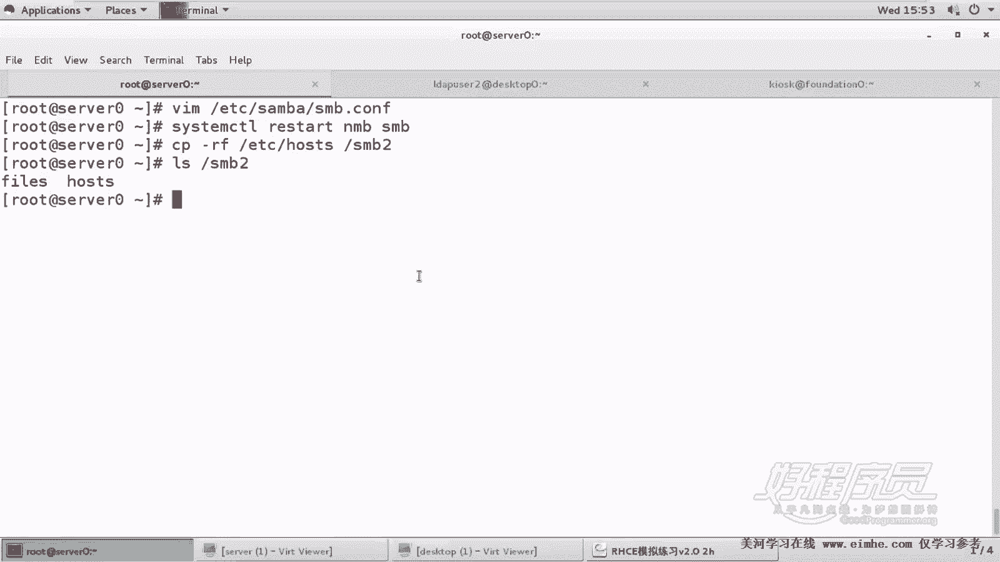
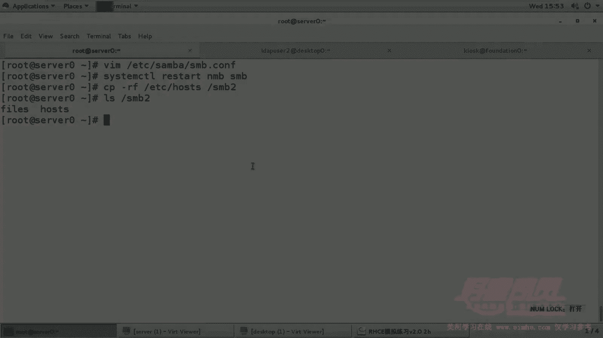

# RHCE课程：P6：Samba共享之多用户挂载配置 🖥️

在本节课中，我们将学习如何配置一个支持多用户权限的Samba共享。与之前简单的共享不同，本次任务要求同一个共享目录为不同用户分配不同的访问权限（读取或读写），并且客户端需要使用多用户（`multiuser`）模式进行挂载。我们将从服务器端的Samba配置开始，逐步完成客户端的挂载与测试。

## 概述
本节教程将指导你完成一个进阶的Samba共享配置。核心要求是：创建一个名为`382`的共享目录，允许来自`example.com`域的主机访问。其中，用户`ldapuser1`仅拥有读取权限，而用户`ldapuser2`拥有读写权限。客户端`desktop0`需要以多用户模式将该共享自动挂载到`/mnt/smb2`目录下。我们将详细讲解每一步操作及其背后的原理。

## 服务器端配置

上一节我们介绍了基础的Samba共享，本节中我们来看看如何为不同用户设置精细的权限控制。

首先，我们需要确保相关用户已存在并设置好Samba密码。同时，创建共享目录并设置正确的文件系统权限。

以下是具体的配置步骤：

1.  **为用户设置Samba密码**
    用户`ldapuser1`和`ldapuser2`应已存在于系统中。我们需要为`ldapuser2`设置Samba密码（`tianyun`）。
    ```bash
    smbpasswd -a ldapuser2
    ```
    输入密码`tianyun`并确认。

2.  **创建共享目录并设置权限**
    创建目录`/smb2`，并为其设置基础的权限和访问控制列表（ACL），以确保`ldapuser2`拥有读写执行权限。
    ```bash
    mkdir /smb2
    setfacl -m u:ldapuser2:rwx /smb2
    ```
    此命令通过ACL赋予`ldapuser2`用户对`/smb2`目录的读、写、执行权限。对于目录而言，执行权限是进入目录所必需的。

3.  **配置Samba服务**
    编辑Samba的主配置文件`/etc/samba/smb.conf`，在文件末尾添加新的共享定义。
    ```ini
    [smb2]
        path = /smb2
        hosts allow = 172.25.0.
        valid users = ldapuser1, ldapuser2
        read list = ldapuser1
        write list = ldapuser2
    ```
    *   `valid users`：指定允许访问该共享的用户列表。
    *   `read list`：指定仅拥有读取权限的用户。
    *   `write list`：指定拥有读写权限的用户。
    配置完成后，重启Samba服务使更改生效。
    ```bash
    systemctl restart smb
    ```

## 客户端配置与挂载

服务器配置完成后，我们转向客户端`desktop0`。这里的核心是以多用户模式挂载共享。

首先，确保客户端已安装必要的软件包（如`cifs-utils`），并创建挂载点目录`/mnt/smb2`。

以下是永久挂载的配置步骤：

1.  **编辑 `/etc/fstab` 文件**
    添加以下一行配置，实现开机自动挂载。
    ```
    //server0/smb2 /mnt/smb2 cifs defaults,user=ldapuser1,pass=tianyun,multiuser 0 0
    ```
    *   `user=ldapuser1, pass=tianyun`：这是初始挂载使用的凭据，权限较低的用户即可。
    *   `multiuser`：这是关键选项，启用多用户挂载模式，允许后续切换用户身份访问。

2.  **执行挂载**
    运行以下命令立即挂载所有在`/etc/fstab`中定义的条目。
    ```bash
    mount -a
    ```
    使用 `df -h` 或 `mount` 命令可以验证共享是否已成功挂载到`/mnt/smb2`。

## 多用户访问测试

挂载成功后，我们来验证多用户模式如何工作。在这种模式下，挂载点初始使用一个基础身份（如`ldapuser1`）建立连接。当其他用户访问时，需要向服务器申请自己的凭证来提升权限。

以下是测试流程：

1.  **使用 `ldapuser1` 测试读取权限**
    *   切换到用户 `ldapuser1`。
        ```bash
        su - ldapuser1
        ```
    *   尝试直接访问`/mnt/smb2`可能会提示权限不足。此时需要使用`cifscreds`命令添加该用户对服务器`server0`的凭证。
        ```bash
        cifscreds add server0
        ```
        输入`ldapuser1`的Samba密码。
    *   现在，`ldapuser1`可以列出(`ls`)共享目录中的文件，但尝试创建文件或目录时会失败，符合其只读权限。

2.  **使用 `ldapuser2` 测试读写权限**
    *   切换到用户 `ldapuser2`。
        ```bash
        su - ldapuser2
        ```
    *   同样，需要先为该用户添加凭证。
        ```bash
        cifscreds add server0
        ```
        输入`ldapuser2`的Samba密码（`tianyun`）。
    *   现在，`ldapuser2`不仅可以读取文件，还可以在`/mnt/smb2`目录中创建、修改或删除文件，这验证了其读写权限。你可以在服务器端的`/smb2`目录下看到客户端创建的文件。





## 总结
本节课中我们一起学习了如何配置支持多用户不同权限的Samba共享。关键点在于服务器端利用`read list`和`write list`进行权限划分，以及客户端使用`multiuser`挂载选项配合`cifscreds`命令进行动态凭证管理。这种机制允许单个挂载点灵活地适应多个用户的不同访问级别，无需为每个用户重新挂载，非常适合多用户环境。