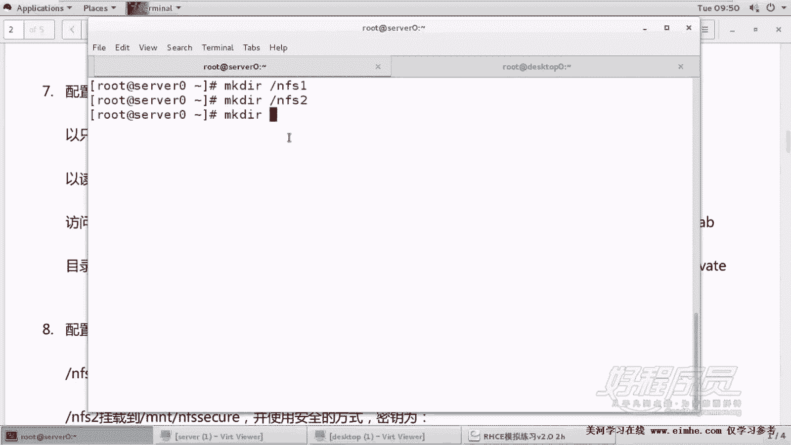
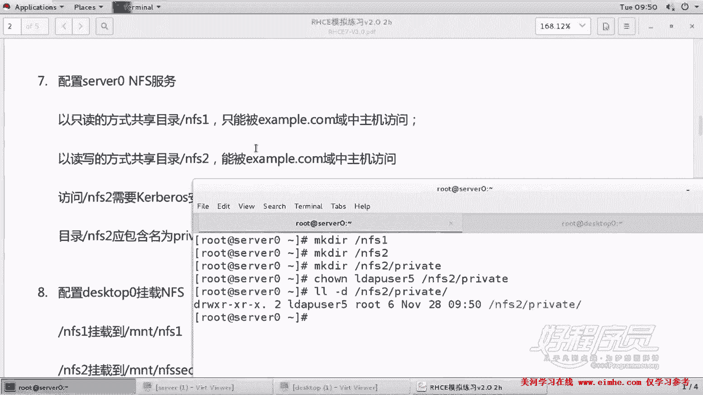
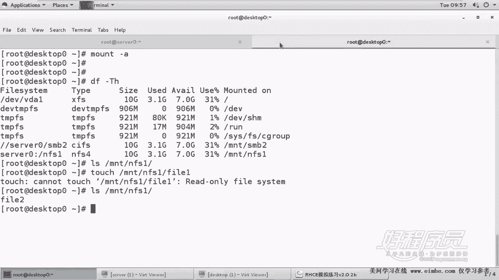

# 1. 杨哥rhce介绍及环境准备 - P7：7. Nfs1配置及注意事项 - 自普男 - BV1st411d7rF

好，接下来我们来学习那个下一道题啊，也就是。

NF。嗯，NFS呢这边一共是两道题。呃，这边呢首先是在s0上面配置NFS服务器，有两个共享，一个共享呢是共享目录是跟下的NFS1。只能被。example域中的主机访问。那么第二个共享呢叫根下的NFS2。

能够被example中的域中的主机访问。嗯，这边呢嗯这两道题呢我们要注意一下，它有一个是只能背，一个是能背。其实我们只要只允许example域中的主题访问就可以。但是访问第二个，也就是NF2的时候呢。

需要科verse的安全加密。那这边他已经给我们把那个K已经给我们放好了。所以我们稍后呢就在这边呢去使用K就行。另外呢在NFS2目录下面还包含一个叫private的一个子目录。

而且拥有者是lW user5。而且这个lW user5呢能够对这个目录进行写入。好，首先我们来准备一下这个环境。

一定不要做错，是在我们的这个。s0上面来做服务器在做。按照我们之前的步骤，第一步是装软件包。第一步是装软件包。当然这个软件包呢，其实客户端和服务器都要装。最后啊好，这个装好了。

那实际上在生产在那个考试的时候是没有装的啊，大家注意一点。好，然后紧接着第二步是配置。当然配置的话呢，我们需要准备好一些环境。第一，跟下的NFS1跟下的NFS2在考试的时候，一定要按要求去创建目录。

除此以外，在NFS2下面呢。

还有一个子目录叫做private目录。而且这个子幕录的所有者是LDIPus5。好，我们看一下这个目录NF2下的private5这个目录啊，那个private好。

他说那个Ld user5这个用户能够对该目录进行进行写入。那很显然没问题，为什么？因为它是所有者读写执行啊，都没问题。好，我们看看还有什么要求吗？

好，另外呢我们先来一个一个来做。虽然说这是两道题哈，但是我们呃我们一个一个来是一道题。但是我们建议大家这两个操作呢最好是一个一个来完成啊。第一个我们要共享的是NFS1。

它只允许example域中的主机访问。好，这个example域呢，其实就是你现在所在的网段。同样你也可以回到前面去看一下，也就是172。25。0。0-24这个网段。O。

好，我们开始来做。打开EDCR的exports文件输出文件。在这里面呢我们要共享NFS1。这个NIE的共享呢是。允许的是172。25。0。0。啊，0。0-24这个网段访问。他的权限。他的权限这边呢。

是只读的方式RO。SYC同步。嗯，这边呢我们要注意的是。这个IP和这个网段和后面的权限选项共享的选项是不能加空格的。要注意，这是这一个啊。好，我们先来把这个一个一个做一下。

然后之后呢，共享好以后呢，我们启动NFS服务。

当然如果说你有这个绝对的自信的话呢，你可以把两两个题一起做也没关系。因为最后我们启动服务的时候呢，只需要。启动一次啊启动一次这个符啊好，先在一个一做也可以呃，system controll。

然后是我一般喜欢是restar NFX杠 server。好，并且将其设置为开机启动。

嗯，回顾一下第一步是配，第一步是装包，第二步是配置配完了，环境也准备好了。第三一步是那个启动设置为开机启动。因为我们整个考试是要在。开机以后呢，需要重新需要重新去。生效的。然后紧接着呢我们还要去。

配置一下防火墙。这个防火墙配置呢，我们在前面的课程前面的这个题当中呢，我们采用的是图形化的方式。当然也可以采用。命令行的方式来配置。杠杠perment杠杠ADD。Service。NF。好，那么这里呢呃。

我们加一个这个NI就可以了。这是我们的这个服务。然后。将防火墙reload，这样的话它才会在当前生效。好了，这个题其实是不需要来配置。Sin好，所以我们只要在这边做好就可以。如果想测试一下。

当然测试的话呢是需要第八题。各位看。

第八题，我们在desktop上面来测试，将NFSE呢挂到MNT下的NFS1。好，我们一个一来做。我这么之所以这么写的，是因为考试的时候，它确实是这么来出题的。它两道题出到一起的，然后这是服务器端。

这是客户端。但是我们在做的时候呢，可以分开来做。我的脚本在检查的时候呢，也是按分开检查的啊。

在客户端这边，我们要装NFS杠。UTLL这样的话才能够支持。NF这样的稳件系统。好。紧接着呢我们创建创建挂载点，它要求的是挂到MNT下的NFSE这个目录。好。

然后编辑EDC下的FStableable文件，我们永久挂载。在这边呢。NFS和sma不一样，上面的这个是sma的这样一个一个目一个这个挂载的一个设备这样的一个类型。NFS呢我们使用的是s0。

它下面的NFS1将它挂到MNT下的NFS一类型是NFS。

然后呢，这个。Deports。不备份不检测啊，当然不需要上面加密码了啊。好，然后作为客户端来讲的话，这种基本的NFS是不需要启动任何服务的，所以只需要了mount杠A。就可以。

各位看我们来验证一下这个挂载的情况。

DF杠TH。好，各位看到我们现在呢已经已经这个。挂好了这样一个目录，我们然后访问一下这个目录，看一下。我们在这里面尝试去。建立一个文件看一下答案是不可以的，为什么不可以呢？因为我们在这边共享的时候。

我们是以。我们也可以查看杠V可以查看我们当前输出的NFSE这个共享呢，它是以只读的方式共享的，而且是root squ，也就是会压制root。就算对方挂载的时候使的root挂载了也会压制。

那如果我们在这个目录下面放置一个文件，放置一个测试文件fi二这个文件。哦，这是我们自己。哦嗯NF下面放置一个fi2的文件。好，来到我们客户端那边看一下，能不能看到。好，能够看到。

那么至少说明呢我们的这个基本的NFS呢已经okK了。好，所以这道题，我们虽然说考试的时候是这样来出的七和8两道题。呃，一个是这边七呢统一的考的是服务器端的，怎么去共享。然后八呢考的是。

这个客户端这边怎么去挂载？

嗯，如果说你平时练习的时候呢，你可以把这个实验稍微深入的做一下。呃，或者说你你更加想验证一下的话呢，你可以这样来验证验证一下就可以。就是。第一，把这个共享目录，把这个网段改一下。

然后重新启动一下NF服务。当然考试的时候呢，就不会找这个麻烦了啊，能够简单最好。好，已经挂掉了一个。卸载掉，然后再mount杠A。大家看到他这边告诉我们访问deline挂载失败，这个正常了。

说明我们的访问控制呢是起到效果的。当然我再说一遍，考试的时候呢，一定不要给自己找这些麻烦，能够简单的化呢就简单化。好了，okK这第一道题，这就OK了。那你做好一道题的话呢，就会有相应的这一道题的分。

最好做好以后呢，去检查一下。

