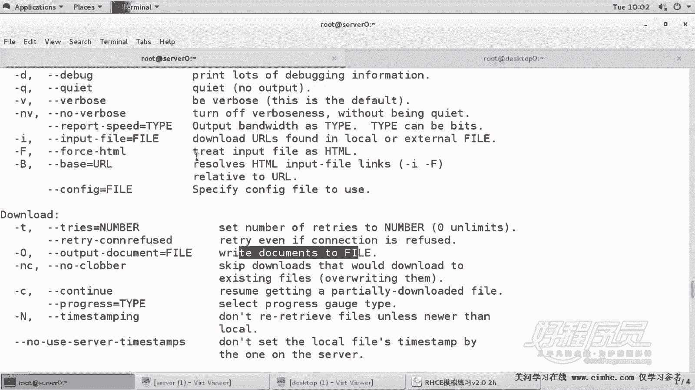
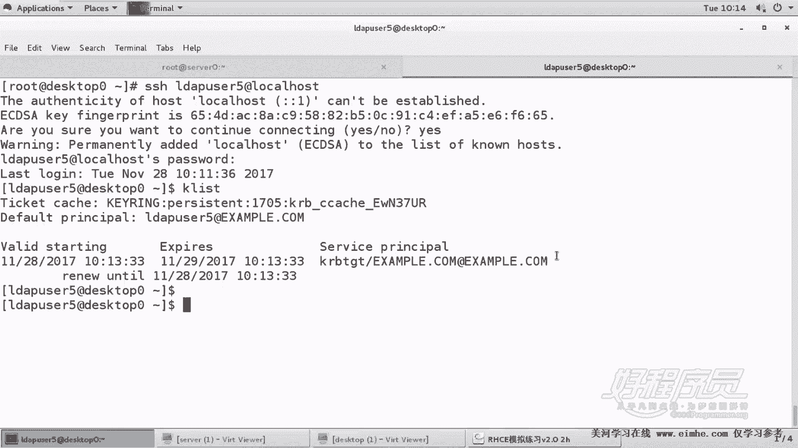

# 1. 杨哥rhce介绍及环境准备 - P8：8. Nfs2基于kerberos安全认证【小心】 - 自普男 - BV1st411d7rF

好，那么我们接着来看第二道题啊，也就是嗯。

使用加密的方式，使用科verse这种安全验证的方式来进行这个加密加密的一个访问。那么前者呢，我们是基于。基于主机的访问，而后者这边呢是。相当于基用户的访问。因为只有经过了coverse的这种一个验证。

身份验证才能够的去访问到。好，这边呢首先给出了服务器，我们这个目录已经准备好了，根下的NFS2，并且呢在NFS2下面呢，我们已经准备了一个叫priva的目录。子目录啊。

并且已经允许有d user5作为它的拥有者，它可以进行读写。这是我们最终要验证的结果。那首先呢这边我们要copy一下这个key，因为我们要下载这个key。

在服务器端。我们使用这个W get这个命令。如果没有w get呢，大家把这个命令装一下，像这样。W get装一下就可以。好，dou get后面我们跟以上这个。跟上这个文件，注意这里呢有一个选项。

太多的人会犯错。这边是大O。很多人就会写成小欧。放到哪个地方去呢？我先给大家用小O来试一下啊，大家看到EDC下的，我们叫做KRB5点Ktable。这个名字不能变啊。

这是KRB5的1个keytable文件。如果说你使用小欧的话，注意就一定会错了。我们分别呢使用大O或小O来给大家验证一下，看正常的情况下使用大O。你使用大O的话呢，它会提示它已经保存到了这个文件。

并且呢下载成功了，连接到成功。这个这一段消息呢是纯粹输出的消息。那么另外呢，这个ETCKRB5Ktable文件呢应该也是正常的。系。

RB5，但这个文件大家不要尝试打开，它会显示乱码啊，这是正常的。

这是一个标准的K。那如果说你使用了小欧会怎么样呢？看一下，我们现在把这个文件删了啊，EDCR的KRB5K table小欧的话会怎么样？KRB5。可。でぼ。哦，不是这样的，删完了已下删完了没有？删完了。

对，然后再重新下载，使用小O。好，细心的同学可能看到了屏幕上没有做任何输出。因为W get呢它有一个它有两个选项，一个选项叫做。

嗯，叫做这个小O，一个选项叫大O。

怎么这么不好找？

大O表示输出到一个文件，也就是写到一个文件里面去，把我们下载的一个文件相当于写的保存到一个文件里面去。而小O是干嘛的呢？输出fill到一个文件，输出什么呢？logo message也就是整个下载的过程。

那么刚才我们看到整个下载的时候，屏幕上没有显示任何消息。那是因为现在呢这些所有的消息呢是保存在这个文件里面去了，看了吗？这整个是个消息，这玩意是没用的。那么真正那个文件在哪个地方呢？

在这儿在当前目录看到吗？当前目录，其实我们要的并不是下载到当前目录，而是什么？下到。插到相应的文件里面去。好，所以。这边我之所以多说几句。是因为很多人在去做这个题的时候，非常容易把这个变成小O。

那么这个结果就是错了。如果说你实在不知道大偶小O怎么办？你情愿把这个东西下下来，然后再拷贝过去，可以啊。好，我们再次。下载。好了，然后okK这是服务器端。那么刚才的目录我们也准备好了。

然后我们就开始来共享EDC下的exports。NFS2目录这个目录其实它并没有严格要求说谁可以访问。它只是说这个172。25。0。0网段可以访问。而且是什么方式访问呢？是读写。

读写的方式访问，我们看一下题目的要求。嗯，以读写的方式共享NFS目录NFS2能够被这个域中访中的主机访问NFS2需要科verse验证。密钥是这个。那我们下面呢。

光这样写还不行，这边这样写的话呢，它表示传统的共享。我们还要需要在这里面加上这个co验证的这样的一个方式。这边我们使用一个叫SECC等于KRB5P。我们使用这样的一个安全加密的方式，cropo验证方式。

那当然在稍后在对端呢，我们也同样需要什么呢？在对端我们也同样需要这个使用相同的方法来挂载才可以。好，这是一步。那么还有几个步骤是要做的。第一个是下载P，第二个是呢共享。

第三一个是打开EDCsscom figure下有一个叫NFS的文件。各位NFS的文件。在这里面呢找到一项叫做RPC。NFS。arguments也就是可选项取那个可选的参数这个位置。

在这里面我们要使用杠V4。2这个版本。也就是使用NFS的这个NFS这是多种协议。在之前CSA的时候，我们大家应该记得我们挂在那个客户端加的时候呢，使用的是V3版，这个是V4啊，V4版本，我们使用V4。

2这种方式。好，三个步骤，大家来看第一个步骤呢是下载。去当load key。第二个步骤呢是把刚才那个文件改成V。杠V4。2版本。第三1个步骤呢是在共享的时候，在EXport。里面共享的时候呢。

我们用到的1个RWSYC同样用到了一个选项，叫SEC等于KRB5P。注意这三个选项，这三个动作。好，做好以后，我们来启动服务。启动服务restar NFS杠 server。那这里要注意的是呢。

我们的这个安全共享启动的服务呢，还有另外一个服务叫做。NFS杠。Scurt。sever这个服务，并且也要将其设置为开机启动。如果说你忘了这个服务啊，你可以一块儿来写一下。好了。

那各位大家一定要仔细看一下，一当key第二改文件，改4。2的这个协议。第三，输出的时候来使用KRB5P。那么当那个K的时候要特别小心，因为你很容易。把这个东西搞错，你使用小欧。

如果说你实在不记得小欧大O的话呢，你还不如正常的荡下来，然后再拷过去。但是名字一定要叫叫KRB5K table这个文件。好，至于防火墙，那就不用再做了。因为我们的第一道题已经将防火墙做好了。好。

我们来到第二来到这个客户端这边。来到客户端这边呢，我们首先也需要也需要这个K文件。当然这个K文件不是服务器的。大家看啊，每一个机器呢都有相应的这个K table，所以我们在客户端上呢。

也同样去下载这个K table文件。

大家可以看清楚是客户端douge。如果没有这个命令的话呢，我们去装一下。杠O大OEDC号的KRB5点KEYTAB。好，这个仔细看一下是不是对的。好，然后紧接着呢我们编写X嗯，我们先要切个目录，对不对？

他要求的是。

将这个NF2了挂载到哪个地方？哦，挂到MNE下的NFS screw下面。OK这个要注意。

当然，考试的时候，一定要严格按照这个要求来做，这个不能有半年。

商量的余地啊。s0下的NFS2挂到MND下的NFSSCCURE类型是NFSdefas各位，这个时候defas就不行。因为我们还需要什么？我们还需要增加比方说V4。2这个协议。

同样呢我们还需要使用安全的选项SEC等于K2B5。注意科verse的这种加密呢，这是很多种方式，包括K2B5K2B5P，但是两边必须要对等要一样才可以。然后后面呢不备份，不检测。好，各位仔细看一下。

第一，前面呢是一样的，就是挂在选项上面呢加了1个V4。2，同时呢加了一个。验证的方式。好。那这里呢我们首先将其客户端，大家看啊，不能够直接挂载，客户端不能直接挂载客户端它是要需要启动一个服务的。

它也要启动一个服务。大家注意在前面我们那种常规的NF共享的时候是不用启动服务的。但是这边呢我们要启动服务。这个服务叫什么呢？叫做。NFS security。将其开始启动。这是特别容易出错的地方。

各位在服务器端叫做NF server或者NF server杠那个scur server在客户端叫什么呢？叫NFS security啊，它不需要启动那个NFS的常规客户端。好，然后我们。

尝试挂载。好，这边呢我们看到他说有一个不正确的选项。在那个位置指定。好，我们看下是不是一个不正确的选项。哦，这里的V4。2，大家注意这个V4。2的写法，我们是写的有问题。是这个V4。2的。

在刚才在那边是大写的V，这边呢是小写的V啊，在我们的FStable里面呢，它不支持这种大写的V啊啊，所以报了一个错误，就是。一个不正确的一个Y选项。好了，嗯，如果这道题成功的话呢。

我觉得你你说明你真的很仔细啊，真的很仔细。DF杠TH当然我们还没有表示成功。

我们来验证一下mount回车，看一下NFS2的挂载，它的挂载方式V4。24。2版本。另外呢它的一些其他的安全选项是KRB5P。好，这也没问题。客户端地址，这没问题。我们要进一步测试，进一步怎么测试呢？

这个测试呢注意有两种测试方式，一种是切换到ld user5上面去。这个用户上去切换过去以后呢，大家看一下它看得到挂载吗？大家有可能看到他连MNT下的NF fastcur这看都看不到，为什么看不到呢？

因为这里的这种测试方法是错的。为什么是错的呢？因为你现在这个用户我们只是切的时候并没有输密码。换句话讲，只有你输密码，有这样一个输密码的过程，才能够使用cverse验证。

而只有使用cverse验证以后呢，这个用户一旦使用croverse验证，它才会给你颁发一个票据，然后你才能够通过这个票呢，这个K这个ticket去访问什么？访问我们的这个服务器上的这个共享。

因为第二个共享不是常规认证访问的，是必须要拿到这个croverse的认证以后拿到这个票据才可以访问的。那怎么处理这个问题呢？有两种方法，一种我刚刚讲过这种测试方法呢，其实很麻烦。

所以我们不如采用什么方法呢？采用这种方式SSH我们以ld user5登录到本机。然后密码呢是多少呢？这里的密码各位这个密码可不是常规密码，是什么密码？是cober密码，各位是cober密码。

那么在考试的时候，他会明确告诉你这个用户的科verse密码多少，在哪儿告诉你呢？一般会是在前面这个位置，在前面这个考试的环境里面会告诉你。那我这边没有告诉你，我这边就。

我现在告诉你也来得及，我密码多少呢？就叫coverse。

KERBEROS好，我再说一遍，你只有通过登录才能够得到科博的一个验证。你要是不登录了，拿不到科验证以后的那个票据，所以保回不了正常的。好，这边呢我们说说科波KERBEROS。

我刚刚说的密码是KERBEROS科，也就是西西西方神话当中看守地狱的那个三头狗的名字。科verse啊。好，这是一种验证的一种机制。好，然后紧接着呢大家看一下K list，我们已经拿到了一个票。

拿到了一个ticket，有效的这个时间是什么时候，然后过期这就是科给我们颁发的一个票据。就相当于你要去游乐场里面玩的话呢，你不能直接去做旋转木马，你也不能去坐过山车。你应该先买一个票。

而买这个票呢是需要得到身份验证的。好，然后我们再来看一下这个挂载的情况，大家看到就能看到，并且我们要测试的是什么呢？我们能不能在MNT下的cur下面的嗯。

嗯，那个叫pri里面新建一个叫做随便一个文件。好，大家看到答案是可以的。来再来到这边，我们看到咱们看到NFS2下的private下面。

好，阿S2下的pro下面已经有这个文件，这就说明什么呢？说明我们的整个是成功的。

那刚才有地方大家可能不太明白啊，就是因为验证的方式没有没有拿到票。那我们现在重新给大家再来退出以后呢，再来以之前的方法登一下，看看。当然各位看到这个登过来以后是没有拿到票的，因为你没有验证啊。

你没有输密码，所以没办法去验证，因此呢我们看到这边哎也能看到，是因为可能已经拿到过了。我们看是不是拿到过了。可以list就是刚才你拿到货的对。呃，所以采用这种方法就可以，或者是呢采用什么方法呢？

叫KNIT它会强制让让你呢去拿到这个票。我们再输入KERBEROS这也是可以的。

换句话讲，如果说你使用SU这种方式切换，因为我们知道从管理员切到普通用户是不要密码的，然后我们可以再重新KIIT去初始化一下，拿到这个由科ber验证以后颁发给我们的这个票，因为我们只能够凭票去访问共享。

或者是呢直接使用SSH的方式，也就是这种方式来登录，那么他就会直接要求你呢来验证，并且呢最后拿到这个票，所以这道题呢很多人最后在做的时候做不出来。这里呢除了不小心其实还是不小心。

包括刚才的杠大小额的问题，也包括还有一个是什么问题呢？两边起的服务不一样，这边起的是带有s的，看到吗？s的 server，而这边起的服务是不带s的，就叫做。就叫做什么呢？呃。

NFS杠SECURE这种方式。然后。🎼所以两边起的服务各位是不一样的，要注意一下。

