# 1. 杨哥rhce介绍及环境准备 - P9：9. Team配置测试及注意事项 - 自普男 - BV1st411d7rF

好，各位我们接下来再看下一道题。那这道题呢第九题要求的是在两台机翼上做链路聚合，使用ETH1和ETH2网卡。然后当一个接口失效的时候呢，另外一个接口呢还能够继续工作。嗯，这里呢给出了两个机器的IP。

就是两个机器电路聚合以后，接口的IP1921680。1和1921680。2。这个题其实非常简单。但是呢嗯我们有一些问题，什么问题呢？

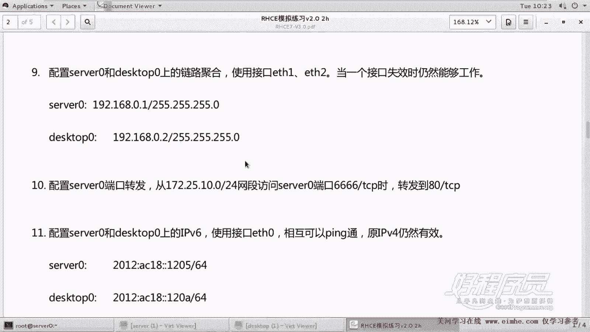

我们这个题呢在做的时候需要先准备一下环境。因为在我们的这个练习环境当中，现在大家可能看到这个机器上没有那么多网卡，只有1个ETH0，没有ETH。

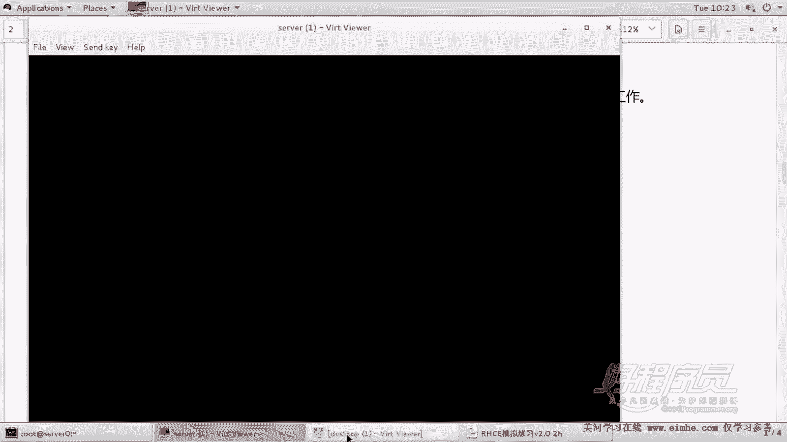

没有一天是一和一天是2啊，所以这个怎么做呢？好，我说了，我们需要手动准备一下环境。这个大家不要担心考试的时候所有的环境都是已经帮你准备好的。我们这边由于是练习环境，所以每次大家手动玩一下。好。

我们打开重新打开一个终端。

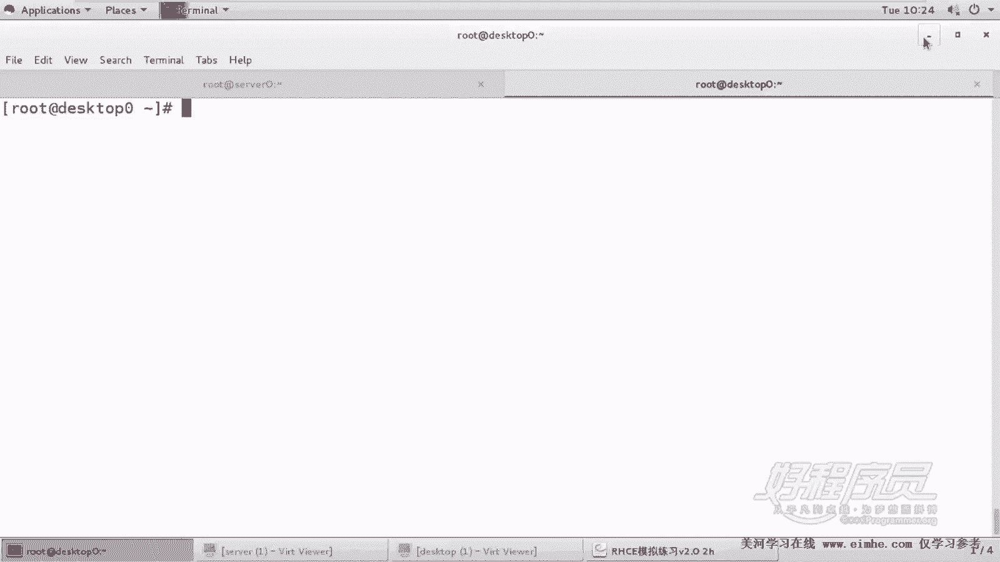

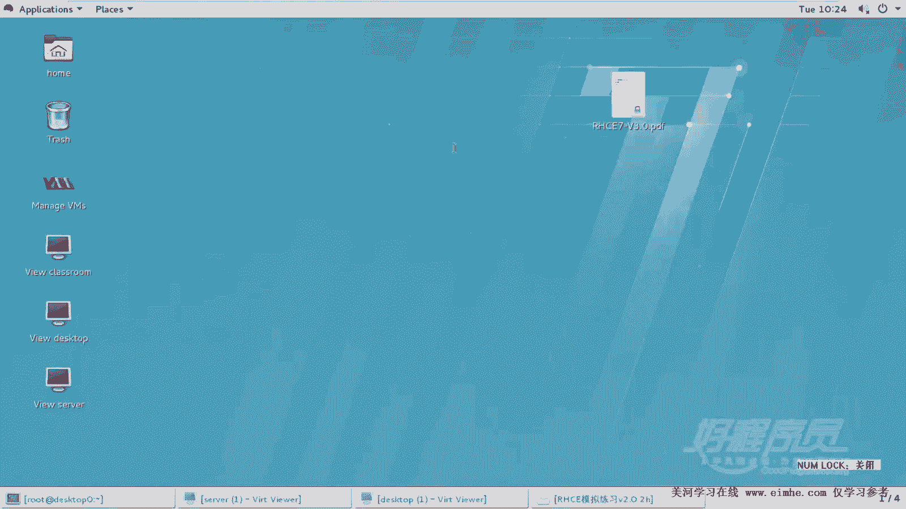

这个终端呢我们在这里面呢运行一下。VRT杠manager有打开我们的。虚拟化的管理工具。这边呢不是说一定要掌握，但是由于我们现在没有练习环境，那所以。必须得整一整。由于我们使的是普通用户打开的。

所以需要输一下密码，这个密码呢是管理密码，叫杨哥杨哥。嗯。好，这边我们所操作的就是虚拟机。如果有虚拟化经验的同学应该知道啊。当然我们需要现在在两个机翼上加两块网卡，怎么加。

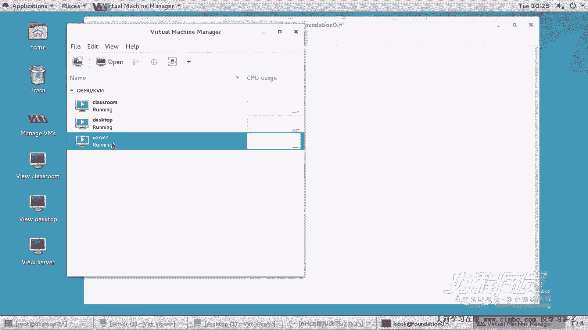

嗯，320。

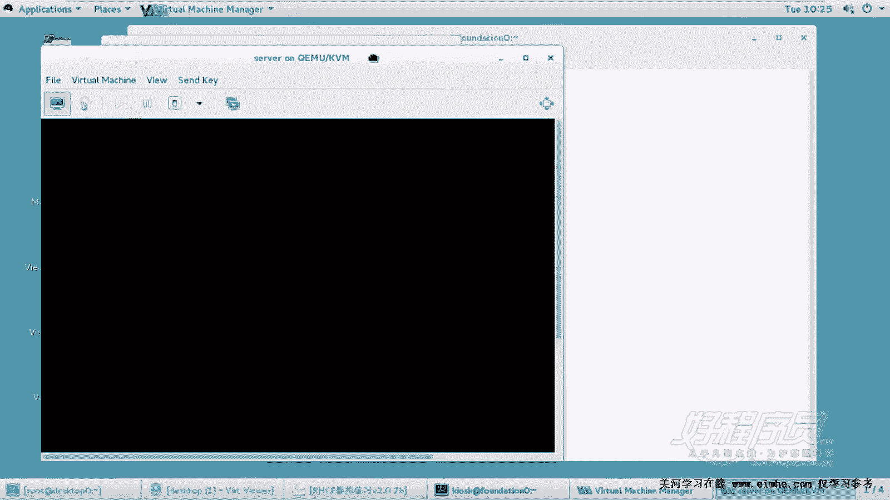

点击这个小灯泡，然后点击添加硬件，然后找到网卡。呃，这边呢由于啊由于。由于我们这个。虚拟化的一些东西啊。我们在这边呢如果采用这叫watIO的话，那也就是半虚拟化的方式的话呢，那么加完以后它的网卡的名字。

网卡的名字可能就不是E天指名，可能是什么ENPLS几啊这样的名称。所以我们使用这种全虚拟化RTL8139或者其他的1000网卡都可以。啊，我们先加一个看看啊。好，加了一个。我们打开这边的。环境看一下。

好了，E天11过来了，没问题，那再接着加呗，加两个。考试的时候，这些东西不需要，因为已经帮你准备好了。好，我们使用1000或者是8139的驱动，也就是这种全虚拟化驱动。好，关掉，这是这台机器。

那对于destop那些机器呢。添加。网卡。1000啊阿迪839统18239吧。这都是一个全虚拟化的这个网卡驱动。好了，那这边我们都已经把这个网卡加好了。我们刚才行使管理员这样一个权利就结束了。

回到服务器这边。好，ETH1和ETH22个网卡目前没有任何的信息，然后这边也是一样。ETH1和ETH2这边我再强调一遍。考试的时候，其实这个网卡已经准备好了。而现在呢我们要在物理机上面。

我刚才那个行为是在物理机，也就是最外层基因上行使杨哥管理员的权限，才实现了这样一个动作添加。啊。如果你不熟悉的话呢，你可以反复的看下这一段。考试的时候一切就绪。现在呢我们只需要在练习的时候。

需要先做添加，然后再来做题。好，那怎么做呢？用NM collection editor，也就是使用图形化的方式。然后我们使用图形画的方式呢，添加一个新的一个配置，新的一个配置添加。

这个地方添加的时候选择连接类型，我们选的是最下面这个team，也不是最下面。找不着？大家看到我们这个图形远程连接还是有问题，这可能跟我们这台这个7。3的这个环境有关系。所以呢那怎么办呢？

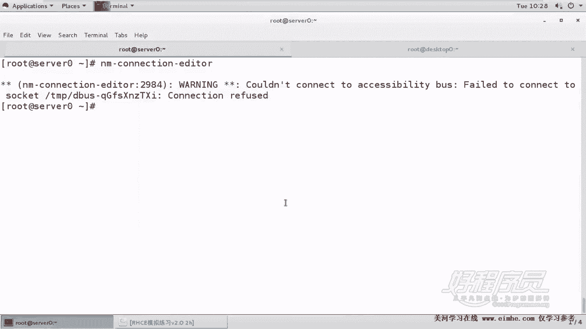

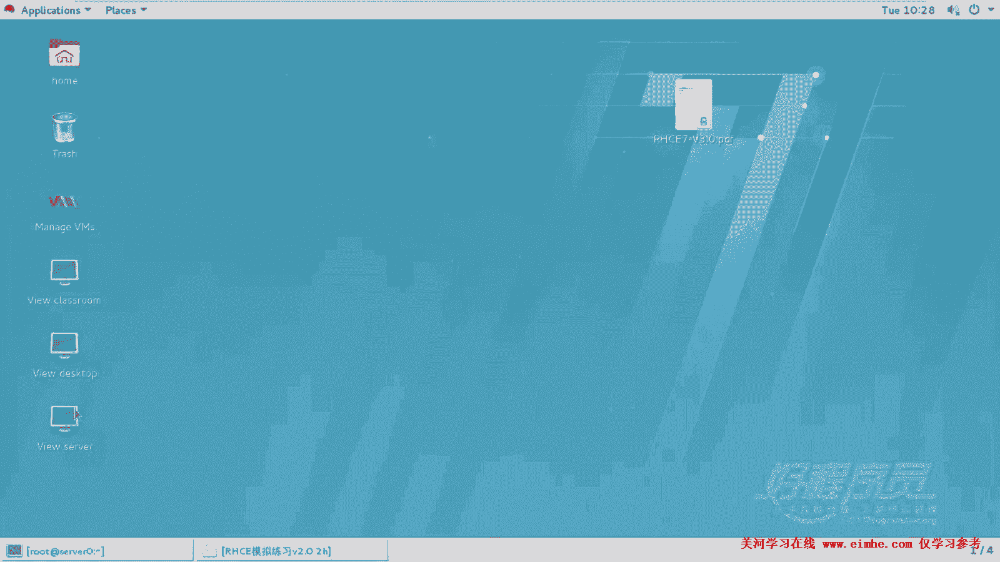

没关系，这个之前我们也遇到过，如果真的遇到问题的话，你来到这边来做这边来做的话也要小心，因为考试的时候是没有默认，没有开图形的。你可以进入到这个命令行以后，敲一个star X。

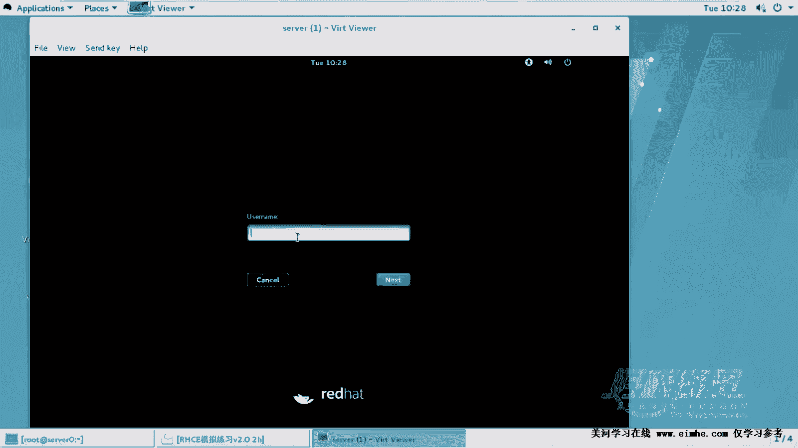

S。大X还记得吗？各位。STARTX这个命你启动它就可以。

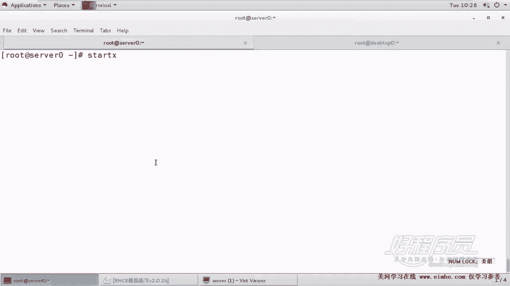

好，当然这边输入root。密码是。Red hand。好，我们直接在这边来做这个网卡的这个。Tim。同样这台机器呢当然也要做，最后是两个都能拼得通。

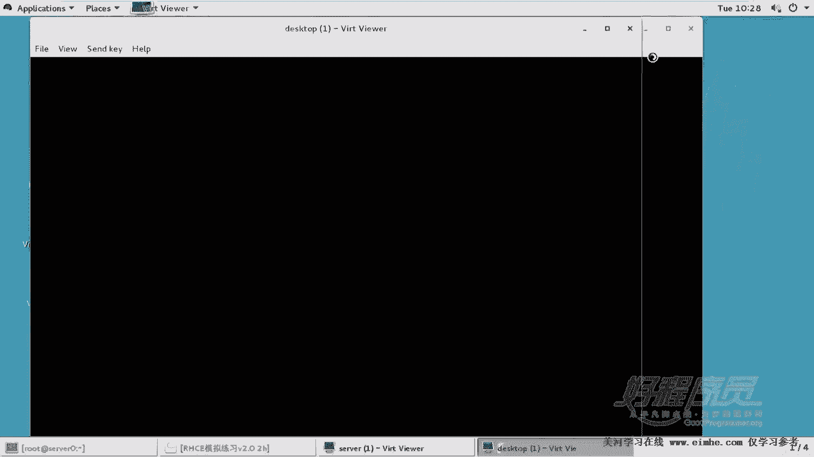

N杠col edit这里最可怕的是，大家不小心把那个IP地址配错地方了啊，就是本来是给A机器的，你配到BB级上去的，这可怕好，不用选中它啊，这是我刚刚点了一下，不用专门选中，然后选择下面的这个。

Team。有点类似于之前我们在6当中的那个boning，但是这个team呢比boning的功能要强一些，创建一个team。然后这边呢team的名字呢嗯考试没有要求，你看他就没有要求，没有说除非有要求。

他如果有要求说team叫什么，那你就叫什么。这没有要求，所以我们就可以就叫做。

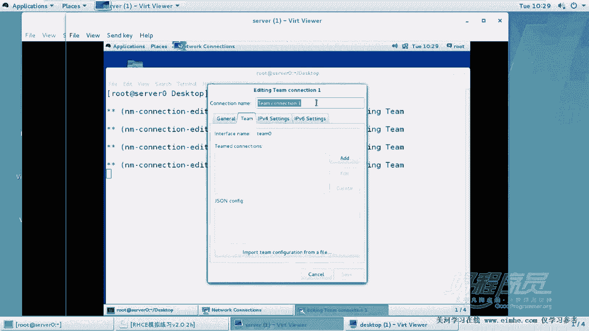

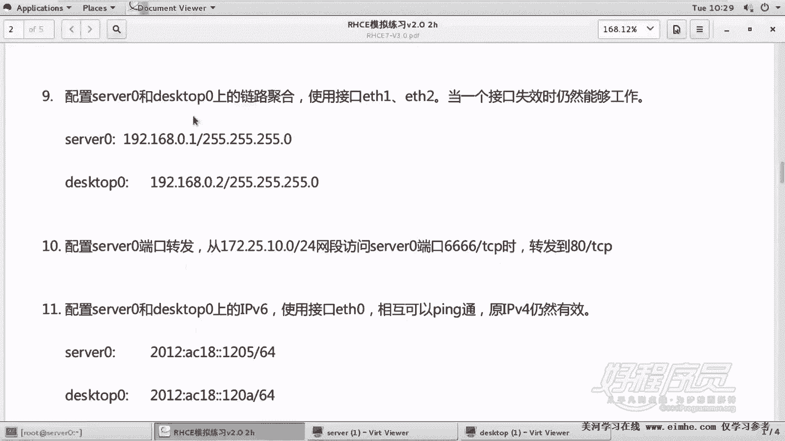

team0好记，然后呢，接口名字也叫team0。然后首先注意，第一，选这个这边一定要开机自动连接，就自动连接啊。然后第二呢，team这边呢，我们这是一个team，它是一个逻辑的一个逻辑的一个配置。

逻辑的一个接口，我们还要给它添加真实的物理接口。我们点击这边的添加。那它真实的接口呢，可能就是it太网接口，ealet接口，好，找到这边的ETealet创建。好，同样先选择自动连接。否否则网卡不会激活。

然后再选择ETHE，然后其他的不用选了，保存。然后再添加这个以太网接口，然后选择。一天是2。保存。然后紧接着呢，我们看到IPB4这边呢要改成手动。

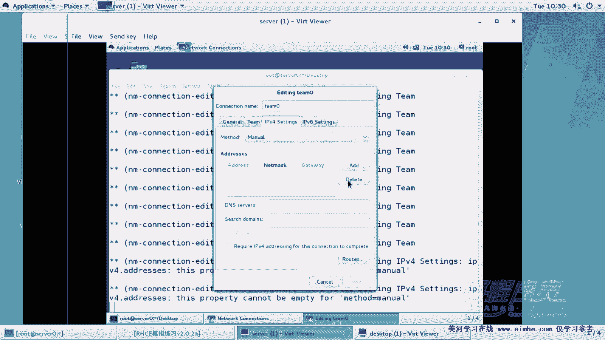

点添加。好，各位看清楚，一个是1921680。1，一个是0。2，这个是192。168。0。1。

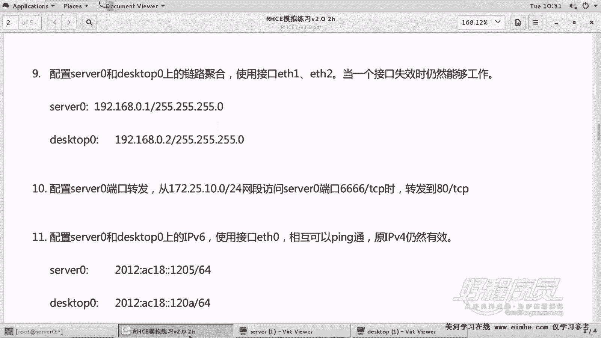

啊，他默认是24。这个24也可以啊，没问题，24也可以啊。然后网关DNS都没有，然后点击这个。啊，先点一下先等一下点保存。因为这边还有一项没有设置。

就是这个jasonjason里面呢要决定了这个这两个接口，他们的一个关系。这个team的关系到底是两个做负载均衡，做做负载均衡呢？做load balance呢，还是做高口用，也就是一个一个网卡出的问题。

然后由另外一个网卡来替代。那这边我们要做的是。做的是这个叫什么？做的是这个高混用。因为题上要求的是当一个接口失效时，另外一个仍的工作。好，这个jason呢它的写法大家注意大括号。

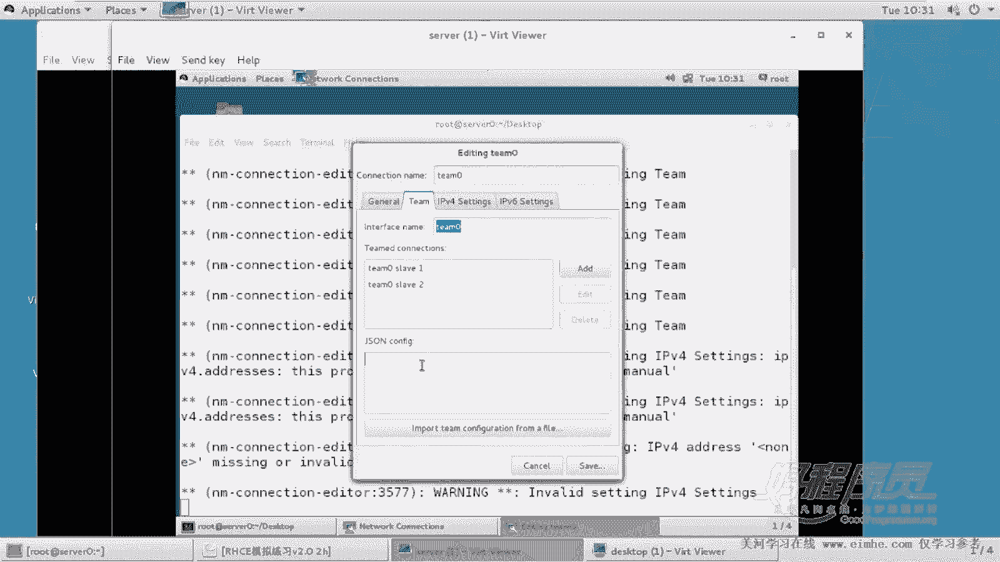

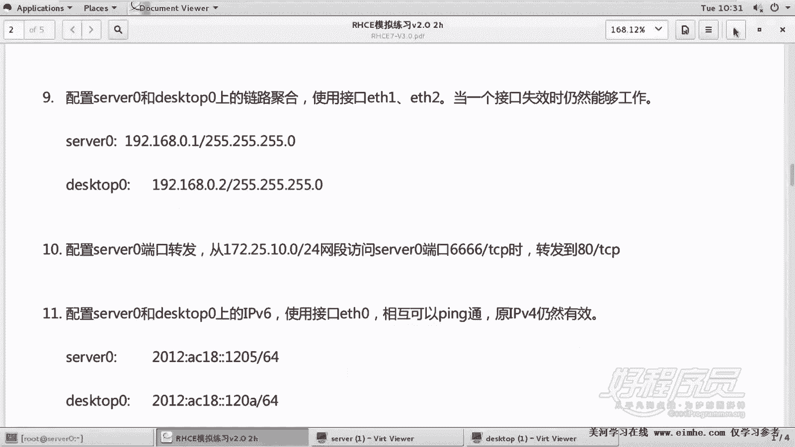

是rollner，它是1个KK86的形式RUNNERrollner是什么呢？这里面又是一对一对那个冒号。KY6的值。ね？冒号active back up。各位看一下是runner。

一个大括号里面runner keyK的名字叫runner运行运运行的方式。然后呢值呢是name冒号act back up。那这里呢我们要将所有的这个英文字符呢引起来双引号引起来。一开始呢我们。好。

冒号引起来。引起来。引起来。拎起来。好了，各位检查一下这些地方，runner冒号大括号里面是一对KKKY6的形式，name active back up to备。

这要决定呢这个team的工作方式是什么呢？是这种主备的方式。然后。还有一定要记住，就是每一个接口，它一定要设置为什么自动连接IPP4确定没问题的话呢，点保存。好，我们新建了一个team接口。

如果正常的话呢，我们应该能看到它的IP地址。各位看到已经看到tam的IP。如果说你没有设备自动连接的话呢，你就看不到。那没关系，你一种选择是把它重新删掉，再来重新建一下，这个都是可以的。好，怎么验证呢？

IPA这是一种方式看IP我们还可以使用。Tam。control呃，team这个team d controll，后面加上team你。他的状态。STAT也行啊。

状态各位看到当前的运行的方式是active back up，而且呢是这边是两个接口的，当前都是up up up的状态。好，按照同样的方法，我们来做第二台机器。

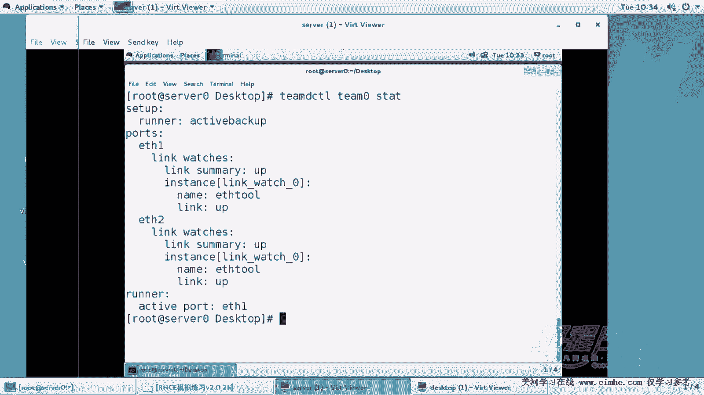

第二台机器呢，我们已经加好了两个网卡，怎么加网卡的话呢，大家可以反复回去看一下。呃，价网卡我刚刚一直强调，它只是我们在练习的时候的一个事情，考试没有这个动作。而且当然加网卡。

我们也是需要得到真机的权限的，管理员权限才能够加网卡的。

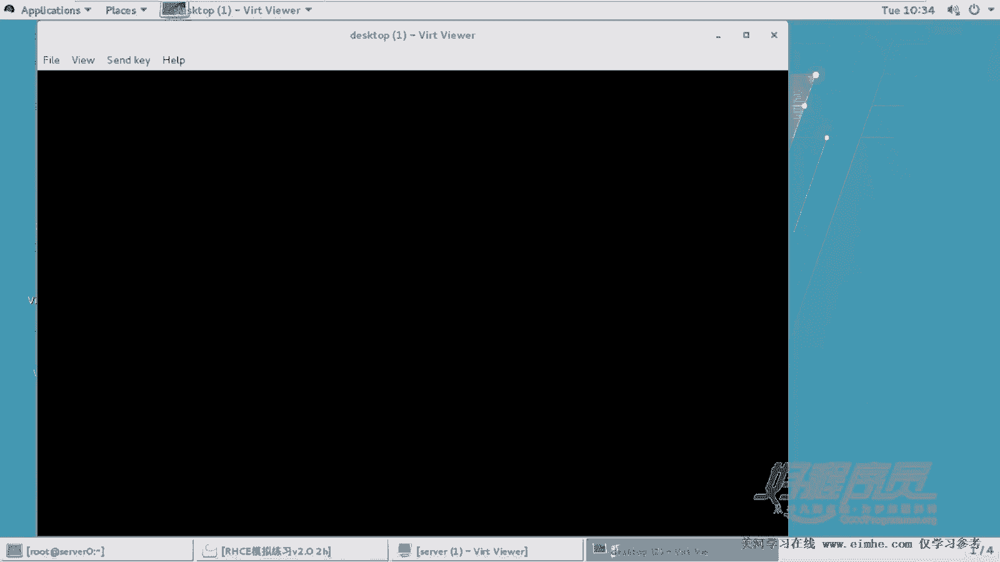

这个题本身是很快的，但是由于呢有两个原因，一，我们加网卡。第二呢，由于我们这个7。3可能有一个bug，所以呢就是它的环境有一个bug啊，不是7。3的bug。然后我们远程连接有问题。

所以导致一定要跑到这个图形化界面里面来做。这个本身就挺过分的啊。NM杠collection editor。然后添加一个逻辑的一个连接，叫做team。这个tam里面包含两个以太网连接。好，注意。

检查一下这儿。这儿这边依次填。以太网接口，这里面是以太网接口。然后以太网接口呢，很多人会忘了这个地方网卡选ETH1。保存。以太网接口。然后这里面呢是ETH2。保存。

然后这里面的这个jason呢决定了他们的工作方式是冒号呃那个括号。我一般习惯先写完，然后再写这个引号name冒号。r to back up以后引起来。银行引起来。银行引起来。银号引起来。你号。你好好。

然后紧接着呢IPV4，我们将其设置为手动添加1个IP192168点。0。2掩码是24，默认okK这个没问题的话呢，你就点确定就行了。好了，我们来看一下这个结果。好，刚才忘了不好意思啊，忘了改他的名字。

忘了改名字了，这个也其实也没关系。因为为了改忘了改名字的话，当然这个能不能再改一次呢？编辑那再改的话呢，就是上面这个名字PEM。好，最后我们看IPAA看到下面呢有一个team0，它的IP是0。2。

这两个接口是没有IP的啊。然后再看通过TMD。CTL然后是team0。好，大家看到它状态是正常的。其实现在我们只要做好的话呢，就可以远程的连过来看了。来，我们远程的看一下这个结果，一IP有。

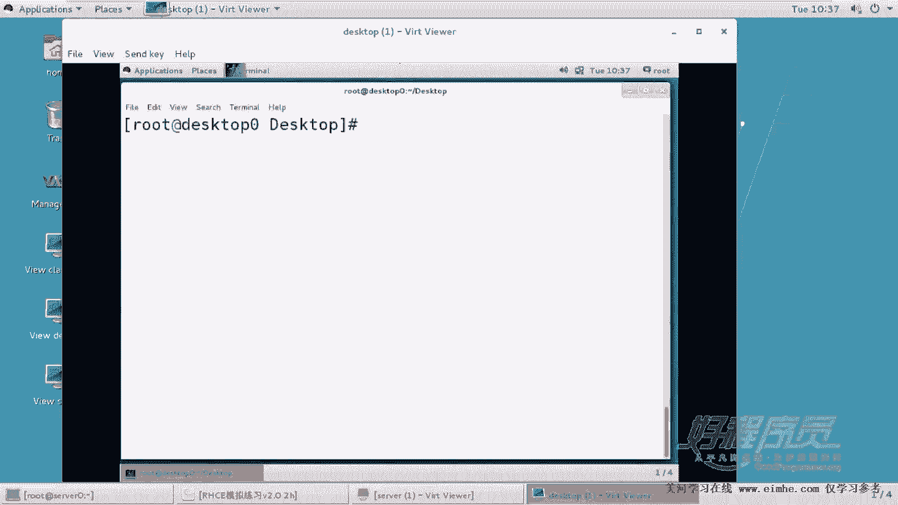

0。1。第二呢，这边呢也有0。2，然后再通过。team D controll。正常。好，正常，然后最后再拼一下192168。0。1自己，然后0。2呢远端没问题，这边呢也再拼一下。192168。0。

正常0。2正常好了，那么这个题就算做正确了。这边要特别说明的是呢，我们刚才修改的这些文件，就是创通过图形化做的事情，其实啊其实是在。这个地方。看一下，刚才就是这三个文件，一个是team0。

还有它的接口sn一和sve2，我们不妨打开这个文件看一下team0。好，这边呢它的team的配置呢就是这个jason，但是这里是对双引号是要加那个反斜线转移的。

反斜线转译rolller冒号lemb冒号act back up这种方式。然后它的设备类型是team，然后它的IP。还有它的名字叫team。另外呢我们的这两个子接口。sn一。好，各位看到他的地址。

他的这个它是属于名字叫te姆林的这个。然后他。好，这边倒没有特别显示它属于哪个team啊啊，有有有team，有team master，对，有team master啊，这边有好，这就说明这个题是OK的。

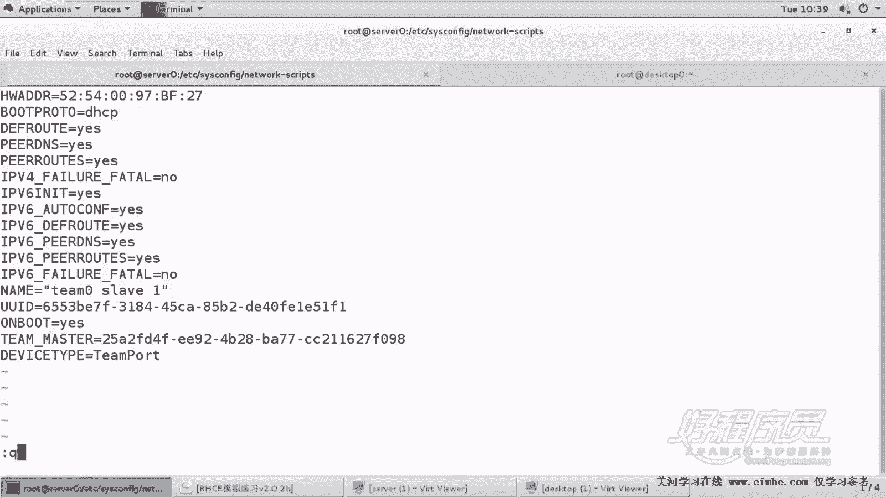