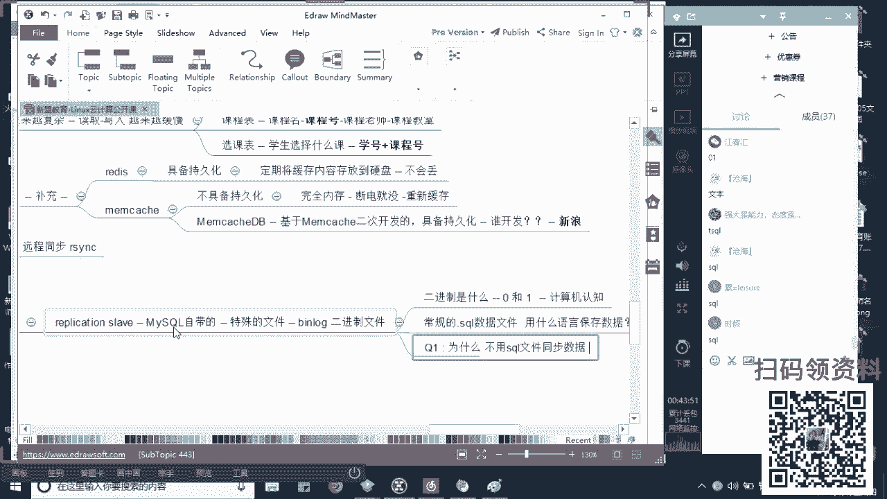

# Linux云计算架构运维基础教程：P2：MySQL数据主从同步


在本节课中，我们将要学习MySQL数据库主从同步的核心原理与配置方法。数据是企业最重要的资产之一，确保数据的安全与高可用是运维工作的重中之重。主从同步是实现数据冗余、读写分离和负载均衡的基础技术。

上一节我们介绍了Shell脚本的自动化应用，本节中我们来看看如何保障企业核心数据的安全与可用性。

## 数据的重要性与备份策略

对于互联网公司或任何企业而言，数据是最重要的资产。数据丢失或损坏会严重影响企业声誉和用户信任，造成直接的经济损失。因此，对数据进行冗余备份是必须的。

冗余备份通常分为两个层面：
*   **本地冗余**：在本地服务器进行数据备份。
*   **异地备份**：将数据备份到不同地理位置的服务器，用于容灾。

以下是两种常见的备份方式：

*   **完全备份**：每次备份都将所有数据完整复制一次。这种方式能保证数据完整性，但当数据量巨大且只有少量数据变更时，备份效率很低。
*   **增量备份**：第一次备份进行完全备份，此后只备份发生变化的数据。这种方式效率更高，是生产环境中常用的策略。

**注意**：在生产环境中进行数据同步或备份需要非常谨慎。例如，MySQL在进行某些同步操作时会默认锁库，导致数据在此期间无法写入，可能造成业务中断。

## 数据库类型简介

用于数据存储和管理的系统称为数据库。当前企业常用的数据库主要分为两类：

*   **关系型数据库**：如 MySQL、Oracle。数据以二维表格形式存储，数据之间存在关联关系。当数据量和关联复杂度增长时，读写效率可能成为瓶颈。其操作使用**结构化查询语句（SQL）**。
*   **非关系型数据库**：如 Redis、Memcached。通常作为关系型数据库的补充，用于缓存数据，缓解高并发读取时的I/O压力。它们并非要取代关系型数据库。
    *   `Memcached`：纯内存缓存，不具备数据持久化功能，断电后数据丢失。
    *   `Redis`：支持数据持久化到硬盘，是更常用的缓存方案。

归根结底，计算机的性能瓶颈在于硬件规格（CPU、内存、磁盘I/O、网络带宽）。使用缓存是解决数据库读取压力、提升响应速度的有效手段之一。

## 数据同步的层面与MySQL主从同步

为了保证数据高可用，我们需要进行数据同步。同步可以在不同层面进行：

1.  **文件级别同步**：使用 `cp`、`scp`、`rsync` 等命令直接同步数据文件。
2.  **文件系统级别同步**：使用如 `DRBD` 等工具在块设备级别进行同步。
3.  **数据库级别同步**：利用数据库自带或第三方工具同步数据。MySQL自带的主从复制（Replication）功能就是最常用的方式。

MySQL主从同步基于其**二进制日志（binlog）** 功能。`binlog` 以二进制格式（0和1）记录所有引起数据变化的SQL语句（如 `INSERT`、`UPDATE`、`DELETE`），但不记录查询语句（如 `SELECT`）。二进制格式更接近物理信号，在系统异常时相对字符格式的数据文件更容易保留下来。

### 主从同步基本原理

一个基础的MySQL主从架构至少包含一台主库（Master）和一台或多台从库（Slave）。数据流向是**单向的**，只能从主库同步到从库。

**配置流程与核心概念**：

1.  **主库配置**：开启 `binlog` 功能，并设置一个集群内唯一的 `server-id`。
2.  **主库授权**：创建一个专门用于同步的用户，并授予其最小必要的复制权限。
3.  **初始数据同步**：如果从库是空的，需要先将主库的现有数据完全导出（使用 `mysqldump`），然后导入到从库。
4.  **从库配置**：设置与主库不同的 `server-id`。
5.  **从库连接主库**：在从库上执行命令，指明主库的地址、端口、同步账号、以及开始同步的 `binlog` 文件名和位置。
6.  **从库启动同步**：启动从库的同步进程。

从库会启动两个关键进程来协助同步：

*   **I/O线程**：负责连接到主库，读取主库的 `binlog` 到本地，并写入**中继日志（relay log）**。
*   **SQL线程**：负责读取本地的 `relay log`，并将其中的SQL语句重放（执行），从而将数据变更应用到从库数据库中。

### 主从同步的局限性

基础的MySQL主从架构存在一些局限性：

1.  **非高可用**：如果主库宕机，从库**不会自动切换**为主库，需要人工干预或借助高可用工具（如 `Keepalived`、`MHA`）来实现自动故障转移。
2.  **数据一致性风险**：默认情况下，应用程序仍可向从库写入数据，但这会导致主从数据不一致，且可能引发冲突。**生产环境中应严格禁止向从库写入数据**。

为了解决第二个问题，并提升性能，通常会引入**读写分离**架构。在前端应用和数据库之间部署中间件（如 `MyCat`、`Amoeba`），由中间件自动判断SQL类型：将写操作（`INSERT/UPDATE/DELETE`）路由到主库，将读操作（`SELECT`）路由到从库。

## 实战：配置MySQL主从同步

以下是配置MySQL（以MariaDB为例）主从同步的简要步骤。

**环境准备**：准备两台Linux服务器，确保网络互通。主库IP：192.168.201.102，从库IP：192.168.201.103。

### 主库操作

1.  **安装数据库**：
    ```bash
    yum install -y mariadb mariadb-server
    ```
2.  **修改配置文件** (`/etc/my.cnf`)：
    ```ini
    [mysqld]
    log-bin=mysql-bin  # 开启二进制日志
    server-id=1        # 设置唯一ID
    ```
3.  **启动服务并关闭防火墙**：
    ```bash
    systemctl start mariadb
    systemctl stop firewalld
    setenforce 0
    ```
4.  **登录数据库，创建同步用户并授权**：
    ```sql
    GRANT REPLICATION SLAVE ON *.* TO 'slave_user'@'192.168.201.103' IDENTIFIED BY '123456';
    FLUSH PRIVILEGES;
    ```
5.  **查看主库状态，记录`File`和`Position`值**：
    ```sql
    SHOW MASTER STATUS;
    ```
6.  **完全备份数据并传输到从库**：
    ```bash
    mysqldump -uroot -p --all-databases > backup.sql
    scp backup.sql root@192.168.201.103:/root/
    ```

### 从库操作

1.  **安装数据库**：
    ```bash
    yum install -y mariadb mariadb-server
    ```
2.  **修改配置文件** (`/etc/my.cnf`)：
    ```ini
    [mysqld]
    server-id=2  # 设置与主库不同的唯一ID
    ```
3.  **启动服务**：
    ```bash
    systemctl start mariadb
    ```
4.  **导入主库的初始数据**：
    ```bash
    mysql -uroot -p < /root/backup.sql
    ```
5.  **登录数据库，配置并启动主从同步**：
    ```sql
    CHANGE MASTER TO
    MASTER_HOST='192.168.201.102',
    MASTER_USER='slave_user',
    MASTER_PASSWORD='123456',
    MASTER_LOG_FILE='mysql-bin.000001', -- 替换为主库查到的File名
    MASTER_LOG_POS=245; -- 替换为主库查到的Position值

    START SLAVE;
    ```
6.  **检查同步状态**：
    ```sql
    SHOW SLAVE STATUS\G
    ```
    查看输出中的 `Slave_IO_Running` 和 `Slave_SQL_Running` 两项，如果都是 `Yes`，则表示同步成功。

**验证**：在主库创建一个新数据库，稍等片刻后在从库查看，如果从库也出现了该数据库，则证明主从同步工作正常。



本节课中我们一起学习了MySQL主从同步的重要性、基本原理、配置步骤以及其存在的局限性。主从同步是构建稳定、可扩展数据库架构的基石，结合读写分离和高可用方案，能够极大地提升企业数据服务的可靠性和性能。