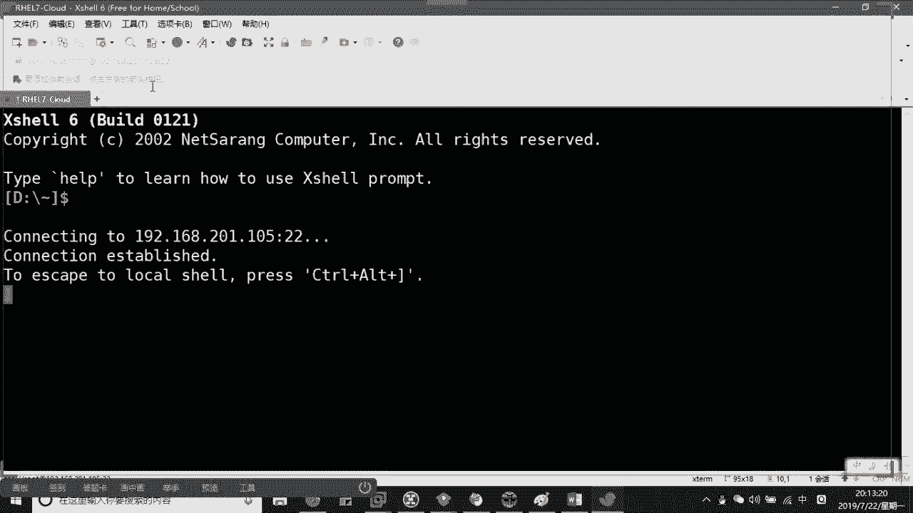
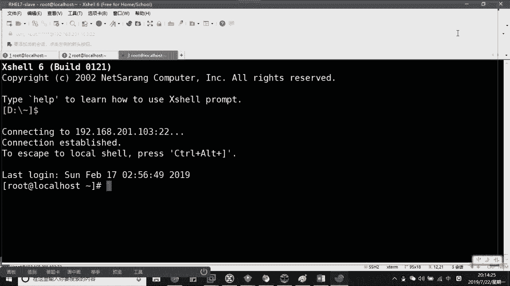
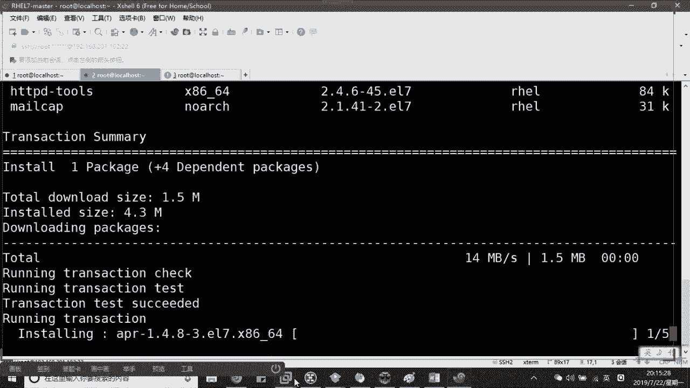
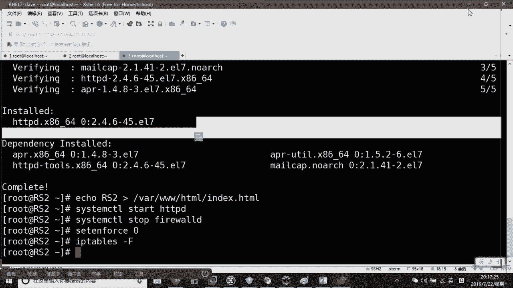
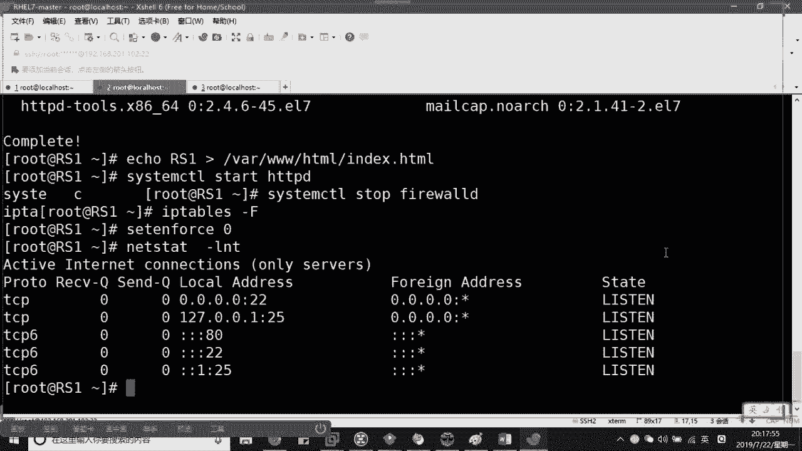
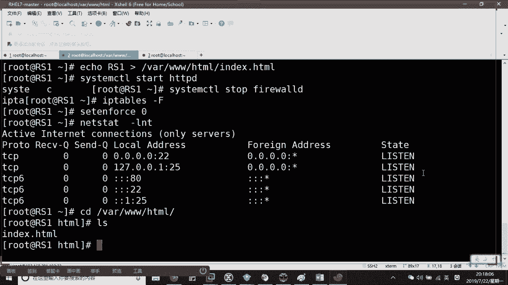
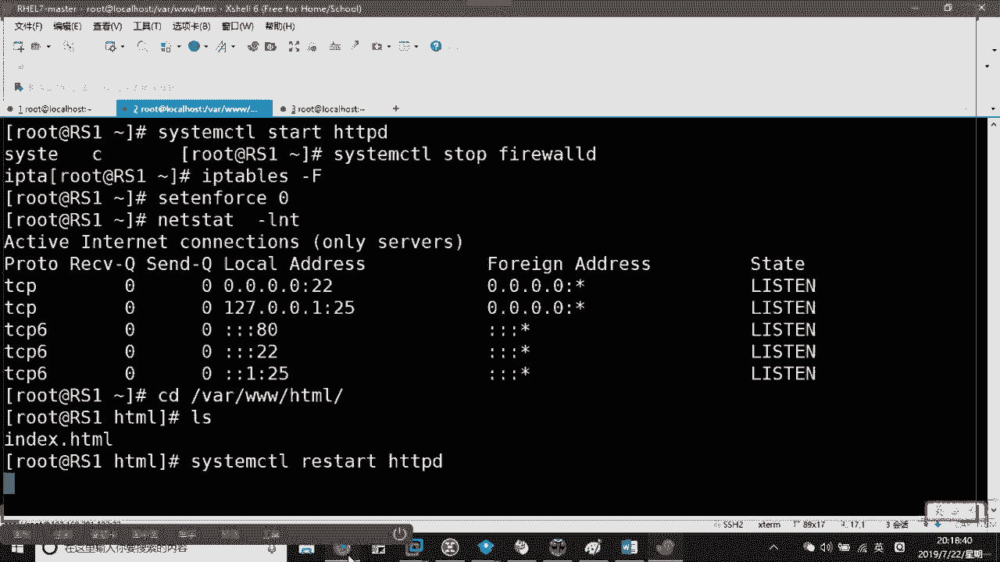
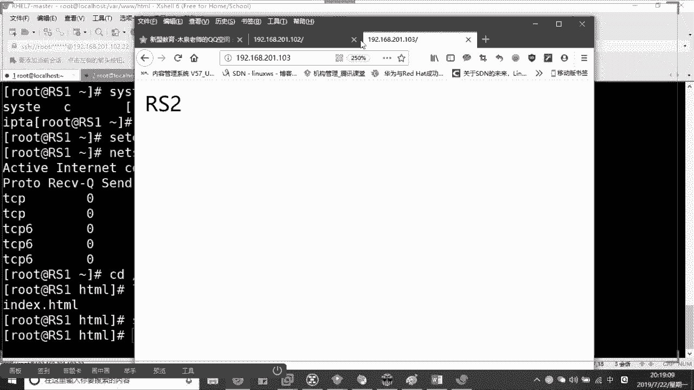
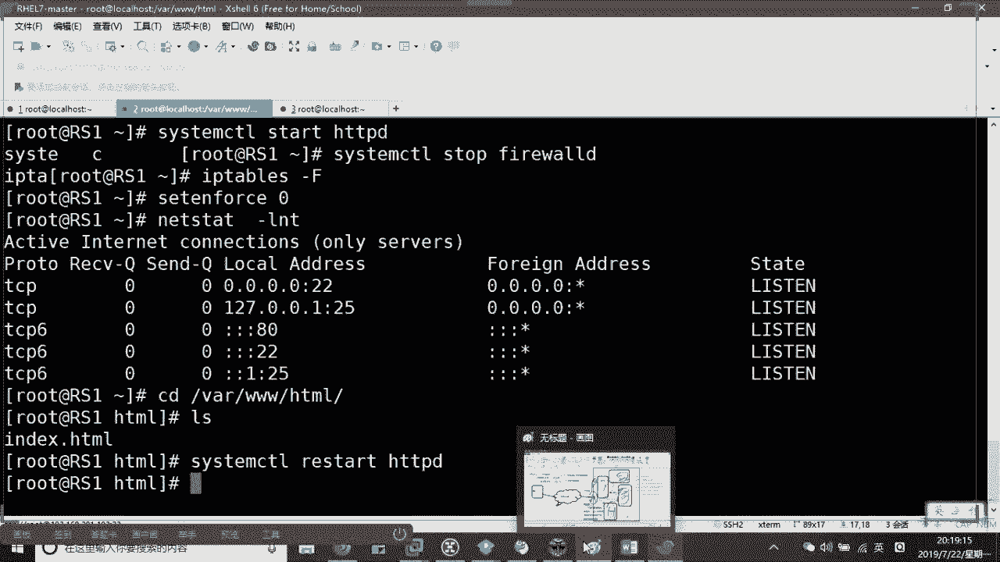

# Linux云计算架构运维基础：P3：Nginx负载均衡+反向代理 🚀


## 概述
在本节课中，我们将要学习负载均衡与反向代理的核心概念，了解它们如何解决现实中的服务器性能瓶颈和高可用性问题，并通过实战演示如何使用Nginx实现一个基础的负载均衡架构。

---

## 什么是负载均衡？🤔

随着客户访问量的增多，单台服务器在性能（如CPU、内存、网络带宽）上会遇到瓶颈，无法满足高并发请求和稳定运行的需求。

负载均衡的作用就是通过多台设备组成集群，共同分担处理请求的压力。当一台设备无法承受时，可以将流量分发到集群中的其他设备上，从而减轻单台核心设备的压力，实现共同承担。

---

## 负载均衡能做什么？🎯

负载均衡不仅能解决性能瓶颈，还能带来额外的好处。我们通过一个架构图来理解：

假设客户端（PC）通过互联网访问数据中心（IDC）。IDC内部有多台后端服务器（Server 1, 2, 3, 4），而在这些服务器之前，会有一台专门的设备，我们称之为**调度器**或**负载均衡器**。

*   **调度器的作用**：负责接收所有外部请求，然后根据预设的算法，将请求分发给后端的某台服务器进行处理。
*   **高可用性**：如果后端某台服务器（例如 Server 1）宕机，调度器会感知到这一故障，并将原本要发给 Server 1 的请求，自动分发给其他正常的服务器（如 Server 2, 3, 4）。这样，从客户端角度看，服务依然是可用的，从而实现了集群的**高可用性**和**冗余**。

因此，负载均衡主要解决两个核心问题：
1.  **减轻单点压力**：解决服务器性能瓶颈。
2.  **提供高可用性**：通过服务器间的相互备份，避免单点故障导致服务中断。

现实中的例子，如“双十一”购物节，海量流量就是通过多层负载均衡架构被平稳分发给后方成千上万的服务器集群来处理的。

---

## 如何实现负载均衡？🛠️

实现负载均衡主要有两种方式：硬件和软件。

### 硬件负载均衡
使用专门的硬件设备，例如：
*   **F5**
*   **A10**
*   **Radware**

**优点**：性能强劲，稳定性高，出现问题时由厂商提供技术支持。
**缺点**：成本非常昂贵（几十万起），且系统封闭，无法根据自身需求进行定制。多见于金融、证券、国企等对成本不敏感且追求责任明晰的行业。

### 软件负载均衡
使用开源软件在通用服务器上实现，这是互联网公司的首选。
**优点**：成本低（开源），灵活可控，可以根据业务需求进行深度定制和二次开发。
**核心软件**：
*   **LVS**：工作在四层（传输层），性能极高，配置相对简单，但不支持应用层（七层）的复杂规则。
*   **Nginx**：工作在七层（应用层），功能强大，支持HTTP头部识别、正则表达式等精细规则，常用于反向代理和负载均衡。
*   **HAProxy**：同样是一款优秀的负载均衡软件。


在企业中，常采用分层架构，例如：第一层用 LVS 进行粗粒度的流量分发，第二层用 Nginx 进行更精细的应用层路由。

---

## Nginx 的三大主要功能 📋

Nginx 不仅仅是一个 Web 服务器，它主要有三种用途：
1.  **静态Web服务器**：用于托管和展示网站静态页面。
2.  **反向代理与负载均衡**：这是我们本节课的重点。Nginx 作为反向代理服务器，接收客户端请求，并隐藏后端真实服务器，同时将请求负载均衡到多台后端服务器上。
3.  **缓存服务器**：可以缓存静态甚至动态内容，加速用户访问，提升体验。

---

## 实战：使用Nginx搭建负载均衡


接下来，我们通过实战演示如何用 Nginx 搭建一个简单的负载均衡环境。


### 实验环境准备
我们将使用三台服务器：
*   **LB (负载均衡器)**：IP: `192.168.201.105`
*   **RS1 (真实服务器1)**：IP: `192.168.201.102`
*   **RS2 (真实服务器2)**：IP: `192.168.201.103`


**目标**：用户访问 LB (`105`)，请求被自动分发到 RS1 (`102`) 或 RS2 (`103`)。




### 步骤 1：配置后端服务器 (RS1 & RS2)
1.  在两台 RS 上安装 Web 服务器（以 Apache 为例）并创建略有区别的主页，以便观察负载效果。
    ```bash
    yum install -y httpd
    echo "This is RS1" > /var/www/html/index.html  # 在 RS1 上执行
    echo "This is RS2" > /var/www/html/index.html  # 在 RS2 上执行
    systemctl start httpd
    systemctl enable httpd
    ```
2.  关闭防火墙，确保流量可通。
    ```bash
    systemctl stop firewalld
    setenforce 0
    ```
3.  分别访问 `http://192.168.201.102` 和 `http://192.168.201.103`，确认页面正常显示。





### 步骤 2：在 LB 上源码编译安装 Nginx
在企业中，更推荐使用源码编译安装，以便自定义功能和路径。




以下是源码安装的“三部曲”：
1.  **预编译 (Configure)**：检查系统环境，生成编译配置。
2.  **编译 (Make)**：将源代码编译成机器可识别的二进制文件。
3.  **安装 (Make Install)**：将编译好的文件安装到指定目录。



**具体操作**：
1.  下载 Nginx 源码包。
    ```bash
    wget http://nginx.org/download/nginx-1.14.0.tar.gz
    ```
2.  解压并进入目录。
    ```bash
    tar -xzf nginx-1.14.0.tar.gz
    cd nginx-1.14.0
    ```
3.  执行预编译，指定安装路径和用户。
    ```bash
    ./configure --prefix=/usr/local/nginx --user=nginx --group=nginx --with-http_ssl_module
    ```
    *   如果报错缺少编译器，安装：`yum install -y gcc`
    *   如果报错缺少 `PCRE` 库，安装开发包：`yum install -y pcre-devel`
    *   如果报错缺少 `OpenSSL`，安装开发包：`yum install -y openssl-devel`
    *   每次解决依赖后，需重新执行 `./configure` 命令，直到成功。
4.  编译并安装。
    ```bash
    make && make install
    ```
5.  创建 Nginx 用户并启动服务。
    ```bash
    useradd nginx
    /usr/local/nginx/sbin/nginx
    ```
6.  访问 `http://192.168.201.105`，看到 Nginx 欢迎页即表示安装成功。








### 步骤 3：配置 Nginx 负载均衡
1.  编辑 Nginx 主配置文件。
    ```bash
    vim /usr/local/nginx/conf/nginx.conf
    ```
2.  在 `http{}` 块内，添加一个 `upstream` 块来定义后端服务器集群。
    ```nginx
    http {
        ...
        upstream web_servers {
            server 192.168.201.102:80;
            server 192.168.201.103:80;
        }
        ...
    }
    ```
3.  修改 `server{}` 块中的 `location /` 部分，将请求代理到上面定义的集群。
    ```nginx
    server {
        listen       80;
        server_name  localhost;

        location / {
            proxy_pass http://web_servers; # 关键配置，指向 upstream 名称
        }
        ...
    }
    ```
4.  检查配置文件语法并重启 Nginx。
    ```bash
    /usr/local/nginx/sbin/nginx -t
    /usr/local/nginx/sbin/nginx -s reload
    ```








### 步骤 4：验证负载均衡效果
现在，不断刷新访问 `http://192.168.201.105`，页面内容会在 “This is RS1” 和 “This is RS2” 之间交替出现，这证明了 **轮询（Round Robin）** 算法在起作用，请求被均匀地分发到了两台后端服务器。


### 进阶：配置权重 (Weighted)
在实际生产中，服务器性能可能不同。我们可以通过 `weight` 参数指定权重，让性能好的服务器处理更多请求。

修改 `upstream` 配置：
```nginx
upstream web_servers {
    server 192.168.201.102:80 weight=1;
    server 192.168.201.103:80 weight=5;
}
```
此配置意味着，在6次请求中，RS2 (`103`) 大约处理5次，RS1 (`102`) 大约处理1次。重启 Nginx 后，可以通过多次访问来观察权重分配的效果。

---

## 总结
本节课中我们一起学习了：
1.  **负载均衡的概念**：通过集群分担流量，解决性能瓶颈和高可用性问题。
2.  **实现方式**：了解了硬件和软件负载均衡的优缺点，以及 LVS、Nginx 等主流软件的特点。
3.  **Nginx 的角色**：掌握了 Nginx 作为反向代理和负载均衡器的核心作用。
4.  **实战操作**：从源码编译安装 Nginx，到配置一个基本的负载均衡集群，并验证了轮询和加权轮询算法。


负载均衡是构建大规模、高可用网络服务的基石技术，理解其原理并掌握 Nginx 的配置是运维工程师的必备技能。