# Linux云计算架构运维基础全集教程：P4：Shell脚本入门之批量部署Nginx服务器 🚀

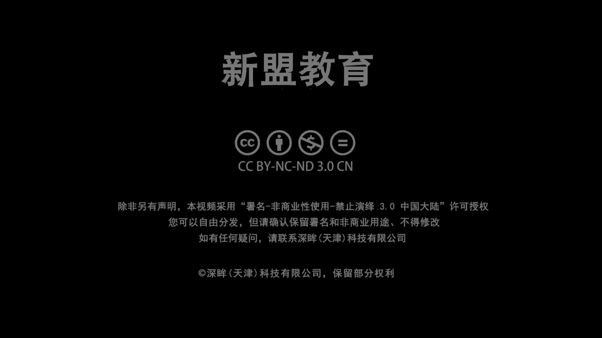

## 概述
在本节课中，我们将要学习Shell脚本的基础知识，并动手编写一个用于批量部署Nginx服务器的简易脚本。我们将从理解Shell脚本的概念和价值开始，逐步深入到脚本的编写规范、核心语法，最终完成一个实用的自动化部署脚本。

---

## 什么是Shell脚本？🤔

上一节我们概述了课程目标，本节中我们来看看Shell脚本到底是什么。

Shell脚本是Shell编程的产物。Shell编程的本质，是将一系列Linux命令有逻辑地组织在一起。一个脚本中不仅包含常规的Linux命令（如 `ifconfig`、`cp`、`cd`），还会涉及变量、函数、判断和循环等逻辑结构。

**核心概念：变量**
变量用于方便管理脚本。例如，定义一个变量 `A=10`，其中 `A` 是变量名，`10` 是变量值。如果在脚本中多次使用同一个值，将其定义为变量后，只需修改变量值一次，所有引用该变量的地方都会自动更新，这大大提升了脚本的可维护性和效率。

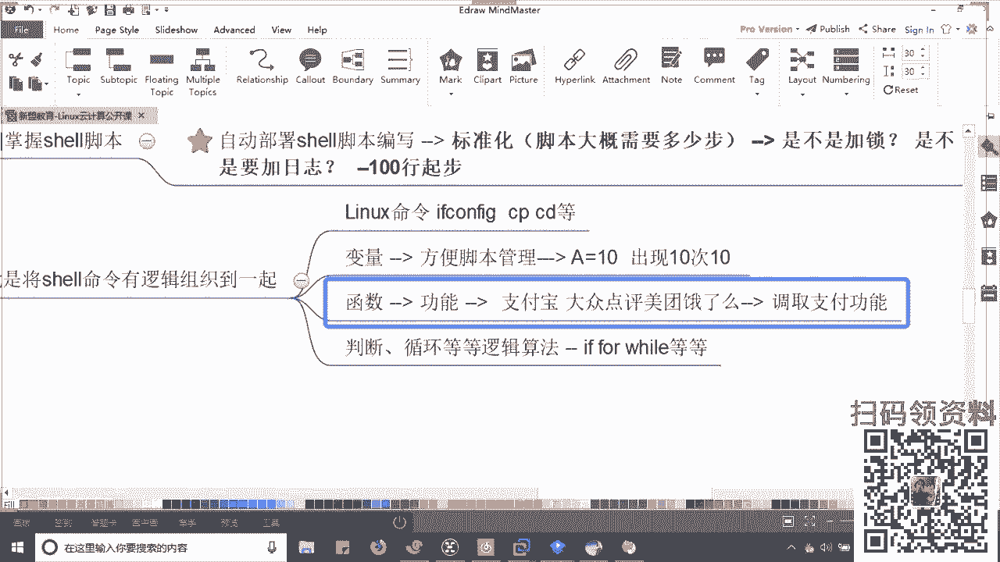

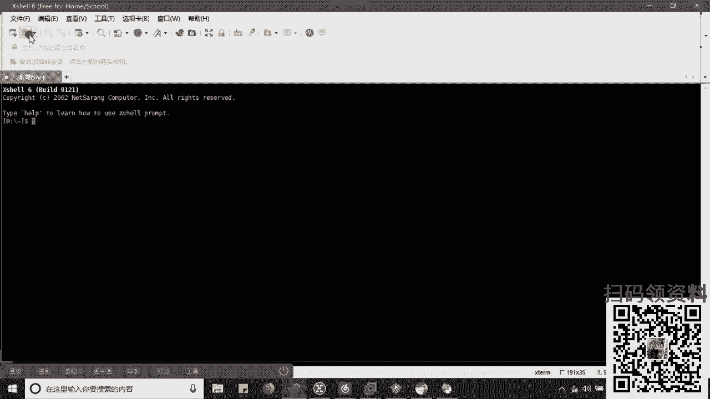

**核心概念：函数**
函数是脚本中可复用的功能模块。它类似于一个独立的工具，可以在脚本的不同位置被调用，而无需重复编写相同的代码块。

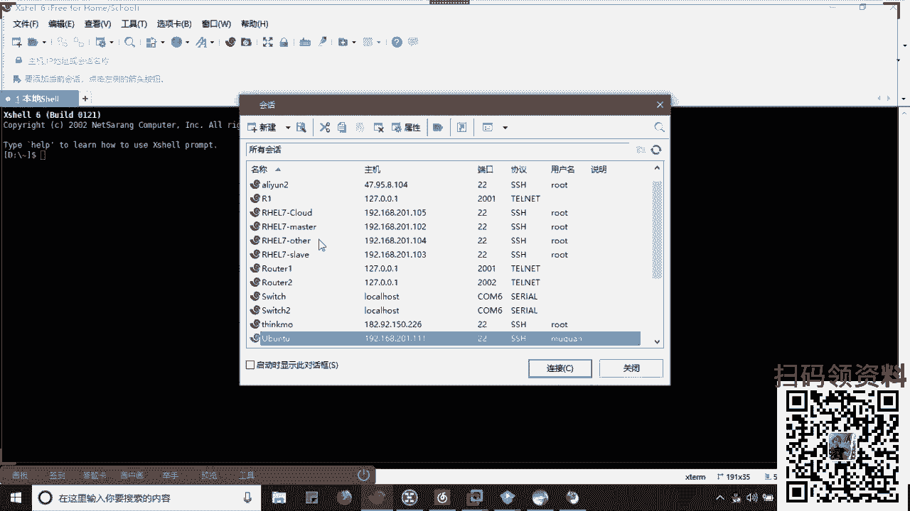

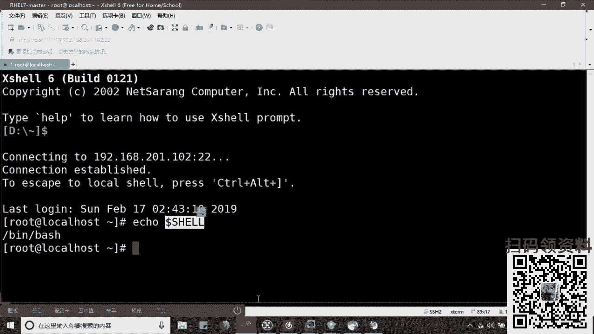

---

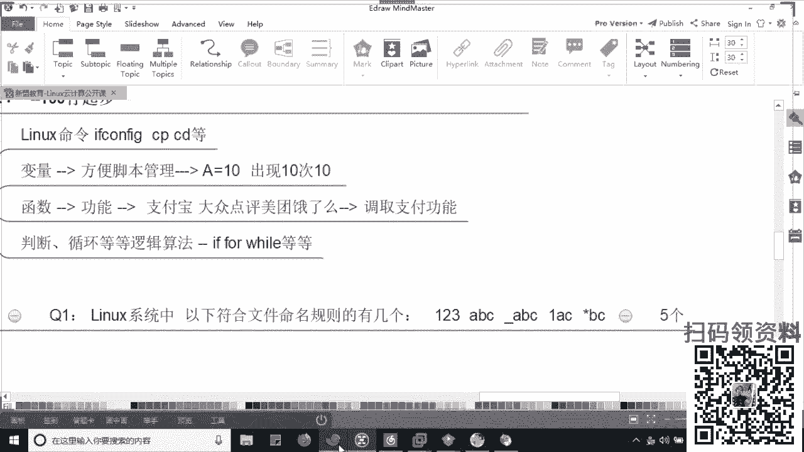

## Shell脚本的价值与作用 💎

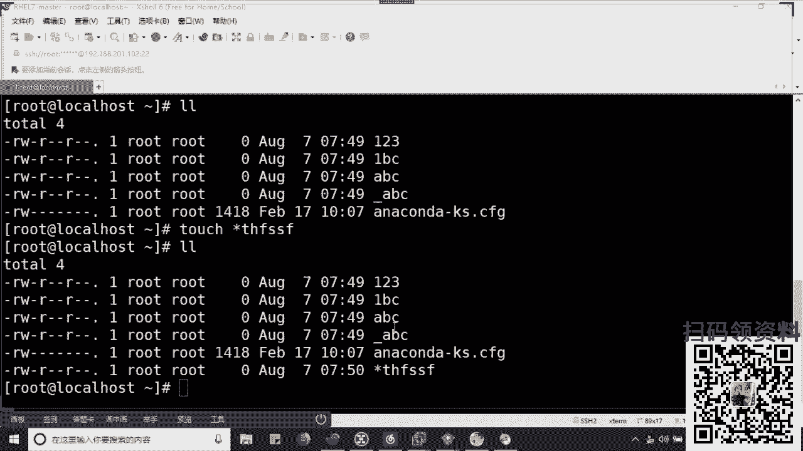

理解了Shell脚本是什么之后，本节我们来看看它解决了运维工作中的哪些实际问题。


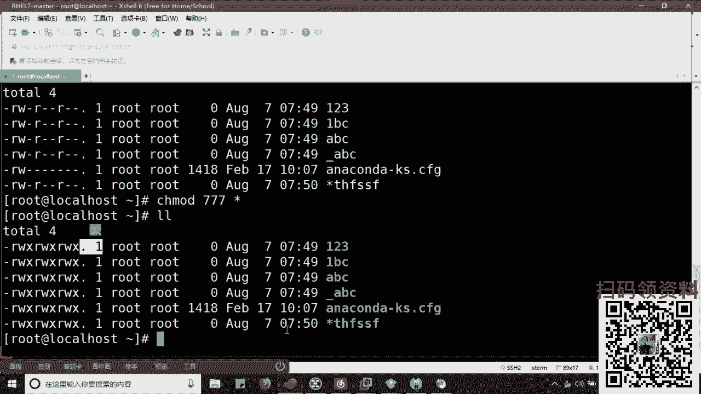

Shell脚本的核心价值在于**提升效率**和**降低人为错误**。当需要在成百上千台服务器上执行重复且繁琐的操作时（例如部署Nginx），手动操作耗时耗力且容易出错。通过编写脚本，可以将这些操作流程固化，让脚本自动执行，从而解放人力，并保证操作的一致性和准确性。

在技术栈选择上，建议先**精通Shell脚本**，因为它是在Linux环境下进行自动化运维的基础。后期若有精力，可以学习**Python**。Python在开发一些高级运维工具（如Ansible）或编写复杂插件时兼容性更强，但两者基本逻辑相通。

---

## Shell脚本的编写规范 📝

在开始动手编写脚本前，我们需要了解一些通用的编写规范，这有助于写出清晰、易维护的脚本。

以下是常见的Shell脚本编写规范：
*   **命名规范**：脚本文件名应能体现其功能，并以 `.sh` 结尾。例如 `autoinstall_nginx.sh`。
*   **存放目录**：公司内部通常有统一的目录用于存放运维脚本。
*   **脚本内部结构**：
    1.  **指定解释器**：脚本第一行通常为 `#!/bin/bash`，指定使用Bash Shell来执行此脚本。
    2.  **注释信息**：在脚本开头用注释说明脚本的用途、作者、创建日期等信息。
    3.  **定义变量**：将脚本中需要多次使用或可能变化的参数定义为变量，通常使用大写字母。
    4.  **编写主体逻辑**：实现具体功能的命令和逻辑。

---

## 实战：编写Nginx批量部署脚本 ⚙️

掌握了基本概念和规范后，本节我们将进入实战环节，编写一个自动化部署Nginx的脚本。

在部署之前，需要明确两点：
1.  **Nginx的作用**：常用作Web服务器、反向代理/负载均衡以及HTTP缓存。
2.  **部署方式选择**：Linux下安装软件主要有两种方式：
    *   **Yum安装**：类似“快速安装”，方便快捷，自动解决依赖，但文件分布较散，不便于集中管理。
    *   **源码编译安装**：类似“自定义安装”，步骤繁琐（需解决依赖），但安装目录、功能模块可控，便于统一管理。本教程采用此方式。

源码编译安装通常分为三步：
1.  **预编译（`./configure`）**：检查系统环境，配置安装路径和功能模块。
2.  **编译（`make`）**：将源代码编译成二进制文件。
3.  **安装（`make install`）**：将编译好的文件复制到系统指定目录。

我们的脚本将自动化完成以下流程，并预先解决所有依赖问题：

以下是自动化部署Nginx脚本的核心步骤和命令：
1.  **解决环境依赖**：安装编译所需的工具和库。
    ```bash
    yum install -y wget gcc gcc-c++ openssl-devel pcre-devel
    ```
2.  **创建运行用户**：
    ```bash
    useradd nginx
    ```
3.  **下载并解压源码包**：
    ```bash
    wget http://nginx.org/download/nginx-1.16.1.tar.gz
    tar -zxvf nginx-1.16.1.tar.gz
    cd nginx-1.16.1
    ```
4.  **配置、编译并安装**：
    ```bash
    ./configure --prefix=/usr/local/nginx --user=nginx --group=nginx --with-http_ssl_module --with-http_stub_status_module
    make -j 8 # 使用8个线程并行编译，加快速度
    make install
    ```
5.  **启动Nginx并关闭防火墙**（仅用于测试环境）：
    ```bash
    /usr/local/nginx/sbin/nginx
    systemctl stop firewalld
    ```

将以上步骤按逻辑顺序组合，并添加必要的注释和错误处理（如依赖安装），就形成了一个完整的自动化部署脚本。执行该脚本，即可一键完成Nginx服务器的部署。

---

## 总结 🎯

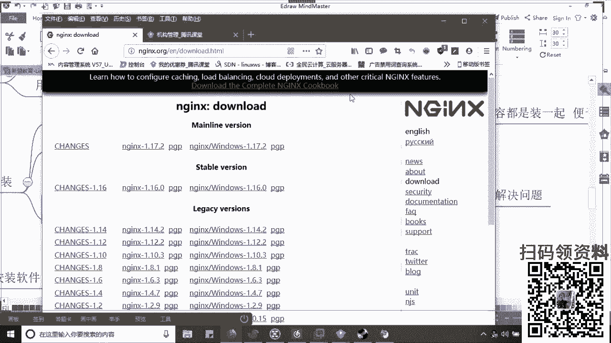

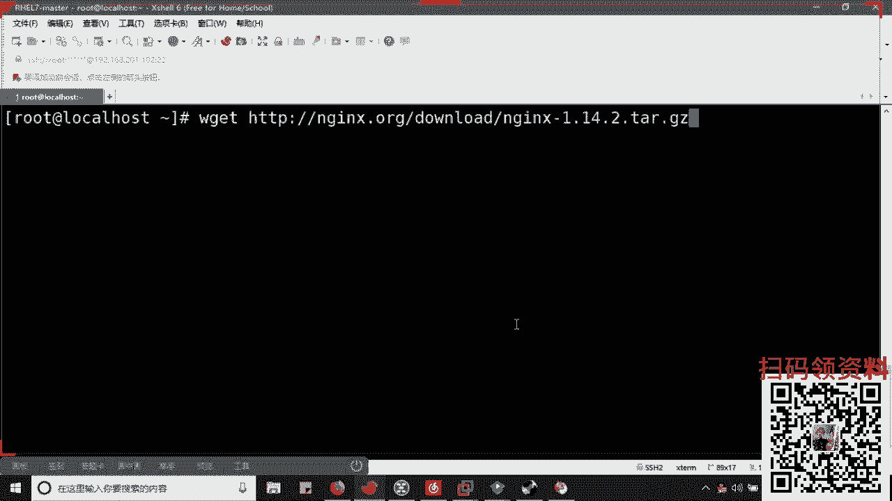

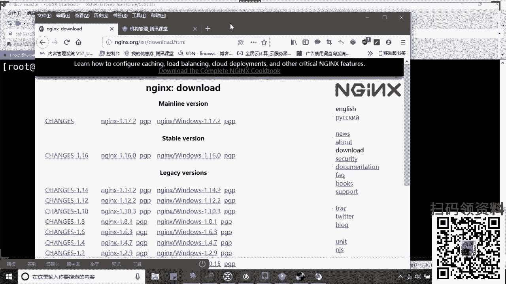

本节课中我们一起学习了Shell脚本的基础知识。我们首先了解了Shell脚本的定义和核心组成（命令、变量、函数）。然后探讨了Shell脚本在自动化运维中提升效率、减少错误的核心价值。接着，我们学习了编写Shell脚本时应遵循的通用规范。最后，通过一个**批量部署Nginx服务器**的实战案例，我们将理论应用于实践，编写了一个完整的自动化脚本，涵盖了从环境准备、源码编译安装到服务启动的全过程。

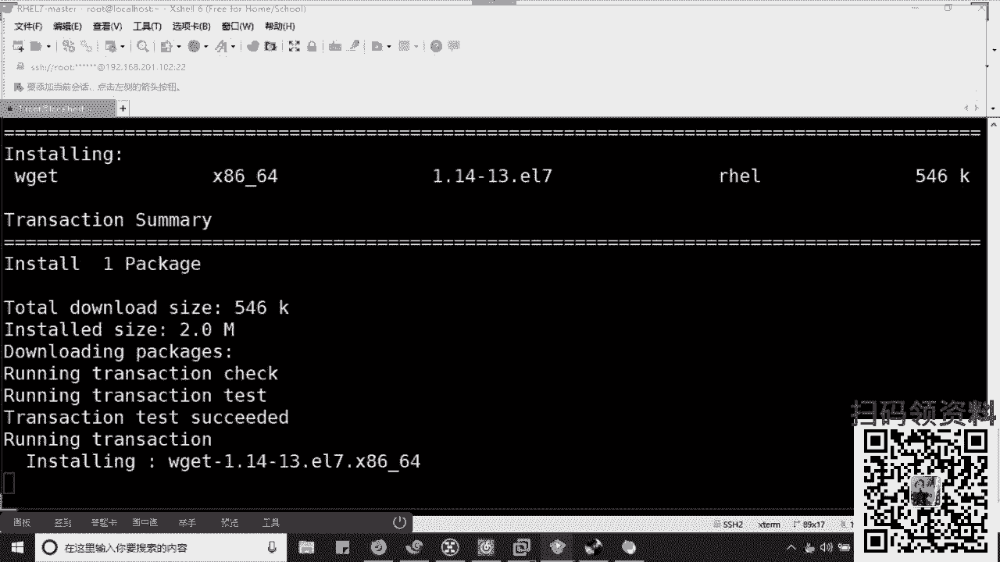

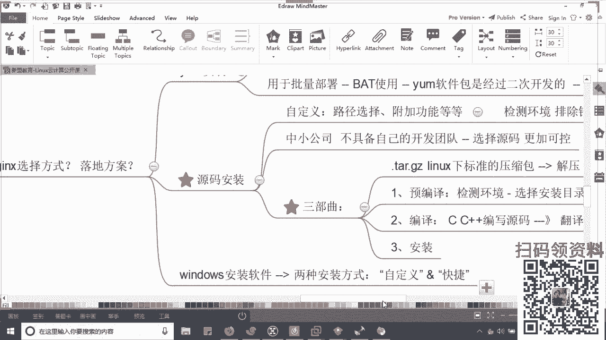

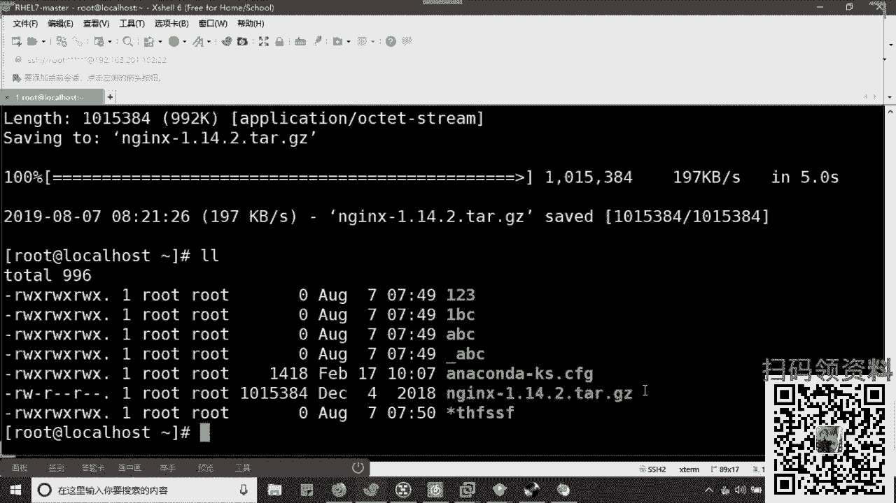

希望本教程能帮助你迈出Shell脚本编程的第一步，并为后续学习更复杂的自动化运维技术打下坚实基础。