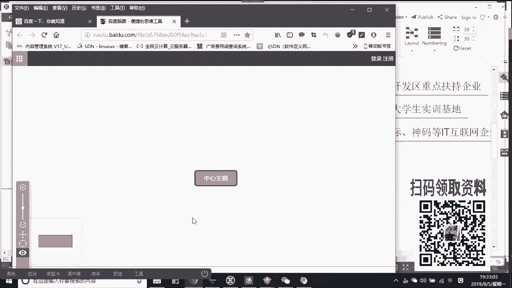
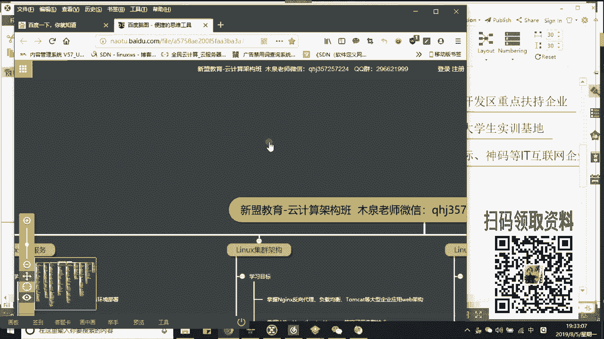
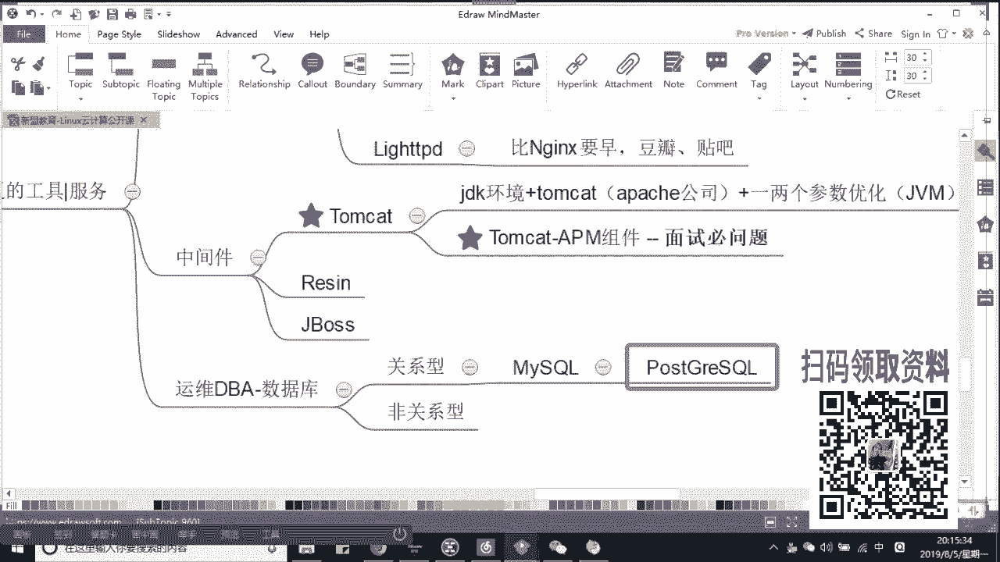

# Linux云计算架构运维基础：P5：零基础小白如何在行业中发展，提升自我技术

在本节课中，我们将探讨零基础学习者如何进入Linux运维行业，并规划自己的技术提升路径。我们将分析运维的不同岗位方向、所需的核心技术栈以及未来的职业发展前景，帮助你建立一个清晰的学习蓝图。

## 行业与岗位方向概述

上一节我们介绍了课程的基本信息，本节中我们来看看Linux相关的就业方向。总的来说，主要分为开发和运维两大方向。

开发方向最具代表性的是嵌入式开发，通常涉及硬件驱动和单片机编程。然而，硬件领域发展较慢，因此许多开发者后期会转向软件方向，例如Java或Python开发。

运维方向则是大多数零基础或转行学习者的选择，因为其入门门槛相对较低，应用场景广泛。

## 初级运维岗位分析

以下是两种常见的初级运维岗位，适合刚入门或寻求基础工作的学习者。

*   **桌面运维**：工作内容通常包括为办公电脑安装系统、软件以及维护打印机等硬件。这类岗位多存在于传统行业的甲方（如国企、医院），技术含量不高，通常属于外包或三方外派岗位，薪酬和发展空间有限。
*   **IDC运维**：工作地点在数据中心机房，主要负责监控机房环境（温湿度）和设备状态。核心任务是值守监控室，发现问题后通知相应公司的运维人员处理，自身操作权限较低。该岗位需要倒班，薪酬通常在每月6000元左右，技术成长性一般。

## 高级运维技术路径

若想获得更好的职业发展和薪酬，必须向高级运维方向发展。高级运维不仅需要会部署服务，更要精通排错、理解服务间的联系与架构设计。其核心在于**先计划，后实施**，具备整体架构思维。

高级运维根据技术侧重可分为以下几个方向：

*   **应用运维**：这是最常见的岗位，需要熟练掌握企业广泛使用的开源工具和服务。
    *   **Web服务器**：需了解`Apache`、`Nginx`、`Tengine`（阿里基于Nginx二次开发）、`Lighttpd`等。
    *   **中间件**：需区分中间件（如`Tomcat`、`JBoss`）与Web服务器的不同。`Tomcat`用于承载Java应用。
    *   **数据库**：
        *   **关系型数据库**：如`MySQL`、`PostgreSQL`、`Oracle`。需了解各自优劣，例如`PostgreSQL`在数据吞吐量和速率方面表现优异。
        *   **非关系型数据库**：作为缓存补充，如`Redis`（支持持久化）、`Memcached`（纯内存型）。还有`MemcacheDB`（新浪基于Memcached开发）。
*   **自动化运维**：当服务器规模达到50台以上时，自动化成为必然选择。
    *   **批量部署**：工具包括`Ansible`（Python开发）、`SaltStack`、`Puppet`。
    *   **集中监控**：工具如`Zabbix`（PHP开发）、`Prometheus`（常用于监控K8s平台）。
    *   **日志管理**：使用`ELK`/`EFK`堆栈进行日志的集中收集、存储和分析，这是面试必考点。
    *   **持续集成/持续交付（CI/CD）**：实现代码自动测试、构建、部署和回滚，是自动化运维的核心，能极大提升效率。
*   **云计算运维**：
    *   **虚拟化**：从传统的`KVM`虚拟机，发展到以`Docker`为代表的容器技术。
    *   **容器编排**：`Kubernetes（K8s）`用于管理大规模的Docker容器集群。
    *   **云平台**：以`OpenStack`为代表的私有云搭建技术，以及公有云（如阿里云、腾讯云）的使用和管理。
*   **大数据运维**：与数据处理和分析相关。
    *   技术栈常包含`Hadoop`、`Spark`用于大数据分析。
    *   `ELK`也常用于日志分析。
    *   通常需要一定的编程能力（如`Python`、`Java`）来配合开发进行数据爬取或工具开发。
*   **运维开发**：结合运维知识与开发能力，旨在开发运维工具或平台（如`Ansible`本身就是运维开发的产品）。需要先精通运维，再学习开发。

## 学习建议与总结

本节课中我们一起学习了Linux运维行业的岗位划分和技术发展路径。

对于零基础学习者，建议学习路径如下：
1.  **打好基础**：精通Linux基础命令和Shell脚本。
2.  **选择核心方向**：主攻**应用运维**所需技能（Web服务、数据库、监控）。
3.  **进阶学习**：同步学习**自动化运维**（Ansible， CI/CD）和**云计算**（Docker， K8s）技术，这两者是现代运维的必备技能。
4.  **按兴趣拓展**：如果对编程感兴趣，可以学习`Python`，并向运维开发或大数据运维方向探索。

掌握应用运维、自动化和云计算方向的核心技术，并能在项目中应用，通常可以使薪酬达到每月13K左右。更高的薪酬则取决于在架构设计、疑难排解和特定领域（如大数据、运维开发）的深度。

学习是一个持续积累的过程，重点在于学以致用，并不断总结。建议在学习过程中勤记笔记，形成自己的知识体系。