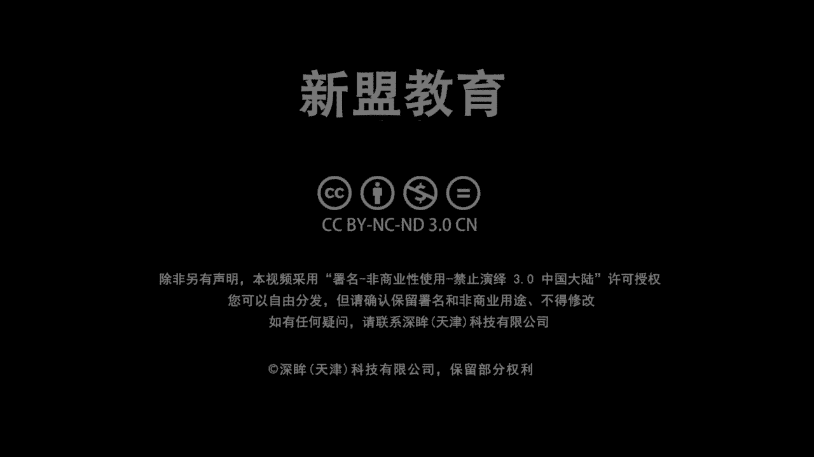
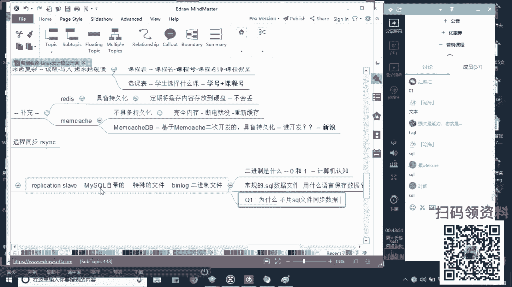

# 2019最新Linux云计算构架运维基础全集教程（O基础入门必备教程！） - P2：MySQL数据主从同步 - 洋洋得IE - BV1D4411Z7iy

Yeah。

5万多家机构呢不仅是在排名的前101位，同时也是我们通讯课堂所官方认证的一家培训机构。那么除此之外，和我们的阿里也是有合作关系的。那么大家在我们这边除了能够学到哎自动化云计算的内容以外呢。

你还能学到一部分哎关于我们阿里云产品的一个内容啊，接下来啊，关于阿里云产品的内容。那么除此之外的话，老师你是谁啊啊，我是咱们的这个募学老师啊，我的QQ号的话给大家了。799830458啊。

你把我的Q记下来，课后可以加我啊，可以单独聊我好吧，那么呃我们之前的话可能比大家早一些从事我们预维的工作。那么在我们58，包括阿里的话，带过运维经理和运维架构师的岗位。那现在的话在咱们新农教育啊。

一方面负责公开课课程的一个哎技术的分享。另一方面呢负责的是我们系统班的一个教学辅导。啊，所以事情的比较多。那么木旭老师负责的公开课的时间，大家可以记一下，是从每周一到每周五晚上的7点半啊。

7点半开始啊啊，那么基本上我们的课程的这个时间会维持在我们一个小时左右啊，一个小时到2个小时时间吧啊，等一个半小时时间吧，好不？那么呃公开群的话，296621999给大家发到公屏上啊。

那么我希望你在上课之前的话呢，准备一个自己的笔记本来跟着我去记录笔记啊，因为我讲的东西或多或少里面掺杂了。哎，我的理解是吧？是我的内容，所以大家如够想想想想老师我想融会贯通是吧？我想把它尽快吸收。

我这各位自己准备一个纸质版的笔记本，然后去做记录去做整理，去做总结啊，那除此之外的话，一个小要求啊，我们在课上老师我能跟得上你的节奏，我也能听得懂你在讲哪个知识点，那麻烦同学们给我刷个一上。

如果你有任何的问题的话，你可以给我把问题问出来，可以吗？同学们，如果。😊，ok的话，给我刷朵花吧啊，给我刷朵花。啊，O哎谢谢叶啊，谢谢叶哎，谢谢迷图啊。叶的话是咱们思科的同学吧啊，然后迷图的话。

我知道是咱们自己的思科加上lin同学啊。好okK好，那时候我们今天讲什么啊，我们今天讲什么？😊，呃，先说一下吧先说一下吧啊，我们从本周一到下周的15号，哎，这么10天的时间，也就5号到15号。

那么内容是循序渐进的。我会把一部分系统班的内容拿到公开课程来做分享啊，但是不会太深性跟大家说一下，对吧？毕竟我们还是两个课程啊，那么公开课的目的是希望通过这10天能够帮助我们零基础的同学，哎。

或者是我打算转型或者转行入门我们linux的同学你干嘛？哎，对整个linux的行业有一个基本的了解，可可不可以啊？包括一个基本的技术。也是我们现在在整个企业中哎必用的。

或者大家在面试当中干嘛哎面试必问的一些问题啊，一些问题。好，那么呃第一天啊我们挨个说好吧，挨个挨个说啊，昨天呃应该说周一的话，第一天啊我们讲解的是关于一个零基础小白，我应该学习什么，对吧？

包括我们未来的一个就业岗位啊，包括我们的一个未来的薪酬啊，包括的待遇一的发展啊，第二天的话，如果我没有记错，给大家讲的是一个基础服务，对吧？

基础服务只是帮助大家去熟悉我们在linux中干嘛去部署去调试我们服务的一个逻辑啊，一个逻辑和一个一个一个脉络点吧，好不好？那么讲的是一个关于DNS域名解析的内容啊，域名解析内容。

这个可以算是我们基础服务当中，哎，有挑战性的，比较有挑战性内容。啊，那老师昨天呢哎也就是我们的第三天啊，第三天啊，第三天讲解的是关于一个大家比较感兴趣的，也是在我们面试当中。😊，必问的一个内容是吧？啊。

一个必问的内容。哎，是关于整个se脚本的啊，我们通过se脚本去哎去编写了一个可以用于去批量部署我们NG服务器的一个脚本。啊，父亲脚本好，那么这三天哎这三天大家说老师我我有一天没来是吧？

或前两天都没有听到，没关系啊，都没有关系。你们呢去找我们的魏老师啊，小魏老师我给大家发过去啊，我给大家发到公屏上，大家可以直接去找我们小魏老师领取好不好啊，就需要小微领取我们之前的资料和录屏啊。

那说今天是第四天了，对吧？哎，第四天啊，我们讲你的是关于整个在企业当中的，或者我们现在互联网啊，对，尤其是对互联网公资。😊，好，最最致命的或者说我们的一个企业命脉啊，企业命白好，老师什么是企业命脉啊？

来告诉同学们，你们认为现在对于我们一个互联网公司，或者对于一个企业来说，什么是最重要的？😡，来告诉我。来，什么是最重要的？😡，快点快点告诉我。呃，自己想好不好，自己告诉我。哎快有人呢？快点人呢。

同学们人呢？我怎么看不到你们说话了呀啊哎，明图迷图。什么最重要啊？😡，什么最重要是吧？我问大家问题的啊，老师什么是企业命脉啊？啊，什么是企业命脉？生存技术啊，这个这个太笼统了是吧？好，太笼统了。好。

大家经常听到一句话叫做欲维是我们是什么？是我们的最后一道防线。😡，在整个企业当中，运维是我们的最后一道防线，而运维重中之重，你要去对我们的数据进行管理，对吧？至少要存储，至少要管理，对不对？更深的话。

我们可能对它进行一些剧类的分析啊，具子分析，所以现在来说，对于我们甭管是BAT还是一些个中小型还是说甚至老师，一些国企银行啊是吧？医院啊也好啊，那么最重要的都是我们的数据进来。😡，啊，数据是最棒的。

唠不知到大家知不知道啊？就是我们之前的话，其实腾讯也好，还是你们现在经常过的某个论坛啊，51论坛啊，其实之前就发生过我们数据丢失的问题啊，是丢失问题。呃，就是很多同学玩这个玩过游戏吧。

叫做DNF来人同学们玩不认给我刷个一上来啊，或你听说过的人给我刷个一上来，好不好？😡，有人听过或者有人玩过，对吧？OK啊OK好，那么曾经的话就发生过一起什么呢？就是我的数据丢失。

导致很多的玩家他的装备丢掉了。哎，累，你直前这玩啊，哎，这是装备丢掉了，知道吗？哎，包括51CPU啊，之前的话会有一个博客论坛，知道吗？当时的时候也是因为数据的丢失和损坏，导致我们很多的博主的文章啊。

只是他自己写的博客丢失了啊，那么今日说老师，我数据丢失了，好像看上去没有多大的影响，对不对？但是大家想想是不是对你的企业造成的一些个影响，哎，尤其是在声育方面啊，在声誉上。😊，哎。

生意上其实影响是颇大的。也就说老师，我下次不用你们的博客了，我下次不玩这个游戏了，于是乎导致我的企业损失了大量的用户，对吧？当的用户就是钱的来源呢，对不对？你们都是他们的钱的来源呢。好，你不玩了。

他的收入减少了很多很多，能理解了吗？所以包括像像像医院，你就想不明白医院的话，我们都知道这个病人是要有什么叫病例的，对不对？啊，是要病例的，尤其是像我们现在什么尤其像传染病了啊？像传染病了。

像我们这个得了癌症或者说是这个皮肤病了，我们一定要在里面登录在案，能理解吗？一定要登录在案的大起来。😡，那目的就是说哎，我下一次去别的城市，或者说下一次我突发感冒了，在其他的城市出差，那我去就诊的时候。

我们的医愿可以通过相互之间的资源共享或信息共享，能够知道你往期的病史，能理解了吗？哎，防止说老师，我第一次打了个针，发这个这个这个过敏了，然后下一次我打针又他妈过敏了是吧？啊。

你这一天天的只要一生病就过敏一次啊，这个太太尴尬了啊，所以呢怎么样，这个数据是非常重要的。所以一般情况下记住，一般情况下，我们对于数据谁来说基本上是必须啊是必须要做冗余的。😡，而冗余也会分成两个层面。

一部分在我们的本地去做冗余，也就是我们的备份。另一方面叫做异地备份。大家听说过吧？听说吗？明学白？听说了，异地备份也是木区老师非常推崇的一种，也是非常推崇一种。这种首先来说能够保证哎我的数据在在什么？

在这个这个本地运行的时候，老师如果我出现问题了，我本地可以进行回复。😡，我异地的数据也可以拿来恢复。那同时异地备份还有一种就是防灾。啊，容灾是吧，万一地震了，万一洪水了，是不是你本地的其实也是蛮坑。😡。

能力解朋学们来立志上衣啊。😡，来力就上个亿。好，OK好，那么同时在这个数据备份的时候，我们也会遵循几种啊，也是我们的备份的方式方法。😊，我举两种是我们比较常见的，一种叫做完全备份。然一种完成备份。

一种叫做增量备份。进来啊，老师这两种有什么区别啊，这两种有什么区别？我先问问大家吧，好吧，来，同学们，你们老师，我知道其中区别的，给我刷个一上来啊，老师我不太清楚的，给我刷个二上来。😡，系啊。快。

清楚了？都清楚吗？啊，我看到那么多好人的，怎么没说话了，我今点了名是吧？2M杠F删除吴月江慧春喵星人是吧？TAN然后SHOUKE顾雨光下雪然后猴是吧？猴HB然后这个等风来go沧海木耳形成于斯啊。

我也不知道你们这个来天天挂机是干嘛用的啊，是吧？你要是有这个时间啊，我跟你们大家说啊，你要是不想学，你要是看个片儿是吧？你看信心舒畅一点啊。

毕竟昨天刚刚七夕过去了你今天呢还能还能还能还能还能这个这个这个这个这个这个在再再一A绎一下是吧？但万一今天过去了，你可没机会了啊，能快的能快的啊，有问题的话，赶快问我好不好啊，就这两个有什么区别。

接来啊，首陈来说大家记住首先来说增量辈份一定是高效率的，来是高效率的。为什么好完全备份指的是我每一次备份每一次。😊，备份是将我们所有的数据进行一次，哎，相当进行一次复制起来。

那同们说老师他这个的话有什么不好呢，对不对？有什么不好呢？哎，我每次都复制一下，保证我数据完整性，这非常棒啊，对不对？但是呢好了，我的效率会很低。为什么效率低，你想一想啊。

如果老师我的数据现在变成了10个G，我们先不往大了说啊，变成了100个G啊，那么现在当我下一次在备份之前okK我只有什么呢？只有1兆啊，只有十0兆是被我修改的，知道了？是被我修改的。😡，啊，是被修改了。

那你们告诉我，而我此时我还去同步这100个G是不是效率非常的低啊？😡，能呢种陪咩，嗱，你再削面。来理解的上个一啊，快。😊，好，OK好，那老师那这个怎么办是吧？这怎么？我们就想一种方式把它解决掉嘛，对吧？

哎，所以大家好大大家好了，这个一般情况下增量备份当中，我们的第一次都是完全备份。说白了，我得把你已有的怎么把已有的数据。😊，哎，我都要进行备份。😡，加进行备份好，而从第二次开始啊，大家明白的。

第一次是吧，驾轻就熟嘛啊，一回撤二回熟，于是乎呢你就知道这个口在哪里了。哎，干嘛呢？我就可以只去同步我们干嘛？哎，只去同步我们有变化的对，有变化的数据。😊，🎼那你想吧。

老师我现在只有100兆里面就1100G里面就有10兆。那我只把这十0兆进行同步，比你单纯的把这100兆重新又复制一遍，怎么样快的多吧，能理解吗？来这句创个一。😡，来啊，立就绍给你。OK吗？OK啊。

其他人呢好O啊，大家都明白啊。所以呢我们现在其实很多的工具啊，后面我们会讲到一个工具用的比较多的都是我们的增量备份啊，都是增量备份。而这里面还有一个非常重要的内容。大家记住了。哎。

重要的内容就是说我们实际上记段啊，实际上在我们的生产环境中，在生产环境中其实是不允许进行我们的一个实时同步的啥意思？就是说老师我服务器A啊，服务器A啊，我正在运行当中。而且呢我是正在录取数据啊。

或者说正在写入我们的数据。😊，好，那么此时这种那么此时啊大家记住啊，那么此时我们是无法啊或说有的公其实是可以的，但是我们不允许什么呀？不允许同步。很简单，因为在同步的时候，尤其像my circle。

大家记住my circle，我们在进行同步时会默认锁库对来我会默认锁库。锁库的意味意味着什么？意味着我们的数据无法再写入修改。😡，理解吗？无法再写入修改。所以你会发现。

比方说老师我此时啊我同步了这个10分钟啊，我同步了10分钟，那么你就意味着有10分钟的数据被丢掉了。😡，这个能理解吗？所以大家记住了啊，在生产环境当中，你们去做备份是慎之又慎啊，一定要慎之又慎。

我们之前就出现过一个事情，什么事情呢？就是老师哎，因为之前的有很多公司，我们都是一个一个一个运维啊，他去负责了数据库啊，一个运维去负责数据库。那么我现在这个软件是我们这个教学系统，大家吧，教系统。

当时的话我所在这那个地方的话，他们的教教学体系比较庞大，就是说全国都会有分布啊，那么所有人都会登录上去。但是有一个说是个开发开发找老师找老师，你帮我去导这个这个那个个这个全国你帮我我们都叫什么工程师呢。

全工哈帮助我去这个导一下数据吧啊，当时我想也没想，因为在测试环境当中做的多了。所以呢我就在正式环境上，大家知道，我在正式环境上干嘛，哎，直接去导出了把数据导出了。那么在我导出的这个半个小时的过程当中。

我告诉你是全国所有的。😡，啊，全国所有的我们的分校分校区是无法访问这个系统的。能列了吗？造成当时很多人给我们校长打电话，校长他问哎谁谁谁弄的是吧？我最后想想半天，我说可能是我导数据有问题吧啊。

这是当时出现一个bug，所以大家一定要慎之又慎啊，在非常早期工作时候啊，一定要慎之又慎好，所以呢这里边我们既然说老师数据是非常重要的对吧？那我们觉得有东西去进行数据的数据的存储啊，数据的管理啊。

大家想想我一旦提到数据的存储和管理，你们立刻就应该想到一个词叫什么叫做数据数据库对吗？大家来啊，数据库那么实际上大家记住你们现在接触了这个my circlecle也好啊。

还是老师我在甲方用oracle也好啊，那么这些我们都叫做数据管理系统啊，数据管理系统，也就是我们的数据库。它的作用大家记住是用于数据的存储加上管理，可不单纯的是你把数据放进去，我还要管理它能理解吗？

来列。😊，Yeah。拉你稍个一。好，来下上下上其上其下人OKO ok okK好，那么我们问题是老师问题是什么？问题是老师个my circle对吧？哎，它是什么样的一个数据库啊？靠同学们。

那么我们现在在企业当中一定会用到的数据库进来分成两种，一种叫做关系型啊，一种叫做非关系型。😊，啊，一直要关系你种非关系关系用什么意思啊？老师说么叫关系啊啊，就是你和他有关系啊，记起来啊。

一般情况下是我们数据与数据之间的一个联系。😊，哎，你好，丑八官啊，数据与数据之间一个联系。😊，这个联系我们会以什么呢？会以一个二维的表格的形式去体现。大家见过你们公司或者上学的同学，哎，老师。

我有个签到表吗？见过吗？啊，我会有个签到表。哎，这个签到表横上哎，第一行可能是姓名学号签到时间的备注然后数字化是你们具体的数据能理了吗？那么这个就是关系性的一种体现方式，存储的方式进下来啊，存储方式。

但是关系型数据库会在我们数据越来越多越来越多，而我们的数据联系越来越复杂的时候啊，越来越复杂的时候，我们在读取和写入时起来啊，在我们的读取和写入的时候会越来越缓慢。啊，越来越缓慢，也就是我的效率会变低。

😊，表师什么叫做数据的关系越来越复杂。😡，好，我举下大家想想啊。都算我学的吧。大家都知道学校里边的课程会分为必修与选修课程。啊，你看好了，那必修的不用说，那首先来说，学校一定会有一个学生表，对吧？

那么学生表里面可能记录着哎，你的姓名，你的学号是吧，你的年龄，你的性别好大家告诉我。😡，那么在这个每个表里边一定有一个你的唯一标识。大家告诉我，在这四个里边，哪个是作为你在学校里面的唯一的标识啊。

来告诉我。哪个是作队唯一的标识啊？😡，哪个是唯一标识？来动脑筋是吧？动脑筋动脑筋，哪个哎，大家都明白，对吧？是学号或者你的序号，对吧？哎，说白了这个世界上有很多人跟你可以同名的。

但是身份证号只能是唯一的对吧？哎，身份证号只能是唯一的。好，那么这是第一个表，第二个表是课程表达起来，是课程表。哎，那么这里边和你的信息差不多类似。比方说课程名啊，课程名，课程号还有什么？哎。

课程老师、授课老师课程的教室。好，来告诉同学们，那这里边哪个是我唯一的标识啊。😡，哪是为标识啊，是不是大家有没老师是课程号啊，课程名也是有重复的啊，也是有重复的进来。😡，那么第三张表叫做选课表的好了。

叫做选课表。哎，那么这里边说白了我得是学生选择什么课。大家告诉我，那么此时我还需要各位你单独去录入什么姓名学号年龄性别吗？我压根儿就不需要，对吧？干嘛，我只需要通过你的学号和你的什么明白。

学号和我们的这个课程号，把他们联系到一起，单独的再形成第三张表，看看我是不是把这两张表联系起来了，告诉我是的人给我刷个一。😡，嗱好嘅你郭授仪。来来来来来，是不是这么意思？我是不是当联成机击啊，对不对？

对不对？好，那么这是两张表联络了，两张表联络。那随着说老师我越来越多啊，你这个人可以想想，你有很多的履历，对不对？履历的话，在哪个公司在哪个在哪个组织是吧？还有在哪个党派，在哪个国家。

它都是有单独的编号的，都是和你有联系的。你越多也就越复杂。那我在查询的时候，那么我们在消耗CPU和内存也就越多，导致你就写入越混慢，没问题吧。😡，好，那么包括大家来看一个图。包括大家看一个图啊。

那么这个是你经常在上网的时候的一个过程？老师啥过程？看好了，我右边的话是一个不可描述的网站是吧？啊，估计这个这个网站呢，你们昨天晚上啊炮火连天的一个一个一个日子啊。好，那么叫做3W点com是不同学们啊。

都在过七夕。左边呢是你们一个PC电脑啊，反正木雪老师啊，大家能够跟上我吗？啊，我这个人经常开车的，所以呢你们要做好了啊，系好安全带好不？啊，那么我们在上网的时候看了，你只会分为两个动作，对不对？

只会分为两个动作，啥动作老师这个这个这个这个网站啊啊，这个我是第一次来访问他啊，太好了，这类网站我们一定会有什么游客，还有一种叫叫做会员，是不是？😡，啊，游客和会员啊，那这两个的区别在哪里啊？

区别在哪里？老师有人掏钱了，对不对？😡，那再说点区别呢，就是我掏了钱了，我下次访问的时候，我不能白掏了，我发现老师没有了，清空了或者给别人了，是不是？所以会员一定是要有自己的什么。

告诉我一定是要有自己的用户名，加上你的密码的。😡，能理解吗？来来来，OK给我上一。😊，翻译，所以在你第一次没有的时候，没有的时候，你要干嘛？你是不是要进行一次叫做叫什么叫做什么叫做叫做注册啊？

同学们叫做注册啊，而注册的话，对于我的数据库就是input接下来叫做写入，叫做写入。😡，第二次老师啊，我这个这个第二次登录了是吧？驾轻就熟的啊，看好了，那么我们就变成了什么，变成了哎登录。😡，登录的话。

也就是我们的output大进来叫做读取好啊，这做读取。哎，那么大家都都知知道知道了吗？就是说我计算机也好，还是说我某个服务也好，还是它们的工具也好啊，我一定会面临瓶颈，是不是一定会面临瓶颈啊。

那么问搭一问底，所有计算机产生的瓶颈，归根到底是由于什么？告诉我是由于什么，是由于软件这个函数代码还是说这个硬件，来，告诉我是由于什么？来告诉我归根到底是什么？告诉我。😡，规范什么？哎，规根大家都明白。

对吧？是我这个硬件的规格。😊，举个例子吧啊，一定是硬件的规格啊，网络也是啊，比方说老师我网络是哎，我的网卡，我网卡如果是以太网口啊，标准的以太网卡口，那就装以太网卡口，我是支持10兆每秒最大啊。

你抄不过去的，超也抄一点点，对不对啊好，我可能还有快速以太网口，这是我们现在大家常用的啊，以太网卡口。😡，啊，那么这个是100兆每秒对吧？当然还有千兆的，我不多说来，归根到底，还是你硬件的规格。

包括你的CPUI7I5的，还是IIIIII9的，对不对？啊，大家记下来啊，规定到是这个样子。所以大家好了，当我们此时去进行不停的读写的读写的时候，对我这台服务器，我们首先来说一定会造成的是CPU啊。

会造成内存会造成我们网络的L的压力瓶颈吧。没有问题吗？同学们刷一。😊，来OK的帅意。来来，OK的刷1啊，OK刷一。好，那么问个问题哈。所以呢哎别着急，别着急别着急别着急啊，不影响读的啊。

不影响读的啊不影响读。😊，那么大家注意了，那老师我竟然会面临到这个瓶颈，是不吧？那么我如何解决，大家想想如何解决。😡，你就想现在比方说老师，比方说哎老师，我呢这个哥们儿在上海。😡，啊，我在上海啊。

这个别别上海了，这个这个在北京吧啊，在北京这个哥们儿呢在广州。😊，啊，大告诉我是不是我要是千里迢迢的去访问这个广州的服务器，我一定会造成的网络的延迟。说白了就是一个字卡。😡，对吧一定会改。

那你们告诉我现在有一个技术叫什么技术，听说过吗？来，有人知道的话，给我刷出，不知道刷个2。😡，知道的刷财不知道刷2啊知道刷牌不知道刷2啊。😡，是吧哎CDN对吧？哎，加起来叫个CDN不是BGP啊。

BGP是网络的概念啊。宝贝儿BGP是网络的概念，叫做边界路由啊，这做边界网关路由啊。好，那么这个CDN叫做网站加速内容加速，对吧？那么它实际上是应用了什么原理啊，告诉我。😊，用的是什么原理，告诉我。

归根到底，它是一个缓存，知道吗？同学们？😡，归根到底，它是个缓存进来啊，我把你们这里边的内容放到了，比方说放到天津或者放到河北某一个服务器上做一个缓存。所以大家记住了，我们去解决这种IO的压力。

或者说解决这IO的压力。我们要做的一种方式就是缓存，能理解了吗？😡，谁来做缓存？记住对于数据库来说，我们用到的就是叫做非关系型数据库加起来啊，非关系型不是把关系型数据库所推翻。接来不是我把你推翻了。

而是对于关系型的一种。😡，补充。哎，那么这里边两个一个叫做reice，一个叫做mammo cache啊，一个redice叫mmoc打起来。😊，那么这两个有啥区别有啥区别啊，我简单说一下，大记伦啊。

mm case是不具备持久化，而reds是具备持久化拿起来啥意思？不具备持久化是完全内存的，意味着我断电就没我要重新缓存。说白了，你重新登录还会看。😡。

而持久化是我定期将我们的缓存的内容数据哎存放到硬盘就发到我硬盘里面会丢吗？会丢吗？告诉我丢的刷一不丢刷二。😡，丢吗？啊，我说我讲课可能节奏快一些。大家如果觉得太快了，可以告诉我，我可以放慢一些。😡。

来来告诉我。我会不会丢啊？😡，我会丢吗？会丢刷一不会丢刷2。😡，我放到硬盘里面会丢吗？会丢刷一啊，不会丢的刷2啊。😡，啊，拿就来会吧？哎，在硬盘里面是绝对不会丢的对吧？哎，是不会丢的啊，是不会丢的啊。

😊，啊，是不会丢的啊啊，你别别说别说那个什么，我的意思，就你就对比一下内存是吧？啊，你说硬盘会不会丢也会丢，但是你相对来说它是不丢的。接下来啊。😡，啊，我说断电不丢啊。好，那么所以大家记住了。

所以记住了mammo catch其实老师那我mamo有没有持久化？第一个产品啊，叫做mammo catch，记住加上个DB，对不对？加上个DB。😡，这个工具或这个数据库是基于我们。

是基于memo kit二次开发的。不知道是谁开发的吗？这道是谁开发的吗？😡，谁开发的知道吗？知道刷知道打大二刷出，不知道刷2啊。😡，快。知道吧？谁呀冒了，师青，这事儿我刚想过啊，谁呀是我们新浪给来啊。

新浪。😡，新浪最早期用的就是他，后期用的是他知道吧？哎，这个哥们拿起来二次开发所具备了十句话。😡，啊，他剧本是说是新浪研发的进来。啊，这个做个补充啊，连人说老师我有机会去新浪面试了。一人一提到这些东。

老师我不知道啊，打脸不打脸，是不是啊，进来。😡，那么这是两种数据库的关系啊，我们不说那么多。那老师我们最简单来说，我如何将我的既然有了，对不对？好，我得保证我们的数据的一个高可用。😡，🎼啊。

高可用就是一个冗余一个备份，对吗？同友们这是一个冗余备份。说白了我们在开源里面用的最多的是my circlercle啊，用的开源最多是my circlercle啊，就给我发发作业了啊。好，那么注意了。

my circlercle我如何来保证我们的数据同步，你起来啊，我们先从两个角度，第一种情况下，大家继续来。哎，我们文件级别的同步。😊，啊，我建议本去同步。那大家明白，老说我直接用CP是吧。

用用CP进行复制就可以。😡，哎，或者呢我用SCP进行远程的同步。现在远程同步。哎，或者说用RSYC也可以是吧？远程同步，这是文件级别的一个文件啊。第二种呢叫做文件系统。😡，大家文件系统级别的同。好。

那么这个就要用到一些个我们的工具啊，一套工具。那我们常见的啊下来叫做DRBD大起来。听说过这个的设备的话，给我爽也没有听说过双。啊，如果大家没有见过我这边的话，可以给你们留一个小小的作业啊。

给你们留个小小的作业。哎，大家可以自己去了解一下啊，这个我们不多说啊，因为我们到系统包里面会给大家详细讲，别着急啊，叫DRBD进来啊。😊，那么第三个拉下来就是可以使用我们哎直接去同步我们什么哎。

使用我们的三方或者我们my circle所自带的功能去同步我们的数据文件啊，去同步我们的数据。那么这个东西叫什么来？叫做replication加起来？叫做replication love知道。

那么这个组件是由我my circlercle所自带的啊，这个我们后面会给大家介绍到，这个别着急，好吧，先别着急啊，这个是由我们my circlecle所自带的。😡，但是来好了。

这里边我们用到一个非常特殊的文件叫什么呢？叫做binlog。哎，叫做二进制文件。来了，你们告诉我二进制是什么？来告诉我二进制是什么啊，这个你们应该会的啊，是什么？告诉我。😡，二进制吧，哎，零和一对吧？

好，老师零和一啊。好，那我问大家一个问题，这个正常来说是我计算机认知的，对不对？计算机认知的。好，那么再问大家一个问题，我们常规的点儿circle，也就说数据文件。😡，数据文件啊。

我们是用什么语言保存数据的？来告诉用什么语言保持数据的？😡，来告诉同学们用什么语言文本啊，什么什么语言是吧，什么语言什么语言。😡，啊，你告诉我文本是吧，我还告诉你中国字呢，还告你英文的是吧。

226个阿拉伯字母了，那能行吗？是不是啊，告什么告诉我学们用什么想想啊。😡，小小小小小小小小。😊，哎，记住啊，那么我们用的是一种叫做哎大家都明白是吧？用的叫做circle啊，对吧？

circle叫做结构化查询语句，但哈啊，它这个名字起的也非常标准是吧？结构化什么别结构化，就是我数据在存储的时候是结构化的。😡，我二维表格是不是结构啊，没问题吧。好。😡，所以问题就来了，问题就是来起来。

同学们question一。😡，为什么我们啊为什么我们不用我们的circle文件去？😡，同步数据。而选择我们的二进制。来想想为什么知道的人把大家耍出，不知道把耍2好不好啊，这个我就不问大家了，快。😡，啊。

知道吗？都明白老师，我我我用二进制是吧，我用二进制，哎，为什么用二进制，为什么用二进制？哎就说老师借入比如说快是吧？还要更实际点的吗？安全还好吗？还好吗？还好吗？😡，ちは。再问个问题啊。

问过问题啊问过问题啊，记住。😡，你应们一定知道说我在系统会有一次崩溃是吧？大家叫道崩溃啊，那么系统崩溃的时候，其实linux是具备什么？其他linux其实是具备一个我们自动器收集我们碎片的一个功能。😡。

啊。那么于叔问来一个问题，零和一。零和一还有我们的circle，或者说我们的这个UTF8啊，这种字符级字符形质的啊，字符形质的啊，这两种哪种？😡，更容易保留下来。当你的系统崩溃的时候。

哪种更容易保留下来，告诉我。😡，来来来，兄友们。😊，哪种东西保留下来？😡，快和这个稳定这个东西不用大家说是吧，这个大家都明白能想到哪种啊哪种啊，是不是零和一啊？😡，是不是零和一啊？

大家明白啊大家明白零和一是最最接近我们物理时候的什么物理时号好，简单的扩展一点，好吧，我简单扩展一点啊，接下来啊这个图我留着，一会儿还会扩展一点。😡，来看学们。

我不知道你们有没有见过最早期我们的CPU当了，这个是CPU。😡，CPU的话，我们会有很多针脚。比方说这样子过来这样子过来这样子过来，大家知道吧？知道同学们中央处理器嘛，对不对？这样处理器吧好套了啊。

那么一般这边是给入的数据，这边是给入的数据，这边是计算出的数据。😊，那么这个数据其实就是我们的电信号，就种就是电信号啊，那么这上面其实一个个的开关，一个个的开关，一个个的开关，当我的开关闭合。

那么我们就选择一。如果开关是打开就是零。😡，能理解吗？啊，所以他是最最接近我们物理是后的语言。对啊，所以零和一更易保存下来哎。😊，刚老师零和一辈份快no，一会儿你就知道为什么零和一备份一点儿都不快了。

看好了，为什么？😡，哎，那么首先来说，我们既然要同步，肯定会形成的是这样的一个情况的好了。😡，啊，这。可能会出这样的情况，我至少有两台及以上的设备吧。好，那么这是一台我们哎对公的福务器。好，同学们。

那么也就意味着我们所有的数据哎，所有的数据都会被写入。😊，看到没有？方向一定是从这个地方这一台设备上去进入。那么然后它后边会有一些个重库进来。一定会有些重复。那么此时要求各位重库的版本。啊。

你要用mysof版本，一定要等于大于我们什么主库的版本，那就好了，也就意味着我的数据只能从低版本往高版本当中去导入。😡，能跟上吗？来跟上上一。来跟上算一。啊，这能明白啊。好，那么所以我这边答好了。

数据的同步一定是单方向的，一定是单方向的啊，一定是单方向的，一定是由左边到右边。哎，那么我们说被复制的数据叫做主库master。啊。复制成功的叫做从库斯 loveve。😡，这辣椒丝了。对吧。好。

那么我现在两个上面一定都会有个my circlerl看啦。首先第一步我要在主库上要开启我们的blog的功能。😡，可以有好几个呀，这个没有问题啊，我现在只画了一个，别着急啊。

我一定要开启blog的功能带好了啊，一定要看好了。那么第二步我要进行授权。说白了我允许哪些服务器来同步我能理解吧？大家记住，在整个的运维当中，你一定要遵循一个叫做最小化原则。😊。

这里边最最核心的就是权限。甭管是系统的登录管理权限，还是说我们数据库的管理权限，一定是最小最小。😡，一定是最小最小。啊，所以呢我这边只会指定某一个或者某些个服务器来同步我能理了明白啊，那么从库上来看啊。

从库上来看。😡，哎，我此时如果想应用它，我会开启两个进程。大家两个进程。这两个进程是什么？好了，第一个叫做我们的IO进程。😡，到。这个叫做我们的circle进程。😡，Yeah。当了，这两个不同的进程。

它是肯定要有不同的作用，对吧？IO输入输出知了用这个进程去干嘛呀？用这个进程，我们去读取blog。😡，去读取blogg返回。好，所以大家就明白了，老师，我既然要读取你我是不是得有一个位置啊？😡。

说白了我从哪个位置，从哪句话进行读取。😡，来啦是了同去。blog还有个非常特色的点，是我们只记录只记录什么。😡，答案只记录我们发生数据变化的语句。啥意思啊？如果是select，大家告诉我，我会记录吗？

来会记录的刷一，不会记录刷2。😡，会记录吗？我会记录吗？想一想想一想。😡，想一想啊。会吧会吧？哎，不会，对吧？哎，我一定是其他人呢，只看到实心和泪是吧？只看到实心和泪。😡，小二呢。其他人呢快快告诉我。

😡，slect查看对不对？哎，查看对吧？默默的在听啊。OK好，不要默默的在听是吧？我看到你啊，我看到你在听。😊，所以这里面就有一个问题，老师，对不对？哎，我s记住是不记录的啊，是不记录的啊，起来好。😊。

读取返回大家注意了，我此时读的是二进制，对吗？😡，二进制数据。哦。我本身又是个进程，看到吗？我读过来之后，circle的进程记住啊，circle的话我的作用是用于去。😡，翻译。是吧用于去翻译。好。

那问大家一个问题，好了，同学们，我的circle进程能否直接去IO进程当中去把你的数据读取翻译，最后插入啊，来可以的刷一不可以的刷2。😡，可以吧？可以吗？可以吗？可以吗？想一想啊，再同学都给我动下脑子。

😡，可以吧？可以吗？哎，不可以是吧？为什么不可以啊，告诉我为什么可以，你就想一想大家想一个问题啊，老师，我现在挂了2个QQ啊，我现在挂了2个QQ我QQA可不可以把我QQB上正在聊天的东西截取过来啊？

通过我自己的程序没有办法了。但是你可以把它的聊天记录导出来导进到你的里面去，所以我这边必须有一个中间的量，是不是？好，大家来中间量中间量，所以它叫做中记日志。😡，叫做中迹日志啊，不好意思啊。

这边有同学找我是吧？啊，这这是我们的学习，这是我们同学啊OK。😊，大家看一下啊，这个好像是他在问我的za这个关于zaic的监控，这是他们自己在做的啊啊，这是我们自己的学生啊，这个一会儿再说吧。

啊这个给我交作业呢。😊，啊，准来看哎，所以我有一个中继日志relay log，改好了，叫relay log。啥意思啊？我把我的数据读取之后，我放到你里边去。😡，啊，放到我里面去别着急啊。

这个是芭蕉芭蕉的话，你知道的啊，一会再说好不好？好，然后呢哎我circle在向它当中去读取，去拿过来之后翻译，最后再插入到我的数据库当中去。😊，能理解我吗？啊啊你们自己交流吧，都在一个群里面是吧？😡。

来哦对吴小姨。啊，记住这个是我们这个是我们主从同步的一个最基本的过程啊，最最基本的过程拿家来。😡，好。但是还是有问题的啊，这里面还是有问题的。好了，有问题的啊，就太好了。那我现在说了。

我是从你某个位置开始同步，对吧？我是从某个位置开始同步好，那如果我之前当了，我之前已有数据。😡，好，我们知道怎么办？我办怎么办啊？告诉我。😡，红包怎么办啊？你要出觉怎么办？😡，怎么办？

告诉我想一想把答案说来，不骤道刷2。😡，啊，我总看到一两个人还都是我们自己系统班的同学是吧？哎，石青文杰。😊，加二呢。接人呢好OK好啊，进来同步是吧，怎么同步，没错，都是同步。我现在做也是同步，对吧？

这怎么办？记住了，用最最笨的方式就可以了。就是我把有的数据完全。😡，倒出。是吧然后完全导出再进行个导入，哎，再来进来再进行导入。啊，在线导入。那这里边用到是一个叫做my circle，拿起来叫做d。

是我们自带的命令，对吧？哎，没错，就是一个复制过程，对吧？就是一个复制过程，很笨的方式啊很笨的方式。😡，所以当好了，这个能理解了吧？这是我们的一个过程啊一个过程。😊，那现在我们先来实现一下它啊。

先来实现一它，别着急，后面还有问题呢啊，先实现了这个过程好不好？好，我们现在准备两台设备啊，请大跟我一样，准备两台模拟器啊，准备两台虚拟机。😊，知的。稍等啊，我看一下这边的IP地址。

因因因因为我换了个位，因为我换了1个IP啊啊，换了IP。呃，活跃一下吧活跃一下活跃一下。好，活跃一下。呀这个我可能没有办法通过网卡去连接。

因为我这边的网卡的信息是用的我自己的这个这个这个这个这个这个这个这个这个这个。找一下看一下，我现在的话好像是两台就可以啊，先两台就可以。啊两。呃，sorry，大家，我这边好像是用的，因为我是开的热点啊。

我是开的热点。所以我看一下我的IP地址啊。看IP地址啊。呃，你看我这边干改了是吧，这个我换掉了，看一下啊，172的是吧，172的20也10的呃，这边肯定是连不上的，肯定是连不上的。所以我把这两个设备呢。

我把它换成这个紧主机模式，好吧，我把它换成紧主机模式啊，你别着急，大家跟着我一起准备一下啊，准备一下。😊，我忘了调整了，因为今天网不太好，所以我今天不在公司啊，在外面讲课呢。我又差点去网吧讲，知道吧？

😡，我都差点去网吧给你们讲课好了。啊，大家自己也准备一台啊，大家自己也准备两台，好吧，自己也准备两台。😊，至少两台啊至少两台。网吧找个包间哈，我跟你们说，我之前我去年10月1的时候，10月1的时候我去。

😊，你们不知道吗？你们不知道吗？我去年10月1的时候去去去杭州旅游了，旅游的过程当中呢，是这个心血来潮，就想讲给大家讲讲公开课。然后呢，我就去网吧啊，去网吧就也不是包间，就是在大厅里面，知道吗？

就在大厅里面给大家讲课。然后当时的话看的我我靠，这个人是什么情况，我估他们在心里都在这么想。😊，其啊其实上课人还是比较多的是吧？在网吧里面啊，反正我周边的话三个人都在打撸撸啊，当时叫叫做什么叫做王子。

不对，叫叫做叫做叫做英雄联盟是吧？啊，英雄联盟。是我看我看到我旁边用的是叫拉克斯啊，拉克斯。😊，啊，这个光轮是不是哎，稍等一下，把它调一下。😊，啊，然后的话那哥们儿那哥们一直看着我打了10分钟啊。

看着这看着我这个讲课讲了10分钟，然后估计他也听不懂，听不懂之后的话就就那啥了啊。如果主库当了存库启动是多久啊呃别着急别着急，这个涉及到一个这个这个存库的升级啊，涉及到存库升级啊，别着急啊。😊。

这个我们进主机模式啊进主机模式。好，这样子两个是通的对吧？我拼一下，朋友们，192。168。201。103。😊，好，拼一下啊。走看下拼拼拼拼拼拼拼拼拼拼。🎼这个可以看清吗？还好吧，是不是啊，太好了。

那么此时这个是主库master啊，要么in store杠Y叫做mora DB啊，叫做morowdB啊，叫做mora DB杠serv。哎，我问大家一个问题吧。

这个morow DB和my circle大家知道区别在哪里吗？知道就刷一不知道说2，知道吗？😡，知道吗？同学们关系知道人刷个一。老师，我明白这俩是一个东西，给我刷个一。老师，我不知道这俩是一个东西。

刷个2。😡，啊，重故也是一定要装的啊，要么hi store杠YmarraDBmaraDB杠server。知道吧？啊，对，一家子没错，一家子啊一家子啊，这就不给大家补充了啊啊，一个是一个是一个是哥哥。

一个是弟弟是吧？哥哥被卖了，麦rs被卖了。然后呢啊我还我自家还得有个儿子，还得养活我俩，是不是于是呢我就开发了一个新的叫marraDB代替了他哥哥明白了吧？啊，好，现在安装一下啊，安装好之后再好了。哎。

对，安装好之后，我们先把主库当中，在ETC下一个MY点CNF靠了。好。😊，进到这里边大好了，就在第一个模块下叫做my circler D里边，我们去添加两个参数。第一个参数叫什么叫做log杠并。

叫做log杠并等于等于的是一个my be log大好了，就是一个名称，这个名称。第二个server杠 IDD等于一。好，老学们。😡。

这个server杠ID啊这个server杠ID一定是大家记住谁参与我们的同步，谁添加这个东西，这是我们同步集群中的唯一标识。也就意味着我任意两个my circle是不能相同的。😡，一定不能相同啊啊。

所以保存退出。所以保存退出稍导，我们这边看一下。保存退出。这是主库啊，然后我们启动systemCTL启动它。😡，啊，sableCTLstar marraDB走启动了3306，对吧？

同时的话把我们的这个防火墙解关掉啊，一会儿要不然过不去。😊，啊，会不是。啊，fair word走好，启动之后，我们进到这里面来，大看命令都是一样，都是my circle啊。

我们授权授权中gant叫做replications，它这种最小授权啊，最小授权。😡，啊，没有，就是我的电脑，就是它会有这样，就是在虚拟机里面你敲是吧？你的命令敲敲完整了，他给你报一下也，没关系。😡。

没关系。进来啊进来好，那么sveve谁呀嗯让他同步所有库所有表，谁同步to。好，我们允许sve同步艾特进来。😡，192。168。201。103，那好了，我只允许一个库进行同步。好吧。

我只进行一个口径同步。😡，identifiedident by写个密码，给个123啊，给个123结束。啊，此时授权也搞定了，哎，授权搞定之后，大家出来出来啊，干嘛呢？

我们把它用my circlel大命令进来d命令杠A。😡，啊，什么slove是同步啊，这个sve不是用户名吗？这不是用户的地址吗，这不密码了吗？对吧？

是用杠A把它的数据完全导出到我们的back up点circle当中。😡，可以吧明们？我把它完全导出来，看一下，我主库上有一个，对不对？我主库上现在可没有吧。😡，啊，没有啊。

那此时我们通过一个SCP的命令。好了，SCPback up，我们把它传输过来，root at。2010103。起啦。扑的过去走。皆さん？给他传输过去啊给他传输过去。😡，warning denied是吧。

191个68。203tolist all host啊，告诉我不知道是吧啊，告诉我不知道，我看一下这边是不是已经启动了，if康这个啊，是不是103是103啊，看看过不去是吧？😊。

192168201103怎么会不知道哎，怎么会不知道是吧？过去啊看一下啊，对，10这边看看防火墙水过了。😊，关一下防火墙啊关一下防火墙stop。防护墙关掉，设定的可关掉ID table关掉。好。

然后过来再重述一遍，走看一下啊，看一下过去没过去啊。😊，哎，不通是吧，不通啊不通拼一下1920。168。201。103拼一下，拼的话是能够拼通的。大家可以看到吧？来看到刷一啊，拼的话是能够拼通的啊。

纯输的话SCP是吧，back up过去啊，一个是一个是一个是圆，一个是目的，对吧？2686268613走走走走走，看一下再试试啊，过不去是吧？过不去过不去过不去过不去不行啊，是吧？数据不行啊。

数据过不去不行了啊。😡，我们看一下这边的话。呃，去吧去吧，米图去吧。😊，203，我拼V这边啊，拼1920。这是102，这个都能拼得通，两边都拼得通。😊，啊，sorry。开一下啊主库上过不去是吧？啊。

可以了可以了。😊，可以了啊，这样可以了这样可以了啊，这样可以了这样可以了这样可以了。啊，就好像好像是因为这个这个虚拟机里面它不显示啊。好，没关系，大家看过来了吧，过来了吧啊。

过来之后去修改你当前的配置文件啊，延迟有延迟啊，server杠ID等于3。😊，保退出看了，一定要配置啊搜 ID，然后启动它start tomorrowDB啊，这个不是不是延迟的问题啊。

应该是它虚拟机的问题啊，虚拟机的问题啊。😡，听有时不显示没关系。好，启动好之后带好了，我选这个my circle给大，这个my circlecle啊，我把它导入进去看到没有？直接这样导入。

用一个除定向的方式导入进去。😡，看到了吗？来看到说一。快刷烟。可太一啊。好。下一步我们进到这边来。记住啊记住。呃，越大是主害从，这个没有关系，这个没有关系，谁开启blog功能，谁是主能理解了吗？

谁开启blog谁是主好，为什么这么说？太好了，在master当中进来之后，你会发现一个问题，老师，哎，你怎么确保我blog启动成功？😡，Master。s道了，如果你发现了这个东西，那么你就是成功的。

看到没有？你看这个地方fi name，我刚刚命名的名称有了吧。好，你从哪个位置最新同步，从399开始同步。😡，所以我爸这边要开始写命令了，对吧？change。😡，Master。2讲。

第一个master更 host好，同步同步哪个呀？是吧？我们得知道谁是你的主在哪里I地者。好，master杠port东口号默认3306啊，没有改制3306啊。

master更user等于哎我刚刚命名的叫做slove。😡，啊，有master有用户就有pas word，对吧？给的是123。然后master带好了叫做log杠fi，等于记好了。

这个位置写的就是my写了，写的刚刚呢，你的那个mybe log000003，如果没记错啊，看看啊，看看它看到没？12345看到没没？进来。😡，但是考了，我引后两边，你千万千万千万千万不要有点儿，明白吗？

啊，不是千万千万不要有空格，能懂不明白？来读读上一懂能上一，千万千万不要有空格啊，有空格一定报错，有空格一定报错啊，最后一个参数叫做master log position。😡。

你同步的位置399进来399。分号几处。啊，结束最后一步start4。😡，好学们，那么这个就有问题了。😡，老铁们，我为什么一定要去指定我们的3306啊？😡，为什么一定要组定366？东口啊。😡，当。

我默认的话，我们一个数据库，我我我不就是3306端口吗？我为什嘛要指定它发记住，这个可能会涉及到老师我在一个设备上会建立多个。😡，起来一个设备我会建立多个什么哎my circle的实例。😡，啊。

我们有多实力myscle。😡，默330633073308我都可以占用，解来啊，所以要这写下来。好，那然后开启之后，我怎么确保我同步了？好太好了，叫做sosve。记住这边是sve states。😡，好。

那么此时大往这边看。😡，看到这两个了吗？来啊，看到这两个了吗？告诉你们。😡，看到这样吗？熟悉的人够刷一看到吗？一个是IO，一个是circle，是不是我刚刚给的这两个进程啊，来试个刷一。😡，是不是？

是吧是吧哎所以大家就明白一个问题了，什么问题啊？老师这两个如果显示okK，那么则你同步成功，我怎么知道同步成功好了，受一下啊，这个这个这个这个daabbas啊，我们写一下数据库。😡，有4个。

主库s databases。好，老师也是4个。😡，现在在主户上create databthinkable。😡，走createlinux。😊，白看。我主库此时是6个了吧，能看到的帅一。😡。

我子库是6个了吧。好，我从库什么都没变啊，看我特面瘦，看是不是同步过来的，来看懂人跟得上的给我刷个666上来，朋友们。😡，给我刷到666上来。好啊。okK对呃，酷可以称之类实力啊，不能啊不能啊不能。

我们叫my circlecle多实力，叫my circlecle多实力啊。啊，来接着说接着说啊，那么但是答好了，这里边会有一个问题，老师，你在从库上，学们。😡，Create个。datab好了。

我在从库上给个daabbase叫什么呢？叫做募权是吧？木全老师等下，所来说我创建成功了，对不对？😡，数 databases。我现在变成几个窟啦。😊，变成了7个户对吧？😡，但是如果你往主库上来。

大看我有几个告诉我。😡，我有几个告诉我告诉我告诉我有几个。😡，有6个是不是？那么是不是我说过的，哎，我的数据永远是单向传输。😡，单向学术。那问题是老师，我我如果是按照这种情况的话，那我在生产环境。😡。

生产环境我一定会有人干嘛？哎，在从库写入，导致我的数据不同步，对不对？甚至有可能带有了，我从库做了做了一个这这个比方说这个这个这个募权是吧？然后好同学们募权，然后我主库创建了募权，此时会导致冲突。

此时会有冲突，对来。😡，此时会有冲突。姐啦会有冲突。好，任果老师，我我主库当了怎么办？记住主库当了就是当了，大家记住了，记住，主从是不具备高可用机制的。是不具备高可用机制的啊，啥意思？很简单。

就是主库宕机，我存库无法自动升级为主库，理解了吗？😡，能理解吗？来句绍一。这个里边我们必须使用某个参数哎，或者某个脚本高可用的脚本。感谢啦，必须用猫课程脚本。所以我们到了后期你会学到一个东西叫什么呢？

3是3叫做keep alive。听说过这个吗？😡，加上mycycll啊，或者我们使用MHA机群。这个听说过吧。😡，这个才能够帮助你做到了主从的主库宕机从复替换。啊，回到这个问题，老师。

我怎么导我怎么保证我从库不会被写入数据啊，从库不会被写入数据。那太好了，哎，我把它画出来，快把它画出来。😡，好的好说了好的。这个正常来说，这个是前端web是吧？这个是my circlecle。😡，主对。

这是麦这罗主库。哎，这个是我们这个这个存库一啊，这个是存库2。好，知道了。那此时如果我想要保证我的数据啊是吧？那么好同学们，我这个前端上可能还要再安装一个部件，这个部件叫什么呢？叫做阿米吧啊。

或者叫做my cat进来啊，这个都是我们的三方工具。😡，都三工具。作用很简单，我可以去识别识别什么我的circle语。😡，如果你是select太好了，如果你是select。

那我会把你的数据定位到直接定位到存库。😡，直接定位到重库。如果你是update，是select，是施dele是inert。好，我会把你直接定位到主库上。那么以此来形成我们在同步之上会变成一个读写分离。

能理解了？同学们来一句声衣。😡，啊，来一说一这个作为扩展点啊，这个作为扩展点我就不多说了。😡，OK吗？哎，叫读写分离接来啊，叫读写分离啊，公司里面肯定都在用的，告诉你们，公司里面都会在用的啊。

这个是必做的。朋有明白啊，今天没有时间了，我们给大家去多说了啊。那么我们的课程的话，公开课的技术分享一般会在一个小时左右啊，讲到一个技术点。当说老说我想接着听是吧？大家可以明天继续来啊，明天继续来。

那么明天的话简单说一下oracle能做读写毛acle可以的，oracle可以的啊。😊，不要焦就可以了啊。那老师明天的话我们讲什么？给大说一下第五天。😊。

🎼第五天我们讲的是关于整个公司集群架构里面的一个报告，哎，叫什么呢？叫做负载之衡，对吧？叫做负载之好。好，这个大家明天可以来，继续来，好吧，来，这两天听啊，小家听。😊。

那今天呢我把我们的公开的技术分享先讲到这边啊，先讲到这边。但是当好了，我后面会给大家简单介绍一下我们的系统班的教学，好吧。好，兄弟们同学大家如果想学的话呢，可以加入到我们的呃这里面来。😊。

