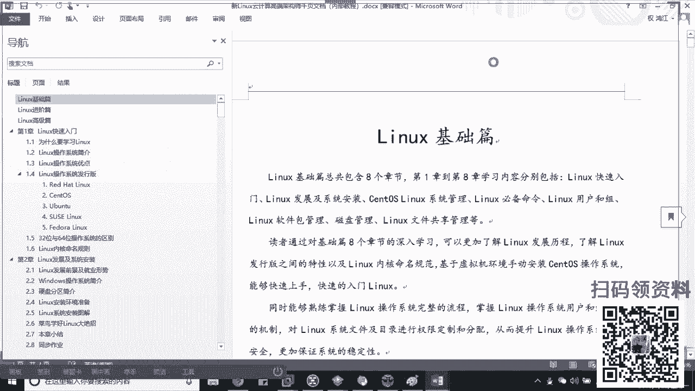
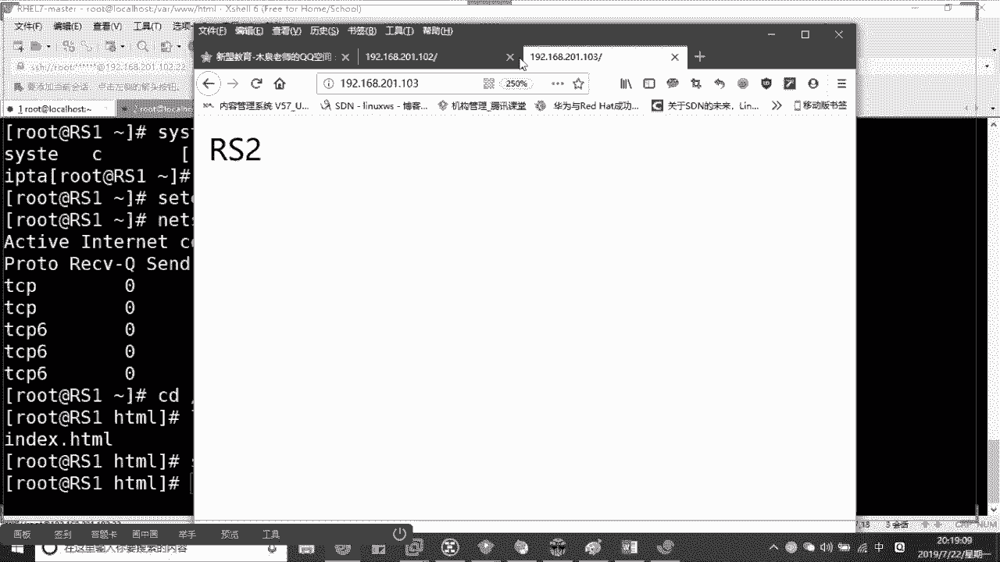

# 2019最新Linux云计算构架运维基础全集教程（O基础入门必备教程！） - P3：Nginx负载均衡+反向代理 - 洋洋得IE - BV1D4411Z7iy

Yeah。

了啊，那么同样也是我们腾讯课堂5万多家机构当中的top101机构，也是我们腾讯课堂哎官方认证的啊。好吧，各官方认证的一个机构啊呃除此之外的话呢，和我们阿里也是有合作关系的。

所以呢大家可以在我们的课程当中学习到一些阿里云的产品的一些个技术。那么除此之外的话，木学老师的话，可能比大家早一些从事我们整个的运维圈子啊，做这个运维，包括运维类的教育的话，我做了8年多的时间了啊。

那么目前来说，在咱们新闻教育担任我们的lins运维学院的院长。那么一方面做一个公开课的技术分享。另一方面呢做的是我们系统班的一个教学啊，那么除此之外的话，曾经在咱们这个五8了。

包括这个阿里呢担任过我们运维经理和运维架构师的这个岗位。那么现在的话哎我们在公开课上做的分享。我希望大家能够拿出来一个本子啊，拿出来一个本子干什么？跟着我去记录没同啊，跟着我的记录。那么我整容了。

可能有的同西老师我在书上看。有的都是我们工作当中的这个细节，理解了吧？啊，我的课的话，从美周一到周五晚上的这个7点半啊，都是开始的大起来。啊，周一到周五晚上啊。好，那么公开群的话，296621999。

你们可以自己去。加一下啊自己加一下。那么听课准备本儿啊，准备笔跟着我记。接下来说的话，老师有问题我可不可以直接在课上问啊？可以的啊，因为我们是直播的第一个学白啊，如果你连问题都不问的话。

其实和你在家里面看这个视频是吧？老师有问题，我怎么搞，其实都是一样的，明白了吗？其实都是一样的。所以呢你有任何的问题你都可以问出来，我给你做解答，好不好啊？那今天老师你讲的内容是什么？

O我们讲的叫负载君子藤的内容啊，负载。😊，所以呢围绕几个问题，老师，第一个对吧？啊，第一个老师哎，什么是我们的负载均衡啊？第二来说哎，负载均衡能够做什么，对吧？😊，负载用后能够。做什么好，再准确来说话。

他能够去解决我们什么样的现实问题，对吧？同学们哎，也说白了我学它对吧？我学它，我到底把这个技术用在哪里。啊，我把这些用在哪里？可以吧，最后的话哎我们如何来实现整个的负载支衡啊，如何来实现有回声吗？

有回声吗？我这个屋子还是蛮大的啊，笼音是不具备的啊，冷音是不具备的那可能是你那边把喇叭关一下就好了，好不好啊，我们接来说。好，我们先来说。那老师第一个问题，什么是负载均衡，对吧？同学们来，我先问问大家。

哎，我希望大家之前接触过负载均衡同学，你先给我刷个一上来好不好？或者是我呢压根就不知道这是什么专业术语，你给我刷一个二上来可以吗？😡，快。啊，有同学老师我接触过，有同学说老师，我暂时没有接触过，对吧？

呃，这个倒无所谓的啊，这倒无所谓对吧？呃，因为公开课都是从零开始的啊，我们都从零开始的。所以呢呃你不需要说老师我有多大的这个这个基础是吧？你重点听的是我给大家讲课的这个技术的逻辑，明白了吧？啊。

只知道N不知道负载均衡，是不是没关系，一点点的学啊，一点点的学都是从不会到会的啊。好，那么首先什么是负载均衡。我希望大家能够明白。那大家明白的是，就是我们在整个IDC或者在你的整个互联网公司。

你是一定要有服务器的，对不对？啊，服务器的目的我们是对外去提供相应的一个服务，甭管说是HTTP甭管说是FTP还是其他的等等等等的服务。啊，但是问题就会面临。随着我们的客户的增多。那大家可什么。

我一台设备，一台服务器是否能够哎能够干嘛呢？满足我们的一个需求。能不能告诉同学们，我一台设备能够满足需求吗？但是这个需求指的是第一个来说我们能够正常的去接收啊，并且能够进行处理，响应我们的数据请求。

对吧第二个来说，为了提升我们的用户的体验，对不对？我要尽可能干嘛尽可能使得我们在访问的时候干嘛？哎，我的甭管从延迟性来说啊，延迟还是也好，还是说从我的安全可靠性来说都会相对的平稳，能理解吧？

这也就是为什么大家说好说我做运维工程师，我要保证一台服务器7乘24小时的稳定运行。能理解了吧。啊，所以负载均衡的作用就是当我们一台设备老师都明白啊，一台设备大家告诉我。既然不够，哪里不够啊。

来告诉你们哪里不够啊。😡，哪里不够。明白啊，来问大家一个问题，计算机核心是什么？来人告诉我计算机核心的硬件是什么？来来来，吃什么吃什么告诉我。😡，来啊。我不知道你们有没有读过这个冯诺一半体系，对吧？

他把计算机的话化成了我们五大哎应用啊或五大硬件输入输出设备、控制器管理器和存储器，对不对？啊？哎，有人说老师CPU对吧？哎，其使是CPU内存，这几个都算啊，这个都算好，大家明白的，当我去接收请求。

或者我就是在本地我去玩游戏的话，我一定会消耗我的CPU和内存啊，对不对？而且从网络上来的信息一定还会消耗我的网络带宽，对吗？好，那么这两个甭管怎么样，老师我是买100G的，我是买1000兆的。

还是怎么样，它终究都会受制于我们的什么哎，受制于我们的整个硬件的性能。哎，对硬件的性能。说白了也就是我们长期的这个IO的瓶颈。大家来。IO瓶颈啊输入输出啊，我这个这个这个查询和这个注册就是输入输出。

对吧？那当我一台设备，那然，也就是我们的IO的瓶颈的问题啊。当我一台设备搞不定了，我怎么办？😡，我怎么办？我就得搞多台设备，对吧？那这多台设备，你不能说老师我买一台设备负责华北，一台，负责华南，一台。

负责华中，对不对啊？RAANANA和我们的长崎域。大家明白的，我必须这个华中也很大的呀，我至少在1个IDC知道了啊，至少1个IDC或者我们拿这个这个大家知道的这个阿里的话，在杭州水下建立个IDC对吧？

啊，那么有几万台甚至上十万台的某个设备。能理解吧？那这些设备可能只是负责某一个，比方说亚太地区或者说欧美地区好，它只负责一个位置。好，那么待好了，我们管管这些群体啊，管这些群体。

我们把它组建成的做集群起来。啊，叫做汲取。哎，很多同学就问老师，什么叫做集群呢？是不是？那么是通过我们多台的设备来共同追了，是共同协调啊，我首先要协调运转，同时能够相互辅助运行某一个功能来做。啊。

只是某一个功能。进来。此时他们我之前可能。一秒钟。啊，我之前可能一秒钟干吧，我们能够接收到这个这个10万的信息。可以吧？哎，我现在呢一台设备啊一台设备我肯定会宕机啊。😊，甭管网络。

甭管是CPU都会被消耗在空，对不对？所以干嘛呢？现在我把它扩容到没错啊，扩容到多少10台啊，那我每一台的好吧，我每一台只需要去处理多少，哎，我只需要去处理我们的一万的流量，大家看这个就相对轻松很多。

明白了吗？那么这就是我们负载均衡的概念。接来啊，附导什么概念。😊，而他的目的就是说诶去节省了我们或者说减轻了。哎，我们核心某一台设备的压力。啊，我们分别来承担他共同承担。看到没有？同学们。

那同时还有一个问题，你看好了，我不仅会减轻你的压力，我可能还会有一个效果。然后我不知道你们能不能感受得到啊，来，我们画一个图，你来看好吧，我们来画一个图。😡，啊，我来画一听好了，呃，鼠标在这儿啊。好。

左边的话是PC端，右边的话我都画了123我随便画的啊，有随便画的，画了4台设备，好吧啊，那中间的话呢是我们的互联网，我连接上啊我连接上。😊，哎Inter来。进来啊，这边的话是PC电脑。

这边的话是我们的server是吧？是我们的server。哎，我把它再框起来啊，把它框起来。那么这个把它看作是我们在IDC里边。可以吧啊，这个锅很清晰啊。😊，啊，处理一万左用是非常简单的啊好。了。

那么这个IDC里边我们管这些serv叫做service是吧？都个S负数啊。好，不要1234代好了。其实当我的流量进入到整个的IDC之后，我其实前面这个位置好了，这个位置我其实还会有一台设备好，学们。

那么这一台设备是谁好明白啊，这台设备是谁？我们统一的把它叫做调度器，听说过的人给我刷一。😊，听说过吗？哎，同志们听说过的给我刷一啊。我们管它统一叫做调度器。哎，你没听说过对不对？没关系。

你没听说也没关系啊啊。😊，那师调度器什么？那好了，调度调度什么叫调度啊？你今天升职了，人该搬办公室啊，这都叫调度对吧。哎，所以记住了，这个地方或这台设备我们只是负责接收我们数据的请求。😡。

然后进一步当好了，按照某种方法或者叫做算法，我们下发到下游的。服务器去除。好了，所以当我的数据达到这个位置之后，我是发送给一呢，发送给二呢，给三呢，还是给四呢？其实跟你就没有一点点的关系了。

对于客户来说。能理解吗？啊，同学们，所以我问一个问题啊，如果说原本到啊原本我现在的数据是要发送给我们的一的。😡，结果恰好不好，今天我这个一身体不舒服是吧？哎，于是乎我不小心发成宕机了。😡，可以吧。

我不发生宕机了。好，同学们，你告诉我。😡，语文。应该发送到我们这个一的数据。好，我问大家去哪里了呀？😡，去哪里了，告诉我。来，你们猜一猜好吗？哎，调度啊是分发过去啊。是分发到哪里去大数据。不要诉。

我一-7了，那我原本到一的数据去哪里了？告诉同学们。😡，到哪里了？来不知道刷2啊不知道刷2，好吧。😡，啊，不知道说二啊。保持在调度器里有人说了，是不是啊，那就有一个问题了，同志那就有个问题了。

RANA啊那就有一个问题了。那如果说我不停的进啊，我不停的进数据。😡，你告诉我，我不停的进数据，不停的进数去，那我肯定会把我的CPU带宽众都会占好占据了，那怎么办？😡，撞击了，于是乎整个集群蛋了。

我是不允许这样出现的，对不对？哎，怎么办？哎，看好了，是我所有的数据干嘛会被。😡，34去平均处理。所以你会发现一个问题，也就意味着我这1234大好了，都是我们的互相。备份啊互相备份起来。哎。

各自都是备胎。能理解吗？理解的话，给我创个衣上来。各自都是被害。所以也到了哎负载均衡本身，第一个来说，我们却减轻了核心的压力，对吧？解决了核心压力。第二个来说，哎，没错，我们会相互干嘛相互融。啊。

相互冗力，以此来形成一种叫做高可用的鸡群。对了啊。好，能理解了吧。啊，进来。这个是我们在现实当中举的例子啊，那你比方说我和大家举个例子啊，你比方说我们都经历过，对吧？马云苏立志老说搞百年双十一啊。啊。

反家都是一。大家我问你个问题，你们见过双十一的时候，这个这个这个系统崩溃吗？他不一定是系统包，你比方说他经常出现这个订单事项。提交失效见过吗？见过的刷一。😡，就是这一。见过吧啊。

这个其实在早几年真的是有的对吧？只不过近几年你基本上看不到了吧，是不是近几年。啊，今年这基本看不到了。第一个来说。啊，第一个来说呃，一方面呢是我们硬件的提升。另一方面的话是我们这个负载均衡的技术等。

当然了，也包括它IDC的整个的扩容，我又加了无数的设备进去。都是有关系的，能理解了吧？但是是太好了，它这里边它可能是进行了N层啊，一般都是2到3层的。啊，2到3层的负带之后。姐。

这个同学们就问老师为什么我要进行多层负载啊，为什么我要进行多层负载？😡，所以这里边呢我们就得从哎老师，我如何实现四坦学块来说，对吧？那么首先实现负债均衡，我们可以通过硬件，我也可以通过软件。

来硬件有谁知道吗？😡，你谁知道吗？朋学们知道的人给我刷一给我把答案刷出来吧。其实很简单，就在嘴上。😡，是在嘴边啊，我告诉你们都知道。啊，你们都是知道的。有啊。有没有啊有没有啊有没有啊内存吗？

看有时内存对吧？内存它是一直都在系统里面的对吧？它只能说缓存啊，它不能做负载就很的。😡，硬件起来啊，我不知道你们有没有听说过F5，知道吧？😡，这个键盘上最帅的他哥理解了吗？😡，来F5好，像什么呢？

叫我们nscale。😊，对吧像我们的red world。这来朋友们像A10这些。啊，我说的都是硬件设备啊硬件设备这些设备是专门用于我们负载均衡的。哎，他们都是由我们哎著名的，甚至说国内也好，全球也好。

厂商来生产的。能理解吧？啊，那么也就意味着一件事儿，如果说我想要用这个设备，你看好了。第一个来说买。😡，你得花钱买设备，知道吧？买完设备之后，他得买服务。啊，老师买什么服务？

我不知道大家这个用的软件是不是都是破解版的，你们应该听说过，哎，当然贵啊当然贵，这都是企业级的，企业机都是几十万起啊，便宜的，好吧，你就是最最便宜的也得十多万呢，明白了吧？😊，买服。

比方说大家都知道有个叫做license，听说过吗？啊，很多的这个东西都是要买license认证的凭证的。等等等等，对吧？甚至还有我们的服务费。等等等等。硬件当了，老师既然投资那么贵，对吧？

互联网公司大记住啊，互联网公司，我就是告诉你们，像阿里，你知道吗？像腾讯，我们所说的。😡，BD是吧？TMD这些公司他基本上都不用改。知道吧？他都不用的。😡，啊，因为一个问题，成本。和可控性。进来。

它基本上是零可控性，知道吧？因为里面的代码你是看不到的，所有的东西都是买来是什么样，你就只能用什么样。😡，能理解了吧。对于编际公司，对于互联网公司讲的是成本问题。所以这一套东西用在哪里？

一般像我们的金融。正确。一般像我们的国企，哎，同志们，我们是为了一个东西是躲避责任，知道吧？啊，怪不到我们身上，所以我们才会去用这些设备。哎，因为很简单，你甭管怎么样将是几十万进去了，理解了吧啊。

每年还要续的。啊，可以这个硬件上，当然出问题，直接找厂商，厂商帮你搞定。😡，明了吧，长山三歌。第二种就是软件了，大哥，这个是我们互联网企业的最爱。知明白，为什么？大家应该明白lindux来说是开源的。

明白吗？好。问你开源等于什么？😡，开元是什么意思啊？告诉我。开什么意思啊？😡，开约什么意思？来告诉。免费好，哎，我就知道有人告诉我，老师，开元等于免费，no知道吗？😡，把这个话记住啊，开源宝贝儿兄弟啊。

黄岩是吧？黄岩对吧？好，它不等于记住是不等于免费。😊，啊，他不等于免费。开源只是意味着我们开放了源代码，明白吗？只是意味着开放云代码。啊。开放源代码也就一本一件事情。同志们，我们可以进行二次的开发。😊。

在开发的好处是，我可以根据自己的环境进行制定。DIY能懂吗？那同学们，我把你没有必要的同学删减掉，哎，减少我的消耗资源消耗。😡，互联网企业不是没钱，而是把钱花在刀刃上。没有同学们啊钱，所以记住了。

嗯你就比方说ELK是开源的ELK的报警功能，记住了啊，是收费的。😡，开源不等于收费，不等于免费啊。好像，这点记住了啊。🤧哎，所以这个软件好处开源的好处大家都理解了。哎，RA明白对吧？RANANA啊。

就run是吧？其实能懂了吗？所以老师我将来将来如果去的是你如果说老师我是去互联网企业发展。那请你务必技术到位。你别说老师，我公司有钱，所以买硬件，no单一天政策一遍，今天该你上战场了，你啥都不会。

你就等着被取代。😡，明白了吗？记住了，你如果做不到核心的话，你永远不会。😡，啊，你永远不会说让企业给你一份情面，说老师我跟了他十多年了，他把我解雇了，放心，人家不管你明白了吗？啊，起来了。在软件上。

你们应该听说过的第一个唉N听说过吧，听说OK吧？但是中国最早用的LVS叫做LVS啊，大家都知道LV是吧？啊，大家都知道LV是吧？有驴牌的啊，但是加个S你能记住吗？😡，几了啊，加个S啊。

那其实还有一种叫HAprocyHpro。当然我们重点呢国内用的最多的是这个。啊，国内的最多的是这个。我一个一个说这两个我简单介绍啊，这两个简单介绍，先说最底下这个LVS啊同里面啊，我都给大家说过了。

一个企业里边我们最多是2到3层的。😊，四败均衡对吧？啊，那你比方说大家知道LVS先说理论的部分啊，然后我们结合实战来说。😊，VS首先来说的，它是我们中国啊最早时。而我告诉大家。

他的开发者或他的这个引领者，目前就是我们淘宝，或者说是阿里的科学家团队。对啊。能理解了吗？能理解它的重要性了吗？😡，啊，阿里是有自己的科学家技术的啊，所以大好了。

那么但是大好了它是比较容易的比较粗犷的一个覆载。啊，是我们现在见到最好的负载，性能最好啊。😡，性能最好没有了吧？性能最好，属于我们四层的负带。起来哎，我可以针对我的IP针对我的TCP这些协议去负载啊。

哎非常简单起来啊四层的。😊，好，但是是不支持。正则表达式的对吧我是不支持正则表达式的那也就意味着我在对流量上好吧，同学们，我对流量的区分是不严谨的。说白了大锅饭能懂了吗？男的走这边女的走这边。😡。

能理解吗？同学们，所以你可以看到它越不精细，可以负载的量也就越大。😡，因为我不需要花精力，明白了吗？哎，粗犷就是不精细，明白了吧？😡，粗犷就是不精细，不严谨。所以我在消耗内存的时候，CPU的时候就少。

😡，没有了吧，我只看你是男是女，我不看你是吧？三围我也不看你臀围。😡，能懂了吗？7月能懂了吗？让娜娜能懂了，其他兄弟啦来给我上一。这么个出货款明白了吧啊。而与它相对的N搭起来，它就是一个严谨的负带。

因为他数的是七层。行7动，那么它是要根据我们应用层的协议流量啊，哎，你是HTTP你是FTP是吧？你还是这个这个这个DNIDS了，你还是说这个这个还有什么协议啊，把一大堆了，对吧？等等等等吧等等等等吧。

好，弟们哎，你看岳言姐，那我HTTP大是网站，对不对？网站的话，我是拿的更进一步去支持你们的叫做正则表达式。说白了我看看你的域名，我看看你的网址的内容好，是否去包括了我的伪禁词，这些我都能搞。😡。

你看一下，那也就意味着一件事儿，我越是精细，我也得越要计算。所以我相对于消耗就大一些，能理解吗？所以我负载的能量就少一些。清楚了吗？同学们清楚了吗？啊，所以来看那么一个图，来看一个那么图。😡。

这个过我经常在我们的系统上给大家去讲。😡，じゃあ。こら。好。一般来说太好了。一般来说，如果你的公司的架构没有达到，一般都是300台的了，一般300台到500台。这样的一个集群。

我们才会用到这个LVS正则表达式是吧？大家有有问了是吧？哎，问问你们吧，正则表达式什？来，其他人都明白吗？其人都明白吗？记住啊，这个叫做用于去匹配，或者用于去描述字符的字符。啊，描述字符的功作。

我说这个小军，你真帅啊，我这是要一句话，对吧？然后呢，小军，你说哎，穆雪老师，你真会说话。好，你这句话是来形容我刚刚夸你的内容，于是你那叫做正则表达式。😡，能你懂吧。蒙总老人给我稍一上来啊。

这就叫正则啊这叫正则是吧？看一下，描绘一下你这个字符的特征，去匹配你。啊，当然这个我们今天不详讲啊，这东西我们今天不详讲好，大家来看这个图啊，来看这个。😊，来能看到这个图吗？四懂倍懂。没关系。

你后面会学到的啊，你后面会学到的啊。😊，我把这个图给大家打过来了，然后我把这个图给大家打开，发到公屏上了啊，发公屏上来。来能够看到的人给我刷个一上来，好不好？😊，啊，那看到人口上亿。

那么这里边我们涉及了很多的服务很多的服务啊。加人呢加人呢。大家可以看到啊，那么在这个服务里边的话，我们在这个位置上在这个位置上有一个是我们LVS的负盖。好吧，第二个来说就是第二层了。那这里了。

在我们的NG的覆盖。给个安。哎，安静自在好吧，来其他人呢我只看到两个人，一个小军儿，还有一个常崎遇是吧？小军儿还是我们VIP，所以我基本上都不用担心他控这这状态。那下面呢，风之雨、郑泽阳、若娜娜是吧？

然后这个噼里啪啦的一堆乱服，我也看不懂你的名字，忘记了残缺的记记忆啊。好，当然相人相人其他人其余他人快给我刷出来。能有刷一没有问题的，现在问问题吧。好不好？有问问题有问题问问题，没有问题给我刷个花上来。

好吧，花好刷一点就行了，快点的。😡，快点な。好，打然我们再下啊，那后面就花说花就好了啊。好来看。😊，大家就一个问题了，老师也不说N这个词嘛，对吧？那你这个位置写了一个ten正，看到没有？😡。

大家可以看到吗？我写的是叫什么？叫做TENGINE叫ten震。😊，哎，老师，你问我是不是大家记住了啊，大家记住了。😊，大家之前做的时候，我听说过NJ，但是我不知道N这个可以做负载均衡，对吧？

其实大家明白N这我们有三种用法啊，最基本的第一种领头叫作为一个web服务器，用于去展示我们的网站。这都是你会的。😡，手机怎么说话？手机你不用刷了，你给我刷一就好了，好不好啊？其实手机也有花，我不太清楚。

😡，我就那块了。好吧，第二个来说，大家记下来，第下来说等等NG的负载均衡。有了，老负载均衡。我讲过了，加上反向代理。😊，啊，财务代理怎么说啊，怎么说，大家还看这个图，还看这个图。哎呀，妈呀，不好意思啊。

还看这个图。😊，来下。来看这个图啊，我问一个问题啊我问一个问题啊，同学们，你们告诉我，我刚刚说了，你们至多至多是吧？你能够访问到A这个点，我画我写成A吧。😡，至多能够反反应到A这个点，对不对啊。

你能够知道你真真正正访问到的是1234吗？能吗？同学们能能刷一，不能刷2。😡，能能刷一不能刷二能吗？😡，那么。来来来告诉我告诉我告诉我在听的应该都能反应过来啊。哎，不懂对吧？哎，一个人回答我。

一个人回答我啊，好伤心啊。😊，啊，好伤心啊，哎，两个人回答我啊，心好痛啊。😊，啊，吃好痛啊。点人呢。哎，不能三个人啊，好吧，勉勉相觑嘛啊，你是不知道，对不对？还是不知道，对吧？所以搭好了。

那么这台A叫做调度器，它也叫做什么呢？叫做我们的反向代理。😊，代理代理哈，朋学们代理者是我要去代替你去处理某些东西，对不对？那么我们会分为正向和反向好了，今天只讲一个反向啊。😊。

反向代理服务器作用于我们的服务器。前端。现在作用于我们的服务器前端啊，用于去代替我们真正的处理数据的服务器，去接收我们的请求啊，接收请求。啊但是。不处理。不处理。而正因为我代替你去接收了。

所以我能够去保证我们后端的设备的信息的安全。K到吗？能get到点赞给我刷一了啊，能get到点的给我刷一了啊。😡，你能盖到点的话算一。我烧花也行啊，刷一烧花都行啊。可以吗？能ge的到点吗？同志们。😊。

刷一了，这叫做反向代理啊，保护了我后端的安全嘛，对吧？哎，客户端不知道公网上也不会知道它来来来来来。快到个这给我刷衣裳，美妹们。快点快来点快点快点快。快点同志们，其他人呢？哎。

没明白小青蛙没明白什么代理啊，代理商听说过吧，他是代替你去处理了某些事情的那我们这里面干嘛？我这个A是不是代替了我们后边这些人去接收的请求啊？😡，而对于我们的客户端，甚至对于我整个互联网上来说。

我只能够看到A，而我看不到后边的，所以我被保护了起来。😡，能get到吗？能盖得到吧。啊，就那么一个意思啊。姐。O。😊，这是第二种。第三种拿进来了，它要做一个我们的web的一个case啊，case换存。

啊，或者说来提升我们的访问速度。哎，客户的体验。起来啊起来起来。😊，好，到这一步，大家有什么问题吗？蓝朋就要给我刷一了啊，你们大部分人都知道这个。但是现在我们记住了，公司里边百12%了。

基本上国内的公司都是用作了负载均衡或反向代理的作用。啊，他这么去用的现来。好。呃，看一下还有什么问题啊？😊，进来吧。来有问题吗？同志们。老赵老天啊。好，那我们开始去实战一下，好不好？我们去实战一下啊。

大家需要注意，题看就是N g n啊家记住了这个地方我一定一定要再三强调啊，我必须给你们画上无数的标识，知道吗？我必须给你们画上无数的标识啊，为什么给你们画上？因为很简单，大家记住吧？

这个是我们现在企业必用项，知道吧？企业必用下啊，同时。呃，浏览器那个网页也是Nex一组吗？网页可不是啊N界面浏览器那个界面浏览器不是啊。浏览器是个程序的吧，我说的是服务器端提供网站的一个服务。

才认这个字。第一个是企业并用向，第二个是我们的R种去做运维。啊，如果你要去做运维，请你注意了，这是我们面试的。逼了一下。你起来吧，好吧，所以李老师，我将来想要跳过这个技术行不行？no门儿都没有，知道吗？

门儿都没有，哎，谢谢咱们其余啊，谢谢咱们其余。甚至我可以大家看一眼啊，这个如果答家好了，老师，我想测测自己的能力，你可以来找我要这个阶段性测试题，可以吗？啊，那么这套题如果你都能够做下来。

我说你能够自己独立做下来，不翻任何的文档，那恭喜你你能够达到一个中级运维的水平，明白了吗？那中级运维的水平，如果你在北京的薪水应该在10到12K，应该在10到12K。😊，啊。低的话可能是8K。

高的话可能123，明白了吧。那第二个来说呢给大家看一个东西啊。在哪里治理？你在看懂那些英文，不，大家别着相，明白吗？别着相，这个英文指什么？你能明白一个问题，小子啊要明白这个NG也好，它只是一个名词。

理解了吗？就跟你叫小军一样啊，他叫lucy一样，他叫小明一样，知道吗？他叫买买提一样。😡，能理解了吗？它只是个名字而已，你能知道物权是什么意思吗？能理解了吗？你只要喊示个姓就好了。😡，就这么简单。や。

啊啊还有一个东西呢，是这个地方呢，我以看一下，给你们稍微扩展一点啊，这个是我们内部的VIP的杰课文档。啊，最后到。呃，测试那个你现在还没学到呢，没着，别着急，好吧。好，给大家看一下这个好吧。

这个是我们内部的文档啊，所以这个不能给大家发的啊，一共得有1000页吧啊，我们基得我我总结了1000页，可以大家看一下。大家看一下。呃嗯，这个在这呢。😊，大家可以看到吗？大家可以看到二双一。😊，看到吗？

但这次一共你要学的东西有那么多啊，有那么多里边的话还会涉到各种各样的什么油画啊，什么巴拉巴拉一大堆了，看到没有？我这边的话一共是多少页，一共是一共是900多页。看到，一共是957页。知道下次看不懂了。

你那段才学多长时间啊？😊，那还很多了，技术啊。所以呢你如果是如果想自己学，你可以按照我这个的架构去学，对吧？这些都是我们企业利用的。当然还有一个小的技术，小细节点，我可能是科上在讲好吧，那我们接来说好。

我们接来说。我们先来说啊。ああ。啊，接着看接着看接着看啊。那最后的话我们来实现一下它吧，好不好啊，缓存应该不用我说了，缓存说白了，知道为什么你第一次看那个片的时候那么卡吗？第二次的时候贼拉流畅。

没有了吧啊，就是有点缓存的作用，缓存到你本地了。当了我们N这个字，哎，我们做的实现实现的实现的一个。呃，一个一个项目吧，好吧，实现项目好不好？那么这个呢话我们会用到三台设备啊。

三台设备其实就是架构了那么一个体系的，好吧，就是架构那么一个体系。那么这里面的话我们会有一台的。😊，是吧一台我们的调度器啊，加上我们两台的这个这个服务器处理数据。那为什么有时候网站第二次就打不开了？

因为你做了一个清除缓存啊。😡，我明白缓存存在哪里啊？缓存是在那内存当中，知道吗？😡，内存是一个非持久化的数据，你只要把数据这个这个电脑重启，那个数据就没了的，要得重新去找它。没有了吧，你得重新去找他。

😡，加起来哎，一共是三台设备，好吧，我这边给大家已经准备好了啊，我们把它连一下。😊，啊，等一下。或者呢你说老师我开启了无核浏览，无核浏览最大的作用就是我不去记忆缓存，能懂了吧？啊。

所以你为什么你会觉得卡是在这里的啊，不对，为什么你觉得老师没有东西，是因为在这里呢啊，接来。😡，好，稍等啊，我把这个地方。😊，整一下。手机手机怎么了？手机上要看你的运行内存啊，对不对？

如果你后边后台运行了N多的服务，占据了你的运行内存，其实你再去访问的时候，你的内存是不够的，所以就是慢，理解了吧？啊，说白了你的这个东西面前有100斤的粮食。你这个胃口只有10斤，你怎么办？😡。

吃得下我吃不下。啊，三代设呗连接一下。好，在这么年纪下。看好了，那么这里边我把IP地址给你们啊，把IP地址给你们一台叫做master，好吧，一台叫做master。哎，我们的IP址192。168。201。

102啊，一台叫做slove。😊，192。168点。201。103。啊，还有一台叫做cloud啊，还有一台叫cloud，192。168。201。105。😊，进来。简说了，如果你的内存不够用。

当你去访问新的内容的时候，你老的内存会被清除掉。😡，明白了吧啊，这是一方面本地的。第二个来说，你能保证你的，但是你保证不了对方服务器。如果对方服务器出现了网络带宽的延迟，你搞不定他。😡，明白了吧？

这个不是一个问题造成的，你要懂的啊。😡，啊，你要明白一个问题，这不是说单向的问题，明白了吧？你生个孩子还得俩人呢。😡，把拿起来好吧，那么这里面记住了，哎，这里面记住了master这台设备呢。

我们作为我们后端的一台服务器叫做RSre server真实服务器，这台slogve叫做RS two，我们把云这台叫什么叫做LBlobl负载均衡。哎，改个名字post name是吧？LB啊，这不是LB。

这个是RSS几啊，这是103是吧？RS3。😊，Pose name。LB。好，pos内这个对吧。パスタも。S1开起来啊。来，你看首先来说到好了，我后边的机器啊，我先装一个系统吧，装一个务器。

要么一 store杠YHTPD好不好啊？我这个把我先安装上这个网站服务。😊，你先把网站装上是吧？那么按照正常来说，大家知了，按照正常来说，哎，其实RS1和我们这个RS2的话，它的内容应该是完全一样的。

理白吗？应该是完全一样的。但你不知道你会被负载到哪一台上去，你不能说老师，我今天在淘宝上做亲趣用品的，明天是吧，改成卖宠物粮食的。😡，🎼是不是不能这样子，你的店铺明白了吧？所以完全一样。

但是我们这边有差别的啊，所以呢我们把它改一下，为了实现看到效果好吧啊，为了看到效果。嗯。给了一个内容。哎，对，阿帕奇中的啊中的阿帕奇叫APACHE啊，AACHE也记错了啊，叫ABACE。

🎼写一个主页是吧，然后启动它的start HTPT开启注意了，我后面要做的关闭防火墙起来啊，关闭防火墙好。😊，两个。三个把这三个防火墙都关掉，好吧，后面也是一样的，appleRSSQ。

这两个没什么难处啊这两个东西没什么难处啊。😡，好，边讲那个你们做好吧，边敲灭点。大叔说，我看不懂你敲什么。😡，你用看得懂吗？大就你不需要看得懂，明白了吧？😡，因为这个部署的视频你后边都能看得到。

明白了吧？哎，文档我也会给你们，你们重点学的是。😡，逻辑是覆盖制衡的逻辑。我为什么用它，我解决了什么问题？好大起来，这才是你要学的，起来啊。然后我们继续来看。好，让我们记着来看。打开之后。

我们打开浏览器啊，打开你的浏览器。😊，呆个段子。干嘛呢？我们输入一下IP地址，好吧，我们输入一下IP地址。192。168。201。102，对吧？大来看哎，稍等啊。呃，这啥情况啊？写这n state。

102没有是吧？这是102对吧？稍等啊，拿d3LND我找一下啊。呃，80启动了80启动了哈。好，我知道哪里有问题吧？😊，呃，我清空一下我们的，我进去啊。稍等啊。啊，我清空一下我们的这个缓存吧，好吧。

这个之前我做过过这个做过我之前的这个这个这个东西了，我做过好吧，我做过之前的一个实验，所以没有清数据，我清一下啊清一下。好了。好啦啊，刷新一下。创新一下。达我把它关掉。

然后重新的启动它一下s cTL freestar。HTB重启一下。好，进成功来再来输入。卡192016806602走。睡觉了吧。对吧ID说不对啊，没问题来看好，我访问到了吧，正常访问到了哈。

那这一边的话，1920168。201103。😊，轻功缓存啊否则会有出错啊，两个能看到同学们。😡，两个能看到吧。现在重到的来了。😊，我是负载君衡对吧？我是负载君衡。

我的目的是我能够访问到你这台的ID192。168。2。1。105。😡。

我设要访问到这台设备，对不对？让它自动的跳转到我们的哪里呀？102和103上去，对不对？😡，所以第一幕来看大家注意了，我又安装我们的NJX。我安装安这个。60。安装N g的时候啊，我们有几种落地的方案。

第一种它可以采用亚码安装，第二种采用原码安装。啊哎，到了。那问题在于说，当然了，基本上我们现在在企业里边啊跟docker有什么关系吗？哎，啊，那现在基本上来说记住了啊。

基本上来说我们在亚巴上安装anex是极少用的啊，这个极少用。除非老师，我是BAT我们进行过二次的开发。然后呢，我们自建了一个亚么的仓库，软件仓库。哎，我们并且进行的批量部署的作业。

这个时候我们就压他去抓。😡，能懂办？啊，那正常对于中小企业，老师，我没有开发团队啊，那恭喜你们要做的就是圆满。没有了吧啊，圆满无。因为源码不署，你可以有选择性的去安装我们N94的功能啊。

我这边还没有讲到刀粉，所以我们没有设计那东西，明白了吧？家。这个哎原码安装。你docker装，其实你算是docker装嘛，对吧？啊，你只是把docker做为一个容器，作为一个平台，再去架构其他的服务。

这个不难的，没有吧。正面难的是什么？难的是里面的逻辑嘛，对不对？包括原码，大家为什么要给你们讲原码啊，因为如果你后期老师我要去这所国企还是一种啊国企，或者说是我们这个这个这个这个这个呃一些个传统型的。

企业。你知道吗？你是不能够使用gam的。😡，明吧？你是不能实现吗？你甚至觉得原版也不行。😡，知道弟们？因为很简单，它不联网，不联网就意味着很多依赖包是没有的，怎么办？你得把TAR转换成RPM。😡。

知道吗？你把TAR转换成RPF，你会吧？😡，他用docker知道吗？在国企里边是不准许用太多虚拟化的，docker都用不上。😡，顶头的一台KVM。顶投这头一头KM明白了吧？你得分情况，为什么要都要会。

知道吧？😡，所以N这次原版安装有三部曲，大家都明白了啊。第一步预编页，第二步编页第三步安装，记住了，这三步列了吗？这三步啥意思？来需要我讲的，刷个一，不需要的话，刷2。😡，需要吗？不者多不会是吧。

没关系，我给你讲，讲完你就会了，知吧？同弟们原码装困难点，我先告诉你们，困难点在于它出现了问题啊，我们需要安装什么，安装什么依赖包。😊，对吧安装什么依赖包来进行解决。这是你们大部分人初学者。

我不知道是吧？百度周折命令啥意思，我也不明白。😡，好，大家记住了，我讲完你就会了，知道吧？大家好了，首先来说源码包啊，源码包哎，稍等稍等好们。😡，所以说源码包它实际上是一个标准的压缩包。哎。

在linux下TAR点GG。好，那么它就类似于我们在windows下的。RRCIV知道吗？这种包好，所以大家告诉我，当我获取到这种包的时候，我第一步要干什么？😡，要干嘛要干嘛？获得到压缩热吧，哎。

解压对不对？你明白了啊，解压。😡，当然了，这不是离谱啊，接好，接之后，你会获取到一个同名的目录，对吗？😊，告诉。告诉我告诉我对不对？好，那么然后老师我会选择进入到这个目录去找一个文件。

这个文件可能叫做set up EXI可能叫做哎叫ESE啊，或者inESE。😡，对么叫做可执行文件。😡，点ESE嘛。😡，能理解同学们好，那么好了，你执行这个过程其实就叫做预编译。

只不过我们在linux下叫什么？叫做confi。😡，再见。脚本文件。对吧脚本文件，也就是我们的可执行的。简然啊，也就是我们的可执性文件。同时大家想一个问题。大家想个问题。那么我在这个过程当中。

在你进行下一步下一步的时候，你是不是要去选择老师，我安装在哪个目录下。😡，你安装在哪啊，我去进行什么这个功能的安装。哎，老师，我装个QQ是吧？我装不装QQ音乐，我装不装QQ浏览器，我装不装QQDN。

这是不是都是自定义的告诉我同学们。😡，但是如果你选择安装，是不是就要比你那种快捷的安装方式要耗时啊？😡，能懂吗？要耗使啊。而且他都是能力的同学们好吃吧好利吧。能唔录啊好，能可以。这只是第一步。😡。

这理も。第二步打好了，预编译就是这么一步。而它其实的作用就是在我进行这些功能选择时候，进行我们linux环境的检测。说白了，我看看你缺啥组件，你们在windows下其实很少见到，但是大家看到。

我不知道你们有没有遇到过windows下经常告诉你缺少什么什么点net for work for work的，见过吗？什么框架，见过没有？😡，就是这一。见过没有？尽量缺少吧。哎，记住这一步也是这个意思。

也这意思。好，但住了缺啥补啥缺钙吗？补钙知道吗？跟它是一样的，那么这个缺什么，就可以通过我们的亚麻去安装一个外包，就这么简单。就说叫做豫变译好。哎，乐者你既然是来检测这吧环境，那就得有正式环境，对不对？

就得有正式环字。所以玉面一玉字在这个玉字上拉起来，重面在玉字上。😡，编译编译来了，重点大家记住这是核心所在。为什么？记住了啊，因为原码包。那它的本质是C，是C加加。我们管它叫做程序设计语言。

带你来说高级语言啊，问你们个问题好不好？😡，计算机是什么？来，计算机是什么？😡，就军是吧？认识吧。认识吗？同学们记得你认识吗？😡，计算机认识吗？计算机可不认识啊，记住了明学们计算机不认识这种C。

这种java，什么python的，知道吧？没有明白，因为它只认识的叫做机器里。0。记住哎，二位进制，那我问你个问题吧，好吧？我扩展一点啊，大家知道这个零和一是怎么来的吗？😡，不总。零和一是怎么来的吗？

😡，这怎么来了吗？知道吗？白好瓜。这部分属于扩展了啊这部分属于扩展了，你听懂就听懂了，听不懂也无所谓的。😡，同学们，因为这个属于硬件层次的。😡，啊，第no不是啊。让我明白让我明白。😡。

零和一其实是最最接近。什么这这叫物理信息的。懂懂吗？啊，那你知道的老师，我电脑话它有个东西叫做CPU哎，对，开关对吧？老师问我CPU。对吧叫做中央处理器。啊，我们获者把它做运算起源。好。另外一个问题啊。

预算器和我们的控制器。啊，中央出理记。大家记住，它是只能做加法的。到了，你们见过没见过老式的这个上面，它会有很多的针脚啊，见过吧？很多针脚见过没有？朋友们，比方是这样的，比方这样的，比后这样子。😡。

我有没有画出来啊，可你没画出来啊？好。那么这个地方是我的一号数据，这个地方是我的2号数据，这个地方出来是我的数据的结果。写啊，结果好。大好了，物理物理我如果想运用它，我是要有电信号的对吧？能理解不明白。

电信号就会导致我们在主板上连接CPU这个过程当中是一个一个的小开关，一个个的小开关进来。这个开关如果是闭合，它则为一。如果是打开则为0。能理解了吗？是这么来的，计算机指的是它能懂？明学白。起来了啊。

那问题在说，老师，你们认识零和一，结果他给你是C和pyython。😡，搞得开玩笑的是吧？跟中国人说外语听不懂啊，怎么办怎么办？那你中间就得有一个翻译，明白同学们。😡，C住B级C。啊变译子飞译。

说的再通突点，你们在windows下去安装的时候那个。绿色的进度条见过吗？它其实就是在编译的过程当中。最后安装就不用我说了吧。哎，老师finish点击完成。就这么简单了。好吧，同学们进来啊进来。

那么男的其实真的是这个男的就是这个缺什么组件啊，装什么东西啊，所以搭好了，后边我们所讲到的所有的问题我都没有你们遮掩，请你们务必总结。那你跟我说，我去百度啊是吧？百度不也有吗？大这里面就有个效率的问题。

你知道吧？😡，这里面就有一个效率的问题了。其实我在讲课的时候，更多的是希望教给大家的真的不是单纯的运维技术，而是运维习惯。你们能懂吗？就说白了，为什么有的人人家一分钟能够做十件事儿。

你一分钟只能做一件事。😡，因为原一个东西叫做运维最大的习惯，最好的习惯叫做积累。知么叫做积累，我可以给你们看一下我的学生。😡，给你们看一下。好，朋们看一下，哎，我们往这边来看，给你看一下啊。

那网毛我给你们看一下，找一下。😊，不达。大家看了没有？大家能够看到我这边的话给我刷一下来，看到没有？我后面的只做了一次，但是我没有时间了，我没有坚持再写，看到没有？我实际上做完了还是在坚职选个课。😡。

现在有2万多的浏览器，看到没？2万多览器34篇文章，那一篇文章的话，浏览量才多少？同学们知道吧？😡，一问一篇文章的话是多少？看到没有？而他告诉我说，我最近有点懈怠了。😡，这就不好了。

那么我说积累是非常重要的，知道吗？我现在每周还会定期去写东西呢。😡，听吧朋友们？那前面我们都没有写，一直补，没有补上的没有点遗憾。😊，那学习是一种习惯的，是一种爱好的，是一种要有热情的东西的，能明白吗？

所以我在教大家东西的时候，我希望你们学到更多的是一种习惯，是一种积累，而不是这堂歌老师，我听完了。😡，我就是给大家的录屏，其实你真的不见得回去看，知道吗？😡，知道吧？因为你不会学习，有的人。😡，啊。

大家进来吧。啊，所以这个地方我会告诉你们请能不必起来，好不好？😡，所以第一件事待好了，记录一个网站叫做3W点NG点ORT。这个是我们NG官网。啊，点击里面有个登录的按钮，看好了。

在这里面我告诉你们选择1。14点右键复制下载链接，右键复制定制链接，看到没样？好，回到终端上。好太好了。第一步，安装一个迅雷下载器。😊，叫WG迅雷啊，记住叫做迅雷，知道吧？😡，啊，我说的都是实话。

知道吧？我上次不带跟大家素这招弯子，知道不知道？😡，这个东西就是数贼W艾啊，W大家记住啊。😡，网络朋友们？哎，盖上或血，网络或血迅雷一个事啊，霍老师快播是吧啊，也行，是不是好？😊。

然后下一步Wge获取的，看到没有？刚刚你复制地址下载。😡，小么下载过来，好的，是不是那之前是没有的，然后你获取到一个同名的一个什么压缩包，对吧？😡。

第一步干嘛？解压知到了？解压记住命令别死倍啊，命令别死背，我就告诉你TR解压X表示解压F表示指定文件，老师指定它解压。😡。

然后我们得到了一个同名的目录吧，下一步，老师进入目录。好看一下同学们是不是有个confi。对你就把它理解成迅雷就可以了，就是下载软件。😡。

下来同学。同见了吧啊。😊，我就是方便你们记忆命。

好，到了吧？点杠cr注意啊，点杠表示在当前目录下执行，记住这个脚本必须使用当前目录下执行。ggpreface大人来告诉你们，你们告诉我这指是什么，你们说我来说正确，你先动脑袋。😡，好吧。

大家知个学东西别上来就问，一定要先动脑子自己先分析来告诉你们这个参数的作用是什么？😡，这参数的作用什么？😡，来自己去吧，自己说。你们说我给你们答案是吧，我给你们答案。😡，一看有人就错了，知道吗？

有人错了，什么意思？但是这个地方什么？告诉我，这是什么？这是06下的目录，对吗？哎，这不是目录嘛？所以你用这个东西用来去指令我安装的目录，对吧？😡，C盘C盘里面的中日友好交流。

中日友好交流里面的苍老师会谈明白了吗？😡，啊，这么简单，然后buau sir。😡，刚告group等于。N这个啊，杠杠raHV杠SSL杠model哦，当了，注意啦，这后边。

这个你应该知道SSL是吧安全套接是我们的安全工作啊，加密认证的功能选择功能模块啊，那这两个叫什么吧？这两个。是吧他说，我们所有计算机上运行的服务一定要有负责人。你不信打开你windows上的任务管理器。

😡，啊，你打开了。他找找什么，你点开这里面有个详情，知道吗？😡，找到乡亲。不要相请大哈。这边必须得有个用户，对不对？哎，我说白了，我得最后发现谁在用它，能理白吧？那么回车知吧，这个过程就是豫编译。啊。

这过程就是鱼变译。好，出问题啦出问题啦。出问题了，改好了。com error吗？ar后边就是告诉你干什么了。😡，告诉你告诉你C语言的变译器没有C语言的变译器叫的CC没有发现。😡，好的哈。

缺一个编译的工具，那么就亚麻因杠YGC。下来。到了。这个解决的方案就那么残暴，就那么简单。😡，走安装。啊，就那么简单，来，我给它翻过来啊。可以吗？同志任。啊，到了。正是当我安装好之后。

请你重新的进行预编译。能讲啊重新遇别一，说白了，你是没问题了，别人还有没有问题啊，是不是我还得继续去检测问题了啊？😡，继续去检测。唔知啊。啊，我还得继续选择，所以我还得再执行豫兵役。😡，的再执行的原因。

再行预备一啊。😡，再是这么原因。好。60这边看我们还有没有其他错误啊，同志们还有没有其他错误啊？😡。

同学请你注意了啊。如果老师我后边想学的话呢，大家领取我们这张优惠券。好吧。那么这张优惠券的话，是我们现在一个课程活动的优惠，1个500元的优惠券啊，1个500元的优惠券。给你们搬过去吧。

我给你们发过去了。好吧，大家是可以记续令啊，迈看。😊，大家注意了，老师我又获取了一个错误，你注意我先装，然，我给大家讲。😡。

对吧。这是这个问题的解决方案。找啥问题啊？

啥问题才是问题，对吧？来。同志们往这边看往这边看往这边看往这边看啊好。😊，现在告诉你干嘛看你就找arrowarrow后面这句话告诉你，HTB重写的模块需要。😡。

PCRE的功能户。能看懂吗？来看懂啥一。来看董少一。看到没有？好，大家记住这种方案看不懂，没事，翻一下，百度都有知道吗？百度翻译一下就明白了。😡，但我告诉你看重点词儿知道吧？看重点词儿。

那么这里边但凡是缺少什么什么libary，大家记住。😡，统一记住啊统一记住哎，统一一下我们的解决方案。决方案干嘛呢？要么instore安装一下这个的叫做开发组包杠dble。你光装它不管用啊。

你得装他的dble包，所以安装。😡，可以安装。安装之后，我们再来看看学们，然后我们再来预备E。记住啊，直到它没错为止。是吧直到他没错为止，所以来看啊，稍等，同志们稍等稍等。对，缺啥补啥知道吧？

缺钙补钙啊，缺什么补什么，就这么简单吧。😡，来看大家看我白还没有错啊，还有没有错。好，来吧，同志们又出问题来告诉我，要么in store杠Y装什么？😡，装什么把全称给我打出来，你告说老师。

我知道我就打个缩写，你放心，你看我就知道你们打缩写open XSL没了吗？😡。

听讲效果50%。😡。

你梦险，你撞着他还解决不了问题。我为什么让你们打全称？因为你现在怎么打，你将来也怎么干？😡，你别告诉老师，我以后会这么怎么样的，你放心，我不信，你知道吗？😡，你知道吧？你自己都别信，你知道吗？😡，啊。

所以你们告诉我怎么办啊怎么办？😡，怎么办？快点。哎，no你看看看你就不听话，你知道吗？往这看往这看看这儿，我不说么缺什么librry，装什么杠deevil嘛。😡。

是吧。哎，你不得装这个钢挨我吗？啊，宝贝儿，咱这个咱这个听课效率太差了啊，你要是这样子的话，我就得找你谈是吧？啊，你感感情你不是我的学生吧，你就庆幸吧啊。😡，是，你要是我的学生的话，我现在早开骂你了啊。

来。😊，哎，记住好太好了，做完之后，我们再来预编译一下，好吧，再来预编译哈。😊，再来再来再来。😊，看看还有没有问题是吧？教看我们还有没有问题？啊，别着急别着急，耐心的等待是吧？请你耐心的等待。好，大拜。

😊，到这一步老师我也不知道有没有问题，是不是，但是变样子了。好，那你出一个ecle dollar问号，如果返回的是个零，上一步没错，知同学们？好，下一步预编就好了，改编译了。😡，B叫做魅克进来好。

杠G来提用8倍的速率来安装。大家知道这个指的是你的线程数跟你的CPU挂钩的，知道吧？你别瞎给数，2481632跟你的CPU是挂钩的。😡。

and and啥意思啊？就是与的关系。如果我编译正常，我们执行安装叫做make is store。啊，没给错也是8倍速率走这。哎，大家看了编译和安装的过程啊，这个不用我说了，稍等一下哈。😊，啊。

我们就稍等一下。啊，我们稍等一下。爸爸啊。世间是一种靠不经的。哎都想唱歌了是吧？啊，孟说老师那个好happy啊，是吧？😊。

啊，你们知道吗？就实当老师的话，有时候只能自娱自乐啊，这个事情跟你们简在吐吐槽是吧？啊，为什么呢？因为我们现在除了教学生，就是说我们自己研究技术啊，你说老师你天天研究技术，你也不烦吗？其实说实话啊。😊。

我讲速度有点快是吧？讲的太东西有点多。今天讲的说实话。😡，我慢点好吧，我讲的有点多啊。呃，简单再说一下刚刚那个命令啊。简单说一下刚刚那个命令啊啊，这个我这一激动啊，我这一讲讲嗨了，我就容易坏，知道吧？

啊，律变也给你们命令了啊，别以就这么一句话，叫的 make刻，知道吧？安装这个make installstore。我如果想让它同时运行，知道吧？那你就只能end end，知道吗？同学们。make和m。

你错你了啊。这没意思，因为太熟了，真的，因为熟的不能再熟了，跟他知道吗？因们就是与的预算就是前边成功，后边才执行，对吧？前边成功，后边才执行，就那么简单。好。你放心，该慢地方我肯定慢了，知道吧？

男人的话还是不能太快的，知道吧？到了到这一步，apple dollar问号返回零，安装成功。来快。鼓鼓掌是给自己快给自己鼓鼓掌啊啊，给自己鼓鼓掌是吧？能跟上我的给自己鼓鼓掌啊。😊，好，然后唉好嘞。

那后来看同学们下一步就干嘛了，你就得干啥？第下一步就不再给你们了啊，就是我们的启动是吧？启动你注意了啊，那么启动的时候你注意了，它不像你windows老师，我装完了之后。

它自动在我的桌面上生成一个启动快捷方式，no啊，nolinux比较含蓄，好同学们，你装在哪里了？我装在了userloc n下，对吧？😡，对不对？同学们啊，我说的摁这下N这下看好了。

有一个文件叫做SB是吧？啥呃，呸啊，叫个SB啊拉进来。😊，叫做super bin超级二进制，它里面存放的都是脚本，知道吗？😡，它里边存放的都是脚本，看绿色的都是脚本。毛同志们。

你记住做运维的又想运回工作过得去，你怎么都得一片绿，知道吗？因为记住了，绿色的表示成功，红色的。😡，你就要酷了啊，红色就要哭了啊，所以看好了，点更本环境下启动N这个。

好，结果出现了一个报错。当好了。这个报错指的是。😡，家，这个报错指什么呢？指的是你缺少NG的用户。😡，能懂吗？😡，能懂吗？所以请把用户给他添加上。啊，添加上。

然后userloc n再来启动它正常的执行了，看到没有啊，这个是正常的执行了。

好来问问大家吧，财会长。😊，NG的端口号多少？😡，来来来，告诉我默认NX顿口号是多少？😡。

快讨考你们。啊，该你们回答我了，少我讲一节课那么累。不行啊不行啊，为什么随便创建不行，你问了吗？小大，你问问我在这个位置上用的是谁啊？😡。

用的是N这个3。能理解吗？你如果底下随便创，那我底下也得跟上的是别的，知道吧？这个地方是被统一的啊，这种地方统一的啊。😡。

哎，默认是端口80啊是吧？默认端口80啊，大姐啊啊，要师80，你怎么知道是不是80呢，是吧？很简单啊，你把这个N去掉，你把这个N去掉啊，我们这么抓吧，别抓吧，别抓了。N去掉的哈。

HTDP就是它N减X知了。😊，啊，进来。看到没有？APP就是8点。好，启动成功了，老师我访问一下他吧，是吧，192016862010102105是吧，165走哎。🎼好啊。

防火墙美观啊防火墙美观sstem啊，sstCTLtopf沃。😊。

啊，然后F tables3linux。

走。再刷新一下再刷新一下。走来看看到了吧？啊，快快快给自己鼓个掌是吧？木肖老师你怎么这么爱要鼓掌了，是吧？😊，你知道吗？有的时候我们你知道我我是天津人啊，我是天津人。所以呢我们一般讲课的时候呢。

会自带一个这个这个相声属性是吧啊，相声属性，所以呢啊吧不不爱要相声的演员不是一个好小事。啊，明白吗？好，干好了。但是老师，我的目的不是这个呀，你不是说负载之衡吗，对吧？我访问到你自动跳转。

是不是我得自动跳转啊，实现。😡。

好，改开了啊，那么你就要进入到。你的N这下到了，还有一个东西叫做confi文件，看到没有？😡。

confi就是我们的配置进来先进来啊，进到这个目录下，那你会发现有一个文件叫做engjectcom文件。这个叫做主配置文件，说白了这个n长得什么样，是金发碧眼还是长发飘飘是吧？还是这个矮冬瓜。

都是由这个基因组成的。这个基因谁控制，你控制，明白了吗？啊，那么进来大家看到是那么多东西，哎，我看不懂啊，没关系，你就看你需要注意的好不好啊。😡。

这不就是0的105吗，对吧？啊，到了。你要改的东西很简单，往这看啊，大要了。第一个是root。😡。

这个 root头了吗？😡，我把它改掉。叫HDV冒号杠杠wiserv掉了。老师啊，root表示我访问的根网页在哪？😡，我现在告诉你葛位王爷在哪，在这个路径下。白没有什白？那这个路径在哪？往这儿看往这看。

那我们就要在这个serv味上面给它加一个这个up。😡，Stream。RRTREAM站起来叫做外丝。大哈。一定打问号啊大。这个servpeservice名字和这边对应上。

也就意味着老师我访问你的80端口的时候，我自动跳转到这个地方来。看了，这个地方就是我们的集群组，给一个serv。😡，🎼老我给的是102，看到没有？木号80分号结束啊，再给一个ser掉这点。22。

103冒号80。好，正号结束拜看。那么在这种情况下，请你们注意了，默认。😡，问什么老师是吧默认是轮询的，什么叫轮巡的是吧？轮挨个来呗是吧？挨个来是吧？皇上要雨露均沾，你不能够独宠一个明了吗？

那么也就是一人去处理一个请求。对，一人出一个来回转发。同学们好，保存退出。然后重启啊，一定要重启才会生效。干嘛。重启的命密就是。这是重启的命令。对吧这是重启。怎么好？看好了啊考好了，往下，同学们看了啊。

看好了，那我现在要干啥？老师是吧？老师看好了，同学们，你倒还得把历史记录清空掉。😊，哎，当然能啊，在这里面无所谓的对吧？因为你注释嘛，这不是注释吗？😡，注释吧，无所回的。这是无所谓的啊。好。

打开你的这个这个隐私模式，好吧，你打开隐私模式。好，把这个地址复制过来，好吧，把这个地址复制过来，把这关掉，把这个关掉啊。😊，走。呀老是模仿问到是吧，然后重去摔一脚啊。小息姐。

10410519261680216105，哎，没有好，你倒上啊，看还有问题啊。看到6分题啊。我觉还把它删掉吧啊，还把它删掉吧。不不不用restar啊，我看一下web service，我看一下啊。

其实不用这个地方跟它没关系，应该。我们是rear啊，是rear。web service没有问题啊，web service这边被拼错了啊，阿波STREAMweb等位好，好吧，我冲启一下吧。啊。

当了这地方好像平滑冲击不行，只能用star。杠S，我们stop吧，s，然后再3上。哎，没有star的啊，不用不用star，说错了，直接回车是吧？这样就可以了，刷新一下。邵先生，192。168。201。

105走。哎，还是没过去啊。还没有过去，不不根本没有关系了。那我们看一下吧，好像还是得把这个东西去掉，注释的这个去掉是啥？我看一下没有问题啊。

upstreamb server加括号括起来server是吧？ID端口IE端口这都没有问题啊。up upstream然要往里下走。local对吧？HTTV冒号杠杠wefi。哎，没有问题啊，是吧。

这个木有问题啊。走。再清一下再清一下。再清一下，没有东西是吧？是吧是102103，这老朋友们这边102103。没有问题啊，lets sit杠LNT走。80也都开启了，对吧？😊，小达。都是这个色。

看一下162103啊。😊，🎼对呀，192。168。201。102，冒号80，冒号80是吧？upstream web service没有问题啊。小S你点这个。啊。我们大家试试啊。我换个浏览器，换个浏览器。

换个浏览换个浏览器。换一个浏览器啊，有时候浏览器有锅的啊。我不拿这个火狐了啊。😊，有时候浏览器是我锅的，你知道吧？啊，咱别背他的锅。稍等啊，我看一下子啊。😊，我们再猜一下，再认真查一下。有点卡有点卡。

upstream up STTREM对吧？呃，是不是谷歌访问助手，不是不是不是跟他没有关系啊，也是跟他没有关系。我想一下啊。upstream这样的。offstream web service跳转过去。

对吧？从这个位置跳转上来，跳转上来之后的话，我们选择到了80上端口上去。陈下，哪里有问题啊？我想家。我没有问题，我们再拿到去执行啊，先把这个文件单文章我们再看一遍是吧？这地方应该是没有问题的。

对吧然后往下面走root，这个是root，然后啊root后边的话一定要跟都是要跟4号的，这个地方都要跟分号啊。あ。Local。no先啊。讲价钱要我。哦，看。我这不不不不不不，不说，就是这错了，我忘了哈。

还在再跟你们说呢，还在你跟们们说呢，这个root你别忘了，你把它改掉啊，忘记了忘记了，光想什么呢？我就是吧，改成pros pass，procy pass起来看起来，你不是直接访问他去吗。😡，你干嘛？

你是要跳转，他只是个代理，我跳转到他上来，明白了吧？😡，明白了吧？啊，我还说呢是吧，我总觉得看这个root这不顺眼。😡，到了，改成了个procy pass。😊，把最说再来重试一下。今天我也不知道咋了。

突然的神经了是吧？啊，来看另外我们再打开历史再打开新的无痕。😊，走105刀走了，看到了吗？看到了吗？来看明没对学没？看到没有？你刷新一次变一次，刷新一次变一次，刷新一次变一次，刷新一次变一次，看到没有？

看到没有？来看到你么帅衣，给我刷个666上来，是不是看到没有？😡，当然这是最简单的，老师你能不能还改一下猛改。😡，姜雅。那我负载均衡负载均衡，我不能够说他是吧。😡，真好啊。

我不能够说我我我说的设备都一样，对不对？我还要按照我还有一种情况就是按照我服务器的性能，说白了啊，知了，哎，就是我性能越好的设备，我内存好，我CPU好，对吧？那我可能要去承载干嘛？

我去承载更多的流量的处理，对吧？所以我们这边有个权重的对来啊，权重的范围默认是1到65535进来。😡，默认1到65535进来啊。好吧，这个是自定义。😡，默认到了，我现在什么都没做，默认就是一。😡，啊。

默认就是一，而权重越高，那么我们处理数据越优先。到了，如果我A比B等于的是1比3。好，大家知道这意味着什么吗？意味着什么？告诉我。😡，意味着了吗？意味是什么？😡，这最简单一个说法啊，因为什么？记住了啊。

B优先处理还有吗？开始了是B先。😡，处理三个请求。A再处一个。Yeah。看到没有？3比1的啊，你不先来看啊，我们再来改啊，利老怎么改看？😊，怎么改？

你只要在这边加1个WEIGHTwa等于比方说我还要等于一好吧，这边呢WEIGHT到了。HT等于5到1比5很远。1比5可以吧。哎，1比5啊，我试试啊，重新来看弟们，我呢写一个小的脚本，我去访问他好了。

我拿它去写。好啦，这同学干嘛呢？呃付。😊，D你们不用懂什么意思啊，你们不需要懂什么这个小本的意思啊，后面你们都会我们回来说。😡，好啦。2 C you are l。点16。一零五。走。再看吧。

访问1个123451个看到了吗？是不是1比5的，是不是1比5的，你要是访问20下，我给我访问100下。😡，走。你看吧你看吧，同志们是不是我访问了一下啊，你个脚本工懂啊，你就看结果啊，看你是不是1比5哈。

明白。😡，看到没有？是不是1比51比51比5是不是1比51比51比5。对吧就这么个意思啊。就那么多意思，理解了吧？好，这东西没什么难的，知道吧？没什么难的啊。

那么最后啊我们的今天的一个课程我就讲到这边啊，一个半小时。那大家谁需要录屏的话呢，可以加我们的跟本老师去。好吧。直下怎当老师。第样来说的话。😡，一张一张我们课程的优惠券啊一张我们课程优惠券啊。

担保说我后面想跟你学是吧？想系统的去学啊。😡，公开课我们只是做一个基础的分享，它并不是完全内容理解吧。你像我给大家讲的这个算法啊，我只讲了两个，对吧？一个就是1比1轮学，一个叫做加学轮学是吧？

Wt其实还有很多种的啊，还有很多种的，可以大家可以看过，对吧？找一下啊找一下对吧。稍等啊，这里面有很多种人啊，我把录屏停掉了啊。

