# 2019最新Linux云计算构架运维基础全集教程（O基础入门必备教程！） - P4：shell脚本入门之批量部署Nginx服务器 - 洋洋得IE - BV1D4411Z7iy

Yeah。

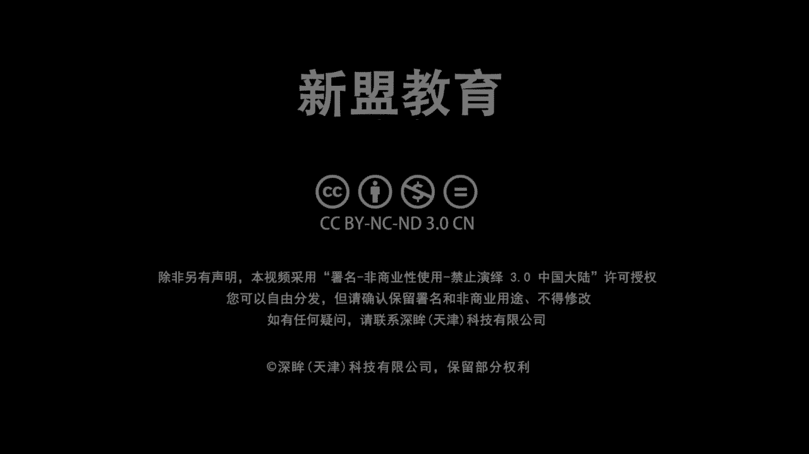

也是官方认定的啊也是官方认证的一个家机构培训机构。那除此之外，和咱们的阿里也达成过一些个合作的关系啊，从我们的课程当中呢，大家可以学到一些个关于我们阿里的一些个呃产品的一些技术内容吧啊，那除此之外。

木雀老师可能比大家啊，就是现在大家上课的是我啊木缺老师。呃，QQ号的话呢，799830458。那可能比大家呢早一些从事我们的运维这个行业啊。呃，将近9年了吧，8年多了9年的时间了。

那之前的话在我们的58，包括这个阿里的话，担任我们这个运维架构师和运维经理的这个职位。那现在一方面在咱们新蒙教育担任咱们哎这个little学院的院长啊，一方面负责公开课的一个技术分向。

另一方面呢是负责我们系统班的一个教育学的辅导。啊，那么我的公开课的时间是从每周一晚上哎到周五晚上7点半来进来。这个时间起来，每天晚上7点半啊，那么除此之外，我们的公开群296621999。

大家如果没有加的，可以加进去啊，没有加的可以加进去。最近的话呢我们会在群里面经常的去发一些个红包，好吧，大家愿意领红包的话，可以加进去啊。那么上课的之前先准备一个笔记本啊，先准备一个笔记本。

一会儿我去讲的内容呢，我希望大家能够自己去整理起来。第二个来说的话，哎，如果你能够听得到啊，我在测试一下麦啊，再试下麦。如果你能够听得到，听得懂的话，给我刷一个一或者刷朵花上来。老师如我有问题。

你就直接在这个公屏上把问题敲出来，可以吗？来Oten给我刷屏上来。来啊。给我刷了一上来OK啊，咱们这个空白可以啊，空白可以。11好刷一次就好了啊，刷一次就好了。😊，其他同学呢我要点个名吗？什么雷诺了。

这个3174了，73456了。然后这个丑八怪是吧？然后然后还有谁叫白福君是吧？指针消失的记忆啊，木。然后盗墓樱花对吧？啊，这些都是我不常见的同学啊。来啊，如果能够题的给我上个一啊。好，的谢沧海。

谢谢lisa啊，其他人呢我点名那几个兄弟呢是睡着啦还是这个无所谓啦啊，大家注意啊，你来上课的话呢，我们还是奔着学会东西来的，对吧？哎，你别别别那个啥，对不对？别说老师我我就是来这边就是为了挂机啊。

你也别浪费这个时间是吧？啊，我上课还是比较严格的。😊，哎，咱争取一次性就把东西学会了，好不好？那么呃我们说过了啊，未来的10天，未来的10天，我们的课程是连续的啊连续的是一个递进的过程啊。从前天的话。

我们简单给大家介绍了关于整个lins运维行业里面，OK我们应该学习哪些技术，以及你学会了哪些技术，会应聘什么样的岗位，对吧？哎，包括不同岗位，它的一个薪酬待遇如何啊。

那昨天呢给大家讲了一个关于我们在基础设施服务当中比较复杂的一个叫做DNS的服务，还有1个DS。那今天啊我们的第三天给大家讲解的是关于大家记了。哎，是关于大家在面试的时候。啊，面试必问题啊面试B问题。呃。

你现在就在跟你一个学习零6词嘛啊，挺好的挺好的啊。那么在面试必问题当中，会有一个叫做sell或者我们的pathon的一个脚本啊，带起来。啊，一个脚本。那么今天重点给大家讲的是我们的这个校脚本啊，校脚本。

所以围绕几个问题。第一个老师哎，第一个问题，什么是我们的校脚本，对吧？什么是校脚本？第二个问题，校脚本解决了我们什么问题。对不对？也就是说它的价值所在。哎，它在客观当中我们的一个落地点是什么，对吧？

你学它到底能够帮助你解决现在在工作当中的什么问题啊，大家注意了。以及第三个，我们会带大家去进行一个非常简易的啊，非常简单的一个什么呢？用于我们批量部署某个。比方说我们NG次服务的一个脚本啊一个脚本。

那么在这里面虽然说是老师脚本写起来很简单，但是啊你要注重要了解的是，老师，我Nject这个服务器是用于做什么，对吧？是用于做什么好，第二个来说，我们在部署这个Nject的时候会选择什么方式。对。

选择书的方式，以及在部署过程中啊，过程中，我们有什么样的一个过程，包括问题如何去解决这些个都是你要考虑到的，好吧，都是你要考虑到的。好。那么先说第一个问题啊，先说第一个问题，我先问问大家。

现在在咱们课上的老师，我自己写过脚本的给我上映。写过刷一，老师，我没有的话，说二好不好？来写过双一没有刷二。看你么一个情况啊。来来来来来人呢人呢人呢？😊，啊，OKOK啊，基本上都是没有写过的是吧？

你自己写过OK好，那么呃其他人呢其他人呢lasa也写过是吧？啊，OK那么在写过脚本的同志们当中，你们告诉我啊，如果你超过10百行啊，我们就拿笑项来说，超过10百行的给我刷一响来。

老师呢我只是简单的写个十几二十行的，给我说个二十行来。😊，好啊，我看一看啊，有没有。😊，有没有二长啊二床不算太难啊，二床不算难啊，大家记住啊，一个脚本哎，你是不能够通透？啊，如果从数量上来写的话呢。

基本上你要写个100行以上的脚本。这个才算你算是什么呢？熟悉或者算是掌握了我们基本的se脚本。啊，材能算是基本掌握了。哎，为什么我们要说这个100行以上？

因为大家后边你会学到一个这个也是在我们面试的时候必问的啊，是关于什么呢？叫做CI杠CD叫做持续集成与持续交互。好，来明白这个听说过的人给我刷个一啊，没有听说过给我刷2，我可能也没有太多的概念。

但是简单做扩展，好吧，简单做扩展。没有了是吧？OK好，记下来啊，这个一般情况下是干嘛呢？实际上就是我们运维，为我们的自动化啊，为我们的自动化。

那么这个自动化指的是从开发好到测试到上架这个过程去部署一个环境啊，就署一个环境。那么这里边我们叫做自动部署啊，会涉及到我们一的像脚本啊，或者pyython脚本的一个编写啊，这个不同的公司。

我们有不同的叫做标准化拿起来啊，不同的公司会有不同公司的标准化。啥意思？那好了，哎，啥意思？就是说我这个脚本具体的或者大概是需要多少步。啊，多少个步骤多少个函数或者多少个功能。好。

然后呢我会把这些步骤再详细的对吧？老师，我是不是要加锁啊，我是不是要加锁啊，我是不是要每个上边要加日志啊，这些个可能都是要考虑到的接来还要考虑到的。所以这个脚本基本上写起来都是100行起步的一个脚文啊。

都是100行起步的脚本。这里边不是说老师你要是呃当然了，你说老师我写10百行是吧，这100行干嘛呢？这100行包括部署了AHTTP是吧？HTTP包括部署了my circlercle。

包括部署了PHB其实大家记住了啊，没什么区别啊，你其实就写这个几十行文也十几二十行，对吧？就能部署出来。😊，这个一会儿有时间我会给大家做一个小小的展示，好吧？

因为这个是我们呃年初的时候给我们班讲完了一次啊，刚刚后面班也讲到了，回来说，一会儿再说。难的是什么？老师，哎，你现在既然说脚本对吧？脚本是什么，对不对啊？脚本是什么？

首先来说笑要脚本是我们整个笑编程的产物。😡，啊，笑编程效果，而笑编程其实就是将我们整个的笑命令干嘛？哎，有逻辑的组织到了。好，这个有逻辑，大家注意啊，那里边我会包括正常的记住来正常的linux的命令。

对吧？这也就是我们的上命令什么if confi啦，什么CP啦，什么CD了等等等等。好，那我们还会涉及到一些个叫做变量啊，同学们，那变量的作用，记住是方便我们方便我们对于整个脚本的管理。😡，啥意思啊？

来朋们知道变量的人给我刷个一不照人刷2二了啊，知道刷一不少刷二了啊。😡，别让该知道吧。你这常看到在脚本里面，我们写个A等于10啊，老师A等于10啊，我为什么用A等于10啊？我为什么用A等于10啊啊？

sstr记住了，这个就是角，这个是变量。A叫变量名十是变量值啊啊，那用它的目的是什么啊？哎，如果说老师，我在整个脚本当中，我会出现10次啊，我会出现10次，这个十好吧？出现10次时。😡，好。

那如果现在我想把这个值变化一下，那你是不是得修改10次啊？如果脚本更长啊，出现100次，你得改100次。但现在呢我把这个值用一个变量名，用一个A去代替了它，对不对？

那后边我只需要对这个A等于几做一次修改，其实我后边都被修改了，对不对？方便我去管理，非常的高效。进来啊，非常高效。好，那么我把变量再升级一下，我们就变成了函数带起来。😊，啊。

函数说白了它就是我们的功能进来啊，就是一个功能。那你记住现在你们见到的什么老师支付宝是吧？支付宝老师我可以在大众点评上啊，我可以在大众点评上。哎，我可以在美团上。😡，我们可以在饿了锅上好不好？哎。

我都可以干嘛？我都可以在支付的时候去调取用我们的一个支付的功能功了，明们？😊，能理解吗？我并不需要说我把你整个支付宝是吧，重新得写一遍拿过来啊，记住这个功能哎，我们把它变成一个模块。

这个模块我们把它叫做一个函数。也就是说一个函数及一个功能是可以被单独调用的。😡，能理解了吧？啊，而再往上面走，结合上我们函数了变量了。一旦结合之后，我们就会产生一些。比方说判断。

比方说哎我们的这个循环啊，循环等等我们的一些个逻辑算。😊，哎，大家知道的什么if服啦，什么for啦，什么w啦等等等等。😡，能理解吗？来理解受医啊来临受医。来啊，来一创个一。OK好。我现在说的这些。

甭管变除了这个以外，你要自己去靠写逻辑啊，自己写逻辑以外，除了这个以外，像变量和函数，我们一般都会分为两大类，一种叫做环境变量。哎，它这种一种叫做环境变量，或者叫什么哎自带的函数功能。哎。

也就是说你的系统已经为你哎所写好了。比方说大家打开一台你的设备是吧？老师，我先打开设备了啊，找一下master在哪呢？啊，在哪呢？找一下啊，这的好好，大家经常会用到一个apple是吧？

apple dollar shell好了， dollar shell，那么此时它会返给你一个值是吧？你通过变量名去寻找变量值。那么这个大家记下来记下来，这个就叫做环境变量啊，已经定义好的。😊。

各种自定义是吧，自定义就是你自己写的，这个我不说了，好吧，这个我不说了。😡，那么我们在一个在这个linux这个系统当中啊，我说了会有一些个没手的默认的规则，啊对吧？会有一些默认的规则。啥规则啊？呃。

可以把它想成我们一种标准化的家一种标准化。也就是说，你在自己的公司所需要遵循的，它不是说linux系统强制要求你的，不是这个意思。比方说第一个变量，一般我们都是使用全部大写的哎大写的字母来。

别两名啊别两名起来哎，都是用大写字母，会让用小写的。第二个来说，哎，老师我的校脚本的命名啊，一定是以我们的脚。功能为命令，且以我们什么以我们的第SH为结尾。啊，第2SA是为结尾啊，所以呢基于这个问题。

我问问大家几个问题好了。😊，那么第一个question啊A啊在整个les系统中啊，那系系统当中，以下当中符合我们文件命名规则的。有几个啊，哪几个呢？第一个来说123，第二个来说ABC第三个来说下划线啊。

同学们下划线ABC好，1AEAC好吧，EAAC还有一个呢选择一个星BC来告诉朋学们这几个这几个。有几个是符合我命名规则的，来告诉。你们自己想一想啊自己想一想。啊。仔己想一想啊。快快。而家。几个撒。

快点快点快点。😊，几个几个啊123是吧，老师有3个啊，拿起来接来接来接来接来接来起来啊，告诉你啦。啊，其他人呢我只看到两个人是吧，我只看到两个，一个叫沧海，一个这个这个空白是吧？没有名字，小孩啊。

小孩没有名字，还有吗？其他人呢？😊，当然呢，你猜嘛，别怕错吧，是不是别怕错吧。😡，啊，连猜都不猜了，这个不就尴尬了吗？是不是啊？怕错的话，永远永远那啥，是不是永远学不好。大家记住了啊。

在那个时当中符合我们规定的，一共有5个。这5个都符合。我说了，我没有问你标准化是吧？我只问你在list当中可以做命名的这5个都符合。当无外不说是老师，我这两个行不行，对吧？你自己做一下就知道了呀。

看好了，同学们啊，本地的话，我现在只有这么一个文件，对不对？😡，我只一个文件，现在touch一下啊to一下123可以吧？touch一下ABC好，touch一下什么。

我们的EBC再去touch一下下划线ABC啊，再去touch一下星BC来看一下同学们这几个是不是都有啊，可以去选。这几个是不是我都可以命名啊，告诉我。😡，能理解吗？能理的不刷一。

是不是我都符合我的命名啊？😡，看到没有？我是不是都可以命令出来，只不过它是什么被它所代替了。😡，对不对？但是如果老师我改一个好吧，我改一个，我不做BC啊，我改1个THOU算随便改。

你看看明学们是不是单独出来了。😡，看到没有？所以啊linux里面这几个都是符合我文件命名的。但是但是告诉我有几个是符合我脚本命名的，告诉我。😡，来，有几个是符合我lininux下，记住我的问题啊。

linux下脚本命名有几个，告诉我12345上山打老虎是吧？老虎没打着啊，打俩小松鼠快。😡，你们要是不告诉我，我对你们开始念经啊，不听不听，我不念经是吧？😡，想一想想一想想想，我的问题就是问题。

你知道吗？我问的是在linkux系统下符合脚本命名的。啊，符合小等平民的来啊，你见朋友这几个都没有后缀。😡，你就认为老师12345几个。啊，你就想嘛，大家记住了，也是5个哈也是5个，记住也是5个。

为什么呢？么说脚本大家记住了，lindux下脚本其实就是具备什么具备可执行权限的文件。😡，具备可执行文件的文件对待，可执行权限文件。好，那现在你看好了CHMOD我都给他777哦，我都给他777啊。行。

来看一下吧，我这个都变绿了，我是不是可以执行啊，只要我里边写好了命令。能理解了吗？能理解了吗？来理解我说一下来。😡，一直个双鱼上来。好不好？别注意我问的问题，知道吧？注意我问的问题啊。

我说这6用下符合可以的，对不对哎。😡，别着急啊别着急啊，我还没说呢，对吧？我只是问你们，他可不可以成为脚本文件。😡，大住啊，脚本文件的核心在于说什么啊？在于说它是不是能够可执行。

就跟你在windows当中有没有一个点儿EXE的文件一样，明白了吗？哎，谢谢咱们的空白啊啊，我们这边讲课都那么机情啊，对吧？可以搞好，咱俩可以搞搞基啊。好，第三个问题答家好了。

里边符合我们标准化规则的有几个。😡，来，里面符合标准化规则的有几个是吧？木学老师不仅讲课机型，还是个老司机啊，随时准备带你们发车，是不是随时准备带你们发车啊。😡，好大去了。

这个标准标准化其实按照道理来说，按照道理来说，各家公司有各家公司的标准，但是严格上来说是0个，没错，一个都没有，对吧？不符合我前面跟大家说的，正常来说，我们要写的。

比方说au toin store杠N点SH这个才是符合标准的。😡，你一看哦，老师它是用于自动部署N这次啊，并且一点SH结尾没问题吧。好，当好了，这是一种。😡，二个来说，我们的脚本要存放在。😡，啊。

要存放在某个固定的目录下。纪霞啊，所有记者哎，晚上晚上开车到啥时，看看你们什么时候下是吧。我这个是开往幼儿园的车，还没到站的啊，慢慢来听。😊，大家记住脚本存放在哪个地方啊，什么哪个地方。

一般的公司都会有一个目录，哎，有一个目录是。专门用于去存放我们自己写的脚本。记住啊，卡了吗？卡了吗？其他同学卡了吗？我看我这边的话，网络是没有问题的，网络是没有问题的，其他人卡吗？好了吗？来。

不卡人给我刷个一上来啊，不卡人给我刷个一上来。😡，没有啊，嘿3上呢。😊，个别卡了是吧，个别卡了啊，没有卡okKOK个别卡了啊个别卡了。😊，好，哎，看们见风景。OK好，那么我们接着来说啊，可以了吧，啊。

不是开往幼儿园的车啊，你们没关系，一会儿给你看两张图是吧？木学老师的课上经常经常播放这个少儿不宜的东西啊，怎么老师怎么少儿不宜了，一会儿你再看，是不是啊，一会儿你再看啊，来看啊，还是他们在开车。

别着急啊，别着急啊，那一般情况下呢，我们都会去选择放在一个专门的目录里边拿起来啊，你会看到的。😊。

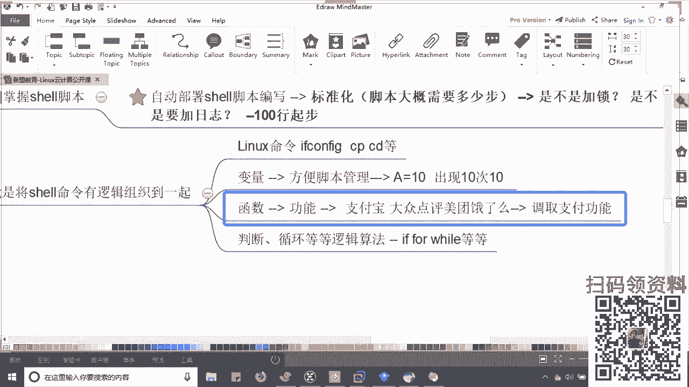

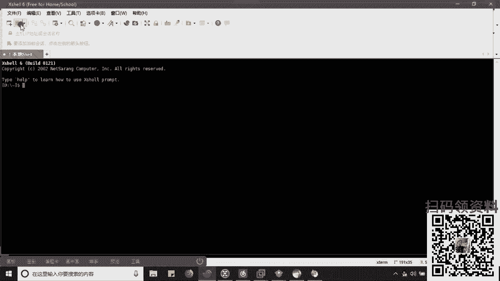

除此之外，这个在于我们需要脚本的内部啊，老师你得看看剖析一下他，是不是你得看一看老师他穿的什么颜色的内衣啊，这个三维是什么样的。你总之对这个美的一个标准是不是？哎，所以记住了，一般来说第一行。

我会告诉你啥，告诉你哎，老师，我到底是哪里的是吧？是欧美的还是日本的还是这个这个这个这个这个港澳的是吧？类型的？所以呢这个就涉及到一个我们的脚本的版本加起来。😡。

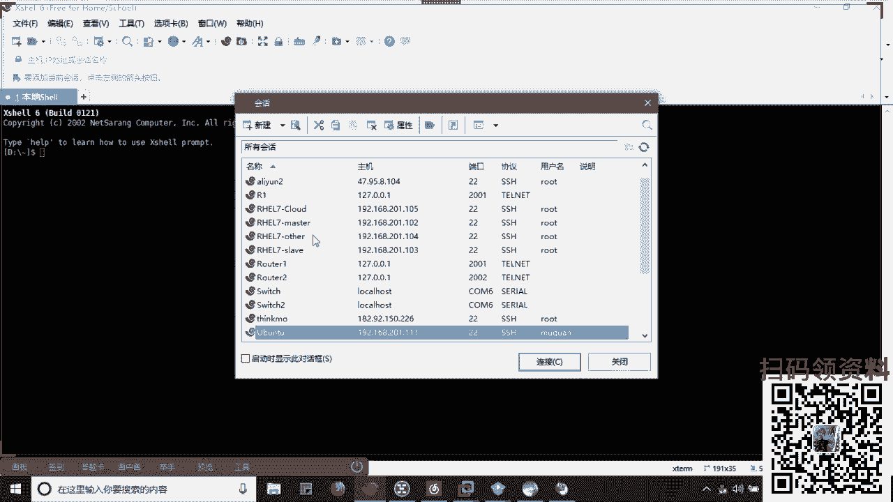

那一般情况下，我们都会选择使一个并b式跳起来。那这个其实指的就是我们sll的什么hell的哎版本哎 shellll版本。😊，为什么会用这个并bu式？很简单，为啥呢？哎。

因为是我们所有的linux版本系统啊，甭管说哎你是这个这个这个日本的、韩国的、美国的、欧美的、中国的是吧？总之英语你基本上是通用的，明白了吗？😊。

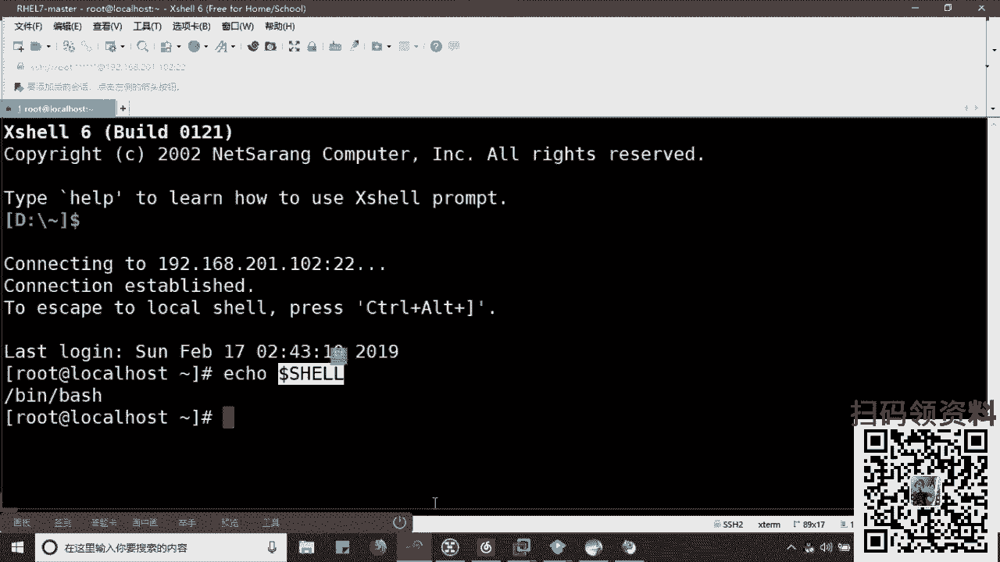

就是用到它叫做bu shell，对吧？叫做buush shell，这是默认的啊默认的。😡，二行啊第二行记住了哎第二行就谁用谁知道是吧，哪一个好啊，你都明白啊，你心里了解啊，第二行啊就得有它的生产规格了。

说白老师，我什么时候拍的这个片什么时候发布的，对不对？好，这个导演是谁？😊，是吧导演是谁啊？邮箱是什么？好，还有吗？还有吗？还有吗？😊，看到吗？哎，关键是这个片子，它的终心利益是吧，是什么东西？

也就是说用途是啥？😡，这三个啊一般是23四行去写的啊，2三四行。那么除了上边这些注释以外啊，上面这些注释以外，我就开始要进行角色名称的分配，是吧？你演老师，你也水冷宫，你念家教，你演这个护士能懂吗？

同学们，所以我们就开始定义变量。啊，定义变量。译完了变量之后才能够进入我们的主题，开始剧情。那么就是我们的具体的脚本内容。啊，句子脚本内容能理解了啊。那么这个是你们要去记忆的啊，这个要是你们要去记忆的。

那么脚本的话，老师说到底帮助我们说那么多，我明白它是啥了啊，就是个片，是不是？那问题它帮助我们解决了什么问题呢？哎，帮助你解决了身心舒畅的问题是吧？哎，这个身心舒畅指的是哎，现在比方说到到了。

比方说我们整个IDC里面购买了N多台的设备，可以吗？N多台设备老是100台啊，我别说了1000台啊，那这1000台服务器呢，我要求各位干嘛呢？都去部署1个NG的服务器。😡，可以吗？

而且要求大家是原码安装。我的妈呀，邵同学们啊，我想直奔主题，你这前线你扛好。😡，你明白耗时间吧啊，未必坚持得住啊，所以怎么办？你就得想办法，一台一台，我可能就20分钟，1000台。老师，我别干别的了。

天天抱着他睡觉吧，是不是没有时间看片了，咋办？哎，我就得说为了去提升效果，没错，为了去提升效率，对吧？哎，我会将这些个重复且繁琐的内容，我们把它写到一个文本中，让这个文本去自动执行。😡，能理解吗？

让它自动不行。所以记住脚本的第一大作用，提升效率啊，提升效率。哎，将重复繁琐的内容代替了你去做。而也因此大家记住它会降低我们人为的错误。😡，是吧教低人为的错误对。啊，机器人肯定比你时间长。

机器人肯定比你准确，明白了吗？进来。😊，这是第一个这是第一个。哎，那其实所有脚本啊，包括自动化的核心，都是这个意思能理解吗？啊，所以大家记住了，你后期 show面试之前啊，面试之前想让那个女朋友看上你。

那么笑一定要精通。你看舍友一定要精通，说白了就是你个人素质啊，你长得挺高大高大上的啊，长得也高富帅是吧？😡，第二个来说什么才是说老说我是不是会python。😡，这个是个加分项。哎，你除了高富帅以外。

你还这个谈吐还是优雅。😡，能理解吗？谈妥最优雅。站起来，为什么我也建议大家哎建议大家先精通shall啊，记住先精通shall。😡，好，然后呢然后呢哎然后有精力去学pyython，为啥告诉你呢？

而且其实我觉得这个是有必要的啊，我个人觉得这个是有必要的。😡，首先来说，大到了后期啊很多的，记住。😡。

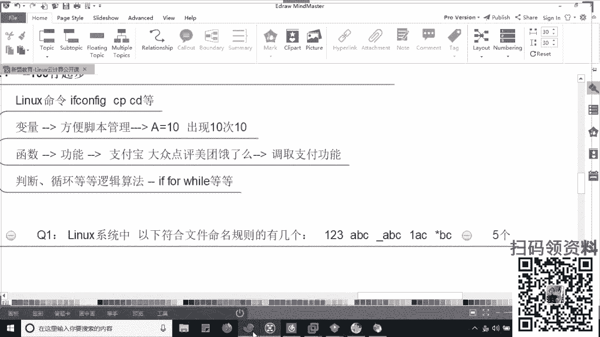

记住啊，到了后期，我们其实有很多的啊。很多的这个服务也好，还是我们的哎。好，服务也好，还是我们的工具。你比方说像java监控，记录过吧？比方说像unable来听说过人做少音的，学们来听说过效一下来。😡。

来来来。听说过吧？哎，没有是吧，你们都没有听过啊，我先说一下。😡，渣是什么？是监控。😡，说吧。W是监控啊，就是。😡，你给你们搭个哨头，你看家有没有这个这个。老王过来串门是吧？

那么你得给这个服务器也一样啊，给他安个摄像头。这个摄像头上看看有没有病毒进来了，或者有没有异场，明白了吗？😊，那NC6是什么？NC叫做批量部署。😡，对吧叫做批量配置工具。啊，你先明白一个问题啊，同学们。

你写完了sell好，sell指能本地运行没问题吧。本地运行。那我怎么把它下发到1000台上？😡，哎，你怎么把它下发到1000台设备上？😡，哎告诉我你怎么看？老师这个地方记住你也可以写一个脚本是吧？

用SCG没关系大。记住啊，这个是可以的，这个是可以的。好，那问题是我下发之后，我如何批量执行啊，我不能每个上面敲一句命令，是不是？😡。

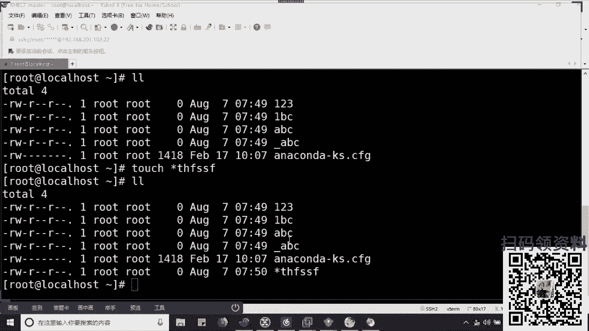

我不能每一个小面敲击命令，对不对？😡，哎，所以这个里面我们就得有一个工具，进来啊，我们就得有一个工具干嘛呢？去帮助我们哎控制一下，呃，不能看了吗？😡，看不到来，其他同友看不到吗？看得到吗？来看得到吗？

给我上一啊。😡，呃，可以是吧，可以OK好啊，OK那个小子再自己刷新一下吧啊，刷新一下吧，可能只有你自己看不到啊，自己刷新一下。😊，啊，坐下。那我这边就得有一个工具来帮助我干嘛控制下游的N多台设备。

这个工具我们叫做unable列龙啊？叫做unable。😡，sable本身大家记住它是通过python研发的啊，它是通过python来开发的。所以你后期你要去写一些个额外的功能，插件也好。

还是这个模板也好，你都会用到python兼容性更强，加起来。python只是因为他的兼容性。啊，记住兼容性。了吧啊，今天七夕估计开车去了啊，找个很好的理由，是不是？哎，看来你们今天是吧？都是单身的人啊。

没关系，莫秀就是单身的啊。没关系，大家一起来啊。如果大家想要过节的话，我欢迎你们来到天津来找我一块儿过，好吧。😊，来啊，那我们接着说，所以这个是脚本上。

我建议你们把是要学精通后期有必要学python明白了吗？啊，python不用多学啊。😡。

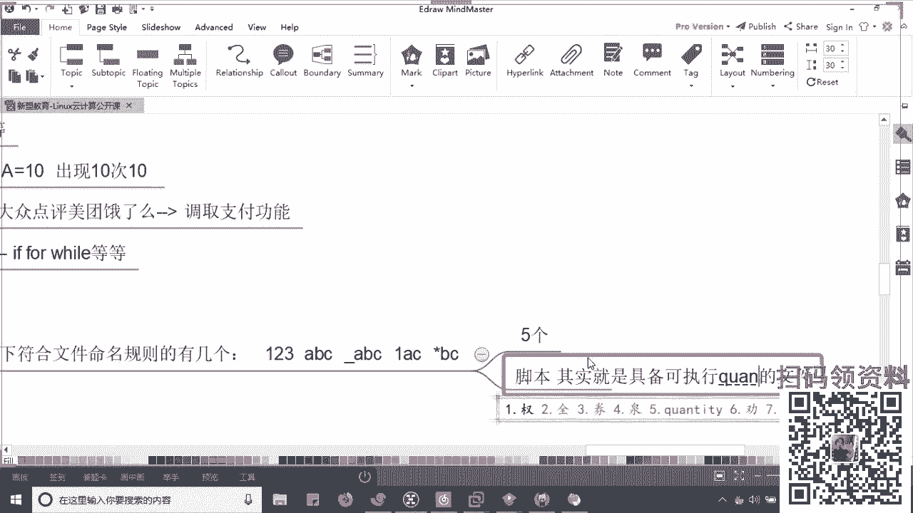

基本逻辑是相同的，只是语法有点区别而已。别认为多难，明白了吗？跟着我学都都会。😡，啊，所以这个是我们为什么会用到脚本啊。第三个来说，哎老师我既然明白了，对吧？我得具体的去写一写吧。

怎么样不如这个看片不如清身实战来的痛快呀，对不对？哎，所以我们简单的给大家找了一个你能够理解的脚本啊，这个脚本记住就是按部就班啊，第一步开店员，第二步啊，拿好纸，第三步开播明白了吗？第四步快进啊。

理解了吗？啊。😊，所以呢我们去写一个最最简单的一个部数脚本啊，这个部数脚本是部署N这次。

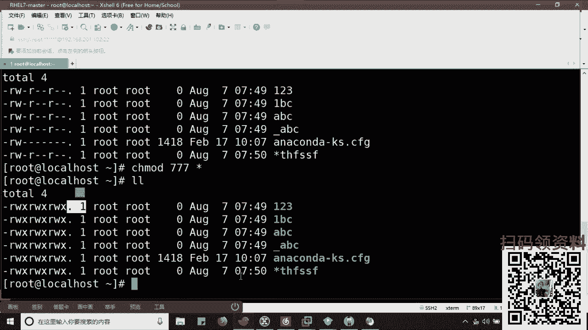

所以第一个问题来，同学们告诉我N这次用于什么？先彪急着回答我。😡，这哥们儿有三大作用啊，跟于谦老师一样，有三大爱好，抽烟喝酒烫头是吧？来，大家告诉我NJ三大作用分别是啥？😡，快啊，还有三大爱好，是不是？

😊，哪三大爱好来把你们答案告诉我啊，你先别觉得错是吧？先说啊，我给你们纠错。😡，啊，需要我给你们先说了吗？😡，事我给你们说了，来，快满周的。😊，好，老师第一个哎第一个都是你们非常耳熟详的哎。😊。

反向代理是吧，加上其实正来说是负载均衡啊，正来说是负载均衡，加上反向代理，这是一块用的。😊，而其他记住这是在我们国内啊，有只能说是国内啊，国内用NG比较多。国内尤其是电商类型的网站。哎。

最最常用的核心使用的一个功能啊，核属功能还有吗？还有吗？第二个来。第二个啥呀？第二是啥呀？是啊？第二个不知道吗？第二个做web服务器，知道吗？哎，它就类似我们的阿帕奇了。😊，这个得知道啊。

这个得记下来啊，这个得起来。好。当了这个它类似谁呢？类似LVS是吧？类似LVS啊，你都记来，我都给你们衍伸出来很多东西了啊。哎，哎，别着急，比人说我是t cat是吧？大家记住了。

t cat这东西严格意义上啊，不能说是外国服器。😊，啊，哦，你上面说了是吧啊，外服务看到了看到了。OK好，严格意义上来说，它不能算是外b服务器，它只能算是中间件服务器。这个后边有时间给你们讲好不好？

这有时间给你们讲啊。好，第三大爱好呢，抽烟喝酒烫头了，烫头是啥。😊，记住啊，第三步你们可能不知道叫做缓存。😡，啊，叫个缓存叫做K式作用。这个类似的warning是哎，你都记下来啊，记下来。

但是大家记住一个问题啊，你这现在他就跟人一样，你要是样样都会啊，样样你都会，也就证明一件事儿，你都是样样不精通。😡，理解了吗？所以在某种意义上来说，他做阿帕，他做网站，他不如阿帕奇稳定。他做L。

他做负载均衡，它不如LVS性能高啊，他做缓存，它不如one式性能强。😡，能懂吗？来能懂人不说话。😡，来能懂我说话啊，这跟人是一样的，你要样样绘版，你就不如人家牛逼，是不是？

所以呢专精一向是非常重要的啊是非常重要的。😡，啊，哎，那今天的话我们单纯的去部署它，其实就是实现一个we部的功能啊，没有什么困难的啊。😡，是一个半个分能。那就问到一个问题了，对吧？老师。

我N选择了一个部署它的一个方式。哎，专一是吧？跟今天一样，七夕节七夕节呢，你得对你女朋友专一，你不能说老师我爱你来请课了是吧？不管你女朋友这挺好啊，这事儿挺好。😊，那么大家记住啊。

部署方式也就是我们的落地方案，对吧？我怎么把它落地到服务器上怎么安装？那么在整个linux当中，我们去安装engices，其实就两种方式，一种是亚麻安装。一种是原版安装。啊。

那问题就在于说老师这两种啥区别？这两种这两种方式用在什么地方是吧？用在什么场景下。😡，好。大记啊，这两个开始给我记了，拿本子啊拿本子。举个例子。好，windows安装软件的时候，当好了。

你会有两种安装方式。哪两个？一种叫做自定义安装，一种叫什么？告诉我一种叫什么。😡，别说到了吧，告诉我。😡，听见吗？哎，叫快捷安装是吧？快速安装啊，怎么样？sorry啊。😊，遇到个快减状啊。

问题是告诉他自定义哎，自定义好，你要做什么？告诉我明白你要做什么。😡，你要做什吧？子明。你要做什么呀？😡，来，路径的选择好，还有吗？还有吗？还有吗？😡，看了吗？还有没有？

其他人想想我只看了一个pack是吧？pack哎，老师已截图好嘞，好嘞，别举报我啊，举报我，你们明显就看不到我了，是吧？来，还有吗？同学们。😊，还有吗？除了路径选择，哎，对我要不要选择附加的功能，是不是？

😡，起来啊，我要不要去附加功能？起来等等等等等等等等起来。😊，好。快一点啊。来告诉我会计安装的。😡，会家中你只要看一步是，就是下一步是吧？下一步完全自动，是不是完全自动全给选好了，哎，直接默认对吧？

同学们好大题了。那么。😊，这个地方这两个哥们儿自定义就是圆马。行自立义就是人马。😡，下么就是快捷安装。😡，明了吗？所以燕么会非常的省时间。省时间它会自动哎去匹配我们安装过程中所需要的需要的依赖的软件。

啊，一般软件这个我不用讲了吧，应该你都明白是吧？这个软件可能跟另一个软件有关系，哎，它会自动匹配的。但是缺点跟你在windows里面一样，但是呢你在快捷安装的时候，你是不是不太清晰？哎，老师。

我不太清晰这个我的比方说配置文件，我的执行文件啊，我的这个这个这个还有一些个还有这个相关的文件存放的位置啊。😡，是不是是不是这些个存放的比较零散，linux里面也是一样的，这些文件不是存在一起。

不是存在一起，所以他不便于管理当中吧。越国力。而我们的自定义说白了就是我得自己选择，我还得去检测环境。哎，我得检测环境啊。😡，检测环境排除错误都是你搞的。哎，选择纹路就要选择功能，所以它比较的厚实。哎。

比较耗时间，但是你所有的内容是吧，所有内容都是。😡，装一起。能理解吗？都是装一起的，所以便于管理OK吗？先把这两个区别先搞清楚，O穿。😡，啊，不是专一。OK好，派可以下呢。😊，当是呢。这说话人越来越少。

你们是真懂还是假懂呢？😡，是不是老师，我今天真懂了，老师明天我明天又忘了。😊，你们太那啥了啊，只有两个三个是吧？这三个里边吧，还有我们一个淄博，还有我们那个右乔，这俩都是我们自己的小伙伴。

都是我们自己系统班的同学。😊，其他人呢，其他人我问问你们，你们是不是现在这样子上课，老师，我坐在电脑这桌前是吧？摆上了一个认真学习的状态，然后你女朋友坐在了旁边给你削好了水果，穿好了衣服是吧？

穿好那个那个内衣，然后开始诱惑你呢啊，你们现在是不是啊，你们现在是不是那个心里面痒痒的啊，老师我知道听课呢，还是找我女朋友去了啊，请你们注意一下好不好？请你们注意一下，别幻想了啊。

在听课上估计都没有女朋友是吧？要不然又一点就扎啊，砰啊，救了你命。注意了啊，注意了，老师看啊，老师看这个我会大家多人都明白，但问题就是老师我这俩东西到底怎么用，在哪里用，什么情况下用。😡，啊，真跳下了。

记下啊。样么安装这东西啊，哎它一般是用于我们批量的。可以可以啊，女朋友在充电，你别讲电着自己知道吧？啊？电着自己就变成烧鸡了啊，这今天这口味有点重啊，马上我不瘦了啊。好，那么用于批量的部署。😊。

对吧用于批量不足。但是一般来说在我们的BAT里面会使用，看到了没？但是注意了，我用的这个亚麻的软件包是经过什么二次开发的。明白吗？我是经过二次开发的。😡，哎，所以我可以控制到。😡，哎。

我的安装的内容啊咱们都可以控制。二次开发就根据你的环境啊，老师我喜欢这个这个胸大的，我喜欢腿长的，所以你可以定制版，明白了吗？啊，明白了吗？😊，啊，看来你还小啊，知道要出气了，不知道要充面子啊。好。😊。

那么对于一般的小公司或中小公司来说。哎，我们不具备自己的。😡，可以啊可以，我们是呃，但是你有很多参数，先别着急啊，我们其实不具备自己的开发团队的。行了吧？哎，我是不具备自己的开发团队的。

所以我们会选择用圆码更加的可控起来。😊，啊，非常可控。那我们这边给大家安装的可是这种啊，要是样本没有必要写脚本，对不对？所以呢这种情况下，我们会写到一个脚本好吧？所以你得明白。

老师我原满安装一共有三部曲是吧？第一步是吧？第一步老师脱衣服啊是吧？第一步脱衣服，第二步呢第二步呢好，第二步呢，同学们。😡，第二呢，前戏一点是吧？第三步正戏是吧？啊，第三步正戏啊。OK好。

那我我们把它先删掉啊，我先不说了啊，先不说了。好，那么先来看第一部叫什么叫做豫编译。😊，起来闹闹叫预编译起来啊叫预编译。😊，其实你原版安装，我们一般是以TAR点GC结尾，大家记住。😡。

这个是我们linux下啊，linux下干嘛标准的。对吧？所以你不管怎么样，哎，你这个女朋友穿的太多了，所以你得给他先脱衣服先解呀。😡，明白了吗？啊，先解压啊，你要先解压，明白了吗？啊？好好好好。

别着急啊别着急，一会儿你们就就就到地儿了啊，一会儿到地儿了咱们就停车了啊。😊，所以就要先解呀，截之后呢，你才能看到哦，我原来你穿的是个颜色的衣服是吧？哎，所以做一个同名的目录。

不能说衣服脱了之后换个女院啊，那不合适是吧？然后呢，下一步哎老师你再看看它里边具体说什么，所以进入到目录中。😡，就到墓中。露中之后就干正事了啊干正事了。😡，这什么正事啊什么正事啊。😡。

接下来第一个症状叫做预约液，什么检测环境。😡，检测环境选择安装的目录。哎，选择功能能理解吗？说完了一件事儿，说完一件事儿，同学们啊，你得先看看你们家是不是把窗帘拉上了，要不然要不然现场直播了，知道吗？

啊，你得选择一下是吧？我们是在厨房啊还是卫生间呢还是餐厅呢，是吧？反正得有地方吧，对吧？功能上不用我想的，是不是同学们？好，所以这是第一步，所以呢但凡在这个过程当中是我遇到问题了啊，忘记锁门了是吧？啊。

忘记拉帘了，你得去解决问题，然后重新再来检测一下，这是预备的麻烦之处，明白了吧？😡，第二步叫做。编译起来。啊，第二步就算可以啊，你还是挺挺牛逼的啊。好，第二步叫做BE了。😊，这哥们太好了。哎。

说白了就是说你现在老师我不认识什么什么什么什么什么T恤啊，是吧，什么长裤啊，牛仔，我都不认识，我只是白花花的，明白了吧？啊，这块猪头肉啊，所以呢你就得把这个C或者这些个C加加去编写的源码干嘛？

我得把它翻译成哎，翻译成我们的零和一这种二进制，明白了吧？哎，零和一二进制最后一步啊，开始干了，知道吗？就是安装步骤。😊，理解了吗？这个没得说了啊，安装步骤其实就是把那些个二进制插入到你的系统当中当去。

领了动作是一样的。😡，啊，动作是一样的。所以这三部曲看不明白？就是我们准来说算上边这个啊算上边这一个就是我们在编辑我们脚本时你要做的。😡，这不是你要注意一下是我这边抽帘怎么拉是吧？这个衣服从哪买。

是不是哎，我怎么脱，是按先脱哪一件衣服，这个顺序自己捋一捋好不好？反正大家都明白的啊，都看过了是吧？所以呢我们先来看一下同弟们啊，先试一下，干嘛我在本地去按照这个顺序给大家去。😡。

去安装一下我的NPS好不好？先安装一NP个。NG的下载的官方网站给大家啊，看片的网站两了是吧？😊，摘了啊摘一找摘一找摘下。找一找找一找找一找找一找啊。如果是刚来的同学啊，那刚来的同学。

大家可以领取那么一张我们的优惠券。好吧，这张优惠券的话呢，大家可以课后来找老师换种子啊，好不好？凭种子凭凭券领种子啊，凭券领种子。除此之外，老师我要片儿我不给啊，好不好啊，大家可以领取这张券。😡，啊。

这张的话是我们最近在十周年庆的一张活动庆典的优惠券。好吧，大家可以看一下一张1000元的啊。哎呦这个过期了是吧，我再给你们找一下啊，教务那边给我发了详角链接啊，稍等。啊，稍到稍到稍到到。

下先找这个吧先找这个吧啊，N这次点ORD。啊，ORD。这个是官网，好吧，这是官网。😡，这边看一下，有个登奥的啊，看老们片儿在这儿呢啊，片儿都在这儿呢，我们选择一个版本，你就选择这个就好了啊选择这个。😊。

这几个都可以选啊，我就不介绍版本的区别了。先啊先复制地址链接好，先复制地址链接。大家注意在这个过程当中，我所有要做的事情都会写到脚本当中去。所以第一步下载我的包是吧？下载这个衣服啊，下载个老婆下来对啊。

下下来。😡，那么这个过程会用到一个Wge大家来叫什么叫做迅雷，或者叫快播，明白了吗？快播知道吗？啊，用来下天的啊，挺快的，是不是？😡，那么回车回车好，大家告诉我出现什么问题了，告诉我哎。

看到你了看到你了啊，看到你了，来告诉我出现什么问题了。😡，出什么问题啊？大告诉同学志们，出现什么问题了？着急啊，赶快给我发你一下上。说你哎，没这个命令是吧，说白了你电脑上没说快播，是不是？😡，啊。

就说白了你电脑上没装快播明白了吗？哎，所以呢我们要干嘛？哎，我们要要么去intstore一下，对吧？😡，安装没有谁安装谁亚么错杠YWge好，答家清了。所以你在脚本当中是不是要执行这个东西啊？😡。

是吧在脚本当中要去执行。😡，啊，好啊，你们还都是有有有有生活的，还知道快播这事是吧？啊？好好，哎，加上了，我现在发的这个链接，你们可以领取啊。😊，好不好啊，我现在发的这个链接，你们可以领取一下，好吧。

是我们1000元的优惠券。😊，啊，大家自己评选了啊啊，或者凭券拿种子好不好啊？凭凭券拿种子，那你或者呢也可以直接加我们的这个这个这个这个这个种子发放员啊，我们的小魏老师好不好啊。

你可以扫码加我们的小魏老师啊，找老师要种子去。好，我们回头头来接着说啊。好了，一本正经的讲课了啊，一本正经讲课了啊。😊，好，那下载之后我们再来尝试一下double盖。好吧。

再从下下载W不 get获取到我一个本地的什么压缩包。😡，对不对？同学们下一步进行解压起来，这个是解压步骤，获取到同名的目录，进入到目录当中。好，进行预编译点confi进来杠杠prefix。好，老师。

我把这个软件安装到哪里去，选择路径，看到没有？选择路径。😡，user等于N这次杠杠。哎，group等于NG拉起来，说白了这个片儿谁负责呀，是吧？这个谁负责这个片儿的搭档啊，都有管理员知道吗？哎。

用户和左都有下一步，我这个片除了除了这个普通的功能以外，还能适合什么杠杠W撒起拉杠HTDP杠SSL杠mod。😊，这个其实就是一个加密的功能。是吧啊你们我得开一个付费功能啊，我得开一个付费功能。😊。

这个是他卓。😡，啊，于是乎你又遇到了第二个问题。😡，啊，你又遇到第二个问题，啥问题啊，啥问题啊，在这里是吧？哎，告诉你缺少宾译器，说白了缺少这个片儿的准码器。明了吗？没有转码器去安装转码器，看到见没有？

好，先跟着我记啊，先跟着我记。好吧，你现在告诉我我现在安装了几个软件了。😡，告诉安装几个软件了，一个W get啊，下载一个是GCC1个GCC行吧GCC告诉大家。😊，对不对？三个啦三个啦三个对不对？

这是三个啦。那我问你个问题，同学们，我这三个能够像我这个这个现在给你执行一样，老师我边排错边安装，在脚本里面写吗？能这样子吗？😡，来能不能刷一分分，能不？😡，能吗？能吗能吗？能吗能吗？你在想一个问题。

同学们脚本的做什么？脚本是一次性执行成功的时要，知道吗？它不再记住它没有自动失败解决问题重新执行的功能。它没有。所以你记住在这个过程当中，我们所有的记住所有的问题。😡，所有的问题解决。

都要在我们脚本的开始。干嘛去解决？理解了吗？大家理解翻译，然后来保证我们的脚本后边一次性成功。理解吗？同志们。誰啥いい。啊。历史要一上来好，到完安装之后重新预编一，你是一定要重新预备一的。

重新检查一下你的门窗，关节没关节，明懂了吗？重新检查一下门窗，关节了吗，来，关紧了再来看。😊，好。这个过程当中可能还会碰到一些何问题。比方说我师把安装的软件名称叫做什么？看好了，不着急啊，会报错会报错。

告诉你去了1个PCRE杠level看到没有？看到好了，解决了吗？安装我们一个跟它同名的同名PCRE杠de开发组包起来。😡，啊，解决了。然后再来预别役，看看还会不会报相同的错误啊，看一下。华会报上冇错误。

啊，我看到好多咱们的哎呀这个这个这个这个这个那个谁呀，看看谁啊。啊，看见的风景秀才梦豪是吧？不行，我就挤一道名花LE点儿不了了一个人心。哎，看到你们好都好熟悉啊，是吧？记得笑，喵星人是吧？胖虎。

然后这个八怪啊，五六小六小六也来了呀。okK是清了，那又出现问题了，这个一样的给它安装上啊，我先不跟你们讲这个东西是干嘛的，先不跟你们讲干嘛的，先学会这个脚本的过程，好吧，哎，SL加密的。

SSL是加密的。😊，加密的啊。让你的数据加密，知道吧？保证你在传输的时候没让别人看见。😡，是吧你呢跟你女朋友那啥的时候录个片儿，录个片之后呢，你想保存到网盘里面去，结果被别人窃取了。于是验证门又开始了。

明白了吧？啊，就这意思。啊，就这意思。加密码。好，再来编译。大于。啊，正常来说这就不会出问题了。正常来说这就不会出问题了。好。好的哈。😊，这一步开始证明您已经预编译成功。那下一步编译看到吗？编用m哈。

这个这个这个单词还是有点意思啊，最后安装。😊，安装这个是变译和安装是吧？make做啊，走哎，编译安装啊，当好了，这个比较耗费时间啊，这个比较耗费时间。😊，好大看一下是吧。😊，好的哈一般来说。

如果你的预编译没有问题，基本上编译不会出错。啊，基本编译不会出动。简单过程都记着，你不用记命令是吧？命令我一会给你们写啊，命令我会给你们写。😡，你们现在就是用语记逻辑记起来啊，逻辑记来。把逻辑起来。啊。

这着拍知道了？这个慢一点，这耗费时间一些收过了啊，等会儿啊。等会儿呢等会儿呢。知道啊。这个包括其他同学有问题的话，及时问我啊，有问题的话及时问我是吧？在这个炮火连天的日子。

大家紧守住了自己最后的单纯是吧？你还不把自己的这个单纯表现一下呢？看到人给我刷一上来。好，好嘞好了，到这一步你就安装成功了啊。来还在这给我先刷个花上来吧，好不好啊。😊，给我串个花上来好不好？来来啊。

好吧。😊，呃，没有注册表的概念没有啊没有啊。下一步看了，开启NG。开启的命令啊，这是开启的命令。好，回。😊，好，告诉你报错了，缺少用户。好，看同们？增加上用户，把用户增加上，开启它。

然后此时啊把防火墙关掉。😡，啊，把它给关掉，然后我们打开它哎，输入一下它的IP地址啊，这是IP对吧？输下IP走给它输入。😊，输入我的哈，我现在都会访问到吧。😊，来看看5刷一啊，看看我刷一。

那现在我把它停掉，然后把它停掉啊。然后停掉之后呢，我还要把它删掉。😊，我把它删掉。起来。啊，我把它删掉我把它删掉啊。😊，好我快把它删掉。好，现在你们再访问一下就没有了，刷新一下就没有了，没有了。好。

我们现在干什么？😡，切个脚板，we到出。A索杠NX点SH。好，第一个上面警叹号杠病大使是吧，什么版本呢？好，下一个警留时间。啊，时间。第3个，郝老师oldder。喂，小目前管理员啊，管理员是谁？😊。

对啊。管理员是谁？最后一个是什么？😡，🎼用什么bu to is for n。😡，到了。里面我们先不给热色的变量，先一步一写，想想啊，我们说要解决问题，对吧？所以把所有缺少的组件都装上。

那么in store杠YW getGCCGCC杠C加加好，open SSL杠dilPCRE杠d看到没们，这些都是我们安装的没错吧，O没有啥意。😡，大家克上衣。快。来下人哎，对，都是依赖包，对吗？啊。

然后呢然后呢然后呢我就开始要下载这个正常来说你还要给一个什么user and n吧，对不对？😡，哎，你给他A的啊增加上用户好，然后才能去下载我们这个软件包，对吧？右键复制地址链接给过来。

然后解压我们的地址，解压我们的文件啊，进入到同名的。目录下执行点杠com figure对吧？这个是我们的什么呀什么呀？想不想是不是我刚刚写的那一串啊，预编译的命令啊？😡，这位同学们来欧洲双一。来啊。

都再刷一，跟着上物的刷一上来啊，逻辑跟啥命令可以不用跟。😡，啊，对此杠HTTV。杠SSL杠MODULEmod看到没有？下一步make哎到好了，m这边给大家一个参数叫做杠G啊，8是吧？啊，不好意思啊。

差点拿街了啊。好，大家记住这个的目的是让它快速。😊，提升8倍速率，8个线程同时变异，提升8倍速率。make isstore也可以加提升。为了呢？提升之后，我们再来哎你安装的这个路径下。好，有一个什么呢？

有个FB有个N把它打开。然后关闭整个的防火墙那好了，关闭整个防火墙，好，保存退出那好了，然后把这个授权一下就好了啊，授权下就好了。好，大家看现在我来执行这个命令。😊，来，看学们，我看啊执行了这个脚本。

让他看所有东西都告诉你下载下载完成，对吧？下载这个软件包，解压进行预编译，对不对？进行预编译，看一下看一下。😊，着急别着急啊。表姐。好的哈，是不是所有工程都是我通过脚本自己去执行的，我都没有在操作吧。

😡，那这个是一个啊，到后边的话，你们可能还要学习的就是就是什么呢。😡，中间出错怎么办？所以大家记住，所以我不才跟你说了嘛，你要了解这个安装的过程嘛，我都都说了嘛，是不是？😡，这给我都说了么看。

你看到没好听吧，是不是？😡，啊，一看刚刚的话就快进了，知道吗？一看你刚刚就快进了，只是看到高重点的地方，高跳的地方知道吗？没看这个重重点的句情吧。😡，啊，你看这快进了，知道吧？😊，起来啊。啊。

大家注意一个问题啊大家注意个问题啊，这个值在一台设备上去运行。我们后边还会讲到sable啊，IableI东你在批量里面，多台设备上同时去运行啊，那就更难一点吧，好吧。😊，不着急啊。好，我们打开这个看看。

接着看。来看一下还在编译当中啊，脚本没有说中间出问题的，脚本出了，脚本如果中间钝了，就证明脚本还有漏洞，能懂吗？胖虎啊，你要是不懂的话，我让小福来还让静香来找找你跟你聊一聊人生。😡，OK吗？okK好的。

😊，不じ啊。好，大看此时我们再来刷新的时候，看看啊是不是又访问到了我本地的80端口也起来了吧。😡，看到了吗？这个非常简非常非常简单的啊。张老师，我可不可以进行一个是吧，进行一个选择修改也可以修改。

比方说太好了，我会选择把这个位置改掉。😡，把这个位置改掉，哎，我把它改成变量，我可以选择版本的去安装，明白了吗？这个我就不讲了啊，先不讲了。😡，先讲到这边，好吧，我们今天先讲到这边啊。

那么这个是我们今天第三天给大家去分享了一个技术，关于我们整个少脚本的编写的过程以及它的一个应用使用场景。好好，同白？那么未来几天啊，未来几天我们的课程的内容，请大家注意了，是这个样子的。有边有没有听啊。

这样的。看一下看一下。看一下看一下啊看一下看一下看一下。😊，来看一下啊。😊，那么昨天前天还有今天对吧？那明天的话我们要讲到数据库，后天讲到集群负载均衡啊，Nject或LVS的啊，可能讲到其中一个。

来大家看一下，这是我们后面的安排。好吧。那除此之外的话，简单介绍一下我们的系统班。就说老师，我挺喜欢你讲课的，我想跟着你深入学，是不是？那大家呢可以选择加入到我们的VIP班啊？VIP班。那VIP班的话。

课程的内容带记下来，哎，我把这个大纲发给大家啊，把大家发给大家。😊，简单介绍一下简单介绍一下，哎，把这个大纲拿出来，大纲拿出来。😊，赶下啊来看。😊，来看他到底多上亿啊，哎，你也可以领取这张优惠券。好吧。

课后来找我再领取一份这份蛋糕。扣林取的办吗。来，你们能看到吗？来看到刷个一。😊，看得到的和上不一样。哎，没有人了啦，师欣okK我就可以签样了。😊，ok小六啊，ok有强可以啊，千儿呢哎OK主桌可以啊。

Opack可以啊。好，给他说一下，那么课程我们一共分别了9章。😊，啊，九章是吧？中国有个牛逼的书叫做九章算术是吧？好，那么久维至尊嘛啊，所以我们也分了9章，这9章是从零基础一直到零计算内容的。

简单说一下第一章不用说学习个简单的入门啥时候开始的，我们前进开始的啊，公开课不会讲太深，你看公开课不会讲太深，每节课是一个技术点啊，那么系统班的话，我们第一章哈就要讲一个月读时间，一共是十二节课。

大家进来讲哪些内容，linux的安装linux是什么？linux里面的路径权限用户管理好，还有基本的网络的管理看到这些包括我们的磁盘分区管理啊，包括里面会讲到一些个简单的s的应用啊啊。

同学们有很多简单的笑应用啊。😊，那很多少的实战的内容都放到后边去了，穿插去讲的。😡，第三章开始是讲到我们企业最最基本的服务，什么DHCP什么什么什么桑霸FTP这东西没什么含金量，所以都是一节课一个。😡。

第接和一个现在这些技术。😡，公司一键式部署，阿里都给你搞定了啊，难一些的是在这里看好了。图别从my circle开始，我们简单于学到的誉为DPAA啊，你除了学my circle以外。

这是我们的关系型数据库，还要去学习我们的brism hit等等非关系数据库。😡，啊，这些都是在用的，公司们都在用的，变AT都在用的啊。😡，再往下面集群是吧？集群的话，从负载均衡到我们的高可用。

这些都是会讲到的。你跑不掉啊，这个是我们但凡是有远规模的公司，50台榜上都会用到的。例如。好，下一步安全自动化啊安全。从最基本的我们的安装系统批量安装，对吧？

批量安装到后边我们的批量管理sable我说过了，看到没有sable在这呢，哎，跟它相同作用的popy等soft suck这些东西都要选啊，都要选啊。😡，这个我说的不是笑的版本吗？那不是笑的版本吗？

所有的linux里面都默认会用到的啊。😡，不会默认遇到的。好，再往下是一个自动化的监控ja。自动化的监控，这个叫做se版本。我们说现在大家用到的笑都是bu shellBASHbu shell。

这个是所有的lininux版本默认都有的，明学了吧？记答啊，那经过再往下也是公司现在必问的技术ELK啊，这是必问的技术，考试面试必问的啊，面试必问的。再往下这个也是面试必问的CSCD持续提升持续交付啊。

再往下容器和我们的虚拟化也是面试必问的dockerK8S。看到同学们？哎，包括云计算里面的云平台opstar啊，这是567。第八章开始是选修课程啊，第八章是选修，第九章也是选修。

这一选修的内容是我们和阿里合作的。这些同学们合作的啊。哎，所以大家可以在我们这边学到阿里的，比方说云计算或者云安全或者大数据的产品的介绍学习啊。那么你学完之后你可以去考，这个不是直接获取，是要考的。

基本上是600块钱一个初级的AC的认证。啊，BACC的认证最后一张的选修是给大家分分享，也就是我们的python的一个入门，可以看得到吗？来看到刷音。来给我刷点双一。OK好，小六秀才啊。好。

那么这个是咱们的目前的一个课程的内容啊，好不好？大家后边如果想学的话呢，哎老师我想跟着你系统去学啊，简单说一下啊，那么我们是有单独的自己的VIP群的，给大家看一下啊，那么这个是我们的群。😊。

给大家看一下我们的群好吗？在这呢啊在这儿呢，这是我们现在可以提，现在正在上课的对吧？是4期。是自己。看到没？这在是我们十四级，看到没有？这个我就不说了，这个我就说了，每天都有会员老师值班答疑的啊。

有问题大家直接在群里面问啊，有问题直接问。那么我们目前来说十四级啊，所以大家可以看到有单独VIP群啊，那么我们在9月份9月份如果我没有记错的话，是9月的第一周啊，9月第一周，也就是说9月2号起吧。

9月2日是我们的一个新班。😊，哎，J2日是我们的15期班。啊，数一般，也就是说整个的从零基础开始学习。那么从零基础开始学习了啊，那么我们整个课程的周期是6个月，大家们整个课程的周期是6个月。

可以可以加进来啊，你可以加到这个新班里面了啊。那么整个课程周期是6个月拉进来啊，6个月。那么我们的课程是全程直播的。对吧？哎，不会说老师你花个钱之后，老师看录屏，不是的，录屏只是给大家课后去做复习的。

如果老师我今天请假了或者出差了，你觉得老师我看了录屏看不懂，你可以跟老师提前预约一对一的补习，明白了吗？你可以提前预约的啊，那么新班，我们暂定的时间应该是135或者26啊，那么正来说是135晚上，对吧？

看9月2号不周一吗？92号不周一嘛？那就是135晚上的8点到10点半啊，8点到10点半，中间会休息15分钟，快下来。我们是一天集中的学习啊，一天给大家留作业，实战作业啊。

起来第一天集中选两个半小时纯单获讲解。行吧？那么课程的价格是7380，我就说一下课程的价格是7380。那么目前来说，我们周年庆十周年庆典啊，给大家一个优惠的活动是我们现在有1个1000元的优惠好了。

比如个1000的优惠，也就是说是1个6380元，看到没有？😊，6380年的同时，我们是有一个三年升级到5年的学习有效期。啊，啥意思？记来说到一件事儿，大家记住了啊，就是我在5年内是可以重复学习的。

这个重复学习是包括我们的新技术。你们在学习在有效期内，对于学习上来说是没有任何的二次收费的。😡，那么是没有任何二次费的？除非老师，我想考认证，这个是你自己承担考试费，明白了吗？

这个我们是不给大家承担的啊，对来。😡，那我们这边没有什么认证啊，拎怎么面。可以吗？能懂吗？啊，能那么说话，一上来啊啊，我们之前都是三年的，现在都是三年的啊，现在是变成5年了啊，一个十周年的庆典啊。

一个十周年的庆典。好，你老师啊，我我觉得还是这个这个6380，我觉得我觉得承受不起是吧？没关系啊。大家如果说承受不起的话，这别注意了啊，哎，给大家一个一个什么呢？一个分期的方案啊，给大家一个分期方案。

那么我们这边是支持大家使用什么花呗啊，支付保的花呗也可以使用京东白条啊，也可以使用信用卡，这个信用卡呢，你就要跟我说一下，如果题想报名是吧？是哪个行的，我们只支持部分大银行啊，一般小银行不支持的啊。😊。

那么这里面是最高12期分期，你都可以选择。那么这12期所产生的利息大地了，我们是一次性贴补。是一次性贴补给你的。也就是说，除了学费外，所有的额外的。😡，额外的钱款，额外的花费，哎，你们是一分钱不用掏。

理解了吗？啊，一分钱不用掏。这个啊我先给来说一下，这个是12期。当然主要是我都没有，我可能有其他的。比方说有个什么什么分期日啊，是吧？这个我得问问我们教务支持不支持啊，十周年当中愿不愿意用能不能用。

好吧。😊，那你要是全款的话，全款的话，我们以前已经是最高的优惠了。之前的话我们都是500元，知道？之前的话我们都是500元的优惠，明白了？拍子啊，但你别着急别着急，那么这边的话还会送赠送大家一个什么嘞？

哎，赠送大家我们一个。😡，啊，赠送大家，我们一本我们的呃赠送一本我们的呃还有利息亏减，利息没有减啊，利息没有减啊，是吧你的利息不是要还给银行吗？宝贝儿是吧？这个利息是要给银行的呀，是要给人家塞脏的呀。

对不对？😊，对吧你的学费没有变，只不过是我们帮你创造历史啊。能理解了吧啊。好，那么赠送大家一本我们内部的学习手册啊，学习实验手册。好不好？这个的话是我们自己编写的啊自己编写的。😊，回家。好吧？抽此之外。

这是我们今天的一个活动啊。但是大家注意了，我们这个活动哎是截止到哪里，截止到我们的15号，但是只有我们10个名额啊，只有10个名额。这个从前天已经开始了。那么今天开始我看了一下，还有5个名额。啊。

我在上课前看的还有5个名额，不知道教务的系统里面还有几个啊，不知道还有几个。😡，啊，大家可以领取这张优惠券。优惠券之后呢，我可以帮你去查一下啊，可以帮你查一下，还有几个名额，大家可以直接使用O啊。

接接说那么除此之外的话呢，大家比方说免费学习，我就不多说了，你还可以干嘛？哎，里边的话后期老师我想换工作啊，这些个就业的指导就业推荐，我们都是有专门的群的给大家看一下啊。比方说这个群。😊，比方说这个剧。

然有这个选。这个群里边是我们啊目前来说，包括我们思科、华为，还是我们lininux的同学都在里边了，知道吧？都在里面了。这个是我们专门用于面试辅导的啊，我们每个月。啊，我们每个月优惠券没有用的。

就是这个你想到你报只要跟我们去说的，你白了吗？这个优惠券是我刚刚临时生成的，所以它的日期我没有调整。正常来说，我们只到8月15号，大家不用换这个日期，明白吗？以我们官方宣布的为主啊。😡。

先说一下啊先说一下，那么这个地方。😡，这个地方啊我们每个月的话其实都会有一次我们的呃一次一次这个面试课程的辅导，面试辅导。面试怎核的，大家可以加到这个群里面，就是我们内部的学员，你报我加啊。

都是我们自己拉人进啊啊，所以简单说一下吧，这是我们一个福利吧啊，一个福利。有什么问题吗？有什么问题吗？😡，来有什么问题可以问我了？这是我刚刚临时生成的，所以你不用关心这个日期。我就告大家。

就是到8月15号截止，而且是5个名额还剩下啊，10个名额，现在还剩5个名额。你就是说是我拖到9月7号，那我们名额满了，其实你也没有了，明白了吧？因为我们这个是走的是教务的系统啊，当家不完名之后。

我们是要给你录入非常多的信息的。那么露露的信息的，我们这个信息是要给你打印出来这个纸质版的入学手续。这个手续我们是要给你邮寄的，知道吗？是要给你邮寄的。理解了，同学们啊，是要给你邮寄的啊。

我们其他同学有的人都收到过我们的纸质来手术了，对不对？啊，这个不用说啊吧，这不用说，你知道又强了，你知道累了是吧？像十7了，他们都是拿到手术的已经。😡，所以这个我就跟大家去多说了啊。

就看你自己要不要学了嘛。啊亲就是所有的问题归根到底。其实只有一句话，就是你认为你要不要学这个东西。😡，如果你要，当然你们千万别告诉我说老师，我怕自己学不会这个东西我没有办法帮助你知道吧？

如果王老师你千怕问怕，那你可能不太适合学东西。😡，但是你可以问问自己一个问题，这东西你学了可能会这东西不学肯定不会，你明白吗？这个我相信你是理解的，或者你可以问问自己，你如果学了肯定会比现在糟吗？哎。

学的会比现在还差吗？是不是？😡，这是最最直的问题。能理解吗？啊，跟大家说一个题，技术不是一天见效的，他不是说你去医院，老师我今天生病了，感冒了，于是我去医院买一个这个创可贴是吧？

霍老师我今天想要这个发泄一下，找我女朋友嘿嘿嘿一下，于是乎明天神情气爽，是这样的吗？啊，今天的话七夕节炮火连天，估计这个外边的酒店房费贼高。于是你明天爽了吗？爽了是吧？但是后边还会有很多的问题你没解决。

对吧？哎，技术就是这样的，它是一个积累的过程，啊，它是一个积累的过程，能理解吗？😡。

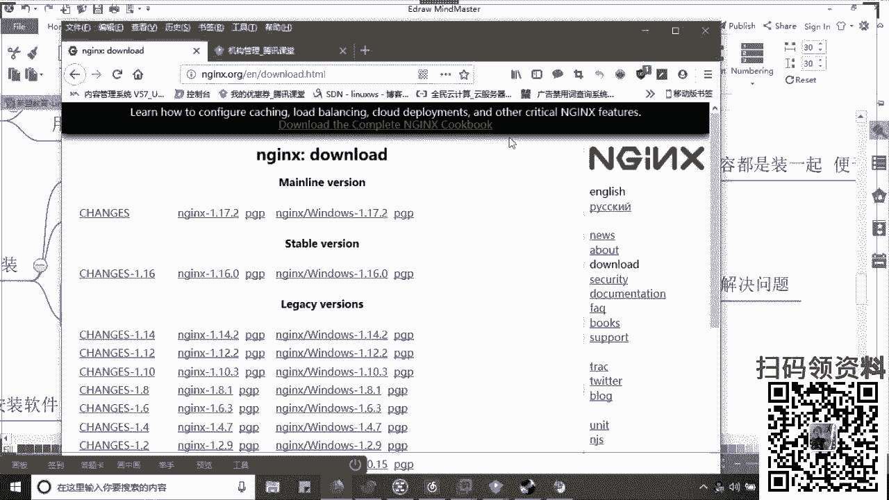

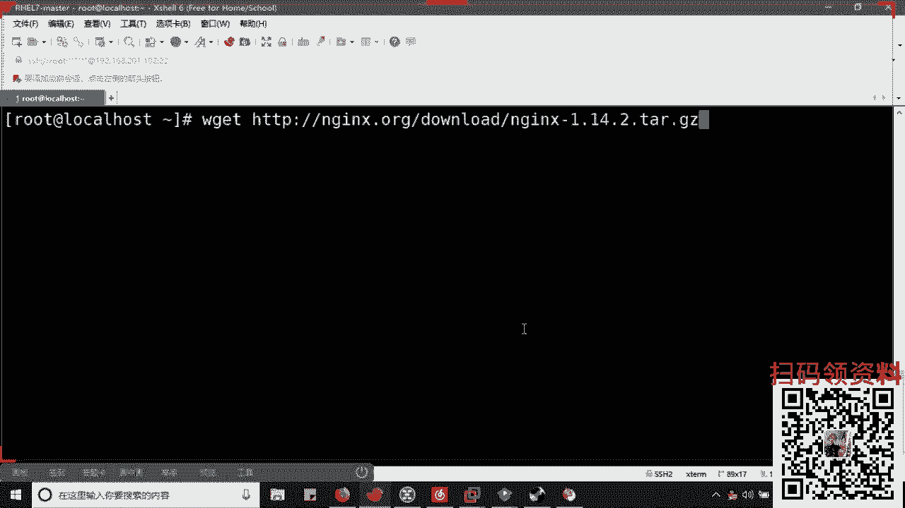

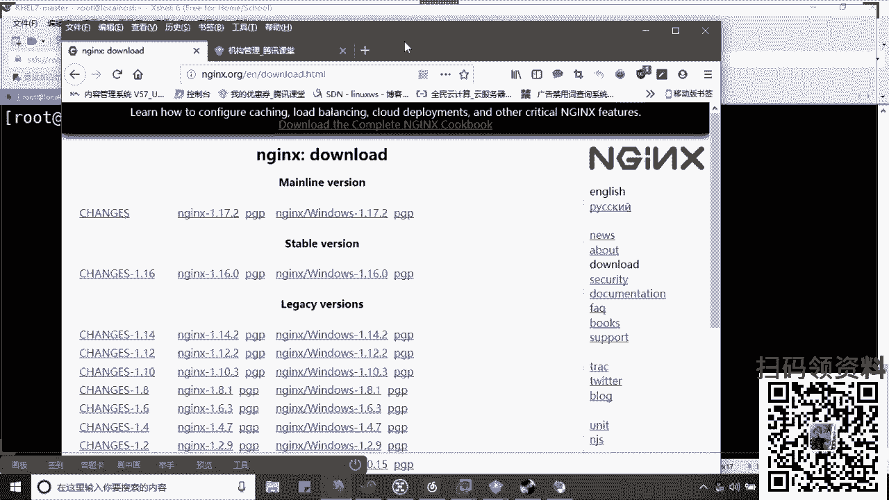

他的这个积累的过程，它不在于老师我今天学明间介绍，它不是救急的，你就把这句话记起来，你把吸咽肚子里边这事儿不是救急的。😡，啊。他不是急性病，你技术不好，不是一天两天的事了，大家也明白对吧？😡，好。

那我今天的话给大家讲到这边吧，好不好？啊，当后边有任何问题，大聊我好了。亲我的Q号呢，779830458啊，朋友如果有问题了。好，看一下这个扎监控SMV的哈，Eout要是监控风扇也是用OI地值吗？对。

可以用OID址这个啊。😊，也可以自己去开发我们的IPM按照。这个是我们参理的。好，今天就要再给大家放首歌吧，想听什么歌吧？爱着可持续性发展，对吧？你这东西不是说老师我今天学朋友，但有一天当你用到时候。

你该清清楚了。😡，不是有一天小师，妈的，等我遇到一个问字的时候，我操，当时我为什么不学呢？😡，是吧矮光师不不我为什么不学呢？大个师兄。😊，咋啦。呃，D管理也是IDMI吗？D管理。地管理科也是这么意思。

这样的管理啊d样的管理啊，我只跟你说一下，明学们，我为什么告诉你们。😡，效果里啊还不是因为你长得丑不好，长得不好看呢。你下啊，记一下啊，就是d尔也好，还是说这个惠普的服务器。

它都会有一个叫做IPMI管拟卡的。😊。

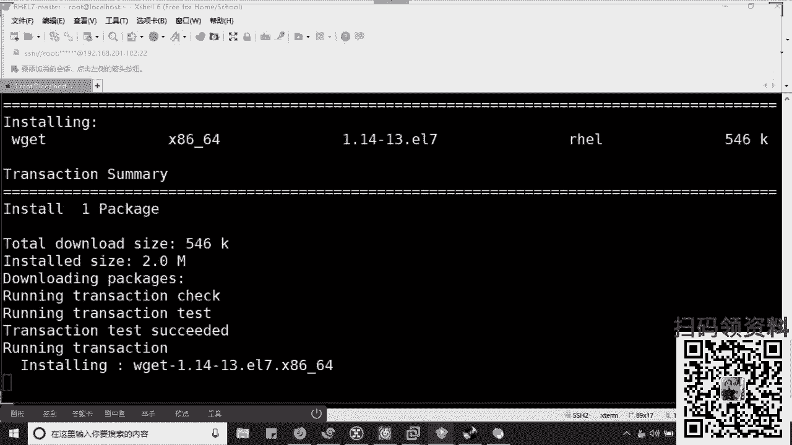

知道吧它都会有个IMI管理卡的啊，其实我们用的ITMI的脚本都是对应的IPMI知道吧？这个管理卡去对接的，通过它他们是自种硬件管理的是吧？可以的可以的。可以的啊可以的。😊，我里硬见你外片卖。😡，回我们。

是吧满汉学席啥意思啊，不懂啊，我不太懂你说啥了。满汉缺席是吧？这就不多说了，好不好啊，最后给大家放首歌吧，想听什么歌，昨天昨天谁点的歌，我忘了记放了，真是谁点的歌。😊。

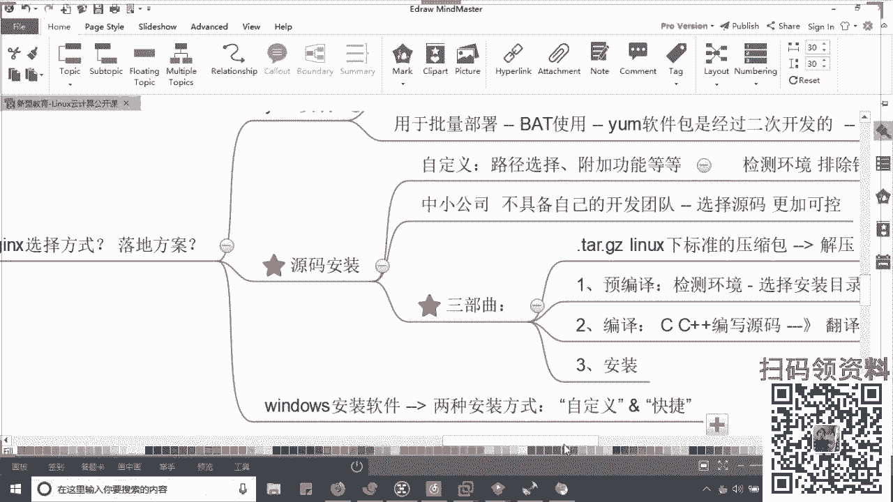

昨天8块钱的歌是吗？啊，昨天是谁点的歌，我忘记放了，大河向东流是吧？大河向东流，算了啊，你要听这个听哪个满汉珍席啊。😊，哦，行，先那个谁了吧。😊，谁快进谁的啊，谁快进谁的吧，咱们男的别太快啊。

咱谁快进谁的好，我把录屏听掉了啊。😊。

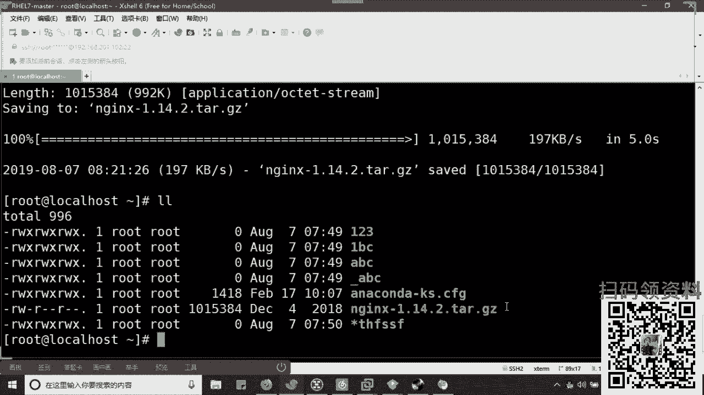