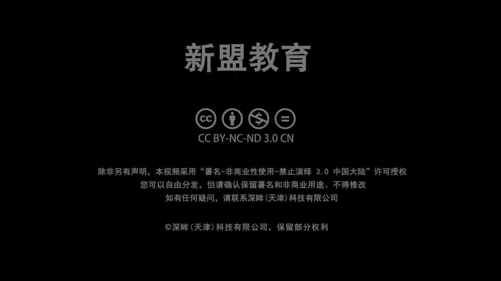
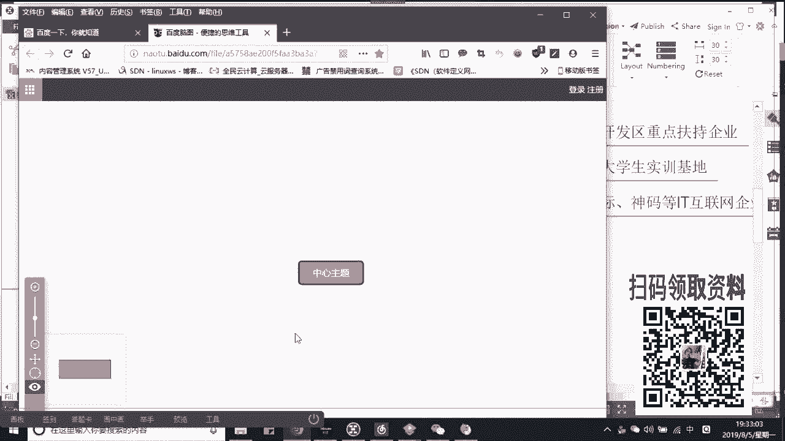
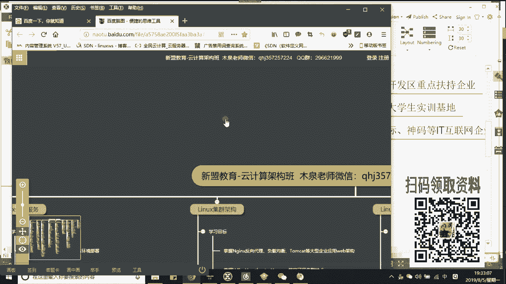

# 2019最新Linux云计算构架运维基础全集教程（O基础入门必备教程！） - P5：零基础小白如何在行业中发展，提升自我技术 - 洋洋得IE - BV1D4411Z7iy

Yeah。

小魏老师哎领取今天这堂课的录屏还有笔记啊，这个笔记大家注意了啊，我是用的脑图好吧。所以呢你在使用的时候，你可以自己去下载一个叫做Mmaster，好不好？啊， master啊，你的小魏姐，你的小魏姐。

你的小魏姐是所有人的小魏姐啊，不能是你自己一个人的是吧？哎，那么首先呢也是欢迎大家来到咱们新蒙教育linux公开课啊，我们是哎面向于整个云计算方向的一个讲解。那么呃公开课的话，首先来说我们从今天开始。

大家注意了，从今天开始未来10天也是我们机构十周年的一个庆典。所以呢课程的内容我会提前发到群里面啊，大家可以跟着我从浅到深的把整个云计算的内容大概的哎重点的部分去做一个简单的了解。当了你想老师深入去学。

哎，欢迎大家随时加入到我们的系统学习。好吧，那么一方面来说，咱们西蒙教育从09年成立到现在十年了啊，能够做十年的机构并不多的。同样呢在整个腾讯课堂5万家啊将近5万家机构当中。

我们排在了前101位top101机构。那么同时也是腾讯课堂官方认证的一家机构啊，那除了这个以外呢，我们和阿里云之前达成过一个官方的合作啊。

就是大家在我们这边学习的话可以学习到一部分我们阿里云的哎这个产品的技术的一个内容。可以大家看一下，好吧？先给大家看一下啊。哎，我把这份课程大纲给大家发到公屏上，你可以自己点开啊，因为太大了。

所以我们直接用是脑图版本去显示的啊去做的。稍等一下，呃，有点慢是吧？在访问的时候啊，我们先帮访问一下。在这儿给大家看一下啊。唉，有点卡是吧？保护OK这样子应该好了吧。OK可以看一下屏吗？

在这边可以看到吗？唉，我们有个阿里云的产品啊，那么这个虽然比较基础，但是我相信大家如果接触阿里云的话，应该明白是吧？哎，整个的ACE等级的云计算与安全还有大数据3个产品吧啊，三个产品啊。

那可呃除此之外的话呢，木学老师啊，是咱们现在跟大家现在上课的啊，就是我好吧啊，我的QQ的话，799830458。那我负责的公开课的时间是从每周一到每周五晚上7点半开始大数据的这个时间啊，哎。

希望你们能够准时到岗好吧，准时到位。那比大家呢可能早一些从事我们的运维啊，已经9年了。那么呃之前的话，在我们的阿里包括58担任过运维经理和运维架构师的岗位。那现在在腾讯课堂。

咱们系蒙教育一方面负责公开课的这个教学啊分享，技术分享。另一方面呢是我们系统班的一个辅导。😊，教学好吧，哎，我偶尔的话也会带我们的云计算和我们初期课程的。大家如果说老师，我想跟着你学。

可以加入进来好不好啊？那么我自己认为呢是咱们运维记的一个老司机，因为我上课经常开车的，知道吗？啊，所以大家把安全带系好，好不好啊，把你的安全带系好啊，别掉了好，那么公开群296621999。

大家如果没在群内呢，可以加进去啊，群里边的话，我们在这个文件里面共享了一些大家常用的东西，比方说虚拟机啊？比方说镜像，比方说我们阿里的哎这个亚么云是吧？等等等等吧？那上我的课呢。

我希望大家能够自己准备一个笔记本啊，这个笔记本是纸质版本的。哎，你放心，我的笔记会放给大家，但是我要求你们自己去系，很简单啊，原因很简单，这是我的思维逻辑你的呢你的思维逻辑怎么办？哎，你要去整理。

知道吧？啊，为什么说。😊。

老鸟，你叫菜鸟呢是吧？老鸟哎它能够对症下药。其实它为什么能够对症下药？在工作里边就是因为它有总结，有积累，明白吗？学们啊，不要一味的说老师，我去追求新的技术，慢一些没关系的。😡。

重点的是我把这东西学以致用，理解了吗？哎，好，来，同学们听得到我的声音的话，哎，听得到咱们声音，看得到这个桌面的话，给我刷一朵花上来好不好啊，刷朵花啊，刷朵花哎，或者刷一ok好吧。

后边有问题你就直接问好吧，哎，谢谢右强，谢谢石心啊，谢谢两个师兄吧，好吧啊，谢谢泪啊，因为我也不知道是哪个师兄刷朵花哎，谢谢泪，其他同学呢。😊，需要我点名吗？其实我上课是最最讨厌点名的啊，大家明白了。

这个靠点名留住学生的老师和拿孩子留住男人的小三儿是没什么区别的，是不是啊，我还是不愿意这个什么的哎，老师听好嘞，哎，老师听啊，梦想在吗啊，新时星在吗，对吧？蒙羊彼岸花喵星人H啊。

这个这个这个西山红叶自由自在朽木自雕哎，海豚你是特产啊，农民秀才啊，然后一个黑桃心是吧？黑桃心好，哪里刷话啊，没有刷话你就给我刷个一吧，好不好？没有花就刷个一啊，有个点能点一下好。

那今天这堂课呢我既然从零基础讲起是吧？那我也别给大家讲一些个没有用的东西了。哎，当了。哎，也说零基础老师哎，我们应该O学习哪些我们li的记住好，我这堂课围绕着两个点，第一个来说，大家。😊，老师。

如果我想做linux运维啊，我该学习什么，哎，以及提升什么，对吧？提升什么技术，包括哎老师我学的东西的这个落地点在哪，对不对？公司是不是那么用的好，这是第一点啊，没关系，不刷了你就不刷了。😡，二个来说。

结合你所学的技术来看一下大家在岗位的一个选择和就业的，包括后期的一个薪酬的待遇上是怎么样的，好不好？我把这两个会结合起来去说啊，结合起来去说。啊，那么我先问一下吧，好不好？咱们现在在听课的同学里面。

老师，我现在已经做运维的给我刷个一上来。老师，我准备哎，甭管你是刚刚毕业，还是说哎老师我现在这个这个呃是准备转行的好，给我刷到二上来啊，如果老师我现在是个学生，麻溜的刷到三上来，好吧？学生的话那么说啊。

学生那么说。哎，海豚学生是吧？哎大部分都是在做运维的啊。好，1期应准备了。OK没关系啊，没关系好，那么大家有有一个问题啊，呃，我先问问你们吧，好吧，我们linux如果哎从大的方向上来说。

我的就业方向其实只有两个，大家，它并不多，只有两个，一个呢叫做开发方向，一个就是大家现在在学的运维方向啊。😊，这开发的话里边最具有代表性的就是嵌入式，听说过吗？来听说过的人给我刷个一样。😡。

那一般情况下，如果我是上大学的或者说上学的话，哎，是在哪里呢？在我们这个这个电器哎电器行业或者电器专业当中可能会去设计一些嵌入式，也就是一个单片机学习啊，单片机学习。

有的呢可能还会去学习硬件的驱动的开发改好了。哎，比方说我们的电路板啊，我们之前有一个学生30多岁了，说我是做这个硬件驱动开发的做电路板。但是大家明白是吧？这个硬件本身在发展上就非常的慢。

而且瓶颈极其严重，是不是哎，所以呢很多选择做硬件开发的人，后边就是转型了，第一个转型就是我做程序员了，因为我们用的更多的都是C语言，啊，C语言，或者呢哎我转到java上去啊。

java其实算是一个比较万能的了。我既能写哎这个网站我也写能写这个软件，对吧？哎，包括大说了，我们现在哎比较火热的英门语言告诉我是什么呀？😊，比较火热的语文语言是什么呀？告诉告诉我是什么呀？😡。

叫什么P开头的，叫什么？😡，卡虫哎，python对吧？哎，别别说卡虫叫python啊，那么在整个linux当中，我们做过3P语言啊，答好了，这个3P不是那个3P啊，接来哪3P告诉我。

第一个老师python。第二个呢。😊，第二个是什么？第三个是什么？😡，来把你们的这个大脑给我啊，把大脑给我活跃起来。好吧，你看你看我说3P3P，你给我一个扎了是吧？这就很尴尬了。第四者是吗？啊。

第四者了，你这都啊。😡，pro还有一个叫做PHP这三个大家都听说过吧，来听说过人何上瘾。来听说过什么声音啊。好。好，简单说啊简单说，那么现在如果你想要做运维，一定要会的，就是哎别说一定要会的吧。

后期后期你如果选择老师，我想要是吧？在这个往架构方向去发展的话，python一定是一个加分项，也是B学项啊，nopro本身就是一个语言啊，本身是一个语言。

当然这个东西不温不火了很多年linux里面有很多也是通过这个语言去开发的，好不好？最后PHP大家记住这是个脚本性语言啊，脚本性语言啊，你像我们后边会学到的，比方说像维监控。😊，看到吗？萨维斯监控啊。

像我们的LAMT这个外本的架构，其实都涉及到了PK这个大家该知道了啊。😊，哎，所以呢呃你说说我后期如果想要转现转型的话，涉及到了这个语言。我建议大家啊，但是首先你要去精通shall啊。

你要首先精通shall好，然后老师我学python。学完了，我推荐各位好吧，我推荐各位下一个步骤学动员。😡，啊，购元目前来说是我们google哎是google主推的一门语言。而且像我们在后期老师。

我学到了另外一个叫做aneeable。大家听说过这个工具的人给我刷一。来听说过的传一，没有听过刷二，没关系的。来啊，听说过我勺一没有听过刷二。我今天讲的只是一个大概的脉络，你不需要说老师。

这里面东西我都没学过是吧？啊，你要都学过，你也不爱听了。今天这堂课的目的就是告诉大家你应该还去学哪些东西，好不好？哎，来来来，我只看到右强一个人听过啊，没有的话给我刷个2，没关系啊，这个东西一点不丢人。

一点不丢人是吧？都会了，反正吴木学老师我也不是都会的，对不对？啊，好，没关系啊，答家题按ci叫什么呢？一会我会讲到自动化在自动化里面去详细去讲，它主要的作用就是帮助你，我现在通过一台电脑知道吗？哎。

通过一台电脑我可以控制下游通过IP地址或者通过组的名称好，把下游几十几百甚至上千台服务器同时去操控干嘛呢？给他去部署某个服务，调试某个服务，停止或启动某个服务，理解了吧。😡，哎。

这是用于批量控制的一个工具。好。他在去写的时候，老师我既然要控制下游，那我就要写一个脚本的一个类似脚本的一个文件。这个文件我们后边有的地方就会用构元去写啊，进来。啊，简单扩展一点啊扩展一遍。

那很多同学老师答出了开发，为什么很多同学最后老师我不选择啊你来包括现在这些做程序员的啊，程序员的很多人呢在30岁往上的时候往上的时候，哎，会选择两个，一个叫转型，一个叫转行。😊，啊，转型来说。

说白了你们两个方向。第一个我的技术能力更牛逼了啊，我说话粗鲁一些，但很直接啊，干嘛呢？做架构师。😡，很多同学对于架构式的概念非常模糊，那用子运维也有运维系统运维架构式。的同学们啊。简单说三个名词。

记下来三个名词啊，一个叫做实施记来，一个叫做实施，一个叫做运维，一个叫做架构啊，把这三个词加起来。实施的表示什么？大家就想你们家的房子。😡，啊，你的家房子，你的房子在建立之前一定要基于几个步骤。😡。

第一个步骤，我得请设计师帮我去设计房屋的结构，对不对？房屋结构。第二个，我雇佣什么雇佣我们的劳动力啊，干嘛去给我打地基，哎，打地基去进行修建。😡，好，第三步，我修建好了之后，我再去调整，对吧？装修。

好了，老铁们，我再去帮修啊，那你们告诉我这里边谁最挣钱？😡，谁最挣钱？是装修的，是盖房子，还是设计师？是谁呀？谁对住起，想一想。😡，想想谁呀？谁最挣钱，把答案给我抄出来来来来把答案找出来。😊，来来哎哎。

有人说对吧？老师设计师最挣钱，对不对？哎，有那么一句话叫什么？叫做干活的不受累，受累，哎，这个挣钱的不受累，受累的不挣钱，对吗？同学们？哎，所以基本上来说啊，架构师就是我们记住啊。

就是我们整个环境的设计师。😊，啊。他也看这个你的环境的规模大小，你说老师我这哥们设计平房，这哥们设计小洋楼，这哥们设计高楼大厦，那都是不一样的对吧？所以呢在IBC里边啊，或者说老师我们在这个BAT级别。

如果去做架构师的话，年薪基本上都是30万起步，明了吧？啊，年薪都是基本上30万起步的。所以那好了，这是你们的一个目标啊，这是你们一个目标啊。😊，第二个来说记住。第二个来说。😡。

这个这个开发也有架构式的啊，开发也有架构式的哎。第二个来说就是我们的项目经理，知道吧？项目经理。あ哦。那么首先来说，项目经理啊，他是一个管理岗位，哎，他是脑力多啊，做脑子的脑力思考多。

管理岗位同时加上你的技术不算差，你看啊？你那就算差是吧？功能无法实现。哎，你就白搭了这个事情，你也管理不好你的团队啊，所以基本上开发在30岁的时候会选择去做这两个的转型，要不然老师我就是一辈子马农了。

知道吗？我就变成一辈子马农了。😡，哎，第二个来说，转行到了，大部分的开发转行就会选择做linux的运维或者运维开发，明了吗？哎，或者运维开发。这是很多人会选择的，当是还要往其他方向转的，这我先不多说啊。

这在于开发商来说。😊，哎，李老师为什么30多岁的人愿意这个做开发的做不下去呢？这个木学老师，我之前啊来家跟说一下，我本科阶段叫做计算机科学与技术。来，同学们，有人跟我是同一个专业嘛？

来有的话给我刷个一上来啊，我们也可以算是一个校友是吧？来来，有没有有没有有的话给我刷一，来哎，真有是吧？师兄石兄是其他人啊，有没有？😊，有没有这个专业的都不是吧，还是我们只有这么两三个同学来跟着我学啊。

😡，啊，或多少都听过吧。哎，没关系啊没关系啊，来听说过的话，嘞也可以也可以给我上一，听说过也可以给我上一啊。😡，啊，这个专业就是偏向于软件的。当时像我们学java，学C，我都学过我说老师啊。

包括我在实习期间我也做过啊不到不到一年的这个这个开发啊。但是个人觉得呢就是开发啊，他确确实实开这个天赋。大家知道开发的核心，你注意啊，开发的核心。啊，他不是说哎现在什么架构啊，这个架构当中啊。

就是说呃你这个软件的啊开发的这个代码的架构我啊。😊，这个东西啊不难，这个东西不难啊，难的是核心叫做算法。听起来核心叫做算法。😡，算法呢其实说白了就是看你的数学计算能力。😡，啊。

数学计算能力数学计算加逻辑吧啊加逻辑能力。很多同学觉得老说我数学不好是吧？其实说实在如果数学不好的话，做开发确实困难啊，说实话就是啊所以木求老师也自觉啊我的逻辑和我的数学不太好。

所以呢我当时就没有选择做开发，明白了吧？哎，所以在30岁之后包括你的经历是吧，可能达不到，因为大家明白，哎，这个编程语言，这个更新换代的速度是非常快的。你说老师我今年火排在，明年火java。

后年火够是吧？在后年我不能知道又出现什么新的语言了。你说你作为一个三十大几的人，你还有精力去学新的语言吗？虽然说明白哎对，虽然说这些个语法在结构上差不多，是不是？但是每个语言也有自己的特性啊。

它的应用应用面，所以你就明白一个问题了，是吧？这个更新地代是非常快的，回家是非常快的。哎，😊，啊，如果说我将来一定想做，那我建议你学这两个啊，建议你学这两个啊，为什么老师你还会建议我去学java。

别着急往这儿看啊，往这儿看。这个来说是我们大多数可以说90%的人在接触到linux之后，会选择的一个从业方向叫什么？叫运维接来。😡，啊，甭管老师我是转行，甚至我之前干的和计算机没有任何关系，哎。

我都能够去做运维。原来很简单，是因为它的门槛比较的低，那对吧？门槛比较低。😡，本身运维的概念又非常的比较笼厚。什么笼统呢？举个例子，同学们看好了看好了，老师，我呢自己看了几本书，哎。

我会给我的PC电脑装系统啊，装系统。然后呢给他装个office的这个这个官方的啊花钱的这个官方的软件。😊，好。然后呢，我还能够去修修打印机，但我还能去修修打印机。大家记住这种在不严格或笼统的概念上。

也可以称之为叫运维。哎，如果细纸说，我们管它叫做桌面运维。听说过这个嘎子人给我上衣裳来。听说过人不上一上台。😡，来啊。是吧啊，你原来就是做这个吧，啊文金OK好。😊，其实说白了就是你学与不学，我都能去搞。

理白了吗？所以门槛较低啊。😡，大部分情况下在哪里居多呢？告诉你们在甲方想起了，在甲方。😡，这个甲方指什么借来啊，甲方指什么？😡，一般国企。啊，国企啊，这个这个这个呃我们说传统的。

比方说金融证券单好了等等类型的，包括医院是吧？包括医院。哎，对，这里边基本上他们应用的都是什么？都是window。😡，系统见过吗？啊，windows也有windows server版本啊。

进来哎基本都是这样子。你可以通过顶顶顶头了，它有那么1到2台的物理服务器，还不是云服务器啊，哎，干嘛呢？上边也就搭建一个。比方说FTP比方说DNS也就这两三个小服务，你就算出师了，明白吗？兄弟们哎。

说白了这个地方只要是给你文档给你们的，你部署是不成问题的。😡，OK吗？来澳洲罗学照你下来。😊，所以我看状啦。但是如果出了问题，老师今天这个这个出现了网络抖动了，或出现这个服务无法用了，怎么办？

你搞你搞不出来，就是你的责任了啊。😡，而通常情况下来看，桌面运维它本身不属于甲方。啊，是不属于甲方的啥意思？啥意思啊？哎，你好，霸道花啊，你好，打卡成功是吧？啊，不属于甲方什么意思？他属于叫做三方外派。

😊，大家听说过有一种公司叫做外包公司吗？来听说过人过我上衣来听说上衣。😡，来听住了吗？哎，类经过是吧？IKOK外包公司常见的一般都是做软件的，但是做这种系统运维的也有也有干嘛呢？

你要是被这个三方的公司外包公司聘用过去了。😡，操诉明们，甲方比方说我每年给这个外包的公司，不老袋，我给他20万。😡，啊，20万购买一个叫做售后的运维服务。啊，奏乐府。然后好了，哎，我跟你签合同，签手续。

签合同。这个合同一般是三年或5年的，明了吧？那这三年我会一共给你，比方说比方说给你一个10万。😡，列了吗？再给你个示范，说白了你的平均薪酬也就是每个月4000到6000左右。理想明白。

你会被剥削的很惨的，而且你还会面临说老师，我合同到期了，我还能不能够继续续约，可不是你说了算啊，可不是你说了算，人家要你你好事，人家不要你，那就拜拜了，能理解吗？好命一点的，就是你运气比较好是吧？

这个甲方哎，有名额有名额，你关系还不错，你可以跳槽到假。😡，但是一般情况下，这里边对于学历也好，还是对你的技术啊，老师我怎么样得考个认证啊，你说要得考认证，他的要求是硬性的。😊，能懂吗？

所以对于大家卓老师，我现在如果已经干嘛呢？如果已经毕业了，如果已经毕业了。哎，霍说老师，我做了一两年啊，或者我转行过来，我不建议你们去做这个。😡，我相当不建意这个时间上是比较充裕的，你基本上没什么卵事。

但是学不到东西。😡，啊，你在实践当中学不到东西，你告老师我学不到，我可以自己看书啊，是吧？这个就看你自己的自控性了，是吧？你自控性差点完蛋是吧？差点完蛋啊，所以这是第一个叫做桌面运维大起来。😡。

第二个还有一岗位叫做IDC域维是吧？IDC运维。哎，我现在讲的都是初级的。😡，初级预备战。啊，出去没个拿起来。好，来，有人说没人了，来，其他人在听的同学给我刷朵花上来是吧？刷朵花上来。

让他看看你是不是就没人。😡，这就说了你是吧，史青了，不是啊，我没针对你是不是哎，累OK其他人呢？😊，家人呢需要点名了，是吧？喵喵星人记得笑扭屁股的大象是吧？一屁股坐死他啊。好，农民H小桃心、杨柳八怪啊。

不不不瞅他，霸道范还有GOD过客啊，朽木字雕沧海还有那个新时星啊，小时星是吧？host啊，什么st啊，plant host啊，梦直是吧？海豚这些我就不点名了啊，别着急，别着急，还没想到的，还没想到了啊。

😊，你啥时候能够和我学到这个赶快换换的工作，别着急啊别着急，一会儿我给大家说一下，好不好别着急啊，我现在说的岗位都是初级运位的岗位。这个初级运位，大家记住了，是指的你不学你不学。

或者你简单的学一点计算机基础，你就能干的。😡，啊，就能干的不涉及真正的具体的牛逼的技术，好吧。😡，第二种叫做IDC，所以这种比较适合什么？记住了，只适合那些个没有技术。当好了。

或者说老师我大三大四实习还可以是吧？自己挣点生活费还okK。😡，哎，要不要是我没这么大的智商，我只想混口饭吃的人这样的啊。二种是IDC运尾。好，然好了。😊，这IDC对吧？我们叫做网络数据中心起来啊。

网络数据中心好，它的作用记住了啊，一般如果是BATT公司啊，老师我自建IDC我我怎么样，我得去维护他，大家注意了。维护的成本非常高，因为我除了整个服务器外，大家注意了，我还要保证IDC的温度湿落啊。

这些个物理指标。😡，不能太高或者太低。呃，听我说话一卡一卡的，同学们卡吗？卡吗？啊，我这边没有显示网络的问题啊，卡吗？卡吧，如果卡的话，随时告诉我啊。😡，其他人卡吗？还好是吧？还沧海吧不卡。okK呃。

可能实行不行的话，你那边刷新一下网络吧，说是网络的问题啊，你那边可能网络问题，如果只有一个人卡的话哈。😊，好，可以，我们接着说啊，那么IDC的话太好了。哎，这里面我们大部分如果说老师。

我们有专门去做IDC的。😊，你看老罗全是红色，那是你那边就报眼中了啊，你那边的OK好，有专门做IDC的公司。说白了我建一个大型的机房，然后呢别人去托管服务器。😡，比方说丑八怪，比方说我们的累是吧？

比方说我们师兄，每个人呢有一家公司，老师我的公司比较小，但是呢我还用那么两三台服务器。于是我买了买完之后呢，我得给他供电呢，但大明白工业用电可比你没用电高啊费，对不对？所以我会选择把这台服务器给IDC。

😊，帮我去托管，明白了吗？我一年只要给你多少钱就可以了。😡，于是乎在这里面，我们就会有一个人看了IDC里面有个叫做监控室的地方。😡，啊，这监控室好，干嘛呢？我们会有1个IDC运维。

这哥们就是在这个监控室里边做值班的。啊，一般来说，你们经常听到老师我做运维的，天天加班或者经常加夜班，一般指的都是这帮人。😡，IDC认为是两边倒进来啊，是两边倒，啥意思啊？😊。

就是呃呃你今天比方说老师我上24歇48，理解了吗？郭老师，我今天上8个，明天的话休休10个小时再上16个这样子的。哎，对，反正是两班倒啊，724小时，2到3个人倒班来啊，你们具体的任务，别着急。

你们具体的任务是什么啊？今天所以讲的具体的内容是什么？我今天你是不来晚了，三块，看到没有？我今天给大家说了半天，我们今天从零基础讲起是吧？所以要学东西是你要学习哪些技术以及你要会什么样的岗位，理解了吧？

好，先别着急，我先把岗位说了，然后再说技术，还没到技术不可能。😊，啊，你先把它会了，你才知道自己学什么东西。我只要记住，你知道老师学的你够够哪个公司啊，是不是？😡，一般这个岗位上家记住啊。

你只负责一件事情，看监控。这个监控别人已经帮你搭好了，显示器上会显示出来各种数据。当出现问题啊，出现问题，你要干嘛？😡，干嘛？你只要给那台服务器所对应公司的域维打电话，让别人去解决。理解了吗？

你没有什么什么老师，我帮他解决吧。no，你没权限。😡，啊，你没权限的哎，你要说老师，我听漏报一个电话啊，漏报一个报警，那你可能还会被扣奖金。😡，理解了吗？哎，这是这个IBC有为比较初级的啊。

所以这里边不涉及记录，不涉及具体的什么这些个技术不涉及的啊，你呢稍微会点计算机操作，会整理个文件，文档结束可以面试，基本上你的薪酬到了就在6K左右。😊，啊，6K左右。对对对，没错，杨柳。

进来基本上就在6K左右。你说6K老师对于毕业来说也不少了，但是这是个头，你知道吗？他不是罗老师，我还敢往上顺续涨，不是的，基本就这钱了。😡，第二种的，我们直接到高级运维啊，我把中级pass掉了，好不好？

啊？因为我们现在不取中间量。😡，那。高级运维的套大家记住了。哎，如果说初级运维我什么都不会，高级运维记住了，我不仅仅会部署。好，我还要会基本的排错，你都明白啊，就是常见的问题。第三个来说。

我能够清晰的了解到我每个服务到了。我IDC比方说100台服务器。这100台服务器，有前端有数据库，有存储，有负载均衡，有监控，这些都叫服务，啊，就跟你的应用软件是一样的。好。

我能够清楚每个服务的具体的作用，它在集群当中充当什么角色。哎，是班长啊，是副班长学习美员是吧？同时看好了，我还要清晰每个服务之间的联系。好，知好了，好了，你说老师我就知道负载均衡。

负载均衡和后边的这个数据库。😡，你怎么联系啊，是吧，怎么做结合呀？好，甚至还包括到了哎，我们有相同的啊，大家明白做负载均衡或我们简单说吧。😡，来弟们数据库来，你们听说过哪些产品给我刷个鱼上来。

60把答案说出来，听说过的产品刷出来。😡，来。产品要有什么？😡，好，别说老是circle server对吧？好，circle server还有吗？😊，还有吗？oracle听说过吧？哎ORALE好。

my circle好，当，这是最最基本的哈，这是最最基本的，对不对？😊，啊，你要非常的清晰这三者呢，或者说是两者liux上又把oracle，又my circlecle。😡。

circle server只能在window上，对吧？好，那你可能还不知道老师，比方说poster gray circle。😡，啊，post pretty circle哎。

现在最屌的一个最高级的一个数据库啊，甚志明说老说readies啊，不说readies，还是我们说这些东西。那这些数据库，我们各自的优势。😊，确点。好吧，你非常清晰。

所以你能够告诉我老师我为什么去选择my circle，而不是oracle，而不是post grade，能理解吗？大家理解吗？上一，就是你知道这些个可替代性的产品，它的优劣点，选择最好的最适合企业的。

最适合环境的这点相当重要。大家，这点相当重要。而这点大多数情况下是在你们建立集群之前。😡，啊，建立集群之前就已经设计好的了。你能够设想到老师我的集群会出现啥问题？😡，好，哪里该优化？😡，哎，哪里该优化？

啊，哪里该优化，这些都是你要想到的，没有明白，所以要记住了，所以记住了这边就涉及到一个你们在今后工作当中的一个逻辑了。大家记住很多的刚刚入行的人都是习惯性的说，老师边做边想。😡，是吧边做边想。哎。

霍老师边做边边边边这个这个这个这个这个走一步看一步啊，是不是这种错说法是no是错的，其他是错的，聪明的工程师欲为工程师都是先计划跳起来。😡，为什么要先计划？等你做高级预备，你势必会接触到项目中。😡。

标书。策划。能理解吗？策划书等等等等啊等等等等东西。这里边其实就是一个先写过程，先写集群的过程。觉啊，这点是非常重要的啊。所以为什么人家做架构，你还是做实施，人家做架构。

你还是拿这个初级预备的薪酬都在这儿了，先动脑子先思考会遇到什么问题，理解吗？所以具体的来说，老师高级运维里面我们会涉及到哪些技术点，看看你该学什么啊，看你该学什么。😡。

那我们还会根据不同的岗位去去这个去区分你的这个技术。那大家常见的第一种叫做应用运维。😡，啊。二种的话，自动化运维现在比较火热的啊。第三种云计算运维，第四种大数据运维。第五种运维开发。啊，运维开发好。

当然还有其他的好吧，我先列出来12345个，知了，这些都是从技术角度出发的。什么什么运维经理了是吧？什么运维专家了啊，当好了，这些呢都是从管理或者说职称角度来说的啊。😊，你们学技术的，先关注这些东西。

😡，来说，应用运维，这是大多数人的一个岗位。啊，大多数人岗位都处于这个岗位当中，啥意思？你能够非常的了解，或者说应用我们整个linowux这个系统上，现在企业应用较多或者广。

进来广泛的这个工具啊或者服务啊这些开源的工具。举个例子啊举个例子，带好了，你们最基本要了解的前端啊前端来吧，告诉我我们能做web服务器的软件有哪些。😡，来能够外表服务器的软件有哪些？第一个。

我先说哈帕奇。😡，啊，注意的第二个第二个有吗？明白。😊，第二个。第二个。摁这个好，还有没有？看到没有？看到没有？com不开的。好，大家住意了注意了，这边这边一定要给大家提个醒啊，要给大家提个醒。😊，哎。

有个东西叫做中间劲儿，大了，中间劲儿可不等于外表服气。😡，啊。com cat严格意义上来说叫做中间劲儿服务器，它不能够算外部服务器，听明白吗？为什么这么说？we部呀，他去解决大家明白老师。

我们都是去解析的什么HTMLPHP这种语言，对吧？对不对？这些语言。😡，java呀那而comca去称载java，而java本身其实是不需要解析的，理解吗？它就能够直接给你去做呈现。

tca中间件只是做了一个承接的作用，而没有起到解析的过程。😡，这概念能懂得人够上一上万。快。😡，啊这个过程么挪话多稍微上。妈嗯。啊，这个是非常重要的一个概念啊，千万别混啊千万别混啊好。😊，了。

所以这个里边外b服务器我们接着再说两个啊好。😡，IS这个你得知道啊，虽然你不用办，对它只是一个启动东西啊，windows使用windows面用不了它好吧，这个你们知道的，还有吗？还有吗？还有吗？

朋学们想想啊想想啊，好，再举一个，比方说它的lighted。😡，じゃあ。来HDBD叫light的。😊，知道吧？哎，还有一个呢是我们国内看来一般来说电商网站使用的叫做TENGINE叫称震好。

这个东西是谁开发的？大家记住啊，是我们的天猫，主持人说是淘宝公司，就是阿里知道吧？基于NG做的二次开发。对啦国内用它做电商类的网站，用它比较多对吧。

而light的大家记住这个呢你这个其实比这个比这个这个NG要早。😡，啊，比这可要早，但是宣传力度不到，就是营销性不好，做的知道吧？😡，但是早期你们记住了，像豆瓣儿。😡，像贴吧就是使用的他。😡，OK吗？

来同你给我双个一啊，当然还有其他的，你先把这几个记下来，1234啊，对来1234。好，O给他给我造个花上来，同学们，哎，这是前端。😊，中间这tomca还有个reason啊，还有个reason好。

还有一个呢叫做Gbo，大起来。😡，这两个一般是我们互联网公司会用的。你放心，这个我现在说的都是技术名词，我没有细讲每一个技术。大家有时候说我都不会听不懂，没关系，先把它记下来，先把分类记准。我告诉你们。

我现在说的这些都是你未来公司里面用到的，也就是你面试可能会问到的问题。😡，啊。好。这两个互联网公司用，而大部分的中小公司使用t cat为主，加起来。而现在最早的时候，我们说老师直接用GDK搭环境啊。

加上tca但是呢tca属于阿帕奇公司。😡，加上他们开的。😡，最多最多做一两个我们参数的优画。讲然啊最多最多，哎，这里边可能会涉到一个叫做GVF啊，大家就说java本身在运行的时候起步其实是一个虚拟机。

知道吧？😡，啊，所以他非常的消耗内存，大见啦。啊。问答家一个问题，好吧？问大一个问题，你将来可能会问到java和python这两个去做我学择的。嗯好，java消耗内存，python消耗什么？😡。

来告诉我python消耗什么，知道刷出来答案，不知道刷2。😡，啊。来拍摄笑什么？😡，我们。拍笑什么时间no不对啊，别说时间说说里面的东西啊，我们说怎么需什么，大家想一想啊，记住啊。😡。

记住现在的编程语言要么消耗内存，要么消耗CPU啊，python消耗CPU多。对。啊，对所以你就看你将来的工作里面用python多还是CP，还是用java多，所以你就去买硬件的时候。

买足机手关注了一个点啊，对吧？😊，🎼reason的话用的其实比较少啊，reason用的比较少。而现在给大家注意了，tomca当中有一个叫做APM的组件。😡，行把这个情给你记起来，我先不细说它。😡。

但是这个是我们现在在面试B问题。行吧，如果你去找一个大点的公司，这是B问题。😡，好，同理NG那好了，我们都知道说我可以做外b做负载均衡是吧？做反向代理，做缓存，这都是它的作用，都是它的作用。但是同学们。

现在这两个我们不会再怎么细问你了，其实就两个参数，知道吗？我们问的更多的是NG现在新有了一个模块叫做LUA起来。😊，本身LUA它也是一个脚本语言。啊，也是写脚本运的啊，和这个排on差不多该掉了。

这个也是我们现在在高级韵维里面面试会问到的。理解了啊，所以我现在出了两个问题了啊，两个问题了。好，大家可以后面记得去扩展。😊，所以这是你要会的。除此之外，数据库。😡，啊，数据库啊。

最简单大不在数据库两类，一类叫做关系型，一类叫做非关系型，对吧？啊，非关系型。😊，好。同时大家需要注意，我们对于数据库的国理，其实这个地方叫做运维DBA岗位。誉为数据库管理员简兰啊。

你要管的最多的数据库my circlecle。😡，可能有的公司做升级，把它用的是post freeci。啊，这两个之间其实如果单纯意义角度来说，我为什么会选择postse grey？

记住朋友们是在于我们哎在于我们对于数据的吞吐量的第一个多少，第二个速率。😡，能明白吗？来，能懂路上一，就是我一秒钟处理的数据多且快。😡，好，对吧。哎，这个你要记住了啊。好，这个是我们现在用的最多的啊。

用最多。有的时候我告诉你们，同学们，很多时候包括你们在这个证券公司的老师，老师我用这个oracle，对吧？

它前面很有可能承接了就是post greenpost green去对接oracle很正常的啊很正常的。😡，🎼第二个对吧？oracle这个不用说了啊，第三个来说是我们的呃关系的这就这两个为主为主啊。

而or my会有一个衍生品，在见没？衍生品。第一个来说叫做mara DVF7版本里面用到的默认用的。第二个叫做preco呢知到了这个用到的监控啊，监控时候用这个衍生品。

非关系型记住非关型是对关系型的补充，不是。推翻。不是推翻。我的补充作用就是做缓存。😡，啊，代表性的ready。Mm case当然了，这两个我劝你都学啊，咱们科里都涉及到。😡。

往下边延伸有个叫做memo caseDB。对啦叫地名好的好吧。这两个区别可大了去了啊。😡，本身记住不具备持久化功能。啥意思？我是完全内存或完全缓存形容选手。😡，我告诉你们，这里边就有一个致命的缺点。😡。

查缺点？家告诉我知是命有缺点。大家想想完全内存型的学生面临什么缺点？😡，想一想自己动脑筋。😡，谢谢东老钱。说不确定。哎，断电他妈全没了，是不是断电全没了，我操，还得重新预警是吧？更慢了啊啊。😡，好。

各好了。而reies哎而reies和我们mmo caseDD这两个哥们都属于持久化神兽。😊，这啥意思？记住了，就是说我们可以定期将。😡，缓存哎，放入存入我们的硬盘，变成真正的数据断电回来直接读取过来了。

非常坏。😡，好。这个哥们大家记住啊，是我们新浪公司基于mamo二次研发的。啊，二次研发的。所以未来同学们老师我学的挺不错的了，而且我收到了新浪公司的offer面试去了。如果啊问到你数据库了，告诉你们。

人家就是想问你这个了，知道吧？啊，人家就是想问你这个了，你这个要不会啊，你就拜拜吧，好不好？😡，接来这个是你们在这个最基本来说，我们在应用运维里面一定要会的其他点。前端数据库当然还有存储什么？

我先不说了啊，把它放到其他里面去了，还记来。好。再然后答好了，基本上啊我们的英语为的薪酬，你能够达到1个10K是吧？达到1个10K左右。10K左右好吧，这个卧只都是月薪啊，月薪啊，更高级一点了。

当然有牛逼了达到15K，凤毛麟角啊，凤毛麟角就是应有率为上。但是再往下面深入，其实你们具体来说，其实分到了这几个岗位上。😊，啊这个不道。自动化。当然，现在企业但凡成规模或者中型公司。

我的设备只要达到了50台。😡，啊，甭管是物理设备，还是说老师我购买了阿里云的ECS啊，还是说我购买了腾讯云的VMC。😊，啊，都隔离。都可以啊。他都会用到自动化和云计算，这两个你是躲不过去的，起来。

这两个是走不过去了，一脉相承，一条线学下来，一条线应运下来。😡，从最基本上当然现在不会让你去用了啊，什么装机是吧？同学们批量装机。😡，批量装筋。这个我不说了，好不好？😡，这好像有点像直播。

我们现在就是直播。宝贝儿，我们现在就是直播。go了好吧，我问了你半天点了你班天名，你没听到是吧？😡，啊。吓。啥情况啊，你咋你咋才发现呢？宝贝儿啊。😡，尴尬不尴尬啊。行了P量装心这个不用我说了，大家明白。

老师，我用P叉E对吧？加上KICKSTRRT当然这个是指我的企业购买什么，购买我们物理服务器啊。如要说我买阿里云的ECS，这个就不用了，是不是？😡，但是还有一种叫做cover。😡，好这们。

这个作用帮助你们可以去自荐我们的亚马藏库。我为啥自建刚明白我们现在软件做开源的软件，对吧？或者开源的工具。😡，好，那么对于中小公司，我们说白了，因为我这个这个这个服务器资源有限。

内存CPU这个硬盘都有限的。所以我为了减省资源，我会选择叫做源码部足，可控性很高，对吗？啊。而到了那如果说我要是BATT级别，我们要去批量的部署某些个工具啊，我得用到软件吧软件包吧。好。

你能够告诉索老师，我用原码吗？一步一步做太慢了，对吧？大家知道原码很耗时间的。😡，所以我就得使用这个亚麻批量安装。😡，而要么批量安装这个网上的软件，它多少是不适合我的。😡，明白不明白。来啊。

能懂的人先给我刷个腰上来。来，能不能给我刷个腰上来看这波。😊，网上的软件多半是不适合你的大锅饭。😡，啊，你不爱吃这个味儿怎么办？所以。😡，这种公司正常来说，记住团队是这么区分的开发测试。😡，好。

最后一位。怎不到。开发做什么？二次开发。😡，哎，选择啊或者说优化，这就是优化的概念。好，测试测试我们的新工具是否具备bug，听解了吧？啊，哎誉为上殿。啊，誉为上架好，建立我们的软件仓库啊。

就是把它们放到一起去，谢来。这也就是为什么我们经常说誉维是企业的最后一道防线。说白一句话，开发有问题，写错代码了，测试稿测试要是看不来问题，给到运维上去，你可是对公众去使用了。这bug可就难了呀。

能理解吧？所以为什么总说你们背锅背锅，其实还真不是说你们技术能力不行，而是说你不懂人家的这个里面的这个东西，明白不明白？啊，所以呢你的技术能力不强是吧？搞不定这个跟人开发或跟人测试对接不好。

那就拜拜了是吧，那就拜拜了。😡，所以这是个重点啊，哎扣本。第二个来说叫做批量。部署对吧？服务前面给大家说了大几来。第一个就是我们的安sable好吧？安cable啊。😊，uneeable啊，大家记住啊。

uneeable本身就是拿pay语言续开发的，所以看明，你不学行吗？是不是你觉行吗？😊，代替品top好，st dark当到吧，这三个作用都是一样的。作用都是一样低，明白了吗？啊。

那老师为什么我们会选择unable啊？老师因为pythonpython快？no大家了，因为它也是python开发啊，它也是python开了，为什么不选它是吧？为什么不选它？所以这里边就涉及到两者的什么？

两者我们在工作原理上的一个哎区别啊，肯定有一个消耗少，有一个快速，理解同学们，所以这个也是你们为什么都要。😊，你别老师说我只会IC吧no，有的公司也在用这两个，你不会是不行的，是吧好。😡，部署之后啊。

人多了，大是这个这个如果说你要是一个人在家过无所谓的是吧？老师养条狗，两个人没无所谓的。养只猫三个人哎呀，挺happy的是吧？于是乎结婚了，有小孩了变成六口之家了，是吧？然后呢，把双方的父母十口之家了。

😡，你告诉我戳级谁管啊？😡，就和你夫妻越来越多一样，是不是谁管？😡，🎼哎，你得给他去排一个监控啊，监控。作用就是帮助你保证我们7乘24小时的监控。😡，哎，能够去及时去迅速的定位我们的问题答起来。哎。

在哪里定位问题啊。😡，那么我们尝了现在用的啊最多的叫搭米。😡，哎，本身是PHT的一堆脚本语言啊，这是为什么我们会用到网站去看它。😡，早期的话我们还用到过，比方说capy加上ngo，这个我就不讲了啊。

这很老了啊好。😊，而现在有个叫做普罗米修斯，大家查这个名字是吧？老师，你知道叫童话吗？神号吗？no，大记住，这是一个监控软件的名称，只不过记住它是用于用于去监控我们K8S平台的。😡，啊。

所以就在于说老师到底啥是K8S啊。😡，啊，这个我一会会给大家说到。😡，那此时你的集尺里边已经有了那么多那么多我们的工具和服务了，都是你要去管理和在意的啊，都要管理和在意。那然后看好了，再往下跌。

既然老师我是定位问题，对吧？我知道文在哪下边，我得解决它。😡，解决what得有提示哦，是不是？那大家告诉我，我们在整个集群当中如何如果我想去排查这个服务，我看什么呀？来，我看什么把答案说出来。😡。

来把答案说出来。看什么来考考你们啊，看看你们这个日常是吧，想做运维有没有基本思想，有问题看啥呀，看监控。对呀，监控是告诉你问题出在了A设备上，然后呢。😊，然后呢，宝贝儿是吧，告诉A设备上。

这个阿玛奇有问题了是吧？具体问题在什么呀？😡，具体问题看什么，看什么？哎，看日志对吧？好，看日志。😡，但问题是，这些日志分别处于12345679N多台服器上，你得挨个登录，挨个查是吧，挨个登录。

挨个查很麻烦吧，很麻烦，而且有很多同类别的。😡，所以答好了，第四个叫什么呀？叫做哎，叫做ELK或者叫做EFK哎，叫做日志分析管理平台系统。😊，作用集中的哎，存储整理展示。

也是通过外b展示我们的日志信息啊，展示的信息。而这个地方也是大家未来在面试当中必问的一道题。举个例子，同学们举个例子啊，大家都知道公司都有网站，对吧？网站好，你的网站好不好，或者你的产品好不好？

我们有个非常重要的指标，大家知道是哪个指标吗？😡，是哪个指标啊？哪个指标？网站有个指标叫什么？😡，叫什么告诉我。叫啥呀？叫叫叫浏览量嘛，是不是叫浏览量访问量嘛，对不对啊？访问量叫什么？叫做PV加起来。

叫做PV。😡，そあ？正常来说，你的公司告诉你们，如果你的公司在100人的规模以上，你的日志的访问量说你的网站的访问量应该达到PV亿万。流量没事。啊，像阿里这种团队就说阿里这个团队绝对是亿万级的。

理解了吧？亿万级没事啊。😡，亿万级每日的P配浏览量，我们如何去架构这个ELK的这个这个集群平台是吧？哪里优化？包括老师我收集的信息，我如何做聚类聚类分析，对吧？来提取真正有价值的信息。😡。

这都是你要搞的。这当是要办的。所以啊OK大家如果说有问题，可以直接加我们老师有QQ啊，直加QQ啊。😊，好，大家接着说好后接着说。那同时有一个问题就是什么？就是说大家发现一个问题，这种提取有价值的信息。

你们告诉我除了啊我们说云计算以外或自动化以外，大家想想还有哪个行业或者哪个岗位会用到。😡，知道大数据吧。知道吧？这大数据吗？朋友们？所以记住啊，ELK除了在自动化平台以外。

它本身还是我们大数据运维或者大数据工作的一个重要组成的。😡，帮助你去做剧类分析。啊，行。而自动化现在最重要的一个叫做CI杠CE对吧？叫做持续集成，加上持续交付啊，这个也是面试必问的。啊。

来朋学们听说过有耍一没有听说过少二。😡，听说过的刷一没，屏时刷上2啊。😡，嗯。有吗？有吗？都没有都没有看OK没关系，大跟着我记啊，跟着我记啊。早期我跟你们说，早期的话我们运维是开发的跟班啊啊。

为什么那么说啊，比方说举个例子啊，比方说双十一。😊，啊，淘宝备战。OK呢淘宝别站一般来说呢，比方说双十一或双十一当天凌晨0点，我必须上架对吧？于是我我可能提前一个月开始代码的更新。团队批要出名代码。

然后定时去上架。啊，对马更新是由开发去干的。听了吗？好，代码的上架是由运维去干的。结果这帮开发太不地道了是吧？一直拖拖到什么？拖到了最后，或者说老师我今天得加班加班到凌晨3点，你得一直跟着他完成任务。

就是明天早晨别人一打开，8点来钟打开就能看到页面。😡，啊，早期预薇跟着，所以有很大一个情况下，老师今天啊凌晨3点了，玉文还没走，但是白天没什么卵事干。对吧白天没课冷，是不是？就是这种情况下。哎。

所以为了我们啊告别这种运为苦逼哈哈的这种这种。😊，地步我们干嘛呢？哎，选择干嘛？哎，对，现在干什么运维去部署一个环境，这个环境会给我们这个开发一个具体的目录或者路径。或者路径。然后呢。

开发会具备自己的代码仓库。哎，比方说dt live。本地的peer啊，该好了等等等等SVN都可以啊。好。😊，今嘛你。他只需要记住了，铁们，我们的开发呀，只需要把我们的新代码放到我的代码分库。😡。

考了代码之后，然后执行一个命令啊，甚至有的地方都不用执行。😡，于是乎我们这个环境会自动把它拉取到这个目录，然后下发到我需要更新的服务器上去。这套活都是自动的。懂了吗？上海。🎼懂不懂啊？

而且开发还能够控制我们的回滚，出问题了，立马回滚到上一个版本。OK了吗？啊，这叫持续激成与持续交付行啦。哎，持续争与持续交付。这个交付说白了就是团队嘛。O了给我刷个花上来，对吧？😡，能理解了吗？啊。

所以解了这个问题，这是你必讳的啊，就是这个两个现在是自动化的最最核心的技术ELK和CICD。😊，你不会是不行的啊，好吧。😊，这我会在里面会讲到啊啊，然后下一个就是云云计算。

大家知道云计算的话往大了说两种啊，两个技础，一个叫虚拟化。😡，一个叫云丰台。虚拟化里们接触最多的虚拟机是吧？同学们虚拟机BMOsession。😡，啊，再往下面延伸一点是啥，告诉我哎，在linux平台下。

我们就叫做KVM是吧？啊，大家明白现在虚拟机更多的是被谁取代了，搜索被谁取代了。😡，个被谁取代了。😊，被谁取代了？😊，哎，刀口维码？容器啊容器啊被容器刀刃只是容器的一种。啊，这种气哎。

说白了荀杰消耗资源太大。😊，消耗资源太大啊，哎到手更么快。😊，刀cker越来越多才形成了我们的K8X叫做容器编排出来，就容器管理系统。啊，他的作用就是管理一堆刀刃。啊，那个这是虚拟化里边啊。

当然可能还有其他的啊啊云平台这个以open star为主吧。好吧，以op star学习为主。当然你刚刚说阿里云的啊师兄做Zt，但是看到万变不离其宗啊，都是云平台，现在的企业都是自建私有云平台。😊。

这个没有细的跟大家去说，因为你们不用，我细说也没有办法说。阿里云就是一个把阿里云就可以当做云平台。😡，啊，只不过是公有平台。😡，哎，对公式呢啊，对外出租的。啊，这几个是我们现在公司在用的啊。

接下来看长啊，看。第三个是大数据，刚刚我说了，第1个ELK你不用说了啊，ELK收集。好，第二个ha doop好，sk。😡，是的。这两个一般用于的是日志的或数据的分析。啊数据分析。但是当好了。

一般来说BLK还要结合上什么，你们要结合上哎，本身它也是通过java去编写的啊。java，所以你要结合java的开发干嘛呢？这个java开发有个人写爬虫。没有明学们，我去把整个网站的数据爬取下来。

爬下来。😡，收拾下来啊，所以。运维这里面的话，大数据运维你还是要懂编程的，包括运维开发是先会运维，再会开发。啥意思？同们，它是根据我们运维的原理去开发运维工具。例如我们的anee就是运维开发的产品。

好吧，所以这里边你们要会的python。😊，好。知道吧？大家起来啊，严格意义上来说，这哥们属于运维岗位啊，运维岗位。所以如果说老说我后边我对这个编程啊还是比较喜欢的那你们可以去学学这两个。好吧。

如果你对编程不喜欢的那我就不建议你去设计大数据还是运维开发了，好不好？反正我们要设计这个东西啊，当然我会一些啊，当然我会很一些个，比方说这些东西要会的是吧？自己开个运动脚本，还是okK的，这都没问题啊。

老们。😊，那么这几个岗位同学们看了，除了运应用率为10K左右，基本上你能达到这几个。我说了记住你都会，并且精通啊，知道这些东西，老师我公司里面怎么去用，常见问题，你的薪酬一般都能够达到13K左右。

OK吗？啊，博信的话，大家可以自己打开我们的boss直聘啊。你要说老说我你是不是吹了是吧？啊，你可以记来下boss直聘我。😊，你给打开boss配，在boss直配里面，你可以各种各样的去搜集，明白不明白？

好，你给搜一下哎，这个这个我就过了，哎，啥情况？😡，相信我这是。啊啊你可去搜，比方说说我要搜一个云计算运维是吧啊，千华下都是全国。啊，全国。好，我们搜一下啊搜一下。😊，系。原计算员。走我是。走。

大家看啊，这天津的，别看天津的，天津少啊天津少啊，从天津找互联网企业泡涨啊。😊，好。走。大家可以看到吗？来看到给刷一看到刷一可以看到吗？基本上的薪酬都可以平均到非常高。看到没有？这几个你去看一下。

这个因的是大专的啊，估计它里面技术并不多啊，这并不多，基本上看都是往实往上吧。如果是一些个从规模的公司，基本上都是13K。😊，就能达到13K看到没有？还是比较高的啊还是比较高的。

如果你把它调到北京更高是吧？我把它调到北京去更高。所以北京浠水在哪里呢？消费在哪里了，对吧？看一下看一下基本上都是比较高的，看到没？20多K的，都是有的，看到没有？基本都是这个样子，看到没有？

都是很高的啊，13K左右吧。啊，平均都是在13K左右好，大家还有什么问题吗？有什么问题吗？好，这些都是你们自己去查吧，我就不查了啊。所以大家如果想学的话呢，我建议你们选择一个方向。

但如果选择云计算把自动化也学了啊，把自动化也学了，好不好？大数据你可以不学自动化啊，这个你可以不学好吧，大陆老师我想跟着你学，我随时欢迎各位加入到我们的系统班里面来好不好？我随时欢迎各位啊。

那么此前的话啊，此前那陆老师我想跟你学有什么一些个优惠吗？有的，大家看见没有？那目前来说大家如果想要哎目前来说我们的系统班啊，简单说一下吧。啊，我们的课程是6个月啊，从零基础一直到自动化云计算哎。

就是我在这里边讲到的技术在我们的大纲。😊，里面大家可以自己去看，是都存在的。都存在的对吧？自己去家了，拿自己去看一下吧。😊，一共是6个月的课时啊6个月的课程。那么从零基础一直开始。那么目前来说。

我们的课程价格是1个7380元，好吧，哎，大家想学的可以去加我们的小魏老师好不好啊，可以加小魏老师啊。整个周期的话是6个月啊，别这6个月老师太长了是吧？啊，你要早学早就牛逼了是吧？

6个月对你你现在如果说我感觉技术不太好的人来说的话，其实。花6个月好好去学是很重要的啊，非常重要。啊，好吧，课程价格在这边啊，包括我们这边的话，如果大师老师我现在经力紧张，我建议大家可以使用我们的分期。

好吧，分期的话呢，12期花呗京东白小服信用卡啊，花呗京东白相费信用卡好不好？花呗信用卡啊。O那么同时啊今天啊给大家一个比较大一些的优惠啊，给大家带一些优惠，正好赶上我们的什么十周年庆典是吧？

十周年庆典啊，所以呢我们凑个招给大家啊，再当时我们现在报名同学，我们是优惠力度达到1000元，好吧，优惠力度达到了1000元。大家如果想学的话，可以去找我们的小魏老师去报名。啊，小魏老去报名。😊，好。

这个我今天从教务那边获取到了我们一个优惠的力度，好不好啊，朋友朋学们都到给我刷个一上来吧。然后啊。来啊，不能给我敲个印上来来后面的时间大家可以问我问题了。然后后面现大还问我问题了。哎，谢诗青。😊，啊。

今天我们要讲具体技术，我今天先把一个脉络给大家列出来。好吧，我今天想把脉络给大家列出来好，然后从明天开始啊，从明天开始，我们会有一些的技术啊去学习。那么我把未来几天的课程的课程的内容给大家说一下，好吧。

在这儿呢课程安排。😊，啊，这样是我们十周年是吧？8月15号是我们十周年，希望大家坚持来听吧。好吧，我们十这十天这十天其实真的是一个比较这个这个比较比较算是笼统的一个脉络的学习啊。

第二周第一天给大家介绍一下行业介绍一下你要学习的脉络。第二天基础服务里面啊，比较有挑战性的DNS。第3个A大家都在关心的校的脚本一个入门的学习。第四个运维DBA数据库的学习。第五个负载均衡啊。

非常重点的一个学习。好吧，这是本周5天，本周5天啊，后边下周的5天我们可能会有高可用，可能会有自动化入门自动化进阶虚拟化入门虚拟化进阶。好了，同学们，我们会把这个课程给大家去做一个剖析啊。

用实堂课简单的来体验一下我们在系统班里面的学习内容啊。当然李老师我想更快一点，呢，就现在加入是最快的，好吧？啊O那今天的课程呢，我讲到这边了。好，我先讲到这边。然后给大家放一首歌。哎，我们接着来听啊。

我们接着来听。来有想听的歌吗？有想听的歌的话，可以把歌的名字给我发到公屏上，我给大家点播一首是吧？啊，前提是网易云支持啊。那有没有啊？好。画啊画OK。😊，来首话，哎，谢谢泪啊，谢谢泪。😊，来首画。

是谁的？是邓紫棋的吧？那就放这个吧啊。OK谢时钦。OK好的。😊，🎼好的，那我们课程就到这边了，同学们下课了啊。😊，🎼你就不要想起我是吧？哎，明天吧明天吧吧八怪的话，咱们谁先点了，听谁的好不好？

然后后面的话明天播，明天播放几几首歌啊，明天记得来好不好啊。😊，🎼其他同学来临们不说话了，那咱们下节课主动一点好不好啊，主动一点学东西吧，对不对？😊，🎼在与这新世界。Yeah。🎼一唱。🎼宙于。我是先。

いましょう？🎼我想。🎼就下。然大。

🎼就像。