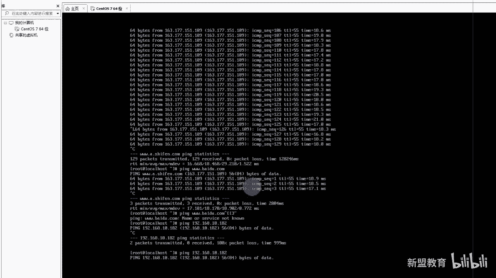
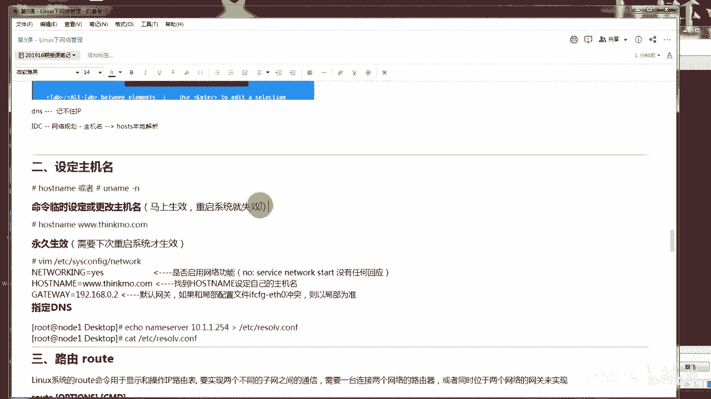

# 2020最新Linux-RHCSA入门实战课 - P10：RHCSA-第9课-linux下网络管理 - 新盟教育 - BV1Fg4y1z7kS

。

现讲的话是我们的整个的。呃，lineux下的网络管理啊，网络管理呃，就是这个东西呢其实不难啊，我们在前面或多或少接触过，对吧？但是大家要明白一个问题，什么问题哈，我为什么要学这个管理啊？😊。

我基于什么情况下，我一定要学到它。很简单啊，是大家都明白我的网卡是有几个啊。你告诉我我真真正正在使用的时候，其实是一个设备，我会具备多个网卡的，对不对？哎，多个网卡的。那么我经常跟大家介绍的哎画个图啊。

画个图，我经常去跟大家介绍。你比方说我现在给我们公司买的这台服务器，虽然是剪个了漏吧，对吧？是戴尔的RRT30啊，RRT30。那看好了，同志们，我给你们画起来啊，给你们画起来。好，那么实际上这个是正面。

上面是正面后底下是下反面啊，那么看好了看好了，那我这个小圆圈，不用我多说了，这是一个电源，明白吧？这是一个电源了啊。😡，这是个电源啊，我给你们写出来啊。😊，电源这个地方靠了。

这是一个叫做IPMI的卡进来啊，IM面卡，我请大家把它记录啊，为什么？因为你到了后边我们学到jaax监控的时候，其实也会用到IPMI它的作用很简单，是帮助各位去管理我们的一些个硬件资源的。😡，我说过了。

大家好了，我在将来一定会学到叫做P叉E，对吧？叫什么叫做无人值守啊，那无人值守的话，我是通过一台设备干嘛？😡，啊，给我们的下游当做模板是不是当做模板，然后呢我们去批量的去安装我们的系统。

但问题是大家告诉我，我这个模板是怎么装的系统啊。😡，是吧怎么装的系统啊？啊，包括我们在这个标准化的大型的IDC老师，我怎么为我的服务器装系统？😡，啊，装系统记住了，这个就是我们后边要讲到的这个东西啊。

用这个东西叫I过滤卡啊，你打开它有个页面，有个页面，这个页面你就能够上传，远程安装，明白了吗？啊？而对应上的话，这个屁股上好了啊，这个屁股上它会有5个网卡，这5个网卡四一分录啊，这个司一分推是吧？哎。

正好是在网吧啊，老师怎么四一分推呢。很简单，大家注意了好，这4块网卡是连着的，是连着的。好，这几块网卡是连接上我们什么啊ABC单走可以啊。好，这四个网卡是连接到一起的，是对公的，对啦，是对公的。

啥意思啊？😡，啥意思啊？哎，我只需要。我只需要连上它，然后为我们配配置公网的IP。啊，公共IP哦，而这台设备记住了是对内的。啊，是对内的啊，老师怎么对内呢？很简单，哎。

我这个网卡实际上就是它实际上就是他拉进来啊，那么它一般默认的IP就是192。168。1点，我记得是是是1。2102吧还是多少，大家可以记起来啊，102啊，我可以通过它去管理明白了吗？哎。

所以这是一个网卡的管理情况啊，网卡的情况。那老师我针对多台多台网卡，我到底如何去管理它的IP好，我又怎么知道哪个网卡是激活的。老知啊，我要知道哪个是激活的啊，哪个是未激活的，是不是哎。

以及这些网卡我到底做什么用是有明确的规范的。解了啊，我怎么去审核它。😡，那么大家可以看到，如果我们自己在虚拟机上个人用，经常会出现okK我的网卡的名称，注意啊，网卡的名称。😡。

甭管什么样开了开了开了开了开了啊，开了，这录屏肯定是开的啊，甭管什么样，一定是以E来开头。😡，好，告诉我这个仪表是什么，这个仪表是什么？😡，还告说。仪表是什么呀？😡，地表是什么呀？啊，一表是吧。哎。

大家稍等一下啊，我得我得联络一个人啊，我得联络一个人儿。好吧，这个人的话找啊这个人是我昨天晚上预约的一个小同志，这个小同志呢想要学，但是呢想要试听一下，我来找一下他。😊，啊我再找一下他，哎，是他应该是。

他不鸟我是吧？啊，没加上他的还啊，行，再回来再说吧，回来再说了，我们先来说吧。哎，叫什么叫做internet叫做以太网，对不对？叫做以太网啊，那我们说以太网的话，来告诉我最大传输的速度是多少。😊。

这架车速速度速多少？多少是多少？但我说是以太网啊，以太网的最大传输速度是记住啊，是多少是多少是多少哎，是100吧，是120。接来啊，其实正常说以太网一开头是十0兆是吧？FE叫做快速以太网。

它对应的是100兆，知道吧？它这样是100兆，但其实你的网卡上一般都是它啊，你的设备上一般都是它。😡，F1明白了吗？啊，现在一般都是100兆最大内网传输。😡，每秒钟啊每秒钟好不好？哎。

合动照是1000兆呢，对吧？那吉比特啊，那吉比特哎是GE进来GE啊1000兆啊，还有呢比方说TE。😡，T开头的明白吧？这个是万照。😡，啊，这个是万兆对了啊，这个是万兆明白了吧？啊，这个是万兆。哎，对。

所以这个是开头的几个东西，我希望大家能够记起来好不好啊？那后边的类型我就不跟大家去说了。好吧，这个就是网卡硬件的了啊，网卡硬件的了，但是你不用管它啊，你们公司也不会管它，原来很简单。

你其实在生产环境见到的，统一都是ETH叉叉开头的啊，ETH叉开头的。那么请你注意的是，我们是从零开始，所以大好了，ETH0是第一块卡对了啊，是第一块网卡知了吗？是第一块网卡。😊，好不好，把这截了啊。

你们在生产环境看到的都是它都是ETH0啊，没有什么ESENO极少极少的。但你们记住他们都是一样的啊，都是一样的，可以吧，接来。😡。

那查看网卡信息，大家记住，除了你最常用的什么if副康fi是吧？我把它放好看好了。卡来啊，我除了最最简单的老师，我使用的是if副康fi。😡。

对吧。啊，iffig大家可以看到哎，老师1。111啊，我这边的话就一个网卡嘛，我只给了一个哎ES33，对吧？啊，这是我本地的啊，其实正常来说，你们工作里面都是ETH啊，你可以把它改名字也能别着急。

别着急啊，那么这个是一种。那除了它以外，大家注意了，if config后边能跟很多的参数，我们后面还会看到啊，再教大家一个命令叫做LSPCI来好了。😡，我刚说了吧，来好了，你看到没有？PCI看到没？

也是一开头的其中一个。也就说老师我现在要找的是PCIETH肯定也包括他们俩，对吧？啊，也包括他们俩来看啊，那么现在我LPCI回车回车，这是所有的网卡，甭管是啊啊看到没有？这是所有的网卡啊。

所有的网卡进来哎，包括一些个虚拟的也在啊，包括一些虚拟也在。😡，那如果我只想看我现在所有的物理网卡，然好了，我只需要g对吧？g干嘛抓取啊GREP去抓取，对吧？我只抓取ETH对吧？

ETH好更I接来更I大多数情况下都会有这个小I的参数啊，叫什么呢？叫做一个no大家知道一个是什么意思吗？😡，啊，知道一个no是什么意思吗？😡，戴告所。是什么意思啊？哎，忽略对吧？哎，叫做忽略哎。

叫做忽略啊忽略。😊，那忽略的目的是忽略什么呀？忽略啥？😡，忽略啥。记住啊，是忽略大小姐。😡，好吧，是忽略大小写啊，因为你到后边会看到很多的好了，比方说我们还会学到会除了graph以外。

我们还要学到CATC里面其实也有杠I啊，还要学到AWK对吧？还要学到我们的fund等等等等。但凡这个小I大多数情况下表示我都是忽略大小写。因为linux里面你要明白啊，linux里面我们是区分大好写的。

好不好啊，是区分大小写的。所以我这个目的很简单，我就是为了把它的。😊，能把大号区分掉，对吧？所以你可以看到大好了，我现在能够抓到一个，看到没有？我现在能够抓到一个能看到吗？啊，我现在能够抓到一个。😡。

啊，接了。简了啊哎，那么这个是我们现在正在用的网卡啊，你的名称带好了，这个是我乔接的，你可以看一看这个是不是你桥接的名字，对吧？更改适配器看一下这个地方看到同学们？是吧，基本上是这个样子吧，名字啊。

看一下。😡，对吧controller看到没有？controller啊，进来啊GB嘛，对吧？是不是G的开头的G开头的啊，G开头这是千兆的啊，这是千兆的到错了，这是千兆的啊，PCI看到没有？PCI。😡。

了解了。好。那么我下面接着看，除了这以外，还有一个东西啊，还有一个东西就是老师我想要检测我的网络，对吧？网络断网了，看看它是不是连接好了。大家记住啊，你在工作里边80%的错误告诉你80%的错误。😡。

都是由于什么？告诉们都是由于物理硬件老化。😡，还真的不一定说是哎，这是网络上啊，我只是网络上啊，服务器上的话可能还会有其他的问题啊，记了啊，服务器有其他问题。但是网络上大多数情况下都是物理硬件老爸。

物理硬件也包括网卡，对吧？所以但是你说老师我我我直接去IDC啊，我直接看看这个网卡是不是真的坏了，还说这个网线没插好。😡，啊，记住了IDC没有你常见的问题啊。

所以你只能通过命令远程序检测用什么命令接来用了就做MII杠Q。😡，啊，这个命令都是默认默认啊，我们安装好的啊，我只需要去检测。哎，比方说老师我想检测ENS是吧，这是我的ENS。😡，33到了，看到没有？

哎，我是不是连接好的？😡，我是不是连接好的，告诉我是吗是吗？看到最后这个了吗？哎，叫做linkok。😡。

啊，叫做linkok好，显示它表示你的网卡实际上是链接好的，好不好？所以呢好了，现在介绍的两个命令谁更重要？记住啊是他更重要。这个其实你真的不太操心啊，重点的是它接下来把它画红啊。😡。

好吧啊，检测网卡的命令进了啊，如果说老师未被识别，看了或者说老师我网卡断了哎，断线了是吧？哎，可能是这种情况。😡，当然一般来说，网卡都是被驱动的啊，都是有驱动的。你不用担心，老说我没中驱动是吧？

不太可能啊，这个不太可能。😡，好吧，来，我们接着看啊，那么if confi个命令就不用我多说了吧。记记些个小的命令吧。好吗？同志们，你比方说啊if杠A啊，if杠A好，谁是所有ETH啊。

老师我只显示一个好了，显示一个。😡，嗯，六版本也能用六版本也能用。也能用啊，这个命令都是通用的。😡，这个命令都是通用的，明白了吧？😡，嗯。好，再往下走好再往下走。好，不不，这个杠没有空格啊。

这块没有空格啊，这块没有空格啊，这K码，好吧，这个杠这儿没有空格。😡，一般有杠的这块的呃，是这是一个命令啊，这是一个命令。好吧，MI杠triot啊，没有空格。😡，啊。

那还有一种情况就是老师我需要临时的切换IP地址，对吧？你比方说老说我从办公室换了一个办公室。😡，啊呃那种那种多网多网口的网卡系统识别有排序规律吗？有啊有啊，按照你的识别顺序，按照你的识别顺序。

当然一般来说就按照你的数数字。你最后尾巴上跟着数字，其实就是你的识别顺序，就是你的顺序规律没有了吧，今天啊。😡，啊，李白老师，我我换了一个办公室，那办公室的话，我可能网段儿换了，当然了，我可以临时去换。

对吧？我可能还会回去。那临时换的话，就是你在指定个网卡后边直接跟IP地址啊，mus好了，比方说老师，我现在的话是1点多少111啊，1。1110。111，对吧？我给了if con指定ENS33。😊，啊。

33好，给个例是吧，192。168。1。10啊，到了，如果老师我不给注意，如果我不给EM码，它会默认好了啊，默认是什么？来看这边。😡，啊，默认什么默认按照什么？同志们，记住啊，这个步骤叫做有类。

叫做有类，它会自动将你归类。因为你的192是什么类地址告诉我。😡。

192地址是什么类呀？告诉我。😡，说啥了呀？是啥量啊？是C类地址对吗？同学们？啊，是C类地址啊。好，所以请你们把它记下来啊，请把它记下来。😡，好吧，先把它记下来。😊，呃。

很多同学老师不知道ABCDE是吧？A对ABCDE这个还需要我讲吗？😡，他需要我讲吗？来需要吗？啊，不需要啊。好。好，接着说啊就着说哎，不用了啊，那就我不讲了啊。好，所以这个你是按照有类的。

所以老师如果我按照10呢，如果给10呢，那这块就是255，对吧？那我这就是255啊啊，但是那好了，你不需要重启，你不需要重启啊，你只需要干嘛？哎，你不需要重启系统，你只需要重启你的网卡。😡，啊。

重启网卡有两种方式接来啊。第一种老师我直接nwork，整个将我网卡的服务重启。😡，可以吧啊，网卡服务重启，这个太麻烦了。哎，为什么带好了，很有可能你会影响到你其他服务。比方说老师，我现在有3个4个网卡。

对不对啊，我原本是只想起我的A网卡，但是呢我D网卡呢，现在正在对公服务，你能随便重启吗？😡。

肯定不懂，对不对？咋办咋办咋办？😡。

起来起来啊，那么我就可以用一个。DS还是原地，DS是原地址，你只改的是源码啊，源码就是IP地址，好吧，反正。啊，那你可以用什么？记住了，我可以用if带好了啊，if后边跟成up，跟成当就来DOWN。😡。

啊，这WENS33看同志们，我现在看到没有？成功的让你断开链接啊，成功让你断开链接。你在看网卡的地址的时候，你会发现老师他没了，看到没有？😡。

而我用if up就是启动啊，我用e up就是启动。好，启动成功再来看。😡，有了吗？是不是还原了？😡，能理解了吗？这条命令啊啊大家记住啊，你们真实不是你们真实在这个生产环境上也一定一定记住啊。

一定一定不能说把整个的网卡服务重启。😡，啊，你一如果你重启了，不知道出什么问题了，知道吧？啊，老很多复据会断了，所以指定网卡这条命令一定要会，这不能啊e up和if down上边这个不记了啊。

就记简单的。😡，好不好，就这简单的啊，这些命令都会存在。哎，女说老师，我连网卡一副坑fi都没有。😡，啊，都没有，很简单，就是最小化安装啊，它都没有啊。好了朋友们。😊，装啥呀？

亚马伊索杠Y接下来叫做ntgtro啊，n gun truth。😡，这个是整个的我们的网卡管理的工具包，里面都会带这些啊，里面都会带这些上面那条命令我不介绍了啊，好吧，啊，那条命令就麻烦了，对吧？

麻烦了啊。好不好？今晚啊呃，除此之外的话呢，我们跟你在这个大家知道在在路由交换里边有个东西叫做什么来？叫做我们的单臂路由，听说过吗？😡，听说过吗？叫做单臂路由。来听说过刷一啊，没有屏出刷2啊。😡。

叫单臂路由。都听过是吧，哎，差不多人都听过啊，虽然这东西已经淘汰。😡，啊，已经跑汰。好，啥意思？很简单，哎，有人知道我立马就明白，反过来了，是一个特殊的东西是吧？啥呢？看好了，给你们写一下啊。😡，听见。

听见啊，我底下是交换机，上边的是路由器，哎，搭好了，底下呢再有两台设备好了，两台设备，两台设备好吧，两台设备好了，那么我说过了，交换机是不认识IP的啊，是不认识IP的啊，我们把它连上到了。

我把它连上我把连上好，出现那么一种情况，这个是192。168。1。0，可以吧？哎，1。0。好，这个是2。0。😊，好，到了现在由于我们之间只有一条线连接。好，我如果想要上网的话，记住啊，想要上网。

我必须有网关，对吗？我必须有网关啊，为啥？记住啊，网关是我们内网，记住是我们内网任何一个终端。😡，啊，你比方说你个人PC啊，你的服务器。啊，一些概念重新明确一下啊，包括你的手机知道吧？这些都叫做终端啊。

都叫做终端啊，我们上网的一个吓一跳明吧？啊，上网的吓一跳啊，什么叫吓一跳？就是你的数据下一步发给谁，这就叫吓一跳，理解了吗？😡，对不对白？好，那你告诉我我2。0能够是192。168。1。1的网关吗？

能吗？同志们。😡，能吗？能吗？能吗？能吗？我肯定是不能的对吧？哎，来了叉啊，OK你肯定是不能的，对不对？所以怎么办？那好了，但是我只有一个接口啊，是吧？我只有一个接口啊，咋办咋么办好，于是乎当好了。

这个接口正常我们管理叫做F0-0。😡，0-0啊，我得把你虚拟出子接口。没错，F0-0。1。😡，对个F0-0。2啊，分别对应上1。1和2。1的接口IP啊，以此来形成了单笔录由，没有吧？哎，这是网络里边的。

那老师，你服务器大家明白服务器具备网卡，所以我也一定具备起路由功能进来。😡，啊，接了。这就是为什么我们说服务器可以去取代。😡，好，取代我们的网关设备。听么学们？我会当做网关设备吧。哎。

是因为我也可以虚拟子接口，子接口怎么做这么做啊，在你已有的上边，冒号跟上的就是一个子接口明白了吗？冒号跟上子接口。好，我们试一下，老师真的能做出来吗？if康飞哥对吧？ENS33。😡，冒号一那了，我给一。

你给老师给个255行不行啊？行，好了，你也可以给192。168。1。1。好，带好了，后边野马n mask。😡，啊，原满一般都 max啊，25。25。25。0。😡，来看你再来看再来看啊。

if康fi大家看是不是我们就具备那么一个。😡，看到没有？死接口了。来看到人给我刷个一，可以吧？哎来，兄弟们啊，最后哥，我是要点名的啊啊，你们要我见见你们的面儿是吧？老不说话的人，我老给你们画迟到。

或老给你们画这个这个个旷课啊，不好了，是不是啊？哎，有见想见样老给我多说两句话啊，OK可以吧？大姐来啊，而他也会默讷好了，看好了啊。😡，一会儿再最后再补充这种网络的概念，可以吧？啊，很多同学会纳闷老师。

哎，我网络里边的一些概念啊，你比方说注意这个位置哎，注意这个位置啊啊，除了正常的IP啊，正常的研发以外，最后还有一个叫做广播地址。😡，再来最后有个叫做广播地址。😡，好吧，广播地址啊。好，来。

你们告诉我全网广播地址是多少啊？😡，来告说全峰广播地址是多少啊？😡，多少？哎，有人很快了吧，25。25。25。25。0哎，4个25标425，啥意思呢？记住了。😡，学过网络同学，我们就不用多说了，对吧？

哎，如果单纯学练证同学，你得明白一个问题，就是老师，你告诉我告诉他康朗，你说我们如果没有画V烂，如果我不画V烂啊，如果不画V烂迅狙网。好，我都在一个交换机上。哎，我能不能够攻击你啊？😡，乍看上去。

我俩不在一个网段，对吗？但是你俩都在一个大的房间，这个房间通用的地址就是255。25。25。25，明白吗？我是能通过它攻击你的。😡，给他同学们哎，所以局网是为了隔离你。😡，啊，最好是为了隔离你好不好？

啊，大接了啊，所以记住啊，广播就是。😊，QQ群你俩就是QQ群。啊，艾全体了，明白吗？除了他们以外，还有两个方式，一个叫做主播啊，一个叫做主播方式进来。😡，嗯。主播在哪里常用？当然你们家里哈。

你们家里的这个数字电视，对吧？广电局。😡，哎，广电局。啊，广电局在用它好不好？哎，DTV电视啊，课本上的解释是为了呃，对，没错，就是为了防止广播风暴啊，隔离广播域嘛是吧？reline好，广电局当好了。

这个就类似大家QQ上的讨论组，明白了吗？最后一种就是单播啊，最后一种就是单播，单播啥意思啊？😊，单播啥意思啊？不用我说了吧啊，就是私聊啊，就是你俩私聊了啊，一对一对吧？一对一好不好？

这三种方式请各人大家记下来啊，请各位记下来，为什么为什么？就是虽然大家有的学过网络，但是我一定要说啊，但我一定要说就是会网络的不一定会服务器，但是会服务器的一定要会网络原因很简单。

大家后边会学到我们的叫做负载均衡。😡，啊，负载均衡，而负载均衡里面有个特别重要的LVS。😡，啊，叫LVS。工具啊，而它用到的就是ARP进来ARP明白吗？AARP所以这里面ARP对于广播和单波。😡，哎。

它是它的一个过程，知道吧？这是一个过程啊，所以你必须要明白。😡，而我跟你们说，大部分情况下啊，你知道吧？大部分情况下你的公司出了问题，ARPARPARP还是RP。😡，啊，我跟大家说，大部分情况下。

你的公司出现了问题。好的好的啊，好的好嘞，小乔大部分公司里面出了问题，一般来说都不是外网攻击，而是你内部的ARP出的问题，明白吧？啊，其实外部很难攻击到内网的唉，都是内部ARP的问题，好不好？

所以ARP是你甭管你学网络还是学服务器，你都要搞明白的啊，包括TCP的三次握手，我们我们还会讲到啊，所以大家起来这是几条命令对吧？这个命令啊，那老师我为什么哎但问题说我为什么我要去排查网卡的连接状态。

对吧？我从哪个原因呢，我不能一想就能想到，是不是啊，正常情况下，我肯定要检测网络的通讯正常与否。😡，老师，我怎么检查网络通讯正常啊？😡，咱把检查网络通讯正常告诉我。😡，怎么讲车？最直接的一个问题是吧？

老师我用拼嘛，是不是我用拼吧啊拼吧啊。😡，所以提到了P，我不得不提的是第一个命是一个协议叫做ICMP打家来。😡，啊，叫做ICMP。协议啊叫做互联网，叫做网络控制信息协议。😡，啊，它里边有两大工具。😡。

好吧，这两大工具一个是P哎，一个是什么呀？一个是ter是吧，tt啊，在linux里面叫做t root啊， root。😡，啊，叫trans root在linux里面画了啊，叫trans root了进来。

😡，啊，叫t root。windows里面也是tra root好不好哎。😡，那么啊命里面的意思是一样的啊，P是检测。😡，联通性是吧？哎，P氏检测联通性。好，chit啊TROURT啊，我这么写了。

traer是检测我们的啊TE是吧，忘了个E啊好，chit检测的是什么呀？😡，chase rootot我这个我就这么写了下啊，是检测你的哎传输路径。哎，你是从哪儿到哪对吧？从哪儿到哪儿？好，老师。

如果我断了，让我断了。好，请问我是从哪儿断的？😡，对不对？串尔顿的，所以这两个一般我们都是配合着来的啊，错耳顿啊，我都不知道出哪丢了，那我就得排查那台服务器去，给我排查那个路由器去。😡，啊。

大家来中小型公司都是你一个人搞，不用想别的啊，是一定要会的。好吧，那只不过最大的一个区别。老师OK哎，我呢在这个这个这个这个这个这个这个这个这个这个这个路由器是吧，和这个这个windows里边。😊。

不告诉我，如果我去聘，我们默认拼几次啊，默认几次告诉我。😡，带告我诉默认几餐。默认事实对吧？啊，沃尔4次，哎，路由器是5次。windows是多少次？😡，windows14次。对吧？

windows是43啊，记住linux下你是一直拼啊，你是一直拼。😡，没有无限对，无限啊，所以大家记住了，早期有一个东西叫做什么呢？叫做死亡之拼。😡，啊，叫做死亡之拼。嗯。上次traer的时候。

其中有一跳全是星啊，那个星其实就找不着了。😡，来吧，电信都找不到了。当然是要做的当然是要做的啊。啊。一会儿我们再说好吧，一会儿来，我们再回来再说这个问题啊，我们后课后再去解决这个个别问题，好不好啊。

死亡之兵，这是最早的。😊，一个D到攻击。啊，地道冲西。但是大家明白一个问题啊，低豆。😡，它是正常的网络行为。😡，啊，正常的网络行为，这个我不用想了吧，你去测试老师，我平摆头。

我测试网络通不通是不是正常的？记主是为什么不正常？是有人心不对了啊，明白了吗？是心不对所谓的黑客，明白吧？黑客其实说实话。😡，呃，现在现在我们叫红客是吧？叫红客啊，大家来哎。

那么包括老师我怎么预防它是预防不了了吗？记住啊，大多数尤其像你们的小区。😡，小区啊小区的里面宽带上网，对吧？像我们的大型的IDC里边都是禁拼的。😊，哎，禁止拼的接来。哎，是禁止拼好吧，是禁止拼。

所以呢现在我们很多的Ddos都是通过UDP啊，因为你拼的话，当然拼的话本身是一去一回，对吧？一去一回啊，记住去的包记住去的包叫什么叫ec。😡，哎，不是不是进不是进整个的SMP只是禁聘，明白吧？只是禁聘。

不是进S不是接SMP啊。好，大家好回的是叫做ele reply，两个包命名名字不一样啊，名字不一样啊。😊，好吧，你怎么样？所以有去有回，那么我消耗你，我也消耗我自己。哎，对我可以在appt里面去设置。

我只进一个啊，进来。😡，所以Ddos的目的大哈了，哎，现在都是用的UDP了去攻击了啊，那些黑客们好不好？把，这点能理解吗？来理解刷一。😊，啊，这个是你一定大家知道，这个请你们一定记录记牢，好吧。

一定记牢。不是说你不去网络，这就不能记了，必须记牢。我再说必须的必啊，很简单，这个东西不是说考核是你工作的时候一定会用得到，好不好？同志们啊。😡，哎，那我下看，那老师如果我们想让他控制一下。

老师我到底聘多少个，我不能让他一直拼，是不是？那么我们会用杠C啊，用杠C去测试下来。😡，啊，用杠C去进行我们的拼几次啊，这集一个参数叫做杠I答对了啊，杠I干什么来设立我们的时间间隔。😡，啊。

时间间隔就是我每次聘老师，我聘你一次聘你一次，两个拼之间的间隔是多少啊，默认的单位是秒接来。😡，啊，默认单位为秒，明白了吗？啊，默认单位每秒。好吧好，同志们进了啊，默认单位为秒啊，那么此时请各位注意啊。

此时请各位注意啊。哎，老师后边的话，你不用跟单位，你只要跟上一个就好了。你比方说看好了，同学们，我们来试一下好，拼知道了，3W点百度点com走，这是一直拼对吧？我没有动它，我没有动弹啊，看好了。

四次5次6次7次8次，对吧？同学们好，结束它，ctr C结束啊，ctrl加C结束啊，ctrl加D停止后台的一个事啊，注意。😊，P。好了，杠C票54。好，杠I咋了，我刚才0。1秒看看是不是比刚刚快了啊。

😡，是不是？是不是比刚才快了？快乐吗？到时快很多吧。😊，看到没有？来6穿1啊6穿1。啊。哎，你还能指定一个叫杠L起了，杠L啊，干嘛？老师，我指定我的包大小。😡，啊，精立包大小好，那问大一个问题。😊。

在不指定的情况。😡，好，请问我默认包。大小是。多少啊？老总默认到小是多少？😡，末日到是多少？

热道是多少？多少多少多少想想想想想想想想想想。😊，你们看一看看一看看一看。拿windows里面看一下。😡，嗯，那windows里面拼一下。对吧来打好了，P。😊，漂3W点儿。买了点汤不？

看一看自接时这了就是道，大家发现老师好像有问题是吧？还说啊哎lindux windowsow里面一般来说是32啊，windows里面是32啊，接来啊，windows是32，lindow里面的是264。

看到没有？😡，嗯。看到没有？同志们啊，windows是32，lindows是64。😊，这一点很多同学是没有注意过是吧？啊，进来。😡。

能注意到吗？哎，能注意刷一啊能注意刷一啊。哎，所以windows和lindux很大的区别在于测试的时候啊，测试时候，但是通就行了哎，通就行，对不对？哎，通就行。😡，好，问大小大佬windows3。😡。

等于32be2be2。啊。李老师。等于是64。白栗子。走着。好，接着说啊。啊，那说我竞聘，我咋禁，记住啊，Lux有一招这么进起来把这条命令接下来啊。😡，等哈这是一个小路径，我说过了。😡。

我们先进来PLC一般都是你的进程的内容，对吧？😡，啊，在POC里边有个ss系统 systemst，对吗？里面的话net network啊，不用多说网络。好，网络里边是IPV4hV6老是IPV4啊。

肯定个是对吧？IPV4下来里面的话大家注意了，里面的话有很多的我们的一些个文件。😡，在这些文件里面，我们先一个一个介绍用到什么，介绍到什么，好吧啊，用到什么介绍什么。😡，在这里面很简单了。

看一下SMBSMB不用我说了。哎，老师SMP协Eele再用我说嘛？ele是pin知道吗？P里面的第一个包没问题吧，看看是不是我说的。😡，是不是？票请求啊请求不是去吧是请求了吧啊，忽略所有好，那看好了。

现在零是关闭一是开启，我默认一般都是CD好了，ICMP杠e。😡，哦，默认是零关闭的。我干什么？好好了，一口二口一输进去。😡，你看这个是一楼吧，这个是一楼吧。😊，是吧现在是一的情况下，是你聘自己啊，不对。

是别人聘你自己是不行的那别人聘是不显示的。😡，对吧就是如果我的我现在是调接了，我现在没法调接了啊，没法调接。如果我已经调接好了，注意同志们，我在远程聘你的话是拼不通的。是由于你忽略了所有的拼包。

明白了吗？😡，是你忽略了所有的拼包，能懂了吗？哎，能懂刷一啊，你们可以自己本地测试一下，试一试。好吧，因为我这边环境不太允许啊，今天啊在网吧呢是吧啊？😡，看一下啊。好，然后我们接着说然后接着说。啊。

再说所以这是禁聘的，看到没有？我写了吧，禁聘的禁别人聘我啊，禁别人聘我啊呃A听是吧，不浪费时间了啊，不浪费时间了啊。😡，哎，大家来。好不好，爱起来。再往下面，网卡配置就不跟我说了啊，你不过有三个文件。

知道了，我们肯你就记住一个就可以了。记住它啊，这个文件是一定一定用，一定一定在的。😡，啊，一定一定用一定一定在的啊。啊，这个是目录是吧？network里面也可以用啊，也可以用。哎。忽对，没错。

忽略SMP的爱口包，就是我禁聘了嘛，对吧？啊，你因为因为大家记住我收不到，我就无法给你回复。你没有收到回复，那对不起，你就当做没聘到人，明白了吧？哎，一去一回，必须是连贯性的啊，好不好？

重点要说的是这个文件，那了？重点是要说这个文件。😡，很多同学说老师，我想改我的这个这个。😡，DS是吧啊，DSETCreol对吧，这个是记于了我什么DS的服务器的对吧？DS服务器的好。

但问题在于记住啊问题在于说。😡，这个实际上是我们的网卡配置的镜像。进吧好，那么本地的DNS大集中了优先级，其实我们后面讲DS会说啊，那么DNS设置的优先级。其中啊，第一个来说是本地的hosts文件。

为啥？因为这是一个手动的。😡，手动的啊，这是个目录这是个目录啊，这是个目录，这是个文件，明白吧？这是个文件。😡，对吧这是手动的，手动的是高于一切。😡，没问题吧，同志们。😡，啊，第二次和这个第二次是哪个？

别老姐，我这边要说了吗？我这边我说了嘛，对吧？啊。😡，大鱼的。😡，记住。大于我们的网卡配置。好吧，大于网卡配置。最后才是我们的resolo。😡，啊，最后才是这个文件好，所以大家记住啊。

很多说老师我我改这个东西的时候，我改这个了，然后我一重启又没了啊，或者师我突然这个这个网卡重启了，为什么我又变回去网卡里面的？很简单，记住啊网卡优先级高。😡，OK吗？OK吗？别他不声好不好？哎。

所以这个是网卡优先级啊。😡，啊，不好问题。对了。好。啊，我这不可能网络波动是吧？网吧有网络波动，不太有大可能啊，好吧唉。😡，所以呢底下配置网卡，这个应该就不用我讲了吧。这不用我讲，咱之前讲过啊。

只是里边有一些参数，我没有详细跟大家去说。包括大家记住了配置网卡。😡，啊，其实我们有三个命令都可以去配给它。😡，第一个就是我们通过这个方式，对不对？VM啊VM哎，三个方式对大来说啊，三个方式。

第1个VI第二个使用的是NMTY。啊，第三个是NM杠conor。connection杠 editoritor。对啦是用了这三个。行啊，剩下下三个哎，sorry，跑哪去了，好起来。😊，啊，剩这三个。啊。

这CO没法打了COONNECTLN是吧？杠I。是吧用这三个命令都可以，只不过来好了，第一个是我们这种方式是纯命令啊，纯命令好吧，后边这两个记住啊，后面这两个是干嘛的，记住啊，这两个会出现图形啊。

减尾图形吧，它是伪图形吧啊，尾图形不算真图形好吧，记得真全是吧啊，你熟了你也会是吧？但我们后两个不怎么用啊，后两个不怎么用对吧？啊，因其实这是最高效的对吧？大家可明白啊，😡，好，那么上边一个一个说。

第一个来说，老师我网卡的名称。好了，同志们，你这个位置就能够去改了。老师，我想把它ENS改成了ETH改这儿啊，改这儿记住啊，第二个启动方式获取IP方式se一个自自己配，你就要跟下边的这4个。😡。

命令啊4个4个4个啊4个这个这个这个这个叫什么来着啊，四个参数。如果是DHCP这几个就不需要，能懂了吗？啊啊，对，配置结果都是一样的。😡，配就都是一样的，调车大楼通过码就掌握一种。

你们说老师运维是不是记得全就牛逼，记住不是啊，越维就记住自己常用的就可以了，练熟了它就可以了啊。😡，起啦。所以答好了，夫气不用我多说，一定是静态，对白吗？😡，什么是动态获取？下游客户端，你们公司内网。

😡，一定有1个DHCP对吧？😡，第二个DCR敲门啊，带好了，这一条命令你先进来啊，进来。😡，这个一般是netchwork manager服务。记住啊，这个我们一般在哪？

一般在我们的六系统默认六系统网卡管理是由nettwork manager负责的。😡，没有了吗？六里面啊。给了。唉，那么此时我是干嘛呢？我是把它弄，也就是说我通过唉对网网络管理啊。

网络管理这么一个服务好不好？我只不过这个服务我就不讲了，是六里面的七里面我们就不用它了啊。那么此时我让他弄掉它哎，我就不用你了，不用你多此一举了啊。😡，就相当于个外包。同志们，这哥们就相当于一个外包。

😡，啊，就像一个外包好不好？外包啊，别来别来先别着急啊，这个别着急，后边我们都会讲到这个什么IR in的是吧？我们在讲PR印时候会讲到啊，多的我先不跟大家多说，好不好？😊，来接下来啊，这是外包，相当于。

好，再往下，这个是你肯定要做的啊，这肯定要做的。什么激活网卡是吧，你不激活咋用啊？😡，是不是哎静态类型，这个我都不用说了啊。好同志们好了。😊，然后类型以太网，比如说啊记住这个是可以删掉的麦克地址啊。

麦地是可以删掉的，但一般来说我们不删明白吧？麦克地er唯一啊。😡，啊，当了，如果有一种情况什么嘞？😡，大家经常老师我呢装好了一个服务器是吧？哎，我想要直接的复制。😡，啊，我不重装啊，UUID。😡。

配不行吗？不配行吗？UID一般是偶的，但UID也可以删掉啊，UID一般可以删掉，好吧啊，就这，老师，我呢直接复制。😡，可以吗？可以吗？但是我的虚拟机如果是直接复制的，你看好了啊。

包括网卡配置文件直接复制会出现一个问题，就是告诉你，告诉你什么你的网卡充突或者网卡不可用。对，没错，当好了，是由于什么呢？这就是由于你的麦克地址。😡，和你的。什么悠悠艾D。此时怎么解决？你们不去玩。

你们玩过吗？😡，然后我们要克隆的时候就会出现这个问题啊，直接复制克隆时候就会出现这个问题啊，解决方案记住一个啊，记住一个问题，删除UUIDE行。😡，啊，删除UID最好。😡。

第二个老师怎么解决麦克重置麦克地址。😡，看是虫汁。麦克假虫枝啊啊，这儿有点小是吧？放大点。😡，啊，重置大家重置麦克。😡，啊，重置麦好，老师，我咋重置啊是吧？我咋重置看好了，教你们啊，虚拟是能重置的啊。

现样看好了，右键设置。😡，啊，右键设置注意啊，在哪儿看好了，同志们，网卡在这儿，对不对？网卡在这儿看到个高级了吗？看到没有？高级这有个生成，看到没有？看到没有？高级有个生成啊。

是在关机情况下给它重置一遍。😡。

没有了吗？来6双一。啊，别如说意，我你们画出来啊，截图画出来。啊，这是第一步这是第二步。啊，这是第三步。

好吧好，来这是第三步。哎，正好碰到这个问题了是吧？啊，起来好了。😊，是吧哎实际Iac地址不需要，实际m克地址都是固定的啊，没有我跟他说，你们公司不会让你去修改服务器的真实的这个I这个m克的，明白了吗？

原因很简单，除非你遭手攻击了，ARP欺骗或ARP攻击是吧？我们后面会讲到啊ARP的问题，好吧，那大多数情况下是你自己玩的时候啊，你自己瞬机的时候，你想老师我安装一个服务器是吧，安装一个瞬机半小时。

我这不如克隆对吧？一克隆的话，发现麦尔冲突啊，这么搞明白了吧？啊，好。😡，底下就住来啊，是否允许普通用户停止开房卡，这个是不允这个是不允许的。你们说是我就改成E改成ES行不行，可以改。理论上。

但生产环境不允许。😡，旋角原来贝克隆的麦克不行，必须从这。😡，啊，必须充置对吧，必须充置，因为你这个地方才是你真正的麦克啊吧？这个位置显示的就是你相当于物理网卡上的，理了吗？😡，你物理网卡没改。

你只改系统是没有意义的。😡，没有吗？志强。你要不要志强？所这是特别重点啊，接下来。Yeah。啊，记住啊，这个是不允许改的。UID哪删，在这个文件里面删就行。UID一般在文件里面是有的啊。

文件里面是有的来看。😡。

啊。ETC对吧？s conflictfintwork找cryptif。

CFJ。好，看到没？把这UID直接一删就可以了。哎老板？把这号啊直接一删就OK了。UID。😡。

然后注释也行，井号是吧？哎，所以这两个方案我已经给这个方案，你们在自己练习的时候，如果遇到，我告诉你们了啊，我告诉你们啊，好不好？

包括我们后边还会讲到KVM大家记住现在其实真的很少再说一台服务器单独这么用了，都是KVM对吧？lindowux上，如果你的公司的服务器底层的话，装到EXSI可能也会用到这种情况啊，好吧。😡。

底下不用说了吧，IPV6对吧？和这个戴好了啊，和这个。😊，啊，对了。对这个就是为什么你发现老师我改了ressolo我，但是我重启之后发现完了又回去了，是由于它的问题啊，由于它的问题好不啊哎，对。

VM其实用的很多的。😡，好吧，把这两鸡来啊。😊，下一步不用我说了吧，下一步不用我说了，这个就是用其他的命令，这就是用其他命令看，我们看到了，同弟们。😡，啊。好， sorryorry啊。啊，呃。

我看看有没有set up，没有set up这个命令我不说了啊，我们用这条命令看了，用的是NMTY。😊，看到吗能看到吗？MPY就这样子。编辑编哪个啊，老师我可以增加网卡编辑网卡，看到没有？看到没有？

只不过这地方的话，掩码是用24就可以了啊。这个位置get位看到没有？这个是你的这个这个这个DS，对不对？你可以增加新的网关网卡啊，你可以增加新的网卡好，明吧？或新的DS很简单啊，很简单是吧？

然后然后然后然后把它。😊，确定或者说是删除okK好吧，我们当然是cancecl啊，删除网卡啊等等等。最底下的话会有你们所谓的退出嘚白卡。啊，来口。好，推他没错。看到没有啊，这个尾图形页面是吧？尾图页面。

😡，它好看是吧？的好看唉，O就这么一个意思啊，这个我就不多说了，可以吗？同志们啊，这个我不多说了，包括上面这条命令也可以啊，这条命令也可以啊，好吧，这里面我没装。😊。

啊，不保存，我没调它，你保存就是正式调了，就跟这个的效果是一样的。明白了吧？你记一种就行啊。我反正我一般都告诉你们背这个。😡，啊，我一般都告诉这个。呃，也能用叉1也能用。你看好了啊。

我拿我拿叉1连接我的远程网卡，我给你都已经装好了，知道吗？啊，你要不连接我的这个这个这个这个这个这个阿里云可以吧？看到没有？连接阿里云。😡。

走。阿里密码比较大啊。哎，不太友好。对。大然我去玩。啊，这个看同学们为什么不要用啊，有破解的版？有我一会客户发给你啊，为什么它不友好？很简单到了啊，因为它本身是有我们的network manager。

就刚刚说那个这是六里面默认用的啊，默认面用的，它是要怎么搞图形化，他是没法搞图形化。😡，啊，叉销没法搞同计化，大家来。😡。

机下冯老师，我想远程图形画行不行？😡，清除这个文件可以吧，哪个文件？😡，啊，不能不能不能不能不能不能不能清啊不能清啊不能清啊。哎，对，当然了叉。😊，只是命令好。没有图形明白吧？哎，没有图形啊。

linux下图形，远程图形，对吧？类似于远程桌面用的叫做VNC。但是告诉大家这东西。😡，我跟你说，对你们来说是极其不好配置的，我都讨厌配置它明白了吧？其实这个不好配置啊，这不好配置好吧，或叉man。

但是这个东西我不用好吧，不用。😡，其实你你真的不用看啊，有啥可用的是吧？😡，进来。好，所以这是一个最简单的啊这是一个最简单的。😊，可以教这个大致配置吗？行，我后边的话把VNC我把VNC的。😡。

教程发给大家可以吗？好不好？同志们，我们这个不是我们正常课程当中的，我就把直接把配置文档发给大家。我们不再用正常课时，好不好？okK啊，因为我们只讲生产环境用的别的东西，大家自己补充，我给大文档。😡。

啊，第二个问题的话就是你也明白哎，你们在上网，为什么要DS啊，为什么要DS啊？😡，你东易公司有些小号，我一会儿发给你啊，为什么我要DS告诉我。😡，你把DS告诉我。😡，啊，它是有个服务的，一会儿来说啊。

为绕么配DS啊很简单上网对吧？因为你记不住IP。😡，啊既不助IB。好，那你IDC里面那就了啊IDC里边有网络规划，有网络规划啊，但是同时我们也会用到主机名啊，用到主机名这个东西。😡，记住啊。

就是ho是我们的本地解析了。啊，登你是了。那么们来看主机名，那好了，任何其实对于服务器的修改都会分成两种，一种叫做临时性。啊，一种叫做临时性，一种叫做永久性，明白了吗？😡，啊，临时对比永久。嗯。啊，对。

就是这个意思。通讯录和手机号的也是当时是这意思吧。啊好，那是临时和永久怎么看啊？当然，首先你先看一看你自己的名字叫啥，对吧？第一种来说，你可以用hosse name，这我不讲了啊，哎。

我我我拿本地的用啊本地就。😡。

hose name对吧？这个本地的命令一定是有的。好，老师叫。😊，办购是吧，办购啊，这我刚选的刚改的啊。第二种的话叫做U name知了？you name杠。😡，R的一般用uni杠什么杠N。😡，啊。

刚好是差那口那个刚。两个都是一样的吧啊，两个都一样，第一个就行。😡，临式改你就是用hosse内部直接加，对吧？sing。😡，比方说老师是housese那个什么s梦啊，sorry啊，s梦。😊。

但是好了临时改的这种东西是你需要重启的。😡。

啊，是你需要麦，不对，不是需要重启啊，是你要进行什么大号了，进行一次。我们说重新的SU登录。😡。

啊。重启SU登录。😡，哎，没错啊，很多时候师我重启一下就没了是吧？当时没了啊，SU登录。😡，就说SU有重新登录的意思。😡，啊，除了这个这个切换用户以外，好吧好？那么但是它重启机器就失效了啊。

就会变成local house的和帮go，那咋办？记住啊，永久的去改文件，好吧，永久的去改文件在这儿呢。😡。

啊，在这呢加一个我们的什么呀，加一个我们的这个地方。😡，参数。啊，加个参数。好吧，这个我就不多说了吧。😡，朋学们来回儿刷一啊。主机包很快过了啊，刷过去了，你们其实很多人很纠结是吧？这都没什么用啊。

都很简单，重点的说路由啊，重点说路由是吧？同学老师老师，尤其是尤其是咱们已经学过思科和华为的兄弟们啊，在咱们这边。😡，你别觉得老师我会了思刻华为，我就会配置windows了，两码事儿。

咱真是两码事儿啊啊，咱真的是两码事儿啊，我会让你重新认识人生，明白吧？啊，开玩笑开玩笑开玩笑啊，就是就是。😊，大老师我我我在服务器里面是吧？老是我roerOSPF roototOSroerOSPF是吧？

或者老是我E加P啊，或者是rap是吧？😡，是不是i瑞啊，但是记住了，在linux里面没有这些里没有这些东西，我只能配置静态的居多，对白吧？静态的和我的吓一跳。😡，嫂啦。静态吓一跳。唉，这是比较多的啊。

😡，吓一跳啊，都是这个意思啊，吓一跳。😡，哎，默认路由。对，没错，默认什么的啊，对没有什么动态啊，我们在ux里面好不好？😡，哎，这就够了啊，没错，这就够了啊。但是大家知道后边你还会学到。

我们学到I tables的时候啊，你就发这个问题，老师原来它能够当做我们的路由器转发，叫forward吧？forward。😡，win1能配置成路由器吗？让转发啊让转发包吗？其实是能的。啊，其实是能的。

很简单啊，其实很这个跟这个呢服务器是很很很简单的啊。呃，怎么做？好了，好了，windows和lin和linux很像，其原因就是你也有入场，明白吧？你也有root命令，明白吧？同志们？你有root命令啊。

你有root命令，你比如说我说我杠A好不好？杠A。😊，对以吧显示你们可以显示呃，杠不是杠A啊，杠杠杠杠杠杠什么来着？你可看嘛，对吧？这不都都是是这些显示嘛？😡，对吧解释吧，对不对？在这呢。

你可以自己看一下去，看一下好不好？这个我就不说了，好吧啊，我我这个不太会啊，这个不太会啊，root rootot print可以的啊，root print是显示你的本地路由对吧？所有的路由。😊，看没有？

刘表。回流表啊，有网卡你就能做啊，有问有网卡就能做。😡，哎，windows server都可以做啊。linux里面记root啊，root里面记那么几个参数，搭家好了，这堆参数不用都记，就记我告诉你的。

第一个记下来啊，第一个记下来用我们的杠N。😡，I杠N那什么叫做以数字的形式显示路由信息。很简单，数字到了HTP这叫文字形式杠80，这就叫做数字形式，能理解了吗？啊，是这个意思啊，是这个意思好不好啊。

是这个意思啊，第二个杠P。😡，啥意思啊，搞好了。啊，准戒别说杠P了吧，再加一个啊不用不用记它啊，记什么G一个杠小H。😡，更小也省到了。小A是指什么？指的是你吓一跳。😡，先气啊先气小吓一跳。

就是更host的对个吧？杠host，比方说我说我现的杠root杠H叫做1920。😡，168。1。1好，我的下一跳是1。1，对吗？同志们同时还会跟个DV。😡，DEV后边要跟什么呀？😡。

要跟上是你的ENS33啥意思啊到了。😡，好，我们要通过ENS33本地的ES33网卡把数据。把数据发给192。168。1。1。行啦，这个是你本地的，我通过你个办法转发。😡，还有吗？嗯，进来。出来啊。哎。

这时候增加杠P是吧哎。静台路由默认就写这个，没错。刚H级了，吓一跳啊啊，就是下一如老到哪是吧？我路径到哪啊。😡，再往下就是辅助性的。你比方说了增加root AD啊。

root AD在这哈写啊root老师roD。😡，对吧AD好，后边呢我们就会直接跟上。比方说新的路由，老师到哪儿通过了一个网卡，有什吧？删除deleit杠host的啊，杠host总题来说，杠host。😡。

对吧，这样去啊。😊，行，我就不多说了一个问题啊。😡，啊，GW指定网关是吧？一会儿写的时候，大家就明白了啊，Dination到哪儿？好，接着说啊，就是说我们直接来看示例可以吧？啊，这个命令记不住没关系。

用着你就会了。记我们事例里面的大家记住啊，上边都可以忘了，就专门记事例里面的，明白了吗？😡，好。第哪些第一个入车杠N。😡，干嘛老师，我们来看看效果啊，来看效果。刚刚什么是显示，对吧？啊，是显示。😡。

感恩这个是我们的网络上的啊，放大点。

啊，放大里。好了，为什么要放大点啊？我跟大家说一下啊，为什么要放大点。😡，看一下。看刚才显示的叫做路表rootingtable路表。😡，呃，是把它做路，不是只是写一个静态而已，不是做路由器啊。

只是把它做个静态。大家记了，你有网卡就有路由功能。😡，对吧？但是不是你能做做动态，都是一般都是做静态，对了吧？服务器终端一般都做静态的啊，它没有路，它没有这个这个动态协议这种的自动的这种东西啊。😡，好。

看到哪儿啊，同志告诉我到哪儿到这一看么网关是谁，这个对吧？网关是谁啊，掩码是谁？看到没有啊？flg这是你的标志是吧？此前的路由状态啊，metricic消耗值啊，然后等等等等等等等等。通过哪个网卡。

哪个网卡一些水看到没有？重点击的就是这三个。😡，这两个。说这个。啊，这一块我们到了后边还有一讲啊，这两个我们到后面还说。😡。

啊，高老师哪来的linindows云服务器吗？云服务器也有，这不本地也有嘛啊吧，本地不是也能做吗啊啊。😡，路由当然是要写双向的静态啊，静态当然是要写双向的了，对吧？但是终端嘛你终端吧，终端的话。

你要把怎么样终端的话，你只是发出去发给谁，发给你的网关，网关一定是路由器，你明白了是吧？啊，这了。😡。

好，往下走。来等啊，这个是老师，我增加一个。😡，网关默认deult默认网关。😡，好，我不写了啊。好，你也可以这么做，更n老师去哪对吧？然后去哪个网段啊，哪个网段好，网哥是谁？😡，看到没有？

很多种形式很多种形式，你把这里面示例里面的记住了就可以了。我再说一遍啊，你说老师我上面都得会用，不是的，会用一种就行。我跟你们说实话，我也不是都会用。😡，可以吧啊，可以吧？😊。

这玩意儿就是效率就可以了啊。好，删除一经就是delate不是全拼DELdlate缩写啊。待好了，你怎么加的，怎么删怎么用的，怎么删理解了吗？啊，不要小写啊不要小写。😡，啊，添加一条静态，这么走。

这就是静态，看到没有？山的话就改成d雷塔。😡，看到没有？一定是怎么做的啊，但是这个地方的话，你就不用写网关是谁了啊，山除这可以不写网关，这我就不说了啊。😡，好，天下网关这不就多说了啊呃。😊，来吧？

同学们，比方说比方说啊双网卡。😡，这个有什么用？系统要设置要设置这些LO器干啥干嘛？很简单很简单啊很简单，为什么老说我要用它呀？不照住他看好了，画图啊。大图。好了。这个涉及到不是。

这也涉及到了我们所谓的。😡，表示路由状态UGU表示的是路由状态，那个后面会讲啊，那个后面会讲结尾知道吗？为什么我给你画个图就明白了，知道了。😡，搞啦，为什么要用啊？来。好，大家知道这个图是干什么的吗？

知道这个图是干什么的吗？😡，知道吗？这是典型的负载猪筒。😡，哎，这是典型的负载均衡啊，没看们？来到这个地方，这是我的调度器。😡，调出去。来吧，这个是真实夫妻。😡，啊，真是不去。啊，对不起。哎，没错。

大吉了。老师，我想问我能不能把网关指向linux来inux可以啊，没问题，可以的，标t版。可以彭超。😊，啊啊，不是分不式啊，叫做负载均衡对吧？载均衡。哎，调度器有VIP了。有啊，这个就是LVS了。

知道吧？啊，就是LVS我们后面会讲到好吧，后面会讲到不着急啊，一个个多说，大家现在就记住一个问题，就是我能够把它调用，明白吗？啊，我跟你们说前面的东西都是带着疑问，都是坑。😡，基础的东西都是坑。

因为很简单，你没有接触到后边了，我也没法给你讲是吧？啊，都是坑，我们后面还会挨个买。😡，先好了，现在这是一个网卡老师。如果我两个网卡呢，我想从这个网卡把数据转到另外一个网卡再发出去呢。😡，好，宋文海。

EN1EN2看看呢都是内网的啊，这个我们都知道，好吧，内置都是网关啊，都网关，总有一个不生效，对吧？总有一个不生效，此时要用静态来添加网关啊，要让我们的145的网关都走13那么两个此时就会用到了。

明白吧？此时就会用到了。😡，很简单，老师，我下鸥太多了，服务太多了，我一个网卡占用太多了，带宽不够怎办？分批吧，对不对？你们走这个你们走这个可以了吧啊，就类似单地路由了吧啊，两块网卡这是实体了吧。😡。

啊，很简单啊，这个我就不做了啊，因为我这边的话啊没有两个啊，我们回去可以给大家做个演示啊。😊，重点的大家明白老师，其实网络配完之后，很少很少说让你自己去配，对吧？重点的是这个阶段是网络排查啊。

重点的是网络排查啊？哎，重点是网络排查，就是第一个来说那重点排查的第一步是看看你的网卡识别没有。😡，识别没有。呃，重启就没了，我我看不到你们的图片啊，看不到你图片啊，好吧，看不到好吧，图片看不到。啊。

好了，第一步就是看看你的物理状态是吧？老师，我是不是激活了，我是不是这个这个这个这个这个连网线了，好吧，这个不用我说了啊，那是表情OKO啊，我是不是连网线了。😡，好不好啊，这是第一步。

这个不用我说的NMCYNMMII是吧？MI杠ch好不好？这步我不说了。第二步，从逻辑角度软件角度去说，老师我怎么做？第一步拼嘛通不通通不通好，不通通的话，到了在这通讯正常是吧？

第二步是不通原因有很多常见的损坏或者是拦截。😡，我只讲的是常见的啊，但然还有一些额外的好吧好？有一些额外的啊，你们老真的是丢包了，网络贼不稳定，延迟贼大啊，特别容易丢包很重这个这个很常很少见啊很少见。

😡，好了，平网卡的IP这个不用我说了，通和不通就这么多啊，就这么多，对吧？我平网关知道了？平网关为什么要平网关，为么要平网关？😡，很多同学说老师我拼了他了，如果我拼往外聘的话。😡，好。

拼拼比方说老拼百度。😡，平百度不通。几个关系第外说你要查到哪，我先看看我能不能发到网关，我内网是不是通。😡，这是第一步吧。第二步呢。对你一级力定对不对？第二步，你拼百度可能要用DS。😡，怎么办？

你才要查DS明白了吗？这查DS我现在还没有考虑多网段的事情，能解吗？同学们还没有考虑多网段啊。😡，到外网注意啊，你的内网到外网是一定一定一定要经过网关的。如果网关不通，肯定出了外网，对不对？

AT有没有问题，AT有问题，好吧。😡，然后类型知道了，拼的错误信息我都给大列举出来了，很详细吧很详细吧。😡，主推可大动口可大，腹务可大协议可达的测试的高效的方式。这个真的我说实话啊。😡，好了。

练举下练举下好吧，练举下，老师我怎么测试是吧？我怎么测试。😡，好，放大点啊放大点啊。😊，是啊第一步好了，比方说是P百度。😡，对呀我们正常来说是我现在访问不了网页了，访问不了了。第一不可能是聘百度。😡。

点com那么同学们点com好，那么如果大家好了，此时我拼得通。😡，啊我拼得通。😡，但是我就是进不去网页。好，请问什么问题？大是问题。这问题啊。这你啊。拼通到我就是进边去，哎，大家就了。

很有可能是你的80灯口，对吧？😡，这个是80灯口，或者说是我的DS其实不会有问题。大家主，因为你干嘛你都能拼的通了是吧？你都拼的通了。😡，对不对？你都拼得通了，不会是DNS的问题啊。😡，好吧好。

不是这样问题啊，啊不？是你服务本身的问题，80端口的问题。😡，哎，80被封了。或者说记出来，真的是由于网络的状态状况。😡，啊，网络状况。那么此时你要注意什么？到了。😡，P网络有两个两个问题。第一个来说。

你的延迟。😡，看你的延迟啊啊。延迟的好了，延迟什么？就是你后边好了，我给大家发出来，你要说这地方。😡，啊哎好了，我拼一下。😊，好是拼一下。哎，我晚上没吃饭，我有点晕，看一下啊，有有个面包。

我等大开两口啊，晚上看看到这个时间了吗？来，看到时间了，开始刷一。😊。

看到时间了吗？😡，你不管自己啊不用管自己，就看这时间。😡。

啊。啊，就这个时间到了，这个就叫做延迟MS。😡，MS体现出来两个内容，注意啊，两个内容。😡，网吧旁边一会儿我也叫一个啊，好了，到了到了如它是稳定性，记住。😡，它是传输速度和稳定性的双重反应。😡。

都是了啊。传输速度和我们的稳定性的双重反应。😡，双出来，为啥？😡，差不多9点左右好吧，9点左右啊，来进来。😊，啊，进来呃，前期的话都是一个半小时，最少啊，来看啊什么意思？戴好了。

比方说比方说老师我是100啊，我是100110啊，或者说10010102啊，103啊，98到了告诉我告诉我带好了，哎，告诉我这个只是你干嘛，延迟大延迟大。但是你的网络是稳定的，能懂吗？😡，能懂吗？

楼总同志们。哎，都相互的。但是如果是这种的话了，老师20是吧，33好，27好，35可以吧？然后18告同学们，这种情况下，相对来说你只是说你的延迟小。😡，对吧你只说你的延迟小。😡，好，但是你的网不稳题。

哎，不稳定，经常丢包，明白吗？记住了，你们发现老师，我游戏卡大多数情况下不是上边的事儿，而是底下的事儿，明白了吗？同志们。😡，而是底下的事儿。😡，经常丢包。明白了吧？不稳定才会造成你丢包。

没有说是我延迟大丢包，延迟大只是你的过后反应吧，是吧？反应慢一点吧。没同志们啊，时间挺过了网络问题或者说是哎80端口北方了。好，那么此时到了，那怎么办？哎拍到这的是，我认为是80端口。

那么我们才会去测试所谓的服务。😡，啊，测试服务。老师怎么测试服务？很简单，那我其实是测试端口，对吧？😡，让我测个好就是。厕所是谁？哎，用t night对吧？哎，用tite打起来。😡。

车到了IP这就没域名的声了啊，同友们，这没域名的声了，IP端口。😡，好不，IP都口对。而拼的目的是为了去。😡，第一来你通，而且我能够查询到什么。😡，我能够查询到你的。IP没有了吗？同志们。

我能查询到IP地址，因为你看嘛我拼的是I拼的是域名回的是IP嘛，来自谁谁谁，对不对啊，是这个意思啊，所以大家理解吧，这是一个简单的测试过程。如果你端口没开，那就真的完了。嗯，真的晚了，要不是不是啊。

先来啊。😡，进来哎，如果是拼不通拼不通，哎，我们才会选择干嘛去tnet我的IP明白吧？53。😡，才会去检测我先检测域名，另朋们？而如果老师我发现域名这个53是开启的。

那么才是所谓去排查你们的所谓的什么策略啦等等等等。根据这些情况给大家列举出来了。第一种request time out啊，访问超时大部分情况记住了是由于防火枪，对吧？😡，大部分情况下是防火墙。

老师还有少部分的几轮少部分好了，同学们，少部分来说是你关机了，你关机是完蛋了。那吧？第二种的话，老师不在同一网段，这个都是废话是吧？哎，第四种IP错误，这都是废话，好吧，这我就不说了啊，这我就不说了。

因为大部分情况是这情况好吧，第二种情况的话，diate host不可达，不可达的话一般都是超过跳数了或太远了是吧？哎，同一网段或者网线出问题对吧？网线出了问题。😡，区别就在这了啊区别就在这了啊。

区别就在这儿了啊，你们可以自己读一下啊，可以自己读一下。😡，好不好。啊，起来by that be dress的错误的一种，这不存在。😡，这是B08的认口，我都能开阳进去，但是访问不了，那太正常了呀。

那太正常了呀，我又疯了嘛。😡，对吧我封了对外访问的80吧。😡，对吧我仿我我疯了嘛，80吗。😡，当了，我风80看你的事具体是你怎么来的，你能理解吧？😡，啊。我封的是这个服务。

在不代表我80端口是不能够talnet过去的。😡，理解吧？不了板，我放的是服务啊，而且跟大家说一句话，记住了记住了所有的生产环境。😡，生产环境，我们的外板。服务。是不允许监听我们的80灯口。

对吧是不允许监听。是吧监挺80的。哎，请问谁监听啊？来谁先听啊。😊，知道吗？谁跟你啊。就是我跟大家说，你们现在访问某个东西的800，它不是直接到我们的服务器，它不是直接到我们的外吧，而是到谁记住了啊。

记住吧，是四载接头。😡，啊，是父带直同夫妻，好不好？他奥吉拉他是他他在帮助你跳转过去，理了吧？😡，明白吧？啊，负载就好行。😊，啊，所以这句话我希望你们能够记住啊啊，不是80都是真的服务器。

很多都是负载均衡代啊。其实大家明白一个问题，就是负载均衡的前端就是一个代理作用，对吧？就是代理作用嘛。所以我们后面还会接触到所谓的正向和反向代，行吗？正向代理和我们的反向代理。😡。

这个到后面我们会讲到这个我先不讲了啊。😊，回来吧。哎，对，N这个3啊，后面会讲到，别着急啊，一个一个说啊，所以这个是我们要跟大家说的啊，底下这些东西我就不说了。好吧，底下这些东西我就不说了。

你可以自己去列一个排查。其实大家明白这些东西其实不重要，对吧？这些东西其实都不重要，不对不对？不我说这些东西其实都不重要，重要的是什么？重要的是什么？是排查思路，对？重要的是排查思路嘛。😡，O明白了吧？

O明白了吧？ok解好不？那么最后需要补充的一个东西，其实你们学网络的我就不多说了啊，最后要补充一个东西。😡，有啊，我给你们回去拿，我回来给你好不好？回来给你啊，晚点给你啊。进来啊，最后的作用是什么？

叫做OSI模型。😊，啊呃大家明白OSI的话，网络我就不说了，好吧，一共是系统。啊，又是7层好不好？需要大家重点记住的是第七层是什么？是应用层。😡，而记住了我们linux域尾。😡，再表6运软。

你们负责的就是这一层。没有了吗？这一层就是你们去负责的。我们说句实在话，大家想想你的engject，你的my circle是吧？你的什么LVS什么什么什么后边我们说的K8S这些东西大号子都是有端口。

是不是有端口就证明它是一个服务嘛，它是一个应用嘛。😡，吧你们搞的是它不是真什么linux系统。很多人会问我老师，我学linux系统是吧？我还要学什么N吗？是吧？我还要是什么me home吗？😡。

到上系统啊。气动指是吧？系统是平台，这东西不值钱，你玩的是上面东西类了吧啊，这意思啊。😡，好，后边的话往下走是么？第六层唉，是一个平台。后边的话老师我的第六层是什么？告诉我。😡。

第六层啊呃一般第这个一般咱们学服务器的人不知道第六层，我们知道说我有5个层是吧？TCP5层啊，这是表示。😡，来吧，第五层。第五层。是吧，废话。行了吗？回话搭好了。

在我们还有一个方模型叫做TCP杠IP几层啊。😡，杠IP我们叫做五层是吧？也有叫四层的啊，也有叫五层，也有叫四层，但我一般叫五层，好吧？五层啊，这个把上面的三层。😡，何必。到。一层叫做应韵草。

对吧樱草为啥？原因很简单？大家明白一个问题啊，OSI的目的初衷。😡，是什么啊？初中这个学思课你看明白对吧？它本身是由谁告诉我，是由倒过来写记录啊，是由我们的。😡。

OSI啊啊写错啊是用我们的ISO这同学们叫做国际标准化组织internet standard organization，明白吗？啊，端口记的还是能够太麦啊。😡，不着急啊，由他提出。目的是。记住第一个。

让我们排查更清晰。爬起来更清晰，没有吗？哎，那么导致的第二个问题就是让我的产品更层次。😡，郝，老师什么意思啊？你路由器就是三层网络，你交换机就是二层链路层。😡，但是大家注意了。

现在为什么我们大多数情况不用它？很简单，因为我们的上三层就刚刚说的应用表示绘画啊，接来它是密不可分的。😡，同志们，你想嘛？当然了，这三个的作用很简单，表示是用来是加密解密的。😡，啊，加密解密啊。

压缩减压缩。对稳件要我们压缩写压缩。哎，没错，哎，第二个绘画，这就不用我说了，大哥了，就是流量分流。😊，你不要说我是QQ里面我跟老婆的是吧，跟你老婆的啊，跟跟什么跟你老妈的可白吧？看懂吗？

这是分开的流量，他给你帮你分层的，明白吧？啊，现上上面有关的好，密不分告诉我这三个能分开吗？😡，这样能分开吗？分不开明白吗？现在这个没做到啊，记住这步没做到。😡，啊，这一步没做到。明了吧。哎。

所以你们负责的都是这些啊，记住我们很多的优化就是从这两层去做的。😡，李龙同志们，记住啊，我们很多的优化就是基于这两层去做的。😡，老师，我想让他传输的快一点，我需要压缩减压缩啊。😡。

为什么安全说到加密解密啊。😡，都在这儿了啊，这。好，那么再往下面第四层就是我们的传输啊，传输UDP和TCP这我不多说了啊，UDP和TCP。😡，好吧，U点B和TCP。啊，第三层。是啥呀？

告诉我第三层什么不懂的可以随时问啊。😡，到做第三层。什么网络对吧？这个网络还用我说吗？对了。😡，这两个还问一下大家，这两个需要我介绍吗？需要我介绍吗？😡，虽来说应该介绍的，说一下吧。好吧啊。

记住U礼品不可靠。😡，老是怎么不可靠呢？怎么不可靠呢？记住你们记住啊，它是对讲机。😡，啊，它是对讲机。😡，土豆土豆，我是地瓜。😡，你收到没收到是吧？同学，你收到没收到。好，对不起，对我来说，我不需要。

😡，确认。啊，我不需要确认明白吧？所以发过不重传，所以不确认就不需要重传。那么一般来说都是比方说像我们的对于一些个小文件的传输好，或者呢视频。😡，语音。啊到了视频语音。传输。来，丢了丢丢了，不送传。

对吧？同志们啊，丢了丢丢了，不送传。😡，2。唉，但是那不行，这行了，这是有DP可以的啊。但是拿起来TCP。😡，手套。啊，可靠啥子可靠记住了啊，叫做手机，它就是电话。😡，电话告诉我告诉同志们。

电话你是不是得接通啊，是是必须接通。😡，才能传输啊。能理解了吗？是是电话接通才能说出。😡，啊，啥意思？没没听清TCB是口号的，是电话，就是对方得接通了，你才能传输。😡，明白吧？哎，对，就这意思啊。

TCB就是不出传，知道吧？TCB就是不出传啊。😡，有啊。ICME属于谁啊？属于TCP。😡，看了吗？SMP1850是属于TCP的。😡，啊，TCP大叔，我们将听到一个问题叫做TCP杠IP协议促。😡，啊。

谁醋。啥意思啊？PCP跟IP协议错，它里面包括了比方说IP协议，比方说ICMP协议，比方说IGMP协议。😡，对白吧？不用说ACDP等对吧？等这些东西啊。好吧，其实跟他没有太大关系的啊。

必须就比方说我们的文件传输。😡，明明白啊，我跟你说说获得到种子的下载。😡，啊，你你这样看想想问题啊，你不能说这老师我这个片子啊2小时。😡，赵老师啊，天死俩小时。啊，我好不容易下好了，丢俩包。

结果发现高潮没了啊，我老说我为了这俩小时，就被那最后5分钟，你没了能行吗？你肯定不乐意啊。那所以这个文件传输才适用到了TCD好不好？😡，啊，接了。好吧，说这么多啊说这么多啊，能记住了啊啊。

车开的猝不及防，所以呢你必须得记住这个问题啊啊。😊，接了啊。呃，其实BT种子还不能不能完全说是这些东西，我们还要会后面还得再输出啊，后面还会再去说种子问题。种子其实为了是提升效率。

它跟CDA什么都有关系的啊，它节点的问题不同啊，可以可以啊，可以可以可以哎，可以可以啊，来看啊。😊，可以这么说。好，那问题questtion问题。😡。

来请问大家是告诉我游戏游戏是基于我们的TCP还是UTP。😡，还是TCP。啊，还是UDP啊，这够吧。是谁啊？一还是2啊，一技术表有点面啊。😡，就这边还有里面。据说啊看情况啊看情况怎么看情况。

举个例子啊举个例子啊，嘎班撸撸对吧？撸啊撸知道吧？对吧？撸撸好了，你比方说啊看了EZ对现老牛好吧？啊，我也是个老玩家是吧？只是N久不玩了啊，没时间EZ对线老牛，我请问大家一个问题，我请问大家一个问题。

如果我们是这个这个这个这个动作UDP啊了UDP啊，我呢Q一下是吧？Q一下老师，我UDP了，所以呢老牛没掉血。😊，是吧老牛没掉血，你告诉我合适吗？😡，合适吧。可是吗？合适吗？我靠，老四这次太肉了是吧？

疯了，Q了100下完蛋是不是？完蛋。所以大家注意一个问题啊，这个地方的话一定是TCB。😡，一定是TCB对吧？应是TCB。啊，但是有个地方必须是UDP哪个地方就是你真的老是我网卡了。😡，啊，真的是网卡了。

😡，真的网卡了。所以说这个地方就是有点低。啊，往画面说，没错，画面的传说。是对吧。画面这个地方过去了就过去了，就直接的把你的这个东西信息就就过来了。没错。😡，啊，特殊。画面传输啊，第二种接下来。

第二种是纸牌类游戏。是吧纸牌类。游戏比方说斗地主。啊，比方说斗地主啊，可以可以，画面感很强啊。好，比说斗地主到好了好了，斗地主的话很多地方都是PCP。😊，你比方说你比方说那好了啊。

你比方说大家知道在TCP在在这个这个这个在发牌的时候。😡，会有一个洗牌的动作吗？😡，知道吗？这个洗牌的动作其实是用来去演示整个网络延迟的。其实它是1个TCP的手型。😡，明吧？它是个TCP的传输。

为什么你发现我说我我我特别快，你后边特别慢，记住了，这个是TCP的传输，只不过我是用了另外一个包干嘛？我是用外一个包把你掩盖了。😡，理解了吗？啊，明有了吗？掩盖了你整个网络传输这个这个延迟而已。好不啊。

顺不座。啊，这是TCB和UDP的区别啊，能理解了啊。所以游戏里边的话，他们要大家就乱这个为什么要要输一下。因为你后边老师我我想问什么呢？我想这个这个这个转转转型编程是吧啊。

老师或者我之前做这个网络开发的，我靠游戏开发的。😡，告告诉你游戏开发有一部叫做网络分手。你好，同弟们叫做网络编程，你是B动TCPIP的，你不懂易怎么写啊，叫做socket。😡，对吧，叫s铁的边程。好吧。

这么多啊。下一步网络上不用说了，IP地址。😡，和你们的路由器。啊，这些都是啊，第二层。😡，行啦叫做数据链路哎，数据链路这一步就是麦克地址。和我们的二层交换。啊，和二层交换。好友说是ARP。记住啊。

记住啊。ARP记住它是属于。2。5层啊，这两者之间啊，2。5层啊，大家说是2。5层啊。😡，就是2。5层啊，很多书上告诉你是三层，但其实它是2。5层，它是这两个之间的转化，明白了吗？它是这两个之间的转化。

😡，啊，这两个之间的转化唉，我知道是这是吧，这是这这这这这还有2。5的啊，有除了太外单号了，如果你们学过网络的话，还有很多2。5的，我就不说了，好不好？好，就不说了第一层。😡，什么。我看啊，网络啊。

这个地层物里头。啊，就是各种设备。😡，啊，各种设备当家了这里面各种设备我只介绍一个啊，除了网线好吧，除了网线以外，我就介绍一个叫做猫，知道猫吗？猫的学名叫什么呀？😡，猫的学名叫什么呀？😡，啊，啊。

交换机交换机是二层的啊，交换机是二层的啊。😡，叫做调制解调器。对吧作用是干嘛的？做竖膜转换的。😡，数标转换什么意思啊？数字信号零和一和什么之间啊和什么之间啊，和我的物理信号光电。😡，信号明白了吗？

光纤了，早期的电话线了，电充电脉充这种信号做转换的，明白？同学们？这是一定要有的。哎，你说的交换机，我估问你想说的是极线器。😡，是吧叫号巴。对吧？叫号吧，对这个属于是一层。啊，这个属于的一层好，同们。

啊，属一层，原因很简单，它没有什么m克地址。😡，他没有m克地址，明白了吧？😡，没卖克地址。好，既然说到了哈了，记住啊，号吧。老乔。啊，最后是交换机。啊，交换机但是我们为什么会经常说到什么球机？

就是由于这个东西提出来的。😡，啊，有他喜欢的，但是但是请记住一个问题啊，网球。😡，是不存在的。好吧，网桥不存在，它只是概念产物啊，别刷屏啊，它只是概念产物。😡，没有了，同志们。来历船音。

这东西真不存在啊，这是概念产物啊。😡，好吧，谢个了。😊，所以这个东西不重要啊这个不重要啊乔这指是它其实就是啊重点呢就是把这两个明白了就可以了。好吧，你们其实不会碰到什么交换机，对吧？

你们重点呢可能会碰到告诉你们啊，你们到就是配到LRP把RP搞明白了，把IP地址告诉白来就可以了。好吧？到后面路由器你不用着急，我们会讲到IP tables里面会有NAT我们会讲到有的关系。😡，啊。啊。

对，你离着看不见的线就可以了啊。好不好？同志们哎呃那是三层交换，路由交换是一体了是吧？啊，带起来，所以这个希望你们能够记下来好吗啊，那今天这个今天这堂课我先讲到这边啊，我先把录屏先听一下。😊。

