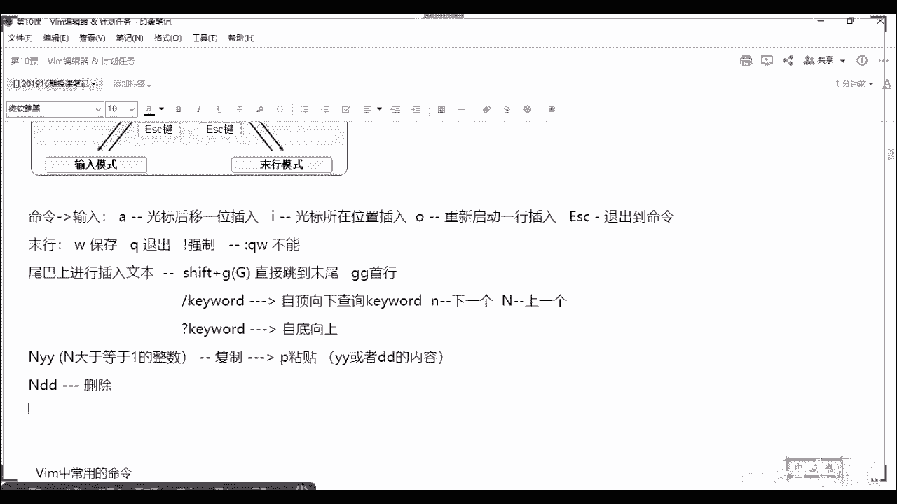
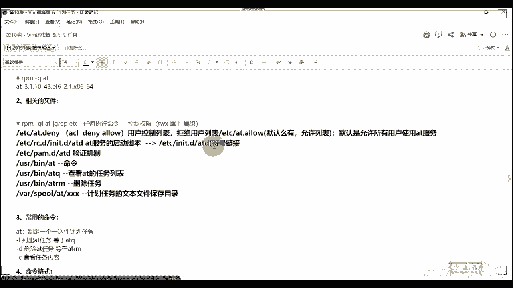
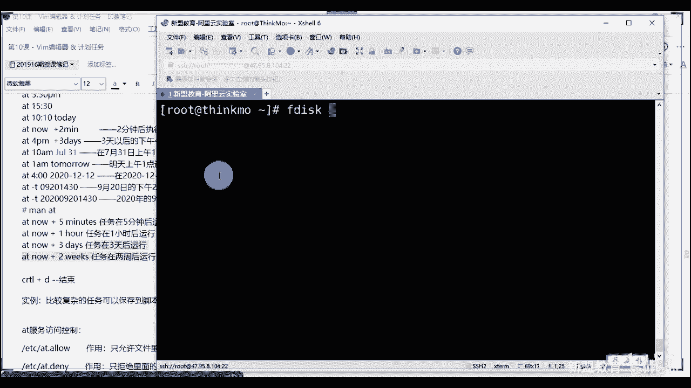
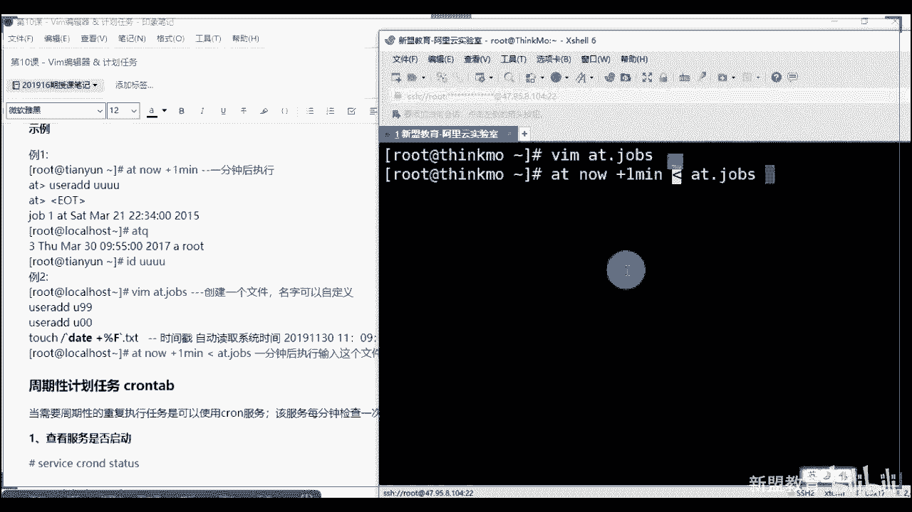

# 2020最新Linux-RHCSA入门实战课 - P11：RHCSA-第10课-vim编辑器&计划任务 - 新盟教育 - BV1Fg4y1z7kS

。

好。啊，今天的话两个内容啊，看来还是微信群比较好。行，我回来建个微信群吧。好吧，我建个微信群，微信群里面通知大家啊，因为一般一般的话，我们这个电脑上还QQ方面，对吧？因为很多群都在电脑上啊。

很多群都在QQ上。😊，行艾特他们一下啊，一会儿我就要点名了是吧？点名的话还不来啊。一会儿解明了啊，跟你们说一下啊。好呃，两个内容啊两个内容呃，还是通过文章去讲啊，今天两个东西不难啊，哎，可以的。

我觉得后面缺新人发红包可以的哈。好，那么两个问题啊，第一个的话是我们整个VAM的编辑器啊，也就是说老师我在操作整个linux的时候，我肯定会去书写一些文档，对吧？那包括我们到了后期大好了。😊，啊。

我们去对任何一个服务的操作或或者对任何一个服务的配置啊，我们无外乎是通过三个步骤。哎，任何服务的落地再来说啊，三个步骤。第一步是什么？第一步是安装啊，第二步是调试，第三步是。启动明白了吗？啊。

这三步安装的话不用我多说了啊，我们之前讲过的第一个来说，老师我通过亚码安装，或者呢我通过我们所谓的源码安装。好，启动啊就那么一句命令，对不对？start啊，star好，那么最困难的其实是其中的一个调试。

对不对？那调试我说过了，任何一个服务它都会有自己的配置文件。好，那么多的有N个啊，这个N个的话可能是5个6个7个，也可能三四个，对不对？那么少的话我也会最基本的有一个。好，那么我们去编辑这些文件。

我如何去编辑，对不对？好，它就相当于一个word好，那老师我在word里边，我如何去操作，增山改查嘛，对不对？😊，那么我们说lindux最大的区别是在于它和windows的唉命令卡，或者说是图形页面。

windows好点击，那linux完全通过命令去控制。那最早期我们发明的东西叫做VI安拉起来。当然还有一个啊叫做MSC的啊，我们比较常用的和默认在linux里面安装的叫做VI编辑器。啊，它的编辑器啊。

那么它就类似于一个word目的是什么？目的是解放整个的鼠标啊，完全的好，我们通过整个的键盘进行控制。理解了吗？完全通过键盘，包括方向键啊，包括方向。所以VI编辑器里边的话，我们会具备多种命令。

它也是能够支持很多的命令。也就是我们常说的快捷键啊快捷键。啊，count C啊count之 V啊这种的啊，只不在linux里面不叫con C了啊，而VIM搭起来哎它的话只是说我们1个VI的一个升级。😊。

啊，VI的一个升级来了吧啊，可以的啊。对对对，带高亮啊，升级是什么意思？就是呃我在上边的话做了一些个所谓的就是高亮。什么叫高亮啊？就是不同的啊不同的关键词啊，我们有一些个哎不同的颜色。😊。

帮助你去区分明白了，同志们啊，VI的话就纯黑白啊，纯黑白文本明白了吧？而且有的变，而且而且有的快捷键是不一样的，对吧？而且有的快捷是不一样的。😡，好，那么我先说几个啊，快捷键好吧？

我先说几个快捷键什么呢？你比方说示我的移动，哎，我得让我的光标移动吧。😡，是不是你就把它看作啊VI的话，老师这是word2003可以吧？底下这哥们儿这是word。😡，2013。啊，版本不一样了。

跨了十年的，明白了吧？啊，而光标的移动通过HJKL去负责HGKL老师，那是上下左右吗？不是啊，是上左下右。😊，进来啊是上左下右，他是这么做的。😡，啊，上加油。接了啊，跟你所说上下左右不是这样子的啊。

是上左下右接下来啊，HGKL4个键明白了吧？啊，控制公标OK啊，来了啊啊姐，让我们接着说。😊，了解说啊，所以整个VI的话呢，我们一共有三种模式。大家解来哪三种分别叫做命令模式。

分别叫做墨行模式以及输入模式。那么当你们默认进入一个文本之后，它所在的叫做命令模式进来。啥意思啊？我可以控制光标，我可以使用各种快捷键，就那么多事儿，明白了吧？啊，光标和各种快捷键进来。好，快见。

第二个哎，我我能够进入叫做墨行模式来记住啊，从命令模式我们可以进入的是进入的是哎我们的木行或者我们的。😡，命啊或我们的输入模式。也就是说命令模式是一个过渡啊，是要过渡。为什么别着急。😡，啊。

输入模式就明白了。我正查了录入信息或者修改嘛，对于文本的增删改查理解啊，而墨行模式希望大家记起来啊，希望大家记起来，这个必须通过我的命令模式才能进入。😊，啊，默这个输入是没有办法进的，好不好？

那么它其实是对于整个文本的文本的什么，就比方说我们的保存啊，退出，包括里边的字符的替换。啊，包括字符的替换等等。那么它最明显的一个特征是我在末行啊，在最底下那一行墨行墨行嘛。好，通过一个冒号开始。啊。

通过一个冒号开始。而三个模式之间的切换，我也给大家列举出来了，来看这个图，来看这个图很重要是吧？哎，你看这碗面啊，全英荟萃。老师什么图呢？我们默认进入到命令模式之后，几个快捷键。第一个倒好了啊。

如果你想进入输入模式啊，我们可以通过三个快捷键叫做AIO。😊，啊，叫做AIO只不过大家记住了啊，命令好到输入。😡，整个的AIO3个字母，我们代表了三种方式，啥呢？哎sorry啊，好，啥呢？第一个是A。

当然了，A表示什么？表示我的光标后移翼未插入。啊，光标后移意位，我们插入。不在当前位置。解了。啊，而I呢哎位置在这儿啊，I呢小A啊都是小写的啊都是小写的啊。哎，是在我们光标所在位置插入数据。😊，好。

最后一个O，大接来O2不是0，好吧。好，那么O表示我们重新启动一行插入。明白啊？吞层一样插入来看一下啊，我们随便打开一个我们的。😊，呃，服务器啊，我现在拿着语云云服务器了啊哦，来看。

比方说VM老师，我随便写一个叫做test点TX可以吧？咋啦？我在里面去输入啊，我别别别拿它了，别拿它了，我看看还有没什么好，有1个VI。😊，是吧VI我们的凹处。啊，用VM啊用VM凹。好，2YC。

早改好了。在这里面啊，我们要写一个东西，对吧？怎么写啊？啊，我分别用看啊，同学们，此时啊我进入之后，我会在最后一行看到你的文本名称。好，你有多少行，你有多少个字节carro明白了吗？

而你现在公标所在的位置是二行的一列，明白了？同学们来历刷一，看到最后一个了吗？😡，看到吧。但是此时你会发现老是我没有办法输入，明白吗？我没有办法输入你们可以看一下HG啊，HJKL是吧，上下左右是吧。

HJKL还是真的上下左右啊。好，那家来控制光标。😡，好，那么我没有办法输入怎么办？好啦，我现在摁的AA的话看出去光标啊，走再看。😡，A会向后移有一位，并且左下角出现insert的模式。

此时你就可以进行输入了。

嗯或者带到了NESA啊NESC。看了ESC表示退出。退出到我们的命令模式。

啊，ES一看没有了吧，insert取消了吧。这I好，老师光标不变，insert退出NO重启一行insert看到了吗？AIO大家来啊。😊，而末行模式我只需要在当前命令模式下输入一个冒号，看到没有？

光标会自动到达最下行，出现了吧。😡，看到没？公志们出现了吧。啊，接下来好，而最重要的来看啊，而最重要的是你要在这一步进行很多的。😊，命令控制。第一个W表示保存。

啊，我们把它写下来。W表示保存。对了。啊，Q表示退出知了啊，叹号表示强制。接来强制啥意思呢？你比方说老师，我有贼信没贼胆儿是吧？我想改这个文件，但是我改了，我却不合适，我改回来了好。

但此时如果我们只是退出的话，用Q你是退不出去的。😡。

你是退不出去的，必须用Q强制叹号。我对之前所做的任何事情不做修改。看。😡，理白了吗？退出来了。而如果老师我们正常情况下，WQ表示保存退出。😡，表示保存退出没有了吧，哎，直接用就可以了。

啊，保证错那么一个问题，老师，如果我们写QW生效吗？😡，来QW生效吗？告诉我生效刷一不生效刷二生效吗？😡，收到吧？收到吗？生效吧？生效吧？记住啊，不生效啊，这就不生效。严格按照顺序执行，我都退出了。

我咋保存你啊，是吧？老师QW拿哪生效啊，能力了吧，哎是不能的啊，进来。😊。

好不好？这个算不能的啊。好来。强制就不用我说了吧啊，其实墨行模式你们先记那么多，后边的话我们还会学到替换啊，替换，我在文本里面去替换好不好啊，怎么替换呢？哎，会跟我们讲到set命令的时候啊。

我们会详细的去说，它们的格式是一样的，只不过一个是在命令行里面输入，一个是在文本里边去替换，明白了吧？啊，这个我们后面会说。😊，啊，这来这是这三种模式啊三种模式。那命令以外啊，命令行里面我进入之后到了。

我进入之后正常插入。但是说如果我的文本过长啊，文本过长，比方说我们随便找一个啊，为么ETCHTTB好吧，HTB呃com复。

加HBD。这文本啊贼拉长，一共有353行是吧？1万多个字符。😊，好，老师，现在我才1-1，对不对？啊，我现在干嘛呢？我想像我的恶行啊，别说或最后尾尾巴上啊，别说木好了，我想在我的尾巴上干嘛？😊。

进行插入数据啊，插入文本。啊，老师，我我这个是吧，我摁住下，我不停往下倒倒倒倒倒倒350行。这是350行，要是100行的是吧？这要1一千0行的，带好了啊，摁什么？哎，老师，你怎么直接跳过来的？😊，好了。

同志们通过shift的。好，加上G。啊，也就是说一个大写的G对吧？也说大写的G好，我们直接跳到末位。啊，直接刻到末尾。好，勒索末尾如何跳回文稳首首行呢？接来啊首行是JG啊，首行认输了，明白了吗？啊。

JJ是吧，认输了接来。😊，看看，这鸡看到没有？会跳回来了吧，能看到吗？同志们来那啥是啥意啊，快。😊，哎，能看到吧？这你啊。好，接来接来。😊，那么我也可以通过其关键词。你比方说我用斜杠。8号，我用斜杠。

啊，后边跟的是key word的关键词。啥意思啊？打家住了，我是自顶，记住啊，一定分好方向是自顶向下。好，我们去查询整个的关键词。这是一个基本操作啊。😡，同时使用什么？当好了，小N表示我们下一个。啊。

下一个好，大N就shift加N表示上一个。咋个说好，同志们，如果我在此处啊，我回到首首行啊，小写的案，首行直接杠看到没有？这个叫命令模式，不叫墨行模式啊，叫命令模式啊。啊，呃你把它看到墨行也没事啊。

好了，我老师我想找HTP注意了，我想找HTP注意区分大小写吗。😡，区分大小写啊，好了，我的光标在这儿呢，此时我按小N，看到没？我光标是向下走的。😡，我按住shift按大摁，我的光标是向上走的。😡。

看到了吗？看了吧？哎，而跟它对照起来好了，用问号开头。😡，key word，那么他表什么告诉我。他表什么呀？😡，代表什么？自底向上明以了吧？自底向上啊，这是自底向上啊，而自底向上。

记住这两个都是一样的啊，只不过我的下一个是往上倒是吧？我的下一个是往上倒，注意方向，好吧，有点方向感。😊，哎，这是我们常用的几个，好不好？同志们先记下来啊，先记下来。😊，再往下边的话还有什么呢？

你比方说哎我们可以用。😡，啊，sorry啊，我们会有一些个呃增商改查，好吧，同志们增山改查用YY。😊，啊，用NYY是吧？NYY。😊，这个N呢是一个大于等于零的啊，是大于等于一的一个整数。哦，YY表示啥？

同志们YY表示啥啊，老师我不懂了是吧？😊，啊，大家记住啊，这个表示复制啊表示复制是吧？哎，没错，哎，表示复制好不好？那么跟它对应上的一个相对应的叫做P啊，这个P小的叫做粘贴。😊，啊。

这做粘贴复制粘贴明白吧？好，同样的跟它N滴D。😡，A也是大于等于零的整数啊，那么它是删除。好，记住啊，粘贴什么，粘贴你YY或者滴滴的内容。😡。

都可以啊，YY或滴滴的那种。你比方说太好了，此时我光标所在行一定是从光标所在行开始啊，你比方说我放到底下来。好，这次到了一行两行三行、四行、五行、六行，对吧？好，我想把这六行删掉，我就输六DD。😡。

看到没了吗看到没了吗？然后在这一行P粘回来了，看到没有？123456空格也算一行。😡。

没法你操作吗？霍老师，我6YY。😡，看到吗？同学们告诉你6个被复制啊，P粘贴。😡，看到没有？看到没有？看到没有？好，那可多说老师我这个操作太多了，或者说我误操了，我忘记在哪里了啊，就是粘粘贴和删除啊。

😡。

站楚啊，看没有再说一下啊，好了。😊，我光标在这儿呢，看到吧？李萌光标在这儿呢，我想把这六行复制，我想把这六行复制。但是你注意一个问题啊，你现在是在windows上作，有有有这个粘贴，对吧？有复制。

有鼠标，我可以这么做，但是你在linux里边，你可没有鼠标啊，咋办？咋办？用命令明白了吧？这个N好，我输入6。😡，拜拜。表示从光标所在行开始往下数六行，把它复制起来，明白了吗？有惑。明白了吧？

然后我通过一个小P把它直接可以粘贴上去，这些都是在命令行里面给我做的啊，而你说老师我误操了。😡。

好，我想撤回咋办？我撤回答吧。怎么办怎么办？用一个小U解答啊，小U表示撤回。

套了，老师，我摁错了，哎呦没了吧。哎呦看到没有？跟你在那个跟你在哪里啊，是不是跟你在这个word里边摁那个返回箭头是一样的。那同学们，你们记住，linux，尤其咱们刚刚进班能学，记住句话。

linux不难学。😊。

难学的是你觉得老师背的东西太多，是撤回上一步。😡，跟windows是一样的，你点一次按ctrl Z点一次回一步，点一次回一步明白了吧？啊，lindows不难选。哎，对它只是把什么。

只是把你windows下。😡，所有的靠我们的鼠标。😡，啊，靠我们的鼠标点击的好，我把它变成了命令。😡，没有了吧，变成了病人哎。有没有类似contrl C Cr y的，这里边是没有的哈。

这里边是没有的好吧，你ctr C的话，在外边的话表示退出ctr D的话表示结束后台程序，知白吧？哎，还有cr C呢啊这个回来再说，这是快捷键。😊，这个算是这个算是这个linux里边自带一这个小快捷键啊。

进来了，哎，它只是把鼠标变成了命令。所以大家可能说老师好难学啊，其实不难学啊，明白？其实不难学，好吧。好。其实玩lindows的人呢一般一般比windows啊，其实没有人多少玩windows是吧？啊。

所以我们来看一下，我其实给大家列举出来了，只不过我习惯性自己去讲，看一下同志们滴滴标什么剪除光标所在行。😊。

你甭管老说，我的光标是在第一个还是在第10个，是不是我总之硬滴滴，这哥们儿就没了。😡。

啊，就删除掉了，对吧？5DD删除光标开始的5行，我说没问题吧啊，YY复制5YY从光标开始复制5行啊。N当好了，显示我们搜索定位的下一个字符，单上一个字符，对吧？U撤销P粘贴看看到没有？删除的或者复制的。

😡，给它粘贴到光标后面啊，再来。好，那么这是我们在命令模式当中，而墨行模式就是保存WQQ叹号是吧？然好来解单啊这几个场绩这个场绩。下边还有一些个是我墨行的设置，大家其实很好的简单。

冒号表示默行set表示设置NU表示什么表示NUMBR的number。😊，number表什么？哎，可以用U。有没有恢复上一个了，这倒没有恢复的话，你就不接着做嘛，对吧？恢复不就是撤销嘛？

你说这继续前进一步是吧？前进一步的话，我还真忘了啊，有一个有一个重做，有一个我忘了啊，但是我们很少用那么多了啊，是吧？啊，知道。😊，接来啊，这个地方前进啊前进的话，给你查一下吧。

一会儿这个我忘了是大写的U吧，你确定吗？走N个大写的U不是啊啊，不是啊不是好吧，来，就是说啊。😊。

set到了NU表示set number。表示set number啊，我知道就是countl y嘛，对吧？这个我一会给你查一查吧，好不好？我忘了啊，这确实忘了好，接来叫做number。

叫短ner显示行号怎么用？看好了？哎，直接冒号末行啊，别着急，替换一会儿会说在这儿呢，看到没有？在这儿呢啊，好，etet空格啊，中间有空格啊，NU注意了，显示看到没有？会显示每一行这个可以吧。

来或者刷一啊。😊。

来，我开始刷一。好好。到了再来。哎，但是你要明白一个问题啊，你显示这个行是没有办法匹配出来的，明白吧？是没有办法匹配出来的。😡，那师，我想跳转到100行，我怎么调整啊？😡。

我怎么跳整到100行啊，大家记住啊，其实这个GG前面也可以N个N。😡，哎，我也可以跟着N，我跳整到100GG上，明白了吗？啊，你要说是100GG看到没？我过来了吧，200GG过来了吧。😡。

啊，都是小快捷键啊，进来。😊，好，所以这个地方大家可以记来这的set number显示行号啊，当然了，我也可以把它取消，对吧？no number。😊，对吧，no number。啊。

冒号命令这个的话先不说啊，这个我们先不说，这个其实基本上不太用的啊，这基本不太用的冒后整数哎跳转到该行是吧？接来再往下，我们我们很少就实很少用这个，我们都是100GG是吧？好。😊。

第这里下是替换进来这里是替换。😡，替换的呢有几个过程啊，或有几个范围。我把我把大家常用的给你们列举出来，可以吧？啊，不常用的我就不不话不画说了啊。好，那么首先确定一个点啊，S到了表示我们替换的一个开始。

啊，表示K one开始。那么两个杠两个杠表什么？注意啊，是否把前面的替换成后面的，把one变成two。😡，先把位置记住，把前面的变成后边的这叫替换啊，这叫替换。好，那么替换过程中说我替换哪些？

我是整个文本替换替换整行还是替换某一个部分。😡，对不对？好了，同学们首先来说，我后边什么都不跟，表示我只替换光标所在行的第一个啥意思啊，啥意思啊？如果这句话是吧？

one到了加上one啊ecle two到了此时我们点击替换之后，我只会把这个改掉。😡，理解了吗？来一翻一。啊，来这条一，你们要记得就是一个格式逗号S。😡，冒S后边的位置，这个啥都不跟，就是只替换一个。

老师，我想替换所有SG，看到没有？跟个GG表示尾巴所在行所有。😡，啊1两左右对了。全文的。😡，冒百分号那就来百分号啊，加个百分号看到没有？一个是第一这行的，第一个，一个是这行所有。

一个是全文看按照顺序走了吧。那么我们再插入一个。😊，啊，我再插入一个。好了冒号什么嘞？好了一逗号4S。好，问大家一个问题，这个表什么呀？这个表什么呀？哎，我操，这个表什么呀？😡，能知道吗？哎。

表示我们1到4行啊，1到3一定是逗号啊，一定是逗号，而且是英文状态的。😡，再替换我们1到4号。啊，前面的数字你可以自己去控制。前面的数字你可以自己去控制，明白了吗？😡，啊，这也不用多说。

底下的话两次我们的关键词匹配，自底向上自顶向下。啊，这两个一起来就可以了。啊，这样子就可以了。啊，其实我为什么不不爱给你们去讲这个题换呢？因为很简单，我们不不怎么用它。

我们用的是s的命令到后面会讲到但都西讲到这东西当好了，就是第一步理解第二步背，你知道师有什么好的方式吧？多敲多练听见了吗？啊，多敲多练，再其他的就没有了，折了啊，好不好？哎，这是我们的整个的模式啊。

大家来。😊，好，那你说还有什么往下走往下走往下走。那么配置主机的名称到了，这个想跟大家讲解的是两个文件啊，两个文件。

好，第一个来说我可以的好了，我是不是之前讲过了，我直接可以通过hos name这个命的命令啊，命令跟你们在路欧交换里面是一样的。我直接跟上。你比方说老师think，比方说募权是吧，好了。

我是需要重新的登录一下的，用SU就可以。当了，用SU就可以。好了。登录了吧，但是此时如果登录reboot重启之后，它失败。😡，改掉了，明白吗？他只会被重新替换回来的。

啊，所以这里边配置主机名也是熟悉一下我们的VI编辑器啊，也是编辑器。那么。主机名本地的解析通过的是hosts文件解了，hosts文件。那么同学们这个是一个本地的DS的一个解析。这我不说了啊。

但是但是我们还有一个文件叫什么来？叫的ETCho name进来啊，这个其实是用来保存我们的主机名，这个是来保存我们的域名的。但家你要明白一个问题，主机名和域名的关系好不好？

主机名是你自己预表示你所在的位置氛围。😡。

所以我如果想要改变我自己的话，我应该是记录的是ETCho names吗？好，同学们在这里面我可以写。你比方说192。168。1。100，我对应上的是thinkcamo点啊，当好了。

比方说目前点sca冒点comM。😡，是是目前点think点com。好。此时你是知道你在的域叫做thinkcamo，你的用户名或你的主机名叫做木犬，大家理解吗？😡，而你发现我只要拼这个也会通。注意啊。

我平台也会通。😡，而我去修改主机名是在这个地方后se类目。能理解同么们？在这个位置，我只要改成我们的think move解了THINKMO保损退出。😡，明白同学们？

但是这个就真的是需要你去重启一下才会生效了。😡，啊，你用SU充登行吗？老是没变啊，是不是能理解吗？来立双个一。😡。

来李双一啊。好吧，来一说A，或者你可以检测一下hose name，对吧？老师说我hose name走。😊。

那，此时注意了啊，你没有重启怎么样，这个过不去，对吧？过不去啊，大家来。😡。

啊，这过不去，进来对吧。😊，好，这个问题你们可以自己后边去列一下，我就不重启了啊，我就不重启了。😡，啊，也可以对，用这个命令也是可以的，叫什么呢？叫做hose name CTTL。

但是这个命令可以找一下有没有默认支实装子对吧？CTLs杠hose name啊呃有的时候你们在这个这个这个考试里面有时候会加入到是吧？CSACE的考试里面，但是其实我们很少用它啊，好吧？哎不要说老师。

我要。😊。

对吧走。这就过来了，明白吗？同志们，但是这个的话这个的话是大小写的问题啊，但这个是没有大小写的，默认都是小写，对吧？哎，你直接用这条命令可以改成大小写的。😡，进来啊。

好，补充的把这个命令补充下来吧，好吧，把它截个图给你们啊，截个图，注意大好写啊。

为什么我说朱意大老姐啊？😡，不知道注意大小姐啊。想想为什么要注意打游戏，很简单吧，对吧？很简单吧，就是答明白的呃，这个这个这个东西。😊，我们linux里面是严格区分大小写的对吧？哎，这个输出都是小写啊。

和我们后司内边还是有点区别的，明白了吧？啊，O。好，可重启虚拟机尝试查看明白？同志们，这个我就不说了啊。啊，这是第一步，你们可以自己去练啊，这是第一个小练习。第二个小练习配置你的网卡。

网卡里边我介绍过了吧，所以这个还用我说吗？啊，老师切换到这里面去。😡，哎，肯定是区分的，切换到这里面去进行编辑VI后边你的网卡名称，对吧？里边去做吧，好不好？最后别忘了，我说了。

你的服务是通过三个步骤安装调试和启动。这个启动包括之后我们的到了。如果是我们已经再运行的服务。好，我有修改。😊，我是必须经过所谓的重启，叫做restar。okK才能生效啊，这是大多数90%的。

哪些呢re或者呢reload哪或者reload。😡，追亚或瑞load的。好，那问题在于吧？来问一个问题啊，同志们问题在于reload和restar的区别在哪里啊？告诉我。😡，能知道吗？啊。

re start。😊，和 reload。区别知道吗？来知道刷一不少刷2啊。哎，没错啊，记住reload是生产环境用。😊，就是我们正式环节去用。😡，好，是在不中断我的服务的情况下。😡，没有，同志们。

我们去重新的加载我们的配置。好，也就是说对用户而言。啊，对于用户而言，其实是没有中断的。就是比方说web你是没有这种什么404的反应的。哎，而restar实际上就是stop加上star。😡。

由于我中间stop了，所以当这个时候我的用户是有感知的。😡，所以你会经常看到404页面丢失。明白了吧？哎，所以生产环境当然是用这个了。生产环境一旦是有reload是一定要用reout的啊。接来的同志们。

而还有一些个，比方说像java类型的。😊，服务你比方说comca是吧？你比方说ELK看道了，这个是不用重启的。啊，大多数对。功能有区别，没有区别，这两个都是重启，都是重置。

但是这个对用户是更合对你的生产环境更安全，理解吗？因为你可能带好了，如果老师我中间断了stop，很有可能导致我其他的连贯性的问题。😡，理解吧？哎，所以我们用的是这个。啊，所以用这个。对了啊。

你赶上业务终端就完蛋了，对吧？就说java类型的服务一般来说是不用重启的啊，改好了就可以用了，刷新一下就能用了，明白了吧？😊，然，就是说啊。呃，还有哪里还有哪里啊？好，就说。😊，哎。

所以配置我们整个的网卡大应该应该也是很清楚的了吧。啊。好，网卡这个地方我还用说吗？不用说了吧，最后你只要重启一下就可以了啊，拼一下联通好吧，配置我们的亚麻，这也是很简单的。仓库大家之前都练习过。

甭管是本地的。😡，啊，要么仓库就是软件仓库嘛，对吧？啊，跟咱们是来同学们说一下啊，我们之前做过的是本地的，做过的是HTTP的。好，把我们自己的发布出去。😊，对不对？啊，把我们自己发不出去。

老卡榜定后边讲别着急啊，后边讲不到不到不到时候呢。😊，对吧把我们自己的发布出去在HTP的啊，自建亚嘛。然好了，我们在企业里面生产文件。😡，自接样吗。懂是生长环境自建亚吗。好。

network manager，我们一会儿说吧，好吧，一会儿说吧，先把这些东西讲完。network manager这个东西是六里边用的。其实七里边我们有的服务后面后边会讲到啊。

比方docker里面可能会涉及到。啊，那么配亚么对吧？我们说的要么一定是要在这个目录下，所以大家注意了winlin里边你重要的是什么？是记录很多文件所在的位置，这是强行记忆的啊，敲除了，你就明白了。

而且是要以点RPO为结尾啊，为后缀，虽然linux没有后缀吧啊。好，里边的话这三个这几个参数我们之前给大家列举过对吧？再说一遍啊，好，要么表示唯一字符避免冲突，这个是唯一的，不允许重复。

第二个name表示你这个文件到底叫个啥啊，你这个这个这个这个y么源叫什么东西，对吧？第三个enable的啊able的启动啊，是否启动啊，一是启动，零时不启动，对吧？baseL表示我的亚么源是哪里来的？

一个是本地fi。😊，啊，一个是ATB，一个是我们的FTP。但是。f其实来说也是两个，对不对？其实也是两个杠啊，只不过第三个杠是我目录的开始，我挂在了哪个位置吧，对不对？是挂到哪个位置啊。😡，啊好。

接着说接着说啊GPG我是要检测这个圆。如果我是本地的话，我们不能都检测，怕你的光盘有有损坏，对吧？啊，检测的话得有公钥啊，那么是这个公钥。😊，对吧啊。好，最后一个呀叫做ETCFS看到了。

将你的挂的信息写到他里面去，目的是干嘛？😡，目前个吧，比方说同志们来看啊来看weETCFS type。😊，好了，拿到最后一行来，杠O开始插入，我们是要把本地的。😡，DVC这是光盘，对吧？

把光盘就是你的U盘挂接到你那个windows里面的可移动磁盘下，我们挂载到这个下面去。😡，对不对？类型我叫ISO9660，这是光盘镜像的类型。你们U盘的话可能是FAT对吧？😡，啊。

默认我的权限default。😡，写了啊，这是权限默认的权限，有读有写，对吧？好，DEFAULTS好00。是不是不自检，不备份。😡，这是挂载信息。复习了一下啊复习了一下啊对吧。😊，走。付一下。

最后我们去安装整个的HTP对吧？安卓HTTP啊好，这个不用我多说了吧。啊，只要看到complet就可以了，好不好？啊好，然后这个是我们最简单的1个VIM的一个基本使用，大家能跟上了吧？啊，慢慢上啊。行。

然后后边呢给大家休息那么5分钟，好吧，大家可以休息5分钟。😊，5分钟啊。好呃，我们说在整个lininux里边，你后边有很多的东西是需要你们不断的或者说定时去执行的。因为很简单，你比方说我们的系统备份。

还举个例子啊，那么很多的备份是需要干嘛？是需要我们每天或者每小时啊，或者每小时或者每周啊或者每月进行一次的。啊是这个意思的。那么你不可能说老师我天天的给自己上闹钟是吧？啊，每小时上一次，你也太烦人了。

是不是？所以我们更多的是希望他能够自己去按照规定或按照我们的一个呃一个一个周期去进行，对吧？按照周期去进行，所以以此衍生出来的一个东西叫做我们的定时任务节啊，这定时任务会的会的会的会的。

回答会发在里面的啊。正好今天该我们的第一个月的课程结束，对吧？首月课程结束了这一套笔记给大家发到我们的群里面，好吧。😊，好，那么按照我们的周期去进行。哎，对，好，标第二。所以呢这里边希望大家明白的哈。

我们的定时任务先说一下，分为一个叫做一次性任务啊，一次性任务所一个叫做周期性任务。😊，啥意思啊？啥意思啊？一次性的执行一次对吧？啊，就是执行一次嘛，跟你的闹钟一样。周期性呢我们按照规矩啊。

按照我们的周期去进行。😡，啊，两个命令一次性的叫做at啊，艾后边的话一般跟上你的时间啊，跟上时间好，周期呢叫做Cd大好了？叫做CROND叫做Cd。😊，啊，命令的话呢叫做crow type。

CRONTAB命令。行啦啊，可以的，葵花宝典可以可以啊，所以我们先来看啊，先来看哎，准确来说不能这么叫叫叫他是吧？啊，那么我们先来说计划任务就是你在指定的时间来去执行某些任务或者程序。😊。

任务可以是周期性，也可以仅仅是一次啊。那么linux当中有两个，一个叫做cl，一个叫做艾接来。好，这两个都是默认安装的，而艾负责的是执行一次性任务。啊，cloud表示周期性。😡，能理解了吗？啊。

那么都是依赖于我们后台本身已有的程序，都是这个低。大家来这个低。好，所以衍生出来一个问题，大家好了，这个D是啥呀？😊，啊，一是啥呀？😡，知道吧？对立是啥呀？记住啊，这个第一全称叫做deelmo哦。

叫做demo。这个demon啊叫什么？叫做我们的守护进程。😡，叫做守护进程。守护进城之前没跟大家讲过，是不是？好，目的是什么呢？好了，这个守护进程，你就把它看作我们后台的一个程序就好了。

而你们所有的程序在运行的时候一定会出现那么一个东西。好，干什么呢？好了。😡，之前给大家讲过，里们的服务一定是都有端口号，对不对？而端口一定是要监听在哪里？告诉我。

我们是要监听在我们的叫做叫做sockcket，对不对？监听在我们的安全套阶自善道了。而今天在安全套阶上之后，我们所形成的所形成的一个进程，就叫做守护进程。能理解了吗？啊，拿起来哎。

这个demon其实就是一个后台保护你的进程。😡，啊，保护你进程。好，这个我们后面遇到了呃，还会再去多说啊，这别着急，这个后面还会再讲句说这个还是讲到服务嘛啊，讲到服务我们还会接着说。好，那么往这看啊。

那么作用就是让你计划任务，让你主要是一周是吧？做一一次一些周期性的目的是定期备份数据再啊，定期去备份数据。😡，好呃，备份应该就不用我说它重要性了，对吧？好，换颜色啊。😊。

那么在这里面at特C的一个这个东西啊，先去看一下啊，那么所有的计划任务在执行当中，我的输出好了，输出都会以邮件的方式发送给指定用户。记住了。而默认情况下。默认情况下。

其实我们的lins是具备我们的mail功能的啊，我会有本地的mail，能理解了吧？一会儿看啊一会儿看。除非充电项充电项我们下节课会讲到输入输出。啊，输输。那么来看第一个一次性调度啊。

一次性调度执行at命令好不好？那么at的话第一件事啊，你是不是查一下它呢，我觉得都可以啊，我觉得都可以是吧？艾RPM杠QA到好了啊，g艾这个是我常的查询是不是装了呀，是不是装了呀，找找装了吗？

装了能同们啊，装了啊。😊。

好，那版本的话是3。1。3。1就可以了，几大版本就行啊，几大版本就行啊。😊，好看那相关的一些文件的话，你们还可以通过QL去找到它的。好了。那么这些文件我给大家也列举了出来一些非常重要性的。😊。

你们到后边会用到的。第一个来说啊，这是安装啊，就查哎，没有的话，就亚么in store艾明啊。来看叫做@ deny啊，这个你们学网络的人应该明白的。大家知道网络的话。

ACL是不是要dy可什么hello是不是通过允许嘛啊，这个拒绝dy嘛，对不对？啊，用户控制列表，只不过我们之前是针对流量的，现在表示针对用户了。😡，大家能明白了，但凡是任何一个执行的命令。😡。

我们都是要控制其权限的这个权限包括RWX，包括属组，包括属组。不是说老师我随都谁都能去运行的那谁干了问题都是一个团队的问题啊，能理解吧？所以控制用户，这也是最小化原则啊，那么拒绝用户的列表。

就是它好不好？允许的就是他当然了，允许就是他。じ。好，默认的时候是允许我们所有的用户去使用艾特进来，默认是所有用户都使用艾。啊，下边这个到了，这个就是我们ad的启动的脚本啊，我们只不过在ETC下好了。

ETC下NIT点D到了杠ATD。😊，这是它的一个软链接，也就是我们所说的符号链接。别着急别着急啊。好起来叫做符号链接。接叫做符号链接。

能理解吗？同志们可以看一下啊，所有的ETC。😊。

看在这呢NIT对吧？INIT找他。ABC， EF T H。HI看到吗？是不是我们过来了，指定过来来看到双一。是不是我指过来了呀？😡，看到没有？哎，简抽啊是个简抽，好吧。okK好，验证当然了。

这个我希望你们先记得，但是不在这儿用啊不在这儿用，这个在哪用啊，在哪用，在桑把。😡，叫做文件共享服务。里面去用我们会有一个认证的过程啊，30里面。好，命令艾直接用了啊ATQ查看艾特任务，对吧？

ATRM删除啊，到了war at，这是我们记录你的。😊，定时任务的文本所在的位置在spo里面ats里面ad在这地方。起来啊。操作命令L显示D删除对吧？C查看啊，这都是英文单词嘛，对不对啊。

等于这个等于这个不多说了啊。李方说老师，我现在看一下是吧，ATQ有吗？没有AT杠L没有明白了吧？啊，都是空的啊。😊。

啊，格式的话来看啊，同学们啊来看它除了跟数字以外，看到了，它是分两种，一种我是用十二进制。啥叫十二进制？中午和下午分开都是1234567891012。所以你后边要跟的是AM或PM。😡，能理解了吗？

AM或PM。😡，要不然用24进制直接跟全称啊，151617是吧。😡，到了，第二个我也可以指明10。15默认情况下不跟就是上午的，是不是好？today是告诉你今天上午执行。😡，啊。

no at now表示现在加2分钟就是2分钟以后执行。😡，如果是减2呢，S now提前2分钟是吧？没有减2分钟啊，没有减两分钟是吧啊，你现在设置过去的没有意义，理解吧？😡。

你看这个三天后的PM到了加号之间啊，加号之间这个地方其实应该是没有这个地方是没有空格的啊。好吧，没有空格的，这个地方是有空格的，这个地方是有空格的，这地方是没有空格的。😊，好，接来。啊。

day3 days。好。往下走都是常遇见的啊，比方说老师我定的日期，julyjuly表什么？7月啊，月份在前，日期在后，进来月份在前，日期在后。😡，好，接往下看。啊，这往下看，再往下。😊，这个是什么？

😡，加套了，这是时间戳，我们管叫做时间戳啊，什么时间戳啊，年月日是吧？到了哎，年月日里边我们省略了年啊，月日后边跟的是时间。再完整一点的话是年月日时间。😡，理解了吧？啊，这几种你会一种就行，会一种就行。

啊，有了我也不有了，我也不解啊，好吧，艾大了解释一下，5分钟之后是吧，几分钟之后overs看到没有？瑞s好，我们试一下啊，看看啊。😊。

注意啊，看它的加号啊，比方说老师艾啊no好不好？我们加上2min得吧？看到没有？不用跟空格啊，这中间不用跟空格啊，atmin2分钟之后干什么呀？😡，干什么呀啊，你干什么都行，LS也行是吧？

还有什么样也行，记住退出用counttrC叫强制退出。😡，强制推出的话来看一下同志们work下 pull下and下还有你的这个文件吗？有吗？告诉我有吗？😡，这还有吗？有吗？同志们是不是什么都没有啊？😡。

能理解了吧？强制推出不做保存。😡，啊，强制推出不做保存。好，接下来跟什么跟人家FD一样是吧？Fdi必须大不了，不大不了强制最多不保存啊，接下来。😊。

好吧，靠着D也可以啊，靠着D也可以。好吧，所以呢讲这个来看一个比较复杂的啊脚本，好吧，比较复杂脚本。😊，哎，别着急啊，别着行行行啊，你过分了啊，这是跑路之前做的，是不是啊，跑路之前做的啊。

其实你跑路之前做也能查到是你做的，你放心好吧？为什么？当然你要明白一个问题啊，所有在我们的系统里面做的任务啊做的修正啊调休。😊，好，记住修改啊要修，你们最后还是都要落在你的书面上。啥意思？

啥意思ior啊，跑哪去了？都是你要落在你的书面上，为什么什么意思啊？😡，你的公司啊还是会有一个会有一个这个这个员工的。操作手册的员工的操作手册，记住啊，它其实有很多流程性的东西，你按照它去做。

你按照它去做。哎，第二个来说，还会有一些个就是员工的记录，操作记录。不错，这是手写上去了，也会有审计去检查，越大的公司审计越严格，明白吗？啊，就是没检查完成，你是走不了的啊，你是走不了的。明白吧？

怎么调出后台一直执行的脚本，你说是查看你后台任务吗？PS啊就可以看啊你后台运行的进程啊，对吧？或者top这些都可以啊。😡，啊，对。啊，我们比较复杂比较复杂的任务可以保存到脚本里面啊，对吧保存到脚本里面。

😡，来看看第一个来说我们用艾特去访问啊，我们的服务访问控制。好吧。第一个来说到了，我在on里面只允许文本里面出现的用户使用艾特。😊，如果这个文本存在，我们就不去考虑这个了，明了吗？不考虑这个了。

啥意思啊？😡，不写啦。不写的都拒绝，就这么个意思，不写的都拒绝。😡，啊，这跟ACL其实都是一样的，隐性拒绝厉害吗？同志们。对吧隐性拒绝。好。另二只拒绝里面的是吧？当然了，接下来。

如果allow不存在才生效。😡，啊，不存在才生效。所以呢你要明白一个问d奈的话，我们就是除了拒绝的都允许这个这个里面是不拿到了哎。就是不写了。都允许这个默认和什么叫做隐视允许是吧？

这个是默认和华为的路由交换ACL是一样的。好的路由交换ACL是默认允许的对吧？对吧？来看一下啊，我们整个做的事例第一个来说第一个来说艾拉一下。😊。

at什么老师no现在之后的一分钟。😡，对白吧？一分钟执行什么？执行一个执行一个我们的user andUUUU拿起来4个U啊4个U。😡，不着急不着急。啊，不谈那个好不好，不谈那个啊。好。

默认是一分钟后执行UUU。然后大家记住了，我用的是1个EOT删除。😡，EOT是结束。来，同志们ET结束这个东西记了考好了，记起来啊，记来表示什么意思啊？比如说我每次看到EOT就结束啊。

比示看到EOT就结束，明白了吧？看到EOT就结束，带家来。😡，所以我们退出。crl D就可以了啊，crl D。老师我自己手敲记住啊一个问题啊，答家好了，给你们试了一下啊，给你们试一下。老师。

我用一个馈子能推吗？😡，能吗？别着急。不要紧，哎，这个就做user add表示添加用户。😡，用户名是UUU好，所以我用四种方式退出，你们告诉我哪种方式可以啊？老师，我输一个有用吗？没有用。

我用exist的能能行吗？不行，我用qui行吗？不行。😡，啊，大多数情况下。😡，你会发现其实老师exist是吧？会他打了QIT。😡，啊，这几个都行。但维度在艾里边记住，我们只认counttr。加低。

我们在alt edge里面指认ctrl加D，明白了吧？打起来。好，所以艾DU呦呦等会儿的。😊，看看是不是我加上了，已经能看到吗？我是不是已经执行了，是不是已经执行了，告诉我看是不是已经执行了。😡。

看到没有？国士加贴大了，我之接没加过的，我之认可没加过的。😡，对吧我之前可没挂加过的，哎对杠Z counter C是挂起。看没有啊。进来哎，所以你们就明白了，对吧？来看一下底下的啊。

看看底下的哈呃word下s pull at。😊，对吧，同志们看一下是炮。啊，里边的话里面会有一个东西啊，我们看一下啊CT。😊，点儿SEQ啊，sorry，一会儿再看吧，一会儿看这个一会儿看这个。

我们把这往下走往下走。😊，先找找我们有没有艾特。😡。

的lo。有吗？朋志们有at allow吗？好像你们发现没有as都是单。😡，所以明白一个问题，as allow是需要你自定义的，自己去写的，明白了吧？自己去写的一行一个用户，一行一个用户啊。

记住lo里边的格式是一行一个。老师我写一行，这都只认识一个了。😊，啊，对一行一个。

怎么查看有定时任务的？countr啊不是跟跟你说了吗？对吧？ATQ嘛，啊是是。😡，对吧或AD杠L为什么没有了？告诉我为什么现在找不着了。😡，为什么告诉我？为什么老说我刚刚设置没有呢，为什么没有告诉我。

😡，对吧包括老说为什么我在我这个目录下也没有了。😡，哎，执行完了，明白了吧？啊，执行完了啊，接来。😊，对吧。哎，这就是查看这就是查看，明白吧？这就是查看。😡，啊。你想说老师。

我我我怎么我怎么知道这个是不是定时任务创建的，这个你看不了，这个你看不了。哎，对，这是一次性的明了吧？啊，一次性支配可以可以可以啊，又开车了，猝不及防是吧？第二种方式来看到了，同学们。

我们可以VM写一个at jobsbs创一个文件。😡，在这个文件里边其实就是一个小脚本一样，对吧？老师我user add，比方说U99啊，user add到了，一个是两行啊，U00。😊，保存退出知道了？

哎，别保存出，在里边再去写一个叫做data attach。😊，啊，创建创建什么，到好了，创建什么创建的。😡，好，用反引号去抓，你们先跟着我记反引号。我们在下一节课里面会给大家讲到所谓的转移。

看效果就好了，好吧？我们看效果就好了data。😡。

啊，加上。百分号F对吧？一会儿说啊一会儿我们再说这什么意思，好吧，一会儿我们再翻译这是什么意思，好不好？这是转业，这是让他使用啊，别着急。😊，好，保存退出，这是创建时间戳，大家啦，这一步叫做时间戳。

啊，叫做时间戳。啊，自动去读取我们的系统的时间。哎，20191130是吧，时间11冒号09叫时间戳，甚至冒号5056秒记来啊。

然后来看我让他去执行，知了，啥意思啊？at no。😡，好，加上。一分钟。扎住了，这个知道什么意思吗？😡，知道这什么意思吧？😡。

这什么意思啊？啦，一会儿我们还会想到表示我们的输入重定向。好，把后面文件中的内容我们输出到前面。的命令里。啊，前面的命令叫做输出充电向。输出充电向。😡。

你里面有内容，我把你的内容输入到你这个命令里面去看同志们我就已经添加成功了。😡，练了吗？来看看啊，别别赶快时间赶快时间是吧？where下 pull at。😊。

再看是不是有一个看到没有看到没有？😡，看到没有看到没有？看到没有？朋友们里面为什么不用看啊？里面有一大堆呢，看到没有？里面有一大堆呢，你都不用看的，看到没有？😡，这是他自己添加的这是他自己添加的。😡。

对吧这是他自己添加的。好，我们来看一下，看看有没有东西啊。😊，哎，看看好，现在执行了吧，CDEDC passsword的走执行了吧，执行了。😡，好玩吧。啊，好玩吧，同志们时间戳看到没有？这叫时间戳啊。

这些都是时间戳，明白了吧？😊，进来O吗？好，然后我们接着说啊，然后我们接着说。创建了一个这个文件，对吧？同志们创建一个文件啊，看看本地文件有没有看看有没有这个文件啊。😊。

touch了我们的文件，找一下在哪了。呃，他应该touch的文件是在哎，刚刚那个文件是在哪里了？在这儿呢对吧？算了算了算了走到了，拜拜。这个文件所在位置啊，创建一个文件，对吧？touch嘛。不加时间数。

不加时间说就直直接加名字嘛，对吧？直接加名字嘛，这也删掉了是吧？一次性的指质性啊。😡，啊，fin一下是吧，fin一下找一下本地上好，以我们的点TST执行的。

啊，ETSE没结尾的。我看一下前面啊。然后这个好像也是直径接束就没了。稍等一下。还是没创建出来是吧？好了没创建出来，稍等我们找一个看一眼啊，有没有。有没有？好像是没有是吧？跟下吗？你确定是在跟下吗？啊。

这儿呢是吧，这呢啊可以的可以的可以的看啊，我说位置没找对是吧？啊，对，跟下啊，忘了这个是个小根，对吧？这后面是让你再执行啊，小根忘了。😊，看到是不是时间戳来，告诉我是不是时间戳杠F只是跟的是年月日啊。

年月日你后面还可以更更其他的。😡，看到出现了吧？哎，1111啊，这个这个光棍日节可以的啊。好，接着看。很简单啊，这是我们的一次性任务，好吧，一次性任务。进来。一次性任务不难啊，但是你说老师我想让他备份。

我不能每次都都去定制啊，每次都去定制啊，每天早晨的是吧，然后上班来签半个小时先输入一遍一次性任务，那我今天啥都不干了，好尴尬呀，是不是时间都浪费掉了，咋办？周期性啊，周期性每天注意啊，卡了吗？😊。

听到行吧？好，大家好，我问一个问题啊，问一个问题，你们觉得每天什么时候备份系统？😊，好一点。每天什么时候系统备份啊？😡，来告诉我每天什么时候凌晨是吧？老师凌晨凌晨几点凌晨几点老师凌点什吗？😡，记住啊。

目前来说目前来说0点那个时候是绝对不允许的，对不对？绝对不允许的啊，基本上是3点到5点，这个是没有问题的。啊，早一点的公司可能是两点开始。这个时候是真的真的人最少的时候，大家可能都是夜猫零的话。

零点可能吗？是吧？你晚上零点的时候，你睡了吗？你还看小电影在这被窝里面，对吧？😡，啊，这0到52点左右啊，4。3到4点，这是人最困的时候，对不对啊？人最困的时候啊，哎，接着看啊。

那么周期性任务老师我怎么去制定？那周期性任务需要大家记一个东西叫什么呢？叫做我的时刻啊，看了，我的命令的格式。😊，什么格式呢？😡，来看。小姐姐啊。讲解啊，叫做星星星星星好，后边跟上是你的命令。

命令一定要跟绝对路径啊，命令好任务。😊，对了任务。那么此上这几个星表示什么东西，知道吗？这几个星表什么东西啊，表示你的时间大家来表示你的时间好，我一般会那么记叫什么嘞？叫做分。😡，10。是。月。小。啊。

分时日月周是吧？分时日月星也行，星期几明白吧？分钟好，小石日期几天，12345。😊，到31号到30号月份星期几啊，星期几进来好吧？进来了有范围的，一会来说范围啊，这几天讲来分时日月星，明白吧？同志们。

分时日月星，分时日月星，念三遍，记下来了啊，后边的命令一定要跟绝对路径。😊，哎，一定要跟绝对路径啊。😡，绝对不交。啊啊，进来好多老师我就跟相对路径，你懂错，那okK知道吧？啊。

当周期性任务重复执行的时候，我们可以用的是Cd啊，那么每分钟我们会去检查一次，当然这个是最小单位对吧？最小单位啊，当然看查看你的服务启动了吗？启动它对吧？或state这是查看任务啊，查看状态。

state状态吧。😊，啊，那么来看到了你控制的命令叫做crow type cross type type表示表嘛，对吧？周期表嘛。好，来看这是你的命令所在的地方啊，命令所在地方。大家看往下看文件就好了。

上面那个不用多说。😊，啊，文件。另外来说，我会把你的任务跟app是一样的。我也是放在他下边，只不过我的是以用户为命名，啥意思？谁写的你root写的记在root下，木条写的写在木条下是吧？

小胡呃那个超阿超写的写在阿超的下面，对不对？😡，啊，拒绝这个应该不用我说了吧，有拒绝就允许跟at是一样的啊，at是一样的，这个也不用记啊，这是认证，我们基本不用做啊，启动脚本对吧？

启动命令二进制命令进来。😊，好对吧。往下走往下走往下走。然后这个地方我就不多说了，自己去看吧。好吧啊，有有专门的，每周的，每天的每小时的。😊，啊，文本写进去。马要走啊马要走。课说明格式说明一下啊。

格式说明一下。那么你要写的话呢了，我一般会我们一般都会那么去写，我们般都会那么去写。😡，好，理起来啊，就是让你好做是吧？好用啊，啥意思啊？老师看一下这个里面的内容啊。

那么这里面存放了系统一些必要的调度的程序，每个用户可以去建立自己要调度的。😊，定是任务。那么第一个来说，你默认使用的版本啊，默认使用的buss版本，命令的版本sell。

告诉系统用哪个可以用bu也可以用SH对吧？可以用SH你的命令只要支持就行。😡，第二个路径，你的为什么我说我可以直接用这个命令啊，因为我给了你个pass路径了，对不对？😡，对不？同志们。

我所有的命令都是从这里面来的，没有的话怎么样加嘛，冒号间隔对吧？你也可以跟着那去加嘛。😡，啊，往要走这地方root谁执行，以邮件发送给你，对吧？m true嘛，发送给谁，发送给root明白了吗？

发送给root别来。😡，啊。走ho定时执行的根目录主目录。啊，这个慢慢领解就好了，挖走分到了分0到5秒。0到5959分啊，日分时时间0到24小时，记住，这里面是24进制。😡，24进制，没有PMM。😡。

分时日日期1到31，注意啊，老师，我写11月3031行吗？没有不行啊，没有不行。😡，啊，走月份1到12，日期0到7好了，0到7应该是应该是0到7。啊，零和7都是表示周日sunday明白了吧？哎，当然了。

你也可以写sundaymonday， Tuesdayesday，wednesday， thursday，fday， Saturdayurday，你也可以这么去写，明白吧？😊，哎，分数也行。

另同志们5个啊5个进来后边用户名是吧，用户的名称，用户的命令用谁去执行？主啊我们可以来选择一下。当然了，你说老师我我想这样子，我想每隔一分钟。😡，好了，老师，我每分钟执行一次。好吧。

每分钟执行一次货到时我每小时。😡，或每天或者每月。这怎么做啊？这怎么做啊？啊，这怎么做？就这么多了，老师我写一是吧？行行行好，二行行行，我得写无数行，这样子吗？😊，听说啊没那么笨啊没这么笨。

设计的人不可能那么笨，你知道吧？啊，所以往这儿看到了前面加个跟N标作声星杠。😊，一好，空格交。好，空格修空格修，空格到了杠一。那先别别这么写了，就这样子可以吧？好，到了SB。😊，他这边。Rebo。

啥意思啊？带我做这什么意思啊，什么意思啊？😡，这事啊。每一分钟。重启一次。对吧？每一分钟重启一次。哎，每隔一分钟出你一次，如果我这边改成5呢，改成5呢，告诉我改成5呢。😡，葛着五呢。哎，每5分钟对吧？

SB这是个路径，这是个目录名，这个目录名明白了吧？目录名称这个命令是在这个目录下的啊，这个命令是在这个目录下的。😡，进来。哎，对了。知道吧，对了，每5分钟执行，这好了，如果此时这个样子好，我给你这样子。

😡，哎，什么意思啊？什么意思啊？什么意思？什么意思啊？买两天对吧？每两天啊每两天啊，对，差两天的影响同志们。而此时注意一个问题啊，此时注意一个问题啊，那么在这里边你的日期。😊，啊。

合理的星期是不能够同时使用的。啊，日期和星期是不能同时就，只用一个。怎么查命令绝对重要，which对，用which就么查。比方说老师which。

表reboot。啊，用位置唱。

没两天什么时候执行，没错，别着急。也就是说你在前面要写出来，明白了吗？如果是日期的话，日期的话，前面要跟上什么？😡，日期前面要跟具体时间。行来这是必须要跟的啊必须要跟的。对啦。好，从命令生效时开始算。

对，从你们案子时开始算明了吧？哎，你必须得设置出来啊，我只是给大家做一个百分钟，知道吧？你也可以那么写啊，同志们，我把这个地方啊，1到10啥意思啊？😊，啥意思啊？啥意思啊？

嗯表示每月的1号到10号我们去执行。每月1号到10号去执行，明白了吧？同志们。😡，接了啊，美号一号到时候。对，没错。那我是这样子的。😡，这样子呢。这样子什么意思啊？每月的一号和1号记着吧？哎，去吧。

建议每月的一号何10号明白了吧啊，进来。😊，好不好，O。😊，对，每天是固定的时间执行。前面一条跟啊前面一条跟我这儿简简单写了啊。😡，对，每天鼓定你时间，比如老师我前面给了啊每天的。😡，5点是吧。

5点的15分每天的到了每个一号的每个月，这是每个月每个月1号的5点15分去执行，或者老是每个月5点去执行。啊，这个全不干就是5点。起来，5点之行。哎，对。知吧是这样子，每隔3小时只行一次呢。

那不就在这儿做嘛，对吧？分时日月星嘛。😡，3。能没有了吧。这不就每隔3小时了吗啊。😡，都是24小时啊，24小时之解吗？这是24小时，后面不能跟所谓的MPM啊，进来买分时也行，大按那个去做就好了。

所以来看看这个地方，每个人分辨一下啊，分辨一下，这表什么？每天呢是每天凌晨2点的时候，两点整的时候，我们去执行LS。😊，在吗？哎，每天看什么是每月1号。😡，两点整执行。2月14号两点整执行，每年了。

就是看见没有？这就一年的了啊，这是每天到了？每天执行我们什么每周日对吧？周日吧。😡，每周日的两点执行哦，好吧。每6年吧到了，每年分时日月薪，对吧？每年6月。的每个周五6月的每个周五两点去执行。好玩吧？

这个可可有的分析了是吧？同志们啊，有的分析了是吧？啊，当好了，今天的任务，今天的作业里面就会有你们自己去写这个东西。我给你们前边，你们写后边明白了吧？啊，别着急，写多了就明白了好吧，这是今天的作业啊。

😊，这是今天作业，我会给你们写前边，你们写后边。😡，啊，那个星就表示啥？星就表示上边我不配置的对吧？我不配置的分时月星明白吧？哎，明白了吗？😊，来啊啊再来。啊，你说老说我直接跟什么行？我看啊。

同学们我前面啥都不跟也行，其实其实也行，啥意思啊？😡，啊，我去看啊同们，我这个地方如果给个星，我只给个3。😊，啥意思啊啥意思啊？我每天每隔3小时执行一次。😡，对了吧。哎，那个是每天啊。借了。啊。

日常工作没那么复杂，没错，日常没那么，日常一般就那么几条命令，就就固定下来就可以了啊，这个只是帮助你们去熟悉一下，好吧啊，一般帮助你们去熟悉一下，好不好？哎，接着说啊，接着说呃。

思考一下思考第一个问题思考第一个问题。😊，不加就是每天三点。没错，不加就是每天三点啊。如果我们的系统断电，大家告诉我，如果系统断电告诉我，我错过的任务会执行吗？怎么办？😡，哎，这是你还没执行呢。

老师断电了。😡，断电了咋办了？那我后边还有没有效呢？还会不会生效，我后边带上了，你肯定断电不会执行。但是你通电之后，大家记住，你通电之后，我的系统会再次执行，明白了吧？未执行的定时任务。

就是你后边转天我会接着做转天我会接着做。😡，看到错过任务时间，系统冲启后，它会再次执行被执行的任务。😡，记来啊，这是断电后对。啊，你可以在这里边直接去配置，叫做默认自动的配置时间。

请问每天三点执行每隔3小时执行有什么区别？有啊，你每天三点执行是执行一次，每隔3小时3。6。9点12点。😊，明白了吧？七次呢至少啊8次7次还是9次，对吧？知道吧？OK命令上。有啊，命令上的话够了。

如果我每天3小时就是跟一个这块就变成了3。😡，这叫每天的3小时，每天3点每天3点执行。如果是每隔3小时，就是星杠3，每隔3小时明了吧，有货。😡，明白吧？哎，等到下一个啊等到下一个周期再执行啊。

等到下一个周期再执行，明白吧？那这块可能说的有问题了，错误的不执行，走到下一个执行，好吧。😡，これ。啊，看一下这块的字这么去写，大家可以看一下啊。好，这什么意思？定义你的东西啊，命令执行的频率。😊。

是吧变对执行行疲率延迟时间。啊，任务描述要执行的命令这块也能确定，看到没有啊，你自己看就好了啊，这自己看啊，这个很少用，这个很少用啊，这很少用。😊，对吧，这个很少有啊，懂一下啊。

那么如果你有很多的任务需要每天每周或每月重复执行，我们希希望系统能自动把漏掉的任务补回来，注意了。这个是个小重点，对吧？啊，别着急，做两段，你们就会了啊。那么你可以将你的文本放到追啦。同志们。

你们可以将你的文本脚本放在我们系统响应的目录下面。就是如果你怕老师是吧？我重启了，前面有三个命令没运行咋办？咋办？那我就把它放到这个下边去，能理解吗？来临你转译。😡，啊，这个是我们刚刚那个谁花开想问的。

对不对？老说我前面落下来，我没做怎么办？放到这里面去。😡，明白了吗？放到这里面去啊，但一般来说的哈一般来说我们真的不用看。原来很简单，你真的定时任务就那么几个。我跟你们说，定时任务就那么几个。

而且一般来说都是那么凌晨备份的脚本。😊，啊。好，那么以上时间啊以上需要系统去调整的任务叫做我们的计划任务啊，进来大括号内就是大括内就什么意思啊，这个没有这个低。啥意思啊？啥意思啊？

就是说我我clo daily或者weekly或者maly，明白吧？这是个选择，这不是一个选择吧。😡，啊，这。好，这着说啊，那么通过两种方式我们去指定一个定周期性任务，可以吧？第一个来说啊。

用这个用户每周日周三的凌晨5点04分很全啊，好，查看我们这个文件保存到这个下面去啊，好，大家注意啊，所以看了04分过来凌晨5点过来，对吧？同志们日期告诉你哪天了吗？没告诉你到了，告诉我说了。

日期和什么日期和周几是必须只能用一个的。所以既然是每周日和周三，所以我既然用了，每周日和周三，这个日期就不用了，明白了吗？同志们。😡，来。找一啊。定义了周就不定义了日定义了日就不定义了这个东西。

明白了吧？哎，但是为什么要定义这个？因为你不知道哪号是周三，哪号是周日，对吧？啊，月份是所有的好，执行什么？什么用户啊，他st点看到没？是他这个用户，我们去执行这个地方明显写的不规范，对吧？

我们正常来说应该去做。😡。

去做userB下的对不对？userB下这。

大对了。背瞎看它去读取你，然后将你们读取到的信息，大吧将读取到信息存放到这个文件下去，存放到这个文件下去。前面这个是路径，前面这都是路径，对吧？记了啊。😡，好，接着说。所以我们写一下，同志们来写一下啊。

看看来怎么说，不用绝对路径，可以执行吧，VB。😊。

对白吧？不用收重性可以执行吗？VB看情况。😡，平运气有多少号？好不好？姐说啊，不着急，一会儿再说那个一会儿哦，你说是这个东西，是吧？一会儿再说啊，比说我们先把这个做完了，好吧，就把这个做完了。😊。

来啊来看好了看好了，为啥日何信息不同通制很简单啊？很简单。你比方说同志们，我们写的每周三我写个一号，好吧，我写一号冲突吗？有可能是冲突的。😊。

每个月一号的周三一号是周三吗，一号未必是周三吧，你只能读取一个意思吧。😡，能理解吧。呃，追加也行也行，对吧？覆盖也行，你只独取一个吧。😡，哎，不能都是周一吧，对不对？😡，啊，是吧不能都是周医啊。

只能写一个啊，进来啊只能写一个，最后们写一下VIM1点SH写一下啊。好了，上课到几点，马上把这个小实验做完了。好吧，这个地方的话不用我多说，这个是给你们自己做的补充，对吧？这是给你们做的补充啊。

这是给你们做的补充，好吧。😊。

啊，这里下就是小任务了啊，这里就小任务了，小作业了啊。

来看到了，我们去写一下，这里边不用写什么，不用写什么这个这个这东西啊，CD啊正确来说是user。😊，并下。😡，CT对吧？去读取什么？读取ETC下杠hosts文件，把你追加到我们的TMP下。

我们的STU01下面去。不着急啊，保存退出啊保存退出。当好了，此时我们要把你放进去啊，我们要把你放进去，对吧？啊，你放进去好。😡。

怎么做？😡，怎么做怎么做干嘛，我们去把你进行一个。😡，CdC2OND。下恩利。来sorry定杠E这样同学们这样去编写啊，这样去编写。你这个编写完之后呢，看到了，我们可以干嘛理对吧？0。040506。

然后去执行它，这个没有问题啊，这没有问题啊，这是在哪写啊，在这写？😊。

呃，CR呃 CRROND。好，同学们code type杠1。一表示editor。😡，Aer。编辑嘛写下来什么呢？0405修修啊，0405星星。😊，啊，不是不是，必须是SH啊，不是啊好，星星0逗号3。

那此时STU。😊，01好，我们去执行root下，对吧？我们的STUREDSH。文们只要读取得到就可以。😡，保数退出。能6字吧。啊够的。😡，太吧。走杠L显示一下。🎼看到吗？哪能看到刷一，能看到刷一，对吧？

以这个用户去执行你里边这些个命令啊，对不对？是执行卡吗？😡，对吧就你把它做一个替换而已啊，你只是把它做一个替换而已，对吧？😡。

对不对？就这样子的，好不好？而且来，在这是我们做了一个方式，记了啊，名字随便写名字随便写，就是一个嵌套的过程，对吧？就是一个嵌套的过程嘛。你把这些东西不就放过来了吗，对吧？😊，听到过什么？啊。好。

其他的杠一编辑杠2显示杠R删除。啊，刚刚删除你也可以指定用户用过杠U去指定用户去编辑。老师我用readd hat去编辑，我用readd hat去显示用redhead，我我显示是readd hat的任务。

我去删除readd hat的任务。看到没有？这是指定用户啊，指定用户。😡，见吗？同学们好，到这边结束一个内容。啊，这个到后边我们遇到其他做备份的时候，我会大教给大家再去写的。你们不用着急。

先了解它就可以。😡，啊，单独写答没有意义，做备份在后边一长串的my circlercle什么的东西啊。😡，啊，可以看一下啊呃，杠E大佬，如果我用杠E写了晚上8点去关机，那是我18点的时候就手动关机了。

第二天醒来它会开机，告诉我会不会延迟一次又关机，告诉我会吗？会吗？😡，会吧。会吧？不会啊，我说了我说了，如果你想让他做，你得把它写到另外我们那个叫做dy下面去。😡，我想要带理下门去，明白了吧？啊。

呃底下的话没有什么了，这个就是大家可以自己看一下我们写的一些小要求，这个是作业啊这个是作业。😊，这个是作业，就熟悉我们的cro。😡，啊，名字随便选，这是可以的。后边会教大标准化，写脚本有标准化啊。

写脚本有标准化，好不好？啊，这个也是作业，好吧，作业的话，我们会留到下次一块儿去说，把这个月都结束，对吧？上次留了一道题，我本来想一块说，但感觉太麻烦了。

我们就连到上上次的上次的和这次的一块儿说三次作业，好不好？😊，啊，接来。所以这个大家一定要去做好吗？啊，这个一定要去写啊，哎标准化会讲到的啊啊，这个都是时间戳，这都时间戳不同的引用。先把这个问题记来。

后面我们会讲到详细讲到。😊，好吧，像这个命令我们都会讲到啊，这个命令我们都会讲到，但是你们先先自己先练习一下，我这块儿先不讲这些命令了，好吧，先不讲这些命令了。😊，来O吗？同志们ok的给我上个一啊。😡。

啊，放的。SARPS然后像像我们的这个这个这个这个这个判断判断我们到下节课会讲的好啊，下节课会讲的别着急啊别着急，今天肯定都给大家给他发过去，把笔记好不好？😊，对想脚本再细化标准啊，别着急。好吧。

今天这是我们所这个上午的一堂课啊，定时任务先别着急写啊，反正你们先敲敲完之后呢，我们后面还会讲到哎，下节课一讲完，你就明白老师哦，为什么用fin的是吧？为什么用这个了。😊，你就懂了，好吧。啊，给全部的。

我给你们全部的啊，这个月的全部的明白了吧？好吧？那么这是我们上午的课程，我把录屏。😊。

