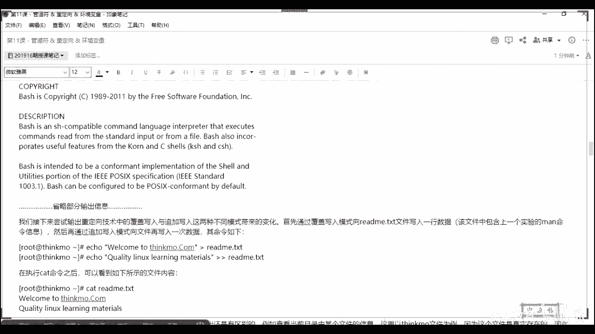
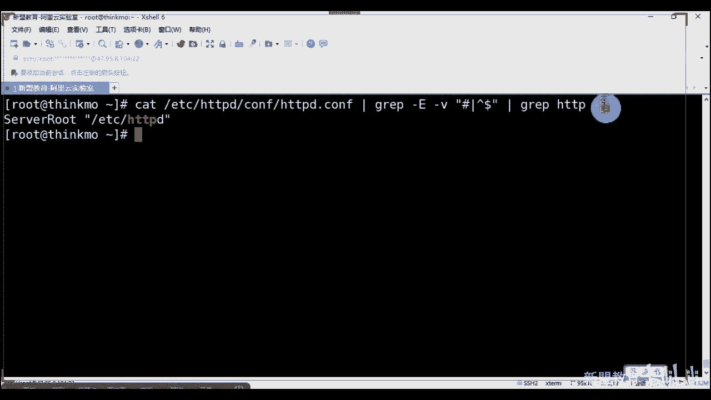
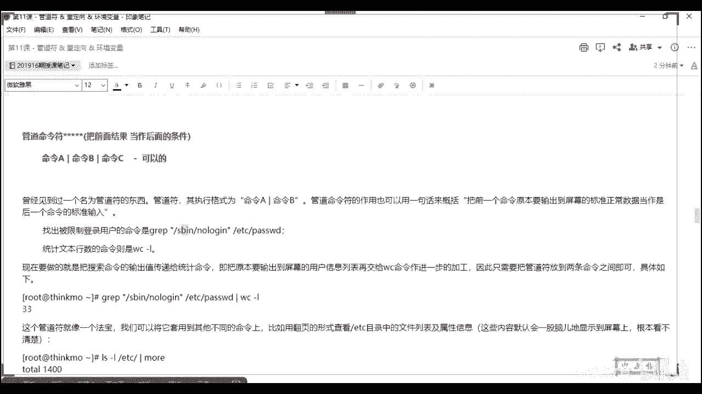
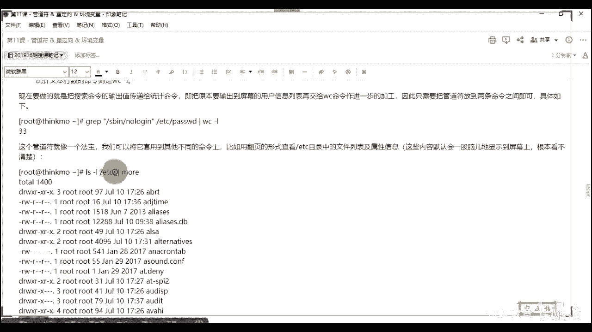
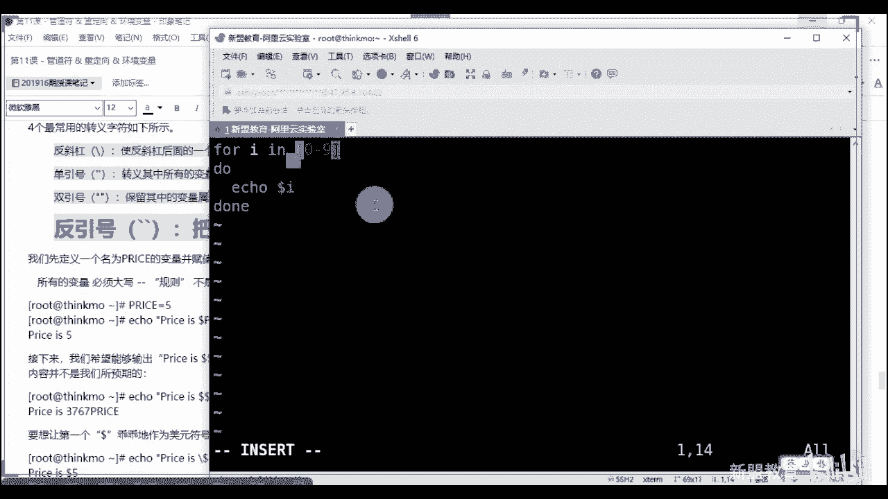
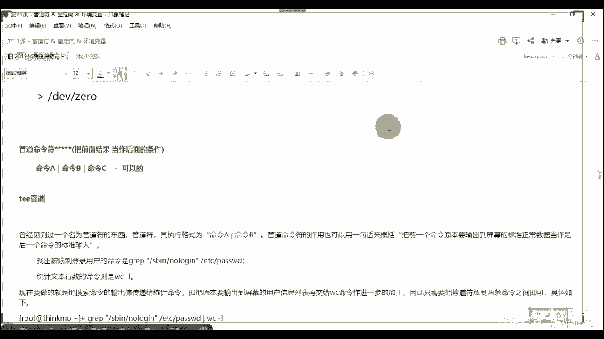

# 2020最新Linux-RHCSA入门实战课 - P12：RHCSA-第11课-管道符 & 重定向 & 环境变量 - 新盟教育 - BV1Fg4y1z7kS

。

把录屏打开把录音打开啊。呃，讲我们的钻石第十一课了啊，倒数第二嗯第一个阶段的第二节课，倒数第二节课啊。嗯关于这个我们讲的内容有三个地方，一个是重定向，一个是管道服，一个是环境变量。啊。

这三个东西呢贯彻到了我们所有的课程当中。哎，后面的话会这样用。网不好吗？重新进一下啊。重新一下。我这边是OK的对吧？我这边网的话是OK的啊。我这个网是O的可能是用mycomp啊。想简单说啊。

就是我们会呃接触到的三个东西，管道服重定向以及环境归亮。这些东西是我们在整个课程里面一定一定一定会用到的。明白了吗？啊，那么呃首先你呃先首先我们先看的是这个重定向啊，重定向。重定向的话。

我们分为了三个叫做输叫做两大类叫做输入输出重定向。而在输出重定向当中的话，有个标准输出和一个错误输出。啥意思啊。啥意思啊？什么叫标准？😡，标准输出就是你正常在我们显示器上显示出来的对吧？哎。

错误的就是输出的一些个错误信息，对不？同志们，那么我们说计算机有五大组成，计算机的五大组成。啊，计算机陶ry啊。计算机五大组成。啊，那么里边会有我们的输入设备和我们的输出设备，对不对？啊。

那么输入设备是什么？是什么呀？指的是我们键盘啊，大多数情况下是我们键盘鼠标或者说我们的这个这个手柄等等等等啊，输出设备很简单，就是我们的显示器，哎对吧？就是显示器，能理白吧？啊，那么问哎对，屏幕啊。

就是我们的显示器，对不对？所以大家明白了。老师我输入的话呢，就是我从我的这个上面进行一个输入。

哎哈那么我这个样答出了，这个就可以叫做其标准输入，对吧？叫做标准输入echo hello是吧？好，那么这个叫做标准输入，这个叫做标准输出啊，叫做标准输出。如果老师我想写这样KK好，发现一个问题。

这个就叫做错误输出，就是报错了嘛，对不对？啊，报错了嘛。啊，那么我们在整个lin当中有三个符号来代替他们啊，来的同学们这个就是我们到了后边为什么会讲老师什么一呀，是吧什么二啊，什么零啊，这个都代表什么。

好，首先来说STD叫做standard inputput，对吧？叫做标准输入啊，我们用一个零来代替它。当了默认情况下，我们都是。省略的啊，默认说法是省略的啊，标准输出哎，叫做默认是一啊，默认是一。

这个默认也是可以省略的。而错误输出大下吧？而错误输出是你必须要写的，叫做二对来。啊叫做二啊，那么很简单，我说了举个例子大案，比如说老师我touch了，我简单显示一下它，那么这个就叫做标准输出。

你后边不用写什么东西。错误说出来，这就叫做报错了。理解啊，这就叫报错了。那作用是什么？哎，老师我要理解1012的目的是什么？很简单，配合上我们重定向的符号。哎，老师什么重定向符号来看这儿。啊。

大于小于啊大于小于okK啊，大于小于。那么前面跟大家说过了啊，我们用一个小于号，这个表示重新的标准对吧？小于号表示标准输入。对吧哎，是将我们后面的内容。啊，赋予我们前面。啊，注于我们的前面，对吧？

刚刚那堂课我们用到一个叫做什么Crowd，大家记得吧？哎，我们用到一个CrowdCOD啊COD。😊，啊，我们把后前后边的文本里面的东西啊，好了，TST啊，比方说test。啊，给他了，啥意思啊？

这个是个文档，对吗？同志们，这个文档原本是有内容的，我把它的内容直接输入到这里面去，叫做标准输入啊，叫做标准输入重定向。就是原本我们是读取你了，我现在把你放到这里面去了。啊。

而标准输出再起来叫做标准输出。好干嘛？啊，标准输出很简单，老师wa写一个ehello。😡，啊，hello什么呢？我们把它赋予到我们的。比方说test点TST里面去。啊，那么原本情况下，我这个输出哎。

当好了，这个叫做输出对吧？叫做标准输出。

而标准输出重定向，我们管它哎原本是输出到我们屏幕的内容。我现在把你写到了我们的文本里面去了。

哎，不是，不相当于复制粘贴啊，是相当于什么？你看我把你的内容直接输到这个文本里面去了。😡，对了吧？啊，我直接把它我不需要创建啊，我也不需要编辑，我直接把内容给它输入进去了。那把这叫做重定向。哎。

类似于导入导出，好吧啊，那么这是正确的错误的来说怎么样？同学们看了，比方说老师KKK这是没有的，对不对？好，我们要告诉他2杠过来test点点C啥意思啊？啥意思啊？好，我这个地方其实是省略一个一的。

对不对？为什么省略一了，因为是标准的嘛啊，但是错误的是一定一定要。😡，写的啊错误的话一定要写的来家看了啊，错误的是一定要写的。哎，报错信息导入进去，所以二是报错，对吧？来看啊，这个是。

这个输入啊输入的很少用啊，输入很少用。啊，是不是很少用，这个就不用我说了。😡，啊，好啦。😊，哎，直到遇到我们分界符才平时，对吧？这个更不用说这个这个很少用啊，这个很少用，大家了解就可以了啊。

反正我们就没用过，我们基本没用过，在生产环境里面啊，用的比较多的是它输出属定向。😊，啊说什么量啊？第一个来说。😊，命令到文件，也就是说将一个标准的输出重定向到一个文件当中。

此时用一个号码表示我要清空原文件当中的数据，哎，也就是一个覆盖，对吧？啊，也就是覆盖这。啊，第二个来说，哎，我用个二表示的是将错误重新定向到我们的文件中，也是覆盖的过程。那师老师，我不想覆盖它。

我想保持我之前的内容怎么办？之前怎么怎么办？用两个啊，接来用两个这个表示追加。😡，而且是在我们最后面。啊，一定是在最后啊，老师我在中间追加什么？不是的，追加追加叫什么？在最后追加明白了吧？啊，对了。

这是错误推荐啊，这是错误推见。哦，那么此时还有一种情况就是我给你一个小脚板，你去运行吧，那你可能运行正确，你可能运行错误，我无法估量你是吧？包括我们很多日志，日志有正常的有错误的，对不对？同志们。

那怎么办？好，我就要用这种方式。😡，然要用这种方式看到没有？是么？将我的标准错误和将我的将我的标准和错误输出同时导入，追加到我们某个文件后面。看到没有？就是二输入过去和一。啊，记住啊。

这个地方不是这么写的，有人说是2and一是吧？然后我们把它追加过去行不行？没有那么写的，这是错的啊这是错的啊。😡，好吧，这是错的啊。哎，我们如果那么写的话，实际上是把它变成这个样子了对来。啊。

请你注意省略二合一可以吧？请你省略二合一。如果你加的话，用上面的方式。啊，进来用上面的方式啊，两种规格啊两种规格啊，那么所以这是对于我们从定向当中的一个标准的模式。大家啦，一可以省略，不写，我说过了。

啊，一可以省着不写，而输出模式的话，而错误的是必须要写的。二是必须要写的对来。好，那么请你注意了，比方说老师我们先在练习一下干嘛呢？将我们这个bu式命令，大家知道bu士命令我前面没有讲。

对不对我前面没有讲啊，为什么？因为我们后边会用到，比方说啊我们后边一定会遇到的是脚本，对吧？😡，对吧我们一定会到脚本。啊，脚本的话我跟大家说过了，其实就是一个外挂。啊，这是一个外挂。

一个具备我们可执行权限的。你看我们的命令其实也可以看到一个脚本啊啊也可以看到一个脚本。那么此时请注意同学们，我去运行脚本的时候，第一种方式我们去进行CMOD是吧？授权。授权怎么办？二是错误。

一是标准二合一明白吗？这是二合一。啊，不不不是不是不是不是不是你没法写来挂啊，就是二合一对吧？哎，将我们命令里面的正确和错误都输入进去，它只是格式写的是这样写，明白吗？拜拜。

将标准输入和错误输出同时写入到我们的文件当中去。啊。啊，第一种方式呢，我去授权。你比方说老师bu是呃，比方说我们的t点SH。对吧好，然后呢老师我可以使用点儿杠。好，这是在当前目录下去执行我的脚本。

这是第一种方式啊第一种方式。哎。对，写在后面啊要写在后面。啊，这是第一种方式。而第二种方式大家记住了，就是我不授权。

我可以直接bush或者使用SH去运行我的test点FH这两种都可以使我的什么脚本去运行。因为很简单嘛，我就是这种方式是因为你里边写了老师井号叹号并bush。我选择的是bus解释器。

而这种我直接是指令bus或者SH解示器。能理解吗？sell应该不用我说了吧，sll啊？bu是它就是指的我们的bu shell。😡，哎，是我们所有的linux版本，甭管乌斑图，甭管地变。

甭管linux这个sals还是红帽，默认我们安装的一个解释器。安装的解示器命令解释器。大家啊，这个是默认的机系，就相当于你在windows里面默认安装了一个文本的TST啊，默认读取的对。好。

大家把这点记下来啊，两个，所以buss啊接下来啊，我们去进行查看它，我们来查看它。老师man bus。

对吧manbu，你会发现所有的都会出buss的作用文件可以用可以用啊可以用可以用啊，没有执行权限的，也是可以用buss直接去执行的，好吧。可以的啊，来看那么我如果直接monbu的话。

我在屏幕上输出了一大堆，对吧？甭管是借势啊，选择还是参数等等的那现在我觉得太满了，我想把它设变成文本。monbu用重定向把你输出到我们的。这里面来。是吧把你输到我们这里面来。好，同学们。

那么此时啊me是count break line是吧？太大了是吧哈？啊，有个东西不用管它好，我们来看TSE点test，大看看到没有？是不是有一大堆啊，啊，他告诉你就太大了啊，没关系，看到没有？

我们这样是不是文当了，文档里面我是不是更可控了。比方说老是less。😊。

还没有我说非常可控啊。来看到吗？同学们非常可控吧啊，那么这种过程我就叫做标准输出，叫做标准输出进来，而叫做标准输出。都写进去了啊都写进去了。那么问题是在于带好了，我现在要干嘛呢？好了，我现在写一个。😊。

Ecle。好，hello。😊，走TST点test。大家告诉我大家告诉我，我这个里面有几行啊，我这个里面有几行告诉我。😡，有几行有几行。大家好。一行对吧？为什么我是覆盖的对不对？同志们我是覆盖了啊。

注意啊，这个叫覆盖。如果我想要他干嘛追加他。看好了，老师，我再写一个hello。😡，那么此时它会变成两行，对吧？啊，此时它就会变成两行了。注意这两行一定是分行去进行的。分行啊，家住了。

追加一定是另起一行，一定是另起一行，好不好啊，一定是另起一行就可以了。好吧，那往下下看啊，这是标准输出标准输出啊，那如老师我错误输出呢？啊，我这么输行吗？看到了，我们能不能输出进去啊，能不能输出进去啊。

能吗？同志们。

看到没有？如果你是一个错误输出，你不跟二的话，你都写都写不进去。😡，明白了吗？大家，因为他会认为你是一条命令，他会你认为你是一条命令，我将你的命令的结果输出到后边去。😡，啊，你比说的是LS。

我这个样子其实也是标准输出啊。LS的结果，我们把它放到了这个文本里面去。对吧。😡，知道明白？哎，对吧。哎，默认里面写的一对吧？你不要说老师一嘛，对吧？对不对？这不就是一嘛？在这儿啊，把它隐藏了啊。

这是好不好？大家可以记下来啊，所以错误的一定要跟上二，错误的一定要跟上2啊。😊。

啊，这个是一个非常简单的东西啊非常简单的东西。那往下面看啊，往下面看，这是重定向啊，重定向。那你比方说这个WC我跟大家介绍WC了啊，这是一个统计命令。啊，统计不领统计什么呢？三个参数。第一个杠A2啊。

我来统计你的文件啊，一共多少行。那一共多少行啊，杠C注意了，杠C啊，你有多少个字符啊，字符对吧？哎，对line对吧？字符叫做CARACARcharact是吧？忘了怎么去了。ACARTOR是吧。

charactter。😊，不道怎么拼了啊，好，杠W表什么表示我的单词数啊，单词数啊，不是啊，记住啊，C是ARAAC对吧？没错啊，ARAAC。😊，哦，刚呃，我想说是那个那个WC不是不是厕所啊，W是单词数。

好吧，那有多少个词数，W单词数和字节数是不一样的啊。你A就这一个字节对吧？哎，好了，来看一下WC叫L老师，我去统计一下test。😊。

什么t始了走几行啊，一共十4行这个文本里面对吧？一共十四行看看是不是啊。😊，好看是不是。往这看十字行吧。啊，十四啊啊，接着说啊，sorry。😊，接着说啊，好，老师，我再来WC杠C看好了。

杠Ctest第二test走一共有186个字符，是不是啊？啊，是不是186个字符嘛，对吧？同学们是不是186个C吗？😡，最后告诉W多少个参多少个。这个一共是14个。24个对了。啊。

记说啊他有的时候只认识单词，不记数字啊，数字他不叫单词啊，对。好，那我现在可以把他们干嘛进行重定下。

啊，我可以把它进重新下。😡，怎么处对箱咋了，我这么去做啊，其实就多此一举了，你们发现了吗？是不是多此一举了。😡，能理解吗？同志们是不是多此一举了。啊，只不过这个方式只不过是干嘛？

我不需要把你的名称列举出来了，我是跟上你的文本名称了，他有14行，这个是我只给你统计数字。能理解吗？这叫做标准输入啊，冲定项，这个很少用。举个例子就完了啊。

啊，这是输入输出啊，这是输入输出。我们到后边经常会用到的啊经常会用到的。第二个来说，哎，你比方说给大家举个例子啊，举个例子啊呃我们所有的日志。里边经常会有个东西叫什么来放呢？经常会有个东西叫做走。

走叫到低B下。😡，Go那。在这。叫低一位下那。啊，第一下呢后边可能会跟上2什么我们的and。😡，杠一什么意思啊，什么意思啊，别整这个啊。😡，就这个完了2括号杠一，这什么意思啊？同志们。😡，是吧。

这个文件请你们记下来啊。按下n文件或n设备啊，叫做n设备。那设备啊。哎，耐受呗啥意思？这个明白是吧？我会将标准的和错误的同时输出到这个net设备当中，这是个黑洞设备是吧？啥意思啊？

它是无限的无限的啊无限的。好，你所有东西输进去，不在不在我们的屏幕上去显示，或者有人这么做也行。这当然这很少有人用啊，叫ZL。😡，这个我也讲过了，对吧？啊，对，相当于抛弃。没错，还有GERO也是可以的。

啊，你比方说你标说来好了。😡，他干嘛呢？嗯，干拉，我让他我让他我让他不停的刷top泡。啊，top吧当好了，top泡是不是不停变化啊，是不是不停变化啊？😡，对不对？好，干嘛呢？哎，sorry啊。

无让你top好了，把你输入到我们的DV下，那一下。什么都不显示手机来说，什么都不显示吧。同志们好，并且再来看再来看我们看看有这个设备吗？😡，有大家看看这个设备，你看它有多大呢？刚到刚H多大。

好像这个这么点吗？是不是就有那么点吗？😡，是是你拿家了吗？很少吧很小吧。😡，没有根本就明白了吧？😡。

它是无穷的啊代表无穷的。好，所以充电项呢啊两个点啊，一个是位置，一个是这个设备。第二个来说是你的管道服啊，注意这个是更重要的一个。啊，更重要的，为什么啊，你永远离不开它？例方说像开始的时候。

我们经常为大家用到一条命题干嘛？我来查询这个里面是不是安装了某个软件，我们用RPM杠QA杠打好了，杠G干嘛，比方说HTPPT。

啥意思啊？你看啊，老师RPM杠QA表示么表示你现在安装了所有的东西，对不对？是不是所有东西啊，所有东西啊啊，干嘛，我把你的结果记住，我是把前面的结果当做我后边的条件拿下来，把这个题了啊，把前面的结果。

😡。

啊，当做我们后面的条件。啥意思啊？啥意思？告诉我。😡，啥意思？哎大，我现在是不是得出来这么多啊，我从这些个里面当做条件去抓取我们的HTPD。😡。

所以我只写这个你。行了，那问题问大家一个问题啊问大家一个问题啊啊。好，请问请问大家，我可以命令A。😡。

杠命令B杠命令C吗？可以吗？可以吗？老哥。😡，可以吗？大稍微挑挑一些东西了，可以吗？可以吗？记住啊，哎，记住啊，这个事儿可以的啊，今天最新闻不在状态是吧？老是打几个错几个是不是啊，给大家是可以的啊。

是可以的啊，为什么可以啊？给大家举一个例子啊，给大家举个例子啊，我想用哪个方式给你们做啊？😊，啊，用这个看同学们看好了，现在让你干什么g抓取啊，这样吧这样吧。

CATETCHVD看好了同们com文件下IP有那么多，看到没有？有那么多有那么多，我现在让你去干啥呢？看明了吗？让你去ggra什么？好，注意啦，g杠E大写的一我们杠V去抓取什么呢？

去抓取除了我们杠V表示反选啊，表示反选。😡。

啊，抓取除了我们的这个叫做行吧，这个叫做解释好控好，叫一脚的支持正则表达式。后面会讲的啊后面会讲的好吧，后面会讲的好，到了，此时我们读取之后没有空行和解释行了，看到没有？前面没有注释行了，也没有空行了。

看到没有？看到没有？也没有空行了吧。😡，哎，正则表达式反选就是取消这不要这两行啊，看效果，一会儿后面会详细讲这两个啊。好，我们接着去找找什么来找HBD。😡，啊，更更挨。知道啥意思吗？

表示老师我在这里面再去找到忽略大小写的HG。😡，看到了吧？哎，有了吧。好玩吧？同学们，甚至你说老师我可以再去找是吧？都可以，所以123456都可以啊，都可以。尤其当你们学完什么来？

学完这个东西叫做AWK。😡，啊，之后哇这个杠这个杠这杠这杠是吧？好几个个是吧？好几个叫做忽略大小写啊，不区分大小写一个low啊一个low。

哎，所以这个是很重要的啊，这个这个这个分管符啊，分管符在哪儿啊？大家知道怎么敲吗？在你的回车键上边，看到有？按住shift摁它就可以了啊，别不知道我们在哪儿啊，好不好？所以看好同志们这种情况了。

比方说老师我要找出我们登录的用户在这里面。😊，正常来说，你可以直接graph，对吧？找到关键词在哪里啊？在这个里面。😡，啊，在这里面找到关键词是它的。那么此时我忘的事情啊。

我还可以CTADC password。

好，进行graph，对吧？我找到老师no logging。来来告诉我no log表示，没告诉我同学们no log表示什么？我们前面讲过了。😡，要什么？表示系统用户对吧？哎，系统用户啊。禁止登录好。

那么此时此时看有很多吧有很多吧。那我现在想知道它有多少个，有多少个一行就是一个用户，对不对？所以我可以把它的结果再给我们的WC杠L一共有23个，看到没有？是不是ABC呀？😊。

对吧？哎，所以一个命令可以用两种方式去表示。😡，看到吧？同学们，哎，所以这是一种，他用了两个，我用了3个啊，我用了3个。😊，啊，所以管道符呢它的作用很明显啊很明显，而且很方便啊很方便啊。

甭管你前面是什么，只要有结果我就可以拿来用给我后面去用当做条件，对吧？包括身上这种老师，我去看里面more对吧？哎，啥意思啊？就啥意思啊？大家都知道老师。😡。

这个EDCLSLL跟EDCEDC那么多那么多啊。😡，我想让他非页儿看老师老师，这个默不是看这个文本文件的吗？我可以非页页看啊是吧？太好了，我这个也能让你去用。😡，当然要表示显示啊显示。比显示对吧？

我当了，我显示那么多，我让你分页怎么分啊，我也能用目，看到没有？是不是分了，看到没有？所以大家明白，老师我还可以用lesss。😡。

我要给你们蓝死。看到没有我还可以用lesss对吧？我还可以用是吧？哎，等等held是吧？老师可是AD。😊，5个tail默认10个啊，10个尾巴上。😡，老林有了吗。啊，所以这些呢都是很能去组合的啊。

而且这里面告诉大家了，也就是说我 more hard chill这些东西我都可以看什么看目录，不仅仅是看内容。😡，看进来啊，包括这条命令，大家是不是很熟悉啊，这条命令是不是很熟悉啊？

这家位的是不是很熟悉啊，看到没有？哎，对。

啊，LL就是完全等量LS杠L啊，缩写啊缩写这条命令是不是很熟悉啊？

大家现在明白了吧？哎，充值密码了对不对？作业里面的啊啥意思啊？老师，我把输出的这个东西给我后边给我后边，对吗？同志们老师给后边是什么意思啊？看好了，如果我单纯写这条命令啊。

老师password杠杠STDNN就你不用写它，对不对？root。😡。

看吧，改吧，123。看同学们是不是改了哦，加上STDIN的目的是什么？是它显示知道吗？上能显示出来。如果要说我不加呢。😡。

啥都不显示对吧？而且刷了两遍。看到没有看到没有？哎，这个就是好玩的地方啊。理解了吧？这就好玩的地方。所以我现在我既然要输入你，我还得输入你，那我就干脆在前面给你输出出来echo single。😡，好。

干嘛给他。😊，当然了？正常来说我是显示出来，我把显示的东西给到我们在哪里啊？password对吧？杠杠STDNN好root是不是刚刚你把这个东西放到前面去了，成功了吧？😡，很多西就通了吧。

很多东西啊很多西就通了啊起来。😡。

然后们比就说。啊，教授。啊，所以这东西就不多说了啊，再往下还有邮件啊，还有邮件。到了邮件的话呢，我没有讲在这个地方。因为我们其实现在不怎么用这个东西了，哎，标准输入对啊，是标准输入啊，对不对？

而今天N我标准输入在我的屏幕上，那现在的话，我怎么样，我拿他的呀？😡。

标准输入标准输入怎么办？怎么办？我口误还是你没听，还是还5说不是这不是标准输入嘛？让你说这输嘛？这不是你输的吧，对吧？这不是输入吗？标准输入啊。😡。

好，这着看啊这着看。😊，那么还有一个就是我们的mailile，这个mail我没有讲啊，为什么没有讲？因为现在大家了，现在大多数情况下，你们没有说没有自己搭建的，没有自己部署的邮箱了。😡，都是集成性的。

知道吧？都是集成性的软件啊，你像国企里面我直接买这套包，比方像类似于office那种啊，大型公司里面呢，我直接自己弄那种那种我样么去安装的啊，比这个方便多了。当然我自带的对不吧？😡，6六粉自带。

叫什么叫做sm。😡，啊，这个三层料。

存这种形式的啊，看老师了没有。😡，啊，看到没有？for rootno mail for root啊，用来去查询的，看到没有？

那么如果我要去写的话，好，同学们S表什么？记住啊S表示s subjectubject。😡，表示我们的主题哎，主题啊啊主题。single mode呢给谁明白了吧？给谁啊，知道了，所以m。😡。

杠S。😡，他不见他。啊，给我们的scama用户，我把sma先创建出来。😡，有事爱了。听到不？创建一下啊来。😊，没有。找S对吧？SUBGECCD。差不太多啊差不太多，这样都是邮件都是邮件啊。

当然你除了mail有以外，还post fix等等等等都一样，其实都一样，明白吧？都一样啊，给谁要给sing more。😡，知了，此时你得写东西了啊，这边你就得写东西了是吧？写东西了，点儿结束。

记住邮件里面的话，一点结束明白了吗？同学们一点结束啊，为什么这块我告诉你错误了，很简单，我告诉你们啊，我为什么不愿意给你们写邮件，很我说邮件特别难写，你得写from。😡。

谁是谁 true谁谁谁谁谁，全是机写啊，所以我们这边的话直接用这个了ecle。😡，啊，CNT。CON是吧？DNTcon的直接把它的结果给谁啊，给我们的mail来看啊。SUB。

GECT。第我们のスも。过去了，好了，稍等过去了。😊，好，as you go，新。😊，跳过来。看一下。大看啊看一下好像目前来说没有过来，对吧？为什么啊，因为你这个地方的话错误的，格式是错误的啊。

格式错误的。😡，啊，no local interface for all不是格式错误的啊，不是格不错误的。这个地方告诉你什么。😡，什么意思？告诉我，这是指什么？😡，指你的。路由。

缺失是不是没有他通过local interfaceface能够找到，就是用了IPV6的这是用了IPV6的啊。这地方为I6的啊，好吧？这个地方我先把它空过来吧，我忘了给你们把它取消掉了啊。

因为这个涉及到了我们的邮件的服务。啊，邮件服务。如果大家后面想学的话，我们可以加一个叫做post fix，加上dop啊，de devil。进来加着它叫做post fix，加上demo pose起来啊。

我把这写下。哎，sorry。可以。对啊。这个还是比较好玩的啊，这还是比较玩的QQ邮箱一会儿再说啊，QQ邮箱一会儿再说，好吧，咱们啊一会儿再。😊，呃，Q微商不用配啊。啊。

现在自己搭邮箱也有时候也很有必要呃，看情况啊，但一般来说，你看啊同学们像中小公司，我们直接是买的是这种企业邮箱啊，阿里啦或者说是163了等等等等。一般什么地方是自己能搭建的，告诉你们啊，一般国企里面。

但是国企里面搭的话。

呃，我说句实在话，你看在都是用集成性的。你比方说老师什么叫集成性？啊，不了啊。好，你直接亚马 store杠Y叫做post fix好，加上DVDVCOT的把这两个一装啊，对，包括一chan啊。

开是window里面的啊，包括把这两个一装简单结束，明白了吗？啊，简单结束。

对吧邮箱的先不说啊油先不说。所以我们测试下来我们就明白了啊，这个我这个我没有配路由，我们先把它过去啊，先把它过去回来我们再说。😊，啊，那么我们说看啊，那么我们说呃如果我现在老师我就是想用这种方式的了。

这叫做结束符。这叫做输入重，这叫输入重令下。结束不啊。哎，不着急别着急不着急啊，来看啥意思啊，我现在要给你发一个叫做read me发送给谁啊？发送给我们的root think at c点comM。😡。

没有邮件服务啊。好，那么我在输入这些东西的时候，我只要输入到了over，那么就表示结束退出。O吗？同志们啊，看一下mail杠S，我们这么写一下啊，S我们写一个。😊。

请给我。啊，是给一个木圈。艾特QQ点comM我这么简单写的简单写的好，杠到了，叫个EOF这个后边其实你能自己去定义啊，结束符你自己去定义，明白了吗？不要说hello。😊，啊，fin啊。

thank you是吧？然后and you是不是好，就到了EOF。结束了，明白了吧？来一刷一来临即刷一。嗯。嗯，小学英语明白了吧啊。

哎，这个后边你自己随意定义啊，随意定义啊，好吧，同学们哎，这个不不是特别难的。到了后面的话，等我们剪了越来越多啊，就是它只是一个小工具，熟熟练使用就可以了。

啊，实在说ABC也行啊，你比方说我你写一下啊，老师给你写一下啊，算了。😊，好错了。走。啊，hel喽。AABC看到没有？你搁谁都行啊，你搁谁都行，就自定义的。没错啊，自定义的。

好，所以这个地方的话，大家可以去看啊，可以去看好吧，那么。😊，然后再说一个叫做通配符，大家知道注意啊，这个地方我讲的叫做通配符。后边的话我们还要讲什么？叫原字符。是样哎，对。

直接回收直接回收这两个这两个。很多相似，但是。很多相似，但是有的还是有区别的。啊，原来还是有区别的。啥意思？先讲通背符原字符，下节课我们说啊，再下一节课再说。😡，啊，那么大家都没老师。

我现在想要去匹配我们的一些个文件。你比方说老师，我想匹配的是。

啊，在我的D一位下SD。但是你说老师我一回车一大堆是吧，一大堆啊，你什么一D一大堆。那我不知道，如果有100个，我想从这100里面挑选一下。老师，我想挑选ABC。😡，怎么做怎么做？百叔啊。

你可以使用中括号ABC。啊，中括号不是大括号了，不是大括号了，这里门要用中括号明白了吧？啊，或者A杠C，这两个是一样的。

大军啊，两个起来。常见的常见的。第一个来说星号表什么信号表什么？😡，叫有什么？

看一下信号表是吧？老师看好了，我们给一个啊，比方说touch filetouch file。1点点10，我创建10个文件，好吧，老师我显示fileFILE。行。注意啦注意了，后选是什么呀？同志们。😡。

然我再 touchuch一个fill给你们看，这样看就简单简单了啊。多个人意是吧？来看多个人意吗？记住啊，不是所有啊不是所有表示记住了，在这个情况下是表示我匹配匹配什么呢？匹配我所在位置。😡，任意长度。

任意字符。为什么要任意常坐？😡，为什么要这一场做？记住零个也算。看到这样了吗？看到这儿了吗？我是不是匹配这个位置，但这个不不一样了。😡，知同志们。收到了吗？来啊。来好，这个记住是通配符的，这个是通配符。

老师，你为什么老告诉我是通配符？记住了，如果是原字符。😡，打若是原字符星表示么？是我匹配它前面的。😡，记住它前面这个字符的任意程度。对吧，任意长度。啥意思啊？啊，差不多3。3点多吧，那多。好，同志们。

如果我写个fill，行，记住这个同步过来的意思叫做叫什么叫做fill啊，叫FLEFLfillfill。对有。fill看到没有？这叫原字符，能理解吗？后边我们会讲到在正则表达式。😡，啊，正则表达式。

所以你要看一下同志们，我们正则表达式里面用到的叫做原字符，这个叫做什么叫做通配符。😡，解了啊，那么除了他以外，还有个呢叫做加号。😡，啊，这加号知道了？加号指什么？好了？

表示啊这个表示我们啊这个加号是在原字符里面讲了，不在这不讲啊，在这不讲好，接来你可以看看，表示星号表示匹配多个零个啊，问号表示单个。😊，就是你这肯定得有一个明或者没有。啊，中括号0到9。代表0至9。好。

问大家一个问题啊。如果哎给我写出来这个的所有答案。来，你们给我写这个的所有答案吧。😡，快给我写个所有答案吧。啥意思？舍不打啊。人知吗？什么意思啊？哎，记住啊A货B或C记住啊A或B或C包括他同学们。

如果我是APE，你们就明白了，我是AP或者E，对吧？AT或不不是连着的不连着的。大家记住，我就是连这个记住ABC和。😡，ABC。和A杠C。知道吧。这两个其实有区别的。这两个其实是有区别的对吧？

你能明白啊，你要有区别的。看这个指的是A。到比A到C这这个是A到C。啊，这个是A或者B。或者飞。啊，或这两个是有区别的啊，兄弟们去改想一下自己转一下脑子啊，转一下啊。😡，啊，是有区别的，好吧，嗯。

你别说这俩一样，这俩不一样，我告诉你们啊，上边是做单个匹配的，下边虽然也是单个配，但是它的氛围是连续的。😡，啊，进来，所以我们在这一步可以用星号去表示啊，是我匹配的是星012260120位或多位。

甚至如果老说我后面有120，它也能匹配上来，对吧？啊，问号只匹配一位，所以那好了，问号必须有一位。所以他是没有这个空格的。你比方说。

啊，还有fi吗？还有十吗？是不是fi和十都没了，告诉我看到没有？😡，看吗fill1头都没了，是不是这两个都没了。😡，来哎大家啦。😊，如果说我匹配0到9。😡，啊，我请问大家一个问题，我能匹配出来10吗？

😡，我能匹配到10吗？😡，能吗？大家做有1领吗？😡，有吗？有吗？

卡卡卡。是，记住了，没有。老师我想要怎么办？😡，能理解了吧？哎，再加一个同学们？所以记住这都是单个的这都是单个的。😡，啊都是单个的，明白了吧？好，拜拜。对吧好，问大家一个问题，如果要说我只时这么匹配。

😡，好。好了。A杠Z都是小写的。我问大家一个问题，我能匹配出来吗？能的刷一不能刷二能吗？😡，老吗？老吗。不能啊。记住啊，我只匹配一次，没有多次啊，我只匹配一次，明白了吧？😡，哎，博士只这一次啊，好不好？

简单啊，可是我想让他多次怎么办？你可以写或者他同什么跟个加号啊。😡，是吧你跟个加号其实也是可以的，但是不要在这个情况下跟啊，这个情况下不能跟啊，好吧？这跟这个加号其实也是OK的，其实也是OK的。

但是这一块不要那么写，回来教你们怎么做啊，回来教你怎么做。哎，老师跟个问号行不行？可以，同学们写了啊。😡，进来啊加号知道加号为什么不行吗？😡，啊，加上是原字符对。啊，加是原子符，有没有写项？加我要什么？

😡，知道了，就是你前一位前一位复制。😡，一个。到多个。啥意思啊？看了，它和这个星最大的一个问题在于，老师，如果我是FLE加，那我的结果是什么？😡，我的结果是MLEMLEMLLEE。能理解了吗？啥意思啊？

就是他是有零个，他是有一个，但是我只是重复前边。而固定的不是随机的咋了？我这个位置表示什么意思啊？哎是老师，如果我匹配上了A，我就是两个A，3个A4个A。如果说我匹配上了B，就是一个B，两个B，3个B。

我是不是把你整个的去重复，明白了吗？😡，来，懂我们说同意能懂吗？同志们，而你如果说说我跟的是问号，问号是任意的字符，任意一个字符。😡，我不需要冲自己前面。所以就可以了。起来啊，所以就可以了。好吧。

另方说这个我给给大家写下来，好吧，FLE。😊，问号啥意思啊？这个的结果是FLE。A是吧LLEBFLEC就这么一个字符，老是FLE5，这些都可以啊，看看这俩区别啊，这三个的区别这个列出来。这个东西难吗？

不难，就是逻辑性有点强，而且给大家硬背一下就可以了。对。😡，对，通背符分原字符大好了，正常来说用在正则表达式里面。正则我还没有讲呢啊，一会讲到正则，你们就明白了，好吧，讲到正则里面呢，对吧。😡。

你看如果说我创1个MLE也看了，同学们。😡，toture啊fi好了，我说你AA。那我说你别别创点A了AAE。是吧我们再去匹配。啊，AA没出来是吧？AAE星。来，稍等啊，这地方就是不支持啊。

这地方就是不支持。😡，啊，因为原字符我说的是在正则里面，对吧？这个还没有正则呢啊，这个还没有正则呢，明白吧？这个没有正则。😡，啊，能听明白？原字符不在这儿用，你们在这儿用就是一个问号。😡，啊。

问号这个不是正则对来？这叫通背符，好吧？所以加号在这种情况下是没有办法用的。😡，起来啊。😊，这个是在。这是原字符，这是在我们的正则里用。什么叫正则？给你们看一下，同志们呃，算了，不给你们看了，后面来说。

后面来说正则记一句话就是描述。描述文本的描述文本的字符。啊。对啊，不是正则，外边也能用，外边也能用，只不过这个命令不支持正则。有的命令支持政策，有的命令不支持，大家得清楚啊。😡，好不好？哎。

不是所有的命令都支持。😡。

郑多。明白吧？你像我刚刚前面还打了一条命令，打了什么呀？😡，打什么呀？G。走少。看到没有？同任还在这条命令吗？看到没有？看到没有？😡，啊，对，不是所有麦克不能说啊我这个如果我不加E。😡，差多了吗？

那你发过来。啊，现在是我加上杠一了，看同志们所有的都被过滤出去了。但如果我不加这个一呢。😡，就不支持正则了，看见没有？啥都没过滤出去，啥都没过滤出去。我只是认为你就是一串字符。😡，明白了吧。

而且你还算不上通倍数。😡，列了吗？啊，对吧叫正则啊。

对，好了，然后我们就说。😊，来，对E罐呢一会儿来说会讲到分没。所以这个请你们大家把它记下来好吧，拿下来回去练一练，练一练。第3个接来往下们啊，别晕别晕啊，记累一个记这两个。😊，就这两个。就可以了。

记这三个就行了。好吧，其他的原字符我这块多嘴了，我就不该跟你们说啊，这个我把它删掉。😡，啊，我这不跟你们说啊，好，往下走往下走。😊，哎，新代表所有没错啊，往这看啊，那么呃看常用的转移字符。

这个前面我们用过了啊，四个有很多，我总结出来4个。第一个。大一杠。朋子们反斜要指什么？我让你变成一个单纯的字符串儿。啊，我让你变成个单纯的独创。一会儿不着急，我们会讲到给大家。第二个，你比方说。

当了，echo dollar是。好，这个叫做环境变量，我是不是直接输出来就是这个东西啊？😡，这不能看懂的刷音。😡，这是变量输出变量值。听不懂白？但现在我就想让你输出这个字符。

我就想让你输出do shell怎么办怎么办？前面加个杠。😡，白吧？就是我让你这个doller不再具备特殊含义。😡，那你就是他了，那你就就是当乐了吧，对吧？😡，啊，这来叫做转移啊，变成普通的单数字符。

好，第二个后边这三个号引号你可给我记住了。第一个引号叫个单引号转移其中所有的变量作为我的字符串，啥意思？大家看。

第个。你好以号dollar是。看到了吗？啥意思？我原先是具备特殊含义的啊，其实隐藏上来个了？隐藏上我们是做的这个情况。这个？其实我们默认什的是双引号，那双引号你就是变量。

你就直接说用单引号就是把你转换成普通字符，你不再具备任何特殊含义，跟它的这种类似，明白吧？跟它这种类似。但是你不能总是一个敲一个吧，这同志吧？😡，接来。啊，而这个引号就好玩了，这个引号怎么敲啊，知道吗？

😡，这怎么敲吧？知道怎么敲吗？在哪啊？

在哪儿啊？😊，在那TAB上啊，TAB键上面。上面明白吧？哎，ES下。😡，啊，我们滚断叫做反引号，为什么请大家一对把记下来？😡，你不得不记啊，好吧？这个在我们后边学习写脚本的时候，你常用啊，点点是吧？

你那中文字符不行啊，英文字符串输入啊，英文字母下输入啊，你得英文字母下输入哎，英文字母下啊，来输一遍，英文字符下输入给我输入一遍，快点来。😊，跟我说一遍哎，OK了啊。好，就着说。😊，比如说啊。

它的作用很简单，看了是吧？很简单是干嘛呢？是让我们的执行结果直接显示出来。你比比方说。😡。

咋了ele啊啊2S。LS好，我们显示一下CT到了。CT呃，我们别CATT了，这样吧，看看看看。😊，2。

想想怎么写啊，往上面吧有个例子有个例子啊，有个例子先看吧，一个例子，一个例子看。第一个来说，老师我 price等于5是吧？老师现在好了，PRSE注意了。😊，这个地方隐藏一个问题啊。

就是我们所有的变量大家对意了，所有的变量必须大写。啊，所有的变量必须大型。😡，这个必须是规则。啊，不是系统的要求。而是我们人为的规则。明白了吗？就是你去你的公司里面写的任何一个脚本里面都是变量。

都是纯大写。都是纯大写，明白了？同学们。啊，不要写小写的啊不要写小写的。好，就是说。

哎，来吧。😊，来看priice等于5，注意了。前后不要有空格，很多同学老师我习惯性的是吧？这么写，脚本里边这么写，保证是错的，你就这么写都是错的，明白了吗？因为linux里面但凡是有空格。

我就认为你是一条命令。😡，参数对象，所以不要有空格啊，老师ele dollarar price。5万。哎，衣服里头有啊衣服里有啊。呃，if里面是这个例if里面不是那个是做那个是那什么呢？

一会来说if服里面啊。好，接下来。😊，pri，但是如果老师我想告诉你这个东西价值价值5 dollar。😡，老师dollar dollar priceE是吧，是这样子吧？同志们。😡，这样可以吗？

告诉我可以吗？😡，可以吧？😊，可以吗？可以吧？为什么不可以啊为什么不可以啊？假出一个问题啊，那我我怎么办我怎么办？我大行记住啊，在这个里面dollar dollar是有特殊含义的。😡。

知道dollar dollar是有特殊含义的。😡，往这看，我你写出来了，dollar dollar表什么表示当前进程ID号码。😡，啊，当前进场ID好吧。😡，所以你会看到一串数你知道吗？😡。

那我咋办那我咋办？😡，你看没看到一串数，当前竞争号加上PPRSE，这不是我想要的是吧？我想要的什么？同志们，我想要的是。😡，这个。没有病吧，不用分开转移嘛，转移就好了嘛，或者干拉托瑞。😡，或者啊这么干。

大哥他不要活这么干。😡，按，对号或者转义字符就可以了。理解了吗？那理说一。OK啊。😊，好，这着说。呃，这个二猝不及防可以的可以的啊，可学们？啊，那进了哎。好，我们就说啊，那么后边的话那么后边的话。😊。

看 dollarer dollar对吧？一个你用单眼号也行，看反引号的好了。反页号正常来说，我为什么要这么多啊，URL。😡。

好了，如果老师我URLU name杠A什么意思啊？我会输出那么多，对吧？同志们我会输出那么多。啊，我输出那么多之后啊，但是我想干嘛呀？我想用apple是吧？用ele啥意思啊？U name杠A。

W对样youtu刚A看一下啊，其实结果虽然是一样，但是表什么。😡，我是不是把这个东西变成一个结果了呀？是不是我是把这个东西直接给他复制过来了。😡，但是老师如果我换成别的字符呢。

你把方说老师我换成单引号是吧？我换成单引号，我换成双引号。😡，双引号双引号表啥？所以说也是这样的，是吧同志们啥意思啊？哎，我把它当做字符串了嘛，哎，单纯输出了，对不对？哎，单纯apple输出。

但是我现在想找你干嘛，想让的要的你的是结果。😡，我想把你的结果输出出来。😡，没有了。😊，就是这个这个啊对了。这个我们到了，后面还会常用。😡，还常用那方说看好了，我们会在一个里面上了呃，我们写一个for。

😊，ちャた。来。挂那么多吗？我写那么多吗。小当。对了啊，删掉是吧？😊，删掉好了，我们随便写一个随便写一个呃，随便写一个写什么呢？😊，写什么呢？写一个。啊，看同师们这样负ID。😊，接了S引Q。

啥意思知道吧？啥意思啊，好了do的。好，ele dollar哎注意啊，哎，别着急，我是干嘛？我是让E在这个结果里面去循环，这个结果是啥呀啊，不用写不用写，这个结果是什么呀？同志们记住啊。

这个结果等价于1到10。啊，接来SEQ就等价于1到10。你看SEQ。能看到吧？来了还有刷音看到没有？要序列没错，对吧？所以我在这边bus test testH的时候，就是1到10。对了吧。啊。

就是1到10，为啥我是让你的这个I这个I做成了在这里面做个循环，从1到10的循环。我每次都输出你，每次都输出，你，直到输出结束，看到没有？啊，所以这就是单页号一个使用方式啊。进来。啊，代好使用方式。

序列啊SNQ。

好吧，呃，这个可能大家说老师我一时半会儿理解不了，没事儿，背，这就是背下来的啊，这就是背下来的，或者是不听式。

可以用0到9吗？不能用0到9啊，不能用0到9，有的地方支持，有的地方不支持这个地方有三种模式，第一种用它。第二种好了，一空格234567890，明白了吗？一个一个说，这是第二种。第三种。这种明解了吗？

这是第三种，哎，没错。只支持这三种。老师，我用这个行不行？没有明白了吗？这里边我们不支持这个，因为这个有特殊的含义啊这个有特殊的含义。

下来。好。朋友们看啊，这是我们的通配服，以及我们的pepa通管服务。下一个是我们的环境变量啊，环境变量的话呢哎大家来看啊，来看。刚我说了。那什么叫做变量啊？告诉我什么叫变量，什么叫变量？告诉我。😡。

孙晓不亮。还告吗具备特殊数值的。六是吧，名称。啊，单词能够同友们理解啊，单词。那么这里边记住了，我们经常用的叫做变量叫做变量和变量值，把它组成叫做K。valueue这是一个意思啊，VALUE。好。

KY6大家知道吗？😡，前面叫做键，后面叫做值。啊，前面要到键，后边有到直。好，那么也就是对应上其变量名和其变量值。接来A等于10，接来A等于10A就是变量名，十就是变量值。大家能懂吗？

我们引入变量的目的。是干嘛的？朋友告诉我。野肉变量的目的是什么？知要吧？哎，这个建筑队是吧？引入辩论的目的是什么？😡，是吧。记住啊。别于玻璃。

no是便于管理。是碧于国力，什么意思？好，同学们，我们这儿写一个啊。啊，他这事。啊，谁一个好，哎，看了，我写了哎。😊，app不学。是吧。😊，I am目学好，好了，I am。那么。ten years是吧。

turn years。IYEARturs好，那个I was born是吧？我这个都小学英什了，亲y。好。问大家一个问题，我现在出现两个十是吧？两个十对吗？好，如果告怎我改了呢？我又找到11岁了。

老师我又得改11是吧？老师我又得改11是吧？如果100个呢，我得改100字，对吗？😡，不是6点104，那怎么办？咋办很简单吧，看了，我只要在上面给它写上一个，写什么age。😡，等于10。底下的时候记住。

在脚本里面引用变量要用doler开始，而且告诉大家一定要用大括号形成习惯。😡，老师为什么用打括号？😡，啊，为什么大花？对啦对吧。哎，对，没错，没有多转行了，这个你看我是不是后边我只要改这个地方就可以了。

十5给我改了，20都改了。😡，没掉了吗？来就刷一来一刷一。啊，第二个问题就是我为什么要加大括号？我为什么要加大号打号了啊？原因在于，如果老师我看了，我不加大号H1H点儿是吧？称。再告诉我。😡，这个。😡。

是不是变成一个新的变量名了呀？😡，老铁妈是不变成个新的变证名了？😡，能理解吗？这里边的新的原来了，我为了是干嘛？我是当市场呢单独识别它。😡，它颜色都变了，明白了吧？啊。

对用大括号的目的就是这个防止我们的变量名会被改掉啊，这当然不是你故意的，有时候你没注意就变了。所以养成好习惯啊，养成好习惯啊，dollar大括号。

我只能说是习惯啊，好吧，我只能说是习惯。😡，这两名。啊，所以我们来看啊，当这些个我们管你叫做自定义变的量。😡，啊，有自定义变量就会有系统环境变量。啥意思啊？😡，你自己写的对吧？这个系统自带的。好。

问答一个问题，系统自带的我怎么看啊，怎么查，有哪些啊？😡，有哪些啊是吧，有哪些啊？怎么查？一个命令啊，进来叫做叫做ENV啊，不是啊这个ENV哎，这ENVpa是不是什么？是命令路径，对吧？

对吧ENV叫什么？叫做environment。😡，环境嘛是吧环境嘛来看一看啊，DNV走这么多，大家可以看到吗？听到吗？朋没有？我们呢。😊，session我们的ho name对吧？我们的team。

我们的hell默认，看到没有？是不是刚刚do shell输入它了，对吧？history size默认1000行啊，同志们我要看userroot默认的userroot，现在在这呢对不对？你要改了呢。

SE杠sca走改了ENB。😊，来看是不是你的user变成thinkbo了。看到没有？看没。啊，对，很多吧都是你们比较熟悉的。你比方说language是不是PWD现在所在的位置，PWE对吧？

pass这是所有命令的路径。理解了吧？啊，用ENV去产生。你如果说我想自己去写行不行？可以怎么加，一会儿说啊怎么加，一会儿说。😡，啊，所以在这个地方当好了。

我们要了解的什么是了解一下我整个命令在运行过程当中，你到底怎么运行的。对了，老师，我为什么可以读取到你的变量啊？😡，在这拿，比如说用户在执行一条命令后，我到底发生了啥？😡，别懵好吧？第一个按步骤说。

第一步好，我们要判断用户是否以绝对路径券或相对路径的方式去执行。为啥呀？同志们，因为你是绝对路径，我只找得了你，我就进行执行。如果是相对路径的话，我就需要去我的所谓的这个pas里面去找你。😡。

对吧我得去pass你知道。啊，大家看。😊，哎，如果我们是绝对路径，并且相对路径，当了，我能找得到你的话啊，到你的话我可以直接咨询你。啊这等你。而如果说你这个命令是一个别名的是吧？是个别名的。好了。

是不是别名的。好，也就是说我们用了另外一个自定义的命令，对不对？同友们？那么此时各位答家好了啊，此时我们在这儿呢。再哪两分了好。走啦。我们进来是要把它取消掉。啊，有的命令是要取消掉的啊。

那同们re6会检测我们是否为别人命命令，就是用一个自定义的命令来代替我原本的名称。我可以用alas这个命令我讲过了啊，所以我把这块删掉了。😊，删除我也删掉了。😡，好。

那么我们之前你比如说我说我去RM的命令删除文件时，我们linux系统会要求我们再次确认，明白了没有白？如果你不做别名的话啊，那么其实这个就是防止我们误操的一个一个一个一个作用啊。

那我把它取消掉之后搞了取消掉。那么此时我一删除你啊，好了，同学们，我会进行再次判断啊，我会进行再次判断。好，大是解释器会判断你是内部命令还是外部命令。好，问答一个问题，我怎么检测？怎么检测？什么叫释？

9点哥。怎么连呢？啊，whichch啊，which用tab检测了，位置是查看路径的，对不对？啊，会查他录径的I type对吧？啊，为什为什不查路径的嘛？啊，你们一说的话，我都不敢讲了啊，是我教的你们吗？

啊，过分了啊，是吧？用t去查命令类型嘛，是内部还是外部嘛，内部的命令长什么样子啊？😡。

上了TYPEPWD。是吧哎这个叫做building对不对？building几了叫做内部命令啊，那么老师TYPE。哦，CD这个叫做内部命令，对吧？就是找一个外部的L啊，这是这是别名了是吧？啊。

找一个找1个MV。啊，这也是别名了，找一个呃systemCTL。就这当这叫外部泌秒啊，这叫外部密了，好吧。啊，不是不是说SB就是内部的，SB是是root可用的。刘凯SB是root可用的。

不是证明你就是内部的啊，明白吗？😡，不是说SB里面就是内部的，好不？😡，记来啊，所以这个就是外部命令，它虽然是二进制的，哎，这也用type啊，好吧，同志们别混了啊啊，那么我会判断你如果是内部命令执行。

我就直接执行了。朋没友看，而大多数都是外部命令。

哎，外部命令，那么这些命令要交由我们的第四步去执行。第四步是什么？来看。

啊，我们系统在多个路径当中去查找用户输入的命令文件，而定义这些路径的变量叫做pass。我们可以把它看作解释器的小助手啊，作用是告诉bus解释器待执行的命令我可能在哪里。对吧我可能在哪里？

然后buss会去这些地方逐个查找，大家注意啊，我是挨个按照你这个pas里面去找，我先找他，没有找他再找他再找他，直到都找过之后，真没有，那就对不起真没有了，明白了吗？啊拉起来是这么个意思啊啊。

是那么个意思，对来。是。而如果说的好了，老师，我想为我的pass重新定义，一定要跟上dollar pass，啥意思啊？如果你这么定义，老师，我给个A回车完蛋，知道吧？同志们，你把它覆盖了。😡。

一定要跟着这个东西，理解了吗？一定要跟上这个东西OPD。啊，再来个。Do了。会吧才会加上奥比利。注意啊这一步特别重要啊，pas等于do pass再跟冒号。好，再来。好吧，这样一个问题啊。

来问答家一个问题问答家一个问题啊，为什么我们不能将当前的点儿添加到我们当中去啊，告诉我。😡，为什么能在当前的2000家计算？啊，为什么想想啊，琢磨一下啊，我后面就给你们搭了，对吧？😊，哎。

人家是尽管说当前目录小点儿啊，就冒号啊，那是冒号啊，没错，就是冒号啊，懂吗？这是冒号啊。啊，那么原来是当前目录点儿大了，如果我们添加到这个里面去。

那么我们某些情况下会可以让我的用户免去输入命令所在的路径。啥意思？好了，我只要在你这个路径下，比如说是。啊，比如说运动一板。不到了，我直接可以confi，没问题吧。😡，正常来说，这个confi。😡，好。

我可以直接执行他，我会直接执行他这个不用说，这个因为是源码编也是必用点杠的啊，用绝对录径都不行。后面再说啊。好，所以我如果说在我本地下直接去执行你，其实对我来说其实不太什么呀，告诉我是不是不太安全啊。

😡，对吧我也不太好记录你能理解吗？同志们。😡，了解吗？比方说王老师，我把我们的一个东西放到了这个里面去了，放这里面去了。L刚好同学们看了，我进到了TMP里面去。😡，好，我在这里面的touch了IS。😡。

好，老师touch了CD。你告说我把这两个授权。😡，啊，这两授权霍老师，我直接执行80S。知道了，执行了吗？告诉我是不是执行了，你们告诉我是不是执行了。😡，这么执行么？😡，大家我是不是执行了？

小家知持了吧。那如果说老师哇我这个LS里面XRM是吧？RM跟RF。😡，あしよが。啊，过去了啊，2S老师，我8是LS哇，回车一下，哇，完蛋了是吧？完蛋了，你是没有读取啊，这是你本地的执行的。😡。

很危险的吧。所以当前目录我们不会加进去啊，进来当前目录会加进去好不好？哎，就是说那么10个来看10个我我挑选出来的啊，这个来说home本机主机名啊，sell当前使用的我们的sell的版本默认是bush。

他不是吧是，所以大家告诉我，乐老说，我想知道我有多少个sll版本呢？😡，我有多少我想知道我多少个少版本，我怎么查啊？😡，CT加BDC加slls啊，这几个版本都是我能用的。当然这两个就是我默认安装的啊。

我说了这两个就是我们的什么呀？是我们什么呀？哎，是它的一个是它一个一个一个链接啊，符号链接对来。啊，我其实也都可以把它变成SHSH和大使是基本上类似的啊，类似于我们的VI和VIM关系。

好吧。往下啊语言read它这个也好用啊，这个是叫做随机生成。

DollarRANDM。对吧？随生成数字非生成字随生成数字随生成数字。所以我们经常有个东西叫做猜数字的游戏啊，有个猜数字。

这个数字不是你定的，是它自动生成的，明白了吧？自己陪自己玩啊，再来。进来。PSE这就不用我说了，对吧？我们直接一开一开始跟大家说过了，TTLTTY就查看对吧？

TTY查看pas a默认的文本编辑器看一下啊。😊。

爱好dollerEDIT2。空是吧，同学们，现在我还没有设置呢啊，我还没有设置呢啊。啊，这个是我们没有没有读取出来，啊，没有做的是吧？在这个系统里面。啊，在这个胸目有没有说了。

啊，有的我有的换金变量是你都有的啊，对吧？比如说像这个像这几个都是有的对吧？像这几个都是有的。😡，PS我还真忘了PS忘了有没有了，你可以自己列试一下有没有啊。看起来。好。

那么linux作为一个我们多用户，知道吧？你能够为每个用户独立的去提供一个环境，对吧？啊，所以看了，所以你不同人登录时候，你的环境变量就会有不同的差异，这张呢我已经看过了啊，比方说我们的加入公录，对吧？

哎，比方说加工录，比方说你们的这个这个这个这个这个啊hosse name名称或你的user名称，好不好？接来啊，那么我们可以非常方便的去创建那了。你比方说你比方说老师我现在要进入网卡。

我是不是也这么去做。

对不对？我说你这么去做。😡，我每次打敲那么多，那此时考了，我只要做一个东西叫什么呢？叫做network。谢谢了。😊，啊，KD dollar networkwork。当好了。

此时P到跟D选项看看是不是过来了，是不过来了，所以变量的后边可不可以是路径啊，可以吗？可以吗？可以的啊一定是可以的，好吧啊一定是可以的。

好，大家就了，当然这个东西啊，这东西重启就没是吧？这个东西重启就没明白了吧？重启就没。所以我们管它叫做局部或者临时变量。😡，啊，或者临时变量。为了让它永久生效咋办？😡，咋办？哎，到这儿了，对吧？你说啥。

啊，对俩在这儿呢。😊，好了，如果为什么全局范围，我就要用到export这个命令那起来。而且这你后面还会经常用的。😡，还会经常见到，哎，没错，哎，叫做对吧？叫做我们的全局啊，或者全局。好。

那我来看啊选局怎么做。😊，我师看啊，你只需要把这个东西给他一家Sport一下就可以了。大家看到没有？我只要给他Sport就可以了。看一下是不是叫全局大了。如果我现在在这个地方，我是root，对不对？

我切换一下用户。😊。

singapore早老师CD dollarllar我们的network哈，单词没拼错吧，但是没有知道吧？但是没有。😡，没有，但是如果到了。好了，apple dollar WRK。对吧。ESPRT好了。

给什么？听 that说 word。看懂了吗？40。走着。好，输入一下。好，同学们此时输出一下，我们重新登录一下SU一下。😊，啊，sry啊 sorryorry。啊，星科梦。啊。

进来s这时候我们切换回我们的root里面来，我看一下收成没有啊。😊，听到没有啊？呃，ele一下，我再试一下ele。A sorry。戴口。Dollar network work。啊，没出是吧，没出。

所新配置下。😡，刚刚好像让我给重新登录了是吧？好，等于BDC。six config networkwork杠script看起来啊，tport。对啦这个export。SPORE。好，给我们的nature。

work一做可以吧？好，切换走，我们切换到singore。走咋了？此时CD我们的dollarnetwork。走看是不是切了，能看到吗？同志们。😡，能看到吗？来能看到话，说一。

看到没有有了吧。😡，得了吧，这叫全局啊这叫全局啊。是吧。啊，进来。哎，作用范围啊这是作用范围。哎，如果取消，直接删掉我就可以了，对吧？重新登录一下就可以了，这不登录去啊，这叫全局变量不是永久啊。

全局大举手全局和永久是两码事儿，明白了吧？全局和永久是两码事儿。😡，没白吧。啊，对了。😊，啊，怎么都很简单啊，nwork等于空嘛，对吧？ntterwork等于空嘛。😊，对吧。😊。

对吧老师nwork等于空。走apple dollar。nerwork走吧，没了吧。能力了吧，放你。啊，永久的写到文件里面去。像这里面去这个先不说了这个先不说了，这个后面会讲到好吧。

这个profile这个文件我们后面还会给大家讲到的啊，好不好？啊，因为我可能跟你说里我们现在讲的有可能都是小bug，有可多都是小bug。这个bug我们慢慢填，明白了吗？哎，对，系统这样慢慢填，明白了吗？

别着急啊，别着急，好不好？别着急。😊，啊，一个一个填。啊，不到填的时候呢啊填早了不行，好不好？同志们来有什么问题吗？啊，后面要需要10分钟给大家可以答疑啊，给大家有答疑。😊，还有没有啊？🤧嗯。啊。

来呃我们给大家举一个想想想想有什么好玩的东西啊。😊，什么好玩的东西啊？不要说呃输入风向没说东西输入风向。对吧再讲一个吧再讲一个吧，到了。😊，补充啊，这个你们可能没见到过啊，没见到过补充到哪里了？

补充到这儿了。😡，风果图。他给你们补助送管服。啊，分宝分还要补充吗啊，太多了，是吧？找着在哪了，送国福。输入输出。东管福啊，管道福这呢。好吧，见过这个吗？😡，见过这种TE见过吧？就说TE也叫管道。

对吧也叫管道。对。TE也叫管道。啊，听的好懵是吧，感觉啥都懂啊，有的好像都听懂了哈，活军要复习啊，好吧，TEE起来叫做管道。😊，这个没见过吧。😡，有人见过吗？没人见过吧？啊，其实作用啊。😡。

其实作用啊和这个peep是一样的啊和peep是一样的。来看啊来，我做一个小命来给大家做做决知吧。😊。

我看有没有装啊，我看有没有装。还有装是吧，还正装了。好了，一步一步做明白了。😡，啊，它的用法啊，你还得结合上，告诉大家，你还得结合上分管服去做。😡，老师IPADDR看了，我现在抓取了它。

这是我的什么我的这个IP地址吧，同学吧？是不是IP啊，看同志们，IP吗看这了，对不对？干什么？看了同志们，我想抓取这一行，好grab。😡，好，抓住什么我们的。INET空格晓了？此时这两个出来了吧。

能看到吗？一步一步做你就明白了，一步一步做你就明白了。好，那么待好了，此时我再给你个TE给你放到IP点TFT里面去走。啊，还先是去。那我们看看现在有没有IPTIC啊。😡，有没有？有了吗？同志们看到没有？

看到没有？看到没有？也就是说什么意思来好了，实际上实际上我就是把它变成了这个。😡，那么我是把重令项变成了它，把你的结果是不是抓出来给我放到文子里面去啊，而且我还会给你输出出来。😡。

因为你这个样子是不输出的吧。😡，你这个是不输出的，对不对？😡，对不对？但是我这个样子什么是叔叔的。😡。

hello，是叔叔的CDIDhello。😊，但是哎对，省略的重电上。不仅是省略，而且我还会帮你显示出来。对啊？我们要的是个显示的过程，对吧？我要的是显示的过程，但是这个很少用，好吧，这个很少用。😡。

而且很少用，只是给大家做一个。分享啊，再做个分享好不好？那么这个是我们第十一节课，其实也不多啊，理论性比较强而已。这东西就是理论性强一点，用起来用多了，你就用熟了。

注意啊，我说的任何地方的话，你要学会对比学习。张老师这东西我就强盯着他。我靠，老师我我戴耳瞪小眼，你定不出来，明白了吧？你要学会对比学习，明白了吧？😡，好，我把录音听一下。

