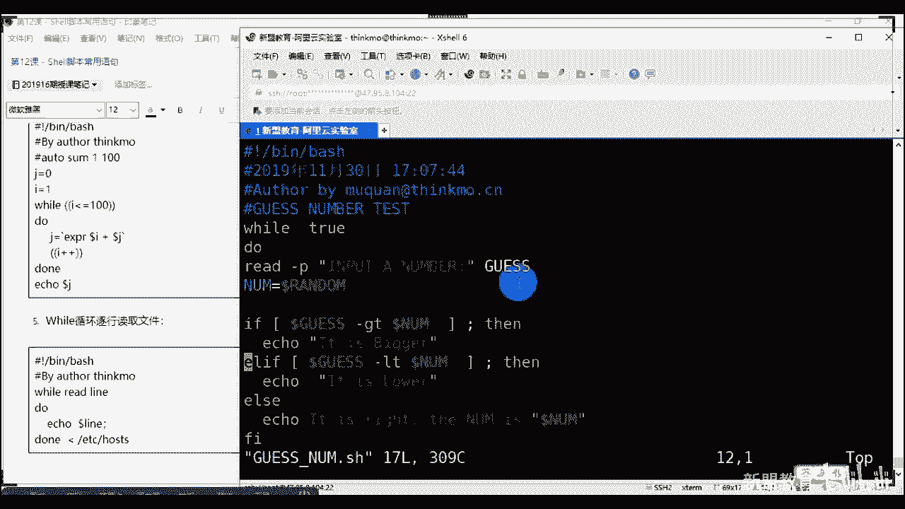

# 2020最新Linux-RHCSA入门实战课 - P13：RHCSA-第12课-shell脚本常用语句 - 新盟教育 - BV1Fg4y1z7kS

。

了啊开始了，不不多说了，等会儿还等会吧。人还没齐呢是吧？行，不等了啊，边讲边等好不了啊。边讲边讲他们了啊呃。老老张，那么我们上面讲的是一个讲了什么讲到处对项，讲了分管服务，讲了我们的环境变量。

其实这些东西呢都是为了我们去提升效率去做的对吧？那么我们说呃你在生产环境里面的话，用的最多的来提升你的效率。除了我们说自动化的，后期要学定一些东西以外，更多的就是我们的s脚本啊。

而sell脚本的能力一定要达到所谓的精通啊，之后，你再去考虑所谓的python的运习。这个东西是怎么说呢？就是你作为运维工程时间sell都不通。你去学python其实多此一举的。跟大家说这么一个事。

好不好啊，那么就是说。😊，而且跟你们说啊，sell是所有编程语言言中最最最最好上手的。因为很简单，它就是通过把我们linux下的命令进行一个排列组合，我把它弄过去能理解吗？同学们哎，这记住啊。

但问题是对吧？笑是什么，笑编程是什么？😡，简单器啊，那么sll是我们整个的哎系统的最外一层啊，内核的最外层。好，那么记住啊，我们可以合并的去编程语源以我们控制的这个程序和文件来启动和控制我们的其他程序。

不要急不要急啊，我们是通过提示输入是吧，是要可以通过提示输入叫做交互式的。比方说我们的Fdi看见得吧？Fdi叫做交互式。账户是。那么我们输入之后当好了，内核要进行处理，进行返进行返回给我们一个数据啊。

带好了。所以那么但是大家要明白，内核也好和底层也好。啊内核是最最接近我们。是是最接近我们底层的硬件的。所以它的语言一般是零和一哈是零和一，而我们的sell命令，什么ifconfi，这些叫做字符对吧？

叫字符。那我们两个人之间要做一个翻译，对不对？要做一个翻译对吗？同志们啊，谁做翻译啊？😡，记住啊，谁错sell对吧？sell叫做解释器啊，它叫做解释器，能理解吗？叫做解释器，代不？啊，这是解释器。啊。

那么我把这个地方给你们打开啊。😊，啊，很多数老师到底像是什么意思啊？两个层意思？一个叫做解释器，一个叫做壳，明白了吧？一个叫做解释器，一个叫做壳大。😊，啊。

那么sell是我们整个用户和linux当中沟通桥梁，我就不多说了。中间的话其实在直中间是我们硬件，硬件外边的话是内核内核外边是sll shellll外边的话是我们的程序，明白吧？啊。

呃跟编程没有太大的关系啊，跟编程没有太大关系，别着急，好不好？那么整个来说，大家往这边看啊是什么？是我的用户通过文字，也就命令行或者图形的页面将我的命令好，传递给我们所谓的sell。

而 shellll再把它发给我的内核，而内核再通过硬件进行处理，最后一层层再返回回来。看到没有？那么一个过程就啊那么一个过程。哎，而我们在整个linux当中有很多的小类型是吧？

同学们第一个来说我们的buel就是它啊，我们用的最多是这两个进来这两个。啊，少画一个啊这两个。好吧，哎，不0不笑。😊，第二个来说的话啊。

还有C shell和K shell这两个基本上啊看这三个我们其实最后一个也还用是吧？上面两个的话基本上不用了，已经。啊，基本上我们不用了。记了啊，最常用的是80小，也就是它对吧？也就是它。😊，啊。

而我们的bu shell是一个免费的，而且是一个开源的啊。你就是说白了我可以根据情况去做二次开发嘛啊，那么整体上来说，整个的se编程或sell脚本的概念，大家跟我之间啊。跟我讲，效率明白了，对吧？

就是我们一个解释器啊，它可以说是我们linux的非常核心的一个应用。对然说是需我们的编程。啊，s命令好吧，项命令啊，我们管linux的命令大多数来说都可以统称为我们的s命令。大家。对吧？

而我们只要上命令进行所谓的排列组合好，有逻辑的。啊，排列组合我们有逻辑的组织到一起，有逻辑的组织到一起。那么我们来形成所谓的脚本啊脚本。而脚本大家记住是在我们原有的。原有的程序能够正常的去运行的情况下。

好，我们可以干嘛可以插入一些新功能。插入的新功能。这些新功能的目的是干嘛？是用来帮助你进行提升所谓的效率。啊，用来帮助你去提升效率的。好，那你们玩游戏的人应该也知道，玩游戏当中的话。

有个东西叫做外挂是吧？外挂的话实际上就是脚本。啊，实上就是小本，明白了吗？同志们，哎，我不影响你的环不影响你的游戏正常运行，但是我给你提供新的功能。比方说自动攻击是吧？比方说自动刷野，提升效率的。

明白了吗？啊，提升效率的。哎，跟win的P处理差不多，那？你只不过winux里边我们乘以。什么呀？是吧我们常以点SH结累。啊，长以点SH结尾，而我们windows呢是以我们的点BAT结尾，对吧？啊。

这个是也是要问。啊，我等一下，我怎么看的只有30多号人在嗯，少了1多号人啊。啊，少了10多人啊。那我得问问他们怎么回事啊。好，我们接着说啊点个名啊，给他们从从从群里面艾特一下好们。好我们接着说啊。

所以呢明白一个问题啊，他其实并不难。我们所先说你甭我学什么，你第一个小学东西就是hello world是吧？啊，老师我看看sell里面怎么写，sell里面怎么写，你告诉我se里面。

如果我想让他从我的屏幕，懂了，屏幕输出我们的。😊，hello world来告诉我我怎么做。我怎么做，是不是很反应直接的一个反映什么同志们，我只用e嘛，对吧？我只用e嘛。😡，对不对？好。

那么apple是命令，我需要手动，然后脚本是自动的，干嘛？我把它输入到我们的文件当中去，输入到我们的文本当中去，然后再复予我们的。😡，可执行权限吧。对不对？文本啊，加上我们的可执行权限。好。哎。

就变成了所谓的脚本，大家吧？就变成了所谓的脚本。哎，很简单吧，这概念对不对？😊，好，这样我们结束。所以整个的s脚本哎，对，没错啊。所以整个的se脚本和hellow world其实很简单。大家注意了。

这里边其实涉及到了一些我们所谓的叫做标准化啊，进来。😊，标准化在中小公司并不显眼，但是在大公司啊，尤其是我们的互联网大公司。大型企业标准化是非常严格的啊，啥意思？这里面包括我的脚本的命名方式。

你不能瞎命名啊，是吧？脚本的存放的位置啊，以及脚本里面的注释内容。啊，里面就是有等等等等对。都是有严格限制的啊，这种标准化对。好，所以从咱们开始学时候学呃，就形成这种习惯，好吧？第一个来说。

不家说上脚本名称当了，命名一般是通过我的英文大写小写啊大写小写。当然如果到了后边，我们学到了自动化部署，知了？由于你的脚本很有可能多次修改，那么我们还要加上其时间戳，对了吧？

就是我们刚说的data百分号。Apple。这些东西啊加上我们的时间做，直到后期来说啊，前面的话英文大小写字母啊，包括数字也可以啊，那么不能使用特殊的符号或者空格来命令进来，那肯定不能用空格是吧？啊。

第3个后缀是以点SH为结尾。啊，不再出问题来。😊，不介议以纯数字。😡，好，没明明。但是你可以结合我们的字图。好，那么首行以什么？以这个为开头，啥意思啊？大家记住啊，这个的目的是来指定我们是。

质量是80L。来记一下啊。解释。预行。对吧。那么除了这种情况以外的话，你还会见到一个东西叫做user be。什么杠ENV好啊，usEVV叫做path来。叫user binpython。

大家知道这是什么吗？😡，显而易见是吧？这是我们去运行我们的pasen脚本。行了叫做python脚本啊，哎python明白吧？对。😊，到后面你会遇到啊，比方说我们学到了打比的时候，或学到S的时候。

你就经常会看到什么老师脚本是吧？比方说out啊is错啊点拍PY点PY的话就是我们的pathon脚本后制OK吧，大家来啊，那么整个sell脚本当中，我们这个命名的方式啊，命名变量也是以大写。而大写的字母。

这些当中我们是不能够什么用我们的杠或者去间隔的啊，而是要用我们的下滑线看对。就说脚本名称里边可以用它哎越来越高级没错啊？脚本名称里边可以用它。比方说老师我用凹。out杠inst可以吗？

杠ject点SH这是可以的。但是我里边的变量名称，比方说老是wa是吧，等于啊，记住你是version干嘛new可以等于，但是你不能够什么version。杠用对吧？这个我们是不是的啊，这是不是的。啊。

但不是说不行，只是说我们的要求是这样的，明白吧？啊，校脚本名称名称不能以数字变量名啊，不能以数字或特殊符号开头，这个不用说了。啊，文本里面和外本是不太一样的，对吧？啊，不能以数字开头记住。

但是你的脚本名称可以数字开头。比方说老师我叫2。0是吧，2。0凹数2凹数。对不对？第二个版本吧呃后面就写了，巴拉巴拉。好吧。好，对了，所以这是我们前面的。当然除此之外的话，我们一般来说标准化的好了。

前第三行。没头啊，刚来说我们第三行。到我们的第啊第二行到第四行。对吧，第二到第四行，我们大多数情况下要加上时间。啊，要加上我们的管理员的邮箱。说白了有问题找谁是吧，以及我们脚本的详细用度，详细说明。啊。

讲说明，说白了你到底干啥的对吧？干什么的？😡，对不对？什么时候用？对吧你可能会节省很少定时任务，那定时任务会决定什么时候用，对吧？多长时间运行一次。等等等等啊，都会记录下来。好。

那么我们简单随便来一个叫做first shell，对吧？第一个脚本啊，来看同学们来看我们去写一下啊。那么在此时的话，我只叫VIM叫做first FIRSSTfirst shell。😊。

杠点SH对吧？第一行警叹号bebu是知了啊，我是有叹号的，所以这个不算是注释行啊，往下走好，我告诉你们时间。对吧时间。第三行，order。给啦order by。艾点com点CN后边confuse to。

呃，我们说练习是吧，exist。我刚我练习怎么说了？practicePRAACPSE。啊，practice我们的shall是吧？shall the。SCRIPT。对吧一定要写出来啊这些东西好吧。

然后再往下边的话，你可以再去做其他的注释。比方说我说这个东西的变量对吧？我的这个变量wo。variorryable是吧，VAR worryable比说name。你可以去定义等等等等啊。

那么在这里边你只需要eleECHO啊，改好了，引号引起来，就在hello world。啊，hello来，这就是输入法嘛，这不就输入法嘛，是吧？你用啥输入法都行啊，好不好？保存退出。好，保退说。

咋啦两种模式的方式啊，好了，我运运行它，怎么运行它，怎么运行它。第一种方式当了，我只用buss好了，只用bus好吧，first。啊，first。只用bus，看到没？我是不是能够运行啊。

是不是是不是或者SH也可以。SH也可以啊，记住这个如果我前面跟这个的话，我就不去读取你第一行了。对吧？我就不去读取你第一行了。第二种方式是我授权给你。然后才能点杠啊，你不授权，没有办法点杠啊。😡。

对吧这三种方式都可以的这三种方式都可以的。进来。

啊，s不用ss啊，不是用ss啊，s后面再讲给你聊，来看对吧？所有地方告诉你了，哎，表示创建人是谁，对不对？几号表示注释。告诉同学们对了。好。而不用的东西一定要注释好，不然的话他会读取它，那就是报错的。

不是不加注释啊。那么我们脚本完成之后，两种方式。第一种我们要加一个运行啊，但是这个里面的话，最好是你给一个杠O。

对吧哎，说白一个问题最少化原则吧，谁能预行，其他人能预行。😡，没有吧？或者老师我只加我自己，给我自己加。😡。

对啦。哎，你也可以用bus或者SH去做。啊，那么这里边你明白，老师，其实就是我linkux命令的一个堆点。还难吗不难吧。啊，那么这里边先来看啊，第一个来说我们变量的一个讲解。哎，老师，我要做变量了。

变量的话是对于我们整个的sell脚本的一个优化。之一啊交费友化之一。那么我们说其实它不是它是一个怎么说呢？它不是非常典型的这种解释性的语言。比比方说像C了，像C加加了对吧？这种的当了，像java。

那我需要事先的去生明变量啊，声明之后我再理开去引用。好，而我们shop大家记住了，而我们shop是可以随着你写编去创建变量的，写一个创一个写一个创建个。啊，那么是要给我们变量辅值，实际上就是定义变量。

对来？实际上就是定义变量。啊，66当中我们支持的所有效当中都可以用我们的符值符号，也就是等于号啊，为我们的变量进行赋值。知道了？如果我是用的等于等于，这是什么意思啊？这什么意思啊？😡，什么意思？告诉我。

朋有这么意思？啊。等于等于是真的。等于啊等于等于是真的等于判断是不是相等。是吧而一个等于是什么？是负值。哎，解了啊，一个等于是负值，好吧，解来哎，对，相等判断明了吗？哎，相等判断。对。啊。

这种弱类型强类型我就不多说了，好吧，同友们？强类型我不多说，我给你们列举出来了啊，给列出来了。那么我们可以使用这个decclear去指定我的类型。类型的话，应该不用我说吧。你比方说当好了，像我们的整形。

😊，Pint。哎，正是int。像我们的什么字符型。😡，什么charactture。像我们s俊对吧？字符串没有字符串啊字符串啊。是这。对吧还有我们的福点。😊，啊，福典型float。对吧等等等等啊。

用它可以用declear可以去去进行定义。其实我们在一些个文件里面可以看得到一些脚本里面啊，那往这边看往这边看啊，我给大家已经列举出来了一些个特殊的符号啊。你比方说改有了，加或者减，那么什么意思？

是我减号可用来指定变量的属性，加号是取消啊，这两个是反过来了啊，这两个是反过来了啊？😊，啊，这样是反过来了。这样。注意啊，这是反过来了。第二个来说杠F显示函数函数一会我们会说啊呃。

杠R只读我们的呃设置为只读杠X由。怎么样指定我们变量为环境变量啊，更I的话指定我们的数值字符串等等等，对吧？这几个类型我说指的是我们的数据类型啊。好，大家看啊，那么这是我们deator的参数啊。

那么需编程当中的话，我们变量有三种系统环境和我们的用户进来。啊系统环境和用户。那么系统变量注意区别啊，系统变量是对我们的参数判断和命令返回时使用进行判断使用。啊，返回值判断谁使用。

环境变量呢运行时的需要的设置。也就是我们刚到什么pyython了，ele了这些东西，对吧？啊那个pas了，或者说是我们的笑这些东西，用户变量是自定义的，也叫局部变量。8对来。啊呃，定义时候大写的好吧。

不要以数字太多，这个我就不说了啊，对了。好，我们来试一下我们来试一下啊啊了。像这个地方老师我D了A是吧？答好了，如果我这地方换成单引号呢，告诉我，我这样换成单引号会有什么效果，告诉我。😡，能知道吗？

我换了单一号会什么效果？例比说老师，我们再来写一个啊来写它。😊。

对吧来写它走，上面定义一下。A等于123看了，如果哎变量是吧，hel dollarA此时。我先不敢啊，对来YY复制他一下。😊，第是吧？好，我把它改成单译号。感待有哈。看颜色就能看出来，对吧？

bu是 first走，大家看区别看到没有？哎，不转移，对吧？直接打印它。

O吗？啊，这是变量的物理啊，对。😊，对吧。啊，那么常见的一些个我们的系统的变量，大家来看啊，常见系统变量。哎，这代表什么东西啊？第一个来说第一个来说，doar0表示我们的脚本名称。

这个我希望是大家是重点聚击的啊，这个是重点聚击的，好吧，这个是重点聚击的。啊，接个来说dollar0表示我们的名称啊，dollar n表示我们的第几个N参数不忘了。

doar1 dollar2 dollar3到4，明白了吗？啊，不能用直径N啊，1234第几个参数传递的。道尔星表示，脚本所有的参数。😡，是什么？分别是什么啊，到了井号，老师当前的脚本的话。

我们的个数有多少个？😡，对吧告了多号上一次执行的命令结果还家记得吗？这个应该明白答啊。上一次结果哦大了，成功是零，不成功是多少啊，不成功是多少，告诉我。😡，不收付出多少啊。😡，他说不称我说少。是多少？

哎，有时候是一是吧？一不是啊，告诉大家是非零就可以了。有可能是负的，告诉你们啊，是非0。好，把这个接拉，有可能是有可能负的。啊，最后do是 dollar这个我不用讲了啊，程序本身的PID啊。

程序本身的PID好，那此时我们写一个脚本啊。

我们写一个脚本，怎么写呢？😊，啊，看到你发言了啊，看到了啊，我。😊，你比如说在的哈，你说在的哈好，来看老师怎么写好吧？我们去写一个啊，怎么写啊，同学们。😊，好，然看我们都用上好吧，我们说this好吧。

thisscript echo。ele好，你后引起来descript SCSCRIPTscript it呃descript name it是吧？我们用的是dollar0，好了，用 dollarar0。

好，然后继续说e echo什么呢？到了，我有知道你每个参数是吧？OK我们的这个这个呃。😊，的 worry是吧，we are worry，it's total啊tot。POTLE totally。二是吧。

偷偷。啊，total2哎，我怎么去了，total is are啊 is dollar星到了你一共有几个参数啊？有几个参数啊，用新表示，对吧？啊，谢L啊，谢谢了。😊，啊，站起来有几个参数，对吧？

然后同学们。😡，第二是吧，D2。到了第二。到了井分别是啥？啊，分别是啥啊，写法了写法了，这个是D二，这个是井是吧？这个是星。😊，对吧他们分别是啥，他们分别是啥，对不对？然后接着写接着写ele。😊。

The first one。拜拜啊。😔，S he first one is dollar啊 dollar一这同学们你还可以写。老师，如果我写的话the什么fi。这是我？这是第一次。对吧你比上你得写嘛。

这次呃我们写上dollar5，这是5。还有吗？还有没用到了吗？刀尔星是吧？1234，好正把前面的几个用到了，对吧？同学们把这四个用到了啊，把这四个用到了。好，来看我们保持退出。😊。

啊，保证你说好吧，那保证书说看，老同学们，first first，我们可以给根后多后面的参数。比方说老师AB25。大家理解了吗？后边的话用空格隔开它的参数，我给他4个吧，看一下我们参数是我的名称。

脚本的名称是不是他，告诉我脚的名称是不是啊，告诉我。😡，但是说。是不是？匹配上了啊，好再往下。😊，总共的开数有几个零可是名称，所以零不算，所以有4个。然后没？第一个A，第五个有吗？没有就空开看到没有？

如果你再跟一个哦，哎就有了吧。😡，拜表。有的话就写，没有的话不写。😡，对了，而我这个脚本执行成功了吗？e dollar问号成功就是0。老师KAK好，失败，e dollar就是非0。看到了吧。啊。

很简单吧。😊，看见了吧啊，对了。

这个就不说了啊。啊，这叫做系统变量，记住啊，一定要记起来一定要记起来啊。第二个环境变量。这个就我刚刚上节课说到了，不不说了啊，这不说了，这也背下来是吧，也背下来。第三个用户的哎自定义变量，这个同学们。

这是我自定义的A等于thinkN杠so index名称对吧？定这个这个是备份的目录是什么IP地址好，可以了。😊，这个不用记算吧，这不用记。好，我们来创建一下看同学们，这里边我加入了一些东西，加入什么了？

看好了，这个我直接解释了啊，直接解释了。好，这是什么指定了我们的buush，对吧？好，告诉你是做什么用来去安装的HTP的，能懂吗？大家懂事上一。😡，只要安装ATDP的啊，这往下告诉谁们，用户是谁是吧？

郭理员是谁啊？你们很多人说老师这是啥意思是吧？这是啥意思？😡，知道杠E是什么意思吧？知道杠E是什么吧？😡，刚毅是啥呀？当应什么呀？有有人知道这杠一是什么意思吗？😡，知道吧？杠E就是支持转移啊。

杠E表示支持转移转移什么杠03303什么？这来就说这个就是颜色，我们在最开始说过了，对不对？😡，说过了，对不对啊？所以这个是用来颜色的啊，划白颜色的。就是说从这儿到这儿啊。

从这儿到这儿我的颜色这一行这中间看到没有？这个颜色是什么？这颜色换一个颜色，这是一个颜色，这块的，please这也是个颜色。😡，啊，这是颜色，中间写东西，对吧？我定义了软件的版本啊，压缩包啊。

定义了你的路径，你从哪里你下载的对吧？然后老师我安装在哪里？😡，怎么样？按住那里，然后后边你是要。安装下载是解压编辑安装还是启动，朋到没？啊，当这里边啊这里边最后一个sep20什么意思？是我停顿20秒。

啊，是停坐20秒。但是这个脚本你老说我选择二，你没有办法执行，明白了吧？因为我们没有函数，没有去写啊，这只是一个催非常简单的一个菜单文件。😡。

对啦？我们叫做manu。还有TTPD。走。通过保存的。小来来同弟们巴一下没没有。可以hello吧？来看看传一。😊，啊，要停顿20秒，对吧？停顿20秒。看到有颜色是不变了？😡，别说是变了，对吧？

大家特别冷好这个。那还有一问题大家需要注意一个问题啊，什么问题嘞？😊。

是啊。对啊当你们啊从这个这个这个这个这个windows啊把文本。复制到我们的linux下的时候，你一定要注意啊，有的时候会爆错er。报什么错，报的这样一个错。😡，告这样一个错，是W是吧，还是M我忘了啊。

W吧。好了，会告诉你这个东西什么意思？😡，啊，什么意思啊？大家知道这个是由于我们windows上的混行。M对吧？windows的混合。😡，是吧这M。比的报错里边有这个啊。

是因为windows里面的换行我们是不认识的，明白吗？同学们是不认识的。

啊，所以此时记住了有这个问题你就明白了，怎么做怎么清理啊。很简单，进来之后把每一行前面删掉，重新回车，删掉，重新回车就可以解决了。明白了吧？明白了吗？或者呢你也可以用一个。我们的替换怎么替换怎么替换？

😡，啊，这里面S还记得了冒号哎，sorry。冒号S全文的话，用什么告诉我，全文用什么替换？😡，学位有什么计划？拜。用什么全用什么G是吧？哦，杠杠是吧，这样子就去替换圈文了吗？用百分号嘛，对吧？百分号嘛。

SG的话只是全整行啊，只是整行啊，对吧？也有说老师一逗号dollar这行么也行，从第一行到最后一行，对不对？当然我们全文就用百分号嘛，对吧？把什么替换成什么？😡。

把我们的间括号M大写的啊M间括号大M替换成空就可以了。没白同学们？到这里没有这里没有。进来啊，明白了吧？所以这是一个非常简单的脚本。😊。

你就可以输出来这样子对吧？说出来。啊，很简单，这里边没什么逻辑吧，你看这有什么逻辑了吗？没有吧，是不是我就是一步一步挨le一步一步挨le的。😡，最烂的就是了，对不对？好，那好了往下走。那么他和其他的。

我们的这个这个辩证语言一样，我也是支持一些个判断或支持一些个循环语句的。你比如说if付已句啊啊if付一句。做判断的啊。那么这里边看了，if for will case里边if是判断。啊。

case是选择for和will都是循环都是循环，只不过这两个循环的条件不太一样。啊，这根都叫做流空语句。留程控制叫流空语句。好，先来看我们的if语句，好吧，同志们，if的话。

这里边我只列出来一个多分支是吧？多分支其示的话if加句住啊，if为单分支。😊，怎么样判断一次。啊，多说分之。😡，啊，判断两次。还有多分制。对吧多分支也就是多次判断。啊，多少个。不大家不大家啊。😊，啊。

啥意思啊好了，如果是这的话，看了，我linux特别好的也是你能够有迹可循。什么意思？比方说老师if会开始啊，结束呢就是废开废结束倒过来看到没有？倒过来。😡，只不过当了，这里边我们就直接跟一个表达式。😡。

那这个表达式是吧？如果后边的话，我就直接输出一个满足输出不满足退出，明白吧？这是满足的情况下啊。😡，对了满足情况下。那多分支呢双分支呢，ifB这都是不变的。😡，只不过在中间多出来一个叫做el evil。

对吧？叫做else evil for else。就可以了。这个Lse对起来。啊，这al，这是依次判断表达式是吧？表达式A啊，后边的话不用跟，大家记住这个位置没有表达式。就是除了AY的。😡，都在这儿呢。

明白了吗？来明白了刷一。😡，卖上音。哎，除了AY都在这。第三种多次判断啊，多次判断的话是if。啊，else知道了？else永远是最后。永远在最后别人都不匹配了，匹配你。😡，那中间呢。是吧那么好了。

中间是L e啊，是L e，你可以有多个啊可有多个LE。好吧，else只有一个。切只有一个能理解吗？行啊。😡，对。啊，这是单分支双分支和多分支，这里边明显的给你的是什么？是个双分支是吧？是个双分支啊。

明白朱老师，我现在要去比较两个整数的大小，对了，表示两个整数的大小。好了，走个视频往这看。啊，这里边我用的是一个双括号，先把它记起来，表示整体去看待啊，先理解过程，大家可以吧？先理解过程啥意思？好。

我定义一个数值100可以吗？同学们。number2后面去判断，如果如果老师我的这个数值大于4，那么我们就执行e。如果这个数小于4，就执行这个地方。明白了吗？拉家看一下啊。

到。不是。好。嗯。走，我把这都删掉了。走。注意问题啊注意问题啊。

呃，我想说什么来着？差点忘掉了啊啊啊来看同学们，我们先把它复制过来，先把它保存了，可以吧？保存了，然后来看。😊。

好，大。没有是吧，8没有。哎，没了是吧，大师。M也用多大哈，注一个问题啊，这边好像出现一个问题了是吧，这么问题啊。😊，什么问题啊？对啊？你的这个逗号分号好吧，这个分号一定写，别着急，一会儿会讲到。

一会儿会讲到啊，一定要是英文字符啊，别着急，一会儿会给你们讲单括号、双括号、单中文和单单中括号和双中号的区别，好吧，来家再执行一下哎。大是引号也是吗？看一下啊，引号也是啊。😊，这个引号倒没事儿。

其实引号其实没事儿。啊，你的号是没事。好，淘宝退收来busmanu。我是不是大于你啊，对不对？但是这个地方好像没什么意思是吧？同志们都是我在输入。😡，鲍老师，我怎么办？我可以这么改，好吧。

教大家一个方式啊，这个地方啊改一下，叫什么叫做read对了。😊，readread表示，我们从键盘上读取。高逼，我可以给你个提示，告诉你imput。😡，啊，meer。

是不是imer a number什么呢？NUL来进来。我把你们哈我给你个提示，杠撇print print我的那句话，你输入一个词，输入一个数字，我把这个数字交给number交给这个变量，看匹配上了吗？

来看保证退输来buush。😡，没有。啊，给个50。看没老师再运行给个一。看到明没？看到没有？来看能串一。😊，好了吧。哎，这叫从键盘读去啊，read啊这边有个read，大家可以自己总结下来。好。

为什么用它的？这是两副方式。别着急，一会儿给你们讲啊，你还会看到双中括号呢，往下走。

哦，第二说判断目录是否存在。😡，啊，注意判断。为什么要重点说很简单啦，在判断上的话，你会多出来一个中括号。啥意思啊？到了。那么在linux下有两种判断方式。不是我们有两种方式。哪两种。对吧第一种当好了。

我就用中括号。但是啊打好了，中括号一定前后都有空格，明白了吧？我是一定要有空格的。😡，啊，一定要空格的这直间这块一定要有空格。啊，这个地方没有办法换出换颜色是吧？好，这样的。咋啦，一律是有风格了。😊。

一定是我空格的对。那么这是一种判断。第二种方式叫做test。啊，啥意思啊？大了，你比方说我说我判断你是否存在，更低的话是判断什么是不是个目录，对吧？来看啊，这个表示取反取反。😡，啊，什么叫区版？

是变成不是了啊，同学们比方说老师，我现在想判断什么呢？😡，是吧。中啊啊，空格啊十是否大于我们的4。啊十是否大于4啊啊，或者小于十是否小于4，这要表示小于啊杠LT表示小于。对吧杠LT。小鱼。啊。

sorry。好，杠GT大于。到了，goor。杠LE小于等于杠GE大于等于是吧？这死结了啊，这个就等价于test。10杠LT。能理解吗？来的点刷一。三耍一。啊，判断的结果记住啊，所有判断结果。😡。

通过什么？通过我们的ele。dollar问号输出。你找一个结果你也不对不对？我就是通过你输出正确与否，错误与否。对吧，所以这些是结合去用的啊，好吧？往这边看啊，后边看大概列出来了。😊，啊。

这些东西都是常用的都是常用的。大家注意了，数字与数字之间比较。如果你是使用的这种方式，不能够用等于号、大于号小于号，必须用这种参数形式能理解吗？😡，啊，必用参数是等于不等于大小于大于小于等于大于等于这。

写了啊，必须要用这种方式，而中间A表示的是与预算。逻辑语。来看。😊，各位。后面还有学到and end啊了，这两个是一样的啊，叫做逻辑语运算。啥意思？好了，同学们，我们一般做的是条件A好，and end。

或者呢杠A。好，调件兵。好啦，小小逼。好，先问一个问题，同志们。😡，这句话的意思是到了什么意思啊？是登我的A。😡，何必。我们同时成立。啊这个答案是真。这个答案才是真，就是正确的。😡，能理解吗？哎。

如果说说我是杠O。知吧靠O。啊，也就是我们的杠杠，有时候用杠杠两个杠啊两个杠表示吧，表示我们的逻辑。逻辑什么与货逻辑或哎，没错，不不，逻辑或才是刚好了，条接A条件B表示我们的。

A或者B有一个成立则整体成立。理了吗？那么像这个状态好了，如果我的A淘到了A是错的。问一个问题，B还执行吗？白告所还执行吗？😡，还知行吗？还执行吗？记住啊，不执行了啊，不浪费那个时间就不执行了，理白吗？

啊，如果这个呢还是不执行。😡，哎，如果说这个呢。A错。B执行吗？😡，告诉我这行吗？哎，执行对吧？啊，你得判断后面是不是正确的，对不对？同学们进来啊接来，这个是啊最后一个。😊，特号。叫做逻，这就是一个啦。

这个叫做逻辑飞。徐反对吧？徐反而已。谁雨祸飞啊雨祸飞。好吧，进来啊，这个也是单项成立，或者说是双方都成立，这两种方式都可以啊，两种方式都可以，看到没有？两种方式都可以啊，你就在这地方老是变得暗淡暗的。

行不行？可以，对吧？我们反正一般我I用的是这种方式。啊，我用这种方式比较多。啊，我用这个方式角做。好，啥意思？大家来看啊啥意思？好，此是更第道时呢，是判断是否存在且为目录。😊，判断目录嘛，对吧？

你得先存在，存在之后还得示目录。好好，看老师们，我判断这个目录存在吗？存在吧？😡，我怕断不存在，看到没有？😡，跟了一个飞，我判断你不存在。😡，好，并且我判断这个目录也不存在，啥意思啊？

当这两个目录都没有的时候，我们则执行创建它能理解了吗？😡，能理解了吗？那我们试下把它过来。

走，我把它过一下啊。😊，走。改一下分号。好，看一下同志们data有吗？没有data，对不对？没有data吧。😡，好，这个有吗？没有吧，对不对？ABCD嘛没了。好，再来看TMB里面有吗？

也没有2019都可以了。然后我们再来看执行看。😊，对吧只有他来看啊，来看看有没有贝塔了，看到没有？有了吧有了吧。😊，但是我那个上面就没有那个不用做，对吧？哎，对，可以吧？😡。

重点记得是与或飞的逻辑关系啊，你们肯定会用，对吧？招标化我还不会吗。😡，好，多重分数，这就不用我说了，大看这里面就用了两个刚刚看到吧？两个中国号，不着急啊，那么此时判断你的数字如果大于100，那好了。

做一个修改，还是跟我们刚刚是一样的啊，跟我们是一样的啊。willmman走。😊。

走。Well。稍等啊，把这个分号改了改掉。😊，嗯。走把这个也改掉，对吧？记住啊，其实正常来说的话，我们应该怎么办？同志们冒号杠星改括号S，对吧？将我们的S。SUORE。S把它变成SCORES对不对？

no看都替换了吧，都换了吧，啊起来。那么同时你要做的事情很简单，我们要做一个read。😊，当P是吧，input a number。AUMBR。好，冒号给过来SCORES对。保证会说保证说来大0一下。啊。

写记记不住的得写半边。对了啊，记了啊，好了，我怎么做？比方说老师给个9599good是吧？老师再给个9090啊，别给90万，给个66pass对吧？再给1个72看懂什吧？pass啊。

是不是符合我们这个逻辑啊，能理解吗？啊，这个也是分号没关系啊，这没关系，能理解吗？答啥一。😊，对吧。😊，什么意思啊？等于100very good啊等于100very good大于85。

go小于大于60pas低于60no pass。其实这块呢应该是变成GT，对吧？啊于GT。这一大于等于吗？

很简单啊，那么问题在于老师，我看到很多种表达方式了，对吧？到底分号这个括号有什么区别？来看啊括号的区别在这儿呢？😊，好，如果我们使用if语句时候。

你就要会到单括号、双括号、中括号、单双呃双中括号和大于号的这种括号，对不对？区别来看一下啊，同学们什么区别。我看。等会用于多个命令组命令的替换初始数组，这个其实没什么可多说的对吧？你方说数组。

你们后面会不会学到ar。ll括号。A，RY。这先不说啊。好，最往下边后面我们会说的哈。😊，哦，正下面这个地方。整数扩展预算无重定量预算比较看吧？我们刚刚是不是算术比较啊，能理解了吗？

单括号是不能够做双数比较的。能理解了吗？彭超，刚刚谁问我的对吧？bet对吧？彭超能理解了吗？😊，当过老师不支持你做比较的。说过了才支持。啊，双货在这边。啊，单括号但中括号，中括号8是内部命令。😡。

与它相同对吧？与它等同，哎，进来那不支持加减乘除预算符，看到没有？不支加减乘除预算符加进来。他不知道。哎，逻辑上使么AIAO看到没有？使用这些东西。啊，注意啦，这个也是一样的啊。

就说白了你得使用的是大小加里投资怎么办？用什么？😡，有什么不吃下你同组。别很，你不是让你计算，对吧？我是比较你啊我是比较你啊。那么双中括号在这儿呢，这是关键词。这是它的关键词啊，不是命令知了。

它不是命令，上边这个是命令，明见吗？这个不是命令。啊，这个结构比它更通用，你记住了，上边能用的就用底下的啊，记住上边能用的，底下都用。😡，没有了吧。忘记了，账括号这就不用我说了，对吧？做一个集合。

这是做一个集合和范围。进来。所以说这个里面我们用的雨获飞比较多，对吧啊？雨或非比较多，这个里边其实也能用雨或飞。这两个单数，这两个是能够相互替代的，消贴的没能说那么严格啊，没这个文章里面说那么严格。😡。

好吧，这是if副语句，if不难吧，对不同么对？for语句更不难了。for语句遵循一个东西就抓好了。这个变量都是小写啊。😡，这个变量是你直接定义的，你前面可以不定义，直接定义这个变量从哪去转呢？

这个范围这个列表是吧？在这个列表里面去转表达式三种方式。我已经跟大家说过了。第一种。😡，什么我直接写1234567890，每个之间空格。第二种大括号，第三种SEQ明白了吗？你也可以用这个啊，不是SEQ。

就用用什么用我们的白里的号。😡，啊，就牌有号。😊，好，循环一次续行一次循环一次进行一次，直到循环结束，直到这个范围结束，列表结束，明白了，同学们。😡，简来啊，另方如说我循环打印BATP官网来看挑战。😡。

保障。不是啥意思啊？啥意思啊？什么意思啊？大哈。😊，啊，什么意思啊？这地方我这个是变量吧。😡，不是变量码，变量从哪里旋转，第一次匹配它好输出，第二次循环匹配它输出，第三次循环它输出，直到结束没有循环了。

没有匹配了，多大哈能看到吗？每一次输出都是重启一行。😡，每一次输出都是重启一哈。可以吧，来O刷一啊。😊，不会专业啊，当然你也可以把它换一种方式，对吧？啊，这我就不说了啊，比是说哎那么循环制1到100。

大看这边有了吧，1到100，这个我就不写了，这个一你可以简单讲来这个一你可以省略这个一你是可以省略的，来100个省略啊，看到没有？这个我就不写了吧，这个不用我写了吧，上次我已经做过了，对不对？啊。

上次已经做过了好，往下走求和是吧？求和就好玩了啊，然好了，那么这里边。😊。

好了，这是for的第二种形式。张女师。第二种形式。啊，类似。我们的C语源风格。类似C语言的风格做什么到了C语言里面负I从什么开始？😡，I从一开始I的范围是什么？每次学完之后，I加一。😡。

那么那么这里面请大家注意一个问题，什么问题很简单好，对了，I加加和加加I。😡，是不一样的。能明白吧？这两个是不一样的，怎么不一样，记住哎加佳。😡，下了表示本次循环后。本次循环后。我们的I。就。哎。

大家知道等于I加1。啊，而这个呢。😡，是赎魂开始前。あがいい。这样。能理解吗？来一串一哎，当然能这样了是吧？当然能这样了。好，来看老问一个问题啊。好，我现在这个I对吧？是一啊。

我小于等于100的时候我就能运行。那请问到这一步，我请问在这个地方，我的I等于几，告诉我。😊，hello，一姐啊。还有一起。等于几？等于一对吗？对吧？等于一啊，I，我没问你T啊。好，那么来好了。

我出来了第一次学完之后，这个地方I等于几？😡，这地方doerI等于几？😡，能先等于二了对吗？好，然后回来我接着去评陪你。😡，能理解了吗？是这么来的啊，加进来哎，这叫做我们的什么对吧？O吗？好，来看。

所以每次循环结束之后，我最终输出我们的杠I。不要紧，sport表什么表示我执行我们刚刚前面说了吧，大哥，我不支持加减乘除，我不支持预算，在这里面是不是？所里们不支持预算，不支预算。那这里面的老师。

我直接用dollarI去加它行吗？😡，行吗？告诉我。行吗？哎，这是数学表达式。😡，数学表达式你没有多老师，我想取于。😡，啊我想取取什么用什么，知道吗？取用什么呀？😡，取用什么？你比方说三比上2取是。

用百分号。行600个号。等于一好余一明白了吧？你那么此时在这个里边，你没有办法用百字号，你就得引入这个东西叫做数学表达式。理解了吗？来临刷异。啊，叫做数学表达式函数，这是个函数，功能函数直接用对吧？

所以我们来看一下。啊， sorryra啊。哎，在这一波应该不用我说了吧。😡，走。

走。好好看看啊，一定分号改掉啊。😊，好，保证退收来bu0一下6。来看最后是5050，对吧？呃，是是要内置的吧，你可以看一下TYPE对吧？TYPESPR。是吧是吧不是啊，是外部命令啊，是外部命令啊。

这是外部命令，可以吧？啊，另外多要说三比上2没法做啊，对吧？咱们前面跟EXPR。明白吧？跟ESPR看见没有？这个就能显示出来职少对吧？只能想能显出来正常来说话，你要给它赋值啊，不能这么用啊。

ESPR不是这么用的啊，得写成一个小函数或写成一个小程序一样啊，做一个比例。😊。

能进来啊，所以对于压缩打包来看这个比例啊，大家看这个啊。😊，注意啊，我这里边列举出来所有的命令，你要自己去敲一遍，给我截图发结果啊。知吧？我今天给大家讲到所有的练习的小脚本，你都要给我自己去敲一遍。

然后给我截图，不允许复制，明白了吧？很简单，把这个地方好了，把这个地方都给我改掉了，改成你自己的名字。😡，改上自己的名字，明白吧？I和G全都给我替换掉啊，I变成AG变成B，自己去敲啊。

来看这边负I in到嘛？in的话，看这就是反引号的好处。非常好处。我放的在这个里边找到以点log为命名的任何文件，我都可以。😡，8号，同学们。

不是类置的啊。不刚看了吧，整不外有命令吗。😡，啊，fin我先说啊，从word下log下找什么，找我们杠name以点儿以点log结尾的文件，看到没有那么多，我把这些文件是不是都执行结果呀啊。😡。

执行结果作为我们的一个列表，对不对？然后把它进行解压，把它压缩。对，就这一个含义，就是引用数学公式。明白吧？就是引用数学公式。没有别的意思啊。😡，来看把它过来。😊。

哎，sorry。啊，把它复制过来。

然好，注意啊，我会去把你加到这个位置，2019，对不对？还记得吗？看到没有？好了，我们去把它写，把它写进行了一个一个一个我们的压缩啊，把这个I里边的所有东西都压缩到这里面去，明白没白白？😊。

好，bu士。

买了。大哈来到本地吧，多少一个压缩包没有？😡，TR呢叫什么来着？叫做叫做真的。叫什么来着？叫做2019log dollar是吧？2019找着在我们跟下是吧？🤧有没有啊？🤧嗯。等一下把它放到哪里去了。

放到了。😊，呃，把它这是他的名哦，坏了坏了坏了，他的同学们，这块其实应该有TR点GZ的是吧？我写错了，我写错了，叫TR点GZ啊，随意先先让的这样子写好吧，像这样写，找一下2019有没有。😊。

有吗？还没有是吧？还没有是吧。没有，我们帮看一下。来，我看一下看一下好，f in对吧？这是结果啊，这儿的。😊，走好吧，这是结果，我们把它TR。找GZ好不好？把它压缩过来。

把里把我们每一次的循环压缩到这里面去。啊，要到这里面去。到了I。走。啊，进行一次新的运行。看到到？这就可以了啊，还有错误是吧，是吧。😊，他要说我他要说我。呃，countt open是吧？哎，我知道了。

什么问题啊？大家还记得吗？我说过了什么问题啊，告诉我什么问题什么问题。😡，能知道什么问题吗？不用路径，不用不用写录径，就当节目录像，什么路径哎问题什么问题有说明白了，对吧？我这边要不用VAM。

你们看不出来，我要是用VAM呢。😡，看到没有？看到没有？是不是这个问题出来了，看到没有？😡，啊，所以这边单号。啊，好好。走。还有问题是吧？呃，瑞诺。辉哥it's not is看一下啊，从头到尾看一啊。

啊，not such呃，没有这个这个这个。这个文件对吧？哦，这块写错了这块写错了。走，我把这地方给它去掉吧。好吧，我把这地方给它去掉吧。

高。这样就可以了，对吧？啊，不用不用把这个地方也去掉啊，好像给他我给他撤回反撤回错误了吧。好吧。这块这块我好像写的有点毛病。啊，这是写的有点毛病，接来吧。😊，啊，把这个去掉就可以了。😊。

到一在这儿呢，到一对吧？这样呢你本金不就有了吗？😡，对不对？

这里不就有了吗？其实2019中不吗？看到没有？看到没有？里边所有东西都压缩进来了。对吧啊，对啊，就这个名称不能用doll一啊，这不应该都用do一的啊，那太太多了啊，对不对？这是一个这是这就是我们的压缩。

其实这就是一个小备份。😊，我们备份其实就是这么备份的对吧？把它压缩进去啊，加一个for循环远程主机的文件传输那？这里边100到200对吧？100到200，它给你的是1个IP地址，看到没有？给个IP地址。

看到没有？同志们啊，正来说这块也给他一个大画括号。啊，好好，什么意思啊？😊，SCP命令还没讲到啊，远程传输啊，把我们这个文件传输到这些个。IT下面的这个目录下去。传输200次，100到200。

只要检测到的都传输，明白同学们？只要检测到都传输。来，董事啥意啊，这个不就行了。没有额外点算。批量远程主机命令SSH登录远程对吧？登录远程去执行这条命令。啊，就执行这条面。对吧，当然最好的情况下是什么？

是你得登好了密钥啊，大家知道这个情况下是基于你。什么。😊，基于我们密钥对认证。是吧上边这也是啊基于妙对啊，你不做妙对，你每次都输入密码，你这怎么做呀？😡，是不是啊？所以是喵的，你知道吗？对。啊。

这个回去自己做做一遍，哎，一定要是免密登录啊，好吧，打印10秒等待提示，自己看吧，这个就是数字数字，对吧？这就是数字。对不对？😊，啊，对。杠E就是转移，让他们具备现实意义，对吧？

然后等待每次都等待每次都等待看见吗？每次都等待等待10秒嘛，每次是一秒，对吧？一次循环10次，那不就10秒嘛。解释了啊解释了。好，当了，那么for是一个循环。大家家明白一个for什么，它是有氛围的。

循环没毛病吧？是有氛围的循环哎，有次数的。有上限的。好。啊，有上限的。那么最后一个给我记叫做will啊叫做will。will是什么？也是循环，单好了，它是按照条件的。啊。

注意其表达式方式will加上表达式do that到了此时这个条件不满足的时候，我们干嘛退出。啊不满足的时候退出。理解吗？啊，不满足时候退出，那满足就会一直循环，满足就会一直循环，满足就会一直循环。

不满足才会退出。抱下来。挨个别T啊里面表达式好吧，那正常的说我老师，我直接把它删掉，这是可以的，直接就做循环去了，一直在循环一直在循环，直到不满足时候退出进来。😡，那往下看往下看。

我们的整个企业里面的话，如果打印网址啊跟别着哎，对，没错啊，初始词啊，不要别着急，往下看，我上面用for打印了循环，对吧？再看底下打印我们的这个BATT啊，用read啊read去读学。

we干了line是什么识别量，对吧？给line嘛，来看看最后我会干嘛呢？是把这个里面的结果读取出来。读取进来啊读起来这个内容能理解了吧？看一下，我们做一下就明白了。😊，哎。是吧这个过程很简单啊这么简单。

什么意思啊？你得提前准备好文本，对吧？😊。

对吧同志们。这今天准备好玩的。哎， sorryorry。走。包。VM这做叫什么来着？think可。😊，点PIC。里面写吧，对吧？说你写几行都行，老师3W点think mode点com点CN啊。

3W点百度点com对吧？3W点tencent点com。啊，3W点京东点COM。对吧3W点我们的QQ点com，对吧？3W点淘宝点com多打几个保持退出，然后bus一下。啊bos一下我们的man点。

你在里面写了，他就直接自己去读去了，能力吧，看到没有？😡，看到没有？啊，老师我在里不写行不行？行。😡，也行，明白？同志？老说我在里面不写，我可以怎么办？😡，我会怎么办？这怎么办？后面加嘛，对吧？

执行你的时候。😡，是吧bus加了定下。可以吗？告诉我这样可以吗？😡，可以吗？这样可以吗？可以的啊，多种方式忌会一个就行，同志们。😡，会一个就行，其他就玩溜了，会一个，后面就都六了。

啊。hello world will无限每秒输出是吧？每次是一次，每次输出。你输出的话其实没有什么限制，对不对？对不对？同志们，你甚至可以跟到后面再给一个te。😡，表示永久死循环。明白了吗？

表示永久死循环默认的指处。阿默就说永久对嘛，对吧？起来这个我不做啊。😡，好，再看打印100用于逻辑预算预算逻辑工具啊，看同学们好往这看。这地方I等于0，I每次小于等于时候，看到没？

这个我是不是运行100次之后大于变成101了，我就退出来了。😡，能理解吗？😡，能理解吗？我是变成1010就退出来了。😡，O啊。😊，啊，这个跟上面的是一样，对吧？打印1到100个。

对吧100到100的和跟上面是一样的，只不过用的是view而已。这大家会自己去消吧，我就不再尝试了啊，不尝试了，都是没有问题的，都是没有问题的。后面的命令。啊，看这个逐行读曲不说了，好吧。

will的命令很好用啊。到了后边，你方说老师，我们猜数字，你会经常去做，对吧？比方说老师好了，我们去做一个猜数字。

我们写一个gues。Number。这S。可以吧？同志们啊干 memberS里边写一个警叹号be大是。我截起了，我把那三个省掉了啊，说了不守了，严格遵守是吧？严格遵守。包头呗。听给我点CO聊先。

走最后右sgues。Number。Test。测是来了。我要做什么？没有。😡，啊，WHILE不有到好了的。对啊我会让它一直循环是吧？但一直循环，所是什么之。啊，处不那了，我哥哥处什么意思啊？

这个处不是说不是说一直退换啊，说错了，呸不是吧？是当满足则退出。😡，当然了呀这当然了呀，我给你们的永远都是确实有用的东西啊。看同们？我说错了，当下，呸这个是当你满足的时候退出，明白吗？😡。

当你满足的时候退出。啊，等你满足的时候退出。好，干什么？到了，此时你要去读取readd。啊，请你输入一个input是吧啊，number。好，比方说老师number。好，此时你要做的东西是吧？做判断了。

if。😡，可以。啊，if费好，甚至里边el是吧？if到好了，如果此时干什么告诉你了，中号判断，用中号判断啊，如果你给的叫做dollar，我们给的number好了，同学们如果啊如果啊分想啊。😡，大家好。

这地方再给一个。Iad需要一个数字，对吧？好，给一个什么呢？比方说dollar。😡，可不可以要干。啊，这块儿给盖子吧。对吧这是你的猜想嘛，那这样的geGUESS啊。

这会给numbernumber等于什么？number等于dollar right。一定要提前定下来啊一定要提前定下来啊啊，如果你们随机的数字在操作上，如果你猜想的。😡，杠L大于T。

大于我们的number。什么呀？我要告诉你，对吧？告诉你这时间。😡，蹲起来这什么开口。😡，Yes。it is什么bigg啊，biggger我也忘了怎么说了，bigger你差的大了，对不对？你猜的大了啊。

哎，没错，再往下边的话，干嘛概叫的el evil选是el evil改。😊，Dollar盖子。好了杠LT。是吧dollar number好，小于的。贴实验。开口。挨了一次。lower是吧，小了。

再往下面最后一个东西叫alse。要时我们跟命的告诉同学们，我要写吗？用写吗？用写吗？😡，用钱吗？用写吧。还用写判断吧？不用了啊，就说这里边不用写判断啊，else不用写，对吧？直接是说echo。😡。

It's right。对吧RIGHE啊press the number。I sorry了 the number。Do了。呃，NUM对吧？number好，来看我执行一叫查bus。啊，GUESS走啊。

看一下第六行是吧？第六行这是第六行ju住吧是吧？ju看一下有什么问题啊，告诉我们。语法有问题对吧？语法有问题啊，你这边处。给一个给个那什么给个变给个量值是吧？TRUE。走好学们100。啊。

出现第12个了吧，12号有问题是吧？改一改。😊，等一下12行是吧，1行哪里这里对吧？LTLT是小于LT小于没问题啊。看一下DLSE对吧？Lif。1二行嘛出出错，对吧？

看一下12行的 number is27出错了啊。呃，不对，看一下啊。流量哦，只有ESSOK。O。对吧这样子来。啊小了是吧，50。错了啊又小了又小了小了，对200。😊，对吧再大家出一个问题啊。

你知道这种情况下别着急，这种状况你一定要提掉他为什么要改一个问题，改哪里，告诉你改哪里。😡。

改这里啊，为什么改它？很简单，知道了？readdom的参数值。😊，打找范围吗？😡，叫范围吗？是0到65535，明白吗？是0到6535。所以你要做的什么？你要做取。啊。

你正常来说应该是0到1000就可以了，这个动西啊0到1000啊，休息休息一下啊，别着急啊，你要做1000，你明白吗？如果我想要我的范围在1000好叫取，那么此时你就能够用到了我们什么呀？😡。

对吧叫做。哎，你就会用到我们的ES。P2。对了吧？就用到ASPR了，对我们的100去取域。理解了吧？我把我们的值给你。😡，啊，我把我的值给你。对来，我把我的纸给你。能理解吗？来理解上一。没有啥意。啊。

我把我们取的值我要复制给你，对吧？这是最后一个值嘛，我要复制给你。😡，看到没有？然后100。啊，哎sorry，这有问题了是吧？十和十二行了有问题。啊，10。只有ESS。只有ESSnumber对吧？啊。

这个值肯定是有问题，这块儿我写的有问题啊啊，我看一下问题在哪里啊。稍等，我看一下啊。稍让我看一下我这个值在哪里。哎，这是在吧？这在哪？呃，这个地方不是这么写啊。

这个地方不这么写ESPR dollarllar randomdom reddom给你出来了，redom给你的值，对吧？redom给你的值，最后你要不能这么做。啊，不能这么做，你的取。

对你要你可以用那什么，你可以用那个那个那个那个那个那个呃那个那个。我们的反引号对吧？反引号，你也可以这样子，我给你们写这种方式吧，好吧，我给你们写这种方式吧。因为很多说老师我这种方式怎么写呀，是吧啊？

反译号是一个好用的，你们会用，我肯定知道反译号我们写一个不常用的，好吧啊，这个其实也不怎么常用来看来看啊，我想怎么写来着那个地方呃等下啊。取的值，我想想啊。ESPR对吧？我帮用ESPR。呃。

我想想faceaseport呃哦，这没错，来好了，这没错，这没错，就是百字号啊，只不过这块呢有个空格。有空格好吧，我忘记了，这有空格啊，有空格啊，就是符号与它之间一定要给给我空格可以吗？

同学们OK这上一啊，符号之间一定要跟我空格啊，一定要给有空格。😊，没要很始穿衣啊，一定要更有风格，这会忘说了。啊，甭管哪个之间，不管你说直接符号，还是说什么样，一定要给个符号啊，一定要给。😡，好。

保存退出。I，sorry。好，大师一下。到。哎，找着啊是吧，好，又有问题是吧？又有问题啦。退出一下，看一下，还有问题啊。小张number对吧？我给你了，guess一下呃，我看这里哪有问题啊。

括号dollar2个dollar对吧？ESPRESPR把我们RANDOM取于对于1000对于一0取其实我的数字就是1到。多一个括号不是多括号，这括号不多啊，这括号不多啊，这括号不多。

然后我们先把这个去掉，我们先把这个度去掉。好吧，我先把这个vi去掉。啊，先把这个will去掉。这我临时家长。不是没有问题对吧？还是他的问题。呃，guess呃read呃应该没有问题啊。对吧应该没有问题的。

😡，我连出都出不来啊。连出都出不来啊。是不是啊，跟他没关系跟这没关系。啊，你说的是减错对吧？XV啊，这是减错。啊， sorryor。啊，就在这儿出错了是吧？这出了错啊哎。这怎么会出错呢？我们试一下啊啊。

这这这走一下，给个100对吧？给个100，看看哪里有问题啊。呃，看一下同志们这个在做对吧？在做对不对？在做吧，随机值有了，复制过来了，复制过来了，所以its bigger。😊，好。哎，没错啊。是吧。啊。

又可以了。好，我知道了啊。行，刚应该是刚应该是可能是内属CPU的问题吧。vivo two。啊，没有错啊。好吧，管他了，但啥意思？就是如果我不写BU弹的话，那就明老师我完成之后就结束了，对不对？

每次完成之后就结束了，猜对之后就结束了，我想一直玩热干嘛？😡。

我就得记行500。对吧啊，250啊，这要对半嘛，对吧？40043025430。大了好，我给得370380都行，对吧小了，那就是400。小了，那就415。又小了420。到了420。好，421。啊。

421哎，还小419。是吧是吧？哎，对啊，没问题啊。啊，看一下我现在拆到哪了？422大了400。啊，没了是吧？420。而小了422。啊，420对吧？小了422450。好，大家看一个问题啊。

这块呢其实已经过去了是吧，已经过去了，对不对啊，已经都猜了，是不是已经都已经过去了，这个位置，没有没有反应过来这个过程。😡，他只是没有输出这个部分。他没有输出这个东西是吧？他直接运行下一次去了，是不是？

他直接运行下一次了。啊，而且预行下一次去了，其实你已经猜到了，他只运行下一次去了啊，这块呢我们一会儿再给它加工一次吧。好吧，一会儿再给他加工一次，我们就是看下面的。😊。

啊，叫case语句而叫case语句啊，就是420这420啊，没白，同学们case语句是做一个选择，没问题吧。是一个选择。那选择的话好了，我跟你说lininux里面我说了。

就是按照它的语句找哈CASE倒过来ESAC看到没有？开头结束，开头结尾对doller一 dollarer一是什么？告诉我。😊，到底意是什么呀？😡，到底什么呀？我前面怎么讲了，我们系统变亮了呀。😡。

第一个参数对吧？这个是我的系统变量，能解吗？同志们啊，是系统变量到是一E是什么？满足如果是一只行单，如果是二只用单，如果是三指行单，记住啊，每个都是两个分号结束，每个参数之后都有一个回括号。😡。

看到没有？这个用括号啊。如果老师我输的一，如果我输的是这个执行它，如果执行它，如果输的它执行它，如果执行的help输出这两个输不是这个。说错了，告诉你提示看对吧？这个像不像我们某一些个运行脚本的提示啊？

😡，能看到吗？知道了吧？大家都看有刷意啊，需不要一些运性脚本的计算？😡。

行没有？怎么样？比方说。不意是这什么？啊，这个看不出来了是吧？这个看不出来了，这个看不出来，但是有了命令是可以看出来一些脚本。

这个看不到。啊，我想想啊。😊，这也不能看是吧，就不能看吧，这就是不能看。啊。你们看一下很多脚本，我给大家找一个吧，我给大家找一个吧。😡。

来找一个啊。这个脚本是我们之前开发的。

啊，不是不是之前开发的，是我上一次带自动化的板时候讲的。不打。不导哎。

对。等等啊，等一下啊，叫什么来？叫dep flow。😊。

这是自动化部署脚本啊。😡，讲这脚本讲了两个小时，我们当时。来看一下啊。后面你们都会讲的啊，这还没这个其实不是完整版啊，完整版得套到你们公司里面，套你们的具体的IP和方式啊，简版啊很简版来看一下。

啊，你的变量值看不是啊。看一下你的所有的备料。对吧按照顺序去做。さ我はど。最后一步。最后一步看到没有？老师kis。慢函数里面。漫函数里面你要做的对吧？判断你是不是锁定了，你要锁定就不用启重进了，对吧？

已经running如果不是的话，看始同学们do一输进来输入什么输Dep flow执行这些个函数，这些个加哈，这是函数，函数指的是你上面这些写的那种，对吗？这是函数的方式，对白吗？😡，行了。

他时老师进来看没有？这就是case的梦魇方式。每一个脚本里面其实都是他对吧？本里面都是他。😡。

可以吧？这个不说了啊。好OK好，这不说了，一会回来晚上，我们回来还会遇到他的。😊。

所这个大家可以回去自己列一下啊，case我就不讲了，朋友们，case我就不不做实操了啊，不做实操了。select这个是我单独拿出来的，就这个呢类似于for啊，这个类似于。😊，格式类似不。啊。

但是它是个选择，做菜单的类似case。😡，类似case。结合吧。加起来。啊，来看select语句一般是用于选择哎菜单的创建。那个同学们，你比方说我说P和PSPS3来做打印的输出啊，怎么做一样的。

select in再来选择在表达式里面选择杜虚环看同学们是不是跟那个for一样啊，看没有看没有？比说老师PS3给个给个变量，啊，告诉你了，你要选什么东西，对吧？

select sentence redhead误般读，你选什么说什么显示什么，对吧？你选什么选示什么，这个只不过来说的哈，把for改了而已。😊，明白吗？答复改了而已。那么s莱塔老师。

我还能接着给你往里面走。你选择这个每个都会执行一个，每个都会执行一遍。啊标都会执行一遍，告了，最后一个。啊，最后一个是所谓的参数的函数啊，我们写函数啊。呃，函数这些东西呢。

我希望大家能够回去自己真的把这里面练习一下，因为很简单。每个命令都是啊。啊，这东西没半天都打不完。所以我跟你说，我要是给你来挨个敲的话，咱天堂课六点也讲不完对吧？啊，7点也讲不完了，所以给大家留作业。

好吧，留作业，我就不带家去敲了啊，我相信你们。😊，过程应该是能明白的对吧？外部就是敲了不熟嘛，不熟的话就使劲敲嘛，对吧？你看？那么我函数的命名一定要遵循我给你们的。😡，格式很多桌老师，我就按照我的习惯。

不要啊问你们说，我们在生产环境一定是这么做的，用方格。同志们一定用方。老师，我不加方格行不行？也行也行，但是你加上方格会更加的干嘛规矩，明白了吗？会更加规矩。好，那好了。😡，后边跟的是你的函数的名称。

函数叫什么东西？然后括号表示它是一个函数明白吧？这是一个函数，大括号里面没有空格啊没有空格，大括号里边是执行的内容。最执行的内容。哎，别着急别着急。好，那么当我们调用它的时候，我只需要直接执行你名字。

可以带餐是吧？可以带餐可以带餐，明白吗？可以带餐。😊，看懂了吗？我执行你就是直接把你的名字单独起一行。😡，可以了吧？单独写一行来看我们这边，我把这个参数给你看，这个太长了，是吧？😊，啊，懂了。

这个是我们经常用的脚板，都会都给你们啊，安装LAMP后面我们会学啊后面会学。会接触比较大的预算的函数吗？看吧，这就是一个函数，知道吧？这就是一个函数，这是很正常的一个函数，明白了吧？这是很正常一个函数。

你们不是预算函数，你们是执行函数，明白吗？同志们？是执行的。哎，你方说我这个刚脚板啊，我得安装。😡，我得注意很多点啊，很多细节，安装的时候我得给你上锁吧，对不对？我得给你上锁吧，对吧？同志们是吧？

我得给你上锁吧，日志得有给上锁吧。上锁完了解束我得解锁吧，啊，然后获取代码，然后变译编译之后的话，压缩压缩之后的话，就是打压压缩之后发送发送之后解压，解压之后上架，看到没有？

那我每一步里面是要具体的内容的，就具体内容的。我不能说的是我把整个文本写完之后，我我到底执行谁呀，我执行谁呀，对不对？我不用挨个执行吧，所以我只能拿函数版它，包括打包有，同学们，打包的目的很简单。

记住啊函数的目的很简单干嘛的？😡，段函数是让我们的代码模块化。啊，变成这种叫什么叫做弱叫做强结偶性，叫结偶性。😡，啥意思啥意思啊？不是吵醒妹妹不是吵醒妹？解偶性是什么意思？对，封装模块用没错，干嘛地啊。

当我们某个。😡，功能大家出现问题啊，我们干嘛出现问题，可能不至于影响我们整体的运行。理解了吗？别同学们？你说我这里边老师我不去这个上锁行不行？能继续运行就可以了。😡，能理解了吗？但是如果我不加函数。

整体通篇运行，只要中间有问题，整个文件整个脚本都运行不了了。😡，模块化的问题是这样子的，好用，知道吧？我也可以注释一个功能出去，不用这个功能了，好控制。😡，明白了吧？啊，所以看这个脚本。

前面的变量我不说了啊。好FS你的这个这个这个压缩包是吧？这个目录解压之后的名称对吧？从哪下载安装的路径知道了？function告诉你阿玛提一锁安装，知不知？同学们阿玛提做一个安装。😊，啊。

安装的话打括号。注是告诉你安装web是吧，判断判断doer一do一什么呀？😡，是你输入作用？同学们是不是你输入的逗少一啊，能理吧？能理吧啊，一好的好了，倒数一。😡，这是你要输入的。😡，啊。

到时候一就是你输入这个函数嘛，对吧？是吧？不是参数嘛？啊，如果这个参数等于一，那我就执行下载从外下载，从这个doller下下载，下载这个文件，对吧？然后并且解压，并且解压到我们这个目录下去。😡。

那么并且预编译安装在这个目录下。😡，能你吗？没明白？安装之后再次进行二次判断之后循环嵌套了。跳起来正常执行之后，我才会继续判断。你执行判断你上边这个结果安装预编译成功了吗？😡，预兵小时成功为0。

那我才能执行编义和安装。理解了吧？如果不行，就直接退出了。😡，没有报分呢就直接退出了。给你们分析了吧。😡，这个不难吧，这教板挨个分析去吧，是吧？这个是个间隔，这是个间隔。问你们为什么我要把它按按起来？

😡，为什么按按的起来？😡，啊有的时候你不按按的，它也能安装上去，知道吧？啊，他是判断前面满足的对吧？都满足了，我们才进行下一个了。能理解了啊？啊，对，这个是安装的路径，指定安装路径。😡，指定安装在哪？

OK吧，对吧。😊，行啊，OK最后底下老师求IP啊求IP判断IP的函数啊，好了，判断IPread请你输入1个IP吧，类似的。😊，啊类似哈好老师给他复制对吧？然后我就判断你输出你这个IP啊。

进行抓选杠V表示反选反选啊，反选反选什么A到C所有的字母开头的东西，然后反选你什么匹配一下啊，正策表达式匹配我们的IP地址。😡，hel了吧，同志匹配我们的IP地了。😡，最后给它输出出来。

就是我只输出你IP能理解不成白？来快刷一啊。来来来来。开了。😊，啊，所以这东西的话，我其实不用跟大家说太多是吧？我不带你们练了啊，练的话咱们时间太多了，是不是？我们的目的很简单，就是把逻辑捋顺了。

把逻辑捋顺了，好不好？同学们，那今天的作业不用我多说，第一个。啊，我读一下作业一干嘛？😡，我会给大家这文档我整理出来，今天晚上我就给你们啊吧，给你们作业一，所有上面的文本一定要去做。😡，啊，上面的。

脚本一定自己写要求好了，要求older。变成你自己的名字。😡，啊，名字缩写也行，全程也行。第二个I变成A。啊，G变成B。好吧，因为我很简单，我我明白，大家可老师我写的时候是吧，干嘛，我就直接copy了。

我就给你个截图是吧？好，你们只要求一个东西，就是把我们的。😡，运行的脚本的结果。截图发出来，明白了吧？截图一下。第二个。对二对啊对二，好，我们会额外有。5个。额外有5个自定义脚本要求。快捷键是啥。

就是时间，就是你的输入法，你用QQ是吧？老师你用QQ，你用搜狗输入法明白吧？时间SG就有了，听见了吗？贝塔口招SG就行了，输入法的啊，这输入法的，好吧。😡，啊，一定是在叉里面用的。这个5个自定义的要求。

这个我们后面会给大家我可以给你们留，知道吗？比就说很多个脚本哎，很多脚本作业3。😊，这三我们去把这个这个这个这个这个sll啊，88把Cd。Cd的翻译啊写出来啊，把corrod的翻译。啊，还有作业四五呢。

没完呢，好吗？同志们，这个脚本你们可劲给我写去吧，好不好？我跟你们说，如果你能把我给你的自定义的，并且把上面练熟了，你的脚本能力一定会提升一个level。😡，啊，提到两个来，我都可以明白了吗？哎。

为什么我告诉你们一定要写，原因很简单，往这看。😡，往着看往着看啊。🤧哼为什么要写啊？不子。看到我们后边了吧？同志们正则表是原字符啊，4000课完成之后我们要写高级脚本。高级脚本里边的话。

你要把这些个f grab setAWK，尤其AWK啊，你要把原字符正则，你要把今天用到的if for real case这些个融合到一起去，才能写出来这些脚本。😡，理解了吗？

你们才刚刚开始进入到山里面哈，OK吗？😊，O吧？来会刷一啊。😊，就像我这个脚本里边，你们可以看一下是吧？你们可以看一下是不是这个脚本来这个你们给我翻译下，不用翻译别的来翻译他吧。啊吧？

光看这边光看这边我还没用太多，对吧？都是命令韩餐，我还没用AWK呢，知道吗？这里边这里边没有几个AWKSSH对吧？就是这里面写的细致的一点，对吧？写的细致的一点而已。😡，知道吗？我只写的细节。

没有AWK什么的。😊，啊，别报价别报价啊别报价好不好啊，就是你要是真的能把这个脚本，我我这里面我只列了三个脚本，我们应该内堂课讲5个脚本，五个脚本。这5个脚本最里的5定义我给你们定义。

我会给你们写出来要求，你们自己去写，明白了吧？啊，去写的，我会你们写要求，别着急，客户可以给你们发，我整理出来给你们发。😡，明白吗？这5个啊，我们后面会讲5个啊，我们文档里面都有20多个常见的。啊。

20多个常见的。记住一句话啊记住一句话，哎，不用多大的容量，我跟大家说。是要脚本啊。不难。受这么不难，知道吧？哎，难的是里面的每一个细节。你告诉我真的难吗？大老师看的多其实真的不难，是记住啊。

所有的所有的脚本在书写前。😡，你的第一件事。要做的一件是什么？制做想对吧？制作想。是吧想，而你想的越多。😡，那想的越多，其实编得越简单。明学们，你想的越少，我说句等你写的时候难死你他他不说话，知道吧？

啊，记住一下不难啊，难的是北京的东线好不好哎。😡，好吧，进来啊。😊，所以你要多想啊，做一个脚本之，一定要多想多想多想多想多想多想，我真的跟你们差不太多。我跟你们说，我跟你们忘了跟你们说了，知道吗？

我的我的本科叫做技科，大家知道吗？继科，对吧计算机科学与技术。😡，知道吧？这是一个偏软的。😡，这是一个偏软的行业啊，偏软的这个这个是吧？红行是吧啊，同科啊，这是个偏软的专业。😊，最软呢。

只不过我的学院的话并不好一点，我们是中法合办。啊，我是合办专业，我跟你们说，大家你们知道你们到大三了吗？你们很轻松的时候，你知道我在干什么吗？我们大三的时候，我跟你们说到大三大四的上学期，比如说。😡。

我们大四的上学期是。啊，这是当时过来的大四上学期我们一个月满课。早八晚九早八晚十。啊，早80。这是我们那么过来的满课真的。什么满课给你们算啊？是我们有中方课程，中方的课程的话就是中国老师讲吧，C是吧？

java是不是啊，Cjava。然后法方的话，法方课的话，我是纯英教学都是都是法国人啊，法方课锤英教学。是是打工告。哎啊，好久不打了啊，发完课吹鹰。😊，是啊谁用。啊。

所以他讲的东西叫Cjava又讲一遍很实用啊，python。python明白了吗？python啊，点net，我们那时候你知道你们知道我们当时学的时候跟你们还真不太一样，还真不太一样。呃。

我们基本上大了15天一个不说中方中方你能明白老师C语言是吧？中国是讲义学期是讲三年是吧？讲三年跟你们讲，我们那边的话一门课程，一个编程课程15天结束。😊，数不练讲完了，后边两件事叫考试。😡。

考试的话是两个，第一个口试。知道吧？one by one，就是你跟老师那边做口语答，口口试应答。第二个笔试上机，就是小项目项目。我们很多的项目是主项目，主项目的话很很多。我说实话很多都是当时的公司的。

当时的公司的这个这个这个公司的项目。很多公司要么我们直接去做的。当然了，我跟你们说，我们一般是6个人啊，6个人，你们目缺老师的属于里面划水的啊，我是划水那个，知道吗？我基本上不编程啊，我基本编程。

但是我们有很多像像服务器windows啊，windows像思科是吧？像windows，其实我们也学了啊，像我们SOSEO。是吧这些东西啊其实都学到知道吗？学完之后的话，干什么？看看所有遇到了服务器。

所有遇到了网络的都是我负责啊，都是我负责，对吧？当这是当时这个情况下啊，所以我编程并不好，知道吧？我编程并不好，我跟大家说，我我记得特别特别清楚的是我们C语源。😊，是上级卡。赵林老师。啊，是上机考试。

就是现场编程序。啊，现场没上序20分满分。😡，20分满分十分过啊，十分过，你们知道我拿多少吗？😡，你们找我拿多少吗？你们找我拿多少吧？😡，啊，现场挂了啊啊谁猜的5谁猜的五猴志很正确，知道吗？

我只能拿5分，真的，我说实话，我变成一点都不好玩。😊，我5到7分这个水平我就是5到7分的水平编程。明白吗？真的真的真的，我是5到7分的水平，非常。我变成并不好，明白了吧？但是为什么hell可以好？

原来很简单，知道sll和Cpythonjava都没有关系。😡，这都没有关系，记住。没有吧？可以的可以的可以的啊，明白了？同志啊，他真的都没有关系的，明白了吧？哎，所以你是要和你之前变成跑不好没关系的。

没毛病。我康时候也那样的那个熊样，知道吧？我还有那句话，真没有的，真没有的，你看大家知道你在里面那些东西都是都是算法，知道吗？他们的核心是算法。😊，他们可是算法。😡，编程的核心是算法，什么二分是吧？

二分法老师什么冒泡，啪拉啪拉一大堆，反正我也不知道，知道吗？这些跟着数学定理有关系的。老是你数学好，你就编编程你数学不好，你就学学学这些东西，对吧？啊的选择反正一大堆老我也不会啊啊，我也不会啊。

明白了吧？所以这样子的情况好不好？😡，OK啊，行，说那么多，好吧，最后点个名啊，最后点名。😊，好，把录屏停掉了啊。

