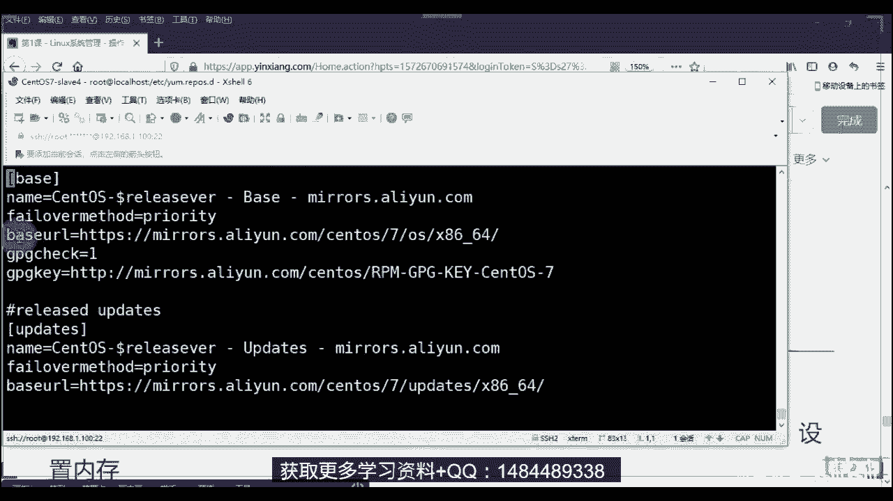
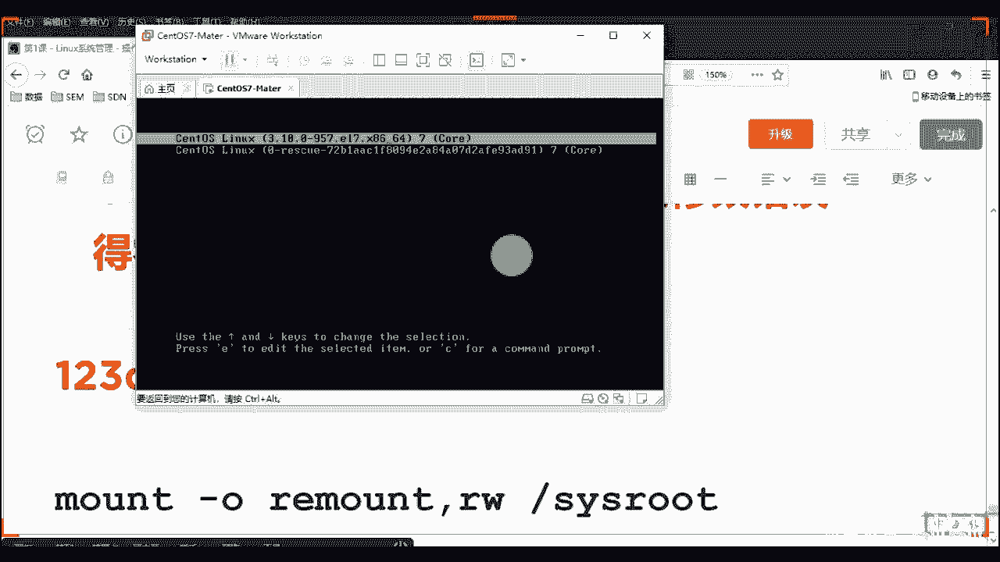

# 2020最新Linux-RHCSA入门实战课 - P2：RHCSA-第1课-Linux系统 - 新盟教育 - BV1Fg4y1z7kS

。

O。啊。用了客户端比老也好多了啊可以可以可以可以。好好好好好好好好行，简单说了啊，那我就开始了，不等他们了啊。呃，还是老规矩啊，就是上节课的话，我们lininux系统啊已经装完了，对吧？

那也就是说我们后边要学的，呃，为什么你这边没有VMnet0Mnet没有零啊啊，零的话，就是你说点开虚拟机之后，没有M0是吧？啊，我们接着说是上节课的东西还没完事了啊，就是这是你装完了之后吧。

VM的零是需要你点击这个底下更改配置来的？😊。

看一下啊。🤧嗯。哎，找到组织长，是不是要点这个更改配置，知道吧？啊，你这个地方就是你的网络适配器上是没有的，因为你网络适配器VM在0，就是你的物理网卡或者是你的无线网卡调接的，明白了吧？

那你点这个才会出来啊，然后这个地方的话，就是我们装完了之后，装了你点就reboot就结束了，这个东西就结束了，对吧？啊，就是上节课的东西。然后后边进来的之候，你就是简单的去配置一个网卡就可以去使用它了。

好不好？然后呢呃装了系统之后的话，我们需要对整个的lininux进行一个维护和管理。大家要明白，我们做运维的话。😊。

搞作运维，只是他说你在linux当中去操作，其实就是一共是三个步骤。哪三步啊？其实我在公开课也讲过，那么第一步的话叫做安装。好，第二步的话叫做什么调试。好，第三步的话叫做。🤧启动。好。

那么在这里面安装的话就是你要记的东西，就是我这个软件的安装名称，对吧？软件名称啊哦叫啥？第一个大家明白，你比如说我说我想装HTPP服务，外b服务，我的外b服务叫什么阿帕奇是吧？但是它不是软件名称的。

软件名称叫做HTTPD。😡，HPD你要装的是它。好，那么装完之后启动的时候，你要了解是服务名称。哎，叫做HVD对了啊，叫做服务名称好，你方说DSDS的话，我的副名称叫做nameD。

对吧iphone你称这两个都不难，我一条命令对吧？一条命令就搞定了。做运维的难的是第二点，我如何对一个东西进行调试。这个里面包括了说老师我安装后好，我们要启动什么功能。

I幸存功能以及我们对哪些参数啊进行所谓的这种这种这种调试啊，优化啊，对来说是优化。好。对吧优化其实是你们到后边一定要会的啊一定要会的。你比方说啊说我现在啊我就一台电脑啊，或我一台服务器。

我这个服务器呢就是做视频的好，视频出去之后的话，我得有缓存啊，我怎么缓存啊？我的硬件是固定的16G啊，我的这个CPU是固定的智强的5620。那那我怎么办？那我得通过参数明白了吧？通过参数啊。

哪些参数常用的。这以考验大家的是调试能力是构架能力，是优化能力。好进来。啊，让我们整个的复习在整个的题当中去用啊，那么我们这今天这堂课啊主要是给大家介绍是lininux的一个引导的原理啊，引导原理进来。

系统引导这是一个开机的过程，包括你启动的流程，对吧？包括我的这个目录，这个东西的话可能是在后面一堂课讲到的啊，还会讲到的是我们的呃sental7和6之间的区别啊，在管理方面和命令方面有哪些区别？蒙蒙送。

呃。有吗？嗡嗡声，因为因为这个麦的话，我已经调了。你看这个麦其实我降噪了。可以看到吧？这个麦我其实降噪了。强噪了萌萌送团的电流声。是不是是不是我不说话，他会就嗡响？😡，是吧如果我不说话的话，就会嗡嗡响。

是吧如果我不说话的话，我就会有嗡嗡响。呃，好像腾讯课堂就是这样的，如果不说话，电流声就会有嗡一直有。呃，呃，这个还好吧，我看。我看这个我把我把它增成下音质差一些是吧？腾讯课堂的话是这样的。

腾讯课堂反正比比视频的音质可能要差一点。嗯，我看一下啊。好，这样应该差不多了，这样也差不多了。来，我们接着看啊，还可以啊还可以好，呃，OK ok回去看到视频，视频应该是没有问题的啊，那我们其实接来说啊。

买一个声卡，声卡其实有的里面驱动都是最新的啊，那么我们说操作系统的一个后面我要选的东西啊，我看一下谁谁又掉了吗？是谁又掉了吗？😊，是吧这时候掉了吗？知道啊这谁要掉了。

我们看我的QQ为什么还要重新启动你一下，我也很讨厌等一下，稍等一下，我重新启动一下啊，OK。😊，🤧嗯。哎，我关了呀，那个东西啊好呃，有人掉了是吧，我看一下情况啊。收到。非常OK好，我们就着说啊就说啊。

啊，那么我们今天讲的第一个内容，其实这个东西是你们到后边的话，一定要进行呃归这个没QQ维护的稳定啊，可能吗？因为它们是两个体系，它有两个体系QQ做了多少年了，是吧？呃。

课堂才是做了这三4年课堂是做了34年，其实是啊好，那我简单说一下第一个内容啊，是操作系统的一个启动的概念和流程啊，呃，针对的是linux来说，但是拿windows做比较，好吧。

那么呃我们其实明白一个问题，大家就是你的电脑也好，还是服务器也好，甚至你家里面的任何电子设备手机随身听这些从最底层来说都是硬件，对吧？啊，甭管是CPU了，内存了，还是说这个声音卡顿太厉害了。要不行。

我们还是换回视频。学视频，那我们目前还换回去视频吧。同音课堂的话会这样子，同音课堂可能会消耗带宽会高一些，颜色会高一些。但我看还好吧。是吧那独立声卡可能会呃呃试试啊，我想想我想想怎么办啊，我想怎么办？

嗯，独立这个应该是显声卡，我应该是没有问太大的问题。我看看啊。设备管理器。都卡还是网页的卡。现在挺好的是吧？呃，你们有别别别在网页上看，你们下载个客户端。下载个客户端，好吧。我今天用着脸有关系吗？没有。

我现在不是弱点，我现在连上有连上有限了，人连上有限了。是吧嗯我连上有限了，已经。下客户端吧，下客户端网易的话有可能有问题。对吧我应该也是独立的。对吧独立的。啊，客户端应该是不卡的。行。

那我们先说着先说了，其他同学在下客户端，该下客户端下客户端啊。好吧。OK啊，那么我们说的都是硬件，甭管是CPU也好，还是内存也好，还是硬盘也好，甚至说老说我放个音卡声卡，对吧？哎，这些呢都是好。

那么我们想一个问题，就是在你想使用的时候，我要开启操作系统。那我启动之前，我其实是要对硬件进行检测的。好，然后我才能够去通过我的硬盘，或者说通过U盘，或者通过是网卡进行引导启动。😊，啊。

我拎取到一个独立麦克风可以的。后来我我找个麦克风吧。啊，那么所以大家要明白的是后边几个概念。第一个概念我相信你们是最了解它的bills，对吧？第一个我相信你们是最懂叫做bis系统。

那这个东西请你注意了啊呃全称的话叫做bas out system叫做基本输入输出系统好，它其实呢你可以把它理解成一个程序，这个可以算是我们最基础的。但是大家记住它是一种基于内存的选手啊，内存型的程序。

也就是说它是一种只读的ro进来内存型。那么它里面保存的是一些我们基本的，比方说输入输出的程序啦，系统的设置的信息啦，对吧？哎，还有像开机自检啦，甚至说大家记住了，我们后面可能还会学到。

我会为我的服务器去设置一个叫做通电自启。只要你的服务器连接电源，它会自动启动的功能，都是通过bios去设置。那么主要的功能说了是最底层为计算机提供最底层的和最直接的硬件的设置和控制。😊，啊呃。

这个应该你们都用过吧，不管是戴尔的，还是说是绘普微信的。当然不同电脑可能是用的F2F10F8F12，或者是用过delete不同的键去进入，但总应该都接触过，对吧？控制硬件。

甚至我们有的时候到后期老师我要装KVM好，我要装docker。我们要在bis当中去开启所谓的虚拟化支持。啊，循法支持这个可能会贯穿着我们整个课程啊。那么当我们ok老师，我现在要开始引导了，要开始启动了。

那启动的话，我们明白老师系统是安装在最终还是安装在硬盘里面的服务器里面，对吧？那我得知道它具体的是安装在我们哪个位置啊。因为大家明白硬盘的话，最根本是要有善区的，明白吧？是要有善区。

而扇区里边我们还会具体的划分出来一些个引导的区域。那么在这里面最最重要的一个区域叫做MBR叫做主引导记录。我给大家列列出来了啊，主引导记录。😊，好，那么硬盘在拿来之后，第一步要进行格式化啊。

格式化有两种，我现在讲到的啊拿记录，两种，一种叫做MBR，一种叫做GPTGPT一会儿我也会讲到啊，但重点的把MBR这个记下来。好，那么里边我把重点给你们画出来，只理解一个东西啊。

就是主要的功能是对我们操作系统的磁盘进行读写的时候，去判断它的分区的合法性。就是老师我把我的硬盘分成了C盘D盘是吧？那我怎么知道你分到C盘D盘呢？好，这这个记录会被记录在这个里面这个区域里面。

大家记住啊，这个区域只是记录一个大概的过程，相当一个目录一样啊，不是用于老师我存储一下我的QQQQ微信小电影，不是这意思。啊，进来。好，做一个定位。比方说老师，我想去C盘。

我想去D盘里面找到中日友好交流是吧？找到曾老师集锦。好，然后我会帮助你定位到哦，它是存在CD盘的中日文件夹里面的友好交流文件夹里面。然后你去哪找啊，一个基本信息。字节什么的，你们可以自己去看啊。

这个回来你们可以自己去看，自己去整理啊。那么核心的画出来了，大住了，是我们机器最先执行的硬盘上的程序。看啊，刚刚这个是系统的程序啊，任务程序啊，这个是硬盘上的程序。😊，啊，FD啊可以的，那是创建是吧？

那是创建分区好，大家记住它只有512字节。记住字节指的是BYTES到好了BYTES好，一个字节等于多少呢？等于1024多少？1024比特明朋学们？啊，这是哎不对说错了，等于8个比特等说错了。

等于8个比特加小。😊，啊，这两个是区别的，记住了啊，硬盘是指这个对，硬盘一般是指这个明白吧？自己啊。好，那么所以大家就说这个是不能够载入我们系统的核心的，它只能先帮你去载入一个可以加载我们的核心的程序。

好，我们称之为引导程序。就说白了我怎么去引导我的性开机硬盘啊、U盘啊，还是说P叉E明了吧？啊，那么往下走，但是下去啊。MBR它只能支持2TB以下的硬盘。大家明白了，其实在我们告诉大家说一下。

你们在后边生产环境里边，你比方说我们的还是啥戴尔的，我们经常比较经典的1个R730啊，它在你的前面只会有8块硬盘的位置。有8号里同位置。所以我们很大一定程道，当我8号又反满了，老师，我该怎么办？记住了。

开始了NSS。😡，网络问诊系统挂远程的了啊，挂远程的但是我这八块盘我不能说老师都是512兆是吧？所以一般来说一T的硬盘是最基本的。尤其是像数据库这种一T硬盘是最基本的。我后面做迁移好迁移明白了吗？

同学们啊，那么老师的两个T以上的呢？哎，太好了，你们应该也听说过叫做EFI吧，你们看看想想啊，你们在bis里面是不是有时老师我在启动时候是通过硬盘DFI这种都会有是吧？常见吧？好，这个会支持啊。

通过这个叫做这个就是我们上面说的这个GPT啊GPT2T以上的啊，两种格式啊，所以GPT叫做全局统一的唯一标识符啊，目前来说正在取代它啊，正在取代的。哎，没错好，了看没有？

所以它可以和我们一个同一叫做UEFI相辅相乘，这两个是搭配好的啊。教师搭配好的进来。好，所以这些东西你们后边再去了解，好吧，这个自己来了解。后边把这个可以给你们，这个是纯理论性的啊。好，再往下拉记住了。

进入到一个叫做grab好，grab的话，你们可能没有见过啊。看同学们，如果说老说我的lininux系统今天受损了，损坏了。😊，损坏了啊，系统崩了，镜像崩了。

那么你们一般开机之后进入的就是这个地方叫做grab，它可以帮助你去修复我们的。吧修复名啊修复名。你把硬盘拨上去，用tro书oting啊机行，然后进到这里面去啊，接来。

那么它叫做多操作系统引导程序干嘛用的？记住了，同学们，你说哎老师，我想让我的电脑多系统贮存，可以吧？哎，我既装了windows，我又装了linux。好，但是我启动的时候，我得有一个。系统吧。

我当了启动lin type的windows啊，那么此时我就要进行一个选择，那谁来帮助我提供选择的功能呢？好，bb提供原来同学们就是它来提供的。他来听吧。没白同学们？好，进来。

所以呢我们可以用在不同的内核上。老部分贝考上也可以说用于像我们这内块去传这些的参数啊传递些参数。直不过七里面啊进来升级了，叫做grab two进下来7里面叫做gb true。好，这块儿没什么可说的啊。

直播G里面的话了，可能还会再去细分一些其他的内容。你比方说这是我们过程啊，bills检测硬件硬件检测完了干嘛，我得去找到我系统在哪里，好，提去引导IMBR告诉我我系统在C盘。

当然你告诉我装在D盘里面行吗？也行啊，这盘也行。然后才能进行我们的G选择系统。windowslin对吧？再往上装内核，再往上开始我们的init的初始化程序。😊，好，往下走。大家能理解吧？

这是我们前面的三个概念啊，请给你们记下来，这是你在进行开机的时候的一些概念。那过程是什么样子呢？😡，啊，过手到了这么一个图这么一个图。啊，这么一。复制不过来是吧，还。😊，复制发到群里面吧啊。

我发到群里面了啊。发到群里面。너诶。复制。是不能发吧，这东西。行吧，这样有点bug啊，再截图吧。走，你们可以自己打开看啊，可以自己打开看。那么这个图其实说过了，就是你家电对吧？看肯定要通电嘛。

没有电子不启动啊，对吧？家电之后的话，我们要开始去到bios自检自检之后，老师我读去MBR我的系统到底放在哪个盘里面了。放到盘里面之后呢，我G去引导我的系统。

在引导的第一步记出来是要加载内核加载windows的还是linux的，加载完成之后大好了，叫做启动级别啊。那么我们说linux里边的话有几个级别，知道吧？来，大家知道linux没有几个级别。

猜一下1234567，上载打老虎是，1234567，有几个。😊，有几个级别？还有几个把答家说出来，有几个就说啊6个是吧？6个一看就是就是没把零算进去啊，一共是7个是0到6，啊进来是0到6是7个啊。啊。

0到理。这里面有人会想象到四是不用的，四是不用的对看？四是不用的。啊，好，加下来启动之后，我们才会加载内核的模块。就是这个模块其实就是一个函数功能。check一下，检测一下内核挽整性。

然后才会加载我们所谓的init程序啊，init程序，然后init运行级别最后才会读取本地的。当了，这个地方是一个我们说开机能够自己启动的一些个程序脚本。啊，往下面一个看啊，第一个加载不用说了啊。

加载去包含了硬件CPU内存这些个相关的顺序信息，对吧？包括系统时间，包括内存，你是用的DDR3代DDR4代的内存，所以们的硬盘是sas硬盘还是其他类型的IDE的老式的硬盘还是U盘是吧？等等等等。

MBR也说了啊，当好了MBR里面提一个东西啊叫做0叉7C00机址啊。大考了，它会把我们的这个扇区里面的内容复制到这个地方来。很多时候这个东西是啥是吧？这个东西是啥？你会经常在这个文献当中看到它。

尤其有说老师，我将来想做嵌入式。😡，啊，我想做嵌入式啊，霍老师，我想做硬件去是吧？硬件里面这个是个非常有名的地址，知道了？那么这个是我们第一代电脑，第一代电脑就什么8088。😊，啊。

第一代点在8088这个第一代电脑的芯片上CPU带好了。CPU我们为了兼容，就一直在用这个地址。能理解了吧？所以这个是一个兼容性的问题带来的。好，我会把它复制到我的物理内存内存条里面去。好，然后当了。

这个东西叫做bo later，叫做引导启动引导。啊，从MBR里面复出来了。然后我们开始Gb引导了啊，引导你哪个系统，然后加载内核是吧？加载内核内核的话是经常出现的。在你这个这个系统里面。

你们应该能够看到的在在在你的屏幕上。😊，啊，然后iner等级靠了。那iner等级的话注意了啊，那么它可以通过你的文件去修改我默认的开机等级。到了呃在ETC下会有1个INIT en table的文件。

但是大家注了，这个文件目前默认是在我们的spo也好，好像是红帽的6版本当中。啊，60万分当中七里面默认改了，七里面不用这个方式了，对吧？期里面不用它了啊。哎，在这，但是七里面能不能用，延续用也能。😡。

但主流上不再用它。好，那么常见的级别0到7好啦，注意了，0到7，那么0当了，零是不允许用的啊，比如说你设置成零的0和6都是不允许设置成零的。原因很简单，零是关机，老师我设置成初始化为0。

那你就不停的关机，不停的关机，不停关机了啊，你就别玩了，是吧？啊，6的话就是重启，那你设成6就不停重启，那也不行啊，对吧？所以这个东西我们是临时执行。比如说说我想关机了，我输一个int零命令。啊。

或者老师重启了int6重启一下，但不等为文件里边是不允选了。第二个说叫做单用户模式，然后了一好，那么这个是root权限。这个类似我们大家当时在叉P里面或，现在windows里面会有个安全模式。啥意思啊？

是不能够上网的，明白了吧？就是说老师我现在是一个桥时接模式，我能正常上百度，但是我设成了一，那么也是安全模式上不去网的，类似于hosse啊进紧主机模式。解答啊。

所以一般这个情况下是做我们的一些个修复功能。你比方说。我们root密码的修改。啊，很多学老师，我们root密码修改，我登录的时候，用pass word不就改了吗？是不是用password不就改了？

但是大家问题啊，如果说此时你没有登录系统呢，你刚刚接手一个服务器呢，你不知道root密码那你咋么办啊，你要进单用户模式进行调试。😡，明了吧？进行处置闭吧。第三个叫做第二个啊叫做无网络支持的这个东西啊。

用户模式呃，没有NMS网络支持。说白一个问题，就是我无法进行远程的硬盘对挂载。你自己的电脑，老师，我有8个硬盘位，那就装了8个硬盘，满了就完蛋，明白了吧？满了就完了就换，满了就换满了就换满了就换啊，这。

😡，那么对单呃也不算单机模式，就是自己硬盘。😊，啊，第三个接来啊，第三个是我们目前来说用的在用的。用F登录后的话进入命令。啊，这个可以算是最小化默认。师傅机。你最小化安装就是用ininote3。

UFS什么？就是你大家知了，我们NFS最后我们远程了使用一个硬盘或者说是U盘。我们是要经历一个东西叫做挂载，加叫做挂载。😊，很多老师什么叫挂债对吧？挂债的概念啊，对来。😊。

就是将我们的物理设备和我们某个文件夹干嘛哎取得一个联系。连接到一起。这个大家记住lindux和windows最大的区别是windows是懒人系统。为人个人系统啊，他把很多的东西集成了自己完成了。😡。

大家想想是不是你把U盘或者你把硬盘我们插在这个插头USB系手上之后，它会自动识别这个可移动磁盘啊，是不是是别专一？😡，是不是？Okay。下午到现在怎么少了7个人啊？是不是啊。它是自动识别出来的。😡，好。

它是自动识别出来的，对吧？是不是？😡，好，但问题是但问题是我linux可没有这个功能啊，我linux可没有这个功能。啥意思啊？啥意思啊？就是你挂上去之后，我没有办法可以给你识别出来一个可移动磁盘。

你是需要通过一条命令叫做mon。😡，对吧叫MO有问题，mon挂在山啊，后边加上老师，比方说我把我的硬盘啊挂载到目标文件夹。明白吧？哎，也就是说我最终访问这个文件夹就相当于访问你的硬盘了。

它也是遵循了一个东西，叫做linux下一切接文件。😡，你甭管是硬件软的，我最终都是通过文件控制你明白吗啊？这个皇上是的啊，皇上诏曰呃，都是通过文件来的。好，于是我谈好了，在这个地方的话。

当我们进行挂载的时候，其实就是把远程的硬盘挂载到我某个文件夹下。所以你有无无数个文件夹，你就可以挂无数个硬盘，明白了吧？远程的啊好，所以这个是我们默认常用的啊，第四个是未保留的模式，这个未保留。

我怎么查了一下，反正我没用过啊，反正我没用过，它说是在你的笔记本电脑的电池耗尽的时候可以切换到这个模式做一些配置，其实我也不太明白你的电池都耗尽了，都关机了，你怎么切换进去的是吧？啊。

所以第四个这些东西呢，我觉得它是个它是个假的，它现在就是没有用啊，它是没有用。😊，啊，第五个的话当好了，这个是我们安装了GY图形后默认的级别。啊，默级别啥意思啊？就是开机自动会有会有图形啊。

开机进桌面明白了吧？啊，这么一简单啊，直播过目前来说，我们用的桌面一个叫做KD，一个叫做G no啊，一个叫KD1个Gno啊。😊，好，那么此时好了，学学们，我们如果想要查询老师我的系统运行级别是什么啊？

来看这边好，我现在的话连接一下我自己的这个这个这个这个。

地址好连好了好了好了，我试一下啊。好，第一件事情改个名字叫做hose name。😊。

啊叫ho内叫什么呢？星。SU的SU叫做重新登录啊，大家了有的时候说了说我重登录，我重登了点重启，记住不需要SU就相当于重登了，明了吧？比windows好多了吧。啊，你window还真的重启是吧？好。

那么看好了，我现在想要看一下，我现在当前系统的级别叫做run level看了，run level注意前面这个N表示上一次我们修改的级别。如果是N，好，就是没有过修改，对了吧？上一次没有修改。

我现在是什么？是。😡，3、能理解吗？同学们来6串一啊来6串一。啊，当前我现在运行13%，这是上一次，这是当前的。可以看一下你的都是3。啊，多少三？老师我想改呢，那就init，对吧？init，比方说6好。

那就重启init3in5，但我没有是吧？我没有图形镜变啊，没有图形界面，所以就没有啊。😊，看到没有？当前运行的是5，然后默认前名是3，那往后再改回来，就是init3对了吧？init3。😊。

快哥改回来了吧。好。😊。

那么当我运行之后，我看到是三栏呢，我就进入最小界面吧，对吧？同学们那怎么往往下面走呢？然后去加载这个东西加载这个东西。读完运行级别，lindux系统会执行我们第一个用户层的文件。记住了。

这个就进入到系统层面了，就是真正的文件了。😊，啊，这个文件的功能说了，设置一些我的环境变量，大是？环境变量pass是非常非常重要的。很简单，你说老师为什么我这个命令能直接运行啊，对不对？为什么能命令啊？

很简单啊，是吧，因为我们所有的命令都是在这些个路径以下的。

啊，sorry啊sorry sorry sorry， dollar，写错了啊。😊，apple啊doll。啊，撇贴纸不是end啊，都是在这些路径以下分号冒号空格啊，冒号做间隔。那么？我的init也好。

rele也好，都是在这些个路径以下，我会自动去读取。这就是为什么你将来后面老师学到一些的东西，我装完了之后发现我的命令必须们用userloc n j是吧？什么SB摁 j老师，我为什么不能摁这直接开始？

😡，因为它不在这些路径下，明朋友们啊，所以你要改它啊，这是环境变量司法启动司法分区设定我们一些个pros一些个参数，包括我们的一些内核防火墙，明白了吧啊。加载完了这些个之后，就是系统最底层的。

然后再往上面看，同学们加载内核的模块啊，在内核模块。那么读取这个文件，这个就不用我说了，这一步是很快的啊，这步是很快的。😊，然后我们去启动运行的程序。说白了，到了，不同的程序在不同级别下才会运行。

你比方说图形桌面这个程序我就是在level5下才会level3就不会运行，明白了吗？那时候我怎么知道相同的这个这个我怎么知道这这个呃文件里面这个级密下有谁？看好了，在ETC下。😡。

会有一堆叫做RC开头的。😡，啊会写RC开头的，看熟悉吗？0123456看到没有？0123456熟悉吗？同学们好，老师，我想看看三啊。😊，看到这办？我想看下三，看下三啊，我用这个东西。😊，看23。

就那么两个看到了吧？😡，好吧，就那么两个老师什么意思呢？😡，老师看啊我已没记出来了，以S开头的表示我们系统即将启动的程序。😡，以K开头表示停止的服务。看看好同没S和零后面紧跟的数字为我们启动的顺序。好。

S是启动的那先启动network再启动这个再启动它明白了吧？啊，这些都是程序。😡，O开始刷一啊，我开刷一，这个可能随着你的镜像不同。老师呢我可能拥有的这种文件或底层的软件就不同了。

我可能启动东西就不同多少明白吧？多少，但是肯定会启动S的啊起来net work明白就网卡嘛？你网卡不启动，老师我怎么连上去的对吧？网卡肯定是自动启动的。😡。

啊。K的话就是停指标的，有的是好吧。🤧うふ。好，那么这是相对应的大叫，这是相对应的启动级别，然后再去读取个叫做RC local也在这呢是吧？刚才也看到这个文件了，在这儿。😊，好。

那么这个文件里下是一些给大好了。哎，这个文件是你可以自定义的，你可以自定义的。另外说老师，我还想把我们的什么阿帕奇啊？老师呢，我还想把一些个比方说我们的这个这个my circlercle。

我也想让它这个只要开机之后把它启动起来。😊，那怎么办？你把他们命令启动放到这个文件的最底层，看到没有？放到这里来。

啊放这里来。啊，这个文件我给你们看了啊，给你们看了，在这儿呢看到没？这是我刚刚看的。😊，到这里面了，但后面我们还会讲到它啊，甚至说我要是真的想要开机自启，其用这条命令叫st cTL到了叫做enable。

那叫enable，叫做开机自启。😊。

重启之哎，启动了，记得啊。😡。

好，最后一步就是执行它为什么执行它？大家注意了，be log就是你登录的那个页面，你不执行它，你怎么登录啊，对吧？只有它你才能输入用户名称面，这就是启动我们整个的叫做shop终端，大对啊？

叫笑终端启动效终端。😡，所以问题在于说是什么是sell？别着急，这个东西我们后边下节课也会讲到啊，所以买个坑对，效果是一样的，效果是一样的。啊，像是这样的。好吧，然后再往下边的话，呃。

这是我们整个启动程序。大家记住啊这十个过程这十个过程如果你记不住，请你把图记起来，好吧，听把图记起来。😊，但住了，很多情况下你去面试。很多就要你去面试，记住了有时候是画图比说话更有效。好了。

你说的怎搞效，尤其像这种老师开机自启的活动成这个这个流程了是吧？或者说我们到后面可能还会讲到一些其他的，你画图有效。比方说我们的这个阿帕企业对吧？或者说我们的LAMP。😊，好，和我们的LNMP的区别。

你画图一目了然。是吧嗯。好，当我启动完成之后，你就要明白一个问题。我们现在主流上虽然戴好了，虽然有了红帽，或者说是我们sal的八系统。😊，啊，八0多，但是这个八目测来说。

至少还得有个3年啊哈至少还要有3年才能够投入我们的生产环境。啊，那目前来说，市场上80%左右的市场啊，80%应该是我们的七覆盖啊，红帽或森透子7，只说是森透子吧。啊，s7还有15%呢是我们的sin6。

啊，sth6还有百分之这个这个这个5呢是我们的sal5啊，到后了，s5还在用，不是没有了，明白吧？记住了，企业的命脉东西在于稳定二字，不是最新两个字。带起来啊，所以你们做运维的也好，还是做什么也好。

就是尤其是学生跟你们说，尤其是学生。总是老师我这个东西更新了，我一定要更新到最新，不是这意思啊，企业是一稳定的。如果你现在系统能够完成你的企业的服务架构，你不用动它。

这就是为什么有的公司老是咱每次都没安装，还是这个CACTI叫ky啊监控它可以满足，我就不更新了，别给自己找麻烦，明白了吧？啊，目前来说就是七和8啊6和7对比啊，目就是6和7那六和7对比的话。

我们从大多数情况来看啊，我把它放到那里。😊，哪里对，稳定省钱才是王套。没错啊，别一一更新了一堆bug，对吧？大家都明白一更新绝对会面临很多的补丁bug，对不对？啊，好，往这接着看啊，往这这看。

第一个来说看了，第下来说你的启动系统知道了，启动系统。第一个叫做ss VINIT这个东西如果你想了解，你可以再去查。但是实际上来说大家记住啊，就是你们经常见到的这种杠ETC下杠INIT点D的方式去启动。

记住就是我用它。😊，7里边的兼容这种模式的同时，我用的叫做sist t的，大记吧？叫做sist的。程序它就是我们system CTTL命令，提供的就是它用它去启动，明白了吧？这是in的系统的区别。

桌面呢sdals是2。0啊，这个这个sdals7是3。0到了3。03。0比2。0好处在于是我的内核的消耗少了。啊内核的消耗少了啊，消耗少了CPU啊基本上不怎么消耗的，它主要是消耗内存。啊，3。

0更新了很多东西，当然就是好看了，但主体没变啊。那还有一个叫做KDE是吧？刚才说了叫做KDE。啊，大家有人用过乌班图吗？有人用过斑图吗？乌斑图其实就典型的是上边我有个菜单栏，包括mac系统。

我有个菜单栏。菜单栏的话呢，然后底下有些个图标，这些个都是我们的这种gomeKDE是啥的啊？用过EVE是吧？啊，可以的可以的啊，KDE是什么？记住啊KDE的话就类似我们的windows桌面。😡。

他有个什么呢？叫我开始菜单。😡，就是它在左下角有个这个东西，大家知道吧？有个这个菜单啊，就这样子了，就KDE桌面啊，linux也能装了啊。好，往下看文件系统，文件系统我们还会接着说老师什么是文件系统。

我们后面会给大家讲的啊啊，就是我们一些规则然虽然叫系统，它其实是个规则。😊，什么规则？你文件命名。厨饭的规道。你文件为什么可以用ABC，为什么可以用123，为什么不能用个用一个括号开头是吧？兄弟们。

为什么我不能用括号巴拉巴拉？😡，这个规则谁定的？好，文件系统规定的明白了吗？乐老师EST4对吧？和叉FS记住了，我们给大家写的都是字默认的6里面默认是XT47里面默认是叉S，但是7也可以用IT4。

那是区别在哪里？大家记住了，区别在于我们的最大容量。😡，什么叫最大容量？比方说VIT four可以最多，我就是16T，还16E只还是T只眼，我忘了啊。好，叉S可能是它的N多倍。

就我这一个文件夹和我这个文件系统中最多存储的单元数据内容。啊，其实ES4足够了啊ES足够了。但是你越大大家记住越大。其实当你的这个文件系统第二个作用是当你的这个系统崩溃的时候。崩溃的时候好。

我还能帮助你去收集系统碎片。但是你越大其实越不容易收集。虽然你的速度会越来越快。😡，啊，但是你越来越大，对了吧？还有收集碎便。内核版本说过了，六里边是2。67里面是3。08里边的话是4点几啊。

4点几没看到了。好，加载程序grab grabb to好吧，然后防火墙IP tables fair world大家住了。faair world目前来说没有应用于生产环境当中啊，目前来说。

faair world我们还是以IP tables为主faairwood可能用到一个叫做负规则啊负规则，但副规则极其难写。所以我们现在主流还是IP tables，明白吧？软件防火墙。

这叫做防火墙管理系统就是软件。😊，啊。数据库咋了？六里面叫my circlercle，7里面叫marradB。大家知道这俩是亲哥们儿。😡，其实就是一个人知道吧？画皮看过吧，换了张皮啊，换张皮啊。

爱恨情仇。我们后面再说再说就是就是亲爹好了，亲爹叫AB公司，把my circlecle卖给了oracle，于是乎亲爹觉得得自己养活自己啊，又基于这个的基因重新开发了一个叫marDB理解了吧？啊。

就是把大儿子卖了，小儿子还是大儿子样子，😊，好，文件目录就是这些东西自己看吧啊，文件目录这不用说了，目录嘛，后面还要详细讲主机名改的名字，就是你改名怎么改，在这儿了，怎么改，去哪里改是吧？

时间同步的方式，NTPNTPD2个命令啊，两个服务好，7里边还会多出来这种CHLN。😊，RNY命令啊程序。好，修改时间的方式对吧？呃，这几个字符，然后停止服务这个有区别，对吧？

我说了这个用的是s we好，这个是s的这个命ing提供看到没有？一个service，一个是sstem啊呃自动启动啊，这是这是开机自启这是开机自启able，这是6里面开机自啊。

然后其他的你们可以自己再看一下吧，对吧？其他这些东西可以不用再说了吧，可以吧？O创意啊，这个后面可以再去看，我们后面用到再说啊，重点是前面这几个对吧？😊，好，O然后后边的话我们配置一下啊，配置一下。

第一个来说网卡给大家配置过了，对吧？网卡给大家配置过了，所以我们就不再配置了，好吗？同学们啊，无外就是CAT你再看一下EDC下ss confi好了，n work杠 ifFP对吧？TAB可以补全啊。

这是你的东西啊，我这个用了星星是注释的星是注释的，你不用管它啊，要注释下就注释掉它，没有作用的啊。😊，能把这个目录发出来吗？这个可以发给你们，这回来给你们发过去，好吧，这个给你们发过去，一会儿，别着急。

😊。

🤧啊，好，接来看。😊，好，第二个来说大家好了，很多数老师我想去关注DNS，我想去修改DNS。

啊DS有两个位置，第一个位置呢是我的网卡，你可以看到。

好，第二个位置的话是在你的这个位置文件叫CDETC下reso。

啊，在这儿。在这儿去吧。

好，但问题在于什么？但问题在于哪里？好，同学们哎，第二个就是我们说这个文件。😊，这个文件。🤧嗯。我怎么知道我目前有几张网卡啊，很简单啊，你有几张网卡是吧？第一个来说LLEDC下s config。

你进来network杠script到了network杠script，对吧？你进来这个目录。好，显示一下显示一下，对吧？if刚开头的，你这不就一个物理网卡，一个还费网卡吗？你有几个网卡，你自己看吧。

在这里边对吧？😡，可以了吧啊，或者老是我ifconfi也可以命令对吧？啊，通过文件拖也都可以看。好，然后接来看啊来看呃，也未B为什么为什么？因为很简单好了，你if confi显示的是你启动的网卡。

如果我用的是if当这套命令，我关一个网卡了，你这边是看不出来的。明目录啊，所以一般我们都是在这里边看你有几个网卡啊，运行了用ifconfi就能看啊，然后接着说啊，第二次说过了，大家看了。

在这个目录下叫做ETC下容so的这个目录下，你看到的如果网卡打叉看得出来网卡打叉啥意思啊？😊，你说文卡打叉啥意思？啊，打叉啥意思？没懂没懂啊。注意啊，同学们。呃，网卡关闭是看不来，网卡看关闭。

只能在那个文件下看。😊，就这个文件下啊，只能在这个目录下看啊，不能那个不能在衣服confi下看。啊，看了这个目录为什么要讲？看了？这个目录里面告诉你们。

你们现在正在有的这个name部 server域名服务器。但是大家记住这个文件是根据你网卡里边配置得来的。很重要时候我修改DS，我去修改是吧？我去修改ETC杠so点comf文件。好，你会发现一后。

你发现无效。😊。

为啥无效？提住了啊，记住了，因为很简单，它是一个映射文件。啊，他不做数了。所以DS的修改只能去修改你的网卡里面的，明白了吗？😡，没有，同学们来临刷一。🤧啊起来只到消外绑卡里面的啊okK。😊，啊。

所以说一个坑说说一个小坑啊，这很多人要说我改了呀，我说你改哪了，我改这个文件了，我说你改这个文件没有用啊，是吧啊？😡，好，第二个来说的话呃，网卡里面还有什么参数要改的啊，要讲的啊。

想想啊想想还有什么参数要讲的，其他的就没有了是吧，其他就没有了，现在就么了。就是老师我想多一个是吧？DS可能有备用的，比方说老师我在DS2啊DS2等于8。8。8。8啊，做一个备份DS。😊，对啦就两个。

第三个来说的话，我们的亚么园啊亚园。😊，好，想要亚么圆的话，我就讲讲一下啊，要么圆大家知道亚么是软件仓库。啊，要的是软件仓库，啥意思啊？就是我们一堆软件的集合。好，看好了，在哪儿呢？当了。

我们一般有三种。哪三种？第一种。叫做本地的file。用fi表示。第二种用的是HTP网络的，第三种也是网络的。进来第三种也是网络叫什么呢？叫做F。啊，再这个B。FDP的话。

说白了这个这个当啊鸿贸官方就是用的FDP所入的。😡，啊，你去下什么，你去下一个镜像的，或者老是我下一个软件，都是用FTP明白了吧？啊，HTTP大多数是一些个呃一些个一些个，比如说软件的功能。好。

准制工作。啊，那是这些有什么区别它呢？本地的就是我镜像里有什么软件？😡，那镜像里有什么软件？我把它做成一个小仓库。老师，我镜像里有啥软件呢？那好了，看到了，我们用一个挂载的信息怎么挂载啊？老师。

我想挂载它的第一步，请你打开你的虚拟机。😡。

好，那我现在连接它，对不对？我要右键点击设置。和右键点击设置。好，是吧就卡一点啊。

在设置里边套了，找到你这个镜像，看到没有？镜像在这个位置上，在这个位置上，请把这个数调成勾，叫做已连接。

啊，就它已连接。好。连听到了吗？啊，把这个链接。连接完成之后点击确定了啊，点击确定了。好，然后看了什么，叫做monta。好，记住lists命令之间命令和对象之间，你和你对象之间要有个距离，距离要产生美。

明白了吧？所以必须有空格啊，必有说一个空格和三个空格，5个空格都是一样的好，DV放设备的目录下有个chme来。😊。

cityro明显的叫做光盘，对吧？朋学们，哎，这是我们的设备硬件，这就是硬件。好，干嘛呢？和我们一个叫做MNT的文件夹产生挂载。对吗？当你出现这条命令的时候。

上面选示第一个选示一个东西叫做read only啊，叫做read only的时候，挂载成功，明白了吗？一定要出现read only啊。好，挂之后到了MNT下，你就可以看到了。

看到这些是不是你镜像光盘里的东西啊，你看一下，看一下，你不信的话呢，就点开你的镜像，是吧？老说我点开镜像。😡。

啊，我双击点开镜像，看见同学们是不是一样的，看到没有？看到没有？EFI是吧？emage是吧？明白amage什么IOS这些对不对？看懂了吗？来看到刷一。😊。

啊，所以你可以在这里面去控制它啊，那这里面有个东西在哪里呢？这里面有个旁面标有个叫做package，看到没有？叫做package杠MT package。😡，看一下显示一下里面的东西，显示一下里面的东西。

看到没？对边这里边你看到一个问题是什么？这些个软件不出意外，全都是点RPM。😡，对不对？全都是RPM。😡。

所以大家记住一个问题啊，RPM是啥？好，谢了。好，进来2RPM这个是红贸软件管理。但是他是一个个。一个个。你要明白一个问题啊，linux对于整个的环境的要求是非常高的。如果我想装一个软件，好。

我的底层的环境的依赖关系是必须完整的。😡，那老师我在装一个软件后，我缺少依赖，我可能要装1个RPM缺少一个依赖，我就要装1个RPM。老师，我RPM和RPM之间形成了死循环，它是没有办法装的。😡。

这怎么办？很耗费时间或很耗费精力。好，于是乎带好了，我们开发了叫做亚么。啊，要么它就是1个RPM的集合，干嘛呢？我可以一下子。自动的去。匹配。我们的RPM和他们之间的关系。对了吧，啊，就简易版的RTM。

😡。

好，那么当我们现在老师我挂载了对吧？挂载了，挂载成功了。那我在进行亚麻inststore杠Y看到没有？亚麻安装杠Y表示确认。那我装这个软件，我得知道去哪里读取吧。我我我自己知道我在MNT里面。😊，好。

大家好了。所以此时呢你要写一个亚么源，这个源会告诉你的电脑，你安装的程序是从本地来的，它是从网上来的。那网上来的话呢，你就要有一个网上的一个固定的网址。

固定网置，到时候我怎么配置啊，好了。😡。

进到ETC下，叫做亚么点儿RPOS点D下面拿起来，先进来。😡。

接下这是ss自带的啊，这是syntos里面自带的。好，其实正常来说的话，当好了，正常来说你把它全删了。如果说我的话，我把它全删了RM杠RF啊，我把本地本当前目录下全删了。当，这个命令慎用啊。

这个命令的慎用啊啊，不过告诉你们在生产环境是禁用的好吧，生产环境是禁用的。😊。

好，记用的你用到M的命令是必须有root权限。所以你没用到。啊，内容提选速度是吧，速度还能给你好。那我删掉他说台好了，我怎么搞啊？😡，空的像空的写一个叫VI好，我随便找叫sal set点儿拿好了。😊。

必须以点RPU结尾，你要是没有点IPU是不认的。记住啊，这里边REPU结尾点IPOlinux里面其实没有后缀，但是软件源是一个特例啊。好。

接下来第一步记住了还是A还NA还是NA有个insert时候才可以。写什么好？老弟们第一步画中括号，写上，比方说s。😡，7。这个东西叫做唯一标识。啊，不等唯一标识。我这个文件里面可能写了多个亚么元。

我可能是本地的，可能是网络的那我怎么区别你们是不同的呢？我有个唯一标识，所以它是不能够重复的。😡，理解吧。啊，不用重付的。第二个内幕。😡，内蒙等于。好吧。好吗？还好吧，我这边显示还OK啊。卡巴转转。

🤧K。OK是吧？啊，可以是吧？那可能大家有的网自己的网了就是啊。好，哎，有点延迟啊，延迟是很正常的，肯定是有点延迟的。😊，好，可能那据追网吧。啊，好，我就是说啊。😊，比时看啊。好，大看。

那么呃那么内幕的话是你这个名字，这个内幕是可以重复的对吧？内幕是可以重复的。多个亚本人是可以重复的。啊，他叫sto子，你也叫sinto子，就跟你叫是吧？你叫小王，他也叫小王都一样的。知道了。

第三个算出来叫做base you。注意啊，一定没有空格，谁中边写了空格，你告诉老师，我有错，你要谁要是大家靠后面记住了。这种都叫做定义变量，谁后面定义变量给我空格了，你要是给我看到了，你问我。

老师怎么回事，我我看到你给我抄100遍，明白吗？啊，base uL后面写的fill冒号杠。😡，啊，fill冒号杠杠主要是杠杠杠杠啊杠杠好，或者说是HTTP冒号杠杠。或者的FTB。冒号刚刚是吧。

就是你选择我用哪一种方式。那老师我本地的就是fi冒号杠杠，明白吗？m杠杠后面还会跟上杠M问T就是我去哪个目录下，目录一定是以杠开头的。😡，对不对？这个地方才会有三个高啊，它不是多一高，它是两个杠。

加上1个MT的目录对吧。好，然后好了，然后下一步是我这个语文老师，我要不要启用它呀？不不请它要，所以呢还会再跟上一个参数，这个参数叫做叫什么叫做EN。ABLED。isable d有个D啊，有个D。

那么这个D这边就有问题了。好了，这个D这边就有问题了。😡，好，零和一两个点记住，一是开启。零氏即用。但是你后边可能还会发现老师零是有效，一是为什么？所以这个你就分开记，明白吗？你就分开记啊。

GPGCECK到了等于0啊，这是什么？这是对我们的。😡，对原。啊，进行检测。也是零禁用一开启老师，你为什么这边关关闭啊？为什么这边关闭？很简单，本地的一般不检一般不检查，还住本地的一般不检测。😡，好。

那么网络的检查。哎，那老师，如果我要是写了GPGCECK等于一，那你后边要再跟上你的参数叫做GPGK。😡，那这G不PK。啊，这个key是一个文件，所以你后面跟的是一个路径，明白了吧？这个文件的话。

大家会在一个网络上经常可以看到啊，这个这个回来说吧，这个这个回来给你们看一下吧，一个下载一个网络的啊，它会有的好吧，它会有的啊，是个文件，这个文件会在某个路径下，你得写出来路径，一个都是网络上的。

总是检测的，明白吧？所以我们写这物行就五行啊，五行回去反复敲敲除了它好吧，反复敲敲除了它啊，然后保存退出。😊。

好，截图。啊，就走。好吧，然后当然了，你再去挂载一下，如果你不放弃，老师，我再挂载一下多挂载不冲突啊，多载不冲突，顶多告诉你已经BZ了是吧，已经BZ了，明明白白？那此时如果你不联网。

你电脑里面有多少个镜像，你也可以是直接装的，你不联网也能装，明白了吗？但是如果你镜像里面没有的，你装不了了。😡，就么简单啊就这么简单哎，优先本地优先本地好吧，但是呢你可能说在装上，如果你的本地语源太多。

你的本地源太多可能会卡一些。那你后面还有一些命令，我们讲到软件管理的时候，会给大家详细去讲是吧？y么性面，比如yama case了，y么ba cleanan啊，这些东西有没用。😊。

后面还有讲单。所以配好了这两个就OK了。好吧，配这样就OK了。然后你还可以就是配一下你的这个这个名字，对吧？啊，配一下你的名字，什么VI下ETC下hos name对吧？hose name啊。

你可以改一下这个名字。😊。

走，改这个名字啊，说我不叫local host的那叫什么？叫做星空啊，1拜。😊。

好吧。好，这个是我们一个成本啊东西。好吧，然后呢大家可以先呃呃我们不休息了，好吧，我不休息了，我们多讲一会儿讲完了就结束了，好吧，讲完就结束了啊啊，因为后面东西不多啊，前面几堂课的东西都不多。

就比较零碎啊，所以我们就不休息了，好吧，这个后面再讲完了，估计也就是。😊。

半个多小时。有多个IPU也是也可以，没问题啊，真的是不往里面多IPU怎么了？这个这个这个这个是可以的呀。对吧我里面有多个，那就挨挨个去读嘛，没有什么优先级，没有什么优先级，它就是匹配，它就是匹配。

它是同时去读的。但是如果注意同学们啊，记住，如果说你多了，很有可能造成的是软件安装的冲突。😡。

🤧你比方说你比方说。😡，说什么呢？就是我要是装，那比方我们大家最简单，比方说N这啊是N这我要装10点叉，好吧，1点叉。那我可能需要的是一个PCRE的这个这个2点叉版本。然后呢，你另一个呢是14。叉啊。

我可能是需要PCRE的3点叉。结果呢你这个两个镜像都有，那不好意思，这两个就会干掉，明白吧？这就会冲突，它会告诉你叫做refle。😊，啊，就reflect就是冲突这个单词。好吧。

这个时候你只需要注释一个就可以了啊，你要注释一个就可以了。没事没事儿。对了吧？所以多饿的时候可能会有出动，但大多数情况下不会，明白吧？大部数情况不会，一般来说。😊，啊，一般来说我们在做的时候啊。

第一个来说，如果你是个人。😊，表是我个人用。啊，那我建议你呢就是一个本地啊，加上一个网络。啊，这个网络源我送给我给大家啊，这个网络源是我们后面还会用到的啊，在这呢看下在这呢啊，4到7的这个是阿里的啊。

阿里的算国内已经非常非常算全面的语了，明白了吧？然后你怎么办呢？看好同学们，这个地方教你们一招啊，你不是本地已装好了吗，对不对？啊，做好了。然后亚马伊斯做安装你们的第一个软件。大家记住这个软件安装之后。

千万不要在你的这个镜像里在这个虚拟机里面用虚拟里面不支持啊，叫做LRCSC现在啊，叫做LRCSC。😊。

好，发过去。

好。看到吗？这样就会有个告诉你有问题是吧？啊，erva啊erGPG check等于0啊，稍等一下。稍等下，可能是稍等。看哪里写错了啊。看一下哪里写错了啊。道错就写错了，没别的别没别东西的。😡。

看下GPGCECK没有错，我把这关了吧。我把我把我把这中文的删掉了啊，我把这中文删掉了，我怕它是那什么的字符的问题，字符串。😊，走删掉就可以了。走。行啊，这个可以了啊，中文字符的问题好，当了安装软件。

😊，你说老师我装了为什么用不了，你得看到这个东西，你看到一个complate叹号表示你安装成功明白吧？安装成功。好，安装成功之后的话好，同学们好，看了，哎，同样的你想上传到哪里？记住啊。

上传的位置就是你当前所在的位置。😡，好，我还是要进到我的ETC要么下一句明吧啊，如果你现在已经在了，就不用管它了。😡，两个字母RG啊，两个字母叫做RG不难记啊，回车看到没有？在这边s头咱上传看一下。

hello？同学们就上传上来了，明白吗？有上传就会有下载，咱们下载S级加上你要下传的下载下来的东西，我保存到桌面上去，看到了吗？哎，你比方说看到吗？桌面就有了。😊。

来能不能上意？来跟得上我的少一啊。😡，跟本上我上意。好吧，两个同西啊。在地上。OK好，那么来看一下这个好吧，我们来看一下这个啊，你没一看这个东西就就明白了啊，看就明白了看啊，上面注释不用说了，往下走。

看到没有？看到没有？JPG看到没有？baseULL这是个注释啊，这命令不管它啊啊，这是个注释。😊。

啊，这是注释啊，不是这是你来自哪的？来自网络HTP录屏了录屏了录屏了，录屏了。然后GPTcheck我要检测检测在哪啊？你还得有个路径，看到吗？在这呢，看到没有？啊，一般里面说RPM杠GPGK看到没有？

在这呢路径。😊，理解了吧啊，就这个东西没别的啊没别了，底有很多个是吧？还有更新源，还有什么额外的语，还有synths plus加啊，巴拉巴拉一大堆是吧？其实有用的就那么一两个好，宝存说就可以了啊。

你要不我网上下老师我我不用你这个我网上去下一个阿里云，你会发现一个问题，就是网上给你装的一些东西，还有问题的啊，会有问题的啊，哎，我发过去了，这是。😊。

知道知道知道。真的啊真的啊，我都会给你们的啊，跟我统一用，好吧，能用都能用啊，都能用啊，都能用。

好。啊。但网络那个如果说我们企业的话来啊，企业用什么？的企业都是本地的。企业都是本地的，他们是自建亚麻仓库。啊，自建样务操控。有人说老师，那我老师我自己他们怎么建啊，是吧？

我们自己自己做一个是做一个做一个镜像啊，大然大家明一个问题做个镜像。然后呢，我新建一个文件夹的话呢，然后我把这个文件夹这个这个软件给它拖到镜像里去，是这样子吧？😊，是这样子吗？啊，大家几个问题啊。

就是镜像的话是一个不可写的文件，所以你不可能把它拖进去。就是老师我想绑一个文件夹是吧？比方说看这边好了，哎，你说看一下，你点开你点开看一下我的电脑看明白？看到了吗？这是你的镜像，你的镜像里边写的零字节。

知道吧？零字节什么意思啊？😊，是你没有可写的空间。所以你想把你的软件直接拖进去是不可能的。😡，你有一种方式，就是我在这个位置上。😡。

我在这个位置上。啊，我把它放放进去1个RPM，这个可以这个可以啊。

这个可有对。社防就是不可以用的，是不可以用的啊，是不可用抱杨明的啊。好，一般都是自建。为什么自己演员很简单？我们后面还会学到这个cober。😡，cover的话加上那个名称。

我是可以把它放入到放进我们的把软件。放置我们的样棚户。行了，放进我们两米桶。啊，所以们用的是这个，因为大家知道呃企业的软件都是经历过二开的。二开就是二次开发对道吧？二次开发。所以呢呃根据你的这个软件。

二次开发，你要明白你下载的是软件不一定说没错啊，今天说的没错啊，其实你们俩都是一样的意思啊，都是一样的意思。就是你的二次开发的话，你网上下载出来的，除了官网外。大家说，除了播放外，你从网上下来。

任何一个软件都不太适合你的企业，明白了吧？啊，甚至有可能有后门。有后门就尴尬了是吧？啊，所以呢官网上一般呢所有的。😊，软件的官网我们会提供。提供不同的版本。啊，对于个人来说就是稳定。😡。

对于企业可能是开发。啊，开发。

尤其是我跟你们说一下啊，呃稍后再提醒我吧，对吧？哎，别别别别别别别别挑个时间是吧？挑个时间，一会儿重启了，选择选择我们选择在选择在6。6点半吧，好吧，6点半6点半啊啊，6点半。

啊，那么举个例子啊啊举个例子啊呃，我们比方说有一些个像像银行，像证券。😊，比方说国企啊，包括国企。啊，包裹去啊，我们都是红包。都是红毛钱，看明白，我不仅仅。不能够使用网络，或仅仅不能使用网络。这么好。

本地也不许建立一样长库。啊，本地是不予加压本仓库的，必须。记住这些地方都是必须RPM。啊，必须要面膜，而且这些必须是红豹官方的。如果你的红包官方没有你就尴尬了，你就只能想七折，明白了吧？

所以接这些个项目，其实它本身不难，你知道吗？难的是我这个包从哪儿来呀？😡，理解了吧啊，那是这些东西啊，二进制是不可能的，告诉你啊，红包官方不会提供什么二进制的，二进制都是我们后面来的啊，所以不可能。

知道吧？哎，因为他们真的是责任性的问题，他不怕你搞出来，他怕你搞出来之后，这些东西，后边他妈有问题，谁解决，你搞个外面软件，我找谁他是吧？后面他们也不能搞？非常严格的啊。😊，好吧。

所以这都是打报告的老师弟啊。啊，然后所以说这些东西你们可以自己去看啊，所以本样这个这个网上呢是不允许你们随便动，都是一般自己开发之后自己再加进去的啊，是这样子好吧，说那么多啊，这是仓库上。

然后往下边的话就是一这个VM的使用技巧了这个东西其实不难是吧？第一个来说是老师你可以给VM增加内存啊，那目前来说，我们默认情况下给到我们的虚拟内存多少啊，两个G是吧？同学们，那说两个G我觉得不够用的啊。

不够用的第一步就是关机是吧？内存你肯定是要关机加的，这想都不用想啊。😊。

用亚么安装下载包到哪儿？好，到了亚么的话。亚麻安装的包。你比如说网络的对吧？网络的话网络的话好，下载安装后删除。啊，安装后删除。🤧好，那我能不能存能存这个你要去控制ETC下，有一个叫做亚么。

我就是点count文件网上的文件了啊。看一下吧，一般这我们不做的啊，这一般我们都不做，知道吧？那你干嘛呢？你可以干嘛呢？因为在你用外这个这个用网络的话，会有一个外。

嗯。D还记得吗？看到过吗？你是是在安装中会有这样的选择，Y是确定安装，N是不安装，D是啥，D是download的。😡，啊，地是刚烙的。对吧下载到本地文件夹里来就可以了。当前文件夹啊。

所以一般的默认yap式下载后安装直接删掉，你也能留留的话就是改一个文件嘛，我记思是ETC下。

啊，就是靠谱中吧，对吧？在这边在哪儿呢呃。😊，QPH catch there，然后exstore limit，我要找一下。参数在哪呢？就在这儿呢？把参数，我觉得没错，是把这个改成一。啊，把2改成一。对。

还有选好选项的，好像对一就是这这个这个改成一啊，就这么多啊，就这么多。然后我们后面再说其他的。

🤧啊，这是哑巴好吧，哑巴。😊，🤧嗯。啊，为M加这个啊不用改这个看了？关闭之后改内存，这不用我说了是吧？编辑，然后选择内存，选择两个G3个G4个G5G6个G7个G都可以啊。

这都可以好吧这有点快啊内存吧我现在的是一个给两个虚拟给两个G就够了好然后重启就能用了就能用了啊。这内存第二来说的话是硬件添加这个应该不用我讲吧，吧？

这应该你们要是自己研究过这直接添加编辑虚拟机我们后期的话LVM做这个re的候硬盘的时候我们可定要添加好多块硬盘是吧？

我要添加很多块硬盘在哪啊在这加直接添加添加的里硬盘在这硬盘的话都是默认的啊都是默认的IDE的硬盘应该是s硬盘吧吧错当了记住啊。😊，是。基本上不会在你个人电脑用的CS一般都是网，就都是服务器用，是道吧？

类型。😡，啊，这硬盘类型。啊，这些东西的话我就不说了啊，这些东西我就不说了。😊，串进口就不用说了吧，冰口这俩东西根本就不用了。😡，对吧。好，然后第三个的话就是我们的一些个其他小节，就是控制权的切换啊。

控权切换其实没什么可讲的，就是ctrl加alt出来啊，点进去进去了，明白吗？啊，就是鼠标键盘嘛，对吧？所以大家看一下ctrlalt直接切换过来吧，啊左键对吧？第四个正确关机啊，到了正确关机的话。

不要像这样的，不要像我刚才那样子去关，我这样子去关好了，我我非得这样子关老师右键是吧？选择电源关闭，这种关闭，记住一个问题，就是问题，它就类似你把服务器摁住了电源前关机一样。😊。

明白吧？物理关机了，所以这个其实正常说我们不允许的，我们关机都是init0，对吧？或者power of。对吧，或者泡肉腐。

两个命令都可以啊两个命令。好，呃，然后往下走con of都可以啊。第5个快捷发送，这个没什么可说的了啊，这个你可以自己去看一下orcount out delete啊啊。

con delete交今天你们就是都是交了智商税来了，然后啊啊再往下面呃这个显示切换的，你们可以自己看一下吧，这个这个这个没有什么可说的，不就上边来下边栏嘛，这个东西对吧？你把它往上面看。

下边来就这个东西吧，对吧？没有没什么可说的。😊。

啊，然后呃VM虚拟机之间的网络。这个我刚才已经说过了，乔姐。乔奸。加上所谓的net。对吧加上所谓的我们的金主机。就这么仨啊，就这仨啊。😊，🤧咳。我说我有时候偷懒看你，有时候第二题老出问你。

强关肌是经常出问题的。如果现在还好一些，现在电脑都有热保护。啊吧，都是这个保护哪吗？问问题，给你们时间问问题。完正这堂课快讲完了是吧？感觉讲的有点快啊，底下还有充值密码，就这个东西。实验这个是个实验啊。

底下是个实验。😊，他问题。这个就是虚拟机的使用了。这个软件的使用了明白了吧？我就是怕你们后边的时候，有时候就又找不着了，你来问我，是不是先跟大家说一说。😡。

啊。好吧，宝宝吃里裤，宝宝不说，可以可以可以啊，就是这个可能是你要你要的啊，就是VM太好了，bis。😊。

bis这东西我也能设置，明白了吧？这个我也能设，知道这个怎么用吗？知道这怎么用吗？😡，好了看这个要说我怎么进bis啊，很多老师我训题没法进，不是你不能进他了啊，在这个位置好了，我把它关掉，看看。

把在这个位置好这个。😊。

如果我在开机的时候点赞看到朋友们看到这个了吗？看到这个了吗？😡，知到吧？啊，你如果按F2摁这个看到没有？点击打开电源时进入固件。😡。

啊，你自己的电脑是F2，你虚拟机的可不是F2，虚拟机得这么近。hello，同志们啊，在这里边我们一会儿还会讲到一些列参数，看到吗？bios来了吧啊，虚拟机不是不能控制bios啊，是能的啊。😊。

啊，然后再往下面的话，9个就VM2，这个我就不讲了是吧？这个VM two我们就是不用的，为啥不用，为啥不用？因为我都是拿拆售脸，谁用这个呀，是吧？谁用你这个呀，对不对？虚拟无所谓啊，对不对？对啊。

7里面的话要装这个了啊，基本装这个其实这没有用啊，这个是没有用的啊，这个。😊。

镜像我就说这个刚才说了，已连接挑上钩啊，一连接挑绳钩才能挂载啊，然后删除这个我不用说了，最重要的一个东西快照。啊，就这样一个快照。好，那么此时呢好了，我已经把网卡样么配置完成了，对吧？下一步一件事情。

右键选择快照。拍车啊拍摄拍车起个名字，随便你叫啥名都行，点击拍摄拍摄的时候看好了，拍摄的时候看好了啊，会在这个位置显示状态，你一定能百分之百之后你再打虚拟关了。😡。

其实正常来说，快照应该是在你关机的状态下去，就是在虚拟关机状态下去拍，但是我就是懒啊，我就是在他开机的时候关拍，也没事儿，明白了吧？啊，也没事。啊。因为你这样拍的话，还原之后就是这样子的啊。

比你那个还方便，是吧？你那个关机拍，你还是关机。还原照还是还是那种关机的。对啊，就这么一个事儿哈。😊，好吧。你拍完之后，比方说老师我删错了啊，你比方说不小写IM杠F。😡，行吧，同志们行吧行吧，M杠F行。

😊，啊，我全删了不好意思，老师不好意思，我全删了啊，这条命令终于使用了，是不是同志们啊，给你们看一看啊，生产环境千万别干啊，要么就该跑路了啊，你就该跑路了。好，右键选择还原快照看吧？这是你交那个快照。

我还原我这个就可以了。走走哎，看一下看一下看就回来了。看到了吗？😊。

啊，欢迎回来了啊，千万别干啊千万别干好吧，千万别干啊。说呢实要是你们在生产环境谁那么干了，那我可能就得进去看你了，然后还得带点吃的啊，待会儿宴给你。😊，啊，行，然后这个不用多说了，就是快照。

最后一个答好了。如果各位老师我想考CE。

还好生意。这道题麻溜的给我敲熟了它啊，当然这个你在生长环境里面也能用，为什么？好，那去了CSA。😡，默认的。啊，默认的第一步是要修改密码，要不然你面进去。而且到了密码修改错误，错误，你是得零分的对吧？

得零分的，所以你白考白花3000块钱。😡，啊，白花3000块钱说得零分啊，这道题一定要记住了啊，这个啊因为很简单啊，就是它不是正式题，12345不是正式题啊，但是这个是你必要改的，你不改进不去。

进不去就没法给你判题，判不了你得零分，对吧啊？😡，好，这都是命令，老师过程怎么做。好啦好了，同学们啊，好我怎么做啊，把这过了啊。好，我现在的密码是think没问题吧。同志们，我现的密码是think。好。

我现在想把密码告诉你了，改成什么呢？改成改成123O，看到没有？123O45。但是注意了，如果说你在修改的时候，老师0。😊。

和这个对吧？和这个来，你告诉我能分清吗？😡，老师，我分不清啊啊，我分不清啊怎么办？记住了，你就随便瞎改一个。😡。

为什么那么说好了，右键选择重启，你一定要重启服务器啊，重启机器别着急别着急别着急，就是进的目录不一样，就是进的目录不一样。好，将你的光标还是置在我们这个第一行。😡。

金文标志在地好。

啊，知道你好。哎，鼠标了在这儿。好，志在一行之后答家好了，敲什么了NE。😡，IEIER小ER这个ER。好，A。你进来这个模式哈，同学们，这个就是单用户模式或紧急救援模式，找什么看到吗？看看这。

这个是你熟悉的。😡。

叫UTF8。啊，统一支付执行。

好，干嘛好了，在他的身上，在他后边加一个叫做RD点break。

啊，叫做RD点break。

是就是RD边不行。啊，多打一个A是吧？

都系可。

行了，这二D怎不会搞？🤧。好，然后干什么？记住了，然后干什么叫做cl CTRL加上X同时按啊，一块按cl好，同学们conrl X。进入到真正待用模式啊，紧救援模式看到了。

好到。好，你会进到这么一个模式来。啊。稍等稍等稍等。你进哪个其实目录不重要，就是你进哪个目录不重要。但一般我们都会进sister rootot系统用户模式啊，root模式。路径。不着急啊。不着急。

正在进入。好，正在结束。这道题回去一定多敲一遍啊呃。😊，水真好听了，可以可以可以的啊。但是大家一个问题啊，就是呃一定是要悔为什么？就是你有可能真的啊就是你去对接工作的时候，这哥们提前跑路了。

这个公司的话，半半个月才招来底，你没有人跟你去对接，你的老板卖也不懂，你要是想搞是吧？你要是想搞那那你就得自己搞，知道吧？你自己做你懵逼了，你晚你咋老蒙呢。😊，你们怎么懵呢。哎，有点慢啊。啊，来不是慢。

在底下了啊，在底下了啊，我把它搭好了，用CTR啊，刚刚在底呢加上L啊，加上L蜻蜓啊，这是个蜻蜓的快捷键，好吧，就是你放拉放拉蜻屏啊哎，这就跟恢复路由器是一样的语文啊，可以可以了。好。

第一个命令不用我说了，mon它啊，就挂载是吧？梦的什么呢？杠O啊，是个只读的方式。😊，不可能你那点儿是不是打错了，一定是打错了。😡，不可能啊，一台机绝对可以启动的啊啊。

跟O靠什们更欧后边跟的是就个叫什么叫做remon重新挂载，并且逗号RW给你一个新的叫做可读可写的权限，给谁呢？给这个s rootot。😡，目录啊这个目录好，然后sH rootot切换到你的这个目录下。

😡，签到这目下，你要是给杠也行，就是我们找了一个特定的目录。😡，进到这个位置之后，开始写吧，写什么呢？写你的 password错了到了。😡，注意啊，此时pass word你要是直接回车。好。

直接说命令没关系。😡，但是它不显示。看吧，他不显释。但是你也能成功。啊，你也能成成功。大家注意，同学们，但是有一个问题大有问题。老师我想要看的更仔细一点，那咋办？很简单，好了，用pass word哈。

用ecle命令。😊，F的输出F什么呢？好，123456，你看我此时没有根据我这个去输，因为我现在不知道这个是零是O还是大写的O。😡。

对吧那我就随便给我一个密码，我先保证我能进到系统里面去，没毛病吧，同友们。😡。

好，教你们这些东西，记住啊，这个是一个考试的时候的一个一个快捷方式啊，就是确保你真的第一步能做对。好吧，然后记住用一个竖线，这个竖线就在你enter回车键上面那个按住shift按就可以了啊，叫翻滚符。

啊，叫分管图。好，作用是把我前面的结果给后边，给后边干嘛叫做password这条命令。😡，好。杠杠STDIN。那叫做杠杠SEDN。就是你不显示中文，你肯定是中文装的宝贝儿，你是不是装的中文。

是不是装的中文，中文的话，这肯定不显示在这一步，对吧内盒里面的啊啊在里面。😡，用这个东西叫做更高SDN。😡，啥意思？叫做标准输入，对吧？

STmastandard in输入STDstandard in输入输入谁呢？root记住我是给root做的。😡，我是给root改密码，老师我给别人改密码也行，但是我现在给是root。好，回车。😡。

看到没有？告诉你看一步成功吧，看到没有？一步成功吧，而且我也知道我的面码是123456，我们确保他对，对不对？确保我自己定义的是对的。😡，好，再后边一步是你要再去创建一个文件。这个文件它里面是杠点。

不是点杠啊，是杠点，叫autoreable。😡，好，这个文件是用于就业的文件。啊，就在这一步回用到叫touch空格杠点auto自动relaable校验。啊，标识好，回车创建完成。

直接退出ESITreboot。😡，看没，就这么一个过程。不可以啊不可以纯属命名啊，不可以随便命名啊。好，给你们发过来。😊。

可你发过来。好，relaable重启一下，知了重启一下。

对，隐藏文件好回说好，同学们回说此世界。😊，我改成点是123456，对吧？123456啊，金。😡。

好。考试时也怎么干？录了平台啊，录了平台啊，不用不用担心，我没有给你们录屏了啊。好，知道了。😊，不着急，重启了。啊。🤧嗯。同志们，你多喝水啊，最近的话换季了，甭管南方、北方好像最近一波流感都来了。啊。

我是我们公司第第四个第五个。啊，我们是好一个人坏一个人啊，尤其是你看谁快好了，一定远离他啊，一定远离他。我是被老康传上的，知道吧？我是被老康传上的。

好，到这一步重启啊，重启一遍两遍啊。哎，这个文件记不住入场是查文档还是强制记住，强制记住。

强支居住。很简单的是吧。除了安装。除了安装以外，看文档。其他像这个东西一定要记住啊，因为你要赶预儿的时候谁谁等你啊是吧？面试的时候谁等你啊，看啥文的。好，入ot。好，123456。好，我登录这来了。

知了，登起来之后，你就可以远程连接了啊。你考试之后会有图形页面了，明白吗？😊，也可以对init等于并方BSH也可以也可以。但那个不是为了改密码来的啊，那个不是改密码来的为了啊，然后进来之后来好了。

用另外一个路音，就是你可以连接了嘛。那我连接上去，大家直不过密码换了是吧？密码换了，稍等好，密码换了，123456好。😊。

好了，此时干嘛，此时干什么是吧，啊，叫password。😊，行哎，你还是写ele。😡。

引引号连起来，注意了。同学们，此时我不是不知道吗？你是零时O啊。好，我给你复制过来。😡。

行吧，我过你复制过来行了吧。哎，好，同样的命令是吧passo的。😡，好，杠到STDNN，然后入它。看一下，同学们又成功了，明了吗？那这样子保证你在做的时候是完全正确的。😡，OK吗O吗？得了。

就那么一个东西啊，所以告诉你们这个方法小技巧啊啊。😊，其实我们当时考试没这东西啊，我我们我们是我们当时六版本没那么难啊，没有没有这个七版本，相比较，六版本其实难了很多了。啊啊，对，考试尽量辞职。

不要手敲。啊，不要手敲，尤其是密码这个东西，因为你改不对的话，你就是零分了，钱白掏了是吧？啊，你们补考的话，一般都是按照3000块钱一科，不是说是4200一半一半的，不是的，都按000块钱一科。

我告诉你们啊，好吧，所以大家自己珍惜钱款啊，然后呢，如果你真的有钱的话，我建议你们多学点技术，咱别随别别考什么认证去啊，是吧？因为linux真的不不关心认证行，那么这个是我们的一个内容，明白了吧？好吧。

那么这是我们的今天的这是我们正式的第一课啊，算是上上那个下午那两个小时，这是预习好不好？那么这个这个这个这个这个这个这个这个菜单我给你们发过去。

啊，这个菜单我给你们发过去。哎，这个发布去是吧？就参照我会给你们发到发到啊，发到那个群里面。好吧，然后我们今天第一课呢先讲到这边啊，讲到这边我们就下课了啊。呃，前面的课我说过了。

就是前面的话前一个月的时候呃，刚才一个明理什么意思？前一个月我们可能时间都是一个半小时左右，因为确实没什么东西，我硬给你们讲两个小时吧，就就就那什么了，太难了，有时候。😊。

是的就是ele输出输出输出后把这个结果当做标准输入给入ot，明白了吧？当标准输入给入ot。C rule叫做系统登录。😡，你如要说我进我进我进杠也行，对吧？我进杠也行，这个目录是你自己选择的，明白吗？宝。

😡，啊，就这两个，一个是杠，一个是s root，是这两个。😡，会有作业啊，晚上我们还有课呢，晚上我们还有课呢，这个会是今天的一个小作业啊呃VM获取获取所有所有全德这啥东西啊，老师传视频吧，可以的。

我就传视频。一样的一样，这不这两个东西不一样的，不是一个目录，明白吧？所有大家学手linux下所有的目录都是从根开始的，都从根开始的，明白了吗？啊，看一下一个命令啊。

装一个命令叫做亚马一斯托杠Y three。😡，啊，树明了吧？晚上有课7点到9点，还有一个呢，叫吹，看一下啊。叫一个te啊，TR一啊TR一好，看看同学们，这回告诉你了，我在这一步没有找到看到没有？

在MNT啊没有找到这个te，所以呢找别人去了。😡，好，种完了，还讲c。😊，更大L一是吧？更大L一，我就显示一层，看见没有？显示一层，这是我本地的啊，这是本目录下。好，我们显示什么呢？

显示的是CD我们来到根下啊，同学们所有的都是从根下开始的，看见没？所有的都是从根下开始的。😡，好，跟下开始了，明了吗？竖状结构啊，所以都是从根开始的那个杠s，就是它底下有个size rootot的。

路径明白吧？但这里边是没有的这是是没有的，是内核里面的啊。😡，好吧，睡一下吧，那么多东西。行，我们后面还会再细讲这些东西啊，还会再细讲这些东西。包括命令什么，都会再细讲啊。

然后呢大家如果后面的话有任何问题可以群里面艾我或@我们的于峰老师啊，可能后面答一的话还是主要以于峰老师为主好吧。因为大家明天白天的话，我我们这边的话，我可能还有其他事情，好不？

然后大家如果说想让我这个月比较轻松的话啊，我这个月比较轻松的话，希望各位是吧？如果身边老师有想学的同志们介绍过来跟着我的班是吧？跟着我的班，我相信你们都学好的，大月的时间好不好啊，好吧？

给我介绍一两个学生好不好啊，就这么简单了啊，不说了，那不说了不说了不说了啊，有是我打广告了啊，公开课老师不好意思，这个毛病是吧？见缝插针的啊，行，同志们，谢谢兄弟们，谢谢兄弟们好。

那么我们把今天的课程内容讲到这么多啊，然后晚上的时候，我们还会接着说说的东西的话，是讲到了我们的命令啊，讲到命令了。基础命令呢，我总结出来比较的多啊，比较多啊，会有一个小的实验。

也会有些比较好玩的东西啊。😊。

呃，包括我们最后一个实战是防止我们的IDC断电。但这个东西其实基本上不会，这是重大事故啊啊，这晚上再说吧，这晚上再说吧，对吧？自己包括定时开机、服务器定时开机什么的啊，这我们晚上会讲到呃。

然后然后就是这些东西了，好吧啊，然后晚上我们再细说。😊，啊，你们现在身边镇的有朋友的好吗？同志们，就是我们有一个现在有个老带新的活动，跟大家说一下，你们真的别惹为我在大广告啊。好，我把录屏停掉了好。

把录屏停掉了啊，康。😊。