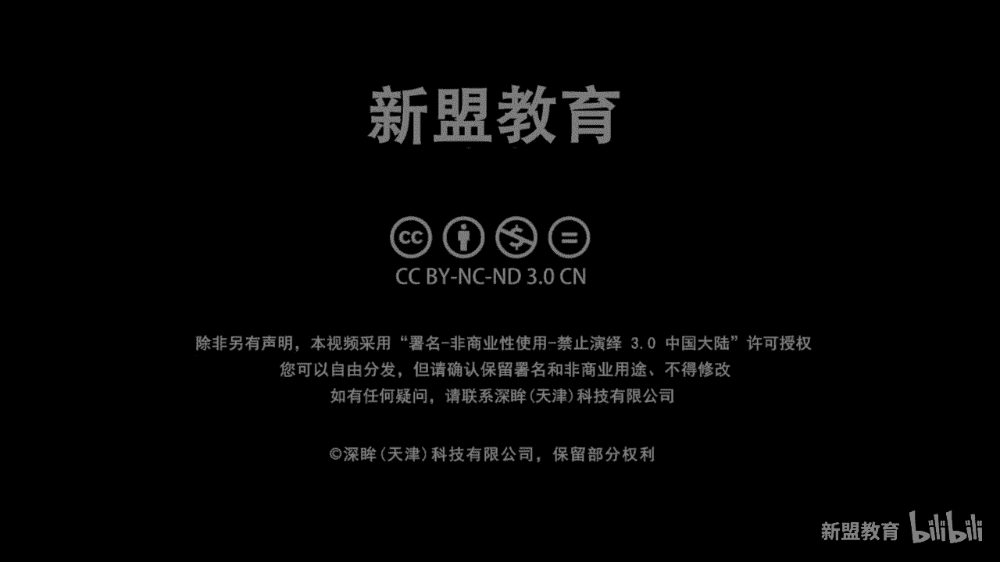
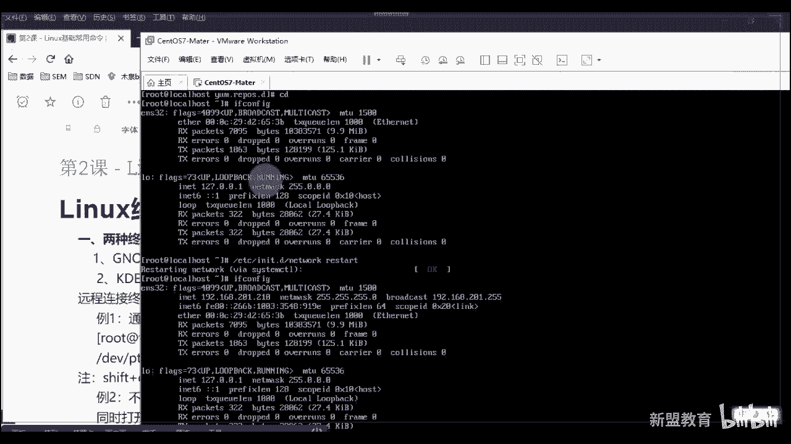
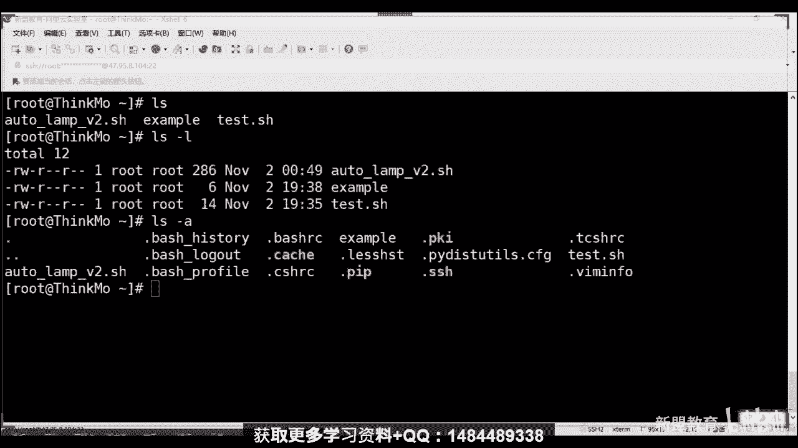
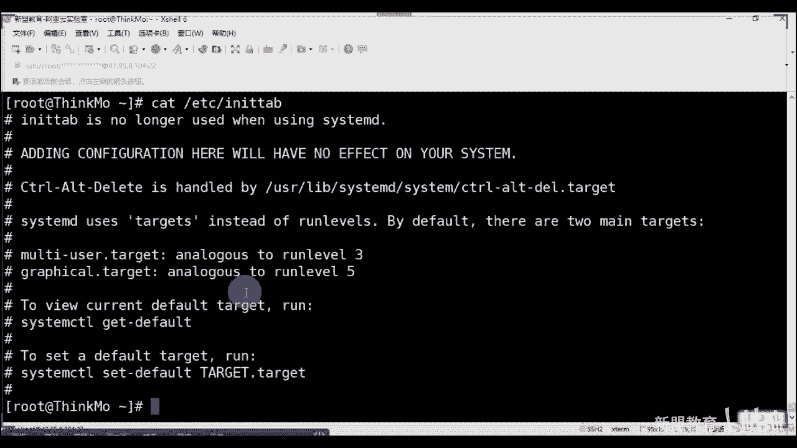

# 2020最新Linux-RHCSA入门实战课 - P3：RHCSA-第2课-Linux常用基础命令 - 新盟教育 - BV1Fg4y1z7kS

。

啊，来的也差不太多了啊。行，不等了啊。请求打扰。然后master。诶。ster看看连不上去是吧？看一下啊，稍长看一下这个地方if confi哎没有启动吗？ntwork。说的啊。That是我。

820了。我们不打了，我们开始了上课了。

嗯。稍等一下啊稍等一下啊，我看一下，我这个是调接过去的吗？还是只是用了一个。啥情况啊？桥接的对吧？桥接的这个是我们的，是我们网络没问题啊。哦。哦，我看一下啊，我切哎不能切网，还不能切网，现在。嗯。

拼一下我试啥啊，拼一下。拼不出去是吧？稍等一下，兄弟们，我改一下网好吧，我改一下网啊，我我敲个网线，我敲个网线。我来公司了，所以换了个网，所以好像有点问题啊，所以把它换一下，稍等稍等稍等啊，等开好了。

好了，然后我们再来试一下啊。这样你们应该就不会有卡的就好了啊。🤧嗯。呃，换了有线网卡，对我换有线网卡啊，换有线网卡了，可以吧，更更稳了吧，更稳了吧，不行，我就还换回来吧。啊，后来应该也能点，应该也能连。

稍等一下。我把网络给换了一下。嗯，VM上没有桥间，这就尴尬了是吧？告诉我看一眼啊，开一眼，稍等啊。退告所没有桥接是吧，当且是。receip我们的adaption啊rece adapter。

告诉我们去重置一下网卡。其也没啥。明天大家知道明天上午的话，10点还有课啊，明天上午的话还有课，好吧。哎，突然敲进了卡梅了吧。

好尴尬啊。😊，你开吧。更改一下我们是微信，稍等啊。嗯，算了吧，我不用他了。

算了吧，不跟他费尽之气了啊。呃，你们用这个就可以了，我直接拿我的鱼服器了啊。😊，啊，不跟他费解。突然乔姐怎么没了？走了。好，我们来看啊，从这堂课啊，对，明天上午10点啊，明天我肯定起得来啊。

明天课我肯定起得来啊。好，我昨天因为开睡太晚了啊。然后我们接着说啊，那么那么呃从整个我们课程这是正式讲的第二课，对吧？那么系统装好了。

然后呢再加上我们的呃也明白了一个linux的基本的流程和它的开机的等级，包括我们在重置root密码的时候，我如何去搞，对吧？那么后边这个东西我们该干嘛了？该该进行一个linux的常规的命令的讲解了。

那么这堂课讲三个点，第一个linux的终端啊，终端你域有好几种类型。第二个来说叫做我们的sell提示符。第三个是我们bu的一个基础的语法啊，大家去住目前来说我们提到bus，其实就是讲的sell。明白啊。

呃sell是什么？一会我们会说到啊，它bu这种关系会讲到那么先来看第一个关于sell终端来说，linux的终端来说，我们其实有两种终端。😊，定器啊，就是两种终端模拟器。那么第一种叫做Gno。

我们前面也说过了，是一个图形桌面啊，那么目前来说它是消耗我们的CPU比较多，内存比较少的一个选手，明白吧？啊，这也不用我说吧。但是我们说了，哎在生产环境中啊，目前来说，生产环境我们都不用。啊，都不用。

都是直接干命令，命令行操控，谁没有闲心装个是吧？装个这个这个这个图形页面啊。好，那么但是但是看了，有的人更习惯的去安装一个叫做KDE啊叫KDE那么这个consor terminal这个的东西就类似于我们windows的开始键。

我上节课其实也说过，对吧？哎，它会有一个按钮，在左下角啊，那个一般来说这个在我们的乌搬图里更常见。啊，在图的版本里面会更常见。那么除了这两个以外，我们其实不会再用其他的。但是也会有其他。

我们目前来说网上用的比较多的有十多种呢啊，但这两种是我们linux里面默认都会有的，你可以直接去装的啊，那么呃但是你在控制的时候，我们说了，你也不能说说我在IDC里面天天碰着服务器，抱着服务器是吧？

那怎么办呢？远程连接远程连接，现在网上我们会说哎大家更习惯用的CRT也好，还是说插效也好，还是putty也好啊，那CRT的话呢，可能更多的是网络工程师在用是吧？然后叉效呢可能是这个这个域维工程师。

原来很简单，就是在于网络设备的话，大家明白。啊，网络识备我们要干嘛？我们只需要通过telnet，对吧？telnet是无密码的。啊，是无码的，不需要密码，我直接连过去直接tnet就可以，对吧？

但是呃linux是有密码的，所以我要用的是SSH加密版本的tnet啊呃，再加上CRT在有的终端设，它比较卡。你比方说我们的同讯课堂。同讯课堂用CRT去讲的话，会非常卡的。所以我们这边选择是叉L啊。

但是没有区别，对吧？没有区别啊，putty的话那好了，putty的话，这个东西其实是我们很多的这个网络设备模拟器啊默认使用的，也是我们比CRT和叉ll要早的，可以说是最早的一个远程连接啊。

呃目前来说我们其实也不太用它了。因为它是没有办法一窗口多的，还是基本上都是多窗口，明白了吧？啊，多窗口啊，所以呢呃那么当你连接之后，看学们，当你连接之后啊。

你可以敲一个命令叫做TTL叫TTL那么从TTL里面看了？如果你是在自己的本地去敲。

哎，你不是在终端上去消，不是在这个插效或CRRT上去消。好，它不是显示这个它不是显示这个啊，它写的应该是DV下的TKL。😡，好，那么这个零大家记住PST0表示第一个远程连接。老师，如果我想要开启多个呢？

记住按住ctl out，看到没？ctrl shift加上一个N。好，我会开启多个终端。

啊，我摁一下它了，counttr shift n。

哎，ctture shift啊，写错了吧，cr alt啊还是ALRTalt Alt N。

好，你可以加开快速打开一个窗口。同时如果我此时再去连接，大家注意了，大家好了，这是两个老板，看没有？这是两个老板，哎，哪个？看这两个了啊。好，去例外。😊，我是显示的一看到没有？哎，显示一。

那我两个人之间啊，我还能够去相互对话，怎么对话。好了，比方说ele好hello是吧？hello。啊，hello，输出，你大家记住用大括号在我们这边叫做输出，明白了吧？叫做输出。好。

那么怎么做E体D的EV下，我向谁发呀？我向我的零发好了，我向零发。乔下可以看到吗？可以看到吧？可以看到吗？同学们可以看到吗？来看到刷一看到没有？😊，啊，这个我们一般会配合谁去做好吧。

如果你们哎老师我用个户户表是啥？户表示我看一下现在谁在线儿。啊，我看看现在谁在线，现在这哥们在线，看到没有？同志们，我有两个在线，两个人还都是ro他。😡，哎，一看就是我多个人同时登录，看多用户吧。

多人务来看到没有？那么这是两个终端，如果我这边换一个用户好了。我们创建一个用户啊，这个命令你可以先补学，后面我还会讲到。😡，我这给你看效果啊。好，我们再来看嚯来看看这边其实还是一个root啊。

因为你是直接转换过去的，转回哎，对，后面是IP啊，后面是IP明白吧？好，呃，我后面我这个没创建，后面我再说吧，直接登吧。好，你可以直接这么去发，明白吗？向另外一个人去发，进行相互的交流。

因为你要明白一个问题啊，有的时候改好了，你要进行一个服务的重启。😊，啊，服务出去，甚至我把整个服务器出去。由于你是多用户，所以有可能你在工作时候，别人也在工作，你不能耽误人家的工作，明白吗？

你不能耽误人家的工作，所以此时你只能做一件事情，就是我得通过这个方式向我们的其他人说一下。哎，你好，我要给你重启了，不耽误你吧，理解了吗？做一个相互的交流沟通，就这么简单啊，所以这是第一个好。

你要会的啊，你要会的。😡，啊，或者的话你可以通过这条命令那好了，通过这条命令叫做沃啊沃命令进行广播到所有的终端一次性去发。对，所有人不是特定人了啊，叫沃命令，好不好？啊，这个命令我就不用了啊，啊。

150都用上面这个。好，那么讲了那么多，大家记住了，甭管怎么样呢，你是用的这叫做笑，你知这些都叫笑，这些叫笑命令。啊，那问题了笑是啥两个解释，第一个解释，你去翻译吧，在百度翻译。go歌翻译。

老师叫壳是吧？贝壳啊，换什么壳都无所谓啊，总之是一个硬壳子是吧？那问题是它干嘛的，大家记住了，官方给你一个东西叫做接口定义啊什么叫接口定义，告诉我API啊，接口的话，我们也叫做API什么叫API知道吗？

这叫刷一P小刷，没关系啊。😊。

啊，只要刷一不要刷2。来。好，什么叫API举个例子啊举个例子啊，呃，你们可能在大家学网络的，或者学这个运维的服务器的，不太理解。你要是学这个编程，你肯定知道什么叫编API。叫做应用接口，叫应用接口啊。

架构干把地干好了。你比方说举个例子啊，举个例子就是大家知道就是各种哎可以边吃边那什么，各种的支付功能，你知道吗？为什么你想用这为什么我美团好，我这个这个饿了么是吧？饿了么。

甚至像我们的一些个比方说呃这个滴滴打滴滴好，我都能够直接的去调取我们的支付宝？我为什么调取支付宝？想一想我为什么要调取支付宝，想过吧？3师，这个过程是由于我们的支付宝搞了，我写好了一个功能。😡，好。

这个功能的楼我把它打成一个括儿，这个括叫做函数，叫做function。好，然后这个方格式呢我会对公去使用，就是别人谁想用可以对接我。那对接我的话，我得给你一个。东西吧，你一条命令也好，还是一个代码也好。

那对公的这个东西叫做API只要你把我这个代码或这个API写到你的代码里面去，你就可以调用我能懂了吗？这就叫接口明白学们能理白了吗？所以接口只是一个连接的工具，真正起作用的，不是它明白了，同学们啊。

所以壳也只是一个接口而已。具体东西在它里面的内核里面了啊。那么它是负责接收到命令，把它送到内核内核执行之后再去返回给你知道了？同时它也充当了一个叫做解释器翻译的过程，为啥？老师你们就翻译问问好，改好了。

你输入的命令，什么if康fi是吧？什么什么LS什么CD这些个都叫做字符串，知道吧？这些都有字符串哈，内盒的这种不认识。😡，那盒是不认识的，你再往底层走，那盒我说到是零和一都不给过，知道吧？零和1二进制。

那他们怎么办？都人翻译，谁翻译se要翻译过滤你过来翻译，然后执行的结果再给你翻译回去。明白了，同学们啊，起来。所以这是一个过程起来啊，这是一个过程。但是大家是记住了，我在执行的时候还会分分什么呢？

就是我的命令到底是零是是内部命令还是外部命令，那有什么区别？好了，你输入命令提交到sell，sell会去辨别一下。如果你是内核的内部命令。好，我们直接在内核当中调用。如果你是外部命令。

我需要找到你的命令在哪里？你比方说在某个路径下或某个服务的，我把它再调取到内核当中去。看多了一道手，表同们多一道手，那我咋分别？老师谁是内部，谁是外部，咋了？好了。😡，内部的我说了。

是常驻内存的内存大家明白吧？啊，执行效率高比硬盘明白了吗？电子型电子件、电子元件啊，外部命的是系统软件的功能。说白了就是你后期安装的。啊，类似我们的。QQ。类似QQ微信，大家家到你现在点一下。

你现在比方说老师我要启动QQ，想想是不是一点它还得去找他路径去启动啊。😡，能明白了吗？啊，就是这个情况好，那我怎么去区分？记住啊，用一条命令叫做什么来？叫做type。啊，叫做TYP。🤧咳。

下来叫做TYP这个t命。啊，那time老师我怎么知道你是你是你是这个这个这个这个我我是内部外部啊，看好了，我只需要在后头跟一个，比方说CT。当了来猜一下这个是内部还是外部密令，来猜一下，同明们。

这是表示内部还是外部密令，我再给你们一个东西，一会儿看啊，一会儿看好，猜一下CD是内部还是外部啊。哎，来马了飞啊，没事，内部外部啊。😊，外部对吧啊，外部内部命令显示什么？显示这个样子，告诉你。

我是向内嵌的。😡，build啊吧built是创建印识里面要内嵌的啊，所以PW这种显示是内核内嵌的，这种是外部的，外边装的，明白了吧？啊，没有了吗？啊，卡住了卡了吗？😊，你又卡了嗯，是我卡还是你们卡。

我肯定不卡啊，好吧，有过无归啊，开玩笑啊，好，大家起来，所以这一点是非常重要的，这一点是非常重要的。哎，带目录的就是外部的，没错啊，带目录就是买外部的啊。所以这一点啊进来太普命了啊，去进行甄别好吧。

进行甄辩，就是谁快，其实没有什么其他区别，就是看内部的就是比外部录快好了啊。😊，然后提示符这个就是一句话，到了，就看这个位置好吧。如果你此时是井号好了，同弟们，井号表示你是root用户，前面也显示了。

看到没？也是root用户。那么root是我们最高用户。

啊，系统的拥有者，这叫拥有者。就是你干啥都不行，明白了吧？你在这个情况下，你干啥都行。😡，第二种情况呢，就是我刚刚切换了一个募权，看到没有？变成了一个dollar的用户，那叫做普通用户。

那普通用户受限会受限，一些个权限。有的命令是无法执行的，因为它不够权限。然同学们后边会讲到权限啊，但是先把这两个地方记下来。

那我们可以通过一个命令叫做SU看见了。好，用于去切换我们的用户。干嘛呢？通过SU带好了，两种方式。第一种空格我也必打开。小同老师我对了是吧？空格杠再空格好，后边用户名啊，Uername。到了。

这种方式表示什么？表示的是我们把啊用户同时切换到自己的家目录。那么这边有个新的概念成了，什么叫加木乳鸡肉，就是切换到你家去了啊吧，切换到你家去了。😡，记住用户在自己家。权限最大。

自己的加母用什么表彰好了，这个就是doller方案，这个波折号这个波浪线就表示你在自己家的。😡，那是如果我忘了加杠，我就是SU是吧？然后呢空格username好的好了。😡，此时你只是切换了。用户。啊。

希望用户，但是对不起，你还在邻居家错喝呢。😡，明白吗啊，还在。😊，别人家。还在别人家，在上一个人家，刚刚是谁，明白白？所以你此时会看到的是别人的家目鲁，或者说别人当前所在的位置，理解了吗？😡，啊，起来。

所以你可以看一下，如何看了，同学们SUU看看我现在啊你现在在哪用PW显示你现在所在的位置。好，记住root用户加目录在就是root更root。好，如果此时老师SU空格目全没样了。记好了，不道线。

我也是加目录，我在哪里呢？PWD记住了，普通用户的加目录会在home下同名出现一个目录。但是好了。你还在退出，如果我只是SU目权靠，同学们看一下看一下我在哪，我在哪，我是不是在上一个人那一面的加步啊？

😡，能理解了吧？是不是在别人家呢，吃到货了。😊，理解了吗？来一穿一。啊，来临双一。ふ。好。

Okay。O。好，然后接着说啊，所以这个请你们注意啊，一般来说你们就学会这个这个是你必讳的啊，这个是你必会的。你老师底下这个我忘了就忘了无所谓啊。因为很简单，你一切可能是要切换到自己下面去吧，对吧？好。

所以这个请你们记下来啊，那么目前来说记住了，中括号里面这个不用说用户名，就是你现在是谁，你切换的用户它也会变艾做间隔服，没毛病啊。后边这地方叫做think主机名啊。

默认情况下大家都明白都叫做local post，对吧？默认叫做local host。😊。

没有什么区别，还有权限。

啊，超权限明白吧？没有什么区别了啊啊，主机名你可以自己设置用hose name对吧？然后这个位置波浪线叫做当前目录，波浪线表示当前用户的加目录，这我不说。好吧，后边井号root啊，然后这个普通用户。

这个背起来啊这背起来。好，然后后边的话进入到一个命令的讲解啊，命令并不多啊，但是你都要会啊，你都要会。当好了，这个叫做帮助命令。帮助命令其实有两个，我只介绍了一个叫做慢啊慢。但是在学之前。

我们先学一下命令的一个规则，就是我怎么写啊？那么格式就是命令加上参数加上对象啊，人家都有对象了，咱还没有呢。哎，不好意思啊，命令是啥？就是你具体要执行的，当了，命令可以单纯执行，可以加参数执行。

可以加对象执行。😊，都可以，不一定三个都都满足啊，不一定三个都满足啊。但是如果老师我想满足，那么你们之间是一定要有距离的，明白吧？距离产生美啊。负距离我就没办法了，是吧？参数的话会有很多知道吗？

那么目前参数才是。所谓的重点啊，但是记住了，过多的参数是不需要背诵的啊。你就记常见的啊常见的。那么参数的格式有两种，一种叫做长格式。你比方说杠杠help，他就说。🎼一种叫短格式叫杠H大了。

那么此时这里边记住了，杠H其实就等同于杠杠help。只不过记住，有的命令有杠H，有的命令不具备杠H，只能用杠杠help。理解了吧？或主老师，我具备杠H，但不是帮助的意思，理解了吧？就是你看具体蓝老师。

我是支持杠H杠杠hel啊，就这么简单。😡，对象这个我不用说了吧，对象我不用说了吧，同志们没有对象的话，买副棋盘吧好吧，买副象棋吧啊。😊，🤧然后对象的话，lindowux里边文件目录。😊，啊，文件目录。

用户都可以。啊，这些都可以都可以啊。好，除了他们以外的话，还有什么来着？谢谢啊。😊，呃，差不多是这些啊，然后我们来看一下慢命令啊，就是一个慢命令怎么用。好诉同学们，你可以直接输入慢啊，告诉你们。

告诉你通常的话你想知道啥呀，是吧？啊好是慢，我加上个man，啥意思？告诉同学们慢是解释就这么一句话，记住了，叫做。😊。

有困难。找男人明白了吧？有困难找男人，所以老师我不懂这个命令了，我不懂这个参数了怎么办？好，闷一下哈。好解释你进入到一个页面当中啊，你进入到一个页面当中。😊。

这个页面我想退出告诉你了，请你按H来进行帮助或者按Q退出，所以你们来Q退出。

没了吧，Q退出好，上下键你可以进行翻页，上下键你也可以用配置当vi这些东西都可以啊，都可以进行翻页，明白吧？我想在这里面查找，很简单好了，摁一个斜杠，注意摁斜杠，你比要说老师，我想插入它。😊，啊，回车。

他就给你定位出来，看到没有？😡，然后我想要上下找，我想往下一个呢，类似于windows word里面怎么做啊。好了，那么我就需要用到另外的一个参数，我把你们的呃，我没我看看你们的这啊一个参数小恩记住了。

小恩。😊。

是查找下一个。啊，大恩。是查找上一个记录。那么我用一个斜杠记住啊，斜杠加上关键词。表示是自顶向下。查阅。好，那如果老说我想自下方题上面这用问号是吧？关键词好，叫做字底向上。查越。OK吧，来。

我开始刷一啊来，我开始刷一。😊。

这不多说了，所以ro摁个小N摁小N就不停的再找摁大按上去了啊，大N怎么按按住shift按住shift明白了？就怎么啊。好，那么在这里面你可以看到非常多的一些个内容啊，你比方说了，你比方说什么呢？

O我的命令名称叫怎么是吧？命令的格式或者一些个解析给你们列出来了啊，它可以用什么参数干嘛干嘛的是吧？往下走往下走然后走一个描述我就不说了啊，描述我就不说了，然后这个例子，你可以怎么用啥啥的。

然后我们看然后这个over一个概述是吧？概述这都没有什么卵用啊，de默认的一些东西啊？你要会的是这些东西op了，你在大多数命令里面找的是option参数就是我这条命令可用啥参数老师我知忘了命令怎么用了。

看一下同学们用这看到没有你比方说这就是短格式就是这就是长格式意味着一件事情，我的慢可以把我慢的话，同学们可以。😊，半杠低。好，慢杠D就等同一个叫mon杠D杠杠Dbu呃Dbug。这是相同的意思。起来啊。

所以他有的时候是都支持，有的时候只支持一个啊，有的时候都不支持啊，就没有这参数对啊好别看。看找第八个看到没有？你看像这个的话，我就支持一个吧，对吧？看到没？这个我就支持一个吧，对吧？像这都是两个的啊啊。

就是两个的对吧？这只是一个杠啊，这也是两个对吧？这就支持一个了啊，这就支持一个了。😊，对吧啊，还是比较简单的啊。好，那么当我们把这个命令玩熟了之后，就是你后边有再多的命令，你也不怕了，就是我可以查了。

你只需要记一些个常规性的参数啊，接常规性的参数，这些才是你应该划重点的啊。好，往上看。

哪些呢？第一个来说工作长的命例，第一个叫做echo然好了。e的作用是用于打印字符或者做回写，太官方了。就一句话输入输出啊。ele好，那好了，比方说A好，此时回车输出A看到吧？啊，apple1输出1。

那是他就到了比方说ele dollar pass。😡，好，太好了。本老师为什么出出这这么多？记住啊，那么pass是我们的叫啥叫做环境变量。啊，大家来环境变量啊，就是已经预先定义好我们数值的。

叫做数值的内容，对啊，预先定好数值那种。那么请你注意啊请你注意啊。在linux里面，我们的系统变量或我们的变量啊呃。规矩啊不是硬性的，系不是系统硬性的，是我们认为硬性的啊，是都是大写字母。啊都是代字母。

那我说我想定义一个的。你比方说我想定义A等于1到了，看到没有？那我e好了，dollar唉看到没？出的是10吧，看到没有？所以这个要等于啊啊，不要空格啊啊，甚至我能做B等于20。当然好。

apple啊dollar A啊，加上dollar B。看到没有？此时就会出现一个问题，此时就会出现一个问题，什么问题啊？看到没没有？后边啊，sorry啊，到B。啊，看到没有看到没看没啊，写错了。

这没有意义啊，这没有意义啊，所以只会出现这个啊，对吧？这没你打开，看没能理解吗？能理解吗？那你说老说我想让它等于这个东西啊，怎么等于？😊，啊，一会儿再教你们回来教你们啊，这回来再教你们啊。

在我们写脚本的时候教你们啊，那么这个是 echo的作用到了。但是icle我们常用什么？就是一个写入啊呃用什么呢？用一个ca同们用这个表示覆盖这个表示追加。你比方说我现在有一个文字文件，我写一个VIt啊。

点SH当了，在这里面我输入一个，你比方说I am录权。好，那么我们去查看一下就好了，我去查看一下，我是木全了，没问题吧。好，艾le好了，我要追加一个哎，艾我。😊，是吧handon。好，我这个答好了。

两个大小叫做追加。然后你再去看当了？首先说我追加之后还是覆盖也好，我就不在这个上面直接显示了，我不在上面显示了啊，我不知道上面写sexy啊，我就不显示了。但是看朋友们，我会在文件里面看到。😡。

而且是新起一行啊，重启一行。😡，那如果此时老学们，我忘记写了。😡，好，我忘记写了一个，我忘我写了一个。或是一个到了边我也不显示，但是此时考了。好了，我只有一行了，就是我被覆盖了，明白了吧？我被覆盖掉了。

所以也注意了，注意了，这两个用的时候一定要注意啊，一定要注意，明白了，同志们来理点刷一。😡，微信。好。所以这两个一定要注意，你在用的时候，别真的就是很多情况下呢，我们习惯性的用这个，因为它快，是吧？

我不需要打开了文件了，对吧？但是就比方说哎比方说我们说这样写，叫做ASPORT，然后export，然后什么什么 kiss CONTOROL是吧？等于e好space好。

我们愿意把它呢直接的追加到ETC下到了profile里面去，这是好事儿。😊，这好事儿。后面是随便打的吧，对，这块是随便打的啊，这块是随便打的好吧？啊，我把它追加上是好事儿。

但是但是如果此时你不小心写成一个了，你把它覆盖了完，你这个系统就不好用了啊，系统就不好用了，明白了吧？好，接来。😊。

好，所以答家好了呃，这两个啊，一个是一个是覆盖，一个是瑜加啊，一个是覆盖，一个覆盖。然后这里面还有一些特殊的啊特殊的表示的黑色、白色、黑色、白色的啦，这个怎么用，这个怎么用，我教你们啊。

我教你们我这边其实写好了一个东西了，我把它上传上来，好吧，我把它上传上来。😊。

好，往上说来。好。😊，80以下打了80下。高速。啊，B是来运行脚本点SH1般是脚本。呃，说是点后面不是点后面你随意定义，但是一般脚本我们是定义点SH明吧？啊，表一本DSH好，bu是来运行脚本啊同学们。

好看吧，看好看吗？五颜六色的看到学们？啊，这五颜六色什么样子的呀？好了，看了，什么样子的，看一下同学们我是在这个位置上加上这些个东西，能理解吧？来理你传一，看到没有？我是要在这些位置上加上这些东西的。

😊。

能理解了吧。啊，加上了这些东西啊，当然这些东西我都给你们了，好吧，我都给你们了，你们自己去输入试试好吧，你们自己去输入试试啊。😊。

哎我家路色有点黄黄的啊，可以可以可以可以可以啊啊，看来都是各位司机是吧？各位司机好啊，各位司机好行，然我们接着看啊，这iphone没有太多的。😊。

🎼东西可说，就是我们可以用来创建文件老，为什么创建文件拿到了啊，比方说ele你看了，我此时目录下只有这两个文件吧，但如果写一个，比方说hello啊，我写到哪里呢？比方说写到一啊。

写到这个这个呃EXAMPRE example里面去看们写一下大家就多出来一个文件吧。CATT的时候，你再去看example的时候也会有明白吧？就是创建在添加内容一次性到位，一步到位啊，啊一步到位。

啊，这一步到位还是比较污的一个词是吧？啊，突然反应了一下啊，sorry啊，不好意思啊，我又污了。😊，看看到哪个位啊。好，那么第二个命令是在LS。😊，啊，第二个命令叫做LSL的命令做什么？

就用于显示我们当前路径下啊，当前路径下我们的文件有哪些？就是list似的意思啊啊，大家刚看到了，我选的LL是吧？LL大家知了，它等价于LS加上杠L的参数。

啊，L等于LS加0等L好，看效果，我带不出去LS。我只会显示你我当前不看有啥，是不是？😡，三个文件吧。4加上杠L是写什么？显示的好了，文件名称好，文件类型，文件的权限，文件的个数，你的属组属组。

你的大小创建时间和名字。明白吧？啊，这个东西我后面还会给你们详细介绍是什么，不用着急啊，就是它一些详细信息。😡，2次杠A好了。好同们。看啊，突然发一个电小时，哇，除了这三个怎么还有新的文件。😡，新文件。

大家记住啊，这个点儿点儿开头的表示隐藏文界。啊，游是隐藏文件你了吗？

啊。杠A可以显示的啊，起来。以我们的小点儿开头的。🎼表示隐藏问件。嗯。好，进来。那问题就来了那问题就来了。来，同志们，这俩是啥？来，这是什么？告诉我这是什么，先说这是什么，这是啥。😡。

知道吧？这俩是啥呀？啊，过来了啊。那这是啥样子嘞？这是啥哎，直接告诉这是啥？哎，这是啥这个是啥这是啥？这个是啥？这是本目录是吧？当前目录啊，这是当前目录，这是上级目录。没有同学们？点二表示当前目录。😊。

点点上级目录啊，进来啊，筛子啊，可以可以的筛子啊。好，这个这个上级目录啊，点点是上级目录大家进来啊，上级目录，一会儿你会介绍到其他的命令的时候，你会看到别着急，有我会看啊好带起来啊。那么乐老师。

为什么你LL它也和这个是相同的为啥注意了啊，往这看往这看啊，这个D你们自己看到以文件大小来排序，我就不说了啊，告诉S啊，啊，为什么因为这个里边我们有一个东西哈了，你可以看一下，通过TYP来看。😊。

等一下TIPE啥TIPE啥，看到没有？告诉你们LL是一个被命名的或被别称的，干嘛呢？叫LS杠L等于等于这个，看到没有color凹出。啊，color一个标这个这个呃颜色给个颜色啊给颜色。好，啥意思来好了？

就是我用看完啊，叫做ARIAS打好了，敲这个命令，敲一下，这是你当前系统所有被进行别称的命令。好，啥意思？你敲CP就等于敲了CP杠I，你敲LL就等于敲了L杠L杠杠color凹。能理解了吗？

能力的同学们来人上音。啊，来就可以，那你说要说我怎么取消这个啊，还有L点是吧？L点是杠D。😡，那我咋取消啊？😡，un好吧，unLL好了行好，再看再看一下。同学们，此时这个命令找不见了，看到没有？

这个命令找不见了，明白了吗？这个命令找不见了。好，来了，我然后玩个好玩的，贾老师有LS是吧？有LS了，有没有SL呢？有没有SL呢？大家知道有SL好，怎么用好了。😊。

可。搜这个。来，小火车是吧你们知道了啊，有人知道啊，EPEL知道是什么吗？这直接给我上这个说过了是吧，这个我说过了一边什么？😡，一边有什么呢？告诉我是个扩展的样板园啊，是有扩展样板园。觉得是有扩展的。

谁的？我们所谓的federal。明白，是我们federal的桌面版的linux的好，老师没有桌大点开这个。点开它，然后啊好了，然后找后就往下往下拉拉拉拉拉拉到这儿看到了？这边会告诉你。

你是7版本的那你就装态。好，看到没有？井号root下运行的，对不对？好，过来。😊。

挑战。好。不能啊，告诉你没装上是吧，哎，为啥没装上，是网不对吗？don't update是？😊，🤧嗯。再来一遍啊，再来一遍。再来一遍，哎，不行是吧？呃，CDETC亚么。点RQ。解示一下哎，sorry啊。

显示一下啊，有了，我装过了是吧，这我已经装过了。朋友们？那你装过之后，要么一做杠YSL。Go w s l。皮点够麦啊。好了，车门害死了啊。好好，安装之后再好了，好了。😊，哎，刚才听有声音呢啊，有声音吗？

可以看到吗？可以看到吗？啊，这个就是你无聊了，你自己玩一玩是吧？缓解一下啊，呜啊，开始了啊，一般的是告诉你们我们之前玩过这个事情，就是整整新人是吧？整新人干嘛呢？整新人干嘛呢？是吧，整新人干嘛是吧？

就是就这看到了，对面啊，等于这个好，哎，你给我看看这个里面有什么东西是吧？哎，是吧？为什么为什么变成这个了呢？😊，没有钢可以可以，没有钢管的差异啊，看们？理解了吗？所以就是我们要说整新人是这么搞的。

就是我把LS变成换成SL了，然后他一敲SLS显示不出来，还，就是小火车了。😊，明白了吗？所以就尴尬了这件事情啊，所以啊注意一下，好吧，要注一下啊，而且呢尽可能的当你接手一个新的服务的时候。

一定要看一下这里面有什么东西。没兄志们啊，一定要看一下有什么东西，好不好？这个我就不说了啊。😊，那我说。好，我们把它改回来LS等LL是吧？等于等于的后面运引号等起来啊，运引号等起来LS杠L。

我们要解的是杠杠。😊，卡尔。等于凹数。好，可以了吧。你啊没有飞记啊，这有小货车好不好？好，这是一个命令啊，所以这个东西还是比较好玩的了吧啊，好玩了吧。

大家知道小火车的命令一定是在我们的EPEL里面来的啊，是EPEL里面来的，明白吧？我在这边给你们写出来了吧啊，没有写出来，我在这没有写啊，好，这能看看缺了一个小结合啊。好了。😊。

好。啊，还有一个东西没说啊，就是我们在别称的时候，它有一个当前用户和全局用户，这个大家能理解吗？就是如果我是写到了这个文件下，好了，我在这个文件下去切插入去插入啊。

我只是在然后用sles当中sles表示运行。读取这个文件运行它。那我这个命令啊，我这个命令就是去编辑网卡，就一件事情，就是只在我当前用户下去可以完成。如果我换了用户就不能用了，明白了吗？明白了吧？啊。

但是全局的话是在这个里面，一个是隐藏文件，一个是非隐藏文件，能懂了吗？不白，来理解的刷一。Oh。来了一双眼。🤧这个我不做了啊这个我不做了啊。好。在下边的话呃，其实做一下也没什么，你们自己做吧，好吧。

这自己玩一下吧，好不好？啊，自己玩一下OK然后那个啊那个然后下面走CD命令CD命令切换是吧？切换这没什么可说的，就是说三个小参数。第一个来说大了，点儿这个点没有任何的意义，就是进到自己里面目录里边去。

明白了吧？没啥意义啊。😊。

点点儿是上一级。好，所以大家问你一个问题啊，上一集问大家一个问题了呃，上级父目落，稍等上级目叫父目落啊，那么我刚root的上一级是谁？

麦告总上一级是谁啊？是这样，哎是杠对吧？是根讲啊，是根大概。😊。

啊，更是一个目录啊，哎，这个可可能OK的啊，对吧？看到没？看到没有？但但是入后了，同学们，如果我再进到ETC下，比方说我们要进到sister confi是吧啊，sETC下。😊。

ETCs confiwork里面去好了script里面去，然后呢我要掉进到一个这个这个这个这个word下是吧，log下啊message下啊，log log下log下好，我还想返回上一个。

但是这哥们太长了是吧？太长了咋办？大家就要用小杠啊，减号空格杠看到没有？看到没有？看到没有？看到没有？看到没有？就是两个之间的切换了，兄弟们爱小杠好吧，小杠啊，当然你也可以用另外一个比较单的比方说啊。

比方说什么呢？叫做DRR是吧，等于啊，当然了ETC杠s。😊，杠ner大家好，这块可就没有办法进行。补啦SCRI。PTS。看吧CD dollarll点。能理解吗？用变量别朋友来理解声音。好，这没有啥意？

🤧。好，那问题就来了。老师，我们全局有多少变量？啊，有多少变量？是吧一个命例啊，这个病例我没总结叫ENV。好，命令叫做ENV全称呢不用我说了，叫做environment，对吧？什学们？

environment啊全称这个词。

大这个单词。这个单词啊好，那么所以你现在可以看到那么多了吧，看到没们，这些都是我们定义好的了，你不就是输出嘛，对吧？hose name sing对吧？

同学们shallbe spa shell historyory看到没有？看到没有？看到没有？user root对吧？看这么多这么多。😊。

啊，这么多看到没有？pass是不是这个东西，看到没有？看到没有？PW现在是谁在这儿看到吗？😊，告明白。啊，当然这些都是全局的，这都是全局的。理解啦。好，然后往下面说，所以CD就这两东西没东西啊，来慢走。

第二个kiory。😊。

那么history这边的话就有一个东西了啊。我们换个目全名字啊，这是之前打的啊，那么我们黑istory也是比较好玩一点啊。打好了。第一个来说。😊。

黑不用说历史嘛啊，这个文科好人都知道啊，这个是你登录之后记住，是你登录之后，老师如果我重登啊，大家，对不起，你就怎么样，重新登录，看到没有？很多命令被删掉了，明白吧？很多命令被删掉了。

啊，你没在瞧看呢。😊，很能命就被没有了啊，但是看老学们这个命令是显示了你之前所有的命令，看到没有？如果你觉得老师有一条比较敏感比较敏感。比方说这条命令我装了一个东西比较敏感，好干嘛呢？30对吧？30好。

history杠低好，30。🎼再着卡再卡30还有吗？还有吗？没了吧。😊，好，杠低叫做dlay它。能理解了吗？再一说一啊。大理说一好。全清空到C。看到？清空用杠C啊，清空用杠C。好，但问题是还好了。

问题是正常情况下我们不会清空它啊，不会清空它。好了，而且我们默认情况下来就说默认情况下，黑ory最多是能够记录1000条。

到时候我想让他记录更多一个事情，记住了啊，在这个位置靠了在这儿。

好，ETC加profile。里面找到叫什么嘞？叫做historysize。哎，这个Hisory side。SSE我忘了给个拼了啊，看到没没？叫做history size1000。

你把它换成234500万无所谓，明白了吧？没有最高啊，没最大好，然后记住了，那问题是老师，我觉得这个命令太多了是吧？我随便敲随便敲随便敲，我随便说啊，随便刷，随便刷，随便挑好，我觉得这条命令很敏感。😊。

但是我只要一删，比方说我黑story杠第五好，黑ory我就能够知道哦，你是删的第五条肯定第五条敏感啊，是不是？😡，是不是那我有没有什么方式我能够特殊的去隐藏吗？😡，好啦也是在这边记住。Profile。

里面。加一个什么呢？叫做ESPORT的导入导入一个叫什么叫做his control啊，CNTROL controll等于叫做ign no。😡，space到了叫ignor space。这个忽略工作啥意思？

🎼把这参鼠先啊好ss一下，知了，s运行它一下。预警了一下，好，同学们history看到了？这是个命令，对不对？现在我敲，现在我敲那我敲好，然后history好了，然后我们空格空格，看好同学们。

我干什么user and。😊，그렸어。啊，又丝勒了死刻了。好，我们再来一啊，哎写错了是吧？不好意思啊，翻错了啊。😊，🤧哎，在哪里啊？😊，免我打。🤧。我是写错了吗？

his呃hiist CONTROLEIN1个GOGO啊，写反了啊。吃饱了吃饱了。😊，GONRE是吧？GNORE哎，怎么拼来着？在这写了，这的对吧？

export his control INGORE没错吧。😊。

应该没错吧。

看一下看一下啊看一下啊。😊，可以啊。

ふふ。好。🤧Thatport。对吧然后fiCON。CON。pieceaceTROL等于一个。NORESP哎，没有问题啊。空格不。哎，好想丫，应该是在最后这个地方。sorry啊，我把这个去掉。好。

把这个把这个export去掉，露漏个T吗？😡，报露个T是吧，不好意思，不意思啊，漏个T好。这样做个题啊。🎼好，落梯是吧，重新执行一下。🤧啊，就这下漏地啊。好好了，那么此时我们在空格咋了，看一下。

这是现在迷女对吧？到这儿好了，24个，对不对？好，我空格显示一下错答案。😊，看下。我在隐藏看到没有？🤧看看好没拼错好没拼错，看不找个T啊。😊，看到没我怎么隐藏的，我多了个空格，看到没有？😊，我做了空格。

老师我再加个user single看一下吧，有吗？也没有。理解了吧？那通常说话，这个东西是我们其实在生产行这个常用的。

啊，T啊有个T啊。🤧。那要不对拜。啊，So子。ETC。PRO放好吧，接来。😊，好，那么还有一些就是快捷键，快捷键的话没什么可说的啊啊。

CT就是呃第一个来说到了p3W百度点comwindows里面拼4次自动停止，linux不停拼下去了。老师我想停ctl C结束，大就了crl C表示我们停止现在前台在运行的。😊。

还有。那有的时候我说我要拼它拼的时候，我跟个dollar大了，在命令后面加个dollar表示是我在后台运行，我在后台运行，这个只是在前面进行显示，它其实在于后台运行了，我要停止，我要按cl D它就来啊。

我按cl D看到没有？看没？我按crl D。

康D是推出了后台的，但是前台还在用，所以要出来康rC解说。能理解吧，按cr C也。哎，こ人啊。尴尬了啊，哎，sorry停掉了啊。好，能理了吧？😊，啊，这。可想同学们终止前台运行的程序。好。

这个是终止整个的程序。

行啦，cotraL不用我说了，清平嘛，对吧？8八一大堆。😡，行不行？好，cl R带住了，conr r也是搜索命令的一个东西。你比方说老师我想搜索一个，比方说VI看到没有？VI答到了没有？啊，看到没有？

看到没有？哎，VI好，摁右键向右箭头，你就能确认这个键命令明白了吧？就能确认这个命令。好起来啊。搜索命令呢还能进行上下上下搜索命令，连不明白？上下搜索命令再教你一个方式，老师还有哪种方式解来。😊，啊。

tistory对吧？好，你帮说我说，我想运行140，你可以用叹号140。看套一白色，我们是不是会切换啊？走。能理解了吧？嗯，或者到了叹号VI。他会执行你此前最近执行过的1个VI命令在哪呢？

VI命令在哪呢？这转看到？我会执行它好大哈看到了吗？

来里法医。啊，用叹号啊叹号。看到没有？执行这个执行这个看到没有？这是离得最近的啊，离得最近的。好吧。好，还有一个就是用你们的countl R去搜索，这个我就不说了啊。好，然后还有吗？还有几个参数啊啊。

这个我就不说了啊，这个是用上一个参数。你比方说到这地方好好了CT。😊。

好，CDEDCho name。咋了后手。就我查看你吧？我查看你。😡，我想要用卡来。调查这个意思是说，我引用你上一条命的最后一个对象，对象好跳条，最后一上一个命的最后一个对象谁是他对吧？所以我VI的是他。

😡，看到了吗？VIG的是他，应该是哎，小人李。😊，哎。卡了是吧？recording稍了啊，sorry啊，稍等一下稍等一下。

啊，谢谢哎，doller啊doller叹号啊，套号doller写法了，多啊。😊。

这个不常用。进来啊，重新来一遍CTETC或。VI套好到了。😊，啊，跳到了明了吗？反过来啊，反过来听明白？这就是写信了念去了，看到没有？我是不是写下一个，看到没有？😊。

然后还有吗？还有一些小的，你比方说啊CTI。加上A啊，这个是光标移动到我们的手。啊，然后呢CTL加上。小E，这个是光标一致末尾。🎼啊，末尾啊，还有吗？CTRL啊，加上W到了啊删除光标前。开个。第一个。

我们的参数。

啊，参数比方说老师我想要这样的CD是吧，CDETCs confignwork行，你发现整个东西删打错了，太长了，我这么删太麻烦了，对吧？这么删太麻烦了，可以干嘛了？看到ctrl W全没了吧？看到没有？

看到没有？同学们？ccl Actrl Ectrl WOK吗？啊，这是常常用的几个啊。😊。

好。🤧咳咳。这个我反正我们我常用的啊都已经写出来了，还有其他快捷键的，其上其他就没有了啊，其他就没有了。剩下的就是一个系统的时间啊，系统时间。然后我们先休息10分钟，好吧，先休息10分钟，我也暂停一下。

😊，啊，就是说啊。嗯。怎么实现是吧？知道知道知道就是你在这个里边加入它，明白了吗？在这个里面加入它。😊，能OK吧？O吗？熊毛在这里面去加入它就可以了。然后敲这条命令，让它重新实现一下，绑起来VI修改它。

然后你再去里面在最底下加就可以了。你在这上面加也无所谓，可以帮忙。对吧？啊，星的话就是一个重点，就告诉你不是一个重点，这是个补充，明白吧？这是个补充啊，我后面做的星就表示一个补充了啊啊啊补充点。😊。

现在家里面。告。好，还有啥问题，现在然后题我们继续了啊，环键讲完了，分讲完了。后面讲这个这个这个时间好吧，讲这个时间好，呃，对于linux来说的话呢，我们其实有两种时间。好，翻慢一下啊。

对于linux来说的话，我们其实有两种时间，一种叫做硬件时间，一种叫做系统时间。硬件的话其实不用我说啊，就是我们在bis里面去设置的，对吧？在不在？就是我bis，我们在启动的过程，别忘了。

第一步是启动bios自检，然后到了后边才会通过我们的grab去选择我们的 kernelel系统安装，没毛病。同学们，所以bis里面的系统时间和我们系统启动之后的时间，这是两个事。😊。

但是由于我的系统是在beos之后启动的，所以我当开始的时候是先去同步硬件时间，然后再独立运行，能懂吗？这个啊进来。

啊，那这俩时间怎么看是吧？硬件时间就是HW。😊，hard world啊这叫hard world啊，hard world cloud。好，回头看一下那个这是我现在的时间啊。好了，那么2号凌晨8点来钟是吧？

晚上8点PM没毛病啊，没毛病。CST这是时区啊，下T就是时区好，这是延迟多少秒？好，那么系统时间用data去查看。😊，看到没没有？时间上其实差不太多吧，应该没差多少吧，对不对？好，对了。😡。

那么你的话如果是最小化安装，很有可能你没有选择时区。所以的好了，你这边显示的不是CST。

而是什么呢？这个地方是它。你最的话可能是装的是他啊，是美国东部夏令时间差了多少时间，差了12个小时。

啊，差了12个小时。

那老师，我怎么把它调成中国标准时间，咋调？记住了，底下两个方式。😡，第一个用这个命令，但这个我们基本上不用，我说我用这个我没用过啊，反正我没用过我们一我用的是底下这个知好了，我用是底下这个干嘛呢？

把我们时区上海的copy到ETC下叫做本地时间。好，但是你copy的时候要敲一个Y啊，要敲一个Y叫做确认啊，确认然后就会变成这个了，你们可以自己试一下啊，CP是吧？

user share information，然后Ha然后上海啊，上海把它过来ETC叫做local time啊，确定友们，这是哦有了有了，然后就可以变成这个样子了。你在data再查看就可以了。😡。

好起来。好，只不过你在上面这个时间上玩date时候哈有很多种方式啊。好，同铁们。这个是让你以什么以字符的形式去显示之间，这我就不说了啊，我们很少有这么玩的啊。😡，啊，一般用一个大F表示时间完整啊。

年月日这大F参数，你可以记一下。好，当好了，这个里边你在使用的时候一定要有个加号。这个加号我请你们记下来啊，为什么？因为你后边我们用到还会用到加号啊，这是data命令的一个特殊格式。好吧。

特殊一个格式别有加号，加上百分号F显示全部。那么看好了，小Y表示年份后两位。大Y表示整体的年份就是2009是吧，2019这样子。好，我现在。啊，2019M max月份是吧。

大M分钟小D日期H呃10小时S秒，这些都是大写的啊，这中大写的。啊，美国人和中国人不太一样是吧？美国人的话喜欢把这个小东西从变大啊，把大的东西变小，明白吧？可以这个方式加上这是年月日啊年月日。啊。

也就是。你也可以设置时间，设置时间的话，用这个杠S的方式来好吧？杠S呢代表呢这个格式你可以自己去调啊。呃，杠D是以字符串，这个我们也不怎么用，好吧？告诉你看朋友们，啥意思啊？就是我加一个月。😊。

我在你现在的时间上加一个月。😡。

加一个月变成几月，他会显示的，应该是12月。😡，看到没有？12月2号加了一个月吧，啊，加一个月好。😊。

あ。杠S在哪儿呢？我把杠S上了是吧，想知道啊，小S这个是设置时间啊，这是设置间我们不用这个啊，用的是这个啊。😊。

好，data杠S是吧？以后引起来的好了，我现在是多少？是这个时间，对吧？我可以把它改成2009。😊，🎼啊，杠12月杠31号啊，330号我忘了是吧，然后12点00，12。00看到吧？这他。

啊各位。对塔嗯，加一天就改嘛，文完 day。看到没有？再先往 one day吧。对，加2天。开吧。

啊，可吧啊还是挺好玩的是吧？啊推一推反推一下，这我也不知道我蒙的是吧？我是蒙的这个对我也不知道加不加S，随便写的啊，就是你可以推一推是吧？😊，好，然后我们接着看啊，因为这确不知道啊。

我也是刚看到这个东西。今天是你们新加上的，就是这个东西，就是我给你们备课的时候，其实我也是在预习一遍，知道吧？复习一遍，预习一遍啊好，再往他们看的话就time大了，这个是用来去测试一个命令的时间。

这个没什么，这个基本上不用，我们基本上都不用这个东西，知道吧？干嘛呢？就是你time后面加上这条命令，就是你现在真正用了多长时间，用户这个状态用了多长时间，以及你的这个内核运行它读取它解析它用多长时间。

这没啥东西，可加。😊，这边啥东西可行啊，对吧？😊，拿走开关机。啊，四个命令杀档initreboot重启power off关机。好吧，这里面可讲的这个东西和这个东西对吧？杀档大记起来啊，杀档看好了。

reboot和power off这两个命令是必须root权限。😡，不水喝。啊，我则支撑不了，对吧？否支撑不了。完那杀让呢啊杀让可以定时关机哎，这是比较好玩的啊，这比较好的。好吧。

杠R重启杠H关机杠H加上时间叫做定时关机。另说老师加上时，那就10分钟之后啊，10分钟之后对啊，我记得写具体时间啊，要写具体时间闹的就是就不加了不加了，就没等于没加是吧？能理解吧？

同学们杠R什么时候时间之后啊起来。😊，这个这个我们基本不用了啊，我们就用的最多的就是这两个位点。还有这个位点init啊，init可讲一讲，就是因为这个前面期已经说过了，是吧是吧？这个已经说过了。

重点在这儿呢。😊，啊，这些这也也其实也明白了，这什么没说的，好吧，这我就pass了啊。😊，小江北到。在这儿呢在这儿呢怎么样？设置默认的运行级别。前面我说了。好，来，同学们看你们收题效果。

synths6我们默认是在哪个文件文件下，默认在哪个文件下要显示出来吧？在这呢所以呢？在这个文件下，我们会进行所谓的启动的设置，对吧？对不对啊？当然现在也有CATBDC any table。😊。

看到没也有啊也有看吗？但是现在我们要用干嘛？要用的是一个system CT这个命令是吧？要用这个命令好，怎么用呢？

🎼啊，这个表示多用户就是我们的三默认3，这表示是图形怎么用当了stem set default设置默认。但是你会说啊，你会说一个问题，老师default是吧？sstem啊。

L这个set default你可得挨个敲教大家一招啊，看好了，要么 default错杠Ybu杠complete completion。😊。

啊，把这条命令啊一定要装上，把这命令一要装上啊，会非常方便的。看好了好了。😊，这什么CT啊。到了sfttyvol啊，哎，怎么批来着？😊。

啊，叫s default啊，一定要重启一下啊SU重新登录，中完了要重新登录。

🎼重新登录它行一下。干。起来。

好，sysable CTL知道了s看到没有？devote看到没有？看到吗？同学们，它会自动补全，参数也可以啊，参数也能补全。😡，理解吗？来临即刷一啊，一个自动补全的工具，这个一个自动补全的工具。

很多老师我好多命密敲不出来，很多东西我敲不熟怎么办？教你个揽人方式，明白了吗？啊，其实我们在生产环境里面都装上它的，大家记不记续啊，好玩了吧？命令不能解写？😊。

啊，这个很多知道说我学网络的是吧？网络的时候这样写，比方说这个这个这个呃叫什么的root是吧？root哦OSPF然后你这OS100就行了。对不起，linux里面明为思啊啊，linux里面是必须命令弃全。

😊，没有接线，同时大家注意了。同时大家注意了play6之下。完全记住区分大小姐。

我学们大家好写啊啊，你说老师我写大写的好了，sorry。😡，方扣下了取掉。好了，我s思。CTL答了，这可不是命令了，这是这可不是命令了，理白了吧？啊，这不是命令了啊。必须大小写明白了吗？

大小写一定要分清楚了啊，对，错一个空格都是错，知道吧？有别名那你看嘛，对吧？这两个你们一设置就行了。好吧，原来我们你其刚我也讲过了啊，ge default老师我看了当前的这个这个默认，对不对？对。

大月亮好，其他命置的话也没什么可多说的。第一个来说PWD干嘛？😊。

🎼显示来，你们来告诉我吧，显示当前路径。

你在哪就显示哪里，对吧？劈劳之地。😡，对吧CDETC。😊，啊，ss coffeefi。对吧然后呢，PWD对吧？😊。

第二个创建目录。三路，但是大家注意做题这边有一个参数叫杠P，要记住啊，杠P是能够递归创建。

举个例子好了。😊，举个例子啊，CD好，好了MKDAR杠A没毛病吧。没有为弟们，我创建一个杠A嘛，有个A的嘛，这目录好，但问题是MKDAR老看了MKDR杠A杠B杠C杠D好，那哈出问题了。

告诉你不能创建是吧？不能创建。原因很简单，就是说目录必须是一层层创建，由于你没有B和C，所以我的D是无法创建的，明白吗？就跟你没有这个windows没响用你你点不进去，你怎么创建啊。😊，电视好了。

跟个屁，啥都解决了啊，跟个屁啥都解决了，知道吧？😊，格外吹。啊，更。P一。啊哎出来。我有没有知道？看到没有？ABC。

看到吗？啊，第一个创建好，了，下1个CP。😊，复制桂0啊复制。复制的方式很简单，CP加上圆，加上目力。圆不理从哪儿复制到哪儿，对吧？然后这里边记两个参数，第一个杠A全部。啊。

全部啊看住这个杠A不仅仅是文件文件夹，包括属性，包括属性，记住，包括属性杠R复制文件夹。递规啊，里边的东西都已经复制过了，明白吧？我们一般就是直接CP杠A了啊，CP杠A是吧？你比方说老师test。

我把它放到腕下去啊，如果我后边什么都不跟，注意了，我什么都不跟，他过来就是一个test。😊。

看到没有？这个test，但是如果说我跟上一个，比方说叫做test SHABC那好了，你再去显示它过来就被重新命名了，理解了吧啊，就被重新命名了。你可以边复制原文件，你也可以重名用它啊。

下一个M一叫做移动。

🎼啊，我居然说叫做剪切是吧？叫剪切啊，移动剪切啊，也是MV原目的。啊，第三会原目。咋用啊咋用啊，就是移走了，也可以做也可以做重命名了。啊是了好，剪贴或者呢做文件的重命名。

啊，你比方说还是本地本地当前录像，比方说我想把它改名字好吧，M凹出好，叫做AUTO。看到了吧？这是出明名更名儿，我也可以把它跟走是吧？挖下去走，本地就没了，对吧？玩下就有了。😊，这这么简单对吧。

这么简单啊，这个没你没啥说的啊，RF主要删除好吧，RM删除，这个不数了，跟F强制。😊。

干嘛递归文件里面全删，连把文件夹里面全删啊，那这里面有个东西啊L删除一个目录如何排除目录内多个呃指定的文件，这个的话你说的是我想删除这个文件里边的其他的文件是吧？除了它以外是吧？

这个还真没我还真没试过我这个还真没试过，我这还真没试过，但一般来说你可以这么写RM知了？RM比方说我想删除的是跟下边的对吧？跟下边我可以给个大括号，你方说我想删一个删一个呃MEDAA好。

逗号再删一个什么呢？再删一个删一个删一个A是吧？好了，这样子我可以删啥意思？我删了两个目录，对吧？删两个目录，大号可以表示两个扩起来多个，你知。😊。

支出谁？这个好像这个得用A，这个得用正则了，这得用正则了，我没这么干过啊，我没这么干过，其实我没这么干过，我般都是把它个别都是移出来。😊。

好吧啊，递归啊，当然这个命令啊一般来说在生产环境。后。只有我们的root可以啊，你放心，你想用都用不了，明白吧？啊，RM尤其杠RM杠RF是吧？啊，杠F好，然后杠行是吧？有人告诉你了，大家记住啊。

如果大家学过的人就不要再去外面误导别人了，啊你的不要就是大家尽可能的不要在群里面跟别人开玩笑说这些东西，其实我个人来说的话，我经常会看到这些东西，我就告诉他，你说他这话负责人嘛，对吧？

因为其实对我们来说辨识路，我可能知道是玩笑，但可能对一些小白他的人很死的人，他认为这这这些东西就是能执行的，他就敲了，然后就完蛋了，对吧？所以尽可能不要跟人开这个玩笑。😊，我不。啊，踏克。创建空建。

啊还有说快东点。

好了，他吃。啊，饭有。好，可以了，就是不赛我了。😊，再教你们一招，to是得了fi同大括号10。知道这是什么意思吗？😡，知道这什么意思吗？

知道吗？知道吗？知道了，你现在什么都路径都不跟，就是在当前目录下创建。😡，啊，记住是创建一到师。理解了吗？啊，大括号里面哎连续创建1到10啊，连续创建1到10IF跟IF我想删掉file星啊。

只要是file的都删掉，看没有？fi星星表示这意啊，那如果说我这样创建呢。😊，知道这创的什么吗？知道吗？知道吗？走来来，知道刷一不知道刷二吧。这错的什么？这啥小张，这个创建的是file一。3579是吧。

这个1到实施范围二表示跨度。二表示跨度。看到没有？13579OK吗？啊，教大家几个东西啊，包括老师我MV移动的话，我可以多个一起移动啊，我可以多个一起移动file是，但这就没有办法补全了。

一file3那这个逗号先隔移动不到两聊画上去，可以吧？看一下咱第一三没了。😊。

啊，大括号的木好吧，这大号的入头啊。😊，查看命令，这就查看不用说了啊，CDmore less cat tell这几个请你们注意了啊，都是用来查看的。那么一般来说，cat是适用于我们一些个查看。纯文本。

纯文本短文件。啊，就是一页显示的出来。啊，一页显示完的明白没？小的啊，你比方说C是吧？我刚刚我们创建test这种小的一句话，两句话三句话就这一页显示的权，明白吧？要战会给你刷屏的啊，给你刷屏的啊。

木适用于查看长文件。😊。

哎。啊，lessice长文件。3个。哎，后れ。lessice超级。好，所以问题来了，这俩的区别在哪是？这俩区别在哪来去了？木只能。😊，🎼哼往前看。啊，不能挥翻。对这个是不能回翻的。😀。🎼啊。

而 less是能前进，能后推。啊，没什么好病。

摸一下就到了摸。one下log下，这个是message啊，日志看慢看木妈么，我能往下走，但我回不去，但我回不去。

行吧？但我回不去，但是我用辣s。😡，啊，不用less什么就是呃呃呃呃我们的word下对吧？log下。message看了，我上下都能翻，明白吧？啊，具备VI什么功能呢？搜索功能对吧？你比方说root对吧？

具备搜索功能，明白了吧。😊，具备搜索了，木耳其实也能吧，木耳其实也能。啊，我也不去搜，看见没有？我也能搜，看到呢？我也不搜啊，我也能搜。😊，好吧。啊，pa的不用说了，是哎，对，都可以。

很多都放式查看我们的文件的头部。末日是十行。啊，默认是十行不用多，看到那白？杠N参数，杠N后面加个数字，这个数字是整数，这个整数表示我默认查我查看这个文件的。🎼钱。2号。没了吧，抢行啊。

跳呢那就查看文件的。😊，尾部呗是吧。美不美？啊，这个也是默认1行尾1行。不会吗？啊，但是tail有用用法啊是杠F对对。啊，叫做动态查看。打。

咱要公开查看，看好了。😊，🎼好了啊，tell杠F word下log message。好，调好了，我们再打开一个插。😊。

啊。刻好了走。😊，看到没有？看到了吗？看看到现象了吗？哎，看到现象了吗？没有再来一遍啊，再一遍。😊，看到现在了吗？来看到现在刷个一，看线的刷个一啊，就是我是动态的去查看的对吧？Q退出啊。

conr C退出。😊，行啊动态查看，这个是我们常用的啊，这是我们常用的。啊，这一定要会的，好吧，这个是你们一定要会的。好，说这么多啊，这是查看的，好吧？最后的时间我们做两个小时站啊啊。

这个实际上可能你们没有办法直接去去做啊，因为是你自己你电脑也能做，好不好？呃，第二次设置服务器来电自动开机。大呢说过了，就是IDC的防止断电。其实我说实话，我还真没有见到过IDC突然断电。

因为大家都明白，自建IDC的话，你是需要实力的是吧？这个实力记住了，你不仅仅是物理人力干嘛呢？你是要向我们的这些个有关部门去P的，电来说PD啊，我论你PD，你在哪建好，我理去P电路电缆。😊。

对吧我得去做电缆啊。电缆大家明白大家明白，你要是挖坏了电缆，我靠，你不找茬吧。😡，对吧你不找茬嘛，对吧？所以一般来说这个电缆是专线去找的，埋的还是比较深的，明白了吗？埋的比较深的。第二个来说的话。

IDC是具备UPS的。没错，备用电。😊，啊，备用电池啊备用备用电池。但是一般来说的话，你们的备用电池也不算多啊，一般就是一套可以白一套明吧？啊，一般就一套。对吧？所以呢就是呃防止这种情况吧啊，对。

两个小差不多。所以呢就是两个小时之内基本上你是能恢复的，你要恢复不了，对吧？那就完蛋了，那你就重断电之后还是重启呗，对吧？开机自启防这种情况吧啊，这个Gmbi系统，那一般说是d位的。

你的哪个我不知道了啊啊，我来看一下，其实拿训技也能搞是吧？拿训技。😊。

刚我们试过了是吧，兄弟怎么搞？选择这个地方对吧？固件。

啊，股件来看在这位是哎bios系统，这这这这bios跟它不太一样是吧？跟我这准结的啊，在这个呃在这里面会有一个地方叫做叫做这呢叫做叫做叫做叫做这个这个。😊。

叫 integrate。

怎么读忘了啊怎么读忘了，不好意思，好吧，进到这个里面来，它里面会有一个东西叫做这的。😊，啊，叫做叫做这，其中有它叫做restore on a power lights，默认是power off。

把它改成power on啊，power onlast data是还原到上一次机器的关机的时候样子。行，关键是什么样子。我看一下讯集里面有没有啊呃。😊。

看下这有没有po是吧，一英开头的有吗？找一下找一下找一下，这里面好像没有是吧？这个里面好像没有。来看一下吧。啊，这里面没有？这里面没有啊，好了，这个不说了啊，这没有，那就算了吧。😊。

你可以拿自己的电脑回去试一试啊，好不好？这个东西就改一下了，好不好啊，断电之前的状态。😊，啊，这个你可以给以自己设置附G自行式开机是吧？你比为哎这个是咱们可以搞的，在这个上面再学习一下，再来一遍啊啊。

在power manager里面了啊在power manager里面了啊。😊。

走。power manager对吧？ manager set up里面的话，你去找到这个叫做wake up，对吧？wake up里面的，你去选择时间，定好了时间再在这个地方叫做RTC看到吗？

alar闹钟啊，调时间，然后就可以了，保存出，明白吗？我看这个有没有power，我靠这也没有是吧？😊。

哦，这也没有。啊，没有就没有了吧啊。可以的。可以。一般电脑也是可以的，但是这个东西的话，你们这上我这上没有是吧？我就不给你们重开了。重开的话，你们咱们就断线了啊，行吧？

你们可以自己看一下自己的电脑其是可以的，好吧？好吧啊，但是一般说你在服务器里面是一定要做这一步的，服务器里面一定是要做这一步的啊，不是说老师这个东西不常见我就不做了，不是的，是必须要做的，好不好？

所以这个东西请各位搞定它啊，请各位搞定它，好吧？那么这个是我们今天三堂课的内容啊，三堂内容，明天的课程我们还会接着上，明天的笔记我还没导还没复制过来呢啊，明天的笔记我还没复制过来的啊，好吧。

来有什么问题吗？😊。

Thank。来，后面申请大家提问题。🤧好，前段课的时间不有太长，后面的时间的话你明白了，明天上午10点了，明天我起得来啊，明天我起得来，好吧，来，还好还有什么问题。😊，Right。好好。

我把这个录屏停掉了啊。😊。

