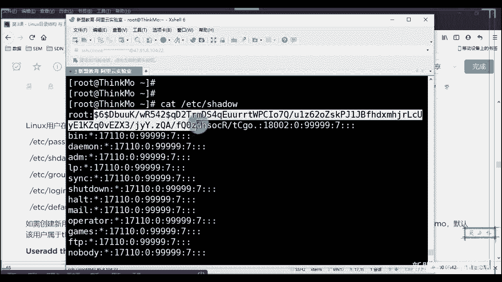
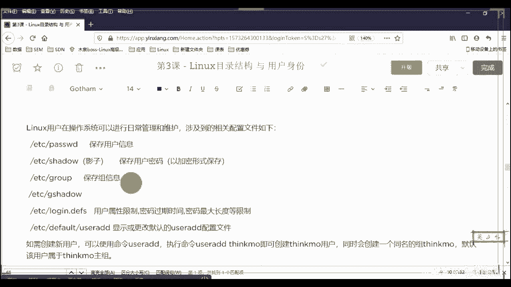

# 2020最新Linux-RHCSA入门实战课 - P4：RHCSA-第3课-linux目录结构与用户身份 - 新盟教育 - BV1Fg4y1z7kS

。

说了啊，开始上课了，就是上节课的话我们讲了几个东西啊，第一个来说linux市啥。😊，第二来说的话，我们的一个基础命令。第三的话我们讲什么？讲的是一个呃关于linux系统的一个启动的过程，对吧？

但IG的启动过程的话，我们分为了7个步骤，对不对？呃？你们的作业我看了，但是有一部分人啊有那么十来个人是晚交给我的啊，昨天半夜交给我的，所以我还没有看完，这个的话我看完了之后我会集体大家去讲，好吧啊。

所以现在的话我们先注意今天这堂课。这堂课讲的是关于整个叫做linux的目录结构和他的用户的身份。说一下一个问题啊，就是呃我们。😊，我需要外置网卡是吧？啊，比较可以的可以的可以的，然，后面买一下。

我后买一个好吧，然后一会我找他们先拿一个新的麦去，因为我这个麦好像可能是麦出问题了啊，行吧，先忍一下。😊，好，没关系啊。那么。😊，我们还是拿windows去做对比。

单端的windows有一个地方是我可以通过所谓的磁盘的盘符去进行。哎，我的文件的存储，对不对啊？你说的就是这什么叫盘符啊，就是C盘D盘E盘F盘。那传统上来讲的话，我们会将系统放在所谓的C盘里面进行对吧？

存储，然后C盘的话，一般会干嘛？我们会进行SSP叫做固态硬盘啊，除了装系统以外，下一个就是装我们所谓的虚拟机啊，那其他的内容像应用啊，对吧？像我们的这个这个这个呃游戏了。

我可能会放盘D盘里面或放在E盘里面，这些机械盘里面。那一般来说大家就了windows其实并不是说老师我没有分区的要求啊，不是的啊拉家进来windows呢我们一般来说是一般是两套三个区进来。啊。

是2到3个区。正常来说，除了C牌以外，你最多画个D和E不要再多了啊，正常管理上来说不要再多了，明白了吧？啊，那么le里面是没有所谓的CDE。sorry啊，啰嗦的CDE判的。😡，它是无盘付概念。

所以都是从一个刚开始接来。啊，从这个根开始，我们把它叫什么叫做斗状竖结构。😡，来啊，叫做逗种数，那竖答是明白，老师，我的根在下边，然后上边小船树盖，然后上面都是叉，对吧？好，那les是倒过来。

大家注意了，什么样子？是我所有的内容都是从根开始，它下游会跟上我的叫做一级目录。一级目录下面会有我的二级的子目录，注意了，那么不同的目录其实有不同的要求，但是遵循几个原则。第一个来说，大家记住。啊。

无论我们将来学的各种服务软件，还是说老师我想加一些个硬盘啊，我想加一些个U盘，还是我要加一些个其他的anything啊。硬盘硬件还是软件来说，它都是文件，最终我都会通过文件的形式给你展示出来。明白了吧。

好，第二个来说的，哎，这也就是我们所说的linux下一切接文件，请你把这句话记牢了。啊，把这话记牢了。第二段说的话是我的所有的内容都是从根开始。但是请你注意同学们。😡，区分大小写啊。

区分大小写lininux里面下严格区分大小写，理解了吧？并且记住了我们所有的目录开始都是以跟开始。那么时我会发现有的时候我们在CD的时候，对吧？我们讲了CD是切换目录，我可以直接去写什么呢？

比方说募群杠是吧，目群杠linux。😊，好，大家知了，那这我为什么可以这么去写？大家知道为什么是我在当前的目录下进入我当前目录里边的募权，这个目录理解了吧？啊进来啊。😡，好，块是输出输入嘛？对。

块一般指的就是你的硬盘设备，明白吧？硬盘硬盘是块嘛？我们说block啊哎。波道线是不道甚至你的家目不一定是home，别着急啊，不一定是啊。别着急，一会儿会讲到请求啊会讲到。😊，具体来看一些个重点的目录。

好吧，第一个重点目录。我们说了，在你分区的时候，你至少要分三个区，第一个是根分区，对吧？同学们根分区其实就是对我们所谓的设备ETCho并这些个分区的存储啊，分区存储。第二个来说叫做boot分区。

我说过了，这里边存放的是一些你的引导项开机引导下。所谓的比方说像我们的内核，带好了，叫做VM le好了，叫VM这是内核文件。😊，好，接下来。第二个叫做初始化IITRD。点MSV。进来啊呃天D啊，好。

接下来，这是我的初始化文件。😊，起了，那么需要啊我说的所有东西其都要I机啊。😊，这两个我请各位记起来，原因很简单，是在于大家记住了，甭管是你linux还是你的windows，其实它都有。

并且并且它会在我们后边学到这个P叉E所谓最简单的一个自动化，叫无人值守里面具备相。😊，对应的作用。啊，再来。就是你在装系统之前，你是一定要有这两个的，理解了吧？好，下一个。好，下一个叫做DEV地面的话。

大家应该明白的哈。哎，好了，先不说IE的啊，录屏了录屏了。第二个叫做DV大家明白DEVIC叫deices，对吧？叫做设备。😊，所以在这个目录下，我们存放的一般是你的设备文件，哪个设备文件啊？

如果要说你的光盘。光盘的话给大家说过了，叫做CD6，没问题吧。😡，CD，但是注意，这只是它的一个别称啊，我们管它叫做软链接，也叫做符号链接。啊，自个主角链接符号链接啥意思？改好了啊，我们补充一点。

在整个list下，我们一共有两种形式，两种链接。啊，录屏了录屏了。第一种叫做业务链接。sorry啊，第二种叫做软链接哎。稍等啊。啊，收到。诶。好，这么结案。第一种呢这个医务问题。第二种叫做软链接。

这区别在哪？放大点，我再把字放大点啊，区别在哪里？右链接打好了，E链接是不允许对我们所谓的目录进行。啊，不允许对目录。你只能对文件。啊，啥意思？啥意思？它其实是对我们整个文件的完整的一个复制。啊。

完整的一个复制。说大家同么想问你啊，你的文件夹开大了10个G，我们让你轻轻松松的直接复制走嘛，肯定是不允许的，明白了吧？所以在这个情况呢，就种应用链接是是对文件的复制。

所以记住每一个我们通过应用链接出来的文件都是独立的个体。😊，都是独立的个离。那我说我怎么知道它是独立个体，答好了，你可以通过LS杠I的小参数，注意啊，我们打开看一下。😡，啊，我们打开啊。

我们打开个服务器。好，我真拿我的鱼服去了啊。好。来试一下。稍等。我降噪了，我后面下午的时候，我换个麦，好吧，我下午的时候再换个麦，好吧。我下午挂个麦啊，大家先忍一节课，好吧，忍我一节课啊。嗯，好了。

哎了一下，稍等啊。啊，我说慢一点就没事是吧？比我慢一点啊，我慢一点。来看这边啊来看这边啊。好，兄弟们，我只要一个事情LS看好了，同学们杠小I的参数啊，杠小I的参数注意了。好，这样吧LL杠I吧。好吧。

你看的更舒服一点啊吧，LL杠I。😊，好，看一下在哪个地方，在这个位置，他们的第一个能看到到吗？来，能看到刷一。😊，能看到就刷一啊，两边都给我刷，好吧，两边都刷。

可以看到第一列吗？好，那么我们管它叫做in node大家来啊，叫做in node。啊，这个叫做我们的啊叫做节点啊叫做节点。那么它可以当做什么叫做我们的呃就是就是大家知道这个这个这个目录吧。

目录上的话会有一个东西叫做页数。好，他告诉你这东西在第几第几第几第几，记住啊，这个用漏的这个位置也是同样的意思，它只是一个目目标识，它会告诉你okK我这个fi5存放在我硬盘或存放在我空间的哪个位置。

它只是一个基本的标识，而不记录详细的信息，那么怎么办？而不记录详细的信息。啊，好，然后呢接着来看啊，然后我们再来看。那么除此之外的话啊，除此之外，那每增加一个独立的个体。

它就会具备它独立的in node，这个是不冲突的。请你们记来是不冲突的。

那是什么冲突好好啊？如果我们进行软链接，这个是可以对我们的目录。文件和目录都可以。好，改好了。但是但是我们的呃这个这个链接其实就相当于我们在windows叫做快捷方式对了啊。

叫做windows下的快捷方式。好，问大个问题，如果我的原目录删了。啊，我的快捷方式还能用吗？大家做能用吗？能能刷一不能说二，能不能？😡，看到吗？还能吗？小想。是不是不能的呀？能明白了吧？啊，记住啊。

所以软链接只是一个快捷方式，哎，只是一个快捷方式。那么此时大家记住它不会具备。😊，多个应到的。啊，所有的软链接都是一个inload，对吧？所有的软链接都是一个inload好不好？那么硬链接怎么做？

当然了，就一个命令叫做LN。啊，linkLAN嘛，对吧？LNK啊link好，然后你的语儿好，加上你的目的叫啥啊，软链接就是LN加上一个小参数叫杠S。同样的你的语儿是谁？😊。

你的目的是什？没有同学们。所以呢我们看一下啊，如果老是按DV下CD啊，这个里面没有啊，这个是这个是那个。😊，云的啊云的上面没有光盘，你再给本地开一下，好吧，或者呢我们看一下CD论DV里面会有很多的东西。

😊。

你比方说。来看一下啊，看一下大家看到这几个了吗？看这几个了吗？我有一个指向，我有一个指向，这个就表示软链接。😊，啊，这就表示如软链接。你可以看一下这两个，看一下同学们啊这两个是不是我们完全一样。好。

看没学们啊，呃这个和这还不太一样，拍一下，我找一下，给你们找一下啊。😊，这个是L的话是。我找一下啊，FDproces文件啊，这是目录啊，这是目录。如果一链接是完整的文件复制过来，为什么不用copy是吧？

呃，都是一样的，这两个效果是一样的，明白了吗？这两个效果是一样的。可以吧啊，我说一下啊，你的调整大众通罗嘛，任何一个操作打上相同的目的都可以啊。okK呃，我会再给你们看一下吧，一再给你们看一下吧啊。

winow大家把这个记起来啊，一你们看一下，一会儿做一个。😊，好，所以这是这个呃这个目录啊，这是这个目录里面会做的东西，好吧？硬链接都是L都是L。记住啊呃。

右链接是硬链接看着原本的哎是D还是说呃F啊还是杠，我链接是L，硬链接就是原本目录属性啊，不要一会儿说。好，ETC存放我们的配置文件。但是大家请你注意了啊，这个是默认情况，我们使用什么嘞？啊。

默认使用我们亚么安装。的工具啊，我的配置文件啊，我的配置文件会存放在这个目录下。并且大家明白是在我ETC下会有一个同名的目录。好，如果说老师我们要啊inall杠YHTTPD我安装了1个阿帕奇。

那么在ETC下，我就会具备1个HTTPD的目录，理解了吧？啊，这个地方记下来。好。哎，这是存放我们配置文件的啊。那么下一个的话呢叫做home。知了，home是用户的目录。

但是这个用户指的是指的是普通用户。啊，关于用户的类别，我会有跟大家去说。好，普通用户的话必须是由我们的root创建。必须是由入途创建。权限也是root去分配。就这件事儿。那我会在默认的情况下。

帮你去创建用户。好，我会在这个home下创建同名的啊同名的一个目录啊，这个目录就是你的家目录。那么你在家目录下是无法无天的，就跟你在你自己家笑话有理，明白了吧？同志们啊起来。好。呃，这不用我说了吧。

可以看一下啊，你比方说啊我们有会想到一些命令啊，你比方说user是吧，user add知了，user add比方说我们先看一下啊home下。😊。

干ho。好，现在我有三个吧，同志们，我现在有三个吧，别着急，干嘛呢？我们创建user app创建一个sstco啊，默认对不对？我是默认投件啊，再创建一个，你比方说。😊，创点什么呢？啊，徐丹啊，徐丹。😊。

好，是丹。对。看，同学们，我们再来看一下项目里面。😊。

我是不是默认的情况下创建了和我同名的目录了？来来看到刷一。😡，啊，并且你要注意一个问题啊，就算我的权限只有谁呀？看看在这里给大家讨了，只有所谓的我的拥有者可以操作。拥有者一会会讲到这个概念。哎。

所以这就是为什么你只有自己在自己的目录下是无法无天的。😊，啊，接下来好，得到了叫做home，那我是root呢，对吧？root在哪里？得到了root具备自己的加目在这儿呢。😊，看到吗？啊。

这是root的加目录，这个我就不说了啊。对，没错啊没错。但是windows的 administratormin也放在windows用户下啊，和这还是有区别的。好吧，OK下一个叫做b，这个应该不我说了。

应该叫做bamary。😊，啊，叫做二进制。它叫做二进制。这个应该不用我说大了，是放在我单用户模式下还可以操作的命令，好吧？单用户模式我们前面讲过了啊，前面讲过了是我的一个初始的一个一个一个运行等级。

对不对？啊，那么bary二进制，我们现在见到大家到了。其实这个B也好和SB也好，SB叫什么呢？叫做filter。😊，叫super binaryary啊，这个指的是我在开机过程当中需要预行的命令。

实际上也是我们只有root可以的。必须行的。啊，只有root可以运行的，普通用户无权或者普通用户需要提权。

我们后面会讲。那么我这儿看待好了，这两个目录实际上是两个软链接。

明白吧？设置两个文字键。原那判长啊。あ。我问的是你user下同名的目录。能理解了吗？同学们啊，这两个原录录是谁呀？原目录是。😡，不是userUSR没有USERuser s bin和user bin。😊。

理解了吧，来临双一。可以看一下我们的B下啊，可以看一下我们的B下B下是什么？😊，打好了看。当你看到这些绿色的小东西的时候，知道吧？啊，越来越想过得去，生活得有一点绿，明白了吧？啊。

所以呢这些绿色的东西都叫做脚本。你可以看到是脚本的话，这个命令是吧？明显就是我们的y么命令是不是亚么的话，我安装了命令吧，对不对啊，等等的命令，对吧？SARG命令啊，然后这个这个WC命令是吧？

wa命令好，等等，看这些都是我们常用的命令。😊，那同样的看一下我们的SB里面，对吧？S平台好了。那么这里边你会见到了，比方说我们的p shellpower off啊，OSP看了。再让它泡 off看。呃。

POW12在哪了？告知道。找找找找POW1看到吗？power of大看到没有？看到没有啊，所以power说过了，它只能是我们的root去运行。😡，理解了吧啊，在你那个B下不会有的就大家一条命令啊。

老师我想看里面的内容是吧？SB错了，用一个叫做分管符，我会把前面的结果当做后边的条件好，我会把这个结果调当做条件，干嘛呢？进行一个抓取，抓取啥，抓取一个叫做power。😊，对了。看到没，我就能找到他了。

啊进来。但是你会发现老师你要是在这个B下面去找的话，是没有的。😡，看到了吧，拿起来。

哎，所以这两个啊。😊，那除了他一边这个labLIB的好了，这个lab全称你也不用我说了，叫做liby。😡，好，lery叫什么？叫做库是吧？😡，啊，叫做互那这个大家可能算了说我学运维的不太理解。没关系。

如果你做过开发，其实应该是理解的那大家记了，开发是理解的。开发在写的时候呢，它会有很多，比方说点H了，对吧？点H了，点C了，这种叫做头文件啊，叫头文件。这些文件里边哎不是JR吧啊。

这些文件里边会为我去提供了一些个啊，提供一些个功能，一些功能。😊，这一些功能就是不需要你自己再去写了，我直接把代码copy过来，人家就能帮我去用，能理解了吧？包括一些依赖关系。😡，啊进来哎。

所以包括了是一些S病，他们去调用的函数。理解啊，这里边一般是不动的，一般是不动的进来。嗯。好，往下走media这个大了，media也好，还有MNT啊，MNT没列出来是吧？😡，啊。

杠MNT这两个一般都是用于我们的挂载。打挂载，你如端上U盘啊，上光盘。😊，你挂哪个无所谓啊。但是前期的话呢，我们可能有要求说哎，你这个这个media是挂三方的是吧？然后这个阿文T呢是挂你硬盘的硬件的啊。

其实现在没什么具体的要求啊，没什么具体要求好不好？啊，接下来。啊，OBJ存放三张软件啥意思？到了啊，就是由来我们是从根开始，所以我不会具备C盘D盘E盘F盘。所以你没有办法说，老师。

我把这个盘命名叫一愣盘叫游戏盘或叫做办公盘，没有办法吧，对不对？但是我为了所谓的统一管理。好，那如果说我在网上下载的所有的我们的源码包啊，也叫做三方包。啊，其他的工具好，我放在哪里啊？😡。

对吧我放在哪里啊，我得统一规划吧。😡，多同语法吧。好，大家记住啊，一般来说我们会放在这个OPT下，叫做option。可选的嘛对吧？叫可选的option。好，能到这不同，可以吧？

同学们以上low肯定刷了一上万啊，以上low可定刷了一上万。😊，好。O。😊，可以吗？同学志们OK啊，那么下一个叫是SRV啊SRVSRV的话，这个都目录一般不操作。😊，下来明学们一般不操作，原因很简单。

他说的是存放一些网络服务的数据文件目录。我们可以看一下啊，你看看有哪些是你比较眼熟的，但大问题老师里面没有发现了吗？里面没有所以其实现在我们一些个网络的内容。

我们都是通过了所谓的什么ifconfi杠E开头的网卡文件，对吧？哎，或者老师我要查看这个这个DS，我可以通过ETC下的是吧。😊。

哎，这叫resol文件。啊，总之呢我会把这些文件已经分散的放开了，放在了各个目录下。那么这个目录其实来说就是就说白了只是当做一个摆设了，现在它只是一个摆设，好吧啊，具体的没有什么实际效果了，现在摆起来。

😊，啊，天配。这个目录我请你们划到重点啊。为画重点老师是吧？哎，原来很简单，大家进来啊，它叫做临时共享。😊，啥意思？啊，就是我们比方说老说我装FTP啊，类似这种啊。

类似FTP我们电脑的话其实具备自己的这种共享功能。那我想把一些文件进行局域网内的共享。😊，好，我可把它放到我们的某一个目录下，让别人能够访问得到去下载，没毛病吗？同学们。

那此时我们选择叫做TMP啊叫做template，暂时的叫template暂时的。啊，咱们听到了啊。好。😊，记住了，记住为什么说它是非常重要的一个文件。原因很简单，它具备一个叫做特殊权限啊。

叫特殊权限打起来。后边我们会讲到大家讲得了叫什么呢？叫做SBIT叫做年制位。那么年制味好，年制味的作用是。都有我们文件的拥有者。好的，只有文件的拥有者可以删除我们自己的文件。这啥意思？

其实就是避免一件事情，不枉你老师，我现在上传一个作业，大学里面，或老师我上交一个我的文案是吧？在公司里面结果呢有人捣乱捣乱干什么呢？我也登录上去，把你的文件删掉了，结果告诉你，你没交作业是吧？

你没上交文案。😡，没有吗？同志们，所以此时啊我们用这个目录给他一个特殊权限。当然这个权限不一定是它，只不过我们系统会默认用它来看一看啊。

来看一下。来。

大家看能看到了吗？那明白它是标绿了呀，在这里边有个T，能看到的人刷个一。😡，看到吧？啊，看注意这个点儿啊，有的加点儿，有的没加点儿，这也是权限的问题。后边我们会讲好吧，后面我会讲啊好。

接往来看procy当了这个公我说了，记录我们状态的竞程状态process。😊，缩些进程或处理状态。啊，那么这里边你们记两个，一个是你的memory。😡，啊，一个是你的CPU状态信息。啊，重要信息怎么看？

看到明们在你的ETC下这个infer好吧，叫做ECPUinflow。😊，好，和E啊不对，在在这个下面叫process PRPROC啊。😊，好，或者什么process。好，杠的MEM一。

来看一下啊来看一下。😊。

好，使用我们的CT都。😊，好，干嘛呢CPU。Beauful白汗同学们。你可以在这里面看到你CPU的所有的信息。第一个来说，老师你是什么名字，看到没有？你什么名字？你的多少赫兹看到有？你的缓存的大小啊。

你的类型是吧？哪个等等等等，可以看到吧啊，为什么要看这个啊，因为你到了后边的了，我们后面要去虚拟化吧？😊，要虚拟化吧。那老师，我的电脑能不能开虚拟化，能不能开，对啊？

我们需要在这个里面去找一些个参数的啊。我现在是云的，云的上面没写。😡，正常的话，我们要找的是一个参数，没有了吧啊，别着急。好，能理了吧？啊，第二来述的话。

CT老师process me information，你的内存啊，你的内存好不好？大家可以看一下啊内存啊，总共的剩余的啊缓存，对吧？缓存自己可以看一下啊，可以看一下这两个先记下来。

因为我们到了后边进行系统的调优，其实对里边包括哎老师，为什么我的CPU上升至了90%突然的啊其实都是要在这里面去查看的还有进程查看啊，我后面会讲的。😊。

好，下一个U3logo，这个没什么可说的呀，叫做用户自行安装，这就是我们的圆满部署。啊，原码图出来的。好，源码部署的话会有一个参数叫做杠杠prefix等于啊后灯的话写的就是你的安装路径。

那一般情况下我们写的是user。杠lo空下你的软件的名称fill name。啊，你比如我说N这个我就是N这阿帕奇小阿帕奇明有了吧，同志们啊，三方的。😊。

好，SB这也不用我说了啊，这个这就是刚刚的SPN啊这个东西这个不说了啊，SB。啊，是呃一些共享的。你比方说同志们啊，你们的呃linux的。😊，字体。哈re6的字体就在这里面，好不好？看一下啊。😊，啊。

于3。是好，叫做什么来叫做frontt，听到了没有？叫做frontt啊phonet好，起来。😊，啊，这个缝子。好，再进来。看一下这些个都是字体，看到没有？这都是字体啊。如果说我想把它改一下字体行不行。

也可以就把它相对应的。你可以把windows下记重了，把windows下的字体复制进来，取代其中某一个名字就可以了。😊，理解了吗？同志们啊，字体还有一些那么，你比方说user下share下。

还有什么来着呃。😊。

看到没有？这种模板啊，不用说了。1非做一份。啊，最一份 systemD这是你的，不用说了，我们的开机的对吧？😊，还有什么fance啊。呃，my circleicalN这次这些都没有用的啊。

这是三套安装之后都会有。可以看到啊，行，接着说。这个不是什么太重要的文件，一般我们不动它啊，那下，那么这里边就是一个日志。常变化的word什么？叫做wory是吧？

wory常变化的那日志在哪是在where下lo下载好了。😡，loggo下有两种日志，一个叫做系统日志。就是你直接在log下一个叫做message。😡，Messages。第二个叫做服务日志。好。

那我会在Ylog下具备。你比方说我是HTTPD。😡，同学们里边会具备它所谓什么access了啊，杠log还是说哦是el杠log。😡，注意啊这个文件为什么要注意啊日志啊，知了。

后期我们学到ELK日志收集的时候，在这里面会挑选各种各样的日志那日志风格还不太一样啊，它可能有的是jason格式，有的是叉ML格式啊，总之请大家注意好吧，这个目录很重要啊，这目录很重要。😊。

最后一个叫做lastt fund啊，叫lasts fund，这个没啥作用。我跟你们说好吧，这个没啥用。😊，说一下啊，有不简单，因为这个是在我们六系统。😡，准来说是红爆流。啊，六系统干嘛的呢？

是当我们的系统。崩溃来了，崩系统崩溃崩溃之后，我们会自动抓取一些个系统的碎片。存储在这个目录下。明白了吗？来O刷一。来我发。哪。

好。好。啊，所以以上是这新的目录的内容，大家我希望你这个东西，这个东西没辙这个东西你只能背下来啊，我只给你介绍一遍，告诉你这里面是干嘛的。然后后呢你熟悉了啊，并且你能了解我所说的几个重点。

你比方说老师我告诉你了，出问题了，改好了，出问题了，大家尽常会看到当你启动之后是吧？老师我启动了一个服务，它报错了，报什么错了，告诉你了，用ss啊CTL是吧？statestate去看HBD好。

结果大家发现老师这里面可看不出来什么问题，或者呢RAEL杠差E它告诉你。😊，但是你发现也看不出来什么问题，原来很简单居着啊，这个地方只是告诉你出错了，而具体的。而具体的记住啊，而具体的哪里有问题。

你是要进行CT我们的R下log下message，或者啊message去查看，或者什么呢？或者老师我查看的是HTTP。地下好accessgo log或者er log。记住了吗？记住了啊。

千万不要说老师我就是傻傻的，就看那几条命令，那绝对看不出来啊，绝对看不出来。所以学会了把一些重点的目录记下来，其他的熟中生巧就结束了，那么。😊，啊，那么还有回外一个问题，老师，你刚刚也说了。

我为啥可以说哎比方说老师我现在啊CTEDC是吧？ETC啊啊，进来之后，我为什么可以直接s confi？😊，为什么会直接C他这个？我从杠开始啊。😡，那么这就引出来两个问题，一个叫做相对路径。

一个叫做绝对路径，知道吧？绝对分析。好，记住了，这个是必须。

从我们的根开始啊到我们的目标所在。啊，目标所在。相对是从我们当前位置到我们的目录或到我的目标所在。啊，举个例子当了，比方张老师，我现在在美国旅游呢，美国旅游的话，我现在尿尿急是吧？想去厕所怎么办呢？啊。

你找一个大爷，这大爷呢不靠谱，怎么回事呢？他告诉你了绝对路径啊，你是从哪来的？大爷，我是从陕西来的啊，好告诉你们这个从从天津来的，告诉你们啊，你先坐天从哪个天津以块呢，北辰好，先坐什么呀？

坐9611961到这个这个这个这个这个这个啊天津的滨海机场到滨海机场的话，到T2航站楼到飞到哪哪，然后怎么怎么样，告诉朋学们，到这个时候，你基本上已经解决问题了，明白了吗？啊。

而乡镇路径只是当前位置告诉你们，前面左转100米。😊，哦，那么问题是相应路径，它只是具备当前的意义。比方说你不能说在任何一个路口前面左转100米都是厕所。

理解了吧。啊，所以是这个意思，请大家记来啊，是这个意思。😊，我。呃，这也没啥说的了啊，你比方说哎我我如果说当然了，同样的，但了这个也算是哈也算是我们的相对路径，明了吧啊，会说相声的。

这个天天人说相声的话还是还是可以的啊，还是可以的。那我们课后再说好不好啊，大家就有点也算相对路径，我可以怎么用。你比方说当然了啊，我想进ETC下啊，CT老师ETC下，我想接一个其他的目录。

你比方说说记ETC线OBD。😊，可以吧？好，这是一种方式。这是一种方式。但是我说我不生产ETC了，怎么办呢？好，我用表点杠OP。😡，那我也是进来的。我也是进来，为啥什什么呢？我也是进来的。😡，为啥？

是指吧？老师我返回到了上页叫做ETC吧。ETC加OPD没毛病吧。😡，能理解了吗？来临史说译。啊，别说意。好。那如果我有问题了，那如果我有问题了有问题了。那我是我想进行，我想上到上上一级。😡，啊。

我在上上一节目录。😡，请问一下我怎么去？😡，我怎么去？上上一级。啊，去到一月份了是吧？哎，老师是不是这样写点着点是不是三个点是吧？啊，我一猜就知它掉着点，是不是啊？记住了，记住。

同学们在我们这里面只有点点。😊，和点儿具备绝对的意义，没有点点点儿。点是当前，第点是上一级。再上面这是点点杠点点了，明白了吗？朋学们点点ETC再上一级是啥？是根，对不对？跟下高的时候。

我进B下边可以了吧，看到没有？啊我进B下边可以了吧。看同学们进来了吧。😊。

啊，一定没有点点点啊，老后我不信是吧，你不信你就试嘛，对不对？你就试嘛啊，你就试嘛，看到了吗？O了吗？同志们来我开始刷一啊。😡，啊，CD波浪号是吧？CD波号qui啊，哪有qui的事情，小白查啊啊写来啊。

行，说的么多啊。好，下一个好吧，路径就这么多，记住路径就这么多，结构就这样子老是我不明白，好吧，我记不住，这个我就没辙了，就是死记硬背这个地方啊，那么无外乎有一个点是什么来着？

到了后期我们很多情况下是要自建目录的。你般老说MKDAR我说过了杠P是吧？啊，一般你都跟上个杠P，防止你没有这个目录，对不对？😊。

user local老师，我做Nject到了啊，创建，然后之后的话我们才会在里面进行所谓的安装步署。给了。好，说不多。

好，下一个。啊，下一个我们的用户呃，我就不下课了。好吧，同志们，我们提前讲完提前下课，但我中间就不休息了啊，再演示一下啊，演示啥演示。😊，啊。啊，又没开车是吧？好，下一个内容的话。

大家了是我们的用户组和用户的概念啊，用户和用户的概念。是不能把一个问题啊啊我们语速慢一点啊ok。😊，啊，慢一点好，下面家一个问题答家好了。okK呃，我们说Ls是一个多用户的系统，对吧？多用户系统。😊。

好，对用户系统有一个好处，就在于我们可以同时进行。控制。明白了吗？同学们我可以同时进行控制，但是也因此方便导致了我们整个的安全的系数怎么样出现了问题。那说我登他也登他操作，我也操作是吧？

我们对这个文件都是这种这种删除修改，这明显的就是一个bug，对不对？所以我们引入叫做用户组的概念。好，啥意思？同学们。也就是说，我们具备相同的特性的用户。啊，我们称为一组用户。成为一个组。好。

就比方说你们公司里边10个人，老师都是做运维的。但是我把你们10个人分成了三组。好，三个作为我们的实施好吧，三个实施三个检测啊，三个检测三个好或4个吧，对吧？😊，啊，三个检测以及四个运维。考好学们啊。

四个鱼尾。哎，对，好，四个鱼尾。此时话呢，那么你们你们三组人其实是对一个文件，哎，别着急别着急啊，你们对文件是具备不同的操作。缺陷的。啊，不同的操作权限。你这种实施其实一般来说你只负责部署。

你什么都不能改，所以最低权限。你可能对这个文件或对这个用户或对这个这个这个目录没有任何的读写改了权限。😡，运维正常来说应该是最大权限。检测一般来说就是一个可读和可执行的权限。明白了吧。啊。

那么这是一组用户，但是带好了。但是这个文件也好，还是这个服务也好。啊复也好。我们说你最终的目的是要规则。什么叫找规则？就是我最终能找到一个人是真真正正负责这个文件的或这个服务的。😡，大家种办法说。

我在整个的windows下，我们看一下打开任务管理器啊，打开任务管理器。😡，🤧收到啊。好，我这边看。我头我看啊。还在。呃，详信星。好，在详细信息里面，大家可以看到我所有的任务，所有的名称。

后边是不是都搁了一个用户啊，告诉我。😡，来事实说一。看到了吧。看到没有？啥意思啊？就是我出问题，我得找人，那么我得找人谁呀？到底是管理员还是普通用户。哎。

所以记住了我每个服务最终还得有一个所谓的叫做拥有者，也就是所谓的用户啊，也就大家记种叫做属主。😡，属主明白了吗？哎，属主好，这个用户可能属于某个组。比方说老师啊属于检测组。

所以这个检测组我可能对这个文件目录也具备一些个权限，但未必和你这个人有权限啊相同的权限。那么我管这个组叫做叫什么来？叫做用户组也叫做属组。记住啊啊记住了。

你要是南方可能南方同学们可能这个这个平舌音翘舌音不分是吧？啊，了家。好吧，起来啊，所以往下面来看啊，这上边都是废话，我就跟你们讲过了啊讲过了。😊，好，直播的后来，我们的用户会分为三类啊。

从用户入手哪三类？第一类叫做root简来啊，叫做root。😊，好吧，这root。好，老师什么是root呀？😊，啊，sorry，什要 rootot。记了啊，哎，超级用户对吧？到道了。

这个超级用户只是在我们linux现有的发行版本下。发现了一下，默认式root。论述的不是说root是超级，而是默认我们用入它。😡，我也很简单，记住啊，真正的我们说真的超级用户。😡，是啥呢？是UI。好。

等于GID好等于0。好，UID是啥呀？UID叫做用户ID那么本系统下任何一个用户只具备唯一的ID不会冲突。打家来。第二个GID是用户组ID每个组也会有一个编号。只有你的用户这两个都是零的时候才是录的。

能明白吗？同学们。啊起来能明白了？当然你能改，但是我们没有事儿，没有人去改啊。起了啊，这事没有人去改。😊，好，第二个叫做系统用户啊，大家系统用户。那它为什么有两个范围，有两个范围，这边说的都是UID啊。

这边说的都是UID大家记住了。😊，好，那么这边为什么有两个范围？很简单，记住啊，如果你的系统是。😊，6100。6亿前你的系统的用户是1到499。啊，如果说我说我是七版本及以后是多少，是1到999啊。

1到999。那系统用户的目的记住了，是用于运行我们的服务。哎，这规则归到他身上去运行服务。但是此用户无我们的家目录，同时不可登录。

看啦，同时不可登录。明白吗？我来看一下老师哪些是啊太好了，所有的用户的信息存放在叫做pass word下。😊，啊，请你把这个目录记下来。EDC password。

好。那么这里面拿出了啊，我们用。冒号做一个金额，一行就代表了一个用户。啊，密码可清楚了啥意思？用户名密码，但密码现在用X绑上了，加密了。那密码在哪看，别着急一会来说啊，密码。😊。

用户UID用户组ID看到了吗？来看下他音。😡，来来。啊，好，下边的话这个地方的话是你的。😡，lookot B啊是你的这个这个这个这个当然了，这个指的是啥，指的就是我们所说的你的这个用户是谁？啊。

用户代表是谁？好，那个账目。啊，你的你的所在目录啊，你叫你的所在目录以及最后的的你的最后叫什么？你的这个这个笑的版本。😡，啊，下版本我讲了摄样的对吧？好，那么这里边就有两种，一种叫做变霸时代，好吧。

这是可登录用户，一种叫做SB log。这种叫做非可登录用户，也就是我们所谓的系统用户看了。看。😡，S been no log， has' been no log，那好了，这些都是我的系统用户啊系统用户。

😡，这几个是来支持我用这个系统运行，但是你没有办法登录，防止的就是说如果到了啊，这都是啥呀？😡，防止的那说什么呀？朋友们，如果不话我现在运行了一个唉，等一下啊。😡，稍等啊稍等稍等没了是吧这边。哎。

稍等啊，群视频这边断了是吧？关一下，重新进啊。跳了一个东西是吧，跳到。稍等方长好。哎，弄个火龙潭中管理是吧？行，我一会弄一下啊。这就是双十一，知道吧？

这就是双十一，不是这就是双十一，所以很多的东西都防不住。啊，对，最近的话是双十一很多东西防不住。知道吗？啊，就让你们看到我了，讨厌啊，肖傲权的。

啊，接着说啊。双十一很早就搞了，提前一个月的，你知道吗？我们是提前一个月的啊。😡，就说啊啊那么这个目的是啥好吧？啊，这个目的是什么？就是你比方说我现在我要运行个HTTB老是HTV好吧啊。

HTB大就默认情况下，我们是使用的叫做什么嘞？叫做做de蒙的后台的。😊，啊，这道demo的7种用户。好，他没有办法登录。所以即使我破解了你我破解了你，我也没有办法登录上来。

但是如果算的说我属于一个普通用3W。好，但是我普通用路我是具备密码的对吧？可登录的。如果我们进行渗透，然后我就可以把你的密码进行窃取，进行登录你的后台篡改你，能理解了吗？同志们。

这个目的就是为了保护我们哎渗透。😡，OK刷一啊。喂。好。呃，普通的跟我说了，这个的话是必须有记住就这么一句话，就是必须必须的必好吧，必须由我们的这个这个root创建。😊，啊，权限由我们的root分配。

啊，各可分类啊，反正你在记己得最大的。😊，缺陷就是在你的加目里面啊，现在这一个问题啊，弱等用户和系等用户哎也是这样的，这个也是6亿钱。😊，啊，600，这个也是7。版本开始好吧啊，7万开始。

但所以大家需要注意的就是一个事情。呃，就是你在创建创这个系统的时候，我们默认都是从1000开始，最大大家知道最大没有写啊，在65535，这个数熟悉吧啊，最大的用户数是65535。😊，明白了吗？

来这们说一。啊，这时候你们很很了解了吧啊，哎很清楚啊。😊，好，那当然了，那我说我无外忽视这个这个用户写的是错的啊，应该是6535个啊。好，那这个部鲁分这已经说过了。

每一个用户具备一个自己的UID还有明白？操作系统实际上去做。😊，啊，最大数字代表啥？就是你最多有多少用户明白吧啊，最多有多少用户哎。😡，当8号人。记住我计算机很傻啊，他没有你脑子聪明。

老师我认识ABCD我也认识中国chinese是吧？啊，我只认识数字再简单，就是零和一，明白了吗？就是零和一。所以我实际上在读取的时候，就是读取你的UID，而不是你的用户名。你叫什么，我并不care。😡。

啊，好，那么一个用户好，同学们，我必定哎，对，我必定是吧？一个用户我肯定有用户ID好，我必定属于一个我同名的用户组。那记住用户必须有一个用户组，而且是你同名的下面，这默认情况下。😡。

但是你就要说我后面能不能给他改，没毛病，可以给他改，甚至你可以属于多个组，就不是你不仅仅属于运维，你还属于前端，你还属于开发，明白了吗？同志们啊，一个物最多31个复苏组，加上你自己的组一共是32个。😡。

别了哎，没错。哎，刘海说这个没错了，就二进制对了吧。😊，好。组的话也就是组ID明道吧？但是你用户和组的权限能够单独去设立啊，能够单独去设立。好，那么每个镜程以一个用户身份。

该用户对这个镜程具备绝对的权限。这个我说呀，听吧？同学们啊，每个可登录的用户都会有一个指定的环境来了，告诉我是什么呀？😊，是什么呀？叫做变笑，对吗？同学们变什么变什么变什么变。😡，睡吗？对吧还记得吗？

知道吧？叫B。😡，大使啊叫并b式，不叫并 shell，叫并b式，好吧。好。好，80的话后面会讲到叫做bu shell啊吧，叫做bu shell。你们讲到shall默认叫做bu shell啊，😊，好。

说不多。那后边的话无无外就是增产改查啊，无尔就增产改查，好不好？这个东西呢被套过了哈哎。😊，啊，别着急，好吧？后面还会再细讲的啊，后边的话我忘了就读车奶茶，但是。😊，先留着几个目。第一个我说了。

保护用保存用户的信息。这个我刚刚讲了，对吧？同学们，那请你注意啊，请你注意啊，这个这个文件还是比较好玩的。😊，啊，比较好玩的。一会儿讲完了讲完什么呢？讲完权限你们就发现它好玩了。好吧，讲完权限就好玩了。

😊，啊。shale是吧，shale文件shale叫啥？大家记住shale你一翻译出来叫做影子啊，什么叫影子呢？说白了就是它是上面这个pass word的影子，它里边是保存密码的啊，因为我们刚才看不到了。

同志们，我们在ETC下pas word，你只能开了一个叉是吧？所有都是叉啊，但实际上是我root好像我给了密场了吧。😊。

我们的些都给不了了，我不能去查了。😡，好，所以CD下EDC下它它sow，再家看看到了，看看到们是这样子，看到这个是你的加密了内容啊，加密内容。😊。

shale啊写法了是吧，AD。

好，看到好，好，那么此时给你们一个标志。😊，跟标志他是想加密看怎么办？😡，这个起始起始位置告诉你了，它其实是一种算法。😡，啊，这是一种算法。对了啊做法。好。那么也就说其实你在这个地方没有办法去改啊。

没有办法去改。好吧，那底下的话的呢，星就是没有密码的啊，没有密码的套号套号就是空一码的对吧？空一秒的啊，这两个其实都是一个意思，对吧？😊，啊，第一思。OK了吧。啊。哎，一般来说呢，这两我么区别。

一个就是我们的。😡，下统用户框购板，一就是我们自己创建的话，我们安装了新服务的密码空明白了啊。😡，李老师我串的没有，比方说pas买到好了啊，信然后了，只有。😡，超级用户root可以为普通用户创建密码。

好，密码两侧。😡，两侧。你会有个提示你敲两下太简单了，无所谓。好，再来看。😊，看一下有了吧？同志们是不是他们这个刀这开始的？😡，看到没有？这个如果我没记错，应该是MD5的。😡，对吧？M65的。

啊，进来。好呃，这两这个文件大家知道这个文件这个文件和这个文件我们一般都不用它。😊，啊，你们记一下就好了，好不好？那么同样的这个里面其实还有一个对应叫的ETC下叫的G shadow。😊，啊。

这下头也是一样的。好，朋学们啊呃CDEDC过。😊。

看嘛看主的对吧？啊，看组的看到这看组的。啊，里边的呢就是一个很简单的用户组名称，用户组密码加上你的GID看到？后边这个指的是你的成员有谁？😡，你的成员有谁？😡，啊，你的成哥有谁，明了吧？再一个。せ理せ。

鸡沙龙。里面也是一样的密码啊，组的密码的映射过来，但这里面都是空的，没有人去搞这个东西，明白了吧？😡。

啊。下面这两文件算是一个小补充吧，是吧？用户属性的限制，密码过期的时间，密码最大的限度呃，这个还是用的好吧，这个还是用的。但是别着急，这个一般我们怎么设置，我们后面会讲好吧。

遇到了用到了我们的后边会有综合的实验，我们会讲到它。😊，啊。下面的话是defoult这个这个真的就不用了啊，这个真的就不用了，这个只是做个补充啊，显示或购买默认的user add配置文件。

说到一个问题带好了user。😊，好，我们默认创建用户，我们会自动建立其家目录。但跟我说我说我不想要加目录。😡，总木码一会儿一会儿讲啊，叫group，就拿group的命令去做啊。

group mode group password。明白了吧？好，自动创建加目录啊，或者老师我们是什么？比方说呃呃呃呃这个这个添加我们的附属组。😊，你要需要很多的参数，明白了吧？

但是我可以通过这个目录提前加上，那我后边的话直接做，我不用加参数了。明白了，同志们啊，就这个作用。😡，啊，我了我们看好往我们看。😊。

第二种方况呢啊呃介绍几个参数吧，好吧，介绍几个参数啊啊这几个参数的话是当了，是我们常用的，其他的，我都给你们列出来了，你们可以自己去对比啊。第二个说user add先讲增加。😊，ad叫做添加用户。

默种情况下，老师我直接写CIC4包看吧？s好，那么如果用户存在会提示你存在，如果不存在，它直接创建成功，看到吗？😊，此时会在home下具备同名的加入录。此时看诉明白啊，此时你的用户默认是可登录的进来。

啊，默认是可登录的。后呢。好，那我说如果我想让他，我想创一个系统用户。😡，啊，系统用户好，U3艾它好了。看人们，我们一般你就把名字先写上。你比方说linux two。😡，后面跟第二个跟大M。M表示什么？

表示不加加目录，不创建加目录。😡，对吧不错建加目。好，第二个杠小S指定SB model。到了，此时home价看下还有吗？有论输出了没了吧。再看CD啊，这太有了啊。😊，BDC爬错的。

再看lo log当了SU我们说SU是来切换用户的，对不对？好，sit true王老师，我能过来吗？😡，我过来了。能过来吗？能不告诉我能吗我没有密码，又是root，root切换普通用户是不需要密码的。😡。

看进来了吧，但是我也讲过了，直接切换到加目看到没？😡，好告。不着急别着急，还没讲到的啊，还没讲到的都可以啊。12着题。好，但是在看了SU杠los说。😊，说来了。是场的同学们告诉你，你过去不了，又没有。

因为这个不可达，看到了吗？😡，来看到双音。如何限制SCP传输文件的时候，必须用有个用户传，用某个用户传是吧？结伟，这个在你的那个那个SSSHD点com里面有有知道吧？有那你们可以用一个user的用参数。

去指定。啊，好，搭起来这里。😊，啊，第二个说法说我怎么去改UID是吧？我默认注意啊，我默认的哎好了。😡，此时我即使是创建了一个所谓的系统用户，但是我的UID是多少？是1006。😡。

么他不在我们默认的内容当中啊，是不是？好，到了。😡，第二说我在错的时候可以使用杠U指令。你比方说我说，我只能大家指令999，我看看有没有999。😡，没有999对吧？好。

尝试一下你能不能创建系统已经占用的。😡，好不好？你尝试一下啊，不要说。😡，叫做授权。2。好，大家看看一下看一下啊，我们看一下CT。😊，一直在password啊，挂。九9。有了是吧。

这个已经占用了用户9易手。那我们再来一个，我们试试啊呃，996。😡，啊，991没有991是吧，事实991。然猛了。但是考了，此时我们指SB来，你们猜一下，认为是老师SB。😡，拉链的刷一啊。

认为是变大事的话，刷二明白这的是哪个？😡，你们是哪个？来快点，你这是哪个？这是哪个？是B还是SB是还是B大家啊注意了啊注意了啊，此时他没那么聪明。😡，他没那么聪明，明白了吧？

他只能够认为你创建的是B用户。讲了吗？是你创建的，你没指定就是变明白吧？因为不是我系统自己创建的系统。😡，所以他很傻。他他是啥？哎，进了这点啊，所以叫个小坑是吧？老师我要把我抽出这的用户呢。

我就不刷这个了。😡，no no啊，但是同样的大同了，老师我这个P怎么办啊？😡，我这个真用户不对呀。好，有没有小诱耳大，兄弟们？老师我干嘛呢？哎，好吧，我用到小G，可以了吧？哎，老师我也992。😊。

目拳赛。啊，已经存在了是吧？啊，那我们就给一个。没6。哎，也都在了啊，给1个55吧。是啥？哎，都有是吧？呃，gub。稍等啊稍等试一下。哎，没有误误是吧？好，那这后一件事情聊什么事情？😡。

什么事情啊都在是吧？在哪里看，这个应该在这里面看，在这边看go里面是吧？😊，得哎，过品里面也没有好，那请大家注意啊，呃，小T是什么意思来着？开一下啊，sorry啊，忘了啊。😊，用户不怎么用啊。

查一查小G在这儿呢。😡，啊，在这儿呢，我让来看一下小机的是改成JID是吧，是改成GID啊，过火能看到吗？能看到吧？好，但是此时老师说改不了，那说明一个问题，说明什么问题来好了，什么问题，什么问题？😊。

什么问题？什么问题啊？啊，这问你是我的用户组知道吧？同学们是暂时无法。😡，通过创建用户的时候去改的。但是你可以用一个oppo。到吧叫co普。好，你的MOD。啊用group MOD可以出来。啊。

这可以去改组的大家可以后面再看啊，我们来看，先说用户的。那如果说问题我说啊，我也改了它了，对不对？我现在用户也有了，我们来看啊，我们来看。😡，那现在我要删除。好，我要删除，你比方说叫userd它好了。

😡，如果我们只删成目前处，那好此时能不能删，能不能能删？😡，但是会有一些bug，什么bug往这开往这儿看。😡，往着看。看他大哥在哪呢？同学们。看了。看到我的加木路还在，只不过加木路的属组变成谁了。😡。

这是什呢变成了UID了，大家看到没有？😡，变成UID了。能发现吗？那说我能不能让这切换过去呢？😡，没有了。好，那么大家此时注意了，如果我们再来创建募前兔，我想问大家一个问题，问大家一个问题。

请你们告诉我目前兔这个用户会重新占据991吗？会刷一不会刷二会吗？😡，会吧。好的。坏了。会不会会不会？看好了啊，BDC3发错了。😊，啊。大家看会吗？我不会看到没有？同志们。我不会啊。我不会的，明白了吗？

我不会的，我必须干嘛，我必须给他去指令。😡，你有了啊才可以完全的取代回去。但是这个很有可能和你的老的。😡，用户老师，我之前有些个操作，因为你占据了原先的加目录，那如果里面有财余的文件怎么办？😡。

你尴尬了。😡，所以大家记楚用户在删除的时候是必删你的加目录的，明白了吗？😡，是B山加入的。

啊，是必删加目的。如果说我我怎么删往这看，哎呦，还真懵了啊，sorry啊，很少删了啊很少删了。😡，我这看右侧二一点的好吧，杠G一的吧是用户的组的ID啊，组这是复属组啊。

这个我可以说老师你除了你自己root，在root组环着属于其他的组用大G啊，用大G。😊，好，user delete看一下啊。😊，有词低来的，有时 mod先不说啊，有 mod先不说好，当然了，加了什么。

加了杠R看到没？😊，叫干啊叫干啊。

好，后过。什么ho哎待会这驶干玩就好了，你不用指令啊，你不用指令。😡，啊，但是他这个询问你真的删了是吧？真的删吗啊，这块了，其实正常说有个F的啊，有个F的啊啊叫做强制删除，知道吧？叫强制删除。😡，啊。

可以看到了？同学们，所以再看的时候，home下就没了。哎，这边还有是吧？还有为什么还有啊？为什么还有因为你没有占据过来是吧？同志们，这我们就不说，这你没有占据过来。

如果说说我要删除渠单user delete。😊，好了，徐丹。好杠RF。这就没了对吧？啊，这就没了，这个必须得战胜，你才能删到自己。要不然你摔谁干，不是你家，是不是铜锣没有用啊？😡，身份证号不一样。

不要同学们啊好，所以我基本上能给大家明白这一行表什么东西了。来看一下剖析下来好吧，这一行都各表什么。😊。

sorryor。记了啊，然后这一行找查一个一个G啊一个一个G，我把它复制下来。😊，好，注意同学们。那么前边前边第一个小D表示的是文件的类型，一会后面会讲。啊，后边这9位记住。

这9位都表示我们的用户的权限。好，这个。大叉是什么？当了，这个二表示应链接个数。比的右面些个数。啊，有几个好，signl这个表示你的属主。😡，好，抛边表示你的属足。好，后边你的大小。好。

后边创建时间以及你的目录名称。好。那回归来打好了，啥意思啊？好，同友们用户。😡，对这个目录的权限，用户组对这个目录的权限。老师这个权限到底是什么样子的？😡，到底什么样子的？我们下节课做。

这节课还没完事儿。

啊，接着咱们就是看什么，接着看。老师我现在改好，这个我现在创建好了一个用户了，对吧？如果说我说拿s出，我错认好了，但此时呢我想改一些个内容，怎么改到了？

叫个user mode改起来叫做user mode啊，在这儿呢。😊。

修改吧。好吧。我是叫us of mode。改，看看啊，等这看到没？看了啊，又是modode二增加修改用modode。😊，里面个参数也有很多啊也有很多。但我们常用的啊我们常用的第一二个来说杠低啊。

我们给他去创建一个新的用户，改一个用户这个这个加目。第二个来说的话，杠G一修改你的哎这个这个组ID和或修改你的组啊，这个后面应该是跟你的组名称，不是跟ID啊，不跟ID好，第三个是么好的，是跟大G啊。

我你多加多个组。你比方说看好同学们啊，这里边添加一个新的命令，叫做小叫做ID命令。😊，ID加上U36好，来查看你的用户信息。

怎么样啊。ID啊s。到了。此时会告诉你你的UID是多少，你的用户名称，你的主ID组ID是多少，组名称你属于哪些组。好，老师现在只有一个。😡，后来了我默改了UC home的忘了改谁改s to好。

改什么改手机GID对不对？😊，我告诉你，你属于1007，改下107啊吧，don't exist是吧？告诉我没在是吧？107在哦，删掉了是吧？呃，再找1个1006。😡，大看嘎啦嘎啦好。😊，啊。

user add改弄不了，但是这个可以弄啊，这个可以弄啊，拿起来。看一下，我们此时在看ID的时候，再看我们s出。😊，看下同学们，我是不是改了，是不是改了，hello了没hello，来看看创译啊。😊，来。

但是老师我现在想要属于他为有来它属于我为什我属于多个，那么就要用到大G了，叫做user mode带了sil to大G后边可以跟1007好，1006。给我。倒回车。答此时2例4个处。看到了？师傅说快。

好了好吧。哎，此时就我们把它改回去是吧？登个小鸡改回去就好了。😊，啊我属于多个组了吧。比那个要强吧。知道我想吧。啊，所以这是对于我用户的增商改查最最基本的啊。那底层还要什么来着？就是就是啊改S是吧？

同学们老师我想把它改成那个noting啊，user mode是吧？ss control。😊。

哦，杠SSB拉拉给走改了，对不？同学们，这个你只能在这儿看了。😊。

这呢。对不对？看完了看完了。啊，很简单吧啊，约定你能改约定你能改啊。😡，あ。嗯。看一下啊。好。😊，还有什么来着啊，锁是吧？这个锁的话就跟我说就把它锁住了，别是用不了，没白明么？把它锁住了，把它用不了。

😡，啊，这也比较常用。好，这么多这里面还有什么没有了吧，没有了吧啊，那无不就是所谓的password命令了。😡，好了朋学们，pasword命令啊，那password命令的话，我需要你们记一下，同学们啊。

记住了，用户里面啊root。😊，好，可以为自己去添加或添为自己去修改啊，已经有了对吧？为自己修改和为我们的普通用户。添加或者修改密码。哎，是什么，不要一会儿啊，然后土豆腐。😊，只能对自己。

技行密码的修改。

来了，记来记下来。好吧，那么看完了先看pas word，我直接说pass word。😊，到此时，我后边什么用户名都不跟，是对我当前用户有就是root修改look for rootot。好。

comer C结束。😡，马有0事出处。同学们好，看了，即使ss true你是一个什么呀？同学们你是一个系统用户，但是我仍然可以给你配置所谓的密码，能懂了吗？😡，那么我们。你就是没法装，就这么简单。😡。

明了吧啊，给你秒钱登不票去，给你钥匙啊，就是给你们有药桶捅进去啊。😡，好，第二呢，SU Bcico带了。😊，做回来之后，他所有的。pass word好，老师，我对别的他们感呀，斯科说能干不能刚回来。

你只能对什么你指定的自己老师pass world。😡，改吧改自己的。都れ了。ど明呢。大能理翻译啊，但是此时听懂意了，你要说的是旧密码，对吧？旧密码，你这边有吗？没有，那也是不行的，能理不明白。

所以记住了，普通用户必须先用我们的root先给个权限，给个密码。😡，啊，给了密码之后。诶。组不对上。诶。😊，不好意思啊，老敲错是吧，老敲错啊。😊，好，没家给了他之后，你再过去。

你们才能够进行所谓的自己修改。好的。

看懂同学们啊，告诉我，但是普通用户必须8个。😡，必须按照要求。那我到为可不用啊，那不子是超级管理员，啥都不行。你说啥不酸整个机器都是你的，明白了吗？好，这块记下来。😡，来这要记得，同学们。😊，OK了啊。

大家对至少大位是吧？朋友严格遵守系统规则，如头落后打破系统规则。😡，是可以的。啊，这是解锁。😊，啊，这解锁解锁的话，它上面的L look看到吧？😊，啊，这怎么做呀？其实就这样子嘛。😊。

You sir啊sorry。好。13冒了。好，好了，杠LCs扣出。😊，看老明们，自有错理了吧？你现在试一下。😊，试是还要到吗？啊，Cco two是不行的对吧？Cco two是不行了。

Cco本身就被反这面是不能登录的啊，再来算一下cico大家看。😊，好，为什么我能登录啊？😡，为什么我能登落，大招诉为什么我能登落，你不被锁定了吗？😡，你被锁定了吗？为什么？大是说，因为你是ro它。哎。

明白了啊，明白了吗？因为你是root，你说啥酸啊，有的文字是不能删的，但是root就能删。因为你是root，说啥你都酸明白了吧？😡，说完就算啊，解锁MOD是吧？😡，U3MOD杠U。进来啊，放腰厕所。

明白了吗？就这么用的，不难这东西好吧，这不难啊，一般要非常记住，我们一般上锁只是临时上锁。我们大多情况下是要给你的用户设置所谓的什么使用周期的。😡。

行啦，这样听不题了。我们后面会讲到啊后面会讲到为什么这么说，因为记住了，所有的用户哎，因为担心了，因为我并不是你比如说像山上有的地方是我是临时的雇佣一个人来做。那这个用户我可能给你创建之后，对吧？

我给你创建之后，这个用户只有7天有效。😡，明知吗？这有7天有效。7天后。😡，怎么样自动删除。明有了吗？本案没有啥意样？啊，记得我睡兄餐图。好。这个我今这堂课没给你们弄啊。

我们后边有一堂课还会讲到还会讲到的啊。嗯。用哪个材数，其实用这个材数都有，给你看一下啊。在你们添加的时候绝对都有的。啊，这字没写对吧？好，回来我再给你们讲吧，这个好不好啊，回来讲。😊。

啊，这个东西其实不难知道吧？这不难啊，因为是在另一节课里面的，在另节课里面呢，今天先记那么多参数，另一节课里面我们还会再讲到它，对白吧？因为到了后边，大家记住到了后边我们必须要明白用户的时候。

我们说的权限记住权限加上用户管理，这是一套伙，是吧？这是一套伙。😊。

一块团的火就是叫做最小化原则。叫最小化原则。跟不上，已经很慢了。我讲的啊叫最小化原则。啥意思？就是我们现在要授权我们的下游的用户。啊，那么说你是运维组长知了，运维组长的权限和你下游的组员肯定是不一样的。

😡，肯定是不一样的，对不对？好？所是啊别着急，我先不说CHMOD啊，下节头会讲到啊。好，那么此时的话，哎，老师如果我说老师把这个用户权限最大。😊，对吧如果说巨大好，如果出了问题，大家住了啊。

现在是出了问题，是从上从下到上。😡，啊，所有人同时担责。明白了吗？对不对？是所有人同时站责，不是说哎老师，我是组长，所以说我授权了，授权之后，他出问题了，我不管，没有我的事情，不可能明白了吗？

这是你的问题。😡，就这么个问题，因为干嘛？因为你给的权限不对。啊，财务时候跟大家讲过吧。😡，讲过吧啊，就是我们我们那个时候是线上和线下同时在做的时候，校区啊两个校区。😊，我们合用一个系统。啊。

和云用系统啊，当时的时候呢，因为我就我就懒了啊懒了。后面的话我用mysql数据库是吧？数据库啊，干嘛呢？干玩去了，说这么大明白，如果我们当时是单数据库。我想说同步这样同步的话呢，同步过程必须有锁护。😊。

的瞬间。可能是一秒，可能是10秒，反正总之是你在同步过程中是锁定的。😡，好，锁定的过程就出到一个问题，别人登不上去。😡，啊，别登不上去，同时啊他不登不上去就因为一个问题，我得是务系统录不进去，明白吧啊。

有许当市的时候有15分钟吧。😡，15分钟吧，两边的话就在各路各自好。哎，我这边登不上去了，登不上去了啊，我这边给学生们挂上去了，过了15分钟又可以了。然后我们在然后我当时不在啊，好像晚上来的时候。

我们就说开会开会，我说当什么时就得开会啊，结果一会上就说我们今天的话数据库这个这个系统出问题了，我是什么问题啊，他说登不上去。😊，我什么时候搬朋友出来，说下午那个4点半左右。哎。

我说好像那个时间我好像正在做做做同步，我说好像好像是是我在做同步的时候吧啊然后大家就说是是这个情况。然后为什么呢？当时啊说为什么你能做同步很简单，记住啊？就因为当时的权限。😊。

但是我还真不是用root权限。😡，啊，当时我是授权了我自己的一个权限啊，这个不是目权啊，我不你打出来的那个那个权限的，你知老师当时给他权认比较高，我给了我自己1个777，知道吧？我给了我自己1个777。

我把我自己这个权限呢归属到了root组里面去了，不是root，但是root组里面去了。😊，所以呢就明白了吧啊，所以这个后边的话杨格后面我们其实事堑讲一制，严格的去遵守了一些有规则叫最小化叫最小化。

道学学们啊，我只给什么，你要用的权限，其他的权限，你必须通过提权或者说或是什么。😊，会什吧？你要通过哎这个这个来到这个公司南入他户。啊，这部分来说大家是root是禁止远程的。啊，禁止远程的。明白吧？

我们呢其实在在阿里搜云集团里面，root是不允许你远程登的。😡，你俩他他们只能是普通用户。可以吧，那个易翻一啊。😊，啊，这是我们当时出现的过的问题。所以告诉大家别别这么去干好不好？

你们在规划的时候一定一定的啊，一个时候看好了，你们创建任何的新目录。😊，创过任何的新目。啊，哎sorry sorry。新目好，文件。我们都明白到了，默认的目录和这个这个文件。

我的权限啊啊我先给你们先写出来，好吧啊，权限。😊，啊，一个是755，一个是644啊，这个权限我们下节课会讲到好吧，这个权限说实话还是太大了。还是太大了。政策来说的话，你的记住啊，我们的话正策来说。

除了属主，除了属鼠，你可能具备的是7777，就是全部。ダブレックス。读写执行，看它是不是脚本啊，okK然后你的所组正常来说答好了，正常来说应该具备一个可读权限就可以了。😡，还有一个什么呢？

是你的other叫做其他用户，其他用户甚至啊就不能够看。如果是文件的话，是不能够看的，任何权陷都没有，明白了吧？😡，不来说。啊，先说一下这个东西，下节课的东西啊，预热一下。好吧。好。

那么这个是对于我们整个用户组的管理和一个文件的概念，这东西并不多是吧？来，大家有什么问题可以提问1分钟。😊，来提问。来吧。有啥问题可以提问来吧。啊，没啥问题是吧？这个还不难是吧？okK。😊，真能够桥了。

下节课可能就买一些了啊，当你把用户和权限结合到一起的时候，很多同学老师我我因我改用户了呀，是吧？我改权限了呀，为啥我就不行呢，是不是啊？😊，做好东西，我说了参数，你就记我上课给你演示的这些。😡。

明白了吧？给你演示一些，为什么什么包裹我都没讲。😡，甚至规布我都没讲，原来很简单，就一件事情大家记住，用户不这个组我们不做，知道吧？组我们基本上不做okK下午换麦啊，放心，放心，同志们啊。😊，好吧。

好不好？okK呃，我这个这个东西你们看我我的笔记，我在最后我可能一个月给大家一次，我不能截节做给你们明白了吧？啊，对，去写好吧，哎，我讲的你记住了就够用了。😊，其他的。再去查。卖一下，你看么我刚才问了。

我就卖一下，明白了吧？我有的财数我也记不清楚，我不是谁，好吧。😡，下到一点好不好？一点啊啊一点。は。

