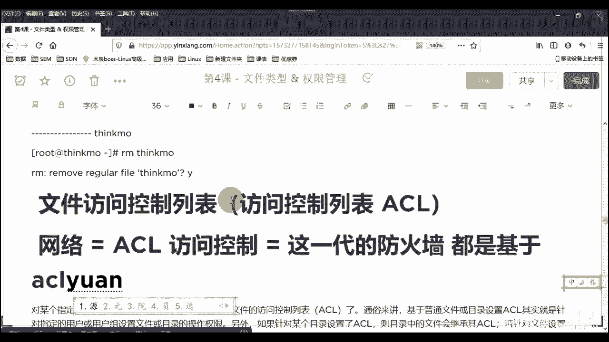
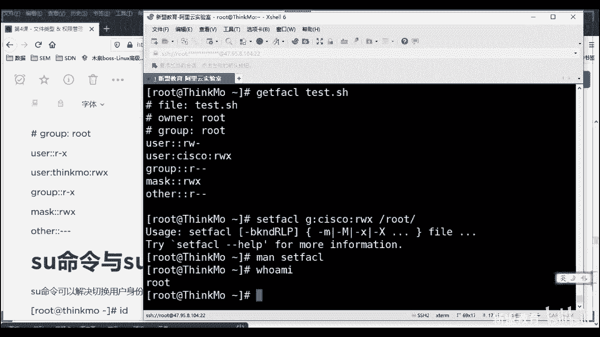

# 2020最新Linux-RHCSA入门实战课 - P5：RHCSA-第4课 -文件类型&权限管理 - 新盟教育 - BV1Fg4y1z7kS

。

如果你们没有写的话呢，自己大家在那个上面自己先做一下吧。这个是你们自己先先做一下登记，然后后面我课后会对人的啊，我课后户会对人的。你们可以今先把这个名字写到后边，然后后编换我的这个5辑答案。好不好？哦。

这样子啊，然后其他的我看下。不说了白茶。可以好，切下到啊，可以切下到。😊，行了，然后我们准备上课了啊，我们准备上课了啊呃。😊。

我们不等了啊我不等了。行，我跟你先签一下吧。上午的啊行，我们准备上课了啊，不多说了。然后看了一下30号人是吧，跟上午比的话，差了10号人啦，这差了10号人呢，差了10号人的话，一会再找他们啊，行不行？

然后呃接着说啊，那么上节课的话，我们讲了这个这个关于我们linux下的用户用户管理，但是linux用户和用户管理的话，他没有办法单独使用，大家明白啊，他没有办法单独使用。好。

一般来说用户是要结合我的权限去用的。那问题就在于说老师我不同的文件或不同的内容我怎么就能够设置权限了呢？而且lindux里面的权限又是什么样子的，对不对？哎，这是我们需要去记忆，并且去明白。

我们会去使用的。好，那我来看啊，先从一点上来看，先看什么，先看的是文件类型。大家明白。因为linux和windows最大的区别在于说好，我windows上老师我有这个。😊，TST啊，我有word。

我有excel，我有PPT啊，我甚至还可能有其他的什么点EXE是吧？点这个BAT好，没关系，那不同的我们说不同的后缀导致了我不同的文件类型，对不对啊，不同后缀等不同的文件类型啊。

但是那要是linux里面有吗？好，你记住啊，linux里边一切皆示文件好，啥意思？所有的东西我们实际上只会分成两种，一种叫做普通文件，一种叫做特殊文件大家来。啊，一种叫普通文件，一种叫做特殊文件。好。

那问题是什么叫做普通的？记住了，所有的文本文件。好，都是普通。都是普通。那这里面实情上就包括了你们啊那好了。如果老师我在linux里面写了什么点TST啊，点DOC是吧？点PPT好。

点儿点点点点CICLE是吧EX我忘了怎么听了啊，EX1好，这些记住啊，我说这些课我们都管它叫做普通文件。文本文件啊，那怎么识别啊，毕竟老师特殊文件包括哪些？我们来看啊，所以说我给大家也列了上节课，对吧？

我们说你看一下，当你把这个文件综合显示的时候，它只显示看第一列。

很低点。看到没？好，第一列，如果是个小杠的话，那么它就为我的普通文件。也就是说任何的文本文件。啊，文本文件这里边你怎么给所谓的后缀，大家记住都没有意义。对于后缀来说是没有意义的。

而特殊文件我们详细的区分没错啊，而我们特殊文件详细的区分是啥？第一个特别简单，第一表示directory，也就是我的目录，对吧？目录好，目录的话大家记住啊，目录的话它由于是什么？它是能够包括文件的。

所以它不能算是文本本身，所以它也算是特殊文件。但是但是记住了啊，但是它是我们lininux里面可以直接去控制的两类。好吧，那底下的一个来说，链接文件我们特指的叫做啊特指我们的所谓的软链接。对不见。

而且是那个所谓的快捷方式，而不是本身是啊快捷方式。那我们管软链接也叫做符号链接。你记得啊，后边你们见到这几个词都是相同的意思，不要蒙好吧不要蒙。好，再下一个叫做que设备，叫做block大家来。啊。

那什么是块儿？从硬件的角度来说，大家记住硬盘硬盘的话最根本上叫做扇区，对吧？叫做扇区。你机械硬盘啊，总来说是机械硬盘。对吧机械硬盘好，机械硬盘的话会分为扇区，而这个扇区在虚拟化出来之后。

就是所谓的我们的块啊对。啊，第几块存着什么东西？所以我们管这个硬盘啦，叫做我们的，包括U盘啦，叫做哎存储类的设备，叫做块设备，能理解了吧？啊，存储类的设备。那C表示叫做字符设备拿起来。

我试啥叫字符设备啊？这里边特殊的几个就是我们的终端。啊，虚拟终端啊，我们上节课给大家讲了，通过一个东西能够看到我们的终端。别着急，一会儿我就会说啊，文件系统啊，对文件系统其实也能。

但是一般都是在我们的U盘做系统时用NTFS啊，lo你好，来告诉我我怎么去查看我当前的虚拟终端啊，我怎么看同学们。你不要在本地看，你一定要拿叉效去看，对吧？拿叉笑去看。😡。

好，那拆设我的话，我通过一条命令，这条命令叫做TTL还记得吗？同学们哎，TTL对不对？哎，你哎知超知道了啊，好不好？那这个时候我可以看到有两个，哎，也就说我是第三个，我是第三个终端了，没毛病吧。

我第三个。好，那么此时我们来看一下，我把它换看好，同学们啊，我把它看一下。😊，我来看一下。看一下看一下看一下我是不是所谓的C啊，看到了没有？看到没有？来看到双烤一。这个。我是不是所谓的C了？😡，啊。

指的是我的虚拟终端，明白了吧？啊，终端设备好，大致情况下。

第三个来说的话。哎，TPY啊TPY第四个叫做管道文件。其实这个没有什么特殊的啊，没有太特殊的。其实这个正常来说是指的我们这个。指的是这个工具啊，工具叫做分管服。啊，叫做分管符。

这个讲到分管符号的时候的话，我们会给大家去详细的去说好吧，这边的话大家就进来这个分管符就叫做管道文件就可以了。好，那除了这些以外，还需要你们去记得叫做S拿家来啊，叫做sockcket啊。

叫做安全套接字文件。啊，就按心套近这么一解。那很多人说是什么是这个安全套接字啊，什么是安全套接字？那我们都说过一个问题，大家好了啊，所有的服务是基于某个协议的，对不对？某个协议的。

而所有的服务我们当开启之后好来告诉我，我的服务一定会具备一个所谓的端口号，对吧？我们说是这个服务，比方说HTTP是要监听我们的80端口的，没毛病，没？这句话。但是细看它就有了啥意思？好，你怎么监听啊？

同志们，你怎么监听啊是吧？你要是监听的话，说明一个东西，这个80得是个东西，也是个物件，你能监听上去。😡，你打电信。是不是？所以这个80到底在哪？在这到底在哪？啊。

于是乎我们在整个的系统当中会有一个那么模拟的或叫做虚拟的一个层衡一个层次。这个层次叫做安全套阶层。大家来。在安全套街上。啊，当我们启动一个服务，启动服务的时候，我们会产生一个层。

而我们的服务会在这个层上去做对接。好，以此来形用它个所谓的80的端口对来。啊一层一样没有了吧。啊，那么这个常见的，你比方说my circle点SOCK大记住啊，不是全拼哎，对安全套节头啊。

进来my circlecle点sck文件对来啊。好，老师，我怎么没见着过。看好了，亚马in，我们看一下我没有启动啊。

啊，好，要么instore我们先装一个软件啊，叫什么呢？叫做mora。😡，DB。😊，啊，稍等完安整一下，稍等。嗯，好像这个这个这个这个好像是这个这个这个。被我弄坏了是吧？等一下啊。稍等一下啊。首见是吧。

稍等一下，同学们啊，呃我们先一会儿来看吧，一会儿来看吧。我这边呢先给先先说啊，我正好重启一下我的阿里云，好吧，我重启下阿里云。

因为这阿里云被我搞了一下，说把一些东西给删了。我看一下啊，一下。🤧嗯。东气停止。到这。好，来一会儿来看啊，那我们来看这边，那linux权限大家注意了啊，当你把这些文件的。类型搞明白，其实只是方便你说哎。

我去判断这东西是干什么用的。但是对于权限来说是没有的啊。呃，一般来说，我们的操作对于这几个靠拉，对于这几个文件是没有什么所谓的权限的管理，一般都是对上面两个。啊。

我对文件和对这个目录我的权限相同权限可是不同的含义。下一种。为什么来看啊来看。万达啊，他那边。我们说权限的话，其实在linux里边，我们常见的叫做普通权限一共有4种。第一种叫做R，叫做read读取啊。

W叫做写入right X叫做EXEC叫做excuse。啊，这EEC执行。那四种是哪个？第四种就是所谓的小杠杠，大觉吧？小杠杠就是无空类型。好，那么对于文件来说，读的话是读的你的核心内容。

比方说老师我写了一句话，I love you是吧？你能看得到啊，写的话呢就是修改，把I love you变成I hate you是吧？我恨你啊，最后可执行。大家记住了。

这个一般就是指的命令再说一下就是脚本啊，脚本是具备可执行的。权限的文件。好，这是对于文件。那对于目录来说，哎，老师我目录的话没有文没有内容啊。但是啊对于他来说，文件就是内容。

所以可读是你是否可以查看我当前目录下具备哪些文件进来。具备哪些文件？可写指的是我对于当前目录下okK我对于文件的操作性，我是否可以添加新文件，是否可以删除，可以重命名等操作能理解啊？

最后执行指的是我是否可以访问我是不是能够CD到你。那我是否可以CD进入？进来。那么于是乎看好了，于是乎问大家一个问题啊，问大家一个问题。现在我的文件好了，举个例子啊。他是谁。老师。

我文件现在我的我的属性是RWX。好，我请问一下同学们，我们现在可以删除这个文件吗？来。我现在可以删除这个文件吗？来，可以的话刷一。😊，啊，不可以说2。可以吧？😊，可以吧可以吧？啊，大部分都说一是吧？

大家记住了啊，大家记住了no。No。正据来说是很简单，为啥我说了。😡，你是不是可以删除这个文件，不是看就说啊哎文件是否可以删除。不是看我文件自身的权限。对吧不是看你自身权限，而是看没错。

而是看你所在目录是否具备所谓的W权。看你对文目当中的创建内容啊，对以你要看目录能理解了吗？所以这个问题你们要记下来啊。😡，容易蒙的啊，很多人说老师，为什么我文件那个权限挺高的，为什么我删不了啊。

在这儿呢？😡，听见了吗？接来啊，在这儿呢。啊，所以这是个小坑啊这是个小坑，请各位自己记下来，好吧，请自己记下来。好，能懂的话刷个一吧。来能懂的话刷个一。😊，你在别人家呢，是不是你现在做客呢，在别人家呢。

你得听人家的，人家说了，你可以去厕所，你才能去。人家说不行，你就憋着，明白了啊。😡，那么关女小说，我这些个东西，我如何进行一个所谓的这个这个这个对吧？我如何进行控制呢？我这个测试。好，当了，我刚刚说了。

我刚刚说了权限的话要结合我们的所谓的用户，对吧？结合用户，那么还拿这个来看还拿这个来看好了。看这九位看到没有？看这9位好，第一位是文件的类型。这种类呢我们按照33给它划分。按照33划分。这33指什么？

看好了，前三位指的是我的第一个用户。啊，这下来。叫做属主。好吧。😊，第二个33啊指的是我第二个入ot叫做属足。进来好，老师后面还有一个33呢，在哪儿呢？哎，进来同学们啊，这个是对于其他啊。

对于其他啥意思？别着题644啊。哦。属主不用我说了，就是用户是谁，是不是谁负责。😡，好，谁负责啊，属组呢？啊，属组，也就是说哪个组可以通知我，对不对？那么其他的话就是我不在组内的人啊，不在组里人。

我可以干嘛？明不明白？这就好比你这是你，这是你们运为组，这是你们其他部门的股事。😡，就这么简单好吧，就这么简单，所以我配置好了这些用户之后，我还得对应上所谓的用户权限，你才能真正的控制它啊。好，那老师。

我怎么控制这些权限，对吧？那么这看啊同学们，我们对于一个文件的授权啊，有两种方式。好，老师哪两种方式是吧？哪两种方式啊，一种既来通过我们的数字表达式，哎，也是我们现在生产环境必用的。啊，生产环境利用的。

来啊，这个应该不用我说了，也是我们常用的啊，也是我们常用的。哦。那第二种呢啊第二种啊，我们管这个的表达式。表达式对吧？叫叫做叫做叫做怎么说叫做呃数字叫做数字式和表达式。啊，数字式和表达式这么说。

区别在哪儿啊？这个不是这不用了。区别在哪呢？记住这个是通过所谓的A啊，通过加减知道吗？加减法等于啊这些来表示的那怎么表示啊套了啊，那我现在往底下看啊，现在先明白数字的含义啊，明白数字的含义。

那我的权限默认是对于user group和 other对吧？好，进行分配，那么用户用U表示group用左啊，左表示用G好，O表示other，其他这把这三个字母你得给我先记下来。好。

UGO分别对应上每三位一组进行看好同学们啊，前三位为U啊，如果满位，如果满位看好了，这个地方老师满位了则是4加2加1。

4加2加1，也就是7，明白了吧？最高权限为7。所以问题是来吧，告诉我，大家告诉我这个表是多少啊，这表是多少啊？😡，三位一看三位已看啊，你别一块儿看好吧，最高来告诉我默认多少，这是。😡，来来来来来。

这是多少啊？哎，644对吧？6442哎K好，所以这里面就会衍生出来另外一个问题，就是老师我们现在常见的文件，我上面给说了啊，叫做默认我的权限。

是644好，目录权限到了，默认权限是755，往这看往这看。

看到没有？在这儿改好了，这是默认的一些个普通的文件啊，普通文件看没有？755没问题吧，4加1啊4加1啊，老师那为什么首先先明确一点，我说了权限最小化啊，权最小化。那么改好了，我的目录肯定是要能够访问的。

正常来说没毛病吧。要不你干嘛建目录呢，进不去，白动是不是？所以他一定是具备X权限。没后病吗？但是如果文件好，老师如果文件我们具备了X权限好，此时，由于说我还具备W权限。好，我请问一下同学们。

如果我把它写成我们的脚本，于是乎我就执行了。对于我的系统来说是非常大可怕的。明要了吗？就这种。所以此时我的文件是不该具备X权限的，能理解了吧？好。先把基数看明白，那老师正常来说的话。

我们应该满位应该是666，对吧？文目录满位的话呢，应该是这个这个这个所谓的777。好，乐于是乎告诉我现在差了多少啊，来告诉我这两个差了多少啊。😡，差多少差多少，这两个都差多少。

不这个到这边这个到多这边差多少？😡，他多少？差多少差多少差022对不对？在022啊022对不对？要这02跑哪儿去了？记来啊，02叫做you mask叫you mask。我们管它叫做反言码啊。

这个的意思和你们大家记住啊，和你们在学学学网络里边的IP地址，反言码是一个概念，明白吗？老师我的掩码是多少？满位是255。为什么我们有的时候写反言码是吧？繁检一下，啊，叫反言码。😡，好。

那这反言哎，没错啊，别着急，老说反言码怎么看，you must看you must就这么写，就这么看。哎，就这么看，看到没有？告诉你的是022，对吗？好，咱说老师这不0022吗？啊，002来记住啊。好。

我们现在看到you must是等于的是。😡。

0022到好了，我们先看后三位第一位啊先留下来，好吧，第一位先留下来，问问号叫做特殊前线。叫特殊权限，一会儿后面还会讲到啊，还会讲到。好。

那么U must是022的I看老师一做叉是不是就变成了我们所谓的666和7644核77行了？

当了你也能改老师怎么改you must，你后边跟上0011。😡，理懂吗？那么你在创建的时候，大家就看了。😡，就有所谓的bug了啊就有所谓的bug了。老师哪里有bug好了。

那么我们修改后。有吗？很好。好，目录啊默认还是777减U吗？单号现在。此时由于你修改了之后，你的文件好，默认也是777点U。好了，你改的是整个对于文件的规则。明白了吗？啊道你知道说为啥是吧？为啥？

其实这东西我也没研究出来，为啥知道吧？其实我们做了N多次实验，最终的话只能说是探寻出来。如果你改了U mask，其实可能是改了它内部的一些个核心的算法。😊，啊，把它改掉了，可以测试一下看了。好了。好呃。

我们先把那个那个我们先看一下Uax改成110011了，对吧？😊。

现在好了吗？在好了吗？弄好了吧。啊，不一定是要偶数，不一定是要偶数啊。

好吧。好啦，可以啦，OK。😊，好，所以现在的话我们看一下同学们，ok老师我去创建touch对吧？touch touchuch比方说老师插这个fill ten好的好了，看一下fill ten。

你可以看到是不是我变成666了。

看没？这个地方好像没有变是吧？哎，7里面没有变啊，还挺不错是吧？大家可以看一下666。😡，啊，6666还不错。

这个没有变。有的系统里面是整个改的改掉了啊，可能还是分系统的啊，可能还是分系统的。开你可以看看你自己的系统去好吧，你可以看看你的系统改不改。啊，我给你们的ss来说是没有的。如果是红帽的话，是这个。😡。

啊，红帽的话是777那种。老所以我to下，我再进行MKDAR，我去创建个A。好，我们看看A看好了，看看A。

看了A。看A的话是不是755了啊，766了。能看到没有啊，U mark改变之后啊，所以默认类就改变了。没有回来。好吧，说那么多好吧，这特就是普通权限。好。

那么到这边为止来告诉我有什么问题没有来同志们没有问他，给我刷个一看，没有给我刷一。啊。好，没问题啊。啊，然后老师，那我怎么给他复权，怎么授权是吧？别着急002那个0还没讲呢，我说的是特殊权限，好吧。

是特殊权限。可以可以啊。好，那么接着来看啊，那就来看。如果我想给他改变权限的话，哎，就这么一条，我看看我底下写了嘛？好，底下没写这个命令是吧？啊，没写好，再来老师，我们现在要修改所谓的权限。😊。

啊，修改首先。怎么改？记住了，就一条命呢叫做CHMOD好和CHOWN带好了。啊，啥意思？虽是MOD啊，是修改权限。啊，修改权限的对于我们的文件啊，对于我们的目录。

CHOWN呢叫做修改我们的这这这种这种这种怎么说所属吧啊所属啥意思？对于文件和目录，我们的归属是谁？归属是谁？明白了吗？哎，就是老师我属于用户A，用户B属组，哎，属于哪个组运维组还是技术组。😡，知了吧。

那么这里边有个通用的参数叫做杠R。大家记住了，杠R叫做递归，大家写的啊。再说啊再说。啊，那我们来看一下啊一个问题这一个问题啊。低规指的是okK我们里面包括目录及我们里面的文件带起来及里面的文件。

包括我们后期所创建的文件啊，都会去继承我们这个权限。啊，都会去继承他的权限和属族和属族，理解了吧？okK。啊，对了。R一定要记住啊，这个杠R好吧，这个杠R。😡，啊，不要写这个不要钱啊这个不要写。

一会回来就下课再说啊，都明的。所以把这两个简单做一下好吧。只不过我说了这两种表达方式带好了，都是通过CHMOD去做的那比方说老师我现在用数字的方式进行我们的授权，怎么做啊。

就是按照777的方式去做明了吗？比方说我想让我们本地fi时啊，变成全满位，则CHMOD777带好了。

跟上我的文件的名称。看。啊，跟建文件的名称。好，回去看一下，看到没有？

看了吗，听到我敲键盘的名字啊，是你啊，大的是不是满位大家看好了吗？而7里面记住啊，七里面特别好的一点啊，包括叉ll，它本身有个配色OK当你的文件有修改的时候，关定文件有修改的时候好。

那如果是我的脚本文件，我们命令文件，脚本命令这种文件一般都是绿色的啊，还是那句话，往那个域维要想过得去，生活得有一点绿。😊，啊，普通文件呢就是白色，然后目录呢就是这个这个这个这个什么颜色。

目录就是蓝色明白了吧啊，目录就是蓝色好，然后剩下的就是所谓的块文件，就是我们的黄色，明白了吧，同学们。那如果说来吧，大家告诉，我现在告诉你了啊，授权啊，请大家记住了，授权我们的属主好，可读啊可可可读。

好呃，书祖。和谐。啊，其他。可执行来吧，告诉我这是一个权限，是什么样子写，怎么写？😊，这个缺校什么呀？熟悉啊一定要熟悉啊一定要熟悉啊，把9位一定要写出来，然后再告诉我怎么算的，是吧？😡，谁来说好了。

我们把这9位先写出来。如果你前期不熟悉的话，写出来是吧？020我就知道你们有人懵啊，同学们数组可读R没问题吧。杠杠好，数组可写W前面杠后面杠，对不对？最后可执行，最后一位X前两位都是杠。哎。

这么推论过来，最终的答案什么是421嘛，怎么还有114对吧？怎么还有001这么个情况嘞？020这都是怎么怎么个怎么算法的，对吧？当好了当好了，是这三位算一个数，这三位算个数，这三位算个数啊。

你不是说看见谁写谁，好吧。这在哪都拿的，是不是啊？所以我现在应该是CHMOD多少啊，421对吗？然后对我们的fi时。对不对？看一下改了吧，421是不是这样子？这么说能懂了吗？啊，前面说错的几个人。

LDP东鹏小杨儿。哦。好，然后就说啊这是一种。但是呢它这种是最最好用的，一次性我都给你改了。第二种的话比较困难，叫做表达式方式。啊，表达式当然表达式授权的话呢，我们有三个方式。第一个来说是U啊。

叫做user。这刚刚讲了啊，第二来说呢叫做G是吧？G小写的都是小写的啊，没有大写的啊，啊，叫做group。好，最后O表示OT2。其他。😊，好，除了这三个以外呢，你们还会具备一些个表达式。好，加号太好了。

叫做授权。啊，加号授权减号呢撤销没毛病吧，撤销好，等于表示叫做覆盖啊表示覆盖。好。那么此时大家好了，现在我要求各位基于我现在421的基础之上，我们通过表达式啊，干嘛呢？为我们的用户添加添加执行权限。好。

为我们的属组啊同学们添加我们的这个这个这个这个这个这个这个添加我们的执行权限。同时，撤销我们的。哎，撤销我们其他。的所有权件。来怎么写啊怎么写C是MOD写一下写一下。😊，谁下？😊。

是吧第一个来说师那用户添加，那不就是U吗？对吧？加上的话加加上话加X，对不对？😡，好，G。加上X对不对？最后O减去了所谓的X。没毛病吧。没老师吗，同志们。来O刷一啊O刷一。😊，都有啥样？好。

那么这三位提出了，要用所谓的小逗号隔开啊，你必要用逗号隔开啊，哎要用逗号隔开的啊，最后fi小时。

看一下啊看一下是不是老师CHMODU加叉逗号G加叉逗号O减X而fi是。看吧。😊，是不是改了？可以了吧，但是这种很麻烦啊很麻烦，对吧？老师们等于号怎么用呢？😡，C是加叉。好，C加叉好了。

比方说我们拿另一个来说啊，拿它来说。😡，好吧，拿他来说，你看一下他哪个位会变掉，我们拿fi期来说。X的直行啊。看一下。😊，哪里边了？😡，看到没有？同学们？如果我什么都不加的话。

默认是对于我的属主进行操作。能理解了吗？能理解了吗？明白。

OK的刷意啊，对于当前用户，就是说对于当前用户，对于你的属组文件所有者。

如果用等于号看好了，如果我用等于号，现在注意十啊，现在注意十啊，是这样子看没啊，是这样子。C是MOD郝老师，我有能不能让U等于X。啊要是U等于W。坏有。2。大家哈。😊，看到了吗？

值的话用U等于的话叫做覆盖。啥意思？我会撤销你之前所有的权限来等于现在的权限。看到区别了吧。

啊，这个覆盖这要大家。好，说那么多啊说那么多啊，这是两种方式。当然这种很少用啊，比较麻烦这种是吧？啊，这种比较麻烦，所以大家这种自己去挑啊，当然我们基本上是这种。啊，对对。好了，说的不多啊，说那不多。

呃，这是普通的，大家能的玩的比较赚了吧。好吧，玩不要抓了啊，呃，还有什么？第二来说属组对吧？属组HOW。

啊，这是OW。好。关于我的这个用户的改变很简单。你比方说呃老师这个课件过后可以给你们，不还不如用第一种直接定，就是用第一种直接给你的啊，现在但是这两种都会有明白了吧？这第二种我们基本不用啊。

第二种基本不用，但是有这种方式给大家介绍到。

呃，课件的话，我说的就是这个笔记啊，你要回去自己总结，明白了？批督大人。但是的话我一般会一个月会给你们发一次啊，一个月会给你们发一份啊啊，不会太长，也不会太短的时间，要不然你们都不总结，都等着了，好吧。

来看啊。

每节课我都会有作业的啊。那么第二个来说的话，叫做COWN知到了，它对于的是用户的一个归属。好，现在来说我实是由root负责的，对不对？但是老师我看我不想让你负责，我现在换人了，是不是？

所以COWN考好了，用一个叫做什么呀好了好了，两种方式，两种方式，第一种好了，同学们，我们直接写你的用户。哎，ssco。啊，这icalfi10。好的好了，此时我只会修改其属主和属主看没有？

但是如果老师我想两个都改呢，好了，用点儿点儿的形用点的形式，或者用冒号的形式，你自己选择，看到没有？用点儿的形式，用冒号的形式都行。看了再改一个啊，linux点linux。看见没有？两个都行，能理解吧？

用冒号或者点。那是如果我只想改组呢，我不想改前面。😡，我不想改前面，咋办？😡，咋办？当了，我不想改前了，很简单很简单，只要写个点儿，只要写个点。看到了吗？啊，你省略一个就可以了啊，你省略一个就可以了。

1啊。啊，这样不自动创建，是必须你这个地方是你现在系统已经有的用户和组组，明白吧？不能自动创建的啊，好不好？啊，看到没有？用这种方式。哎，你要说这种太麻烦了。好，引申出来第二个命令叫什么来？

叫做CHGRP大家来。😡。

啊，叫CHGRP啊，都说我是到底CH啥意思啊，CH啥意思，讲过没有？😡，讲过没有？解了啊C出来大家该明白的，我把这个单数给你们改出来啊啊，叫做叫做changemodify。😡，啊，修改嘛，对不对？

这个呢叫做changeown。😡，是吧change OWNERowner拥有者对不对啊，最后呢叫做change group。对吧change group哎，没错，change啊，所以呢好同学们。

老师我只想改数组靠了，我想把这个改成lininuxCHGRP看到没有？GRP啊，linux什么都不用写file是。

看到了吧？看到了吧？这一步这步没什么可难的吧没什么可难的吧啊，当好了，如果老师我想改一个目录是吧？CHOWN看好了，记住啊，一定要跟个杠R。如果你想改目录，并且把它里面所有的文件都改掉，一定要跟上杠R。

同时大家注意一个问题。如果老师我想改一个目录的话，我想改一个目录的话。😡，啊，Y两个目录的话，哎，好吧？没有这个文件啊，OPT。呃，OPT唉。哎，是没有这个文件了吗？看下。OPT懂了啊。好，那我说什么？

好，同学们那我说如果大家说老师我在修改的时候注意一个问题啊，注意就是你在你的用户最终记住啊，在你的最终用户这个问题上。要不要跟上这个小杠？要不要跟小杠啊同学们跟杠和不跟杠的话，哎，就只修改数字啊。

跟杠和不跟杠是不同的意思啊。看到了，同学们，我先给大家写一下啊，给大家写一下。

好，如果老师C是MOD，我们的MOD好吧，杠R告诉同学们好，老师ETC。ATC啊，我现在不加杠。😡，啊，表示么表示我们连同，sorry了啊，是表示连同我们ETC自身。都改变。同学们？如果说我现在ETC。

😡，Go。😡，加上了啊。加个好是干嘛？是不包括。ETC。是是。好，这个能懂了吗？来，懂了少意。啊，这是不包括的。很多时我说我我删东西是吧？我不小心把它删了，为啥都删了？你不要把目录都删了。

是因为你这会一定没加杠，你把这个目录都删掉了，明白了吧？😡，啊，对。好，所以这个是我们的普通权限，但是光普通权限是没有是是这个也不是哎，对于系统保护也不是特别好。所以呢我们又特殊提出来叫做特殊权限啊。

特殊权限的话有3个，刚给大家介绍了一位了，叫做BID。好不哎，对，都可以改啊，叫做BID好，改好了，这个SBID。啊，这叫的SBIT。年制位啊叫到年制位。好，干嘛的？是对目录拥有写入权限的用户。

仅可以删除其拥有的文件。无法删除其他用户的文件，是不是刚刚我们特别指的这个哥们儿啊，来告诉我。😡。

我把它改回去啊。啊。哎，他要告诉我。

来告诉同们，是不是我们刚刚特指的所谓的TMP啊？😡，拜吧。😊，那大家可以看到它的权限位上有个特殊的在地方在哪里吗？😡，他在全球面上的特殊的地方在哪里吗？😡，在哪里啊？告诉我哎，有个T是不是？😡，游戏。

😊，好好，所以大家现在明白了，老师哦，这个地方呢做代表是个T好吧，是个T好，但问题是，哎，老师这个T分不分大小写。那么你们认为老师分的话，刷一不分的话，刷2。分不分？分不分？都不分。什么哎。

分的啊分的啊一定是分大小写的啊。啊，要说我怎么知道大小写，他怎么叫大小写了呢？对吧？来看这边好了，好，此时改好了，如果我们把它的权限改一下，你看我怎么改的啊，扣怎么改的？现在是七不变啊，现在是七不变。

好，我现在如果只看前两位是六的话，看好了。😡，好。大来看啊，六的话没了吧。😡，所有都没了吧。好，那我说我怎么授权你的？😡，大家好了，这个我们刚才看到了you mask有几位啊。

告诉我you mask有几位啊。😡，you must有几位？you must有4位，对不对？😡，You must。到了第一位。好，即是我们的就是我们的特殊权限。那么特殊权限也有4个值好了。

SUI的先不说，先说这个BITT等于的是一。T等于61。所以此时我们再看到了7期六不变，我要在它前面加上一个1。来看。来看啊。看有啥区别了吗？😡，看到没有？😡，啊，所以老师C是MOD啊。

1777好TMP再来看啊，看到喂它是根据谁来变化的了吗？这变化。好了啊，对好了。哎，如果只时啊这住所有的特，哎，没错，那根据X对不对？好。所有的特殊权限。OK都是根据什么？哎。

我当前位置上是否具备X缺限。如果具备，则我们是小写。好，如果不具备，则我们是大型。好吧，这个接下来。好，所以大家看到了BIT你明白了啥意思了？只有我们文件的属主所有者可以删除我的文件，其他人门都没有啊。

防止了就是你上传了共享文件夹里面，你上传别人删了是吧？找不着责任了啊，说你没传是吧提冤了的？那么回看前两个叫做SUID和SGID是吧？啊，SUID和SGID这也不用说了。UID改好了。

明显了这是对于我们的属主的控制权限。SGID对于的是我们的属主的控制，明白没吗？现在好了，这个哥们儿默认的是。4。这个哥们儿默认的是2。啊都齐了吧都齐了吧。😡，啊，UID是对文件的用户执行。

而非执行文件的用户。按、文件的所属用户身份执行。而文件理解拉起来啊。啥意思？嗯，啥意思？靠了。我们拿一个服务来说，拿一个服务来说。啊，这样看板还好了，看这个吧，看这个文件啊，好了。

LDDCpassword。😊。

啊，这就这个文件上来了。没错，哎哎赫了。😊，看一下啊，现在大家请各位注意了，除了root是可写的以外，看到没有？root可以修改你以外。我其他人能对你有任何的改变吗？是不是不能啊，是不能啊？

但是老师为什么当我们切换到了思科，我们还能够对吧？sical我们还能够使用这条命令，并且进行修改来。😡，是不是我为什么还能进行修改啊？😡，大家告诉我。为什么？啊。对吧。啊，我为什么还能继续修改呢？

告诉我，虽然我写的密码简单了点啊，简单点了，为什么还能修改？😡，对不对？为什么？哎，所以pass word吗？来看一下，别着急别着急，别着急，看看我们pasword对吧？哎，所以不在于文件本身。

而是在于命令本身，注意了。😡，好，知道了pass word我怎么看它用which置命令啊，用which命。which password找到你的位置来，改好了，把这一条命令复制下来，过来解释一下。😡。

看到这儿了吗？看到了吗？放这儿了吧，弟们。看到吧？哎，S可看到没有？说白了就是说白了用句大白话来说，老铁们？哎，这个的目录的作用就是让我们的普通用户可以当做root用。

我们用大白话说啊，歪里明见了吧？啊，歪里实际上就是帮助你进行了一次提全。看到没？哎，是因为我本身是具备S位的，我当做的什么？我是把你当做了什么不？我是把你当做用户root来做的。😡。

是不是跟你自己是谁没关系，跟你这个文件是吧？ETC下的password的文件没关系。哎，上方宝剑明白了，同志们来读一上一啊，这个明哎这个解释不错啊，上方宝剑。

我不在意你是钦差大神还是怎么样，只要看到上方宝剑，你就是老大。可以了吧，兄弟们。所以这个也是一样的，看到没有？这个也是一样的，大家看到没有啊。

再一个命令啊，好了，再一个命令用这个命令。😊，啊，用这里。看到没有在这呢对啊，看到没有？叫做statestate来查看你的对老大的权限啊，用这个这个这个state本身来查看你的文件的详情。

大家可以看到文件详情，你的用户权限在这儿呢，看到没有？4755是不是小写了呀？😊，所以你们小写的有个7啊，看到没有？😡，还到没有？

能理解了吧啊，SGID这个就没说的了，这就是跟他类似，只不过这个是足给的。😡，权利是吧，但组的话我们一般都不用啊，组话一般都不用，这个基本不用啊，这个还是常用的门。

好，所以C是MOD那好了，如果7777就是最高选校了吧，啥都有了吧，范小时。看到了吧，啥都有了吧，SSSC是MOD大点写是吧？7666。😡，走全大写。

好了吗？来，这个特殊权限能搞定的人了吗？同学们来能搞定个刷个一。按道的上意。好了啊，okK没问题啊。所以大家可以看一下，这个就是所谓的我们给的方式啊，所以给的方式好不好？我们讲到这边。😊，呃。

分配式用m1一般记住啊，一般用m不做特殊权限的修改，明白了吧？一般用 mask不做特殊权限的修改。啊。特殊权限用我们CHMOD单独去加you must一般只管理你的普通权限。

而且生产环境you must不变。明白吗？兄学们，you must不变啊，生哪个姐妹，老是告诉你们有那个东西，好吧。😡，啊。好了。😊，呃，SUU passwordsword的速度这些权限我就不说了啊。

好不好？这往下面的话是它隐藏的权限了。你们看一看，同学们来看一看看一看看一看这些个地方，除了这个地方，大家看可以看到这儿吗？有的我是不是多了一个点儿啊，能看到吗来？能看到刷一。😡。

我是不是有地方可以看到个点儿啊？😡，能O吗？好，那点咋办？知大白点是啥啊？特殊权限啊，叫隐藏权限啊，叫隐藏权。啊，我们全县一共有三类，好吧，分别是。😡，普通RWX特殊SUIDSGITSBIT明白吗？

最后是隐藏。隐藏隐藏就俩命令，一个叫做CATTTR，一个叫做LSTTR一个一个什么一个改一个查啊，一个改一个查。啊，一改一。跟麻地太好了。😡，干嘛呢啊。就是这些权限是你平时用LL查不出来的。啊。

查不查不来的，就是你会发现有的时候老师为啥我有的时候这个权限我够了，我看着我RWX，我文件目录也是RWX，但是我就是没法删。😡，对吧这没法删，因为很简单，就是我设置了特殊权限了，隐藏权限之就不特殊一点。

隐藏权限好吧，哎，那么好了啊，那么这个地方我怎么用课了，在这儿。用它去设置，分别也是它加上一个参数。那一般来说，我们常见参数就是A。啊，一般来说就是一个A函数啊。加用加号的哈，用加和减撤销就是减。

看到没有？撤销就是减，加上就是A加上就是这个添加就是A啊，加号。好，那么常用的几个参数，第一个就是选A。啊，小A是常用的觉了啊，几个嘛呢仅允许补充追加内容，无法删除或覆盖。很简单，看好了，当然了。

我们还是拿本地的啊呃RMRF我删掉啊当前用户下的。

File。行。好吧，to实一下fi有。touch下 file好，等好了。此时这个fi号呢还是644的权限吧。好，干嘛呢？我们写进去是吧？welcom。😊，sureruethink过来了，宝 file。

来一下CT file。没毛病吧？啊，如果我这么再去写一个，比方说hello。😡，到了hello。哎，追加一下朋。好，CAD fail好，大家可以看到啊这样子吧。😊，但是如果老师我此时误写了，比方说你好。

好。好，此时可吧。我之前的内容没了。对不对？😊，那你在工作里边说，会不会有这种情况会的？😡，大家明白，很多的时候我们是记住啊这么写啊。哎，你们每天的日常工作最后一步干嘛？最后一步是整理上报。

啊，系统里边必须有个日常的报告文件。而且日志文件你也要有的时候要download的下来。那这些东西你不能说老师我误操了，把里面东西全删了，不行的，即使有备案，是不是干嘛怎么办？😡，所以答好了，此时好了。

我们去给它增加一个A啊，增加一个A。好，C是ATTR。

一点。好，加上A好了，file带好了，此时刚看fi吧啊fi啊带好了，现在注意了，现在注意了啊，这注意了呃啊，不对，说错了，这个小点我忘了啊，这小点不是特隐藏件，这小点是ACL啊，说错了，小点是ACL啊。

叫做访问控制列表。一会儿后面会讲。😊，啊，叫访问控制列表啊啊不是这个合隐藏啊。好。看一下同学们，现在的话我给你加了特殊权限了，对不对？好，LSAT条。看到没有？

大家都能看到这就是我加上的这就是我加上的首先啊，如果没加上的话呢。😡，如果没下的话呢。看到没有？朋友们？只有一个这个。😡，这个意。啊，好，现在我说了你只能够追加，无法覆盖或删除啊，老师。

现在我写了hello啊，追加一下，看能不能追加啊，来看。So they file。没毛病吧。😡，好，但现在我误操了误操了，写什么呢？写一个写一个写一个呃再见啊，写个再见是吧？再见我覆盖你。哎有。打家看。

看告诉什么，告诉你不允许。😡，能理解一个作用的作用了吗？来历史刷刷一啊，历史刷一。😡，来李双意。

所以这个缺陷是常用的啊常用的A是常用的。好后呢，我看一下啊，呃op跑这用动感。嗯。看下啊。常用的这个这个。常用的呃。这个。这是我们常用的啊，这个尤其是对于一些个数据文件哎，去吧，文夫哎去吧，对吧？

尤其这个啊，尤其对一些数据文件，my circlecle的一些东西啊。嗯，差不多。哎，就是这三个基本常用的，其他都还好吧，现在还好吧，现在看情况了好吧啊，所以这个就有一个方式，能理解了吧？

包括删除这个我不就说了吧啊，删除我就不用说了啊，这是没有办法删除的对吧？现在。嗯，OK ok杨明啊，所以请你们把这几个记下来啊，加上，那减的话就简单了嘛，对吧？CATTR减A file于是大家再看一下。

我在进行的时候就能够进行覆盖了。

可了吧啊，不出来了。U的话U的话是当删除该文件后依然保留其在硬盘中的数据，方后日后恢恢复。这个的话你会在你的硬盘，就是你在你的这个这个硬盘里面。这个我说一下，这个你们后面要学的是一个呃呃呃怎么说呢？

这个不是单纯的。软件层次，不是单纯操作系统层次，大知道什么叫硬盘恢复？啊，硬盘恢复吗？硬巴恢复是需要特殊的工具的。啊，需要特殊工具的。哎，用它里面的东西来好不好啊，就是防止说你后边老师我把东西删掉了。

d类的对，明白了吧？就是。这个啥意思？大家明白了，其实你现在你这个回收站，你这样清空之后，你能不能把东西找回啊，能找回。是因为本身你硬盘里边还有财余，明白了吧？😡，啊，对你想想陈冠希就明白了啊。

陈冠希就明白这事儿，好吧，还可以的还可以的，好不好？😊，好，这个这个这个这个燕召门是吧？I哎阿希啊，行，不说了啊。呃，还有什么来着啊，基本就这些个LSR啊LR行吧啊，先说到这边，大家休息一会儿好不好？

最后一个的话是文件的访问控制列表啊，其实也就少半个小时的时间啊。好，我们大家先40分钟，这个没法演示，这个真没有办法演示给你。好。啊，行不行？😊，好了好了好了，行，大家先休息一下好吧，先休息一下。

我先暂停一下。😊，好，我们接着说啊啊，我讲课一般都比较快是吧？语速上可能稍微快一点，但还好吧，我觉得是不是我应该属于正常人的1。2倍速啊，不能说是1。5了都。好吧。

然后接着说啊呃最后一个的话叫做文件访问列表。这个东西的话其实呃大白一个问题啊，就是访问控制列表。啊，包括这里边你们调数叫ACL对吧？ACLaccess control list啊，手图快也可以的啊。

access control list。那么这个东西其实是在很多地方都通用的。你比方说我们在网络里面，对吧？同学们网络的话，ACL啊是最基本的我们的访问控制。哎，我允许哪些流量通过。

我不允许哪些流量通过。那么我们说这一代的防火墙。啊，这代防火墙其实都是基于我们所谓的ACL原理的，明白吧？放行与不放行都是基于ACL原理的ACL这个情况哎，行，不行不不不说了啊，不说了啊啊。

所以呢呃那么老师那那呢在linux里面也有吗？啊，linux里linux里也有啊，只不过它不是对于这个这个这个这个这个流量的流量的话，我们没有apptable防火墙，软件防火墙，对吧？

那他是说的是对用文件，然后啊两个层次的。好，那么我们说呃你看好了，现在出现那么一种情况，就是我把这个权限啊，一旦我进行分配之后，改好了，好了。好好了，我的root对这个文件进行的是RW权。

我这个组对你进行的是R的权限，对吧？好，我这个R其他对你进行的也是什么读的权限。但问题是现在就是有那么一个人，你的老板对吧？你的老板当然，你的老板应该属于的是其他组，没毛病吧。其他组知道不知道？

但问题是啊，你这个老祖是个技术出身是吧？跟我们一样啊，是个技术出身。啊，干嘛呢？他现在而且是你们公司的技术的老大啊，但是他现在呢要对这个文件啊进行所谓的写，或者说是执行的操作。

全啊全进行这个这个全部的一个操作。所有全部的权限。好，那就大家看一下，你是不是没有办法对单独的用户进行单独权限的授置。能理解吗？不灵活吧，是不灵活，一棍子扫死一大片啊，一棍子扫死一大片，枪扫一条线啊。

棍扫一大片。好，那咋办呢？那就不改了，是吧？我们老大呢自己这个边上去吃饭去了啊，不带他玩了，能这样吗？不行，对不对？

那咋搞记住了，用到的是AL。啊，用excel对我们。用户进行个别权限的。体现啊，来看好，当好了，我说了，对某个指定的用户或进行单独的权限控制啊，就需要用到我们的AcL。通俗来说。

基于我们普通文件或者目录设置Acel，其实就是针对用户或用户设置。理解了啊。好，那么除了我现在对我的文件设置的对我的目录设置的啊，我目录当中的所有的文件它都会继承它的Acel权限。看没有啊。

但是对于文件的你的目录是不继承的。明白吧？哎，这个就根据范围来说，越小就那什么了啊，越小就那个什么，对了吧？因为目录没什么可操作的，目录就是存文件的，明解了吧对吧？😡，啊，所以呢我们先来尝试一下啊。

尝试一下小小规则啊，先切换到一个普通的用户，然后尝试进入root加目录。但会发现你其实是进不去的对吧？

你是进不去的啊，看一下。好，SU杠ci好，到了CD我现在的所在的是我自己的家目，但是我CDroot的时候，你发现进不去unite。原因很简单，看一下好，我们的root什么？我们root的权限是比较低的。

看好了，是多少是哈是是多少？W没有，你们知道W没有吗？看到没有啊，你里面文件是你没法法修改的，其他用户啊，我自己都不行，但root其实是可以的啊，但是对于其他的用户，你是无任何权限操作的。

所以你不能进入，不能看，也不能够查找，也不能删除。对不对？那现在我要进行一个特殊权限搜休息来了好了，用什么来叫做set fset。File。非常よ。对吧？设置文件访问控制。好，到了。作用是一样的。

里边几个参数我已经给你列出来了啊。好了。第一个来说，针对目录使用R递归啊，普通文件使用杠M看到没有？目录用R文件用M删除的话，用D。啊，5B。看有问题没？啊，看一下。观看那么下边我们要说的啊。

好了往上面走。如果我现在要设置了，他们里面我对这个目录，对吧？所以杠R里面的M文件我都要控制你。于是乎格式请大家记住格式请记住，我哦对的是用户对哪个用户啊。

对think mode的用户干什么授予权限全文件全权限。好，对谁就住。看到？😊，G你可以写G一对用户组听com不，你见能了同们。😡。

啊，这以看一下了，我们来试一下set FACL好，杠RMU用户小写的。好，cisco冒号RW打了杠程。好，此时开一下root吧。看到没有？开路带好了，有什么区别吗？你后边是不是变成了一个加号啊？😡。

能看到没有？来看到他。啊，这个表示你现在已经设置了我们的accel啊访问列表这些。好，那么现在注意了，我要切换了啊，我的用户了啊，我要切换了。老师，你怎么切换啊？还是SU嘛，对吧？SU杠杠切换到哪里啊？

切换到我们的st。好，现在注意同学们，我现在的用户是cisco啊是cisco啊，记住了我现在用户说ho。I am。啊Who am I。知道了，我现在呼MI表示是当前谁在用是吧？当前谁在用啊？好。

我在用这在用。

啊，这有好，CD能不能进去，发现了能显示下还都能显示是吧？老师，我删除一下IM是吧？F file能吗？还还能删除，看贼溜吧，同学们贼溜吧啊。

可以了吧？啊，所以这个也是我们常做的一个权限啊，对excel。

好啦。😊，哎，第二编成加号，来，第二变成加号，就是个标示。当然了，你说。我想要去查看是吧？😡，因为你现在来说啊。我们只能知道对吧？我只能知道哎，你现在设置了所谓的权限啊，加号那是具体的是什么设置的呢？

对不对？然get。get upAC好，对称呢对用户就可以了啊，对于这个文件来好了。此时会告诉你了啊，你的文件名称啊，你的属主属主啊，用户啊错了，同学们，用户哎user是RW没问题吧啊。

user但是会有个特殊的user谁呀？sql对你进行一个这样。除了用户。这样的其他还有额外的一个组没有特出的，看到没有？为主要说我能不能设置组sFACL。好啦，左G冒号也是可以的。这口好。2号RW。啊。

当好了，老师好像这里面有问题啊啊，我们看一下有没有这个图，好吧，看一下有没有这个图。啊，来。找一下。找一下啊，杠G有吗？同学们杠G有吗？告诉我有没有。😡，发现没有是吧？好，那老师有没有group呢？😡。

这group呢。好，有啊， group朴在这儿呢，用什么呀？😡，看一下啊。来找找找找用group怎么怎么改啊。部分不么干？啊，因为我们基本不设置功入口啊。来找一下找一下。找一下啊找一下group的设置。

是吧。到哪了？🤧嗯。😊，走走走走走。是吧group有吗？好像没有是吧？同志们好像是没设置啊，在这儿呢在这儿呢在这呢。啊，删除一个group是吧，杠X添加的话叫做revoking叫做撤销某个权限。记住啊。

revoking叫做撤销某个。对吧撤销某个加起来啥意思？就是如果我授权了RWX好，我想把你的X撤销，对吧？撤销，那我就用这个参数叫杠M好吧，添加的话在这呢啊grounding授权用杠M。对吧？用杠M。

这是对于用户的是吧，这是对用户的啊，对用户的这个是撤销搜的组的权限。杠M。M。啊，M部G是吧，都是1。

啊，应该是没有对于用户的感恩是吧？你刚才看到了。有杠恩吗？这个是吧啊，高恩是的。啊，除了杠恩是吧，是可以给我们用户的啊，杠恩杠恩杠恩稍等。好，把这个举来。好吧。好，所以我们现在可以看到的就是这么多。

明白？同学？包括你里面也可以看到你所谓的mask。

honor是吧，你现在mar是不是谁呀？😡，啊，这命令很危险呃，别着急，所以大家记住了很多的命令是是啥，是需要你提全的。我们现在用的是root用户，对吗？我们要的是root用户，你在生产环境当中的话。

你很难拿到root权限的。

对不对？所以呢所以呢你才要会这两个命令。这两个命令啊，重点的是这个命令。重点是了没有？这个面的是提权啊，SU不用我说了，是一个用户切换的东西，对不对？明白？你可以直接的SU加上SUcisco好。

但是这样子切换是不完全切换，对不对？还在人家的家里面呢，还在人家里面呢。

好，所以我们一般都会加一个杠，哎，我直接把你完整的切换到你自己的加目里。

能理解了吧？这条命令没什么可说的，之前也说过了啊。😡，好吧，兄弟们。啊，男的是哪个？男的是SU命令，对吧？SU命令啊，那SSU命名在这呢。好，干什么SU记住啊。😡，好。

是把特定的命令的执行权限赋予我们指定的。

啥意思？放里边。正常来说。啊，正常来说好，我们SU杠fiical。哦。把，reboot大家告诉我。你能执行吗？😡，能执行吗？不能对吧？为什么告诉了user is logging on SSSD首先来说。

你是远程的。第二个来说的话，你是普通用户照明的。啊，如果你是本地的话，你发现老师我用不了，这个是本地用户。这个是远程，也没办法啊，这是阿里云的一个特殊机制，我们给你改一下，看好了，我改一下啊。

我们的本地的来看一下。啊，那本来。稍等。

啊，拿本地的，因为我估计电脑真的是突然出现bug了，知道吧？因为我本地的话桥接完蛋了，桥接桥接不上去。没法敲击，所以的话只能做些本地的测试，看一下啊。看一下啊。

关一下，我会原快照吧，会员快照快是吧？こら。会员。哎，欢迎下家里人。走的。

稍等啊。背包一个错告诉我，这个桥接坏了。

头就坏了是吧？是不是？行，先不管它啊，先不管他调节的问题。先不管了敲这里。好，先把网卡重新启动一下。其实本地不敲作也面试。好了，看这条命令啊，看这条命令啊。好。

我们现在的话CTETCpaor看看有多少个用户啊，老师有这么多，对吧？先创建一个用户Cto注意了。😊，老师我现在切换到thinkmo来，我现在想要执行所谓的power of。改好了，你能执行吗？😡。

你能是什么？告诉你不可以，对吧？😡，对不对？这是你不可以啊，听明了对吧？这道题呢用户是root is log on在另外的1个TTYLE上，对不对？

那咋办呢？现在这个我怎么办？😡，好案，接下来有到SU toSU toSU two，你不用记这些阶段，你不用记这些参数，这些参数都没有用。我告诉你们。😡，都没有用。

你要记得只有一个是它的配置文件和配置命令。啊，他这边有不这关。速度有一个配置文件。也有一个配置命令，这俩你用谁都行。但大多数情况下，我们当时习惯去改文件了，是吧？命令的话呢，你玩着手也行。看到了。

总结来说几个功能。第一个来说限制用户执行。好，第二来说记录用户执行的每一条面容。你提前用了我的命令，我会记录下来反馈给我的管理员。我管理员是可以看到的。第三个来说。

配置文件在这哈集中管理你所有的权限和主机，谁能够控制是吧？谁能够提全啊，最后一个是当好了，你每次在行速度提全使用命令的时候，是必须输入验证码的，也就是你的root密码。库存密码。

那么这个入头啊一般在5分钟内是不做二次认证的，对了吧。好。那么当然了那好了，这里面我说了，这个命令就是我们的配置命令。当然这个命令的话我们很少用啊，我一般不用这个命令啊，我一般不用这个命。

我一般都是进到刚刚这个所有的配置文件下，叫做ss，看到没有？叫sers。好。那么我来改一下就好了，我来改一下在哪里呢？在这几行9899两行。

好了。😊，VI。按VI。ETC。啊，EDC叫sors。到了。

怎么跳转下来告诉啊，哎，老师我不会跳转是吧？告诉你们按99，现在99GG啊，99GG。好。哎啊说错算，99哎，想想啊，哎，突然忘掉了啊。哎，怎么跳转过去来着啊，99G不是啊，99G啊。

大家来啊大G啊99G啊啊，突然脑子短路了啊，9几大G啊，99大G。可以看到吗？在这边。😊，大机是这上了，看到啊，这个这好像满行了是吧？啊，我们没有我们还没有讲这个这个这个呃VI的控制。

我们M都讲VI的控制。但是大家前面输入这个网卡配置，你们应该会了，对吧？看完了。第一步老师我选择A是不是选择AIO进行一个光标的inst的输入在这儿呢，在这一行在这一行啊，好。

光标的输入AIO其实都可以A的话是当前是吧？然后I的A的话是应该是往后错一位，好了。如果老师我在这一步上摁A是往后错一位啊，摁I的话是在当前摁O的话是下一行，看到没有？啊，只如说一下。

那这四位注意大好了，是什么意思？在这儿呢我给大家写出来是谁可以好，哪个主机以什么身份执行什么命令，可以执行哪个命令。啥意思？这就是那好了好，也就说root用户可以干嘛呢？好，在任何主机上。以什么呢？

以任何的身份执行任何的命令。没毛病吗？但是现在看好了，我要做的是，哎，老师，我要在我的think上，或者让我在我的ss code上。我把C炒。所有的主机或当前当了，当前的话一般选IP啊。

我们就O就可以表示。干什么？我们要以什么用户，我要以root用户，看到没有？我要以root，其实你要以root，其实就是O，明白吗？root就是O。😡，root就是O。执行什么命令，大家注意了。😡。

你写哦所有的。😡，就说白了这是一个root的。代代表root的替身啊吧？那么如果老师我想写单纯的一两条命令的话，记住了啊，一定要写的是。绝对路径。明了吗？啊，一定要写的是绝对路径。啊。

用逗号去间隔你的命令。能改造铁们？一定要写绝对路径啊，一定要写绝对路径。大家记下来。好吧，别要写6么丢，你实在老师我真的搞不懂了，那就给个O权限给你自己给别人的话，你别搞好不好？

啊，起来啊。好。哎，which就好了，对吧？which你就找得到了。啊。好，保存退出到好了，此时我们再来。faceal。啊，先来SU重新登录一下啊。好，再来。最后的。啊，这个是我远程的啊远程的啊。

所以root在登录当中是不允许你们干的，明白吧？但是看了SUDObo。知道了，请你输入密码吧，你自己的密码是多少啊？😡，看没我是不是重启了，告诉我。😡，快乐是不是重启了？是不是同学了？明了吧？哎。

所以就是。

所以大家说老师我看了很多的东西是吧？为什么我就扔到这个这个为什么老要敲速度呢？速度呢？😡，咱们两个叫度，这实底下就是小测试了啊，这是小测试了。😊，好，为什么要超速度？为什么要超速度？很简单啊。

大家你要注意一个问题。啊，密码对吧？说密码吗，什么密码？好嗯。好，挂了。那么我们什么时候用速度啊？你就注意你前面是dollar。是吧是doller。还是几号。开始套啊。

一般来说sson和红帽到了这两个如果作为我们的服务器系统的话，基本上大家在公司里面，如果就你一个人基本都能拿到入，就是其实。不用速度那就可以。哦。那么一般在乌班图上。或者呢是它的点什么的变。

这两个版本上。注意啊，当到了这两个版本上一般一般到了，你在安装的时候，不需要设置我们的存栏。所以你在登录的时候，我们默认是一个普通用户。对吧默认是普通。没了吧？啊陌生。

所以此时这个速度的您啊是在这个地方常用的速度。听楚了吧。乌斑图和的变是常用速度的。其实胡帽和森孔的相对来说还没有。啊，或者登啥都是入等出来说呢，还是那么过分了啊。所大家心你们把这点记，好吧。

你们一般来说的话，这个情况下就是看你们的权限，看自己权限。😊，如果你拿到是井号键，井号的话，呃，一般来说的话，你是要询问这个这个这个这个管理员的，询问root的啊，谁有root，你要询问他。

我可以用哪些是吧？他到时或者说老师我要用哪些的时候，你们是要提交申请的啊，我们是要提交申请大，家知道吧？我们是要提交申请的，提交申请之后的话，是人家要批给你们个新。不是说你的用户明白了吧？

我是要提交给你一个新用户，这个新用户是被我定时的。😡，啊，是不给你定时的，就是告诉你你在哪个时间段。😡，是可有的。没有了吧，是哪个事情都可以了。除此之外，你都跟那表啊，包括你在这个局网内。就这么简单。

知道吧啊这么简单，所以来卡冲击者连接一下，连上了吧，算了连上了吧？哎，很简单吧。😊。

啊，看见了吧？

好，说那么多好吧，说那么多啊。这么多。啊，大家还有什么问题吗？来问我问题吧。下面一个的话接着说一下，再说一点啊没点，就是但是大家可以看到啊，说我每次的话呢，这个这个这个这个是吧，我每次切换到速度啊。

速度reboot，你会发现我每次都要敲密码。😊。

太麻烦了，是不是太麻烦了咋办咋办？好，我有没有办法不让他敲密码，那好了啊，在哪里在哪里给你们找一下啊。

在这里。啊，那么这个事这个事我只放了一个命令，看到没有？用的是绝对路径啊，绝对路径明白吧？好，当然呢在这里也看好了，同学们，我会给你一个密码在哪儿呢？在这儿呢？对吧？叫no password。

对吧弄怕多。现着在哪？那没有？😡，在等于号后边改成no password。知道吧，罗爬。Proable revvol。对吧。no pass在这加啊，对中间这里是有空格的，这还是有空格的啊，该有空有空格。

主播后你做的冒号。😡，好吧，同学们这样子你就没有错什么了，看一下试试是不是真的吗？老师别骗我是吧？啊，我目测老师从来不骗你们的。

苏尔啊，在哪呢找到你那个地方？

对吧要裂方好好了，改一下。No。发生过的，当然我们不可能干的啊，但是这个参数生产环境不用的啊，好吧，这个参数生产环境是不用的啊，好不好？同学们是不用的啊啊啊。

走。好。走。听到了吧？朋友们速度。😊，看到没有？我是不是不需要了？不需要密码了吧，来刷8666上来刷8666。😡，啊，所有人。好啦，说那么多好吧？然后呢，我后边的话会把这张小节的作业给大家留下来啊。

会把这张小节作业留下。啊。行，基本上权限和用户就那么多啊。没事，我觉好困啊，没事儿，一会儿给你们放一个小时吧，他们睡一觉啊。😊。

好，那么权限就是这些东西权限就是这些东西。啊，对对对对，对，还没结束呢，6点还这个这个这个4点还接课呢，4点还接课呢啊，我说过了，前面的课程就是前面11个一个多月的课程是基本上是一个半小时，对吧？

前面东西就这点事，没多少东西，前面明白吗？后边的课程一定要告诉你们，我要告诉你们啊。等下啊。😊。

我跟大家说一下。你他说一下。哦。

看看前两个月的课程都是很容易的，不难，听见了吗？不难啊，就是这个位置，我只需要干嘛，我只是就一个半小时的课就去考这个。从这个位置大家注意了，从这个位置开始至少是两个小时，至少是两个小时。😡，没什吧。啊。

至少两个小时了，每节课基本上我们后后面的课程都是两个小时到两个半小时的CD。😀呵呵。😊，不是前期都是这个样子的啊，前期都是这个样子，就是反复看，反复练，反复听，这个是躲不过去的，好不好？就是我跟你们说。

其实我学东西算是比较慢的了。我说我学东西是很慢的啊呃，我跟你们说，我在考思科的时候，我NA听了三遍，我CCNA听了三遍啊，我这个NP的话听了两遍，我IE听了一遍。明白了吗？啊。

就是呃所以这个学linux的时候，也是我基础看了两遍，对吧？我基础看了两遍，集群部分也是看了两遍，这个高那边的话自动化什么就一遍，完全就熟悉了。就是前边的话会很慢。原因很简单是你没抓到入装。😊。

你没找到路。我学了得有一年左右吧，一年多一年半的时间，一年到一年半的时间。真的一年到一年半的时间。那。🤧。我跟大家说啊，有一点第一点的话是你基本上会一个东西是你会了。第二点的话。

你会发现老师原来还有很多东西是是是我需要自己总结的。你像我今天其实给大家总结的很多的小问题，不是你们正常课程里边的，是额外补充，明白了，明白了吧？啊。说那么多吧。好吧，啊，你放心。

足够你们现在用到了后面你们还要自己总结的。😡，好吧，后面的话我会把作业给大家先留啊，先别着急，在4点还有一节课呢啊，四节4点还有一节课呢，好不好？休息一个小时回来正上，好吧。就100小时回来就上啊。

还好吧，对不对？不是因为你不能这么算嘛，对吧？因为我前我跟你说，我学私课学了三年了。😡，NANP加上IE我玩了三年的是吧？我从大二大三大四，我大四拿了拿的证，知道吧？13年的时候拿的证。啊。

所以你不能这么算嘛，就是前面有技术的底子。所以你后面再学另外的技术快多了。好吧好，睡一觉啊，大家睡一觉，好吧。😊，我这个我这个其实我在家呢，我在家的话，不小心不我还熬了一个粥啊，现在粥的话刚刚煮好。哎。

你们可以睡觉，我这边喝点粥啊，补充一下能量啊，我们下午接着说啊，等会儿别着急别着急，点个名是吧？点个名，签到签到签到。😊，听不到啊。啊，几点4点啊4点4点。一个小时啊一个小时。好吧呃，我基本上这样吧。

我基本上我这样子吧，这样子啊，这样子我自己签到我签到啊。知道哎，我的意思啊，一个。😊，是した。哎，现在还没喝，我我是里也是早算煮的，你知道吗？大鹏啊，君泰的话请假了，我知道哦，邹明在吧邹明在吧？😊，哇。

我跟你们说这个老了嘛，这个人老了，你就习惯性的喝粥了啊，这个补充能量的同时还能修身眼镜啊，就这个样子。哎啊。行，我大概记得我要我记明白的人点了啊，对养生啊，浩瀚。😊，宏伟在高建的话又没有去别啊。

你找微一会再看一下吧，好吧，继续也没有来，然后小飞又谈到了。啊，丁城啊程冰杨冰杨兵请假了。对吧全部请假了。啊，首期来了。社区的话叫做叫啥呀？哦，在哈。你上午不在吧啊，高建。😡，啊，上午是不是在啊。

那些上午都要请假了是吧，跟我说的。下午来了啊哦，军太来了啊，好的。😊，放了来。好。啊，中间来了是吧，中间来了的话，算你半节课啊，算你半节课好吧哈，对，咸菜加粥加个小馒头，哎，天上人间啊，肯定下午去家了。

我记得了。😊，伟光我看到了文杰看到了，周鹏看到了啊，比如我知道浩的话，浩的话，刘浩好像没有跟我说的还。好吧，志豪看到了，这项看到了，凯看到了，书毛看到了，这那个玉翔看到了。好。然后致远我也看到了，对吧？

景逸的话0。5。对，其以你你一直不说话我就看不到，你知道吧？你看不说话我就看不到。😡，绍奇请假了。刘峰看到了，陆边的话没跟我说，对吧？你交。啊，车轮没打上吗？我一会儿再看吧，一会儿再看这这吧。

会议一再看吧啊。杨超在的啊，小建哥又没说，小建哥要找他了，对吧？我上这个找他了，爱强在呢，然后如空此生也没来，张更的话，请假了。张更的话请假了。好，怎样了，新秋在呢？然后。如文福在哎，文福请假了。

刚走了是吧？都走了，小严儿在李涛呢，李涛在吗？李涛在吗？李涛叫李涛。放在啊包包包封射里头，对吧？对吧。对吧你都好像没打上DW做啥来着？一大叫啥来着？大名。上面叫啥？上面。下面叫啥？别道啊，别着急啊。

我给你们改一下名字啊，我再给你们改一下名字啊。可啊，我得给你们改一下他的名字啊。😊，改不了了吗？唉，改不了了吗？之前还能改个名字吧，改不了现在啊。😊，比如建杰间接后面的话，稍等一下，间接后面在后面了吧。

对吧亏带对吧？然后还有谁啊？坤在景山大哥又没来。新华的话在是吧，service没事啊，然后陈建杰对，这个是陈建杰没来。陈链杰和你不是一个人吧啊，不是一个人。然后李静在的对吧？若言在吗？有人在吗？

莫言在不在？OK好的。好，德在月华在，然后胡勇在，然后富寿在吧，富寿在吗？注售好的不袋是吧？我是问的话。周佳在于刚在，然后K在奶茶在，好吧。看一下还有谁没还没有谁啊，我点个名好吧。

我看看这里面谁我没见见到啊，我感觉没有见到的啊。啊，主间我看到了大没看到了，看一下啊呃，我说一下神明在K的话，这个K我看到了提督大赌江南，然后风雾看到遥看到了，我看到了，什么家啊，别早我几天。

大盘高云鹏对吧？最轻峰为啥？最轻风你的名字没加上来是吧？自一会儿改一下大名，好吧，改一下你的大名啊。啊，我认识认识你知道吧？最后别老是拿昵称昵称见面。白查也在是吧？OKW建刘建杰刘建杰的话，咱咱有吗？

有没有啊，这姐有你的。好，没有是吧。没有是吧，这个是你吗？陈建杰这个。这是你的，你看号是你的。号是你吗？俊姐。这个号。间杰给我请假了，直给我请假，我看懂了。刘建杰，这个号不是你啊。

那你你没写上自己的名字吧。建杰DW我没找到你吧。刘建杰。对吧没有你啊，我的号上在这呢证在这。哎。有吗？没有吧。没有吧，有钟投刘浩。对不对？没有你啊没有你啊没有你啊，我给你加上吧，好吧。好。啊。

当然要自己写上了。这要滴写上的给宝看一下啊，不动啊。😊，好嘞。项羽又加上了鲁初心这是谁啊？土初心。古初新是谁？这人鼓出心，但是我就看我我像点不开你。啊。好了，其他人可以撤了，李刚也在是吧？李刚。

一道题写上啊。好吧，我们4点的时候接接着见啊，4点的时候接着见。好吧，大家可以下课了，我把这个。😊。

