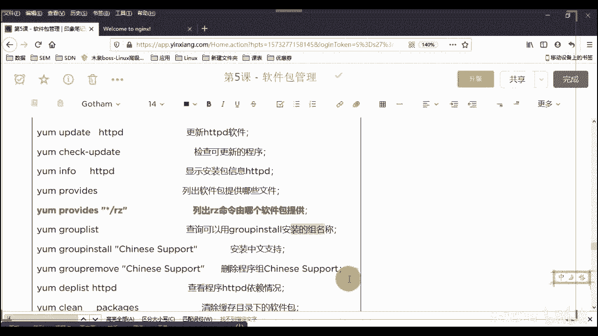
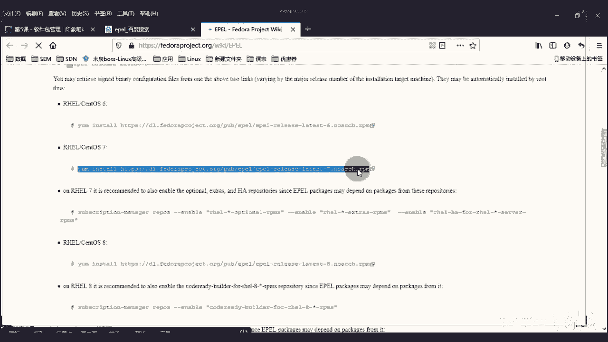

# 2020最新Linux-RHCSA入门实战课 - P6：RHCSA-第5课-软件包管理 - 新盟教育 - BV1Fg4y1z7kS

。

怎么呢？因为是到了后边的时候，我们会经常接触很多的安装的过程是吧？所以呢我们这堂课呢主要的其实也是个小实战。ok我们会在这个课程里面通过okK通过我们的RPM。啊，通过我们的这个这个亚码是吧？

通过我们的源码啊，通过源码，包括我们的一个二进制啊源码啊进行一个软件的部署。好吧，软件部署。那么呃大家注意啊，就是学的时候不要想不用在意它这个软件是干什么的。

我们只是通过这个方式去了解一下这些个不同的软件包我安装的一个过程。那么在后期的时候，okK我们遇到了，那么你在安装的时候就不会说老师我蒙蔽了，明白了吧？是这样一个情况啊。啊，行，我们来看一下啊。

那个呃软件包的话，整个课程来说的话，第一个来说讲的叫做RPM软件包活理。好，呃，到现在也没明白是吧？我先讲我先讲别着急，好吧，别着急。好，先说这个RPM是啥啊，RPM是啥。它实际上来说大家记住了啊。

我们在lininux当中的话，一般会把软件分成两种类型，第一种的话叫做二进制包，一种叫做源码包啊，那么我给大家列举了出来了。那最大的一个区别很简单。大家只要想一个问题。

我最终的话是要把我的工具或我的软件安装在我的系统上，没问题吧，安装在系统上。好，那既然我安装在系统上，请问一下系统就是计算机啊，那计算机的话认识什么语言啊，大告诉我。😊，计算机的话，这识什么语言啊？😡。

哎呀，计算机这是什么语言？计算机。😊，想想想想想想这那是什么哎，零和一是不是哎零和一哦，零和一好，我们管它叫做二进制，也可以管它叫什么来？叫做我们的机器语。好吧，这是机器语言。

那问题是很多同学说我说机器语言是怎么来的，它怎么就是二进制了呢？好，来看一个东西啊。😊，那还有个东西啊，哎汇编语言是吧？呃，跟汇编的关系还不是特别的大闹剧了。那么二根就是这么来的啊。

我们说呃冯大家知道冯诺伊曼这个人吧。😊，知道吧？冯诺伊曼这个人你们得知道吧，这个人你们要是不知道的话，咱计算机白学了啊，也就是我们的计算机支父是吧？计算机支父啊。

他发他主要就是他为我们的计算机去奠定了一个基础。什么基础呢？是我们计算机的五大组成部件。好，哪五大部件呢告诉我第一大分别是我的处理器是吧？哎，第二大部件呢是我的哎处理器控制器。第三类是我的存储器。

给来啊，三是存储器，啊，第四类，第五类分别是我们的输入输出，对吧？输入设备啊，比我们的输出设备。好，对了。那么这5个其实不用多说，这个同志们，我们把前两个一组合，这两个组合起来叫什么呢？😡，叫什么？哎。

叫做我们的CPU对吧？叫做CPU啊，叫做CPU当然现在有的地方叫有的有新的技术啊，叫做GPU的。我不知道你们有没有接触过啊啊，其实跟它是类似的，只不过比它呃用的地方不一样。在AI里面我可能会用GPU。

😊，好，存储不用讲了，就是我们的硬盘嘛，对不对？硬盘U盘。对吧这些东西啊，硬盘U盘啊，那么除此之外呢，输入输出不用说了，输入的话就是我的键盘鼠标对吧？鼠键那输出的话就是显示器，明白病吧？啊。

当时游戏手柄啊什么的，我就不多说了啊，声卡显卡不在这些的范围之内，其实正常来说啊，那么当好了，这里面最核心呢一定是你在主板上的那个CPU对吧？啊，CPU啊，于是问答一个问题。

我的CPU最终我是哎加减乘除，我能做哪些预算了。我能做哪些预算操诉。哎，我能找点去算。存储主要是呃存储一般指的是你的硬盘啊硬白硬盘。这做哪种啊，接来啊接来做什么啊，只能做加法。

大家种只能加法接来啊只能加法。智能加法。哎，那你说老师我要是做减法呢，解法也是加法的一个变种，对不对啊？只能做加法啊进来。那么老式的。😡，CPU啊老式CPU哎，别着急啊。

其实非常话的明白减法也是加法的一种预算，对不对啊，老式的CPU的话会有针脚，见到过吗？见过人刷一见过人刷一。啊，我画了三方啊，画了三面。好，见过对不对？好，OK那么一般来说会在这一面的话是加法啊。

第一个33这是这个这个加数是吧？这叫加数。好，那么下面这个位置呢也是加数，这边呢是其结果所谓的和是吧？核运算好太好了。那么在这些针角上，实际上大家记住啊，我是由一个个的小开关，它是非常多的小开关组成的。

😊，好，那么这些个开关注意了啊，别着急，别着急，这些个开关我只是简单画的，有N多个针角了，明白了吧？有N多针角呢，都在你主板上的，可以连着就可以看得到啊，现在CPU都是焊接在你的主板上的，明白了吧？啊。

那么一个个小开关，当这个开关闭合。好，那么它视为一，当这个开关打开好，视为零看起来明白了吗？你的零和一实际上我们都明白是最最接近所谓的物理信号的，对不？明白？

那我们的数字信号就是零和一物理信号在电脑里面无外乎是电信号转换过来的，明白了吧？😊，是这么来的，零和一对吧？机器元好，也是我们计算机所认识的。那么老师这个那那那那问题是你还要软件包，对吧？那软件包的话。

请你注意了啊，它们是什么语言？软件包来了？软件包里面的语言，我们管它叫做高级设计语言，高级程序设计语言。啊，例比方说像所谓的C像所谓的Cplpl像我们的java是吧？像java啊，甚至大家注意啊。

甚至大家注意比C更简单的什么VB是吧？VF这些个也算明白吧？这的程序开发是你啊，那么这些语言的关系其实很简单，就是到了越高级的语言。😊，越高级的语言啊，我们在写法上，也就是其语法上会越简单好。

但是其逻辑越难啊，逻辑越难。啊，那要说越简单的，你比方说我们有个VB，或者说我们可能还有个更简更更差的啊，更更低端点的开发语言。记住了，比方说我们的汇编是吧，汇编不算是高级语言啊，汇编语言。知道了啊。

汇编语言的话是你需要哎，这不是的不是的，不是看你的这个呃语言的执行效率，不是跟那个没有没有那个跟效率没有太大关系啊，是你要写的东西越多。啊，你写的东西越多，但是但是到了，是你写的东西越多。

但是你是可以一眼就看出来哎，什么意思，明白吧？啊，你不需要现在这些代码写完了，看完看不懂，明白了什么逻辑啊，都对吧？啊，汇编是非常非常直观的好，那么这些语言请你们注意了啊，你们注意了。

它实际上你们要了解的一个是C知道了？C语言。😊，啊，最源python。好了，这个是比较去消耗什么？告诉我消耗CPU还是内存，来告诉同学们消耗CPU还是内存啊。能走吧？不知道吧？知道吧？啊，记住了啊。

哎消耗CPU多一些知道吧？逻辑大，他逻辑强嘛，对吧？java是耗什么？啊，java相对来是比较消耗的是我们的。哎，消耗我们的叫做内存的啊。对吧？哎。

java消耗那是CCpyython这种能消耗的是CPU。所以大家明白一个问题，看你后期的工作啊，你们的业务一般来说，中小企业的话。中小企业我们一般会用的tcan比较多。对吧他们看的多，所以这个东西的话。

我们一般都会去消耗的是内存。所以你要注意的是什么？哎，注意你服务器啊，你的内存的续代，明白了吧？啊，那我们的大型的公司啊，大型公司，这就是为什么大型叫华为是吧？为什么华为要自主的研发芯片。😡，为啥呀？

为啥？这在大家明白问题啊，语音方面对吧？语音也好，还是说一些个高级的这个这个语言也好，它都是慢慢的。但是面向什么面向对象叫OPP语言，对吧？它消耗都是逻辑消耗是CPU大量的消耗。所以是这样子的。

明白了吧？啊，好，那么这些语言我说既然是消耗它，那么我计算机是不会直接认知的，你没有问题吧？同学们，你像的话，那linux里面比较好的是什么？是你能看到是源代码。

那大部分情况下我的源代代码垃圾度都是C和C加加的。😊，啊，C和C加加的解了啊，我们现在要讲的大部分都是C和C加有没有java的？有java的话呢，不在我们的源码里面啊，不算原码的。好。

那C和C加加在我们的这个点点这个这个linux下叫做叫做什么叫做源码。那源码我们不认识，明吧？同学们我们不认识，我得想办法把它翻译成我们的零和一，那这个翻译的过程叫做。😊，BAE能理解了吗？能理了吗？

先把这两个字机来叫做编译。😡，来啊，做到编译哎，高进元翻译成我们的灵。哎，可以啊。好，那么但是然好了，但是好了。哎，那么既然我要给你翻译，我得有个翻译官，是不是？好，我们说了，s是个翻译官。

他翻译的是linux的命令和我们的内核之间的一个交流。😊，那老师这个高级语言和零和一之间的翻译官是谁？也是个工具，叫做GCC大起来或GCC杠Cpl。😡，谢大家啊，C语言和C加上的编译环境。

这个记住啊是我们linux下okK源码安装。必需品啊必需品不用多想，想想怎看啊，必需品。好，呃，这个的话其实最早期是用在unux上的，只不过是在后期被我们的linux托瓦兰德啊。

就是linux老大干嘛移植到了linux上来，现在正在用，对吧？现在正在用啊，所有的记住所有的linux的版本上都可以用。甭管你是sto的红帽无斑图还是凯lyok吧？啊，这两个软件进来。😊，好。

所以综上来说的话，我们现在linux里面一共有两种，一个是二进制，一个是元版包，大家都能清楚了，对不对？好，那么。软随着这个互联网时代嘛发展吧，那你肯定软件越来越多。

我们最早期的话就一个QQ现在QQ微信，当然还有很多其他的交流工具，阿里有钉钉，对不对啊？😊，那么。😡，越来越多了，我怎么管理呢？😡，讲了哎，RPM是第一个我们真正的软件管理系统或软件管理包啊。

那RPM本质上是二进制包拉进来。啊，是二进制包。好吧，那么他是谁负责的，是由鸿贸公司来提出的，哎是红贸公司提出的，明白吧？啊，这部是我加的啊，这本是我加的啊，哎，是鸿茂公司提出提出的啊。

那么呃它一般来说都是以点儿RPM为结尾。你们现在可以看到的啊，像我们早期大好了，这个一会会说到。好，那2这个这个源码包的话呢，我们一般来说带好了，都是以TAR啊点z啊，一般是点TR点GZ。这个算什么？

是我们在Lux下的一个标准的压缩包格式。😡，啊，CIP啊RER有没有在063也有，但是也有。但是我们一般是以这种为主。啊，按一般是一般是什么？一般是绿色软件，就是你解压了，直接用明白了吧？

一般是解压了直接用啊，这个就类似于我们在windows上的这些个东西一样都是压缩包，好不好啊，以M为结尾的二进制包这不用我说了啊，那么最大的一个区别是什么来？好了，大大区别是呃。

如果说如果说你的这个包里边你可以看到什么点H点C大家看好了，点CPP这是C加加点CC好，这种结尾的源码文件，当好了，这是头文件，我已经说过了吧，一开始点H点head啊，头文件。😊，哎。

C语言里面编写和C加里面编写经常用的啊，那么这些都是源码文件。啊，就找好不好？哎，那么呃呃呃原码包，那么代码里一般如果是有bin的可执行的，我们都明白了，这就是banary嘛，不就是二进制包嘛？好吧。

这两个区别先记起来啊，把这两个区别。好。那么红sto属于红帽公司的。继子是吧啊，收养过来的，那么呢它也继承了我们红帽的这个管理工具，叫做RPM全称redhead package manager，好吧。

呃，然后这个东西没什么可说的，大好了，只要是红帽细的，你肯定能用啊，红帽系的你肯定能用啊。除此之外的话，其实你知好说乌 two能不能用也能用，明白吗？你也能做RKM工具啊，suszy这一步我说了啊。😡。

好。那么太好了，一但是但是但是。为什么到了？现在老师有人还在单纯的用RPM吗？因为我给大家其实也看过了，是不是当我们挂载之后啊，当我们挂载之后。😡。

好，mon对吧？ET呃DEV下C路。杠M问T改好了好，LLM问T下package，大家可以看到我里边的话是不是有一堆的我的软件啊，告诉我是不是并且都是以RPM结束的。

没有奥病们。来来来。没毛病吧啊很多很多对吧？很多很多。😡，好，那我说了太好了，这个是你的仓库，这是你的仓库。这些包其实你都是可以单独去安装的。啊，用什么命令呢？就用一个RPM名单啊。一般来说。

红帽和scle里面自带啊，scle里面自带。那么我们一般装的时候是杠IVH3个小参数啊，这三个小参数表示什么啊，后边软件名叉叉叉点RPM。😡，甚至大家注意了啊甚至注意了，像我们的亚马和别着急。

这三参伙会讲啊，亚马和我们的RPM注意啊，它是可以直接网络安装的。😡，啥意思？就是你看老师有的软件，我是直接HTTP冒号杠杠是吧？

3W点儿百度点儿com啊杠或者说老是3W点儿这个NG是吧NIGNX点ORG杠它里面的RTM看带好了，这样子是能够直接网络下载安装的。明白了吗？你不需要下载本地再安装，直接装就可以了，是允许的啊。

允许的好不好？啊，那只不过你要看一下这几个呃软件的名称，看好了啊，一般呢我的格式的名称都是这么写的。第一个来说的话，version版本。

接家说到versionion no no architecture。这个意思是说的是我可以匹配任何的平台。没有平台限制。😊，明白吧？没有平台限制，no architecture这意思啊。

再跌到architects，这是源码，看到没有？源码的来基于原码过来的啊，往这看几种这种几种代表啊，几种代表看到没有？改看了吧？哎，这是你的格式，看到没有？😊，不是。好，那讲了名字对吧？

版本architecture架构是用的硬件平台是吧？你的CPU的型号。这个这是32位的还是64位的啊，后缀名对吧？哎，圆码宝看到没看到没有啊，圆码编译生成RPM。😊，原码我就不用多说了啊。

EL的话这是扩展包。这个其实我说过了，对不对？EL这是扩展包是吧？啊，6啊，这是六版本里面的deil，这是开发组。😡，啊，进来。叫做开发组包我单一可能叫。啥意思啊？你白问老师，我装my circler。

😡，哎呀，my circlercle到了。好，my circle的时候，我经常会报错，老师什么 error呢？好了？这个 error请大家借出来。好，告诉你们缺少。😡，请你们注意了。

这个地方请总结下来啊，很多同学老师我后面不会是吧？😡，啊，后面软件我会提问你们的，缺少某某看同学们LIBRAARY。啊，或者老是缺少什么点H啊，缺要什么点C文件，记住这类的问题都是一样的。

是说你在安装的组件里边缺少这些个依赖函数。那是这些依赖函数在哪，是在与它所同名的。进来与它所同名的开发组包里边杠demo。

啊，没有空格是杠dble。😡，能理解是白？这个包是开发用的，开发一般是要比你的环境真实的生产环境功能要多的。因为他可能有的有bug。能理解我吗？来领刷一。好。啊，所以这个包请你们记下来啊。

这个问题也请记下来。好吧，后边的话我们做语文版的时候，我直接就提问了，我不我不做二次介绍了啊。😡，这个是经验的问题啊，你们能不能自己总结下来好不好？

no architecture软件装在任何平台上无限制是吧？无架构限制，无底层限制。😡，啊，常用了三个我们的标签IVHI的话表示显示软件的信息版本描述啊，这个是要记的。好吧，哎艾嘛对吧？

information啊，V的话叫做wall voice打印出其详细的信息在安装的过程当中啊，显示详信机。对吧安装出什么问题了，也可能会给你显示出来。你要不显示，那就没有，明白吧？啊。

H话就的哈西看到没啊？打印我的进度条，这个没什么多说了，是不是你安装了百分之几了啊，这是这三个。😊，行了啊行了。啊。呃，upgram这这就是升级是吧？我们也比较常用。老师我想把这个软件包升级，是不是？

但一般来说大家知道啊，我们很少有做单个的依赖升级的。因为你要明白一个问题，环境的依赖可能是连贯性的，你升级一个造成连贯性的反应，导致老师，我把这个修补好了，另一个出问题，明白了吗？所以一般环境稳定。

我们不做特殊升级，明白了吗？除非这个软件特别要求，而且要求之前我一定要在我的测试环境去测试。尝试我是否不会影响其的财余选上机到正式环境，生产环境。啊，不允许直接生产环节，直接upateno啊。😡，进来。

好，其他的应该还有啥这个强制安装卸载，这个明显的就是不允许我们很少在生产环境面用的，明白了吧？啊，卸载的话就是E杠E对吧？erasser啊，擦除对吧？橡皮擦erasser。啊，然后其他的应该就没有了啊。

这个list列出来我们当前的RPM包。啊，ok还有一个权是Q和A，我们常用的常连用，就是显示我们当前安装了哪些。啊，显示当前安装哪些。啊，类似的是我们现在有哪些个RPM。整个整个系统里面好吧啊。

那我么来看一下，看一下，比方说老师此时考了啊，考了哎，这样子这样这样讲，我想想我想想啊，想想啊怎么做怎么做啊，怎么做啊。😊。

Q的话是cra是吧？cra查阅请求输出信息，有没有这个包，我们来试一下啊，试一下，改一下名字啊。what's name。

啊，因为我们很久不用RPM了啊，跟大家说一下RPM哪里还在用，我们互联网一般不用RPM装。😡。

啊，抓SMP吧SMP不需要啊，记住啊，RPM目前来说，互联网基本不用。😡，啊，互联网基本不用。啊，我们基本没有，那边哪里面是国企啊，银行比如来先银行吧，就是银行吧。今天大家说过的啊。

就是之前的话出差去那个那个那个呃是深圳的啊，深圳的是叫叫叫什么来着？也是中信的啊，也是中信银行，中信银行的一个分部门啊，中信啊，但我一个问题啊，中信就是银行这种地方它是特别严格的，它是不允许大呀。

是不允许你用。是吧外网的软胶包。😡，好了，即使说老师这个外网上，比方说老师我从NG点ORG可以吧？啊，当然N不是不允许你用了啊，这种开源产品啊一般都是用红帽的的。好。

那我说ORG我发现了我安装有个NG点RPM啊，看了同学们，由于我们不是红帽官网的，导致我们是不允许使用，能明白吗？😡，啊，不予使用。好，那怎么办呢？你必须记住必须是官网的。啊，必须红帽官老。而且那好了。

即使你是官网，也不允许你建立藏库。啊，不许建立仓库，参不仓库y么吧，我们说过了，一会儿会就选了好吧。哎，不允许你建立一样我的压M仓库，啥意思？知了好，你有100个ERPM，恭喜你是吧？请你一个个装。😡。

对了吧，一个个的装一个装，于是乎很有可能那好了RRPM会产生连锁反应，什么反应？好啦，什么反应啊？是老师我会出现更多的依赖环境。哎呀，越来越多的环境。啊。

更多的依赖环境导致老师我们从100个包突然的变成了500个，这都是有可能的啊。这500个你体验装了，明白了吗？所以其实银行的项目并不难，难的是找这些软件，你明白吧？难的是找这些包。啊。啊。

甚至我之前也说过了，结果呢你发现老师软件A。😡，何必。😊，好，看好了，核心。这三个呢好了形成了死循环。啊，形成了死循环。啊，什么死循环呢？A需要B，B需要CC哎A需要B，B需要CC需要A，这就叫死循环。

明白吗？同学们，但是由于你RPM是一个个的装，你咋办呢？😡，说吧，你咋办呢？就大一招好吧，就打一招啊，然好了，这种死循环很简单，是教我们的RPM。好，放到一个目录下。😡，用什么呢？用RPM办好了。

叫什么呢？叫做local instore。😡，叫local e后边跟的是你的星点RPM。三个软件。啊，这样子它可以让你自动的依赖安装。这三个包啊，你们三个人就不会说他缺他他缺他他缺他了，好不好？

把这个给我记下来。因为你们后边到了我们学到hetbeat的时候，你会非常头疼的。hartbeat得有无数个包啊，少说了10个包KM。😡，好不好？来O上1。啊。请你们把这一条命令一定记下来啊。

公司里面可能你们后面接受银行的就要这么用，好吧啊，其他的是RPM直接用了，好吧啊，太难了，别着急啊，这地方没有给你们例啊，后边的话就是Q来家看一下有什么区别啊，就是RPMQ杠Q是吧？

HTTPD找一下有什么区别，就是告诉你装没装装了吗？notote错看到没有？QA啊明白QA看了吗？就是查找你现在已经装的所有具备HTBD的名字的软件。😊。

行了吧。好，第3个RPM杠Llist啊，你装这个QL吧，QL吧。看HB忘了HBD。啊，也是没有装是吧？这其实这三个基本上意思都是一样的啊，我们一般就是用Q A查你是不是装了，明白了吗？

你比如诉老师y么做杠YHGBD你再来看现象是什么样子，我我把它装上。😡，啊，无用是亚板安装啊，我用是亚板安装，好吧，不着急，老师亚M和RPM什么关系？😡，好，RPM杠QAHBD。看一下来看到没有？

这是我装的软件的名称。版本号看到没有？哎，7版本下的sto64位，看到没有？打下。啊，对了。好吧。😊，那有时候我也会这样子的好了啊，这样子gup。😡，啥意思啥意思啊？看了，同学们。

这是所有我们所有我们安装的EHDV的相关的工具。看这个不是你的HE本身，但是这是你相依赖的环境，明白了吧？依赖环境我也可以列出来，只是中间加了一个公管符graph一下。😡。

啊，对了。好吧，E的话就是卸载，这我不用说了是吧？哎，这个是我们看到没有？相关的依赖包师傅安装，你看没有？相关的软件包。😊，啊，IH就是安装直接装就行了。UR升级，这应该不用我提了吧。然后这个就是。

不装其大意赖，不装你自己。😡，啊，不你是RPM我改好了，我用的是亚么啊啊，为什么我不用了？很简单，就是第二个来说应该介绍亚么安装，亚么我放到最底面去了。😊，啊，赶快抄啊赶快抄啊。

要么记住就是RPM的升级。这是RPM升级，你不是一个个的装吗？没事儿，我现在给你打上包了，同志们，我已打上包了。😡，打包干嘛呀？😡，打包干嘛呀？很简单，让你自动匹配依赖。😡，自动去解决问题安装。

理解了吧？啊，亚么的诞生其实就是减轻了我们网络，减轻了我们运维工程师的一个安装上的麻烦，更效率化了。别下同志们。啊，为什么我放到最后也就会有自建仓库的一幕。啊，请你们注意一个问题啊，请们注意一个问题啊。

就是样。互联网公司和。银行国企最大的区别在于国企是有的是时间，你随便耗，明白了吧？啊，总之稳定为先，你搞定了好，我偶出任何的问题，我就不找你麻烦，责任制，明白要责任制啊，不担责就行。

互联网公司的特质是效率成本。哎，明白吗同学们？所以我用亚麻装没毛病，为啥？因为大家知道亚麻仓库就是一堆RPM的集合，理解了吗？好，这些个RPM都是我们经过什么二次开发编译出来的。软件。

我们自己建立的仓库。😡，啊，我不是单纯买过来就用了，我是要自己改发的。😡，好不好？先了解RPM就OK了。😡，现在给家拍吧。哦，下一个是啥？下一个就是我们的T2。😡，T2啊。第二款件软件包带好了。

TR的话呢是我们在linux下的一个压缩和解压缩。啊，两个融为一体了。你只要记几个参数呢，一个叫做XVF和C知道了？C叉VFG这5个参数就可以明白了吧？你记这5个参数就可以啊，老师为什么只记这5个参数。

哎，为什么只记这5个参数？😡，啊，看好了。5个参数。C叉BFG。好，那我们说了标准的。😡，标准的这个压缩包。啊，标准压缩包是什么？😡，这两个时候是么？是。哎，别着急，一个说是TAR点GZ没毛病了。

同学们好，那么这个来说，创建就是C。😡，啊，创建是C，解压是X啊，就是压缩是吧？压缩是C，解压是X。所以这两个大家住了，这俩是无法一起使用的，永远见不到一块儿。好吧，永远见不到一块儿。好，V的话什么？

V的话什么是显示过程。😡，啊，显示我们的解压和压缩过程。啊，跟上面是一样的。啊，F呢F什么意思啊？F指定文件吧。😡，对吧老师，我是对文件码，的一个文件啊，明白吗？好，那么并且请你注意啊。

TAR可以算是我们少数少数在我们的参数前不需要啊不需要杠或者杠杠底。😡，啊，命令。就是老师我要解压一个命令，比方TAR，我直接XAF解压，然后file name点TAR点GD理解了吗？来6上1。😡。

它是少数我不需要的啊少数我不需要的。😡，啊，少数我们需要的啊。好。这是解压显示这个文件，对吧？我们有写V老鸟的话，你不用显示V啊。有的时候新手的话，我建议你们用个V看看它的解压过程就可以了，好不好？

同志们啊，那而G呢G呢是吧？那么我们还有一些特殊的这个这个。😊，特殊的啊特殊的这个这个结尾。你比方说有什么大家知道吗？比方说BG数。😡，对吧比方说BC two，那么此时必须有个G参数参与。明吧？

Z参数你要把这个这个这个为什么我没有写Z参数，大家记住啊，如果是如果是这种标准格式的话，我们可以省略这个Z参数，它就是指的Z就是指的这个格式，明白吗？G指的就是这种格式。😡，除了这种格式以外呢。

都用G表。😡，对了吧，所你可以看一下啊，你看一下C创建对吧？C是创建呃，还有哪里啊还有哪里啊呃C。😊，X解压对吧？GBZ数看到没有？BZ数G的话，Z就是Z吧GZ看到没有？看吧，这两个啊。

然后F指令文件是吧，指定文件名称，然后还有什么？😊，还有什么呀？啊，还有一个C应该是C。哎，C裂了吗？这了这呢这这这。😊，CC也要记下来啊，C也要记下来错了，大写的啊大写的啊大写的啊好，啥意思？😊。

到了。TRXF file name好点TR点TC好，这个解压的是解压到当前目录。当前目录下。啊，同名的目录。那么如果说老师我想指定目录呢，哎，比方说我就在它后边要跟上杠C。比方说老师我要解压到OPT下。

看么？解压到OPT下。啊，把这个写下就可以了。好吧，123456一共是6个参数啊，一共就6个参数。不难吗？同志们啊，格式的话是解压。那老师压缩呢好吧？是TRCF或CVF啊，CVF都可以啊。

这个要跟上鸡的，这样跟上鸡的啊。好，那么前边记住没事没事啊，我还好吧，我想一般都这样子啊。好，前边的话记住啊，是你的啊压缩包名称，你要先命名。😊，啊，压缩包名称，你比方说老师叫什么呢？

叫做back up BACK back up点TAR点GZ好，后边是你要压缩谁？老师，比方说我想把root压缩了。知到吗？这个过程是压缩的。压缩的格式。啊。先写名字再写你要压缩谁。好吧啊，这样级了啊。

其他的没什么可说的，就是TR好吧啊，TR我外乎大家以看一下TR解压啊，这是创建是吧？创建包对谁创建对think呼录啊，这个就是杠T的话，我们一般直接查那里面内容，我们一般不用啊。

这边就解压出来了RF对吧？追加。😊，压缩压缩啊，一般一般都是直接的，你的这个这个压缩哪些都提前列出来啊，不会这么去用。看到见没？这些个小杠都是能省略的啊，TR是能够省略这个小杠的，好吧，我就不多说了。

好不好啊，BD数就是有机看到？这比有机对吧？然后其他的没啥了。下没啥了，对吧？下没啥了啊。😊，这个可能就是说哎老师我要压缩的话，除了哪些个不做压缩。我想要把这个这个所有的目录进行压缩。

所有目录进行压缩好，然后呢，我把这两个包我不压缩进去啊，除去这勇哥。啊，用的是这个杠杠exc。压缩的时候加Z是有必要的嘛啊有必要有必要。啊，C啊压缩的时候有表。好吧，压缩时候我不去写了吧，那我写了啊。

😊，啊。知道吧？啊，所以这个参数表大家可以自己去看，我重点给你们介绍出来这几个你是一定要会的，好不好啊，你是一定要会的啊。TR的这些东西没什么太大的难度啊，没什么太大难度。好吧。

最后的话GIP老师linux里面有没有GIP有知道了？GIP的话，就那么一个按z加？😊，啊，看一下Z参数，Z的话就是Z啊，不不说了吗？不就是这个这个。😡，TR的格式吗？这不吗GJ的格式吗？知不不。对吧。

没有了吧。进来啊。😊，啊，就是说啊。呃，按z就是用un deep去解压，它也会有叉叉叉是吧？点zep文件。到了，比方说我们在后期的时候有一个叫做word price。啊。

wordf还是我们的discus啊论坛或者个人博格的这种软件集成软件啊，他看一般都是点z zip的啊，你解压直接用一般都是解压直接用的啊。好吧，后缀名点C方没看到吧？啊，呃这个我就不用说了吧。

一些主流性质的压缩的对吧？这是镜像压缩。啊，不用带任何参数啊不用带任何参数，好吧，参数都在底下呢啊，它数在底下呢。可以看一下这些参数啊，打包的时候，ze跑就是直接打包啊，CIP啊，解压是Nze跑好吧。

😊，来看啊呃这里面常用的地归是吧？地归。😊，啊，然后。然后。没了，不好意思没了啊，没了没了没了测试啊，逆文老师，我测试下它的完整性，好吧啊，就这两个啊就这两个。😊，啊，一般其他的我们就不用了，好不好啊。

看一下啊，老师我们现在要通过打包，看见没有？GIPRV啊，V的话呢，你可以看一下是什么。V的话是这个。版本显示对吧？跟上面是一样的。啊，也是跟TR格式是一样的，看到没有？先写你的压缩包的名称。

最后一点zeep结尾啊，这个是一点ziep结尾啊，好吧，压缩谁压缩这个。😊，明白了吧？啊，根X就是我排除谁。😡，是吧TR里面是种杠杠exclude。X我们来试一下，好吧，同志们，我们来试一下啊。

因如老师我TAR，然后CGVF对不对？好，我现在把它叫做back up点儿好点TAR点PC先看一下啊，我此时来说是没有任何的这个压缩包的。😊。

对吧，我是没有任何压缩包的。😡，看到没有？本地是没有任何压缩包的好，然后干嘛？我把我的根当然了，我把我的根整体压缩。😡，看到我会显示我的压缩过程，理解了吗？我会显示我的压缩过程。

这是特别棒的一个事情啊啊。来看啊，可能我压缩了整个的这这个说白了就是一个完整的备份系统备份，理解了吧？啊，一般这个过程记住了，我们后边会学到一个东西啊。啊，这了呃我说一下啊，就是所有的。

啊呃备份上这是个备份。啊，压缩跟目录。对呀，文件也可以跟具体文件也可以啊啊，各个文件也可以啊啊，就是我们做备份的时候，会做一个系统备份，就是我会把整体的备份起来，你明白吗？啊啊，不会的不会崩的啊。

这不会崩的，好吧，因为linux没做大，明白吧？没做大。好，那一般会是要结合所谓的我们叫的定时任务看起来。定时到务，我们一般会在凌晨的几点，知道吧？大家知道所有的像更新，像备份，我们不会在12点。

12点其实是一个上网高峰期。现在一般都是在凌晨3到5点的期间，50个备份。啊，应天3到5点这做位份。好吧。好来看啊。😊，稍等啊，这个我就直接停了，好吧，我我重新给你们做一下吧。😡，哎，好像还停不了啊。

这还停不了是吧？时间还是比较长的，可能啊。对呀。😊，sorry啊sorry啊，这个还没有办法强制请他啊。啊，user其实很大的啊很大的，谁加我了。😊。

🤧，稍等。再开一个啊再开一个行，再开一个啊。😊，对user基本上就是基本上都在user里面啊，你们的所有的内容好吧。😡，啊，process基本没有多少。好。

看一下本地会不会有这个包，虽然它现在还在所谓的压缩当中，看到没有？同学们还是蛮大的啊，还是蛮大的啊，好，知道吗？好了，还有个小参数没讲啊，我说这个参数默认下肯定是以B是吧？或KB进行的单位。

那如果我想让它显示照了G呢，记中啊用一个嗯杠H。😊，啊，用杠H来显示，明白吧？啊，让它变成M，看到没有？变成带有单位的是B是KB还是M，明白了吗？好了啊，基本上那么多吧，好不好？基本那么多啊。😊，呃。

想问它解压替换系统内核的时候，系统不会有问题吗？啊，呃，不会的，熊猫，我们没有说是拿你的原有东西替换。一般来说我们会做一个整体的copy备份出来。是当你的出现问题的时候，我整体把你替换出去。没了吧。

我是把你整个东西delete的，删掉的。啊，算利个什么东西在提来给删掉的。啊，不会冲突的啊，这个放心吧。好，然后来我们接着来看。😊，啊，然后我们就来看这边应该也差不多了啊。

所以这个是一个压缩un zip我就不演示了啊，解压什么我就不演示了。好吧，您可以按照工序语去做啊，行。

然后下一个叫做源码部署啊，原码部署。请大家打起精神来说啊，为什么？因为在中小型公司企业都是用源码啊，都是用源码，明白吧？原因很简单，我说了亚么的话呢，一般都是大型的企业，我们都批量部署。由于。哎。

由于什么，我们是自己。😡，开发对吧？二次开发的。所以呢这些个一些个代码的这个这个这个这个细枝末节上，比方说老师我不需要的东西。啊，不是不是我不是说把它RM全这个这种全身啊，是我把我不需要的地方删掉啊。

呃，备份的我们后面会给你大家再再细讲，好吧，先别着急啊，先别着急，我们会有一个看这嘛，有一个专门讲备份的。😊，啊。一个专门讲备份的。地方在这儿呢。明白了吧？在这儿呢啊，这会儿会讲到整个的系统备份。

明白了吧？啊好，呃，因为我是代码是二次开发的，所以我把这个不必要的run比较比较臃肿的代码扔掉了，二次开发不需要的后门全部清掉，放到了我自己里面，所以非常的快并且安全。😊，小公司的话要考虑的是成本啊。

你越少越考虑成本啊，对不对？对不对啊，都要考虑成本。那问题在于是什么？哎，如果我要拿亚麻，其实有很多的依赖环境是我不需要的。哎就是我不需要的，它是盲装的都已你装上了。所以此时用源码包。

我们能够更加的可控更加可控。要么如果你不做调整，我所有的文件是散乱的。我可能配置文件在哪里？我可能这个呃配置文件是在一个地方，我可能这个这个这个用户文件在一个地方，源码是可以集中控制的。啊，进来。

那么这里边我们一共有3个啊，一共有三个我们的步骤。哪三个预编译？B。安装对应上其命令都列出来了。编译我只过了，对吧？同学们是一个翻译的过程，把ABC翻译成零和1。啊。

那么这个过程最终的目的是生成了一个叫做make file的文件。接下来叫make file的文件。好吧，那么在我编译之前，我要进行的是我系统的检测，就是说我的依赖环境是不是都够了，是吧？

要不然你白翻译过去，装不了。😡，好，那么这是预变译起来。简啦预别异。啊，进来啊，这个地方这生成mcel，然后边的话是基于它来进行的编译啊。好了，那么这个过程上我要累记一个参数。

特别重要的一个参数叫做perfect。😊，等于到了。等于后边的话跟的是路径。做什么？就是我安装在哪。😡，安装在哪？当然一般情况下我们说的是装在user下local下杠。比方说N就装N是阿帕奇。

就装阿帕奇，是mycyclcle就装mycyclcle没有弟们？跟你同名路径。😡，啊，这是一个参数。第二个参数呢是杠杠user啊，等于杠杠group等于你用哪个用户用哪个这个这个这个这个组来控制我。

对吧？我说了，你必须有一个用户来支撑你的服务。这三个参数请你记来啊，其他的。😡，就是我们的功能参数了。你比方说N g会有一个withs，阿法也会有一个with杠HTTP杠我们叫SSL杠model。

带家来。干嘛的？一看就明白吧，不是默认都装这里边，你不止没法装，明白吧？必须指拿起来这一步是必须指的。😡，这不是必须指的。啊，运制的。啊，好了，那么呃这个地方with啊这是明显的就是一个加密对吧？

SSL模块嘛，加密嘛，对吧？😊，还有很多呢根据你的工具啊选择业务选择make file makeake做安装好了。那么注意了，make和make is错都可以跟个杠G的参数，都可以跟个杠G的参数。

G后边的话要跟一个整数好吧，这个整数一默认是一不用写默认是一不用写好，后边24。86啊，32，大家看到了这个是什么了吗？啊，也有64。大家看到这什么了吗？😡，熟悉吗？这啥呀？这啥呀？大知这是你的内核数。

😡，啊，是你的内核数CPU数明白了吧？CPU内核数哎，没错，干嘛地啊干嘛地是我同时使用。😡，多少个。😡，内核近程啊或内核间程进行编译。啊，进行安装都是一样的。干嘛来提升我们的速率。啊。

你比方说我们后面学到mysl，我一安装一个mysrl用源码安装，大家注意了。😡，没有20分钟你装不完，知道吗？没有20分钟你装不完。😡，啊，所以这里面用它非常重要，好吧，非常重要。啊，非常重要哎。

一般都是基于你的真正的这个CPU核数的啊，好不好啊，我们常用反正个人电脑你就是8顶头你就是8，对吧？个人电脑好不。😊，啊，其他应该不用我介绍了吧啊，下午不介绍了。呃。

重点呢就是这个configure里面可能会遇到问题，遇到问题，老师我怎么去解决？大家看好了，我们来举个例子，我去安装一个所谓的N，好吧，安装一个N啊。😊。

来看。😊，啊，这个已经安装完了啊，已经压缩完了啊，夹压我就不加了啊，来看好了。😊，呃，服务器可以多安装几个CPU啊，就虚拟的嘛，对吧？啊，服务器的话啊服务器的话虚拟机的话没法虚拟啊。

虚拟机的话就还是看你是物理的服务器的话的话，你是可以多装的对吧？啊，好好了呃，我们第一步的话介绍一个命令，要么一搜杠YW get带好了，安装一个啊，这是亚么的方式。

要么安装杠Y表示确认老师如果不打杠Y很简单，在你安装的过程当中会问到你ises or no。😊，啊，我也说过了我也说过了，老师。😡，要么默认安装后，把我们的软件包删除。对吧。😡，所以老师我不想删除他。

第一个来说，你去修改我们的y么点confi，让它默认存储在某个位置。第二个来说，老师我直接用D来download的。😡，下载到当前目录下。好，我们一般用一个Y啊确认。当好了，此时在这个位置上。

你导致我打错了是吧？我没有办法删除怎么办？记住同学们，你不是没有办法删除，摁什么，按住crl。😡，好吧，CPL加上这个删除键啊，你才能加不是删除价，就是那个。箭头啊才能够把这个删了，知道吧？

很多老删不掉，你摁错了，知道吧？Y确认更Y就是省了这一步了。😡。

啊，好，安装完成，然后来看同学们，我们来打开Nject的。官网ORG。啊，ORG organization这我后我面会说啊，来看。😊。

download点击download好了好了，这里边我们随便选一个版本都行啊，右键复制后面会细讲，看过程，好吧，复制地址链接。😊，复D连接，然后Wget到了命令。好，这个地方有个小C的参数。😡。

叫做断点续传。什么叫做断点续传，就跟你视雷下片一样。啊，续传防止的是干嘛？老师我下载到99%了，中间少点包，于是乎白下载了是吧？好不容易搞潮来了，结果扼杀在摇篮里啊，好吧，哎，行行行，你们懂的啊。

你们懂的好不好？好，带好了，此时也是下载到了本地下看到没有？有1个TR点GZ的包了吧。啊，行行鬼嘛，是不是好，TRXF结了啊，加了啊，好，开刹车了啊。😊，好，来看。😊，我没有写V，所以没有过没有过程啊。

但是当好了会有一个同名的目录，看到没有？看到没有？解压了吧？同名目录啊。😡，哎，好，进到其目录当中，记住啊。要不要补课啊，都行都行都行都行啊啊，这个这个找苍老师给你做个启蒙教育，知道了啊，好的好了。

我进入到目录之后的话，可以看一下此时的内容。😊，看一下confi叫什么叫什么。😡，叫做脚本吧，这个脚本吧，看到没有啊，里面具体内容我们先不看了啊，叫脚本。😡，看一下此时到了SRC里边是你的源码。😡，啊。

后面我们有的会需要改源码，看到没有？原码CD到Q里边去看一下同学们是不是一堆点C点H文件啊，能看到了吗？😡，来了看到双一。来再发。好不好？是吧OK好，其他的几个先不用看啊，其他几个先不用看，好吧。

点confi。😊，为什么要点杠告诉我？为什么要点杠告诉我同们？😡，为什么要点杠？第杠指是我在当前目录下运行，明白吗？哎，当前目录老师为啥我不能直接？因为这个路径不在我们这个。😡，pass直下还记得吧？

我说了，路径特别重要。😡，我我为什么可以直接用成power shell？是因为这个命令的路径在我pass里面定义了。能同学们啊对就点杠confi啊点杠confi。😡，哎，是点杠confire。啊。

刚才路径，但是搭好了，源码包是无法在目目录外，至主要是我用绝对路径行吗？知道了，用绝对路径是不行的，明白了吗？同学们。😡，记住啊，原码宝是不能够用绝对路径的。😡，啊，这不能用绝对路径的。啊。

不能用这个东西了。啊，就是用相对路径，就我只识别你。因为我这个文件是针对你自己来的，明白了吧？😡，我没有针对别人。更更perfect。😡，等于user local到了，这个目录我可以不用创建。

但前面这两个路径是有的。知道了吧？杠杠user等于N。杠杠group等于N。好了，此时我们要进行的是回抽。

这个过程叫做预编译在检测你的环境。大家注意了，此时报错了，告诉大家怎么排错啊，排错的目的很简单很简单，你就找er在哪，E在哪？E在这儿看到没有？E在这儿。好，E后边这句话就是错误问题所在。

告诉我什么需要PCRE libraryrary。好，我刚刚说的这个答案，我刚说了吗？同学们。😡，我说了吧，看我刚刚是不是说了呀？😡，我说了吧，哎，在哪呢？在这呢。😊。

怎么样？好来吧，告诉同学们记住解决这个问题都是用亚马安装intstore。好，来告诉我，我要装什么软件啊，装什么工具啊。😡。

来把软件包的名称打出来。来。😊，兄学们，你看哎，记住了，所有说PCRE的一定是刚刚没好好听的。我要发现你们100遍啊，下次知道了吧？还有些N杠devo的是吧？我不说了嘛？

同志们看缺少什么什么librry，你要装的是杠杠devo，我刚刚不讲是dvo吗？😡。

哥们们啊，兄弟们，咱这个咱这个听课效果是哪来的，是吧？PCRE demomo嘛，你说老师我就装个PCRE行不行？你试一试嘛，是吧？我老师装完了再要重新编译。😡，重新预遍译，再检测它。

你看一下看一下问题解决了吗？问题解决了吗？😡，解决了吗？没解决吧。😡，是不是啊？不要跟我说没打而已啊不要说没打而已啊，你这样子没打，就后边你以定不会打的啊，我是从来不信你说老师，我记着呢。

我从来不信这个问。😡，看到没有？只有这样子我们再来进行预编译的时候，你才会发现老师这个问题真的解决了。看到了吧，所以来吧告诉学们这个问题我装什么，告诉我这个问题我装什么。😡，换问题了啊换问题了啊。

装什么底下都不用看，底下都不用看。😡，在不这边。😊，底下都不用看。又是啊都对了。哎，这个都对了，对不对？😊，大下zle杠de，对不对啊la。啊。别都不用看，大家要注意一个啊，注意这个地方。😡，啊。

答好了，老师怎么还有杠杠with lab呢？😡，很简单啊，记住了是你有的环境依赖。好，你通过亚麻是无法安装的，就是没有这个包，明白？同学们，所以我得去下载它对应的。😡，什么源码包。好。

如果这个原如果这个依赖，比方老是基赖版，杠dvo，我是通过这种编译预编译编译安装。那这后你有个路径，你要用这种方式去安装它去指令它在预编译的时候杠杠。

with杠G lab等于比方说老师user下local下叫G labb。明白了吗？这是你用源码方式安装的啊。对好。要么能装呢，不用人买。😡，等看啊完事了，然后我们再来重新预变译，看一下。哎。

sorry写错了，写错了。啊，重新预变译。啊，属美语。看看好，到这一步，哎，你也不太确定有没有错，是不是同干用一个命令啊，叫它ecle进来的ecle什么嘞？dollar问号。😡，啊。

doller问号这条命令是doller问号是用于返回我们上一次。对吧返回上一次我们命令的执行结果好，记住了啊，如果老师上一次成功。返回是零啊，如果是不成功，记住了是非零，不一定是几啊，不一定是几。

所以答然是零，下面成功了，明白了吧。好，此时本地会多出来的内容，一个是make file，看到没有？看到没没？我会多出来一个make file的文件，然后你看这说make还没完呢啊，编译还没完呢。

看到没有？编译还没完呢。那么大家记住一般情况如果预编译解决了没有问题了啊，编译一般不会有问题。😡，啊，所以我们一般是make和make is store，我们会连着写。

那么用and and就是编译成功就安装。啊，暗淡的看到没有？哎，GCC的因为没缺少，所以没装啊，JC没缺少没装。😊，好，进来。啊，我只告诉你们一个预编译的这个方案，理解同学们啊，这是一个安装的方式。

后边的话启动注意了啊，启动好，安装成功了吧。安装成功了吧，理由成功。那么它的启动方式你就不能用stteem了stem了，明白吗？它就不能用stemCTLstar老是Njectno没有搞好了。首先来说。

我还要增加一个用户Nject杠S no logging。😡，为啥？😡，我为什么要增加一个用户啊？我告诉我学学们，我为什么要增加一个用户啊。😡，为什么呀？为啥呀？为啥呀？是不是因为我刚刚预编译的时候。

想想我是不是指定你了，对吧？你得有吧。😡，对吧你要没有的话，我谁负责我啊？😡，对不对？所以你得反应反应出来啊，所以我得把它加上去啊，好吧，我得把它加上来。当时你要不加，你在启动时候会报错。

会告诉你要加它啊。😡，那时候我没法用stem去启动怎么办？很简单啊，就是了源码是自带自己的启动命令的，在哪儿在你安装的路径下带好了。😡，好，安装录下，你们觉得是在哪个目录下告诉我同学们在这每个目录下。

😡，那目录下。这个是配置，对吧？一看配置文件袋，一个是我的网站源代码，一个是日志SB哦命令对吧？😡，它里边就那么一条命令。😡，所以说。😊，改好了，此时n state查看端口信息。

nest state查看端口杠L列举出来，N表示用数字表示T是TCP好，80有了吧。能理解同学们。此时我们再把防火墙先关掉啊，我们现在防火墙关掉了。好，来吧，把这个网址给你们。啊，把这个网址给大家。

对吧？你们可以访问一下，是不是能够访问到了。

来来能访问到人截个图刷到公屏上来。好吧，能够访问到人刷个图，截到公屏上来。好。好吧好，解说好吧，呃，这是源码编译安装了，没什么可多说的了吧。这个路径太长了，是不是ETCprofile呃。

在ETC profilefi加入路径吗？这个路径太长了呃，不是啊不是啊，这个路径怎么加呀，怎么加呀，怎么加？😊。

你要在pa下面加，知道吧？ele你要在pa上面加，对不对白？你要让PAATH等于啊等于dollar pass。啊，冒号把这个路径加上去，你要在这个位置加对了吧？你不能够在那个其他地方加啊。

一般源码呢记住一般源码呢我们不做这种加入，但是做什么呢？你可以这样子RN杠S看到没有？user Suser local是吧？Nject S spin。分这个字我把你放到这上面来，行不行？😡。

告诉行不行行吧，软要链接行吧，快捷方式行不行？😡，可以吧，同学们可以吧？杠Sreload重启com，标要stop。造法看同学们是不是没了，洞口没了吧，s。😊，啊，这不用start，直接回车就行了。

这不用start，看一下是不是有了，明白了吧？😊。

要了哈啊。😊，理解了吧啊，就这么简单，其实。😊，懂吧这个是关于整个的这些个的软件包的管理啊，软件包的管理啊。然后后边的话是做一个亚么的。亚么其实还有我说的，就这大家都明白对吧？啊。

要么的话就是RPM的一个什么一个集合啊。

亚么就是一个集合，好不好？这东西其实没有多长时间了啊。好，那么看好了，就是为了提升我们的效率，节省时间，就那么一个作用，没别的啊，就那么一个作用。那只不过它也会有一些个常见的命令。

比方说到了叫做亚麻list。啊，list干嘛的？是列举出来你现在所有的软件包名称，看到吗？弟们？看到吗？我们暂停一下啊，暂停一下。哎呀，妈呀，太太快了啊，太多了啊，并且他会告诉你软件包名称叫啥。

软件包的版本，软件包属于哪个圆。😊，理解了吗？阿里ta属于哪个圆啊，这后面都是圆的。哎嘿哎，然后看了要么in store，这是安装。那删除呢？当了亚马re木HBD杠Y也是确认。

现在啊告诉你remo的comp看到了吗？😡，啊，这个是亚么完整的卸载，你们再来看，老师我卸载完了，我干嘛？QA是吧？RPM杠QA来graph一下HB发现。空了吧，HDP没了吧，同志们。😡。

看见了吗？看到没有？😊，看到没有，是不是就空了呀？理解了啊。好，所以这也不用多说啊，呃，工作原理这些东西其实没有太多人去研究。我是临时的话给大家找了一下，你们可以自己看一看。好吧，简单说一下啊。

就是亚么呢正常运行是两个部分，一个叫做亚么源端，一个是亚么客户端。😊，啊，也就是你的使用端原端不用说了，其实大家都明白，这个都是你是拿现用的，一个是本地人。😡，啊，一个是网络云，网络云是人家发布的。😡。

是吧客户端的就是你自己安装嘛。😡，安装端是不是你能使用端。啊。啊。那么客户端安装的所有的RPM包都是来自我们的亚么服务端亚么源啊，通过HTP或FTP这个本地fi进行发布。明啊，本地的不用发布了。

HTP和FTP是你要发布出去的啊，呃，自动去匹配它的一些内内容，对吧？这个其实没有什么可说的啊，我们都明白所有的亚么大家记住一定是以点RPEPO为结尾的啊，一定是以REPO为结尾的，这个不用我讲吧。

对吧？我们直接写过的啊，直接写过的。好吧好？起来。😊，啊，你前面叫啥名字都无所谓，重点的是里面的那几行，我讲过的。😡，是吧这就是我想过一句哈。😊，那么来看啊有几条命令啊，什要会的啊。

第一个来说安装ins杠Y对吧？search是你搜索中的包，这个一般不说哎，对，list立举出来相关的软件包list全部re移除，对吧？这个删除是指的把你这个包从原里面删掉，update更新。

看白这个update后看好了，updateinstore也能跟的是HTTPHP冒号杠杠网络上来的软件也能装，直接说。😊，啊。呃，其他的就proviide。但这个我上节课这个群里面答疑看到了吗？

群里面答疑看到了吗？😊。

瑞包树老师，我现在想做1个NS。啊，Nlookup对吧？老师NSlookup这个命令比较好用嘛，我可以去解析3W百度点com，我是在哪个地方的，没有命令，对吧？好，老师，我压吗。😡。

一思做杠Y2Slook up发现没有这个包。咋办啊啊，NS是吧？NS没有这个包。咋办。别着急啊别着急啊，还没说完呢。好，那咋办？同学们好，所以我可以用ymapro靠了星表示任意路径。

因为你不知道你的命令是在SB下还是在B下，对吧？所以用这个地方靠了NSlookup。😡，好，看了啊，大家速。😊，啊，PRVVIDOK。好。看一下看一下，他说道读取你所有的源是吧。

读你所有元扩展包我讲过吧，扩展源啊。啊，扩展园区我上节课是不是讲了呀，我们再讲到哪里啊，讲到federal的时候是不是说了呀？😡，啊，我是不是讲到federal的时候了，对吧？不着急，一会儿再说一遍啊。

一会儿再说一遍。好吧，来看同学们看一下，看一下你找什么，你找什命令啊，注意啊，看到没有？这个是不是你的命令啊？😡，啊，这个不是命令吧，这个是命令吧。好，你看到确定了是他好，软件名称呢，软件名称在这儿呢。

😡，理解了吧？这是软件名称，你只要复制前面这半拉就行了。😡，好了，复制成分这半了。😊，来，同学们要么 is做各位。看安装了吧，安装之后OSSlookup有了3W点儿。

百度点儿com。能理解了吗？啊，打进来啊，所以这个是来查询到师，我不知道这个命令对应哪个包。好，你可以通过这个方式极快的查出来。😡，啊。group list到了，这个是显示我们的安装组的名称，啥意思？

哎，上节课大家肯定都做了，是不是我这个七系统，我们一般装的是装图形，要装的是group is store杠Y装什么呀？告诉我同学们这的server with。😡。

GY没毛病吧。😡，叫serviceGUY啊。😡，考了这个安装的时候，我这个地方要有一个引号，是因为这是一个组名，是一个组名。那这个组里具体有多少包，未必你知道对同学们啊，这个未必知道。

反正基本上我记得这个得有500多个包，对吧？得500多包。啊，那我想查这个东西，我怎么查？就这个名字叫做亚么好了了。亚么GR。OOP grouplist。

来有那么多可以看到吗？可以到同学们。😊。

看下啊，可以获得到环境组，可以获得的一些组，看到没有？看有？到这了啊。对。进来啊。graphphal对吧？图形管理工具啊，图形管理工具federal包是吧？然后在这个地方的话，gno KD1是吧？

你们装是这两个啊，我一般都装是这个servGY啊，我一般装这个啊，这两个都行，好吧，后边我会跟大家再去总结这些东西的，别着急啊。😊。

好，这样记你记下来啊，这是安装，这是移橱是吧？组合套包来的好，剩下两个一个叫做make clean all，记这个吧啊，这是我们常用的去清除我们目录下软件包的旧的haers。😊，缩了头。这同。啊，对。

就是轻除一个缓存，还有一个命令叫做y么make叫做make case。😡，这没写啊这的样么。make a case没有空格啊，make case干嘛知道了？

这个是提前将我们所有的现在电脑上已经已有的我们的样本源。进行缓存一下。啊，避免了你上来一读读半天，才了下来半天，行了没？OK。😊，好吧，这些命令已经给大家做过了，这应该不用我介绍了吧。😊，来。😊。

到这一步okK就是上一。啊，到这步我肯定刷个一啊。😊，好。好，没毛病啊。那么再往下面的话就是我们要自己去构建喽啊，我要开始自己构建了，跟着我开始要做了啊，注意我好吧，先注意你们先不用做啊。

第一个来说的话，就是我基于本地的亚麻竞像，这个不用讲了吧。😊，这不用讲了，公盘里面的对吧？先挂载，挂载之后的话，我要在这里边去写1个一点IPU结尾的文件。那么此时注意了，这里边这个是唯一标识。

必须是唯一的，不能冲突。这个是名字，是可以重复的。啊，可以重复。啊，下面这个是我们挂载点啊，挂载在哪了？那挂在哪里了？挂在我也讲过了，这个事老师我们是否启用我们的源？啊，是否要检测媒介完整？

是吧检测没较完整，底下的话这是我们的检测。检测什密钥，对吧？检测密钥。気ma？写完了。这个其不用我说了，同学们啊呃不用我多说了啊。😊。

然后我们就是说嗯。cle清除，然后我们这个安装可以了吧。啊，这是个分屏软件啊这是个分屏软件啊。呃，这我们不常用，你们可以自己去了解。分屏的。嗯，接下的就。到这步结束了啊，这步就结束了。好吧。

蓝了这个来看一下啊，很多老师亚么原这个网络怎么创建啊？😊，好了，个人的你们个人用啊都是哎不是我下载一个一网络云是吧？下载网络源的时候，比方说比方说好了，现在我们做一个扩展员，叫做EPEL知道吧？

这个扩展源都是网上去下载的啊。😊。

扩展员我讲过了，是说的是你官方上。你比方说老师我我第一个来说本地啊，然后我阿里云是吧，都没有的工具。😡，都没有的工具。😡，不是说网络能源都会有所有的啊，都没有工具。比方说一些个开发中的。

或者说一些个不算特别稳定的版本的。好，我们要下载是federal里面的叫做扩展叫EPL。点进来看好了，怎么装它，他给你列出来了。😡，啊，那你列出来了。来看。😊，你看。😊，王嘉华往嘉华王秀华。

站好了EPL告诉你了最新的包是吧？六和7我们七版本当然选七了，是不是好好，这是下载RPM。😊，然后上传安装。我还有一种方式干嘛呢？看朋明白？这是七版本吧。😡，看到有要么一缩，直接把这条命令请你复制过来。

😡。

对呀。对呀，那什么叫扩展吧？看到没有？我直接把这个命令扩展过来。😡，安装。这也没犯墙，这翻啥墙啊。😡，看到没有？Y确定。大看此时安装完成，我们再来看一下ETC下亚么点儿里面。看看我们是自动多出来了三个。

对吧？微体你本地网也能连到啊。😡，VP没尾强啊VP啊。能看朋学边来OK的就刷一。😊，好。对么我们已经装好了吧。😡，做好了吧啊，有的雨一些的东西就要在这里面了啊，有的东西就在这里面了啊。好。😊。

回来看就来看啊，那老师他这个原是怎么发布出来的，了解一下了解一下啊。好，那么整个的光盘我们是默认使用的是亚麻，看到没有啊？光盘是用亚马。如果我想要去解决。

我得去发布它好了REPO叫做responory啊responory啊。😊，我们要创建通过这条命令叫做greatreport啊不 report，同学们。😡，那么其实过程呢也没有太大的作用啊。

林林鹏去接孩子了是吧？可以的可以的去吧去吧，林鹏啊看了一眼啊。好，第一步，你想把本地的挂载过去，对吧？老师，这是我的本地，所以我没有办法发这个这个发布啊，因为我是网络的啊，你们可以自己说。😊。

我现在我现在连不上网，你们知道吗？知道吧？P3W点百度点com。😡，我的网卡驱动出问题了，没法调接，知道吧？突然很尴尬的一天，给我告诉我不能调接了。😡。

好，来看。啊，呃，AT也没有用，因为因为我想把它发布出去，你觉哪个把它发布出去啊，要把它发布出去。好吧，所以呢第一步来说这个小可以留给你们一个小作业。然后我这个这周的时候，我把它改一下啊，我给它改一下。

呃，跟恢复模认没关系，是跟你的适配器的驱动有关系的啊。好吧，没关系，我把它改一下。啊，昨天突然出问题了。晚上。😊。

好了，emmony，我过来之后，大家注意了啊，我把这里边的软件包copy到你想要的任何一个地方，就是你所有的包。老师，我想复制到任何一个位置，这个是我阿帕奇用亚马安装完的默认的目录。😡，啊。

默认的目录我的网站都在这里面网页儿。看明白啊？好，奋斗里遍。然后授权啊把它所有东西杠R，因为你没有目录，对吧？所以我得把里边的所有的东西用星表示所有复制过来。😡，啊，复制过来啊。然后用这条命令。

那这条命令老师看一下能不能装上，好吧，同志们，我们能不能装上啊，要么一做杠Y好啦，叫做create啊report有个星啊吧？因为你也不知道后面的东西都有的装上29个还好是吧？还好还好还好还好。😡。

好的好了，那你比方说我放一些软件过来，好吧，我放一些软件过来啊，我们上传一些软件。

我想一下啊，我们多下载几个RPM好不好？我们下载几个RPM在本机上。😡，我们随便下载几个。好吧，呃，其实这来说是红帽的官网上去的，我这边给你们找一个吧。我找一个啊。这是三种镜像是吧？

这三种镜像包我来找一个啊再找一个。😊，啊，有很多小网站后来会给你们的，这些网站的话都是不错的，明白吧？这些网站都是不错的一些网站。😊，拍thon3。6看看啊，这个有没有啊？

sableable这个是虚拟化的这个一些东西，我看看啊。

到，这儿了。哎，不是他。

不知道。啊，这小开发的了RPM的包。算了吧，随便找几个啊啊，你不说他好吧，同学们，你不说他，我把他下载一下过来。😊。

啊，你不安装的话要干上啊。如果你是下载的话，你要再执行一步啊，知了？如果你只是把这个包下载本地，你需要执行一部RPM杠IVH它才能安装的，明白了吧？😡，啊，靠了，你才能安装它的叫RPM杠IVH。

你才能够去装的这些东西的，必须要执行啊，要然不烦本啊。好吧，然后再下载一个我们的八的版本，好吧，多下两个版本懂了。

临时一响RPM包还突然没想起来在一个网站上啊。行。😊，来看啊好。😊。

好。那师我现在根据根据情况怎么，老师，我们亚么尼斯托。😡，啊，杠YHTPT对吧？RTPT。😊，好，安装好MKDAR杠P到了word下3W加ATMLs。好吧，CP啊不用CP就是MV移走吧。好吧。

EPL好了，我用个心把这两个都移过去。😊，啊，3WATM渗透都移过去，知了？本地没有了吧，当然本地没有了，但是我们的腕下3WATM渗透里面有两个。好啦，我把这两个进行什么来进行发布，是吧？

叫create。😡，看到没有？有一个report，看到没有？有个report好，Y3W。带好了，看到没有？两个包告诉你了啊，两个package看到没有？😊。

看没有？😊，喂啊。那么这个是我现在装好了啊，走了。那么然后呢，我要利用的是HDP去发布亚母源，我现在只创建好像我没有发布，对吧？因为你是访问不到的嘛。😡，对不对吧？你访问不到的嘛，这咋办？啊。

那么我要进行发布。好了。😊，通过这个搭建完成之后，我要借助HTP当然你也可以借助FTP是吧？啊，进行把它里面的软件发布出去。主意啊，那怎么做呢？我们只需要的是这是你的这是你的安装的HTP不用我说了。

这安装的HTP服务。😊，啊，阿巴奇这是他负责的是吧？他负责软件启动这个服务好。😊。

St system CTL。star LTMD。啊启动服务出现问题了是吧？看了，这个有问题咋办？告诉我有问题咋办啊？😡，有问题咋办啊？😡，好，最后UR看了，你刚说过了，你要是通过这个方式看。

其实你看不出来什么问题，大家看到没有？😡，你看不出来什么问题啊。😡，啊，看不到什么东西吧。哎，刚卸载了，我又装了吗，不是。我们不是有装了吗？RTM杠QA是吧APPD我也不装了吗。对吧我不是都装了吗？

好吧。哎。哎，为什么呀？猜一猜，你当然看不出来，对不对？怎么看？😡，CT教你们看东西啊。W。Log。Message。看一问题来好了，在这个位上告诉你们了。😡，哎。

你不能够打开你的什么no listeningscket is available。😡，看到没有你的什么呀，大康看，告诉你了，olddress已经被使用了，端口被使用了。😡，你别忘了一个问题。

HTTBD我默认鉴定的也是80。但是此时我开的是什么？是NG80，对不对？😡，冲突了。哎，所以干嘛呢？关掉它。明白吗？关掉它，然后。大看。😊，能不能启动了？没有报错吧，巴0又出现了吧。

你现在刷新一下我这个网页啊，老师是吧？😡。

刷新这个网页。变样子了吧，阿帕奇了吧。😡，看见了吧。好。

然后这个是关闭slinda大句了，这个slins我们不讲啊，后面啊叫做内核防火墙，就内核防火墙。这个在生产环境都是关闭的零就可以了啊，就是0。😡。

好吧啊，防火墙我们也关掉了，这吧？同学们好，然后好了，我们在亚麻端哎好了。呃，在亚么端我们要去写了啊，本地要去写了是吧？呃，但是本地写的话，你们可以写一下，你们可以写一下，我的话我就不写了，可以吧？

我就不写了，因为我的话本地上已经用不了了，没法瞧接好不好？然后呢大家可以看一下这个地方来。😊。

你们只要把这个位置改成什么？改成我的IP地址，我的IP址是多少？😡。

来。😊，来。改成他。你们可以试一下，只写一个在你的样子里面去写。跟那亚么去行啊。然老师，你进行一个什么亚门一做。😡，那个那个那个什么开头EPL开头的，你试你能不能装上好吧，你试你能不能装上。😡。

可以了同学们。😊，啊，这么多啊。

好。OK吧？😊，各位吗？同志们很简单吧，其实发布发布是不是很简单？😊。

很简单吧。好。给了扩展包，这个没什么可说的啊，样明软件包的扩展啊，就是呃就是这个扩展指的不是不是说老师我只想EPL这个扩展我讲的是那小把它关掉啊，是指的。😊，对呀。这个广告还挺狠是吧？啊。

这个广这个广告啊是吧？这个扩展指的是我把我这个包重新加入到你刚刚的已经发布的包里面去，原里面去我你做，对不对？😡，好，你们老我说我现在下载了一个。😡，软件啊NFNTF。这不是那个软件嘛？

这个这个这个文件系统嘛，对吧？我把它下载下来，我看这个这个目录径还能不能用啊，因为这个包很久没进去了。😊，好，来看找不到了是吧？😊，找不到了呃，估这个包换位置了啊，换位置了，好吧。破位置了。啊，坏着了。

但是大家可以看呢，哎，sorry。啊，可以看的对吧？我可以把这些个东西干嘛呢？我把它拿过来之后，哎，看同学们，我只要一个upd date，听见了吗？啊，我只要用任条命令up date更新你就行。😡。

那此时你们不需要任何的东西，领多了你在执行的亚么cle oh亚 make就可以了。😡，试一试吧，你们好吧，你们试一试本地能不能使用我这个语。因为我这个是公网的IP，你们可以固定用，是固固定的I的。😡。

可以吧啊。好，说不多。啊，同步外网的亚么园，这个不用我说了啊，就是就是老师我把外网的下载下来是吧？下载下来之后直接执行一下，看没什么难处吧。同志们没什么难处吧，要么对吧啊？😊，其他的呃。

这个是也是一个命令，但这个我们不常用。我说实啊这句话我们不常用啊，这个我们不常用。因为你明白了，我没有我们没有说公司里面直接去扩展对方的源的，理解吧？同友们啊，能对接扩展对方圆的啊，那怎么去用的好不好？

没用是那么多，这两个的命令的话，可以留给大家小实战去做。啊，可以给大家去小时的去做。啊，你们可以试一试，但我们生产环境不做这个东西。好吧啊呃充着了火才能装什么软件的，你要看我发布的语源吧。😡。

不你们用得到啊。如果你不是同志们，我问一个问题，你真的去了阿里了，你要负责阿里云阿里云的产品的。阿里云的话是有阿里云的亚巴的。😡，不是吗？那这个y么谁发布啊，难道不是运维发布吗？😡，啊。

难道不是预约发布吗？😡，按0不了。对吧。😊，啊，你做了对吧？就是我刚刚那个呀亚么那个那个那个EPL对吧？亚么伊 store。😊，杠YEPEL星。对吧你可以试一试，我就这两个东西，我还有啥。

我就装了这两个包嘛，对吧？还没写说这边。😡，能理解吗？啊。🤧嗯。要么阿里的云像清华紫光的是吧？像清华大学的，像这个这个华为的，亚么云，你都是有人负责的呀。你不发布哪行啊，你不更新哪行啊，对不对？😡，啊。

说那么多好吧，那么这个是我们的整个的一个软件包管理。来，大家有什么问题可以问了？其他有什问题是吧？来吧。😊，没问题。出错了出什么错了啊，看看你的出错，出什么错了。😡，应该是冲突了吧。😡，啊。

应该是冲突了啊，你是装你就你自己那什么吧，因为我装了两个包，有个七，有个8，你这里个是冲突了，明显的，明白了吧？应该是冲突了啊，你有一个是已安装的了，已安装了一个7八就不用装了。

你用一个后面的参数杠杠skeep broken。😡，啊，用这个杠杠sep broken，可以忽略安装把只中7明了吧。好吧，但是你已经可以检测到我了，能明白了吗？就是你能检测到我了。😡，好了。😊，来。

其他人有什么问题？😡，其他有啥问题可以问我了。😊，如果没有就给我点名了啊。😡，啊，点名了啊。😊。

