# 2020最新Linux-RHCSA入门实战课 - P7：RHCSA-第6课-系统进程管理 - 新盟教育 - BV1Fg4y1z7kS

。

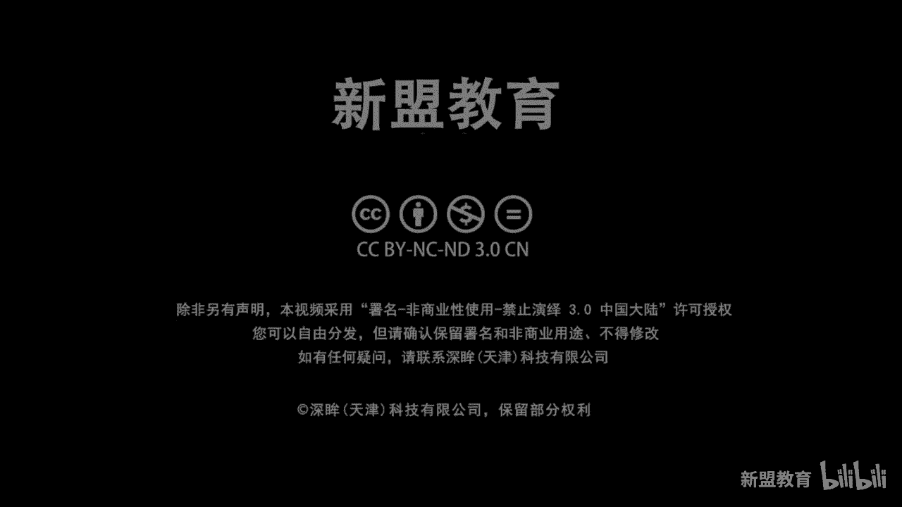

那我们先来说今天的课程，今天三啊今天有三堂课，对吧？那第一堂课的话呢是关于整个的系统进程管理的啊系统进程的。第二节课的话呢是我们的这个这个这个呃呃呃硬盘的磁盘管理的啊。

也就是说跟大家讲了简单的讲了一些个我们硬件以及呃我们FD磁盘管理以及Gdi啊，包括我们的partt三个命令啊，针对于2T以下和2T以上我的硬盘。O我如何去进行这个所谓的格式化啊。

所谓的这个呃文件系统的创建以及它的一个使用。以及最后呢晚上我们可能会讲的下午的最后一堂课讲的是LVM和read这个可以算是今天最简单的一堂课了啊。好吧，哎简单了一题原理，简单的创建。因为其实到了工作上。

我们倒是用的是叫做red阵列卡硬件去做的。好，先来了解一个问题啊，同志们啊，这是今天第一堂课啊，也是我们的系统的进程的管理。第一个问题的话，唉也就是进程啊。

那么三个小问题分别是进程市场的进程的周期以及进程的状态啊，那么呃很多人说老师什么是进程啊，这些东西我好像哎天天听是吧？但是呢我基本上没有去去去应用过啊，或我没有了解过深的。那么大家明白好。

我们安装在整个系统上。如果我想要去使用，我最少要一个叫做程序，没毛病吧。是不是我得是有了程序啊，知吧啊，谁谁谁在先评的。稍等一下啊啊，我有个程序，那程序的话说到底说白了是什么呀？

说白了OK像我们的QQ啊，像我们的微信，这些个其实都是我们的程序，对吧？好，那么当我的程序在运行的时候，大家就注意了。好，实际上是一堆我们的代码去运行。那么代码运行的时候，我们最终管它叫什么呢？

叫做这叫叫做实力，对吧？啊，叫做一个实力。好，这个实力就是所谓的进程。明白了吗？大家能理解吗？就是这个这个程序嘛，对吧？程序我本身是没有办法去用的，而我只有双击的，比方说QQ对吧？同学们QQ的话。

这个程序我本身没有办法用，我只有运行之后好，它进行那么一个实例初始化。比方说木群的是吧？木群老师吧，比方说咱们think mode等等等等。那么这些个实力单独的，我们管它叫做进程。

那么你是可以在我们的任务管理器当中查看到它的。而进程本身又是我们所谓的县成的一个集合。什么是现成啊？好了，你QQ上啊，我们的一对一的聊天啊，一对一的聊天，这些个每个窗口。好，都是其现成。能明白了吗？

来懂的人刷一啊，也就是说也就是说进程程序和现程之间的关系。好吧，进程程序之间的关系好，那么说了再用官方一点啊，用官方一点啥意思呢？就是我的程序知了，程序只有占用了我们的内存啊。

占用了我们的这个这个内存和我们的CPU这种资源，有了地址啊，有了地址，它才能够去当做我们的这个这个进程来看待啊，必须运行起来，对吧？好。所以你可以看到进程什码是已启动的可执行的程序的运行的实力。

那么它的组成的部分，第一个来说，你已经分配了内存的地址空间啊，你得占用内存嘛，要不然你没有启动，对不对？第二个来说的话，安全属性包括我们的所有权和我们的一些个特权啊。这个的话呢，你可以先把它记下来。

一会儿我们再来看。第三个记住了，okK你是有一个和多个县成的啊，一个和多个县城的记住了啊，县城的话，目前来说其实是你没有办法单独存在的，必须是基于我的进程之上。而最重要的是它的一个进程状态啊，进程状态。

那么我们在前几天的时候，群里面有同学问老师这个ki是吧？kill后边的话跟了一个什么呀？跟了一个这个HUB是吧？HUB老师这什么东西，HUB是啥？Q我知道是杀死进程HUB是啥，对吧吧？

这就是一个进程状态，一会我们会详细看我们会常见的有几种啊，常见的会有几种。你比方说僵子状态停止状态，还有我们的这个睡眠状态以及运行状态，这四大类。啊，那么呃在linux里边你还能再去看啊。

老师什么是程序啊。第一个来说我的二进制文件啊，二进制文件这些文件是禁止的。你比方说像我们很多的命令da命令，像我们的一些个启动的程序是吧HDE像SSD像NG大家看好了，这些命这些目录下都是命令，好不好？

那么我们也说过了啊，命令的话其实都是我们的二进制，对吧？啊，命令都是二进制，都是在我这个banary或者SBbanary之下的，对不对？哎，所以都是进程序，而且运行的时候。而且运行的过程。

这个过程是一个动态的。大家记住为什么是动态的？你比方说老师，我在运行我的web的时候啊，我是不是要不停的去处理我们的这些个请求啊？我一旦处理的话，这个过程我是要去消耗我们的什么CPU和我的内存的。

而且同时的话你要明白啊，我在稍后的时候，我是在去处理每个进程。比方说老师我A访问啊，A就是一个请求，A就要需要一个处理。那么这个访问的话，其实当我处理之后也就结束了。而这个过程从处理到结束这个过程。

我们管它叫做生命的周期，理解了吧。来接来啊，叫做生命的周期啊，那么来看底下这个图非常详细啊。来看同学们，我把它放大了。我把它放大了。从哪还是到哪儿看啊，很简单。第一个来说往这儿看。

当我的进程在运行的时候，看吧？同学们运行的时候，通过一个forworker的一个这个这个这个我们叫做呃插入的一个状态，干嘛呢？啊，是当你看同学们啊，我程序有运行，对吧？程序本身QQ在这开着呢。

QQ本身自身也是占用我们的内存资源的，没毛病吧。但是现在我只要打开其中任何一个我的学员是吧？同志们，我打开一个学员，我只要跟他去聊天，那么这就是一个新的记住啊新的一个子进程可，啊，新的一个子进程。

那么子禁程好了，我在执行的时候，而我原先的这个叫做副进程QQ本身他实施一场处于的是一个睡眠的状态，看灰色了。😊，灰色的只它是一名垃圾住啊，它只是比它运行的时候消耗的少一点。

它在后台运行维持它的正常的开启就可以。但是它并没有死掉，它并不是不占用资源了。进来。啊，而就当我们的紫禁城，当我们关掉okK也就是其输入了我们exist退出的指令的时候啊。

那我的副进程才会回归正常的运转。但是大家记住，此时紫禁城停止之后，我本身之前的那些个那些个资源我其实还在慢慢的关闭。而这些个这段过程，我的资源在关闭的过程叫做将死状态，叫做加家进来啊。

叫贝进来叫做将死状态。OK能懂了吧？来能懂刷一。😊，啊，老懂说，一会你还会再看到他。好吧，OK啊，所以这个进程的话，我希望大家能够呃生命的周期你要明白啊，生命的周期和他哎，对，和他们之一个关系。

你们记下来啊，这是我写着呢复进程的话有自己的地址空间，这个不用说了，你很有内存，对吧？好，我会建立一个新的子的进程。😊，对吧啊，每个进程的话，我会分配一个进程的ID大家可以看到啊。

记住这个PID不是指的port叫做process，叫做process，明白了吗？啊，来看一下，打开任务管理器，在这个位置你都可以看到的啊，在这个位置上。在哪啊。ok在详细上看到没有？

但是这个位置叫做process ID，而不叫port ID啊，这不是端口，哎，是我们的进程进程号看到没有？进程号啊，而其下游大家记住了下游啊管负的叫做PPID明白吧？呃P哎负的PPID。是子禁程。

记住啊，子禁程一定是基于负禁程之上，而不会单独出现的，明白了吧？啊？儿子有爹，记住了，就这么一个句式啊，任何禁程其实都可以创建二级进程、三级进程。记的同学们。起来啊，而我们。6系统之前说过了，有个比较。

对吧？区别在哪里啊？在于其第一个进程记住第一个进程是什么叫做in。而到了7版本里面叫做systemD对吧？所以6里边我们默认的启动的命令，记住了，一般是用ETC下杠INIT点D后边比方说HGPD对吧？

started。好，而七系统下，我们的启动程序是通过企业所谓的我们的system啊CTL。好，star上我们的HB。而这两个记住有一个通用的命令是什么呀？通用的命令是什么？叫做service是吧？

同学们叫service，我们star啊，比方说HV这两个是可以通用的啊，六个器里面可以通用它，但实际上大家记住这个命令也就是一个我们的软链接符号链接，明白吧？是我将这个程序本身链接到了这个命令上去。

而已。啊，而归根到底是一个in的进程和我们的stem的进程。进来啊进来。呃，底下这个就是我们上面的一个过程的一个介绍，这个我就不说了，好吧啊，不用给你念一遍了啊。

而最重要的是当我们老师那这些个状态是不是这些状态ok有什么区别？而它详细上来说会怎么样去占用我的资源，并且之间的调度是如何的啊，我们往下面看啊，也就是它这一个进程状态。往这看啊往这看。答对了。

而归根道底，我所有的进程是要在一个一个的CPU上去处理的，也就是进内核。这吧？同志们啊啊我们说CPU的话，老师8核是吧？或四核这些核才会去真真正正的去处理我的进程，请你注意啊啊，那么往这看，往这儿看。

由于我们这个这个进程的大小也就是它的处理的时候，这个这个请求内容不同。所以我在消耗内存和CPU的时候的时间和多少也是不断变化的，它是一个波动性质了啊。啊，那么来看这个图哎，那好了。

这个图从我的一个新的记住从我的一个新的进程进入到我们这个reable准备进行这个这个运行的时候啊，正在往我的这个内存和CPU里边去进行这个这个纳入是吧，进行。进入好，我们进行处理。然后直到哪里啊。

直到我们真正的运行，你看好了，running runningning啊，running。也就是说此时我的CPU和内存是正在去处理的过程，知好了？而从running状态。

我可以跳转到我们的sleep叫做所谓的睡眠。但是请你注意了啊，我的睡眠上有SDK看到没有？也就是说我睡眠休眠状态，后台运行其实有三种状态啊，其实有三种状态。那这三种状态，一会儿我们详细说啊。

想看大的流程好不好？正大的流程，而我在退出的时候，大家注意了，在退出的时候，我一般正常来说叫做stop叫做停止。啊，正常来说叫s叫做停止。但除此之外的话，还有一种的话就是哎喝了叫做什么叫做作be姜死。

也就是突然卡死了是吧？或有时候卡死了也算是姜死。有的时候老师我这个临时的退出，退出的时候有一部分的进程好是僵死状态进来啊，这僵子状态，那么一个图好不好啊，往上看往底下看这些个镜头我都给你们翻译出来啊。

我都给大家翻译出来，好吧，呃，每个细节，这是我在google上找的啊，我在Gogle上找的，特别我觉得是一个非常准确的翻译啊，非常全面。我把这个图呢发到群里面啊，我是希望大家这个这个这个这个。啊。

将来女儿感冒了是吧，估计去陪旅儿去了啊。啊，我是希望大家能够把这个东西自己去翻译一下的。好吧，你们看一看有什么区别跟中文啊，然后简单的来说简单来说，任何老师，我如果查看，因为在这我还做了一个解释啊。

在这儿呢啊做一个解释。啊，那么如果我在查看进程的时候，因为大家经常会遇到老师我的CPU啊，我的CPU好，或者我的内存有谁发现老师急剧的增加了是吧？急快的增加。哎，sorry。极快的加增加啊。

导致我整个系统上可能是报警，甚至有可能卡死是吧啊，卡死死机了。那么我们正常情况下如何去排查我们的这个这个呃排查我们的问题。啊，排查问题。其实最大的一个程度上。

有的时候我们就是通过去查看我们的一个系统的进程是如何的，明了吗？啊，查看进程。往这看，那我查看进程的，我得需要了解的是企业ID和他PPID对吧？同学们，包括我当前进程的状态，如果我的将死过多。

那就证明其实有一些个东西是我怎么样是强制退出的，是违法退出的。啊，包括内存分配的状态，看看哪些个我的进程占用的内存太多了，我能否尝试这些个不常用的把它退出掉，对不对？

以及我们看啊CPU和我们已花费的实际时间啊，CPU的已花费时间。也就是说我处理一个进程，我到底用了多长OK我这个处理的请求是不是值得我用那么长的时间啊，还是说我的这个这个这个服务遭到了攻击。

导致它长时间的去占用了CPU。别了吧啊，这都是有可能的啊这都是有可能的。OK哎，彭超，我看到了啊。ok彭超好了，请个假是吧？啊，我刚才看到你了。彭超，行，呃，可以可以可以可以可以。😊，啊。

稍后用户的UID啊，这个是决定进程特权，看到没有？这个就对上了。刚刚跟我们说的特权的话是你要看什么？我说过了，每一个我们的进程，也就是我们的这个这个运行的状态都必须有一个我们的用户。

甚至说我们的用户准确维持。最终说明一个事情，大家记住了，这个的目的是干嘛。是进行规则是不是进行规则。也就是说，当我的进程出现问题的时候，谁能够去控制我们的进程？谁能控制进程，对吧？哎。

你不能说老师这个进程在我的电脑上运行，没有人管。好，到后边我想管理的时候，我找不着人，这是不允许的啊，这一定是不允许的，明白了吧？哎，这一定是不允许。😡，好，往下面看啊，PS和我们的这个东西啊，呃。

那老师我怎么去查看，对吧？啊，我得通过这个查看的时候方式去去去进行这个那个这个什么呀，往上看啊，那么查看进程的话，我们有两有一条命令叫做PS那叫PS啊，process啊，那就是process的一个缩写。

它不是什么这个这个绘画是吧？只不过请注意了啊，你这边加杠和不加杠是有区别的。啊，和你们那个呃压缩TR加杠和不加杠是没区别的是两码事。好吧，这个是有区别的。因为很简单，我列出来了，当你加杠的时候。

大家明白了啊，加杠的时候是它会把这个X认为是一个什么？哎，是用户名。是用户名啊，看了A是所有us势user看到没有？A是所有us势user action是用户名是吧？

列出我们所有的user的为X的用户啊，进程。而你不加的时候，就是列出所有明白吧？列出所有进来啊，就是列出所有，你们不需要说老师，其中每一个是啥意思啊，你就把它记出来，所有就可以了。啊，这下所有就可以了。

好，往下面接着看啊往下面接着看啊呃所以我们不用多说，老师我直接选择的时候，我就选它啊，我直接选择时候我就用它是吧？哎，省得你说有的东西我想查查不到，那查不到。😡，啊。

我通常情况下呢会跟一个lessless的，好吧，哎，把我的这些东西给less去处理啊，给less去处理。less的话，我前面说过了，是可以进行我们上下翻的翻页的。命令对吧？哎，读取命令查看命令。

上下翻页的查看名录。对。

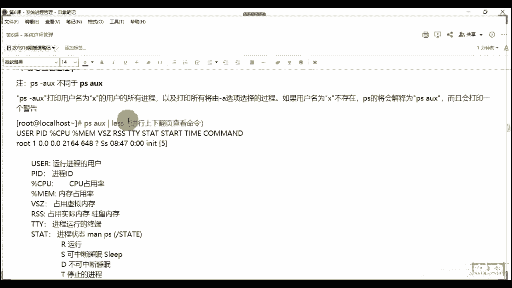

那么我们来打开一台设备啊，我打开一台设备。啊，你们也可以跟我打开是吧？也可以跟着我打开。😊。

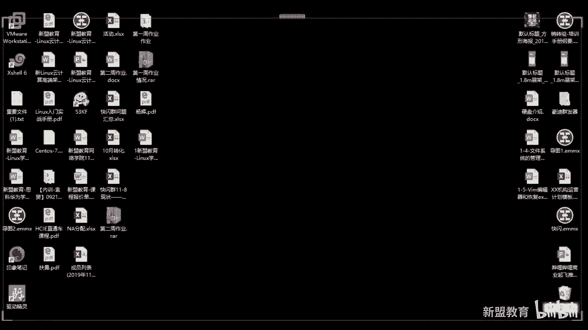

稍等。

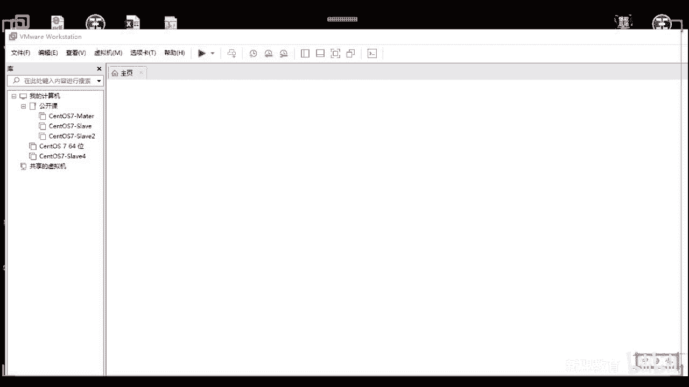

是的啊，随便开一看啊，我昨天把我的这个这个迅泥修好了啊，迅泥说好了。之前的话不能乔街了，被我把乔姐给删掉了啊，突然一修修好了居了，哎，还不错。

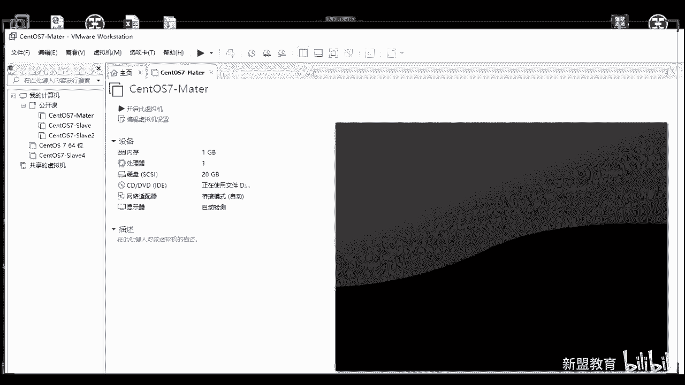

没看。啊，还原一下状态。

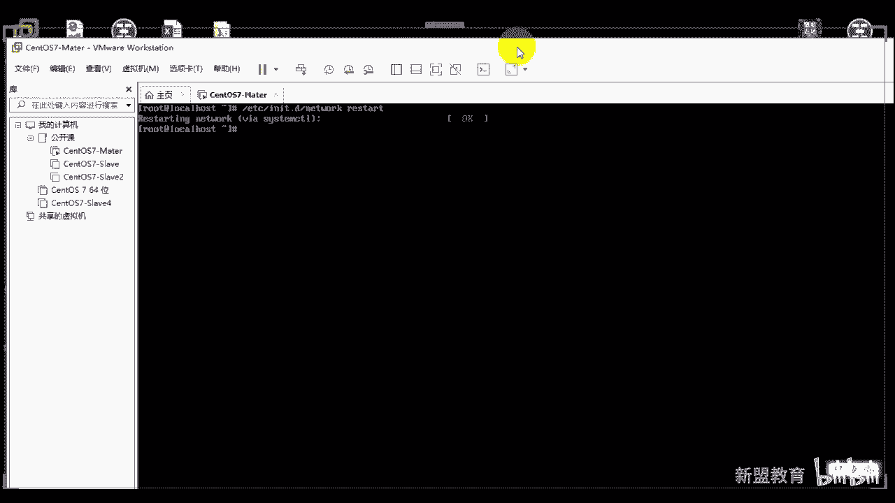

好。这是210对吧？那他是要连一下。😊。

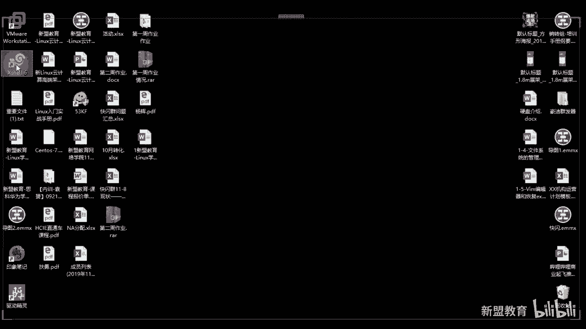

来。怎么修的？很简单啊，你就说击你那个你那个你知道改好了，你就是记住你的控制面板啊，你就记住控制面板。啊，其实他怎么做呢？你到了？控制面板。是吧控制面板，你看啊你在控制面板里面有一个什么呀。

有个删除或者添加是吧？

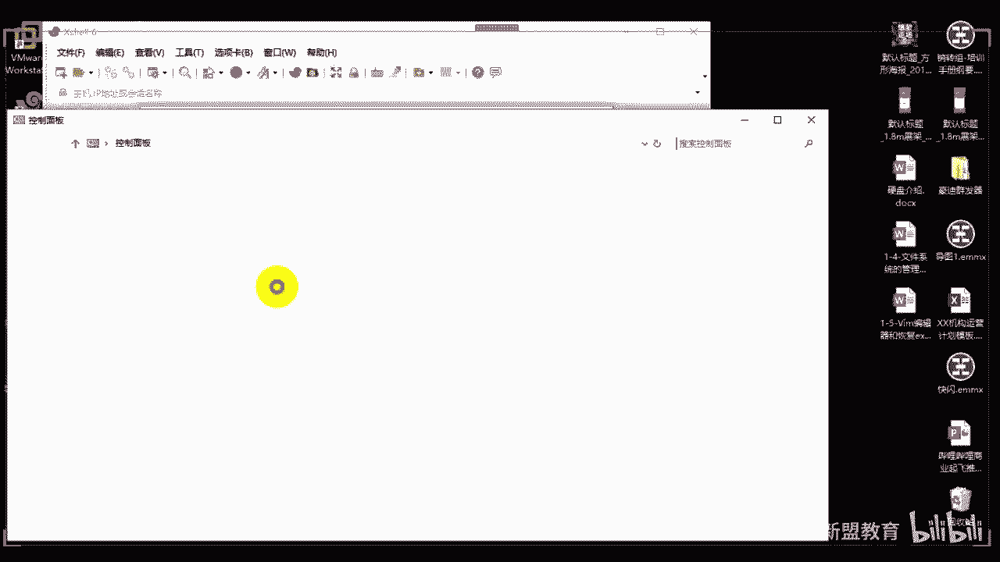

啊，有个山珠或者添加。此时你不用多做啊，你就点删除删除这边干嘛好，同志们，你就双击你的VM好吧？准备安装安装这边的话有一个下一步，看到吧？下一步的话呢，它会有一个什么呀？它会有一个修复，明白了吧？

你就直接点修复，它就OK了，理解了吧？宋鹏。😡，啊，我因为运行着了，所以没有办法弄。你看啊，哎它有一个运行，它有一个修复就可以了啊。好不好？OK。😊，来，我们连一下啊，我们来连一下，我把它连上。唉。

稍等啊，看看乔街这个是不是一旁配个。

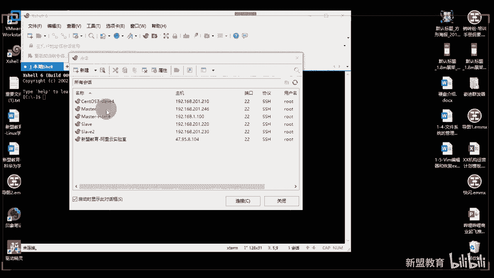

对吧100是吧。

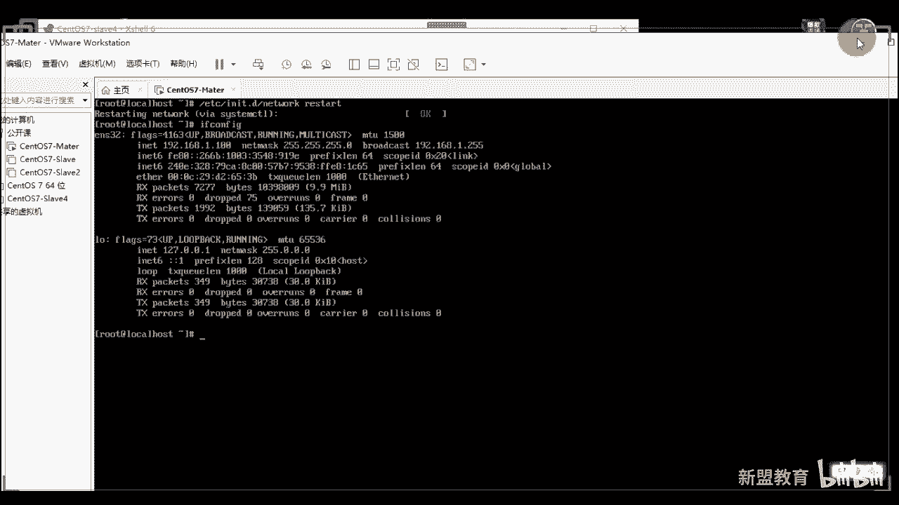

1。100啊1。100。找连一下。走，O。好，看一下啊，ho内改个名字是吧？😊，听车报。哎。好了，我们此时PS了PS这是啥呀？啊？哎，我说我是改了吗？PS我们的AUX啊，如果你单纯用P的话。

只会显示那么点，溶解一个是你的PID进程ID一个是PKY哪个远程终端控制的对吧？或面个终端控制的运行的时间啊和我们的控制的终端CMD对吧？8SU还是8PS对吧？用AUSAOX那好了，你会发现有很多吧。

很多吧？是不是那我现在考了PUAX给上我们一个less来查看。😊。

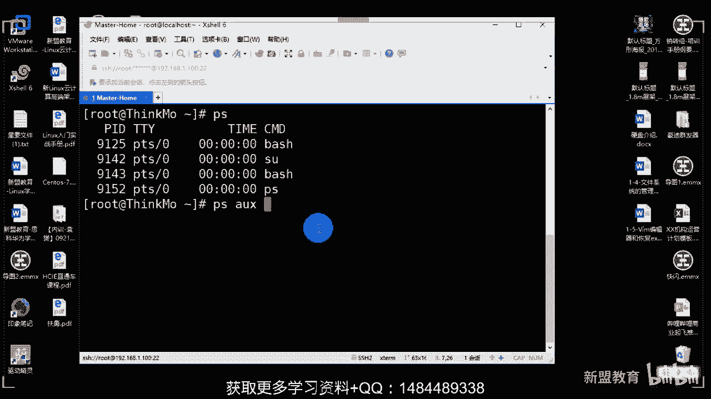

我要放成最大啊放最大，哎，这样能看得过来。往这注意看了啊注意看了。啊，往之一看呃，我把它还是换一下。还是换下。好。大家注意啊，这是最开头最开头的话，其给你显示出来几个特别重要的信息啊，哪些信息呢？

第一个来说好了，用户是吧，用户啊PIDCPU内存看到没有？虚拟内存啊，终端啊状态这是状态开始的时间运行的时间和我们的命令看到没有？哪个用户管理的好吧，进程IDCPU占用率内存占用率看到没有？啊，这些个。

啊，呃这个状态老师SS是吧？S大括号好，这个好像不在你开始说那几个标准的状态呀，sleep吧，对吧？S sleepepZ将死哎，不在呀，那后面这些东西表示什么呢？好，往这来看啊，往这儿来看。😡。

那么这看啊同学们这几个我给你们介绍过了啊，往这看，那我的状态里边详尽的啊，R是运行running是吧？S sleep可中断的叫做睡眠。也就是我们现在运行子命令了啊，子命令了，后台运行的副命令啊，富贵。

那么E的话是不可中断的睡眠，啥意思？就是这个命令无法被你强制sleep，它是一直在我们前端主动运行的，消耗CPU内存的。啊，T是停止stop。官庙的既是将死，将死里边的话还有一个是X。

应该是它的的啊子的一种类。大家。死掉了就是彻底的关掉的命令。那么SS注意了，这个小S表示找到了，进程的领导者是真正的副进程，能理解了吗？啊，这个是负进程。到了负禁城。

而负进城之下才会出现我们其他的紫禁城。给啦啊。啊，再往下这个小于号表示优先级较高的，记住了。什么叫优先级较高的？当我的预无先级越大。😡，啊，优先级越高，那么也就意味着我就需要尽快的和尽早的处理。

能理解思没？也就是说我可以在处理当中插队。啊，我可以查队是吧？你明明还运行他呢，下一个正常来说是A。结果呢我突然一个带着军令这个这个军官证来，然后军官先处理了，明白了吧？啊，进来。😡。

下一个来说是NN的话表示我们的优先级低。优先级低的话明白了，就是哎你是无论没有办法去插对人家的明啊，这个进程的话，我们后边会讲到一个叫做nice值进来，那么nice值。啊，而跟它所对应上，记住了。

同学们nice值越高NSE啊，nice值。记住越高。啊，则表示我的优先级越低。啊，反过来的反过来进行好吧。这个一会儿我们会看到其区间和它的怎么设置。啊。RGR看起来加号表示是我前台的竞争。啊。

简单性能做杠L，这是L啊，L好是以我们的现成的方式运行。对。啊。这几个状态你先来啊。好，往下走进程启动的命令占用CPU的总时间，对吧？和我们的进程名称。😊，或者文件大家就来了。啊，那么往下走好了。

AOS刚s，大家知道这什么意思吗？s是啥呀？😡，哎，st是什么呀？😡，这组凑什么呀？😡，告诉我告诉排序对吧？那排序的话就会有问题了。来，告诉我这个是静序还是生序啊？来将区还是生区啊？哎，将据上去走。

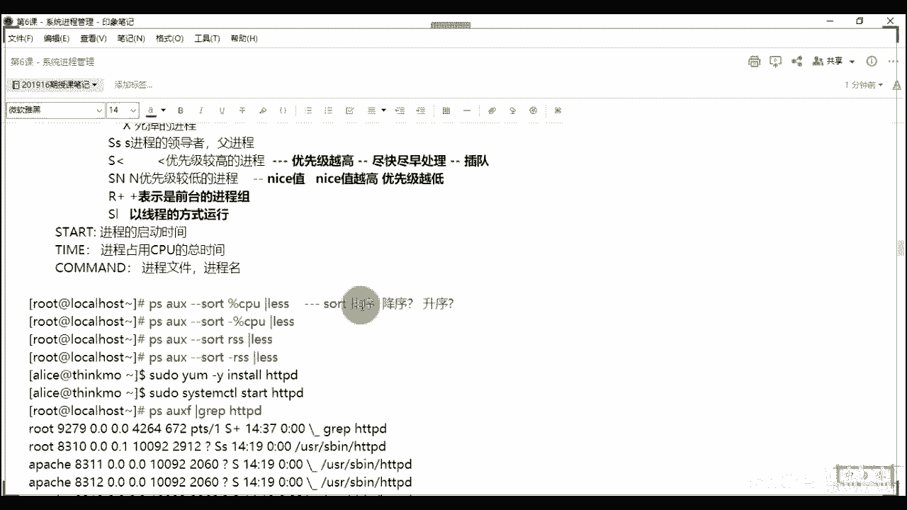

告诉我降序上去啊，老师我拿不准是吧？拿不准的所有情况下就是通过尝试啊，大家记住了，用Q退出，如果你跟the less好吧OPSAUX杠杠st家好了啊，我对谁进行排序。

对我们的百8号CPU我对CPU进行排序，明白了吗？

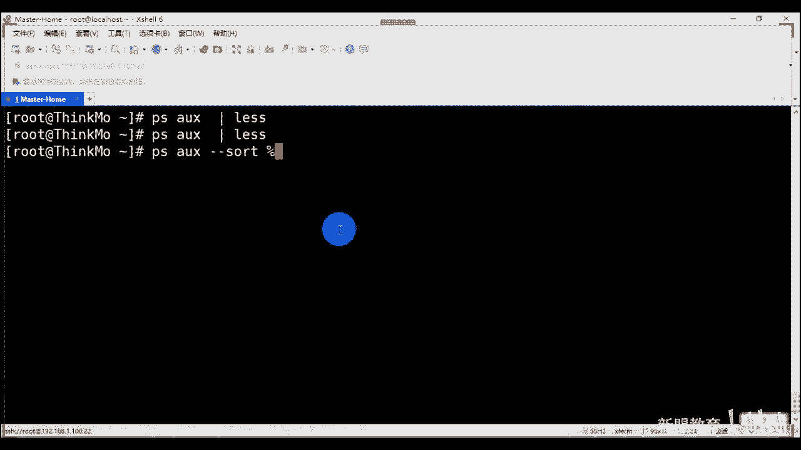

明白了，同学们CPU。

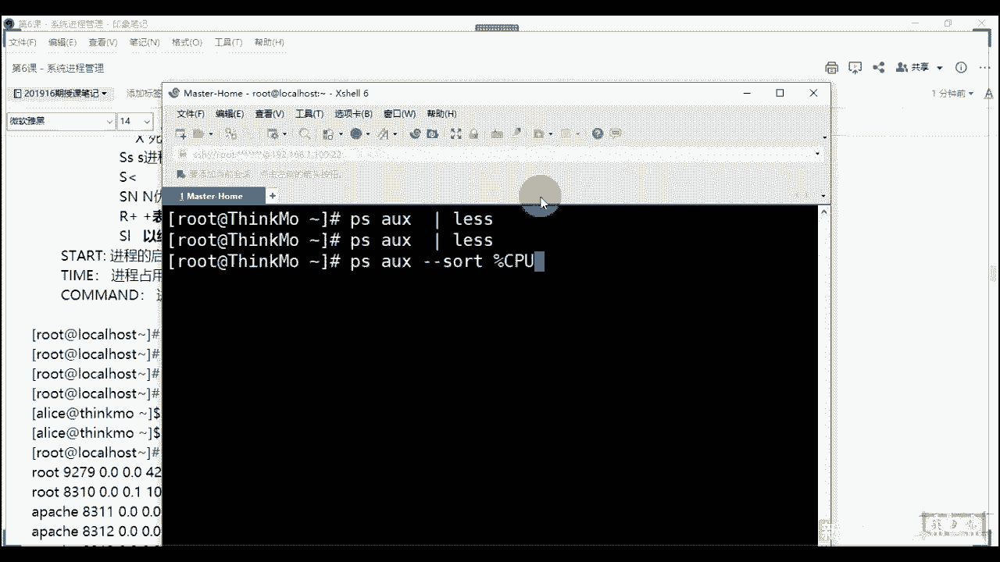

拉进来。啊， sorryorry啊。

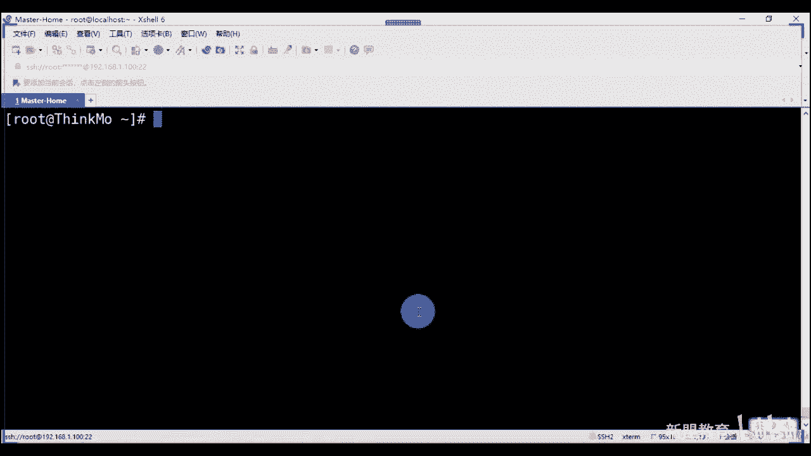

啊，CPU杠还用leice吧，用leice那。我这么一排序，你们告诉我是怎么个排序吧，so的明显一看，这是一个声序排序，能看到吗？同志们能看到吗？是不是一个生序排序啊？😡，哎，来接着刷一。啊。

再生的专译啊，我们通常情况下接下来啊通常情况下看的CPU特别重要啊啊。看看你的CPU如果使用过高的，而且它的时间过长，你就要想办法看看这是不是一个被攻击的进程啊。如果被攻击的话，你就想办法要停掉它。

明白了吗？我们应该这么结合上CPU的占用率和其使用的进程时间去查看。好进来啊，CPU这个是RSS是吧？这我就不讲了，这我就不说了，其状态啊，安装之后你可以看到它的新的内容了，对吧？新的进程启动之后哦。

这个是它的启动命令对吧？启动进程命令吧。往上看啊。

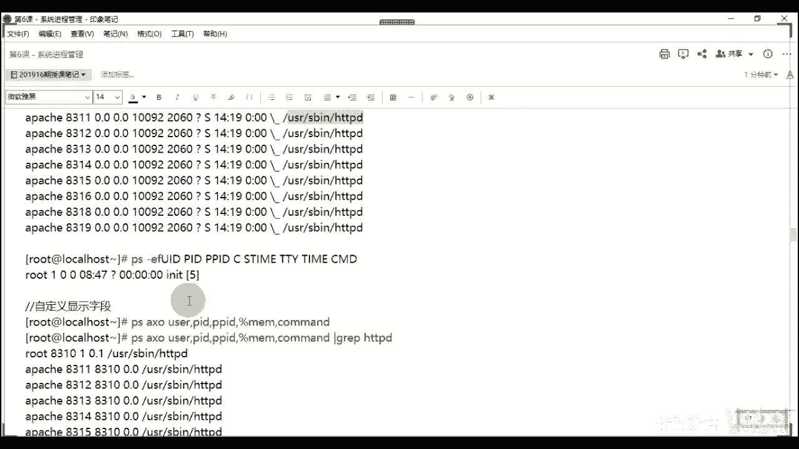

呃，PS杠EF带好了，PS杠EF也是我们经常用的是什么东西？大家好了，这是1个PS看了，杠EF我们常的是这样的去抓取。某个命令的运行的情况。你比方说此时啊，我们去亚马in store杠Y。看到了？

杠YHTPD哎，sorry啊。哎， sorryry， sorry。哎，sorry sorry，这个打错了啊，counttr C结束一下okK。🤧HTV。走。啊，安装一下。🤧嗯。知道。稍等啊。好。

安装之后改好了。如果我现在去抓取你。PS杠EF啊graph啊 graphHTTBD。好，我问他问你个题，这个情况下表示我的HTP运行了吗？运行了吗？来玉行刷一没有玉行刷2，玉行了吗？😡，运行了吧。

大家记住啊大家记住，此时是没有运行的。啊，这是没有约，那老师这怎么会有个东西？大家记住了，关于我的PS杠EF，每次我在抓取的时候，记住啊，PS杠EF。😡。

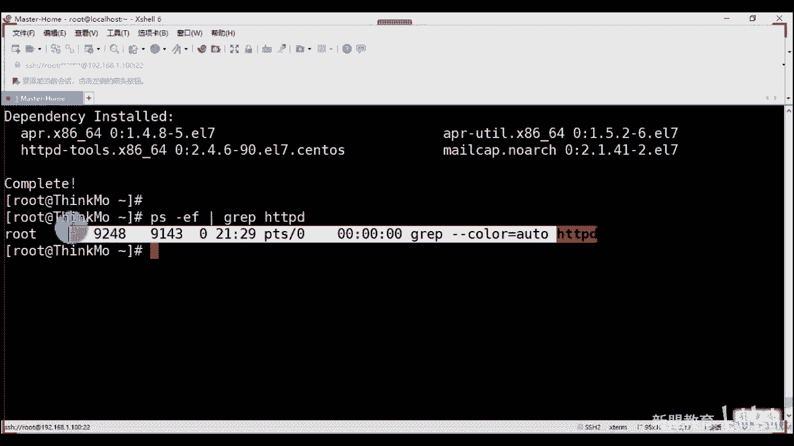

好，g记住了，某个字段。我会特立独行去显示我。记住去显示我抓取的信息。啥叫抓取啊？也就是你这个抓取动作本身的这容同学们本身的信息，这是不是你本身在做的抓取的动作，看gra动作，看到没有？

谁运行的root运行的，理解了吗？而如果老是我已经运行了，你比方说当我启动之后，CTLstar hTD你再来看抓取的时候就不一样了。看好了啊，我们运行它一下。😡。

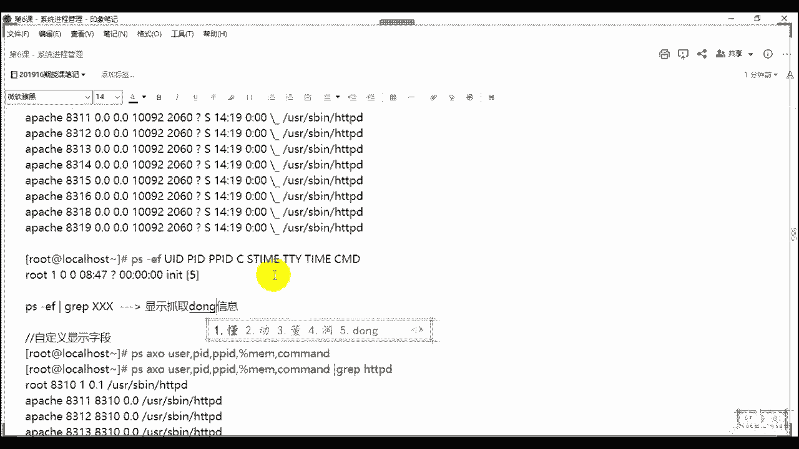

HB有点慢啊，这个阿帕器安装的亚麻安装的这是因为里面一个参数，这个参数回来我会讲到，先别着急。好，再来看。看到了，同志们，你要看的是哪里啊？你要看的是这些个用户是不是我这个位置运行的。

并且我的用户名其实正常来说，通过亚马安装的是阿帕奇运行，明白了吗？😡，啊，是阿帕奇运行进来。进来啊。😊，好吧，同志们。所以这个才是我们要去抓取的真正的信息。

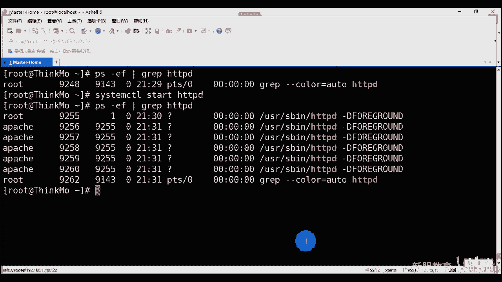

好，这是EF的用法啊，一般会结合Guff去用，你抓啥，明白了吧？

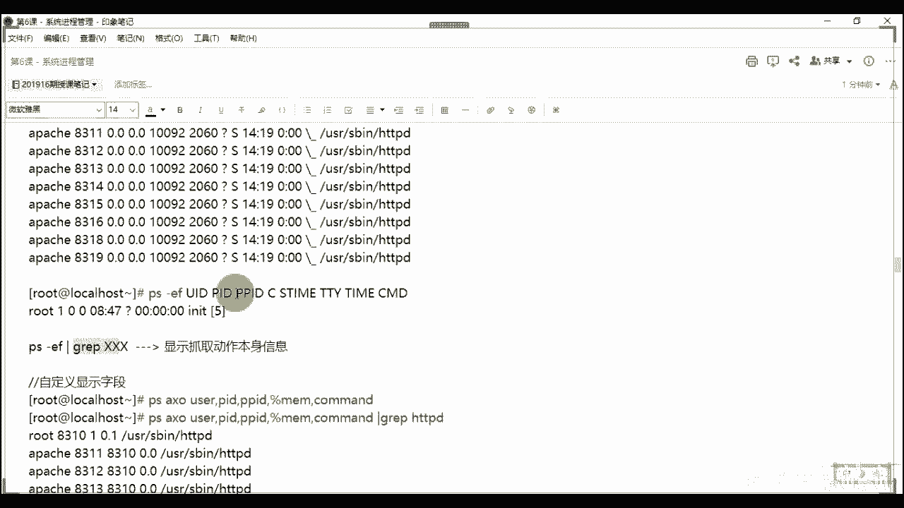

啊，而通过它的抓手，你可以看到用户的进程和其用用户的ID看到PID。啊。进来。😊，往下就是说。9255不用说了吧，这是我的。😡。

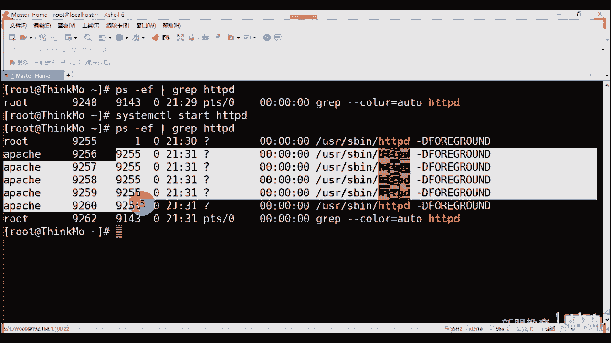

副禁城一看就是副金城，这是紫禁城，对吧？好。记住吧你在启动一个进程之后，它很有可能同时生成多个子禁程，也就是我们所说的线程多个啊有多个。那么呃这个我就不用说了，这是我要去找的对吧？我要去找的。

我通过几个东西去几个我的这个这个几行我们的这个属性。关键词我去抓去。对不对？这个我不讲了啊，你可以自己去看一下。啊，改好了自自自定义显示字段，对吧？

查看我们的进程的PID这个我希望大家可以自己课后去写做做一下，敲一下就可以了。啊，因为其实不把上面那东捋理就就可以了。2。对，杀死进程其实就直接杀死副进程，明白了吧？你这以杀死子进头子进城的话。

杀死负进头无影响，明白了吧？😡，啊，来来看来家看到了P Gr啊，P Gr。😊，其实就是PS，然后graphuff明白了吗？能理解了吗？😡，Pgra就是PSG。😡。

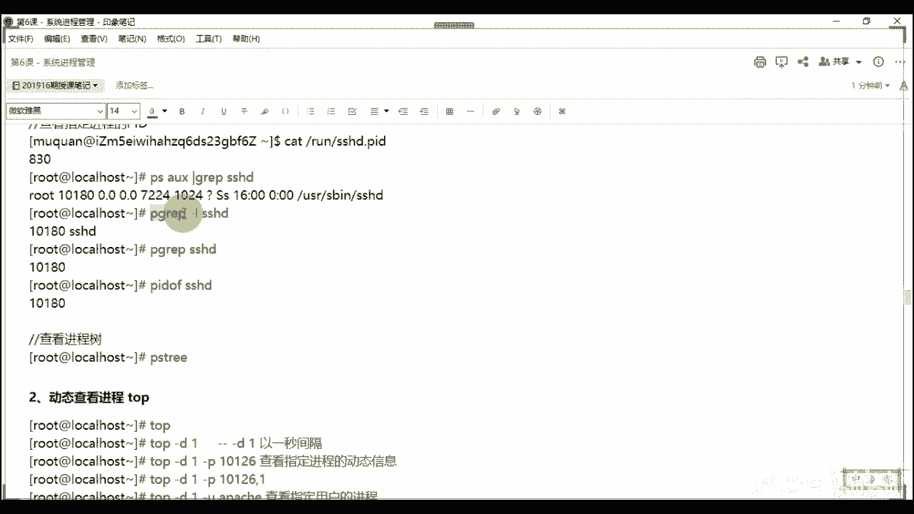

进来啊进来。😊，卖一下PG。

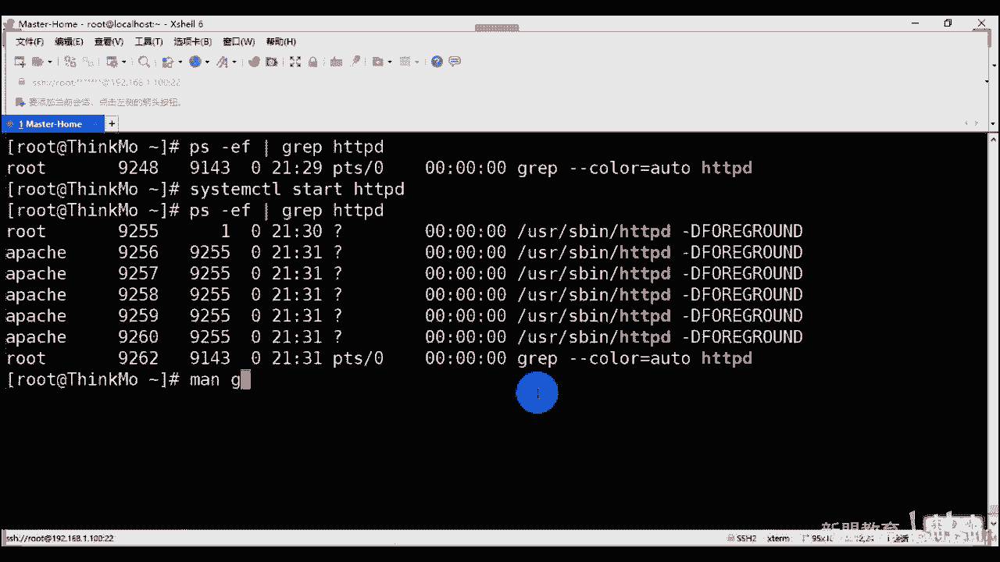

看吧？是吧P Gr和PQ指的就是你前面加那个PSPS显示抓血或PS显示杀死谁。接来啊，就是把两条命令合到了一起。

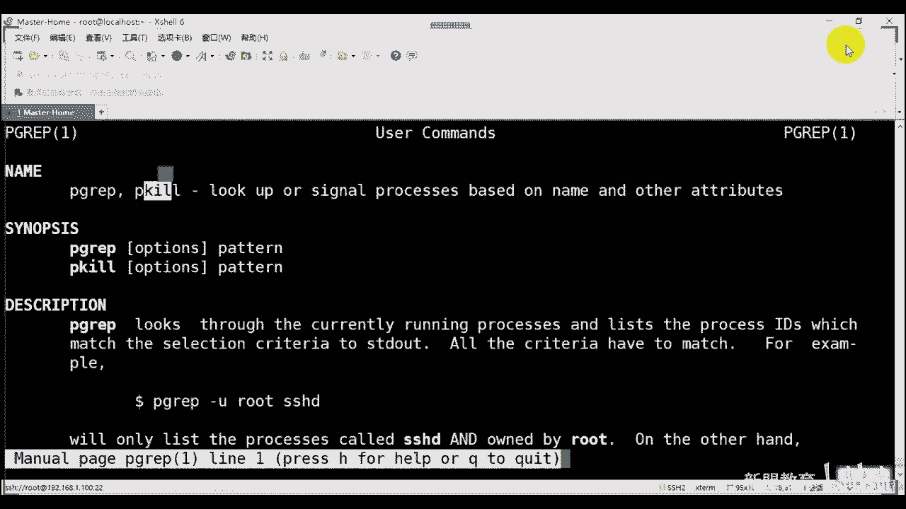

好，再往下。嗯，这是PS tree这些东西就是显示我的进程数。

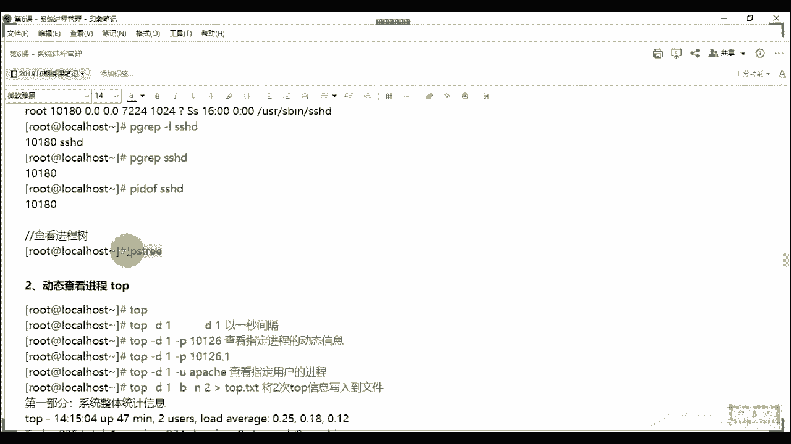

PS tree的话，这条命令先记下来。😡。

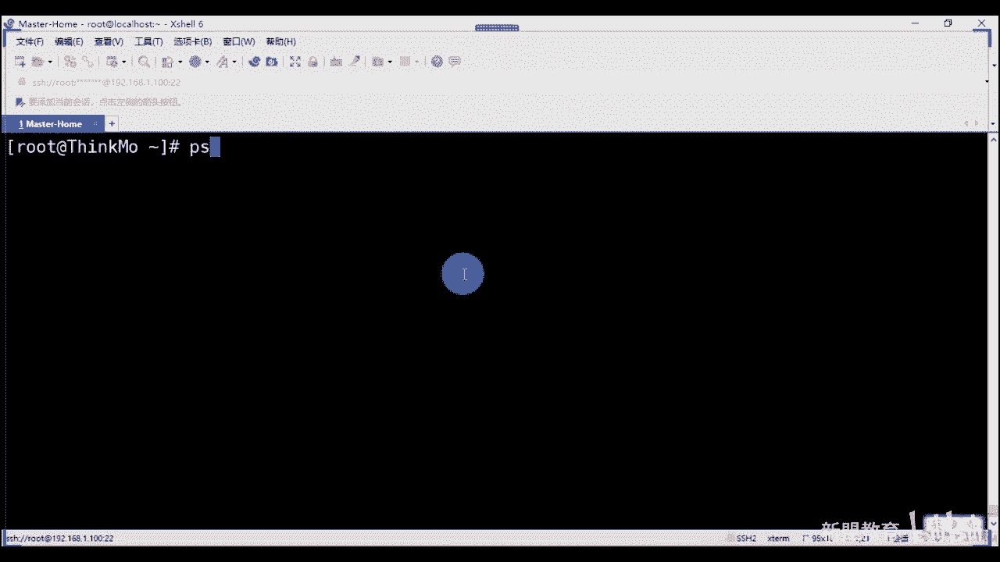

干嘛用的？西说。啊，没装是吧，这条命令我没装啊，这条命令你可以装一下，一要门一思做。

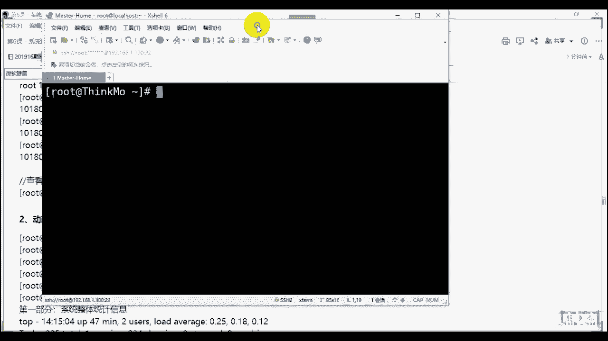

到YPS tray。好，这个是用于去显示你的显示你的整个进程的关系的副进城下有几个子禁程，对吧？那么来想想同学们，如果我的命令没有怎么办？怎么还记得条命令吧？叫新告。前面用的是proviide啊。

谁来提供的？老师，我的这个这个这个这个这条命令啊。They are provide什没有岗位。嗯，亚马PROV。VIDS。能看看谁来听的。啊。ge子吹谁听不这唱队里。走。啊，如果最小化安装上。

很多这东西其实都是没有的，我们后面可以自己再做安装，好吧，搜索也可以啊。呃，你说的搜索什么搜索呀？你说什么搜索呀？😡，对吧这条命令话，谁听我？😡，这个这个对吧？朋友们，只是这两个版本不太一样啊。

这个版本小版本不一样，大版本是一样，对吧？所以你随便安装一个就可以了啊。这是由于两个圆不同的圆，所以导致的我们。晋城的这个这个程序的呃版本号不太一样，按一个就可以了。好吧，艾着就可以了。😊，好。

不样睡老大哈。看一下啊看一下。看一下，这就是你大进程底下你运行的几个进程。看第一个来说网络对吧？啊，第一个来说来说这个这个定时任务是吧？HDP运行了HDDP下有5个子进程，看到没有？同弟们？

HDP下有5个啊，这个下面recy下有两个，看到没有？😡，看到没有啊，而我这条命令预生过来，怎么过来的，看到没有？😡，看到没有？这都可以说啥看。

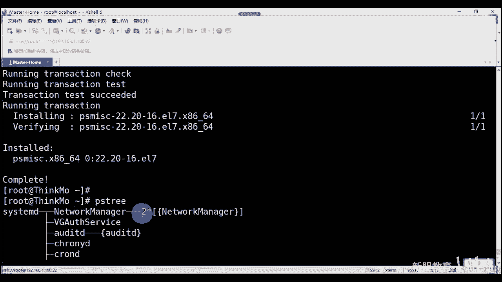

啊，都可以去查看。好吧。😊，当然我们很少用这条面的，很少用啊，我们一般都是直接查查到。PSUSX拆占用大，然后PK有一身明白吗？PQ有一身。啊，被告一站。雅麻 search呃，这条命令我用得着。

然后我一般都是用provis。

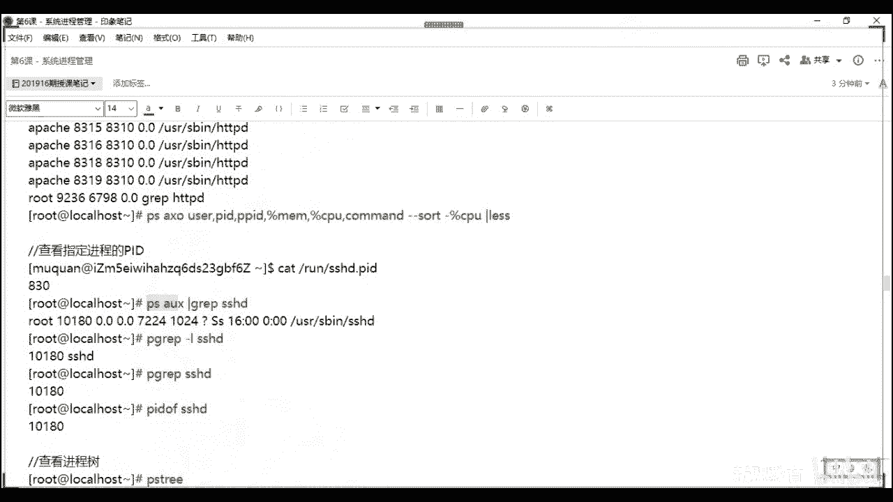

有吗？我还真忘了要里面有没有，你可以查一查有没有s啊，我一般用的是pro。😡。

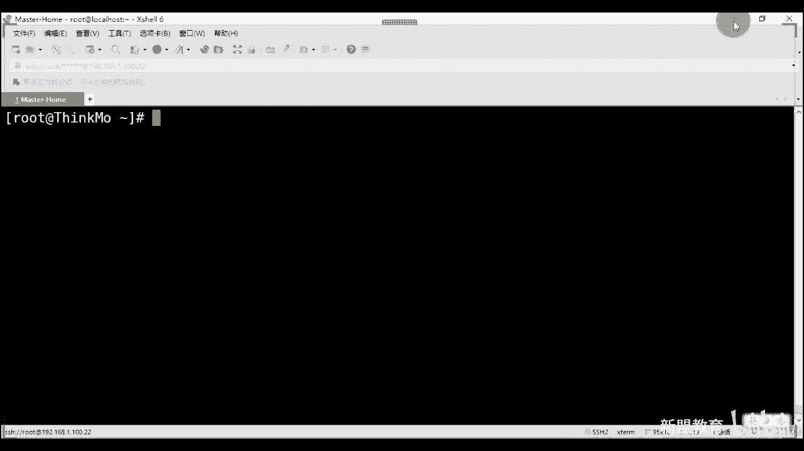

啊，一般是样的list去查看所有的安装包，对吧？fiit off显示我的进程ID啊，进程ID。SLD的尺卖6错。啊，再往下的话带好了，呃，PS的话是静态的，啥叫静态啊？

它只显示你在现在老师我一敲AUX啊，当前这一秒钟瞬间的数值。

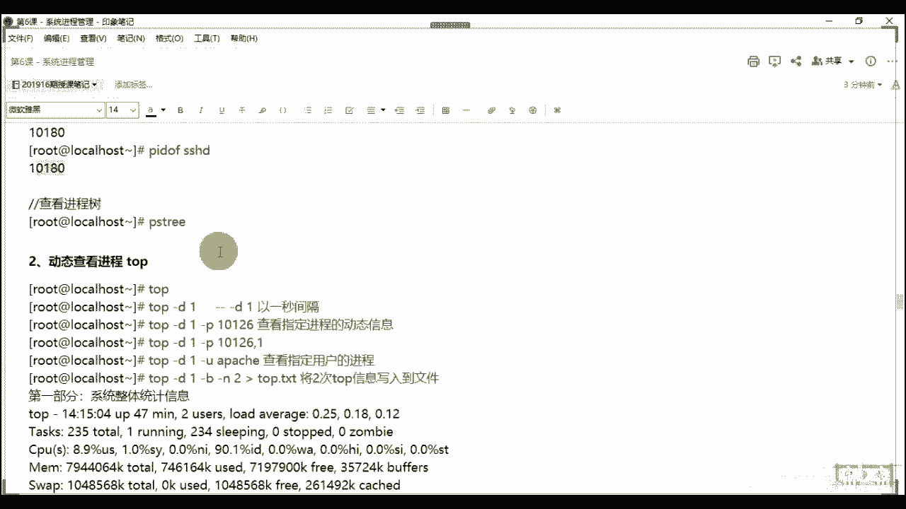

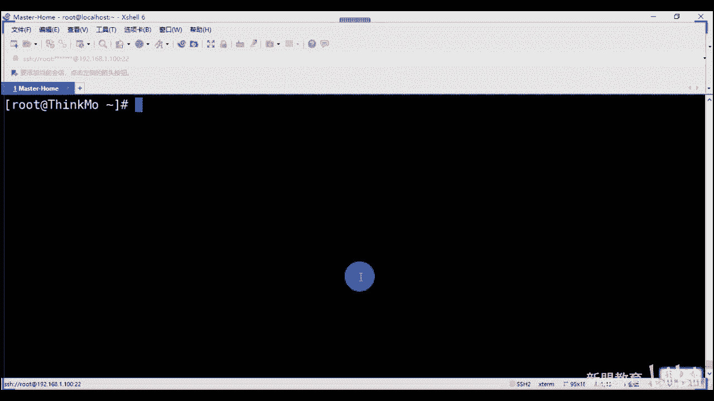

明白了吧？瞬间的数值。那老师我想动态的查看它是不是我得看它的过程啊，那么用到另外一个东西把泡它下来。😡，top后边无需跟任何的参数。那么但是如果你说老师，我想让他刷新的更快一点，记住了啊。😡。

我让了刷新更快一点，我可以用杠D1好，同学们表示什么？表示我每一秒钟单位是秒1秒钟刷新一次，一秒钟刷新一次，一秒钟刷新一次，一秒钟刷新一次，理解了吧？

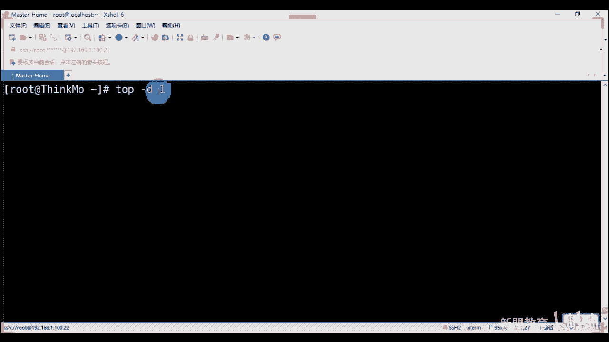

啊，进来一秒钟刷一次看是不是很快呀，看见没有？一秒钟刷新一次。😡，啊，进来。那么你要看哪来top看谁看上面的话，这不用不说了，你的系统启动了多长时间，约吧up了多长时间。😡，啊，停了24分钟了。

当前的有几个用户登录，两个用户登录。好，平均负载值带好了，平均负载值。那么一分钟的3分钟的5分钟的啊，一分钟的5分钟的15分钟的合作，一分钟、5分钟、15分钟啊。

那么记住这些个负载值一定一定不能够超过一，但凡是超过一，完蛋了，明白了吧。啊，接着来说一个界限一啊。啊，总共的进程数正在运行的进程数，睡眠的、停止的、将死的。还没有四大精子，四大状态。啊。

CPU的占用率对吧？哎，这个内存交换内存的占用率等等等，都在里边显示出来了啊，你可以继去看。你可具体去看啊，底下的话也是跟我们这个这个刚刚的PS一样，大家可以看到吧？跟跟我们的PS是一样。

只不过它是动态的而已。😡，看见没？只不过它是动态的而已。啊，前你注意啊，这个参数杠低是特别重要的，1一秒钟看到没有？朋学们后边的话一定是跟个整数，低啊是秒，记住单位是秒。你也可以跟告P。

我专门查看某一个进程的动状态。你比方卓老师。😡。

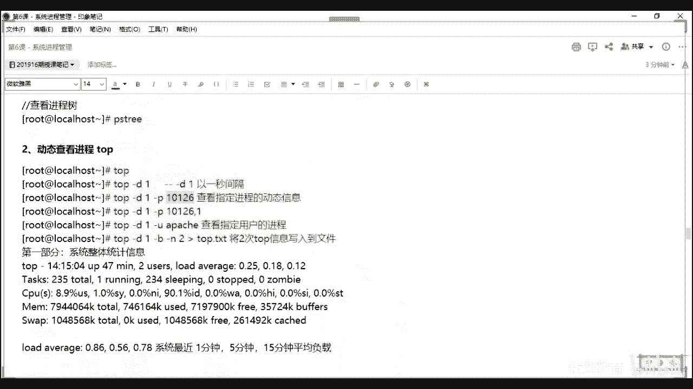

我现在查看好，我怀疑这个进程有问题，那我就单纯的TOP杠低1秒钟杠T指令出来它去运行。理解了吧。😡，理有了吧啊，结果你发现它好像不怎么变化，那么这个进程其实就是一个没有毛病的进程。😡。

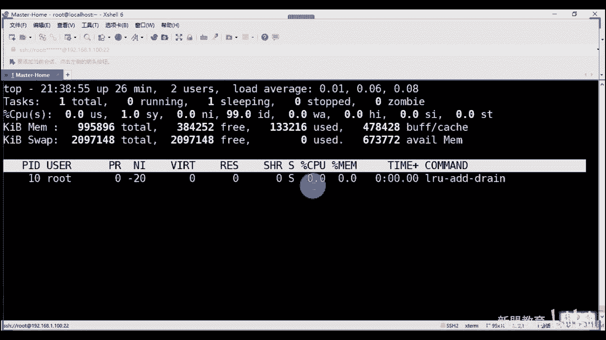

安全进程。理解了啊，安全这。好。再往下多个用逗号，多个用逗号明白了吧？啊，更U的话就是指定的是用户，你哪个用户啊，你比方说阿巴西是吧，这就是明显的是查看我的HDPD。

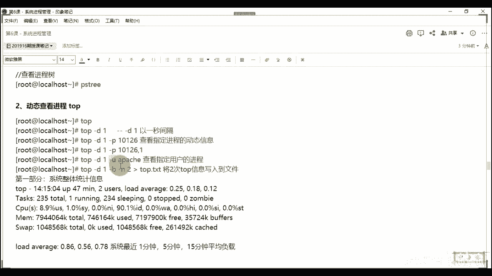

对吧明能查到我的SCPD。😡，看看他知吧？我们一般都是前端容易遭受凯y的攻击、渗透啊，大家发现由于我是内网的，发现内网的话极少的会被攻击，对吧？所以它不会有太大的变化。😡，但是过往的。😡。

有人想问这个变化很快的。啊，变化很快的。所以根据你的公司的量级，你说老师我的公司的量级是多少？是一个非常非常大的所谓的。你比方说。😡，这有这个亿万级的那亿万级的处理起来。

其实你的CPU和内存占用率本身就会高。那你就要看其波动，明白吧？我波动有没有太高。比方说突然出现一个本身平均在70%，突然变成90%了。😡，好，过一会儿又90%了。

那你就要从这个90%里面找到某1个IP好，谁故意的访问，谁过来访问时候变成90了。那很有可能这个IP是恶意IP，我们要封禁他。理解了吧，是这么去推断的啊是这么推断的，好不好？比如说啊。哎。就是说。

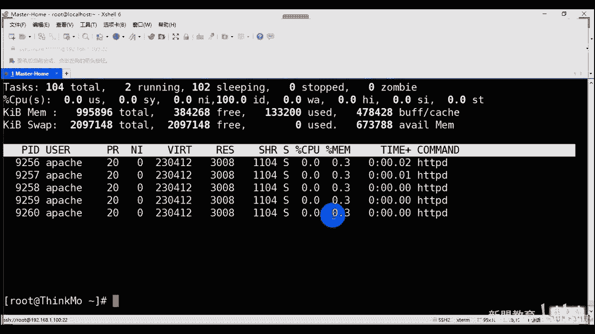

所以我们接着看啊所以我们接着看。所以呃这个第一部分是我们整理的信息，应该就不用我说吧，对吧？同志们啊，一分钟5分钟，15分钟的平均负载值。啊，平均覆债值。好，再往下就是你控制信号好了。

我们有几种方式去杀死进程的。第一种方式就是我直接kill你的ID啊，第一种是killID。第二种的话呢是通过我们给你信号啊，我给你stop信号给你自己将死信号给你sleep睡眠信号都是可以的。

那么具体的信号都是通过数字去做的啊。很少说老师我直接给什么给这个这个给给像我们上一次的同志们，老师有杠杠杠什么最后kill是吧？kill后面跟个杠h啊，其实我们很少给hp明白了？同学们？

我们一般都是用数字。😡，啊，都是用数字。那么kill命令应该不用我说了吧，同学们kill是来杀掉我们的进程的。😡，啊，杀掉镜头的。老板。好这杀掉你。那无外乎老师我怎么杀？第一种来看啊，同学们。

如果我使用Q杠L啊，接下来这些个都是我的状态的码状态码啊，那么常用的几个我其实列出来了，其他的我也没有的我也没用过啊啊，常用我的列出来了。😡，paub中断重新加载。啊，中断重新加代理。😡，好吧。

重新加载你。第二个in。😡，int键盘中断。啥意思啊？类似于。😡，它就相等于我们的。或者说等价于我们的哎countr好，加上C。明白吧？ctl加上C啊，键盘退出quiit，这个不用我说的，同学们。😡。

键盘退出一般指的就是我们的qui啊，或者说CTRL加上D。啊，现在2加2D。已经超过一了啊，那你的负载太大了，你的负载绝对有太大的地方。我们正常说是负载平均负载不能够不好，最好不要超过一，知道吧？

最好不要超过1。如果你是生态环境的话。我们有几个数值，一个是3，一个是5。啊，1个395。正常来说，像大规模的亿万级的。PV啊1般级的PV呃，如果你要是超过了5的话，这是一个五的值。啊。

一般中小型的记住了，尤其是你自己玩这种的。如果你超过了一，明显你的里面有问题，理解了吧？中小型老师千台的规模。千台或百台以上，我们的话一左右一左右明白吧？一左右。啊。

往这走强制终止kill不用我说了吧啊，然后终止TERMPM也是一个中止啊，你自己的实体机超过了一绝对有问题了。知道吧？你自己的话正常来说，负载绝对不能超过一。呃，那么就是你这台服务器吃的东西太多了。

你操你解的东西太多了，明白了吗？😡，啊，你给的东西太多了，你给老启动的系统。你比方说老师我启动了阿帕奇mycyclcle，我其了一大堆，你电脑本身超负载流量了啊，超负载超负荷了。

这个continue不用我说了，继续stop终止star这个stop暂停。那同学们这几个记起来啊，这个记来，那我要是通过信号怎么做？通过线怎么做好，同学们用Q杠啊Q杠1。😡，Q杠1杠1的话啥意思啊？

这是呢重启对吧？重启那怎么办？好，给谁呢？给的是1个PID。当好了，这个等价于什么呀？是不是等价于我们systemCTL restartstar。😡，2CDB呀。能理解了吗？来领解刷一。

就是条条大路通罗马，你们用哪个都可以，反正关键点就是在于我能够。okK的哦，那okK的那只不过来说，老师有时候我用system cTLtop onHDP是无法停止的。😡，啊，这个时候无法停止的。

这个时候我们可能会用到的所谓的kill进行kill强制停止。李老板强制停止。当然了，我说句实在话，在我们的生产环境。这种件一般ki都是肾友。啊，kill要慎用，没有多少人是用kill真的是用ki的。

明白吗？同志们啊，除非那些个东西你是真真正正觉得啊你是有十足的把握啊。ki在生产环境当中是要提全用的啊，是要提全用的啊，只不过你们很多的脚本跟你们说啊，很多我们的系统的脚本就是命令大知吧？命令。好。

都是有key有存在的。啊，都是有P股存在的。我们在未来可能谁是个脚本，老师脚本里边我们可能就会用到kill，明白了吧？可能就会用到kill。😡，不要的。打旗号这个我就不做了啊，你们可以自己回去做啊吧。

你可以自己回去做。重点呢是告诉大家一个排错的思路，好吧啊，包括等价，因为这个东西你正常重启都是这么做，对吧？你不可能用这个去，很少有用这个去啊。对不对？这个是我登录用一个普通用户登录登录之后查看的。

然后我杀掉它对吧？我可以提全杀掉它，看到吗？啊，大家走，现在9和15。哎，去测试你们可以去做啊，留这是第一个作业。到了，这是我们的作业一，我要进行所谓的提取使用啊，我要进行所谓的提取使用。对啊。

这些嗜号我们请你们进来啊，请进来。🤧呃，我们做一下吧，是带着你们做一个吧，做一个吧。好吧，我们先来看一啊先来看一啊，先来看一我这边的话呢就用的是HTTP了，好吧，我没有装VSFTP啊。

那么按照所谓的流程，第一步来说，我先来看一眼，同学们啊，来看一眼啊，我们来看看我们的PSAUX我们来看一下gra我们的HP。

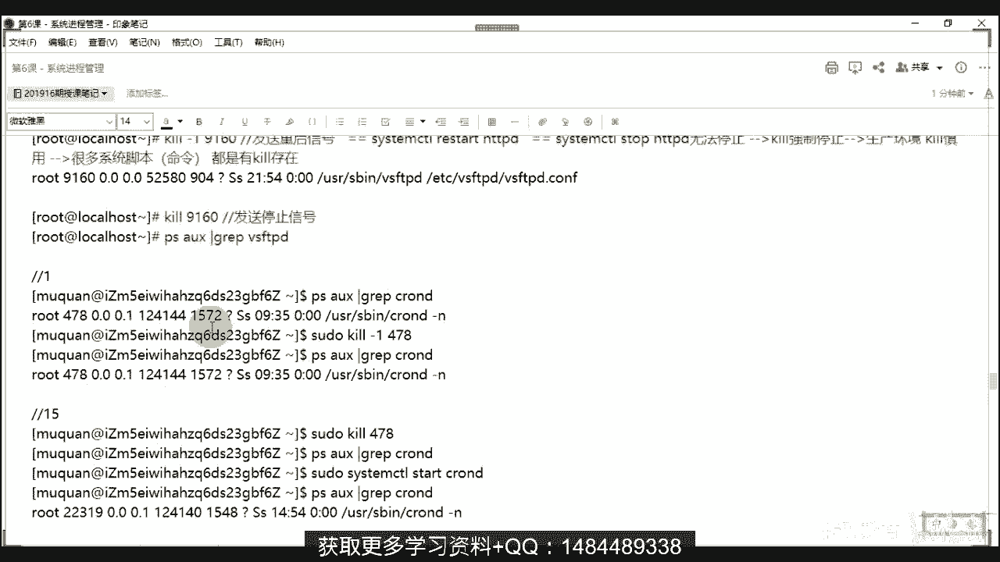

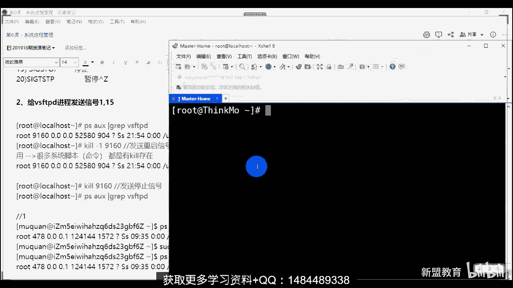

啊，还放大一点。啊，多来一点啊，那么此时来说此时来说，他看的什么是一个附近城root下单，还是没吧？root下啊啊，正确来说的话，我们找的是这个这个这个这个地方，那要？看看有没有相同的啊。

还有没有相同的啊，好，再来一K啊，有没有哪个必要相同的？比方说这个大家了没有？就是它附近城，所以我的ID的话是9255没毛病吧。

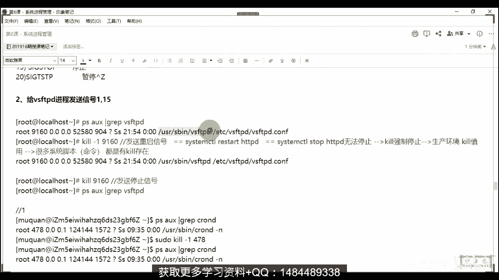

啊，所以此时看好了，我用的是Q杠1。

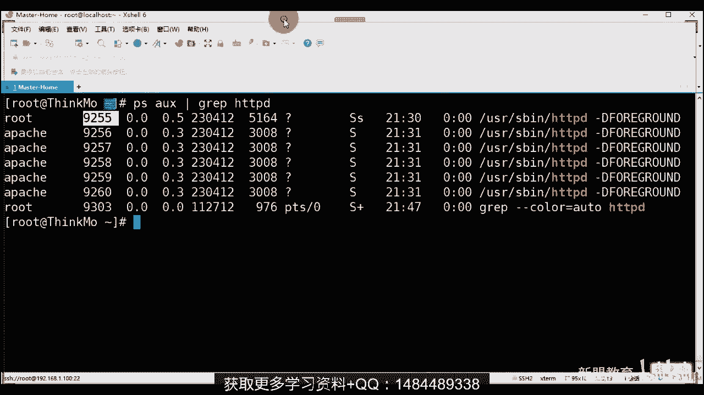

啊，是数字一给谁啊？给我的9255老大好了，重启了，你看看这些个进程案例会不会变呢？会吗会吧？大家看是不是是不是重启了一段时间，是不是我看看刚一重启的时候只有一个呀，然后后边才会衍生出来，看到了吗？

并且我的子ID已经变掉了，看到没有？看到没有？同学们？而大多数子ID当你去重启之后，其实它都是顺着走的，看到没有？都是顺着走的。😡，这个5678是吧，6789好的好的，到后边，然后我们继续跟着你走。

那么0607080910。谢谢啊，进来。😊，哎，所以这是这是我们的整个。而如果我想要他，同志们，如果此时如果我去杀一个紫禁城，比方说9310。哦，那好了，杀了吧，我们再来查9310是没了。

但是又出了1个9313，看到了吧？😡，看到没有？那老师，我这么我的目的肯定是要杀掉，对不对？好，那我想把整个的杀掉，我就杀他的附近层，也就是其9255，你们再来看就没了吧，发现了吗？😡，杀子进程记住啊。

因为这个老师我怎么为什么我一定是默认有这几个进程啊，对吧？默认有几个A2345有5个，为什么这个吧？这个到了后边我们会去讲到阿帕奇，讲到阿帕奇，阿帕奇里面默认我们设置的是5个。😡，啊。上有5个有8个。

有几个都可以设置。但是所以说当你杀掉这一个时候，你杀掉一个，那我必然会更新一个去顶替你。😡，明白吗？去符合你的参数，配置参数。😡，而另外一个来说而另外一个来说就是我的这个这个这个对吧？

而这另外一个说就是我要把子父金争杀了，就把整个金争停掉了。理解了，把整个进程停掉了，那这个就没得说了是吧？这个就没得说了。然后继续往里下看啊，就往里下看。那如果说往这走往这儿走，儿子啊，这个是沙掉。

没有了吧。如果我通过一当了，如果我是另外的一个，我用的是普通用户，你比方说我创建一个用户。

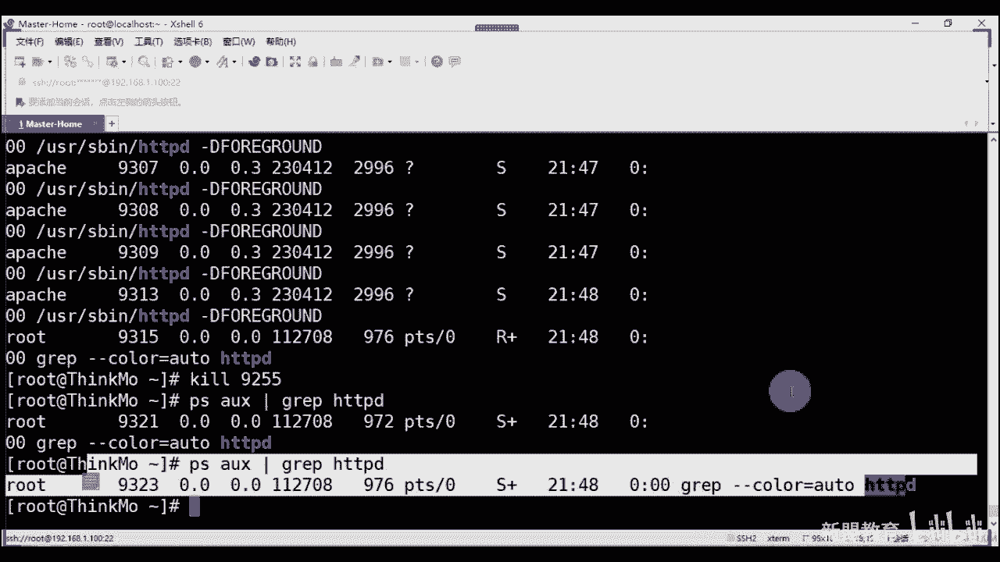

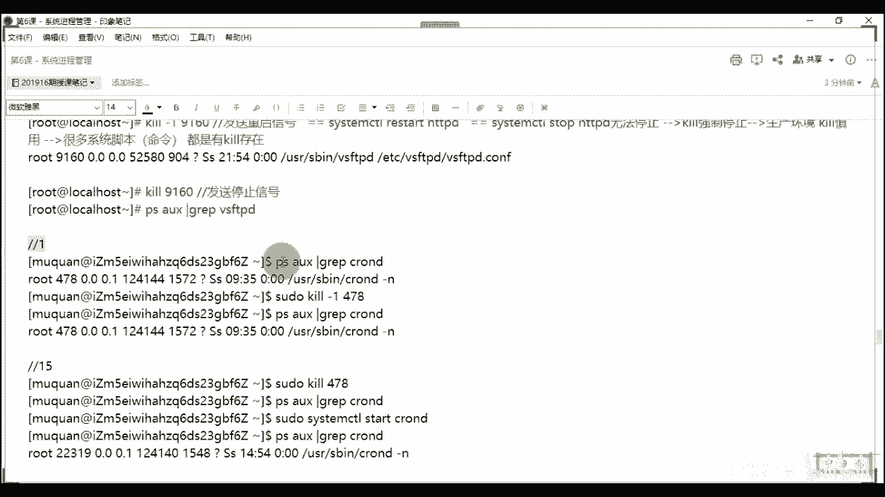

user add think是吧？老师啊切换到thinky好，此时PS以下杠EF或者是我AUX都可以啊，用哪个方式都可以。我只不过习惯用ES啊，用来EF是吧？我们看prod。有吗？

大家发现老师有是不是有，但是root运行的。是root运行的啊是root运行的。好，那如果此时的话，我想要停掉你，我肯定要速度，对不对？同学们，因为你可以试一下，我们查看一下，用which好 kill。

啊，用WQ。大家看一下Q在哪啊，Q在user下，在user下，你告诉我这个权限好像炸开一下，是不是我好像直接能使用唉。😡，好像不用提权，对吗？同志们啊好像不用提权啊，别来。😡，好。

所以此时我们切换过来之后，你告诉我能不能直接用啊，能吗能吗？😡，能的啊，这种是能够直接用的啊，因为不在SUSB下啊，不在SB。

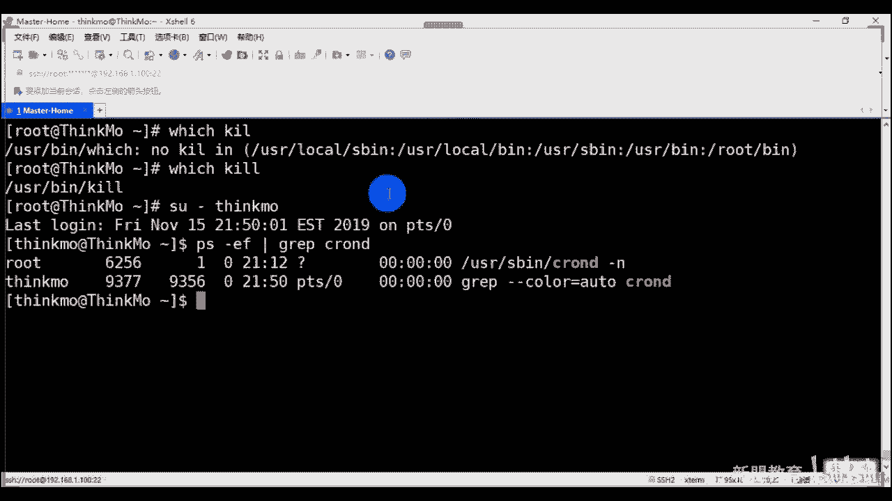

啊，不在SP上。好，怎么办？我们直接试一下，说我能不能重新你是吧？叫多少？6256Q好，干嘛呢？杠16256好，大家下一个问题。😡，老师，我Q是user啊是吧？为什么我无法给他重启？为什么告诉我。😡。

为什么？😡，为什么为什么？😡，为什么告诉我。😡，为什么？哎，不是这这地好像有点冲突啊，老师老师让你讲错了吗？😡，哪里有问题告诉我，哎，对吧？同志们，你别忘了，你没错，你ki是你可以用的。

但是你的用户可是root呀。😡，没毛病吧。哎，没错啊，所以此时我们还要所谓的提权，明白了吧？😡，啊，提全Q杠1，我们的6256走。看到同了吧？输入你think mode密码吗？没有你就回车是吧？

但是倒好了，此时由于你没有密码，记住你是无权速度的，明白了吗？😡，明白明明白？也就是说我需要速度的用户必须具备密码权限啊，所以我们必须在设置你的密码。啊，必须给你买好吧，必须给你买。😡，好。

然后再切过来再来看速度Q-16256找到了，重启密码走成功看到没有？成功啊，okK没有成功是吧？又报错了，报什么错啊，告诉我报什么错啊，告诉你think不在ser之下。不带ser，啥意思啊？

因为我在我我说过了，如果你想用的话，是不是要在这个文件下去写呀？😡，对吗？但是此时这个文件下，你们告诉我有吗？😡，我有吗？😡，我有吗？同志们。我有吗？当然。收到。好，找找我有吗？😡，有吗？没有对吧？

没有你怎么提呀，是吧？我拿谁提呀，那肯定是不行的啊。所以记住了这个位置我再介绍一遍啊，那天有谁问我啊，那些是是谁问的我是吧？老师这样子是吧，这样子这样子是吧？这样子啊。

为什么我这个没有办法reboot呀？😡，为什么我没有办法reboot是吧？你把自己当自己用，那能能reboot吗？是不是你这块的，最起码你要选的是root，对不对？同志们是看好了，是你在谁身上好。

比方说。😡，啊，sma在所有机器上，你所有的用户去运行所有的内容，对不对？要不然你这边就写root，这边就写sing命令，明白了吧？哎，加一个啊，我们简单写这边好，SU Sma过来啊。

我们再来查一下PS。😡。

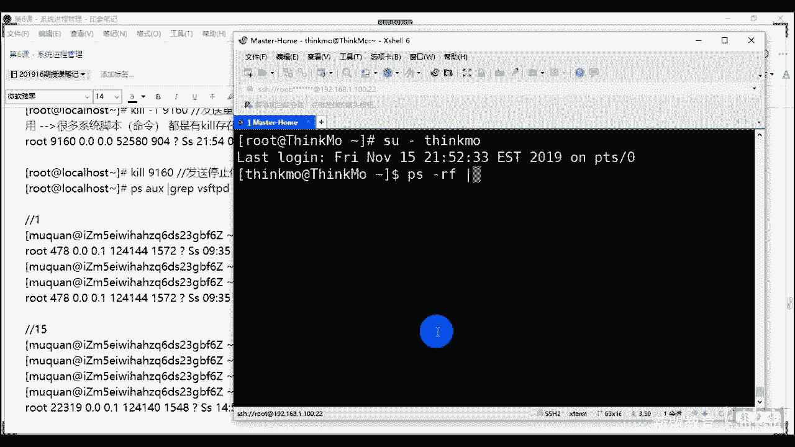

啊，croCcode是定时任务啊，6256Q啊杠1对吧？6256来给唱s。找到了。走，看看执行是不是成功了，病看了吗？同弟们是不是成功了。😡，是不成功了，能懂了吗？这只是一个重启啊，重启一般是不变的。

🤧进场那是我把它清掉15。😡，🤧15是终指，对吧？😡，我把它杀掉来看啊。😊，把它杀掉。15。好，再来看有吗？没了吧。😡，是不是没了呀？能理解了吗？这就没了啊，进来。好，这。

所以这个东西请你们自己把它记下来啊，请你把它记下来。好吧。🤧嗯。啊，然后我们接着说啊然后我们接着说。🤧あ。知吧啊。啊，找到呃，往这边走往这边走，所以这个地方应该不用我去多说了吧，这一个东西。

那第二个来说好玩的一个啊，扩展一个叫做我们从通过远端，哎，我把它踢出去一个登录到本地的这个一般是管理员去做的啥意思呢？老师，我突然发现啊，有人哎这个那个我不在就是我没有授权的一个用户，有人登录进来了。

也说被破密了，明白了吧？被破密了，很有可能啊，你要去强制踢掉它PQ看没白？PQ啊，抓取并杀死对吧？抓取并杀死。🤧杠U好吧？杠U这是指的是用户对了吧？杠U指的是用户对。

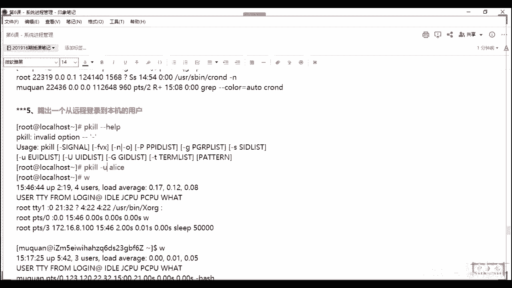

啊。你比方说哥了，我现在呢登录着我现在登录着，我们再来这个地方，再来看我拿这个再再登一个。再等一个。啊，再来一个啊PQ。TK杠U。是个帽。啊，杠Usy啊杠sy。那我们再来看who还有吗？还有吗？

这边其实已经断了哈，慢慢的就。😊。

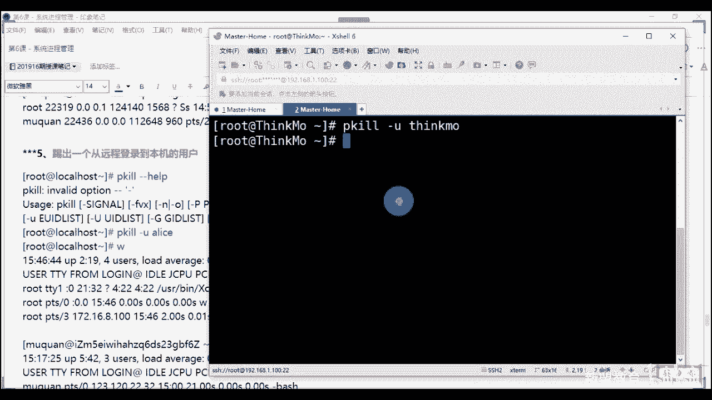

明白了吧？这是我能够亲着把你踢下去啊，这是我能亲着把你踢下去。姐。😡，好。呃，然后。然后W这个命令我就不说了啊，这只是做了一个我们的。🤧这只是做了一个别称啊只是做一个别称。

然后就是看啊杠TT指T终端杠T就是TTY啊，T就是TTY久的话就是信号，对吧？好，把这几个记下来。把，把它顶进来。然后我们接着说到了就是所谓的优先级啊，进程优先级。进程优先级的话，我刚刚前面说了啊。

就是我们的这个这个。nice对吧？nice当然这个很少有人会去管理啊，我说一下这个很少有人会去管理，所以这只是一个补充。明白，同学们，但是你说哎我突然发现这个老师，我这里边确实有了技争更重要。

我想让他插队，那你就可以用它，明白吧？你可以用它。但一般来说，我们正常运行的时候就不需要了，好吧，正常说我们正常运行就不需要了啊。啊，接着看就是我们因为是多任务对吧？多用户多任务好，所以在我运行的时候。

我可能是一个用户下有N多个我们的所谓的这个这个这个任务去运行。那这些任务的话，那好了，我都是要在CPU上去做的。而我的CPU你要明白啊，大家知道？而原则上。😡，CPU。就是大脑。就是大脑。好。

问一个问题，你的大脑能够同时想多件事吗？可以吗？告诉我，你可以想多件事吗？同志们。😡，能能刷一不能刷二能吗？啊，我现在想着吃什么呢，然后的话我又得想我还能同时并兼并，记住啊，能吗？记住啊是不能的。

是不能的是不能的啊是不能的。你们觉得是我能想多件事是什么情况？是如果你想多件事是干嘛？是我能够干什么？同志们，是我能够停止一件事。😡，再去想另一件事，你不能够同时想象到两个事情同时的处理，明白了吗？

明白吧？这就跟你的语言一样，你不能同时说两句话，是你住那儿插播。哎，大家看这天听的特别棒，这么个意思明白了吧？哎，所以CPU也是一样的。我告诉大家，你们现在所有的记住哎，记住所有的硬盘都是串行的。😡。

啊，都是串行的，跟CPU也是一样的。也就是说我都是一个个的信号，一个个的镜头处理。那我说为啥不是并行啊，是不为啥不是并行啊？一会儿我们下节课会讲到明白吗？为啥不是并行？哎，一个是我的信号干扰，我先说啊。

一个是信号的干扰。😡，啊，另外一个是当我的数据损坏啊，同学们，当数据损坏，我要同时重新把多个我的数据推出来啊，可干扰很大的。知道吧？哎，所以这是重点啊。😊，对CPU也是一样的，他没有办法多多处理。

所以只能停掉一个去做另一个，对同志们。🤧。哎，只不过只不过你们现在用的是多核。讲啊，只不过你看什的是多盒，明白了吧？😡，多核啊，所以你可以进行快速的切换。解了快速切换，所以一味都是毫秒级的处理。

你感知不到。明同志们？就是你现在看来，我现在打开网页一个处理，我打开QQ，这是同样的只播过式转换的处理了，明白了吧？😡，其相对优先级，把这个词记下来，啥意思呢？😡，懂了？哎。

我们在调度不同的程这个这个这个程序的时候，实际上是走的它的策略调度策略。啊，这个策略我们叫做schedule order大记来，schedule order啊，s order。

那么它就是相对优先级的一个英文程程序啊。简称来说，它的进程叫做nice值。啊，进来三个名字，一个人，明了吧？小明、阿凡提、麦麦提都是一个人啊进来。那么nice有40个值，有40个值，从-20那有4个值。

我们一般常用的啊。🤧啊，有那么一个区间，对吧？有那么一个区间，但长的是那么多个，对吧？这是我们常用的值进来。🤧。nice level看到没有？啊，top的时候这么多，但是我们nice有这么多啊。

大家可以看到toptop里边的话有一个值叫什么？叫做PR，看到没有？叫做PR。😡，这个PR就是我的优先级。看懂了没？是不是大多数的话都是我们的这个20啊，看到没有？最低的吧啊，最低大家进来啊。

看啊进来往下记往下记nice值越高，优先级越低，例如加19是最低的啊最最低的啊。这个进程的CPU是尽可能的会给别人去使用。😡，让位，这是一个大公无私的是吧啊，圣人。然后nice值越低，优先级越高。

什么意思啊？nice你很好，你越低，就是你是个坏人，坏人就要插队，明白了吗？这么去想啊，你的好人这个人品值越低，证明你这是个坏人，坏人就爱插队，所以我就要抢占别人的CPU。😡，理解了吗？同志们来这刷一。

啊，圣人啊圣人就是让切账，切账的话就给别人纸啊，就这么简单，好不好？😡，啊，往下走接着看啊往下走接着看。那么查看我们的PSn值啊，就是呢通过我们的PR对吧？同学们P啊PR当然你也可以这么去做。

来看我把这条命复制过来。😊，啊，AUOO是干嘛？AOO的话是通过我们的参数去查，对吧？啊，参数去查走。

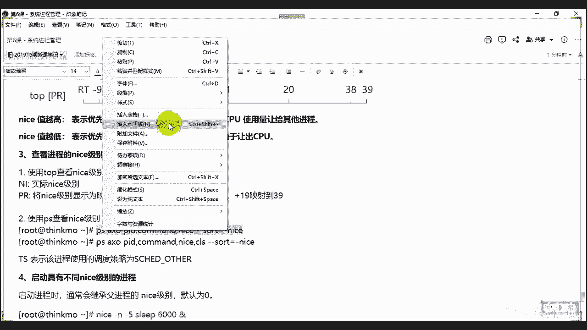

走，大家。nice是一写，唉，这都是我们的。😡，这什么？这是降序排序对吧？啊，st啊生序排序降序排序啊，好了，往这走，1950对吧？往下走-4-20看到没有？-20。😊，降去了啊降去了好。呃。

这是nice值对吧？啊，对啊，其实这是一个看似是降许。大家告诉我，其实是什么？so刚刚说老是生序，那这怎么叫生序呢？这不叫升序了？我说了，lessice值越小，你优先级越高，能理解了吗？

所以这么个一个升序吧啊，在这里面对吧？

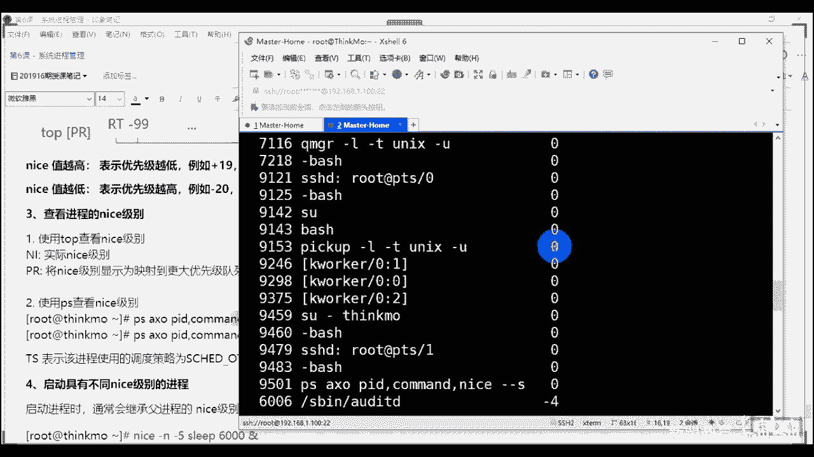

好，请弟们记下来啊，把这些东西记下来。😊，🤧ok。呃，然后我们可以去给它设置我们的nice值，但是n值你可以看一下你本地有没有nice命对吧？NSE有吗？哎，一看有最久化安装也是有的啊啊。

nice杠N到了N表示number，也是说你指定的优先级数啊，nice值为5啊，同时呢sleep。

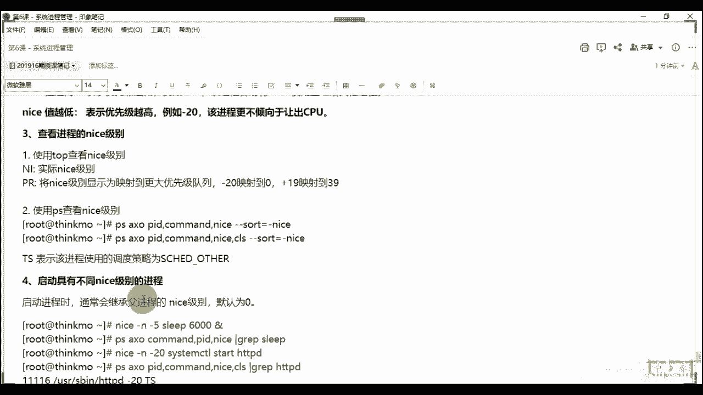

那么sleep，我们这叫做休眠6000秒，给个end，那就说end表示后台运行，明白了吧？表示后台运行。啊，到是后台预求。

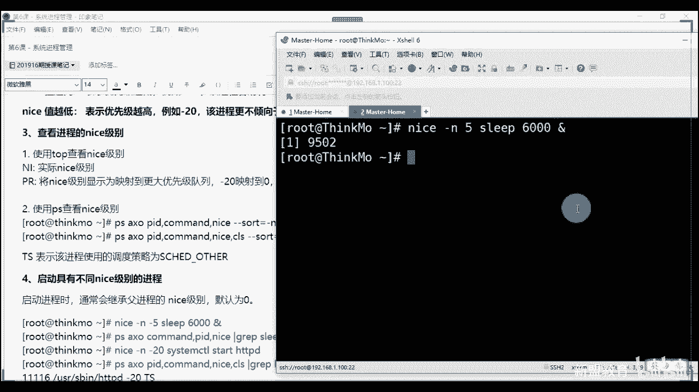

没以啦，进来。😊，Yeah。哦，这个底下就不用我多说了吧，这题应该就不用我多说了，好不好？同志们啊，更改nice就是我用一个re nice。Read leather。给谁呢？老师给指定的ID号啊。

给指定的PID号能明白了吗？来能懂刷一啊。😡，有5刷1。好吧，冷度刷一啊哎OK。所以今天请各位请各位作业一，我直接说了啊，作业一。啊，因为进程的话没有太多东西，做为一然后我们接着讲别着急，我们接着讲啊。

相同的nice值呢相同nice值就看你们谁先运行的，明白了吧？就看你们谁先运行的。😡。

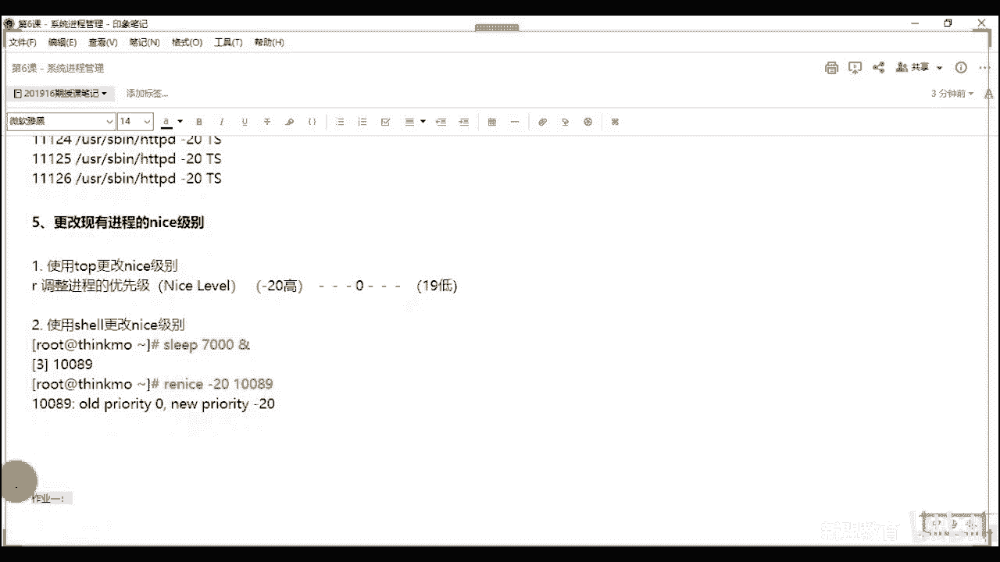

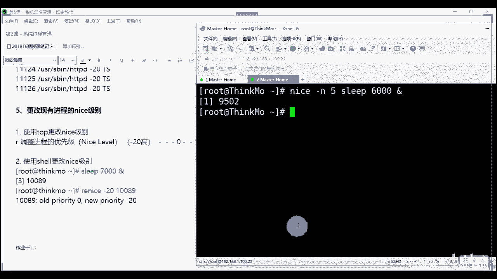

啊，谁先运什么谁就先战。😡，可以了吧，哎，就这样子。那就同时嘛，对吧？那就是谁先做嘛，先先进先出原则啊，那么第一个作业请大家自己去总结我们的啊，刚刚我给过的啊，这个进程的所谓的状态。哦。

STP这些东西到底老是都是啥呀，对吧？STP这些东西都是啥呀？哦，以及以及我们的信号啊，常见的信号你们要自己总结要，这个真的是要背诵下来的，好吧，你不要到时候我不背，我回头到时候去查。

没有人给你时间去查，好吧啊。😡，OK这是这一个啊第一个。第二个来说的话，作业2。将我们的笔记上练习。将笔记上的练习我们挨个的是吧，敲一遍。后边我还要给大家新的题啊，还要给大家新的题。

今天这个笔记我给你们是吧？这个笔记我给你们，因为这东西确实理论性很强。关于进程的好吧，关于进程的。进程很快是吧？速度好快呃，记笔记的话，截图截图，然后后边回去去总结。大家记住学东西了。

我给你们说一个方式啊，方法啊，很多数老师我跟不上你记笔记啊，很正常很正常。你记住第一问题是跟着听。第一遍是跟着听速记啊速记明白吧？速记啊，就是滑了划了啊，大大白块滑了。然后第二遍你肯定是要听录屏的对吧？

听录屏的时候是要整理。对吧第二遍你还要再听听录平。大家就你要反反复复听两遍至少，明白吧？啊，干嘛呢？进行总总结。😡，缺一不可学习整理总结，也就是学习分析总结缺一不可，明白了吧？啊，所以这个我不多说了。

好不好？我把这个录屏先暂停一下。

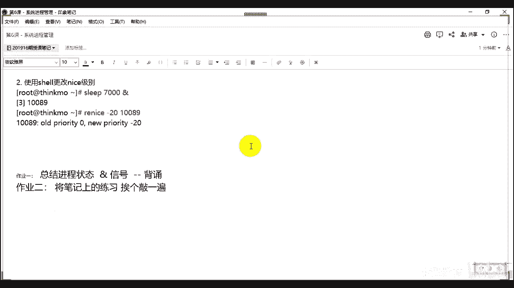