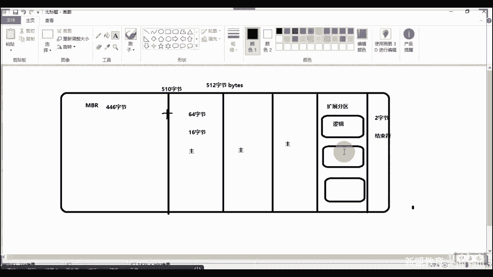
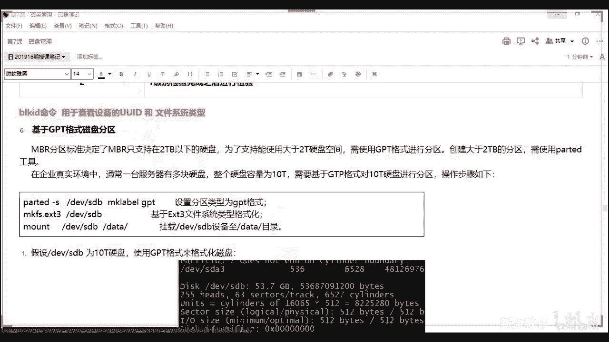

# 2020最新Linux-RHCSA入门实战课 - P8：RHCSA-第7课-磁盘管理 - 新盟教育 - BV1Fg4y1z7kS

。

关于磁盘的话呢，我们先明白一件事情叫做这个文件系统啊，为什么大家要明白一个问题，你如果说我装磁盘，我装硬盘。对吧我归根到底它是我的存储器，大家要明白啊啊，所以呢我们还是回顾一下，我之前说过了。

所谓的冯诺伊曼这个人你们都是要明白的啊，冯诺伊曼。😡，Sorry。诺伊曼。🤧计算机支付是吧？😊，好，那么其总结了我们的计算机的架构，也就是我们常说的五大部件。好，这五大部件哪五大？分别是我的预算器啊。

我的控制器啊，我的存储器。以及我的输入。输出。对不对？输入输出上边两个结合起来叫做CPU中央控制器。没有同学们，这个我也给你们，我给你们画过图吧啊，通过一个针角，然后我们一边都是加法，记住都是加法。

没有什么减法除法乘法，只有加法，对了啊，只有加法。好，这个加法帮助你们去运算啊，去算都是二进制零和1。啊，小开关开就是零，B就是一啊，那么存储器进来存储器就是我的内C，这是我的硬盘啊，硬盘。

其实严格来说内存算吗？内存其实严格来说不算存储器。但是硬加的话也可以啊也可以。接下来roomom对吧？ROM好，那么输入的话，我们说了是你的键盘鼠标对吧？鼠标甚至你的游戏手柄，这个都是啊手柄。

输出也就是你的显示器。啊，常见都是显示器。那么这里面记住了硬盘的目的是存储，对不对啊，目的就是存储啊。那老师我存储的话，我不能说乱存，对吧？我能乱存吧？能乱存吧？肯定是不能，对吧？😡。

所以啊我们第一来说我就要有标准。哎，也就是说啊我存放的位置。啊，我知道我在硬盘的哪个位置啊，我硬盘很大的是吧？老师我如果分ABCDEFGF区域的话啊，那么多区域我得存放哪个位置啊？并且哈我怎么存。😡。

对吧我怎么存啊，什么样子。😡，是是什么样子，也就是其格式明白吧？提格式好，那么这个格式大家记住了，我们最终归根到底叫什么嘞？你们要经过三步，第一步叫做格式化，没毛病。同志们，第一步叫做格式化啊。

第二步叫做创建我们的文件系统。第三步叫做挂载啊，插上去使用。挂仔我应该说过了大家。那么第一步来说，先说第二步啊，先第二步叫做创建文件系统啊，记住老师前面做实验的时候啊。

我们给大家一个东西叫做you mask是吧？朋友们，you must啊，你会发现一个问题，老师you mask。啊，当我等于033的时候。大家说老师666的文件，如果033我创建之后是多少。

应该是633，对吗？发现了吗？😡，是不是633应该啊，但是你们创建没创建啊，看一下看一下。

好同人们，you must022改了。you must好，我们等于033。对了，to是我们写1个TTTAST点text的了创建看一下看一下，我test告诉我，我现在的数值是多少啊。现在数字是多少啊？😡。

🤧那现在数是多少？现在是度是多少？是了唉，你发现变成64次了，是吧？

啊，变成644了。好，633你是明白的，老师RW杠对吧？后面呢杠WX杠WX好。到了，那如果按照这个033走的话，我变成633。我的文件系统看到了。我自身如果说是root不总。我自身可没有执行权限。😡。

而你们其他的组里边的，比方说是root组里边啊有一个。😡，think about是吧，其他的话有个linux。😡，哇，你们俩人能能改能执行。😡，这符合我们的安全标准吗？符合吗？😡，安全标准符合吗？😡。

肯定是不符合的对吧？肯定是不符合的啊。好，但是你又得。😡，但是你改了咋办？我就得有限定。😡，乐鱼师傅这个限定谁做的，谁做的？记住文件系统。😡，啊，当你的这种情况下，我会强制把你变成杠R。

我会强制把你变成杠R。😡，啊，从这变成杠啊，所以说大家住了，文件系统是干嘛地。😡，一条一个作用啊，对我们的系统要求就是一个系统的规则。哪些规则？第一个来说我存储老师啊，我存储我的那些个存储的信息。

我存放在哪，我怎么去存？😡，好，我的命名规则。😡，好，那来命名规则就说我的文件，哎，我为什么不能够以星ABC或者说我为什么不能以这个上括号是吧？上括号ABC这么去命名。要求规则、底线原则接来啊接来。好。

包括我们一些个其他的原则。行了啊，我们说原则的，别说规则。😊，好，原则。能理解了吧？啊，别不用看他写那么多，你就记住了，文件系统就是一个系统的规则，最底线啊，规定了我一些系统的不允许的状态。😡。

同志们就在这儿呢，看见没有？用户在硬件当中的以文执行的文件建立写入它的一个都是依靠文件系统来的。文件系统的作用是合理的规划硬盘，保证我们的正常的需求使用。有了吧？只不过我们文件系统由于规则的规则嘛。

那中国有中国的规则，美国有美国的法律，所以我们的文件系统也有不同的类型接来啊，有数十种，那我们常见的几种，第一种大家明白了，谁呀？第一种补充啊U盘U盘常的叫做fat是吧？fat对吧？同学们fat啊。

光盘一般常用的是什么？常用的是NTFS。🤧这两个没毛病吧，能理解吗？来理解双一，你怎么没注意过，你怎么都没注意过吧。😡，俺些都没注意过。

那lindux里面而这两个一般来说都是我们windows面常用害是吧？lindows里面谁谁天天没事弄硬盘啊，是吧？啊，那么lindux里边长的有两类，一个叫做EST four。😡，一个叫做N叉FS。

别着急别着急，一会儿我会说到啊，我会说到啊这个其实我们linux面有吗？也有它也有它啊。啊，ESEEST和我们的叉S到了这两个我底下做了，记住。😡，别看写那么多，总结一下，那就了啊不同类型的文件系统。

😡，不同。文件系统它最终的一个区别就是在于我们支持的存储的大小。啊，限制。当了，越老的我支持你的越小。你比方说我可能支持你256兆，我只支持你一T，我支持你两T，明白了吧啊，进来是硬盘，大家来。😡，啊。

所以呢ESE当然还有EST2啊，还有ST2ESE3和ESE4是我们比较早的，是我们比较早的。那么我的我随着你的这个这个限制的越大。😡，那越大那好了，比就是说什么叫限制越大？你比方说之前我只限制一个G。

现在我限制一个T。😡，🤧好，你越大，我在处理的时候越快。怎么处理最快？在处理我的系统崩溃时。😡，越快。啊，收集越快，收集些碎片，但是还原难度越高。😡，明白吗？会量越高，因为你越多嘛，我收集的再快。

但是你太大了，我可能收集不到，你就已经真的彻底损毁了。😡，啊把这个记下来。好吧，把理起来。而目前来说，我如果说那好了，你们现在在生产环境当中。😡，啊，所以不要说哎老师生长环节当中常用的s透色或者红帽啊。

6和7现在为主。啊，无有吗？无有少量的。😡，极少量的。少量5有吧吧，这种没有吧啊没有吧。啊，所以大家说老师我后门出八了是吧，教不教学，你记住在未来的两年左右啊，我们基本上才会陆续的上班。明白吗？啊。

未来两年左右才会陆续上班，公司还是以稳定为主的啊，不要问我啊，所以老师我要我我能不能学学吧，你可以自己学，但是记住，企业在未来一两年不会用到的啊，那么这里边记住了啊。

6版本默认sdles6默认使用的是EST4。😡，啊，7默认使用的是叉FSsles和linux和红帽是一样的。看好了，目前来说啊，你肯定遇到过5啊，你肯定遇到过5，明白吧？啊，其实五和六没有太大的区别。

其实五和6啊只是六里边慢慢支持了虚拟化什么KVM什么docker，对吧？7里边更加支持了K8S等等等啊，那么记住了啊，我们叉F足够你用我最大容量为18亿B看到同弟们，这个东西反正我们是没存储过那么大啊。

1个EB等于多少个G啊，你看上去吧？等于这么多。😡，啊，绝对够用啊吧，绝对够用。啊，非够用。好不好？同志们，所以这是文件系统，明白了吧？这是文件系统。啊，这个也错，那说文件系统老师，那我底层的硬盘吗？

是吧，我底层的硬盘呢？😡，啊，硬盘呢格式化硬盘是不是硬盘有哪些？大好了，你们现在见过的无外乎硬盘有几种啊，告诉我有几种啊，硬盘有两种，对吗？是不是有两种啊？😡，哪两种啊？一种是我们的所谓的。机械硬盘。

一种是所谓的SSD固态硬盘。固定的。啊，当了，机械硬盘的速度是远远的要小于我们的SSD的固态的远远小于啊两个啊远远小于的。为啥呀为啥在这SSD是电子硬盘。是电子硬盘。啊。

那重点的是你要看的是一个机性硬盘的一个图。来啊，同志们啊。😊，知吧？你不用管壳啊，你问我外壳，我告诉你们，现在常规的硬盘和你们所谓的移动硬盘，它都是机械盘啊，看了，外壳就不管了。

直接拿过来这个硬盘拿好了？硬盘这个东西拿过来哎。😡，看到了，唉，没错，这层性酒，你为啥看到了？我上边的话会有一条条的小道道，这些小道道好了啊，看了。😡，🤧哎，稍等。啊，找到的。走。走。画出来。画出来啊。

画出来。其实你看到就光盘上也是有的啊，光盘上也是有的，在读取的时候。😡，哎，别着急，我给你们画出来啊，硬盘啥样的这样子的啊，硬盘这样子的。😊，当了，那么好了，我们管这条线啊，管这条线啊。

你的硬盘一般会从这个上面会伸出来一个叫做我们叫做什么来？哎，我看看有没有图啊。😡，有没有图拿这个吧。还是拿这个画吧，好吧，拿这个画吧。来看那这条线看了，这条线叫什么呢？叫做我们的磁盘壁。😡，发命。😊。

而磁盘壁是能够动的吧，记住能动。你们看过那个看过古时那种那种那种那种播放的那种音乐的吗？你们经常看到那种西西方的那种播放的那种黑碟。😡，黑碟唱片看过吗？哎，唱片机对吧？对对对，哎，懂我懂我懂我吗？

唱片机见过吗？黑盘的黑胶的。😡，黑胶的要用黑胶那种吗？跟还不是留声机啊，叫唱片机，黑胶的知道吧？这个光盘就类似一个黑胶黑胶碟片啊，这个东西就是那个小轴。哎，你能够拿过来放上面的音乐就噔噔噔是吧。

就开始了啊，叫磁盘臂磁盘壁前边的话，记住啊，磁盘壁前面有叫做磁头。😡，啊哎，暴露你龄啊，叫做磁头进来。😊，这个磁头看都看到了，磁头是要在这个东西，在这个线上记住说这个线上运行的这条线，我们管它叫做磁道。

😡，第二叫做迟到。明了吗？叫慈到。那老师磁道与磁道中间这个地方记住了，这个地方我们管它叫做柱面。😡，叫做柱面。哎，对，民国时就有对吧？电影里面就有啊叫做柱面啊，当好了，到好了。

我词头是要在这个磁窦上去运行的，对不对？道运行的。好，你比方说带好了，我现在我现在我的数据存放在这个上边，这。😡，搜不在这个多上面啊，但是此时不好意思，我的词头在这儿呢。好，当我要去读取的时候。

我是不是得不停的在这个词道上转转转转，直到我转到你为止啊。😡，能理解吗？同志们，虽然大家都明白，老师我的这个磁盘有这个多少转是吧？6500转一秒钟啊，1万转1秒钟，12000转，是不是？

但是它终归还是有时间的。😡，他终归还是有时间的。啊，但是固态硬盘SSP你住啊？哎，是电子的电子是啥呢？芯片明白了吗？芯片我能够立刻定位，并且读取你快吧，快不快了，这就快了，明白了吧？😡，对了啊对了，哎。

没错啊，可以的，又暴露年龄了啊，对不对？又暴露你年龄了，可伸缩的可伸缩的明白了吧啊，可伸缩的。😊，啊，这东西是可动的啊，不是老师我就固定在这了吧？磁盘弄不可能，你那个磁盘壳就那么大，它不能动起来。

明白吧？磁盘必动啊，所以跟大来看一下，我为你们找个图是吧？我给你们找个图。😡，给你们找个图啊。hello看看看我打开这个这个这个。这个啊不是。🤧嗯。不接触死弹块啊。😊，哎，吃头动啊，进来跟着他动。哎。

可以的，有人找出来了。😊，有人找出来了是吧，我只拿我只拿拿低调挨快了，打不开。O。😊，🤧看一下硬盘。吧。就出现什么事情了？好，硬盘。专业维修是吧？可以可以可以可以可以可以可以可以可以啊。

来看下硬盘里边你们就明白了，一看图就懂了是吧？一看图就懂了，看看在这儿了。😊，来来来来来看这图啊看这图。看图啊。哎。😊，啊，看到吗？同志们往这看往这看啊，看这个东西我们叫什么？就是磁盘，看到吧？

这东西就是硬盘硬盘看到没有？这是机械臂，看到没有？这是机械臂，看到了没有？看到没有？😡，这就是机械臂，这黑色就是机械臂，上边的话最头上有个磁头啊，不停转不停转，不停转不停转，不停转，不停转，理解了吗？

啊，就这样子的东西好吧啊，就这样子一个东西啊，这是给你写的就电源件这个我就不说了啊，这我就不说看这更清楚这更清楚。😡，这更清楚，就这一面。😡，啊，就这个看到没？看到没？这是机械臂，这是磁头，这是磁头。

😡，这是词头明白了吗？倒起来。啊，这种磁盘坏了基本就完蛋了。就是你们现在所介绍的都是这样子，机形盘都是这个样子的，明白了吧？啊，反正坏了就完蛋，知道吧？😡，啊，对了。啊呃这个头的话大家记住啊。

我跟你说啊，磁头大家记住它和那个这个这个唱片机酒的区别在于是你的磁头和你的磁盘是有距离的啊，是有距离的。😡，记住有距离，它不是挨住的，怎么见？同学们。

它是通过磁力来进行把你磁盘上的这个细细小的颗粒进行移动的，明白了吗？啊，进行移动的它是通过磁盘的磁力吸力进行移动的，不是挨着的，挨着就完蛋了，明白你那盘就花了啊，好，说这么多。😡，🤧这个对了啊。

所以这个地方大家解得它要快列了吧啊，要快，所以看一下这个图也给你讲啊，柱面扇区，记住啊，扇区是这个样子啊，扇区是这个样子，我们人为规定的你看不到逻辑上的。😊，啊，逻辑上的，当然啥都不能。

那个同友们啥都不能啊，一般你把它拆了，基本就是啊完蛋了是吧？把它暴露出来就完蛋了。😡，进来啊。😊，啊，然后这是header磁盘头，看到没有啊，看好了，柱，这是柱环，就是我们的这个这个s到，中间这是扇区。

看到没有？两边介绍一块叫扇区啊，叫扇区。别着急，往这儿看往这儿看往这看硬盘的介绍在这儿呢？啊，贼大一块啊，为什么我单独来说。😊。

来看啊。😊，硬盘太多了。

硬盘太多了。看这儿啊稍等。稍等。到了你们常见的硬盘啊有哪几种？😡，可以的可以的。😊，开家长会吧，今天周六开家长会，你们也可以啊啊，不要买细节，买系数啊系数数据啊看吧看了？我们常见的几种硬盘啊。

看同学们类型，其实这个大多数的话都是按照你的接口明白了吗？IDEac固态s和Ssas啊，问一个问题，问一个问题，你们的服务器用哪种啊啊漏出来了是吧？记住啊？服务器用sas硬盘。

明白同学们哎服务器用sas硬盘。😊，啊，服务器用啊，而且一般来说，你比方说像戴尔的，我基本上拿戴尔的R730是吧？740你都无所谓啊，那好了，730740啊，一般我们放sars硬盘的时候啊，不着急。

一会儿会说到不着急啊，纳斯等等啊，我们说sars硬盘的话，一般来说都是300G。😡，你们服务器上大多数的sars一般都是300至1个，明白了吧？300至1个啊，一共有8个槽。

也就是说你一般来说可以放8个，明白吧？所以你要经常去更换啊，😡，啊，对那是为什么？原因很简单就是吧？因为其实set的话，你个人也能用个人也用，但sas一般你个人的那个接口是不匹配你的个人电脑的啊。

这住sas很难用在你个人电脑，因为不匹配接口，好吧啊，其实ss是能够兼容你的set的向下兼容的。😡，啊，是能够线下接种的进来。好，往这接着看啊，接口长什么样，往这看太好了，往这看。😡，我来看。

看到了吗看到了吗？啊，两个这个这个金属容器，这个这个所所以我们说焊接点是吧？焊接点大哈中间有个块儿，注意块儿没有完，重点是这个块儿后边还有熔点。😡，啊，看到没有？背面是这种小颗粒熔点的触点的。😡，啊。

这是典型的saras硬盘的接口。😡，你们这个接口我你们要记下来可以吧？同志们，你们要记下来可以吗？感觉在上电脑组装课啊，可以的，不是这个有选择规则的。后边我告诉你们可能还有可能会被骗。😊。

我告诉你们可能会被骗，明白吧？啊，可能会被骗这个文档我会给你们的，会给你们的啊，这有是见的多了，你自己可以看一看去，拆会排是吧？这接口拆来没事儿，知道吧？啊，这个文档会给你们啊。😡，不要走。

那对比一下啊，对比一下萨斯的set硬盘。好吧，你个人的一般都是set的啊啊。😡，s飒看朋们看到没有一个后背有个端口啊，而你set硬盘的话，中间是没有的，啥都没有。😡，空的。看到吧？空的啊。

这我给你们找的图也是啊，看到没有？😡，拆过吧，okK啊，ss的自拍线长这样。😊，看到没有？😡，没错啊没错，那么磁盘现场这样得有个焊接点，熔远的接触，对吧？啊，对吧，那么磁盘的话，我们一般会提到3。

5英寸和2。5英寸。当然我们大多数情况下用的都是3。5。😡，好不好，大众有三，这个就是理论呢。这个我跟大家说这个地方这个地方仅了解。😡，这一节课是一个了解的课程啊，后边这点东西列了吧。

你说老师我背下来背背都无所谓。因为很简单，就是了你们现在买的时候，买的时候，人家其实都是有推荐的。现在因为其实来说市场都是透明的。😡，啊，市场都是透明的，你回来直接一跑分是吧？鲁大师什么的，大家看了。

如果是个人店脑，你一跑就行了。😡，即使是你的大家好，老师，我直接视常看什么职业老师，我CAT是吧？看一下你们的process里面的这个东西，里面的信息，你能看得出来。查看硬件明白了吧？啊。

不会有多少的这个这个东西的，明白了吧？啊，有什么水分的？现在啊对吧所以这个3。5和2。5，大家可以记一下啊，记一下好？ss除了用这种3。5以外的话，我们还用的是2。5的缩小版啊。

这就是这只什么尺寸明白了吗？😊，这就是尺寸，没有别的啊。😡，再来。😊，哎呃，大容量呢一会儿还会说到，比方说老师我两T了是吧，你的这个文件系统只是到我硬盘格式化，不支持打扮，别着急，一会儿说啊啊。

那么好了，机架式的服务器，你们一般都是用机架式的吧。没有有人用挂，也有种挂壁式的，有什种挂壁式的，就挂在墙上一种的往上放，对吧？啊，这种的话知道吧？有限的空间可以安装更多的磁盘来扩充啊，用它好吧。

两U的，一般我们使用是8个2。5的ss，对吧？😊，啊，两优的是8啊两优的。如果你是四U的，哎，就很棒了，明白了吧？啊，四U就很棒了。scaracy这个就是淘汰了，知道吧？scaracy和IDE。😊，啊。

是gas和爱丽艺。淘汰了，但是但是到了，但是还有一个什么呢？还有一个叫做i scar。这个你应该听说过吧，S吧听说过吧。哎，不着急，叫S，这个是网络性质啊，这个还在用这个还在用，这你没听说过啊。这题玛。

这个我们还在用。后边我们课程里面会讲到好吧，这个我们课程里面会讲到。😡，啊，S钢体。呃，长这样的，你们可以看一下，更老是吧看着啊更老好不好？串口啊，别着急，一会儿我会说好吧啊。

串口的话我会说串口和并行为什么要串口？我们现在告诉你们，现在用的都是串口，都是串型输出，明白了吧？啊，IDE老最老的硬盘，反正我现在没见触过了。😡，那反正已经被取消掉了。对啦起来。

然后往这走数据线和电源接口，这个不用我讲了吧啊，你们现在如果能够找到之前那种，尤其是国企那种台式机。我告诉你们说啊，国企的台式机。😡，那如果你的公司互联网当好了，互联网，你像我们公司现在做这种单线教育。

对吧？我们有很多的运营啊，很多的销售啊，我们课程顾问老师当然，我们一般来说就是购买所谓他们国企的，他们国企的一般都是批量处理，我告诉你们，批量处理很便宜的啊。

但是一般来说就是他们所谓的这种硬件规格都很冷。😊，一般装个叉P装个win7顶头的，装win8都装不上，明白了吧？装win8都装不上。对吧都装不上啊，所以这种情况下买来干啥？就是就是挂个QQ是吧？

就挂个QQ普通聊个天，就这样子了，明白了吧？啊，给他们底下的我们的100个，因为同时太多了嘛，你每个人都配个电脑，那太太高了是吧？太高端了啊，所以这种情况下记住了啊。

这种情况下都是这有的很老的ID很老的这种这是顶头的好吧，叉T什么的啊。😊，好，站住了，记住了，串行好并行好啊，这个其实我说了，串行好，理解了吗？哎，在10年前啊，一定是串行快啊，串行快。

为什么没有串口快，这是我说了，你就把它当做什么呢？当做这个这个大马路是吧？串口的话就一条道，你车排着车虽然看似慢，但是井然有序，互不干扰，明白了吗？但是互不干扰，但是但是串口8个车道8个辆车一块走。

第一个来说，你要是出了车祸，一块儿完蛋。第二个来说的话，怎么样？你数据丢失，丢了一辆车得从头再来，重新穿的话，必须是重新一起穿。😡，理解了我吗？同志们。啊，创口最大的就是没有干扰，明白了吗？

重传一位就可以。所以大家这种传输的频率是要比你的创口快的，明白了吧？所以刚刚有同事说，老师只能接触到一个叫做LPT啊，是真的是很难见，你明白公司里边你们的服务器上都是创口，明白了吗？来一串一。😡，啊。

就有一些特施的特施的特殊的服务器，特制的我们给它是窗口啊。可以的可以的，垫桌角了啊，没有用了，明白了吧？这东西你们上边这些东西我说了，上边这些东西回去看，看一遍，了解了就行了。

就理解底下的这个创口快就可以了，这是重点。😊，啊，这是重点。明白吗？啊，对。🤧啊，对。往要走啊，这个地方流行的硬盘类型成接了西节西数日历惠普戴尔EMC是吧？EMC太好了，这个我前面说过了吧，我说过了吧。

我们说我们说互联网啊互联网去IOE。😊，对吧这个LOE这个E指啥呀？I的话就是IBM。😡，O的话是什么？oracle。😡，对吧E的话就是所谓的EMC明白了吗？啊，互联网基本上不用EMC了啊，对吧？

基本就是戴尔的啊，就来你们个人玩的话，悉数是吧？悉数会普。😊，可以了吧啊，IBM在我们里面也先不知道，对吧？哎，这就是这国际会用啊，国企会用这个国际会用。😊，硬盘分类机械固态，这不用我说了是吧？

set scarcary这些东西看了，一般来说低端的服务器，你的电脑而用et高端的来说用的是sas或scary对了啊，对了啊，但scarsacy现在基本也不常见了，都是set sars啊。

我就选ss了啊，不写scar了。😊，啊，细节的可以的，就是啊呃反正还有还有少少啊。就是就是有的有的跟你说有的公司啊，它主打的它不是硬盘上的对吧？你像戴尔的话，它其实主打是什么？打的是什么？

第一个来说主打的就是我们所谓的服务器，对不对？服务器的话，它其他都是配套硬件，对不对啊？三星的硬盘一般都是你个人还是用在固态上是吧？三星的固态用在你个人笔记本上比较多。😡，啊，这个我说了啊。

怕摔怕词知吧？你靠近你要是你要是不怕的话，你就把你的这个这个用机型盘，你放到磁铁上去，保证立马完蛋，是不是啊是不是？然后底下我也说了它，内核当中不同的接口对应的名称，大家注意了。

5里面还是支持IDE的啊，5里面还是支持IDE的，好不好？那么HDA叫HD啊，6里面其实也支持叫SD啊，和s都是SD都是SD这都是SD了啊，到后面都是SD了啊。KVM记住了KVM因为是V。

所以叫做VDvi。😊，叫visel。啊，叫viel啊，不是说有很多你们没有见过的，知道吧？很多没有见过的杂牌子啊，所以你们买个人电脑的时候，一定要注意一下什么哎，你就是你买完个人电脑又是个人电脑。😡。

你回来真的跑个分儿好吧，跑个分，你会跑出来你的硬件，明白吗？同学们？你会跑出来你的硬件的这个这个这个牌子，你一查没有，看看他和给你定的是规格不一样的话，找他对道吧？啊。

有的国内的牌子小牌子其实不是说不好，但是出问题，真的没事，知道吧？啊，说你真的没事。😡，往右走吧，带好了，这个地方常见的磁盘我给你们列出来了啊，往服务器上，没错。

我都给你们从服务器都是从京东找的看戴尔的服务器ss300G的，看到吗？150千0的，刚才谁说了15000的是不是啊，1500的那么还有什么什么联想小联想小腾还是联想小V，我忘记了啊啊，啊太好了，3。

5英寸的缓存125兆看到没有啊，这个在这儿呢啊，这个一般来说是支持热插拔啊，没错啊，支持热插拔啊，支持热插拔那么标价是1330看到没有？1330，我基本把价格给你们列出来了啊，估价看到没有？

戴尔的这个带好了，一般我的我们我们现在用服务器，就是我的服务器上就是啊，我那天给你们用那个服务器上就是这个东西，明了吧？😊，啊，sars容量300G600G，但是你们一般来说公司里面都是用300G的。

多个300G的。因为600G的话钱还是挺高的啊，其还挺大的，好不好啊，其是挺大的啊，这是戴尔的。第二个来说话是希捷的希捷的ES点3系列。啊，我给你们都把系列列出来了，好吧啊，那么2TB啊，这个大是吧？

老说挂2TB啊，大家好了，这个一般都是外挂的，我们不是做做正统的磁盘，明白吗？😡，啊，我们不是做正统瓷吧，一般都是做外挂的，理解了吗？😡，对了啊，都是做外挂的。所以呃外挂磁盘还是就是移动磁盘。

这还是比较便宜的啊，看到没有？9991000块钱啊。这个的话sars硬盘企业级的。😊，啊，谢机的外挂牌。😊，往上走，当然了你也可能会遇到假的sas萨aras啊，你看好了，什么意思啊？

就是实际上是set的盘升。但是的话呢是saras的接口。大家记住说ss都支持热插拔，明白了吗？把这句话给我记起来，啥叫热插拔，只要你的公司这个服务器只要开着，我把它有插槽，我插上去，立马就能识别出来。

😡，你不需要重启机器。😡，对了啊，那么我们现在大多数用的其实也是这种。啊，中小型公司大多数用的都是一种假ssset的外形，sas接口明么？容量大便宜啊，做什么一般是做re给他们。😡。

做 right的阵列连同学们做right的阵列。😡，啊，做乱的阵列啊，分布式里面我们后面会讲MF和GFS，我们会讲这两个。😡，啊，sap的话来知吧sep的话是我们红帽体系的啊，对吧？

sap的是红帽体积的啊，这个的话是一个重量级的分布式。啊，分母式一般来说，它会结合我们的open start。opight大家明白的，opside也是重量级的私有源。现在除了就说吧别着急，一会儿会讲。

下午会讲的，下午会讲的啊，摘题吧啊，一般来说opec除了运营商和京东啊和和配和和华为，其他地方我们都不讲啊，基他的我们都不用明了吧啊，啥叫分布式存储，别着急，后边再讲好不好啊，后边我们再讲啊。

这个我们先不用着急，先理解这个词儿，好吧，先理这个词，我只带出来了啊。😊，啊，这列棍看一眼，这列棍看好了，这上面看到一个个的插槽，现在这都是没有插硬层盘的，锁上的上着锁呢明白了吧？这都是上着锁呢。

看到没有？看到刷一。😡，看到没有？这都是上着锁呢，这是电源开关。啊，这上了锁了。好吧，然后你把它放上去来问一个问题，大家好了，存储是放在上边还是放在下边？😡，来上边还是下边？😡，哎。

你们还都是可以的嘛啊，记住啊，下面啊记住下面啊是下面啊，下面啊，记了下面为啥呀？😊，第一个来说，你放在上面放那么老高，你够得着吗？是不是你放够得着吗？你够不着。第二来说就是太重了，对吧？布线也容易一点。

对啊？哎，太沉稳，知道吧？你放在上面真的倒了的之候，你真真在哭了，全摔了，是不是啊，全摔了，一定是下边啊？😡，好吧，这个还真没有其他的原因，就这么点东西，一个沉一个好够到，第二个怕你摔了明白吗？啊。

好吧，然后西数的赛塔往这看啊，来同志们，这几个颜色看到过吗？😊，西部数据的西部数据还是不错的，它是分颜色的啊，常见的蓝黑绿红，而且一般来说蓝分两种，一种是浅蓝，一种是深蓝。😡，啊，硬盘壳别做。

黄牌一般是没有的啊，黄牌你们没见过吧啊，黄牌一般是见不着的啊，往要走往上走看一下就好了，在这儿呢。😡，自己看吧，好吧，一般来说，你们现在见到的日常存储都是用的是。蓝盘。啊，蓝盘啊蓝盘好吧，黄盘。

你们反正我告诉你们，企业里边一般的话，我们用都是这几种啊，黄盘你多的是你得看在什么情况下是吧啊，啊，那么。😡，绿盘一般是高容量存储。大容量的。啊，比方说我们到了后边做分布式啊，大容量极快。

像大数据的时候，他们做处理的时候都是用高容量。啊，哎哎没错没错，第三种高性能更快一点啊，WD高容量网络存储，这是后边挂着什么S那种的最后一种监控的存储啊，特殊场景特殊驱用好吧，控场景特殊驱用。

接了啊对了。所以这几种盘你们可以再性能，再细的，你们可以自己去查去分类了，好不好？我们到后边如果遇到了，我们做好实战的时候再讲。其实其实一般来说，同志们一般来说你们不需要管盘的问题。

你们不需要管盘的问题。好吧，你们一般不需要管盘的。啊，觉得够用。其实一般公司里面都会定时给你们去采购好了，定时去换就好了啊，就严格的规格，你们都有流这个流流个流程书的流程手册的，明白了吧？

所以吸部数据往这看啊，西部数据规格我都给你们列出来了，好吧啊，黑红紫绿蓝黑金啊，还有金盘子，看到没有？这是西数的啊，上面是西节的。😊，啊，西部的啊也输上面这个是细节的对吧？上面讲的是。😊，可以吧。

到这儿了啊。在这了看吧啊，蓝盘的话是这样子的，这样子看颜色，看这个地方啊，看这个地方啊。😊，啊，当然好了，我为什么要说你们防止受骗，往这看告诉你们，你们可以自己去改，要怎么改吧，知道怎么去改吧啊。

我只要把蓝色的这个标一提一一撕当了，我只要把蓝盘上标签一撕这两个标签。😡，啊，就一次，然后花两个买4个黑盘的标签，我把它贴上去知道吧？我只要把你贴上去啊，我告诉你，你四块盘的话，你看看吧。

你可以挣这么多钱，明白吧？😡，哈。😊，啊，别着急哈，我告诉你们，所以说防止一下，知道吧？这些东西都这些真的，比方说一些二手的市场都会干这些东西。😊，对吧你根本就分不出来了，其实所以最终你只能是跑分。

当然能干了，最终你只能是通过跑分，对吧？因为这东西吹风机一吹，直接给它焊死了，明白吧？很很容易的啊，我们之前的话我不知道哎呀，天津有叫的白脑灰，我不知道你们知道不知道，天津有个白脑灰啊。

不是说白脑灰在零几年的时候，零几年的时候，这里面的水深的很，知道吧？水深的很啊，你们买东西去，我告诉你们，你们买一个东西的话，比方说老师买个电脑成本是1000块钱，我们报3000，明白？

我跟你说真的啊啊，1000块钱我们报3000。当时说完全不透明，知道吧？完全不透明。😊，这东西。近几年好多了，知不，都是中关村也是一样的，北京中关村也是一样的。高西啊，怎么反就是就这只能是跑分，明白吗？

啊，只是跑分，对，然后去看这个看看看序列号啊。😊，啊，看来你是被骗过是吧啊，没错的。😊，啊，都是比较坑的。所以现在来说，一般啊你们的公司其实都是有渠道的啊，大公司都是走渠道的。啊，所以你们不需要担心。

一般被坑的都是个人买或一个小公司。我告诉你们，小公司明白吧？啊，小公司，所以呢个人买最好的方式干嘛？不要去什么这个种电脑会，就直接去你们的，就是京东。我跟你说京东真的是挺好的在这个你东面上。哎。

京东或官网对吧？有售后保护啊，所以这些硬盘给你们都列出来了，顺畅的硬盘好不好？同志们，我给你们列出来了。这个东西你们可以后边再去回去看一看其接口了，其规格好吗？同志们啊，ss接口的有没有SSD啊。

有我都给你们列出来了，联想的，但是贼拉贵SSD看到没有？1万块钱的啊，1万块钱的，2。5寸的，200G看到没有？200G就1万块钱啊，你们要有钱就去买好不好啊，最贵的。

这呢SSD我也给你们列了出来多少呢？我是京东上查的啊，这个当然是这个是我这个这个我还是早前查的了，还不是现在的看到没有？在这呢。😊，4万块钱啊4万块钱吧，是吧？最贵的SSD啊，对了。😊。

SSD长这样的啊，到了你个人笔记本的SSD长什么样子啊？你个人笔记本的SSD长什么样子？😡，类似于那种那种那种那种那种。芯片知道吗？贼小贼小贼小。啊。呃，实体店你你去什么？

你要去的旗舰还是说是哪些地方是吧？有些真好啊，好不？所以这个地方大家可以自己去看好吧，最后一个惊验，就是对于机械盘来说，set two和set2的接合标准就是速度上其实没有太大的提升。

我个人觉得啊其实是没有太大的提升。但是对于固态来说是快很多的。😊，是快很多的，明白吗？USB的the比这个这个cut的也是快很多的。好吧，所以这是一个这个东西我发给你们好不好？这个东西我发给大家啊。

发到我们群里面去。😊，啊，放到这里面去。然后把我们今天的课程的给你发过去。啊，okK好不好？这两个你们可以自己去整理啊，别丢点名了。😊，是吧是是这那什么就溜了，是不是？怎么就溜了呢？好不好啊。

点名吃饭好不好？最后一点时间，我我是改好了，最后几个文档从头看到尾好不好？从头看到尾啊，因为这个东西这个东西你说老师靠经验嘛，靠经验，但更多的是你的积累，你别看到说老师，我选饭安全，没有意义嘛。

对不对啊？没有意义嘛。😡，啊，上午的来看看点名了啊，点名了啊。😊，小丹丹来了吗？小丹丹来了吗？啊，在呢好的，然后大鹏看到了，君泰看到了，君泰在的对吧？啊，就在这吧。😊，君泰在不在？我又忘了啊。

不好意思不好意思啊，君泰君泰君泰。😊，君太在吗？俊泰不在是吧？啊，俊泰在在在在在在在在在宗明在啊，宗明在jason是吧，宗名叫jason啊，浩瀚浩瀚浩瀚请假了啊，去浩瀚请假了，0。😊，啊，浩浩几天了啊。

浩浩那天来我们公司了啊，浩浩那天来我们公司了。😊，你们知道吗？啊，因为他是IE，他是I他考过IE了，下午还是老时间老时间。啊，另发应金库白啊，在啊哎在的，你不是请假吗？啊忘了宏伟在吗？宏伟在不在？😡。

下午的话，我在群里面艾特大家，一会儿说一会儿说宏伟在吗？😡，宏伟。宏伟。对不对？在不在？不在不在乎话叉了啊。不在不带发叉了。啊，一会儿再看看是不是请假了啊，下午看了师什啊，高建高建在吗？😊，高建在吗？

我点名，你们刷一啊啊，在okK好，然后建伟建伟在吗？建伟。😊，谢来。😊，建伟在不在？okK好，继续啊吧，继续没有请家啊。建飞我看到了，小飞是吧？成名低调做人。😊，啊，看到了啊，我以说你们总是有人不说话。

在在在群里面，我就没印象。杨兵的话是挺假的。是吧杨明请假了。哎，杨子在的吧，杨子在是吧，在在在在在陈林陈林又没说是吧？伟光伟光在吗？😊，北光在吗？我记好美光在吧。魏光魏光，我看看啊。北光不在吗？啊。

伟光在啊哎，美光晴天，你在啊好。然后文杰文杰是在的啊，有点是吹到，东鹏也是在的对吧？浩在的啊，浩是在的县城怎么理解？我说了县城就是晋城下游的数据，明白了吧？就下游数据。

其实县城你把它看做子禁程也是没有问题的，明了吧？志豪在吗？😊，知待吗？找的O。okK这好在建小建强在不在建强在不在？建强好像没来是吧？😊，这样好们在啊。😊，对。这小梅在是吧，熊毛在的。小乔啦。

来了一拉下了啊，真的okK小乔呢？😊，小乔呢？小乔呢玉翔呢？玉潇没来是吧，今天。😊，啊，于翔今天边来，应该是我一会儿来看他们是请假还是怎么样吧。好，然后志远在吗？志远在吗？有关系。

现成跟CPU当是有关系的。我后面还会讲到了，别着急啊，志远在不在？😡，啊，点完名了可以撤了啊，点完名的可以撤了啊，正要少点人我还能看得过来是吧？志援也没来是吧？资源也没来啊，这些话题。

一会我再看看他们写调问下，锦逸在是吧？锦逸在吧？😊，啊，自一来了okK然后往下走。😊，呃，能啊，但是现在一般好像更换不了。现在的话一般都是看看你的CPU是不是卡在点上的，是不是看是不是焊接上的。

还是说什么样的。如果不是焊接的话，你开不了的，好吧，如果不是焊接的，功能不能的啊。然后少奇的话，先给他画个零，应该请假了。林峰在对吧？路冰的话路冰的话，我要找他，路冰，我刚找完他。

他说好像没法跟好周六的课，回再跟他说吧，将来请完假了，对吧？将来请完假了，是陪孩子去了。啊，就换主板吧，如果被焊接的，早前的话那种针脚的太好。啊，已充值是吧啊，已充值预祥是吧？啊，早期的话跟你们说。

早期的话那种针缴的是能拿下来的。现在的话那些都是拿不下来的，知道吧？杨超在的哈，杨超在爱翔呢？😊，爱强在吗？在心中有你，对吧？啊，然后然后然后我们的张庚张庚在吗？山东在不在哭熊在啊好。清修的。

对吧然后文服在啊，文服KK对吧？小严儿在吗？小儿今天没来是吧？好，发个给他。😊，李涛李涛在DW对吧？EW然后que是在的。然后施华servy所在间杰在吗？😊，建杰。俊杰。静姐在不在？间杰在吗？

间杰不在花玲了啊，刘花玲，不是陈建杰，不是刘建杰啊，陈建杰啊啊okK李静李静在吗？😊，啊，李静仔无聊啊。对吧路若言看到了，然后往下走，然后梁俊在福勇在吧啊，冯勇在，然后付胜在对吧？付胜在吗？大圣。

大胜在吗？哎，大圣呢大圣仔啊。哦，周佳学霸在不在？哎，当子周佳呢。周佳呢。居然今是没来吧。周佳今天没来是吧？这话一个一会再找他对吧？于刚项羽看到了K来了吗？出来了吗？啊。

只要你们晚晚板板是登自己的名字是吧，所以你就往后面写呗。这个也没来是吧？看见没来啊？😊，K有没来，我先话茶陈话林。嗯缺课了还是去？是吧白茶茶在是吧，小茶在不在？白茶在吗？😊，要查在啊。啊。

追清风追清风醉清风在吗？我看追清梦没在吧。最星峰没来是吧，笑话了给他。好。然后我们的建杰刘建杰在不在？刘建杰在不在？刚刚我们的那谁不在是吧？陈建杰不在，刘建杰在不在？干啥。知道吧？啊，K在呢啊K在呢。

😊，啊，然后陈建姐呢，刘建姐也没来是吧？我先给你们画上零。😊，所谁谁给我进来查是吧？好，然后最后一个李刚世超，这都是在的对吧？李阳何超都在的OK啊，然后没有那个登记上来的同学们，像我们还谁没登记啊。

我看看昨天我们进班的，像我们的婆娑树，刚刚也来了，像我们的。行好，先说到这边，然后后面的话我就给他们登记吧。好吧，行，我们下课了啊下课了。😊，下课了啊。😊，啊，下午的话我会把时间发到群里面。

大家关注群就好了。O粮仓啊凉吧。好lo，下课了啊啊，你还没登呢是吧？露娜露娜自己登一下这个课表的话，你是能够得到的是吧？这个课表我们在群里面给大家发一下，你可以自己登记一下，好不好？登记下。

然后我下午再给你做。😊，D我看到你了啊，D不是我们的谁吗？😡，李涛嘛对吧？李涛嘛。啊，自己登记一下，好吧，自己登记一下加替码啊，来了。好嘞，登上。😊，啊，jay版这jack板两其实上上周也在对吧？

上周也在。啊，好了，然后后边的话还有谁自己再登记一下自己的，好不好？登一下自己的啊，露娜露娜露娜露娜露娜露娜娜，我给你登上吧。露娜，但是你最好用QQ好吧，宝贝，我们用QQQQ的话还好好看一下，交流一下。

好，结束了啊，结束了啊，然后婆娑树是吧，对对还有个婆娑树婆娑树是你吗？😊，多数情况啊哎因此而一到。好。喂。😊，啊，今天第一次上，刚我怎么进续上着有你的哦，你在群里发言太活跃了，是吧？😊，啊。

可能可能记记忆当中有你啊记忆中有你好吧啊，谁的名字叫记忆中有你来着啊，间谍在这儿呢是吧？啊，间谍在这儿旅刘留旅游间谍。😊，改一下啊。好，O。😊，OK好了，下课了，大家吃饭去吧。好吧，大家吃饭去了。

然后我会在群里面艾特大家的。OK下课了啊。😊。

🤧嗯。😊，好嘞，下午见。

卖了这种对于我们家的狗子来说。然后我们接着上节课的书啊，上节课的话给大家简单介绍了一下我们的硬盘，对吧？啊，介绍了硬盘。那么呃硬盘的话是第一步。那么除了其所谓的注意啊，还有这个图啊。

除了我们所谓的这个这个往这看啊，除了这边我们说哎老师我一个磁盘磁盘上面的话呢，我是这个这个这个啊，我有这个呃词到词到之间的话，有桌面桌面的话有这个词头去读取它，对吧？那么我们说把那么一块来记住啊。

那么一块叫做stter scattertter叫做扇区，记住叫做扇区，而我们记住啊，而我们组成计算机，我们说组成计算机硬盘，好，最小的单位，记住啊，最小单位就是扇区，你知道吗？啊，最小的单位就是扇区。

而每一个扇区的话，我们是512个字节，请你注意一个问题啊，我指的字节指的是叫做。意思。啊，字节就是BYTESbaty。那么1个basBYTES是等于8个比特的，明白了吧？啊，一个baty等于8个比特啊。

接来接来啊，所以大家可以看到啊，每一个看到没有？硬盘最小的存储单位叫做扇区啊，叫做扇区。而每个扇区存储的话是512个字节。啊，这512我请大家把它记下来好不好？因为你到了后边我们一会儿还会讲到，哎。

一会儿还会讲到所谓的别忘了。我们在开始是不是讲过一个东西叫做MBR啊，还记得吗？叫做主引导记录，还记得不对？还记得不？同志们那么MBR本身的话也是512个字节，其实它自己占了一个扇区。

那么这里边去记录了我们这个东西，一会儿我们会详细的说了啊，会详细的去说，那么我们操作系统在读取我的硬盘的时候，大家一个问题啊，它不是逐个的去读取我们stter的这个这个扇区的，这样子的话。

你明白是效率很低，老师我不停转不停的转，对不对？我得挨个读，我能挨个读吗？不会对不对啊，而是干什么？而是说我们一次性连续去读取多个，然后看好了，这多个这多个，我们叫做括，这多个连到一起。

我们一次性读取的多个，我们把它称作。😊，块叫做block，这也就是为什么记住了，你在我们的系统当中，大家说老师，我在DV下，我看到的我们的硬盘是什么呀？😡。

我在D一V下，我看到了我们的硬盘，它是一个B开头这个blockblock的这个这个这个类型的设备能理解了吧？啊，所以大家记住了啊，哎扇区组成block明白了吗？

而我们block最常见的大小1KB2KB和我们的4KB接来。

啊，4KB那么除此之外对吧啊。除此之外的话不着急。除此之外，我们连续连续啊，这是它的最小的单位。理解吗？同学们？那linux里面我们常将它设置为4KB1个块啊，4KB1个块。那么那么记住了呃。

连续的8个，我们是组成一个block明白了吗？同学们连续的8个，我们组成一个block，接下来啊。啊，那么大多数情况下，我说过了，我们整个的linux下有三个特殊的分区，有三个分区，分别是谁呀？

还家记得吗？分别是谁呀？分别是跟，分别是bo和我们的swap，对不对啊，swap。那么大家可以看到swap其实我说了它也是用你内用硬盘的这个这个这个呃硬盘的这个这个空间。但是记住啊。

但是记住了这个杠和bo是一定要有的。那么一般来说bo里边我们说常见的是200兆，包括我们的生产环境当中，常用是200到300兆。啊，不用太大好吧？而它每一个block，而它的每一个block。

我们一般是1KB。特殊的啊，而根的话默认是4KB明白了？同学们来理解刷一啊，理解的刷一好不好？来。😊，啊，这是一个特殊性，好吧，这是一个特殊性。而最重要的我请你大家记住的一个问题是这里是这里啊。

就是我们如何查看我们的块。那你会发现一问题老师有三条命令对吧？第一条命令我们用的是它对吧？用的是FS有这个命令，你直接可以看是吧？你直接可以看老师哎SEA但是会出现一个问题啊，哎，老师这个命令不对呀啊。

那我用第二个吧，对吧？叫TUAE出FS，你会发现这两个都会出现成哎TUAAE啊，我们给一个杠L。😊。

参数好，你会发现TUA和我们的jump盘都是一样的。为什么很简单，大家去做，因为我们说过来告诉我sles7，我默认的告诉我，我默认的文件系统是多少啊。😡。

来告诉我默认的文件系统是什么呀？是什么呀？😡，这么I是叉S对吧？啊，下一份okK啊，所以你说我说我为什么查期查不了？很简单，提出了这两条命令只能在我们的ETX下去用。😡，只能在ETX下去用啊。

常见的无外乎就是我们的一个31个4，明白了吗？1个31个4啊，这是ETX对对来。所以如果你的系统现在老师我在公司里面用的是6版本，这三个都能用啊，那是叉S呢，你可以用第三个叫做stateate给了啊。

d好，你比方说but。

不要说不大开了吗？那么在bo里边的话，你是能够看到这个IO的，看到没有？IO块的IO是硬盘啊，I是硬盘啊，接下来啊，IO是硬盘好不好？那么我们总共的大小是4096，能理解同学们？

我们总共的大小是4096对来。啊，当那的混算我就不给你们去算了，好吧，然后你重点的是记忆的是这些个哎具体的数就可以了，好不好？同学们啊，8个块看到没？8个块啊，对来。哎。

所以这是一个啊记住只有其里面是我们是用这条命令啊，其里面用这条命令好不好？但是举个例子来看这边来好了，呃，或做一个记住啊呃，目前来说由于记住了，由于你比方说我们说了，老师，你默认的块是多少啊，是的。😊。

好，来看道了，比方说我现在是不特分区。哎sorry啊。我是不可分区。🤧来，我画大一点。啊，我是不的分区好，那么此时我有一个问题啊，我默认的话，DF查看也可以，你用DF也可以，你用的DFH吧，杠H吧。

对吧？你用是杠DF杠H吧，是这样子吧，你DF杠H的话是看什么呀？看这个它的这个这个这个总共的大小啊。你直接说DF吗？😡，啊，呃，也可以也可以。这个其实我们都我反正我们喜惯使用这个对吧？

我们喜欢使用这个state。老说我用DH什么样？DF的话，我们一般都是查它的挂载情况嘛，对吧？啊，你可以看到一是KB对吧？1KB什么什么的，可以看到好不好啊，这个你可以看一下啊，然后呃。😊。

你自己喜欢就来都无所谓。对，一般看挂载信息的啊。如果看好同学们，我说了，我默认的话，block是1KB。😊，是吧我默认的话，block不要OCK是1KB啊，但是如果此时靠诉同学们，我的内容大小好。

如果我们的话大于1KB。啊，同学们，如果我的内容的大小，我是大于的1KB好，请问一下大家好了，此时我是不是要占用多个呀，明白了吧？我是要占用多个。别学能明白？我要再用多个block。啊，但是如果说当了。

我的内容小于1KB啊，我请问一个问题，我请问一个问题，那好了，那我剩余的空间啊，我剩余的空间。我还会被使用吗？哎，我说剩余空间会被使用吗？😡，会吗？😡，对吧。😊，对吧？记住啊，不会对吧？不会啊。

所以当你的文件过小的时候，我还会单独的去占用一个块，对吧？我还会单独再占一个块。所以答家好了，在你去计算你的空间被使用多少的时候，不是完全的按照你实际的。文件大小。而是要按照其占用的括大小。

我底下列了一个，比方说的好了，好，我此时的了文件大小为10baies，对不对？好，我的block呢为4KB看到了？我现在有1万个小文件，大家明白了？老师1万个小文件，1万要乘以10。

我总共有一一共有多少个，一共有10万个baties，没问题吧？而10万个batties，其实我换算之后，对不对？唉，我需要换算之后，我就变成了97兆多。哎，乍克好像很少啊，是不是同学们，但是这是一个。

😡，这是一个错误算法，明白吗？这是一个错误算法啊，在机械排上啊，而是干嘛？来好了，而是套了1004乘以4096，看到了，4096是你一个块的大小，没毛病吧。😡，能看了，同学们是不是你1个4096啊。

大家的意思，对吧？一个块嘛，整个一个块嘛组成的啊，总共来说是那么多，看到了吗？看到了吗？哎，进来。😡，啊啊，现在来说的话没错，SSD的话是4K对齐。但是现在我们的理论上和这个你要明白啊，你要明白好了吧。

哎，所以我们实际上来说怕没错，差就是差那么多啊，就差那么多。所以我们实际上企业来说，企业来说一般都是把它设置为一了啊，实业上来说，我们一般都是把它设置为一更安全或更怎么样更节省资源，理解啊，节省资源啊。

呃说block的东西，其实你们这个东西就是简单的一个记忆一个计算，重点的还真不是它重点还真不是它。因为你们现在其实用的话，直接用了，等你做好了啊而难的是老师，我们后边还会有东西啊。

就是我所谓的分区和这个这个这个呃做一个呃格式化等等等等。😊，啊，那么我们说太好了，你要不可能说记住啊，现在老师我的硬盘呢有4个T可以吧？有4个T好，那么这4个T里面全都存着文本文件，对不对？

那我们如何去定位啊，如何去迅速的去定位我的内容啊？等下，我如何能够迅速的去定位我的内容？😡，如果说已经损除重新设置大小，呃，不会啊，这个其实按照道理来说，我们是不允许那么干的啊，不允许那么干的。

也是怕出问题，好吧，也是怕出问题。啊。正常来说大好了，正常来说，我们其实只允许扩容而不允许缩容，明白了吧？我们正常来说只允许扩容而不允许缩容。啊，其实你这也算一种扩容，也算一种缩容。

我们其实是不允许缩容的。看看看看病吧，好吧，那我只这么说了啊，一般来一般缩容的时候就是看病啊，生产环境其实是不允许缩容的。其实生产环境大家记住一个问题都是在生产之前一定要规划好的啊。

没有什么后后改的这些东西看吧？如果我有4T的文件，大佬，我如何能够迅速定位帮助你去找到，其实就是类似一本书是吧？老师这本书的话，我有500页啊，500页的话，我想要看某一个是吧？某一个章节啊。

某一个章节，我请问一个问题，我请问一个问题，带好了，我此时需要什么呀？😊，我此时需要什么呀？😡，需要什么呀？我是不是需要一个东西？我们书一开篇的话，会有什么目录页码，对吧？哎，目录页码没问题啊。好。

那你说老师我硬盘那么大，我有吗？我有目录页码吗？记住有这个我之前给大家讲过，我之前给大家讲过，还记得吗？在这边。😡。

好，告诉我搞好了，到时告诉我这个位置表什么，这个位置表示什么？😡，表什么表什么表示硬链接对吧？好，用个杠I参数前面这个表什么表示表示in node对不对？哎。

前面这个表示in nodeI表示in node啊，别来好，所以我们在硬盘里边也会有一个目录叫做in node。然后啊叫inode。那这个in nodeode和b框好了，怎么个关系啊。

那么一般来说我的所有的内容会被分成两个部分。一个部分是你具体的文件内容，大家来我画个分号掌控合式啊。好，这也就是具体的内容。哎，也就是呃文章内容。😡。

好，第二来说是你的权限和属性好，这两个一般是一个简介，对吧？哎，等于说是一个简介。好，两个部分我们会把它分开存储，会把它分开存储。那其实大家不用多想了，是吧？老师这个文件内容一定是放在我真正的存储空间。

没有什么存储空间，哎，硬盘某个空间。而这个简介也就是我们所谓的in node加起来。啊，所谓的inow。可以吧，行接他起来着。😊，🤧咳。看到没有？看到没有？啊，那么我们说那老师这个inow在哪儿呢？

是吧？这个inowode在哪儿呢？哎，它也肯定是它也得有个真的东西去存储的吧，那肯定会有一个我们的硬类似于硬盘，是不是存储器。但是太好了，这里边我们管它叫做超级块，对吧？超级块叫superblock。

😡，啊，呃也是你分区里边的一个，但是我们很少去查看它，对吧？很少去查看它，你只需要明白一个东西，就是这个文件里面有啥啊in node节点block总量使用大小和剩余大小等信息就可以了，好不好？

一般来说我们特殊的都会通过特殊的命令去找的啊，我们其实我也不知道它在哪。我说实话啊，我也没用过好不好？啊，那么每个inode和它的编号是对应的。大家每个编号是对应的，而重点的请各位注意了啊。

我们一会儿说in node时候还会提到另外的也就是软硬链接有关系。啊，软硬链接的关系。这个我后面讲过了啊。啊，来看，那么他们的编号记住是一一对应的。也就是说我一个inow实际上我要对应上一个block。

明白了吗？也就是说目录和内容是一一对应的，解了啊。那么这里边大家可以自己看一下，这我刚刚说过了，好吧。哎，如果超过默认block会占用多个block啊，但是一个章节就跟你的书一样，这不页纸没写完。

我就得换新换一页纸了，这是很正常的事情，对吧啊？好，然后我们接着看。啊，那我你看那么呃包括我这个这个东西对应表我就不说了，可以吧？我就不说了啊，那么无外乎就是我会将硬盘分成两个区域。

一个是block数据存储在，一个是存放table的表对了啊。好，那我往下走往下走。那默认情况下inode的每个节点的大小，可以在格式化的时候去指定啊，这个是重点。啊，这个是兄点。啊。

那么常见的128和256对，128和256啊，boot的inow默认是128，因为它本身也小，对吧？啊，给一嘛，其他的是256是4，因为K block对应上啊，进了。啊。

那么你也可以通过底下这条命令来看啊，大家看了叉F看上边还是一样的，只能查看6和五里面的EST的啊，看一下啊state是吧？我们我直接给了，我直接就给了，我我不我抓取吧，抓取下吧graph是吧？

in node。啊，inow的可以看到吧？同志们。😊，哎呀dvics64是吧，这个应该是我们后边设置的啊，这是我们后边设置的64啊，但其实是128，一会会给你们设计试啊，设置一下。进来啊。

那么怎么设置在这儿呢？看到了吗？同志们怎么设置在这儿呢？😡，啊，老说我在磁盘格式化的时候，因为这个我就不弄了啊，这个我们已经是系统盘。好，我们可以指定inode和block的块。

一会儿我们再做其他的时候去做啊，有个同样利用目录解索的软件，everything啊，这个可以，这个你可以装一下everything，everything其实挺好用的啊，挺好用的。

杠Bblock杠L杠I是吧？大家好了，大写的I，这是inload啊，这都是缩写吧，这应该很好记啊，这应该很好记啊，很多参数其实就是其字母的缩写啊，其单词的缩写好吧。

同学们MF看了make FS是吧make做FS file system文件系统啊，做什么类型的呢？点后边文件类型指定block指定我们的inload对SDB这个硬盘去做解了啊，对STB这个硬盘去做。😊。

好，那么接着来看再来看呃，来吧同志们告诉我，总结一下硬链接啊，in node和硬链接记住了啊，in node啊好了inode。😊，硬链接记住硬链接，我们的inode是大家记住是完全相同的，理了吗？啊。

inode是完全相同的。啊，我说过了，硬链接就等价于我们一个完整的备份copy。所以此只能够针对我们的。文件而不能够对我们的什么补录，上边其实就多说了一遍啊，给他絮叨了是吧？总结起来就这么多，明白了吧？

啊，能懂吗？来懂的话，上一。O ok。好，然后接着看这个应该不用我说了吧，大家你可以试一下啊。如果你做一个硬链接，你看一下，我们来看是啊in nodeode几点啊，注意啊是inode在这呢，对吧？

例比说这个啊老师CP啊，不是SCP是吧？LNAN看了，我把它放OPD下去，可以吧？同学们来看啊杠IOPD来看来看啊杠按杠杠I是吧杠L干嘛呀？😊。

哎看到没白？是不是完全一样的，是完全一样的。因为它就是一个吧，你删一个不会影响另一个。而软链接我说过来哈，软链接的话in node。😡，是吧。啊、软链接。这个是不同的啊快捷方式。啊，快捷方式。好。

快捷方式。试一下，老师，我现在做1个LN杠S是吧？我把AN弄到本地，叫做叫做叫做P是吧？我随便写一个叫做P，大家看到没有？软硬链接的话是不同的啊软硬链接是不同的。对了吧？啊，对了吧？可以看到。哎。

你也可以看到，其实我们的inowode其实是顺着你的文件往下走的。我们刚刚最新创建的inowode是它，而现在创建是它看到没有？同学们是挨个往下走的啊，是挨个往下走的，而且你也能看到一个问题。

对于我们当好了，对于我们软链接来说，其实你过来之后，你的文件的属性变成了全属性，能看到吗？来能看到吗？同友们。😊，啊，而硬链接是相同的。水线来看到上音。啊，进来啊。😊，是。完全限啊是全权限。是全曲线呗。

而它是与我们的原文件。缺陷相同。啊，这点我希望你们记了啊，这点之前没说过是吧？好。OK达到这一步，我们首先来说新版所谓的flock啊，当然了，扇区。啊呃，块儿。啊，以及我们的in node之间的关系。

你就能明白了，对吧？记住啊，扇区组成块好吧，扇区组成块，而块加上我们的inode才是我们整个的磁盘。明解了吧啊，而战区加上四盘它是winow，它是整个的盘。啊，那么往下面看啊。

那你说老师我在我在我在我们这个这个公司里面是吧，如果我加会新的盘，我怎么能使用它，请你注意啦。同志们啊，新加入的盘，如果是我们之前所说的sara或者说我们saras它是可以热插拔的，对不对？

那热插拔这种，我是要去识别你的。啊，识别你的啊，那么假如说到了，假如说。啊，咋了。来。😊，啊，那么识别大家都明白，我们的ss硬盘啊，我会保存在我的DV下啊，并且以SD开头，对吧？ESD开头好。

后边的话是A到Z，记住啊是A到Z啊，EBCDF一共是26个A到Z后边的好了，这是表示整块盘，我可以把一块盘分成多个区域，那这个区域是E到1到N大家来是E到N起来。啊，也就是我们的分区，也就是分区。

而在这些个分区当中，我希望各位记下来的第一个来说为什么是引到N到了，我的分区的话只有三种类型。啊，三种类型。哪三种？第一种第啊，第一种叫做主分区，好，叫做premary。对吧，这 problem。

第二种叫什么？叫做扩展分区进来叫扩展分支，叫做XEXTNDSMS。对吧最后一个叫什么啊？第三个叫做逻辑分区。好，那家来叫做逻辑分区，等会啊。啊，logic分区叫啥？叫做logic。啊。

叫做logic没错啊好，那么请你注意一个问题，大家记住了，这里边primary是可以装系统的啊，就可以当你的系统盘。第二个logical是可以装系统的。好，啥意思？也就是说在我们的真实的使用的情况下。

记住啊，我们只有组合逻辑。这组合逻辑。那你说老师这个扩展分区是什么？记住啊，记住了。好，我们所有的逻辑分区组到一起啊，是被包括在。我们的这个这个扩展中。啊，被包括在扩展中。原为很简单，大家就了。

我的一个硬盘最多有4个。最多四个分区啊，我最多有4个分区。好，那你做老师这些分区我不够用，我就是这一块吧，我想弄出来10个分区咋办呢？我弄出来分区多一点怎么办啊，怎么办怎么办？好，太好了。

那么我们一般采用的是3P加上一个一般是3P加上一个。E对吧？3P加上1个E。啥意思啊啊，这个3P不是那个3P啊。好了，同学们哎，没错啊，啥意思是我可以有三个主分区，加上一个扩展分区。

而再将扩展分区把它平均分成多个我们的逻辑分区。😡，明白了吧？哎，逻辑分区啊是在扩展区里面的。那么当好了，我们整个系统当中只能有一个扩展分区。啊，只能有一个扩展。理解了吗？

只能有一个创建之后之后没有办法充了。我们长的是3P加一或者2P加E啊，或者是P加E。好吧，或是P加一，但最多的是这个最多的是它。能理解啊，三组一一一扩展搞起来啊。

三组一扩展再在扩展里面去做我们所谓的这种逻辑分区，行了啊，所谓的逻辑分区。好，到这一步能挪吗？同志们来龙走刷一啊。😡，好吧，okK你说老师我把整块盘好大好了，如果你把整块盘放上去。

所以主分区的编号不用我多说，是1到3。😡，啊，主分区的话是1到3，一般来说1到3啊或1到4都无所谓。好吧，太好了，我的扩展分区。🤧嗯。😊，这种破展分区一定是4。啊，扩展分区一定是4啊。

然后我的逻辑分区来吧，告诉同志们，一定是从五开始记住。所以比方说问个问题啦问个问题啦问个问题了。啊，我现在要求我的硬盘啊，有6个分区来吧，同志们告诉我，我现在的数字编号应该是多少啊？😡，来。😊。

6个可用分区。来。严谨一点，告诉我我应该数字标号是多少。好，看看有人就已经说老师1234567是吧，多少个正确来说可用的是125123567，对吧？千万记住啊，四不好用啊。😡，知住啊？

四是不可用的啊四是不可用的。哎，所以是123567啊，四是不会复的好吧啊，因为四是扩展的编号。理解了，所以这一点很多同说老师是四跑哪去了，是吧？在这儿呢啊，告诉你们不能用，明白吧？哎。

它是没有办法去创建文件系统的，所以你没有办法去灌载它去使用它。😡，拿进来啊，123不用我说了吧，分区编号啊，ABCD几块盘。但是看图带好了，看图看图，为什么看图很多同学总会误会一个事儿，啥事儿呢？

大好了，这是你的主板，好吧，这是你的主板，主板上的话呢，我有插槽。好了，比方我这么画一个插槽啊，两个插槽。😡，好了，3个。啊，我这么画吧，别动啊，我这么画。3个4个。5个我多画几个，6个是吧，7个。

来一个啊，试一试发一翻是吧，来8个插抄当了，正常插入的话，如果我每个盘都插了。好，来好插入已满，那我肯定是多少啊，不用多说是吧？SDA啊，SDB对吧？同学们SDC好。

一直到DABCDEFABCDEFGH对吧？一律是到SDH没毛病白，都满了啊，但是如果说大好了，我现在一块硬盘好了，这个上面没有这个上面没有好，我在这个上面也没有我直接把我的硬盘插到了这个位置，好。

我请问带好了，问问题啊，我是SDA好，还是SDD。😡，来SDC刷1SDD刷2。这一个？是哪个？来12121212哪个哪个。可以的啊可以的啊可以的啊，大家记住了是SDA知道吗？这个。很简单很简单。

记住一个问题啊，我们读取的时候记住是bis去读取能吗？同学们，我去读取你好，我去检测硬盘。😡，检测硬盘，我从这个上边我没检测到你我怎么是A呀，是吧？这个上面没有怎么设呀。

怎么没有我只有检测到才会怎么样输出你正确的编的号。哎，跟你插槽无关，明白了吗？但是答好了，即使说即使说我这两个上面都有。我这两个上面都有，也有可能前面这个是SDB后边这个是SDA明白了吗？很简单。

看什么看检测顺序。😡，对不对？看检测顺序。你先检测到哪个，甚至说老师我一开始没检测到它跨过去了。😡，也无所谓，知道不？是不是啊也无所谓，那他谁可以了吧？哎，看检测顺序啊。好吧？哎，所以这个是一个坑。

所以请你们明白了啊。哎，很多人说老师是吧，我这个案子差了变成这个这个编号是是这个呢啊，记起来啊。😊，好，所以往下面看啊，所以关于分区的方案和编号，大家都明白了，对不对？好，再往下面看啊。

也但是到了怎么看这边还得写啊。😊，好，第二个图来了。第二图是你的分区。啊，新的分区到了，我们说了，你是512个字己是吧？512个字己。啊，512个资金不是啊，baty。啊，那你要干啥的了？前边的话。

前边的话是多少个字节来着啊，我忘了是多少个字节了，512个字节里面应该是有多少个是MBR来着，我忘了，哎呀，坏了MBRMBR不是512是是是因为你后边的哎是446对吧哈，446。😡，好，可以的啊。

是446个字节。好，带好了。还有后边的话，你会有4个区域。啊，后边的话我们会有四个区域。对吧一个。2个。3个。好了。😊，这三个啊这三个。分别看了，这三个分别占了我64字节啊，它可能是主，看到吗？

它可能是主主分区啊，可能是被份区等了啊？一共是64个，明白了吗？一共是64个，每一个的话，也就是说老师我占了16个，明白了吗？4乘以16能懂了吗？啊，一共是64个字节，而每一个是16个字节。

但是大家会发一个问题，老师，我这个64加上它等于多少啊，等多少啊，等多少啊，是不是等于510啊。😡，对不对？510个字节，那还有两个字节呢？😡，就说啊他两个字就我给你们画出来，在这儿呢。😡。

在这呢这个有两个字节表示我的结束符。好，告诉你我这512个扇区后，我的括已经用完了，理解了吗？是那么凑成的，我们512可以吧？来弄我能上一。啊，弄出啥一。那么如果说是这个是主啊这个是主啊。

这个也是主都是16啊，这个也是主。记住这里边记录的也不是详细的，这些个就是类似in node，只记录你的大概的信息，而真正的信息在后面了，好不好？那么这个就是我的扩展分区。😡，啊，扩展分区，而扩展里面。

我们才会把它再去划分我们真正的逻辑分区。对啊，逻辑。哎，sorry啊，逻辑分区。

好，接来就那么一个图啊就那么一个图。哎，等这。😡。

好吧。😊，呃，发到群里面啊，虽说我灵魂灵魂画手是吧？于是我叫灵魂画手啊，可能写的不好啊，画的不好。然后我们接着来看后边的东西啊，再来看，那么在我想要创建它的时候，我咋创建的？老师是吧？

我们这种啊最笨的一条命令叫做FD课，为什么说他是最笨的，很简单，大家记住了？😊，啊，Fdi是不允许我们的扩容和什么缩容的。也就是说它是一个死的，所以这个是必须规划好分区，对吧？

必须规划分区也是我们利用下最基本的一个磁方管理啊，磁方管理对样。好，那么往下面看那好了，我现在如果想给你分区的话，目前来说我的电脑上是没有这个硬盘，对不对？我们有谁啊，看看啊，看看有谁，我把这个拿走啊。

啊拆下还是。

对。我身边有谁呀？DVSD对吧？那好了，星显示一下，我只有一个到了主这主盘，主盘我分成两个区，对吧？我分成两个区。那么现在的话好了，你是呃我们要给它增加一块硬盘，那怎么加呢？就在你的这个服务器上啊。

我这样右键设置它对吧？右键设置它，我们多加2块盘。😡。

啊，右键设置它。好，稍等打开的这个打开有点慢啊。😊。

这个大还有点吗？好，打开之后添加对吧？我之前讲过了，怎么添加硬件啊，就在这里添加，是不是啊？往这儿看，同志们往这儿看，你们在家硬盘的时候，默认会给你选择sy，看到没有？scary啊，因为你的界位。

这是你自己的电脑，知道吧？这是你自己的电脑啊，所以下一步看，而且也告诉你了，只有虚拟机关闭的时候才有ID啥意思啊，啥意思啊？告诉你了，IDE是不支持什么热插拔的。😡，能理解了吗？同志们是不支持了。

下一步啊下一步啊，还是20个G就可以了啊。哎，不支持的插板。😡。

好，接下来。那么同时再补充一个点，当好了，再补充一点。在你们增加，包括啊包括你后边虚的所有东西里面，其实还要注意一个点啊，就是你的硬盘啊，老师我分配的空间。是立刻占用。好，还是随用随战。随用随战啊。

该句了，目前来说，你们用到的都是都是随用随战，明了吗？目前你们现在用的都是随用随着战。哎，老师，我虽然表面上说划分了20G，但这20G不是立刻。😡，被划分出来。对了吧？画不出来，哎，是随着你用的。

还有一种的话，我们叫做think，大家来叫一个叫做think一个叫做think。我忘了一个具体的名字怎么说了啊，一个叫做think啊。那么还有一种的话是立刻占用，也就是说我分配则占用。😊。

别人是没有办法的。也就是说你立刻可以看到你的硬盘会被花出去一块，明白了吧？现在我们都是这种的情况啊。😡，啊，先做这种。那你要说我们在生产空间呢，生产生产场景里面也是这样子去多，对吧？也是这样子的啊。

也是这样子的啊，因为你没有办法估量你在生产的时候有多少数据产生，所以你没有办法的固定的个卖。😡。

啊，对来，而且我这样子还好给他扩容，对吧？很容易扩容。好，加完之后的话，正常来说，如果你是在物理设备上看到虚拟机和物理设备的区别在这，一个是party来到了PRTY正常来说。

part probe你可以显示出来你的设备啊，但是此时没有，所以虚拟机是必须重启一下的，理解吗？虚拟机是要重启的，而你真实的服务器是不需要重启的，它会自动识别。okK吧啊，它会自动识别。第刻。😊。

那当我识别之后，我只有2块判，那除了SDA就是SDB了，对不对？同志们啊，除了SDA就是SDB了啊。好，稍等啊。😊，哎，这有点慢是吧？啊，重一为加了一块硬盘，加了一块硬盘，呢再重启的时就会慢一点啊。

好吧？来稍等。好了，差不多了啊差不多连一下。哎，在这儿呢是吧，小小小小光标在这儿呢。啊，走，我们连一下啊。😊，稍等还没有开启。那我开启啊，简单说一下Fdi大好了，Fdi是一个交互式的命令。

什么叫做交互式啊？什么叫交互式啊？你输入我就有提示，你输入我就有提示，对吧？Fdi是交互式的命令。😡。

啊，什么输入命令有提示啊，明白吧？有提示有打印输出，那么跟它对应上来叫做partied大起来叫partied啊。partied是什么？是纯命令，举道？是我们的纯命令，也就是说它没有什么提示，没有提示。

对了吧？那么Fdi必须保存才生效。而part大句论是及时生效的。啊，是及时生效的，你输了就生效，你输入就生效，你输入就生效，明了吧？哎，这两个区别接下来。而FD一般规划的是我们低于两个T的硬盘。

我说过了啊，也就是MBR的对吗？这道同学们MBR的，而我们party的实际上是能够party的和另外一个叫做Gdi两条命令进来。当Gdi我们也用啊，这两个都会用好，我们可以去负责大于我们2T的。啊。

大约两句叫什么？叫做GPT对吧？叫做GPT的格式对了啊。这两点对。这样一个。啊，然后我们接着来看啊，应该是开启了，对吧？开启了之后，我们登录一下。好，小小灯过来。😊。

哎，sry ok啊，还改一下hose name是吧？啊，老师这这这个什么癖号，什么叫癖号啊，来看啊来看啊ho name里面的话，我们来显示一下SDV下SD那个了是不是多出来一个了，是不是多出来一个。

但是此时大家记住了你是无法直接使用的。你不去试下mon卡DVSDB那好了，我把它挂载到某一个上面，我去创建个目录啊，叫做data。😊，好吧，梦DV挂载SDB对吧？data看能挂吗？能挂吗？告诉你不能弄。

看到没有？但挂出去但你不用用。😡，啊，你能挂，但是你能放东西吗？CPAAN老师放哪里啊，放到da下去是吧？能吗？看看看看同学们能吗？能吗？😡，能啊记住啊是能，但是但是但是到了这样子没样。

你由于没有文件系统是n，其实这个规格上来说并非我们标准化存储。😡，理解了吗？啊，在生产环境是不允许这样子的。😡，在生产环境是不允许这样子的。啊，是不允许这样子的啊。好，不是不能。你接来先扎进来。

先不是不能好不好？但是是不允许啊，这是不允许因为你没有格式化，对吧？所以你的文件存储时，我如果怎么去查看你我怎么去进行恢复或我怎么进行这种这种标准，是不是怎么去进行标准，这是不允许的。标准化很简单。

几个流程，第一个来说几个流程啊，一来说流程。😡。

所以循就是分区格式化，最后挂载明学吧？挂载，而格式化常用的文件系统EFT负和叉FS这两个当然还有LVM。啊，格式化有要LVM的。明白么？这在linux里边我们常用的对吧。这叫标准化的啊标准化的。😡。

所以来看同志们啊，先把它卸载掉，先把它卸载掉。好，notote money。然后第一个Fdi命令跟L，这是显示一下当前你的硬盘是什么样子的。大家可以看到我现在的硬盘的话，SDA里面有两个分区，看到没有？

一个是给它？一个是这么大的好，这是你的起始位置，这是你的结束的位置。好，你一共有多少个括，看到没有？并且告诉你你的系统的文件系统，看到没有？标准化的啊，Fdi这个是类型啊，这是类型啊。

这个地方也是类型LVM。😡，看到。😊。

啊，FDB总共2020兆对吧？大家看看好了，没有底下分区，也没有显示证明么这个东西还没有做啊，还没有做，怎么做搞了F disk。😡。

好，后边跟上你的FDVSDB跟上你要对谁进行分区啊，那么此时在这个地方请各位注意聊，请各位注意聊，哪里呢？很简单。啊，那里呢很简单，在这儿。啊，在这儿呃呃在这儿叫什么呢？叫做M叫做帮助啊。

当了M是用来帮助，不是H了啊，帮助。那么常用的一些个命令都出来了。第一个第一个是N创建新的new，对吧？new。第二个是D删除分区，看到没有？删除分区。第三个是P打印现在已有的分区表。

第四个是W保存退出。记住，最后一步没有W直接退了啊，是Q，我退了。那你以上所做的任何分区都没有意义。那么是在你什么老师，我之前错误的输入我们才会做理解了吧啊，错误的输入才会做对。😡，好不好？😡。

进来啊进来。加加进来啊。好，那么我们来看这边来看这边，所以这几个分区能理解了吗？同学们啊，M是打家接列表，L的话是显示对吧？这几个其他的还有一个什么，还有一个是你们的TT是改变我们的分区的ID。😡，啊。

分区的ID。啊，那么来看老师我要做一个这个这个这个这个看了同学们，这一步，你打错了，你是没有办法删的。老规矩按住ctrl摁删除，你就能够打出来了啊。按住crl删除。那么我们要创建新分区N啊，看好了。

看同学们看到没有？看到没有？告诉你了，分区的类型请给你选择吧。P默认，如果你直接回车默认是主分区，老师扩展分区就给E，你也可以没有主分区，但是没有这样做的啊，但是没有这样做的，理论上是可以。

的没有那么做的，那这么做的，怎么做看好了，我们选择默认分区，默认分区的话，主分区也就是1到4的编号，大家能理解了吗？E到4的编号，哎，这就是没有扩展了，就四个区，默认是一回车没毛病。

其始位置都是2048行吧？都是2048。老师我只想给他10个G，那就加上是。记住啊，加啊，一定要加号加上是看到没有。😡，加上大小或者加上你的scatter，或者老师我加了多少个扇区啊。

我们一般不用扇区做，一般只用这种大小好不好？10个G给你了，到了，此时打印一下，打印一下，你新座的分区一看到没有？星座分之一，从谁到谁10个G吧，10个G吧，默认是linux对吧？好，然后保存退出。😡。

16W啊16W来看们对位下SE。😡，能看到吗？同志们，来能看到啥？😊，能看到串音。啊，这个才是重理。好，然后接着说。啊，然后就是说。🤧咳。啊，注意了，这个只是你做好了分区了。哎。

老师你说我不我不画分区行不行？可以，你就把它整个分过去，整个格式化了。对了同学们啊，MKFS说了MKFS对吧？同学们啊，后边的话这几个都是那么默认的，当然了我们长的一定是。😡，34叉ve啊。

叉ve还有是你可以接着去做呀，是不是？老师我接着做呀也可以呀，那是我可以先不做也没问题吧，对不对啊，所以老师我给他1个EST34的吧，好吧，EST4定义位下SDBY。😡，知道吧？初始化成功，对吧？

这个叫格式化成功。😡，这格式化之后，我们再来看老师我再去给你挂载，他还会报错吗？他还会报其他这个问题吗？看看是吧？还报吗？同学们，什么都不报了吧，没有告诉你文件系统为空，能理了吗？

此时DF杠H查看其挂载信息好了，挂载的位置看看挂载谁挂载挂载在哪里啊，你总共的空间是多少。😡，中间是多少？但是有一个毛病，什么毛病？到好了？如果此时我们把它重启了来看现象。😡，来看现下。啊。

来来就绍重启老师有什么锅呀，是吧？有什么锅呀啊，这个锅的话还是比较大的锅啊，看家住了，后边的一步我们叫什么来叫做让它自动挂在。😡。

啊，我们要让它自动挂在。😡，啊，我们让它自动化载。进来啊。😊，好。哎，sorry。记住挂载是支付的自动挂载。啊，自动化载很简单，不自动，我们只要重启，记住啊，只要是重启，我们则无法使用分区，知道吧？哎。

这个东西也跟我们很多的系统一样，服务一样，要自动启动。你比方说大好了，你的记象有mysrcle啊，有阿帕奇是吧？HGDB。😡，啊，那这些个服务我只要重启之后的话，我是一定让它自动开启的。

干嘛用systemCTL。是吧叫enable是吧？叫enable的没错啊，叫enable还是enable enableable啊，enable好HTB。这样的。我们都要开启自己。是啊。开机自己啊。

自动挂在的怎么办？老师记住自动挂载用一个办法，其实有两种方式啊，在我这边只教大家一种这种常用的啊，再干嘛呢？去编辑你的ETC下叫做FS typeFS type文件，在这里面去做做什么解来。😡，啊。

在这里面做什么，我要给你们写啦，在这呢。😊。

再打在这儿。看一下来看啊，我们连上重新连看一下连上了连上了。😊，哎，看这个就是我们所谓的看到没有？有吗？有他吗？没老板，老师，我买菜的重挂是吧？我买菜的重挂。好，当好了，我现在不重挂啊。看了，好了。

我还把它挂上挂上啊D一V。😡，LDBone对吧？挂在到date下。这才有吧这才有吧，那咋办呢？看好了VIETC加FSTAB这个文件必须记住了。到好了。好，前面两个是默认的系统的，不用说了，理解了吗？

不用说了，那你还会经常看到一个问题。老师我看到你如果使用安装的时候啊，我们安装系统的时候，我们是不是要用本地也经常用到mountDVCP。😡。

对吧？同学们DVC。😡，对吧MNT是不是要这样的，每次是不是要这样好，我这个也是其实也可以自动挂载的。啊，也是能自主下载的。好吧，我前在一直没做，就在这边了。😡，ok了，这个也是要自动挂载的。好。

咋做也是在这个文件里面去写啊。

有两种方式当了有两种方式。第一种呢，哎老师我用DV看了？DV好，下载CD room挂载挂在哪，挂在date下，能理解吗？哎，挂在不M们停下啊，这是我挂载怎么挂载。后边的话看好了，同志们是你的文件类型。

文件类型。那么记住了CD room不属于这种文件类型，而是属于叫做ISO9660。😡，能理解吗？叫做9660。😡，写来9660后边的话default默认权限好，零不备份，零不自检啊，把这一行我们记起来。

😡。

后边的话来看这个地方，我给大家记录下来了啊，记录下来了。😊，好了，如果是老师我挂载的话，我会用这种方式看到没有？把我谁挂在哪里？文件类型y for默认的看到没有？那这些个都在这儿了啊，解释在这了。

要挂载的分区设备挂载点文件类型，挂载选项是否备份，是否检测。😡，看到没有？那无外乎这三个比较困难理解。对个同志们来看啊，看好了。那么一个来说我们的第四个啊叫文件挂载选项。有的时候我们会有default。

有的时候会用RO或RW也就是说老师我把这个分区当做只读，啥意思啊？你无法往这个分区里面去写入任何的内容，能理解了吗？同志们来理解啥意。好。啊。当然还有很多底下的啊，你像这个的话，这个的话和这个的话。

我们后边会讲到。😡，啊，磁盘配额叫的啊，这个我们后边会讲啊这个我们后边会讲，不着急啊不着急。该讲的一定会讲好吧，那default默认情况下好了，其实就具备我以上多个权限，看看是不是读写啊SUID对吧？

DEVEST一大堆了，我就不说了啊，好吧，大家可以看D default，你用这个牧场，我们其实在整个的生产环境，用de就够了。大家记住啊，用de就够了。因为这个东西都是内部管理的。

外部也管外部也管不上它，知道吧？除非是NFS和桑到后边学习的时候会告诉大家这两个怎么特殊去用，好不好？用尤其是当了HCE当中。😡，241当中，考试题。啊，记住了，有一道是挂载的。

就是NFS和我们的桑板啊，这是两大坑。告诉你们，这是两大坑。很多考红包2CE的同学挂了，就是因为挂载的问题，好吧，就因为挂载的问题。这个我们到了讲NFS和桑板的时候详细跟大家去说。😡，啊。

再往下第二第一个零说叫做适否备份。零的话什么？零是关闭，一是开启。听同志们啊，二的话是不定日期的进行操作。这个基本上我们没有用过了哈，这个我们不用啊，我们一般的话都是零的，就是都是零。

而是我们老师我怎么备份啊，我怎么备份，其实很简单，对吧？其实很简单，我怎么备份，我们都是通过脚本和定时任务去做备份的，没有人用这个备份的，啊，自检也是一样的，检测扇区，对啊，自检检测扇区好吧？

这个我们一般也不检啊，也是不简单，都是用别的，哎，我们会用这个去检测，对吧？哎，用FSCK命令去检测。😊，啊，不需要你自检啊不需要你。好吧，怎么检测，就是FS看老师们，其实就是保存退出啊。

保存退出就是呃。😡。

对啊，FSCK。FSAK对吧？你就查嘛，对吧？SDAE对吧？就这么检测听学同学没？就这么检测对了吧？啊，然后接着看啊接着看啊，那么我们在这个文件里面还没有写完啊，还没有写完，到了？再写一个啊。

第二种方式，我要教你们第二种方式，什么方式老师。😊，是吧用一个命令叫做LBKID。😡，啊，就是LB啊就是LKBID吧。哎，怎么样BLKID啊BLKID做好了，叫BLKID命令。

在我写字吧。命令好，用于去查看到了我们的设备的这个UUID。和什么和我的文件类型，文件系统类型。是吧这条命令我请大家把它记下来。很简单，为什么呢？好吧？因为我的挂载你往这儿看你往这看你往这看。

你往这儿看，就往这看，看到同学们，看到这个位置了吗？看到了吗？来看到刷一，看到没有？我这个位置就是用的是UUID啊，UID而它其实要比这个要靠谱就说它要比这个方式靠谱。UUID是什么呀？😡。

唯一的用YD对不对？同志们，所以你这个设备记住所有设备在你当前情况下是一定具备自己唯一的。ID的啊BLKID好来看。看一下我们的data看到没？在这呢，SD比方在这呢好，UID看到了。

老师哎复制下来复下来。好，我知道了你这个文件类型还D付好，让写出去。😊，好啦。好，接来。啊，哎引号一定引号啊，该有引号有引号啊啊，再往下的话，老师什么呀？我们给的是是是是什么呀？是什么呀？啊。

我们的我们的data对吧？data啊，EXT for defaultfa我们这边什么都不变，defa00啊。😊，保存退出。大家注意问题啊，你此时千万别重启尝试一下mon杠Amon杠A明白了吗？啊。

那么mon跟A不报错，不报错，再看都挂上了，这正常。如果报错是吧？😡，没有引号，上面那个没有上面那个没有可呃，你加与不加，其实都可以。但是你按照规矩，如果你要按照标准的话的话啊，记住了你怎么复制啊。

怎么来，理解了吗？你怎么复制的话，怎么来理解了吗？啊，有没有其实都可以，但是我你们尽可能都加上，明白了是吧？啊，尽可能都加上。😡，啊，你把上面加上也是没事的。😡，好，那么来看啊。

那么来看记住了mont刚A是来检测，说明没有错。如果报了错，当了，如果报了错，看了，此时我要干什么？😡，啊，这边我不你们做了，浪费时间了啊。如果来好了，我往下走往下走往下走。😡。

是吧到这呢。诶，在哪，我看看。在这看，如果我们FS重启报错，我给大家留到了后边，留到了后边啊，我会报这么一个错，告诉你们有怎办？直接顺码记住删除掉这里面的项目，明白了吧？就这么一个解决方案。

这个不难怕就这么一步我就不给你们做了啊，不给你们做了，进来啊，就这么一个解决方案，看到没有？😡，就可以了，删掉它重启就好了，重新提来重新写啊，这设置好了。此时因为我写好了，并且无错。

当我reboot之后，再来看现象。😡。

啊，当我re的时后再来看现象，你就会发现老师哎它是完全的自动挂了是吧？你也不需要打什么m杠A是不是啊，你也不需要打m杠A。😡，来看啊，稍等啊。😊，稍等啊。走。🤧嗯。对吧启动。啊，提供。哎。

刘为你刚冒的刚A没有错啊，所以他这块不可能冒错的。啊，一定大要记住啊，一定一定啊一定一定。

第一句话就是。呃，我把这句话写在最上面吧，在最上面。在这上面。Yes。所有的设备记住，同学们，所有我们的存储设备啊一定要记得我们的自动挂载。啊，一定要自动化的。当是很多同学会说一个问题啊，老师是吧？

一个问题记住啊一个问题什么呢？叫做叫做什么？哎，老师，我这个自动挂载了，如果我的FSTAB里面太多了是吧，太多了，而且呢我发现有很多我们挂载的设备，其实未必用。但是我们又不知道好，什么时候用。😡，哎。

那怎么办呢？这怎么办？好啦，基于此基于此给大家介绍一个小工序。怎么呢？叫做凹 true FS对吧？叫做au to FS叫做自真正的这是真正的啊真正的我们的自动化载。啥意思？好，登你的分区再说当你的分区。

😡，使用时它会自动给你挂载。啊，会自动挂的。而如果老师我们不用不用，长时间不用。啊，长时间不用，它会自动卸载，而你一用就会给你挂载上去。哎，看同学们这个好用吗？告诉我这个好用吗？这好用吧，对吧？

这个好用啊。😡，哎，一个触发式的对，触动式的理解了吧？可以吗？是吧？同友们一会儿给你们说一下啊，一会儿给你们说一下，我们还接着下来说底下这个东西。啊，我们先来说底下这东西。哎，广告又出来了是吧？

最近一直没开广告呢啊，来，我们先来说底下这个东西啊，把它重启之后来看这边连上了连上啊，来看一下同志们看一下，看看是不是实现了我们效果了。DF杠H来看同志们是不是挂在上了，看到没有？看到没有？😊。

看到没有？SC别8看到吗？同志们。😡，看到了吧？MNT光盘看到了吧，来看到刷一啊，看到刷一。😊，好吧，看到上音啊。OK啊，所以这个请你们记下来啊，所以这个请你们记下来。然后后边的话我们接着来看啊。

我看想啊，我先讲讲啊，现我们班就是说啊，所以这是FD啊。你如果说我接着创建行不行？行？没毛病，随便玩明白吧？随便玩啊，随玩啊，这几个注释回许大家一定要再看一遍啊，一定要看一遍啊，这个命令不用说了，对吧？

后边的话一个是GPT进来啊，是GPT啊，老师GPT的目的是什么？说了是大于2P。😊。

啊，记住是大于2TB的，我们的硬盘，我们才能支持啊。此时的话，使用我们的party的工具。啊，使用party的。但我个人的话，我说实话我个人不是特别喜欢party的啊，好不好？

我个人不是特别喜欢party的。啊，我一般的话呢都是用这个这个这个底下的啊，但这个东西我们简单说一下，好吧，简单说一下，我一般用的是底下这个Gdi。我在底下写上了叫Gdi这个GD和谁呢？和FD很像。

你知道吗？是很像的啊，在这儿呢很像的，看到没有它的提示什么都类似，看到没有？只不过这里面是问号的是IM对吧？分区删除新建分区N，对吧对吧？保存最出对吧？这个其实就是一个FD的升级呗，能理解了吗？😊。

能理解了吧？交互式的啊交互式的也是防止老师，我要是错了怎么办呢？😡，能理解了吗？啊，来临双一。好吧所以这个东西的话，我们一会还会给大家说哎，这个好好记是吧？好记啊。

而party为什么不用我其实我跟大家说我也是个懒人，知道吗？很多命令我也记不过啊，我就说话说很多命令我也记不过，所以你老师用party怎么用啊？每次我也得查，我每次用party的时候我也查。

所以我有时用用，用这所以party你就记一点就好了，就是为什么截图截出来了，对吧？同学们party后面跟个S对吧？跟个SS指明你要分谁呀？好老师分他看到没有？好，make label做一个标示好。

把它变成成GPT的分区理了吧？啊，把它变成GPT的分区看这样子一弄你就明白哎老师这东西好好用啊，是不是？对不对？这东西好好用啊这样子来的理解啊。😊，好，然后我们接着说啊，然后们比着说。

所明人都喜欢偷懒是吧？因为这东西我也真是真的是我觉得特别烦，你知道吗？用party的，而且party看不到，你知道吧？看不到的话，如果你真的打错了，其实是你能懂的，你能懂的对吧？

生产环境没有那么多商量着来啊，没有那么多商量着来啊，然后我们接着看啊，然后我们去看所以party给大家列出来了，你可以自己去看啊，打party的命令，然后选择我们的分区啊，选择分区，然后坐标识。

然后做到了premary做创建新主分区大家注意这个主分区开始用零结束好了，如果我用整块盘，我就用负一表示明白了吗？我就用负一表示看过程在这儿了，过程在这儿了，这个笔记今天也给大家啊，你可以回去看吧？

这笔记给大家你可以回去看好不？所以GPT的请你们记下来。😊，啊，这不T清你这阿里的。啊，梦的。😡，反要这个我给大家介绍过mount了对吧？挂载啊，挂载的话就是让你的硬件和你的文件夹有关联就可以了。

好不好？那只不过太好了，像这个来说，光盘我明白正常的硬盘明白好，看了，这个是将我们什么移动硬盘，移动设备啊，你们现在常用的移动硬盘，记住大多数都是去匹配你的什么windows的。

而windows大家都明白，老师，我默认是NTFS没毛病吧？啊，默认是NTFS。okK哎啊，后边的话大家看这个有点熟悉，没有吗？看到这个命令有点熟悉没有吗？😡，熟悉吗？告诉我。😡。

熟悉没有熟悉没有桑马啊，桑马啊，一会看桑马熟悉没有熟悉吧。好，更麻利了。😡，干哪里了，重置密码，是不是？😡，充值密码做的吧，哎，改密码了啊，进来哎，没错，听白明白？改密码了哦，这边大家听明白了哦。

老师这是让我重新去挂载。😡，对吧重新让我得挂上一个硬盘嘛，要么有没有硬盘，我怎么去改呀，对不对？我怎么往硬盘里面输入啊好，重挂以什么方式以我们读写的方式，所以你才能改改了并保存，要不然完蛋了。

是不是要不然就完蛋了。对了啊，所以这个是一个重点，对了啊，这是一个重点。😡，哎，所以我们把之前的坑都填上了吧，把之前的坑填上了吧啊，所以大家注意啊，我们其实一步步在学，其实也是一步步在填之前的坑。

我前面讲的其实有bug的。我跟大家说，我前面讲的很多东西其实有bug的，只是你这个时候只能适合那么理解。我要抛边的问题有很多东西牵扯太多了。所以我们接着来看啊，IOSISO9660看了镜像没问题吧。

同学们，这是我刚刚挂载的镜像。😡，啊，FATU盘哎U盘有了啊，然后NFS这是远端挂载啊，远端挂载NFS。啊，30还不是那么用啊，3百还不是那么用啊，30我们后面再说好吧，30我后面来说。😡，了啊。好。

所以这些个东西请大家记下来啊，这个东西请给大家记录下来。好，然后我们就来看啊，哎，硬盘的故障啊，这个是一个小实战啊，这个没法我就不给大家，这个没法做了，好吧，这个呢是我们在一些个中小企业常用的方式。😊。

啊，常用的方式。当然你知道大型企业用不用呢？大家企业有的时候也在用，但是BAT的话，我们因为是分布式存储。所以其实我们都是一块一块儿去弄的，更方便一点。其实比这个好管理，跟你们说啊，那么呃看了。

一般来说的话，如果说你的文件系统坏掉了，它可能只会报告你只读的是吧？只读了。那么此时大家注意了，是你们把它去写入的，什么情况导致的，我把原因也写出来了。😡，好吧，我把原因写出来了，你比方说你强制关机。

😡，你电脑强制观带下讲，你前电脑现在是win10有了保护机制了。😡，你回来之后，他可能还是那些都还能保存之前的游戏win7叉P的时候，你只要关了所有东西都没了。😡，是吧送有东西都没了。😡，啊。

那么服务器更不用说了啊，服务器更不用说了啊，包括你的文件系统损坏了等等等等，这些东西都可能导致我们整个的异常。那咋办呢？咋办呢？往这看啊，往这看，我们才会提到了这种方案啊，通过rere命令。

我们后边会讲，但是大家会SCP对吧？会SCP。啊，命令SCP的话也是SSH出来出来的。啊，又是SSH带出来的。啊，那么这个东西啊这个东西想怎么说呢？嗯，其实就是一个过程，对吧？

reake命令我们后面会讲，大家可以看一下，就是re把所有的显示过程，把本地的某个目录下的所有的内容啊，把它传输到远端的谁身上，root用户登录远端的11188，用冒号座间格。

188下边的da下的backup下2017下。😊，听了吗？啊，这是一个老的方式啊和老方式，然后重新止读挂载。看到没有同是，然后挂载之后用光盘看好了。这一步我们之前。分区面率是MBR是啊。

它分的是MBR的类型，明白吧？它分的是MBR的类型，不是GD，不是GPT啊。😡，啊，到了，到了这一步的好了，才会有我们所谓的啊。我们一开始老师安装菜单上有3个，一个是安装，一个是检测安装。

第三个trouble shootingoting，对不对？我说了，troubble shootingoting是当你的系统损坏的时候去进行修复的，到这一步就来了，看见没有？

所以此时我怎么进检选择troubble shootingoting，然后进到里边还会有其他的选项在这儿呢。😡，那么有其他选项什么选项？我们选择的是recycle啊，recire是吧？哎，叫做拯救系统。

拯救系统啊，你看其他的超波序列还有安装基本的图形化是吧？什么什么运行这个这个这个这个内存测试，这些都不是拯救啊，这只是测试，对吧？好，看到了接来，这是最主要的，那么？选择之后好。

又出来一个东西告诉你们吧，哎，你选吧怎么办？肯定是continue啊，对吧？肯定是继续执行啊，好，一二选择一啊，大好了，然后之后你就已经修复了，理解了吧？修复之后前提是你的光盘没有损坏啊。

前提是你的光盘无损坏，对？同学们。😡，啊，无损坏哎，无损坏，明白了吧？啊，你公司里面其实也能这么干，对吧？你有一个U盘镜悄放进去就可以了嘛，对不对？行了啊。

所以最后我们把它重新的用这种方式啊给它做一个登录修复，最后查看一下就结束了。那么其实很快没有什么没有什么细节可谈。大家没？没有什么细节可谈，这个东西就是按照流程化去做就可以了。理解了。

流程化去做就可以了。😡，对吧检测的话说过了FSCK对吧？后面的话跟你的这个检测什么文件系统就可以了。确认检测明行同志们，那你记住啊，检测的话一定是要在未挂载的时候去检测啊，未挂载的时候去检测，好不好？

😊，就可以了。好吧，重启结束。啊，终结束。啊，重启结束。来最后一个啊最后一步哈我们Gdi，这个应该还用我带你们做吗？啊，同学们看好了，老师，我先做一下好，Gdi对吧？但是有吗？有吗？大学。

你此时是没有Gdi的，知道吗？😡。

默认情况下，你们要集资，但是有party的。😡，啊，这有party的。就party好，除了part以外，那好了，还有个part probe，记住了，这条命令是什么？记住了，part probe也很重要。

😡。

很重要是干嘛？干嘛老师，我呀做了一个新的分区。哎，但是呢我保存了是吧，保存了，但是不显示。😡，也就是说没识别出来是吧，没识别。😡，出来怎么办？此时使用party的pro。

搞到了声part probe进行检测。明了吧？进行检测识别就可以加载出来了。哎，这个能理解的范有一啊，哎，这对于分区来说。啊，这是对于分区来说。好啦，来。😊，所以Gdi这些东西老师我怎么装，你试试对吧？

第一步肯定是尝试嘛，对不对？尝试怎么尝试？要么一做杠YGdi是不是？要么杠YGdi有没有？哎，老师还真的是有是吧？哎所以就装上它就可以了，好不好？然后Gdi好了，SDVDV看到我还拿B来做完全一样。

看到没有？完全一样。😡。

完全一样是吧完全一样，然后是N new看到没有？看到没有？同友们，默认你的party的字节哈分区。😊，编号老师2好不？2，我也可以用加减，看到没有？老师加上我给你多少呢？因为它怎么呢？

看看刚刚我们在FD里面，是不是只有到G就买了呀？😡，到这就没了，但是在party里面有个T。😡，有个屁哎，牛气了是吧？虽然我们的不够了，所以我就给他5个G了啊，好吧，我就给他5个G了啊。好，那好了。哎。

就rysorry sorryor sorry，带好了，此时我们退出一下，为什么退出了，这个是个开始位置是吧？开始位置你默认开始就好了啊，开始位置就默认开始就好了啊。好，默认开始了，然后加上5个G。😡。

啊，加上5个力看到？知大了啊。好，确定啊就直接确定是吧？决定最后W保存退出yes是吧？yes给它看到没有？看到没有？然后再来看。

看吧看是不是GPD了，是不是GPD了。😡，明明吧？哎，是GPT类型，这不怕对吧？这不显示了最后GPT类型。😡，啊，2T以上采用GPT2B2T以下你就用MBR就可以了。知了吧？同志们就这么一点。😡。

好不好？两个命令啊很相近吧很相近吧。啊，这么简单，好不好？最后再做一个小实战，什么实战呢？这个实战叫做挂载我们的swa分区。

啊，自偶分区。😡，接啦上一句。啊，后边的东西就跟他一样了，好吧，后面边东西跟他们一样了啊，就跟那一样了。文件系统挂在好不好？同志们后边文件系统加挂在了啊，不多说了，看到吧？正常来说XF一般来说才好了。

一般来说GPD2T以上我们都可以插FS啊。😡，好。正常创建格式化，然后发展好不好啊？重点来在这边叫做实战一下啊，我们的增加司法法分区。😡，我问过大家了，sva告诉我sap是真实内存吗？😡，是吧。😡。

知道不是真实意怎么告诉我是吗？😡，是吧是吧不是的对吧？哎，不是了，它实际上什么？哎，不是啊，它实际上是占用了我们的硬盘空间。😡，对吧占用硬盘啊占用硬盘好，那么大多数情况下是1。5到2倍的内存，明了吧？

啊，实际内存空间大小啊，那如果说我怎么我我我我发现我的sap不够用了是吧？啊，同志们，那咋办子？很简单，就说swap就不用FD和Gdi了，而是通过看好了，而是通过我们用MKFS。😡，啊，用MKFF。

对吧让他们开。你比方说老师我此时把它做到分区，对吧？分区我不格式化MK啊smarap创建格文文件系统，对吧？啊，DVSDB去。😡。

对吧LDB哎没有对吧？party的。啊， problem。走走想着下SCB我是没存上吗？我是没存上嘛，是吧？😡，哎。我是没存上嘛啊，有了对吧？同志们啊，此时这条命令有用了吧，看到没有？存了。

但是没显示咋办？part probe显示了，理解了吗？就这么一回事啊，part probe出现了啊。好，然后MMMK我们的swa，然后DVSDP出。😡，看到了没？此时UID也有了。好。

但是大家我怎么给我已有的samp扩容。😡，怎么做？首先我创建了你，我得激活你。所以第二条片呢叫做s on啊，是吧？有swa on就会有s of，对吧？所以这两个是连着用的一个关一个开是吧？

s啊 on嗯谁呢？熬到了嗯，我们s不进去。😡，啊，按我们算法分区知了啊，那么这是激活我的算法明白了吗？这是激活我的算法加入到我算ve里面去啊，正常来说，DVSDB出。😡，啊，激活你激活你对同学们？

所以此时你可以看一看我们之前的这个swap分区变成多大了，对吧？干一。在这呢啊，知在哪呢？swap swap swap swap swap哎，没写出来是吧，不在这边显出啊呃，查看4号分区，我们想一下啊。

4号分区在这看，我们拿跳笔也能看是吧？拿跳笔能看s在这呢。哎，在这儿在这儿，你想想哎，突然突然懵了是吧？free是吧，你们拿free看的是吧？free也能看啊，free也能看在这对吧？啊。

我直前给了多少啊，这要我没给是吧？默认的话，看大家变成7G了是吧，😊，对吧总共变成7G了，看吧？现在还都是7G是吧，现在还都是7G看到没有？😡，啊，对啊对。好吧，呃，正常来说的吧话。

你DH杠IDF杠H看啊，我记得也其实也是有一个s袜分区的啊，过来好吧，其实也是有一个的，只不过现在我没有没有没有用啊，我们后面再说，为什么到后面的话，我们其实还会讲到的就是呃我把凹出。

FS我们放到了NFS那节课，好吧，那节课然后那节课的时候我们还会再来通过我们的swa，好吧。通过我们的算法再去重建。稍微再处理交分。啊，这两个会连上一块去做一个小实战啊，一块去做一个小实战。啊。

所以out我今天这堂课先不讲好吧，先不讲。然后那好了，然后下一步就是你要去挂在了，挂在的方式靠好了你的上分区，大注意挂在到哪儿，注意挂在到哪儿，挂在哪儿好吧？没有具体的就是一个swa，明白了吗？同志们。

😡。

就是一个stop好，dcle引号引起来。😡，啊，我们给的谁DEV。呃，SDP出。

sap啊sap知了，你的类型也是s啊，类型也是s后边其实都是一样的。default大家注意这个地方有S。😡，叫defase，明白了吗？叫defase。😡，少S是错的啊，00。到了。

此时我追加一定是追加啊，两个杠表示追加，你别按我那么写，我熟悉了，你们就正常进文件写，好吧啊，ETCFS。😡，啊，梦的。高恩对吧？冒的钢恩。啊one该这边其实也不显示是吧，这边也不显示，但是好，进来啊。

free。不啊，这儿已经有了对吧？这儿已经有了，这只是要自动挂载，后期写了啊。😡，OK搭起来啊，所以这个是一个增加扩容的方式。还有一种方式。大家知道还有一种方式是干嘛？我直接通过文件这个命令我没讲过。

叫做滴DDD叫做复制进来。😡。

D利地里后面有个if for和off for。啊，if ofif表示我取自哪知了？if表示，比方说老师我从第一杯下一个叫做zero。😡。

是吧ze这个文件这个这个这个这个这个设备是个虚拟的。😡，还有一个叫做嫩。😡，叫做黑洞知道吗？黑洞，我会把一些个所有的没有必要的输出写进去，它没有固定大小，它无限大它无限大写进去，我也不存。明同志们啊。

我们一般的话这个文件用ze。😡，用这个啊其实zero和n差不太多一个意思啊，无限大off表示我叫什么名字。😡，好，老师，我叫苏爸。😡，好吧，我叫ssor啊，错了，我叫s，那么我还要给个东西，当了。

我还要给个东西给什么？后面的话叫BS大小，一个括的大小，BS等于一正好，后面的话看起老是有多少个一到啊，有10个。😡，好，那我就创建了10兆，明白了？同志们，我就创建了10兆，一共。😡。

理解了吗？我就创建了十0兆。啊，那么这十0兆我也可以按照后边的方式去进行创建。看到同学们？按照后边方式s把你变成了我们的交傲分区，然后把你开启结束。😡，两种方案都可以。对吧这两种方都可以。啊。

两种饭都可以，好不好？同志们。这没啥可说的了吧啊，这没啥可说的了啊。行，所以这是我们这堂课整个给大家去讲的啊，我没有做太多的流程化，只讲了一个Fdi和一个sp，对吧？Gdi一样的。

你把F disk玩出来了Gdi一样，明白吧？额外的两个命令，一个叫做part probe，一个叫什么一个叫做LBKID。😊，理解了吗？啊，把这两命字记。啊，其实这个整个的磁盘应该要加上上节课的硬盘啊。

要加上上节课硬盘啊，感谢啦，好不？所以说那么多啊说这么多。啊，分步来呃，我看看啊还有什么东西啊，我手里面的东西啊，我看看啊。基本上长的啊啊啊BL啊BL啊BL呃，KR交换呢已经讲过了，对吧？然后。

然后还有什么来的？嗯，差不多是这些。跳出这些啊跳出这些。然后我们后边的话呃结合上NFS，还会给大家讲到另外一个东西啊，叫什么呢？啊，NFS其实好玩，知道吧？NFS加上我们的凹处。

要不然NFSE想半个小时结束了，知道吧？加上还能加什么呢？还能加上叫做自拍内额。😊，啊，叫到吃饭没有。啊，算朋友啥意思？大知道吗？😡，开知道吗？啊，有人知道磁盘配合吗？扣ta叫kota。😡，这扣ta。

明过吧？明白吧。是说吧哎对，就是个限制。没错啊，就是个限制。我可以去干嘛呢？我可以针对。😡，某个用户啊，针对某个用户有限制。限制啥限制你使用的空间大小。啊，叫磁本配合配额吧，给你配备一个东西，明白吧？

呃叫做网络文件系统。😡，这是一个远程的存储。啊，远程运作说白大家好了，你现在记住了，你现在要师我有8个槽哈，我们剩下的看了最多的4832，对吧？32个槽位好，满了咋办？😡，满了咋办？

wi要更多Y需要更多怎么办啊？于是说要用远程的网络存储，对吗？NFS啊，NFS其实我们现在公司里面都在用，甭管大学中小都在用啊，只不过可能后边还会升级，就以说到MFSGFS啊分布式明白了吧啊，熊。

这个我们后面会讲到好，大家有啥问题吗？😡，有啥问题不？看啊有啥问题。可以吗？OK ok好，那么如果没有问题，这就是我们今天第二节课啊，就我们第二节课。所以这些东西没什么可。哎，怎么说呢？

Fdi和parted，你们把F我跟你说啊，把F disk和Gdi86了parted去的知道吧？part去的啊，好不好啊，把这两个搞定就可以了。反正我反正我不用party啊，我不愿意背那个参数去，好不好？

所以大家就把这两个记住就可以了啊。😡，呃，因为这个过程其实你说好不好呢？其实也可以，他也有交互。但是的话你只要做了，这就是出去了，就是弄错了，你退出也没有用，明白了吧？你退出也没有用，你还得索回的。

就多了一个步骤，还得删除，何必呢，对吧？😡。

行说那么多啊，然后这个的话，我刚刚好像好像我导出的话的，好了，等一下呃，我把它导另存为NFS吧。😡。

怎么还剩多少？用F用FD杠L就可以啊，用杠L就可以啊。😡，对吧用杠2就可以了，还剩多少？我把它睡在桌面，好吧。文件名称是吧，文件名称第七个。啊第第第第第第七课好。

上节课那个东西我们要给好像那个图片是没有了，是吧？啊，德国印度的贝节列是否呃及时使用呀，基本上你站不满。你站不满的好吧，你站不满的。😡，而正我目前来说我没有见过占满的啊我没有见过占满的，好不好？😡，啊。

我反上我是没有见过粘板的。呃。应go战版我这个问题我其实我还没有想过，因为我们确实没有遇到过战板，不过我可你查一查，好吧，我给你查一查啊有完了我们下节课回程时候，我再跟大家说啊。😡，呃，么样。

这个没用好吧，这个没用。这个倒没用。对理论上确实可能会被占满，但现实当中，生产上确实没有被占满过，好吧啊，然后最后一步啊，点名是吧？最后一步点名。

啊，然后上节课的笔记我我给你导成PDF吧，那个好像有两个图片没给导出来，是不是啊，有两个图片没出来。😡，啊，来点名了啊，阿丹是吧，阿丹。哎，sorry，明明白啊。走打过来。好下跌了阿丹。大鹏在吗啊。

大鹏好。😊，啊，君泰在哪君泰是吧？聪明在okK然后浩瀚朦龙在吧，朦龙在啊，然后宏伟在吧？宏伟在吗？宏伟上上午没来，下午也没来吗？啊，宏伟上午也没来，下午也没。不不不。过分了啊。过分了啊。好吧。

先把你们先把宏伟删掉啊，然后高建来了啊，高建来了，然后建伟也来了，对吧？积蓄也没来。然后建飞来了。小明。😊，阿兵儿是吧，小兵圆们来了吗？啊，点完名就撤，好吧，点完名就撤，你我我我查的时候也好查啊。

我查的时候也好查啊，杨明来了吗？😡，表明来了啊O。😊，叫个时间是吧？然后我们接着说啊，就是说陈林陈林又没请假，这里你没找没找我是吧？好吧啊，我说了前期的课程，前期的课程的话，我们其实讲不了两个小时。

明白吗？啊，上节课的作业还是我们说最后的时候说，最后就是说晚上时候说一会儿说好吧，晚上说一会儿说啊，我说了前面的话课程基本上是在一个半小时，对吧？后边的课程呢基本上是在两个半小时，就是看看内容。

看技术内容的难易度，是不是啊。好吧，然我们来看啊，然后再说森林伟光、文杰来了吗？文杰在吧。文接在吗？文杰在吗？东鹏特点在啊，东鹏在刘浩在。好，了点完名就撤好吧，点完名就撤啊，少几个人我还能好查哎。

少人就查好查啊，然后志豪在吧？志豪在建晓又没来，建想没来是吧？没请假，刘凯在熊毛在想要撤几个人在啊，支援也没在。😊，啊，然后我再查他们，我回晚上再查他们OK。对，4点开始啊4点开始啊，景逸景逸在吗？😊。

军一在吗？锦觅锦觅下午请假了，锦觅，我知道请假了。说吧说吧说吧。0。5啊点完名的点完名的是啊，然后少奇少奇0。5，少奇请假了，我知道啊，我故意不想给他写0。5。好，然后林峰在车啊，陆冰又没来是吧？啊。

陆冰给我刷完了，所以我知道他的情况。啊，录音的话，我就给他删掉了。后面我就跟他说完了。好，董将呢江南的话已经取假了，对吧？然后杨超、艾强几个撤啊，点完名就撤啊，点完就撤啊。奔服小杨没来啊。

然后郑李涛来了吧，李涛来了吗？李涛。李涛李涛李涛。你说。😊，比说OK啊。😊，好，看到了。O坤在是吧？新华也在，然后建杰陈建杰没来是吧？陈建杰怎么回事，我就找到他去了。😊，然后然后然后我们的迪静来了。

若言来了，梁俊来了，福永撤了啊，福勇来了。OK大圣在的哈，大圣在的呃，周家没来，然后阿于刚呃，项羽来了，撤okK阿刚来了啊，然后呃K来了，对吧？然后白茶呢。😊，喝啥了。白插笑来了吗？半啥小没来是吧？啊。

白家下午没来啊，里这给的谢个里的这灵这灵。好，再往下我们的清风啊，清风有没有来？刘建杰来了是吧，阿刚李刚来了，世超来了。啊，石超在吧。是抄代吧。世超在不在？胡思超思超在不在？是涛在吗？

世超好像也没来是吧，下午下午请假了是吧？世超。啊，是超家我请假了。好。这key马对吧？思远来了，叶造来了，淋雨来了。OK好了，撤吧，同志们撤吧撤吧撤吧吃吧，撤吧。😊，好吧，行，我把录屏也停掉了啊。😊。

