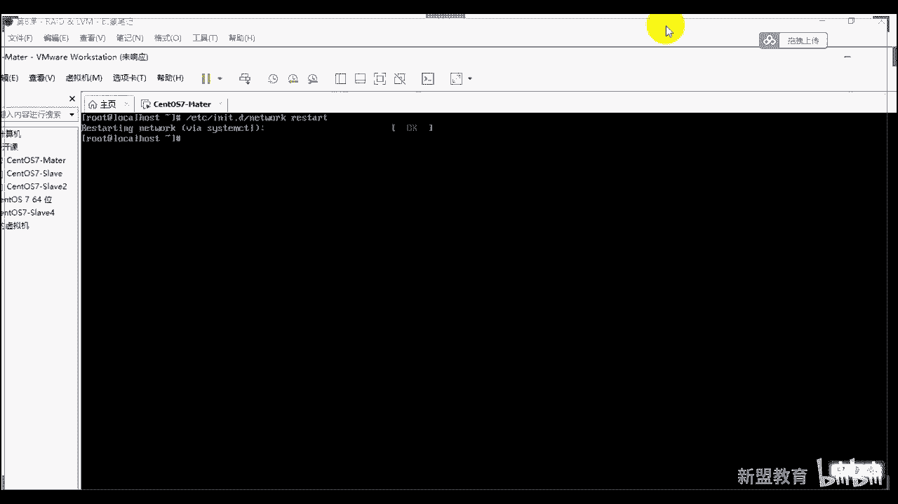
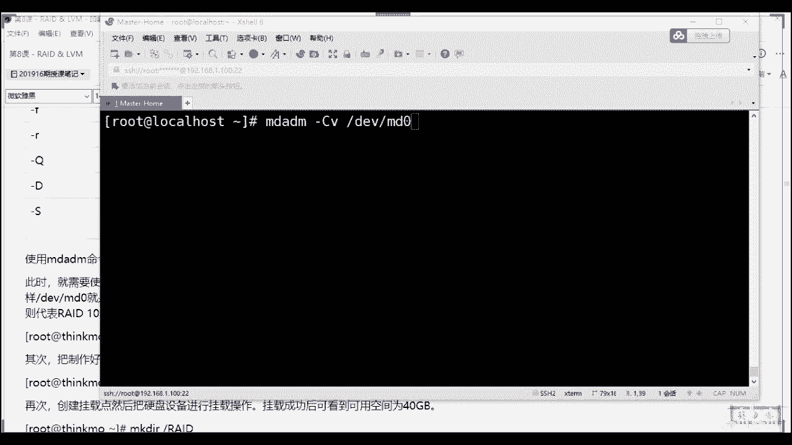
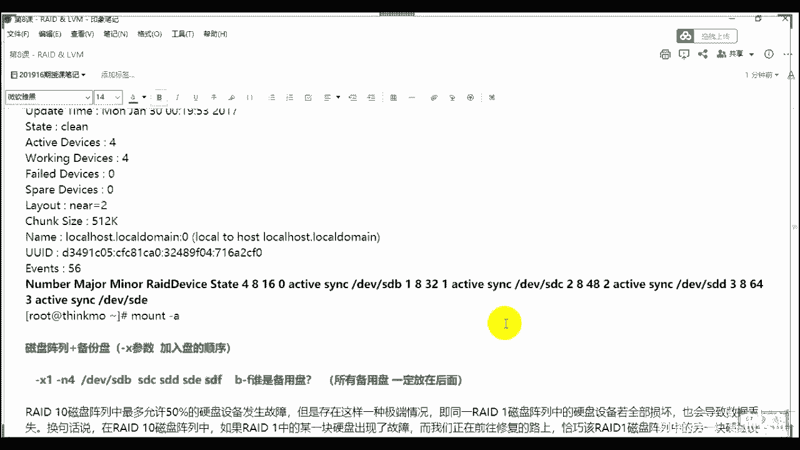
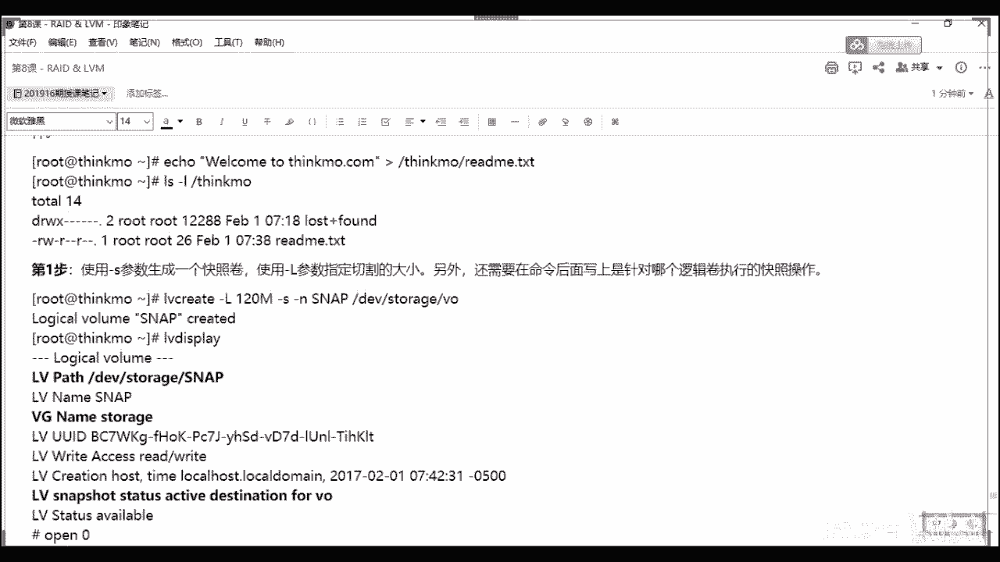

# 2020最新Linux-RHCSA入门实战课 - P9：RHCSA-第8课-RAID&LVM - 新盟教育 - BV1Fg4y1z7kS

。

🤧做的一个作业啊，这是我们过第二周的对吧？

呃，第一周的其实没有太多的问题。因为第一周的话，可能大特老师在图形界面上，我装的时候太慢了啊，其实我只是告诉你们去装一下，其实我们我们生产环境压根不用，明白了吧？啊，生产环境压根不用。

我们先来看一下第二周的这个作业，好吧啊，第二周作业来。

第一道题有问题吗？我想问一下大家，第一道题有问题吗？啊，无外乎usered对不对？usered我们在创建的时候创建名称O老师smore对吧？s moreM好，然后呢把它加到我们的组里面去，对吧？

同学们把它加到我们的组里面去，组名改成TACHER能理解吧？啊改成组里面去。同样的另外一个的话也是一样的，能理解了吗？啊，用这个大G去把它添加组，或者老师我添加之后的话，可以干嘛？😊。

user add think mode，然后我们再通过另外的叫做user mode，是不是user mode杠G或者说杠G。能理解吗？去把它改成我们的think more啊，改成我们teacher是吧？

对啊。好不好？小这可以吗？可以啊可以啊，要创建组吗？不需要啊不需要好吧，哦，不对。😊，不对啊，如果你们注意啊，如果这个组不存在的话，一定是要创建的。好吧，group。啊，group啊艾明白吧？

原来很简单啊原来很简单。如果是同名的话，你说老师我跟加在本本本本组里面，你就不需要创建了。而这个组未必在未必在话你创建对了吧啊，PAACCH12。😊，这道题没什么难度，对吧？啊。

第二道题其实也没什么难度。😡，第二题两种方案是吧？哪两种方案？第一种那好了，就是我们直接使用命令啊，直接命令。那命令的话很简单嘛，就是老师我创建用户user add什么think more啊。

think more EDU。对吧后边大括号1顶点到多少到多少100。能理解吗？这个没什么难度啊这个没什么难度啊。😡，这个没什么难度啊。然后呃第二个来说的话就是所谓的脚本是吧？脚本啊，脚本哎，当好了呃。

脚本的话呢，有的时候我可以写在VI里面啊，我可以写在VI里面。比方说老师我写个test是吧？点SH好，你也可以直接写，你也可以直接写写什么很简单，好了。for循环是吧？有同学老用用for循环好。

for什么呢？好for i in不要题forI in好，in什么记住了啊，E后边我们一般给的是SEQ啊，SEQ啊，1到100是吧，到100啊，从1到100。对了吧？

FEQ表示的是老师这个这个这个这个一个序列啊，多少呢？是1到100明白吧？是1到100啊，在它里边的话。

我们说that啊that do啊循环体循环体里面user add是不是user add什么ad s EDU。好，dollarI。能理解了吗？啊，你这个直接在在命令上写，就是也可以，就是给个分号好吧？

如果你是在命令上写，就这么写，但是吧，然后做的哎过来。😊，然后过来。啊，这么做就可以了理解了吗？啊，这是命令行上直接写啊，那个是在写脚本里面就可以换行啊，对，两个方案有问题吗？

倒数候I这边有个I看到没有？这个是个变量，变量的话是来自这个地方，我从1234567890，我不停的在你这边去去循环。对，这个I是来引用了它，理解了吧？也用了它啊，对这个不难吧，这个不难吧，对吧？

这道题其实也不难啊，也不难哎，呃，这个其实也可以，其实但是你看怎么做？如果没有讲，不会的话，你就用这个对不对啊，不用管你用这个啊。😊，这个是个难点啊，这个是个难点啊，但是这个难点其实我之前录过的。😡。

就当才那次谁在群里面问了我。😡，啊，现在群里面问了我，我们说了的好了，useruser add好，username对吧？username。😊，老姐啊，user name。Useer name。两个点。

你拿三个点，那肯定不行吧。对吧？好，user name大了，杠P大句了。如果我直接给们，你把我说到师，我给think more。好，答家好了，此时由于是明文的啊，此时由于是明文的那对不起。

这个是无法使用，对吧？这是一个所谓的错误用法。😡，对吧这是一个所谓的错误法，能理解吗？来理解说一。啊，这是一个错误用法。那句要师我用杠一怎么做？很简单很简单啊，先创建一个用户user a好了，用。

如果我想创建的是linux啊，知道了，我想创建linux，那我可以填创建一个think mode干嘛呢？好，think mode创建之后的话，我们下一步给什么password，对不对啊？

下一步password对对？😊，好，password。好，thinkable。那么此时你给个密码吧，给密码之后呢，好比方说老师给的都是think more密码，好吧，密码。

那么这个密码我们说的会保存在哪里啊？保存在我们的ETC下。😊，啊，这种一天之下杀的文件还记得吗？😡，上到文件啊，对了。😊，知啊。😊，🤧嗯。别着急别着急啊。

这个记住了啊，进来进来进来，你们不好用吗？😡，我看看啊。Oright。sorry啊，看了，user add，你们不好用吧？thinkign more给个啊一点点100。啊，没有是吧，没有啊。

那可能和我们那个touch创建不太一样，是不是？那我们这个地方的话，我看一眼啊。呃，可以。培养可以用什么参数去给他创建一下啊。去给他创建一下是吧？好，那可能是他没有这个参数吧，可能是不能那么用是吧？

那就不能那么用，那你们可以，那就是那就只能用脚本，是不是？

那只能用脚拌。因为我没给你们讲toash是吧？我只讲了个toash啊。😡，🤧。🤧啊啊，你要用另外一个也行，是吧？你如果说老是纯命的话，用user可不可以，其实也可以啊，其实也可以呃，怎么用呢？

就是这个可能会要结合我们其他的这个的比方说分管图是不是结合分管符。你比方说你比方说你也是创了一个变量或者创建一个东西，对吧？这个就那我们就用第二个好吧，那我们就用第二个用第二个好不好？用第二个脚本啊。

哎或者直接写这个命令也可以，好吧，就这个命令也可以。啊，接着说这个就说这个啊好吧，这个应该应这个应该可能是一个小bug吧。就是就是呃我本来说的实话，是想让大家了解这个touch的是吧？

touch file的话。fi1到100的，然后我给写成用户了啊，就顺了。好吧，用户里面他来没有这个不支持，那我们就把它去掉，好吧，就把它去掉。其实正常来说，用户的话就得写脚本啊。

用户话确实是批量上的是脚本。这个脚本的话，请你记住好吧。2是CSA我们的一道脚本题。啊，一道脚本题。一道脚本题，这个是考的啊这是考的。第二个来说的话，这道题好了，那么它会在沙道里面对吧？必考的啊。

必考的，那么它会在沙道里面啊，进来啊，沙道里面。那么我们需要的是把我们的这个沙道里面的。😡，密码复制。啊，复制复制之后，我重新创建，比如说老师我要创建lininux啊，linux杠P明了吗？杠P。

然后记住用单引号，用单引号把那个所的dollar6dollar。😡，对啊把那刀儿溜叨了巴拉巴拉一大堆巴拉拉一大堆，好，把它复制进去。😊，然后此时记住这个用户才可用，没错，而且必须用引号啊。

你不加引号一定是错的啊，来看一下同志们来看一下，比方说我们现要做的啊呃user。

带好吧，我们创建，比方说我们现在有think mobile吧啊，看一下CDEDC他s word了。好的好了，我有think mode对吧？不有think mode啊。

think mode的密码我们现在改一下啊，think mode。😊，啊，比方说老师我给的是还给s。还给think mode好吧，创认成功啊，那此时的话我ETC杀到下好了。

我think mode是这个看到没有？我把它复制下来，记住啊，两个分号之间，两个两个两个冒号之间复制啊，复制啊，user add看好了，我要创成什么，这里面没有的。你比方说呃。😊，啊，比方说晴天是吧。

比方说晴天杠P，如果你只要说我直接粘贴好，回车，我直接粘贴回车，你再来看，从thinkign上，你再来输入好拉啊，再来说晴天是吧？你会发现一个问题，老师心思报进不去，知道吗？😡，进不去知道吗？

为什么进不去？来看一下杀道里面。😡，看到了吗看到了吗？为啥进不去啊，为啥进不去？是因为看到没有？他把dollar到dollar看了，同学们把这个位置我认为你是一个什么呀，认为你是一个变量。😡，听见了吗？

啊，日本这个新的变量所以没有意义啊，所以没有意义。对了吧对。😊，所以除此之外，我要干嘛？😡，记住user add，比方说老师创建一个黑天是吧？黑天杠P记住了，引号引起来复制进来。再来看。

再来看。有了吧有了吧，所以此时你才能够SU杠黑天，你们才能够干嘛？think more登陆上来。看到了吧看到了吧？来看到刷一。😊，大家看到穿一。好吧，所以要记住引号。😡，一定要加引号啊一定要加引号。

而且这个引号必须是单引号，明学吧？必须是单引号啊，你说师双引号行不行？也行，就是但是单引号啊，不是不是双引号必须是单引号啊，必须是单引号，好吧，必须是单引号。双引号的话。

dollar还会具备其特殊的意义好吧，单引号啊一定是单单引号。😊，好，所以这道题的难度在这儿上呢，明白了吧？这难度在这儿，也就是说一句话看家好了，更P其实没有实际的作用是吧？让你临时去设置改啊。

一定是复制来的进来一定是复制来的。😡，啊，所以这个不用说了。第二个来说，直接passload创板杠P是啊，我不但是我不是考你一下嘛，是不是？😡，对不是啊，所以这些东西不怎么用是吧？

只是坑挖个坑堵不支持挖个坑嘛这东西，对不对啊？第二个来说啊，这有什么区别吗？来告诉同朋学们RBM。😡，啊，和亚么怎么样，这两个本质上什么？其实来说，要么哎是什么？要么是我们RPM的集合。😡，啊。

要么是R变M的集合，同时这些都是二进制包，明白了？同学们都是二进制。我最终的话只不过只不过嘛？我的要么是自动的匹配依赖。列了吗？而RTM的话怎么样是必须使用自己安装依赖。啊，通过RPM命令。啊。

RPM命令啊，要么的话怎么样？要么的话是EM命令。这个区别应该不难吧。同志们，你用的多了，其实你就能体会了吧。ok吧？来，ok上一啊。😡，啊，其实他们不是区别，他们两个是个进阶的关系，对不对？

难度在底下了。😡，啊。好，第二个问题，老师企业当中用要么还是原码变译啊，也是用RPM记砖啊。我们你们写RPM对吧？就是RPM我说过了，这在哪里？国企。😡，你比方说银行。这类网公司是吧。

这类公司no不是还真不是啊，还真不是这类公司原因很简单，不学自建亚马。明白吧，不许这样吧，不许用。😡，红包外的红包官网外的软件。明吧，就是规则的问题啊。第二个，要么记住了，要么一般是我们的互联网。啊。

有请来说大型的互联网。啊，我们来批量安装部署，明白吧啊，批量部署原因很简单，都是经过二次开发的啊，我们有自己的二次开发的，我们其实有自己的这个y子仓库的。啊，第三种我们的源码解了啊。

源码大多数用于我们的中小机构啊，中小企业。哎，稍位。啊，中小企业原因很简单，可控性高明白吗？可控性高啊，只是耗费时间。啊，耗费时间，但是能够节省资源，尽可能减省资源，知道吧？所以这么几种情况啊。

这么几种情况下来。啊，第三个来说，老师PHB的升级就说PHB升级其实就是5点几到5点几是吧？你不一定是5点4还是5点6还是5。3啊，进来但是几种方法呢总结进来啊，我们其实现在大多数都是5。4到5。6啊。

我给你们总结好了，在这儿呢啊，几种方式看来啊，几种方式类似于手机的app软件升级，下载双击安装安装过程当中自动覆盖旧版本啊，它会自动覆盖旧版本。😡，所以无需来心无需来心，明了吧。😊，进了啊。

这个东西无去担心。あ。🤧咳。稍等一下啊。好。🤧嗯。😊，知道嗯。啊，所以这个作业应该不用我说啊，这个作业不用我说。那么这里边的话往这看往这看啊，我们第一种是RRPM原理上来说。

刚同学们RPM当你下载到了1个RPM的5。6的时候，这个地方你就可以直接RPMR杠IVH去安装了啊，和正常的RPM没有什么区别啊，没有什么区别，好吧。哎，sorry。😡，唉，怎么换换歌了？

第二个来说姐姐，第二个来说。😡，这样来说是什么？是我们的这个这个这个这个这个。第二来说是我们这个地方用原码安装，可以保留啊我们的原来的东西。也就是说我要新建一个编译的路径，能理解吗？啊。

我要新建一个编译的路径啊，那么在这个位置上，请你注意了啊，请你注意了这个哈，同学们，我去单独的装了一个路径。😊，啊，解压，然后过来解压解压过来，别着急，我说是原码亚螨头对吧？因为这个地方看了PB5。5。

这是一个它的亚麻原亚麻原好，我把你配置过来好吧好，我把你配置过来，亚么圆看到没有？这是个RPM是不是亚么原啊？😡，是不亚敏啊，然后我也可以通过RPM给你再去升级。大家说这个其实就是亚么元。😡，啊。

20元就价美元。啊，它就会升级过去，你们回去可以练，把这个过程你们回去可以做，明了吧？啊，这个回去可以做。第二种方式在线升级。看到了，第二种方式在线升级。😡，啊，这个更直观一点，看到同学们。

我写一个亚么元，在这个亚么元里面，我把这些个我们常用的更新的网站我复制过来，看到没有啊，其实5点几到5点几还是6里边就支持的了，明了吧？5点6看到没有啊，所以把这个原因弄过来。

我们最后通过一条命令要么啊install。😡，🤧杠Y啊PHP啊，PHP56知道吧？56表示5。6版本啊，这个56啊，别来好不好？别来啊，第三种也是我们最常用的。啊，也是最常用的什么呢？在线的在线的啊。

在线的都给你们列出来了，只要干嘛呢？看到了，我只要把这两个元一装啊，这两个元一装RPM网络元一装，然后把我原本的RP把我原本的PP删掉，然后我再来按照这个方式，看到没有？

这些个都是PP56的这个这个这个这个这个依赖，我把它只要装上就可以了。能懂了吗？来都门刷E。😊，啊，都有差异。啊，这个回去试吧，好吧？这个回去试吧，我就不带你们去安装了。因为这个到后边的时候。

我们讲到了LAMP的时候，AN或者LANMP的时候，我们会详细再去讲到及升级，好不好？这个只是跟大家说一个亚麻源的关系和RPM和和源码之间的一个区别啊，和源码之间的一个区别。太快了，呃。

你不用理这些命令，对吧？阿丹重点是这个东西啊，重点是这个东西两种方式。第一种的话，RPM第二种的话，源码练了吗？源码，但是其实记住源码的话，太麻烦了，明白吧？而我们现在给大家三种方式。

这三种方式其实都是RPM的方式理解同志们，都是RPM的方式，那原码的话，还用我说嘛？源码的话是5FTRXF是吧？好，老师我把PHP点是吧？5。6点TAR点GZE解压，对不对？

但是我们为什么极少用这种方式，我告诉大家很简单，你们单纯的去编译。😡，P着屁啊，你们知道要多长时间吧，半个小时起步。啊，半个小时起步。啊，我就告诉你们好不好啊。

这还是在8G因8G的8G的这个这个内存情况下啊，半个小时起步啊，你做吧是吧？所以我们一般都是用的是上面这种这种的方式去激活它啊去升级，好不好？所以原版的我就不多说了。但是大家明白两种方式。

其实就是好不好啊，就是两种方式。🤧啊，文件回来给大家放放过去啊。😊，然后最后一个来吧。😡，其实也是编译三部曲，没毛病吧。😡，其实也编辑三部曲，只不过只不过大家注意了，我这个第一步TR。今要用什么呀？

在哪儿要用什么呀？😡，应什么呀？来。😊，来，瞎后没有什么，哎，我就知道肯定得有人蒙，知道吗？😡，ok啊。😊，好，记了啊TR记住啊，一定要跟杠G知道吗？用G我说了G是对应上了你的BZ two，对吧？

G是对应上你的BZ two啊，然后你才能去解压你的什么VF啊，大家记得啊，X对吧？X啊，然后后面跟上它，然后第三第二步来说的话，make是吧？点儿 configurefi。啊，configure。

然后make，然后make is for这个有什么问题吗？步骤没有问题，对不对？同学们，那其他上就是我们的依赖关系。啊，依赖啊，那么我们这个的依赖其实和阿玛奇差不多。

常见的open SSL杠 devilil好，同学们my circlecle杠dilGCCGCC杠C加加啊，编译环境还有吗？还有吗？还有吗？看到吗？你们猪做的时候有没有有没有？😡，有没有？

其实你们不用装对吧？不用装啊，还有什么？比方说PCRE杠dl对吧？或者说少是PRP杠diluts哎APR。和APR杠uttu啊是util，对不对啊，记住一个东西啊，很多学老师这些东西我怎么记其版本。

大家说你不用记版本，记住不用记忆版本，理解了吗？不用记版本啊，对了不用记版本。原因很简单原因很简单，它会自动帮助你去匹配版本。在ya的时候明白了吗？啊，在样M的时候，它会帮助你去匹配版本。

重点的是你真的知道这些东西得用上，知道吧？好不好？这个是BE，这个是安装嘛。😡，对吧这前面不讲了嘛，这事儿愈变异。这是域变页。对吧三部曲以及依赖关系进来就可以了，好不好啊？这个其实不用多说。

不是这其实不用多说。🤧咳。啊，而且大家应该明白一个问题，所有的对所有依赖都要装所有的依赖。老师我缺什么？其实你不需要什么背诵，对吧？缺少的东西你是可以直接百度出来的，你是可以直接百度的啊。

有的依赖是要单独装的，明白了吧？啊，原因很简单，它会有个er。😡，他有个 error明白了吧？哎，有er有报错，报错，后边大家就说后边这一串其实就是答案。😡，啊，这个就是答案，明白了吧？这个就是答案。

😡，啊，这个就是来。啊对，不是呃，阿玛提不用指定user和group明白了吧？啊，不用指定好不好？呃，RP的包，我课后给你找好吧，课后给你找一下，给你给你发过去。

我忘了临时我给你我现在没有存在这个电脑上，在另开电脑上，好吧啊，就是这个就是答案了，你只要把这复制下来100多，其实大部分存样都有。而且别忘了我说过的，只要是缺少什么什么library。

这是最常见的问题，对吧？什么点C什么点H。什么表意事，这些统一的方式就是亚马instore杠Y统一的名称杠demo嘛，这最最简单的对了吧？这是最最简单的一个问题，依赖环境。啊，所以你说这个作业难不难？

其实这个作业真不难？作业只是考逻辑的这个作业根根到底，我只是希望大家把这个逻辑能明白了，理解了吧？啊，逻辑能明白了，而重点的是哪个啊？重点的其实这个脚本你是要会的，对吧？重点脚本你要会的。

这个长分组你要会的对吧？啊，长分组你是要会的，好不好啊，所以作业是那么多作业那么多，然后我们后边的话。我们下节课的作业啦有的人五行人晚晚发了是吧？我过你们看一下，你们看一下。😊。

今儿第二周的作业我都被你们在这判了。😡，啊，第周作业当前目录，我把第一周作业的情况给你们看看啊。好吧，问白这业情况，有的人呢我在里面已经严格的批评了你了，我就不打开了，好不好啊？我就不打开了，好吧？

然后呢，你就自己回去去看去啊，你就自己回去看去好吧，然后呢呃有的作业好的呢，我就会在这个邮件里面回复给你啊，这第一期的第一期没什么可说的对吧？没什么可说的啊，反正我都判了一遍啊，第二周的作业在这呢。😊。

这边找一个啊这边找一个。🤧对吧你比方说比方说我找个找个好点的李静的是吧？李静轩来看来看。🤧啊，李晶在吗？李晶在的话，这个这个可以骄傲一下是吧？啊，可以骄傲一下啊，来看啊来看。😊。

所以作业上而且有同学们有问题，对吧？有问题你般说文福和和和顺熙那边的话还是有点问题的。可以我们科如果你一会儿有问题，我们再来说好不好啊，稍等啊，稍等，可以吧？就是结果就这样一个结果，对不对？好。

ID一显示全出来了，对吧？IDE显示全出来了，对吧？原这个组属于哪个组，属于哪个组看见没有？很直观很直观，对吧？创建ok老师我用这个命令对吧？然后我的脚本很规矩，第一行啊，但正常来说的话呢。

你别忘了这个问题的好了，正常我们写脚本前四行是一定要有的，但是现在我没有讲，你们可以没有可以不注意，所以我拿起来一块说对了啊，在这个位置上。😊。

啊，在这个位置上，这四行一定要有。第二行的话，我们一般给的是时间。第三行的话一般给的是order。der啊，比方说物权@点com啊点CN这是管理员的管理员的邮箱，谁负责use的是吧？

ho好create我们one00us对吧？用处是什么？记住啊这四行是必做的，好不？这四行是必做的啊啊，然后下边的话看placease read对吧？请你输入用户的名称。

请你输入用户的这个这个编号看这个脚本写的是真的啊，我看上去都很舒很爽，你们知道吗？啊，因为其实没讲t呢，是吧？但是我其实想问一个问题，这是你真的是你自己写的嘛，是不是啊？

只要是你自己写的这个东西真的是挺棒的，明白了吧？啊，但很多的不要的不必要的东西我都输入到了我的空设备里面去看到没有啊甚至甚至你可以通过这个东西来自定义你的密码。😊，看到没有？这自用的对吧？😊。

对吧啊结果都出来了，看到没有？全部创建出来了。对吧啊，这一个结果嘛，对不对啊，最后命令的话其实也能用，只不过少一点啊命令朋吧？哎，这过程很很很过程很很清晰吧，过程很清晰吧，对吧？过程很清晰吧啊。

只是哎对了吧。啊，所以另一个我就不给我就不给你们看了，好吧，另一个我就不给你们看了，就是这样子啊，所以这是一个比较好的作业，我记得呢啊我记得呢。😊。

好，好啦。😊。

OK差距好大家是？没关系，就是慢慢的来慢慢来，大家都是慢慢来的，不要着急这东西啊不要着急，其linux是一个非常好玩的事儿，你明白吧？学linux是个很好玩的事情，就是把它当做乐趣去学。😊。

啊，把它当做乐趣，好不好？然后结束了课程之后的话啊，我们来看一下这个这个这个还在补充营啊。好，然后我们把这个这个来继续我们今天的正题，也就是我们磁盘观理的第二大部分啊，对来是在初级课程里面。

你们要会了啊，那么我们刚刚说了，同志们，我们上节课呢学了三个我们的命令，对不对？学了三个命令啊，分别是Fdi啊Gdi啊，和我们的party的。😊，啊，后我们part。但是这三个来说的话。

老师我可以控制足够大小的对吧？甭管是2T，甭管是NT的，应该是NT的，对不对？啊，但是有一个致命的问题是什么呀？来告诉我致命的问题是什么？😡，什么问题啊？什么呀？有一个致命的问题是什么呀？告诉我。😡。

什么问题啊？来来来来来。来，所以说你看冗余是吧？有人说老师冗余啊，冗余的话，你也能自己去做。但就是最大的证明问题是你无法扩容，对它就是无法动态的去调整空间，不能说真正扩容扩容，我们可以给它叠加上去对吧？

但是你无法动态的调整你的空间大小，明白吗？其实说白了就是不能够扩容。啊，你是无法动态调整的那怎么办呢？老师，我这个硬盘快满了，我现在觉得不能临时换槽的给它增加，那咋办？你用FD址就不太好办了。😡。

所以呢要用到red。啊，用了re好吧，要用red。那么这个来说一下，为什么要有red和LVM。啊，解决了方案是吧。😡，解决方案就是我们的。哎，right啊和LVM。当好这两个其实都是合用的啊。

这两个其实是合用的啊。啊，合用的啊来看啊，那么好了，那我re本身是基于什么情况下衍生出来。第一个来说解决这个问题。第二个来说它考了，大家告诉我CPU的话，我们现在最高的是I9了是吧？I9了。

甚至I5的话都出来了多少？10的了，是不是I5都有10的了。😡，啊，都10叉叉的了。啊，看啊，所以十8盒的一新然36现场告诉我足够快了吧，多快了吧。但是硬盘机械硬盘我说了，由于其机械的性能导致了其什么。

导致了其对于大量的L的时候，导致它有可能损坏或者过载啊，甚至容易丢失，对不对？好，两个问题啊，一个是损坏，一个是数据丢失。好，那么所以基于此几种情况，我们做了readd很简单，readd综合一下。

不用看这堆破坏啊，不用看这堆P话是吧？综合一下read解决的问题，哎，sorry啊，这个字体小大点。😊，啊，read解决的问题就那么几个。😡，啊，第一个来说扩容。对吧？第二个来说什么备份。😡。

第三个来说，提速。啊，扩容不用我说了，对吧？老师我多加上几块，是不是多加几块备份的话呢，因为我块多了，所以我能够有另外的两个额外的去做数据的copy，只是copy。第三个提速，我有多块盘同时去存储。😡。

能理解了吧，这三个问题。二0道的你。但是好了，这三个问题，我们在最早的时候不是一次性解决的。啊，所以呢我们就会有所谓的red的类型，知道了？readd类型从1到10都有1到10都有。老师。

我没见过3456是吧？没见过这个这个322这个没见过347很简单，很正常，因为很少用，知道吧？啊，你们常见的类型一。😡，对吧0啊01到这里01561001。这是你常见的这是你常见的。

那你说好说我有没有15，有没有16有记住还真有，但我们基本不用啊，我们目前来说用的多的5610。😡，啊，后四个是我们用的多的，为什么老师些数字表示啥？先记啊。那么先看第一个叫做。😡。

red灵对吧red林也叫做supreme记了？red林的有个别称记了，叫做supreme记了啊STRRPING。😡，啊，接来接来啊，作用很简单，re0是单纯的提速。而没有备份。对吧而没有备份。

那么你们可以看到这个图上，对吧？同学们来看一下这个图啊，我这是一个硬盘，这是个硬盘，硬盘是一块去存储的，没毛病吧。12345上3打老虎，121313572468，看到没有？我的数据过来的同时注意啦。

复制过来复制一下啊。😡，啊，sorry。对吧。来看啊复制一下。😊，好，画图。啊，是是这样好筒。哎，精费冲突直接搞1001对，没错，是这样的。但一般来说我们其实搞个5就够了啊。一般我来说好吧啊。

101是肯定是最好的。那好了，那么此时如果我的数据来自这边好了，我的数据来了啊，怎么来着呢？123456。😊，啊，七8一公8个，到了此时记住啊，此时哎六是最安全的，但是其实也是多坏多消耗了一会儿盘啊。

对吧，那么好了好了，那么我这边来了这么个数，那好了零的话啊，零多少盘都可以。多少盘都可以。那么老师N块盘。😡，则提升N倍速率，对学们？N括尔盘提升N倍速率起来。很简单吧，老师2块盘。

那我就两个数据一块读，两个数据一块读，两个数据一块读，两个数据一块读，能理解吗？😡，来来O的创意。😊，来来来来来O上个一啊。哎，所以这个是最快的。所以所有的就说这是最快的最快的。😊，第二个来说的话。

叫做01啊，第来说叫0101呢也叫什么呢？叫做monllyary。😡，啊，干嘛镜像是吧？同志们，它的作西很简单，无提速是吧？无提速。啊，有备份。有备份，而且也是我们所有的所有的类型当中。啊。

我们这个硬盘的使用率最低的。啊，最低的。那么正常来说大家记住了啊，正常来说原则上原则上我们readd一记住，read一硬排数啊，必须是2N。原则上必须是2N，但是你说老师我故意的用单数行不行，行吧？😡。

行吧，同志们行吧，其实行，okK的对吧？哎，存一分背一份存一分背一份。原则上其实。😡，单数啊就说其实单数你在电脑里面做也可以，但是你会发现一个问题，你发现一个问题你发现一个问题。😡，哎。

如果我是2N看好了，我是2N，我一个是1G，一个是EG2个1G的那你最终的总容量大家记住啊，最终的总容量是多少？😡，是多少是1G明白了吗？是EG。而如果s块81G。啊，EG啊EG好，大告诉我。

你们知道最终的话总容量是多少吗？😡，这是多少吗？😡，知道多少吗？知道什么？其实按照道理来说，大家都明白对吧？是总的除以排数是不是除以排数是吧？除以排数。但实际上这个东西其实那天谁做了。

那个那个那个那个刘凯做了是吧？刘凯做了啊，其实你会发现是1。5G。😡，那你就明白啥意思了，他其实是将一个盘砍成一半了，看到没有？他其际实是将一个盘给砍了，明白了吗？啊，他其实将一个盘给砍了啊，哎。

接下来哎，大鹏可能也做了是吧？哎，所以这个大家记得来啊，所以记下来，所以这个东西其实是不符合我们真正应用的，我们在真正的生产环境。😡，啊，生产环境我们用的都是redRAID卡red卡长什么样呢？长这样。

😡，长这样看到吗？跟你的声卡显卡还是看着挺像的是吧？看到没有？对没？read卡都是用它的，一定是双数，理解了吗？做read一的时候，一定是双数O吗？不会出现什么。老师这种点几点几的情况能O吗？同志们来。

O串一啊。😡，来，我回刷一啊，但是它的理论上去抓，理论上理论上你的使用率就是总容量啊，比上你的个数，记住啊，这是理论上你的使用率所以你的盘越多，你的使用率越低，太正常了，就re一明白了吗？啊。

它不提速啊不提速。😡，而red零不用说了，这是我们使用率最大是吧？百分百都能用到啊，百分百都能用到。但是只要损坏一个数据丢了。这个的话损失丢了，怎么还有备份，对了吗？还有备份。那要说有没有其结合呢？

有没有其结合呢？有知道吧？第一种结合来说，因为你说这个没提速，这个没备份，肯定不是我们的。😡，不是我们的希望的这个这个这个情况啊，我当时候又提速有备份了，对不对？😡，所以。啊。

进来第一种也是最最节省资源的，叫做reide5。我们管它叫做单机偶校验。啊，单基有校验。那么最简单一个东西就是至少要有3块硬盘抬起来。😡，我至少要有3块硬盘，至多损坏2块。😡，啊。

至多损坏其实至多损坏一块，明白吧？因为什么损坏第2块，对不起，你的数据就丢了，理解吧？你是至多损坏一块好，而red6大起来补充一点啊，而我们的re6好，叫什么呀？叫做双基调验。😡，啊，双机有条件。🤧嗯。

啊，双9斤这个至少4块。至多换一块。😡，来吧，至多换2块啊，换2块损坏掉第3块就完蛋了。怎么个意思啊？来看这个图，我这么画更清楚啊，它等于了4块盘，对吧？来看啊。😡，打了，我现在呢有3号盘要。2。🤢。

3对吧？然后呢，我把这三块盘子我给它分出来，看到了，就是分里面的啊一。😊，2。🤢，3。啊，我画三个底下不画了啊，这也是一样的一。2。🤢，321。23。来看同志们后边的话，唉，sorry啊，这不用啊。😡。

来看，那么我们说的这是red几啊，red5，对吧？😡，是吧，这是5。啊，我的数零头话说啊，可以可以可以可以啊，我的数据呢从这边过来啊，我的数据从这边过来，这个数据里边写的非常清楚，接下来啊非常清楚。

我们就这么写1234。😊，对吧5678910，我们写10个好吧，写10个。那么当好了，此时告诉我，你们猜一下，我一次性啊读取或一次性存储几个。😡，啊，一次性存住几个。😡，A字性存出几个。😡。

太太几个几个。不要说三个是吧，说三个你就挨打了啊，记住啊，是两个对吧？两个啊两个哦，师为啥不是三个？很简单，太好了，当我的数据被我进行存储的时候，这个地方看了，一和二同时进来了。第三个盘不做数据存储。

我们管它叫做校验码，校验位，你可以把它看作是一加2。😡，明了吗？可以把它看作是一加2，啥意思？比登陆老师，我二盘坏了。好，此时由于有一，由于有校验码，我这个校验码就可以充当二的替补，通过校验码。

把你的数据校验回来，补充回来，能理解了吗？来立志刷货花上来啊上一上来。😡，能吧？😡，来啦来啦。没毛病啊。好，那么好来看同学们三和四记住了。好，到了，我这么干行吗？3。😊，4啊这码。可以吗？可以吗？

告诉我可以吗？怎么补，这是算法问题，不讲啊，不会好吧，我也不会，那是算法的问题啊，好不？啊，可以吗？可以吗？记住不可以啊，记住不可以，为啥不可以，记住了啊，我们的校验码。😡，不能够连续的放在同一个。

同一个设备上哎，是不是校育码不能连续的同一个放在上面上啊。😡，不断连续的同学就放在那上面啊，进来好不好？哎，所以的话我的校验码也是这样的，这个是校验码，这个是校验码，这个是3啊，这个是4是吧？这个是5。

这个是6。😊，理解了吧？同志们啊，理解了啊，所以这是单基偶校验，叫单基偶校验。😡，那如果是六呢，很简单，太好了，如果是6。啊，如果16报一下啊，改一下。改一下啊，如果是6。啊，如果是6。对吧啊行吧。

同时们，我同时同时。😡，2。🤢，我同时可以读取或同时存储几个数据啊，告诉啊，最少4块盘啊，4块盘。电话一会拍啊电话一会拍，同时多取几个。😡，几个。几个。😊，塑手盘几个几个记住了啊，记住了，还是两个。😡。

啊，还是两个很简单，记住了，一和二就来了。😊，12看到没有？这个校验码这个校验码。😡，两个教验码懂了吧？有老是故意的是吧？就是故意的，不用不用猜啊，不用想我是不是故意的，就是故意的啊。行，大家明白了吗？

所以这是两个校验码，明了吧？所以有双重保险啊，其实来说没有必要啊，其实来说没有必要明了吧？啊，我们大多数情况下呢，公司哎，用5啊，用10和01对吧？都可以明白吧？啊，那我说01和10是哪来的，记住了啊。

看好了，看图。😊，看图啊，记住了，01和10至少都是4块盘是吧？01。啊，和10我们至少4块。怎么用好了，同志们12。3。4两两一组，哎，看了，先0后1叫做01，先一后0叫做10是吧？

底下的如果这个是一好，这两个备份，这个是一，这两个备份啊，总共的加起来是0，看见吗？题速，那么这个叫做10倒着往上念列了吧，从下往上念啊，从下往上念。好吧？哎，如果是01呢，如果是01了啊。

那就是底下的话。😡，如果是01的，就是底下。😡，哎，底下提速底下提速上边备份。明到吗？上边备份啊，这是01啊，这是0啊，所以大家可以看到啊red10和read01看到没有？这是10，这是10啊。

下着往上走啊，下往上走，中间有两个等号，对吧？这都是一样的数据，明白了吧？哎，那么如果你的公司的成本够。😊，你就玩这个一一聊，不够就是right我。😡，啊，不过就re我。好不好？啊，当然了。

我说了啊当然了，我说了啊呃，我们目前来说都是用的是red。read卡是吧，read卡这个属于硬件的啊，硬件的大多数情况下记住了大多数情况下记住了。😡，对。😡，啊。

绕后件都是硬right的都是硬right 软 right记住很简单，软 red是干嘛的？😡，柔弱的是干嘛的？😡，比理论嘛对吧？理论嘛，你得知道吧，软right的和硬软的理论是一样的，对不对？😡。

对不对啊，硬right的其实没什么可能配置的啊啊，记住啊，记着啊软硬的呢怎么说呢？硬，其实就是你把这个盘放上去了。老师我把6块盘放上去了，记住了，你们可以放到1个F2，一般来说不是F2。😡，进哪了？

F2可以进到我们的rightd系统。😡，啊，不系它是一个图形面的，它它类似于一个图形界面，知道？同学们见过那种呃见过那种选择题吗？见过那种选择题吗？就跟一个就一个表单似的，跟个表单似的啊。

你可以下拉拉出来一个选择东西，对吧？选择东西的。😡，啊，对了。你们一般来说，戴尔的都有服务器啊，戴尔服务器都有公司里面都有。你可以尝试启动下，一般都是F2启动，明了吧？这F2启动。呃。

软 right其实就是学学理论，再加上一个实战，看看它的效果，跟跟硬right说实话样子就是就是就是呃其效果是差不太多的，明白了吧？啊，差不太多的啊，一般用于什么场景，就是你的公司成本高啊。

成本老师我有你就可以进明白了吧？对不对？有的公你不是有的是这F2服务器上，明白吧？啊，记住了，记住了，就是biils。BIOS和red系统是两个系统。啊，这是两个系统，好吧，这是两个系统。这样系统。

好不好？就是你你们钱到位，比方说银行的话就可能用这种。没错，银行、证券啊、政府、大学都用这个。然后互联网的话呢，就是看规模规模大的，成本高点数据宝贵一点，那我肯能用，但它可能下游场还会结合上5，明白吧？

😡，没有同志们。啊，那看啊呃对，如果你要是接触不到服务器的话呢那你就就就就就就那什么吧，好吧，但是你得看有没有啊。啊，对吧？有的是用F2，有的是用F2键，有的是用ctl R或者ctl E啊，有的是好吧。

来看。😊，啊，那么软 right的话，我们往这边看啊，就是软 right，其实就是把它硬盘加上去，对吧？同学们加上去，我们上一节的话也讲到了硬盘管理，对吧？啊，这个就简单了啊。所以的话记下来第一个问题。

我们把它加上去硬盘啊，加上硬盘去，先活跃一下快照，好吧，我现在我活跃一下快照，然后我们重新加上硬盘重启啊。😊。

我们直接加几块啊，直接加加4块盘，好吧。😊，加4块加5块盘吧，加5块盘吧啊，大家加5块盘啊，5块盘为什么？一会儿说。😡，🤧嗯。稍等。稍等，A为你有可能盘坏了有没有备用啊，得有备用，是不是啊，1。

5这行啊，行啊，没毛病好不好？但是说一个坑啊，来家好了，说个坑啊，就是read一看到好了，同学们，read一。😡。

好啦，如果我A盘啊，同学们，如果我A盘好，老师我是一个G啊，我B盘啊是512兆。来请问一下大家，我的总来，告诉我我总容量是多少？我怎乱说了。😡，我总容量多少？哎，对了，这个是512兆，明白了吧？

512兆哎，最小的，所以玩right一的时候，尽可能让这两个还是相同大小，又白浪费这点东西啊。😡，好不好。啊，就是说啊好，来，我们做啊硬盘添加对吧？一块儿。😊。

系嘛你家。一会儿你就下一步就可以了啊，下一步就可以了。走走走走走。😊，是吧啊我要不我也加我也加，行加20G加20G吧，好不好？20G就20G吧啊，反正你也用不到啊，反正你也用不了那么多。😡，啊。

两个对吧，3个。🤧加第三个啦走。好，第4个。啊，48个项够嘛，要加加5块吧。啊，加会吧。嗯。走的。BCDEF对吧？得到F呢啊，就是编号得到F呢啊。😊，好了，加完了，确定啊。

确定完了之后重启重启之后拍一个镜像，好吧啊，记住一定重启啊，不重启，它不识别。

🤧啊，不能不是变。🤧你看啊我跟你们说，其实刚刚有同学在问我课程是吧？像想那什么的，我说等会儿的吧啊。🤧嗯。我说我跟你说周六啊，其实周六其实我一般来说只有周六能休息休息。然后但是我现在我还是想想我说实话。

其实有时候讲累了公开课，我还是乐意讲讲系统班的，其实系统班春讲基础还是没什么东西的，你们知道吧？还是很容易的。😊。

🤧咳。那分你去搞试所。真的，我跟你们说真的讲系统班其实我觉得讲系统班是最最轻松的。你吧系统班是售后，你们理解吧，知道吧？

就是无外乎把技术讲好了，讲扎实了，对不对？大家能够吸收学到新的东，学到这个学到东西啊就可以了啊。为啥re上不read盘电脑上还能用？啊，red上不用的盘，电脑还能有啥意思啊？啥意思啊？你说的。啊。

不要急啊。好，我们启动起来啊。😊，坐起来。哎，我的天哪，我跟你说很多的时候都是重复的内容，知白道吧？😡，为啥用分区呢？别着急，我要讲好吧？我要讲你的先别着急好不好？大家看好了，记住了，记住了啊。

记住了啊，我们这个地方read一啊，read一，我能不能够用分区啊，你们觉得告诉我，你能告诉我我做read的时候，我能不能用分区，能告诉我能吗？😡。

老师，我直接用red red这个这个这个这个SDAE能吗？能吗？能吗？想想能吗？😡，讲想讲想不知道的话，来看这个地方来看好了，我先把它看好了啊，拍个拍照。😊。

拍快照啊拍照。是吧拍拍照。想一想啊啊这个再加上一个再加上一个我们LVMLVM能不能用来，大家自己想想，不明白，咱就试明白了吧啊，别着急。😡，不着急啊，来看是吧？来看你说行不行，我说行不行都不算。

那看实验效果是不是哎，当然实验效果啊。好，理论上不能操作上应该可以看一看就知道了，是不是啊，看一看就知道来来看看看了，我现在本地的话有多少个SDA是吧？DV下SD好，下下有多少个看到没有？

同学们BCDEF对不对？啊，我现在要干啥，很简单啊，老师我创建一个FD的分区好不好？FDVSDB好，看了新的对吧？premary一号啊，我给多少呢？给5个G。😊，啊，给5个G可以吧？好，保存退出。

此时老师第一位下有了吧。啊DB。有了吧，LDB对吗？试一下老师能不能啊，能不能啊？那么此时一个命令叫做MDADM站起来叫做MDADM。😡。

啊，这个命令管理我们的软read阵列接下来啊，参数常见的都在底下呢。第一个来说是杠A再见了，杠A。第二杠A好吧，第二个来说，杠N指定你有多少块。第三个来说，L指定级别。第三第四个C叫做创建啊，C叫创建。

第五个我们F模拟损坏，这是模拟的啊，这是用来模拟的啊，对吧啊你设公公这个这个硬read没有什么模拟不模拟坏了就是坏了是吧？啊，对吧？第的话是查看S是停止明了吧，S停止。所以我们如果想要创建的话。

老师比方说我想创建re10，我们直接最拿最难的了啊，好不好？那最难的了，好吧？哎，好了，创建right10。首先我们创MDADM。😡。

啊，MDADMMADM啊MA没有吗？是吧？哎，MDADM那好了，没有是吧，没有是吧，这个命令怎么办怎么办？没有就去装嘛，是不是要么in。😡，啊。我把它把它挂在上啊，把它挂上要吗？意思做哎杠YMDADM。

好。好。🤧嗯。你那边R30换的，其实现在就是R730算是比较高好比较好的服由器了啊。呃，你们要是能换成R740，那只能证明你们公司真有钱是吧？其实极U的，你那R730是4U的吗？

我这边的话买我这边我这台好像是R710的，是4U的。🤧啊，来看。😊，稍等啊，这个有点慢是吧？有点慢。断电了吗？我跟你们说啊，就是其实有一类次谁问我来着，那是谁问我说老师我外d卡插上去过一阵就坏了。

主老师我插上去又又换一下，是不是又换，然后插上换又坏了。好，每次只要是通电就会坏。我跟你们说一下，就是你的服务器一定要尽可能的除尘，明白了吧？😡，一定要尽可能的出尘。😡，啊。

就是一般来说咱们中小型公司不管这个东西，就是老师我进进出出的，一会儿晨土进去了。静电其实对于我们现在冬天来说，对于服务器来说是完全致命的。你要明白啊，好不好？第二个说就是你的插槽。

你的插槽的话是不是长期不用啊，可能造成了短路，这都是有可能的，好吧，啊。😡，啊，对吧。走。走好，往上看啊，MDAM有了。😊，好不好，杠C创建杠B显示创建过程啊，创建的名称看好了，DV下MD0。😡。

MD0MD0注意啊注意啊，reread有个bug，老师reread什么bug，记住了，MD0，你们在重启之后会出现一个问题，知道吗？MD0，你们在重启之后会变成我们的MD127。😡，这个知道不？

同志们啊，MD0会变成127。😡。

啊，对啊。M0啊，重启1耳机。不ry啊。啊，重启127。啊，就是变他名字被变了，知道吧？名字变了。😡，名字变了。😡，你要说我设备一重启，这名字变了，为啥变了呢？为啥变了？哎，我讲过了，对吧？哎。

UDEV啊，命名，但实际上来说，我告诉大家有一个方式其实还跟UDV有关系，还跟什么有关系呢？跟他自己的默认配置文件有关系，我靠老师，他还默认配置文件，对吧？如果你想解决它很简单啊，很简单干嘛呢？

你要在你的。😡，EDC下。我做一遍吧，好吧，我做一遍吧。

先创架。MD0好，看了杠N级杠N几高牌4块盘看见没有？杠N4块盘杠L10到了，4块盘级别10后边跟你的DVSDB关试一试啊，试一试好不？同学们好不好？啊，老师DV。😡，对吧SDBC啊DVSDD对吧？

DVSDFE。好见。来告诉我同志们告诉我同志们，我可以创建吗？来告诉我可以创建吧。😡，可以吗？分居可以吗？记住分居是可以的，对了吗？😡，原则上只有一个就是如果我们创建一。

请你务必保证你的分区或者你的硬盘是吧？或者你的硬盘，甚至记住了。老师，我用LVM里面的一会儿讲到的叫做物理卷都可以明白吧？啊，记住哎，这两个请大家务必务必记下了，一定要相同就可以了，好不好？

大小相同就可以了，好吧？那我现在肯定是为了方便，我肯定是干嘛？同学们，我肯定是把它删掉啊。MDADM好，跟SDVMD0。😡，好吧，平掉它这就没了，白白吗？no啊，停掉它就没了，明白吧？停掉它就没了。😡。

对啊。😊，好，重新的Fdi到了删除分区DVFDP。对吧删除分区啊，删除是第一，删除一删掉了W保存来看一下DVID没了吧。啊，没了吧，能理解了吧。😊，好，倒过来好，重新的创建10。

我们用什么用我们的MDADM杠CB第二遍了啊，记下来。V是显示过程好不好？MDDV下MD0啊，干嘛呢？后边杠N显示用几块盘用4块，对吧？杠L10级别啊，DVSDBDVSDCDVSD。啊，LDDDVSE。

好，创建成功。理解了，同志们，这就创建成功了啊，就创建成功了MDADM好来看一下吧，用大DE定位一下MD0再看一下是不是4块盘，看两两一组吧，两两一组吧，两两一组吧，能看到吗？能看到吗？

同志们还没有完全的创建成功啊，看来还要在编异的同时同步还没有成功是吧？同步状态还没有成功，同步了9%了啊，对吧？好，看4块激活盘4块激活盘啊，都是激活盘。😡，总共的大小40G没问题吧。

同志们40G没问题吧。😡，因为我每块盘是20G啊，我现在的话可能是用一半，因为有一吧，所以是40G。😡，理解了吧，对应上了啊，接来对应上了啊，所以10也遵循着半儿匹50%的原则。😡，啊，零也做选好不？

零也做选啊。能理解了？这是首先来说，那女老说，我怎么防止我重启之后，不是这个M127。好，看好了，在你的ETC下，在你EC下，你要去写一个文件，这个文件叫做MDADM点cf文件。😡，啊。

MDADM点com文件。啊，orry没装没M啊。啊，在这里面。写一个东西。就可以了，看懂了吧？在这里边写一个东西就可以了。啊，来，当然了一般来说我们把它创建之后，你先要进行一个扫描啊，先要进行一个扫描。

好不好？那一会儿的时候，我们再来详细去说这个东西，好吧，最后的时候再来说这个东西啊。呃，因为你得有一个命令还没讲呢，有个命令还没有讲呢啊。🤧啊，来看。😊，2。来看，然后我们要注意哪里啊。

注意哪里看一下啊，呃，创建完成之后，创建完成之后来看。

开家。😡，我没有写A是吧？A的话是让你去这个这个这个你加不加，其实我觉得无所谓。但是答好了，但是我们市场环境里面是用到的，好吧，是干嘛呢？刚A我也说了是吧，检测设备的名称是不是检测设备名称是不是正确。

是不是对？啊进来。啊，而且它也会自动去创建一个配置文件啊，可以看一下老师，那如果我把这个停掉，我们加上A怎么做是吧？加上A会不会出现我们那个配置文件，好吧？会不会啊？

其实两种解释对于A这个参数很多人觉得老师这个A的话，是不是唉，为什么为什么是吧放AD记住啊参数可以在最后加啊，可以在最后加，好不好？可以在最后加啊，ADC。😊。

来大看其实来说是没有的，看到没有？它只是记住啊，这个地方有的书上是那么写的，但实际上是干嘛啊，实际上是我们来表示检测设备名称的。就是说白了你后边的东西对比不对，明白了吧？拉起来。

啊，创建结束当好了，创建结束进行格式化，格式化之后挂在这一步还用这一步不用我讲了吧，跟前面是一样的，对不对？MD0大家也看到了啊，然后把你的消息这个消息写到我们的ETFS里面去，能明白了吗？来理解双一。

😡，啊，mont杠A的作用不mont杠A到了是干嘛？是挂在你FSTAB里面有的。😡，如果你M如果你FS里面没有你你用mont杠A是无效的，明白了吗？😡，明白了吗？能理解吧？林峰。啊啊。

这儿呢这儿呢这儿呢再列出来了是吧，听看了吧？😊，卡在这儿呢，是不是啊，我靠，你这个这个还挺脏的啊，这挺脏的了。🤧还是挺脏的啊。好，我们就是说。😊，啊，来就是说。呃。说啥来劲了是吧啊。啊，就着说啊。

那么后边的话也就是说我们说如果损坏了怎么办啊？第一种损坏，这个这个我这个我不做演示了，好吧，因为它得重启，看能加回去。不重启的话，告诉你硬盘一直在工作，一直在忙碌，其实挺麻烦的啊，其实挺麻烦的啊。

那么来看看好了，看什么啊，看这地方就用F来指出来你这个设备里面哪个盘坏了。明白了吗？就直接举出来你哪个牌坏了，损坏之后你就发现okK这里边有个牌叫做forty损坏了。😡，但是并不影响你整个的40G。

并不影响它啊，并不影响进来啊并不影响。😡，🤧啊，第二个。🤧咳。第二个再来啊。😡，第二个。😡，是我把它加回去的时候才会用杠A。😡，啊，杠A的第二个作用在这儿呢啊，它不是它不是说创建文件，而是用于去添加。

也就表示ad。啊，爱的。啊，表示爱大家来。嗯。😊，好，能OK吗？😊，啊，所以这个我不做了，可以吧？同志们，但这你得重启啊reread要重启硬read并不需要重启。😡，硬right的并不需要出气。

我再说一遍好不好？同志们啊进来。😡，先来啊。😊，🤧嗯。好。然后我们就来看啊然后我们就来看啊我的设备。😊。

对吧然我们来看这个我说的哎。啊，MD0对吧？啊，EDC下这是没有的，是没有这个这个M这个什么的MD的啊，来好了，没有配置啊，现在哦那么再往下的话，重点在这儿呢。😊。

备着他。对合用了一个新的叫X参数。啊，大参数。那么这个地方注意一个东西就好了。老师注意什么？注意你加入盘的顺序。好。好，掉好了，顺序对啊，老师为什么要注意注意是吧？很简单，看了。

如果老师我杠N他了给个给了4啊，杠X。发给了一。大家注意了好，DV。啊，SDP。第一批。😊，我们随便写了SDC啊，SDDSESDF12345对吧？12345来告诉我同学们这题中。哎，告诉我。

这其中B到F谁。是我们的。啊，谁是我们的这个这个这个备用盘？谁是我们的备盘啊？😡，来来来来来。啥是不用盘。😡，是是备用们。来嘛来嘛来嘛。谁呀谁呀谁呀哎，有人就明白了，老师记住啊记住啊记住啊记住啊。

记住啊，所有的备用盘。😡，一定是放在。主用的后面。明了吗？一定是放在后面的，所以这里边只有F是明白了吧？我故意把它写前面的，明白了吧？我就知道大家说老师是不是第一个记住啊，记住了，甭管我这个参数在哪。

一定是前面的盘先组成阵列，你才能有备份。😡，OK吗？啊，一定是前面组织制令，你才能有备份，别说其他的了啊，好不好？起来啊起来。😊。

好，这是一个。所以我们增加了5号盘的目的是干嘛？看好了同学们。😡，好了，我们创建read5，我用read5去做啊。好，MDADM杠S，我们先去停掉MD0。啊。用M的ADM杠CWV。😡，小写的B啊。好。

我们叫做DV下MD0，还是MD0。😡，记住啊，记住，同志们后边跟的话，杠N用什么用3块，跟4块都无所谓啊。如果我们创建red5的话，其实用3块就可以了。对吗？同志们啊，我们用3块。😡，用L看了5。

记住是五级别更差一个备用盘DV杠A确定检测。啊。啊，DVSDB啊DVSDC。DVSCD。第一位。1234对吧？S1注意了，回撤。创建。看看此时创建完成显示一下大的情况。等一下。😊，能看到同志们。

我这块盘叫什么？再来看啊再来看再来看再看人家这个是在建设当中，而我呢啥都没动，看到没有？啥都没动，是不是我最后一块盘成了备用盘了？😡，来能翻十刷一。看到没有？看到没有？是不是最后一块完成了备用卡了。

不在这个当中是吧，是不是被分开了，是不是第一呀？😡。

理解了吧，就那么简单就那么简单，这个东西好吧。好，今天的第一个作业进来。😊，后边就是格式化挂载，这个不多说，好吧，能你们做的，我绝对不多嘴啊，不差钱，你就多买。这一般来说挂备用盘的其实公菜真少。😡。

写了啊，今天的作业3。啊，就刚才有作业没说了啊，作业啊，创建01啊，创建01，我看看你不能这里边是有坑的啊，我不说话，你们也别说话，自己回去做去好不好？自己回去做去，好不好？啊，不是备用盘不做，再是。

备用盘不做校验码，对吧？不做验码，它是你上边坏了，我会自动。比方说MDATM好，同志们MDATM。

好，看了对称了DVMP0注意了，我个F强制损坏SDASDB。看强制锁SDB来看来看看到没有？SDB坏了之后，我看吧？SDB坏了之后，整个看啊，稍等啊。😡，唉，我把两个都拿起来了是吧？😡，两个都拿起来了。

校验码没下来呢，是不是正常说校验码没没读完呢，我更快太快了啊。😡，啊，我弄太快了，应该等他读完的，好吧，应该等他读完的。哎，我弄太快了。sorry，兄弟们啊，好吧。😡，啊，活动太快了。好吧啊，正常来说。

我的SD应干嘛应该顶替上去，明白了吧？应该顶替上去的，理解了，同志们。😡，啊，因为这个因为把它移除的这个数据还没备份过来呢啊，好不好？MGKDM杠S我们停掉了啊，MG0。重新创建一下啊重新创建一下。啊。

重新创建一下，好吧，创建了啊。😡，AM。好不好？杠低等这样啊，MD0。

啊，你得等到建完了，然后你才能看现象。好吧，这别着急，你们创建10就4块盘用，就拿4块盘，可以吧？就拿4块盘。😡，啊，就拿说么板就可以了，好不好？最多几块看你的情况啊，看你的情况，你想挂几块。

我不拦着你，只要你的公司有有有这个什么是吧？但一般来说挂一块就够了啊，挂一块就够了。因为都是报警啊，会有很多及时的。是不是啊，对吧？创建01好不好？创建01今天的作业啊。😡，作业一创建01。

这个有个坑我就不讲了，你们自己回去做去好吧啊，有个坑。

哎，反正你试嘛，是吧，你要按我的命令去试嘛。😡，对吧我们反正下节课讲啊下节课讲。😊，啊，但是下节课吧可能会会会远一点啊，我会给大家呃一会儿说一下吧，接着说吧。第二个来说LVMread话是LVM那好了。

LVM的话更加可以灵活的去扩展扩展我们的分区啊，更加可以灵活扩展。为什么三个单词记住啊三个单词。😊。

不用看上面了啊，不用看面，看我这儿。第二说PB第二来说VG。第三个来说LV啊，PB叫做physical value叫做物理卷。😡，啊，叫做物理卷啊，VG的话叫valueue group叫做卷组，明白吗？

叫做卷组。最后LV的话叫什么啊？叫做logic value，叫做逻辑卷。😡，好，答好了啊，卷物理卷子的话可以用我们的整块盘。啊，可以用我们的整块盘啊，可以哎整块是吧？😊，啊，可以用我们的分区。啊。

各用分区甚至啊甚至来好了，你可以用readd。啊，甚至你可以用run卡。😡，明了吧，你都能做啊，这个你可以用啊好。而到了，我们是要用的一个命令叫做PV secretecre。这条命令的话，你这个是吧。

PV创建太简单了，是不是加上老师RDV。😡，是吧假种DV。好，什么SDB是吧，或者DVSDBY。

啊。

呃，等待一小时是吧，等待一小时。啊，SCBY啊DEV到了，你还能通过MB0。😡，明白了吧？啊，逢层密路是吧？别着急，你们做的时候就找着了啊，好不好？所以这个地方啊，我已把这三个做成PPT行不行？可以。

这三个都能成啊这三个都能成。😊，啊，这三都能成。第二个卷组记住了，卷组的话必须记住啊，卷组是我们整个LVM的最小的单位，啥意思？大家记住了，PV不允许直接用。啊，记住这道单位，记住PV。😡。

不允许直接用。啊，不允直接用。啊，LV的话有我们的什么有我们的PV。😡，加入起来。啊，由我们PP组成啊，什么概念进来叫做逻辑卷管理器，听白吗？别着急，往上就明白了啊。第三个逻辑卷好。

同学们是把我们的卷组分割。😡，哎，老师为什么不把逻辑不把物理卷分割了？很简单，再来看一个图。😡，哎，万事看图是吧啊，灵族画手又来了哥啦一个盘。😊，两个牌。三个蓝。😊，啊，算老们找了一个G。啊，512的。

啊，两个G。就啦，如果此时你要是用的话，那好了，这个盘我是不是最多只能用一个G是吧？你们告诉我你们有没有1。7兆的，有1。7G的吗？有1。7G的盘吗？有吗？😡，有吗？告诉我有吗？😡，没有吧。

是不是没有啊，没事儿，慢慢学吧，对吧？都是慢慢学，没有，对不对？那咋办呢？玩不成，所以干嘛靠了把他们变成卷组危机。😡，卷组VG理了吗？同们？所以我卷组总容量是多少啊，总量是多少啊，是不是3。5啊，3。

5个G啊。😡，看懂什么？那你卷组3。5个G，我就能够把你砍出来一个部分好，砍出来一个部分。😡，啊，把你砍出来一个部分啊，这个红色的到了，红色的就是我们的LV叫做逻辑卷。啊，正逻居1。7G。看。😊。

能理解到它的作用了吗？哎，我能把你砍成1。7，理解了吧？这叫逻辑卷啊，所以为什么要卷组啊，那如老师我怎么把你砍成一。7的呀？很简单，知了，最最最最最最最最最最最最最底层啊，叫什么叫做P1。😡，好吧。

如果说知道了，这是这是这是这是大馒头啊吧，这是大馒头啊，这个呢就是面团是吧？卷肚就是面团。😡，啊，面团啊，这个LG呢LG呢就是小馒头，明白吗？小馒头啊，最底头的PE就是面粉。😡，啊。

最里头的PE就是面粉，明白了，同学们这个面粉记住了，一个面粉是几兆，是四兆默认情况下。😡，啊，一个面粉最小是4兆，当然你也可以去指令，明白同志吧？来一刷一。所以你们告诉我。

我的LV其实实际上是通过统计多少。😡，是吧我是统计多少PE来组成的。😡，哎，统计多少P组成的？😡，那么这个组成有两种方式，带好了，第一种小L，第二种大L。啊，老班长很明白是吧？小L和大L的区别在哪啊？

😡，哎告诉小二单位区别是哪？老老同志们学过的，知道吧？来小和单位区别在哪儿啊？😡，啊，大子们大二后面跟什么，跟200兆没毛病吧。😡，没有没？同学们小L后面跟什么跟老师50什么意思啊？哎。

小L是大小还是大L是大小，我我给忘了啊。😡，反了吗？我记法了，看一下啊，看一眼啊，突然有点懵是吧？啊，很久不讲这边的课了，昨天看了一遍啊。还想往这走啊，小L是个数，不用蒙我。😡，是吧又蒙我是吧。

我说我记得没错嘛，小L是个数啊，大L是具体的数值。😡，好吧好不好啊？😊，哎，是PE的个数啊，小白是PE的个数，好吧，所以具的数值后面要跟具体单位。😡，对吧这着去单位啊，我说我没记我说我记得没错了嘛。

是不是？😡，啊，对吧好，这问题在哪？记住同志们，你说老师，我现在要求的LV好等于210兆。😡，好，同弟们告诉我告诉我告诉我，请问一下210能够整除4吗？😡，能吗？😡，能吗？能吗？😡，不能对吧？😡，唉。

就说不能整除啊。不能整除。所以此时你们告诉我，当你创建210之后，你会变成多少啊？😡，你这变成多少啊，记住啊。😡，记住啊，你会变成多少啊，变成212兆。理解了吧？同是们，你会变成212张。哎，没错。

是向上取证。啊，向上取证就是你不能做到时为你几个208，万一你不够用咋办啊？哎，多给你点是吧？多给你点。哎，所以个数来说的话，你就算52是吧，多少？52是吧，不是53应该是5353个不是52吧。

向上取整一定啊，向上取整。😡，多给啊多给哎，多给好不好？所以这是一个坑，这是一个坑，好吧？那无外乎后边的我们的逻辑的过程就是。😡，是吧。你看我们后边无外乎就是过程，对吧？逻辑记住啊，对吧？我这么写先写。

你们再记再再说啊。无外乎老师，我们创建的过程就是。😡，什么呀？第一步PV secret。是吧创建我们的物理院。😡，啊，物理卷把它加入我们哪里啊加入我们的VGcreate。😡，对吧？

同学们创建到我们的VJ里面去，然后我们再把点划分。😡，成了什么LV对吧？LV create。明白吗？哎，就这么一个过程，就那么一个过程。😡，其他的就是就是参数命令加进去就可以了，难吧？不难吧，对不对？

不难啊，逻辑懂了就好了，好不好？啊逻辑就好了。那么除此之外的话，老师我无外乎是增删改查对应的东西，对不对？那么来看同志们，你的增删改查。好，很简单，增加create，不用说了，删除rem。

就是都是rem，都是rem，但是请你注意下好了，请你注意。😡，删除时。sorry啊。🤧哎，有点卡是吧？great啊，删除时你要注意问题，干嘛不能够直接删除PV。😡，不能直接删除PV啊。

不能直接删除PV明白了吗？😡，啊，但是你可以直接删除组。😡，组完了才能升PP。😡，啊，查看就是扫描scan看见没？查看就是扫描scansky应该不我说吧，扫描对吧？display显示也是查看。😡，啊。

有人查看，只不过这两个信息不太一样啊。好，在下面看了卷组和逻辑卷是可扩展的。物理卷死的东西不能做，明白，同学们。没白了吧？是不能的按进来。😡，解答啊，所以这两个是不能的。好吧，哎。

所以这些命令你一明白了就懂了吧，同志们对吧？而且大的参数会给你们小L和大L，对吧？小LL给大家了。所以我们来做一下啊我们来做一下。😡。

对吧看看上一个东西可不可以了啊，大家看都好了吧。好，来看了MDAM。😊，杠F强制的损坏一个盘。DVSDEB。好，同志来，我们再来查查。😊，看同学们SDB下来了，是不是第一上去了？😡，看到了吧看到了吧？

看到朋们。好，那我的问题在于请问请问啊。😡。

插一句上面的请去插一问上面的。如果我的盘啊如果我的主盘恢复了好，请问请问啊，我们会顶替之前的这个替代盘吗？可以吧。😡，会点击直前的替代好吗？😡，对吧no啊，接来是no是吧？这点别崩啊，这点是no是吧？

这点是no，一定是不会的啊。好吧，OK稳定啊，好不好？大看后边这结束了，我们要把它关掉是吧？MDADM杠S停掉它停掉它，然后我们再来开始今天的最后一个啊，来看哎，对，它也会作为盘，对吧？

来看后面的话DV看了，我们要创建啊这个这个这个PV是不是PV secret第样液体。😊。

啊，DVSDBDVSDC道了，我用2块盘创建，看到没？创建好，此时PV盖一下。当然了，2块盘吧啊，PV创建一下啊，看一下扫描一下，老师扫的出来什么东西了吧？扫到什么东西吧？total是吧？

一个啊in use一个，这是你自带的这个东西是吧？inlude by a filter是吧？呃，被过滤了，是不是好，没有创建出来吧？PV display看一下啊。😡，错掉了吗？

听了吗？没创建出来是吧？同志们没创建出来啊没创建出来。😡。

啊，我看尬是吧？呃，应该是我刚刚停掉研什么？我们这样的PV create呃，我们创立个分区吧呃，F disk。啊，FD呃DVSDB。new确定确定确定确定给个20G1际吧，这个实际吧。好。

再来再来再来一个new，再来一个P是吧？再来个2，后边都给他一人一个1际好不好？好，来看一下DVSDB有了。好，再来说PV secretDB twoSDBEDVSDB two看能不能创建成啊，好。

这成了是吧，是吧？啊，DB one没成啊，DB one没成是吧？DB one没成呃，DB one没成，但是但是但是它好像在被应用当中是吧？好，刚刚被我们使用过了啊，被我们使用过了。呃，我们是在创建版了。

把C和C和D使试啊。

啊，C和D是啥啊？用D和E。to个啊 sorry。一个E什么吧？E和F。UF这几个排行是刚刚我停掉了是吧？所以我重启一下吧啊，不用重启重启启什么呀，是吧？重启怪慢的，直接直接镜像吧，是吧？

直接回跃一下镜像。😡，好。走。好。镜像很快啊，这就软软的不好的地，你知道吗？这就是软软的不好的地方。😡，啊。就是你在重启，有时候还还一直是繁忙状态。对啊。

所以刚才可以看到一个问题，就是哎，老师我可以干嘛？我们可以用分区，对吧？可以用分区啊，可以分区。😡。

哎，去吧去吧。好，大看PB是gre。😊，打D滴。对吧B为LDC。走，这就都成功了吧，对不对？干好，我们Dsplay。😡，啊，对出来PV。dispplay一般用这条命令啊。

可以看到同学们两个盘各是新的Y6DC20页对吧？新的Y620页对不对？记来啊，然后后边请你们注意了，我创建VG的时候是要给VG命名组的。😊。

啊，是要给VG命名组的老师怎么创建组，直接跟名字不需要什么参数，明白吧？但是你把名字放前面最好师啊，别忘了它是吧？VG啊create你比如说老师，我就叫直接给名字，不用给路径啊，我叫什么呢？

我们改一个新。😡。

当了用什么用我的PV的，用我的PV一定是要用PV啊，一定是要用PV。😡，好，那时候我sma在哪？大家记住，我s会在你第一位下有一个专门的，我们叫做VG看到？找一下啊，叫做叫做。😡，叫做sorry啊。

叫什么呢？叫做我们的。😡，呃，我看一下叫什么来着，名字叫叫叫叫叫叫叫叫叫叫叫叫叫叫叫叫叫找找找找找在哪里来着。

啊呃在DEV下有一个东西叫做。那么VG是吧？哎，不是VGA。不是他不是他B开头的看看啊。

哎，不是他是吧？叫。叫叫叫叫叫叫什么来着，我忘了哎，突然忘掉了组的名字是在第一V下，然后叫什么来着？同学们谁谁还记得。啊，我是要scamore是吧？今天我没创建出来啊，对吧？呃。

它是不对不对不对不对不对，你要先创建你的这个这个逻辑卷你先先创建你的逻辑卷啊，L we create进来。create我后面create，大家知道一定也要有名字，好吧，一定要有名字。

但是这个名字就必须跟上杠。😡，N是吧名字跟杠N理解了吗？跟杠N好，比方说老师我叫linux，后边是你卷的大小，更小的。好，如果我给个53，这就是212兆，我也可以跟大L50210兆，它会向上。

我通过什呢？通过think mode去创建。😡，看到了吗？同志们通过signma去创建。好，所以你可以看到LV displayplay的时候，发现我是多少啊，我是少我LV display啊，在这呢。😡。

在哪了？看一下在哪这这这这这这这进个吧看同友志们，我是不是212张，看到了吗？来家看到刷一。😡，看到了吗？看到吗？啊，而记住了而记住了啊，我们单纯的创建组不会有路径，不会有路径。你只有创建了逻辑卷。

才会生成这个路径的。明白了吗？同学们必须有逻辑卷才会有路径啊。因为逻辑卷才能够创建系统进行建架构。😡，明了吧。😡，啊。呃，这个不用我说了，53个PV还53个PE对吧？53个PE。😡，啊。

然后其他的没得说，对不对啊，这是最大的那你说老师我我我我现在想扩容，我觉得不够用了是吧？就说后边这个格式化什么，我就不给你们做了啊，好吧，格式化我就不做了啊。😡，啊，再来。那老师我后边的话。

我要扩容咋办？很简单啊，记住这个也是这么挂载的，也能那么挂载啊，也那么挂载啊，扩容怎么办？说了，第一步来说看看你的卷组够不够。所以答好了，在你们学习，在你们说老师，如果我们后期想考RHCE。😡。

RHCE啊，在RHCSA中有道题。啊，这道题。好，这道题是扩容。CalLV。但是它会有一个坑，如果你发现小师，我可以，我的PB足，你就直接创建太棒了。你看运气太棒了啊，但是大有的时候会有一个小坑。

这个小坑就是你的VG不足。😡，啊，你的VG不足，你创建LV告诉你，你发现成功了，但对不起你是错误的，明吧？哎，对，让你扩展VGE理解了吧？😡。

啊，但是扩展不低。所以V机老师我怎么扩展啊，我怎么扩展啊，怎么扩展，这是给大家了，对不对？给大家了啊，怎么办？第一步还是要create你们的。😡，DVSDE。

创建物理卷VG extended的拉起来VG extendeded。😡，给谁呀？给我们的thinkcom是吧？把谁呀把我们DVSE下来。😡，理解了吗？😡，记住啊，把谁呀给谁呀？理解了吗？同志们。

所以你们再来看VGdiplay的时候，就发现这个里边我们有谁啦，有了啊好了。😊，好吧，thinking ball对吧？卷组sing ball看到没有？卷子think ball。

我的总大小呢总大小呢60G没毛病，明白了吧，是不是三个盘啊，是不是三个盘啊？😡，对不对？上班。啊，然后你们才要做什么excentent，大道吧？记住啊，你做这个时候是特别困难的。

为什么大住这个坑在这儿呢啊。😡。

扩展逻辑卷也好。啊，还是缩容也好，这住。由于如果说如果我们架构了。这个如果说我们创建了这个这个这个这个这个这个文件系统。我告诉你，这是不好弄的。😡，你是暴露的，为什么你要保证文件系统的完整性。啊。

完整清了。所以你们要进行一个检测，对了吧？要卸载检测扩容检测挂载。重复性抵押重复性。所以检测了同志们先卸载卸载之后，记住直接给你具体给什么数就可以了。你不需要说我给他增加多少，不是增加多少。

是直接把你扩到多大，我把你扩到250，明白了吗？😡。

给你扣了250。如果哥腾俊能啊，为啥不能啊？😡，为啥不能啊？我告诉你们，现在你们所有的分区都是都是都是LVM知道吗？其实啊可看往下面走的话，DVthink out掉了，s aboutlinux。😡。

啊，给你扩展看到吗？确认看到没有？所以看同学们，我从212变成252了，能看到吗？来？能看到刷一。😡，看到吗？看到没有？哎LV display。看到没有？是不是变成250号了？😡，看看是不是？

是不是增加了10个吧啊，但是没有完啊，完事之后到了，你要进行检测完整，用e twoFS。😡。

啊，用一处。FS。

对吧CK检错啊检错检测什么杠F指定的文件DV我们的signmalinux检错完整吗？其实没有什么报错是吧？同志们没有啥报错是吧？啊，基本上都是可靠的。然后记住了，没有报错。

你要重新的让它什么resize。😊，Throughrue。对吧重新的把它重置一下它的这个这个这个这个文件系统。啊，DVthinklinux。对吧？对吧？第一V充电下，因为我前面没创建，对吧？同学们。

所以一帆风顺，我没创建啊。😡，我没创建啊，然后我们直接就能挂载它了。啊，这一步是这两步是基于你已经。😡，创建了。文件系统。如果说我们没有创建，那么可以忽略。没有充电，可以pass，明白吧？可以直接过。

起来啊。好。这个没什么说了，松茸这种是松茸。😡，记住。记住松容在我们的生产环境。不啊卡了点对吧？生产环境慎用。啊，慎用谨慎之又慎，急有风险。极有风险，明白了吧？尤其你的盘是机械盘，你知道你缩哪一块吗？

对不对？记住啊，这个慎用啊，对哎，对，能不用就不用，明白吧？能不用就不用啊，所以呢一般来说你要规划好嘛，对吧？一般说不是扩容，哪有缩容的，其实好不？这个检测完整性，第一步检测完整性，第二步缩容，那么？

从这这个反过来的过程，对吧？就是reduce了，用的是reduce的命令。啊，用的是reduce命量减到多少减到这么大。哎，肯定是扩容好嘛，对吧？对吧？然后多一写一个LVM有个特别好的作用叫做逻辑快照。

大家就住这个快照一次性对吧？一次性的哎，和你的讯机是一样的。呃，我的笔记是一个月一发啊，大家先就是我会把一些真的需要你们去看，去懂的，我会给你们发。但一般来说，像这个东西。总结更合适，对吧？啊，对吧？

那么快照这是一次性的，和你虚拟机的快照最大的区别在于它用完了就没了。啊，老师这里边新的一个小的，我们的我们的我们的一个参数啊，用的是杠叫啥呀？杠N。啊，杠S。S啊SN是起名的，刚S创建快照对白吧？

对谁对他。😊，啊，注意了注意了，这个地方的好处不用我说了，对吧？哎，快照卷容量等同于你的逻辑卷，你不用创建，拍完了就是等同于。😡，啊，所以只要你的空间足够，这个隐藏的条件就是必须空间足够。啊。

一旦执行立即删除，明学吗？来看我们做一下啊做一个特别好玩的事情啊。来看同志们我们现在干嘛呢？给他去做一个，因为你们已经创建过了，对吧？MKFS点EFT4好，对谁呢D一位think创建好吧。

然后好了MKDR杠LVM好好了，我现在呢给你挂载上去。😊。

好吧，给你挂的上去。😊，啊，一会天去DF杠H看瓜仔过来了吧。😊，看见没有？过的过来了吧，同志们。😊，来挂的过来了啊，进来啊，干嘛要干嘛要干嘛，注意了啊，是不是250252，对吧？

252有一方是被他用了的啊，进来啊，系统占用了啊。😡，啊，那么我们现在往这个里面写个东西，你比方说ele。Hello。😊，是吧welcom啊，暮雀老师就会这些单词了是吧？好，给谁呢？LBM下。😊。

就来给个test点TIC。对啦，给个t点KSD大对了。此时我这个文件是在的，对不对？对不对？是不是这样的？住在的呀。

是不是在的同学们在了吧？好，干嘛呢？我这边给你拍个照拍个照好，LVc带好了，create更大L。记住啊，一定和你是相同的，250兆，对不对？😡。

250兆。大S。看吧干啥子杠恩好了，杠恩名字我就叫做snap，但就snap也在你那个金科梦那个目录下，对谁对你。😡。

啊，对你大佬还是对你啊对你think走拍摄看一定要相等啊，一定要相等啊，大小一定要相等，好吧，一定要相等。

好，现在到了在这儿呢。😊，看到吗？是不是sn看到吗？有sn吧，注意靠了，我现在要做的事情还原，为什么要还原？很简单，知了？RM杠RF好LV下边我把里面的东西都删掉，好吧，好，来看看LV下还有吗？还有吗？

这个文件是不是丢了呀，是不是丢了呀。😊，是不丢了呀，咋办？靠了好远啊，在这呢在这呢在这儿呢。😊，得了。啊，在这里到了活跃效果。首先来说先卸载掉。啊，先卸载掉杠LVM。好，叫做LV。convert拿家来。

这是个新的命令啊，新的命令。😡，啊。还原用的杠杠mty用mty啊，还原你。对吧，好原你。欢迎你走，还迎欢迎欢迎欢迎看看我们能不能欢迎过去，好吧，能不能还原过去。😊，啊，稍等啊。告诉你百分之百了是吧？

modty就是立刻还原啊，立刻还原n。😡，这道题。0好来看一下。来看一下。哎，没过来是吧，同志们啊，梦他啊忘了啊，梦他挂等一下。😡，mon杠DVthink more看同学没？首先来说首先来说。谁来说？

第一位辛福看看同志们还有第二个吗？还有第二个文件吗？😡，stop是不是没了呀，告诉我。😡，是大不时候没了呀哦，干嘛2台8。😡，对不对？挂载了啊挂载了，thinkk好LV。😊，来。😊，看看同志们回来了吗？

回来了吗？不仅回来了，还多了一个目录是吧？知道这个目录是什么吗？还记得我讲过吗？在六里边会有的。😡，在六里面会有的干嘛？我们的系统碎片。还记得吗？😡，哎，看到效果了，同志们来看到的话，给我说朵话。😡。

啊，得了。所以啊这个是很重要的啊，哎，这个很重要一个地方啊。好，说完了呃，删除卷还用说吗，是吧？卸载，然后卸载之后呢，老师我把你删掉。

用什么用LVremo是不是确定删掉删组VGre删掉PV删掉PVre删掉。😊，哎，结束了。是吧。这个不难吧这个不难吧，对吧？好，记住来作业。😡，啊，所以告诉同志们要求各位要求各位啊。😡，Right。😡。

好，redRAID啊，加上LBM。啊，这是可以做的这是可以做的，好不好？底层red。啊，底层外的上层LVM。啊，我会把详细的东西给大家列出来的。😊，好吧，这两个是可以连起来用的啊。😊，好吧。

那么我们今天给大家讲到这边啊今天给大家讲到这边，我把录屏停掉了然。

