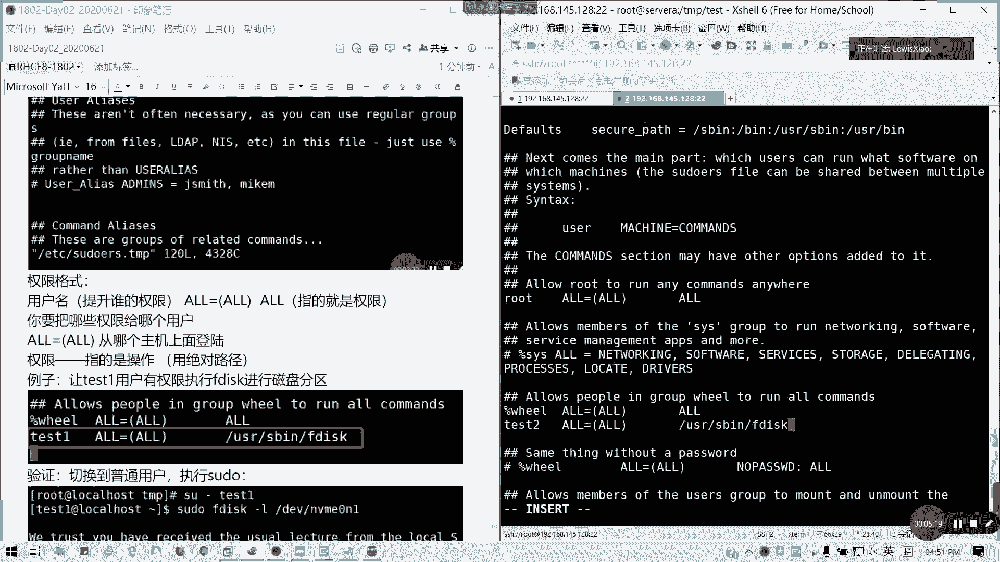
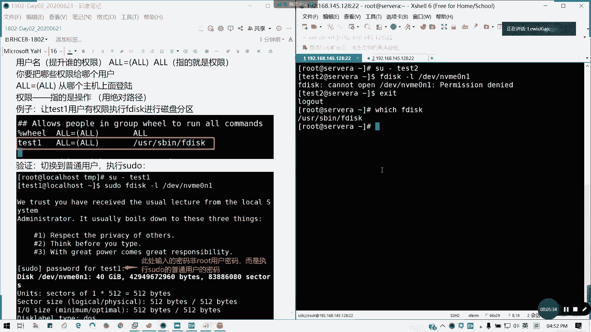
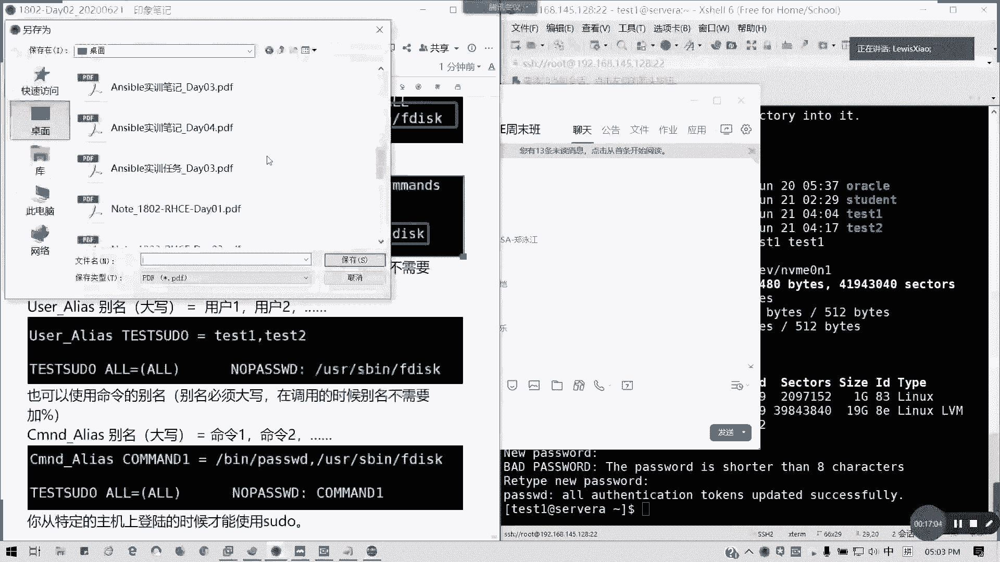
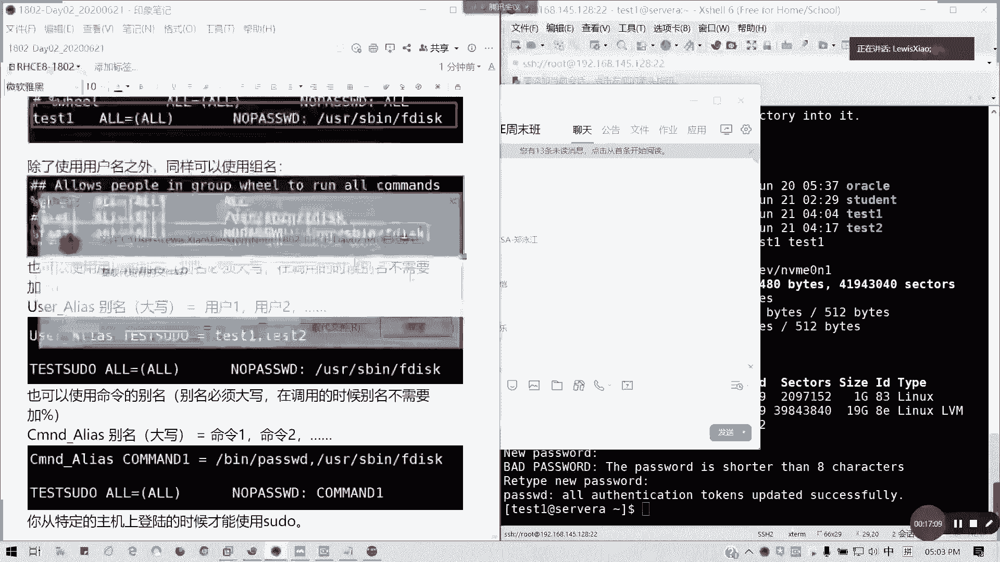
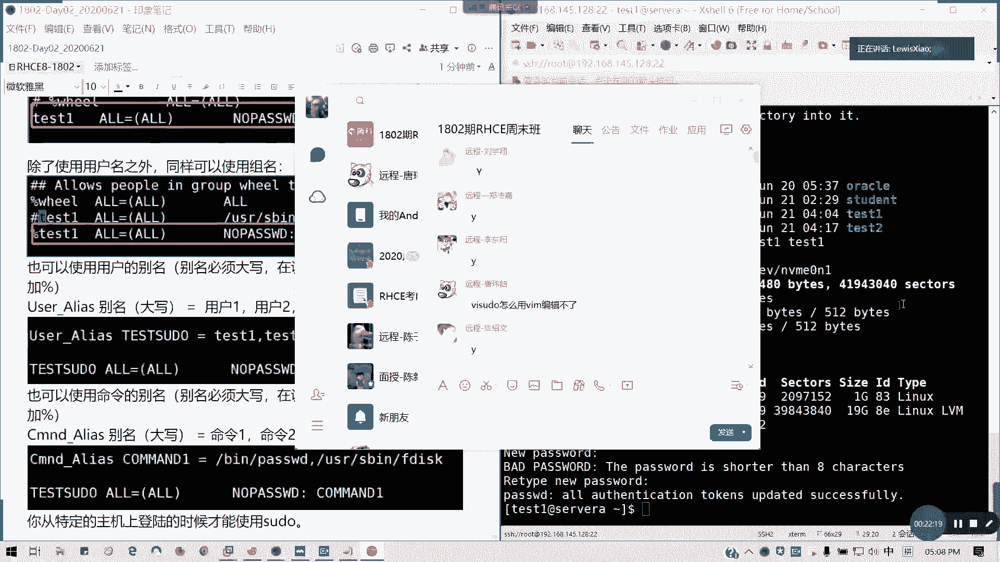
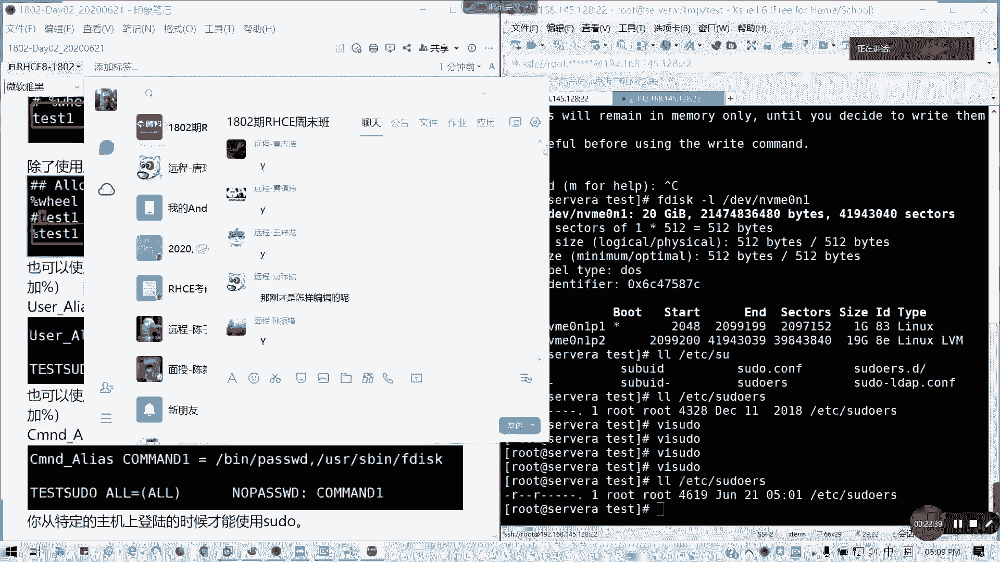
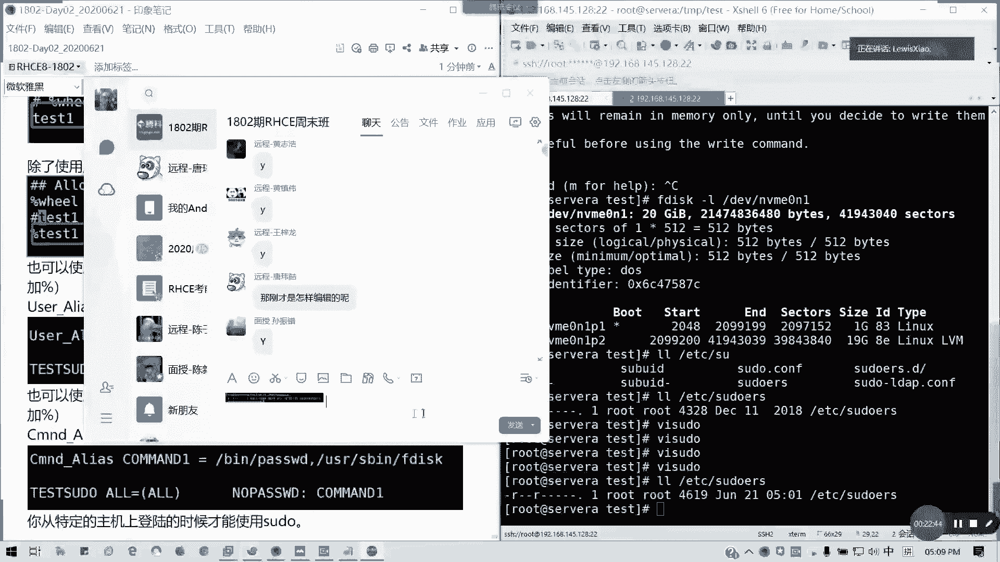

# 2021全新 RHCE8.0 红帽认证入门教程——可零基础入门学习【网络安全／Linux】 - P10：Day02_Ch06b_visudo普通用户提权 - IT老表哥 - BV1444y1h7Bx

好，我们简单讲一下速度，我重新重新重复一遍啊，因为刚才没有录屏好吧，我们看一下，我们执行这个在设为A，我们切到test2用户，然后执行F disk杠L。我们要查看这个硬盘的分区，我们的录子是不是可以。

对不对？

但是我们在。普通用户下它是不是per没停耐啊，它打不开这个文件，对不对？所以他怎么办呢？我们是要提升我们普通用户的权限啊，提升我们普通用户的权限，让他们能够执行某些root才能执行的一些功能。

而不是全部啊。对吧如果全部那就危险了，你普通户，你跟路程有什么区别？你随便你删随便删一个东西，M杠F杠7，你就知道的对吧？你要知道知道知道什么什么叫自讨股吃了啊。所以的话我们通过速度呢。

我们是可以给普通用户来进行复权的。

但是指我们一般来说，我们只赋予某些权限。我这R700R7R7000的话，真R700我真的知道了。

单调32其实蛮好的。如果你有两个槽的话，6四都没问题啊。然后呢，通常来说呢我们。

修开的配置文件叫ETC我们的sdos啊。

🎼ETC我们看一下那个LLETC。

🎼说东 words啊。对吧这个文件你看到它对于。其他用户是没有权限的对，然后只对他同组国才我们所有说只有读的权限，对不对？所以我们不能直接编辑。懂我意思吗？不可能直接编辑，因为它它的权它权限只有读啊。

为什么说不能不不通过VI去编辑这文件啊？都是通过它，因为啊因为文件只有读权限。这也要补充一下啊。因为这文件只有读的权限，你所有者本身就有读的权限啊。所以我们通过调用我们的VI速度来编辑我们的速度啊。

我们的题全好吧，而且它还具有语法检测的功能，还它还具备语法检测功能。也就是说你写错了一项，他会告诉你这一项。语法有错，然后是否回去更改。好吧，那我们这里VH do，我们在root下面。VIUD。

这里呢你看到我们这么多的一个。我们它是调用了一个s do点t临时文件，它是编编辑完之后呢，它检测语法错误，如果没问题，它会才会写到我们这个文件里面。

对吧。好，我们看一下如何编辑啊权限格式，我们看到下面。

前面都是一些带井号，都是一些注释，好吧，那么看到下面啊，它下面只是说明我们一些别名啊，待会我们讲到别名，好吧。

我们重点看到。这里。

是吧al lot people我们我们这里啊al people in group will to run or command。我们其实我们在这里啊，它这里root是不是允许执行所有命令，对不对？

然后我们同左用户，那就如果是will，我们系统左用户也是一样，对不对？

他这里没做注释，对不对？是但是我们这里的话就是我们可以在其实你们可以在任何一个地方写都没问题。比如说我在这里写，我按O下一行，那我们格式呢就是我们要提全的这个用户名，对吧？我要提升临时提升谁的权限。

然后在all in all哦等于我什么就什么意思呢？就在任意主期，我们的任意用户。

是吧我们的热意用户切换到它的时候，我们也可以进行提全O等于O，对吧？然后后面后面的O呢指的就是权限啊，后面的O对吧？比如说我们让t一的用户，我们用这里，因为我们是test2啊，我们要t2的用户。

我们可以用使用F disk进行分区，那我们怎么写呢？

前面用户test2对吧？然后tab键所有主机的所有用户登过来，登登到t2面来，我可以有这个权限。然后呢，这里是指的是操作。那我们这里个操作，我们的这个命令啊，有权限执行这个命令，我们写绝对路径。

USR是B。

F disk这个知道怎么查吗？

我们SD标怎么怎么查吗？我们回到ro来。Which。懂了吗？查一个可执行文件的路径。which F disk所以我们知道它这个绝对完整路径在这里，那我们就直接写过去，这里不能只只写F disk懂吗？好。

保存退出。

房退出中没有语法错误，它就会OK了。那么这里呢我就要我要我切换到一个，我们刚才是不是写的t2，对不对？SU杠t2，我们切换到普通用户，然后怎如何让他执行这一个暂时提全执行这个我们需要的命令呢？

速度SUDO空格。

然后呢。

F disc杠L我们刚才这个命令重新执行一遍，这里可以简写啊，就是我们的我程序路径可以写相相对的MV。

ME0N1对吧？回车他到这里就是说我相信我我我们信任你说收收到一个unusual later，对吧？就是那个不常见的一个操作啊，不知道那个展销操作给到在管理员那里收到。然后通常说他你要记一下三件事情。

第一个他要尊重啊，尊重其他的的隐私权。第二个的话，你要在你在输入之前，你要三思，对不对？第31个。

如果更大权限可能带来更大的一个责任，它只是一个提示语，然后让你输入。

t2的密码，而不是root的密码，对吧？输入你自己的用户的密码，懂我意思吗？

输入完之后，他有5分钟的时间暂时获得root权限。比如说我在执行这目录link的时候，它就可以返回结果，对不对？但是这个时效只有5分钟，5分钟之后，他会要求你再次输入密码啊，记住不是root的密码。

而是你普通用户，也就是已经提了部分部分权限的这个普通用的密码，懂吗？可以明白吗？然后如果不要输入密码，那怎么办呢？我们在下面。同样VH do是吧？我们搜一下vioWHEEL，我们搜一下关键字。

我们跳到这一行。🎼然后我们把这一行注释掉，我们可以在下面它有一个提注释提示叫sthing without pass。也就是说我执行命令我不需要输入密码，我就数度就可以了，对不对？我们照常按O进行编辑。

然后这里输入t2。哦等于哦。任意主机，任意用户连过来。然后这里的话有一个叫做。No pass wて。冒号空格跟你的命令啊，记得这里有空格的。好。O比Q回车，我们这里再执行一遍。

他如果像因为现在我们还在有效期5分钟内，如果你下次你是执行这个我们root的某些权限才能用的命令，我们指定了之后呢，我们就不需要去输入密码了。这个其实在我们日常的运维管理面是不是经常用到。

就是说我们用普通用户可以执行。比如说我可以查看一些系统信息，对吧？但是不涉及到那些关键性的操作。比如说我可以重启服务，对不对？有些我们普通用户是不可以重启服务啊，就有些服务夹死的时候，对吧？可以重启。

但是你不能关闭对吧？不能关闭，而且你不能重启关机，对吧？普通用户是普通用户是不能关机重启的，当家都应该知道，对吧？因为这个是root权限才能做的事情。懂我意思吗？所以其实这一个VS度在我们。

其实这其实在我们那个管理运维工作里面是非常有用的。然后呢，还有呢，比如说我可以指定组名是吧？我们在VS都那里，我可以使用组名。t2啊，我可以只用组名，对不对？他是有就是说你一个组的用户。

比如说我们t2这个组对不对？一个组的用户，我可以就是说执行那个F disk的时候不需要输密码，对不对？他有一个组也可以啊，前面加个百分号，这证明是他是一个组民啊，证明他是一个组名懂吗？

同样我们后面同样SB。F disk。同样我也可以使用用户的别名，但别名必须大写啊。大写那我们怎么办呢？前面有啊前面有那个useral我们搜一下。这里是吧有一个示例的，就是我们的用户别名，也就是吧。

把用户我们把多个用户归成一个组，然后我们使用个别名就可以了，对不对？我们比如说我们按照最后我们在最后写吧，因为这里的话我们通常配置文件，我们更新的时候，我们都在最后写，方便我们排故障，对不对？

比如说我这里指定个别名叫做t store啊。我看看这里的话，那个用户在不在啊，ID test1t2。t3t4有在不在，没有，那ID test在不在也没有我user add吧。t一我就创建一个Olog。

哦，有抱歉啊，ID test一看在不在。没有啊，那我创建个typeC。对啊，我创了一个t一，现在t一t2都有。那我们把t一t2，我们说作为用户的一个别名。来，我们来写一下最后一行啊。

user下划线allias。然后这里大写啊，我们叫test to do。这组名可以自己定义，那等于。是吧。哎，怎么音量大了啊，等于。然后呢，后面是t一。逗号t2多个用户就写多少啊。

然后后面我们指定我们要引用的话，怎么引用呢？t都直接写主名，后面前面不用带任何的。把分号。但是他注记住主名大写啊。哦等于哦。是吧然后我不需要输入密码，no passWD文们造写。Useer spin。

F disk。保存退出。然后我们现在我们切换到T一。对吧他现在抵赖的。因为他现在的那个我看一下啊，他的那个跟他的那环境变量啊。userDL我杠2吧t一，然后我再创建一遍。因为刚才的话。哦。

它s not on by test C。那我们这现在要改一下user艾回来。然后呢，我看一下那个。🎼T一它的那个数组变成1001002了是吧？我们就我们可以修改一下圈主哦t一。T一，然后。把它修改回来。

这个我们下下明下周五我们有讲到一个权限啊。然后我现在我切到t一上面看一下。切切C些是可以的吧，我们改了加目录之后，它的速度是自己的就可以切了，对不对？那我们现在执行一下速度。F disk杠L。

🎼DVMVME0NE是吧，我们也可以执行，对不对？因为它是在太速度的别名组里面，懂我意思吗？我们也可以用特定的命令的别名，也就命令我也可以写别名，对吧？用户组也可以写别名，命令也可以。

那我们到最后完我们继续写。来，我们叫做CMND。Command Elis。然后comman的一是吧？比如说我们并列别名叫comman的一，记得这个名字叫大写啊。Command。

一等于中间隔空隔用空格隔开。比如说我要输入两个命令是吧？并ing下面passwD，你可以用which去查它的它的路径，然后逗号写两个命令，你有三个就写三个是吧？就这种的话就是一个命令的集合。

也就是说你在普通用户下面，我可以通过临时授权，我可以运行哪些命令，懂我意思吗？然后这里我要怎么引用呢？比如说我这里又test to do是吧？我它还是test to do这个用户组。

然后所有主机登录所有用户，然后我同样不需要输入密码no pass WD是吧？然后这里我就写command一。

对吧直接写命令别名。回车。到表QQ退出啊，冒号代表QQ退出。然后呢这边我们。我们就修改我们别的用户密码，可以吗？そっとは。无论这如何，你在普通户普通用户，你要执行我们的路ot某某些权限命令的时候。

我们要加速度pasWD test2，我看能不能修改t2密码对吧？是不是可以啊？正常来说我们我们自己只能修改自己密码。但是我如果把那个。我们的test速度这个组的用户，我们赋予了临时的一个root权限。

让他能够修改密码，能够分卡个分区信息的话，那是不是他能够就是说我们也可以在普通用户里面，当然他要要要的都是两个字安全啊？就我们在安全情况下，是不是可以让他做一些root，只能root做的命令平常。

但是你又不会伤害到你的那个整台服务器，或者是我们的整个集群的运行，对不对？那这一块如果没有问题，请打6啊请打6啊，现场有没有问题？接下来稍等稍等一下，给大家一个打印时间。我们今天就不讲现的内容了。

我们今天讲的主要是关于啊第一个早上从命令行管理文件，我们讲了一个早上啊，第二个帮助对吧？帮如何获取帮助信息，第三点VIN编辑器。第四个用户权限啊，有没有用户组用户跟组怎么去管理。

所以今天笔记的话重新导给大家啊，视频的话，晚点时间传可以吗？两天的视频都有啊，两个信息都会有啊。我这己把笔记覆盖了。

然后直接传上去啊。我把这拉过来怎么这么小啊？我把这个。我这1。85都删了哈，因为5。56这个才是对的哈。我把这是我我把这一个先。我把这这些废的我先删掉啊，好吧，废的先删掉。

然后我把那个更新完理笔记我一个个传上去。

然后网盘倒时也有，那我们接下来的话就是5天1就。🎼我们下周五啊，端午节是周四啊，所以提前预祝大家端午安康啊，不是快乐哈。对对啊，今天是父亲节记得回去啊，给老。如果是家在广州的话。

记得跟家里人在家庭室跟老爸好好聊天啊，谈着心吃吃饭啊。可以啊，这可以的，别名呢只要用在一个命令集合啊，就我先答一下大家问题，命令集合。然后呢，passWD这个是可以的啊。可以。

你只要因为它是root临时变成root权限就执行，那那你也不能改root密码吗？对吧？可以的。下周几上课啊，我看哎这个。002，我看02那个我我只传了012，02，我再传上去来。

这个是完整的吗？我看一下。哎，这个好像不是哎。没事没事啊，这这两个其实差不多。我们因为我们把今天的东西把这个东西已经归到里面，所以两天的笔记还是完整的。速度提前文件VI速度啊。下周五周六上课。

下周五、周六、端午的后两天啊，下周日因为大家正常时间要补补班，对不对？

要补周五的班对吧？就周五的班，所以的话我们下周日是不上课的，下周周五周六上课，同样在24号课室啊。然后呢呃希望大家能够把这些东西啊，周日我就要补补班啊，补班，学校的话是补课嘛，对不对？

所以的话希望大家把这些知识全部啊全部飞书里面，那课堂课课课本呢可以对照啊，可以对照，你们看那些内容是不是讲的是不一样。然后练习其实你们可以就只巩固概念。但是就作用呢并不是那么实质啊，不是那么实质。

所以的话就希望大家能够啊跟上进度。然后接下来我们下一周内容讲什么呢？首先第一个我们的用户权，我们的文件与主的权限，所谓的RWX对不对？还有一个特殊权限，我们都会讲，这是第一个，第二个我们的。

进程管理。进城啊。进城县城还有服务管理。对吧如何查进程，如何去监控私用资源，这个会讲到。然后还有就是我们的。SSH的密我们的。公勉密要认证啊。公钥啊公钥认证这个会讲到，还有就是我们的。

日志管理如何查看分析日志设定日志的级别？还有网络管理网络管理应该是在第四天，网络管理会讲到。还有呢就是一个网络管理之后呢，是有一个软件包啊，软件包如何去安装管理软件。

然后还有就是一个文简单的一个文件定位跟查找，基本上下周的话如果快的话，我们第一本书都可以结束。如果慢的话，就拖一天。对，差不多。我们的接下来的任务啊就是这样啊。

笔提前发笔记预习啊，你可以笔记的话，我不知道那个进度，我要调整一下，可能过几过两天可以吗？我过两天可以不？因为因为笔记的话，我也要时间去整理的对，因为进度是不太一样的啊，就不一样，我就可以先发啊。

那今天先到这里，如有没有其他问题，先没有其他问题，请打歪哈，有没有其他问题有。

系统破解我们是在下一第二本书的第十第11章啊。

现场没有问题，请举手，有问题可以提问，没有问题请举手。2个、3个、4个、5个、6个都没问题啊。今天现场来的人比较少啊。VS do怎么用VI编辑过啊，因为它因为它是一个权限的问题。你看一下。

你看一下ETC do的权限就知道了。

刚才别就VS度嘛，刚才你没有听到吗？😡。

对吧我们的权限只能读，不能写，对不对？我所以我V用VS度嘛。然后他会掉出一个速度点TNP，它是那一个副本啊。

懂吧？

直接VS度就对了。It。有点快吗？快吗？你们各位。快吗？

速度可以是快还是慢，一走神。走蛇啦，拍一下是吧，拍一拍。

目前跟得上是吧？因为接下来的话，我要看他的情况，我会加快，因为我们只有13天的时间，如果讲不完的话，肯定不行的。

后面没学过啊，下课是要补的，对啊，看笔记都可以补，看笔记都可以补的是吧？看笔记不看视频都可以补讲课只讲一些，我都没的。就是其实就把我的东西翻译成语音而已，对不对？下课不不一定需要看视频。

你们笔记都可以啊，哎，你还稍微慢点啊。

那要不你来讲。

我这个速度已经算慢的了，原来你知道原来进度已经到第八章了，如果按照课程表的话，第八章了懂我意思吗？所以我比课程表我整整慢了两张。有什么其他问题没有？我看群里面啊。对呀，太慢是讲不完的呀。难度大。

也就大家ensiblesible其实三天半就可以讲完了。但是我为了大家的话还是4天吧。所以不要靠这个培训啊，就是说那个不要对啊，其实这基本操作速度可以快，但是基本快不了啊。课下也要学要，提前复习。

什么叫暗色BOU？anerible啊自动化运维，就我们自动化运维的一个工具啊。八也不是八的特性。它是原来的HCHCA的DO407只30%的部分下放下来。说自动化语言跟基础很有很大关系。

其实你很多翻译过来，你你比如说临时命令或者是我们的剧本，翻译过来就是我们基础命令，懂吗？所以这个其实衔期是没有太大问题的，八版本不是这个特性啊，特性是在几调优，还有磁盘文件系统那里。

还有一个netnet word革新。不在这啊，所以毕上文不要那个不要误导人家哈。对，命密是一样，写法不一样而已。

还有没有其他问题？如果没有的话，我们今天啊今天我们的现场课到这里。然后可能你们要新预习笔记的话，我可以过两天啊，最最迟不超过周四周三在端午前我把第三天的笔记发给大家，好吧，大概第三天笔记。

然后大家记得复习预习，我们里面的操作，你们可以去自己去试一遍，有时候讲的不知所以然的，你们可以去看一看啊。对，书本的话有点拗口，你们可以也也可以去看一看啊，对吧？这是课表嘛，对不对？

做过全过PDF是可以预习的那个课表的话其实不太准的啊。我讲一下下周第三天的内容是7。

八9十4张啊七894张，然后这次管理可能会讲大概进度是这样子，接下来就每天4到5张的样子，最多不超过5张，最少也不超过3张。但是需要呢我们单独讲。一天。薛友会单独讲一天，因为这个确实有点深啊。

是有的单独会讲4分之3到1天。

需ll在第5到第六天吧，如果就是第一本书完结之后，我们马上找sha啊。估计5到6啊。其实N次部比炫校好玩多了。

那不今天先到这里吧，5点13分了，5点13分，那大家回去好好复习预习，明天还要上班了啊，大家这个周还要上三天，对不对？上三天班，然后希望大家工作顺利啊，端午端午安康啊，提前祝啊。

那因为我们上课时候是下周五6月26号啊，到时国际禁毒日千万不要啊不要不要不要太兴奋了啊。

最近不是出了那个叫做那个精毒版的模jito嘛，这个对不对？那今天先到这里吧，呃我也得歇一会儿啊，然后待会儿给大家传视频，好吧，那下课。

