# RHCE8.0 红帽认证入门教程：Day03：Day02课程回顾 📚

在本节课中，我们将回顾第二天课程的核心内容，包括Linux文件系统结构、文件管理、命令行工具、用户与组管理以及权限控制。这是巩固基础、确保后续学习顺利进行的重要环节。

## 文件系统结构 🌳

上一节我们介绍了Linux系统的基本操作，本节中我们来看看Linux文件系统的组织方式。Linux文件系统采用倒置的树形结构，从根目录 `/` 开始，逐级向下划分。

以下是几个关键目录及其用途：

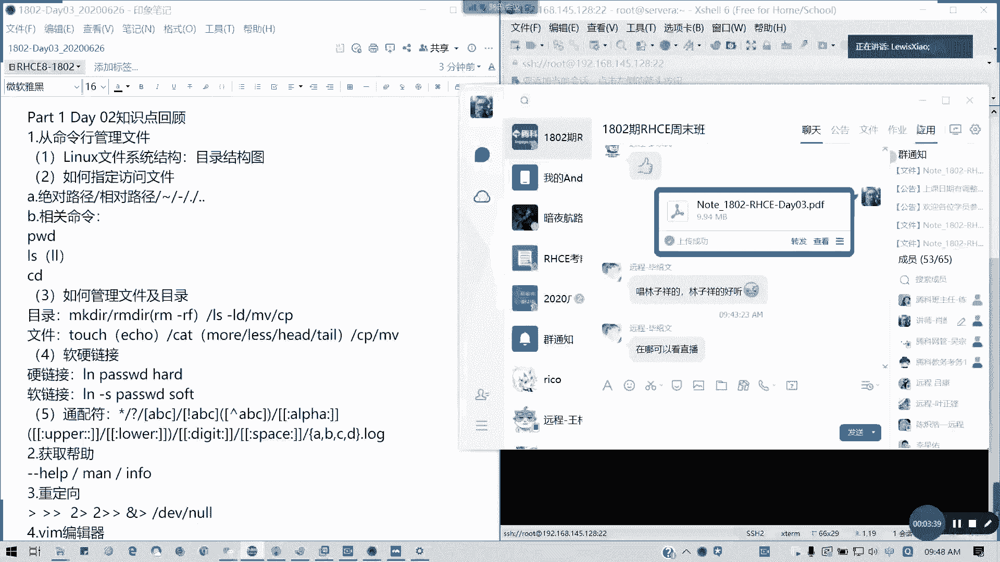

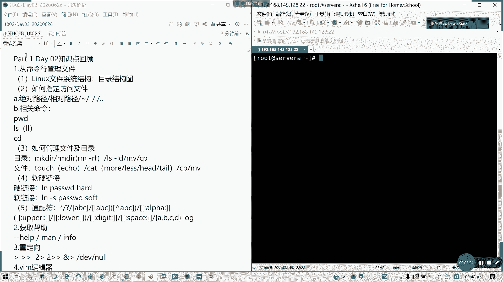

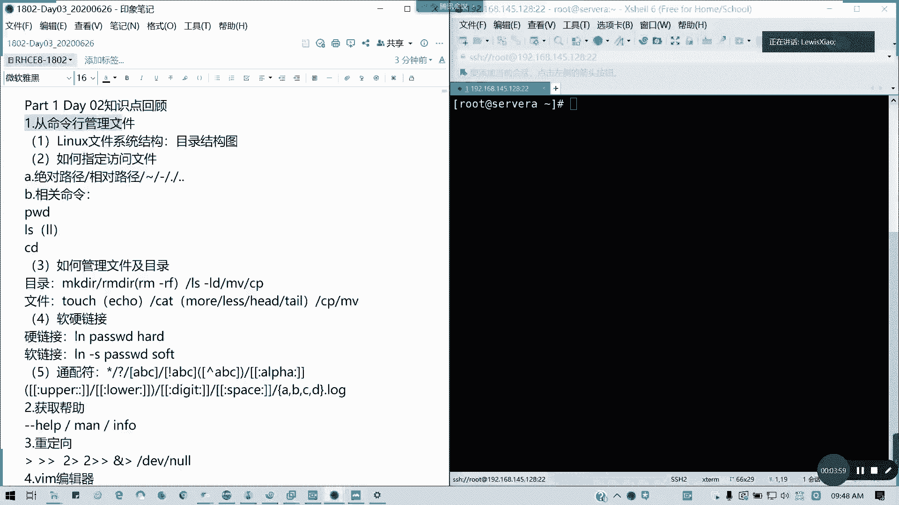

*   **`/usr`**：存放系统软件资源。
*   **`/dev`**：存放设备文件。
*   **`/etc`**：存放系统及应用程序的配置文件。
*   **`/var`**：存放日志、数据库等经常变化的文件。
*   **`/opt`**：存放第三方应用程序。
*   **`/boot`**：存放系统引导文件和内核。
*   **`/mnt`**：临时挂载点目录。
*   **`/bin` 与 `/sbin`**：存放系统内置的可执行命令（`/sbin` 多为管理员命令）。
*   **`/root`**：系统管理员（root用户）的家目录。
*   **`/home`**：普通用户的家目录集合。
*   **`/proc` 与 `/sys`**：虚拟文件系统，将内存中的进程和系统信息映射为文件，不占用磁盘空间。例如，查看CPU信息可使用 `cat /proc/cpuinfo`。

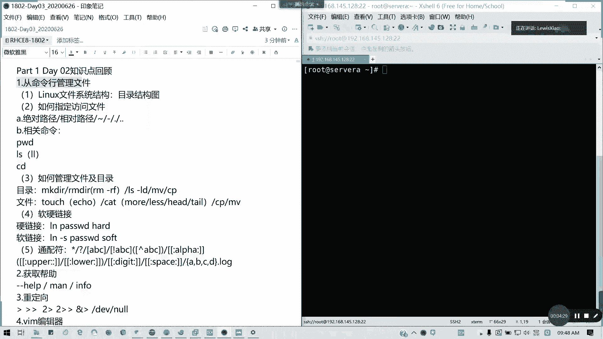

## 定位与导航文件 🧭

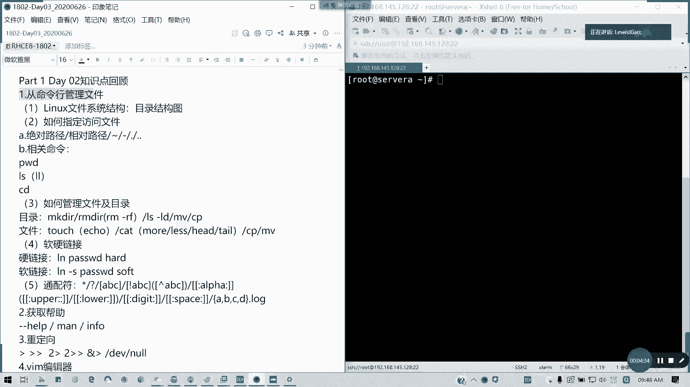

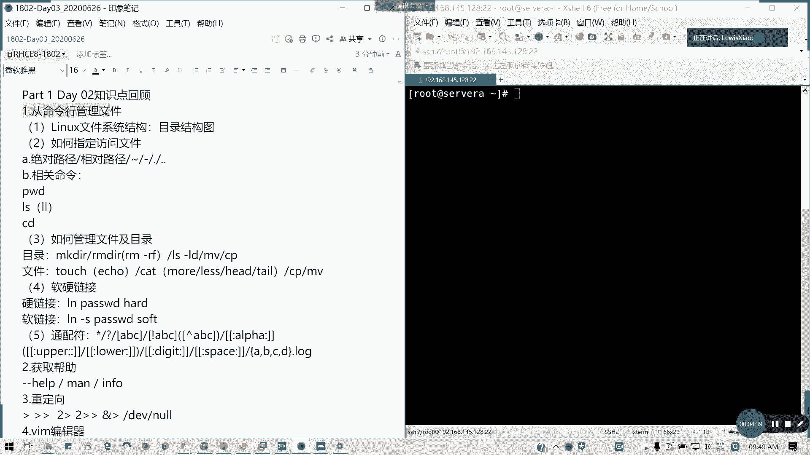

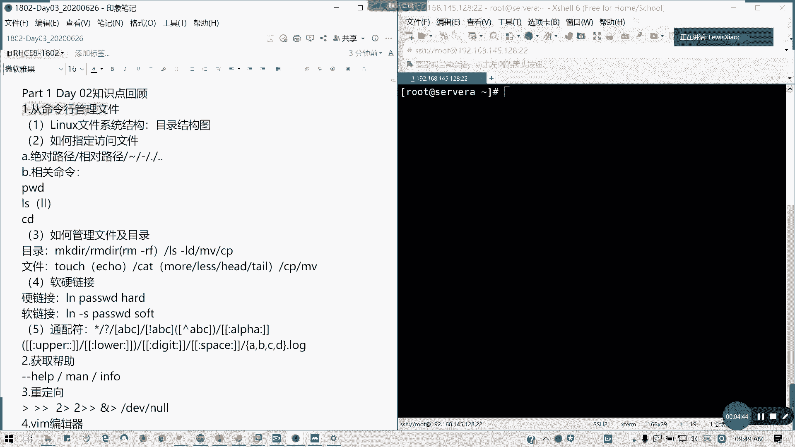

了解目录结构后，我们需要知道如何指定和找到文件。路径分为绝对路径和相对路径。

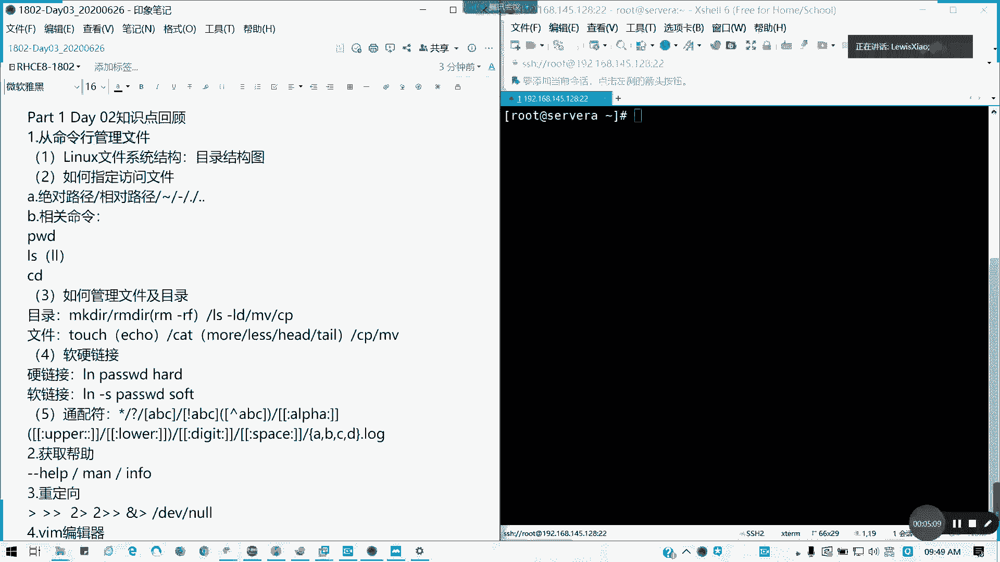

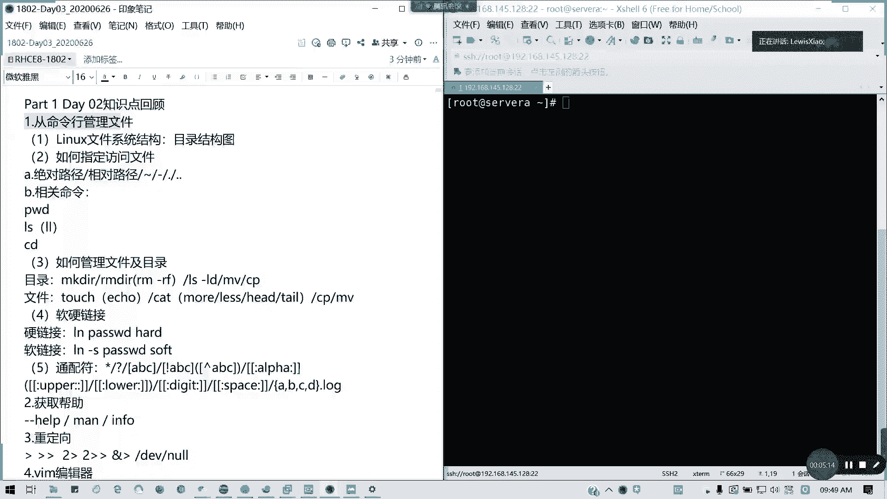

*   **绝对路径**：从根目录 `/` 开始的完整路径，例如 `/home/user/file.txt`。
*   **相对路径**：从当前工作目录开始的路径，使用特殊符号：
    *   `.` 代表当前目录。
    *   `..` 代表上一级目录。
    *   `~` 代表当前用户的家目录。
    *   `-` 代表上一次访问的目录。

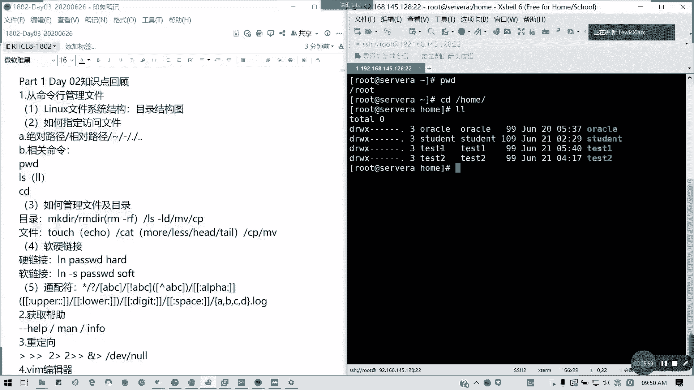

以下是常用的目录操作命令：

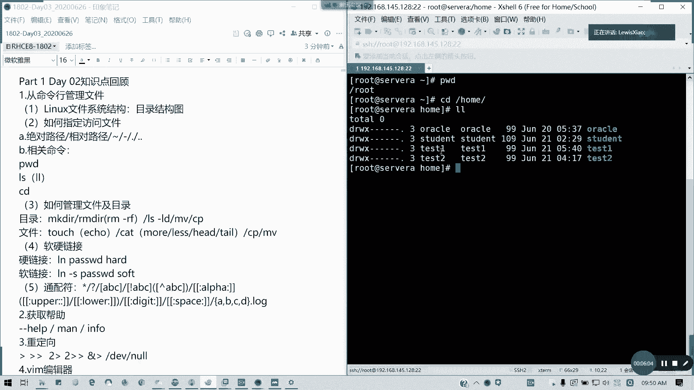

*   `pwd`：打印当前工作目录。
*   `ls -l`：以长格式列出目录内容（`ll` 通常是 `ls -l` 的别名）。
*   `cd`：切换目录。

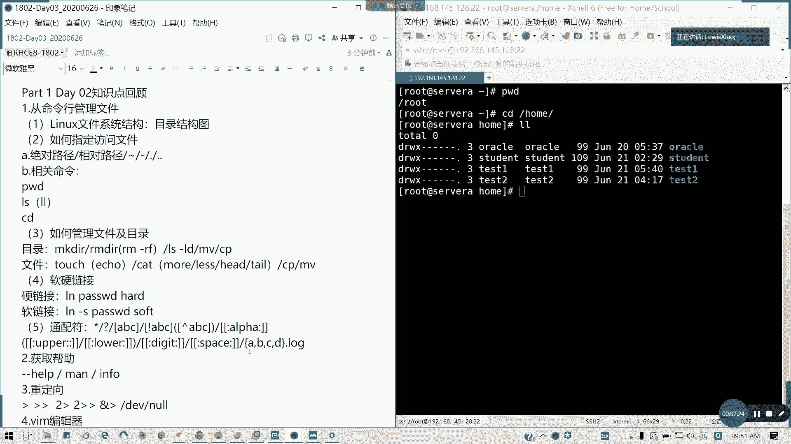

## 管理文件与目录 📂

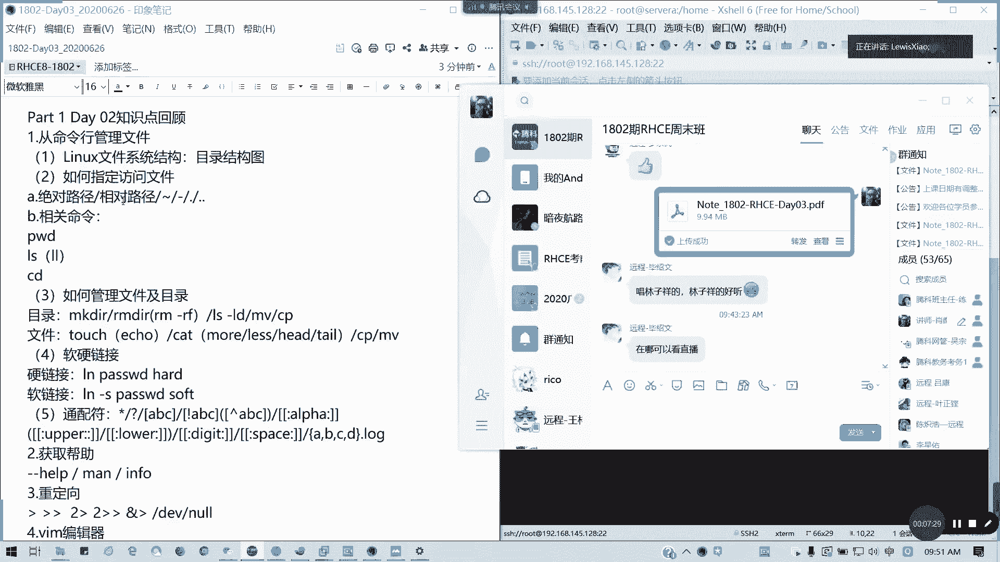

接下来，我们学习如何创建、查看和操作文件与目录。**请特别注意删除操作的风险**，命令 `rm -rf` 具有破坏性，在生产环境中务必谨慎使用，遵循变更管理流程。

以下是基本的文件和目录操作命令：

*   `mkdir`：创建目录。
*   `rmdir`：删除空目录。
*   `rm`：删除文件或目录（配合 `-r` 删除目录，`-f` 强制删除）。
*   `touch`：创建空文件或更新文件时间戳。
*   `cp`：复制文件或目录。
*   `mv`：移动或重命名文件/目录。
*   `cat`：查看文件内容。
*   `ln`：创建链接。
    *   **软链接**：类似于快捷方式，命令为 `ln -s 源文件 链接文件`。源文件删除后，链接失效。
    *   **硬链接**：指向文件数据的另一个入口，命令为 `ln 源文件 链接文件`。删除任一链接，文件数据依然存在，直到所有硬链接被删除。

**通配符**可以帮助我们匹配多个文件：

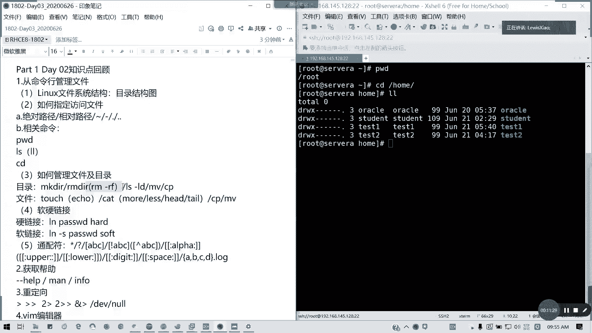

*   `*`：匹配任意数量字符。
*   `?`：匹配单个字符。
*   `[a-z]`：匹配指定范围内的一个字符。
*   `{word1,word2}`：匹配括号内任一单词。

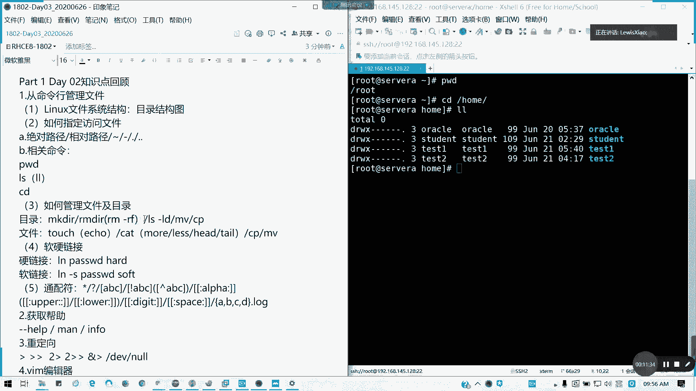

## 获取命令帮助 🆘

当不熟悉某个命令时，学会查找帮助文档至关重要。

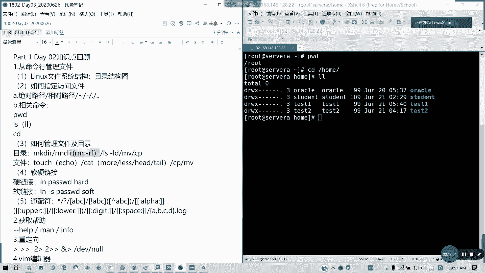

*   `man [章节号] 命令名`：查看命令的完整手册。常用章节有1（用户命令）和5（文件格式）。
*   `命令 --help`：获取命令的简要使用帮助。

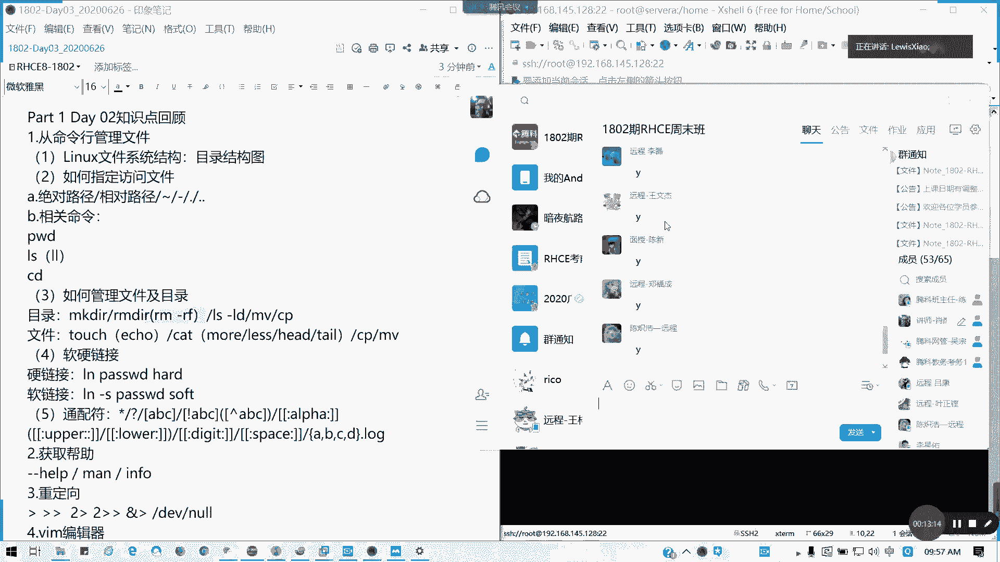

## 输入输出重定向 🔄

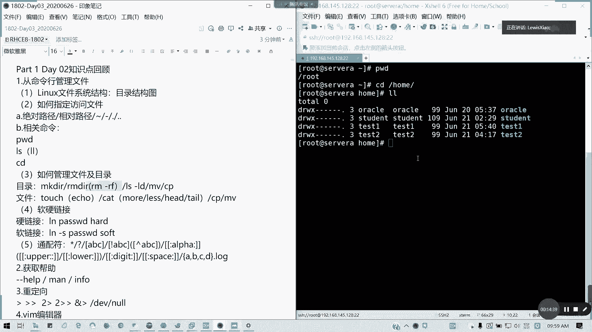

Shell中，我们可以控制命令的输入来源和输出去向。

*   `>`：将标准输出**覆盖**重定向到文件。`ls > list.txt`
*   `>>`：将标准输出**追加**重定向到文件。
*   `2>`：将标准错误**覆盖**重定向到文件。
*   `2>>`：将标准错误**追加**重定向到文件。
*   `&>`：将标准输出和标准错误**合并覆盖**重定向到文件。
*   `<`：将文件内容作为标准输入。`mysql < database_dump.sql`
*   `/dev/null`：特殊的设备文件，像一个“黑洞”，发送到它的数据会被丢弃。

## Vim 文本编辑器 ✏️

Vim是一个功能强大的模态编辑器，掌握其三种模式是高效编辑文本的关键。

1.  **命令模式**：启动Vim后的默认模式，可以执行复制、删除、查找等操作。
    *   `dd`：删除当前行。
    *   `yy`：复制当前行。
    *   `p`：粘贴。
    *   `/关键词`：向下查找。
2.  **插入模式**：在此模式下可以输入文本。从命令模式按以下键进入：
    *   `i`：在当前光标前插入。
    *   `a`：在当前光标后插入。
    *   `o`：在当前行下方新建一行并插入。
3.  **末行模式**：在命令模式下按 `:` 进入，用于执行保存、退出、替换等命令。
    *   `:w`：保存。
    *   `:q`：退出。
    *   `:wq` 或 `:x`：保存并退出。
    *   `:q!`：不保存强制退出。
    *   `:s/旧文本/新文本/g`：替换当前行所有匹配的文本。

**注意**：最小化安装的系统可能只包含 `vi`，它是 `vim` 的简化版，功能较少（如无语法高亮）。

## 用户与组管理 👥

Linux是一个多用户系统，管理用户和组是系统管理的基础。

相关的配置文件有：

*   `/etc/passwd`：存储用户账户信息。
*   `/etc/shadow`：存储用户加密后的密码及密码策略。
*   `/etc/group`：存储组信息。
*   `/etc/gshadow`：存储组密码信息。

以下是用户和组管理的基本命令：

*   `useradd`：创建用户。
*   `usermod`：修改用户属性。
*   `userdel`：删除用户。
*   `groupadd`：创建组。
*   `passwd`：设置或修改用户密码。
*   `id`：查看用户UID、GID信息。
*   `su - 用户名`：切换用户（`-` 表示切换环境变量）。

## 权限提升与 sudo 🔐

普通用户权限有限，为了安全地执行某些需要特权的命令，我们使用 `sudo` 机制。

*   通过编辑 `/etc/sudoers` 文件来配置 `sudo` 权限，**必须使用 `visudo` 命令进行编辑**，因为它会进行语法检查，防止配置错误导致无法使用 `sudo`。
*   基本语法示例：`username ALL=(ALL) ALL` 表示允许 `username` 用户在所有主机上以任何用户身份执行任何命令。

---

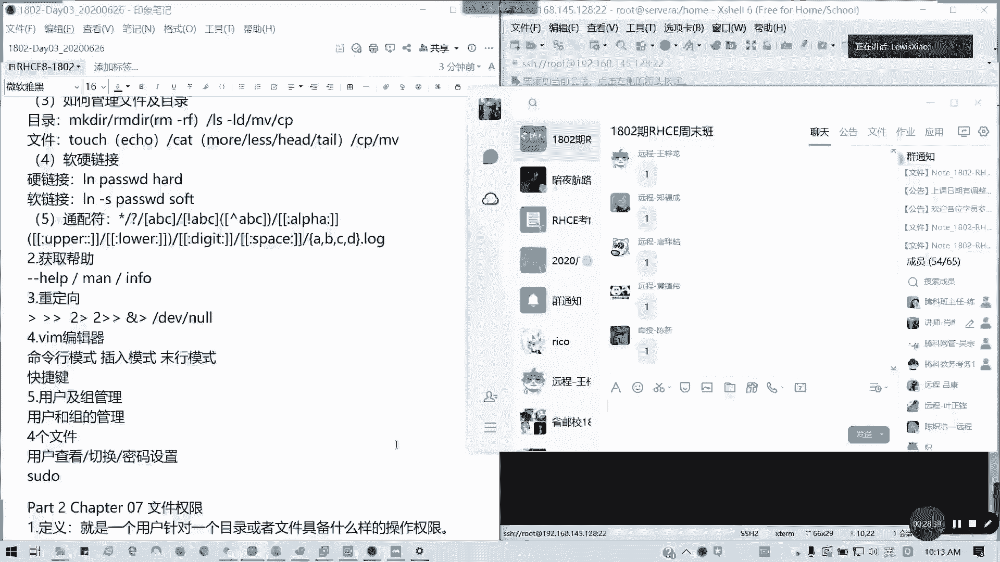

本节课中我们一起回顾了Linux文件系统、文件管理、命令行帮助、重定向、Vim编辑器以及用户和权限管理的核心知识。牢固掌握这些基础概念和操作，是迈向RHCE认证和成为合格Linux系统管理员的关键一步。接下来，我们将进入新章节的学习。