# 2021全新 RHCE8.0 红帽认证入门教程——可零基础入门学习【网络安全／Linux】 - P13：Day03_Ch08a_进程管理 - IT老表哥 - BV1444y1h7Bx

<该字幕由算法自动生成> 北京时间03：03啊，下午的03：01啊，北京时间下午的03：01，我们来讲那个服务管啊，进程管理管理监控和管理进程，什么是进程呢。

我们从windows的系统看看是不是我们这里啊，打开任务管理器对吧，任务管理器这里的话是不是在进程的一个个，对不对，包括应用，包括我们的后台，对吧，那进程呢就是相当于它是通过一个执行一个静静态的程序。

然后触发的，对不对，我们我们运行一个程序是相当于启动一个进程，对不对对吧，可以理解成静态程序，触发了一个动态的一个进程，它进程是相当于是动态的程序，是一个文件，它是一个摆在那里的，对不对，所以能理解吗。

进程怎么来的，比如说像我们的我们的web y b x是吧，我们的那个比如说我们的一个，就是我们思科的一个网络会议的一个程序，当然像我们腾讯会也是一样的，对不对，它是有具体的一个文件来触发的，对不对。

像我们的这个我们这里的一个叫做腾讯会议是吧，打开文件所在位置，是不是他就通过这个文件为mate。app是吧，通过这个文件来触发它的一个进程，它里面是不是它下面是有运行的，那就有三个对吧。

一个进程里面三个线程文件对不对，进程呢它是一个动态进程，然后他再用多少资源呢对吧，比如说像我们程序位置吧，3%几，然后占用200多兆内存，对不对，那他网速它的它的磁盘，它网络等等对不对。

然后系统里面有多少进程，那我们看这里啊，像我现在这台电脑，我现在这台机器，你看241个对吧，241个进程，3000多个县城啊，进程里面会产生线程的，懂吗，也就是它的紫禁城嗯。

然后我们还要知道哪个进程占用资源多跟少，对不对，我们通常从cpu这样，我们通常从cpu从内存，从硬盘的读写去考虑啊，从cpu内存硬盘读写的的这个情况去考虑懂吗，也就是说比如说到这个程序占了10%几。

比如说我们把它列出来，像这里换cpu占用比较大的这个录屏，对不对对吧，和图图，这是录屏，然后在我们内存占比较大，就是我的印象比西跟腾讯会议对不对，那硬盘通常因为我这里是ssd，所以占用免费太多少。

像我的带宽占用爆炸，就是我们腾讯会议对吧，然后我们要考虑这个进程数运行是正常的，也就是说也就是我们的正常情况下，我这进程应该占用这么多资源吗，这也是要考虑的，对不对，然后还有一些有没有不正常的精神存在。

对不对，比如说木马病毒，还有什么挖矿的，僵尸的，这些会不会存在，也要想想，对不对，然后还有就是我们的现在的操作系统占有多少资源，然后剩下资源有多少，就重点是cpu内存硬盘，像我这台的话。

我这台是我以前就说我现在之前一直在用的一台二合一的平板，就i7 的850内存16g，对不对，就可能内存16g呢，在我们家跑教学跟跑那个h4 就是跑虚拟机的情况下，确实占用会比较大，对不对。

但是在64g内存情况下，你看现在10%几对吧，但相信大家都基本上如果是16g内存机器基本上跑个六七十的有吗，有吧，至少有五六十吧，有吧所有就32g的内存应该就是20%几十几，20应该有的有吧。

30多和45，你跑这么大，不知道，三三十的话，四区四五局算成小的了，对不对，像我这台我又开开一台虚拟机，开的情况下，我就占用十个g，也差不多16%，那硬盘的话你看基本上对吧，因为是s sd的关系对吧。

很小对吧，就网络带宽稍微稍微稍微稍微大一点，然后cpu呢因为是在录屏，包括我们在好虚拟性关系的时候，一直在30%左右波动啊，像其他的什么显卡啊，现在你看基本上我都独显，就用不着的，对不对，读写用不着。

吸血的话，用那么1。1丢丢对吧，所以有时候真的干预文的话，独显是用来浪费的，可以这么说，就我做纯粹的不做设计对吧，不做设计，不做影视，就纯粹做运维的情况下，你是不是cp，你这gp基本上用完浪费了对吧。

因为现在的核显的性能非常强，对不对，然后像像像那个以太网，我的网卡其实还好，现在只是用到了一个usb的网卡，我没用到它本身的，然后我的wifi也没用wifi，我这还是wifi 6的网卡。

英特尔的ax 201，所以的话其实呢现在磁盘的话，现在基本上都是很低的，你如果是用那个机械盘，你才知道什么叫岩石大对吧，像固态化，基本上我这个2年前的pm 961还是跑得很顺的啊。

然后然后然后然后这个是就是自带机新配的这个e t对不对，所以这这个配置呢其实我觉得这个cpu稍微弱一点，其他都还好啊，都还好，就主要我们这些资源是吧，资源像我们cpu利用率是35%，以前是80%的啊。

然后他的那个进程线程数，然后还有内存是吧，我使用中是吧，有点我可用这么多是吧，以前的话你看有点是吧，有点闷水，对不对，那么硬盘硬盘的话，这个是正常值，充了1% 200%分300分，差不多正常的对。

像我们的wifi或者是我们的那个有线网卡都是一样的，懂吗，然后我这是从windows上面，windows上面看这种情况，其实做同样作为操作系统，我们的linux系统啊，linux系统也是要注意啊。

也要注意这些东西，比如说我们进程的来源啊，竞争来源同样的啊，同样是分清正义中的懂吗，然后我们的进程拥有者啊，就我们之前不是提到吗，我们在聊那个s u i d的时候，是不是聊到进程拥有者的问题，对不对。

s2 d还记得吗，早上我们聊的就是我们一个普通用户，我们加了s v d之后，它是不是用它的所有者来运行的，那我们就聊到这个东西了对吧，进程在读取或者写入文件的时候呢，是采用这个拥有者的身份。

也就是他的所有者的身份来读取和写入的，所以呢我们针对需要读取和写入的这个拥有者呢，必须要有权限对吧，你这个进程你你既然你是他跑的，那这个权限你基本的全息你应该有的吧，不然你这几个进程怎么处理。

程序怎么处理东西，对不对，你没读个没写，那你进程是不是叫预期下来运行不起来，对不对，比如说我们尽情的拥有者啊，不一定是你执行这个文件的用户，比如说，我们note用户，去执行dress这个进程。

那dress的进程应用者是不是root啊，不是啊，对不对，我们安装我们装anges这个中间件的时候，通常它的用户是anges的用户，懂吗，他会帮你创建一个js用户，像阿帕奇对吧。

我们的web服务也是阿帕奇是运行的，他不会再用root这些用户的，它有一个专门的用户来跑这些进程，明白我意思吗，这盘circle也是一样的，它有个买circle用户，对不对。

还有就是通常啊会在服务的配置文件定义它的应用者，比如说我们的h t p d，像我们在那个h t t p d。cf，它就会定义说你的拥有者是谁，对不对。

就我们看到h d d d d点控制这个这个配置文件啊，你们如果有印象的话，我们到我们词典会再讲啊，词典会在那个额外内容会讲我们这个内容呢就是说我通常它定义的话，比如说pass w d是吧。

谁执行就是谁的，对不对，pass w d这个这是讲到进程的一个拥有者问题，能明白吗，能明白吗，线上的我看一下啊，能明白吗，可以吗，可以打个打个一啊，就从那就是我们ab已经说了。

然后dc跟dc点查看和验证这个进程会占多少资源对吧，这个在linux上我们通过top，通过ps这些命令都可以查，这么后面会再讲对吧，照样我们在不同的操作系统也我们也要查这些东西，这是第三点。

第四点分析这个进程是否符合以预期，什么意思呢，也就是说我这个进程我运行了，是不是按照我这个设想去走的，就是我看我实际上比如说我用1g内存对吧，我是精神这1g b，但是他偏偏就跑到了3g b对吧。

但一进程它降价能这么大，那有时候你这个预期，你这个就说超出预期的一个它的进程的一个执行操作，有时候会往往会伴随着大量消耗你的一个系统资源，所以这时候我们要分析他为什么要占用这么大对吧。

所以这个也是一个预判我们对进程管理的一个中一个其中一点哈，就是运行，我明明就就我就我就一块大饼就好，你要看就说好像我们人吃饭一样，我们吃一碗饭就行，平常的饭店一碗饭，你为什么现在吃两碗饭碗，对不对。

同样的道理，你要去预判，你要去分析到底这个进程是否是在自己在我们理想的范围内，这种思想范围内，如果超出哈，我要看为什么，第五点我们要看一下整个系统里面的技能数量状态，以及它占用的一个资源排序。

资源排序呢比如说像cpu按cpu排，哪个占多是吧，内存哪个占多，硬盘哪个是最后i o的对吧，网络也是哪一个是占网络比较多的，然后呢通常我们就是这些进程啊，有单吃cpu的，就是那个计算型，对不对，计算的。

然后吃内存的对吧，比如说他一开始要占有很大的空间是吧，然后然后其实就其他的都没有，然后硬盘的经常读写，对不对，经常读写数据的，那就是还有网络型，就是吃带宽的懂吗，然后还有就是你既然你这些进程你执行过。

你要看看你剩下的资源有多少，懂吗，你这个你系统肯定是有预留的，对不对，你不可能说哎我机器我就配一个c一个8g内存，我这个进程偏偏跑到了78g，那你这个系统没预留的话，你系统是不是其他你不用跑了，对不对。

你的你的你的环境，你的程序，你的环境，你的这些对吧，你的守护进程，你后台那些东西你还要占内存呢，那你不可能说八区全部给他跑满，那跑满我七七就是考不动了，就像人我们超负荷工作一样，你是不是就抽不开身。

明白我意思吧，所以我们系统资源啊当前是否足够，如果以及未来收入是否会增加，或者是我的爆发，我的那个我们这种并发啊，不是爆发啊，我们并发是什么，能支撑这样的一个服务，对不对，有时候像有一些情况。

我们的进程会产生并发，也就是说我们可能流量大了对啊，或者是我们突然间多人访问，那会不会产生一个高峰，那这高峰你能不能撑得过去，所以有时候你这真的就是说我们有些配置不好的一些环境呢，就我们进城爆一爆的话。

你系统马上会死掉，对不对，特别像windows，很明显linux的话就会产生，比如说你的cpu读取延迟大，然后i硬盘i o出现卡顿，对不对，或者是你的内存已经开始吃你的交换分区了，那这种种种情况。

那就证明你的资源已经不够了，明白我意思吗，就像我们的电脑配置一样是吧，你你的电脑配置，你的内存，帮我的硬盘，就决定了你的资源有多少，你的运行效率可以到哪，哪里去可以理解吧。

所以为什么一开始我我说这个环境我要强调环境啊。

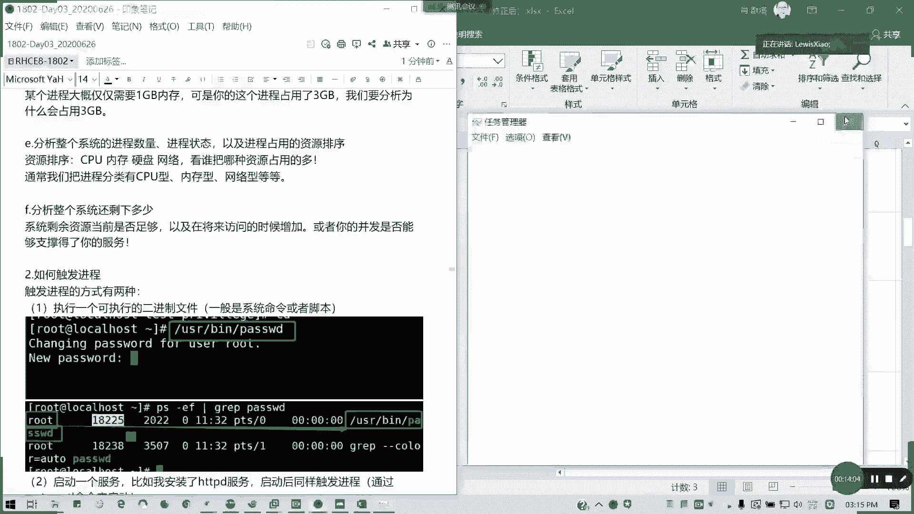

强不强调环境的话，你们就拿一台4g内存，你给我跑四，给我给我跑这个跑一个虚拟机，你是想死呢还是想死呢，还是想死呢对吧，现在你看笔记本电脑都是8g起步了，以前4g起步还大有大有的在在跟你建造以前。

因为之前的系统是系统还没那么是吧，其实界面还是那么没那么丰富，功能没那么强大，之后你像以前的windows 95，你看像这样一开始的3。1，你们可能现在很少人去接触那些老系统，像我的话。

我是从dos开始玩起的，我从95年开始接触电脑，然后玩到现在20几年啊，就听说现在20几年，然后小时候电脑课是真的是有时候太调皮的，然后一开始就电脑把自己电脑中转向病毒啊，或者这些的我我是从3。2。

windows是从三点开始玩起的，然后9598就玩过这样，以前你看有时候真的像dos 640 k纯正跑起来对吧，像现在1米98的话，有16兆内存都能跑，但现在你看看一共in 10。

你是不是每次去你跑的起来吗对吧，这离子词现在是一样的，好我们讲完我们要分析我们要看待的一些资源过后呢，我们看如何触发进程啊，如何触发进程，进程的方式有两种，比如说我们可以执行一个二进制文件。

比如说我们的tx wd，这个我自己清一下，平，然后切换到加目录，比如说我user，我们执行一个绝对路径，pass w d，对不对，对吧，直接一个进程之后，我们打开一个新的窗口啊，我们打开一个新的窗口。

我们再复制一遍。

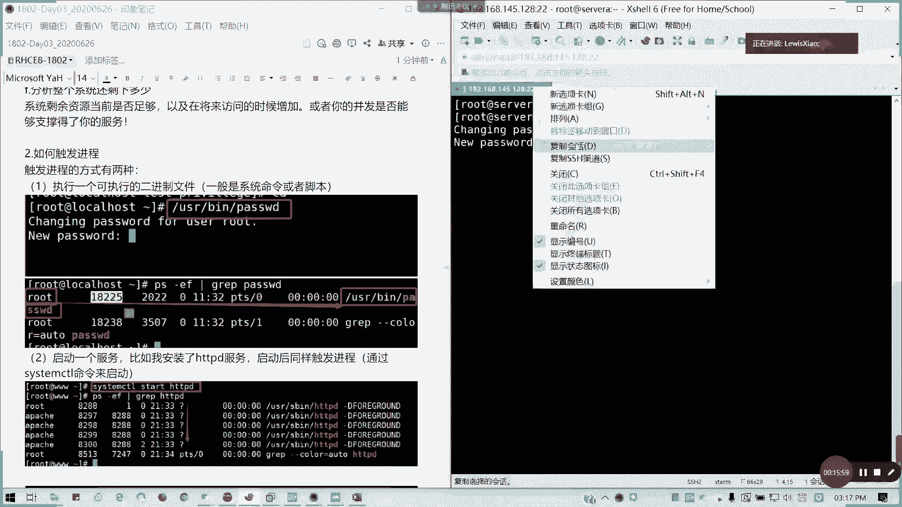

然后复制物的绘画，那么看一下啊，我上下对比会更明显啊，左右的话有点小，然后p s杠e f我们看一下ps命令，可以查看它对应的进程的grape，grape是截取的意思，也就获取它的所需的字段。

我们就获取它的pass w d，这个程序的字段是不是我们这里是不是应该执行的，然后它的进程id是六个202，对不对，在我这里的118225不对懂吗，然后以root用户来执行，看到没有。

p s是查看进程的一个叫做process date进程状态啊。

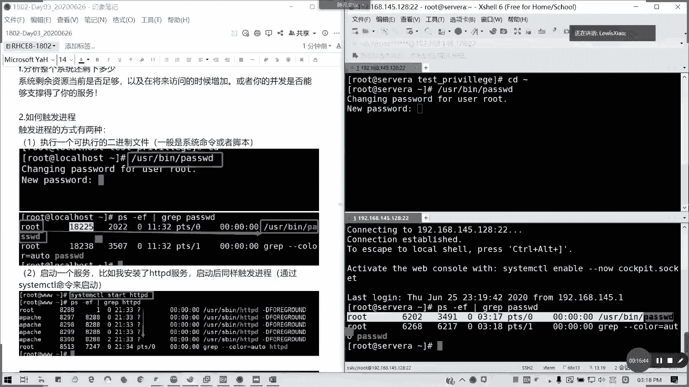

还有我们启动一个服务，比如说我们这里的http d。

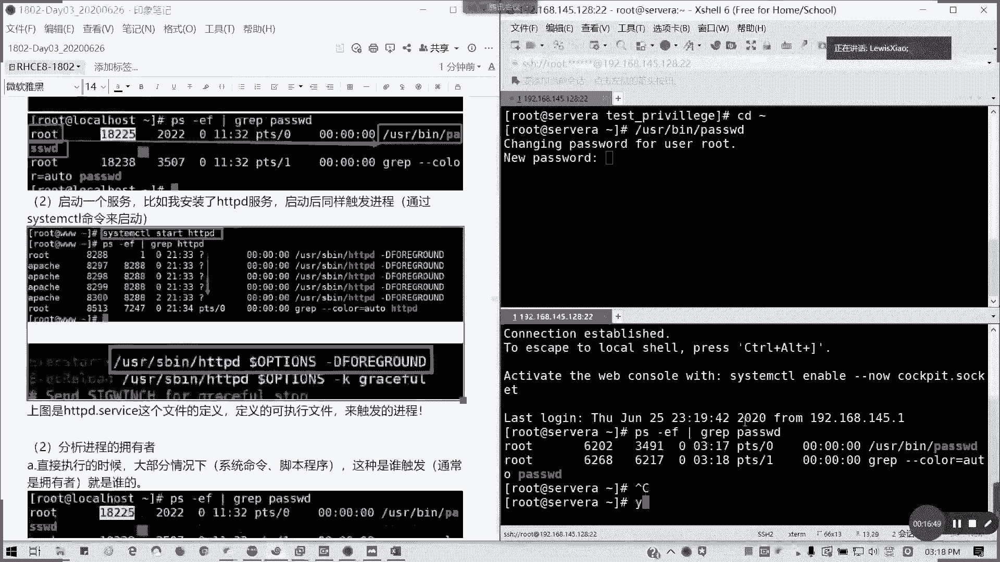

我看一下这里亚元好像这里不知道装不装得了的这个服务啊，没有配的话，估计装不行啊，这里因为我们没有配啊，没有配没有注册，所以的话默认页面是不能用的，所以我们要自己挂一个样本啊，比如说我们这里啊。

我这里我就不联系了，就这里的话，比如说我安装了一个h h t t p d啊，我装了一个web服务，然后从启动后同样触发进程，对不对对吧，我们这里题目the system star之后我们这的图。

然后我们看到是不是它会产生一系列的一个进程啊，懂吧，同样在http第1。42vs这个文件里面也有定义，它启动是怎么启动的。

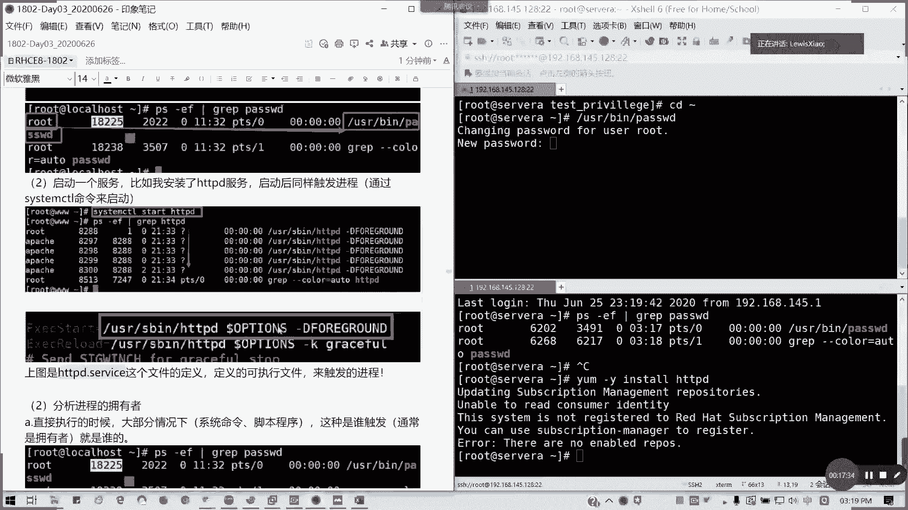

懂吧也有啊，这个我们大概知道一下就清楚了，好像大家没有什么问题，那我们继续讲，然后呢接下来我们分析进程的一个拥有者，我们回到这个图来啊，飞机的拥有者大部分呢直接直线的时候，大部分情况下随处发。

就谁的懂我意思吧，然后呢还有啊，就是你这个执行文件如果某读取某个配置去启动的情况下，它会读取的配置文件内容，然后配置文件内容就会定义它用作者，比如说我们刚才讲的h t p d。

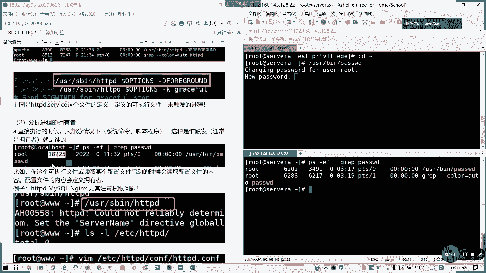

像angry，对不对，像andres，然后还有那个mcc。

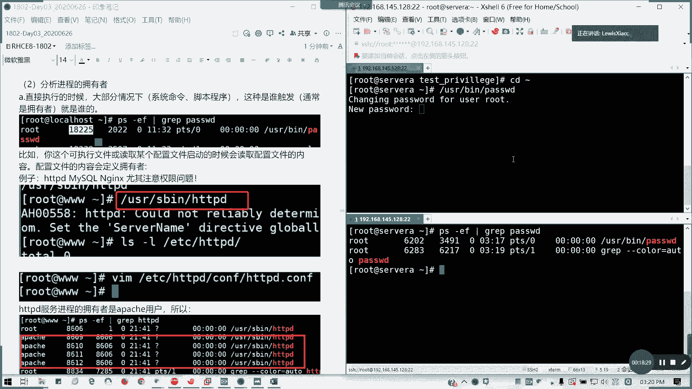

但我们这里图我们不用看了吧，到这里的话，你直接执行是执行不了的，然后我们看这个阿帕奇，我们看这个h t t p d。cos这个文件对吧，看这个文件之后，我们会看到他的进程拥有者是阿帕奇用户。

但我这里没有抓哦，所以没有装，我回头我待会在下课的时候，我挂个镜像装就装，起来大家一看就知道了。

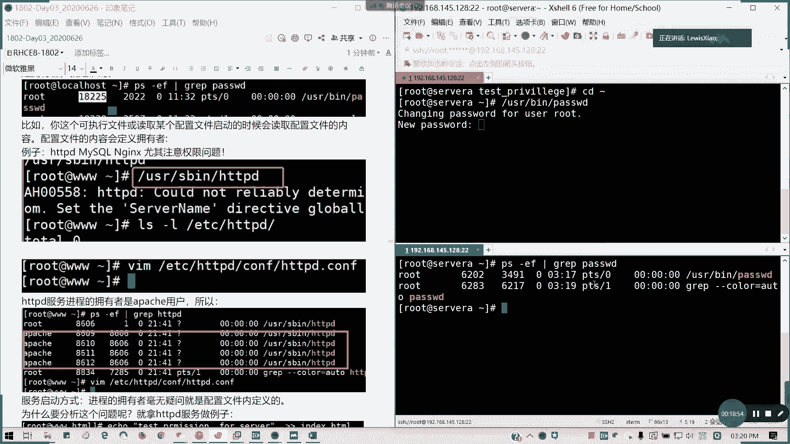

好吧，所以我们的hd v d进程是阿帕奇，对不对，然后服务启动机器啊，我们所以呢我们的服务提供方式呢，进程的作者对于我们服务来说，它是配置文件里面定义的，而不是我们谁就谁执行，就是谁的。

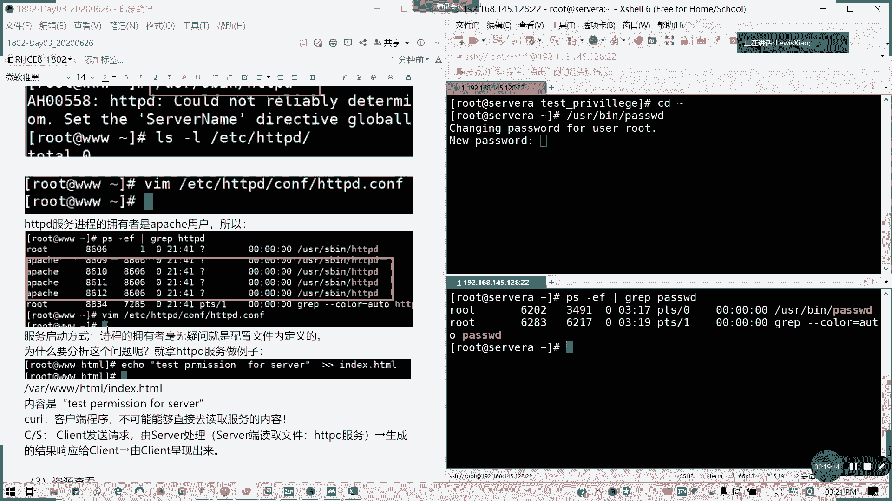

这不不是啊，为什么要分析这个问题呢，是不是，比如说我们就拿我的web服务做例子，我们啊比如说我就检查，我就检测，我就简单写一个所谓文件，那访问呢它是这样子的。

我们通常我们的网页呢是访问他是否通过服务来访问，对不对，通过服务的访问，不是我们通通常都访问网页，我们通常是通过服务去访问它的内容，而不是说你直接去获取它的文件对吧，像我们的web我们去访问一个网页。

这里的例子啊，就是相当于一个客户端和服务器是吧，我们客户端我们返回一个网页，由服务器来处理它，读取文件，然后通过http服务去读，然后生成的结果响应给客户端。

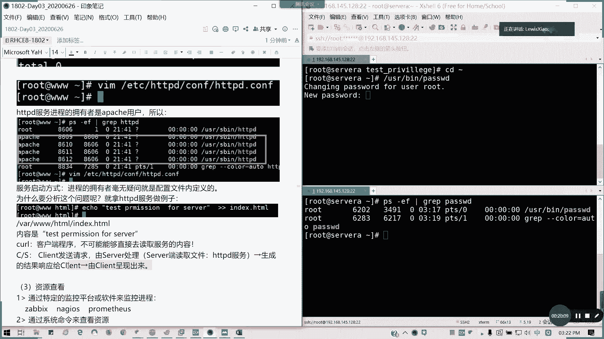

然后客户端展现出来，我这里要不我先挂一个镜像吧，挂一个镜像，然后我把那个让元配起来。

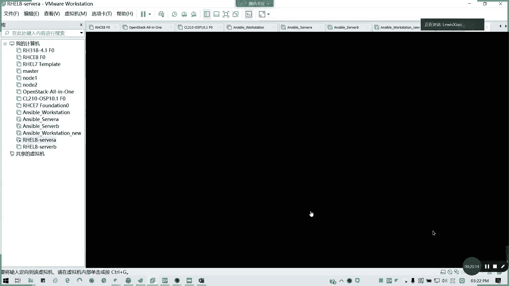

这样的话我也是会清楚一点，好不好，就刚才这么说的，好像大家还是有点雾水啊。

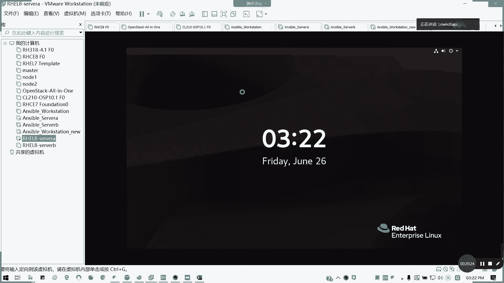

我先把镜像挂起来，这里挂了啊。

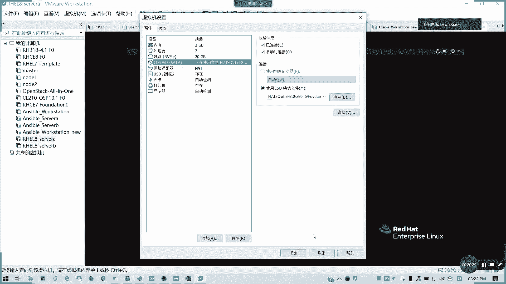

挂了个镜像，然后我们这里的话我们临时冒一下好吧，我把镜子这个停掉，然后帽子我们创建一个mt，创建一个so吧，诶诶就先先大教大家怎么挂载，我们挂载光驱是挂载sr啊，不是m t，我们先创建挂载点。

比如说mt这里面o是吧，然后呢嗯mt对吧，d b f20 ，这是光驱的一个设备，我们临时挂载就可以了，mt s o是吧，它是一个读就写保护，然后只是只读的，然后我们配这个样圆。

在那个linux 8里面的配置，两配置两个，一个是有bo s，一个是f two，因为它是分开的，对吧，它分开的两个，那我们看一下e t c，这点rap选d，然后我就写写成一个就可以了。

教大家如何配置一样语哈，h8 ，这个我们在后面第14章安装跟管理软件报的时候，我们会讲到，那这里我先配啊，然后呢我们主要是一个name是吧，我们要配置两个，一个在807跟八是不一样的，八是分为两个。

一个叫基本系统，一个叫应用流，也就base os跟f dream，如果是七的话，就总统称就一个就够了，我们这里是配置本地一样源啊，nb等于i h18 ，base os，然后我们的地址。

我这队友不要高亮可以吗，no h l不要让它高亮，那我诶我撤我又撤回来了，等一下啊，name等于h e8 base os，然后我我的基本就2l就这我们这里用fi，为什么本地对我们用本地文件让约发展协议。

想想斜杠，但是因为我们这个挂载点是吧，我们从根开始，所以这里要三个斜杠，我们直接挂一个挂载点，就是m t s o，然后里面有个叫贝斯s光盘的目录结构，里面有啊，v s s，然后是否启用是吧。

很像之前有人在群里面问的对吧，enabled，然后所说的少数低，对不对，然后不进行完整性检查等于零，然后同样我们把这几行我们用5y y还记得v i n是吧，1234，我们5y y然后在下面p一下对吧。

你就复制了吗，然后这里我们改成叫f gm，就是我们的应用流，它是把这七种组件跟我们的应用组件是分开的，然后这里呢啊这里留个空给他啊，然后这里的话我们就叫f dream，好保存退出。

然后我们我们这边我们就我们在八里面是用d n f的，或者说样都可以，但是现在通常能改名f d n f dnf，这个在实事上会讲，当然这个也不是地下城与勇士，那个dnf也不是毒奶粉啊。

俗不过我们俗称这个叫毒奶粉好不然后呢那个dnf是吧，呃我们先清掉原有的缓存，然后呢dnf my catch，我们新我们我们新建一个环新个源数据缓存，那我们就可以总共看一下dnf rap list对吧。

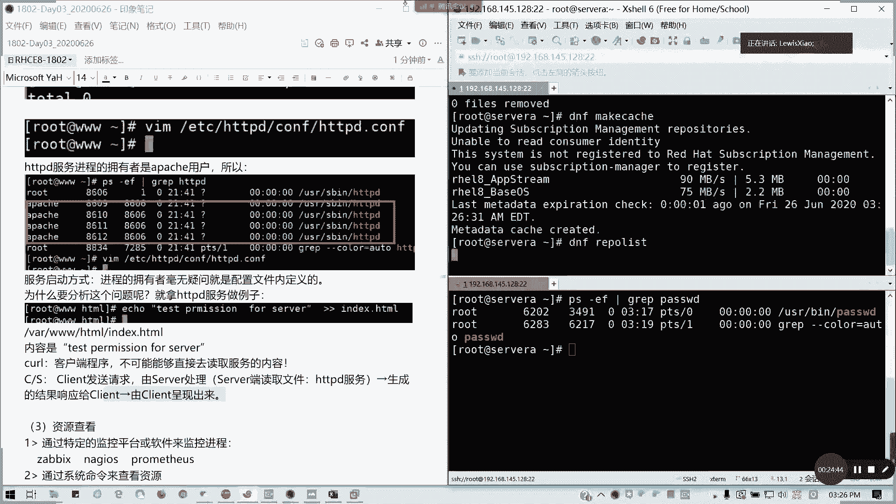

我们获取到6000多个包，bao s1658 ，然后进入流4672，那我们就可以装一个我们这里例子的h t t p d服了，好吧，只要我们让源获取得到就可以了，这个内容呢我们在14章会讲。

这里我再强调14章会讲这个详细的配置，但现在给大家有一个留一个印象哈的印象，那么这里怎么装服务呢，直接d n f，杠y就是他问询问的时候，我们直接全部都是y过过，然后h t t p d，可以了。

然后我们现在我们看一下啊，现在我们还没有看到那个h t t p d服，对不对，现在没有啊，那我现在把服务起来，服务怎么写，我们下一章会讲的就是system control是吧。

star h t t p d，如果这样enable的话，你就六启动行的话，在八里面是可以system control enable。

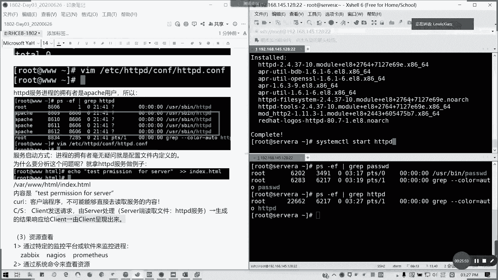

然后杠杠n是可以这么做的，但是在七这条命令是行不通的啊，我们回车，然后我看一下进程是不是开始来了，还没起来啊，是不是有h t p h t t p d的竞争起来了对吧，但这里好像还没启动，还没起完呢。

来我看一下对吧，它产产生了一系列的一个子一系列进程，对不对，懂我意思吗，就在这里，然后如果你直接执行的话是吧，直接执行不带参数，他会报错的，我这里要注意一下权限问题，他这里的话我们已经在执行了啊。

我们不能直接说这么这么启动服务的懂吗，这里现在已经在执行，所以的话我们我们可以stop掉，我们再看一看，再启动的话肯定会报错的，现在是不是一个镜头没有了，除了它的外壳之外。

那这样子的图启动的话肯定会有问题的，他是找不到，他会找不到，你这个看一下，这样启动器没有问题，如果说我们没有指定的话对吧，它其实也是调用最文件，这样启动问题也不大，然后我看他竞争起来没啊，重要接着起来。

但是他没带任何参数啊，通常我们还是不要这么做啊，对吧，他会那个h n b。c位是对，他不能他那个就是那他服务控制不了这个进程的，所以我们还是用system ctrl来，我们此时此刻就q o算了。

然后我们重新启动这个进程，从启动这个服务，从记得大家不要抽直接可执行文件去启动，因为它这个参数会调用，会有问题的，可他有人是不是想睡觉了，对不对，然后呢，像我们如何去定义进程的所有者。

我们直接看一下这个文件，vim etc http是吧，cf我们看这个是我们阿帕奇，我们的h t t p d服务的h t t p d的那个配置文件，对不对，在这里它定义的端口定的配置文件目录。

然后还他还定义了我们的看到没看到没，它的用户跟组是用阿帕奇来进行的，所以我们看到这里，那就知道了吧，懂我意思吗，然后呢比如说我们就写一个配置文件来，那我们怎么调用对吧，我们那个就echo，test配置。

然后直接追加到vr，我们默认目录v r3 w html，它默认的这个页面是空的，就是这里的话默认主页是空的，没有文件的，我们把它追加过来，然后我们看一下我们在别的机器能不能访问啊。

我们在本地试一下能不能访问就行了，q q t y l，然后这样死不a我们社会并没开哈，对吧，如果我们写出一个默认主页之后，它是通过读用h t t p d服来读取这个网页文件，解析出来返回结果。

然后给了客户端，我们才能访问这个页面，对不对，而不是说我去直接去读取这个文件，懂我意思吗，它是通过进程来解析这个页面的对吧，这就是一个我们的一个过程啊，就进程拥有者我们的一个例子分析的一个过程能明白吧。

然后接下来资源如何查看资源查看我们查看资源，我们有特定的一个监控平台，像大家接触过，像我们单位里面用过的，像jobs对吧，javis，然后拉拉斯吧，普罗米修斯，就这些这些这些开源清平台都很多。

还有像我们购买的像比如说像贝塔啊等等对吧，都有这些监控工具，然后还有呢就是系统命令p p t，还有top，还有一个就是我们用脚本也可以写对吧，在这里我们先不谈脚本跟不谈监控平台，我们来谈命令。

我们讲三个命令，ps p去跟top，p s呢我们如果不带参数，我们这里关掉啊，p s如果不带参数的话，我们是显示当前终端的所有进程，对不对，我们当前终端这个p t s杠零虚拟终端零。

我们是运行的四个进程，对啊，帮我们切换用户啊，b啊对吧，我们切换运四个，因为刚才我没注销嘛，所以说就就总共四个进程，我们以前的p s命令对不对，p p p s命令，然后有两个bh在。

然后有一个切换用户在他这里呢，pi我们要解释一下它是什么意思，pd就是我们进程的唯一的一个id值对吧，一个是通过进程id来识别每一个进程，啊而不是通过名字，因为你通过名字，一个面进程你可以运行多次了。

懂吗，然后t t y呢就是一个动态终端，也就是在哪个终端上面触发的一个进程，如果进程它就依赖某一个虚拟终端，那么如果这个虚拟终端结束，那那我是不是所有进程进程都是结束了对吧，然后如果是一个问号。

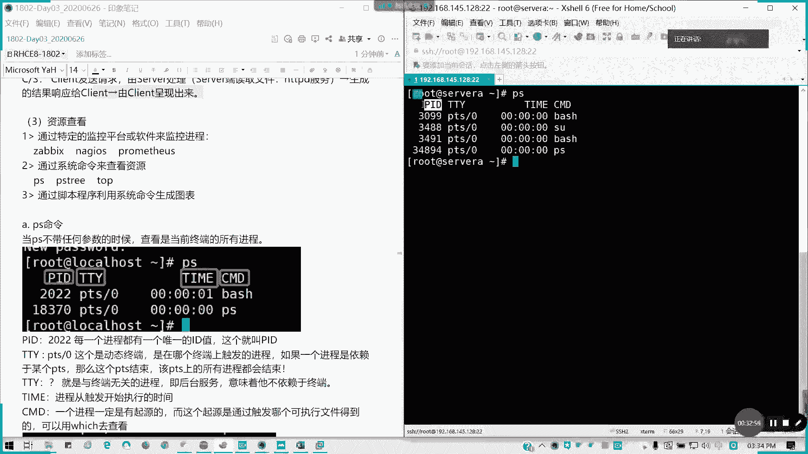

如果是一个问号，如果这里啊这问号，那代表他是跟中端无关的进程，也就后台服务，懂我意思吗，后台服务不依赖于任何终端，你关掉它照相执行，对不对，然后time，进程触发，开始执行时间。

c m d它正他证明他写明了进程的起源，也就是说它是通过执执行哪一个文献得到的，我们可以用which去查看，对不对，对吧，对吧，对吧，我们都可以查，对不对，他的命令跟它的来源。

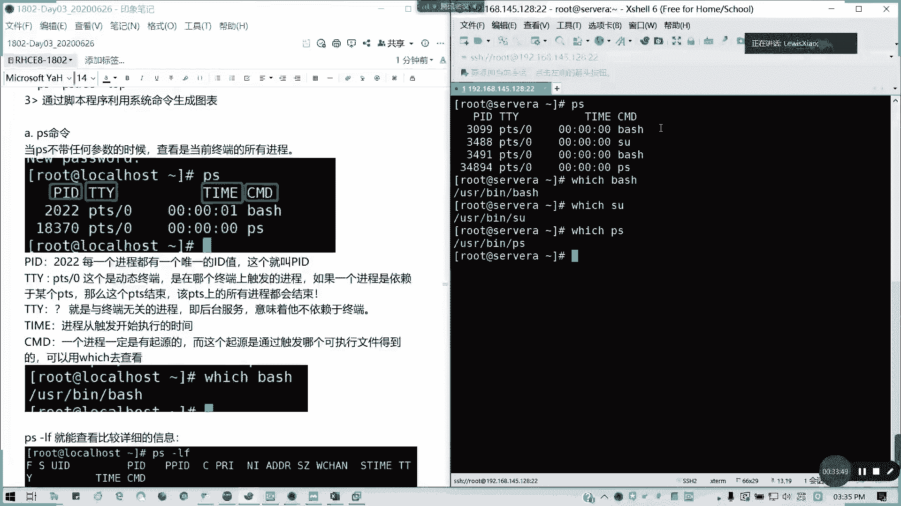

然后如果我们要查看比较详细的信息，我们可以用列表啊，ps杠l对吧，这里呢。

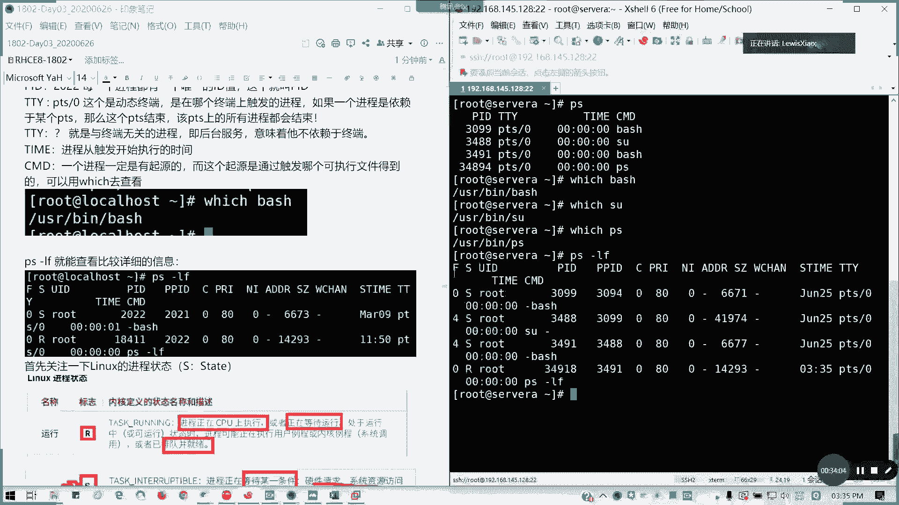

我们要看一看什么东西呢。

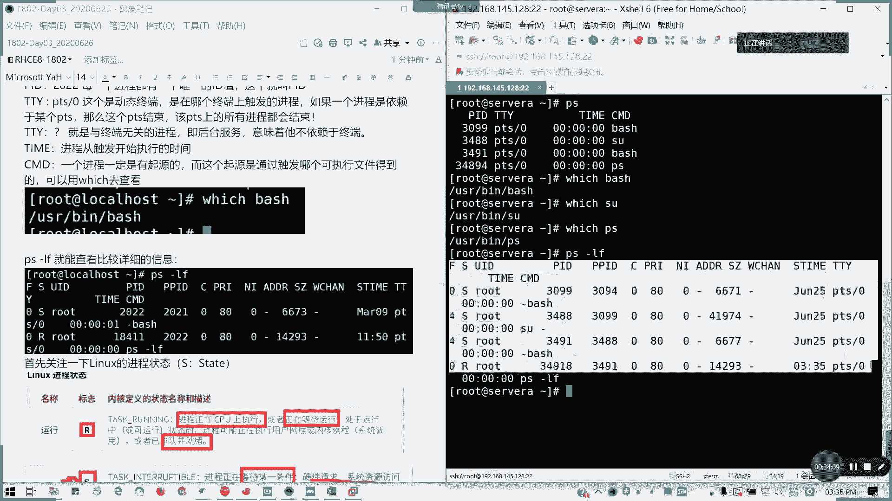

像这里p i d跟p p i t都知道吧对吧，它的进程i d以及它的附近程的i d，也就是它上面那一层进程的跟它有关的附近程的i d，然后它的u i d是吧，u i d。

然后我们就还有这些这些我们的那个我们的优先级，我们的nice值是吧，这些话我们待会解释t t y对吧，都有，那我们先看一下我们linux进程的一个状态，这个可能比较枯燥，但是大家要要要知道啊。

要知道我们进程是有哪些状态，包括我们p s啊，怎么看的，对不对，进存哪些状态，我们看一看，首先是运行态rt如果在这里啊是运行状态的话，他就说进程正在cpu上执行，或者是等待运行，除运行中对吧。

进程可能正在执行用户进程历程或是内核历程，也就我们系统的一个调用，然后呢或者太乙排队就绪了，就是一个r状态，懂吧running，然后我们还看到这里有几个s的，就是睡眠状态。

睡眠状态就是你的任务是在rutable的啊，invitable它是invitable，也就是它在等待某一个条件，比如说我们的信号，我们的硬件需求，或者是我们的系统资源访问。

那等就是比如说我们在进城的等我们，那是不是等我们，比如说等我们输入的命令呢对吧，或者是想一个请求呢都可以，然后如果当这个事件或信号满足这个条件的时候，他就回到运行状态，回到r状态，懂我意思吧。

实际不是睡眠，它是在等待对吧，然后呢如果是d呢，他也在睡眠，但是他就不会响应任何信号，这种是可能就是说那个仅在进程中断，可能会导致意外设备状态情况下使用，就是它已经异常，它不会响应你的东西了。

那我们这种就叫做第一状态，k状态就不可中断，但它有所修改，就是说他在允许等待要退出的信号对吧，要被中断，它这种的可将中断的进程切换为我们的不可响应的状态啊，睡眠的话有s d k，那我们还有一个t啊。

t的话有两个t，一个叫tt stop，也就是进程被停止，通常是通过其他进程发出的信号，如果要如果他也可以通过啊进程这个如果是我们进程处于一个他stop，也就是任务停止的状态。

它是可以通过另外一个信号返回运行动状态对吧，也就恢复执行这个可以的，然后还有一个就是临时停止的，就是tetrace，也就是我们调试我们被中断了对吧，这种比较少见，通常我们就是第一个为主。

然后还有就是一个江停，江停的话就是连，江停的话就是那个退出的时候，我们紫禁城退出的时候，给附近城发的信号，就除了他p i d之外的所有资源都被释放掉了，就是他准备这个我已经执行完了，我要释放释放了。

那我这时候我要发个信号，说诶说说老爸，我这个执行完的，我已经，然后把资源已经放放出来，对不对，这是装b，然后还有一个叫做已经将死状态，也就是附近的清理获取指定的结构的时候，那我下面无论直不直弯。

他就会被释放掉，那是不是相当于一个死禁城，对不对，那死禁城的话他不会再认列出来啊，不会再被人列出来，懂我意思吗，江停有分两种，一种是要释放主动的，一种是有附近存在，清理的时候，我就把它清掉了对吧。

可以理解吗，然后我们来看一看啊，看看这里知道什么意思啊，p i d为标识符，这样说了，p p i d附近城就是它上一级的，通常我们附近城会触发对应的紫禁城，就是说他比如说我们是一个操作系统。

它就有多个是吧，它前最上面的是一个附近程，像我们cs m d，然后他们就会出一层层触发下来，懂我意思吗，然后p r i是进程优先级，进程的真的优先级就是调优，它调控物的优先级呢是等于内核分配的优先级。

加上一个手动可调节，跟这叫做nice时，我们我们后面会再讲一个叫nice值的东西，所以我们手动调进程啊，默认next值为零啊，它是调它这个是可调的，默认值为零的。

然后他的那个一开始的一个内核分配的优先级默认为808 十，然后它的nice值呢可控范围是-20~19，负数代表它的优先级越高，懂吗，数字越大，优先级越低，然后通常来说我们只仅仅我们要调整它进程优先级的。

只能调整nice值，对于普通竞争，它的那个优先级周期为八零，所以的话我们还要加一个，我们后面其实我们如果在七里面，我在七讲到清晨的时候，其实我们这只是叫做40~139啊，4139这么大的一个区间。

就我们调用过的进程值通常默认都是八零啊，不用去管它，不过现在呢其实优先级对系统调度的影响一定没有以前那么大了，因为现在的硬件都是过剩的，对不对，以前我们还要说诶，我为了错峰是吧，错峰执行命令。

那我们把进程稍微有一些紧要的优先级高，我们调低一点，怎么把进把数字调低，然后把那个进进，我们就没那么重要的，我们调教一下进程，但现在其实已经没那么重要了，因为现在的那个其实那个cp已经发展很快了。

对不对，所以最后我们的那个cpu我们调度能力已经有非常大的一个提高，所以的话就没必要去动这个东西，s time就是我们触发的时间。

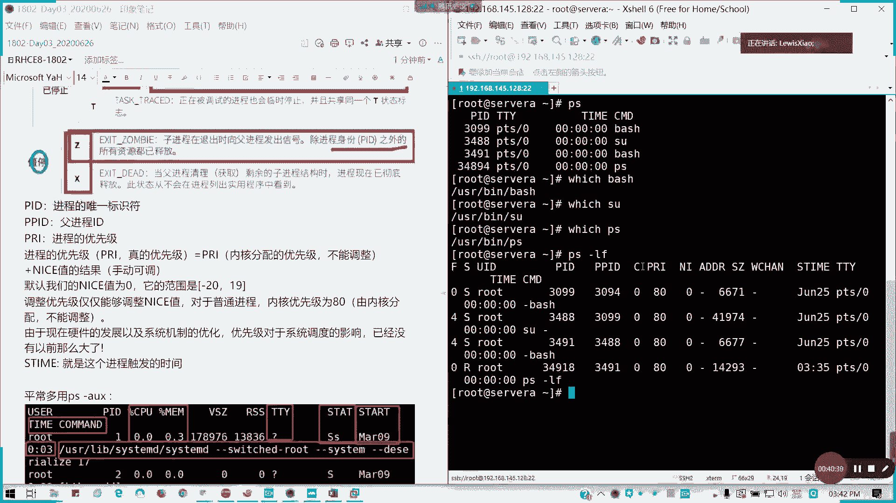

刚才讲过，我们平时呢会多用我们的a u x对吧，干嘛os再不干都没问题对吧。

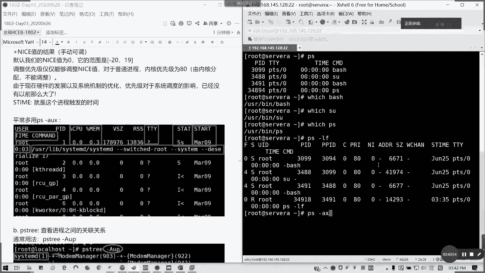

我们列出所有的a u差啊，我们列出详细的一个信息，这里好多啊，对不对，这里好多对不对，我们从这里开始a u x a u叉，包括列出我们的用户啦，然后还有他的状态啦对吧等等这些。

然后它比如说我们这进程执行用户它的p i d，我们第一个进程是由于p i d v一的进程数是stem d r，我们内核调用的一个系统手后台守护进程，原来是i i t对不对。

就系统初始化我们整个大环境的一个进程，现在叫system d对不对，然后我们cpu占用多少内存对吧，我们预分配的空间，我们资源占用的量，我们的终端是吧，问号是不是后台进程啊。

你只要哪怕挂着终端牛没矿都没事，然后我的状态是吧，开始时间，然后它运行时间。

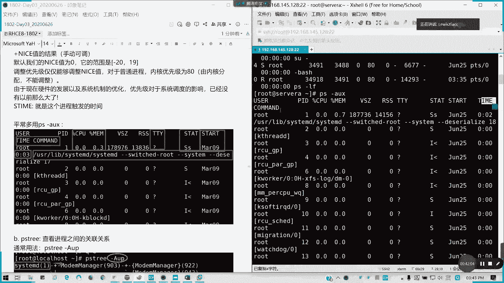

还有他的命令，对不对，这个就大概讲一下我们通常啊ps的用法懂了，那接下来我们讲进程数。

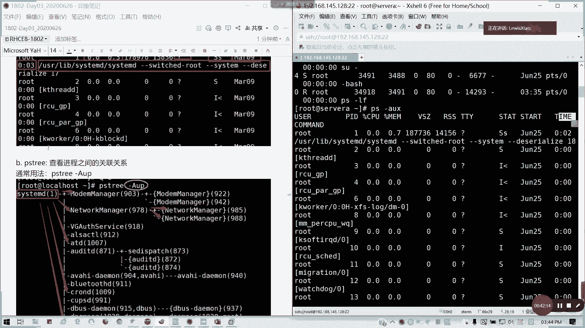

进程数的话就是看我们的进程之间的关联，看u p对吧，就像一棵树一样。

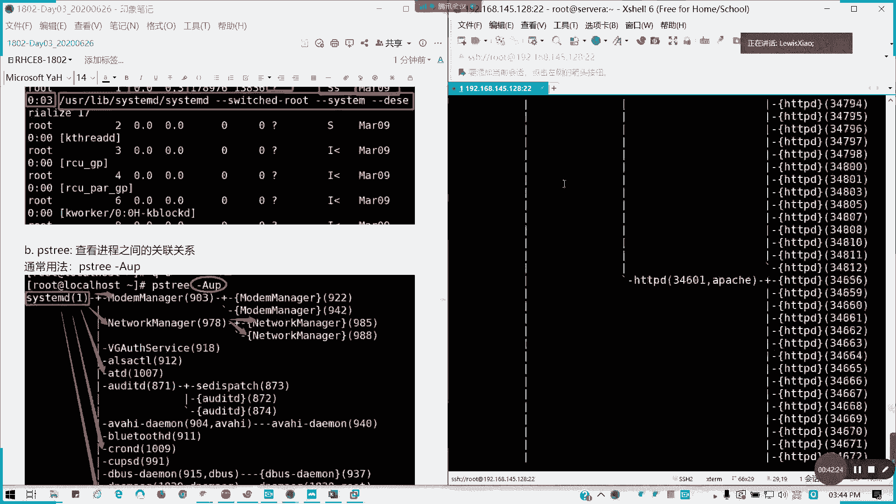

这个视图的话是看得非常清楚，对不对懂吗，他所有的进程都是从system第一我们用干干a是吧，然后大眼带我们的那个用户跟进程的子进程的一个参数，那我们其实呢就是显示出我们的进程之间的关系。

就相当于一个数是吧，我们的一个思维导图。

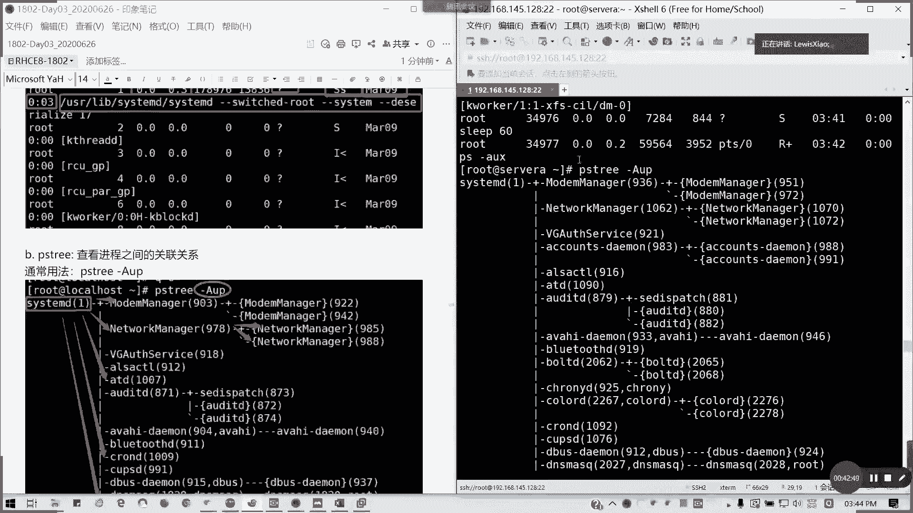

对不对，像我们一开始我们系统都是由一个system进程id为一。

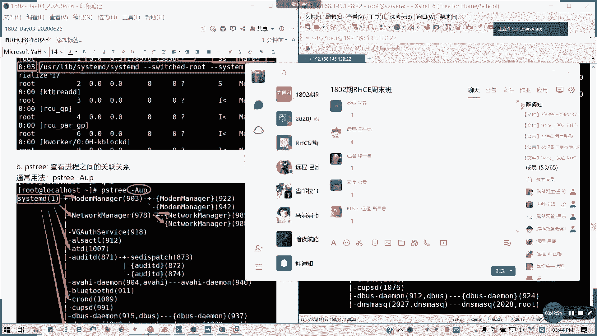

可以不用加杠a u叉，干不干a u叉都没事啊对吧。

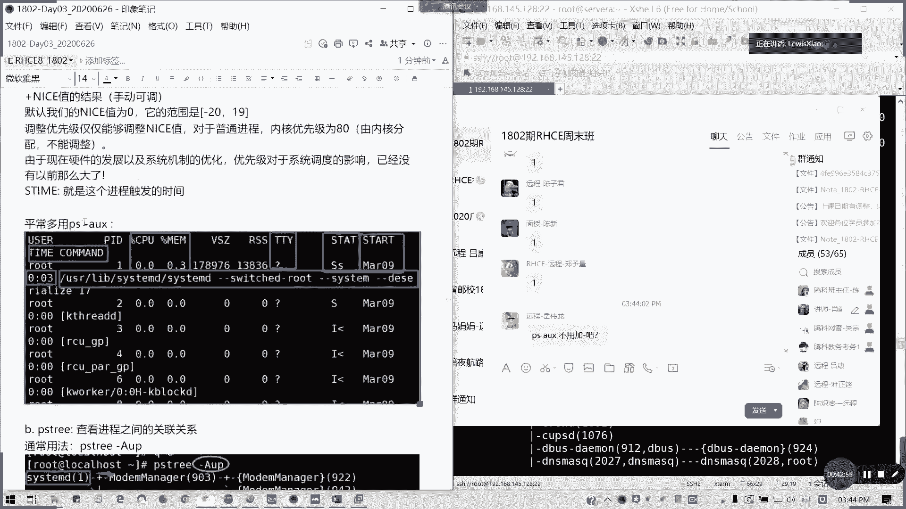

可以加可以不加，在这里我们是一棵树是吧，system一开始，然后它有几好好多的模块。

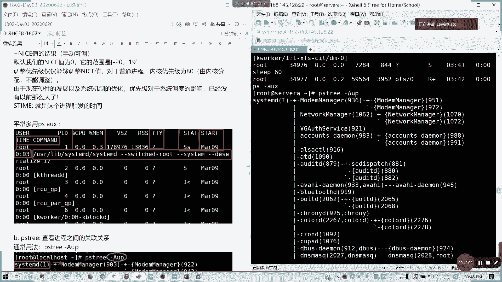

像我们的neo manages modern manager，是不是像我们接下来一个叫做http d。

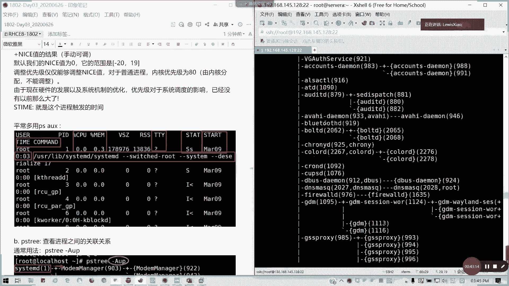

也是他属下的一个子线程，对不对，然后紫禁城里面有多个服务，对不对，它有括号，它为我们加了a u p之后，它会显示我们p i p p i d，我们p i d对不对，他们写写的是pd及用户。

是不是u跟p知道吗，它会显示我们的用户，用用户跟我们的进程号，所以这个会列的非常清楚。

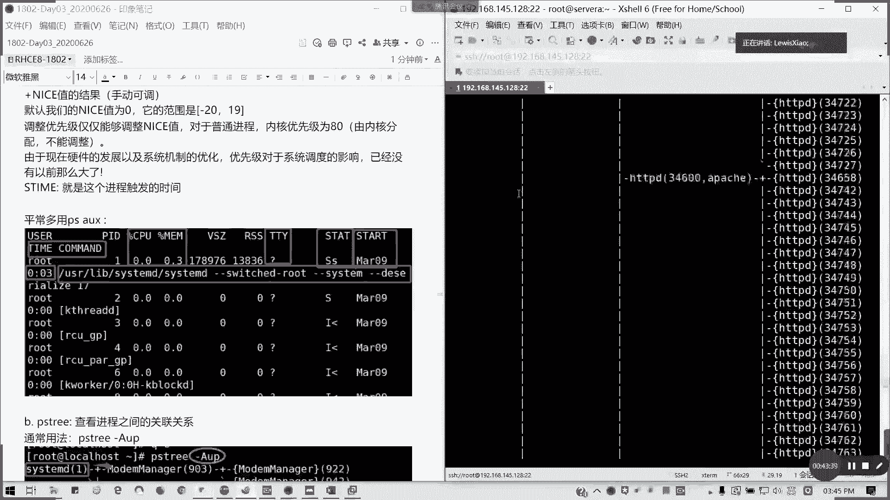

懂我意思吗，嗯。

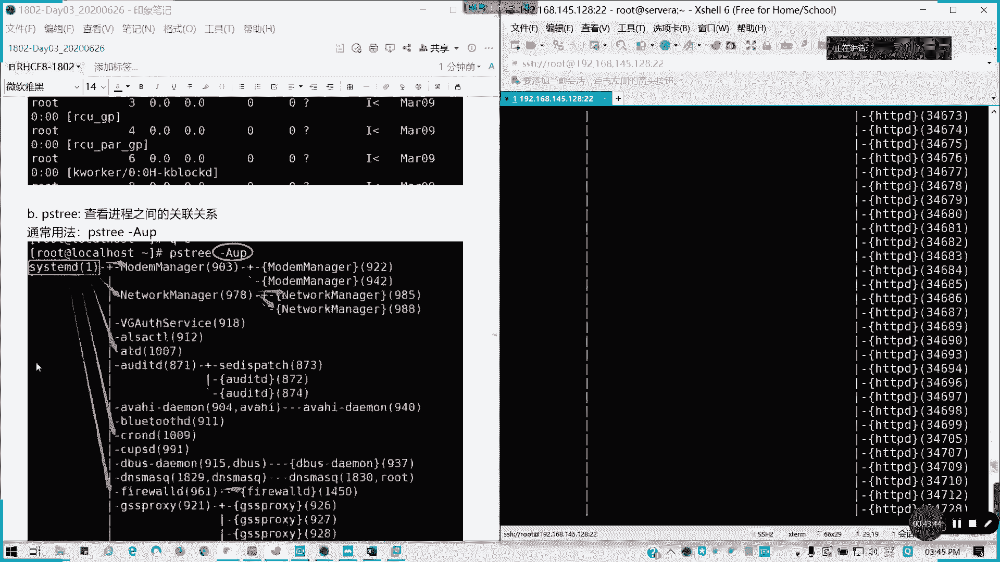

然后它下面还有哪些紫禁城，就这样画下来，懂我意思吗。

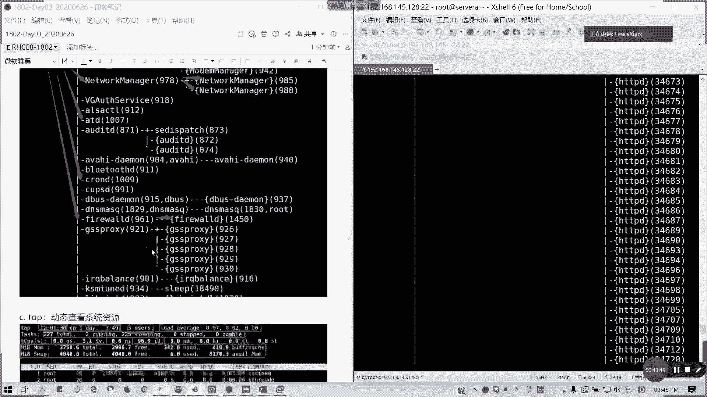

然后我们还有一个top，top是我们动态查看系统资源，怎么动态看呢，像这里我们当前系统时间是吧，然后预开机开了多长时间，有多登录多少个用户，它cpu的平均负载率，这里有平均负载率呢是一分钟，五分钟。

十分钟，它的延迟懂吗，它有一个负载率，我们现在没什么进程，所以都是零啊，就没什么，就基本上没什么竞争跑，所以的话他的那个负载，它的那个单位是零，然后还有多少个任务在运行，对不对，然后有几个在运行中。

几个睡眠，几个停止，几个家庭，对不对，后面解释不完了，我们cpu占用多少是吧，就同步的多少，然后多少个n i也就nice就是优先级的啊，然后还有就是空闲的有多少对吧，有几个在等待的等等。

这些还有捷键是睡眠的，那么我们的内存是吧，我们内存一共多少，然后呢多少是多少，空闲多少，释放多少，用多少，再用到多少，是一个缓存，把我们400分区，对不对，然后下面呢，下面就是我们的p i d。

我们的我们的竞赛i d用户，然后我们的优先级是吧，v级nice值，它的用的虚拟虚拟内存都多少，他的资源占用的资源数，它的一个共享空间数，以及它的状态cpu内存，对不对。

我们通常还有后面还有一个time跟command，放大来看就清楚啊，放大来看就很清楚了，对不对。

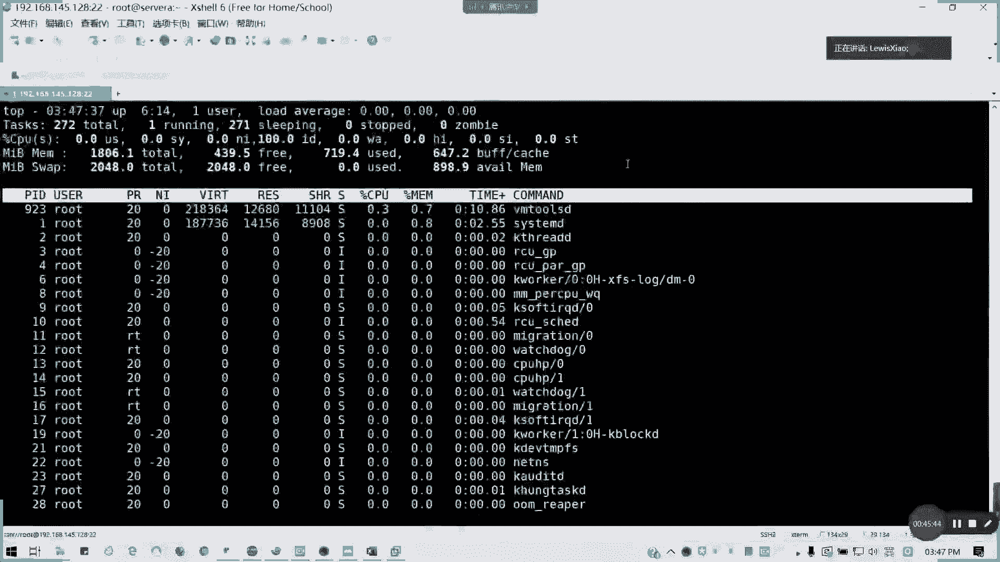

这才是完成了一个界面，好吧，我看到刚才那里侧一边了。

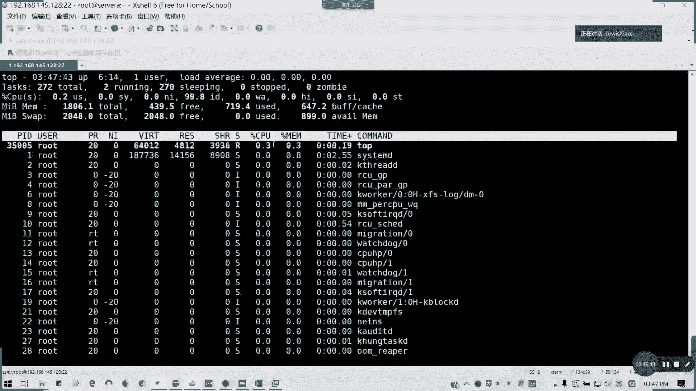

懂我意思吧，通常用法呢是top是吧，更低指定时刷新的时间间隔，比如说我一秒钟刷新一次，然后刷新次数为一对吧，他是这种退出的对吧，然后如果是top杠c的话，就显示详细命令，然后一直在刷新。

就一秒钟刷新一次，对不对懂吗，我们通常是不是有这样的看动态进程的一个，看看进程动态值的一个用法，对不对，无论从6。0708点都是一样好吧，那我们先我们上半部分，第八章上半部分先到这儿。

我们稍微休息十分钟，四点钟我们就开始讲作业控制啊，作业控制这个的话就是一个我们作业的一个优先，就是我们前后台啊等等这些。

