# Linux进程管理：Day03_Ch08b：作业控制与信号控制 🚦

在本节课中，我们将学习Linux系统中的作业控制与信号控制。你将了解如何将任务从前台移至后台运行，如何查看和管理后台任务，以及如何使用信号来优雅地或强制地控制进程的生命周期。

---

## 概述

Linux是一个多任务操作系统，但一个终端会话的前台通常只能运行一个交互式进程。为了同时处理多个任务，我们需要掌握作业控制，将任务放入后台运行。此外，当需要干预进程时，例如终止或暂停它，我们需要使用信号控制。本节将详细介绍这些核心概念和操作。

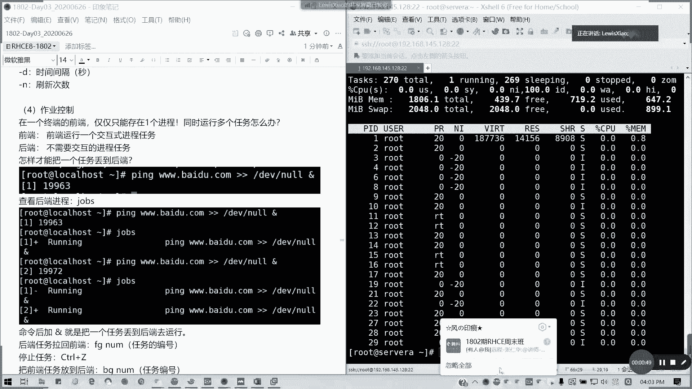

---

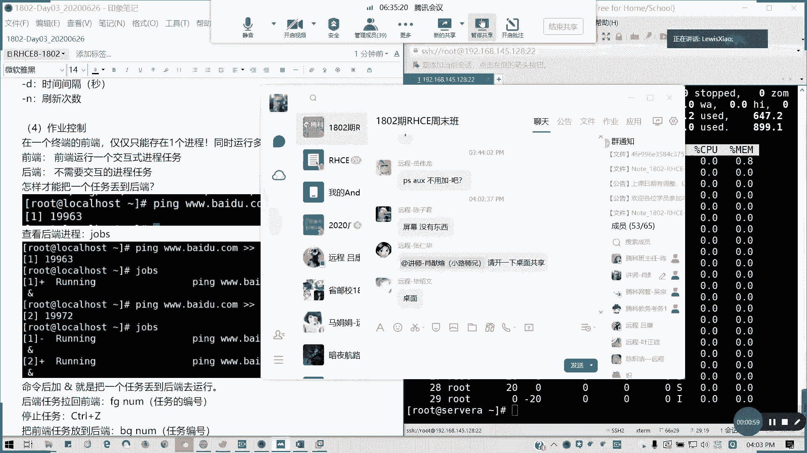

## 前台与后台任务

在Linux终端中，前台通常只能运行一个交互式进程。当需要同时执行多个任务时，可以将非交互式或长时间运行的任务放到后台执行。

### 将任务放入后台

在命令的末尾添加 `&` 符号，可以将该命令放入后台执行。系统会返回一个作业编号（Job ID）和进程ID（PID）。

**示例代码：**
```bash
ping baidu.com > /dev/null &
```
执行此命令后，`ping` 进程将在后台运行，不会在前台终端输出信息，并会显示类似 `[1] 35181` 的信息，其中 `1` 是作业编号，`35181` 是进程ID。

---

## 管理后台任务

将任务放入后台后，我们可以使用特定命令来查看和管理这些任务。

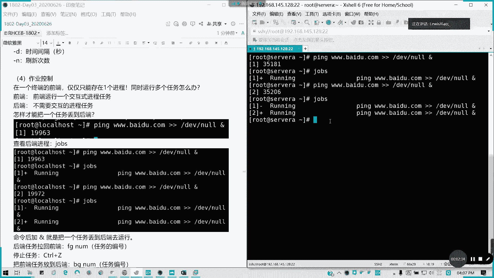

### 查看后台任务

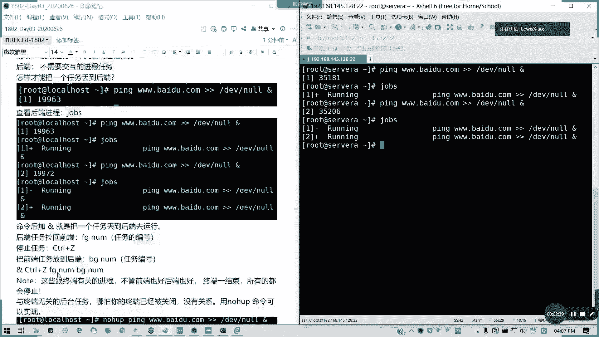

使用 `jobs` 命令可以列出当前会话中的所有后台任务及其状态。

**示例代码：**
```bash
jobs
```
输出会显示作业编号、状态（如运行中 `Running` 或已停止 `Stopped`）以及启动该作业的命令。

### 将任务带回前台

使用 `fg` 命令，后跟作业编号（以 `%` 开头），可以将指定的后台任务带回前台继续运行。

**示例代码：**
```bash
fg %1
```
此命令会将作业编号为 `1` 的任务带回前台。

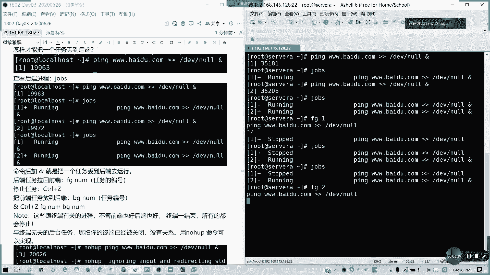

### 暂停前台任务

在前台运行任务时，按下 `Ctrl + Z` 组合键可以暂停该任务。被暂停的任务会显示为 `Stopped` 状态，并出现在 `jobs` 列表中。

### 将暂停的任务放入后台

使用 `bg` 命令，后跟作业编号，可以将一个已暂停的前台任务转移到后台继续运行。

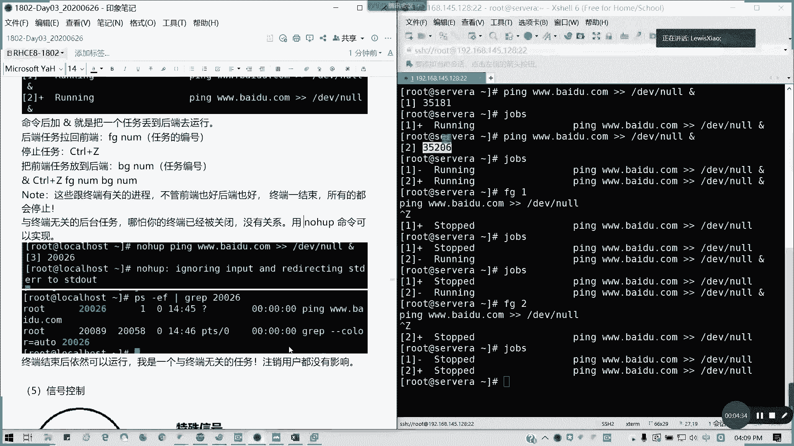

**示例代码：**
```bash
bg %1
```
此命令会让作业编号为 `1` 的已暂停任务在后台恢复运行。

**重要提示：** 使用 `&`、`jobs`、`fg`、`bg` 管理的任务都与当前终端会话绑定。如果关闭终端，这些任务都会被终止。

---

## 创建与终端无关的后台任务


如果希望任务在关闭终端后依然能继续运行，需要使用 `nohup` 命令。`nohup` 会使进程忽略挂断信号（SIGHUP），从而与终端分离。

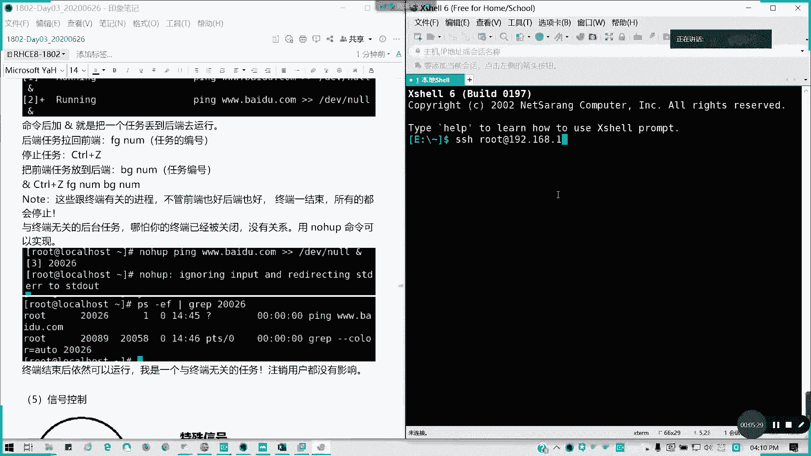

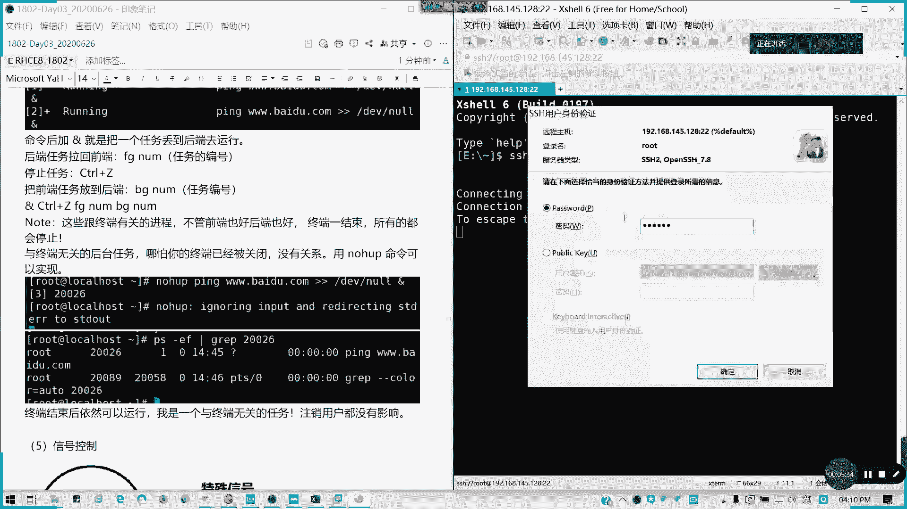

**示例代码：**
```bash
nohup ping baidu.com > output.log 2>&1 &
```
*   `nohup`：使命令忽略挂断信号。
*   `> output.log`：将标准输出重定向到 `output.log` 文件。
*   `2>&1`：将标准错误也重定向到标准输出（即同一个日志文件）。
*   `&`：放入后台执行。

执行此命令后，即使关闭终端，`ping` 进程也会继续在后台运行。可以使用 `ps -ef | grep ping` 命令来查找并确认其进程ID（PID）。

---

## 信号控制

信号（Signal）是Linux系统中进程间通信的一种方式，用于通知进程某个事件已经发生，例如请求终止或暂停。

### 常用信号列表

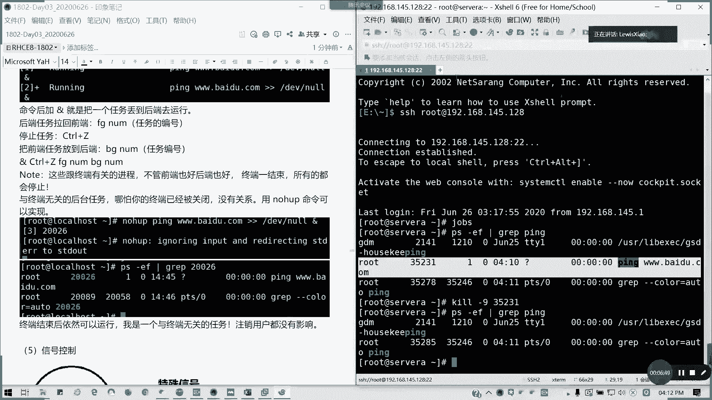

以下是进程管理中几个最常用的信号：

| 信号编号 | 信号名 | 默认行为 | 描述 |
| :--- | :--- | :--- | :--- |
| **1** | SIGHUP | 终止 | 挂起。常用于让守护进程重新读取配置文件。 |
| **2** | SIGINT | 终止 | 键盘中断（Ctrl+C）。 |
| **9** | **SIGKILL** | **终止** | **强制终止。进程无法捕获或忽略此信号。** |
| **15** | **SIGTERM** | 终止 | **正常终止。允许进程进行清理工作后退出。** |
| **18** | SIGCONT | 继续 | 让一个停止（Stopped）的进程继续运行。 |
| **19** | SIGSTOP | 停止 | 停止（暂停）一个进程。进程无法捕获或忽略此信号。 |

### 发送信号：`kill` 命令

`kill` 命令用于向指定进程发送信号。最常用的信号是 **15 (SIGTERM)** 和 **9 (SIGKILL)**。

**命令格式：**
```bash
kill -[信号编号] [进程ID]
```

**示例：**
1.  **友好地终止进程**（发送 SIGTERM 信号）：
    ```bash
    kill -15 35231
    ```
    或
    ```bash
    kill 35231 # 默认信号就是15
    ```
2.  **强制终止进程**（发送 SIGKILL 信号）：
    ```bash
    kill -9 35231
    ```
    此命令会立即终止进程，不给进程任何清理的机会。

### 批量终止进程：`killall` 命令

`killall` 命令通过进程名来发送信号，可以终止所有同名进程。

**示例：**
```bash
killall -9 ping
```
此命令会强制终止所有名为 `ping` 的进程。

---

## 总结

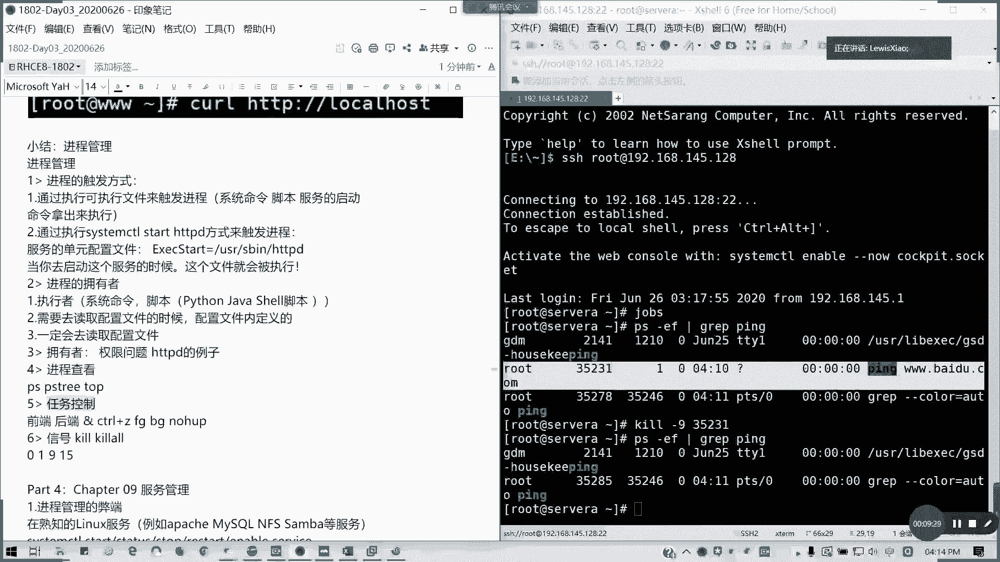

本节课我们一起学习了Linux中的作业控制与信号控制。

*   **作业控制**：我们掌握了如何使用 `&` 将任务放入后台，使用 `jobs` 查看后台任务，使用 `fg` 和 `bg` 在前台和后台之间切换任务状态，以及使用 `nohup` 创建与终端分离的持久化后台任务。
*   **信号控制**：我们了解了信号是控制进程行为的关键机制，重点学习了 **SIGTERM (15)** 和 **SIGKILL (9)** 信号的区别，并学会了使用 `kill` 和 `killall` 命令向进程发送信号以请求终止或强制终止。

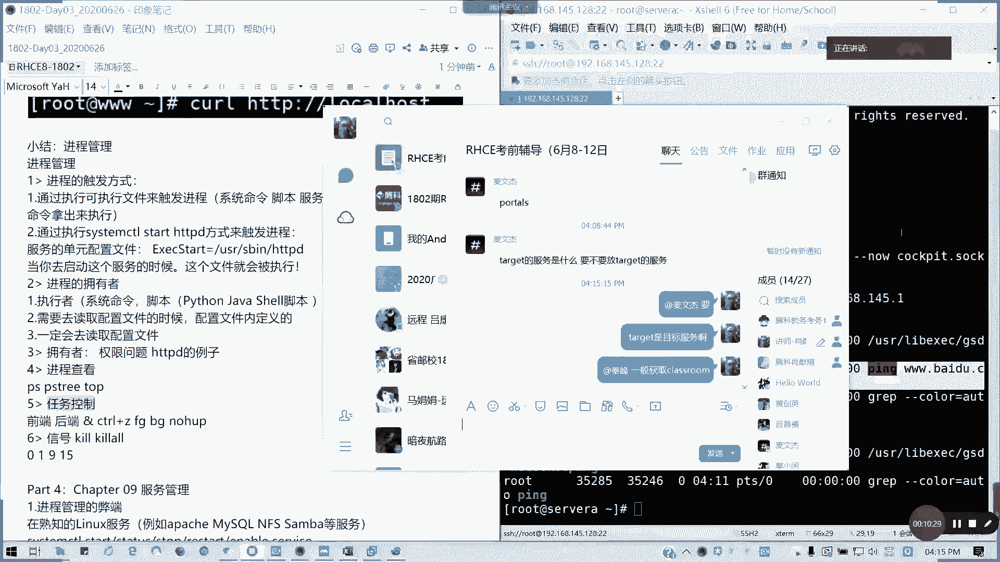

理解这些概念和操作，对于在Linux环境下高效、安全地管理多个运行中的进程至关重要。