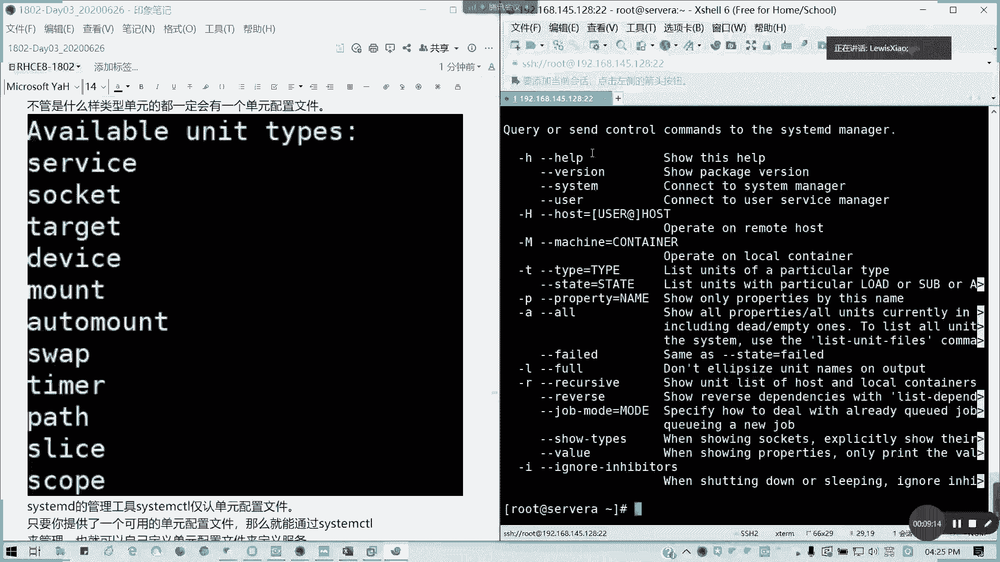
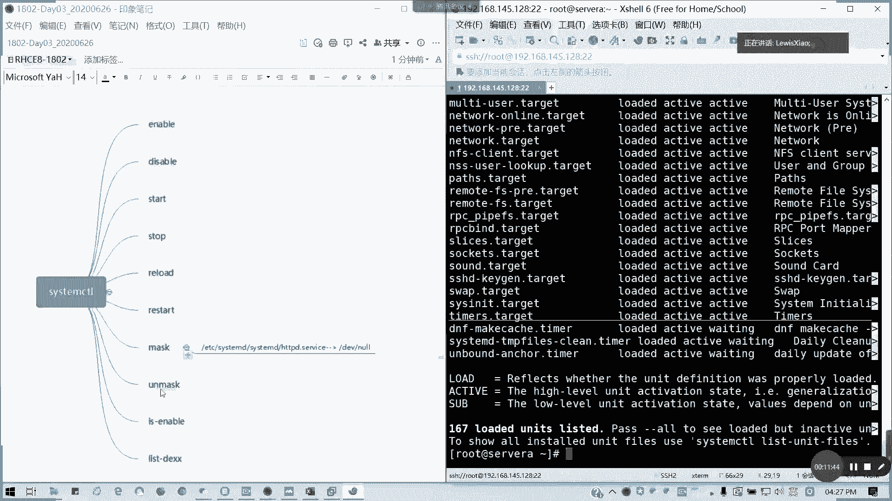

# 2021全新 RHCE8.0 红帽认证入门教程——可零基础入门学习【网络安全／Linux】 - P15：Day03_Ch09_服务管理 - IT老表哥 - BV1444y1h7Bx

<该字幕由算法自动生成> 好04：16，我们接着讲服务管理，服务的话，其实我们这里重点讲就是一个system control的问题啊，system c t l，这也主要是一个概念。

还有一些一些基本的操作吧，在进程管理呢，我们通常啊，通常我们在熟知的linux服里面，我们可以通过进程来处理，是不是放进程处理，像hta b d，它是通过进程。

通过u u r我们的linux unix软件这种资源里面，sb目录的h t t p d去创建进程，在我们图里面都有看到，对不对，那只有进程才能处理自己处理问题，这个是大家都认可的，对不对。

我们服务是通过进程来启动的，但是为什么要服务这个概念呢，我们当我们通过这个u s s b目录x hd v d，这个可循环性是创新成这个问题，这个大家都公认的没问题，对不对，然后呢。

如果修改配置文件的时候，是重写h t p的时候，我们用q2 没问题，对不对，刚才讲的信号控制对不对，没有问题，如何停止t杠二杠15也没问题，对不对，但如果要开机自动启动呢，那就没办法了。

我们进城做不到啊，我的q2 做不到这个东西对不对，我们进存管理做不到，所以说我们的h t t p d只是一个服务，但系统必要的，或者是说你系统很多存在进程的情况，下你不能说老是来弄弄q来杀进城挺进程。

重启进程，对不对，不可能这样的吗，人工操作啊对吧，那这里算一个系统啊，肯定不是，那我们怎么去管理啊，这个就是一个头痛问题，怎么去管理，其实那个是帮我想好了对吧，用服务啊，用服务的方式对吧，服务的方式。

那我们接下来讲一个服务管理这个system control啊，system cpu怎么来的，在我们system在我们i在我们的那个红帽七以前是用service这个模块，服务模块来进行管理。

在红帽期之后呢，他都是交给了一个叫system d的一个服务啊，它是系统启动第一个启动的一个进程，懂我意思吧，全部交给他来管理他，system d做什么用呢，就是第一个你系统启动要用到它。

第二个你的一般服务启动也要用到它，第三我们一般服务的管理要用的他对不对，所以它相当于是一个service这个模块的一个升级版啊，特别是用六跟七，你们特别是很有很有一些企业还在用六的情况下。

那麻烦你现在你们这用到七，甚至现在的八，麻烦转变一下观念啊，广告有些观念我们现在的服务全部用system ctrl来管理，他system第一本身也是个服务，它是用来管别人了，成立一个管家。

那如何去管理呢，它有一个命令工具叫system control，它只有一个啊，就以前我们叫n i t是不是对吧，i n i t，然后服务名，然后start stop，对不对。

在我们这个system control它是放在一个病目录里面的，对吧，u u s并不并目录里面的，七以后啊，这以前叫service，七以后就是叫交给了他。

那system d呢只有这一个system control的一个管理工具，那他怎么用的，其实control管理服务的时候，它需要一个叫我们叫做单元配置文件对吧，你要管理一个个服务单元。

那是不是要它有配置文件的支持啊，他要去读取一个单元配置文件，然后根据单元配置文件定义去启动跟管理对应的进程，比如说我们的system d放在哪里，我们的单元配置文件放在库里面啊。

user lib里面的system第一对吧，system d里面的一个system目录里面一堆点service点他给是吧。

目标或者是服务或者是套接字对吧，为后缀的一些文件，这些就是我们的服务的管理文件，服务的定义文件，比如说我们打开我们刚刚装的http d。service。

对不对，它就这也有套接字，我们先打开服务来看看对吧，它的一个单元的一个描述是吧，单元有描述，然后它需要哪些文件，然后他之后会跟只有哪些文件。

然后他的documation，他的手册会关联到哪一个，对不对，都有写，然后呢至于服务呢。

我们看到它有定义它的环境是吧。

然后他的类型是通知通知对吧，然后它的star是怎么起的对吧，它的启动是怎么起的，它从它的重新加载是什么，怎么重新加载就干k graceful。

对不对，重新加载配置文件，然后安装它是它是需要什么，就是一个多用户，对不对，他这里有定义，但这个这里我们在这一章里面，我们在cc的阶段，包括c一阶段，我们都不会要求说这个文件要怎么写啊。

不需要掌握怎么写，我们知道它怎么用就可以了，就我们有个概念，就是我们在装每一个服务之后呢，它都会在这个库文件里面的，就是这个目录里面这个user usa lab c神d sister目录。

它会生成对应的一个配置单元，服务配置单元，然后通过不配置单元，配置单元的一个定义来进行服务的一个管理，明白吗，不要求怎么写，但是你要要求你，你就我们至少知道怎么看，对不对，像这个对吧。

执行它就执行启动操作，还有执行重新加载操作，它都有写的对吧好。

然后我们讲一下服务单元主要分类，分类分类有主要是几种，第一种是和一般服务有关的，点service结尾对不对，通常比如说像我们的web http和我们的共享服务，三八网络文件服务，我们的域名解析服务。

dns我们的ip自动分配的叫dh cp，对不对，类似的通常点service结尾呢就是跟一般服务有关系，然后跟开机启动有关的点它给点目标啊，我们刚才看到几个目标，比如说我们是为什么system。

可是我们的第一节课，第一天讲的课的时候，我们sistant control为什么呢，可以控制它的那个切换我们的启动界面对吧，这些点他给我们的这些目标呢是跟我们的开机启动有关的，懂我意思吗。

然后呢还有套接字套件是什么意思，我可以通过套接字来启动一个网络服务，对不对，跟套接字有关的就是点socket，socket结尾，然后我们不管是什么类型的一个单元。

都有配置文件对吧。

在我们这里列出来的。

像这里的话，help 11大堆啊。

help一大堆，它是包括我们怎么控制。

然后他的那个单元是吧，它包括job commod这里一堆哈。

然后还有他的那个，是不是历史啊。

我看这里它常用命令，我看一下怎么列出来，这个比如说我们可以列出来我们的所有的一个服务是不是干了诶。

它列出来所有单元的服务对吧，详细的，然后我们可以也可以列出我们所有的单元服务，它我们通常说它可以用的啊，可以用的就以上，这与我们右边啊。

我看一下杠t杠t我看杠杠type吧。

我看一下怎么列出来。

这里很多啊。

我们无论什么单元呢。

我们就先不管了，无论怎么样，单元呢，我们都可以列出一个配置文件啊，它都有一个单元配置文件。

像这里的话，我们刚才说的它有一个比如说像服务啊。

像套接字啊，像目标啊，像设备啦对吧，常用的类型像帽子的。

我们的挂载了自动挂载了这样分区啦，定时器路径是吧等等。

这些都可以啊，然后呢我们可以啊，它可以它这个system control呢它是紧着我们单元配置文件，当然你也可以提供可用的单元配置文件，然后通过system ctrl来管理，也就可以自定义了对吧。

比如说anges，它是自己定义的，懂我意思吗，通常我们怎么样去管理这个服务呢，system control，然后后面他的选项对吧，启停重启，重载状态，启用禁用是吧，然后呢就是永久启用，永远信用。

然后还列出它单元，我们通过this unit就知道了。

对吧，列出所有的单元很多了对吧，他支持着一堆这一堆很完全很全啊，很全，我们只要知道它的一些用法就可以了。

懂我意思吗，这里这么多人用法，但我们常用的就是启动启用对吧。

还有停止重启重载就可以了，懂了吗，懂我意思吗，还有一个依赖关系。

this dependent这词啊，然后还有呢就这个mi user the target，望这个配置文件优先优于我们的live user life system d，就刚才我们看这些目录。

然后还有呢就是这个如何启动启停服务，刚才我们讲了，知道了吧对吧，起的音符其实它后面我们不默认不跟，比如说我们的h t t p d是吧，很臭，我说我们重启h t t p d服。

这里hd p d其它省略了一个点service懂吗，我们所以我们所以这样也能够重启的，原因就是它默认它是当成一个单元配置，我们的一个就我们一个服务默认啊，懂我意思吗，然后如果要开机启动的。

我们可以写在一个r c local里面，我们可以写在这里是吧，如果要开机启动，你要在开机启动时运行模拟项服务，你可以将你的命令写在这，这是我们题外的啊，有没有问题，这一章我们简单过了一下服务。

因为前面我没有讲它的用法，在第一天的时候我们有讲system和重用法，因为我们第一就是说一些像切换目标啊对吧，像今天讲的起重启服务啊，起服务请服务啊，这的话我们虽然说里面简介上很多。

但是我们这里的话就简单带过对吧，但这个启停服务以后经常会用到。

我看大家有什么问题，这，对啊system gt。

然后help刚才讲的啊，我刚才漏了一个system gt help，我们可以列出这样一个类型，所以的话我们这里再补一下system，ctrl杠t，然后help对不可以列出来可用的类型。

我们试一下ctrl杠t help，对不对。

李建敏说的没错啊，就帮我想起了一个命令，他等我们第九章简单过了，简单过，但是你要知道你的system ctrl没用就行了，明白我意思吗，有没有问题没有问题，请拿九，现场有没有问题没有问题，举手啊。

这张123456都ok，我们就知道system可出怎么用就行了。

