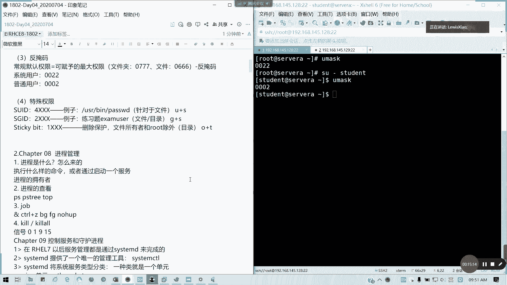
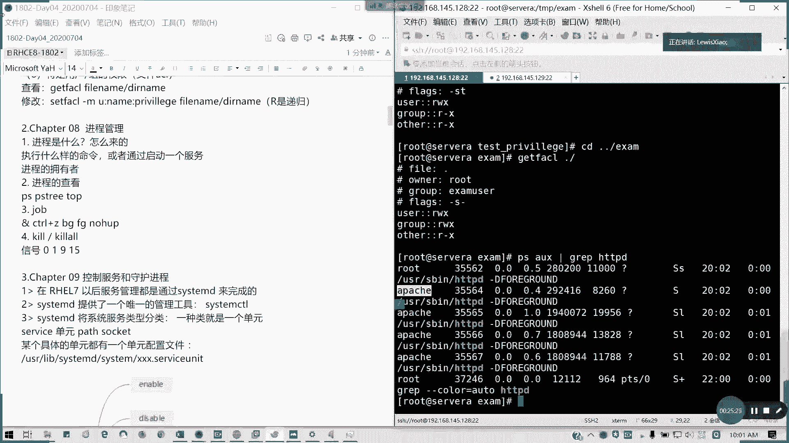

# 2021全新 RHCE8.0 红帽认证入门教程——可零基础入门学习【网络安全／Linux】 - P17：Day04_Day03课程回顾 - IT老表哥 - BV1444y1h7Bx

<该字幕由算法自动生成> 好各位学员们啊，各位是第四位，大家早上好啊，今天是北京十点啊，北京时间今天7月4号早上的09：35，那我们啊我是小陆师兄，我们今天开始我们红帽1802hc八点，第四天的内容。

首在讲第四天的内容之前呢，我们先回顾一下我们上周到底讲了什么东西啊，上周我们是讲了第七到第十章的内容，今天我们会讲六章，也就讲到第一本书结束，希望大家能跟上来，好不好，我现在把语速稍微放慢一点。

因为有人跟我说，他跟我提的就是说啊语速有点快，就班主任那边反馈的一些东西，所以的话我就把语速稍微放慢一点，好吧，嗯我们先回顾一下呃，我们6月26号那天啊，我们因为上周我们只上了一天课。

6月26号那天我们到底讲了什么内容，首先我们讲权限管理，我们来回顾一下权限管理，我们知道要知道几个概念，一个是，用户身份，用户的身份还记得吗，一个文件是吧，它的权限是这样子对吧，有三位权限，对不对。

三三个部分它它总共是有九位来标权限的部分，然后大家可以在群里回答我吗，分别是什么。

分别代表什么东西啊，这三个r到x，然后前面是有个类型的对吧，我把它用空我把我把它用空格拆开来，能代表什么东西啊，代表什么啊，陈子勋说的没错啊，先说没错，分别是u啊，打卡，待会儿我会截图啊。

待会截图放心，第一个是所有者，我们或者是叫做user也行，或者oor都可以，因为为什么一开始不写o呢，因为写o的话会跟后面的一个r的分就出现了混淆，好吧，两者都是o开头，那我到底是因为知道是什么意思。

对不对，一个是所有者是我们的user，因为这里的话我用英文写会稍微会好一点，然后第二个是我们的这个所有者里面所属的组别，对不对，组别group同组的，他用什么权限，这里也是，这里也会啊，也会说明。

然后第三个除了这两者之外的其他，可以简单地理解为其他人跟我这个是所有用户，所有者跟所属的组都无关的一类用户，那他们是什么权限，什么身份，对不对，然后他们用过什么权限，这一块的话啊，这块的话我们需要理解。

因为我们接下来包括我们无论在那个思维的哪个方面，或者是我们考试，哪怕我们实际应用也好，考试也好，都会涉及到一个，然后前面这种是要做类型，对不对，我们复习过的，对吧，前面那个是要类型，就是我用这类型。

我们在d我们在管理文件系统的时候，是不是有有讲过对吧，文件类型有讲过，好这一块就是用户身份的一个问题，既然知道身份，我们就来讲权限，权限三种，啊对吧，are read吧，readable，不，可读对吧。

w writable和写，x securable可执行，可读和前者之前，然后呢对应数值法是吧，分别是421对吧，四一，当然对于文件或目录有些权限它是有像我们这三个权限，如果啊如果说像组合的话。

我们是有八种可能性，但是呢有些权限对我们就是有些组合对我我们来说没有意义，对不对，像你文件夹文件夹的话，你要能够访问，能够打开，能够列出内容的话，你是不是你既要有执行权限，也要有读甜圈，对不对。

懂我意思吗对吧，对于文件夹，一般来说是要二杠x，一般来说你要你如果没有x权限，你根本就进不了目录，如果没有r权限，你列不了心里面的内容，也就是我们上次给大家演示的，就是你只能读出文件名。

但是你的属性等等一堆问号，懂我意思吗，然后对于文件通常来说，要不就没有权限，要不就是r权限对吧，木兰说你要读出来嘛对吧，你要读出文件内容，那至少你有毒权限，对不对，有毒权限，然后如果你要有执行的话。

你要加一个x，但至于写不写，这个看实际情况有一些，比如说景向只写只执行这个没什么意义的，因为你都读不来出来内容，比如说我们b i m都可以，我用sh我只读就只可以可写可执行的，那你这个文件你不能执行。

有什么意义，懂我意思吗，所以的话这个我们通常来说啊，这是常见权限啊，常见权限我要补充一下，不是说它有几种。

像我这我可以打开上，大概可以打开上做的笔记，我昨天我把第一第一章的笔记重新更新了，因为我发现我传上去的内容好像是错的啊。

对于目的来说，我们就是通常就是这三种情况，我把它列出来，这样的话也就方便大家去去复习啊，要不就是可要不就是读写执行全都有，要不就是读跟执行，要不全没有，对不对，这是对文件夹，对于文件来说。

对文件呢我们对文件我们还有什么呢。

看一下啊，对于文字来说，就是，它不一定要那个它不一定需要执行权限对吧，oof x，然后还有一个三个横杠，对文件来说三啊。

我们通过对文件来说通常是三种啊。

一还有可读，可执行一种，就总共是五种，对吧，对文件说这五种权限都是正常情况，都是我们可以预想可以见到的。

但是对于我们的那个。

好很多人打卡啊，对于我们的文件夹只有三种情况，能理解吗，可以吧，这权限的问题，第三个，我们要讲到一个反野马，反野马就是，其实就是我们最大权限，反应嘛我们的啊，我们常规的，常规默认权限。

等于可赋予的最大权限减去反掩码，能懂吗，懂我意思吗，这个公式就是我们反野嘛，它的作用在哪里，像我们普通用户的话是吧，像我们那个普通用户，反野马刺0022，对不对对吧对，系统管理员啊，应该是系统管理员。

对于我们系统用户40022，对于普通用户反而是0002，我们可以看一下对吧，我们七我们root是002，然后我切换到ste等用户这里，我我不怕说错，我可以验证的，对吧明白吧。

也就是它的最大权限减去反野马最大权限，文件夹可赋予的应该我前面应该加个可赋予的最大权限，文件夹0777对吧，文件通常0666，所以你为什么我们默认建立权限里面，我们的文件夹是075。

然后我们的文件是644，这样就可以理解的吧，为什么前面加个零呢，我就加一，接下来我要创造一个叫做特殊权限的问题啊，特殊权限有三个，特殊权限，一个是x y z是吧，s y d其实通常仅对文件有用。

我们讲过哪个例子呢，例子是我们是不是我们的usb里面的pass wd对吧，我要修改别人的密码，那是不是我要调用那个root的，用调调用root的权限了，他这个是不是有sud，对不对。

然后你要修改这个e t c shadow这个文件呢，它又是谁都没有的，就什么权限都没有，那是不是我们要普通用户，如果就普通用户和修改自己密码，自己的密码是不是我们调用它的password。

root的这个用户获取临时获取它的权限，我才能去修改自己的密码呀对吧，所以这个就是我们的seid的一个作用，对目录没有没有任何对目录的话，这个没有影响，主要对于主要是，针对文件。

然后还有一个超级加id加id，这个考试性能好啊，无论七或八都要考这个s g i d它的千位数是二，所以我这里我就四叉叉叉，我这样的话会好一点，对不对，就a我们全县总共完整的mode是四位数。

然后sg id我们在干嘛呢，我们就是那个我们粒子例子，我们是不是我们的练习题对吧，练习题那个a的那一张user，对不对，它主要是文件呢，就是用它的组来执行权限，那目录呢它有一个作用。

如凡我的这个文件夹它是哪一个属于哪个组的，我以我接下来创建的文件，就以后更新的创建的一些文，件或目录，下属文件或目录，他就遵循我这个文件夹，我设定seid这个文件，sg id这个文件夹。

它的数组就依次排下来，懂我意思吗，对目录就是遵循我们这个文件夹的数组，然后新建之后全部我们不用再设定了，全是它懂我意思吗，我看有有那个有声音啊，谁没闭麦，我看一看，我听到有那个听到杂音在，好躲避了哈。

好s j r d能理解的话，我们还有一个叫做粘制位，我们叫做sticky beat，它的权限是最小的，叫一叉叉叉，也就是相当于它仅对目录生效对吧，相当于删除保护，懂吧，删除保护颈椎目录生效，除了所有者。

这个是应该是说所有文件所有者和root除外，对吧，能理解我意思吗，如果设了念之位，也就是我们在其他的那个我们我们这里啊，我补上一个命令叫这里是u加s，这里是g加s，然后后面是o加t啊，o加t什么意思呢。

也就是它的所有者的那个执行位置变成t一的话，那如果这个文件我设我这个文件夹设置键置位，那他属下的文件夹或文件，只有文件所有者以及露腿用户能够删除它，否则其他用户你别想动，你可以增删。

但你可以真改，但不能删除，能理解我意思吗，我还得去回答人家的问题啊。

因为这是上星期考前辅导期，考前辅导人家题目，人家的问题啊，好我们还讲了一个隐藏权限，隐藏权限有一个叫a是吧，和i对不对，1a和i有什么区别，还记得吗，ai一个是完全写保护，也就是你设的隐藏权限。

我们是用那个change tt 2还有l s t t r来做，如果是设的a是不是完全写保护，完全写保护，意思就是你只能读，你不能你修改不了对吧，也追加不了，就相当于我们以前3。5英寸软盘那个开关。

或者是我们早期u盘那个开关对吧，斜方那个开关一打下去，你的文件系统会被只读，然后这个呢i是部分写保护，我们可以这么理解，可通过呃，可通过那个重定向追加对吧，我我没有说有没有说对是吧，可通过重定向去追加。

也就是你不能用v i m你这个文件里设置的部分写保护，你不能用vm去编辑保存，但是你可以用a口命令可以去追加内容，这是隐藏权限的i部分写保护，我们可以这么理解，这样我希望说通俗一点。

其实它的官方概念不能这么讲，但是我就用的通俗概念给大家讲，一个是完全写法或一个是部分写法或啊，然后还有讲我们再追加了一个内容，叫做针对啊，就特特定用户权限，特定用户以及组合权限，后面如果遇到的话。

就不是我后面如果再遇到的话，我就不再讲了啊，特定服务组的权限查看，get就也就是f a c l了，我们的文件的a c l了，get excel后面跟我们的文件名或是目录名对吧，我可以看一下啊。

我们是不是有一个叫做test，然后里面tp，然后里面test，对不对，跟fc cl，哦多大聪明一点啊对吧，这是最常规的，如果你有那个如果你有，那我上次说的是，我建了一个叫exau哦。

exam的这个文件夹，我切到excel那里去，对吧，然后我们现在的话是普通权限，然后如果我们要设定特定的权限制的话，修改那就sf a c l杠m是吧，然后如然后就是你的，是用户是所有者还是怎么样是吧。

是左还是怎么样，先道歉啊，然后呢，就你的用户名是吧，你的名字，然后你的，权限，然后后面是文件名或目录名，叫刚来的麻烦在前面签下到啊，然后如果是那个这里的话，如果有递归啊，就加这个r就行了，能懂我意思吗。

这是我们第七章就这么就就这么一个回顾啊，我第七章讲的内容总共是六个小点，但这个你问我考试考不考考试呢，涉及到每个题，就是说基本上每个题包括这些，我们接下来下，哪怕是下半部分怎么都有涉及。

所以的话请大家这个要熟悉好，然后呢如果明白。

请打数字七在群里面回我，我希望无论是新手还是老手都要明白，我现在相当于给大家做一个总复习和流，速度变慢了啊，速度变慢了，然后希望大家能够理理解啊，在在现场也打个七啊，嗯，我怕大家举手举得累哈。

所以的话就在群里面回就行了，反正大家都当一当键盘侠没太大问题啊，只要不是只要是合合法之前，不理解的，现在提问，不理解不明白，现在提问，然后为这个练习呢，我我上上周五我为了这部分，包括我们的用户跟组。

我还送上了四道练习题，上次我们在课堂做的，不知道回去有没有练啊，有没有练，这次要练习题，很大概率考试会考比较多啊，所以的话这一块请大家熟知啊，请大家熟知，就四道练习题，师兄给的东西都是考试会有的一部分。

如果没有，我不会讲太多啊，当然还有一种情况就是生产环境需要用到比较多的，我才讲，好没没有的事，有轻重啊，我给大家一两分钟消化一下，然后呢接下来我们会讲第八章，第八章呢讲什么东西，第八章讲进程管理。

进程管理，进程管理呢，进程管理我们讲什么呢，进程管理，首先我们要知道进城是怎么来的对吧，进程是怎么来的，然后他通常来说它是一个我们去运行一个命令，它就会触发一个进程对吧，进程里面如果还有紫禁城。

它也有线程，对不对，线程，然后通常我们执行一个命令，或者是启动一个服务，都是会触发进程，对不对，帮我们windows我们没我们执行一个程序，就当时我们开我们的腾讯会议啊，或者是我们看我们的qq。

或者是我们的一个where where，你看全部都是进程，哪怕一个开始菜单，哪怕是一个录屏，都是进程，对不对，然后呢进城的拥有者是谁啊，是谁，通常说两种情况，一种是我这个文件或命的所有者。

第二种是我在配置文件里面指定的用户和组向我们的阿帕奇，我们的tom cat，我们的一个js，对不对，andres对不对，这些的话都是指定的对吧。

指定得像我们的http d，我们的web服务就是用了一个叫阿帕奇的对吧，阿帕奇的一个用户在执行啊，我看一下我这里阿帕奇还应该还装了啊，我用au叉就知道了，杠加不加横杠无所谓，对不对。

我们这里是不是我们的运行的用户啊，这些户他当前这个阿帕奇这个已经在启动的阿帕奇这个进程呢，他是用阿帕奇的用户，而不是用root用户去运行的，这个能理解吗，然后接下来进程如何查看。

在我们常用的几个命令p是吧，process process state status，还有一个列进程数的叫p去啊。

对吧，像进程树这个会裂的会比较详细。

就到底这个进程是怎么来的，对不对，从我们的system d，然后到哪个模块再触发到哪个进程，对不对，我们可以用au p来列出详细内容，包括它的一个进程号都出来了。

然后呢还有一个我们top查看实时的一个情况。

昨天有人问我啊。

所以有人问我到底这几项是什么意思，把它放大来啊。

这几项来什么意思，特别是昨天问我这个cpu的，他这一行呢它是百分比。

对不对，我们的这个状态是我们这个百分比啊。

百分比呢杀是所有用户空间用户进程的一个平。

就是所有值的一个平均。

而不是累加，懂我意思吗，就我昨天我发在群里面的一个补充内容啊。

我们这个cpu百分呢。

它前面有个百分号证明是百分比，所以的话他这个呢是像用用户态系统太。

还有我们的优先级态，还有这个是id idol。

知道吧，空闲的对吧，空闲的。

然后还有等待的，还有那些等等啊，还有个稳定稳定态，这些还有一些僵尸的对吧。

它所有进程里面它都是取个平均值。

而不是累加，所以的话你会看到下面的这个每个进程可能会超过上面的一个数值。

对不对，也有可能他下面竞争率超过百分之百，为什么。

因为我们现在不我们cpu现在不止一个核心对吧。

哪怕是以前的0405年刚刚出超线程的时候。

对不对，它有两个逻辑核心，所以的话他这里表示的仅仅是单个核心占用的。

如果它超过单个核心，它会超出百分之百。

懂我意思吗，所以不用过分的担心，我们这里都是看平均值对吧。

如果你这个大量进程这样cpu你爆满了。

内存占满的话，你这里的那个cpu读取的一个延时时间分别是一分钟。

五分钟，15分钟的话会超过20以上。

甚至是几百上千，这种情况一般如果是像我们纯网页服务的话。

一般是发生在你被d dos攻击的时候。

或者是说进程阻塞的时候，就大量占用进程。

你被挂了木马等等的，因为我之前我在那个我在做那个技术支持的时候。

就经常有这种情况对吧。

你你某个某个网站，然后你的进程是把把那个把整台机都塞爆了。

或者是网络带宽已经挤爆了，懂我意思吧，所以这种的话我们通常来说安全范围。

像cpu安全范围都在五以内对吧，五以内5~20你要注意一下，超过20你就要小心了。

因为这时候你已经内存已经吃的差不多了，然后cpu也就百分之百在满负荷。

所以所以的话他就会开始调用我们的smart空间。

开始调用swap，然后还有然后再调度会出现一定的缓慢对吧。

你的io读写啊，各方面你会进行造成一定缓慢，有时候严重的话，你整个系统都没得救啊。

所以的话我们昨天就补充了一个top的一个相关知识。

也有一些热心的同学也发了我们的补充资料，来自于51c t o也好啊，我们的cn brown也好，我们的那个linux社区或者是我们的权威csdn都好，这些资料大家可以去看一看啊。

也有些因为我们课堂时间有限，不可能全部讲详细，但是现在互联网这么发达，课外资料多的是啊，所以大家有空的话可以去看一看。

有些补充的东西，希望你能够学到更多好。

我把这个收回来，然后呢我们还讲了一个job我们的一个作业调度，作业调度我们就讲是不是有讲一个，我们通常一个终端只能运行一个前台进程对吧，前台就是我直接显示在屏幕上对吧，比如说我拼一个百度点com是吧。

我这里我是不是前台进程，我除了不中止，我除了终止，我是不是什么都做不了。

对不对，前台进程，那如果直接一开始抛到后台。

那我就加个n的是吧，跑到后台加个呢，它加个n的话，它显示，但是你这后台进程，你就你让你终止终止不了，对不对，你要去q掉进程才可以，对不对，对吧，我的进程是叫做我看一下，这里的话。

我要看一下他进程，刚才讲到的一个进程号叫做，停不下来哈，我看一下它的进程号叫做三级啊，经常叫37312，我把它停了啊，举一个任务接到后台运行，那就是n对不对。

我问他前不在不在前端显示就n然后ctrl加z可以中止，可以中断啊，可以中断进程，然后呢，如何把一个作业从前台到后台，从后台调起，前台放后台的命令是bg，然后后面加上一个作业的i d号。

记住是前面那个方括号的作为id，而不是上进程号，像fg是从后排扔到前台来对吧，然后如果要作为一个无终端，也就无人值守，你哪怕关掉终端，你也能在运行的，就是变成一个系统态，一个叫做守护进程类的。

你就前面在执行命令前面加个no how唉，那no hu p，那这样的话它的一个终端，你去查他的那个终端，它是从哪个终端发起的时候，他会变成一个问号，也就是一个五，就是一个后唇后台的懂吗。

你除了重启就结束掉系统，你重新启动关机或者是以人为的结束，否则他这个进程会一直运行。

懂我意思吗，现场人很理解吗，好还有一个我们讲到的一个作业控制，我们又又讲到一个叫信号处理对吧，信号处理通常说我们讲的是九跟15就强制杀进程对吧，q杠九或q2 杠九，q2 的话直接带关键字q的杠九。

然后后面带你的进程名字所建成当即被杀掉，没得挽留是吧，可能你没保存的一个修改啊，或者这些会丢失，然后q到15呢正常结束，他会去保存你后台文件收集信息等的，然后在安全的结束进程。

当然我们还讲了零跟一零是用于调试这个进程是否存在一呢，相当于重新加载，也就重启我们的进程，然后其他的我们不常用，能理解吗，如果这一章第八章总体的内容能够理解掌握的话，请在群里面打个八，谢谢。

我希望大家都能理解哈，我已经把速度放的这么慢了，已经好像那个录音录音带已经有点卡带的感觉啊，因为因为有些人觉得我讲的太快，我就把它转，我就把进度放慢，因为今天我们时间是有，有问题及时提问。

不要说只打一个8号，我你如果你只打八的话，现场应该没有问题啊，就算不是加拿呃，进程号对，叫进程号p i d啊，q杠九加p i d q2 杠九加关键字，进程关键字，比如说h t t p d。

他就会把相应的跟他有关的所有技能全杀掉哦，对，q杠九呢通常只结束一个进程，对通常我们用的更多的酒，就是说哎我收拾不住，我就把你把你给咔嚓了对吧，然后杠铃呢就是我测试这个进程在不在，杠一呢。

就就杠一呢就是相当于rel，重启重启进程，但是通常我们不这么做，因为我们讲到了一个服务管理了对吧，我就瞬间的这位同学啊。

他的一个提法去肯定不是没用过，因为我们都用到服务了，用服务是更科学更合理的方法，我们不可能说天天来杀杀进程，重启进城，那多累啊，对不对，服务器一个完备的系统不是这么管理的。

所以所以的话我们引用到了一个服务的概念，这样我们以前呢是不是像service是吧，我们六以前是用service带服务名，然后后面带一个动作，然后如果是这个启动，就是我们引导进入到对应的起开机启动。

进入对应的模式，是不是用i i t切换，对不对，但现在我们红帽七以后，这服务全部用system d的管理，也就是调用它的一个唯一的管理工具，叫做system c t l，懂吗。

它是将一系统服务类型分门别类，通常一类就是一个单元，它包括了像服务，像一这样的一个单元unit这样路径是吧，这套接字还有一个，我们接下来在14，在第二本书14章就控制启动过程的时候，会讲到一个叫做目标。

也就是我们切换，比如说我们从图形界面临时或者永久切换到文本界面也好，呃，紧急救援模式也好对吧，都是通过切换目标来实现，而不是以前的nt it，这个已经没了，特别是七七他保留这个文件，它是这个文件不生效。

八的话，彻头彻尾把t砍掉了，还记得我们以前关机是不是t0 ，或是叫做power of对啊，或者是h a l t hot，对不对，这重启report i n i t6 ，对不对。

然后还有那个我们切换到多用户模式是3i i t3 对吧，还有一个多图形模式是不是i t5 啊，但现在呢到他给之后呢，他把二砍掉了，也就是不带网络的多用户模式，因为这个确实没有实际的意义。

所以的话在红帽器以后，红帽官方把这个它给这个入口砍掉了，请保留救援模式，重启关机，还有多用户模式，实时对空模式以及图形化界面，就保证这几个，但四没有意义的啊，就是它的一个四，这个值是没有意义的。

四的话没有定义吧。

然后如何像我们每个单元具体都有配置文件。

都在我们这，我们的unix系软件资源里面的，lab cosystem d里面的system目录里面的以服务开头的，点service unit文件里面会定义服务它的启停的操作，还有参数，懂我意思吗。

所有的服务我们只要是安装的，包括系统本身存在的，它都会在这里面定义我们单元的配置文件，所以我们我们就如果有这单元配置文件的话。

我们通过system c t l system control命令我们来执行对我们服务。

对对我们的服务单元进行任意操作的时候，他都会遵循我们这个单元配置文件的定义来进行我们所需的操作，能明白吗，他的操作有很多种，通常我们经常讲的就是是吧这样的一个启动停止重重载，也就是重重载重启。

还有呢就是开机启用，还有不开机启动，对不对，通常就这么多，然后还有就是那些完全禁用啊，这些我们少用，对不对，比较少用，所以的话我们就记住这些，包括我们启动目标也是这么个搞法。

这这部分内容就是我们简单的一个system control的一个用法的一个归纳，如果这一块知识明白的，请打数字九，谢谢，有没有疑问都明白了啊。

有疑问现场题啊，直接群里面提。

然后接下来我们还有就是我们复习最后一个内容叫做我们的远程管理，通常我们客户端连接云服务端，我们服务器的方式是通过s s h，然后呢后面是吧，是用户名at远程主机，远程主机可以是主机名，也可以是ip地址。

然后你后面我也可以直接导命令给加了，对不对，如果你要做，我只是需要执行一一次性的命令，那我就后面s h后面加命令就格了对吧，如果你要进入一个提示符的话，那就直接就切后面的那个command不要。

然后呢通常我们user name是远程服务器上的某个账户，remote host name呢，它是一个完全合格的一个域名啊，如果我们这样的命令刚才说的命令执行完成以后，它会返返回到我们当前的主机。

然后客户呢我们客户端在第一次连接的时候，会把我们的sh我们server端的一个公钥保存在用户的啊，他的家目录里面的点点noboss，就相当于我们我知道了这台主机，我已经知道我信任这个是吧。

我一开始信任我的指纹，我的那个庙队公钥对吧，注意如果我们的s s h的公钥啊发生变化的时候，我们仅仅需要删除我们的客户端保存的相对应的条目就可以了，而不是删除整个文件啊，它这个no host。

我觉得如果刚发生改变，我的公园发生改变，我只要把他那个条件三的重新认证就行了，然后无面要登录呢，我们要我们这个用法用在哪，用在那种我像angel我们需要免密认证的一个场合，懂我意思吗。

这种这种会用的比较多，还有一种就是我们企业里面我们堡垒机是吧，堡堡垒机也用了很多，因为保险期通常说它是让你选用户登录，然后让你是选择普通用户，然后我直接建立一个建立一个性能关系之后，我就不用输密码对吧。

通常密码也不会告诉非管理员对吧，怎么做，是不是我们通常简单就是s s s t准，然后后面什么都不用写，这里呢就是一个完整的格式，比如说我的类型的密钥类型，我的长度是吧，那我的保存路径等等这些。

然后记得生成对应用户的一个公钥之后，公司要之后，记得把公钥复制到你要跟他建立信任关系的对应远程主机的用户上，记得是发送到对应的用户，而不是整台主机，懂吗，然后你建立连输入完对端的密码，建立完链接之后呢。

我们就下次我们再连接对应的主机的时候，因为他已经收到了你的公钥认证，也是我们已经匹配上，我们建立完关系，建立好关系了，那我们就直接对吧，我我当我远程你，我就不需要再输入我的用户密密码了。

我直接通过更加安全的公钥来认证，当然他会把公钥传在我们的远程用户的，加入下面的点h里面的authorized keys这个文件里面，它会记录记录下你这台就是说受性的这台服务器上面，对应用户的一个公钥。

它会记录在里面，还有一些公司要的啊，公司要这里有写啊，通常说私钥公钥如果不指定它就默认的保存在默认目录，如果加杠f是指定确定的一个目录，自定义目录，然后我们还讲了一个就是啊就禁止用户登录对吧。

禁止用户登录，我们可以修改一个叫做http d等于cf，对不对，就改一个选项叫做permit，look long long in，等于no，对不对，就这样的话，你用root是不能直接远程。

但你通过其他用户是给切过去的，然后还有一个我们讲的一个叫做叫做端口是吧，最后给s3 s h端口，就pose那里，我们前面把井号去掉，然后把这个数字改一改，这里的端口呢也不是随便写的。

通常说他端口最大值是65535对吧，635，然后端口号呢建议我们在制定的时候，因为我们企业通常说不会直接把22端口暴露在外面对吧，会修改自己端口，记得我们那个制定的时候。

采用1024打后到6535之间被占用端口，记得不要跟现有的服务冲突啊，然后呢修改完修改完配置文件，记得system control，restart s h d。

因为我们反正大家记得一个约定俗成的一个第一个做法，只要你但凡修改的配置文件，你要重启服务才能生效，这点是在我们那个书里面是吧，我要告知我这个文件已经发生修改，我就我的配置，我要从家长我才能生效，对不对。

有些可能甚至要重启来生效，但大多数都是重启服务就可以了对吧，修改配置文件，记得重启服务，这个我不用再强调了啊，帮我们接下来网络服务也好，这些都好，都是一样的啊，都是都是一样，大家遵循这个我们的约定。

好这一块没有问题。

请打十啊，请打数字十，有问题可以提问，看来大家应该都有回去都有做复习啊，那我们这样子，现在10：25，我们休息15分钟之后呢，这第11章自治管理知识管理，虽然考试不会专门考的，不会专门考。

但是我们在通常我们在应用排错的时候，或者是我们要监控状运维情况，运的状态，收集报告的时候，经常会跟他打交道啊，经常跟他打交道，所以呢这一块希望大家待会能够认真听下，考试真的不好啊，好那我们10：40啊。

我们回来，那大家可以上厕所，或者是那个休稍微休息一下，把刚才的内容消化一下，没签到的啊，待会儿我在10。10：40之前呢。

