# 2021全新 RHCE8.0 红帽认证入门教程——可零基础入门学习【网络安全／Linux】 - P19：Day04_Ch12a_网络管理1 - IT老表哥 - BV1444y1h7Bx

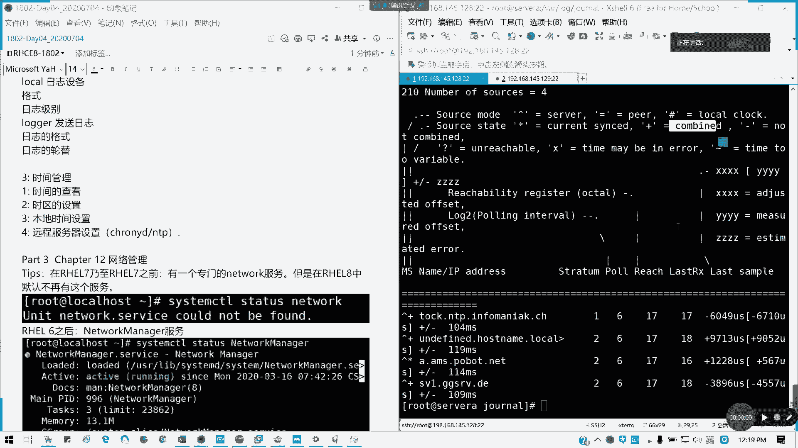

好，各位师计师妹们啊，我们现在呢先讲12章，我们先开个头啊，网络管理网络管理呢，我一开始是不是讲了一个。

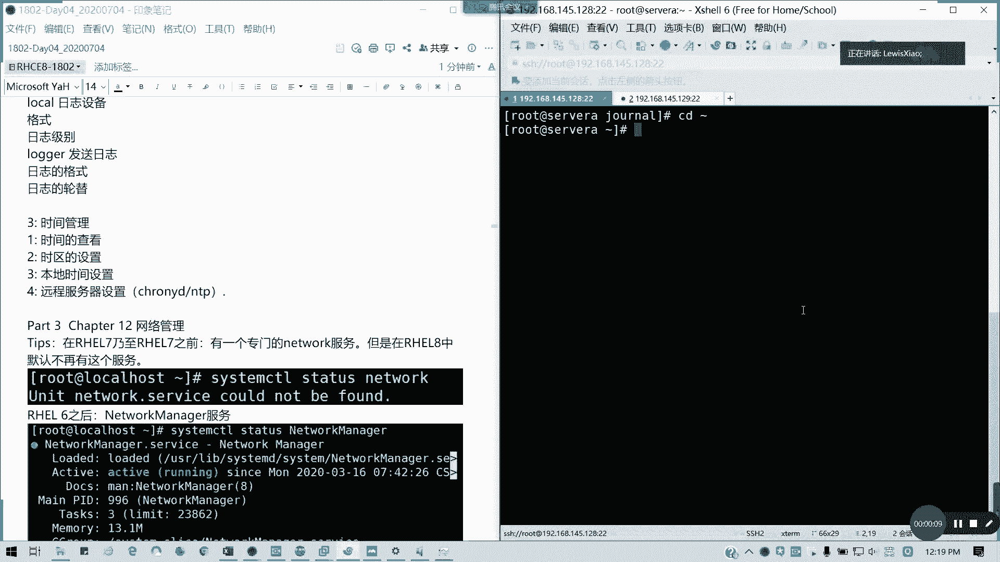

在同帽八跟七的区别，我是不是讲了一个东西啊？就是说在洪帽期跟重帽期以前呢，有一个专门的network服务。但是在八里面默认是没有了。因为这这个组件已经被淘淘汰了啊，C我们的sstem。感受啊。

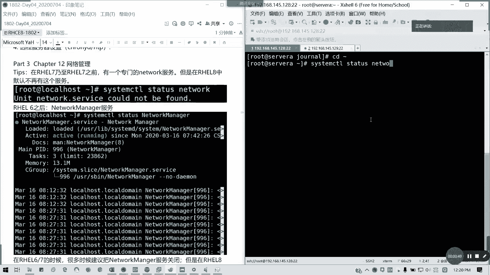

这netotework服务他们默认已经没有了，对吧？全他把里面全权给了network manager，就是我们的网络管理服务。而且这个服务是不能被关闭的啊。

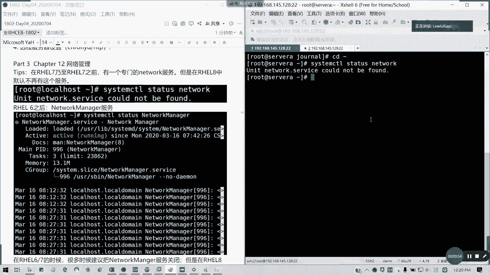

懂我意思吗？这是八跟67以前最大的区别。

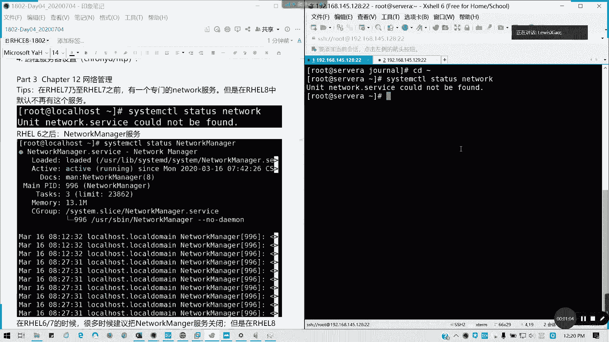

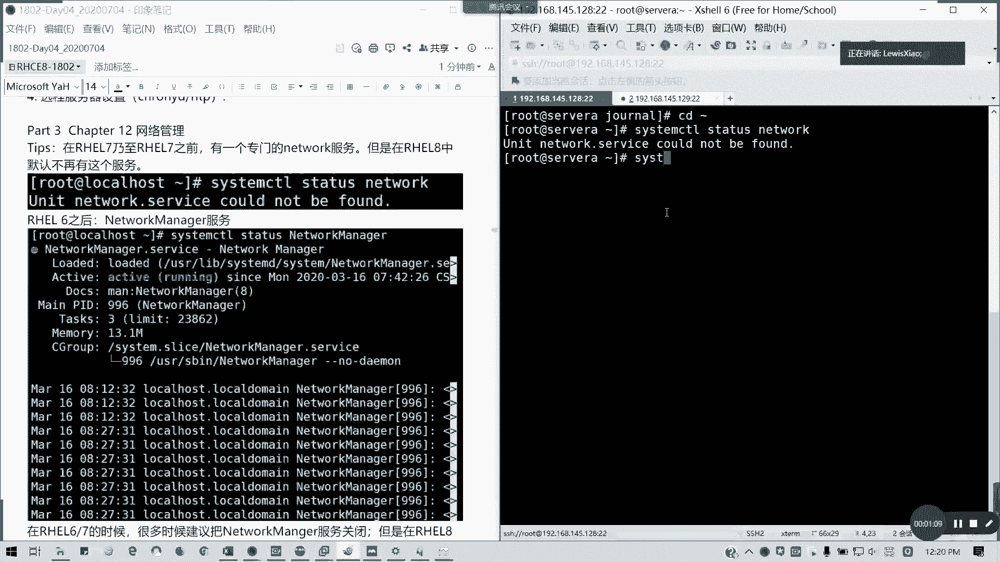

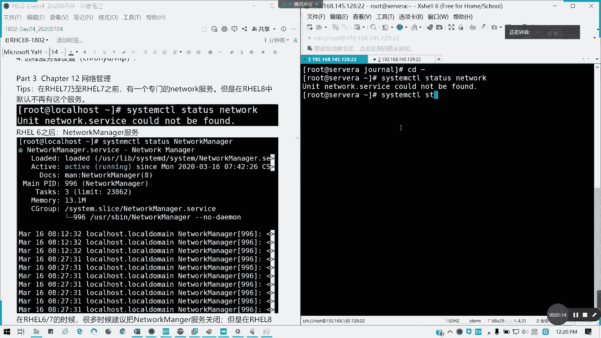

对吧。这个服务在吧里面不再允许被关闭。在以前的话。是不是我随便我我如果说网卡，我要自己配置，我不受他的管理，那我可以关。但这里的话8。0以后的版本是不再允许被关闭这个服务啊。

所以这个要注意我们重启网卡怎么办？待会我会说。但你如果你想装这个在红帽吧里面还有这个包，但我不讲，我不建议大家继续用了。因为在九大版本之后呢，下一个大版本，比如说九它就不再支持这个完全剔除。好。

那我们讲一下网络管理。网络管理呢，首先我们要知道网络设备是怎么样命名的，放心，我讲到12点半，我下课啊，先开个头，像我们红帽六以前呢。是不是我们的路 only，然后ETH0ETH1对不对？像我们现在。

是不是采用了一个比叫bios设备的命名规则？我我们在接触期的时应该知道啊，我们命命名方式发生了很大的改变。像我们这里什么ES160啦，是吧？我们这里的ENS160是不是？我们的VIVRB20是不对？

这一块的话都是我们的叫做bios DV name。bos device name采用bios的一个设备的命名规则。所以我在我们红帽七以后，我们命名网卡的方式跟网卡类型有关。首先我们把ES160啊。

相信大家刚装那个红帽8的时候都是ES160，它默认的一个名字，那我们把ES160代表什么意思呢？首先EN代表inernet以太网卡有线网卡知道吧？EN呢因此 that。S代表是那个。

PCSO也就我们PCI总线的一个插槽。可能有些我们像我们笔记本在内置的，但它就默它就默认定义为一个你走PCI总线的一个插槽。然后。后面是一个port number。它的一个端口号，比如说这里的160。

事实上呢。网卡的。device也就我们设备的名字是可以被更改的。比如说我们按照功能可以去改它，对不对？可以自定义，没有问题啊。只只不过我们刚装的时候。

我们是按照系统默认分配的一个叫bios DBdice name的一个规则来命名。我们这里看到网络接口名称呢是以网络接口的类型以概开头。比如说以太网E。我们的WL，我们的无线网是吧，无线以太网WL开头。

我们的万维网就接到为外网的设备是以两个W开头。然后呢，在接类型之后呢，接口名称其余部分呢将基于我们服务器或者是我们的电脑设备固件提供的信息，或者是由我们的PCI总线top里面的位设备的位置来确定。

所以为为什么它采用一个叫做bios device name的一个原因？像这里ON呢。N是编号啊，ON它是表示一个板载设备，且服务器的固件编号的索引编号为N。所以的问ENOE啊是代表板载的以太网设备。

就是我们简单来说就是服务器的一个内置网卡，就固化在主板上的，通常的很多服务器不提供，因为很多呢都是走PC总线的对吧？很多服务器都是第三方我外接一些网卡，对不对？像SN呢ENSN呢。

它是表示设备位于我们的PCI插槽的热插阀里面的。所以ES3呢是代表PCI热插槽三中的以太网卡，懂吧？是那种插卡的外置，我们俗称的叫做我插在机箱里面，我们另外买的啊，然后呢。

PNSN呢代表是一个插槽N里面总线M上的PCI设备，通常说是比如说我们无线模块是吧？我们的WLPCS0代表是位于插槽零里面PCI总线4的我们的无线网卡，如果该卡是一个多功能设备。

比如说我多个端口的以太网卡呢，或者是具有以太网之外的其他一些功能的一些设备呢，它设备可会添加一个叫FN是吧？方。F代表方功能，懂我意思吗？它同一设备不同功能的话，就就后面加F0F1等等。以此类推。

能明白我意思吗？它这是我们的buss的命名规则。然后如何查看我们的网络信息，像刚才我们执行的一个叫IPAADDR show，它的完整名称就是IP空格address空格s啊。

它是可以显示我们的网卡的IP信息，我们的mac信息，我们的状态信息等等。像这里的话，像这里的话，我可以换一个截图一样的啊，这里是100。128，我这里是145。128，差不多了啊。

在我们是他的那个NTU，它的一个网络传输单元默认是150，他的网卡名称是ES160。他的那个网卡的m克地址就是最串。啊。冒号隔5个冒号隔开了6多段，这个是网卡的物理地址。

也就是网卡相当于网卡自己的一个身份证，懂我意思吗？网卡身份证，然后呢，它这里Inet，它这里会显示你的IPV4地址，还有它的桥接到哪个网关是吧？然后II net6代表是IPV6的地址。能明白我意思吗？

然后如果我要查看具体的设备，后面就跟具体的网络网卡的一个名字就可以了。对吧路由信息怎么查看呢？IP空格路ot。对吧路由信息呢通常说我们仅需要知道两个东西就可以了。第一个我的默认路由怎么走。

就是除了我特殊设定的路由走向，也就是我会指引说哦，我哪个IP段我往哪边走，通往哪个出口，对不对？像比如说默默认路由的作用呢？就是没有明细度的情况下下一跳去哪里，也就是我们default关键字内行。

它怎么出去。对不对？像我们145。2G。就默认的除了12。0，我走12。1，这条线是荡的啊，这条线是荡的。然后145。0是走145这个128这个出去啊，然后其他如由全部走这个ES10出。

它这个是这么描述的，懂我意思吗？然后我们要看具体的路由，对不吧？我换具体路由，我们通过root杠A，我们可以打印出我们路由表。这涉及到一些网络的一些支持了。对吧像默认路由就通过145。2这个网关出去。

然后12。0呢就通过我们B20对吧？网卡出145。0，通过ES10出，这能看的看得清楚吗？可以吧。然后DNS信息我们通常要不就写在网卡里面，要不就写在一个文件叫做ETC。Resseve。点com里面。

对吧。通常会写在这里面。但这个文件是我们的内 menu所帮我们生成的，我们也可以把DNS写到里面，但最多允许两个主辅，你不能超过3个，超过3个的话，前两个为生效，后面全部是不生效的。查看主机名。

我们第一节课已经讲了ho name或者是who name control是吧？懂吧。对吧都可以，然后查看网口的统计信息，IF config。

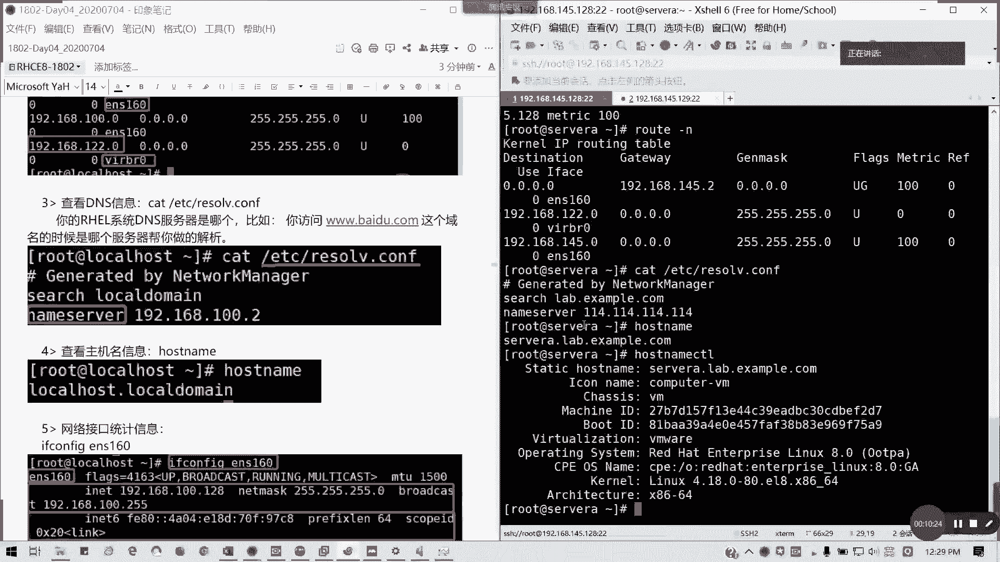

14160。对吧它这里就是它包括啊我们当前的IPV4V6地址以及mac地址，还有它的接收包字节如多少，发送的包有没有错误是吧？这些这信息都统计出来了，还有一个。一个命令叫IP杠S是吧？杠tats。

然后linkso我们查看哪一条链接。比如说我想想我们的ES60也是显示啊，就是它这个时经过网卡的所有的。包是吧跟这个信息跟这个是一致的啊。懂吧？不过现在因为我们就过了10秒的话，它流量又发生了变化。

这包数也增长了。所以的话它会有一些一点点出一丢丢的出入啊。明白我意思吗？网络联通性测试就是拼啦，对吧？我讲讲完这个啊，拼的话，比如说百度点com是吧？更人跟域名或跟IP地址都知道啊。对吧。通常说。

在linux下，它就如果你要拼具体的。那个。🎼次数的话，就后面。不更不个啊这跟windows不太一样，windows默认它会拼4个包，然后就结束。那这里的话，如果不指定的话，它就会默认一直拼下去。

所以说比如说我C3是吧，我就拼三次停。对吧。那我我可以指定我的拼包大小，默认的话，它是包是那个56个字节。比如说你的拼包过大的话，它就会有丢包啦。对吧我2048，然后加上28个字节的一个豹纹头。

那就2076是不是不通了，对不对？懂吗？包括大发不过来啊，它默认ICMP是不是56个字节啊，然后加上包头就是84啊，对吧？应该都知道啊嗯。对吧。所以你包太大的话，你都丢包了，通常超过1000的话已经是。

做不到，对不对？超过签收不到，因为它要加上28个字节的表，一个包头。然后就我对于IPV6地址记的拼6哈。比如说我拼自己。平6。对吧。不是拼四了。拼是拼APP4的拼6啊，然后呢我们可以跟踪路由。

叫做trace pass，也就是相当于我们的微我们的那个。windows吹色。懂吗？我们可以进行一个路由的跟踪，对吧？就从本机，然后一直到我们的目标会经过哪些路由，像no reply代表没有应答。

对不对？然后这样比如说我拼我我到通道我的隔壁的serv位B145。129。

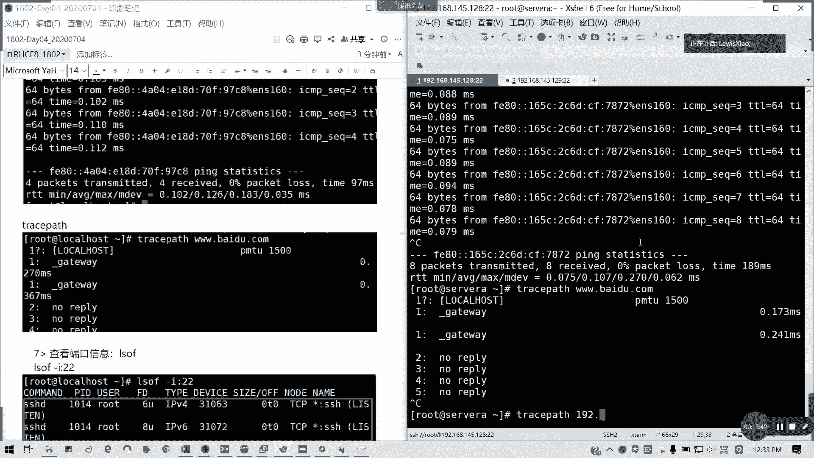

对吧，镂空后死到吓一跳应该就到了。

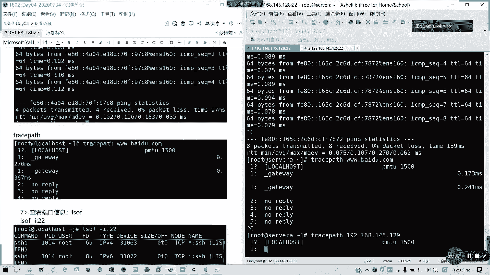

对吧。

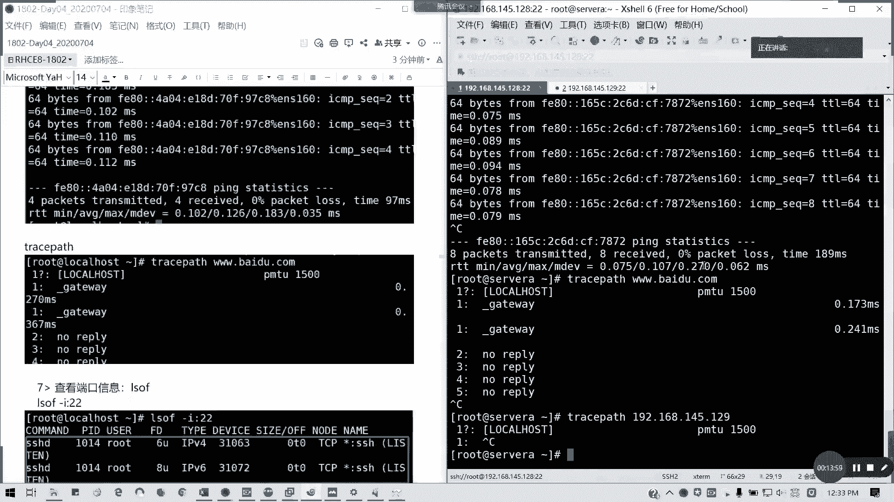

我要ch路ot能不能用啊？以前是可以的，但现在没有这个命令了。

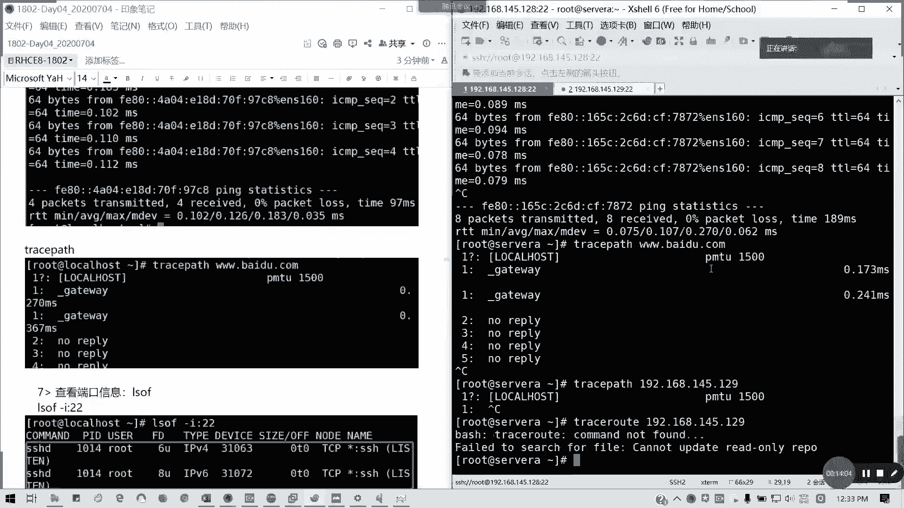

这个七还有吧，八没有的叫tase pass。

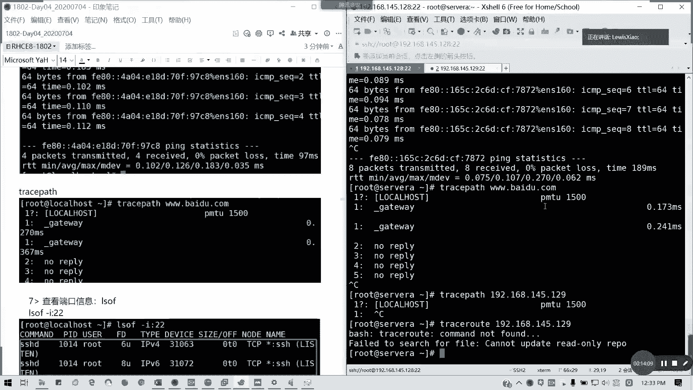

那我们查看端口信息，用LS off。

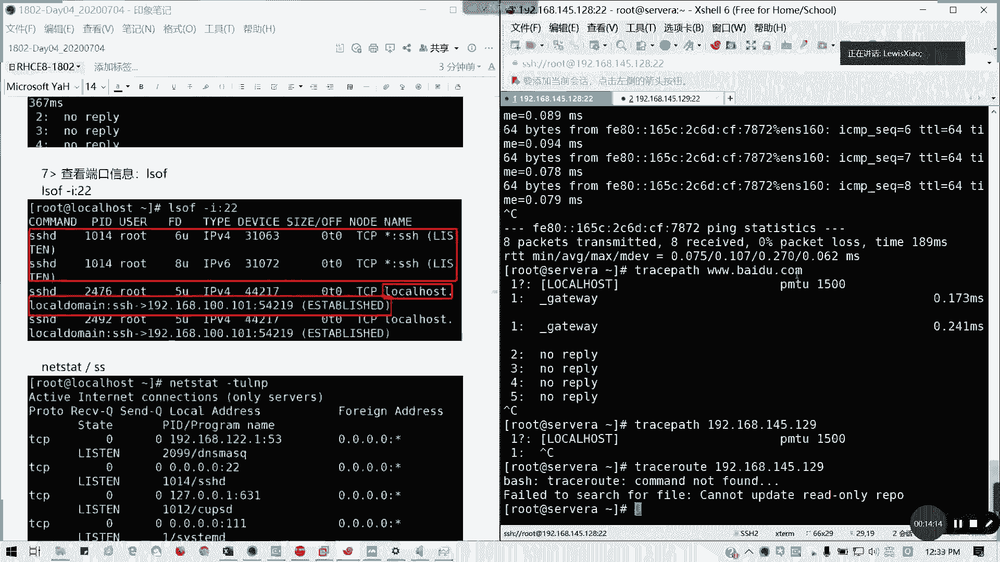

有查看20条端口的。

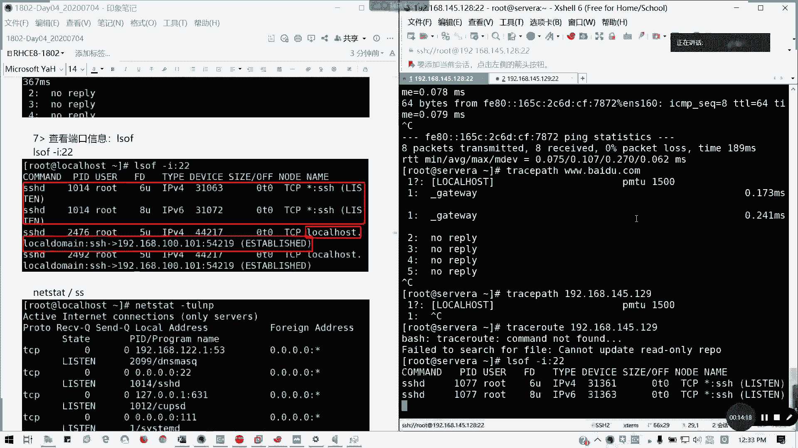

信息对吧。

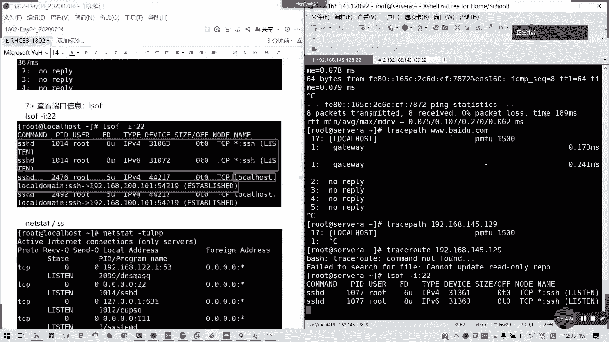

懂吗？查看端口信息，后面杠I冒号跟端口号，然后我们可以用next state查看我们的整个网络连接状态，包括我们监听的状态。nex state。透明该参数TUNLP是吧，就用户哪个用户。

然后根据什么协议，然后他的PID还有他的一个。

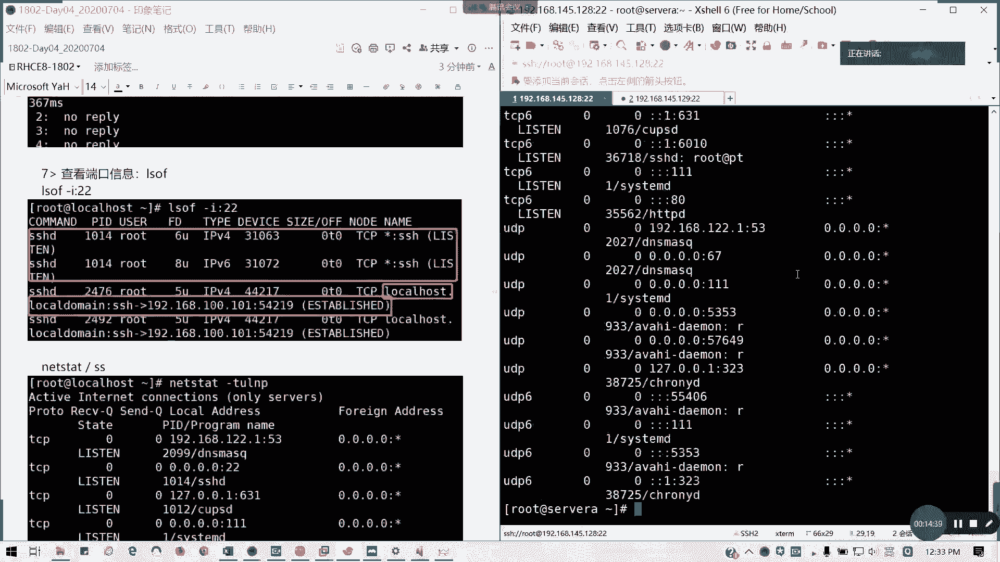

名字是吧，或者进成名字，然后根据哪个从从外部哪个端口连过来，对不对？它还有一个代替名字叫做SS。

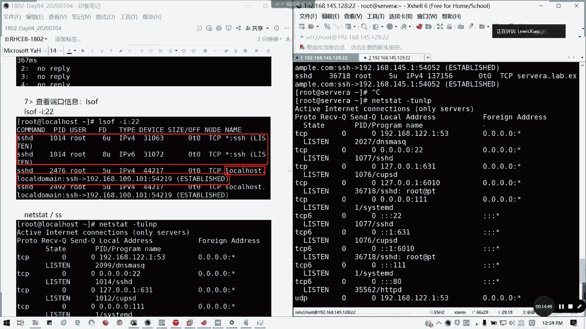

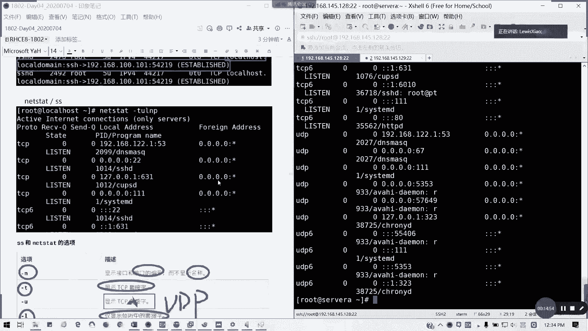

这SS是现在现在新的一些命令，nstate已经是被开始逐渐被放弃的了。SS的功能跟n state一样。像这里的话，它有一个选项的一个差异，懂吗？选项其实是通用的，只不过现在可能更么多的用SS。

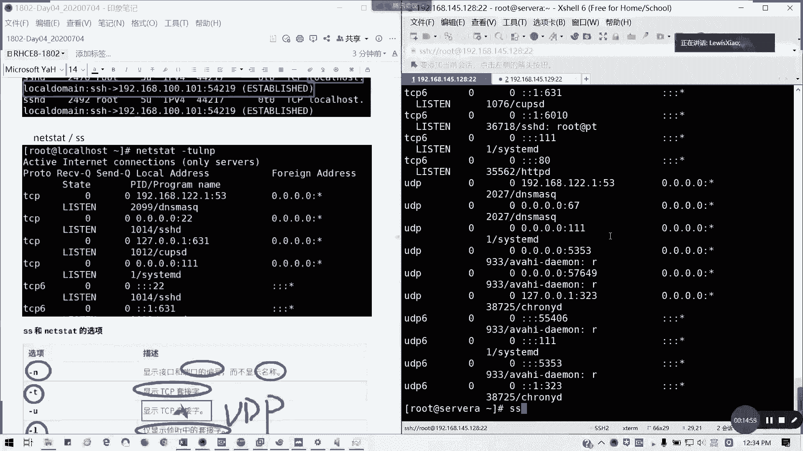

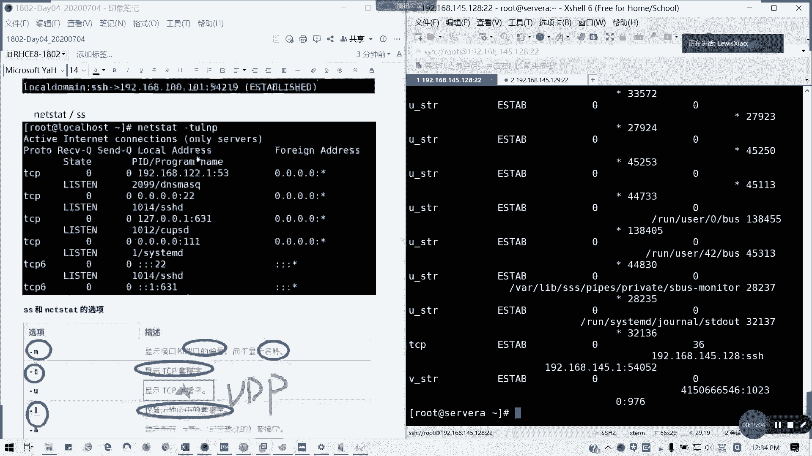

懂吧。那这些就是我们书上这里的话，我们就把TCP改成UDP的套节字，其他没有错，杠U啊。NN NTUPA。NTLP啊，我们通常用这选项通常在这里。那我们先开了一个头，我们下午来讲网络信息的配置与管理。

我们大概现在拖了5分钟，我们下午2点10分。开始讲课，好吧，现在接下来中午我们先这样啊，这个视频我会先结束，然后下午2点10分我们接10分或15分，最多不超过2点15。

我们继续讲如何在红外吧里面进行网络配置。那我们中午的先到这里下课。

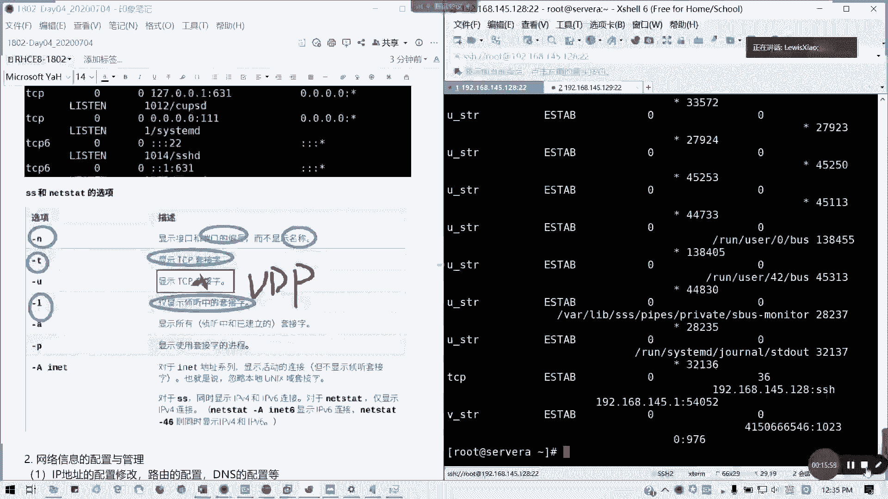