# 红帽认证入门教程：Day04：网络管理基础

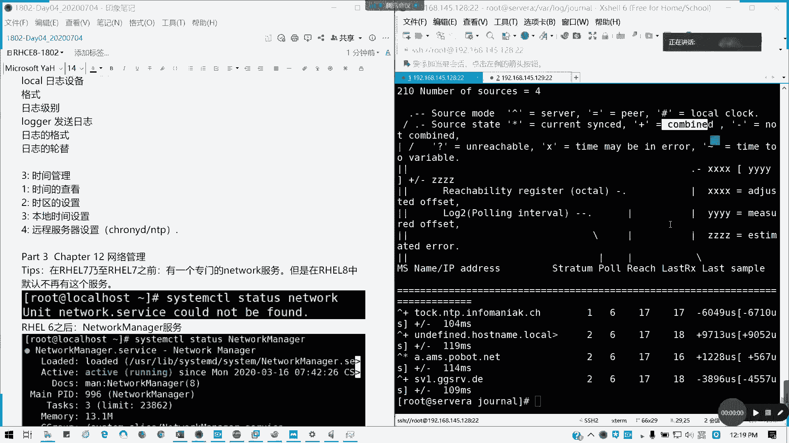

在本节课中，我们将要学习红帽企业Linux 8中的网络管理基础知识。我们将了解网络设备命名规则、查看网络信息的常用命令以及基本的网络连通性测试方法。

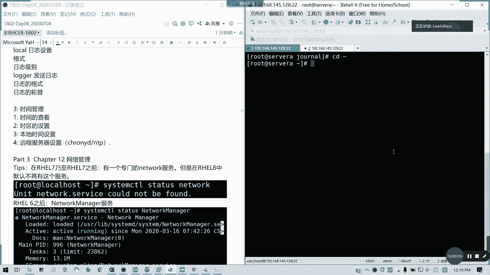

## 网络管理服务的变化

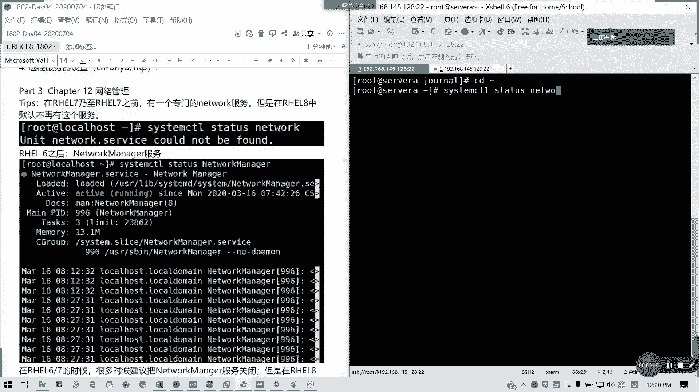

上一节我们介绍了课程概述，本节中我们来看看红帽8与之前版本在网络管理上的重要区别。

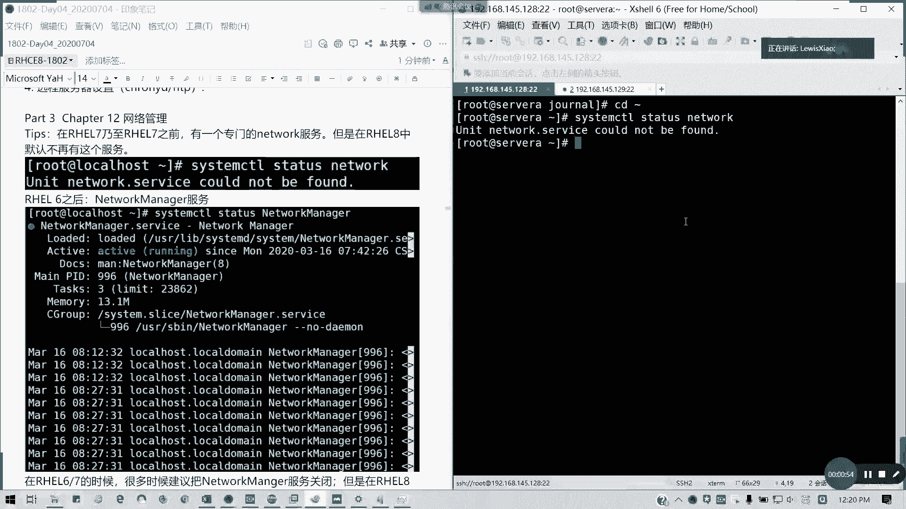

在红帽7及更早的版本中，存在一个专门的 `network` 服务。但在红帽8中，该服务默认已被移除。其功能已完全交由 **NetworkManager** 服务管理。

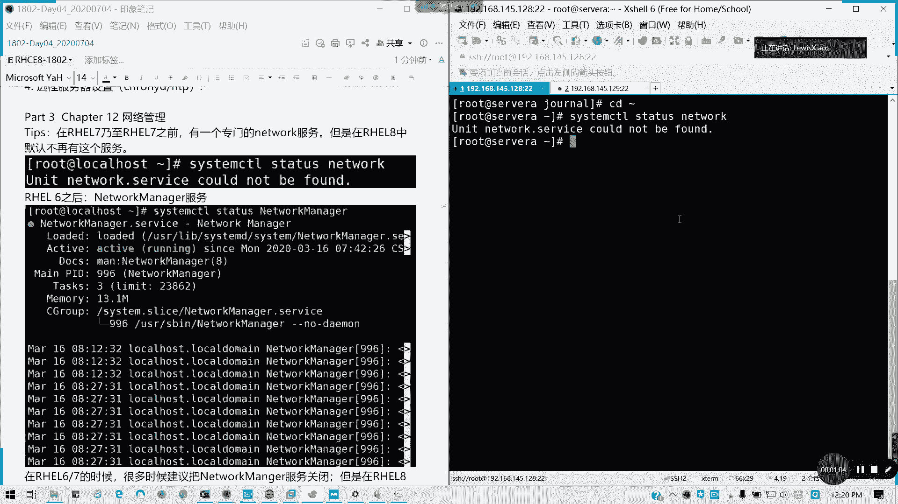

**核心变化**：
*   红帽8中，`network` 服务对应的组件已被淘汰。
*   网络管理权完全交给了 `NetworkManager` 服务。
*   在红帽8及以后版本中，**`NetworkManager` 服务不允许被关闭**。这与红帽6/7中可手动关闭该服务以进行自定义配置的做法不同。
*   虽然红帽8中仍可安装旧版网络服务包，但不建议使用，因为在未来版本（如红帽9）中将被完全剔除。

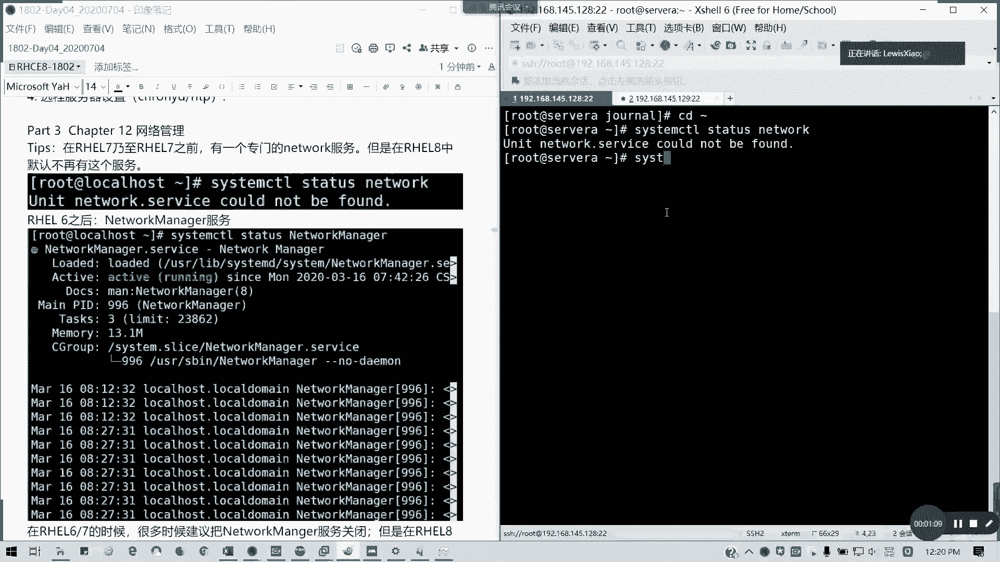

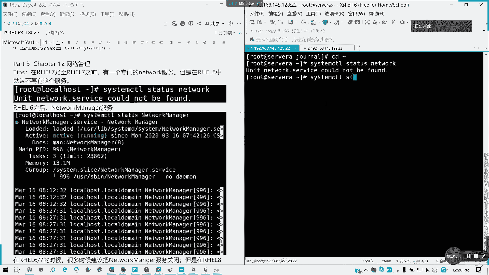

## 网络接口命名规则

了解了服务变化后，我们来看看系统是如何为网络接口命名的。红帽6以前采用 `eth0`、`eth1` 这样的命名方式。从红帽7开始，采用了基于固件信息的命名规则，称为 **biosdevname**。

例如，常见的 `ens160`、`virbr0` 等名称都遵循此规则。网卡名称与类型和硬件位置相关。

以下是命名规则的分解（以 `ens160` 为例）：
*   **en**： 代表 **Ethernet**（以太网），即有线网卡。
*   **s**： 代表 **PCI hotplug slot**（PCI热插拔插槽）。
*   **160**： 代表端口索引号。

网络接口名称以其类型开头：
*   **en**： 有线以太网。
*   **wl**： 无线局域网（WLAN）。
*   **ww**： 无线广域网（WWAN）。

名称的其余部分由服务器固件或PCI总线拓扑信息决定：
*   **o\<n\>**： 代表板载设备，索引号为 `n`。例如 `eno1` 是第一个板载以太网口。
*   **s\<n\>**： 代表位于PCI热插拔插槽 `n` 中的设备。例如 `ens3` 是插槽3中的以太网卡。
*   **p\<m\>s\<n\>**： 代表位于PCI总线 `m`、插槽 `n` 中的设备。例如 `wlp4s0` 是总线4、插槽0中的无线网卡。
*   **f\<n\>**： 如果设备是多功能设备（如多端口网卡），会添加 `f` 加数字来表示不同功能。

## 查看网络信息

掌握了命名规则，我们就可以使用各种命令来查看系统的网络状态了。

### 查看IP地址与接口信息

使用 `ip addr show` 命令可以显示所有网络接口的IP地址、MAC地址和状态等信息。

**命令示例**：
```bash
ip addr show
```
或查看特定接口（如 `ens160`）：
```bash
ip addr show ens160
```

**输出关键信息解读**：
*   `link/ether` 后面的一串由冒号分隔的地址（如 `00:0c:29:xx:xx:xx`）是网卡的 **MAC地址**（物理地址）。
*   `inet` 后面显示的是 **IPv4地址** 和子网掩码（如 `192.168.1.100/24`）。
*   `inet6` 后面显示的是 **IPv6地址**。

### 查看路由信息

使用 `ip route` 命令可以查看系统的路由表。

**命令示例**：
```bash
ip route
```

对于初学者，主要关注 **默认路由**（以 `default via` 开头），它指明了数据包在没有更精确路由匹配时的出口。例如 `default via 192.168.1.1 dev ens160` 表示默认网关是 `192.168.1.1`，通过 `ens160` 网卡出去。

使用 `route -n` 可以以数字形式打印更详细的路由表。

### 查看DNS信息

系统的DNS服务器地址通常配置在网卡文件中，或者由NetworkManager写入 `/etc/resolv.conf` 文件。

**查看命令**：
```bash
cat /etc/resolv.conf
```
该文件通常包含 `nameserver` 行，最多生效前两个条目。

### 查看主机名

使用 `hostname` 命令可以查看或设置系统的主机名。

**查看命令**：
```bash
hostname
```

### 查看网络接口统计信息

使用传统的 `ifconfig` 命令可以查看接口的详细统计信息，包括收发数据包的数量和错误计数。

**命令示例**：
```bash
ifconfig ens160
```

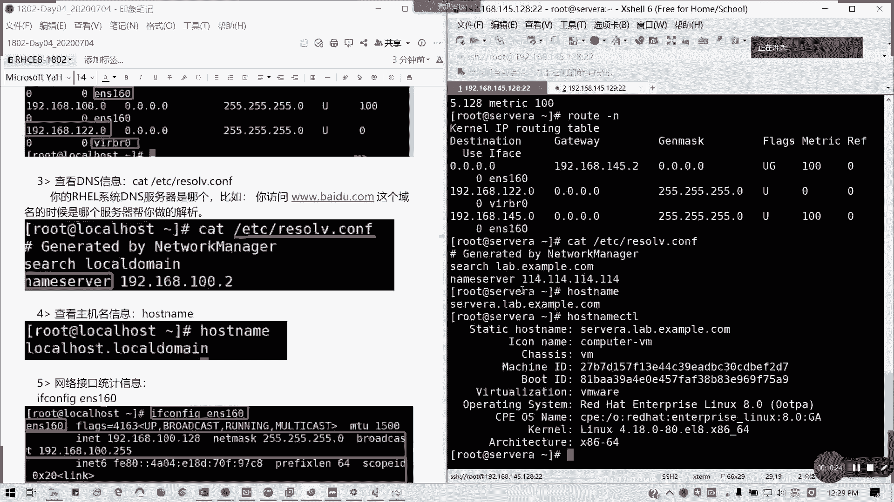

更现代的方法是使用 `ip -s link show` 命令。

**命令示例**：
```bash
ip -s link show ens160
```

## 网络连通性测试

配置好网络后，我们需要测试其连通性。

### 使用 `ping` 命令测试连通性

`ping` 命令用于测试与目标主机之间的网络连通性。

**基本用法**：
```bash
ping www.baidu.com
ping 192.168.1.1
```
在Linux下，`ping` 会持续发送数据包直到手动中断（按 `Ctrl+C`）。

**常用选项**：
*   `-c <次数>`： 指定发送数据包的次数后停止。例如 `ping -c 4 192.168.1.1`。
*   `-s <包大小>`： 指定发送数据包的大小（字节）。默认是56字节，加上ICMP头部共84字节。例如 `ping -s 1024 192.168.1.1`。注意，过大的包可能导致传输失败。

对于IPv6地址，需要使用 `ping6` 命令。

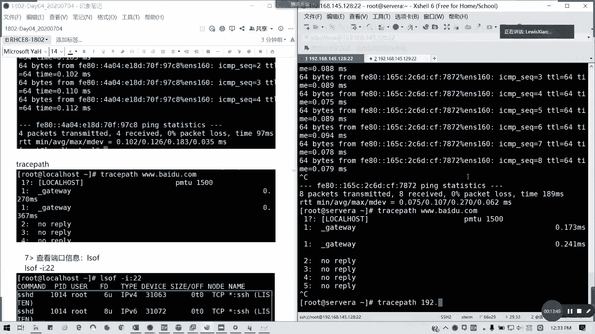

**命令示例**：
```bash
ping6 ::1
```

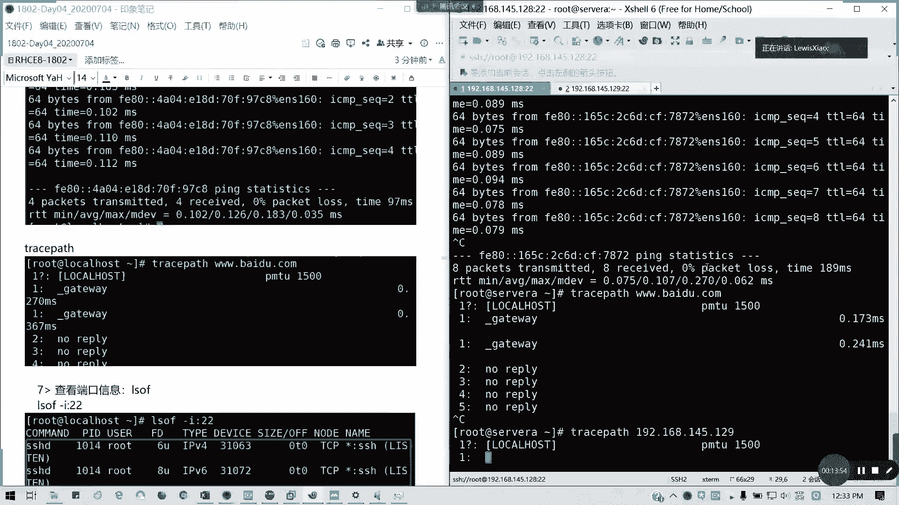

### 使用 `traceroute` 命令跟踪路径

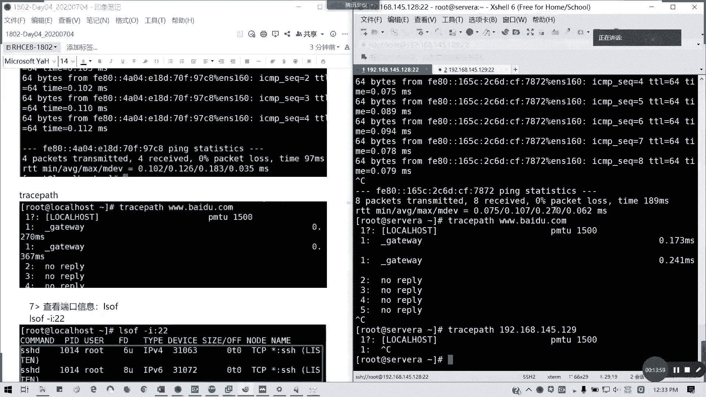

`traceroute` 命令用于显示数据包到达目标主机所经过的路由节点，帮助诊断网络路径问题。

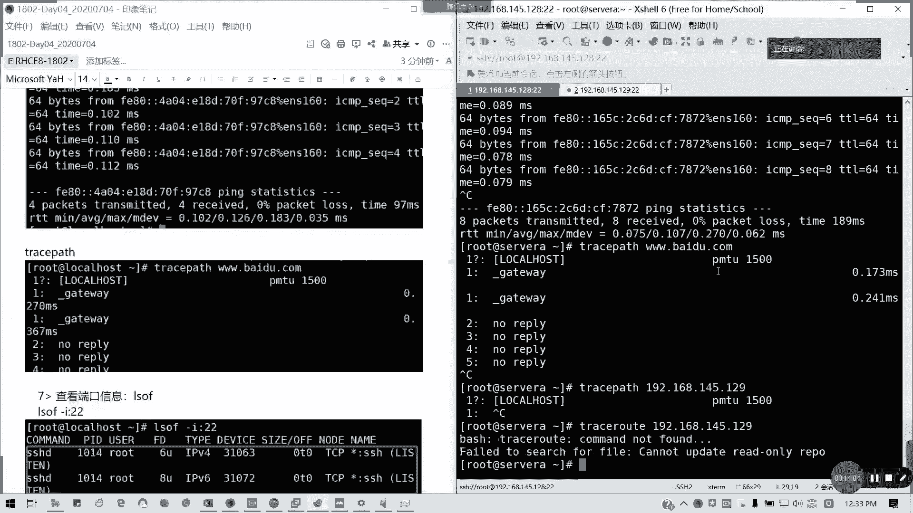

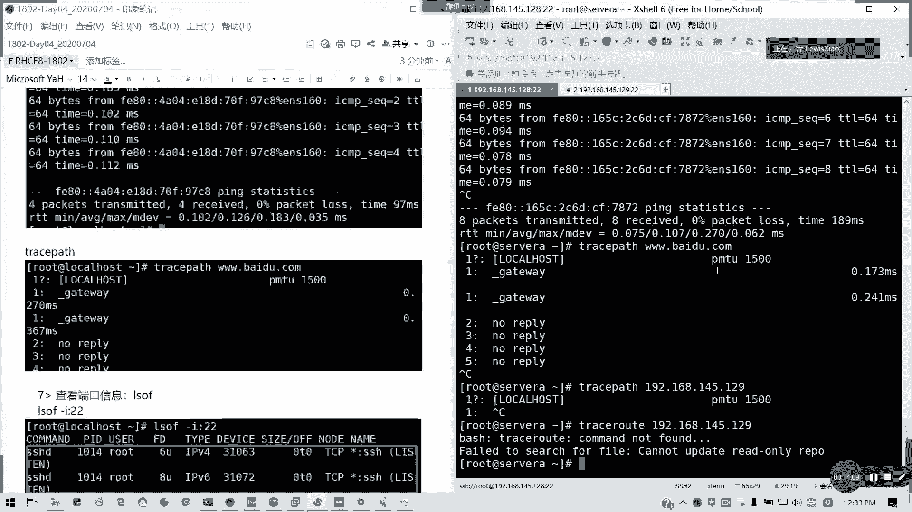

**命令示例**：
```bash
traceroute 192.168.1.129
```
在红帽8中，旧的 `traceroute` 命令已被 `tracepath` 替代，功能类似。

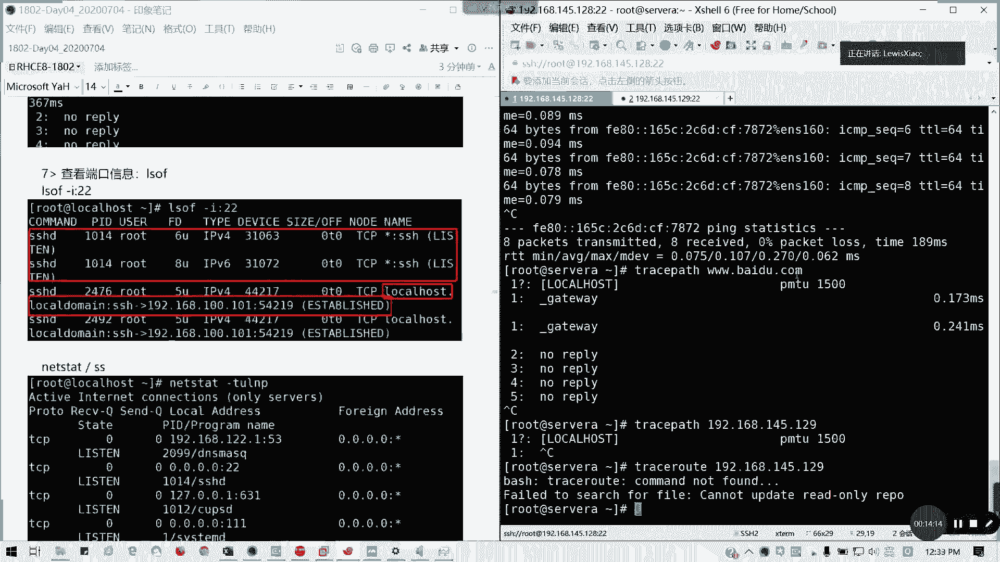

## 查看端口与连接信息

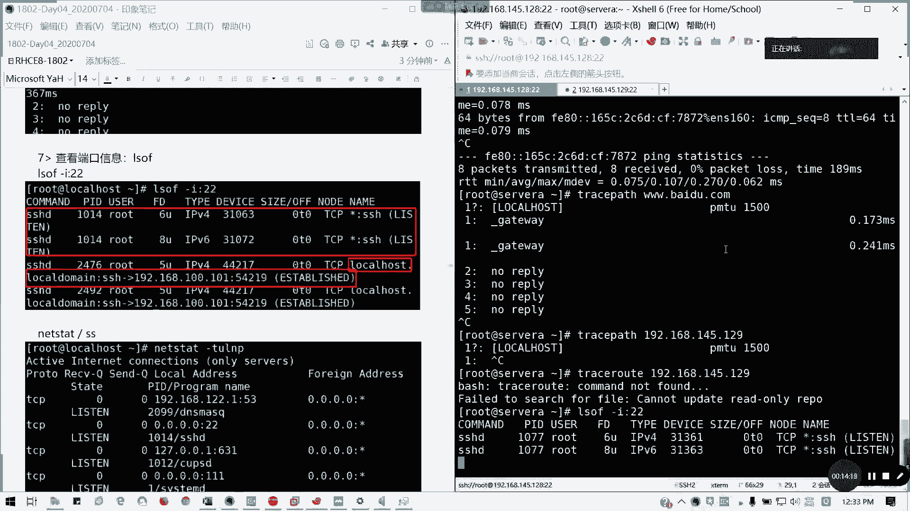

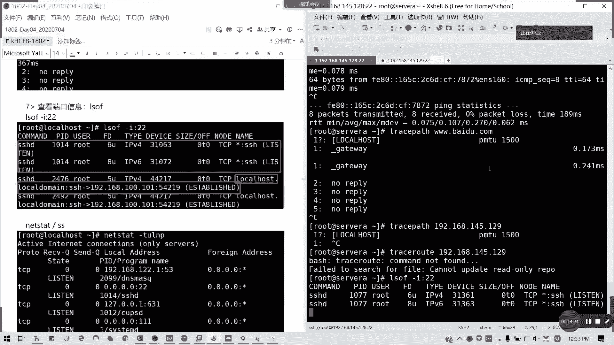

最后，我们来学习如何查看系统上开放的端口和网络连接状态。

### 使用 `ss` 命令

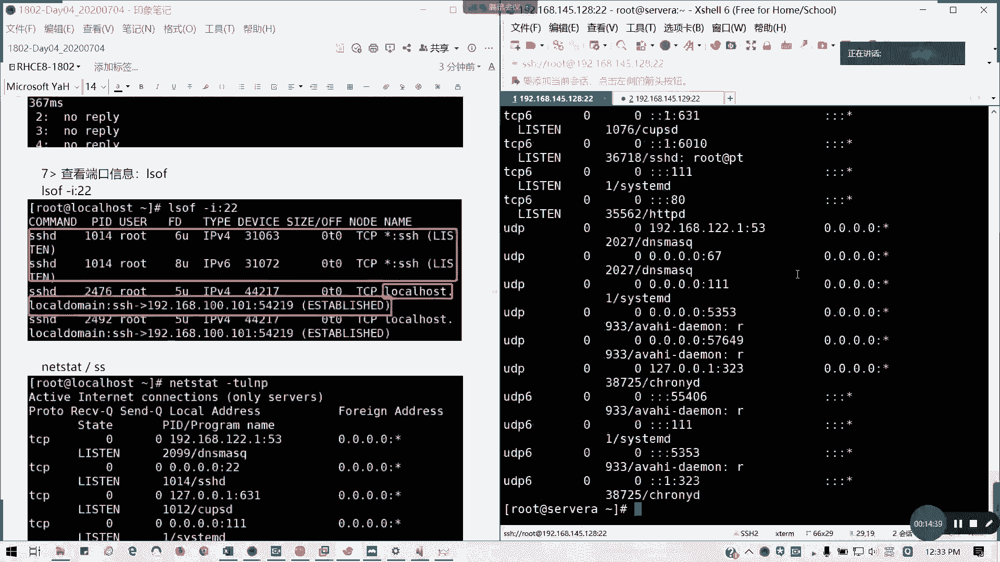

`ss`（Socket Statistics）是用于查看网络连接状态的现代工具，正在逐步取代古老的 `netstat` 命令。


**常用命令示例**：
查看所有TCP监听端口：
```bash
ss -tlnp
```
查看所有UDP监听端口：
```bash
ss -ulnp
```
查看所有连接（包括监听和非监听）：
```bash
ss -tunp
```

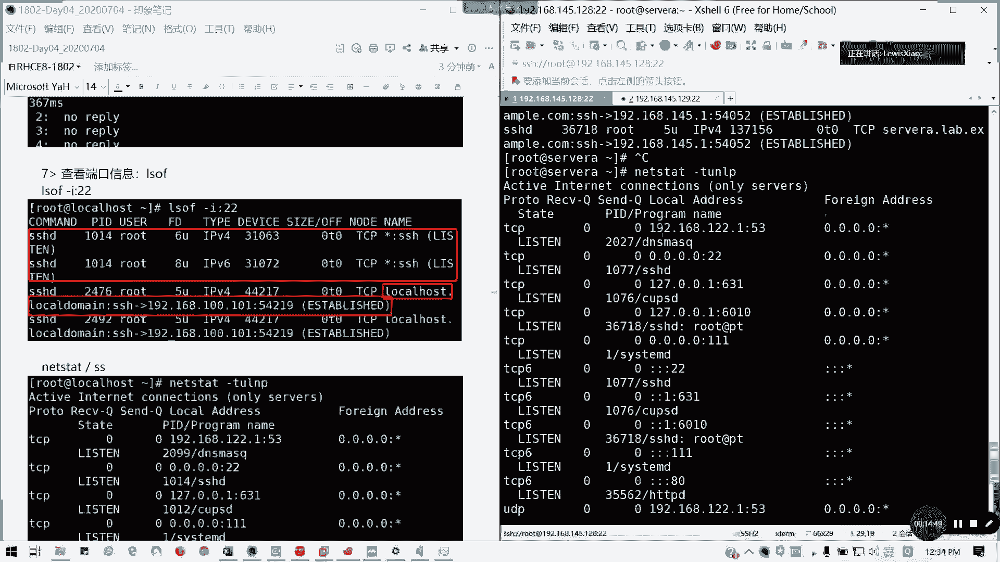

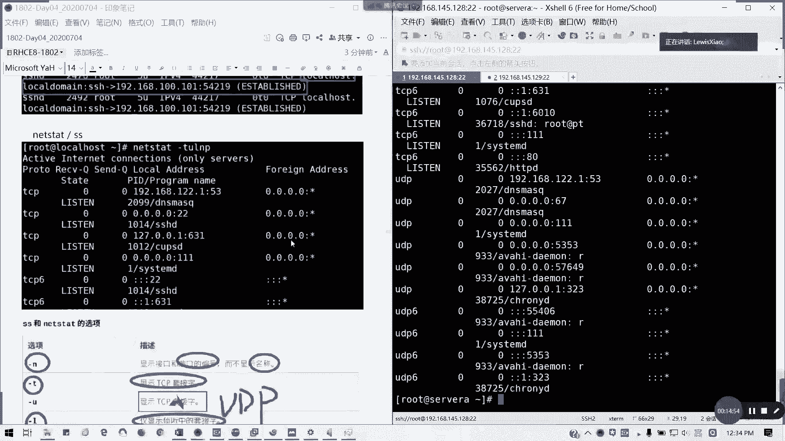

**参数解释**：
*   `-t`： TCP协议
*   `-u`： UDP协议
*   `-l`： 仅显示监听状态的套接字
*   `-n`： 以数字形式显示地址和端口（不解析主机名和服务名）
*   `-p`： 显示使用套接字的进程信息

### 使用 `netstat` 命令（传统）

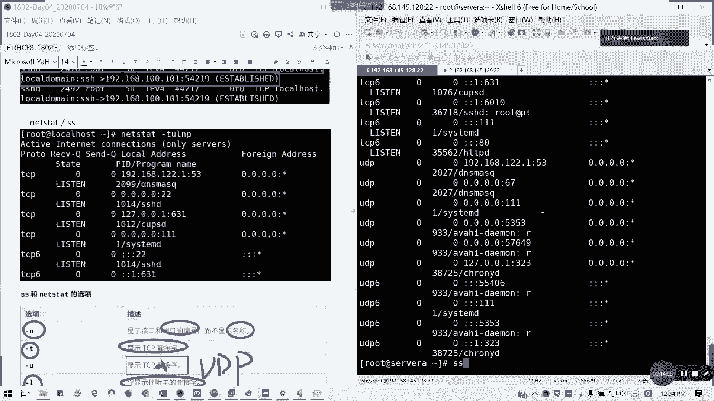

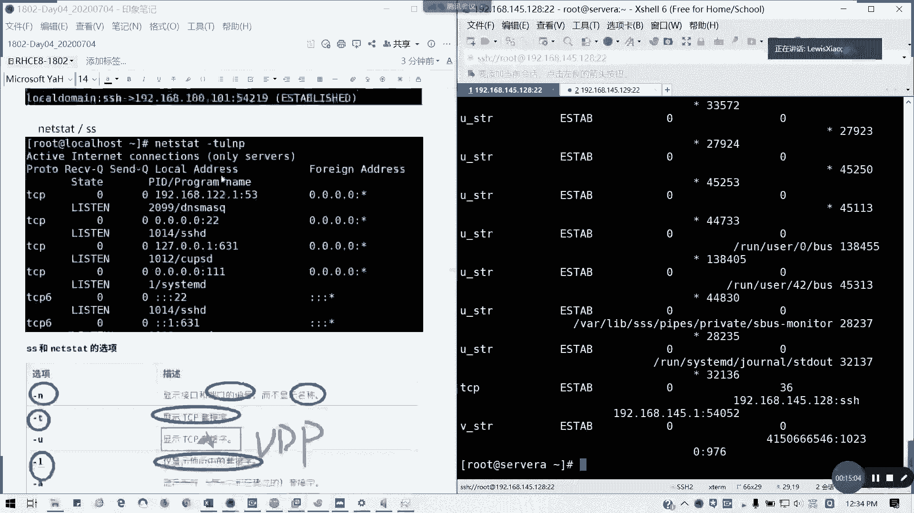

虽然逐渐被淘汰，但 `netstat` 命令仍然可用，其选项与 `ss` 类似。

**命令示例**：
```bash
netstat -tunlp
```

---

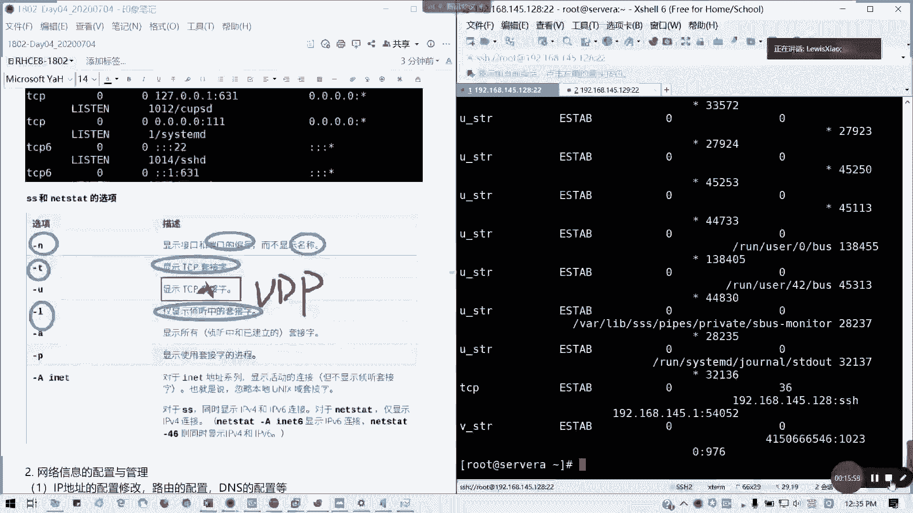

本节课中我们一起学习了红帽Linux 8网络管理的基础。我们了解了NetworkManager的核心地位、网络接口的命名规则，并掌握了使用 `ip`、`ping`、`traceroute`、`ss` 等命令查看和测试网络配置的技能。这些是进行后续网络配置和故障排查的基石。下节课我们将深入讲解如何在红帽8中配置网络连接。