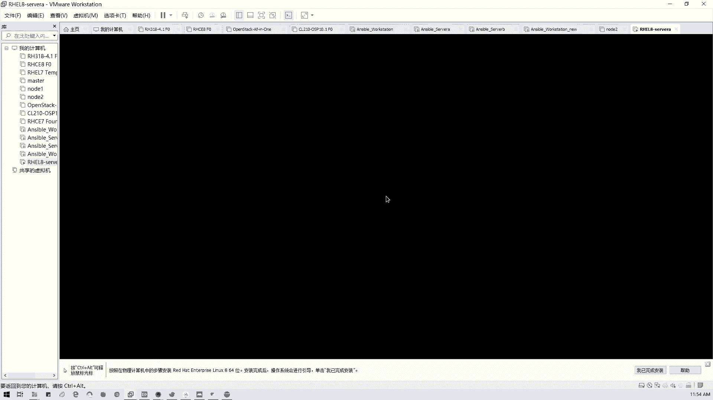
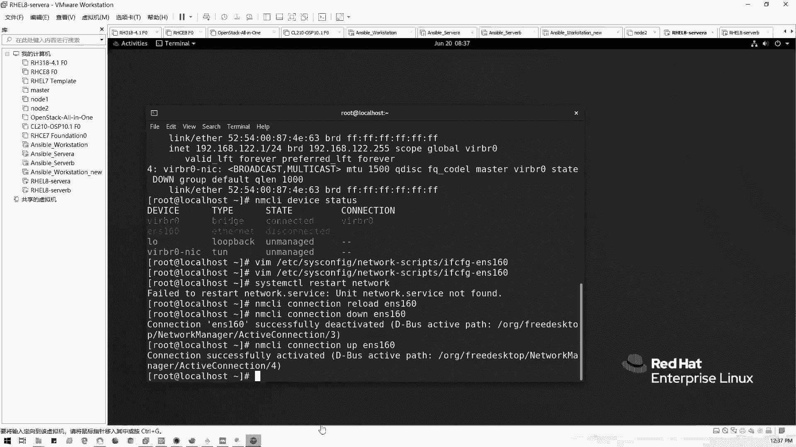

# 2021全新 RHCE8.0 红帽认证入门教程——可零基础入门学习【网络安全／Linux】 - P1：Day01_Ch01_课程开篇及RHEL8.0安装 - IT老表哥 - BV1444y1h7Bx

好，那我们开始讲正课，我们刚才扯了大概半个小时啊，我看一下大家还有什么问题啊。分开报啊，不太好吧。像CAC的话，我给大家讲一下什么区别哈。首先啊我这门课我先那个自我介绍一下，我叫夏若轩啊。

刚才那个然后呢是现在是腾科这边的专职教师，专职老师。然后目前有的资历呢就是HC167，我都拿了CA呢正在考，正在考所现在下面写我有现在正在考啊，我已经正在考。然后呢。

还有就是刚才说的那个好声音的全球二十强啊，麦板是荔湾区的增加赛区的二十强，然后准备在参加试赛啊，试赛，然后呢也是一名党员中大的。非全日制研究生毕业啊，1818年毕业，当时也是熬了挺长时间的对。

硕士有有那个工程硕士学位，然后有目前的话曾经就在那个。在唯品会啊，在那个新一代数据中心啊，还有东方思维，也就是江木集商属下单位。还有一个就是这广州地铁。我都工作过。对，广州地铁都工作过。

所以的话其实说不好听的，我这个人就是天生搞基的啊，天生搞基的，对不对？就就这种，反正你说你家你今天干嘛去上班去干嘛搞基呀，对不对？我们终端运维就搞桌面那些用户电脑，然后搞服务器，这些都是搞基，对不对？

大家是不是有这种想法？然后有人是做开发的，有人是做项目管理的对吧？就项目经理那些，然后有人做测试的对吧？还有就是那些什么管就是那些反正IT的话分门别类很多，对吧？还有然后你如果是比如说这样运维的话。

就基础像我是做基础架构的，就针对服务器存储，还有那个数据库，就是中间建操作系统，我是主要做这块，然后涉及点信息安全，就以前我是做这一块的啊，然后还有人做什么大数据云计算对吧？分门别类。

现在很多现在基本上很多都往自动化云方向跟云方向走了啊。所以其实这一块的话，我我是可以给大家做一些交流的。这样的话，我可能的受知识面可能有限啊，可能有限。但是就是说跟大家一起共同学习，共同成长。

这是我想就是说我们今天这个班，无论以后带哪一个啊，就是那个都是这样一个目的。好吧，都有个目的。然后大家可以叫我小度师兄。因为我想讲那个我基本上我是很喜欢就是说跟大家一个平配的身份，而不是说高位在长。

哎老师啊在哪就叫老师，我叫不习惯啊，是很不习惯。因为我是想就是说作为一个平配身份跟大家一起共同学习，共同交流，这是最好的。然后呃这门课不用担心啊，我因为是我们的那个社招班。

所以呢我会当教大家从零基础开始。零基础开始啊，哎叫我小陆老师干嘛呢？是吧？从零基础开始，就从我们最简单的一个装潢器，然后到我们的命令，对吧？用命令，然后我们VI编辑器往然后各种模块的管理。

然后我们还有一还有现在8。0，还有就是那个。我会结合那个我们运维用到的东西。我给大家讲，因为我是这门课，我是加了我们书本上没有的内容。加了两个内容，一个是链路聚合，网络这块链路聚合怎么搭？

还有一个就是我们的web，就7。0下面的那个一个应用web服务阿帕奇怎么弄？我是加了这2块内容，我们课程呢。这，上面给我定的是13加一天，有点赶，但是没关系，我尽量把东西都讲到位。

然后很多只要至于电子书呢，你们做一个参考，练习可以忽略啊，练习基本上除了ex之外，你们可以忽略啊，除了下午就是我们后面的下午们的那部分可以忽略，就其他的你可以忽略，不用管它。

我会布置我们的模拟考题给你们做练习，这个才这个才是大家是不是要考试的目的，对不对？我们来来的时候，我们都是我要学完这门课，我们要顺利通过认证，对不对？

所以的话我就会把这一块跟我们实际工作跟考试的题目相挂钩，我们学东西我们要到底要掌握些什么？我们要考好哪些知识点，我都会告诉大家，特别现在8。0，因为7。0以前我讲的很清晰啊，讲的太多了。8。0呢。

我是第一次在社招班讲，但是我学校我已经讲过一门课程了。所以的话我会借鉴。当时学校笔记给大家做一个科普啊。我把那个聂老师的开班那个先关掉，然后呢，我们来看一下我们接下来要讲什么内容啊。稍等一下。

我借鉴一下那个学校的一些讲励啊。这些是我学的讲义，到时候我会做一些删改啊，做一些删改。今天是我们的那个第一天的内容。我这里的话。首先当然要知道，很多人我想问一下大家啊。有有那平时啊。我看下1802。

我这己看着会会有点辛苦一点，但没关系啊，因为这。这样笔记但但我其实是导出1个PDF给大家了。因为我是喜欢就是说手动做笔记，而不是说PPT直接念过就算了。好吧？好，我想问一下远程现场的各位啊。

现场包括远程各位啊，如果你们有你们完全没有接触过linux的，就这一块相关的都没有相关经验的，请举手，现场请举手，远程的请扣个N，大门N啊，现场1234个，其他都有是吧？都有接触过，我看一下。

看一下远程情况，请扣个N啊，大门大写的N啊，我看一下啊，完全没有接触过linux任何的东西的。这你们没接触过的，我想问一下，你们是那个循常制做什么方面？驻场工程师驻场，然后接触的是windows多。

linux也有，但是不是很。那你相当于你是接触过的了，对，一点点也算接触过。我说的是完全小白，但你是没有吗？哦。我是当面。导航了。就原来是做什么？机械哇，可能搬班抬抬还估计力气还挺大啊。

像刚才举手那那两问的。现在是。也是在。通讯就监理，就比如说基站搞基站布线。核心网你看高低，就是搞网络这块。其实其实其实呢那没事啊。呃，其实呢网其实呢说白了啊，我们运维啊，我运维里面的话，是还有还有一位。

所说。对啊，所以windows我早期也是这样子一样的。然后呢，后面我是13年我开始接触lind，就1年开始接触lins，然后13年才开始系统学习。所以说我有六七两门的认证，我一开始学HC的话非常痛苦。

你知道当时条件是怎么样的，也是在这里。没录屏。没环境。每笔记全部靠自己。TFT直接飞快打，你知道老师当时第一节课讲什么讲磁盘。很恐怖啊。你对一个没有什么基础的人讲磁盘，然后当时就没办法。

我只能飞快的去记录。然后然后回回家就自己用。那当时还讲6的时候，讲6。0的时候，对吧？疯狂去那列。然后现在期的话，你们这样调节好了是吧？有录屏，有会议是吧？这些我当时我那个6。0的笔记我还带着。

但是我我可能没放在这里哈，对吧？我以前我是有那个就是说等家做好笔记。但我现在我习欢自己做笔记，对不对？所以请大家啊请大家麻烦了，请大家麻烦把自就自己啊，我们在讲这门课做自己做一下笔记。

然后我的笔记只是作为一个参考啊，只是作为一个参考，懂吗？我看到这里导致我能同步吗？我要敲个13的头目吗？呃，这同步不了啊，没事啊。建议大家自己做笔记啊做笔记。然后我讲到那些需要大家实操的步骤，麻烦。

动手不要再看啊，再看的话没有任何作用。特别是啊考试啊，我先想一下课开篇啊，考试的话。我去年我带CT的话，今年会稍微低点。因为今年疫情原因啊，说白了啊疫情原因。唉。月薪不过万，不如去摆摊是吧？然后。

打工十年一场一场空，摆摊三年成富翁，对不对？是不是最近流传的很广的一句话，也优顺狗溜，对不对？那你摆，但是现在确实你知道今今年啊失业的人很多，对不对？特别是我也加入曾经加入失业大军。

从1月份一直到5月份。对吧一从家入事业大军，然后真的是面试的话，老是撞墙，对吧？因为你知道疫情的话，疫情疫情期间很多特别你们有工作，特别是要珍惜啊。因为现在不降薪已经很不错了，懂吗？

很多企业像国企啊这些的话要不就砍福利，要不就降薪。然后如果保住老员工的饭碗，那肯定会被新人下手。无论如何，因为现在疫情你知道，特别是我们IT相关的美国对吧？全球最严重的是美国。

现在据昨天看已经是超过800万，美国已经是210万，对不对？很多工厂学校停课停工，对吧？包括一些项目软件更新都放慢了下来。可能你像像苹果这些公司的话，可能iphone都会延迟发布，对不对？对对对对吧？

还有其他像欧洲都是疫情的正宗。但我们中国的，我们国内的话就还好一点，这已经但是这最近北京都来了。对不对？北京连续3180多例，44天吧。对啊，北京又调调高的到中风险以上了，我们广州对还好一点，对吧？

但是我希望无论如何呢，防疫要大家注意自己的身体健康，防疫啊要做好。另外在家长调胖几斤也好过去外面，你你你你你把病毒带回来，对吧？所以所以现在很多都是境外输入的啊。

所以的话请这里还我小路师兄还是建议大家注意好自身安自身的健康啊，自身健康。因为现在疫情还没过啊，不要到时就放，很多人就放飞了，然后去扎堆啊，这样过好啊，懂吗？不如在家学这种技术啊。

现现在你要拿你哪怕拿去摆摊，摆摊你要会要有一点技能，对不对？要不你就其确实我们人呢要不你就专心做好一件事，要不呢也就全能，就看你们怎么走，对吧？像我们linux的话。

对于我们基础架构运维或者是云计算自动化的话都有关系。因为现在主要是干嘛呢？国产化对吧？windows是美国的东西，对吧？微软的东西它是必源的，对不对？那现在很多国产化的。

你像很多的像GPS像你的车载导航，对吧？像你的像我们的那个安卓手机，对吧？像包括苹果其实都是那个。unice啊，苹果是unixunix的那个圆，然后只不过它是闭源的。像我们安卓这个inux开源对不对？

然后还有我们。公交车那个显示屏，还有那特别是我们中控台，对吧？我们驾驶室中控台，像现在很多的汽车，对吧？中控台都是用电脑化，而不是说以前机械化，对不对？像现在很多linux用的各方各面。

包括我们的那些像那些投我们的广告展位那个广告屏等等，都是采用的linux系统啊，这块用处实在太多，只不过它有不同分支而已，对吧？所以所以的话这包括我们现在自动化云计算。特别是像我们的服务器领域。

我们的生产领域是不是用inds居多？因为windows经常有，你看蓝屏。对吧蓝屏或者是各种假死，对不对？所以windows也有它的用处，就是那些想简单化的。比如说像你搞企业的搞域对吧？

AD域或者是简单的，然后其他的一些像我们纳s存储啊，它包括我们的存储也是用inux系统，对不对？存储我们的控制器，对吗？然后还好好像这种大型的数据库，分布式系统全部是用它。

对吧所以linux其实学好都很重要。以后你的话你C当然只是个基础啊。但是但是后面呢如果你往CA上面走，像我们的呃集群，像我们的那个opent，像openship，这是CA的内容啊。

open ship像我们的那个s是吧？分布式文件系统。还有那种存储啊，还有后面的一些像数据中心用的那些。像这些的话啊，可以简单说一可这些的话，你的CA的话十几个方向呢。我们看到的课程，这里的话。

我们只开语的5个方向。但是呢实际上你知道现在CA的话，我记得啊就当上次你们都有听了贺德贺老师的课吗？就上次的5月份的时候，你们有没有听公开课。有听过吗？像贺老师洪茂的知就是说他的考班，他考他是那个培训。

就是说培训的那个组长，他是就整个大中华区的负责人啊，培训交付的经理，他自己手上有17个ICA认证。17门。基本上是集大成了。像我们的吕就红帽者的考官，我们见到像吕老师，吕旭华老师也是14门。对啊。

像C像这些的话，像我们这里开的是5门课，它有分方向的，有分那个像像C的话就没分方向。我这简单讲一下我们的课程体系啊。CSA通常不单独考。但是这里我知道远程有人单独只学CSA的对吧？就是基础的部分。

基础不单独考，但是考的话，其实你你出拿出去的CSA其实作用不大。CSC呢主要是就是跟70差不多，只过我们把那个。把舍友拿过来。把所有脚本放到CSA里面。原来说是C的那种。然后加了8。0的话。

会加了加了几个地方，就是一个磁盘，它有加了一个叫做压缩压缩的一个video，还有一个文件阵列strs，其他的还有一个调优，其他的跟7。0变化不大。但是它有些服务，你像7。0这，比如说像7。0里面。

你stem controltrol watch可以用的对吧？但8。0你这个命令用不了。因为他内幕服务它是作为一个已定要被淘汰的一个东西了。所以8。0它默认没有带这个服务，那怎么重启呢？我会告诉大家。

对这个是就一其中的一点不一样了，其中一点不一样了。然后它的那个网络的那一个管理啊，那它是强制开启的，不像7。01样可以关闭。然后像我们防火墙发火CMD，它只它得到进一步的一个提升。比如说它可以支持多个。

条件在7。0上面只支持一个条件，我试过了。像这类的话，我们待会再讲，我们看到课件啊。首先linux的话知道吧？我们那个以前啊一开始它是有什么minix啊这些类似的啊。

然后他那个它有一个像现在那个这个这这这个人呢，现在是相当于是在红帽里面。因为你知道18年的时候被被IBM啊被IBM我们红贸公司被IBM已经收了，对吧？全资收购。

然后linux作为一个其中的一个项目一个大部门，所以现在我们用的其是IBM的一个就是他是IBM旗下的一个产品，对不对？然后呢，像linux分类呢，它是有分捐捐就是那种就是说已经捐又知道什么东西吗？

知道GD是什么东西吗？这也能我看能不能百度能不能搜到啊，娟娟优的话，它是一它是一个相当于我们开源的一个联盟哈，开开一个联盟。然后这它是相相当于一个就统一化的一个组织。我看看我这个浏览器。

我我看一下能不能能不能打开。因为这里的网络实在那个有线网络实在就有点菜。所议我们下面有下面有解释啊，对吧不要我看你们是不是有点困了，对不对？等一下啊，我看一下GNU啊，GNU的话是什么东西呢？

这里我我的那个有点卡哈，就有点卡。然后呢。就这个网络呢会有点问题，所以的话稍等一会儿啊，稍等一会会儿。续章好像没有啊。娟U呢它是一它交到一个那个就开源的一个组织，开源的一个组织啊，这里的话画面没卡。

画面没卡嘛。你看到你看到Q群的那个画面证明没卡啊，这里我主要是来娟U，它是一个自由的操作系统啊，我这边可以打开的啊。

资源又是什么呢？它是一个自由操系统，然后它是以那个GP件就公共的啊，公共发布。哎呀，我这个不到底怎么回事啊，这个那个。

好像那好好像那个QQ浏览器，QQ浏览器好像那现在没有响应啊，有点卡了。虽然你哦。主要是fsh的问题啊，ffsh的一个插件问题，它可能就是说它要更新还是怎么样。所以的话我这边你看。就他做这个东西。

🎼可能flash插件需要更新啊，所以的话画面没有卡啊，画面没有卡，我这边的话一直在录屏啊。稍等啊。哎，被格力都去了。🎼画面没有卡啊，正常的。只不过我们现在呢就是在讲那个就是说来龙去脉啊。

检查私分空间520。装不了算了，他他他被那个被惠普的那个上软件隔隔离了。

我看一下能不能再打开一遍啊。GNU是什么东西呢？我我们linux系统呢有分几块啊，一个是GNU的linux。也就是他说的一个自由开源的一个操作系统一个序列哈，自由开源的一个操作系统序列。然后呢。

它就包括像我们的reha，对吧？我们的现在学的红帽，还有stoOS，对不对？stoOS是其实它也是现现在属于一个红帽里面的序列，然后只不过它是作为一个。社区版啊。

对吧，看到没有？它是以GPL的情况怎么叫GPL呢？GPL就是那个。开源的啊就开就那个像在于开源的开源授权去发布。然后他是那个。它的名字叫做居anun no units，对不对？它是类似un。

但是不unice知道，但是闭园的对吧？它是封它是闭源的，所以的话它是不包含任何的代码，只不过它类似啊，就类它是有它是那些就是我们那些软件啊，组件软件，它都是就是说通过我们的GPL去发布的也就是公共发布。

任何人都可以自由在它的授授权底下啊，它是叫做叫做那copy less也就是不存在授权的啊。G啊G就就是说这个对吧？

干楼对吧。ju纽 noeno啊呃那个叫做。它它的话就是相当于啊相相当于开源的一个，然后才有类似的unice啊，然后然后它是有一个叫做啊公共许可证是吧？我们只要遵循它这个约定的话。

我们就可以在上面我们可以开发软件然后发布，对不对？给大家使用，这就是1个GNU的一个东西啊。GNU是怎么来的。对吧。开源的一个。然后GNU的话，像那个我们很多的像GCC啊，我们的编译器啊，是吧？

很多的像库啊，还有核心工具啊，这些的话都是GNU这个去遵循GNU这个协定，然后就开发出来了，这个懂吗？就大概我们讲一下这个只做一个概念，做一个了解就行了。因为现在确实那个比较卡，所以的话我们回到这里来。

像我们捐 u list包含什么东是包含什么呢？

GNU的linux包含像我们的红帽，我们叫。广贸企业版对不对？我们简称是rehead enterpriselins，对不对？红茂企业版我们简称叫RHEL，但有些老师会读成real，对不对？红茂企业版。

还有呢。我们的社区版社区版现在其实也是红帽管理的，只不过呢它是一个就是不带任何订阅的，对吧？完全开源。然后然后呢，它的代码呢，它它也是它转信包是通用的，我们叫stoOS，对不对？

是吧community enterprise operating system对不对？社区版本，这是免费的免费的。但是呢就是它不提供任何的一个技术支持。这是centtos。

大家企业里面通常为了避免这版权，因为红帽这个呢，你要大规模使用，你要去你要去买它订阅的，对不对？但是很多人都内部使用都没关系啊。红帽相对稳定一点，因为它主要是半年一发布stos的话，它现在也是遵循这个。

但是它的软件包呢可能就会有一些像测试版啊，这些都会发布出来。但是红帽的话套通传招是有稳定更新，它才发布的。然后还有就是我们个人版的叫dora。对吧。多ra这个是也是红帽的。

然后它是它是用在我们PC机上的对吧？比多。然后还有呆扁这呆呆扁系列是吧？呆扁系列我们用用比较少，像我们的U盘图用的比较多。像比如说我们的刚才提的。US对不对？深度的。Ding系列。

还有我们的是怎么现在大家玩的比较多，像我们PC上能玩安卓系统的那个叫做finix啊，对吧？我们的凤凰系统啊等等，这些都是用U般图去做的对，U般图去做的。然后包括像我们说我们的安卓系统的话。

也有可也有一部部分啊采用的U斑图。其实它都是linux里面的啊，lininux。你们特别是如果早期的，我去试过工程模式，我手机上我是能打开lininux的命令行的。没有问题的，早期的版本。

现在的话它封装比较好，所以说就没有这个问题了。然后好像minix就是早早期他们的那个造教学环件，但现在基本上少用，还有那个什么open sales啊，对吧？SUSE对不对？知道吧？

然后像ve尔ve尔它威尔那套那个hviser，它那个数主机其实也是采用它的，只不过它是用作二次开发之后作成一个虚拟机一个容器，一个底层，对不对？也是采用它。然后呢，这一块我们就linux这个知道了啊。

它这这个这块知道我们开篇跟前面两部分应该都知道了哈。然后呢，学好linux的重要性啊，像这里的话，我们讲的它跟编程的关系。对吧像有些人就是说编程的话，我根本就不需要懂这些，我只要懂开发就好了，对吧？

但懂开发也不懂信用管理的哦，相当相当于你在纸上谈兵。懂吗？空中楼阁对吧？然后如果像那个只会系统管理，不会编程的话，就是人物化运维。我这里把需要去掉。因为我们之前我在讲这门课的时候。

我们是跟需友连在连在一块的。但是说我们就讲开发跟我们的运维的关系，对不对？只会开编程，不会系统管理，那就是空中如歌，我就纸上谈兵，对吧？我就跟我就知道哦，我大概我要怎么我要开发什么功能指导。

我我要我要寻现什么功能，但是你是没脱离了现实。懂我意思吗？然后呢，只会系统管理，不会编程呢？就是我们人肉的手工的运维。如果两者都会就是自动化。所以我们其实现在像红帽八，我们现在讲到红帽八。

我们现在是因为它已经。方向已经变了，以前是服务，对不对？我们是你们如果看到红帽期，你们看到网上一些教程，是不是他后面都是讲服务。那现在的话我们是偏向于自动化。就让我们就我们你我们说服了啊。

以前我们是不是一个人只能管理一台机器，而且时间会很很非常久。但是但是你学的自动化之后呢，像我们下下午的ens伯就是这样，就下午我们下午就是后面第三门课程的s伯就一样。如果学得自动化运维呢，你一个人。

你可以通过一个节点管理10台百台上上千台，甚至是一个数据中心。对吧所以现在红帽它也从18年开始，它的方向已经发生了转变。从我们传统的服务过渡到策换原。所以它话8。0。接下来我们讲到8。0跟7。

0有什么不同？对吧8。0是要新的我们这里摘了原文的一个翻译啊，新的考试呢这是8。0的考试。它是针对一个系统管理员应用enssible跟需要脚本能力，对吧？原来是考服务的，对不对？

然后原来我们课程叫代码叫奥5斯，对不对？我们2547。0的课程呢，我已经讲完了，然后考试的最后时间是8月1号，但是8。0呢是从去年开始开考8。0。所以大家学习这个是正合适的啊。

就我们转变一下思维到自动化这个层面来。但是很多基础呢还是相通的。254的课程将会被linux动画取代。然后我们的299还有1个299啊，这个lab课程它都不更新。但是299这个我们不会讲不会讲到。

然后呢，没有变化的部分呢。大家还是需要拿到HCS的到CE。所以的话我们考试啊，到时我们学完之后大概考试有有连带考前辅导，然后考试大概就在你学完课程的大概一两个月后。一两个月后啊，时间是差不多的。然后呢。

要先考取基础的，你才能拿C1。所以的话上午千万不要挂科。真的有人上午挂科下午拿考过了，然后结果他一个证都没有，因为我们是没考完一门课，它是有一个认证的。然后对于I来讲，现在都是电子化。

都是你考你考前先要这红帽注册一个账户，然后你考过之后，他会就他你不认为获取到一个红帽ID吗？红帽ID通常是年份，对吧？比如说今年是200，然后后面就是你的那个证书编号，然后你有这个证书编号。

你会你如果考过的话，你会下载到相应的一个证书啊，要相应的证书，证明你有这个资质啊，当然以前当当然它是以前我们是有纸质版，但现在没有了，全部是电子化。但这个就相这个红帽是相当于什么？

相当于我们的一个职业认证。

职业证证就是厂商考技能的。然后专业证是什么呢？就是我们的软考，就是那些评职称。所以这两两个要稍微有点区别啊，职称比如说你的中级网络工程师，像高级项目管理师，这些是我们叫专业认证。

这是我们凭职称去凭什么那个。评高工啊，评中工啊，就是那些国企私政这些的。然后对一个厂商或者是外企私企这些。很更多的看重文的职业认证。职业认证，也就是我们真正的掌握了哪个东西，而不是理论，懂吗？

但是我希望大家两个都相结合。因为我也是中级的职称，我准备考高级了，对吧？我中级网络工程工程师在学校考的，然后现在也有，然后我们的那个职业认证，我也是中级，然后现在在考CA现在刚学了两门课程。

确实有点头痛啊，就。也没关系啊，就我们从基础慢慢学，然后依然百分之百是实操。所以。我为什么说CSA有些练习没有用？因为他的课户练习，你们看到电子书了吗？看到电子书的话，很多都什么选择判断有用吗？没有吧。

考试我们在广州的话，课考场就在隔壁的12号课室。那里摆着二三十的电脑啊，全部都是I77700内存32G，然后一个然后还有一个固态硬盘，考场就在旁边12号课时，大家待会有空可去看一下。对。

每次我们如这里的话练习机器，包括考场都在那边，对吧？都在那边，然后全部是裸的，不是像我们VM的这个环境啊，全部是裸的lininux环境。纯因子环境，然后在那那里考，然后考试呢对吧？

依然是百分之百百分之百动的实操。我先说一下HCAC考试依然是两个半钟头，上午的两个半钟，下午HCS4个小时。考试时间4个小时。但是通常说像你知道像我以前学就讲7。0的时候。

有些学有个学员他是从这里从零基没什么基础的。你知道他后面他分数一科是273一科是281。他早上他练了不知道几十遍，他下午告诉我他自己在短短两三个月时间下他练了足足练了108次。36天时间。

就我讲完考前破导到他考试时间总共36天，练了108次。108次，然后他基本上上午40分钟完成所有的考卷出场。最短的时间目前我听说到最短的一个时间，我们日常人如果够熟练，练了10次以上一个半小时。

他能够40分钟。下午通常我们。我们当时7。0不3个半小时嘛，考内服务的。我们通常呃2个2小时，45分钟到3小时，他多少80分钟。85分钟还是90分钟，他告诉我。一个半小时能做完错的题目。

而且就基本上没什么错误，就错了一丢丢。然后我之前带过学生，因为我们ISC我们现在呢改革到8。0。还是300分满分。300分就210个，你们都知道吧？考试啊，我先给给你们打个预防针啊。

每一个科目300分满分都是实操题，没有选择判断，全部都是给题目，然后上机实践在虚拟机上做，然后做完重启验证，你正常，他会留个自动评论系统，然后他就他会自动导出分数，然后给考官。

然后考官收完信息之后发邮件给红帽。然后红帽第二天会发给你成绩，然后生成证书，这是整个流程。所以我们是考完再考就学完，然后有给大家一段准备时间，到时是因为红帽考试现场考的，就每个考点。

特别是可能全国各地呢，广州呢就在的门诊科。然后呢，全国各地可能就是要咨询一下你们的那个咨询老师才知道啊。然后呢，考试就是进去，你带身份证。最多带一个鼠标，有人还带键盘呢。考场的鼠标不好使，我是知道的。

可以带鼠标，然后带身份证带鼠标。带一支笔纸不能带啊。他有草稿纸，纸不能带，然后你的笔记你这些包全部放在我们这些课室，对吧？准备课室。然后呢。进去之后登记登记你的信息，就是你的那个ID现在他要求提前注册。

我们以前不用啊，提前注册你的红码ID你的名字，你的邮箱，然后勾选那个前限考试协议之后，然后就开考考试考官一整定下，然后就他就有一个。环境一个真实例环境，然后有一个网页给你看题目，然后题目还有倒计时。

然后旁边就是你自己做的，全部操作都在虚拟机。但是有人还竟然把目题动了的。物理机千万不要动，包括将来我讲那环境的时候，物理机你们千万不要动它，我们任何操作都在虚拟机里面执行。对吧然后可以重置。

可以那个重启，这些都行。但是有人就是偏偏做完就起不来。对吧所以有些东西呢像我们讲的一些操作是要重启去验证的但有些人就偏偏就没有做这个论，然后结果。2CC0分。我可以告诉大家，上午虽然简单，但是零分难。

零分容易满分也容易。我说我说上午的CSA就是基础操作部分。很多题目啊，很多我们考试题目都是一句话，一条命令，两条命令可以完成的。可能有部分题目可能会步骤稍微多一丢丢。对吧但是为什么你知道为什么会离婚吗？

你你们说一下。零分要不就信统起不来。要不就是你的网络密码没有配对。对吧连不了网络。机器你连不了啊，对吧？连不了网络算零分的，你的密码一开始会要求你破密码。你的密码没破也是零分。因为你达不到。

他登不进去你的机器啊。懂吗？它的凭卷系统也要登你的机器，就他在后台登你的机器去验证的。所以你这些，然后包括你的系统起来之后，你引导不了到正常的环境也是零分。相当你白考了。

然后300分满分210过0分跟209分没有任何区别。你考不过就要补考吗？补考的话，像C1的话，像CSA7。01500块钱。1500。C1的话当时是200，但是现在好像到C8的话。

好像是要4000还是多少？对啊，三四千块钱。然后呢，CCSA的话好像是1000还是10500，我忘了，就新的价格我不知道啊，可能你们老师会清楚，但是我不希望我教的学生，我教的学员出去之后可以告诉我。

师兄，我这两这两个月啊，我们的14天啊，教完之后我还是学不会。不要告诉我这个哈，学不会只有你自己的原因，就是你没练。或者是你课堂里开小差，好吧。都是重实操的啊，不是背了就有用的。

有些人像有上次有一个我在讲在那个两一周前，我讲C1的最后一次考勤辅导，C17。0的考前辅导，真的有学生一天都没学过，然后直接来报报考勤辅导的一堆问题。连连建文件家都不会。连创建一个文件。

再配一个网络都不会。然后天天问我被烦我被烦的要啊，就天天帮他解决问题。对吧所以所以这但这种也是作为我们我们作为讲师，啊，我们还是服务还是要到位的。但是希望大家说从零基础，哪怕是零基础也好，麻烦啊。

麻烦大家学好啊，动操作啊，这样就是说自己操作啊，像我们这里的话，你看我举了一个例子啊，刚才讲了是吧？我的网络服务是吧。6。0我们是INIT对对？对吧IID服务如果大家很多现在抢都企业还是在用六的。

5的话应该应该五以前很少了，很多企业还在用六的，然后七的话也不少，但八的话还是比较少啊，相对比较少用，基本上没没怎么看到啊，像六的话，我们重启服务是不是那个ETCIIDD是吧？两种方法都可以。但七的话。

这个还可以用，但是它已经过渡到system controll了，因它service这个已经没有了。然后8。0的话，你们自己想一想。我刚才说nwork的服务已经不能用了，默认它不装，那我们怎么去重启服务。

这是8。0跟7。0的区别跟以前区别。所以这个你觉得你们大家觉得我们有有没有必要跟大家讲？我要先讲区别，然后先把你们这个区域定好，那我们才知道我们要学的是什么啊。然后还有就是我们的。样员对不对？

我看有必要哈。是这个的话就这个我删掉啊，因为因为这个的这块的话，因为这是给学生的啊，这个学生我会把它删掉啊。这这一块的话。解学生的我就删掉。但是我这里的话下面是一样的啊，像这里的话，我们的那个样元是吧？

大家都知道软件仓库对不对？如果你有接入软件仓库，但是到8的话。我们换成叫DNF不是地下城与勇士那个游戏的DNF啊。也不是我们直接普通话译过来，这叫毒奶粉啊，有些人叫毒奶粉的，对吧？

DNF它是一个部署的一个工一一个工具，净化了一个样嘛啊我们后面讲到毒奶粉的时候，我们会说好吧，在在第14章第一本书第十章，其实跟样是共通的。但是它多了一个功能叫就做模块化安装，也就我可以自定义版本。

这是8。0的DNF跟7。0的样最大的区别。他就可以，以前我们是装哪个版本，就是哪个版本最新度最新对不对？但它可以定义。比如说我pyython是吧？我的我的python，我可以装2。7，也可以装3。6。

对吧我的那个那posage circle对不对？posage circle是数据库，我们可以装9。6，我可以装10。在8。05是可以这么操作的，但在7以前是不行的。这是最大区别有有疑问吗？

然后刚才说的啊。这是我刚才讲的，我刚才花了半个小时。给大家的一个建议哈。给大家一个建议，这这是也同样也是给。就是说给各位啊给各位的一个建议，这是我当时给学生讲的这个问题，所以很多人又在又在修家产。

就修自己电脑怎么样，对吧？但这个。我们最低是8GB起步，但是我们因为涉及到anible啊，我们这里open set我上了open set要求要32G的。我后来才了解了理解啊，我们CSA呢。CSA8。

0系统管理的课程最低要求就是8GB。啊，就是我们讲前9天课程，8GB足够。然后后面我要这样enserible我16GB。然后其他硬盘的话，建议SSD啊。然后如果前期如果你们在家有的话，可以外接一台。

那会接到什么好处呢？我一边这边一边看，我那边可以操作。做的很好。对不对？然后呢，CPU的话其实现在很多都可以的啦，对吧？CPU基本上过剩，我们不了解。然后如果大家有虚拟化底层的话。

像这里的话最低量版本15。1啊，通常我们直接。上15。5吧，最新的话是15。5。6啊。修复的时候有问题，然hperviser的6。0U3不知不一定能装，但是6。56。7是肯定可以的。

现在最近好像去要7了，对不对？然后我们的wi highlinux8。0的版本，现在最新好像4月18号也出了1个8。2。对不对？然后好像CSOSS它是要晚半年才发布的，它现在好像有一个版本叫做8。1。

2003。220年3月份发布的一个新版，对不对？是有的吧。我记得有啊，我们在那个开开源经量站，好像网易我是看到有这个版本的，懂吧？然后这个foundation0呢，我后续我会给大家，大家也有拿到了哈。

大家都拿到环境。但这个环境我们先不要动，好吧？先不要动。然后我们接下来我们会教大家怎么装，我们还有一个小时啊，像我以前讲的那台电脑就是这样子。我之前讲的那和一平板就是这个配置。

I7850跟你是那个差不多，内存16G。当时你知道我还是板载，我是整个主板都换掉了。花了我4000多5000块钱。原来是8GI5的，然后因为它是固化的，我就去联想的那个售后，我把我让他整个主板换掉。

我刚才那刚当时那个主板也是有问题的，我就换换掉整个主板4000多。那后再加一个硬盘5000多。花费很大。像像刚才说的啊，就是这硬盘参数不用选了吧，对吧？硬盘参数大大家的一个就是说硬盘。

我们SSD跟机器有什么区别，这个都懂啊。很直观的，你像几十倍速度啊，对吧？现在发展城市新为，你还你还在用机械硬盘吗？对吧。好，那我们这块哎给人了是吧？好，可能来如果没凳子的话，可能拉一张凳子过来啊。

就坐在你坐在他旁边。呃，远程有，但是你你是远程人面授是吧？为什么？出差可以啊，到时候我发会议号就可以了。你可以跟聂老师那边说啊，聂老师那边说，然后呢，到时远程的话，就你麻烦你要自己练一下。

因为远程我不知道你们情况的，现场我还知道一远点啊，像刚才讲的我们的开篇的内容啊，开篇内容。没有认可。对对对，这里把包拿开，然后给他在他做一下。你的位置拿过去吧。如果刚才讲的东西都明白，理解的话。

我们概念性都理解的话，麻烦在群里面扣个一啊。现场的有没有问题没问题，可以举手。刚才讲的东西啊，一些开片的东西没问题，可以举手，没问题，是吧？都没问题啊。好。那我们接下来我们来简单讲一下啊。

这里的话我我一个回顾啊，就是说回顾的话，我们相当于我们要把那个。我们做一个回顾啊，我们把这个笔，我们把那个继续贴一遍。对吧刚才我们讲到的第五点，然后第六点我们就是那个。火贸认证体系啊。

就刚才刚才我们讲的这一块啊，就是我们第四点的补充啊。大家看了啊，我刚才有讲过的。是吧我刚才是不是讲了我们8。0要考什么东西？有没有讲？搞什么东西？主要区别就是自动化运维。然后至于CSA的部分。

我们加了一个脚本shall脚本跟系统调优。还有一还有一个就是我们新特性，比如说像我们的磁盘是吧？加了一个层层级的系统strs，还有我们的可压缩啊可压缩的一个，还有一个就去虫的一个磁盘，一个磁盘。

机制叫BDO啊，就加了这几个东西。然后呢，我考试的话就是反正还是两个半加4个钟啊。至于CA的有很多方向是吧？有安全的。然后我们现在这里有有些人是没没有，有些人是报CA的有。有没有？就是有只报的C是吗？

就有些人有报其他课程，比如说像华为的IP啊IE啊，应该都有啊。有些人应该都有报的其他课程包括像奥look口这些像我们红贸体系呢，如果有CA的话，是吧？

它有这么多方向对吧像15是的我们分布文件系统236是那ga f对不对？现在不讲了IP转C啊，然后还有我们的我们主要的现在的话是那个这些都是课程代码。但以后我们讲CA的话。

我们会说像318是那个虚拟化的红贸虚拟化HEV像那个opent open share分别有两门课，也是在CA的云计算方向里面open现在用的比较少啊。然后我们。我们设计的就是4原来的407。

现在换成294的，就把它只是30%的内容，拿到了终极，明白我意思吗？30%的anible内容拿到了终级，然后这形成294考试。所以的话大家要记得我们学的就是基础，还有一个ens自动化。

我们这门课程讲的这CA呢就是上一门考一门，然后全部拿完我们的一个方向的5门证书之后，在CA是我们clo是5门。拿了5门之后呢，再加上有效期内的，记得是有效期内的CSA跟C两门证书。

你就可以换取CA的水晶牌。懂我意思吗？就是这个方向真正你这个方向，你如果将来你们要有心想学CA的话，你们必须要把CECSA你要确定是有个有效期内。然后你每考一门，它就会根据你的有效期，有效期多长呢？

三年。有效期是三年啊，以前是下一个下两个版本加60天，现在是3年。然后考你的证书的颁发时间，就是你通过你考试通过的那一天开始算起。然后每考一门，他每更新一门认证，他会更新时间给你的对。

然后其学业建议呢就是多做练习，复习预期要做好，然后还有工具啊，就硬件这软件刚才说过了。能明白啊能明白的话，那我们接下来我们花点时间讲一下。怎么呢？鸿贸8。0，我们为什么不讲我们的一个。

我们为什么不不拿那个不拿我们的。练习环境，因为我因为这里很多人都是初学的，很多初学你拿练习环境，你直接就拿来主一，拿来用了，对不对？拿来用那有什么意义呢，对不对？那我们这里的话我要教大家。如何安装？

黄帽吧。我这里有截图啊，有我笔记里面非常蛮有截图，但是我还是实际上做给大家看一遍，好不好？我们这里我们刚才第一部分是part one啊，课程开篇啊。我刚才是第一个啊。我们第一今天第一部分已经讲完。

要课程开篇。然后现在呢我们要讲我们每天都会把我们之前的内容做一下回顾啊，做一下回顾。我们接下来我们要讲如何去安装我们的创建虚拟机，然后安装我们的。对害8啊，我们。前两门课124跟134。

我们前两本书暂时啊包远程的都有啊，暂时不需要啊。华为计算我问一下啊，RHCA考试是包含CSA的啊，包含啊，我看一下，先先看一下群里的问题啊。岳伟龙同学啊，包含的HCA它的原计算，其实华为也是开源的。

对不对？开源的都是开源的云计算，它是主要是一个开源，它这个企业，就它其实它是二开的open，比如说像opent是吧？它是一个二就是每一个厂商就二次开发而已，区别其实在在这哈，二次开发而已啊。学的语的话。

它是二次开发啊。所以这一块的话啊这一块的话我们后面再了解。因为大家现在学C的话，还不是不要需要涉及这块啊，我们先把最基本东西搭好来看看。如何安装我们的鸿帽瑞黑8。0？

往这把我把这个窗口拉过来啊。如何安装VI80，我们从我们一开始啊我们这门课程呢不需要大家去动我们的那个虚拟机啊，不需要大家去动我们的lab环境啊。我们首先要教大家如何去创建信息。因为这些很多人做小白。

有些人小白根本没知不知道，对不对？好，那我们来看一下如何操作，我们打开我们VMV的界面，我这里这么多期你们全部忽略啊，我相在这里是一个白的，可以跟大家跟大家一起操作啊。来。存文件菜单，新建虚拟机。

然后这里呢我们可以自定义或是典型啊，我这己选择一个自定义，好吧。有这样操作啊，远程同学能看到我操作吗？可以看到给我打个Y给我啊，我看一下大家能不能看到我的画面啊。如果能够看到我的操作的话，请打个Y给我。

然后大家跟着我一起来创建一台虚拟机，然后我们再复制一台出来。因为我们为我们CSA我们的基础的，我们要涉及到两台虚拟机。在大多数情况下都扔一台操作，来，我们开始。文件创进去之后，我们自定义高级啊来。

然后这里我们选15。叉，因为我们这新的版本，我们用15。叉的。来做。然后呢，选择稍后安装操作系统啊，稍后安装。哎，网络不佳了，对不对？选择稍货安装。能看我的画面吗？

你们呃看我我怕到时候那个网络出现中断话会导致问题啊，稍后安装啊，我现在已经在讲如何去安装套系统了，来跟着我一起做。生化安装操作系统，然后这里我们选linux啊，后退操作系统选客户端机操系统选linux。

然后这里我们就我们的版本，我们选red pad。Enterprise0 spa。这一部分原来是第二本书的内容，但是因为它这种编排不太好啊，我们一开始是不是要先装系统，然后我们再进行里面的一些操作。

对不对？连系统不会装，那有什么用，对不对？那继续选8呃H也有8走下一步。这里的话我们选择一个保存位置啊保存位置。比如说我这里我会U盘，我就应该都拷拷完了啊，我先还给大家啊，直先还给大家来。

来包过你的那128去，小心啊，不要掉。来。啊，里面我已经考了镜像了啊。好，我们选择我们比如说我这里我要保存了一个居盘是吧？然后我这里我就接我我居盘我是全部放虚拟机的那我这里我比如说我选1个IL。8。

0好吧。我们这里讲定我们虚拟机，我们叫servA啊，我我就这一个文件夹里面，然后我在里面我再创一个叫两台机两个文件夹，我们这里先。叫serverA好不好？ser A跟serverB啊。

我们这里的话我们先装一下serverA，然后我们再完整克隆就可以了。这样是不是很比较省时间，不用两台一起装，对不对？你跟我一起操作啊。这为A。然后这里名字我们叫改成。我这里改成HL8作为A。

因为有些操作呢是有分服务端跟客户端的。所以我们假定设为A是我们的客户端服务端提供服务的服务器。设为B是客户端进行验证或怎么样，好吧，那继续。这里不要加ISCSA啊，因为因为这这个的话，我们是这个环境呢。

其实我们后面自己装S博是可以的。好，回车，我们下一步。这里CPU的，因为现在CPU基本上过剩啊，我们就1个CPU，然后两个核就可以了。然后呢，内存啊内存最块最低是2048。如果你们8G内存的。

你们就选2G就可以了。2048。如果是16G的以上的话，建议大家4G上。4G的话对我们普通的环境已经足够了。就我们的上午的环境啊已经足够了。4G可以了。如果是你们8。0的话。两G啊八如果是八G内存的话。

就选两G就可以了。对我这里的话，因为我是16G以上内存，所以我就选择4G。最少是两区哈。刚家有没有其他问题，有问题可以随时提啊，我们有可以随时在群里面说啊，可以随时打断我。我们这里的话4096。

或者是我直接写2048吧，我跟大家一样，好不好？好，我们这里的网络我们选NAT网络地址转换啊，网络地址转换就相当于我们可以配一个我们的VM内8里面的一个地址。

那这样的话我们可以达到跟我们的物理机可以远程进去啊，我选NAT不变。因为IATT也可以连外网，对吧？你们虚拟机里面也可以连外网。好，下一步。这里呢我们选按推荐就行了II logic啊。

就它的1个IO控制器加在我们这列卡，或者叫这里就将在我们的服务器里面这列卡，对不对？我我IO卡选默认的II logic。然后这里呢通常我们旧版本可能就是那个scars，对不对？scars作为建议。

如果是安装7的话，它会以scars为建议。但是8以上它支持。SSMBME的决议对吧？所以我们就NBME好吧，默认。然后我们创建新的训磁盘。然后呢，这里大小的话20G其实是足够的啊，2G足够的。

到到时候我们再那个创建多一个盘，我们创建我们弄完之后，我们再创建多个盘就可以了。我们到时我创建多盘干嘛呢？因为后面我们要讲到磁盘，如何分区，如何建VDO，这些我们到时再用啊。

要到时我们的序我们的练习环境里面呢是4个硬盘。4个，但现在我们暂时先创建一个，然后后面我们再加就可以了。好，然后这里的话不需要立即分配啊，最小化就行了，不需要立即分配，然后拆分多个文件。

如果是大一个文件的话，可能有些问题要传部上去啊，点下一步。然后这里VMDK我们我们就。啊，这里的话我们可以。我们这里的是应该设个A吧，我当时我我需的serv是serv个A啊，我看一下。哦，搜吧A呀。

啊错了。RH128servA，我这里都序进就往后分开来啊，servA。这个名称通常是跟你的虚拟机名称对应的。好，我们回到这里是吧？字为A点边MDK。然后这里呢我们看一下自定硬件啊，我们点一下自定义硬件。

现在我们要干嘛呢？我们要插镜像，然后我们要打开我们虚拟化是吧？CPU如果没有虚拟化的话，你这里说话肯定是有一个问题的啊，有内存2GB硬盘。这里的话我们先把信号勾上。计数器如果太新的CPU你过不了了。

这样我的我就不能用计数器会报错，通常勾第一个就可以了。然后如果。勾不了，那你可能那个你的主，你的CPU，你的bios是不是没打开。因为很多的笔记本啊，包括台质机，它默认这CPU不给你开虚拟化。

那如果是以前这些奔腾奔腾，这在奔腾也可以了，以前是不行的就有些CPU太低端的话或者太旧的话，它不支持虚拟化的对吧？所以我们要记得要在bios上，我们要开我们的虚拟化支持，然后我们这这里才。

才弄啊开虚拟化。然后还有呢我们的这里。我们是不是要我们用我们镜像文件了，对不对？大家手头上都有8。0是吧？我这里是8。1，其实异曲同工的，差不多，只会稍微大了一点点。我们选择我们的位置。

我这样讲课的速度能接受吗？比较慢哈，因为很多人都是初学者，所以的话我就把速度我这样放慢一点。ISO，我这里是VI8。1。然后这已连接不用攻了，因为你还这在机没启动，然后点击关闭。

点完成。对啊，我们的思维已经完成了，对不对？就创建就完成了。接下来我们要装我们的。操作系统。开机。

好，看到这个界面哈，大家如果看到这个界面的话，应该是它有一个自动引导的一个时间啊。最一导时间，你们你们开机啊，把设为一开机，我们先装完一台，我们再复制，这样是不是最省时间的？有些人没撞的话。

跟我一起来啊，点开机。好，我们看到这里是吧，我们点击鼠标点击里面，然后我们按上下键，是不是它的技术它的技术就会停了，对不对？我们默认是这一项，就是我们测试验证这这个ISO文件，也就是这个光盘。

因为我们讲我们是虚拟光盘插进去对不对？验证光盘让安装。然后这下面一个是排就ing故障排除。我们通常我们选第一项直接安装8。1。好吧，回车。这里就看自己个人速度了，电脑速度了。我现我现在虚已经。

我是在沙塔的SSD里面运行的啊。待会儿我们进入个图形界面啊。远程的跟我一起来如何装系统。我们上午就讲如何装系统就行了。然后下午我们再开始讲那个它里面的一些操作。跟我一起来啊，你已经装好了是吧哦。嗯到了。

我的意思啦。行。

好，我们看到这里啊，一般不要选中文啊，一般很多人我们还是用英文会多一点啊。我们这里的话英文那就语言用英文就可以了，然后contin。可跟我一起来。然后他会进入到一个配置的一个界面啊，配置一个界面。

稍等一下。看到这个界面了啊。这界面包括我们的一个键盘布局，语言支持时间设定，然后我们的shopware是吧？可以啊，这号家可以的。虚拟机我建议大家装在固态盘啊，固态快盘会快一点，然后机械盘确实有点慢。

然后这里呢我们。啊，我们这里的话我要注意几个地方，一个是那个inalration source，我们是local media，对不对？这个是我们采用本地的我们光盘的一个圆，对吧？

我们这里就不用输讼设置OK就行了。然后sve software，我们装默认的s带图形界面的服务器。如果有人有些人也能装有些人是装最小化，也是没有重新界面的。也然后还有BIM这些就用不了，对不对？

然后还有这还有serv，对吧？就是纯命令行界面的serv也有对吧？还有我们的what station工作站，还有就是我们的自定义。

就客户端的套系统custom operation system system就客户端的啊。还有一个一种就是虚拟化，对不对？我们这里的话默认啊初学者我们默认装servve为GY典当。然后呢。

destination是吧，destination呢。我们这里。默认它是帮我们自动选了1个20G的盘，对不对？20G的盘是足够的啊。然后呢，分区我们选自动化自动。然后后期我们在讲如何去手动分区。

然后我们这里勾一下啊，我现在就是那个勾一下那个最后一个选项，就是说我这个分区我有留程空间，那以后我们分区对吧？做分区操作，我们可能会用到，我们就勾这一项，然后点击我们就不用管它了啊，点当。啊。

这个啊这个我觉得不用勾了啊，它这里的话它我看一下啊，他如果要留空间的话。他会声明说啊。他会要求啊就是他他要求会声明说你要留多少空间出来。但这里的话其实我们不留也没问题，因为我们可以加磁牌嘛。

它最少的话要求7。65G，就是你们的话是多少？7。67。05啊，可因为8。0的话，它会少600兆，8。2可能会更多一点。所以这里我们不勾啊，就是说不勾留存，然后我们按照默认设置就可以了。我们点。懂吗？

我的解释里面它的到底是安装里面是到底要我们做什么，点击到。然后呢，这些网络不用配网络，我们不需要配置。网络不需要配置啊不需要配置，时间，这些也不需要策略。

这些都不需要点击begin installation。好，他要求我们创他现在一边在安装，一边在要求我们做什么操作呢？那首先我们要设定一个root密码，这是必须的对吧？剪去cl剪cl，然后把这个勾去掉。

点到。然后其他不用选，直接直接bebeg。然后不一定这里呢，我回到这个界面哈。我们还没设，我们还没他复则证明是不是我们提示root密码跟我们user，我们普通服户还没创建，对不对？我们这里的要求呢。

首先我们先创建一个root密码。比如说我的密码是readdhead。对吧。wehead对吧？我们的root密码，这是我们管超级管理员密码，这个是要设置的，对不对？点当啊点当之后呢，他说。

他说这密码是在是弱密码，对不对？你说出开之后，他说是说那个他是在字典里面，弱密码字典里面，然后你要在你要点两次，但他才会通过。对吧要点两次。因为我们在练习环境的时候，的话，我们就写用作品码啊。

但是如果我们在那个生产环境，那密码是非常复杂的，对不对？或者是怎么采用无密码认证，就想一些比较高端的高级的一些认证技术。所以的话我们在练习环境，我们就写入密码就可以了。好。

然后接下来我们创建一个普通用户user creation。然后这里我们创立一个stud的用户。密码同同样他需要密码叫student啊。然后他的密码也是太简单了。我们n match啊。

我可能输入的话可能不太对STUDENT我们有的tudent。对吧他是那个他是理论密码包含了一些。用户名对吧？所以的话我们要按两次当，我们才同让他过对吧？然后接下来他就在安装我们1300多个包。

我们这里耐心等待。能听明白我讲的吗？可以是吧，大家其他人啊，我看一下有没有其他问题，趁现段时间密码分大小写啊，linux区分大小写。我们这里假定的root密码。root用户的密码是。

readhead我们用斜杠来区分的划分它用密码。然后student用户呢，它的密码是student。啊。我们创建一个普通用户，加上一个管理员，管理员他是一定要创建的啊。下午请假的话，你跟聂老师那边说啊。

然后待会我们的考勤的话，会注意啊。这我们还是讲基础基础东西而已。然后等他最等他弄完啊。如果大家中午的话，点外卖，现在可以点啊，现在可以点外卖。如果是不想出去的话。我们这这这里是可能稍微等10分钟。

看你的自己的机器速度。1分钟左右。你你应该都差唔多啊，你装你你嗰装咗啦嘛。我。今天不是要上班吗？哎，今天是不是有端午有补班啊，还是怎么样？没有吧。没有，端午节，我记得补班应该是在下周吧。あち。不要。

下周日。下周五开始放假，下周四开始放假。25号到。端午记得是25到27。新しいで。然后星天上班嘛。端午课我们上26号17。有吧。跟学生的。Stの。你们周四放到周日啊，那有些人可能就这周补了。

反正出来混了总要还的嘛。对吧。端午节不要说多午快乐哈。端午安康哈。清明快乐，我明天带你过清明节好不好？😊，哦，轮班的不一样哈轮班的不一样，轮班的话下午就不就不定时了。我们这里稍微等一等啊，稍微等一等。

我挂一下麦啊，我们我不存在周六日，你看我我已经周一到周五在学校讲课，然后周六周日我还要过来，对吧？我终注意到说，我在从化花都跟白云的交界。我原我原我原来也是做过IDC的。

但然有些人也是IDC方面的很多方向哈。我们这里啊等他装完，我们继续讲，好吧。Yeah。Yeah。我们上午呢啊远程也听到我们上午的话就讲怎么安装啊，怎么安装系统。然后下午的话我们讲出手配置环境，配完之后。

我用自己环境开始我们的学习。对，所以那个环境啊，我们那个课程环境先不要用，你们可以下载放着。啊，下载放着，然后到时我们再讲S博时候，我们用它。那这里稍微等一等啊，这里稍微等一等啊。

我们这里的话他还在装啊1300多个包啊。对啊，你要装好护理布干嘛，你就这样开着。我会讲慢一点啊，一开始讲慢一点，就让大家能够吸收。然后后面我又越来越快。能跟得上说，我会加快进度的。

有些像考试不讲没讲到的，就考试不涉及的，如少涉及。或是我们生产那些用户的用了多少的，会把它简化。在你们看课程表那么多，其实有些东西是完全没有必要的。因为那些都是书的目录。我会按实际来讲。像这个的话。

书上面讲。就像他等到变回出来，教你怎么安装，那你那你等你知道怎么安装的时候，你就废了。是吧。你连你装那你用linkux，你连这个都不会装，所环境不会搭，那你还用什么。还没下课，各位还没下课啊。

哎哦装完了是吧？还没下课啊，我们12点半下课，我们刚才是等了一个安装过程，所以我录屏一直在进行啊。😊，硬且这值得进行啊。我们这个UUS我知道这台机的话应该是可以装的，只裸机装应该问题不大啊。

国产国产 c p u 国产 c p u 啊阿模啊。F t 能千能可试一试。好。没有，其实白话其实也学我也是从07年，我07年之前我是不会讲白话的，会听。然后后面慢慢从一个外外围人，然后到一个珠三角。

现在还不是你是广州的是吧？我广州的那些梨化可能有些还不会，但是基本上能够到珠三角的这个水平，对啊？珠三角讲白话的水平，可能因为牙齿有说他的那个节已经发生激情了，所以的话没办法，普通话如是考过了二爷。

但是二甲，我还今年我准备去考一下，就二甲或一乙，就把普通话水平冲一下。我其实我也是当过主持人的，当过那个演也是当过舞台剧舞台剧的演员，我也当过就是说在年会啊，这些我甚至上过8000人的舞台。

所以一点都不怕，包括上这次我在好声音也是一样，对吧？刚才都看过二十强，就是这是我的我我真的有。对啊，多彩人生嘛，生活不易，只能多才多艺。特别是现在疫情情况下，大家大家认同吗？啊，生活不易，只能多才多艺。

你一条路走不通，你是不是可以走另外一条？像我的话我就从1个IT的1个运维公司做我转行做教育。因为我曾经我讲为您的课，对不对？确实吧一条路走不通，你堵死，你不能在那撞墙，对吧？是不是有人说从哪里跌倒。

我就在那哭唧唧赖的不走了，对不对？有些人是不是这样想的。从哪里跌倒住在的那里赖着不走，我就趴在那里了，不行啊。所以人生呢总有起起，落落落落落落落落落落，今年就跌落落落落落落落落不要跌到谷底。

跌掉跌到地洞里面，对吧？但是希望说大家能够无论如何把自己的人生目标和信心确定好。因为确实疫情给了我啊，给了我们一个重新思考，重新定位的一个机会。对吧。所以你们学东西是对的啊。

特别是做一个拿一个职业认证啊，我知道啊改你囊了哈，所以。我是汕头市区的，所以说话就比较标准啊。我们结话说的太多，我们现在重启。对啊，你跌到谷底，我也是颓废过的，我颓废过之后，我才知道真的什么叫珍惜。

对吧？所以到后面我就考了研，我去参加比赛，我去干嘛干嘛，对吧？这些都是我想做的一个东西，对吧？做自己最喜欢的才是最好的，然后能自己能前提是自己要有信心能做好，对吧？

只要俾十几万。冇错啊。

唔得咪分信得咯，搏一部咪单车变摩托系咪呢呢两个话啱噶。反正。

做反正你努力过唔一定会赢。😡，不过你如果你放弃一定系输嘅。系嘛只要相信你自己得噶，明，唔明。等下我要回回他顺德那里。好，我们已经重启完哈，我们重启完，我们要干嘛呢？首先我们要接受他的许可协议。😊。

等一下。然后点什么都不用看了，这个这这个东西都是那些ULA对吧？我们的终端用户的这个许可器议，我们简称EULA啊U了。然后呢，我们直接accept什么都不用看。自点已完成就行了，不用管了，然后点。

像左上角的荡。然后这里的订阅我们不用管它，这里的话订阅它是要钱的哈，红包订阅是要钱的那我们现在不用任何订阅服务，我们直接点finish configuration完成配置。😊。

好，准备启动桌面。

我们默认是一个stdent户，对不对？我们默认它root用户不会显示在这里的，所以说我们要root登录怎么办呢？我们点一个not list。没有列列在列表里面，然后输入我们的用户名root。

密码我自己设定为redhead。回车。好，我们是已经启动了，对吧？我们启动了一个V8的一个主界面，对不对？

然后这里welcome，我这里我还是english吧，有的人你们就看不懂，你们选中文，但是考试的环境是英文的。我们这个考试虚拟机环境，我们的物理计划机是英文的。

你题目有中文可以题目它会有中英文让你选或者是提他什么日语、阿拉伯语啊这些。但我告诉你们HCA绝对是英文全音。Next。都过啊。定位服务其实这里因为是我们内部环件，我们都无所谓的啊，直接过啊sip。

然后点star using enterprisepri enterprise in就可以了，对吧？这里关掉就是说就它微是一个指引啊，就是入文指引，我们关掉，不用管它。那么这里呢我们要完成两个东西。

我们要我我们现在的话是在V where what station操作对不对？那么现在是不是我们要连通网络啊，对吧？我们现在网络不通的，对不对？

我们怎么弄？以前我们stoOS7呢，我们是可以直接在这里右键是吧？右键，嗯，但是现在不不行啊，现在在8里面，它桌面是完全干净的，只是一个背景图。那我们怎么弄呢？带activ。

这里有个tminal。打开我们的命令堂界面，我不教大家任何复性化界面的东西。因为我们在生产生活里面都是命令行，因为这才是效率最高的一个方式。你点你点到头，人家都已经做完事情了，对不对？

这种点点那种那个点图像化界面的，我们是小白做法，低端的做法，低级的做法就是说这些小白的我们才这么做，但是我们全部用命令行好吧，首先教大家如何配置主机名。

hose name control这个命令它是可以显示我们的主机名的。回车我们当前主命营是不是local host点local domain呢？对不对？我们现在这里这是一个简短的主机名，就前面一个部分。

后面实在是相当于是一个域。我们域名里面是分段的，对不对？前面是你的主机的名字，后面它是所在的域所在的一个范围，你住在哪一个。比如说我就在哪个就像这是哪个区是吧？我们哪一个区，哪一个哪一个街道。

哪哪个门牌号，对不对？相当于这样子。那我们如何配置我们主机名呢？我们现在主机的版本很多人是8。0啊，我这里是8。1哈，我们怎么配置主机名，我们把主机名定位好。但这里的话我想想啊。呃，这里的话我先。

我先不配置，我先教大家怎么克隆好不好？那个配置的话，待会我们再说，因为每台主机配置是不一样的。如果你配置完克隆的话，绝对有冲突。我这里先把它关机啊，我突然想了一下，我们应该是这么做啊，我们先把它关机。

然后我们做一个可完整的克隆。这里啊关机，如果是图像界面是这么关键的啊。

啊。

明年可以关了，明年可以关。我这里用命令关的话，就是直接刷到杠H now就可以了嘛，对吧？命令的话我可以啊，没问题啊。来直接在这里。S到。杠H或者啊关机。

后面闹马上。power off也是一样一样的。power off只切换它的目标状态一样的power off或是到刚才只闹都可以。好，我们关机完之后呢，我们先现在时间不够啊，我们做一个完整客隆。

也就是把设备唉，我们复制一台设备逼出来。因为我们有些像我们讲欧 toFS我们自动化挂载的时候，我们是需要有用服务端跟我们客户端进行验证，对不对？所以的话我们这里我们我们的CSA我这拉过来啊。

我们CSA只需要两台机器。

也就我们模拟我们的servA。跟ser比啊，所以我们这然后呢，我们这里怎么克隆呢？右键。管理。克隆。然后我们点下一步。然后点虚拟机的当前状态，然后这里的话是创建完整克隆，就张当于它的副本啊，好不好？

副本。然后这里呢我们选浏览位置，我们定位我们保存另外三个位置。比如说我这里保存HE8。0，然后我这里现在一个文件夹叫sB。点确定，然后这里我就写一个叫做IHEL8。杠4B啊，点完成。然后他就会。

复制一份东西。因为我想我现在刚装完，刚刚安装完毕，我们克隆是最好的。因为现在没有配任何的主机名跟网络地址，但我配了之后，一克隆已经死掉了，好吧。就直接冲突了，对不对？就相当于你这个地块。

我有几个人买在这个里，就是一栋房子就被几个人占据了，那这样不行的。好，点关闭，然后我们分别将serverer A跟serverB开机。因为现在它没配IP地址，所以不存在任何冲突的一个事实。

那我们接下来的操作呢。主机比你配了是吧？我追为这里没有配啊，我追教大家怎么配啊，我们两台机都开。

我配的没问题啊。😊，我先教大家配主机名，然后我们因为12点半我们就不拖大家时间，因为中午只有一个半小时啊，我们两点钟我们继续讲给大家讲如何配网络地址，先教大家配主机名。然后配完额度地址IPA。

然后还有这外部联通。配完之后，我们就开始讲命令哈，好吧。

哦，root里面的可能上午的课程会有点就是说过于简单，但是这也是一个基础来的。然后这边我同时配啊。

note里面的。readread hat，我们密码是我是配的这个。那我们首先servA啊，我们回到这里色A我们来。

Activities， terminal。

配文之后我们做个快照啊，做个快照。那这样的话，我到时我在自己的环境里面，如果我要做练习，是不是我会回滚到这里，对吧？回到最初的状态，对不对？好，我们这里pose name control。

是不是我们当前的是叫做hoslo hostlo怎么面，对不对？那我们怎么会配置呢？Hose name。CTL。ho snap C T L。set杠ho snap设置主机名，它的一个命令的一个。参数啊。

然后后面是最命令的一个模块，然后参数我们叫做servA。点lab点exle点com。对吧。我以说。那后我们再用ho stamp control看一看是不是我们已经把静态的面已经改过来了，对不对？

改过来之后，如何配IP制，我现在讲就每一台，我只讲一台机，然后另外一台机你们照着配好不好？如何IP地址呢，我们先看一下我们的网卡。有几种方式可以看IPADDR售对吧？我们的网卡是不是在这里啊？

第一个是还回卡，还回口MSLI也可以。我这里教大家直接改配置文件啊。我们这里的网卡呢有一个虚拟的网桥是吧？然后我们这个是一个我们的虚虚拟机的一个物理网卡叫ENS10，是不是？大家都是ENS160。

对不对？都是这个ENS10。但是如果你看不清楚，我们用NMCLI。Network management client device status。打拳是device啊。

我们看到有1个ETS1ETENS104dicon就是没有连接，对不对？那我们就配这个网卡。我们BIM。直接改配置文件啊。最快的方法啊，如果MSACCR，你这的命令还是冗长的。S confi。

s confi我们先大家讲这网卡文知在了啊network。scip对不对？IFFGES160对不对？然后这里的话它是一个网络配置文件，就相在我们MFCLI我们用那个命令行修改是一样的。

然后我们再先看一下我们要怎么配IP地址，我们首先要知道，对不对？我们来看一下我们的虚拟网络变制器。我们看VM里面虚据网络编辑器啊。

打命令太快了吗？我我我回我太快了吗？你们觉得。

要不我重打一遍。看到没有？对你配置的话改掉就行了。tab就出来了，这个不快，对不对？因为像李磊李磊这种是零基础啊，这一部分，然后用tab啊，如果tab没有的话，我会教大家怎么去补权啊。来。

我们把虚拟网络辨辑器我这里打开了啊。这我们。V8哈V8这里我们我这里是123。0，你们可能不一样，对吧？你们可能不一样。然后我这位同仓，我已经把DHCP这个已经给去掉了。如果你要更改网络配置的话。

你要点这个。更改设置啊，重新录一个窗口出来。好，我把它拉过来哈。这里的话我们要知道几个东西。首先你的那这个子网地址。我们因为我们是不是采用net对吧？我们网络地址转换，对吧？刚才我们装的时候。

我们创新有机是不是用net模式，就是我们的网网卡是用net模式，对不对？net模式，那我们就我们默认的话VMnet8net8，我们虚拟网络8，它是默认使用net模式。

所以它我们是连接到这个网卡出到物理机的那我们看一下net设置对吧？它的网关是点2的对不对？可能大家的那个IP地址可能不一样，对吧？19。168，然后后面这一串可能不一样，对不对？那网关它说的是点2。

那我们就配我们出外网，所以的话我们就配点2这个地址啊。好，这里没问题啊。没问题的话，我们这己不要改啊，点确定。🎼不需要这做任个修改，我们点确定。啊。呃，可以不用，我们配静态。然后我们这里我们编辑这个啊。

还是打这个命令VIM我们这里讲王者下课啊，ss confi。Network screen。IFCF区我们t出来，对不对？你太就出来了，准备待会准备下课啊，还有5分钟。下午再签到吧，让他们签。好，知道吗？

我们改这个网卡。你不要M杠H杠，你你那work group中间是没有没有空格的。对吧太普算就不用空格了。看到没有？ES160啊。对啊，陈启欣说的没错啊，我们要改这几个东西啊。啊。睇唔清个字啊。

我我放大啲咯，我放大一点啊，中音中印。这样够大了吧。陈姐欣啊，你这个你的命令你在这里用不了哈。呃，7。0是用不了的哈。或。来8。0不不是这么用的，来回车可以吗？回车。我们看到这是网卡的一个配置文件。

首先我们关注几个要点就行了。第一个我的那个IP的我们的IP的获取方式，也就是它引导的一个获取方式。这里改成两种，一种是n，或者是更规范化的写法叫static静态。对啊，浪也可以。都一样。

我们这里改static都没问题。然后移到最后一个。一开机是没有启动，对不对？他所以它是disconed，所以的话我的on不等于yes。啊。然后接下来我们配IP地址。IP。我这里如何配多个IP地址。

所有后面后后面的话我们加个0，对吧？你不加也没问题，但你不加的话，你只能拍1个IP配1个IP对吧？IP地址，比如说我这里192。163168。123点200啊。或者是我这里我配一个，因为20。

我知道IP好像有人用了。我想想啊，我可以配一个。比如说我配一个。呃。比如说我今天我想想啊，比如说我配一个。101是吧，我我设我设我A配101，设我B配102可以吗？然后这里。有两种写法。

一种是写网络号的前缀prefix。0等于24，有另外一种写法，这种写法你不要照抄啊，有另外写法就是我们常规的子网掩码n mask，对不对？25。25。25。0，这两种写法是功能是一样的。

所以我这里写注释，大家我以为我这里是要必打的，这里不是我写打井号的，是注释，不是必须的，懂吧？像这里的bo proto，我可以写捺。两种的功能实现效果是一模一样的，懂我意思吗？这是配我们直网页码。啊。

同一个同一个同一个段。1234123。你可以看一下。这两电辑器，我给你看一看吧。稍微拖大10分钟啊。来。我们用vim8。对吧我们用net模式不是警主机，警主机，这个被我改过了。好。

然后后面我们配一个网关，我们要出外外网。所以如果我们内网的话就这里就结束了。get wayGATEWAY然后你如果要配多个就0了，等于192。168点123。2，你你这个不一定啊，哪个你是不是123。

0，对不对？如果都是123，那就配123喽。get way，我们要出外网，所以配点2啊，然后户外网还有域名解释要配1个DNS，对不对？我们就配4个114吧。阿里的DNS对不对？或4个8，google的。

都可以。好，明白吗？这能明白吗？笔记里面我都有啊。可以明白不？网络网卡配置明白吗？带减号的不用写。好。那我们修改一个配置，那怎么生效呢？有人说。System control。Restar。

Network。那你回车之后，他这个服务没找到啊，在8。03因为是没有这默认不装这服务，那我们怎么弄啊？8。0是这样做的。NM c I connection。Weload的。重新加载网络链接配置。对吧。

然后如果要单如果你后面不带这样参数，那我们是相当于加载所有重载所有。如果我单独加载一个网卡，我后面再加1个S160，对吧？回车回车完它还没有生效啊，我们还要把这网卡启停一下。签到。在up。对吧。

先到这阿可肯定是先到在阿河了。然后呢，我们现在我们可以看一下我们的叉sha，我们自己大家都应该有装CQSCRT或叉 share这些环境啊，我们可以在外部看一下我们这个到底通没通啊。

到这里啊。我这里字体好像有点小，对不对？我放到了放到，但我放大一点，我放到14号字。这样可以吗？好，我们拼一下192，我们在命令结束拼也行。129216813101。

线还是不通的啊。我看一下有没有我前面有没有配错啊。我们是用VMmate8的啊。23。2没有错啊，101对不对？

如果不行的话，我配后，如果要100不行，的配200了。

还是不通啊，我看一下范围跟柜是指定我们配，我试一下，换一个地址啊。防火墙防火墙不用管哈。我比如说我配一个。比如说觉你们如果能通的话也没问题啊。我比如说我配1个221或是。251151都行。

我配1个251吧，比如说。那后我重新启动一下，reload一下啊。把你选娱肉，然后把网卡重新淡化一下。

我拼一下251通不通防火墙，这个我们现在是应该不用管它。123100还没反应啊。新创的话，它应该防火墙我们是默认是enable的啊。然后这个拼的话，我应该是正常放的，我看一下能不能远程啊。你通了是吧？

这不通的I。没冲突啊。

ES160嘛，我们tatic对吧？哦，不是yes，对不对？13，我我配合。这网卡。网关是对的，192168113。2啊，我们通时点2的网关没有错。改回101啊，不通，其实我们都能弄到通的啊。通了就行啊。

通通了就行。我们主要是那个能通的话就好，后面好做啊。

网关是对的，点2啊。🎼我们拼回101。因你我去定一下吧。

对啊，我拼一下吧。对你这个方法注的192对168。13。2。网关都不通，那你知道什么原因吗？你们知道吗？今没有演出。对。我看一下我瞬机连接模式是net啊。如果正常能通的话，你们就解决了。

我待会儿我会处理这个问题啊，待会就处理这个问题。可能有一点小小的翻车啊，小小翻车正常的话，我过一会我就能通，完全能通的了。好，待会我们45分下课啊，45分下课net啊，没有错啊。

net我可以指定VN8同样效果。我看一下拼上网关还是不通哦。我重启一下看看吧，同应应该是可以的。正常来说。

你们通了吗？你们都都很通是吧？那我反这也是防火墙的原因。能通就问题不大。然后你们另外一台机就比如说101，我配另外一台机配102对吧？102，然后你们就像链做一个练习，做一个设置。

然后另外一台机就叫servB点lab点 example点com，明白我意思吧？

就两台机，我们做不同网络配置。我现在我我用CMD拼一下，看看通不通啊。

100我是自己啊，我P3101。我看一下我虚拟虚拟机的网卡配置啊，先查一下，我们应该是点3到254的啊。不通的话，肯定是哪里有问题，对不对？我昨天我还做还做完实验呢，昨天。冒号ESC冒号WQ。

net设置点2没有问题。然后我这里没有电子CP点0啊。减0没有问题。看看能不能连充。还是。还是不行，没关系，我们待会儿我再做一下调整啊，待会儿看一下调整。你们能通的话，我们就你你们就在中午时间。

你们配一下搜币好不好？这设B做一个练习啊，把设B配好，然后两台机能连通两台技能互相拼通，行吗？这里的话我下午我中午的话，我弄一下，应该可能是哪里我写的出了问题，这个问题不大的啊。个我现才为不试过了。

已经。如果不行的话，我们再弄啊。最近我已经重启过了。你就耽误在按嘛，你要把网卡开关一下。因。netto work是不行了。我看一下。

啊，没变是吧？哦。那我看一下就知道了。看明懂吗？我看一下知道了？IPADDR售。我已经改了ES160是吧？防火墙也没套。对。网关不通。那什么问题呢？呃，没有直接就。重新重置吧，重新启动吧。

关闭关闭然后再启动，你们试过了是吧？

这是关机，然后再开哎，还讲有一个。

な体でけ。我懂。

呃，这个问题的话，相对可能会比较少见一丢丢哈。没关系没关系啊，现在46分了，重启完也差不多了。然后现在我们稍微迟一点上课啊，稍微迟一点，大概2点15到20分可以吗？

因为多用大家十几分钟，我们为了保证课时的不变，所以的话让大家休息多一点时间。在两点之前大家都要在这里啊，我们要我要先完成签到。win1防火墙这是有关系，我知道了。但是我这里我我昨天我都能连通是吧？

我这里防火墙我都默认的。

这样吧，我们我们下午的话，我们我我中午再处理一下啊，就不耽大家时间。那我们上午先到这里啊，上午到这里。然后我中午的话大家把那这两台机配通，好吧，那我们上午先到这，先下课。

