# 2021全新 RHCE8.0 红帽认证入门教程——可零基础入门学习【网络安全／Linux】 - P20：Day04_Ch12b_网络管理2 - IT老表哥 - BV1444y1h7Bx

好，那我们就不再浪费时间。我们这现北京时间啊2点21分。那我们现在开始下午的内容。早上我们讲了网络的一个基本的一些查看的命令。接下来我们要看一下如何去进行网络信息的配置管理。所有人听好了。

我看一下现在多少人啊，41个。但会我再看一下考勤好吗？我们首先来看一下最关键的如何去修改我们的IP地址，路由配置以DNS配置。在红帽8之前呢。我们直接去修改我们的配置文件之后呢。网卡配置文件之后呢。

我们重启net货服务就可以了，对吧？六7是不是都这样？对吧大多大多数人的做法，对不对？其他人对不对？8呢不再提供内部服务，所有的网络管理都是通过我们的netval manager来完成啊。

当然这里的话我会讲给大家直接修改配置文件，这种方法依然有效。never manager呢它既提供了图形化工具，又提供命令行。在我们这里着重会讲命令行的配置。因为命令行的话，在我们生产环境中尤为重要。

通常我们没人去装图形界面，对不对？服务器你好好的，你那个资源，你用来运行其其他的一些像我们的中间件，像我们的一些基础环件好过，你要白白把私源化在图形化下干嘛？因为图形化也要占内存，占占其他的一些IO了。

对不对？我们主要是占内存为主，跟CPU对不对？所以的话我们还是命令行为重点。在我们同形化图形框界面，我简单带一过，就是用nM。干 connection能干editor可以拿来编辑，然后就是。

点点点的问题。命令行呢主要是用net major client，也就是我们的NMCLI。如果学过7的话，应该再熟悉不过了。

通常来说就是它的命令函的用法就是NSCIcon空格connection或简写成CON，也就链连接，然后后面跟具体的参数。这里啊通它是name manager呢，它其实是将用命令行或者图形化工具。

将网卡配置啊修改之后，它是与nval manager通信，并把配置文件保存在我们的很熟悉的一个目录ETC confi下面的network里面，对不对？我们所有网卡配置全都在这里。但是这里的。

它是有两个概念，一个叫做设备名，一个叫连接名，对吧？设备名呢通常就是我们的网络接口。比如说我上午讲的ETH1ET0ENOE等等的连接呢就是可可以为设备配置的一个设置一个集合。

所以它的连接名呢可以跟设备名一致或者是不一致。所以这里的话我们要区别，什么叫设备名，一个叫什么叫连接名啊。然后呢，这里有一点啊，对于我们任何一个设备，同一个时间只员人有一个连接处于活动状态啊。

当然可以存存在多个链接，以供不同设备使用或者是为同一个设备更改配置啊。所以我们也也也有是也是可以有不同连接的。比如说你无线网跟我们有线网是不不同的对吧？那这个是可以同时在线，但是你一个网卡。

你只能有一个连接，懂我意思吗？通常说只能有一一个连接，当然有存在子链接这一说，但是它的主链接还是要。只能有一个它网卡的话，你有多个多多个子链接，比如说我们的子接口是吧？我们说第一个接口，我IP的是A。

然后第二个是AA。1，就A。0A。1A。2这样子可以是可以的。但是你重置的时间，你只能这个网卡，你只能有一个主链接。能才能活动，也不能说两个哈，比如说你。比如说你一个网卡，你有A跟B链接。

那你A跟B只有一个词迟有一个能活动。但是如果你不同设备，放那随便啊。然后呢，连接文件什么意思呢？将一个配置啊，将一个配置呃集合放在一个文件夹内，就叫连接文件。就像我们的这里。一个这里的我们熟悉的啊。

MMCLIconnection是吧？我们可以t股权so的话，像我们这里的后面的dice是设备名，前面的name是连接名。所以这里的话我们connection的话，我们在MMCLI里面，我们所要注意的。

我们是配置的它是是一个连接的名字，而不是它的设备名字，懂吗？所以它的设备名可以跟连接名是不一样的。大家好，我们现在我们在虚拟机里面新增一个网卡，然后我们来教大家怎么去配置。

我们现在在serv狗A上面新建一个网卡。

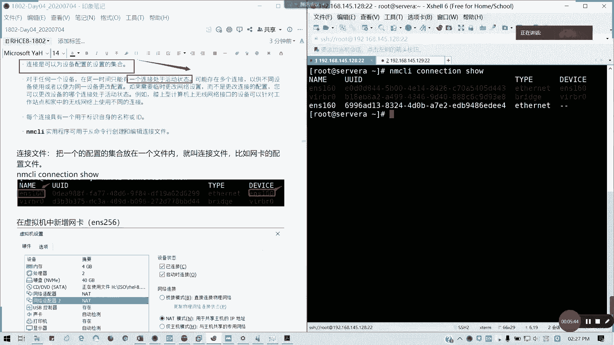

打开大家的无言柜啊啊。在思维这样经济上，我们。右键。点击设置。

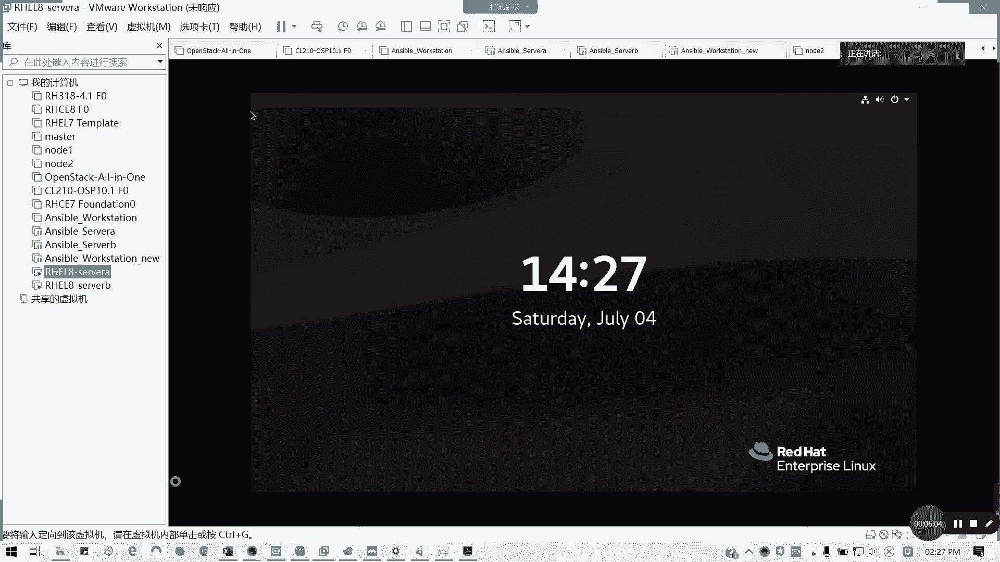

在这里我们默认是不是只有一个网络适配器。那我这里添加一个。添加一件向导之后呢，你们选择。网络识配器点完成。同样是NATT啊。用么点确定。

然后他会。

还原我们虚拟状态，因为进行了一个硬件更改嗯。

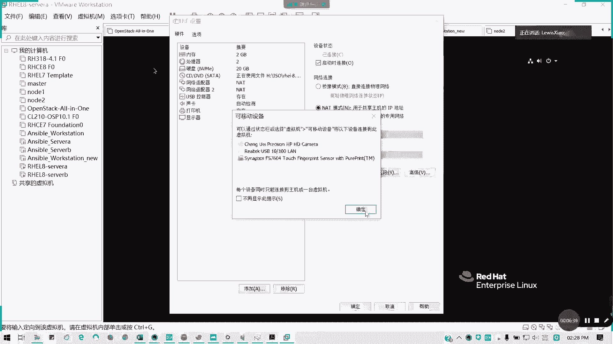

这新建一个链接啊。那我们看一看。我们这里是不是新增了一个叫做ENS224啊？对吧用NMCLIdeevice status。

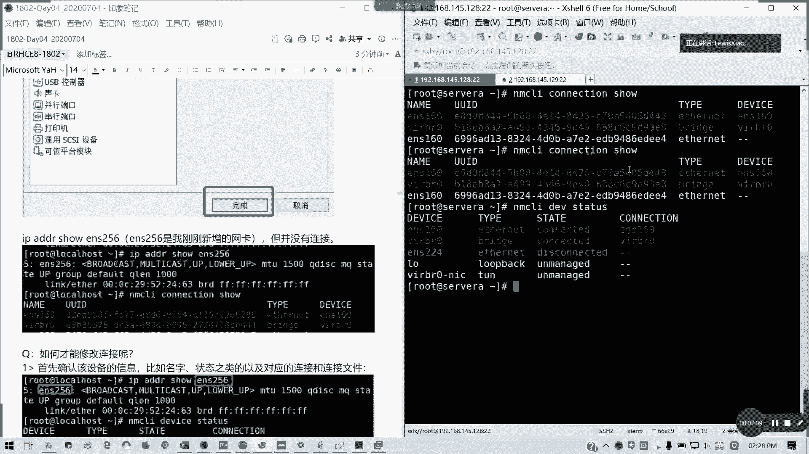

我们connection受这里是看不到的，对不对？我们刚才新建了一个链接叫做ENS224。我对笔记同步改成224啊，因为可能大家可能是256或其他的。我这里是224，然后我这里我在那个。IP。

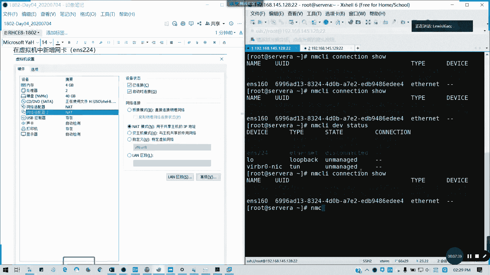

ADDR show我是有看到这个224的网卡在的。看一下啊，我这里五个截图。IPAAD这样是我们可以刚看到刚才的5号，对吧？我们现在的5号网卡。是。我们刚才增加的有，对不对？然后呢，我这里。他的状态是。

是disconected的。喂。对吗？刚添加网卡它没有活动链接，但是它设备已经有了。你们添加之后是不是这样？好，那如何去修改链接？如何去修改链接呢？我们看一看。这数字是随机的啊随机的。

通常它会根据你的那个根据你实际的一个wiY里面虚拟网卡的情况会添加。但是它是ENS开头，只不过它数字，比如说我上次我添加是256，有些人可能是192等等了，都没有问题。李磊啊，应该知道。这个不要紧。

我们知道它有一个网卡，一个设备出来就可以了。但我们现在要知道怎么样去添加链接，好吧。

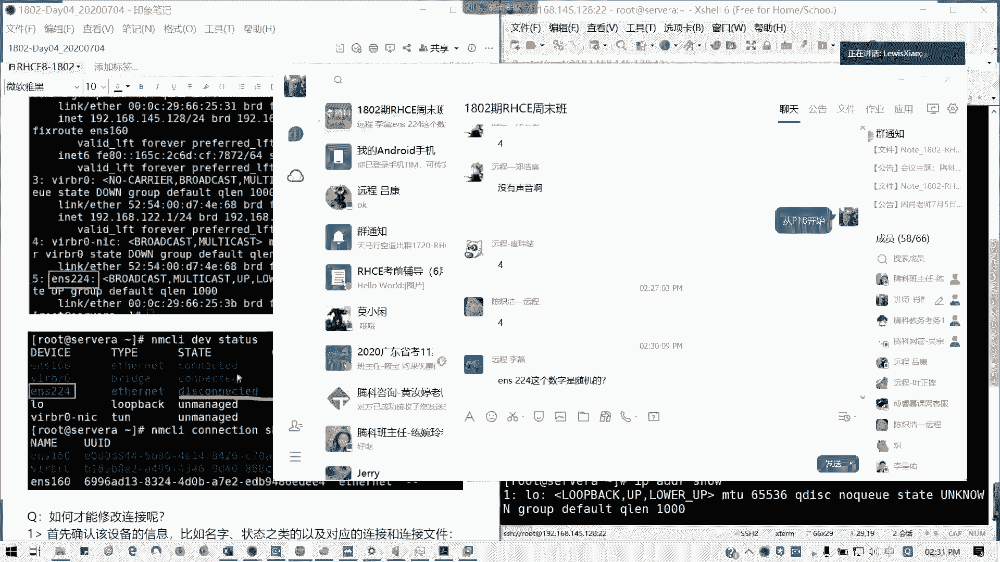

我们现在呢要确认他它这个设备的一个信息，对不对？我们确认个设备信息，就刚才我们IPAD加售是吧？ENS。

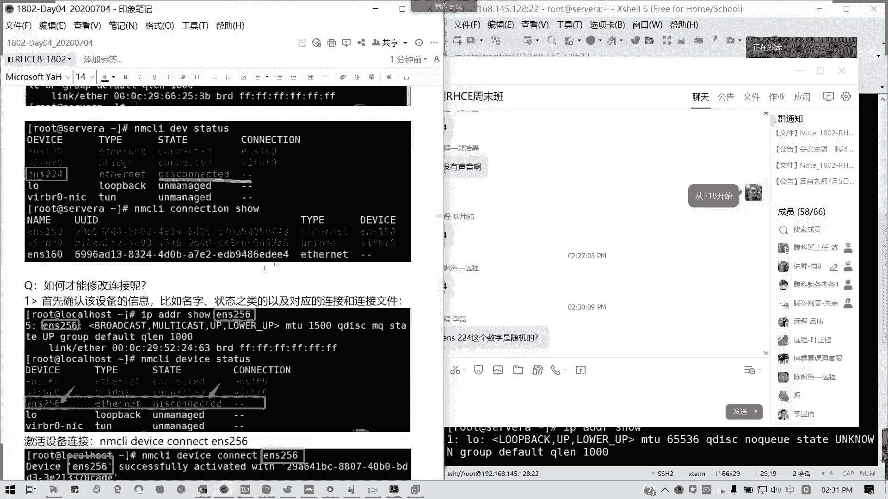

我这里是224。我有这个设备信息，然后devise status对吧？我们确认这个设备信息确实是有存在的那我们才能去添加它的链接。最好。还有我们最好。那我们现在要激活一个链接。我尔图同步更新啊。

然后我现在寄回一个链接，用什么命令呢？用这个哈。NMCI。device connect，然后后面跟你的。网卡的一个名字啊，网卡的设备名。N M I network is device。Tnet。

你可以写就写DV，然后空格CUN简写也没有问题啊，不补全没有问题。device connect，然后ENS224。看到没有？

DdeviceENS224successful activate weight这个这个是我们网卡的1个UID啊。那说明这个我们已经建我们这个网卡已经建立了连接了。

那我们看看一下NMCIconnection show。是不是有了？对吧已经有了，对吧？有了的话，我们这这里我们就知道如何我们生成网卡之后，我们如何去激回一个连接。那寄回一个链接什么意思呢？它就会在。

它就会在我们的一那个network script里面生成一个配置文件。那生成配置文件之后，我们就可以修改它的一个配置信息了。一个设备呢是一定会有一个连接的。如果没有呢。

它nwork那 CI device给位。没它就没有自动形成啊，如果有的话，但是是没有啊，没有连接的话，它也会处于一个断联的状态。那说明这个设备添加是生效的，懂吗？生效之后，我们再手动添加链接就可以了。

所以我们确认那个设备连接呢，我们是需要我们的三点信息。第一个呢。第一个是我们的device的状态，也就我们设备的一个状态，我们要先知道是吧？设备状态是连接呢还是断掉的呢？这个要先注意，第一个。

第二个是我们设备的一个连接。然后第三个是设备所对应的配置文件。对吧我们刚才建立连接之后呢，这里已经生成了对应的一个配置文件，按照默认的模板生成一个配置文件。那接下来我们就知道怎么去修改了。能明白吗？O。

都可以啊。好，那我们接下来我们知道怎么样建立连接。那我们接下来讲如何去修改配置啊，当我们采用name啊name manager client，也就是我们命令行的一个网络管理工具。

n啊MMCI device status去查看一个设备dis的时候，我们执行这个24啊。我们影响就其实我们影响就能看到我们的那个链接了。然后呢，我们这个已经存在就不用理会了。然后接下来我们要用那个。

lawork manager是吧，con can name manager client connection modify modify是用来修改设备对应的链接属性的。比如说我们可以修改它的那个IP。

子网掩码网关和DNS4个信息啊，比如说我们这里来演示一张操作。connectionmod，我现在修改这个网卡，对吧？ENS224能看到我屏幕啊，ES224，然后我要修改阿特IP地址。🎼IPV4。

它的方法是IPV4点dresses打ADD如果你不知道怎么拼写的话，tab啊，然后呢，比如说我这己配置的地址是192。168。146。因为我这个现在通的是145段嘛，对吧？我146点。128。

24位对不对？然后我们还要将我们的那个IPV4点metd的，也就是我们IPV4的地址分配方法设置为手动。然后呢，怎么样重启网卡呢？这里看好啊。

reload and network manager connectionreloadENS先重新读取它配置文件。读取之后呢，因为我们这里的话还好，因为它的网卡是复式网卡，不是主网卡。

所以说我们可以直接直接这里我们把这个链接启停一下。懂我意思吧？先到再2。那我们再看我们的配置。对吧我们已经把地址配上去了。懂我意思吗？这个过程啊首我我我再截一个图，把它替换掉。

因为原来我这个图我这在更新讲义的话，为了跟我的视频同步啊，首先啊我把我把这个拉下来。比如说这里是第一步，我是配置了一个网卡。黑的看不见啊。这是第一个。然后第二个我要设置它。它的IP分配方式为手动。

然后我把配置再重载一下。因为这也是修涉及到修改我们的配置文件，是不是要重载啊，对不对？但是这里的话就不能直接用restar network了。只能这种方法。然后验证的话。

我们可以直接用IPAD show或者是network manager。connetion对吧？我们通常直接只要能看到它的配置是如下状态，我们就成功了。大家可以试着做一遍啊。

像我们namemo manager的话，device有哪些功能是吧？它可以查看，然后可以建立连接，可以断开连接。刚才有建立就有断开，有connect，那就有disconect，对不对？

然后还有就是我们查看具信息就是用s。然后如果是conition的话，它可以看看它的链接是否正常。modify呢我们可以改它的IP地址，可以改它的那个。IP地址的获取方法，也就是我们的一个获取方式。

还有DNSgateway等等都可以。他不妨现在试一下，把自己网卡改一下地址。改一下像网关这些都可以啊，现在花花一丢丢时间，大家试一下。就这个方法啊。先把链接激活，然后再把地址配了，对吧？

记得是先激活链接啊，先加网卡。现在给大家几稍微几分钟的一个练习时间。然后呢，我们继续讲那个。设备跟链接的一个关系。后面我们会讲如何去呃用那个。直接修改配置文件法来修改它连接。

相信大家刚才都做了一部分练习啊，就把我们的这个新新建网卡我们加起来，把链接激活。那么们现在来讲一下网络设备啊，它设备以连接的关的关系啊，我们再强调一遍。对于设备就是你对应的一个网卡。有设备名字呢。

设备名字呢它是也是一种属性。这种属性呢是可以通过修改链接的方式来修改的。通常来说，我们设备就是你跟他有没有建立联系，对吧？有没有连接。懂我意思吗？设备是有没有连接的？

注意连接呢它是这个网卡配置的一个集合。对不对？网卡配置一个集合链接是有名字，通常是跟设明设备名对应。然后呢，也就是我们conne的1个ID哈。从我们下面例子我们可以看到。比如说我们可以修改他的那个。

ID是吧，它其实ID呢。它的ID可以不对应的哈ID可以不对应的。比如说我可以随便啊修改成叫什么task connection，对不对？我这里可以试一下啊。Connection。modify改随是吧？

ES24，然后com点ID就是改我们的连接名字。对吧那我们现在呢。我们再捋肉一下。然后呢，我们可以看一下。我们瘦的话，我们现在的这个链接名字我们就不能用那个。记得啊我们改的话改之话，如果有有那个。

有空格的话，记得用引号引上来，懂吗？链接名字如果有引号的话，如果有空格的话，记得把引，记得我们加上引号引上来。然后我获取他的地址。杠I啊不分区分大小写，对不对？我们现在的一个链接就不叫做。

我就我这链接名我已经不叫做ENS224了，我叫做test connection了，我已经改了它的名字，对吧？链接只是一个设备配置的一个集合，它的名字是可以随便改的。懂我意思吗？但通常的通常的话我们是。

跟我们的设备来对应啊，跟我们设备来对应。这样会好管理一点。简而言之呢，设备呢就是去修改它的一个连接。如果没有连接呢，那我们就直接。就直接就connect就行了，有连接。那我就去。修改它。把它激活就行了。

那么现在我们把名字改回来。为了方便管理。🎼啊no肯定选对位。我觉得underno condition那怎么办呢？就是我们把要把那个test test condition这样改一下。

有些人就可能把链接跟设备名混淆了，所以的话就可能就说哎我怎么又没发现了，对不对？我不小心我改了自己名字，改了链接的名字，然后结果是吧？我输入的是设备名字，所以就乱了，懂我意思吗？

我们network manager connection后面跟着绝对是我们肯定是那一个链接的名字，而不是设备名啊。这才是对的啊。我们现在捋肉。然后现在就变成1个ES24了。对吧我们变回来了。懂我意思吗？

现在变回来了。通常来说，我们还是把链接跟设备名一一对应。那这样的话我们就不用再去区分它了，就是这样的话方便，很好管理。那我们得到connection的方式有两种。刚才讲了一个就是。device对吧？

我说我是建立连接。跟我们这一步。第二个就是手动加关联，就是手动建立配置文件。我们这里我们再加多一个网卡，我来接教大家如何去手动建链接，好不好？我们回到这里，设为A再加一块。

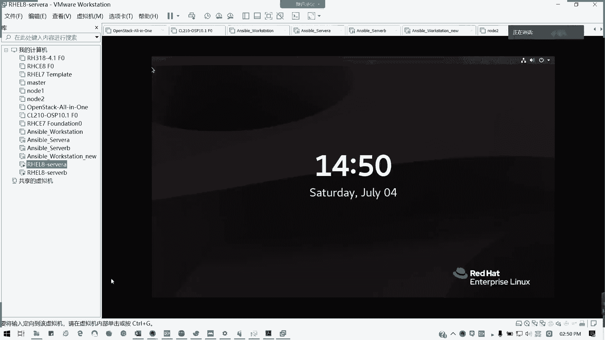

好，再加多一个网卡吧。

好，OK了啊，我们这边。

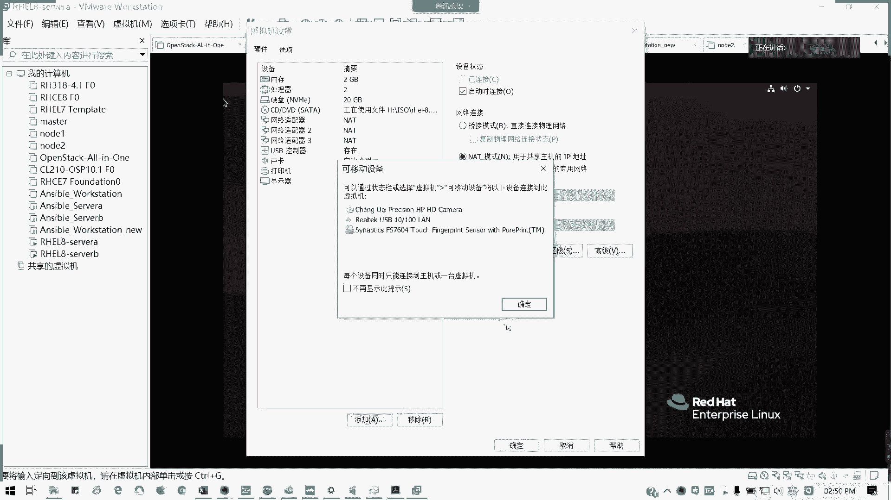

我们看一下。首先看一下deevice status。就添加了一个一块网卡，我这边叫ENS256。对不对？ESO6，那我们可以手动添加链接，这是第二种方法来。

MNCOI啊connection这里我们用ad type。ad，然后呢加添加什么呢？它的类型type是以太网接口inthernet。然后都端口我们设我们接口的名字是吧？我们设备名字叫做ENS256。

然后连接的名字空杠 name啊，connection name。12256。对吧它就是相当于这样我们就添加完成。然后我们再我们再看一下devise status是不是又建立连接了。

对吧一种是自动的直接connection给connect一种方法。第二种的话是手动添加。对吧那其实我们就知道。其实我们的设备连接就是给它关联，对不对？手动手动的连接也是自动关联。

然后手动创建也会自动的连接。懂我意思吗？所以这个题啊没有对应的链接，我可以修改修改改网络配置，对不对？两种方法。都O。怎么方便，怎么来？两种方法都OK，一个是自动关联，一个手动配置。

那么我们现在来看一看我们的那个ES256。比如说我要现在我的IP啊，我们现在IP呢。就是我们的网关IP的话，每个设备都IP，对不对？但网关的话是整个设整个系统的网关到我们的DNS。

所以说为什么说我们通常来说我们每我们每台设备只允许有一个网关，而不允许多个网关存在，对吧？多网络存在很乱乱七八糟的，也系统不允许，对不对？那不允许多个网卡也是一样，你通常只有一个网关。

通常网关一般干嘛的？就是不同网络使用的。不同网络去才使用网关。如要同同时网络，我们通常就是IP跟页码就可以了。对吧。所以呢我们这边我们教大家如何去配网关啊，网关我配在256上面。

🎼connection modifyify，我就配刚才的ENS256。IPV4。对 addresseses啊，比如说我这里有配1个10。10。1。1，然网关是10点10。1点。DNS跟网关都10点10。

1。2。我先暂且不管它的网络通不通，我就把它配上去。但实际生产环境你肯定知道网络通的，就你就是相当于我多个网卡连接嘛，多网卡连接，然后配置指定的IP地址，明白我意思吗？

这个通常说根据我们的这个实际的生产环境来定。这里教学环境的话，我们就直接配一个我们自定义的一个私网的IP地址。我们有是不是有三段啊，我们有三段IP地址是不会对外，对不对？首先10。0。0。0-8。

对不对？还有172。16。0。0-12。对吧还有19我们大家很熟悉的192。168。0。0-16。不是24哦，杠16哦。同学们两个零嘛，就这三段地址是就是丝网内网使用。不会对外啊不会对外说你配置几个。

你的练习完境，配置几个地址是稳妥的。这是我们计算机网络知识是不是经常讲，对不对？三个私网地址，三个私网网段。ABC类吧。我这里就把配一个十的啊。看一下。哦，这里我变成空格，抱歉啊。好。

然后呢配置完我这里因为我的主网卡是160，我直接在捋肉就可以了。然后把它倒外边下。对吧我们的网卡已经起来了。也就是我们的256啊，是另外一个网卡。那我们看一下我们的路由。那要看怎么走啊。

你要默认的路由呢。默认的0。0。0。0是通过145点入出去的。它是优先啊，就是有网关的话，它是会指向默认路由，但是它的meic它的跳数是不一样。它的级别它的那个热点是不一样的。月点的话。

我们这里啊这里是科的IProing table。我们月点的话越小越优先。像这里我两个网关出去。默认是145。2是最优的，因为它的月点是100。100，但它不它是145。0出去的，就这个它0。0。

0是默认的路由。对啊，然后下面是指定的嘛。对吧。指定的这个就通过他的网卡出去啊。懂我意思吧？指定是任义路由，就任义的没配置的之外的其他地址。像这里月点是102。

所以的话他暂不他暂时在没有指定详细的规则之前，他不会通过它出去，就10。10。102，对吧？它不会通过256这个网卡出去，这样我们配的网关，就双重网关。但他的月点是月点比较小。And then。邮居啊。

这有意思啊。来。UG我们可以看一下啊，fraagU居什么意思？不是说我不懂，我给大家看看一下啊。frag的UG代表什么意思？我们来看一看root命令。这里的话其实呢。

我自己是没有去那个过分的去研究去深究过。其实它这个居的话，我们通常知道的应该是gatet away啊。但这个EU呢看一下啊。浓度油表。看下面是什么意思啊，我们的U居。

U的意思呢就是当前路由是运行的有效的啊，G呢是通过网关去连接的啊。H呢它是一个指定的一个路由。所以UG呢就是当前我们网关出去的有效的路由。就刚才我们配的了。但是呢它的越点不一样，越点越低，越越小的话。

它的那个。MTU的值也可以手动修改，可以的。

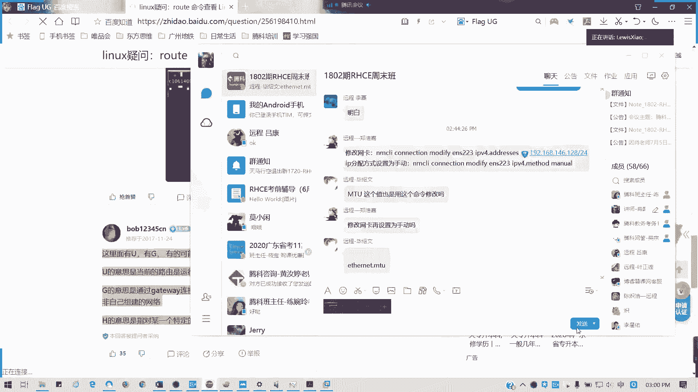

但通常。没有多少人去修改MPU了，对吧？就是它的默认单元嘛。对吧它是运行的有效的，然后呢。对，不过在这里复制过来就是加了加的那个百度的那个东西，所以的话看起来就怪怪的哈。对啊。这里再复制一遍。

我把那巴修改一下。我们这代购都是我们自己创建的一个就是当前有效的。但是呢你真正通过网关出去了就只有两条，但是它月点不一样。所以通常还你除了做那个路由，你除了做那个做指指向路由之外呢。

通常都是通过默认出去的。对，CN里面有一个文章就专门讲root，但是因为这个就root命令详解嘛，这个大家可以参考一下。

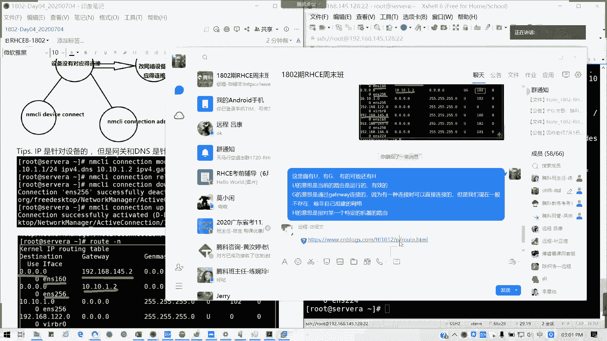

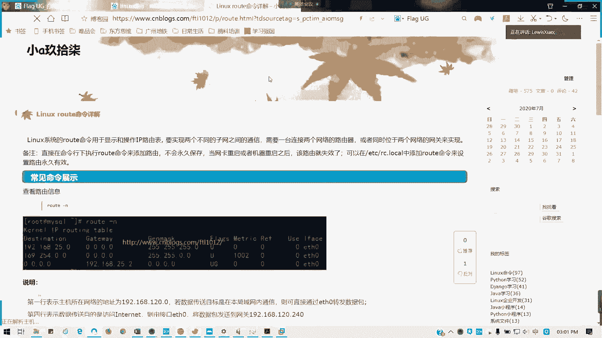

这一行就写写的特别清楚了，好吧，fraex路由标志啊。对吧这就很清楚了，我把它再掏出来。

那我们问题来了，到底我们走哪一条是吧？我们通常来说我们的那个default gateway。通常我们路由呢主要是来区别内外网应用的。通常我们指定内网路由，就有时候我们要就这让他们怎么走呢？

这通常是用在内网环境，对吧？内网跟外网隔开嘛，对不对？在企业里面，我们通过我们明细路由呢，通常是在内网里面，因为它是通过指定的VN指定的交换机，然后到达下它的我们内网下一条地址，然后其他的0。0。0。

0，就他们默认的就走外网，通常我们用途在这里。但现在很多的情况下呢，就是内外网隔离，会对吧？就就就是基本上纯内网机器。然后外网的话，你必须要做一些安全策略限制。

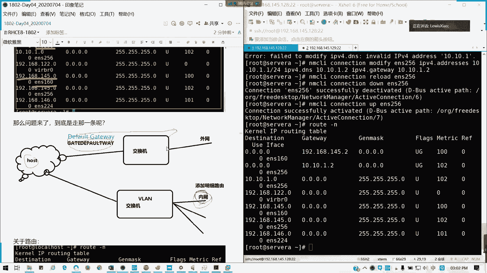

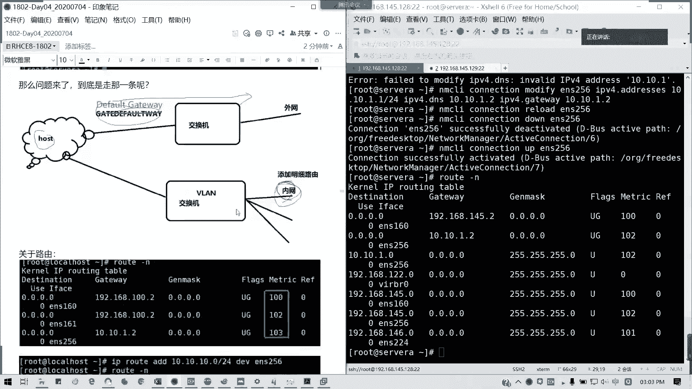

就它月点是吧，刚才这里我说到了他月点，像这里ESO之，它是比低的比他低的。这块的话，我们可以通过刚才毕少文发的这个root这这块知识去多深究一下。那我们时用关系我们就不再深深讲了。主要主要是这个的话。

涉及到一个内外网的一个个内网的一个问题啊。反正我们可以只我们配路由是要可以配置之后呢，我们就可以针对哪个网卡出去，哪个网口出去，就是这样。

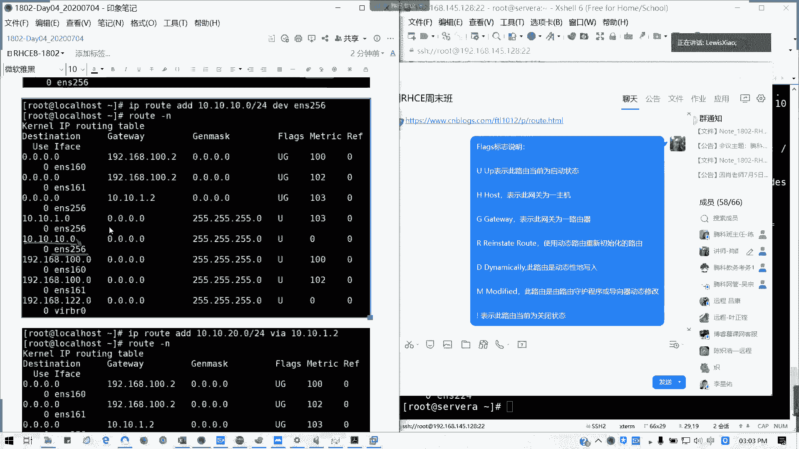

那我们接下来。看一下ENS在存在多网卡的情况下，我们只需要在任一张网卡配DS就好了，不需要在所有网卡上配置啊。当然你也可以在ETCresol点com里面去配置。都可以，就是直接配这个总的。

然后你若要不你就在网卡里面配。像我们这里的话，我叫我顺便啊。教大家如何去修改我们的那个网卡配置，直接手动啊看我们左边的图，那我们现在开始。呃，首先我们要知道网卡的配置文件在哪里。通常在这。ETC。

thisconfinet script里面的叫做IFCGFG。那我现在修改那张ENS256啊，就刚才我们刚最近添加的一张网卡。然我。我们这里的通常我们拿到网卡之后。

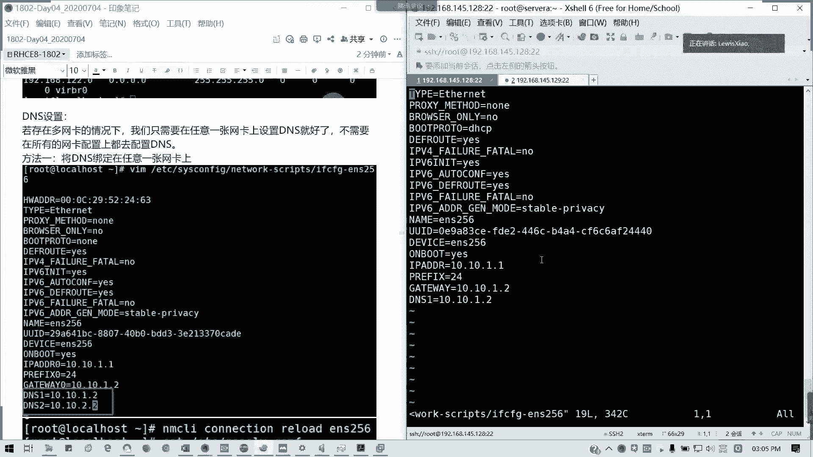

这一堆就是我们的一个配置文件，对吧？配置细节，然后修改哪几个呢？第一个我们put pro就是我们IP地址的获取方式，也就是等同于我们的。

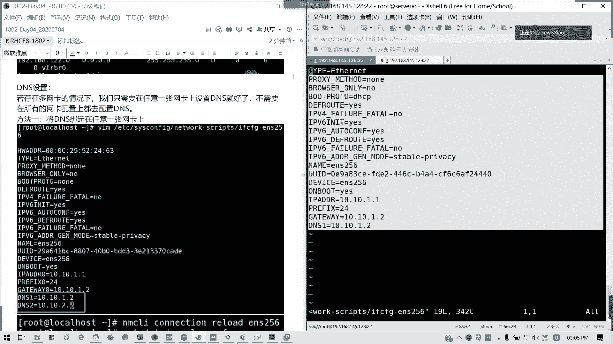

那我咩就是。client里面的conionmod里面的IPV4点manu。按获取方法，这里通常我们不设DHCPA。两种设置。我这里加井号的话，是我这里加井号的话，是可以是那个。可选啊。

不是要一定要选两种方法都一样。要配一个静态IP，我们的bo proto可以设置为n或者是tatic。懂我意思吗？stic静态的。然后呢，我要核对我们的name。跟device是不是一样？

对吧可是不是跟我们的网卡配置？这个后面的这个名字是否一样，因为有些人正式改，我想改他名字，结果改了改了外面的，忘了里面的。懂我意思吗？如果不一致的话，你这个网卡是起不来的。

我要看一看我们的name跟device。对，U为ID不要改它。就改就这两个确保这三者是一致的就行了。懂我意思吗？然后呢，on boot如果一开始是no，是不是我们刚装系统的话，是是不是那这网卡不启动的？

on boot这里要改为yes开机启动。然后。就是我的。IP地址。但前面如果你这张网卡，你存在多个IP。那你后面前面加0。对吧。可以加前缀的。如果有多个IP，你前面加零吧。

perface跟getway都是一样。但记住DNS是从一开始的。DNS是从一开始啊，我们的那个网卡连接我们的IP地址，这些是从零开始没有问题。在DNS记得是从一开始，不要到时在在考试里面。

或者是在我们的实生场环境里面给我写1个DNS0。对吧。DNSDNS的话有生效的话，有且只有两个，只写多了，它也会只会生效前两个而已，就是一个组一个倍。所我假设写多一个叫10。10。2。2。通常来说啊。

还还有这perface0呢，我们可以代替为一个传统的写法，叫做nck mask。我们子网掩码。

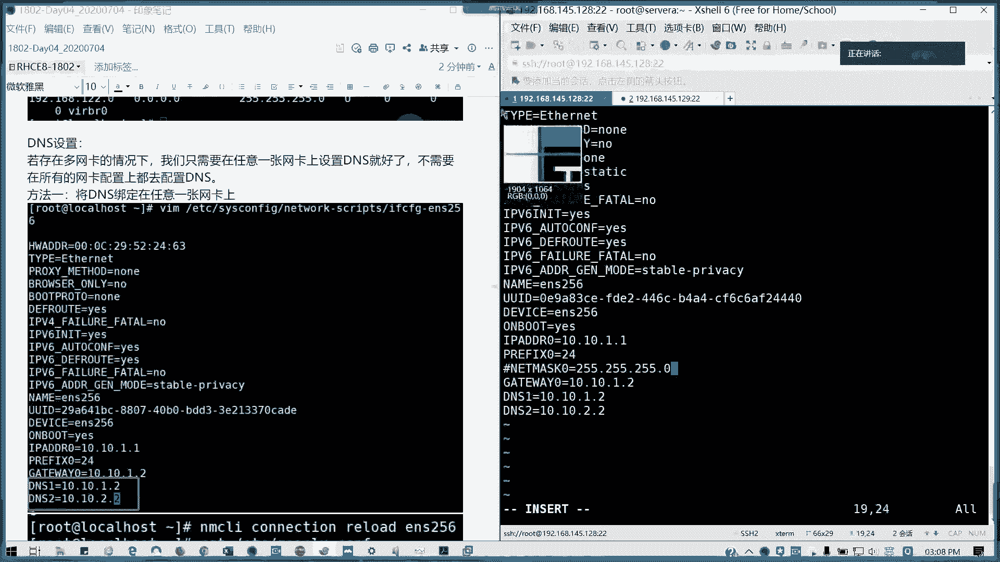

那网卡配置就修改这么多啊，只要自己向我点出来，第一个这个。第二个。这个。第三大块就是我们的一个主配置。第四个就是我们的。DNS。懂吗？我们网卡配置主要注意这几块。记得加减号的。不是地铁。

两者选一就可以了，很多人就习惯性的在加减号也照抄下去。不要啊。

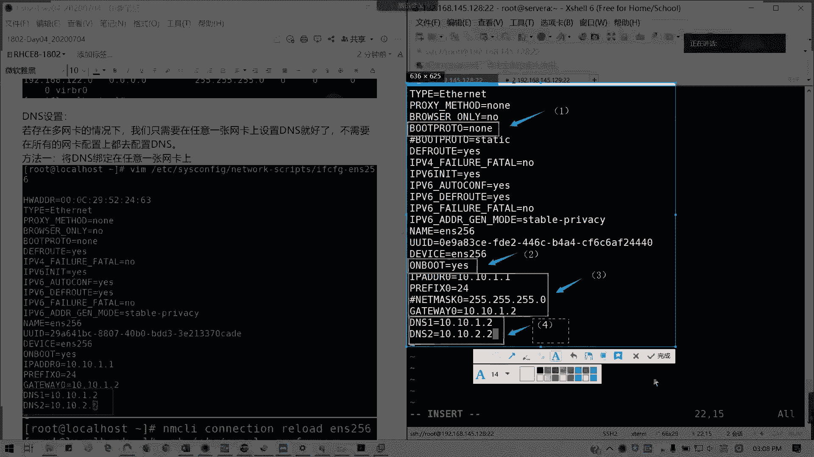

加进号的话是干嘛呢？加减号是注释。就觉得这行是不生效的，只不过我告诉大家，就井号前面的这一个跟后面这一个它的效果是等同的。对啊，两种写法都可以，这以的话你们就选一种就可以了。

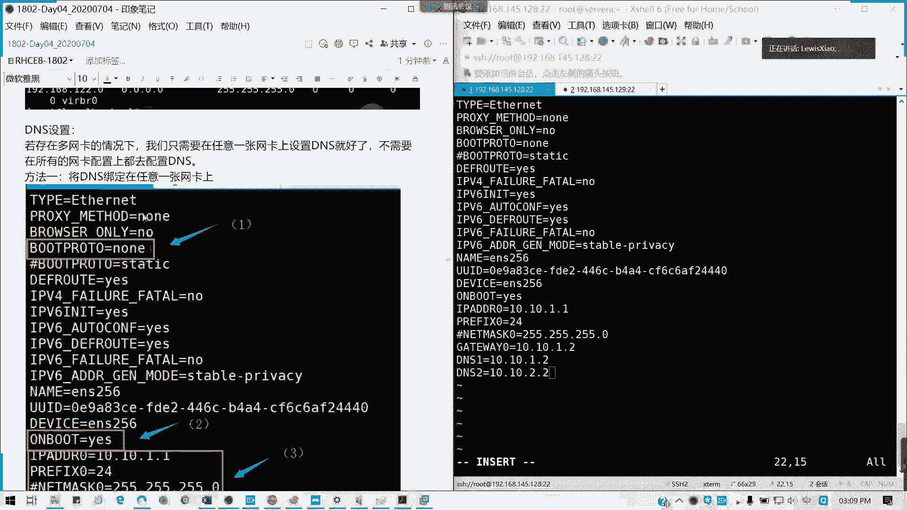

像这个le mask跟preface是一样的，懂我意思吗？

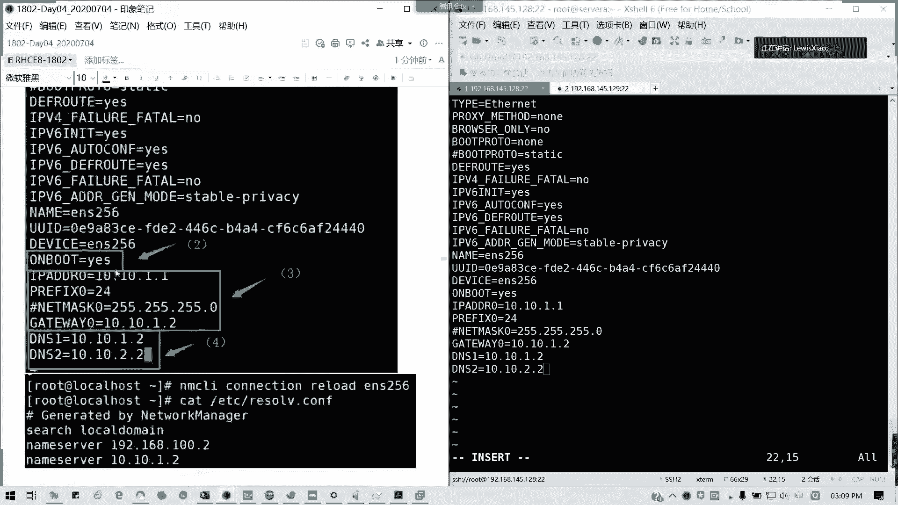

等同啊。好，这保存退出，然后记得重新捋露过。

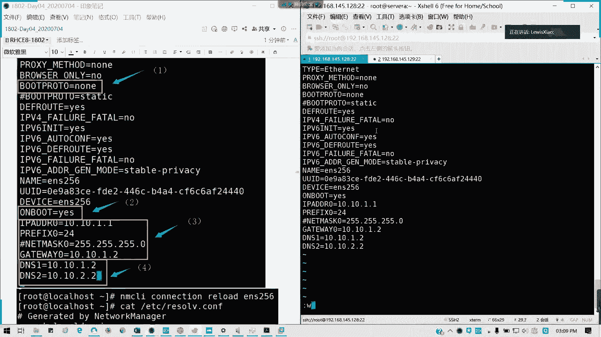

代表大画一下。那我们第二种方法就直接修改啊。直接修改那个resolve点com这个文件。它其实重启之后，它会自动把它的那个。他直接会把那个我们的DNS我们会会加到这里来。我不用我们去修我改，他会。

直接把我们加到这里来。第二种方法就直接修改它。第二种方法直接修改它啊，看reETCresec直接修改它。那如果我这里我加多一个看会怎么样呢？

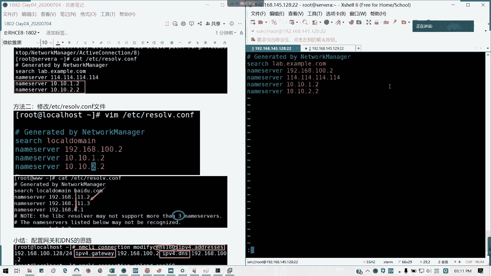

这里他不会出现任何提示。但通常来说呢。通常来说我们一般来说啊一般来说我们DNS它默认的话，它不会多于3个的。

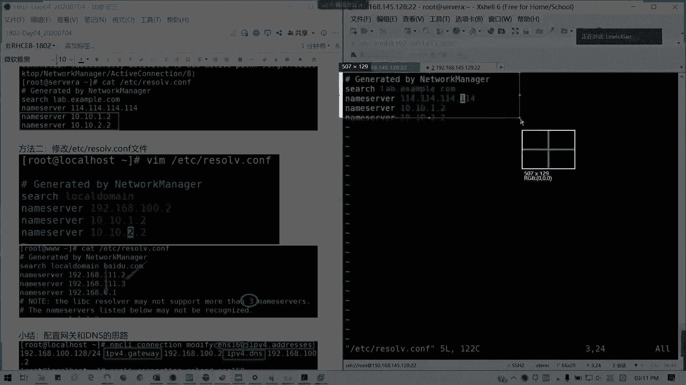

多三个的话，他会那个多出来的话就不会被识别。所以我们通常说DS我们配两个都可以了。

小结一下我们配置的一个思路啊。配那个思路就是这个懂吗？Never condition modify，然后呢后面跟上一个连接名字。连接名字，然后后面IPB4地址对吧？IPB4的。

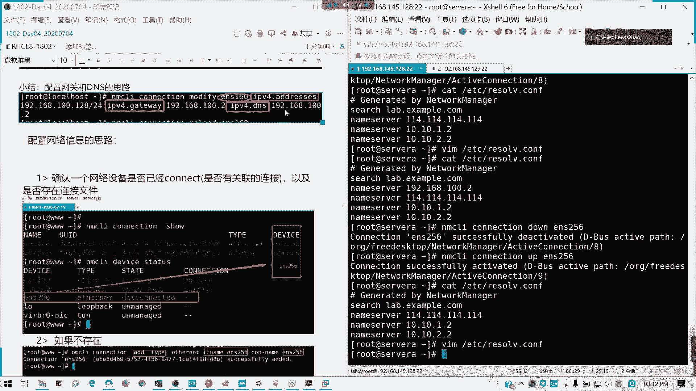

gateway还有IPB4DNS。然后呢，刚才说的配置网络信息啊，首先我要确认这个有没有连接，是否存在链接文件。如果不在键连接。建立。

存在之后开始配信息是吧？然后后面把它启用。

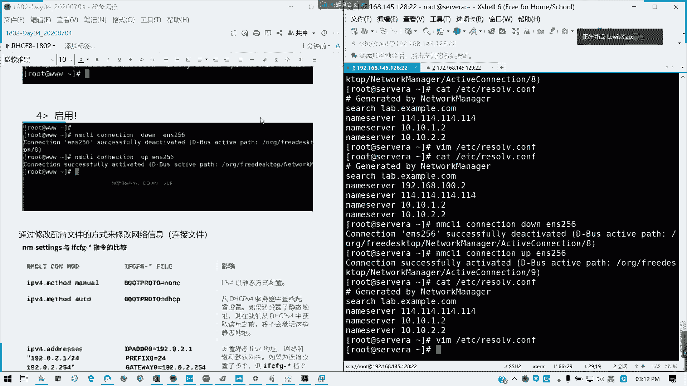

就可以了。然后呢，这里我们刚才是不是讲了，就是IFCH区我们直接修改配置软件的时候，我们顺便也讲了，对不对？如何直接修改网络信息？它的network manager，我们的contion的一个命令下。

对应的对不对？啊，懂我意思吗？这个命令在我们配置的文件里面，就是等同于他这么写。

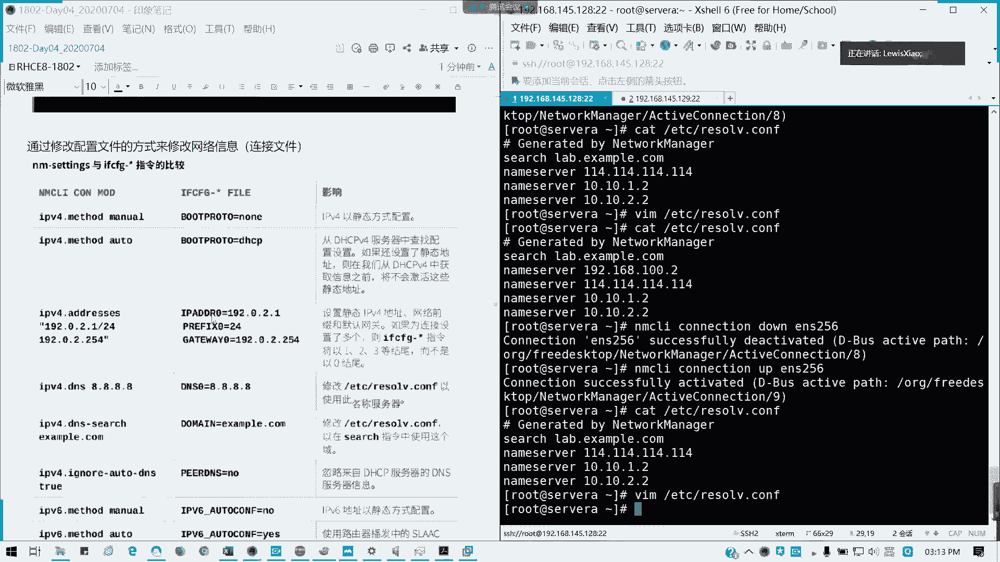

这个表哈。包括IPV6的自动配置，它这里也有了。这个表能看明白吗？可以吗？其实我们跳命令，其实改配置文就是这么我们就右边这么这一列这么改。但是如果是用命令行一条一条命一条命令直接呵成的话。

我们不改配置文，就按照左边这个参数来选。有疑问可以提啊。有疑问可以填下报括群上。像这个例子我已经说了啊，这例子的话就是。像网卡获取方式啊，IP零配置啊，地址零配置DNSIP地址一等等这些。对不对？

就刚才这个重复了。这个讲的都是刚才重复的内容，主要大家搞明白，我们可以用两种方式。来配置我们的网卡。打错了怎么改呀？那就改回来喽。就改成NES256是吧？然后空点ID。然后再捋漏一下那个NESO56。

然后。对吧，再你漏一下ES256就可以了。要啊肯定要的，你收你你修改配置文件网卡之后，记得捋露，我刚才全部都捋露过了，对不对？只要但凡修改配置文件是不是要重启服务啊，不然的话它不生效的对吧？都要啊。

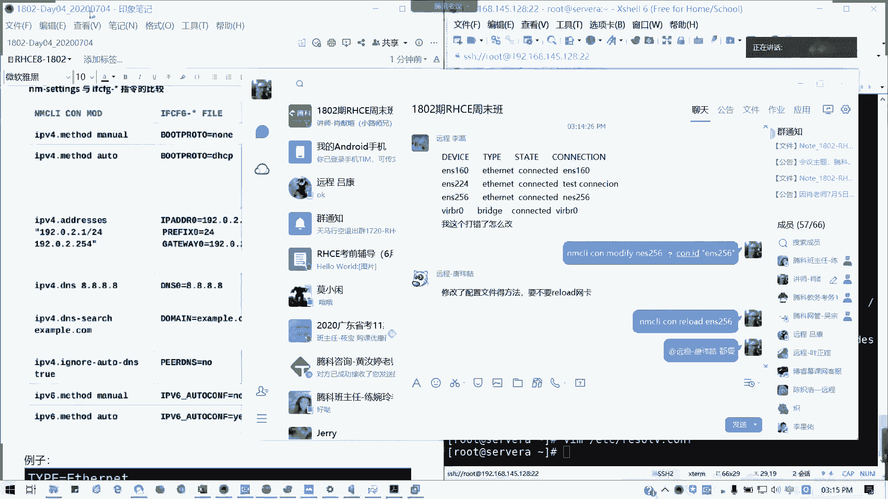

然后这里呢我补充一个，就是我们一开始讲的就是那个如何修改主机名。对吧罗秀会主义敏这个懂了吧。我们第一节课讲的。hose name status对不对？然后改主机名改完之后。

我用那个hoho name cTL setho name就可以了。临时设置的话就不需用hose name controll了，懂我意思吗？这个我们在第一节课已经讲过了，我不再重复。

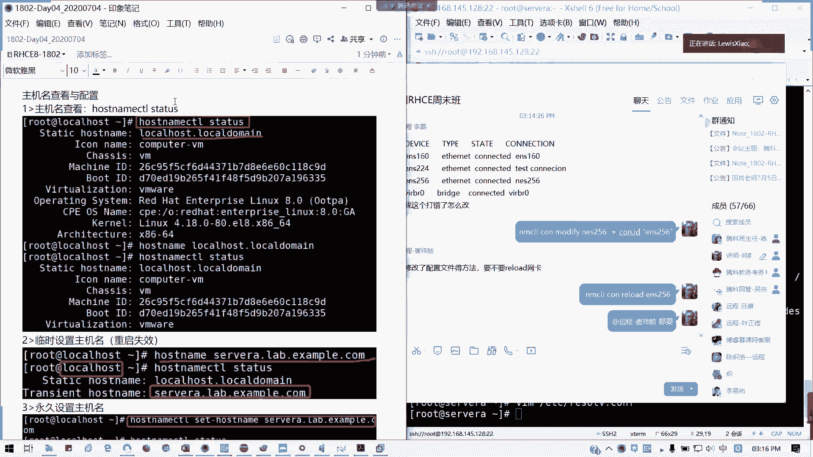

现在我们稍微休息一下，然后3点25分3点30分，我们讲一下一个补充知识。这一点在我们书上没有，但是在七里面确实有了叫做链路聚合。这什么意思？你现在服现了两个网卡，我这两个网卡要配一个主备。

或者是同时出去，对吧？以防我网卡一一条网线掉了链接之后，我这台机网络只能够正常通信。这就是我想做的目的。这个是不是在企业很实用，对吧？啊就是一个链路冗余。那我行，这一块我们15分钟后教大家怎么做。

先休息。

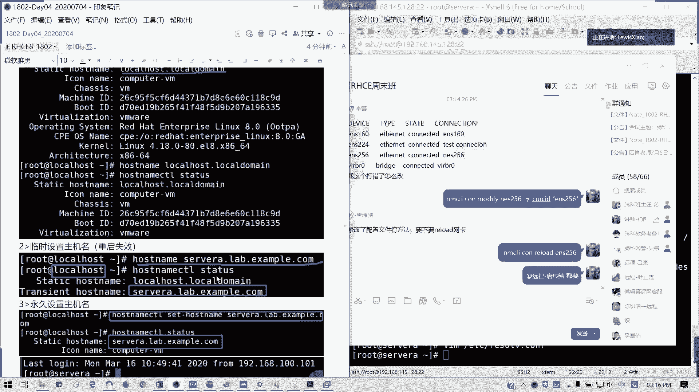