# RHCE8.0 红帽认证入门教程：13：文件归档及传输

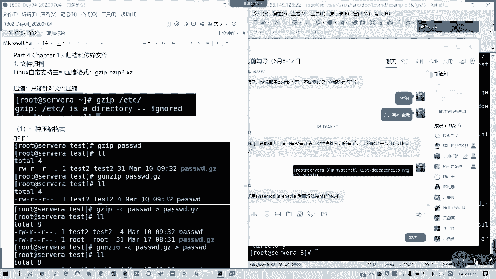

在本节课中，我们将要学习Linux系统中的文件归档与传输技术。文件归档是将多个文件或目录打包成一个文件，便于管理和备份；文件传输则是在不同主机间安全地移动文件。掌握这些技能对于系统管理和数据备份至关重要。

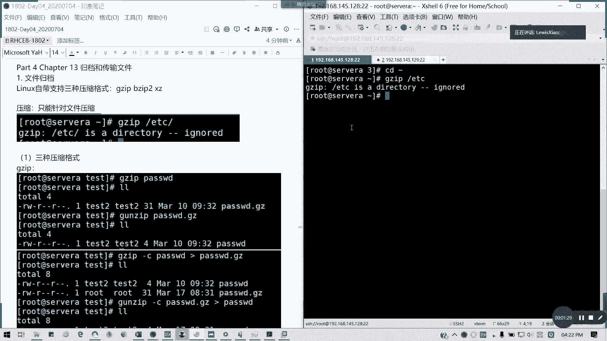

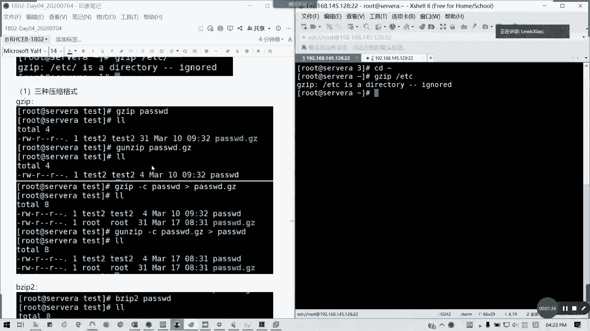

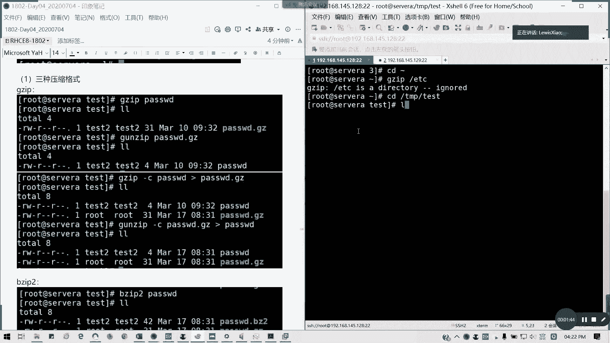

## 文件归档

上一节我们介绍了网络配置，本节中我们来看看如何管理文件。Linux系统自带支持三种压缩格式：`gzip`、`bzip2`和`xz`。但需要注意的是，这些命令通常只能压缩单个文件，无法直接压缩目录。为了处理目录，我们需要结合 `tar` 命令使用。

### 三种基本压缩工具

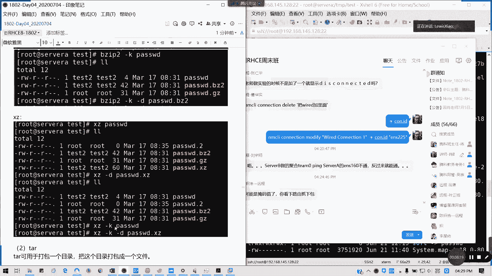

以下是三种基本压缩工具的使用方法。

**gzip 压缩与解压**
`gzip` 命令用于压缩文件，生成以 `.gz` 结尾的文件。
```bash
# 压缩文件
gzip passwd2
# 解压文件
gunzip passwd2.gz
# 压缩时保留原文件
gzip -c passwd > passwd.gz
# 解压到指定文件
gunzip -c passwd.gz > 23
```

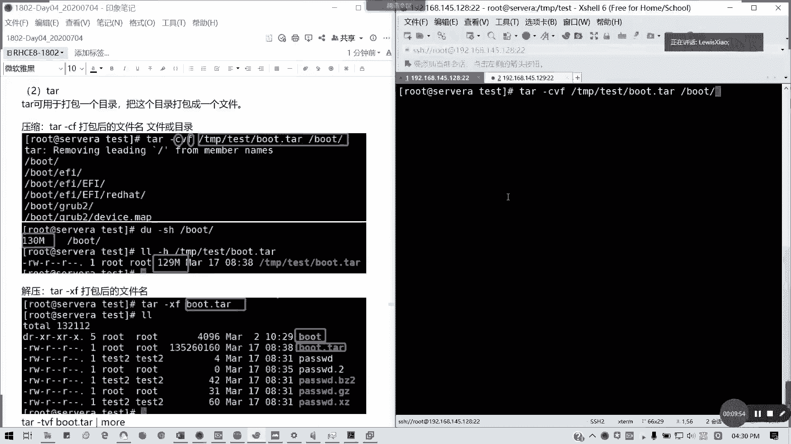

**bzip2 压缩与解压**
`bzip2` 命令提供更高的压缩率，生成以 `.bz2` 结尾的文件。
```bash
# 压缩文件
bzip2 passwd2
# 解压文件
bunzip2 passwd2.bz2
# 压缩时保留原文件
bzip2 -k passwd2
# 解压时保留原文件
bunzip2 -k passwd2.bz2
```

**xz 压缩与解压**
`xz` 命令的压缩率最高，但速度较慢，生成以 `.xz` 结尾的文件。
```bash
# 压缩文件
xz passwd2
# 解压文件
unxz passwd2.xz
# 压缩时保留原文件
xz -k passwd2
```

### tar 归档命令

`tar` 命令功能强大，可以将多个文件或目录打包成一个归档文件，并能结合上述压缩格式。

**基本打包与解包**
以下是 `tar` 命令的基本用法。
```bash
# 打包目录（仅归档，不压缩）
tar -cf boot.tar /boot
# 打包并显示过程
tar -cvf boot.tar /boot
# 解包到当前目录
tar -xf boot.tar
# 测试归档文件内容（不解压）
tar -tvf boot.tar
# 解包到指定目录
tar -xf boot.tar -C /usr/local
```

**结合压缩格式**
`tar` 命令可以结合 `gzip`、`bzip2` 或 `xz` 进行压缩。
```bash
# 使用 gzip 压缩
tar -czf boot.tar.gz /boot
# 使用 bzip2 压缩
tar -cjf boot.tar.bz2 /boot
# 使用 xz 压缩
tar -cJf boot.tar.xz /boot
```

**高级操作**
`tar` 命令还支持排除特定文件或仅解压特定文件。
```bash
# 打包时排除特定文件
tar -czf boot2.tar.gz --exclude=config-4.18.0-80.el8.x86_64 /boot
# 从归档中单独解压特定文件
tar -xzf boot.tar.gz --extract boot/config-4.18.0-80.el8.x86_64
```

## 文件传输

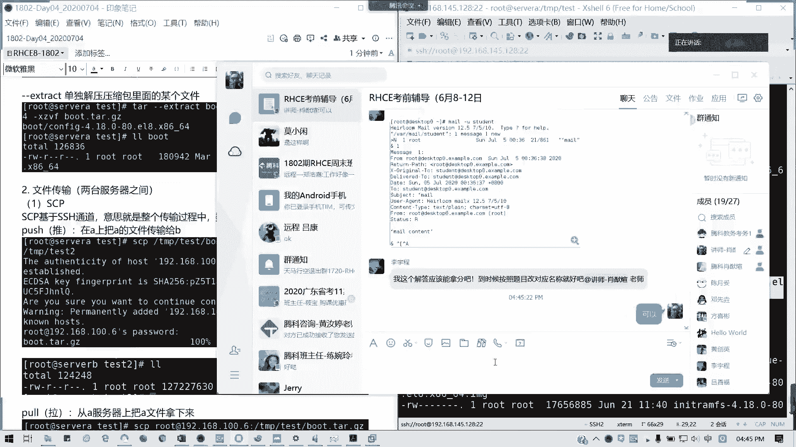

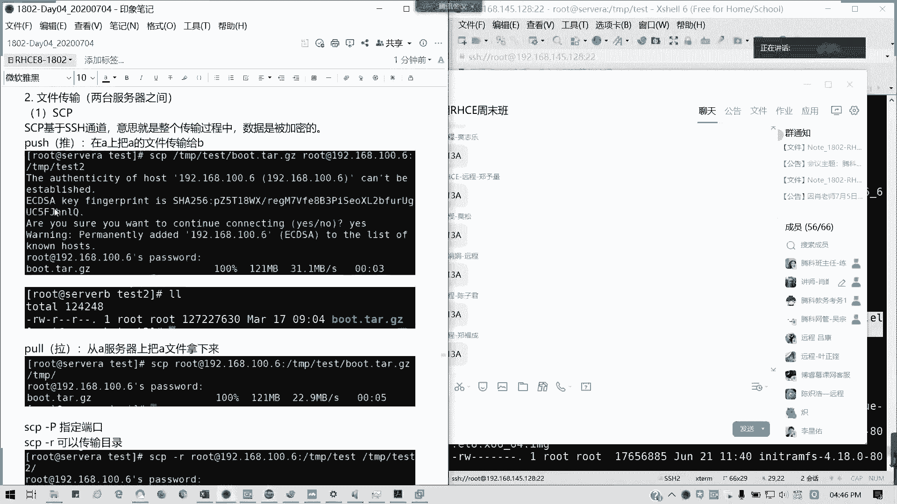

学会了如何归档文件后，接下来我们需要掌握如何在系统间传输这些文件。我们将介绍两种基于SSH的安全传输工具：`scp` 和 `rsync`。

### scp 安全复制

`scp` 基于SSH协议，能够在两台主机之间加密传输文件。

**基本文件传输**
以下是使用 `scp` 进行文件推送和拉取的操作。
```bash
# 将本地文件推送到远程主机
scp /tmp/test/boot.tar.gz root@192.168.145.129:/tmp/test/
# 从远程主机拉取文件到本地
scp root@192.168.145.129:/tmp/test/boot.tar.gz /tmp/
# 指定非默认SSH端口（例如2222）
scp -P 2222 /path/to/file user@host:/path/
```

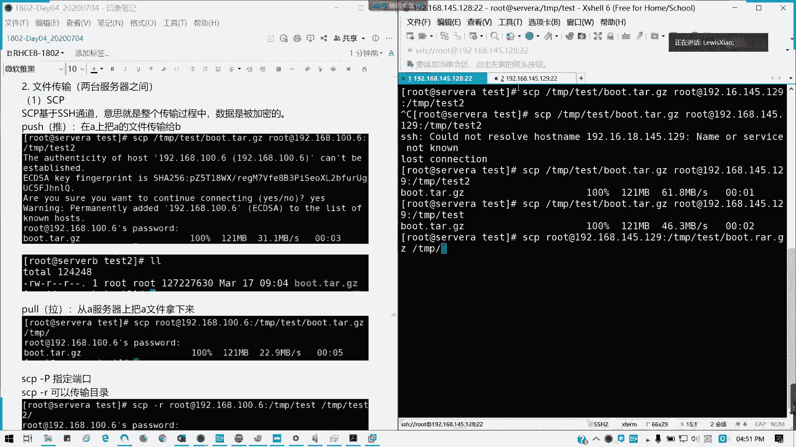

**传输目录**
使用 `-r` 参数可以递归传输整个目录。
```bash
# 递归传输整个目录到远程主机
scp -r /tmp/test root@192.168.145.129:/tmp/test3
```

### rsync 增量同步

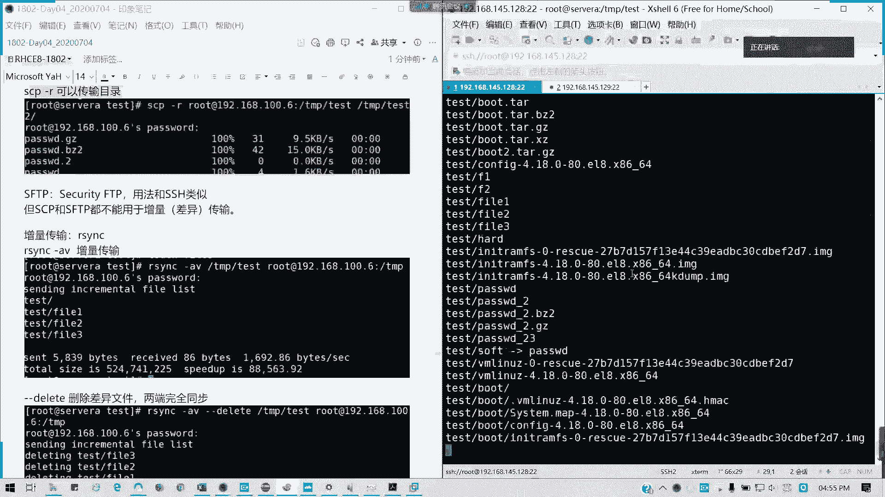

`rsync` 工具的优势在于支持增量传输，只同步发生变化的文件，效率更高。

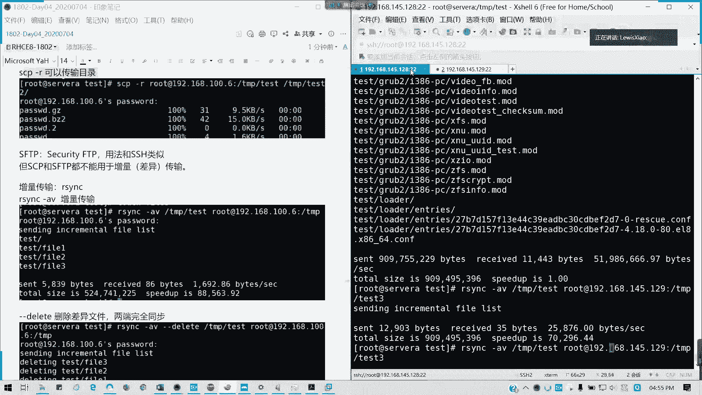

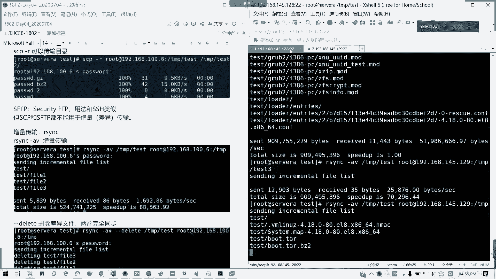

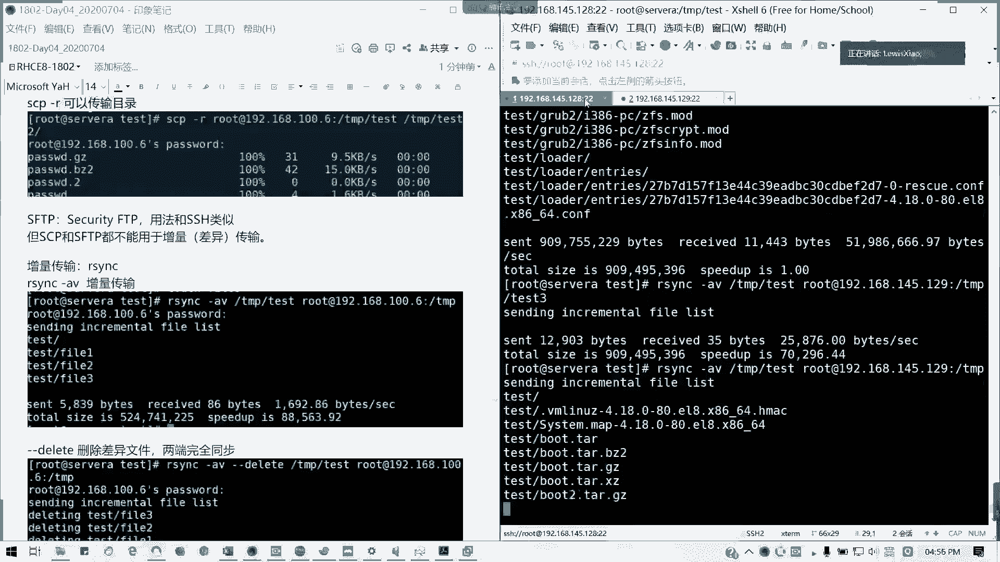

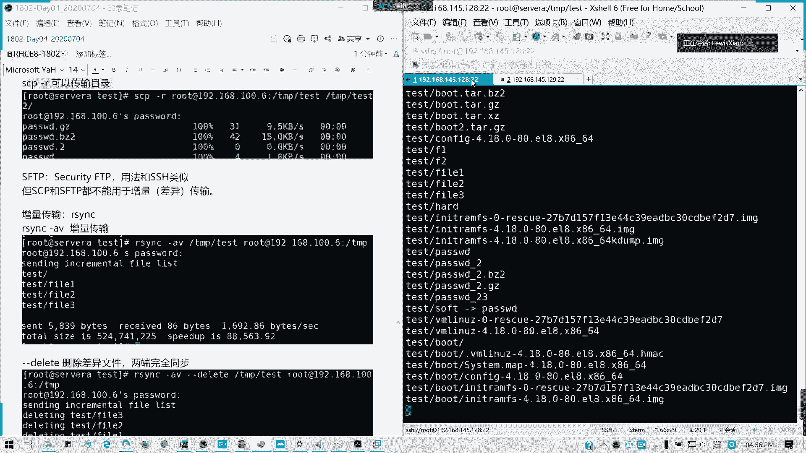

**基本同步**
以下是 `rsync` 的基本用法，用于同步两个目录。
```bash
# 将本地目录同步到远程主机（增量）
rsync -av /tmp/test/ root@192.168.145.129:/tmp/t3/
```

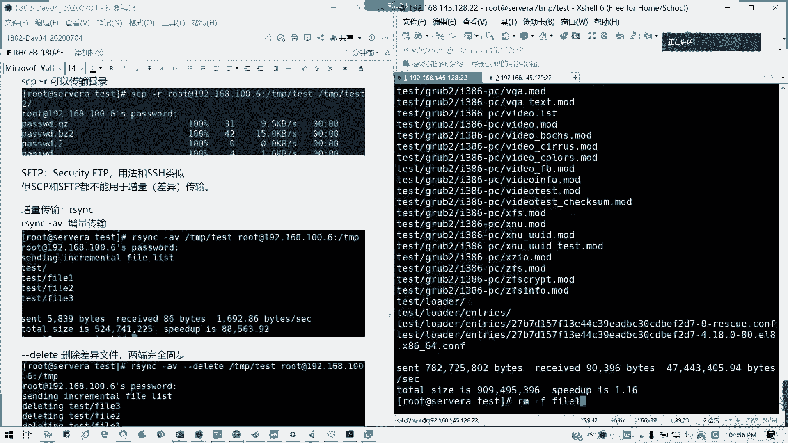

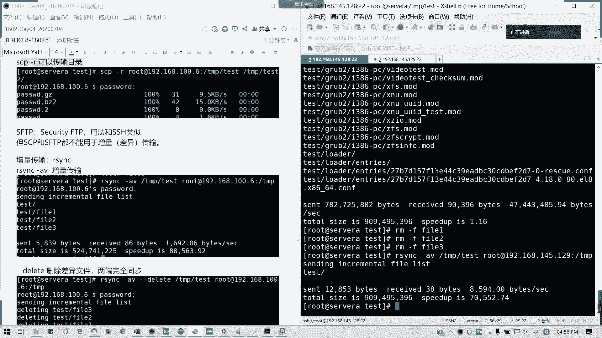

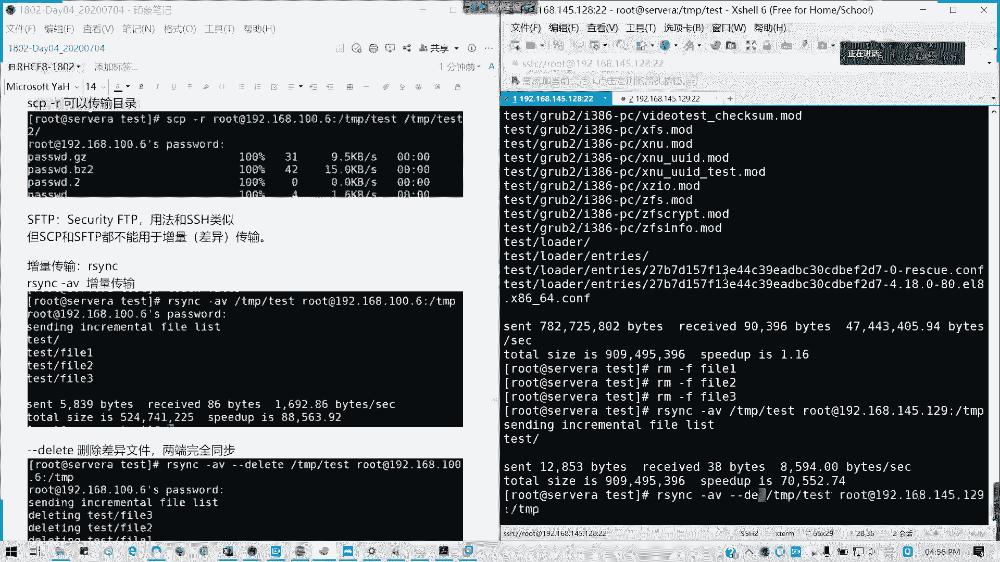

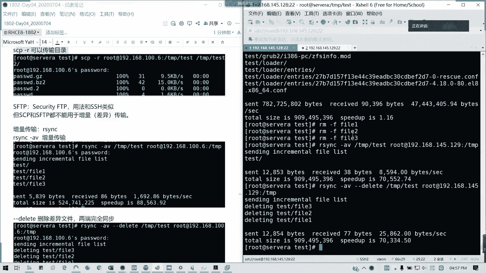

**完全同步（包含删除）**
使用 `--delete` 参数可以使目标目录与源目录完全一致，删除目标端多余的文件。
```bash
# 完全同步，使远程目录与本地一模一样
rsync -av --delete /tmp/test/ root@192.168.145.129:/tmp/t3/
```
只要源文件发生变化（内容或属性），`rsync` 就会将其同步到目标端。

---

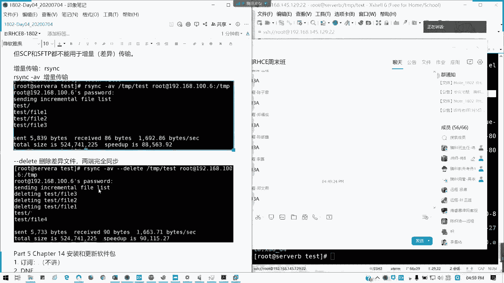

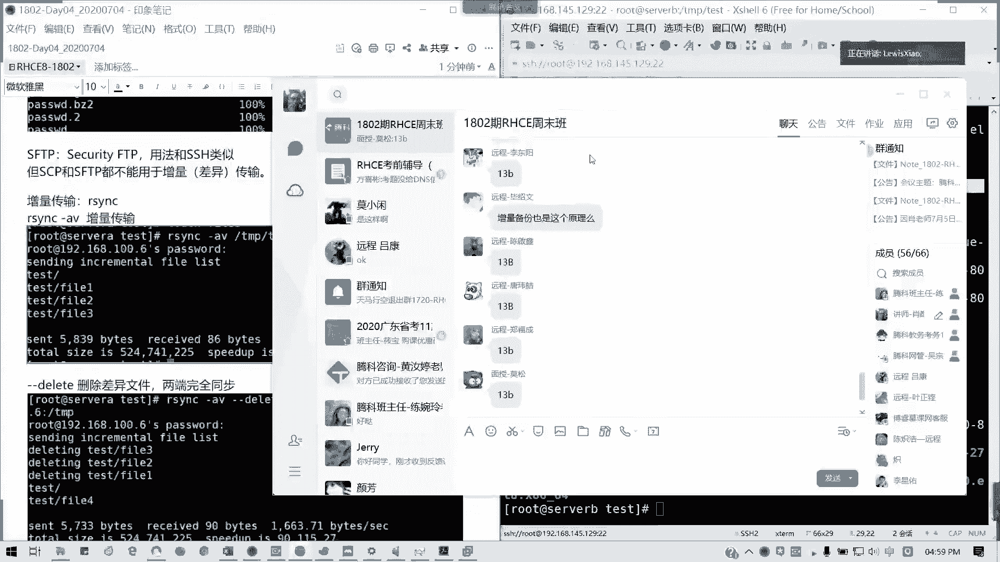

本节课中我们一起学习了Linux下的文件归档与传输。我们首先了解了 `gzip`、`bzip2`、`xz` 这三种基本压缩工具，然后重点掌握了功能强大的 `tar` 归档命令，它能打包目录并支持多种压缩格式。接着，我们学习了通过 `scp` 在主机间安全传输文件，以及使用 `rsync` 进行高效的增量同步。这些是日常系统管理和数据备份的核心技能。