# 2021全新 RHCE8.0 红帽认证入门教程——可零基础入门学习【网络安全／Linux】 - P23：Day04_Ch14a_软件包管理1_RPM及DNF - IT老表哥 - BV1444y1h7Bx

好，接下来我们讲14章软件包啊，软安装跟更新软件包。这个的话，这部分知识跟随着整个红帽的体系啊，无论如何，你这一块的话，你考试的话，肯定是要跟他这样打交道。他没有说专门去做一道题。最多就是软件仓库。

但要求你做一个软件仓库而已，但是他不会说专门去考你这个东西。但是这是是正是伴随你的所整个红帽的一个东西。因为你只有软件包的话，你才能装东西，对不对？首先订阅我不讲订阅订阅的话，哎，收钱的，对不对？

我们怕订阅是要收钱的，我们就教给大家一些免费的方法，好吧，订阅这个我不讲。接下来我们简单提一下DNFDNF。不是地下城永生的DNF啊，也不是毒奶粉啊。我是俗生，可能如果你们记得哈要毒奶粉，然后呢。

这里呢。我们在红帽吧里面，们是不是以前我们是有个一样的工具，对不对？样源其实在8里面样还能用啊。要的话，user并样，里面我看一下什么什么鬼啊。它要么是一个软链接，软链接指向DNF杠3，对不对？

它是一个软链接，包括我们DNF也是一样。所以的话我们在红帽吧里面要么工具，要么我们的小黄狗啊，全面升级为DNF软件包的一个部署一体化的一个工具啊。我们红帽中的软件包管理工具，我们主要了解这几点。

第一个我们知要有们要知道。怎么样才能获取到我们的RBM我们的软件包？当然呢，第一个你花钱啦，对吧？通过购买订阅啊，通过购买订阅。你可以啊就会有啊，这个是花钱的做法。第二种。我们的光盘对不对？

我们的IS文件是不本身已经含有软件包了。对吧。我们说我们光盘里面已经有6000多个了。6000多个了，这个也是可以直接来用的。新的版本好像8。2已经达到了8000多个。8200吧，对吧？套转件。

因为它的光盘也大了，8G28。2G，我记得是。然后呢，对centtoOS系统的话，我们熟知的开源镜像站里面。就有我们的RPN包啊RPN包去提供。比如说像我们的清华大学是吧？

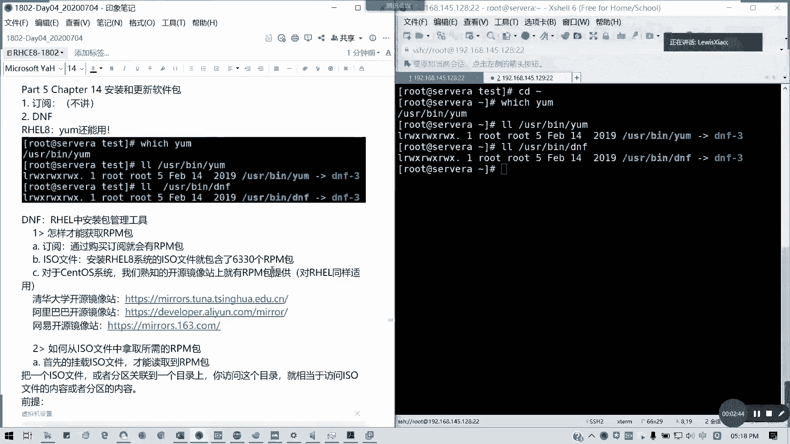

我们清华大学开元镜像站。是吧里面的这些开源的东西我们都可以拿来用，对不对？像我们熟知的，像centtos里面，它因为它是一个社区版。社区版的话，它基本上。像8的话。我不知道他他会不会像那他最新的是8。

22004啊。像八的话，它里面就有一大堆啊，我们可以用熟识软件包可以使用。但这里好像很慢的样子。然后还有你看8里面，像我们的那个base OS跟F dream就是两。

其实它这里有个report data，对不对？我看一下有没有report data。

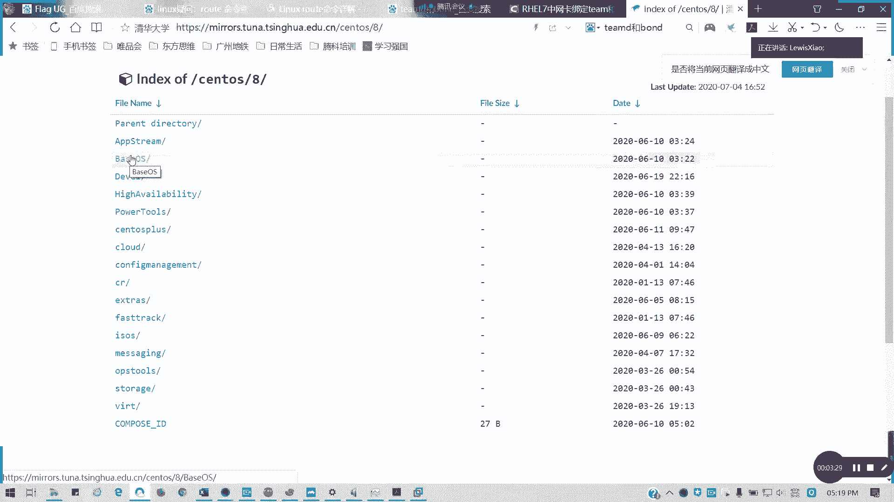

这base OS里面就是有个report data的，我记得啊。叉8664。OS。

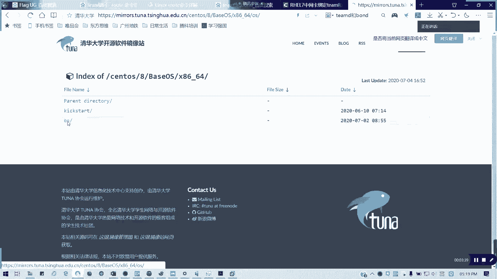

到这里的话，我看一下啊，它这里就是相当于我们有一个样元在啊，但是我这里看不到它的ra data文件，没事。呃，还有呢就是那个阿里云。开元竞象站对吧？我们都可以开发者社区，我们也可以拿来用。

他stoOS镜向他教你一个方法了，就怎么样去使用我们我们的阿里云的样元，对不对？谁可以下载的，对不对？就刚才你那个。不是啊。不是我不是说这种啊，它这个12345678我我的样源呢。

你说RPN包这里还有一个关念文件啊，就我们rapport文件，它的一个就它的一个依赖关系这个东西啊，所以的话我们要说的是这种啊，像阿里云，它直接教你啊，像清华其实也有啊，像清华大学。

我它的通壤里面也有教你说怎么样去设置我们的一个亚某园啊。但这SOSOS他已经有告诉你是怎么做了。然后呢，还有一个就是我经常去的王页。对吧网易看始这样这，然后去当我们自己具体去找他他一个版本。对不对？

找他的一个我么样员的一个版本。主要是report data下面。瑞托贝特跟那个package上一期目录就可以做它一样圆了。它的这是5它的完整，它的相对路径啊，我们要写它的完整路径。这三个是常用的。

但国外的话，这是三个是国内比较多用的多的一个开源竞销站。但是前提你是要网络支持的，懂我意思吗？

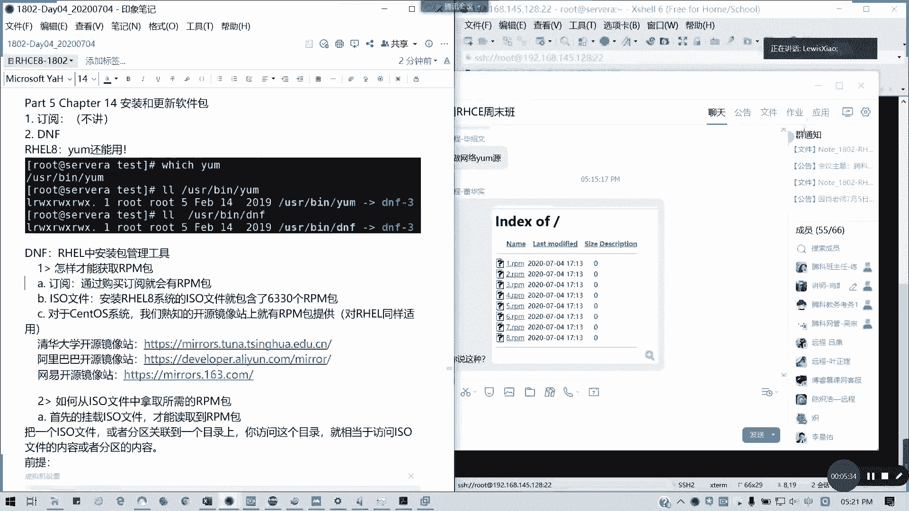

那我们现在教大家如何从我们的ISO文件里面拿我们的RPM啊，相当我们一个免费的方式跑来。我现在呢。

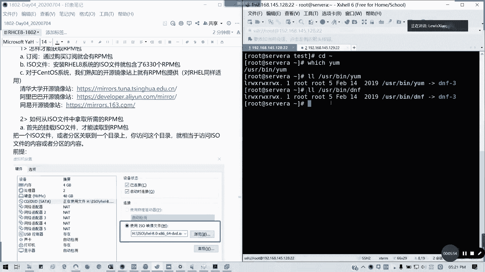

我这里啊我是虚机，我这边我挂一个镜像啊。

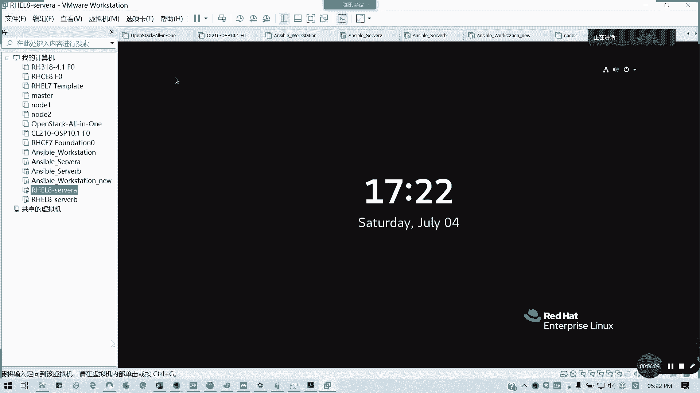

我这边挂一个镜像，然后呢，我教大家如何去配啊。这里我线下其实已经挂了的，大家可以如果没有的话，可以挂一下。我这己挂的是8。0的。好，那我现在的话，我如何去获取？

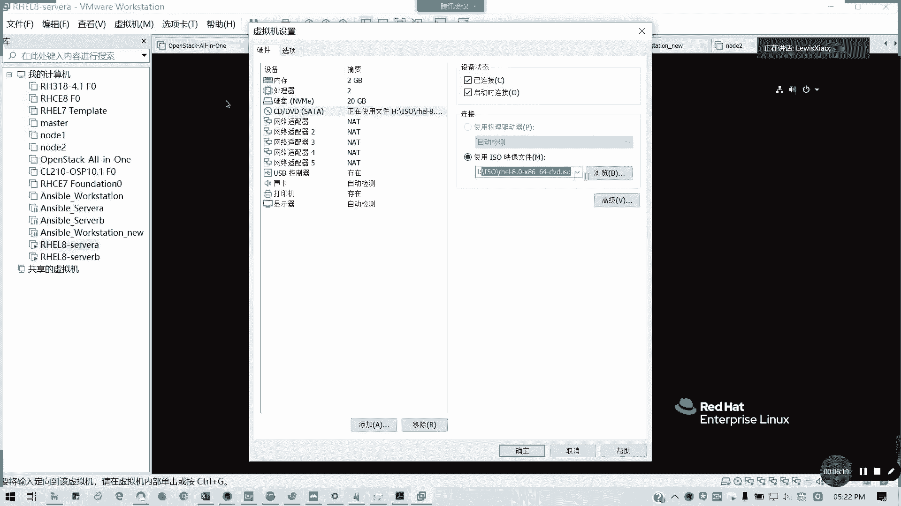

我现在我可以去创建一个。🎼我这有个ISO，对不对？我看一下MTSO这个我上次不是挂过了吗？

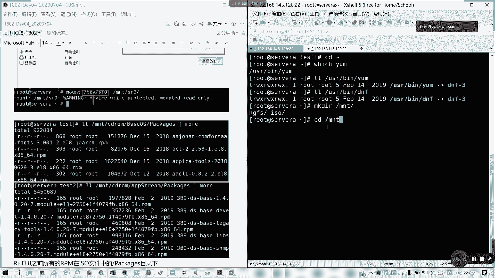

对啊，挂载我这里已经挂过了，所以如果没有的话，你们就自己创建一个。挂创建一个那个文件夹，然后把光盘挂载过去，挂载的命令就是我这里的。mountoteDVSR0，然后挂载到MNT的具体的一个目录。

像这里的话，我不就挂载了，对吧？它有一个baseOS跟那个F stream是吧？那我们可以看到啊。ISO里面的。baseOS里们 package。1661个。就很多的包啊。对吧。1600多个包。

那么F dream也是一样。你看都是吧，只不过8。0呢，它是把系统底层用的软件包以及我们的应用这一块的软件包，它把它拆开了。原来7的话是合并在一块的对吧？所以八的话。

我们要做两做一个软件仓库里面有两个指向。像以前的我们70镜像的话，是没有baseOS跟H俊这两个目录的，知道吧？以前的话全部都在一个叫做package里面。现在有分，以前没有啊。对于我们的那个。

对于我们的这个红帽而言啊，它的一个包啊。我看一下背，我给大家讲解一下包的格式。package我LLL一个叫做艾拉这个包。我们可以讲解一下这个包它的这个包啊。

RPM就是一个可以红帽编译过的一个可用于安装或更新的一个软件包的一个。的一个啊它有一个文件，然后它的名字是什么含义呢？我会告诉大家。首先。这一块。它是一个包的名字，也就是我们软件的名字，有疑问要问吗？

然后呢。可以看到啊，这里。3。1。0。3，它是一个包的一个版本信息。报的一个版本信息，它的版本号是吧？3。10。3。好像后面杠6是它的修订版本。修订版本。然后呢，后面的EL8是他的那个证明它是。

redhead enterpriselinux也就是红贸企业版发用的包，明白我意思吗？后面的叉86下划线64呢，就证明是它的一个架构64位。从红帽期开始，有没有发现红帽七开始，它不再发行32位版本。

不再发行3位版本。所以的话它所有的红帽相关的。它还有IA64对氨腾版，但是我们在叉86上面通常就是叉86-64。然后RPM呢就只表明它是一个软件包，打包好的了。明白我意思吗？

这个这个软件包的一个名字的解释。可以明白不？那如何安装我们的P包啊？PN包我们两种方式，第一种是用原生的一个叫RPM的工具。RPM。啊，RPM呢。有一个问题就是他没办法解决包与包之间的利依赖关系。

因为它只一次只能装一个，对吧？有时候我装B的时候，我A要先装，那我是不是要先装A，然后再装B呀？就就A依赖于B嘛，你哦不错，我我应该这么讲，A依赖于B的话，那A帮我安装之前是不是要把B办法安装好？

对不对？它包与包之间就是我的环境之间，它有是有依赖耦合关系的。如果你缺少哪个包的缺少了，比如说我A跟B有依赖关系，我B没安装A，是不是装不了？对不对？所以呢它这种安装包工具的话，它不提供依赖解决的方案。

所以的话你必须一个一个手工来。比如说。哎呀，我示范一下就知道啊。RPM。🎼杠IVH这是安装的一个命令，然后直接s。4。9是吧。他会提示你说fll的 dependencies，我下面的这些包我都没装。

对吧？他我下面的那个是有4个包没有装，那我这个zeber是不是装不了？对吧那我要一个个把它装完。明白我意思吧？我一个个把它抓完，我才能抓。比如说哎。那我不要说ABFATTR。这个包好像没貌似没有啊。

它应该是在那个sber common tools里面。他们卡完to死你也装不了，因为它少了一个lib，你开一个lab库，对不对？sber lifezeber知道怎么用的吗？它是用来共享的。

就是CIF文件系统，相当windows的那个文件共享这种功能。我要先装这一个smber life，再装smber tools，然后最后再把smber给装上。所以你用RPM会很麻烦，对不对？会很麻烦。

它会提示你一层层的，它ABC3个环向扣，先装C再装B，后面再装A。但是其实虽然它这个工具啊只能装一个包，而且不能解决我们的依赖关系。但是它在查询或单包安装上面还是有一定的优势的啊。比如说我要查询。

已经安装的包，那我们RPM有个命令啊，RPM杠QA，然后grape截取啊，我们这个命令会在15章讲到grape，然后我们的包的关键字，比如说HTTPD。

是不是我可以把所有HDDPD我已经安装的包列了出来。杠QQary杠A是O懂我意思吗？Q查询QUERY。懂吗？or是A是or嘛，他把呃或是avail也是可以的，或者是写示available也是可以。

就是我已安装完的，我的跟它有关的包全列出来。啊RPN管QA。然后呢，我们要查询这个包的安装的目录，我们可以用QL。listist。列出来啊列出来它的那个，然后后面这里就不用break了。QA啊。

我们查询所有的。然后QD的话，QL的话我们可以这样。可以列出所在包它的安装目录。安装包的概念其实就是把一个包各式各文件经目录集合的，安装就是把它解压嘛。走吧。

是吧他这里是不是列出他这个HTTP包递包里面，我解压到哪里，对不对？他这个文件会怎么生成，懂我意思吗？可以明白吗？就相当于我windows set up一样。

它是不是不是我们set up的目的目的是不是其中一大部分是复制文件啦？对吧我们的C他我们的安装某个软件就绝大部分是复复制，然后我们再进行一些初始化配置，那就生这样就软件安装成功了。

初始化配置包括像windows的话，像启动项、注册表、文件类型等等。windows也是差不多。主要他注册表所谓注册表啊，它是写在那个什么环境变量啊或等等这些或者是一些关联的对吧？好，QL就讲到这儿。

还有呢。我要查看配置文件。QC。C for configuration啊。confiified也可以。对吧这个其实拿来查，你如果不不晓得你安装的安装包，我装的包软件不不知道怎么用。

那是不是我们RPM就一查就出来了。像我要查HTDB这个相关配置文件，它全部列出来了。对不对？休是啊。还有。文档说明大家帮助啊，QD。

是不是user share USR share dock里面是不是有HTDBD的所有的一个安装1所有的。说明对不对？那是不是有时候我们不知道命密怎么用的话。

我用RPM杠QD出来doD for document。懂吧？就可以列出来所有的文档，那我们就一可可以去看针对的性趣看它的用法。假如你拿到一个陌生的包，明白我意思吧？

d for document 诶 documentation 啊 document嘢先。还有。I安装信息instalation。或者叫inform。它会列出来这个安装包的信息，安装信息，比如说它的。

它的安装后的信息啊，名字版本发行版架构装装日期对吧？就装后安装后的就相当于列出一个你当前你安所安装的包的它的信息全部在这哪里？懂吗？这个I for in four。还有一个提供者。

就他的那个安装包的具体文件，我可以查安装包的一个提供者。就是说我这个文件到底是谁装的？RRPM。杠QF foundation它的是哪一个啊？比如说我FSDAB。哦，这具体文件啊。对吧。我这个FSt。

我们这个挂永久挂载的这个文件呢，它是由set up这个包提供的。明白我意思吗？然后还有安装包的脚本啊，就是它到底会执行什么操作RPM。杠Qque，然后杠杠script，这也不是杠QS的哈，杠杠。

然后透明灯报名。就是他会列出来我在装包的这个装这个软件包的过程中，我到底执行了什哪些东西？对吧哪些命令全列出来？还有就是一个导入公钥的一个问题啊，导入公药的一个问题。这个可以导入红帽公钥。

我们可以进行一个完整性验证，就是杠杠import。然后ETCPPKI就是说我们如果我们要进行那个红帽样我们的软件仓库的一个完整性验证。我们这里可以导入我们的一个。公钥啊。导致红帽子公钥。

那么们在装包的时候，我们就可以，它就不会提示了，不会提示说你的供钥不存在或怎么样。然后安装跟更新。我讲过了吧。IVH是安装U大UVH。是更新。然后呢，删除RPM杠1。erasese删除擦除。对吧。

看下看下看下。只删除它的主的。没有删除他相关的一些依赖。对，我们讲个情。你试试喽来。Arorable报错了我。报错了，我。还是在啊，你要加具体的。所以这个就很麻烦，对不对？

我们的RPM在多包安装或者删除是很麻烦的。所以下面我们就讲到一个毒奶粉对吧？DNF也就是我们以前的样DNF呢会。解决我们包与包之间的依赖关系。在我们的RPM里面是不是？它里面我们在baaseOS里面。

我们看一下。它有一个叫report data目录。report data目录它这个目录里面的内容。它就会帮很多的叉ML是吧？很多叉ML文件，它是用来解解决我们的这个包与包之间依赖关系的啊。

这文件到底怎么写，先不用深究，我们现在要知道怎么用。那么们如取如何读取到这个依赖关系，我们要新建软件仓库。接下来我教大家如何建立本地软件仓库啊，今天的比较重要内容来。呃。

本地软件仓库之间的呢ETC样点recorports点D。这个是放我们软件仓库的一个目录。现在有两个，一个叫redhead点rapport，一个叫HL8点report。

我们之前应该是建立了一个叫做IHL8点report的一个文件。我大家拿出来看一看。

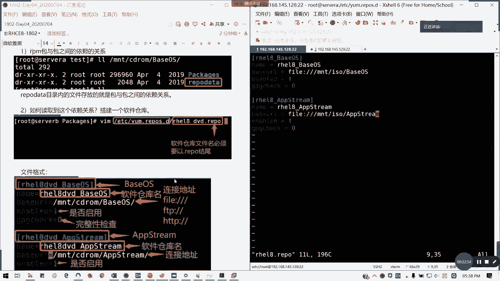

我就不再见了啊，大家如果没有的话啊如果没有的话，大家可以看一看我们格式怎么写。首先我们。

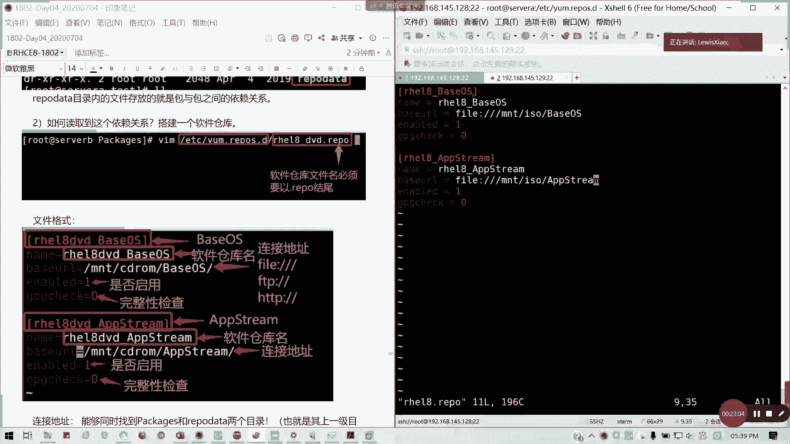

用方括号这块它是一个配置区块，配置区块的话分别代表不同的软件仓库配置项，它的所有它的一个report可以包含多层软件仓库，没有关系啊，然后呢，这也代表一个配就方括号开头的代表一个配置块，然后呢。

首先我们写什么？第一个我们的软件仓库名，对不对？

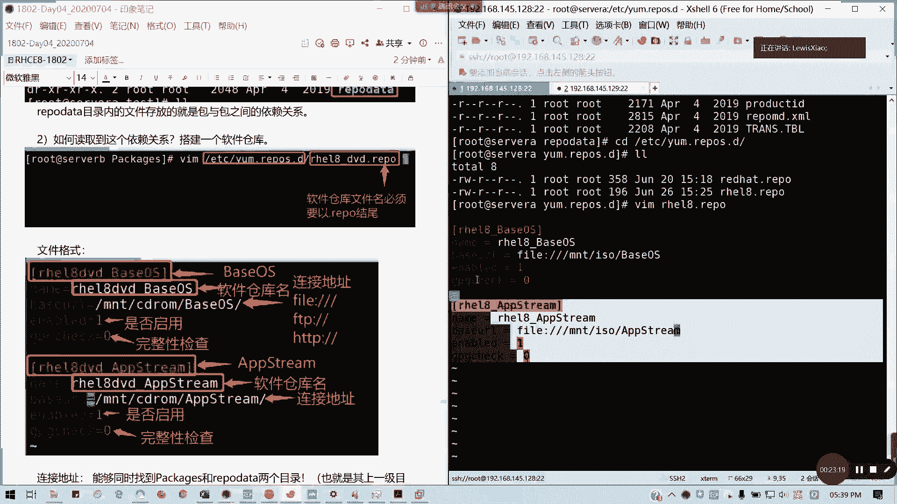

文件仓库名要写好，但这只是一个注释。然后呢，文件仓库名在这里啊，然后这里的话通常我们写个上面一样，然后呢，它的基本UIL也就它的软件仓库的读取地址。读取地址呢它是一个。

在package dress跟report data的上一层目录。也就是他的他不是要解决你的依赖关系吗？那是他那我们就是只要上一场目上一场目录就行了。上一层目录不要指到package里面。对。

到上一层目录就可以了。比如说到就我这里写的，我这里为什么又加fire？因为我用到它的协议，对不对？fire协议是文件协议，读本地的，为什么三个横杠，因为这里是根，懂吗？前面这个是叫文件协议。

然后后面这里从根目都开始写。对写到report data跟package的上一层。就连接地址，我必须要同时能够找到这两个目录。懂吗？然后呢，下面的enableable的等于一证明你的软件仓库是启用的。

记得啊很多人enableable没有低了。很多人在这里落个地，然后结果软件仓库不生效。懂我意思吗？所以这里enableable。的是吧。一起用。等于，但是你连着写，像我左边连着写没问题。

但是我为了格式美观，我们方便检查，就是前面参数空格等于值嘛，那我就这么写会更好，对不对？更加清晰美观，懂我意思吗？然后后面完整性检查。我这边我因为我刚才我导入密钥了，其实你如果导入密钥的话。

我可以写完整性的一个就检查的一个地址。如果没有。请显林。

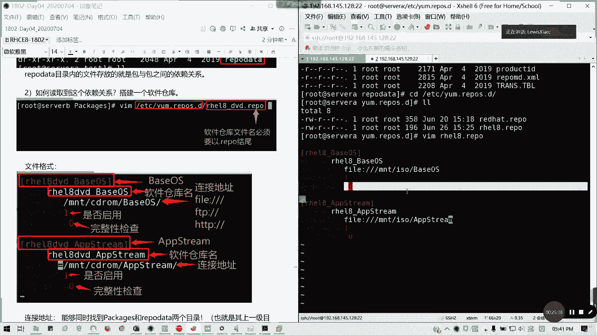

啊。跳舞过完整性检查。

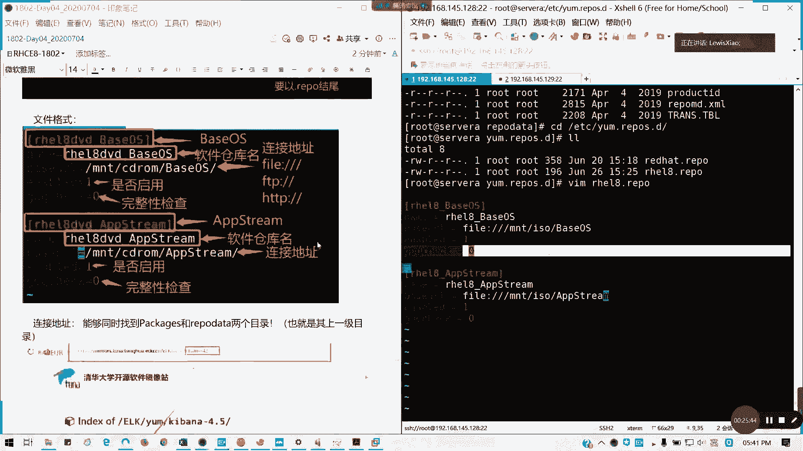

然后呢，通常来说我们在红帽八里面还有一个除了基本系统之外，还有一个应用流，我们照写就可以了。明白我意思吗？记得这个文件名一定要。点rapport结尾。

而且是放在ETC young点reles点D这个目录。懂我意思吗？

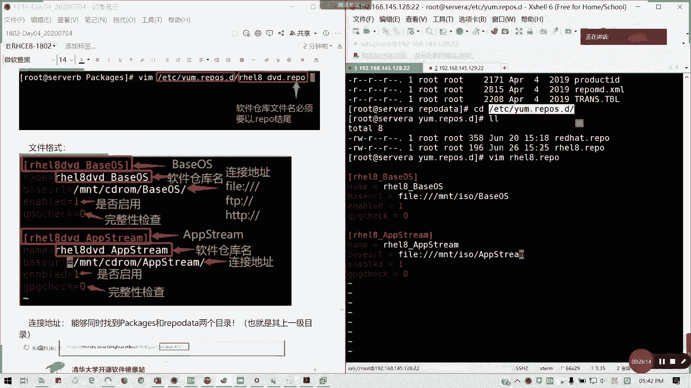

我这个我是我自己写的。所以刚才要解决一个本地样棉问题。然后如果是远程样源的话，你就把它改成网络地址。就可以了。就把这个baseURL我们改成网络的地址。就行了，明白我意思吗？

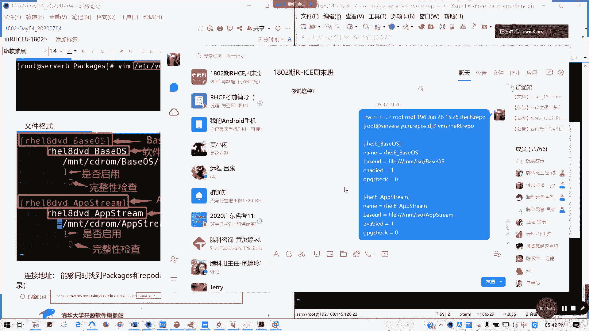

一定要记得啊，要找到package andreport data这两层的目录啊。

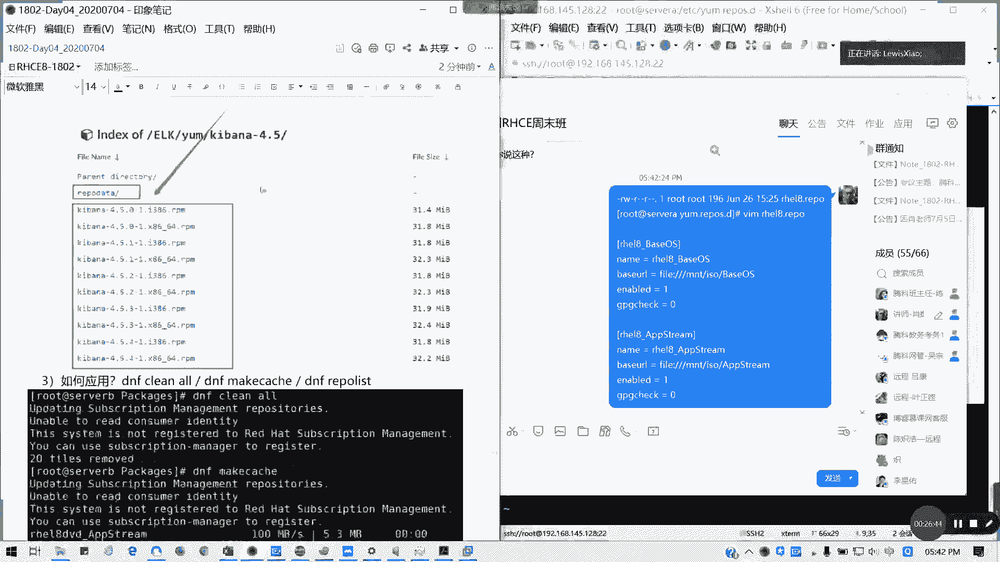

如何应用？我们先清理原数据缓存。我这里已经写好了，你们就你们可以自己写啊。这是挂本地光盘的一种形式。如果是像考试环境里面，你挂一个网址，你要会知道怎么知道怎么变哈，就变成HTTP是吧？他给你哪个地址。

你就套哪个地址就行了。然后如果你怕说那个到时会挂得不到，那你就看点进去看，然后一直找到它是不是在里面有report data，还有package两个目录。懂我意思吗？对，如果没有，你切到上一层看看。

然后把这个地址OK的话，把地址然后把这个地址复制下来，然后贴到我们这个re文件里面，然后如何生效？我们这里全部改用DH，先等等，我先清理掉有额原来的东西先。对吧。切到元数去缓存线，然后重建缓存。

因为他原来的rehead rap呢，它是要订阅的，懂吗？他这个是要订阅的，所以它留空嘛，所以一直会提示这句话。

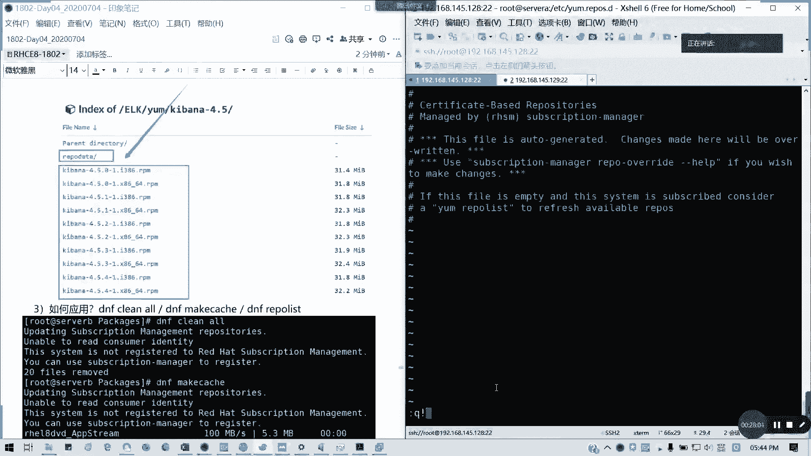

但是我这里我不管他了，因为我们自己有个样员，你以看到。是不是建已经已经有了，对不对？我本地挂的，然后DNF其实引用样也没问题。YUM也没问题，因为它是一个软链接。对吧。DNFrap race。

是不是里面4672加61658呀？总共有6000多个软件包，是不是？然后如何安装呢？DNFinstore杠Y比如说我装一个icecar的。targetげ。CLI我们装这个装这个ta给的这个端。

他就会帮你解决像python啊，他给restore等等，这些包它全部装上了。他给C1做什么用？它是一个Icar，也就是我们远程存储块，对吧？我们存储要绑就相当我们服务器我搭一个远程存储块。

然后我别的服务器我可以访问你的远程储储块，然后共享你的磁盘资源。懂吗？就类似于存储的访问方式。通过IP赛的协议啊。然后如何删除remve？他会把你依赖的东西全删掉。啊。这就解决了我们刚才这个问题。

是不是我们可以把先把这个东西选删掉啊？对吧我们可以把先把东西全删掉，对吧？就刚才我们RPM杠1不能解决问题，是不是已经解决了？然后列出来我们的所有软件包，仓库里面所有软件标DNFDNFlist。

然后我们可以默偶出来看看。一堆呀。一堆呀对吧？ok。然后查看软安装包信息，比如说关键是。跟我们刚才的RPM杠QI差不多。懂吧？可以理解吗？有点困了哈。然后还有就是我搜索。

比如搜索内核的安装包的关键词信息。对吧查找我们的安装包关键是，它会把所有的包注释它也列出来。然后查找对应的安装包提供者。叫whats provide。what provides啊，谁提供？

就刚才的R片杠QF。等于啊。懂吗？查看安装的历史记录DNF historyistory。我们刚才做了哪些操作？对不对？可以可以明白吗？我们刚才做哪些操作，装山全部都有。然后根据历史记录，我们可以撤销。

是吧。回滚喽。DNF。History。俺度。4杠Y我5啊，我就把先把这个又装回来。我删万一删除了包，这只能解决你删除的问，就你的包的安装跟删除的问题，解决不了你明面配置问题了。因为你删掉的话。

你就相当于你还原默认了，对不对？懂我意思吗？我这又把我刚才摔的包，我都装回去了。就对所做进行逆操作。还有一个组安装，组安装这一个图好像不见了啊，组安装图不见了。那我们来讲一讲。比如说。

我装一个merriDB数据库。我就把它所有东西全部装上。看一下。看一下，我想想啊，没有DB，我看哪里有主安装的。左安装，比如说那个叫做。组关键是我看下哪个组IS有没有。也没有。没有啊。

我看一下grouping store，我想想。group install store的话，我想想有没有哪一个包可以装组的？🎼module group这个的话，我就这个图丢了，我看一下啊。露不出来。

可他原我我没原图啊，我刚才当时煮完这我怎么装的？

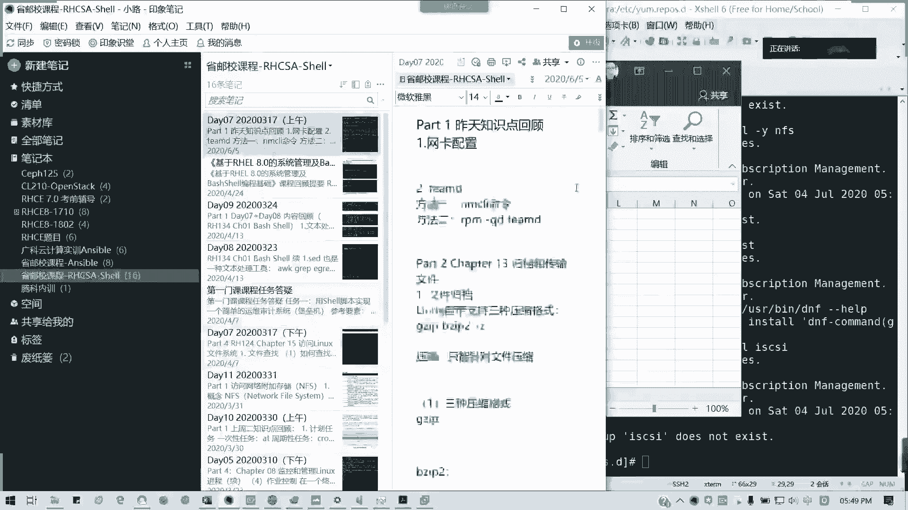

这里よ。我这里是装一个叫做虚拟化。我这装一个虚拟化的一个包，叫vi jackson host。这个组安装呢就是在我类似于我们在那个装我们的那个。在我们一开始安装什么设备比GY啊、mini膜啊，这一块吧。

它定义的一个软件包组里面，它可以啊我们这里可以就是进行一个主安装。服这里很久。mike catch应该就知道啊，就我们清除缓存装包然应该都。应该都知道啊。懂吧？它主安装grouping store。

我可以把全部相关软件包都装了。组的话一定是要里面定义好的一个名字。对吧那这里的话哇，你看。这就是装一个虚拟化的对吧？我已经装完了。which areson host这个是一个。

然后m catch跟clean all知道吧？知道吧。这两个刚才我们在建recorport文件的时候已经讲了。对吧。那好，因为时间关系51分了，我们。剩余的应用流。我交给应用流。

就是说我们的模块化应用流安装，包括1516章。我们留到下周六，因为明天不讲课，明天不讲课就给大家复习。今天讲的11、12、13、14章的一大半一半。一半多一点，然后练习呢其实我觉得大家练习的东西多了。

对不对？包括我们的网络，我们日志的一个，比如说你日志轮转，你怎么弄对吧？我们的网络怎么配，是吧？包括聚聚合，还有呢就是一个文件的归档增量传输，以及我们的y么，我们RPM的使用，已经够大家练习了。

如果说需要题目，我可以在下周一。给到大家下周一下周二给到大家做一个练习。那今天笔记的话，我这里先更新一下。我就把剩余内容一一并给到吧。好吧，把所有内容一并给到。然后呢。

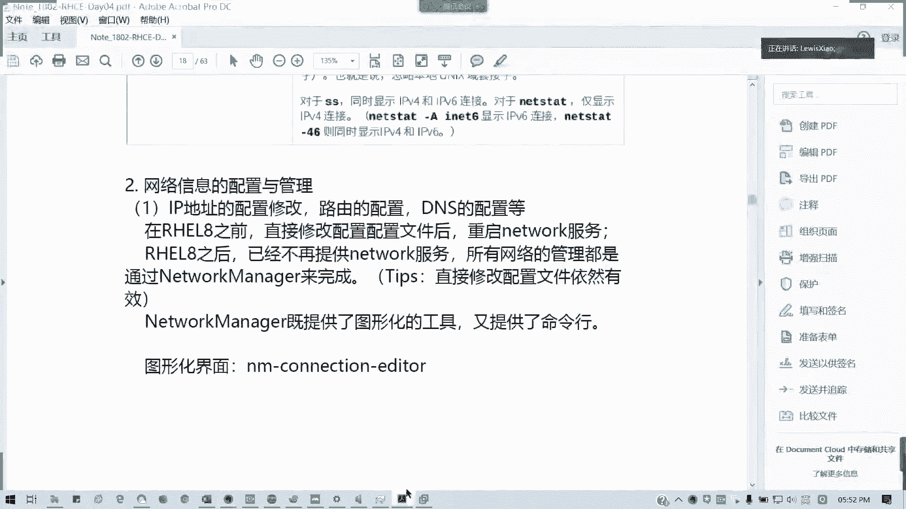

这块希望大家能够啊就先预行下来。下周我们的。内容呢会看从。应用流开始一路讲到脚本。同样11号12号都是6件价格。啊，暂定11号，我我看见暂定啊，没有没有事情的话，我们11号是讲到6点的。然后呢。

明天我要忙自己的事情去啊，但只过希望大家能够好好练习。

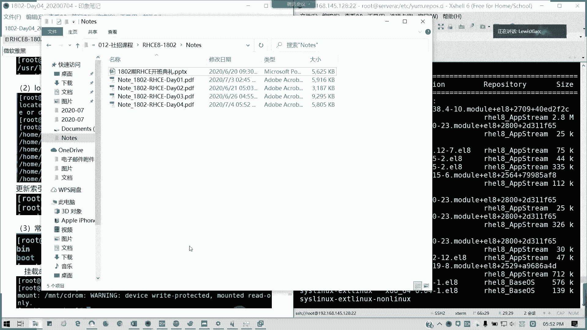

这一块都是基础来的，我先把笔记重新丢一下。视频的话，我可能看一下今晚我我时间怎么样。如果最快，我今晚传上去。

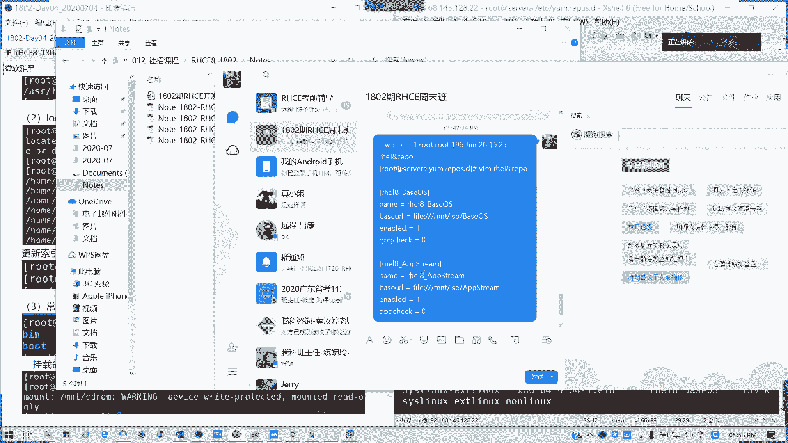

可以吧。我把这个笔记我把它删了，然后重新传一个新的。那好，我们今天先到这儿吧先到这儿。然后呢希望大家能够好好复习啊，这一周时间，虽然我们隔了隔一周就讲那么四3四章内容，但希望啊大家能好好复习。

然后呃接下来我们看一看啊，我们进度其实差不多了。我们第五天的话，我们要讲炫觉脚本了。所以的话接下来请大家拭目以待，难度开始加大啊，难度开始加大。所以的话希望大家好好复习。

如果收到明理解明白我讲的信息的话，请打歪。

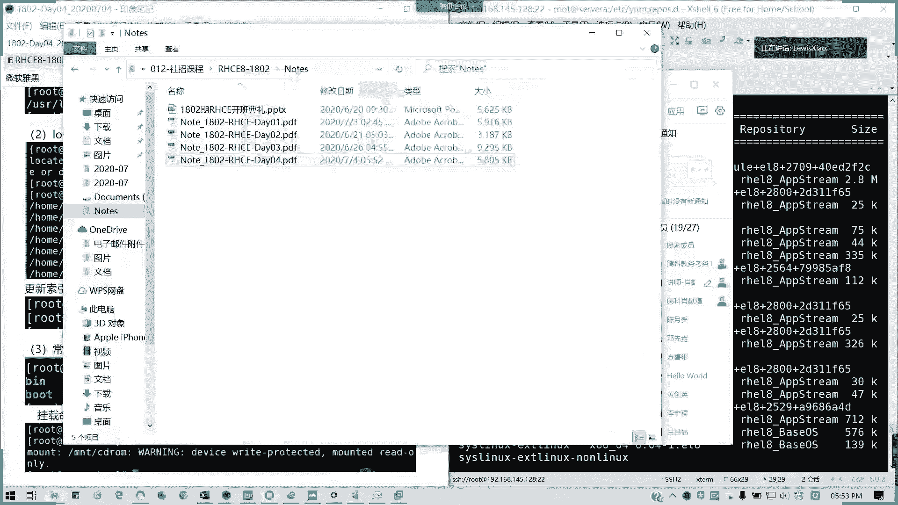

所有都有啊。收到小消心请打歪，那我们今天就提前5分钟。放学啊，停前5分钟放学。那我们今天到这里，谢谢大家下课。

