# 红帽认证教程：Day04：软件包管理（RPM及DNF）

## 概述
在本节课中，我们将学习红帽系统（RHEL 8）中软件包管理的基础知识。软件包管理是系统运维的核心技能，用于安装、更新、查询和删除软件。我们将重点介绍两种工具：底层的 **RPM** 工具和高级的 **DNF** 工具，并学习如何配置本地软件仓库来获取软件包。

---

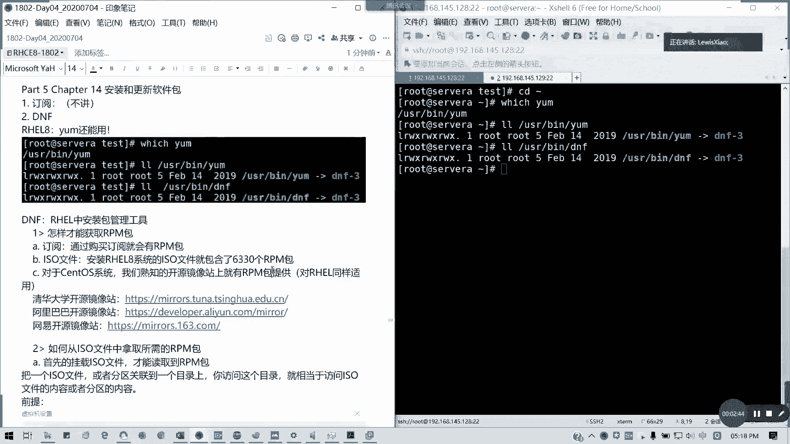

## 软件包来源
在管理软件包之前，首先需要知道从哪里获取它们。以下是几种常见的软件包来源：

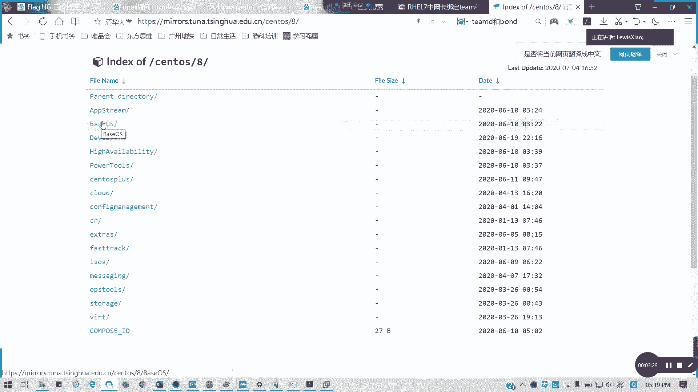

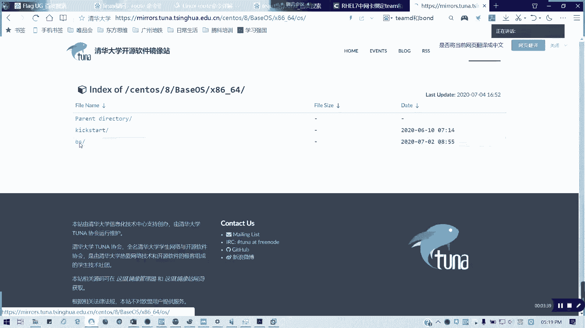

*   **红帽订阅**：通过购买红帽官方订阅服务获取，这是官方付费渠道。
*   **安装光盘/ISO镜像**：红帽的安装介质（如DVD ISO文件）本身包含了大量基础软件包，可以免费使用。
*   **开源镜像站**：对于社区版系统（如CentOS），可以从国内外的开源镜像站获取软件包，例如：
    *   清华大学开源镜像站
    *   阿里云开源镜像站
    *   网易开源镜像站

> **注意**：使用网络镜像站需要系统能够访问互联网。

---

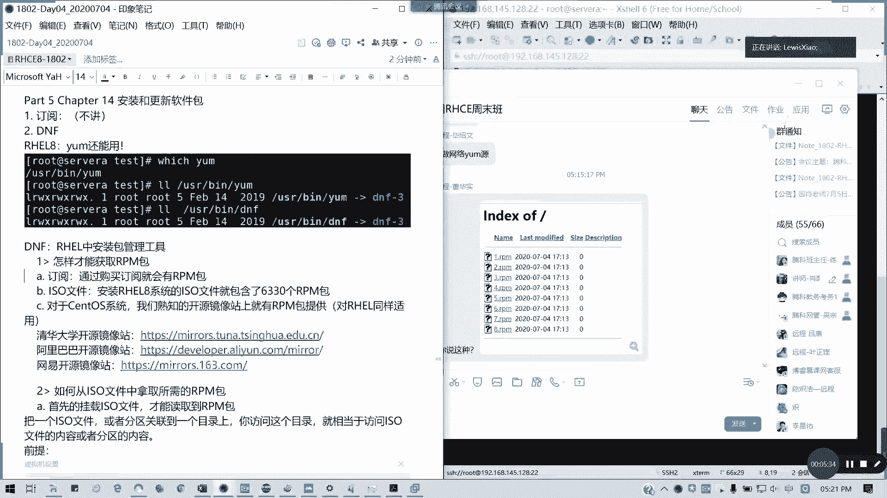

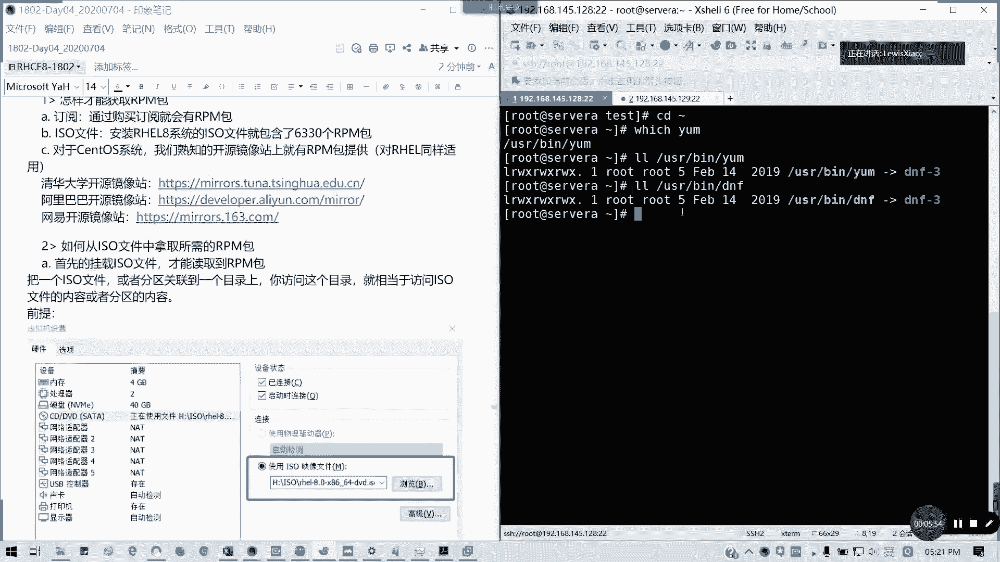

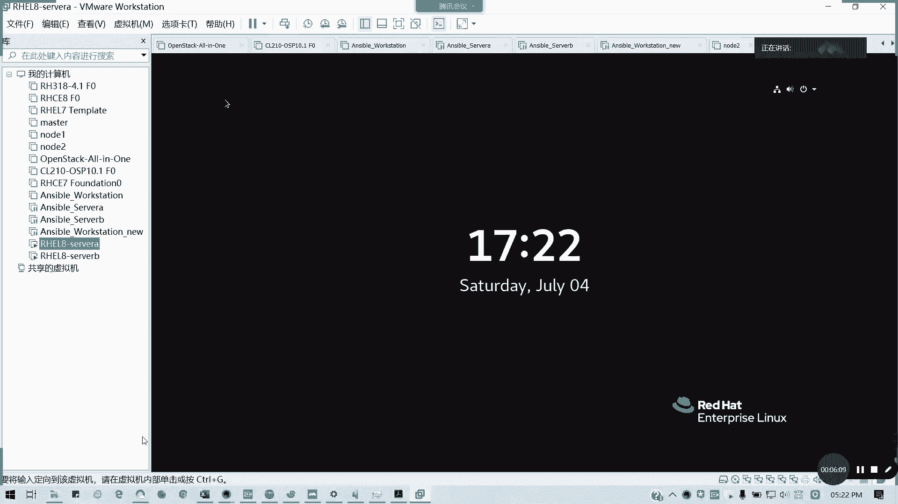

## 从ISO镜像配置本地仓库
上一节我们了解了软件包的来源，本节我们将学习如何利用本地的ISO镜像文件建立一个免费的软件仓库。

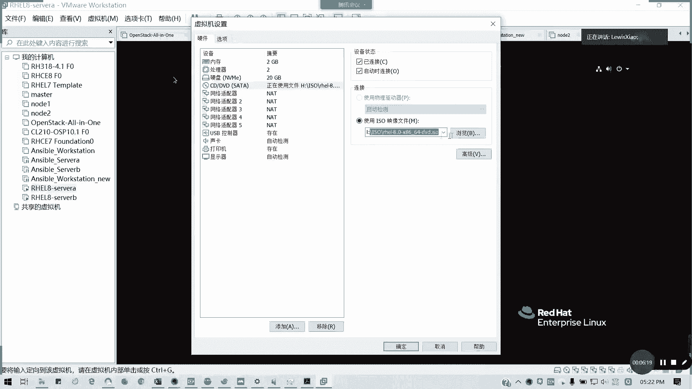

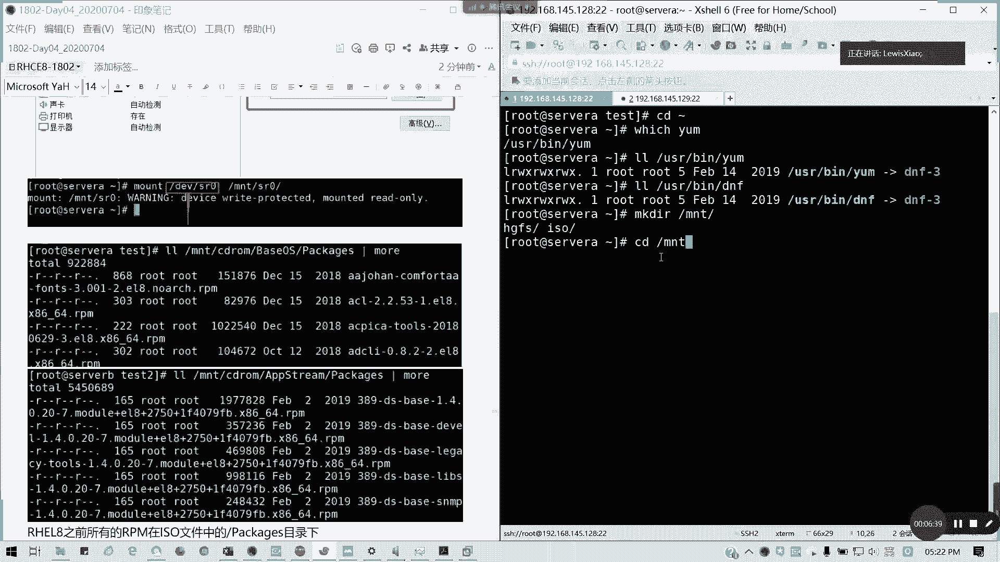

首先，需要将ISO镜像文件挂载到系统目录。例如，将光盘设备 `/dev/sr0` 挂载到 `/mnt` 目录：
```bash
mount /dev/sr0 /mnt
```
挂载后，可以在 `/mnt` 目录下看到 `BaseOS` 和 `AppStream` 两个目录，它们分别包含了系统基础包和应用程序包。

接下来，需要在 `/etc/yum.repos.d/` 目录下创建一个仓库配置文件（以 `.repo` 结尾）。以下是配置示例：
```ini
[Local-BaseOS]
name=Local BaseOS Repository
baseurl=file:///mnt/BaseOS
enabled=1
gpgcheck=0

[Local-AppStream]
name=Local AppStream Repository
baseurl=file:///mnt/AppStream
enabled=1
gpgcheck=0
```
**配置项说明**：
*   `[Local-BaseOS]`：仓库配置块的名称。
*   `name`：仓库的描述信息。
*   `baseurl`：软件仓库的实际路径。`file://` 表示使用本地文件协议。
*   `enabled=1`：启用此仓库（必须设置为1）。
*   `gpgcheck=0`：不进行GPG签名检查（对于本地源可关闭）。

配置文件创建后，需要清除旧的缓存并建立新缓存，使配置生效：
```bash
dnf clean all
dnf makecache
```

---

## RPM软件包管理工具
在配置好软件仓库后，我们就可以安装软件了。首先介绍底层的 **RPM** 工具。RPM 可以处理单个软件包，但**无法自动解决软件包之间的依赖关系**。

### RPM包命名规则
一个RPM包的文件名包含了丰富的信息，格式通常为：
```
软件名-版本号-发布版本.系统版本.硬件架构.rpm
```
例如：`samba-4.10.3-6.el8.x86_64.rpm`
*   `samba`：软件名称。
*   `4.10.3`：主版本号。
*   `6`：发布版本号（由打包者定义）。
*   `el8`：适用于 Red Hat Enterprise Linux 8。
*   `x86_64`：适用于64位x86架构。
*   `.rpm`：文件扩展名，表明这是一个RPM包。

### 常用RPM命令
以下是RPM工具的一些核心操作命令：

*   **安装软件包**：`rpm -ivh 包名.rpm`
    *   `-i`：安装。
    *   `-v`：显示详细信息。
    *   `-h`：显示进度条。

*   **升级软件包**：`rpm -Uvh 包名.rpm`

*   **卸载软件包**：`rpm -e 包名`

*   **查询已安装的包**：`rpm -qa | grep 关键字`

*   **查询包安装的文件列表**：`rpm -ql 包名`

*   **查询包配置文件**：`rpm -qc 包名`

*   **查询包文档**：`rpm -qd 包名`

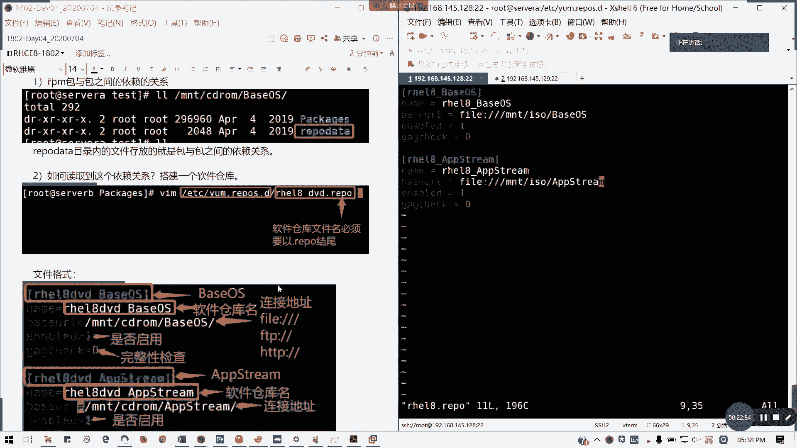

*   **查询包详细信息**：`rpm -qi 包名`

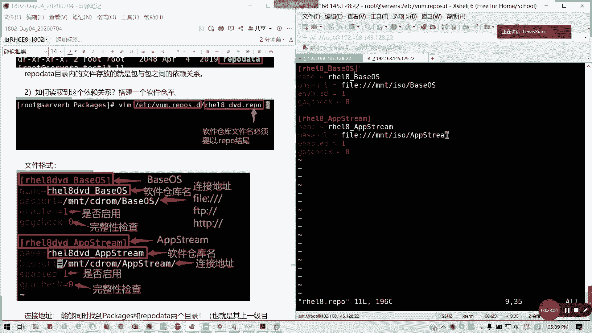

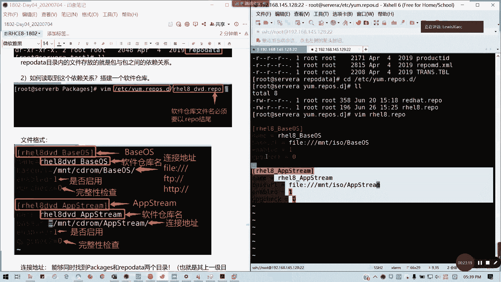

*   **查询文件由哪个包提供**：`rpm -qf /path/to/file`

> **注意**：使用RPM安装时，如果遇到缺失的依赖包，会报错并中止安装，需要手动先安装所有依赖，过程较为繁琐。

---

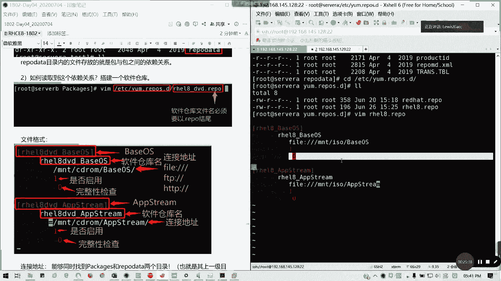

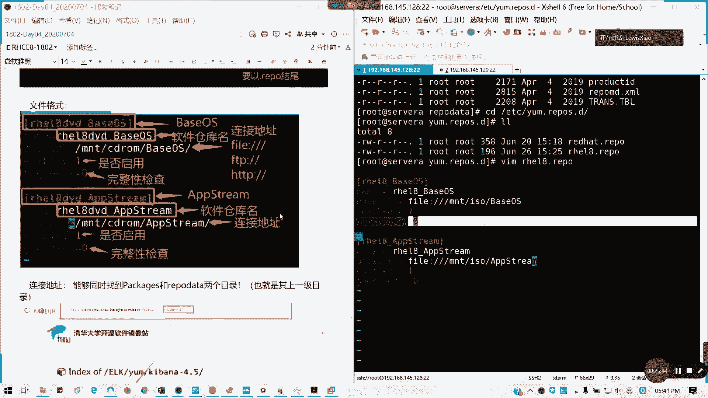

## DNF/YUM软件包管理工具
为了解决RPM的依赖问题，我们使用 **DNF**（或它的前身YUM）工具。DNF能够自动从配置的仓库中下载软件包并解决所有依赖关系。

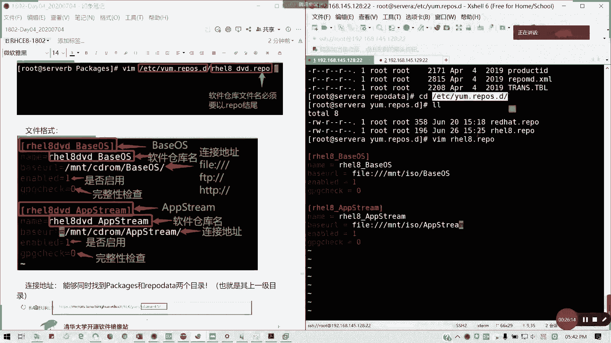

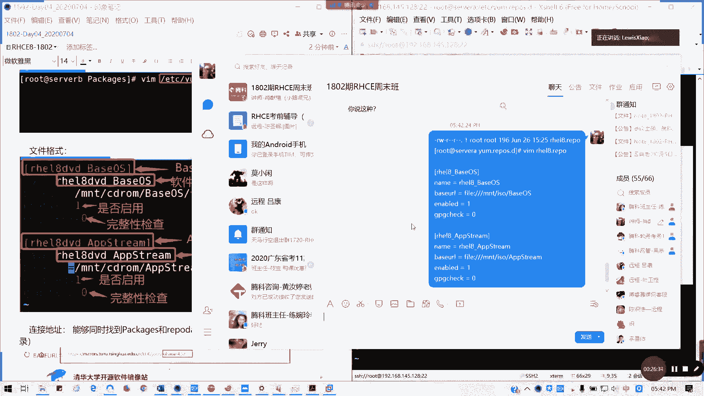

### 常用DNF命令
DNF命令比RPM更加简洁高效，以下是一些常用操作：

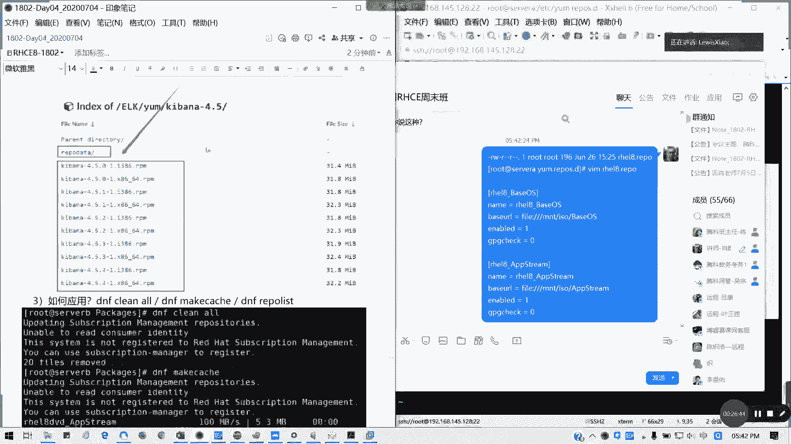

*   **安装软件包**：`dnf install -y 包名`
    *   `-y`：自动确认，无需手动输入“y”。

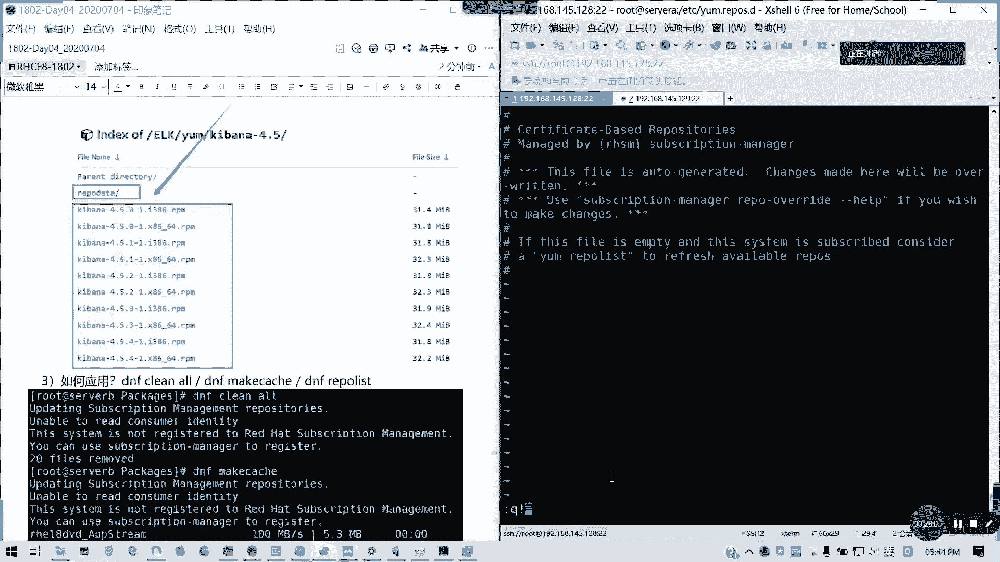

*   **卸载软件包**：`dnf remove -y 包名`
    *   会自动移除不再需要的依赖包。

*   **更新软件包**：`dnf update -y 包名`

*   **搜索软件包**：`dnf search 关键字`

*   **列出所有可用包**：`dnf list`

*   **查看包信息**：`dnf info 包名`

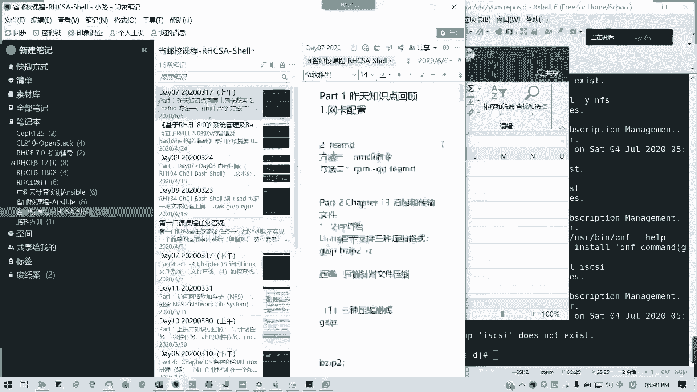

*   **查看操作历史**：`dnf history`
    *   可以查看所有安装、更新、删除记录。

*   **撤销历史操作**：`dnf history undo 记录ID -y`
    *   可以回滚到之前的某个状态。

*   **清除缓存**：`dnf clean all`

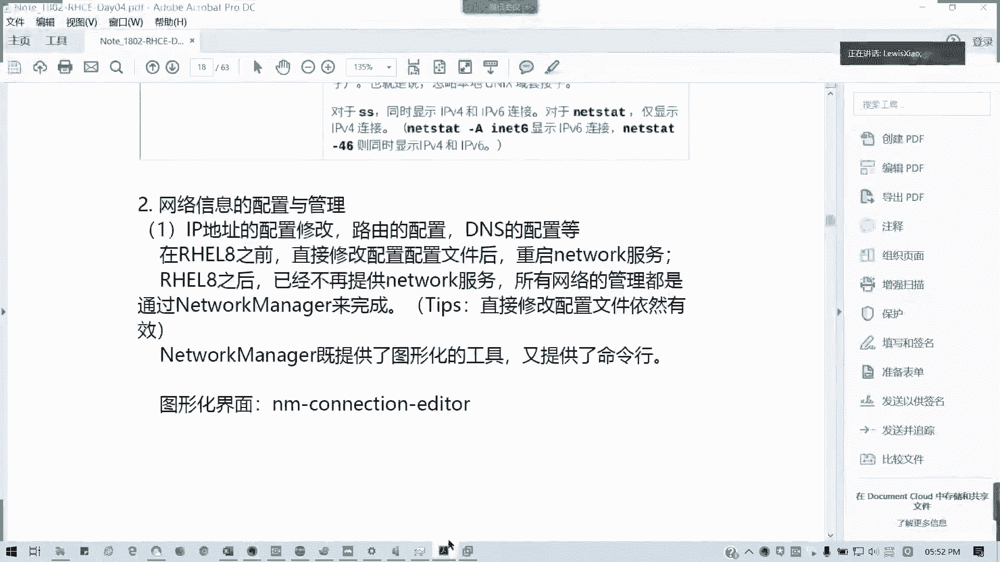

---

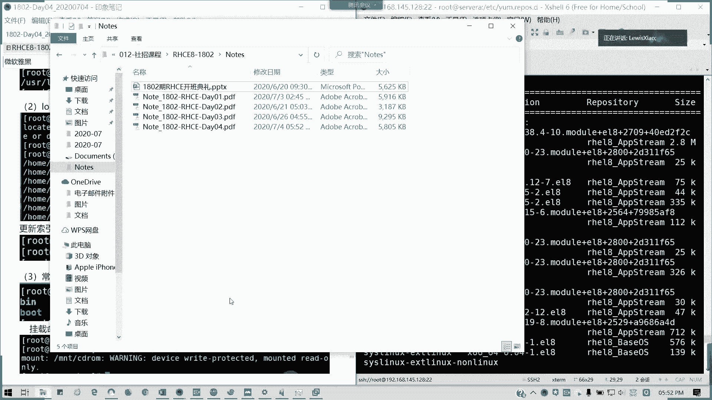

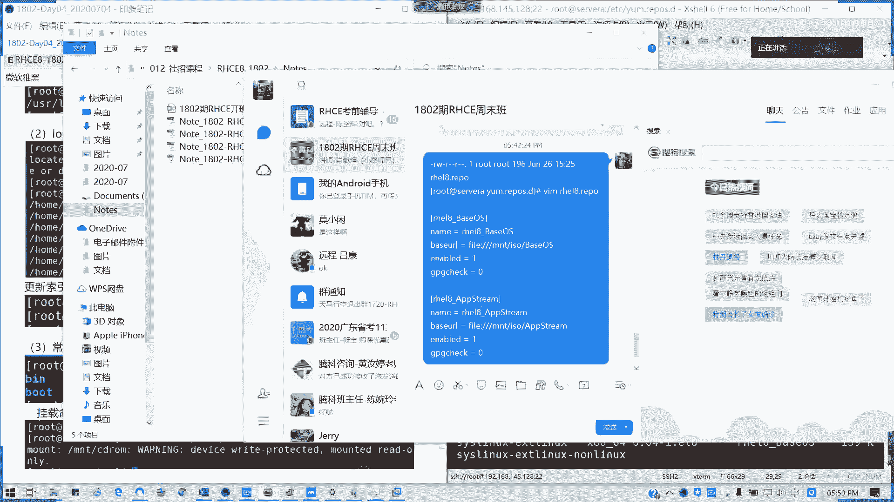

## 总结
本节课我们一起学习了红帽系统中的软件包管理。
1.  我们首先了解了软件包的多种获取渠道。
2.  接着，我们学习了如何通过挂载ISO镜像并编写 `.repo` 配置文件来建立本地软件仓库。
3.  然后，我们深入探讨了底层的 **RPM** 工具，学习了其包命名规则和用于安装、查询、卸载的基本命令，同时也认识到它无法自动处理依赖关系的局限性。
4.  最后，我们介绍了更先进的 **DNF** 工具，它能够自动解决依赖问题，并演示了其安装、删除、搜索、历史管理等常用命令，极大地简化了软件包管理流程。

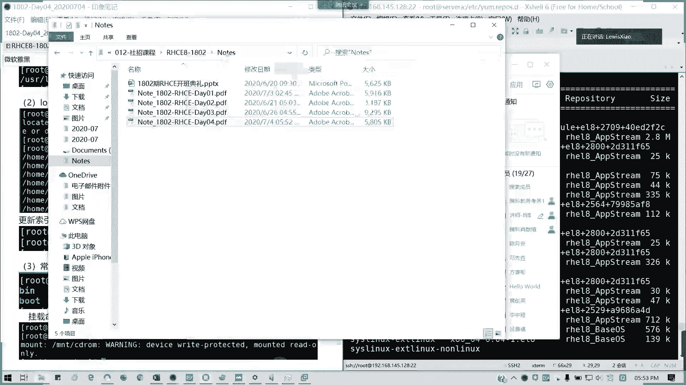

掌握这些知识是进行系统管理和维护的基础。下一节课，我们将继续学习软件管理的进阶主题——模块化应用流。