# 2021全新 RHCE8.0 红帽认证入门教程——可零基础入门学习【网络安全／Linux】 - P25：Day05_RH124_Ch14a_软件包管理2_模块化 - IT老表哥 - BV1444y1h7Bx

看一看啊。

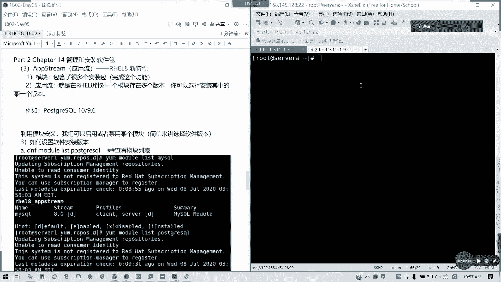

14章我们是不是都弄有一个部分没讲，就是一个应用流。应用流，也就是简单说就是我们的一个模块化安装。这块的话是8。0版本输出之后啊，我我们的样更新之后的一个特性啊，在7。0是不支持这个特性的啊。

懂我意思吧？然后呢，我们通常呢我们是应用流是通过模块化就安装模块的话，它模块里面包含了。很多的安装包。那应用流什么意思呢？我们这里红帽八是有个叫应用流的一个概念。

那应用流呢就是在我们的红帽八里面针对一个模块存在多个版本的情况。

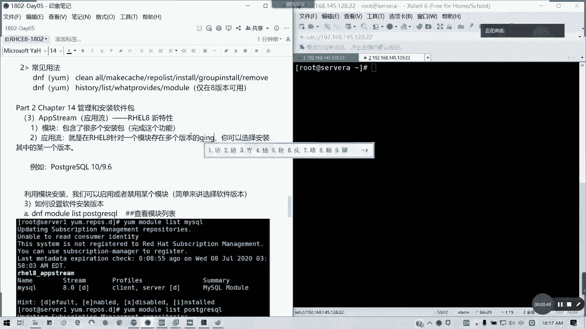

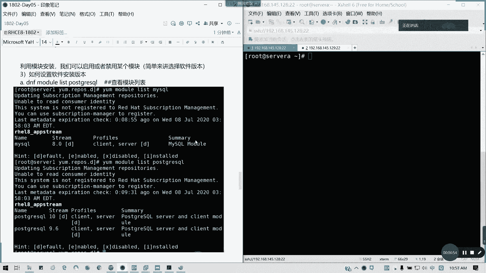

针对存就存在多个版本的情况，我们是可以选择安装其中的某一个版本啊，特别是我们考虑到一些像应用的一些兼容性版本的兼容性问题。是不是有时候我们默认它可能会安装一些高版本，对不对？按安装高版本。

那有时候我们需要低版本情况下怎么办呢？在我们的那个module啊，我们引入了我们DNF的model模块之后呢，modmod我们的应用流呢，模块安装应用流的话，我们就可以解决这个问题了。

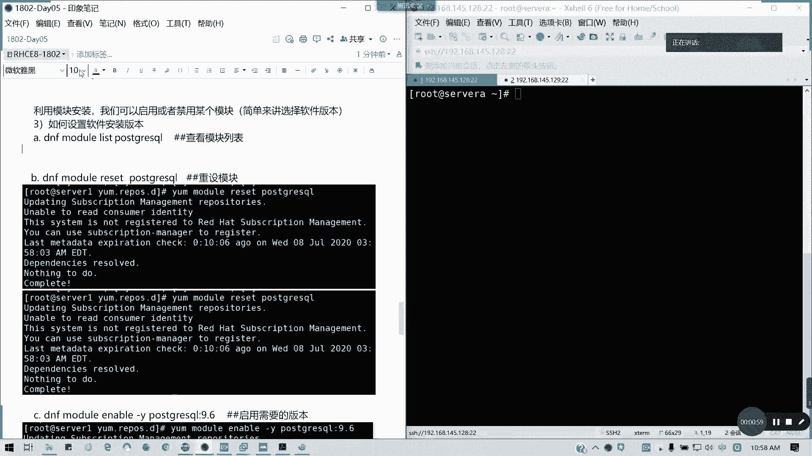

比如说我们的postscript啊。我们可以用ym用DNF啊，model model。List。然后postse gray，比如说我们的那个postse gray circuit，我们用这个例子。哎。

posts gray等一下BOSDGRE。

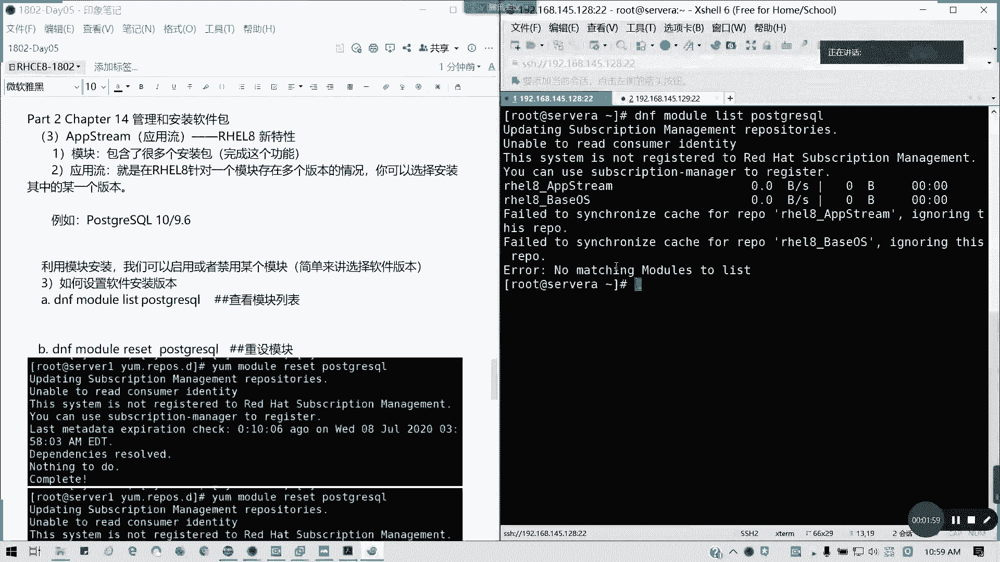

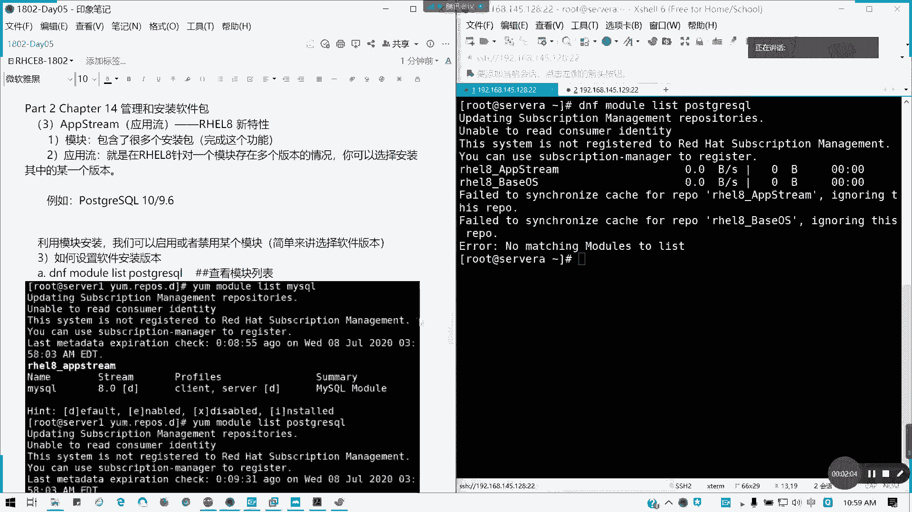

我这个好像那个哦我这个rap好像有问题，我我等一下啊，CVS20。这个牌好像没挂上。

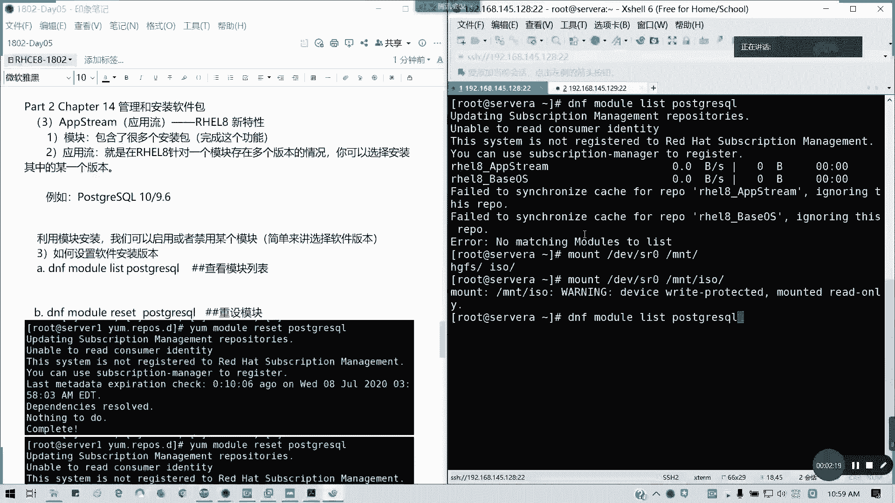

有啦，刚才我是那个牌没挂上啊，这里的话就主要出现这个问题。像我们的post grade circle呢，我们这里会看到。它有两个版本，一个是十，对吧？一个是10点的，一个是9。6。

然后它有对应的配置文件，然后后面带滴是默认安装的一个版本，它的前面是软件名，然后后面是留留的意思就是一个版本控版本号，对吧？版本控制，然后是否是默认安装的一个选项。对吧10跟9。6。

那我们的话可以通过啊启用或就某个模块来进行一个。应用流的控制。简单来说就是选择软件版本。我们简单的理解啊。这model模块其实它的引出的话就是为了方便我们选择版本用的那如何设置我们版本呢？

首先刚刚才我们列出一个我们需要设置应用流的一个软件包，后面是更具体的，我们这也用postsscript circle做例子，因为它刚好有两个版本，一个11个9。6。好吧，然后呢。

接下来我要进行一个模块的重设。就把他原来设置重新设，重新设过一遍，然后我们才能选择版本。样啊DNF啊样不样也可以DNF module。reset然后后面。🎼Hse great。sQ跟转件名，更要报名。

我们这里的话已经重设完毕了。如果你改过版本，他会帮你重设到默认的值。这拉新读度哈，就是说我这里已经是原来的默认测试，我们就不需要了。然后呢，接下来我们要。设是应用流啊，就我们要把那个。

🎼DF module。Enable。我们要启用我们的另外一个瘤DNABLE啊。我看看是应该是先禁用再启用，我试一试啊。先。我看一下diable杠。Why。Potscript。怎么写呢？后面怎么写呢？

冒号后面跟我们留，也就是我们的版本。我先看先进用一下十，我看有没有用啊。然后呢，我们再启用一下9。6。我们首先啊先禁用啊禁用当前的默认值。the post gray circle的1的应用流。

这是第C一步啊，DNDNF。moddel disable杠 y。Pouse great。circle1冒号啊，记得我们版应用流后面是。跟冒号的，我这里截一下图放过来。然后我们再启用我们的那个9。

6的版本。在这下面啊。

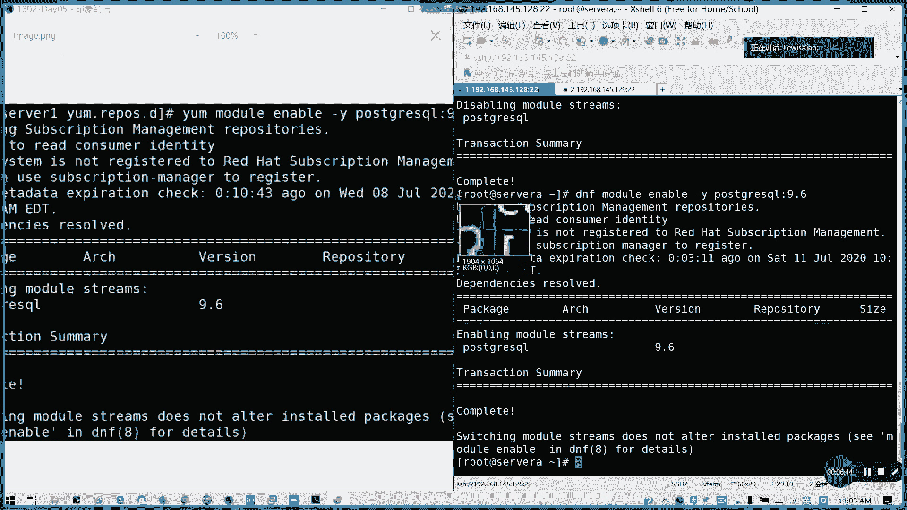

你看这个fion9。6已经是起来了，对不对？

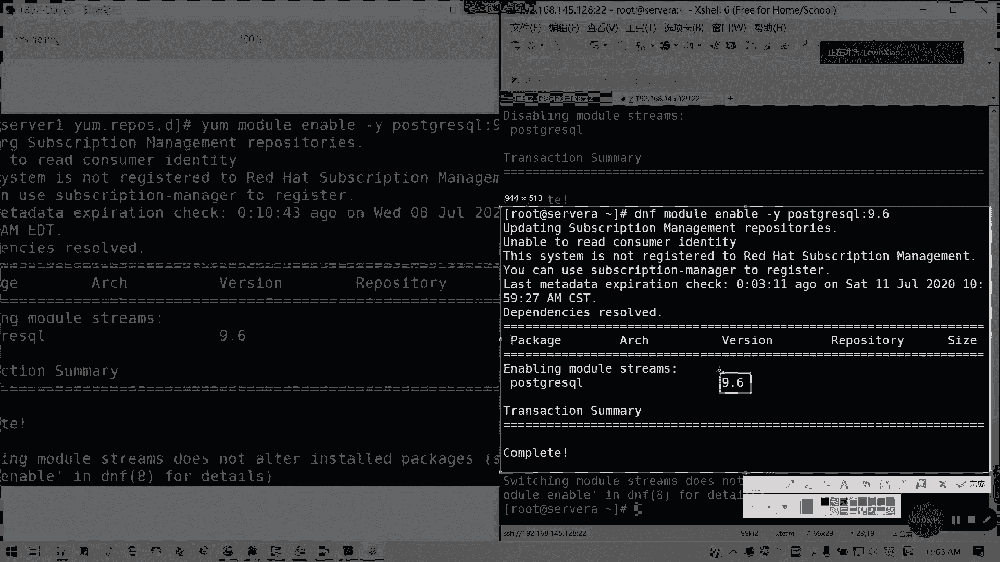

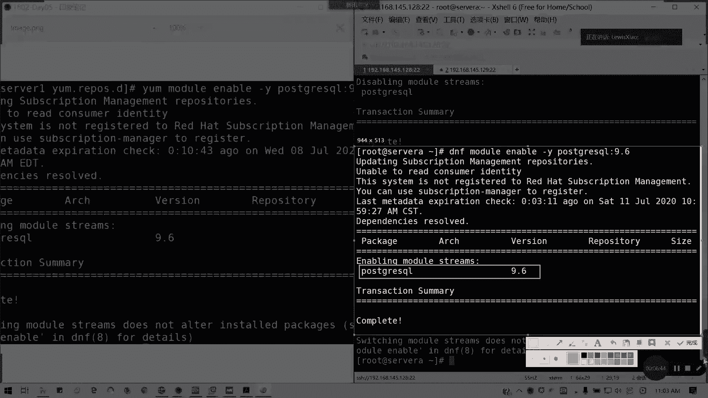

这是它是记用整个啊它的金用整个。然后我们把它启用19。6，然后我们再list一遍。

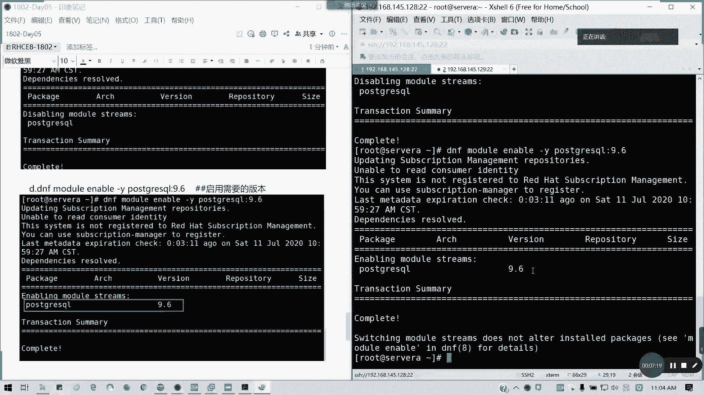

你再历史一遍，看看现在的情况。我默认没有设，但是我们现在已经启用了1个9。6啊。这里变成了一个E对吧？E代表什么？if for enable啊。对吧第一是default。我们再次查看啊。

再次查看我们的一个模块列表。验正新。指定的应用流。有没有启用啊？那我看一下有一个module，我看一下defa这个选项有没有。我看一下怎么去s default啊，对我们的一个。如何设置。

disable enable这个有了。Before这个好像是没我看一下，好像是没有那个。好像是没有这个选项的啊。那没关系那没关系没关系，我们现在已经设置完了，那我们就进行一个模块安装。模块安装的话。

我们就现在我们用模块安装的话，模块安装那就可以。等一下，我这里的话，我要重新截一下图。刚才那个图好像不见了。再次验证。我们已经启用了1个9。6啊9。6的一个应用流，就低版本那低版本的啊。然后呢。

我们来试一下，我们用那个模块安装。那我们如果只进行模块化安装啊，模块安装。🎼我们看一下模块安装怎么装呢？我就不能普通用，就不能普通直接DN接DNFinst了。我们就用modulein啊。

module前面这样用模块化安装，然后杠Y。Pll great。Circle。那我们安装的看看是什么版本啊，9。6的对不对？看到没有？我们的右流速不是切到9。6了？

那这样的话就是相当于我们可以选择我们的版本啊，我这里截个图就这里就很清楚了。我们的postse grade啊post grade这个版本已经前成功的切换到了9。6，它就不会按照我们10。0的。

版本去安装了。对我们的serv包括我们的serv入啊，对不对？postplay circlecle server还有我们的。我们的依赖关系对不对？依赖关系这块的话。

它就不会按照我们的默认的实版本去安装了。他按照我们9。6去安装了，懂我意思吗？那我们其实副总小结来说小结一下，就是我们的一个步骤啊，模块化安装步骤，也就是下面这四四步啊。所以大家可以现在有时间的话。

找一下我们的一列出一下我我们的一些可以选应用流的一些软件包试一下进行模块安装。所以的话我们14章的话，就加这么一个新特性的内容，在7版本以下是没有这个的，对吧？没有这个8。

0才有选择吧我们简单来说就是我们选择需要的版本。需要的软件版本啊，因为特别是在企业环境里面，有些新版本可能不被支持。对不对？有有有些那个我们还是用姜还是老的蜡特。

有些配上那个环境啊等等这些我们不能用太新的客户端或服务端。那有时候我们怎么去选择版本呢？module我们的应用我们的模块化安装，我们的应用流可以帮到我们。那这一块讲完如果没问题，请打14。然后呢。

大家做一下这个应用流切换一个练习，给大家10分钟时间。然后待会我们讲15章，讲文件。查找跟定位。好吧。

