# 红帽认证入门教程：14a：软件包管理2 - 模块化应用流 🧩

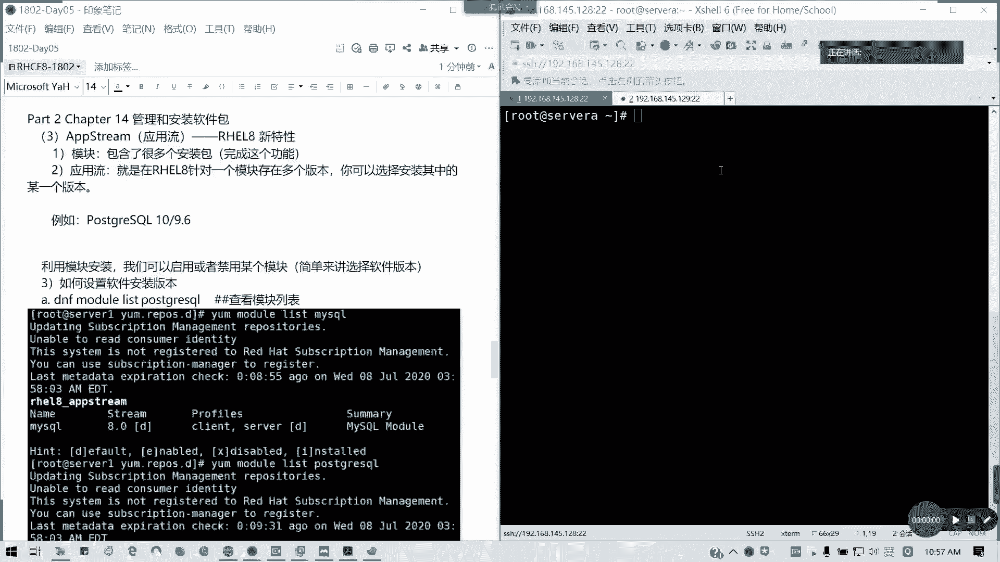

## 概述
在本节课程中，我们将学习红帽企业版 Linux 8.0 引入的一个新特性：模块化应用流。这个特性允许我们为同一个软件包安装和管理多个版本，这在处理软件兼容性问题时非常有用。

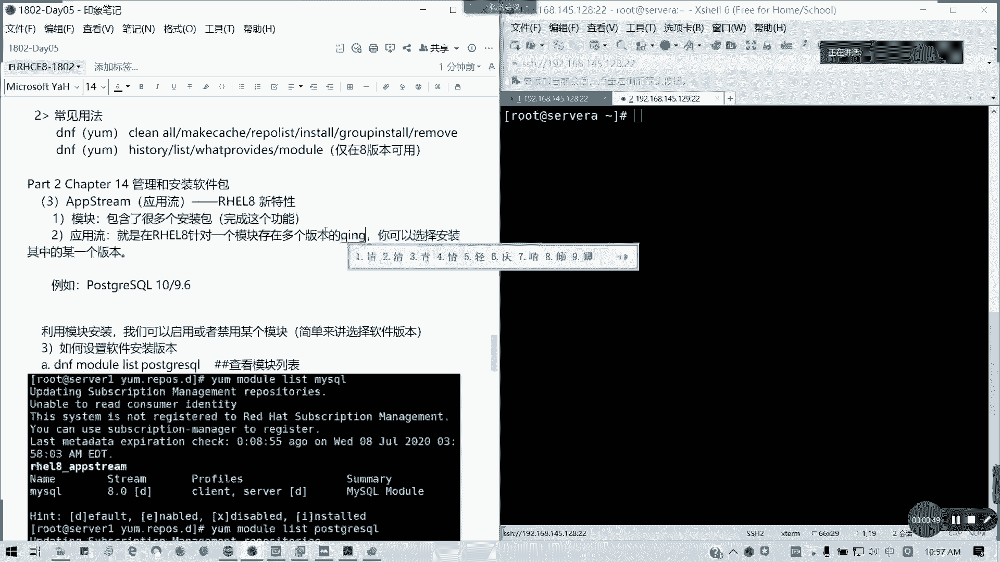

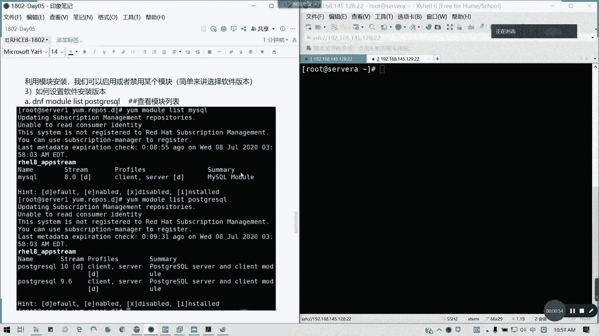

---

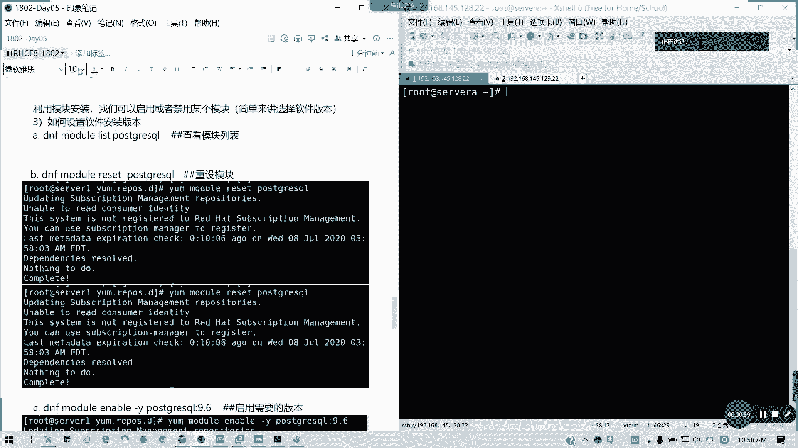

## 什么是应用流？
上一节我们介绍了基础的软件包管理。本节中，我们来看看模块化应用流的概念。

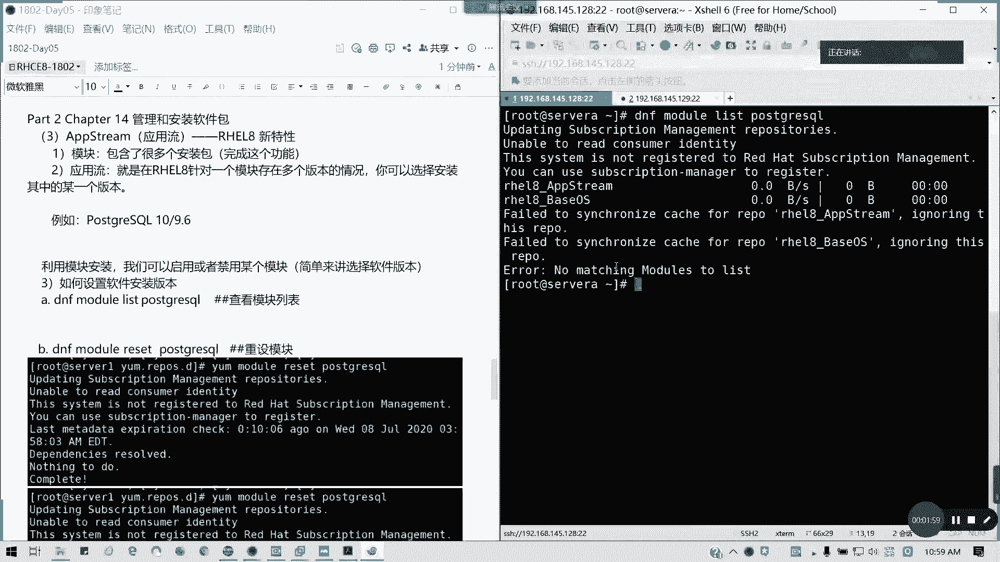

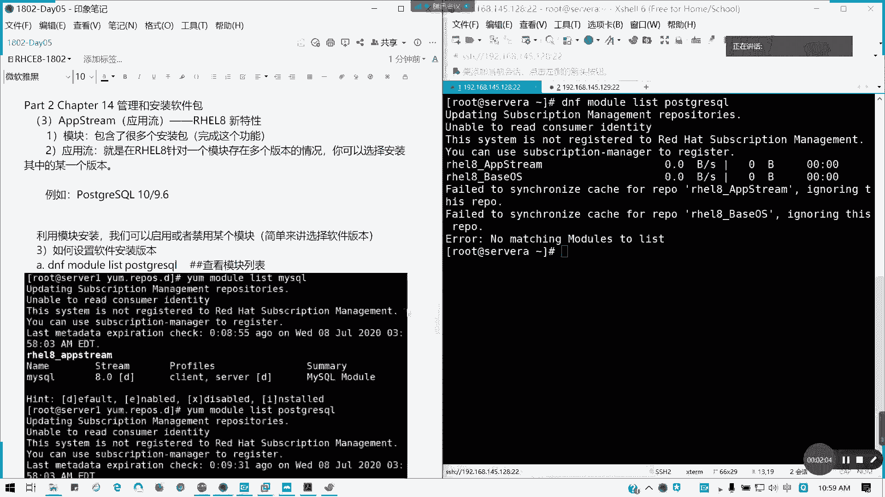

应用流是红帽8.0版本引入的特性，在7.0版本中并不支持。简单来说，应用流就是通过模块化方式安装软件，一个模块里可以包含多个安装包。

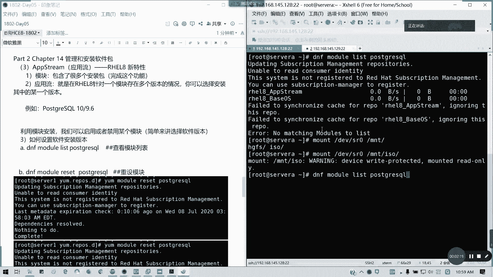

应用流的核心概念是：针对一个软件模块存在多个版本的情况，用户可以选择安装其中的某一个特定版本。这主要解决了应用程序的兼容性问题。默认情况下，系统可能会安装高版本软件，但当我们需要低版本时，就可以通过模块化应用流功能来实现。

## 查看可用的应用流
要使用应用流功能，首先需要查看一个软件有哪些可用的版本流。

例如，以 `postgresql` 软件为例，我们可以使用以下命令查看其可用的模块和应用流：
```bash
dnf module list postgresql
```
执行该命令后，输出结果会显示类似以下信息：
```
postgresql 10 [d]  postgresql 9.6
```
*   **`postgresql`**: 软件名。
*   **`10` 和 `9.6`**: 代表两个不同的应用流，即软件版本。
*   **`[d]`**: 标记在 `10` 后面，表示 `10` 是当前默认安装的版本。

这表示 `postgresql` 模块有两个可用的应用流（版本）：10 和 9.6。

## 如何切换应用流版本？
理解概念后，接下来我们学习如何切换应用流版本。整个过程分为几个步骤。

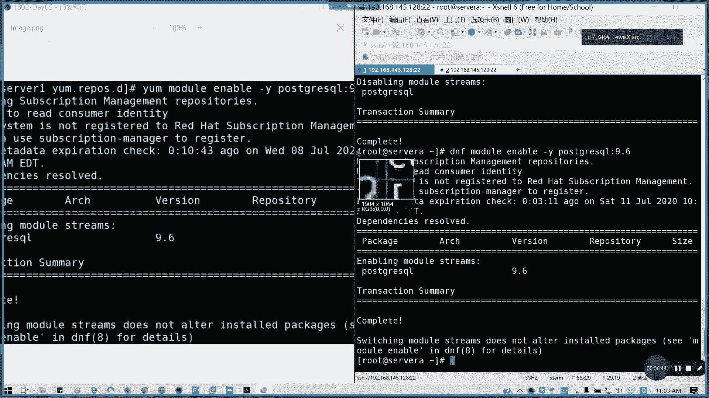

以下是切换 `postgresql` 默认版本从 10 到 9.6 的具体操作步骤：

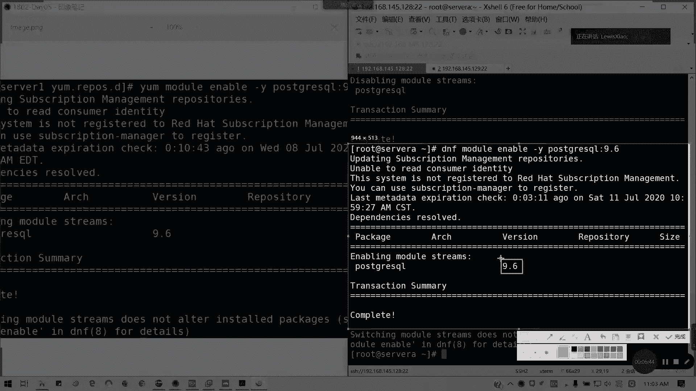

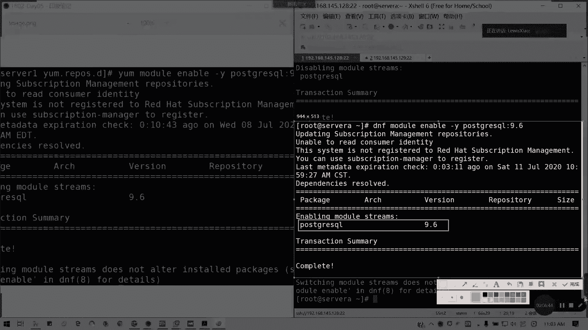

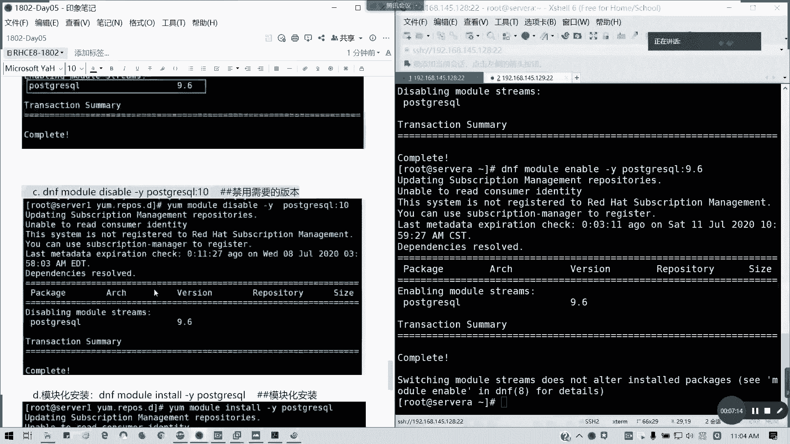

1.  **重置模块状态**
    如果之前修改过模块设置，建议先重置到默认状态。使用以下命令：
    ```bash
    dnf module reset postgresql -y
    ```

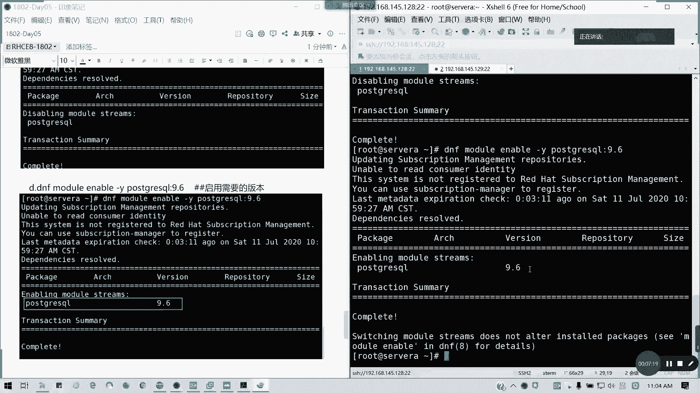

2.  **禁用当前默认的应用流**
    我们需要先禁用当前默认的版本（例如 10）。使用以下命令：
    ```bash
    dnf module disable postgresql:10 -y
    ```
    注意命令格式为 `模块名:应用流`。

3.  **启用目标应用流**
    然后，启用我们想要安装的版本（例如 9.6）。使用以下命令：
    ```bash
    dnf module enable postgresql:9.6 -y
    ```

4.  **验证应用流状态**
    可以再次列出模块信息，确认 9.6 版本已被启用（标记可能变为 `[e]` 表示 enabled）：
    ```bash
    dnf module list postgresql
    ```

5.  **通过模块安装软件**
    设置好应用流后，不能直接用 `dnf install` 安装，而需要使用模块安装命令。这会按照我们启用的应用流（9.6）来安装软件及其所有依赖。
    ```bash
    dnf module install postgresql -y
    ```
    安装完成后，系统安装的将是 `postgresql 9.6` 版本，而不是默认的 10 版本。

## 总结
本节课我们一起学习了红帽8.0的模块化应用流管理。

我们了解到，应用流功能允许管理员为同一软件选择不同的安装版本，这在企业环境中对于满足特定软件或环境的兼容性要求至关重要。其核心步骤包括：查看可用流、重置模块、禁用旧版本流、启用新版本流，最后通过模块命令进行安装。

通过掌握这个功能，你可以在需要时灵活地安装旧版或特定版本的软件，而不仅仅是系统默认的最新版本。