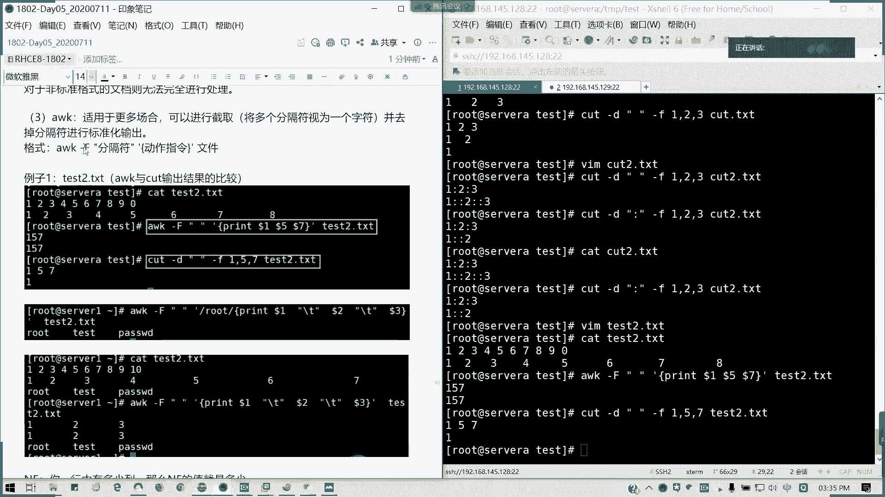
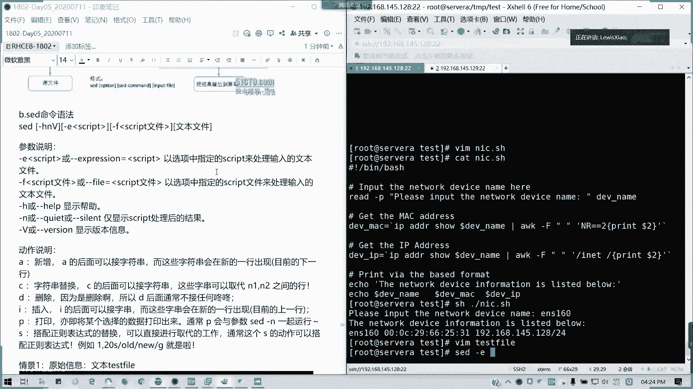
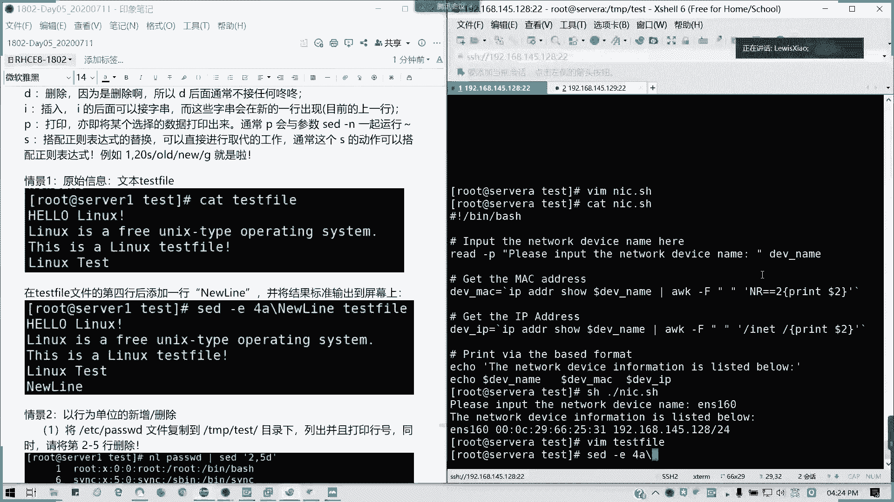

# 2021全新 RHCE8.0 红帽认证入门教程——可零基础入门学习【网络安全／Linux】 - P28：Day05_RH134_Ch01_Shell基础02 - IT老表哥 - BV1444y1h7Bx

好，我们回来3点30分啊，我们继续啊刚才说cut我们有局限性。那我们AWK的话就刚好解决了这个问题。它是可以进行标准啊进行截取，然后并标准化输出啊，标准化输出我们来。它的指令啊它指令就是AWK啊。

杠大F format啊for，然后后面分隔符引号里面是分隔符，然后呢。这里我动作指令，这里不要漏了一个单引号啊，动作指令我这里应该是一个半脚符号才对的啊。动作指令。然后后面跟文件懂吗？

我们来看一看我们的一个例子。T2点TST我们这里面我们是一个文本啊，文本就1234567891090吧。或者9十也行，随便啊，我这里用零吧，我代替一下，然后123。す？Wu。6。7。8。我就写到这吧。

对吧。然后看一下出来。对吧我们的是不是下面就很不规则，上面是很规则的字符，对不对？那我们现在AWK我们截取它的一第一位第五位跟第七位的字符输出并显示。这样大F以空格作为分隔符啊，然后我们动作指定。

Print。多了一。多了5。多了7。然后对哪一个文件进行截取t2点TST。对不对？他把那个。

将多个分隔符视为一个字视为一个字符。并去掉分子符进行标准化输出。啊，懂了吧？所以为什么？我这里都能截出157，因为它这么大的空格，它都识别成一个了。

那这个是不是对于我们来说就一个标准化？那后如果加空格，我再自己再加就好了。那我的我 test测点TST我们是这样是这么写的，然后呢。要AWK。那后我们用cutt对比一下就知道了啊。

我们cut同指定同样的命令杠低。157。杠F。157输出157。

很明显的对比啊很明显的对比。

诶。

是不是很明显的对比啊？对吧。对吧两个很明显的区别，对不对？也很明显区别，一个我可以正常输出157，但是另外一个的话，我只输出第一个，第二个的话，一，然后后面就没了。对不对？它第五个元素都不知道跑哪去了。

都是空格。那我们也可以以关键字啊。

那我们来看一看我我VI的 test3。我就讲就是这样。那我。路ot。开始 pass up低对位？我们可以把这这一行加进去啊加进去。其实这行是怎么来的呢？这行是怎么来的，就是。第三行我们怎么来的？

我们其实对命令是生沉的啊。第三行的会怎么来？我截个图啊，第二三行怎么来的？这里的话我们可以ele是吧？ele。

A口出来的啊，这里的话我们就随便写。cat test3。TST。然后呢，我们可以搜索关键锁在行，我们用两个撇。

空格为分隔符，对不对？那么动作前面。root为关键字啊，用双斜杠，用双斜杠代表关键字啊，就它输我们输出那行的关键字。然后后面呢我们采用那个print print啊，就是打印输出我们需要的一个结果。

我们来看看啊。我们要输出的是多了一多了2多了3，然后呢，中间我加了一个制表符啊。drink多了一。反斜杠T啊，我这里用双引号啊，它会。然后。到了啊。

多了3。这里的话也是加一个制表服。多了3，然后后面是。

对不对？他这里是一个制表符啊，一个tab在这里。

然后这个地方我们称之为。关键字。

把图我替换了。对吧这个是我们的关键词啊，test3我们是这样子，然后呢。

我可以啊我可以让他进行一个。

标准化输出。

我就把那关键字去掉，然后我这样把root这行我去掉，看看什么结果。

是吧就统一啊统一输出，就不管你是前面的那个有多乱，对不对？

不管你前面的字符有多烂，他会帮你就是进行一个标准化输出。

我应该把所有的资要接下来。Yeah。

这个图好像还差一点点，我要把它加上去啊，这里我们加了一个制表符。用别的颜色吧。

哎，好像不太对啊。这可以变出来，然后呢。这里我。多了一个。应该是这样才对。

重新画一下图啊，抱歉。这三个啊这两个，然后还有这个。

嗯。嗯。

嗯，就这就这么多。这一个跟这个是。这个呢是关键字。然后这里呢。这里我们使用的是制表符。

所以它其实可以作为一个很漂亮的一个输出啊。

这样可以看得懂了，可以看清楚了。关键字，然后我这里我可以统一的输出，对不对？统一输出，那这样的话就避免这个问题。就是说我cut的问题了，cut只能识别一个，然后后面的话就。

对吧后面它会识别成第二第三个元素的字符就比较麻烦了。所以呢这个的话，AWK我们推荐大家去使用啊。然后我们还有这还有一个就是一个。

它有两个参数，一个叫NF，一个叫NR。NR的话，它就是一个。NF啊NF它这个变量呢。就是列数啊。NF在我们这里用AWK来来弄的话，就是一个列数。比如说我们这一行多少列是吧，多少列，它的列数多少。

然后我们直接打印这个多了NF，那就是最后一列，对不对？

来，我们看一下。还是在TMP的pasWD，然后动作是。printnt多了NF。ETC passWD对吧，我们就用t test吧，用这pasWD就可以了。对吧我们输出的是不是。

这个多了NF，也就是意思就是默列。

懂吧？这一个是。

然后有一个多了N2N2是什么意思呢？A那呢是指定行数的第几个。它是它是一个行数，但用在。多了NF啊。A那是代个函数。然后如果第一行的话，它就是它的数是一嘛，第二行数是2，对不对？记第几行。

安娜的值就是几？多来娜呢。表示。第几行。对。第几行的第几列哈，这个是要注意的。像我们这里的话，用pre dollarNR，我们看一看。他们是不是输输入那个。这是NF的NR是不是为什么出示这个结果？

然后们全是空白。就因为我我差我当时在学的时候，我也差点搞不清楚这意思啊。但是我们后来我们实验之后才得知啊，它是第几行的第几列，对吧？在第一行它就第一个嘛，就相当于一个斜对角线。所以为什么下面是空白？

对吧。如果解释不对的话，可以反驳我啊。

第几项的第几列啊？

懂我意思吧？这个应该应该知道吧。

然后呢，像AWK的话，我们如果指定关键字的话，我必须要加两个斜杠，这个懂吧？刚才已经说了。

然后指定行号的话。我们就要采用指定行号啊，N2记得指定行号的话，我们是前面是N2等于多少的，等于一等于二等于3，指定行号输出啊，懂我意思吗？而不是说直接多了N娜多了N娜就出这种斜在角正的结果。

斜对角线的结果那就不对的啊。那么下面做一下我们这个。

练习题目啊给大家15分钟时间，看能不能做写出来。我复制到群里面，大家直接看群。

这个也是蛮实用的一个巡检，我可以做巡检啊，对不对？再给他15分钟时间试一下写。

脚本记得多写啊，这种东西都是熟能生巧的那大家加油啊，我们4点钟我们来讲这个题目，给他1010到15分钟时间。能写出脚本那个执行生共新打一，现场的好像没有是吧？

没有的话，我们来写一下。我们来写一下啊，我们看看这个脚本到底是怎么弄的。我们来看看这个脚本。首先我们解析器还是要要写啊。我们的解析器还是要照写，然后呢来吧。看看啊。等下我拿一个东西。我们看一下解析器啊。

并办事还是造写。然后呢，接下来我要干嘛呢？我要输入一个网卡地址，那输入网卡地址是不是我们要提示一个，我这里写个注释啊。不是不是要提示我们的那个用户啊，我们直接这个脚本用户，我们要输入一个网卡的名称。

那我这里写个注释，希望大家能够在那个希望他能够在写脚本时候多写注释。因为你这个脚本未来啊，哪怕你交接或者是给其他人的时候，不一定他们会看得懂。所以当我们建议多写注释。比如说这里说inport。The。

Let's work。Devicice。name here是吧？我就是让我这个注这里我们打减号注释，也就是说它实际上不会被执行，懂吧？相当于忽略相当于我们忽略掉。然后我们用read是吧？杠P。然后呢。

我们只有一个提示语，breethe。Iput the network device name。冒号后面我留个空格啊，留个空格后面就让其实也就让我们那个键盘输入啊，这样输入，从键盘输入一个指定的。

一个网卡设备的名字。然后呢，我将它赋予一个变量，叫它话值全注一个变量，叫做DEV下划线代。懂吧，这是第一个。第二个的话，我输入之后，是不是我们获取他几个信息呢？首先第二个，我要获取到m克地址信息。

那我们。又一个变量de deviceice下划线麦克。等于这里我们是不是可以引用命令的一个结果啊？对不对？解命令一个诉字结果。

那我们这种IPAADDR我们IP addressdress show啊ADR show然后呢。我们这里是不是刚才有输一个网卡名称，它DV name对不对？多了DV name。然后呢，我们用奥 AWK。

奥杠F以空格作为分隔符。然后呢，我们这里呢是。指定行号，我们的NR。他通常他的麦克地址是在第二行，我们可以我们可以通过这边IPAADD说我们对比一下，对不对？

他通常的。

是不是我们的行号在第二行。的第二个字符。第二段。对不对？麦这是不是我们自我们的网卡的麦克地址？对吧那我们怎么写呢？N2两个等于哈N2两个等于A2两个等于2。然后呢。喂，然后呢那个后面我们一个动作啊。

它指定个条件之后呢，一个动作。Prerick。我输出的是空格分隔付的第二个就可以了，对吧？第二个参数，那这样的话，我们这个就搞定了，对吧？我们的麦克地址就这样搞定了。然后我们要获取它的一个设备的IP。

get theIP address theIP address啊DVIP同样我们用命令获取。同样也是IPAADD show。多er deviceice name。用奥克莱杠F。这次也是用空格作为分隔符。

然后呢，引号。这次呢我们就那个以。innet作为开头，对不对？我们的IP地址是不是在这里啊？以I内作为开头，我的获取那一行。然后呢，同样。他的动作。Print。多了2。

我们获取第二个参第二个参数与空格作为分格符。然后呢，后面我输入输入最后的信息啊，输出最后信息。Print。😔，R the base。formar就是我们按照交既定要求的格式来输出。那我们A一下。

友好一点啊。The network。Device。Information。Is list below啊。然后呢啊ECHO。然后这里就开始列了。保存退出，我K以下脚本出来。脚板这样子。然后呢，SSH。

那我输出一个网卡名称，比如说ES10。对吧这就是我们想要的一个结果，对吗？这就是我们想要的一个结果，能理解的请打一个Y，现场能理解，请举手。一个、2个、3个、4个、5个、6个都懂吗？这脚本其实不难啊。

只不过你要分析它怎么样去拆啊。

参考的答案啊。用为AWK，其实你看标准化输出就非常的简单了。

有点卡，我把它重新截一个图放到群里面。

所以这个应用场景用在哪呢？我刚才说了，我们的每天的是吧，设备的巡检就可以加入这个东西，对不对？就可以加入这个东西。其实这些东西的话，我们还有其他用法，就不用输入，它列出来对吧？

列出来我的设备里面网卡磁盘啊，或者是说那个其他固定状态，然后是否正常启用正常工作。那这个就是我们日常应用的一个东西啊。

不要总在最前了，不然我看不到啊，就这个场景大家应该知道吧，我们巡检的场合可以用。

就不用每天的去敲命令去去获取信息。我们一个脚本一跑，写完就后易跑OK。这就像像您说这个其他老师讲的一些，就是我描述场景东西我已经也也有了。好，那我们这一块的话，我们的OAWK就讲到这里。

接下来我们讲一下sd啊，sd的话要讲的话，其实如果像AWK这样子，我们像O。

谁呀？好，我们继续录屏啊。sad命令呢主要是用来用利用脚本来处理文本文件，它是依照脚本的指令来处理编辑啊。它后它主要是用来自动编辑一个或多个简化对文件的一个反复操作，编编辑转换程序等等啊。

像sad的语法，如果正的讲详细要讲两天。但是我这里的话我只列一些基本用法可以吗？基本用法，我们的语句sd，然后呢，后面是带。选项对吧？选项参数，然后后面参数的是我们对应处理的一个文本文件。

像我们这里的话，就常见参数杠一是吧？杠一是代表说以指定的文件来处理，然后杠F是指它的指定的一个脚本，杠F是含有指定脚本的文件来处理。然后下面的几，然后下杠N的话就仅显示结果啊，不显示过程。

然后其他这两个选项其实没什么意义啊，就那个全帮助跟版本信息，这没什么意义啊。然后主要是后面它有一个动作，对吧？动作的话，比如说我们可以对文本进行新增。替换也就我们取代。删除是吧，删除插入打印。

还有一个就还有一个就是这个搭配。正则。表达式的取代。替换啊。通常是这样子，他这个是字符串。替换。对吧自不能替换。哎，这是否创会出现新的一行出现啊。

所以我们来简单看一下几个情景啊，这里我就不太讲讲，不是太复杂，我就简单来。讲讲几个情景好不好？在我们这里我们一个文件叫tex fire点TSD。我就写一个什么hellolin啊，就这这类的。

我是用来说那个用sad啊，用sad来。进行啊。这也是一个lininux一个简单的简介。我就讲假设我输这么多内容。这个内容你可以自定义啊，我们在练习的时候可以自定义。我这里的话为了课堂效果，我把它写出来。

我们这个文文本文件叫text file。那我们现在我要把那个text file第四行，我加一行叫new night啊，怎么写？

sad杠1啊杠一是代表的是那种。

就指定脚本来处理输入的文件，但是它不会改变我们实际文件的结果，它只会在屏幕上输出，懂我意思吧？这时候不我们输入我们通常这个s，我们建议不要随便杠杠带杠I杠I的话就可以直接改掉文件sd一。

然后4A在第四行后面增加啊这行我们增加一个增加什么呢？new line一个新行，然后test fire。

对吧。在屏幕上显示的结果就是我加了一个新航的，但实际上。文件是没改变了？对吧只是说它文本处理的结果呢仅限于我们的屏幕显示啊，这种的话就s的一个应用的场场景啊，应用场景可以不需要打开VM编辑器。

我们可以直接。可视化所见即所得，对吧？一条命令我可以进行一个文本处理，这是他所谓的场景，懂吗？通常来说，在企业里面，你如果你一个代码上千上百行上千行上万行，你不可能去打开VI文VI编辑器，一个个去找吧。

对吧所以通过s的话是非常方便的那我们来接下来看第二个情景，以行为单位的新增及删除。我们现在还是我们现在我们已经有这个passWD的文件。啊，不对啊。我们是不是已经有这个paswD文件，刚才我们复制过来。

对不对？对吧？复制过来，我们以它来进行操作啊，我们列出打印行号的操作是NLpaswD。对吧它就在前面输出在前面会加一列行号。那我们现在要将。第二到第五行删除。我们在后面就用管道是吧。

把前面的输出作为后面的输入。那sad。引号里面写动作。2。逗号5，从第二行到第五行干嘛删掉？我们这里好像看不清楚啊，用墨再看一下啊。诶。16789。对不对？就把第二道第五行已经删掉了。

在屏幕显示里面把它去除了。但实际文件还在啊，因为我们还没有真正修改到文件，所以的话就是屏幕列出来的，它就16789，懂我意思吗？这里呢原本是要输入杠一的啊，其实输入杠一跟有没有杠一都没有问题啊。

对吧它的效果是一样的啊，带不带杠一，如果不带杠一，它默认是以脚本来出来处理文件，就是它的一个文字处理脚本，懂我意思吧？那我如果只要删除第二行，那我就直接。2D是吧，那就1345678。

我列出行后的结果就是让大家可以更直直观的看出我们set的一个作用，懂我意思吧？OK。然后我要删除第三行到最后一行，那就怎么样呢？删到多了低是吧？我们的多了是不是末尾啊，对吧？只有银行没了。

只有一二行没有东西了。那这个的话就是从第三行。3到末尾，这懂懂了。然后还有呢。我要插入东西。我在第二行后面，我抄出一个叫drink tea。2A啊第二行添加。后面空格跟字符串。

我用墨啊我用墨直直直接看一看来。在这里插了。懂吗？第二行也就是第三之前我插入了新格字符串。这里我是重复的啊。然后如果我在第二行前面加。第二行前面加那是。2I对不对？前面。我在第一行这里后面加了。对吧。

然后我还要加两行以上。🎼那我就2A是吧？2A。drink tea，然后我可以分段显示哦是吧，点点点点点点。然我这里我用一个反斜杠，反斜杠是标命命令我们可以分行输入，对不对？分行输入。

然后我这里再输一个drink beer。对吧。分行啊，我在后面出刷入两行东西，懂我意思吧？出刷入两行东西。记住啊，我们每一行之间必须要用反斜杠来进行新新新行的添加。所以上面的例子里面。

我们每一行我们发现在第一行最后面就有一个反斜杠的一个存在。反斜杠在我们在访问命令行，是不是不是是不是把命令可以拆成两半，分成两行多行输入，对不对？然后我们看一下情景。3，我们。来进行一个替换啊。

刚才我们是插入，对不对？我要进行一个替换。替换的话，我们可以用C啊来进行字符串的替换。我们这里还是这个文件。第二到第五行。我把它替换成一个行叫number two to five。

No 2 to five number。是不是这里已经被。换掉了。对吧。第二行这第五行您没了，就换成这就换成这个字符串。然后呢，我要仅列出5到7行。我们用杠N啊杠N参数，然后呢。5到7。

列出来print。5到7P。对不对？列出5到7行，然后我们还有就是我们还有个功能，就是我们搜索数据并显示依然是这个文件。我们要搜索root带root关键字行，并列出啊。我们还是an help，对吧？

然后C的。我们这里的话关键是用这里套上，用root两个斜杠套上，然后P。那这样的话，它除了输入，就除了我看一下，在这里。我截个图啊，我上次没没有截那么，就可能没截那么清晰。

就我们在这里除了输出他的行之外，他其他行也会显示，这以你会会看到有两个重复的行。好吧。它除了输出所有行会输出匹配的行。所以的话它它有那个符合条件的行，它会输出两次，懂我意思吗？

然后还有呢就是只打印模板的行，也就是我们用杠N啊，杠N只输出指定的结果。对吧那就只输出这两行了。如果是没没加的话，那就只有那就全部全部。然后加上你这两行会叠叠着输。然后我们还有搜索并删除的。

我们这里把P看成Ddelete啊。我们是不是把刚才的第一行跟第十行？已经去掉了，对不对？就是还有root这两行已经不输出了。就这一行原本在这里的，我就把我用箭头把它凹出来。对吧这两行没了。

其他输出的都不是root的关键字的。然后我还可以进行说那个。我还可以进行数据的搜索，还有执行命令。比如说我要把后面的S，我把里面花括号的一串命令，我把它替换掉。对不对？

把bes替换成blue share，我怎么弄？C的杠A我只输出这一行就行了，只输出指定结果的行。我搜索root这这一关键字，然后执行一串命令S是吧？替换对吧？替换开头，然后把besh换成。我都需。

然后我并显示并退出啊，显示并退出。我这里加分号的话是。就是我们分叉进行的动作，回车，对不对？就输错结果就变成brue shell了。别人是病败事，对不对？变得不如睡偶了。然后还有搜索并替换啊。

除了整行处理，我们还可以行单位进行部分的数据搜索并替换啊。基本上除了s的搜索替代操作与VIM是相当的类似的。对吧。他的语法。sad然后后背S是吧，将要被。替换的字符串的字符串，然后新的字符串后面杠G。

对不对？是不是跟跟我们。跟我们VIM是不是很像？那我们来看一看我们原始信息。IF杠fi。ES10。我们本期的IP。我们这里是140128，我们昨天我在别的班讲课的时候，别的班讲课是201啊。哇。

这个我把图换换换一下啊。顺应上顺应信息啊，我们看到这个IP是14。128，我们可以。我们最终目的就是只获取到这个IP地址，怎么做？用set命令。我们首先将我们分布啊，我们首先将前面的删掉。

把ID前面部分也以删除。我们用管道是吧，分步处理。我们获取一个叫。in net对吧？in net这一行，然后呢s。S对吧？然后肩这一开头以。I在开头之前的。点新I呢就是前面啊以I开头的前面的部分。

然后替换成空。懂吧？这个知道什么意思吗？把I开头，把整个I代开头的部分。去掉开文一行开头按列这一块，我替换成空值。那我出现什么结果？是不是这样了，对吧？我这里是分布来进行。

是不是把in把后把下面的I6也没了，对吗？好，我们继续把IDA后面的予以删除，我们再进行一次sad。S，然后net mask，因为我们后面是往掩码嘛，对吧？把掩码后面的点。新就所有的部分一直到末尾。

替换对吧？第二轮空子。诶。我好像漏了是什么东西啊，我看一下namema，然后多了哦，我这里多了一个对吧？我们就把那个砍掉了，但是到后面还有一串东西啊，preface这些东西，对不对？那我们。

仅输出1个IPP4地址，那我们就把那一个。我再进行一个sad。迭代。S是吧，开始替换，把内容。把六后面的到末尾的。所有内容。不要了。这就是我们一个。命令实施的一个阶段的一个结果，对吧？

三下五除二砍到只剩1个IP4地址，那这就是我们的一个目的啦。这s的话，我们的一个如获取一个信息啊，我们获取一个信息的话，一个典型应用啊。如果我这里用的分布操作啊分布操作。

然后后面最后面呢是我们的一个整体的一个结果。诶。这个好像我截少的部分。能理解吗？有问题可以问啊。能理解吗？这个其实超实用的啊，比V案编辑计这方便好多了，对吧？那我们多点编辑，多点编辑，我可以。

用多个杠一是吧，多点编辑。我还是编辑到Ppa upD这文件。然后呢，SCD5杠1是吧？我把三第三行的末尾数据删除，其实得多个杠一的话，就是对吧？多个杠一，我们就可以继行多步操作。对吧同时删除。

然后我把它它替换了，这是多点操作。然后直接修改内容。这是比较危险的sad是可以直接修改内容，用杠I参数，不必须要管道和数据进行重输入重新上。不过这个呢会影响修改原始文件，所以千万不要拿配置文件测试。

我们这里的话我们编辑一个叫sad点TSD我们来来做一个例子。比如说我这里有google点。淘宝点腾讯点togogle点微博点是吧？我们编辑这个来做一个示例。

把它s把它开出来。然后我们要利用sad直接修改文件，把它的每一行的点变成感叹号，对吧？这是不是很实用的一个东西。批一量修改文本。S6杠I，然后这里记得用转译啊，用取消转移懂吗？第一个是我替我要分隔的。

第二个替换字符，我这里要取消它的转译，使用它原本的点，懂吗？因为点是在shall里面是有特殊含义的，所以的话我要取消它的转译。然后一直到。对吧一一直要结尾啊一要结尾，然后呢，就把它后面的全部替换了。

然后呢，这里。把它替换成感叹号。感叹号也是有特殊含义，说我要取消它转页SCD。

点TSD。那我们再看一下。懂吗？变了啊。所有的以末尾为点的全部换成了改叹号。直接修改文件，用SED杠I懂我意思吗？sad杠I，然后还有一个例子，就是我们后面啊。

他是替换到最后一行的对吧？多了是替最后一行。然后呢，我可以直接在后面我加一句叫dis test杠I。然后我这里引号出来。多了A啊，最后一行添加什么？This is a test。然后SED点TST。

对吧。可以直接编辑出来这个结果了，懂我意思吧？do了是最后一行操作是添加，然后后面操是添加的内容。因为多所以的话这个它可以修改，它这个功能虽然危险，但是非常有帮助。举例子说。

比如说我1个100万行的一个文件，那我要在100行添加文字，那就是会疯掉的对？打开都会很长时间。所以SED直接修改替换的功能，那就甚甚至我们VIM。都不需要用它了。这个这块能懂吗？可以的话，请举手啊。

现场请举手。然后呢，如果远程的，我看一下远程的这一块，我们这里我们也进行一个中场消息休息啊，远程的可以请打C啊，字母C。

我 said的我就讲这么多，但其实已经把常用的功能已经涵盖了。对吧常过那个涵盖了，讲不了太多的，就基本的我会可以讲的。这像之前可能老师有些知识根本就跳过，没怎么讲的。但这里基本上懂怎么用的吧。

如果OK的话，我们休息15分钟，我们5点回来。因为今天要上了6点钟。就因为少了一天课，上到6点钟补1个小时，我们回来讲什么呢？讲特殊符号的含义。啊，还是继续需要的内容，讲特殊符号的含义。

一二是什么意思啊？

