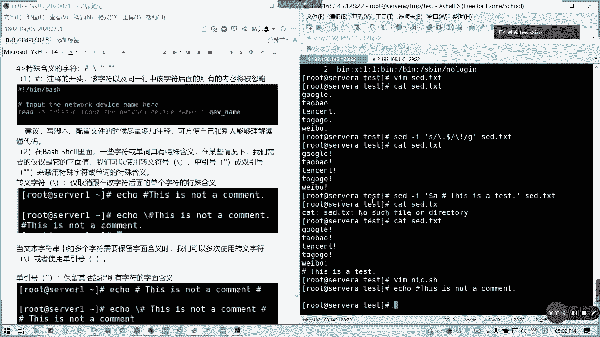
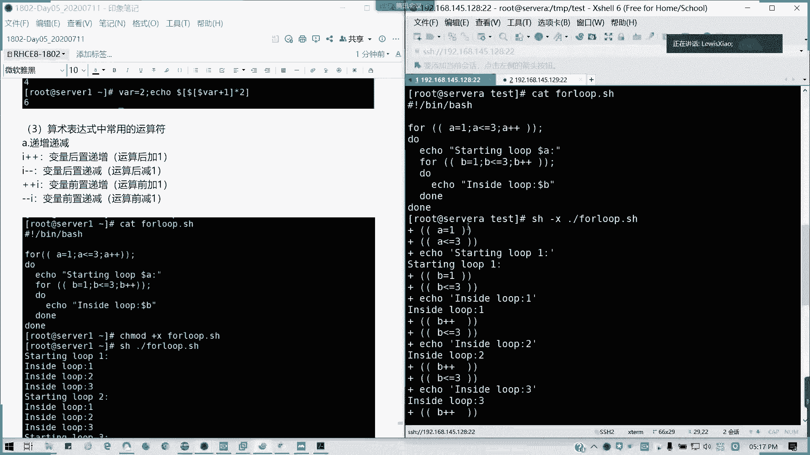
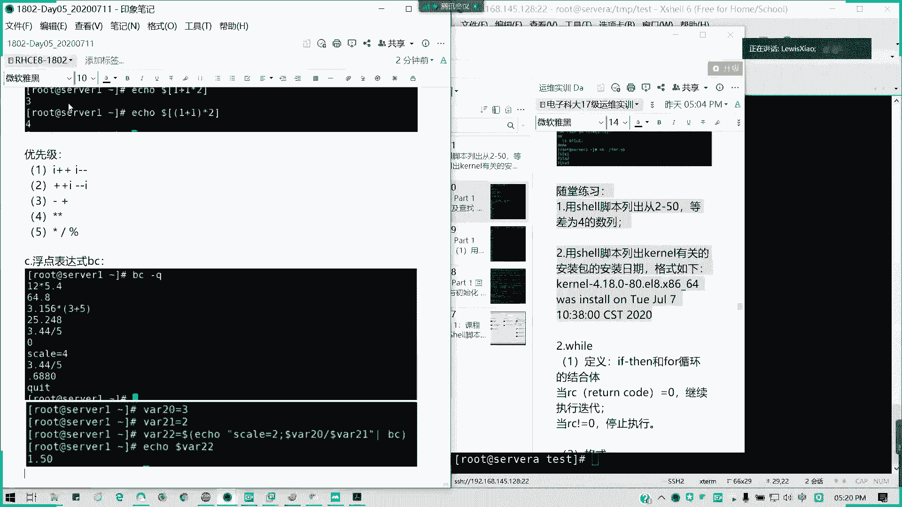
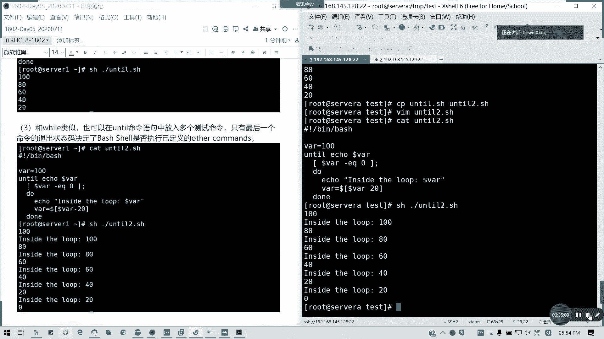

# 2021全新 RHCE8.0 红帽认证入门教程——可零基础入门学习【网络安全／Linux】 - P29：Day05_RH134_Ch01_Shell基础03 - IT老表哥 - BV1444y1h7Bx

好，各位我们5点钟啊，今天因为延长一个小时，所以我们讲最后一节内容。今天最后一节呢是关于我们的一些呃b shell的一些扩展知识。第一个我们的特殊含义的字符。特殊含义的字符呢。

在b shell里面主要有几个，一个是井号，一个是反斜杠，一个是单一个是单引号，一个双引号啊，刚才在一开始我们的下午开篇的时候有讲到一部分简单的一些东西。在这里我详细讲啊，井号。

在best shell里面作为注释的开头，对吧？我们像我们刚才的1个NIC点SH5为什么加了这么多是吧？它这里会以蓝色显示啊。

这该字符以及同一行中，该字符后面的所有内容都未被忽略，对吧？就相当于我做注释用，它其实不会执行我的命令的，这这些东西它都相当于忽略自动忽略掉啊，加减号啊。建议呢写脚本配书文的时候，尽量多加注释。

以方便自己跟别人呢能够理解读懂代码啊，这是第一个。第二个呢。我们要讲三个字符啊，在b shell里面呢，一些字符或单词具有特殊的含义。在某些情况下呢，我们需要的仅仅是它的一个字面值啊，是什么意思啊？

比如说我的问号就是问号，点就是点，逗号就是逗号，对不对？而不是说使用它的转移意思啊，然后我们可以用那个单引号，我们可以用转译单引号双引号来禁用它的单词的一个特殊含义啊，我自己叫特殊两个字啊。

特殊专义这样转页字符呢。只能取消它单个的含义啊，我这里只用命堂来直接敲啊echo啊。

如我知 this as。Not a comment。因为这我们都是在需要环境下面，所以的话其实脚本他对要需要他会帮我们解析的，这个be是帮我们解析，对不对？你看回车我们是不是一个什么都没有。

这行是被注释掉了，那我们加个取消转移符号反斜杠，它是是输出原有内容啊。

对吧。然后当文本字符串里面多个字符需要保留字面含义的时候呢，我们可以使多次使用转业或者是用单引号。

对不对？像我们多次转移的这种来看一看。

this is not common，还是这样子。

我输出的什么东西都没有，对不对？然后这里呢我加一个反斜杠。

是不是后面的还在做作用啊，后面的警号还是输出不了，对吧？我在家里再加一下，是不是全部都有了，对不对？全部都有了。那如果我用引号是最简单的，直接用单引号扣起来。诶。对吧。单引号呢他。

会保留扩起的所有字符的字面含义，也就是它输所有特殊的全部跟我无关，对吧？你里面怎么导致怎么输出，我不转移了，懂我意思吗？绝对引用。单引号双引号呢，它区别的就是它不保留美元字符、反引号以及。

反斜杠的字面值啊，它会帮我们转移成对应的一个值，就多了反引号就着命令的输出结果，以及我们反斜杠，对不对？所用双引号扩起的时候，美元符号跟反引号呢是保留特殊含义，但是反斜杠呢就有点特殊了啊。

反斜杠有点例外，仅当反斜杠字符前面是美元符号反引号双引号反斜杠或者换行符的时候，它才会保留它的特殊含义，否则都取消啊。那我们看一看下面的例子。这句话不较难拗口啊不要拗口比较难理解。

我们看一下这下面例子就知道了。E我单引号多了pass是不是输出的去原样。

那我输出1个PWD里面带一个反引号，因为它就是相当于取消特殊含义了，是不是已经小还是输出原样，对不对？

那我输出一个hello show啊。

这也是原样输出。

然后呢，如果说双引号，因为这里没有特殊字符。

也是原样，对不对？然后都我换成我把pass这个我单引号换成双引号。

他输出他他的值哎。对吧。引用了吧，它引用它多了的话，它会它不保留它字面值，直接使用使用它的那个结果。然后还有我们的PWD。对吧。我们当前的位置PWD。然后呢，我们的。hello share。

我们就用两个双引号。他就只输出两就最里面双引号里面的东西里面内容好吧？两个双引号括起来。然后还有就是一个。最后一个。我前面是反啊不我前面是反斜要。多了。pass对不对？只有这种情况，他才会保留特殊行业。

对吧只只才会保留，对不对？懂我意思吗？就这样子才取消转移嘛。

然后还有就是我们PWD是吧？我全部带了那个反引号，带带了反斜杠。对不对？然后我要输出hello share的话，我要把它直接引号取消，那我就。加上那个取消转印哦。懂了吧。通过这层这层例子啊。

通过这层例子的话，我们就可以看到我们的几个。就是主要是那个反斜杠，我们的单引号双引号的区别。这它的作用在到底在哪里啊，有没有问题？有没有问题？有没有疑问啊，有疑问可以自提啊。

通常呢我们变量里面存储了两种。数据类型为整数值，还有次符串值。为变量分配字符串值的时候，我们通常用引号括起来，对吧？如果没有将字符串值放在单引号或双引号里面，它会将。

b呢我们会将那个空格字符解释为单词分格符，懂我意思吗？就他这些它默认用单词做空格分格了，所以的话刚才会出现说没有括起来，希望我变成后面变成这个命令的一个参数了。懂我意思吧？那，接下来讲花括号啊。

花括号的话，我们通常呢在变量前面加上美元符号，可以通过称为变量扩展的过程来重新调用变量的值。我们通过多的va来引用多的va变量，我们的那个Y变量的值。对吧然后多了挂的语法呢。

其实它是花括号引起的变量扩展形式多了挂的多了括号挂的简化版，对不对？我们严格来说是要花括号括起来的，但是我们简化就不用知后面这根了，对不对？不过在某些情况下，我们看这个例子啊，必须要花括号。

括起来我才能消除它的歧义啊。比如说我定义一个first下划线。叫重啊first这个变量叫做jim。然后我的last。就我们我们每我们国外人的中，就我们的姓名是颠倒过来的是吧？然后我们A一下。first。

我不加花括号的情况下。是是输出的是一个啊，不是错了啊，这里输出的是装 green，对不对？就是在他那个到的下划线那里，它输整个了。对不对？跟我们的军下文那gr是不一是不一致的那怎么办呢？

我们要加上我要把花括号加进来。懂我意思吗？消除其义，有时候你要真的要画括号括起来，你就才知是要引用字到底是哪一个。特别是你有有些地方你加了一个特殊符号的话，如果你不括起来的话，它会把整个的引用进去。

能明白吗？这两个区别在这里。上面定义了三个变量，然后我从其中一个加了下划线。懂吧？那如果直接引用是不是歧义啊？明白了吧？这些的话告诉你原来88的那个。这一块是没有讲的。都没有。七的话讲了。

所以我就把它拿了过来。好，我们看一下best shell的扩展功能。第一个命令替换。没有替换的话。我们可以将命令的调用替换为执行命令后的输出。从命令的提输出中，我们提取信息，并将其付给变量。

我们可以只用将命令啊将命令。

扩在反引号的形式来调用替换。但首选。

我的。为了方便和消除企业呢，我们还是我们用领许圈套的一个形式叫做括号小括号啊，多的括号里面加命令。这种的话我们用的非常多，比引号还好用啊。

这两种呢其实是一样的效果。

我们看一下啊。today is我们有刷引号啊，让他转移。d命令。对吧然后我用do date。记得把括号括起来。两种方法是一样，但是它多了的话，它是赢取多层嵌套，懂我意思吧？多层我可以里面再一个多了。

然后输出命令，这样一层层这样引用。但是你的反引号是不行的。好，接下来我们还有东西讲是吧？接下来除了命令替换之外，我们还有一个叫做算术扩展，对吧？就说到了一个简单计算的一个问题啊。

buush的算术扩展呢可以用于执行简单的一个算术运算，用法是是那个直用方括号啊，方括号后面带表达式，方括号表达式。当用我们方块括写的时候，算术表达式将由我们的bch进行求值，然后替换为我们的求职结果。

对吧？求职结果。然后。但呢将首先对括写表达式进行我们的变量扩展跟命令替换，与命令替换一样，它也是允许我们进行嵌套的算术替换啊，算术替换。然后他允许使用空格字符啊，允许啊，我打错了啊，允许使用空格字符。

在我们这里就可以简单看一下。

这里我清空一下啊清空一下方便啊，A等于一，B等于2，用分号两个命令隔开，对不对？然后C等于。多了A加多了B。那我们看一下结果，A。多咗啲。1加2。对吧如果采用算术的运算。

后面我用BC来引入BC是一个文本计算器啊，把它输入文本计算器之后就变成三了。然后C如果是等于。多了A加多了B用方括括起来。对吧。一样的效果。或者是说我用两个括号还是多了，他翻过等于两个括号啊。对吧。

🎼还是A口出来。我们的结果一模一样，我们结果一模一样。能看到吧。然后还有直接运行运算的Ale多了。1加1。对吧2乘2。然后我也可以多重命令，我里面可以多重扩展。我这里扩展了两层啊。

然后是由里额外进行运算。对吧。看到有三个多了没有，对吧？上个多了，我里面先运算，然后后面然后再取值，对吧？一波断的取值。是不是6啊。懂我意思吧？可以理解哦。可以理解不这个。多重嵌套。

然我们算术表达式里面的常用的运算符是吧？递增递减，我们我们回到编程，我们回到当时学C语源的时候，I加加是吧？I减减加加I。解减哀对不对？我们这里用一个脚本来看一看，就我左边的那个脚本啊。并b。

然后for是吧。是否损，我们下下节课明天会讲到。两个括号。A等于一A小于等于3。A加价。分号。做什么循环呢？度。Ele。Starting。然后后面我输出一个do了A冒号。里面我在切套上循环。第一。

等于一。B小于等于3。毕加佳。再次一层。Ele。Inside。入。多了杯。好，两度之后是荡，对不对？就他的血环体结束。那我们执行结果肯定就是一次性出来，我们用分布来执行。杠X对不对？

好吧，这是一个分布的执行结果。一开始A等于一是吧？A小于等于3，然后就e starting做P1，然后B加然后到B了嘛，对吧？

然后后面B加加加到2了。B等于3。对吧那以三中2。你再录3，就是他B先循环了一遍，然后再再到A是吧？多重循环啊，循环的一个例子啊。

然后如果是加加B呢。嘉宾其实也差不多，因为他是前置的。我们又加了等于3次的话，它的结果其际这个结果是一样的啊。

我们循环引句呢是可以在循环内调用任意类型的命令，包括其他循环命令啊，这种循环叫做嵌套循环。循环是可以被嵌套的。注意在使用嵌套循环的时候，我们在迭代中使用迭代，它是运行次速是乘积，对不对？而不是求成合啊。

像我们刚才这个剧本，它是运行的9次循环，对不对？3乘3里面三次乘以外面三次是不是9次啊？像其他的一些运算符是吧，1元加法1元减减法乘法两个星是求密，对吧？除法是这里我们写的除法是取整。还有一个球于。

对吧。当里面的话创我们有多个运算符的时候呢，它将根据运算符的一个优先级，对特定的运算符进行求值。比如说像这里是吧，我们小学的这种。是吧带了括号的肯定括号先，如果不带括号的就乘法先，对不对？

这能理解啊。在我们里面的优先级啊优先级的I加加I减减先，然后一直要加加I减减I，然后做1元加法，我们的加法减法。

然后求密，然后才是乘法除法，取取证取余。然后我们这里就简单讲了1个BC的用法，对吧？但还有内容啊，因为现在时间还有，所以的话我把后面的都再拿过来。

我是直接把for循员讲了。

然后给大家做两道练习，可以吗？我们把后主员讲了，因为现在还有40分钟。

诶。

刚好把复学文讲的讲的差不多啊，这是刚才的第。

算术算其他功能。然后接下来讲一个。迭代的货循环。

我这讲到第几点了？

这开始讲控制了。

迭代复循环语法是吧？语法for一个变量，这变量你可以自己定义哈，自己定自己定义一个名称，应项目列表或者是命令返回的一个值。通常这里我们以项目列表为主。然后呢，后面度是吧？我们循环体是运行命令命令。

然后迭代变量的一个值，最后运行最后的话，我们循环题结束，用当做结尾啊当做结尾。然后我们这个项目列表，我们说到项目列表呢。他有哪些啊，项目列表，他有哪些提供的方式可以看到吗？我们是。项目列表我们看一看啊。

它的提供方式有哪些。

第一个。是直接输入的项目列表，也就是我们用户直接给定到一个指定的一个列表文件啊，这是第一种，就是我项目输入列表，我是用用户提供的这是第一个情况。第二个情况就是不同类型的shall扩展生成啊。

比如说像变量扩展，就是我们多重应用值，就命令输出结果，对不对？多重应用值。还有花括号，还有文件名命令替换都可以，对不对？都可以进行一个列表。然后呢，我们for印的各种利用法啊。这里看一看啊。

fi一fi2和fi3我是直接读取列表中的值。然后fo in boot是吧，用通配符去读取目录。然后如果读取文件呢，是后面带文件名，对吧？然后我也可以用等宽的叫SEQ啊。

SEQ这个命令输出一个等宽的一个列表。对吧。SCQ杠W10，那等宽是不是从一出到10啊？

SCQ这个命令sequence啊。

然后呢，我也可以指定大括号指令范围，我也可以从命令里面读取一个值，也可以从文件里面读取它相应的内容。也可以用多了哎就是我们的那个取所有位置参数。所以这个我们可以简写，直接负I就行了，对吧？就不用印了。

它就相当于取所有的参数。像这里的多了哎。是吧多了哎跟多了心呢。是有区别的，但是它总体我们可以认为是一样。然后多多的井呢就是变量位置的个数，多的零就是我们本身的文件名是吧？我们学过文件跟那。

我们学过我们的那个命令行，我们的那个文件参数的时候，应该知道多了零是它文件名的本身，多了一多了 n是后面的参数，对不对？我们获取完写法，比如说像我们的那个。是吧1到100输出对不对？破损是这么写的。

其实两种都行啊。两种写法都可以在我们spec shell都可以使用啊。都可以使用。然后python呢？是吧python写法复硬，然后1到100是吧，是python的写法。然后SEQ的使用。刚才说了。

我这里写的写一下SCQ。forourIN我这里用命令替换啊SAQ。1到100。ど。E口。都来。到。我现的杠差是以分布执行，它它就会输出从1到100的一个等由一为的第一次递增的一个等差数列。对不对？

等他数列1到100。我如果不加杠叉，不加分布执行的话，是不是从一列到100啊？对吧所以这是SCQ的用法。然后接下来剩下时间给大家做两道练习。

第一题就很简单了，我已经已经已经说过了，对吧？主要是第二题，你们怎么列来开始剩下时间。

动手做啊。这两道题留给大家哈，我们这里的话我们先把循环先讲完，剩下15分钟。呃，where的话啊，我们学问还有两个，一个where，一个until啊，where是if then就是我们的那个。

就判断还有循for循环的结合体，然后它是看我们的退出代码，也就是我们的返回状态嘛。什么什么叫返回状态码，知道吗？就我们执行命令它的一个退出状态。如果是零的话是正常，对吧？非零是视为不正常。

但是具体这个返回状态嘛，我明天会讲。当我们的返回状态码等于零的时候，它会是自继续执行迭代，当不等于零的时候停止运行，对吧？格式对吧？我们的测试命令Y测试命令之后，我循环体里面度其他命令。

然后大我们可以看一下Y这个。B办事是吧，我VR等于10。Wre。这里的话我们表达式中间要留空格的哈，多了。我们VR这个值杠GT。grter day就大于0，懂我意思吗？杠GT这个我们后面再讲啊。大于0。

然后度。实行什么循环题呢？e我们显示把VR值显示出来先。然后VR。等于。多了。VR减1。到。对吧。我看一下这个脚本脚本出来，然后我们SH看一下。是10到1呀，它的输出结果是10到1，因为一大于等于0。

然后它减I减减的时候也减到0了。0的话，它的退出状态码是不是它已经不符合这个条件了，所以它跳出循环所以结最后输出的一个。Y这个变量的一个取值是一。

记住测试条件这个变量，你必须要得得是记得修改的，不然的话会视为死循环，对不对？无限循环下去就直接跳不出来了，循环总得有一个终止条件，懂我意思吗？

这样多个测试命令，我们可以CP1下Y到Y2，然后我们进行一下修改。对吧我们还算等于10，然后我Y我可以多重条件，多重循环ac。然后我就把这条件放在这里。我直接这里把这个VR我删掉，叫做。

改一下字符叫this is in路。对吧我们的当是这样子的。多重条件。然后这里记得我们多重条件的情况下，我们这里要打一个分号。那我们执行一下。19876524310是吧，我们这里都要改，不是GT啊。

是G1啊。就等于。等于那个时候，他还会执行一次，就先显示的嘛，对吧？先显示，然后再判断。所以的话我们这里的话它是说那个gter equals0大于等于零的情况下直行循环。

那直循环之后到最后是不是到减一到负一了，对不对？这负一它显现出来，然后呢，它已经是小于等小于零了，不符合这个条件，所以它就跳出循环，所以这结果会是负一啊，懂我意思吗？

until完全相反，对吧？当它不符合条件的时候，它就持续执行啊，就不符合条件或者是我们的退出状态码值不等于那时候就执行等于那个时候结束。它工作条件相反啊。

我看下一个例子。

病的办病办啊。哇等于100。Until。多了。Y杠EQ就多的Y等于0啊。杠EQ是等于的意思。ど。开ical。走。Y等于。我就就100，然后递减20。到。对吧然后我执行。是不是100减到20。

然后20再减到0了，对吧？他就符合这个，他就跳出来了，对吧？它的指令状态一直对吧？就就不为这个值的话，它就跳出来。O思吧？就不，那Y类似我们也可以使用这个多个测试命令，我们把CP放做NTO2。

我们可以多个条件，我这里改一下。Until echo。哇ow。同样是。这样啊我们等于0，然后ac是吧？Acle这里我就改一个它的提示符了，叫做inside loop。多了。多的话，其他其他我们把蛋缩进。

其他不变。它是不是就会显示到零了，对不对？也就是说我们多重的结多重判断的结果对不对？多判断结果，然后它是以只有最后一个命令退出状态码，才决定它是否已经进执行我们的其他状态嘛，就是我们的循环体。

懂我意思吧？它只包括跟Y一样，它都是判看最后的一个命令退出状态码来决定。所以呢我们今天呢就把循环讲到把循环讲完了。我们还有后面还有一个还有就是我们的那个。特预定一变量。判断。正则表达式分支这些没有讲。

明天把它讲完，然后后面明天可能会。明天上午我下午的一段时间，我们把所有讲完，然后后面呢就接着的话就是一个计划任务以及调优啊，明天的安排。现在5点545点53分哈，所以的话我们今天也大家很辛苦啊。呃。

据说陈奕迅演唱会的这个红馆的那个现场生活已经开始了哈，已开始了，大家会有多我看朋友圈都有在关注了。所以的话今天我们就先到这笔记我会马上更新，马上更新报告视频待会上传。好吧，那我们今天先到这里下课。

这两道题记得做啊。

