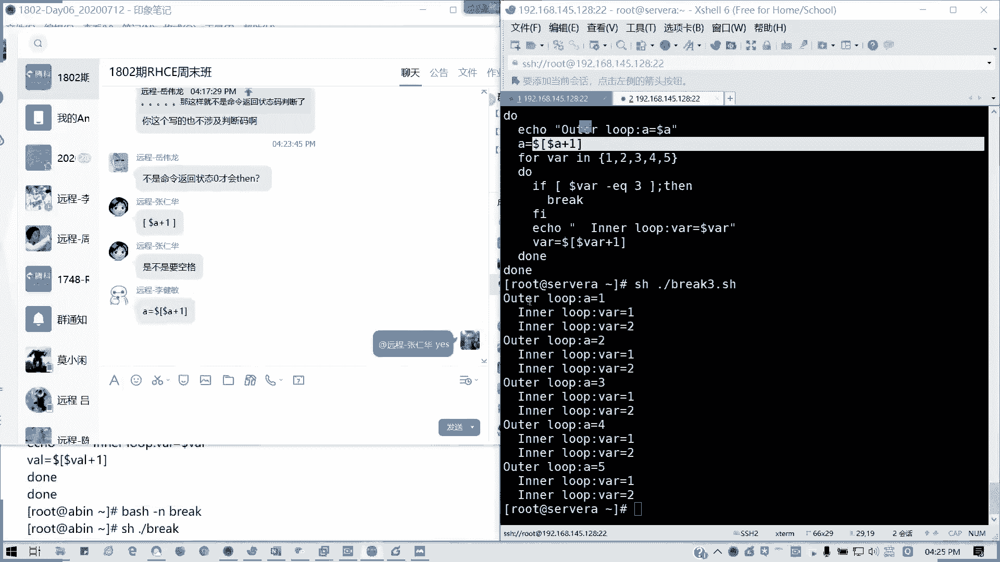
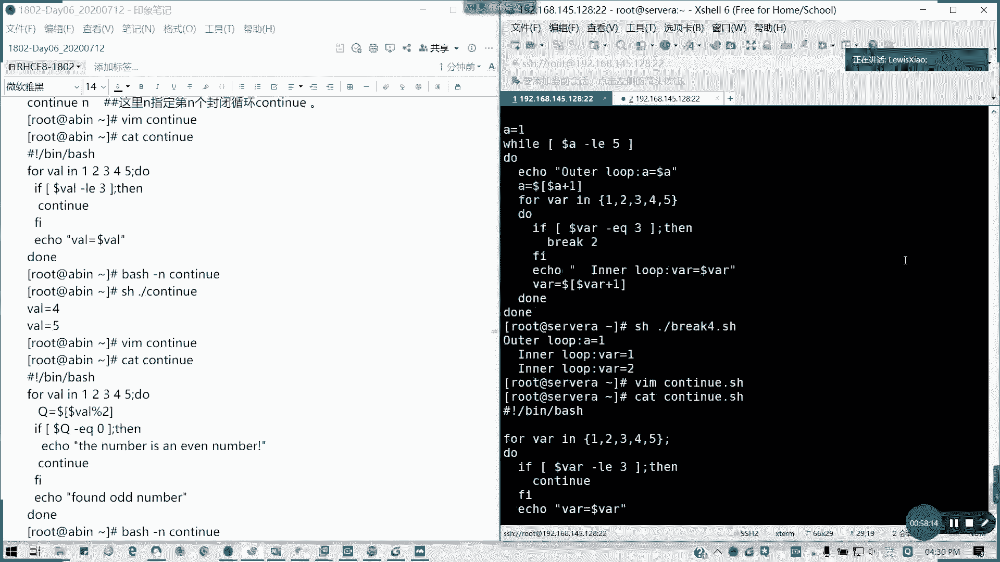
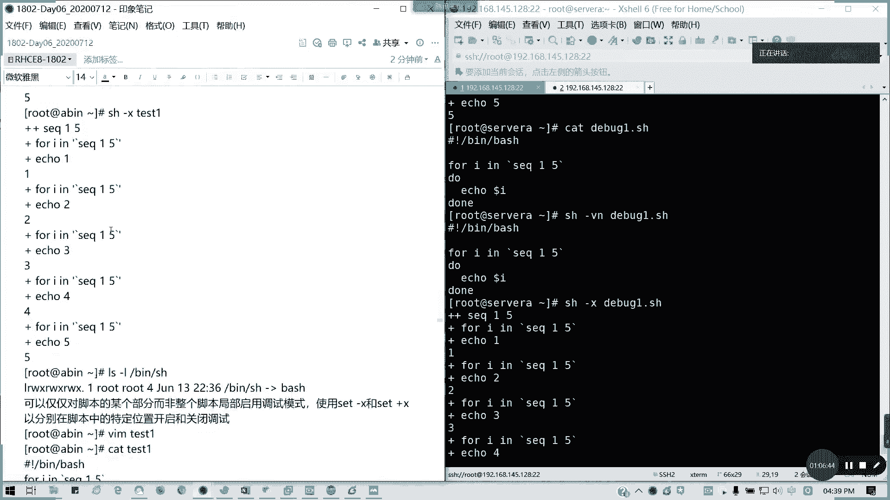
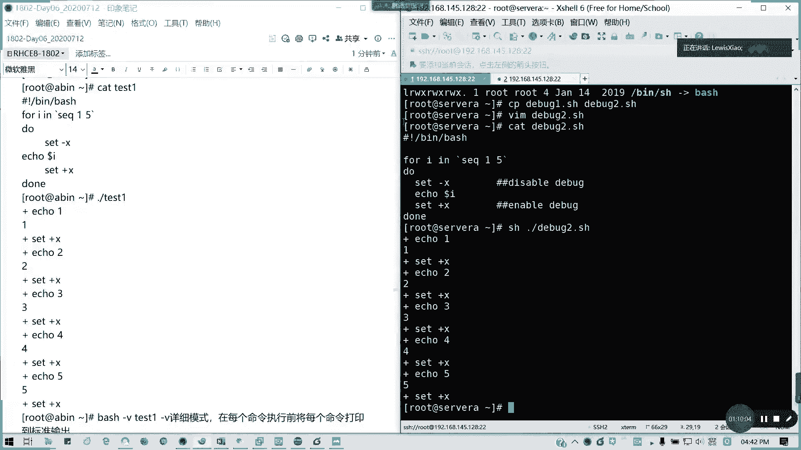
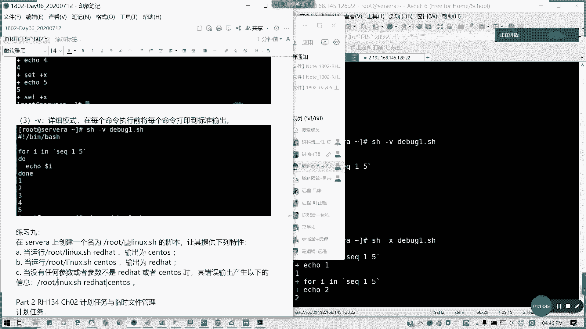

# 2021全新 RHCE8.0 红帽认证入门教程——可零基础入门学习【网络安全／Linux】 - P32：Day06_RH134_Ch01_Shell基础06 - IT老表哥 - BV1444y1h7Bx

我们接下来会讲第九个部分啊，使用条件结构。条件结构呢允许用户，我这边我把那个我把投屏，我把投屏那个解一下锁。我们的条件结构呢允许用户在shall脚本的时候啊，使用shall脚本时候包含决策。

以便紧当满足条件时候才执行脚本的特定部分。有一类命令呢会根据脚条件时跳写脚本，跳过某些命令。这这这种命令呢，我们叫结构化命令叫structure。搞的嘛的。结构化命令呢，允许你改变程序时执行的顺序啊。

bch我们最简单的啊条件结构就是extend，对不对？我们刚才一直我们在写例子的时候，是不是有涉及到了，对不对？if条件等。我这里的。条件里面满足条件所执行的命令，对吧？FI就执行个声一切声明。

然后if。这个命令如果为真为真的话，执行。以下命令，然后记得它的结尾是if的反写FR。如果满足给定条件，将采取一个或多个调操作。如果不满足给定的条件呢。不满足给定条件呢，则不采取任何操作。

之前的我们的数值比较，日符串比较也和文件测试经常用于a stand里面一定测试条条件啊，需要强调是其他编程语言里面，if之后的对象是一个等式，这等式的求职结果为出 or false。

但b shell的if语句呢会预行if后面的那个命令。如果它的。记住if里面是一个后面是个命令来的，它的退出状态码是0，也就是意味着我们成功执行的时候呢。它才会啊den里面的命令才会被执行。

如果退出状态码是其他值，den后面的部分就不会被执行，它会执行继续执行脚本里面下一条命令FI语句代代表ifhen语句的一个结束。注意它不是做数值判断，不是输出真假，而是说你的命令会不会成功执行，懂吗？

在需ll里面，它这个跟普通的我们的其他语言是有点区别的。我们接下来会看一下我们的例子。我们看两个例子啊。我可以衣服后面加命令。如果运行这个会出现什么结果？对吧命他是命令是否成功执行。为一个标记啊。

它是它的退出状态码是0啊。我这里再加一个ac。包的问号。对吧。这样不是更。这样不是更清楚，对不对？它的退出状态码是0，所以他这它输出了一个。的com works对不对？work，然后呢，FI结尾。

然后呢。如果是这样呢。对吧。哎い。对，找这这里他不会执行啊。

对不对？看下面啊，我们那命令不会我这个命令不存在的，对不对？他都不会被执行，直接输出这个。重新截个图这。还有我们的。一个例子。你先看一下一个服务的状态。我们先这个前提啊。

我们比如说这个HTPD这个服务我们是装了，但是没激活，对不对？我们写一个脚本。给一个简单的一个命令。知道这个做什么用的吗？等一下啊。等一下可能有点问题，等等。🎼应该要点这里的话，我要把它括起来。

也不对呀。嗯。那怎么写比较好。我其实我要实现说他的那一个就是说服务是不不启动时候，我自动启动一个服务。我要想想怎么写比好，我烦。没有我写择一个脚本吧。这样会好一点。因为这样的话，一句话写好像失败了。

If。开始执行一下。现那卡了吗？他没有回复了。我看一下。

车在启动。

你的还腿子。可以了可以了。可能有点久。没好。对啊。我要重重启，然后再。

🎼他家启动。好都 eating啊。20。没有啊。我看这边状态就知道了吗？

怎么起这个HTPD服务了这么久。Just of aating。行啊。行了，幸浮30秒，我得查一下什么原因。那这个脚本呢，我先什么都不先别说我们的脚本呢。

这个是用于我们就是说判断一个服务，如果失效的话。

对吧这个例子其实。可以我们拿来。监测啊。监测我们的所需的服务是否启动，对不对？然后启动时候其如果是没有启动，把它启动完之后输出它状态，对吧？这其实可以用在我们的。监控里面。这只是一个简要的一个例子。

我这里还没写退出呢。然后呢。运行语句ifif语句的错误命令呢，甚至错误信息依然会在脚本的输出里面啊。然后在den部分呢可以像脚本一样，其他地方列出多条命令。b shell呢将会将这些命令当成一个块。

当成块呢，如果一幅语句呢。执行状态码退出状态值为0，它这时候明天都会被执行。如果不为零就跳过。我来看看一个例子。嗯。有すね。怎么在滴滴滴声呢？这机器有问题吗？Not if grape。

这个剧本啊这脚本啊。

我们剧本我们脚本是这样子。对吧我t一。我如果这用户存在GTC passWD里面存在，那我就e一下，哎，我这个用户叫t C，我的名字叫t C，这是我的第一条命令，然后会列出。

当前加这个用户加目录里面的所有文件跟跟子文件跟子目录。他会把会他是会把我们里面的一些东西全部当成一个块啊。那呢我们还有另外一个例子看一看啊。换另外两个例子。这个例子是判断是书作数字是不是纯数字啊。

我把那个一开始read，我弄成一个那变量。来。

这个是判断这个数字是不是为一个字，就纯数字0到9。杠Q是不显示那个我们截取的这个结果啊，过杠Q啊。不显示结果。那我现在我我那个直接来。对吧后面后面我输入。

对吧我们纯数字啊，这个脚本是判断我们。这数字是不是纯数字啊？

那周四成功执行会输出一个结果。所以他的那个。

它都是零哈，所以的话这也跟我们的值是没有太大关系的。

视为纯数字啊。那我们也可以就是说来判断一个用户存不存在。

好。我再写一个衣服3点SH。怎么写呢？来哎，按错了。我们看一下。

这用户是不存在的。

然后我们也可以用ESCC来执行我们的那个输入。就通常说啊它这个输内容我这个不讲了。接下来我们看一下。

接下来我们一个一个东西啊。在if den语句里面，不管命令成功执行都只有一种选择。如果命令返回一个非零状态嘛，它会执行去这比教本就是下一条命令。if then的结构还可以进行进一步扩展，以满足啊。

采取不同套件条件的。操作集合，使用iftend else调结构，当做不为零时呢，它会执行alse部分的硬命令啊。

这应该都知道。

这刚才是不是有点。

这前面已经从就这已经列出来了。所以的话有时候我们可以嵌套，对不对？我们可以嵌套这个instand的一个。语句，那我们就可以Lif对吧？Lif等于ELEIif等于Lif啊。我们看一下一个例子啊一个例子。

LF里面它是有单独一个代码块啊。好，那我们看一下这个脚本怎么写。同样要是找用户名那个。lse if啊就是双就多重的一个嵌套。看一下这个脚板知道写什么了吧。

就检测我们的用户名是否存在在ETCpa plusWD里面。如果有这个用户名就输出这个就不定正操作输出一句话。然后如果没有的话，要看看他是否这个有没有加目录是吧？没有，如果没有加不住，在里面的这个衣服的。

没有的话，那就创建户名，然后查查询下记录，注意他这个L不。已经不是在不不属于大的。ifstand代码块里面了，是在Lif里面代码块里面。所以这里啊。

此处的。哎，打不了中文的。我我这里的。alse啊。是属于。然。F代码块中的。

然后我们看一下执行结果。

对吧没有对吧？他没有这个文件，没有这用户，所以的话他就帮我们创建一个用户执行了。

那我们此时呢也可以继续将多个Lif串起来，形成一个强大的if then然后L if的这个嵌套集合，对吧？每块命令呢都会根据返回退出码，对吧？返回退出码。

来0是否为0啊。来执行。不lash这样呢会执行一依次执行if服语去。只有第一个返回创退出状态完零的时候，它电才会执行，但添加的此就越多啊。

就就其实就是变更着更加觉得难以理解，对不对？就Lif这样的话多个分支会很麻烦。

但是我们有了case之后呢。

我们的分支就很好理解了，有一个case命令啊。

case命令呢，我们就不需要多次写我们的那个if来同不停的检查同一个变量值了。case它是采用一个列表啊列表形式来检查单一个变量的多个值。case命令会将指定的变量与不同模式进行比较。

如果变量与模式匹配，那么shall会执行该模式特定的一个命令。通过竖线操作一行里面分隔是多个模式，用星号为普或所已知模式不同匹配的值。所以的话我们是这样子啊case。变量我们的格式啊，case变量音。

像这样的话，就是他的那个字段一。或四段2啊，如果是这多个模式适应或四段二执行第一条命令。如果这样的话会比较好理，比较好看一点啊。字段三，执行第二条命令。字段四执行第三条命令。如果是其他情况。

执行默认命令，然后结尾ESAC。啊，这个是case，我们的分支，记得吧？知道吧？case语技呢会尝试将某每一个变量与每个字段进匹配当匹配到某某个模式里面呢，它会执行相关联的代码段。

以两个分号代表这个指示块结束，然后跳过case模式的其他模式啊，以ESAT退出。根据需要我们可以加。任意的一个。字不快啊，那我们看一下例子。我们看下一个例子啊。哎，怎么是变我刚才用VI了吗？没有啊。

我看哦点SH好了。知道我这里在写什么吗？知道我这己在写什么吗？我输这一个字，输一个按一个键回车。然后我判断这个键到底是字符数字还是其他。对吧。我们来来试试啊。比如说我按一个A。哎，有问题哦。哦。

我这里漏了啊，漏两个分号啊。记得每条命令记得两个分号结尾。Yeah。代表命令的结束。这里不要漏了啊。这有命令漏了漏一个东西啊。🎼所有的我们的每一个。分支。都要有。两个分号结束。A是吧，它是一个字符。

一它是一个数字。对吧。你总得有我们做那个多重选字段，我们模式匹配的时候，总有得有一个退出值，总得有东西。就是说我可以跳出这个case的，你你不可能说没最最后的话，你在什么都选项都不符合的情况下。

是不是要其他其他的一个默认输出，对不对？不能不能说你无线在这里找不到，然后就就没办法留个出口了，对不对？

所以case呢这块。能理解吗？我看下啊。

陆伟龙，我看一下你的那个问题。

GU双引号啊。

Gra user name。Passport that。嗯。我这里是不会输出结果的啊。

我自己把Ale这里扩起来了。对啊，这里引号引起来。

然后至于case这一块啊，看有没有问题，没问题，请没有问题，请打4。

还有这备根continue啊。

所以顺带讲一讲。对的。我跟上讲个case，这接着一个break and continuet。我顺道讲一下，break and continue吧。因为这个的话就是一个。跳出的一个处理过程啊。

为这个语句啊，这语句可用于终止整个循环的执行，完成溯缓行代码之后的break语句的执行啊，然后然后呢它在逐机代码在跟在循环里面结束，break用于跳出循环体，使用break跳出任何类型的，包括。

forour while until acid的跳出直接垂直脚本。我们看一下例子。Where can I at you。A等于0。W。到了A。🎼小于10。또。做什么呢？Eical。哆啦 a。

你我们在里面加一个判断。多了A。杠1Q5。Ban。Break。然后这里FI。A本月。到了。我们到了A的值加1。啊。那我们看一下breakrickSH。它是零小于十循直行循环，但它到五的时候已经跳出了。

对吧。就不会再执行循环了，直接跳出整个循环体。

那我们有分几种情况，第一个跳出单循环啊。那当情况我们再写一个break two点SH。A等于1。然后呢，wi。多了A。Gone。LT啊就是我们小于小于5。杜什么了？If。多了A。这个判断之话。

前后要留空格杠EQ。3。That。我跳出。FI结束，然后呢，ecle。A等于。就有这样了。A等于后面多了A的值，A等于。取多了A的值加一。棒。我们语句是这么写的，我们可以用。SH杠N我们来分布啊。

杠N是检查我们语法，对不对啊？检查语法。那我们来看一下杠差是分布。听到没？对吧我A我A等于一我一小于5一不等于3，那就A口A等于继续循环下去，一一直到等于三了，跳出。能理解不？

因为输出太长了，我就直接。把这个。这是跳出单循环，然后还有一个跳出内循环的例子。work3点SH继续写。A等于。W。多了A杠L1lesss equal就等小于等于5度。echo我们的外循环。

Outer loop。A等于多了A。然后呢。A等于。多了A加1。哦，这里我还有一个内循环，对吧？VR。112345。또。这有个内循环，两重循环啊。If。高了VR。杠1Q。3。Then。Break。

然后这里FI。这里还是度的范围啊，A。in the loop，我这留两个空格，更看清楚一点。VR等于多少VR。然后这里VR。等于。🎼V2的值加1。外循环结内循环结束。外循环结束。

对吧我们看一下我的循环我们的执行结果。哎，哦少了一个东西。看一下啊，第四行。expected哦1加1。🎼不对啊。Interject， expected。这样吧。这样的脚本看对不对？还是不对。嗯。

想想哪里写错了啊。哦。是哦。这样就对了，少了一个。还是你们精明啊。对吧。我刚才不小心把这个前面的多了漏掉了，A的话多了A多了A加一啊。

像这样的话，是不是我只执行到两个，然后地内循环就没了。

外循环他是实行了5次啊。

然后还有多层循环。多有时候呢一要跳出多层循环，使用break n啊，跳 break n的话可以多层循环。那我们现在我们继续把这个脚本我们编辑一下。

我们这里A等于啊，然后多层循环怎么写呢？播报12345没有变。🎼Eal3break two。他默认的是循欢陈述，有的是一，一个是2，对默认是一层。到这里改break2。看会什么结果。啊。

是不是他只执行了一次？就没了。

我加了一个break2，也就是说跳出两层循环，也就是这里是也就是只有两层循环，它就跳出来。

只执行到。V2等于二的时候，后面等于3它就没了。懂我意思吗？这个。这如果明白了，请打5。然后接下来我们讲想简单讲一下，continue。

证明问号请打5，然后简单讲一下，continue。continue的。跟break类似类似，但是它会导致当前迭代的循环退出，而不是整个循环。这参数呢是比较有用的。当一个循环错误已经发生。

如果你想执行尝试执行下一个迭代啊，它是以终止本次循环，重新判断条件啊。然后呢，执行下一次循环，语法呢就是continue。跟break语句一样呢，一个参数可以啊给头天女跳过嵌套学员的命令啊。

它这里的N呢。这指的是指的是第几次第N个封闭循环的continue啊，我们来编辑一下一个叫continual。脚本。同样。For啊VR音。12345。度。做什么了？If。多了VIR。杠L13。Da。

Continue。F5。Ecle。VR等于到了VR。到。然后呢，我们执行一遍。所以说他不满足条件，他就会不断的去重试，对不对？一直就不符合条件，他就跳出循环，但是他会继续重试，不就直接跳出了。

所以我们输出的结果是四跟5。

对吗？小于等于3，它不符合条件，他就他就跳出。然后。

一直等到四跟5，他。他不符合都挺符合条件，他就直接跳出了。然后不符合条件。四跟5的时候，他就执行下一条命令。

就他也就是他照他的条件为假的时候，他会继续他会继续执行。真的时候他就跳出，对不对？然后呢，我们来看一下，我们把这个脚本来编辑一下。这个这个是我们找榆速的啊。找匀速。同样是12345。

然后度我们先这里的话先把它取于。因为变个一个Q变量。等于。到了。多了VR。百分号是取于，对不对？对吧。取于然后if。这里删掉啊。If。Dollar Q。杠1Q局数是0。Then。输出ecle。

记得if后面要空格啊，不然的话如果语法错误，它会标红的，懂吗？有一ical。continue然后FI，然后顺不然的话，它就是一个字数。它就是一个余数啊。Fed an old number。对吧。一与一。

除以要取余数是不是一啊？E的话就是一个余数。二不没有啊，三余四没有5余，对不对？

肯定就讲到这，如果没有问题，请打。

6啊。

对啊，根据返回状态嘛，而不是说那个。是根据返回状态码的才是对的啊。然后最后我们讲一下调试模，讲一下那个sha脚本啊，best shell脚本的命令错误故障排除。

错误呢通常是输入啊输入错误语法错误或者是脚本逻辑不佳导致的。像我们良好风格做法是不是？使用注释就我们这我们说的对吧？用注释。可以阐跟我们跟我们的用户跟读者去阐明我们的脚本的用途以及逻辑，对不对？

每个脚本顶部应该帮含注释，那要阐述脚本的用途，预预计操作的一般逻辑。还有个脚本里面通篇只用注释来阐明关键部分。特别是会导致困惑的部分啊，这种的做法呢是不但有助于其他用户阅读跟调试脚本。

而且我们可以在一段时间之后，我们给自己。回忆这个脚本的编写过程也提供一个帮助。将脚本结构化呢改进，用来改进可读性啊，只要它的脚本啊正语法正确，命令解释器要无缺陷的执行脚本中的命令。

绝对与那个结构跟格式无关。以下我们有一些良好做法。第一个长命令我们分成更小的代码块，对不对？代码会越短，我们越容易理解。然后将将多个语句的开头和结尾排好，以便于查看控制结构的开始以及结束位置。

以及他们是否正确的关闭退出，对多行语句进行行缩进，以表示代码逻辑的层次结构，对不对？通常是一个三角形这样空格下来。然后长间距来分隔命令块，阐明一个代码段核实结束，以及另外一个代码段核实开始，把它分开。

用共行。在整个脚本的通篇使用的格式要一致。那我们来讲一下这个是一第一点。第二点呢，我们讲一个调试模式跟详细模式。第81点SH我们用这个来看一看啊，给我们几个简单描脚本来看一看。这里我习惯用空一行啊。

就把脚本解析器这空出来。我这里就又空两行了，对不对？这个是一个脚简单的一个脚本。然后呢，我们可以用bsh或者SH都可以啊，两个都是一样的bash杠VN，然后debug1点SH。这可以进行详细模式。

并且语法检查。然后呢调试模式就是杠叉。对吧。败数跟SH都一样。像SH我可以执行一遍一样的一样的功能。bech跟SH其实是一样一样的啊。

然后下面是调试模式。杠V的话是显显示啊。调试模式不在这里的，在下面。

调试模式在下面啊。

像这里BSH。是吧为什么SH也可以。因为b是SH的两链接，对吧？

对吧所以其实bech命义上是完整形式，所以我们SH也是可以的。

对吧呃这个就理解了，为什么我这里用SH也行。那我们也可以用仅仅我们可以仅仅对某个部分啊，某个部分进行调试，然后可以用下减X和C加S呢对某个位特定位置开启或关闭调试。

我们通常我们我们在这里debug2复制一下debug一到debug2。我们这里可以set加X，可以关闭调试。那这里可以开启调试。就局部调试模式啊。然我用SH杠X来看一看。对不对？他开启模式时候。

他这里我们不不用执行我们的那个。对吧。不用执行我们的一个脚本，他都会帮我们进行一个调试。

那我们还有最后一个就是一一个详细模式，详细模式就用杠V啊。

杠V的话，详细模式我们呢可以来打。这个是第三点。我们可以来打印我们的那个将每个命打印前直打印到标准输出。那我们可以用SH杠V。我用debu一就可以了。叫什么叫X啊？分布。这X不是调试吗？分布调试吗？

对吧它列出每条命行对应执行什么内容嘛？如果是杠V的话，就是将每个命令打印到标准输出，然后执行结果嘛。

刚才不是讲了加X了吗？

那到此为止，我们的包括我们前一天下午到就是我们昨天下午到现在为止，我们的bsh shell全部讲完。全部讲完花了一天。一点半差不多一差不多快一天半的时间。

花天半的时间。然后呢，如果都能理解，听得懂的，请打。9啊，请扣个9，然后呢，这块有练习给大家。包括前面的几个练习啊，就练习1到8，还有一个case的简单练习，我会给大家看一看。

case的一个简单练习。我拿题库给我拿题库出来吧。就加多一个练习好了。

包括我们之前的一些练习啊。

连同我们的。早上的练习一起啊。这怎么有个图像？

我这里我只要取消就转移。不的话他会那个啊没有问坏的建筑条。

这个是一个case的简单练习。

啊，case的一个简单练习，大家可以做一下，我们休息15分钟到5点钟，我们来开启第二章。

啊。