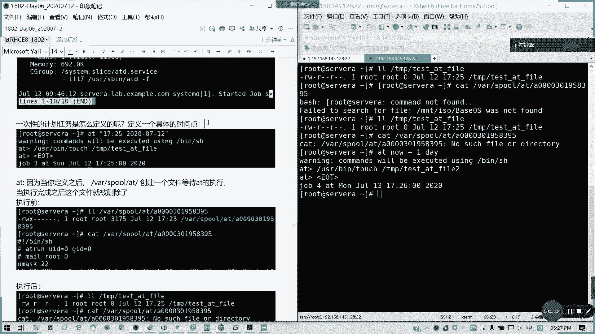
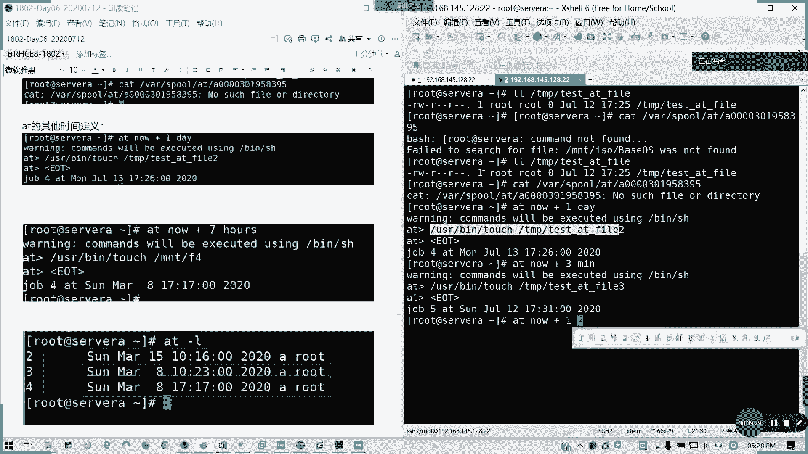
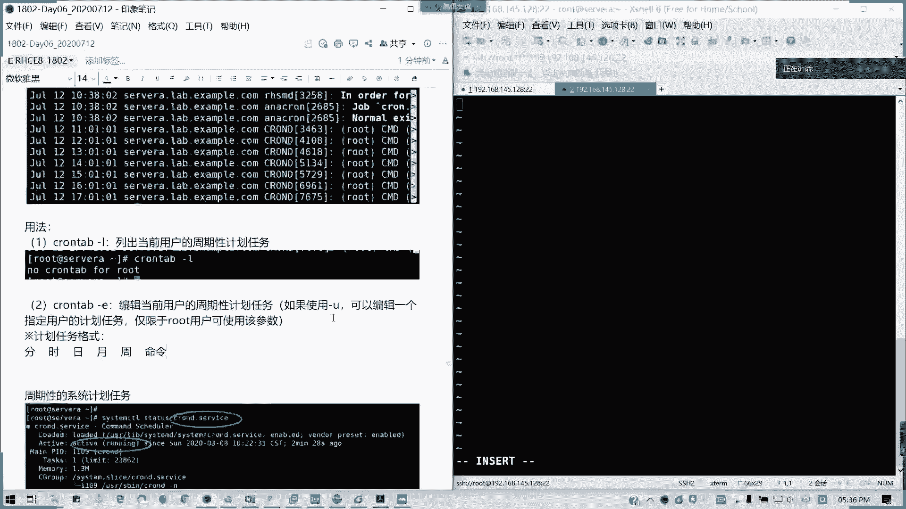
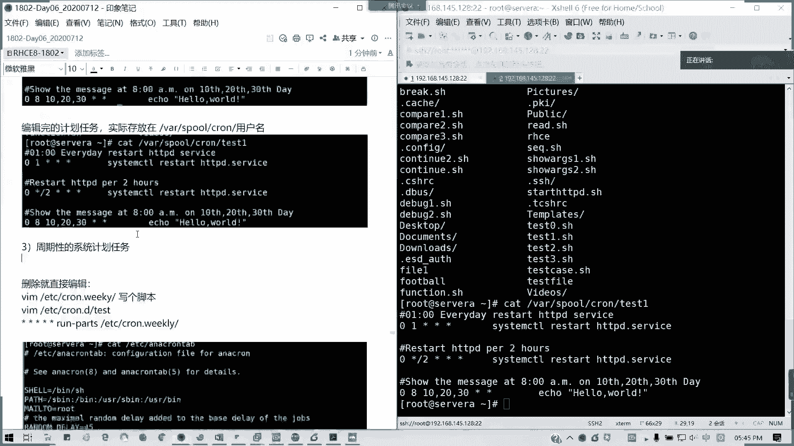
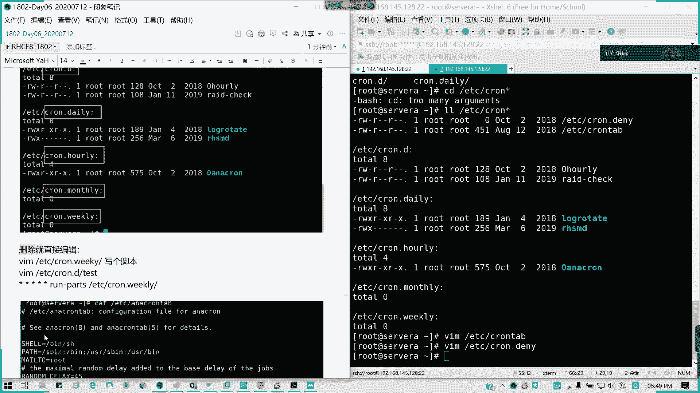
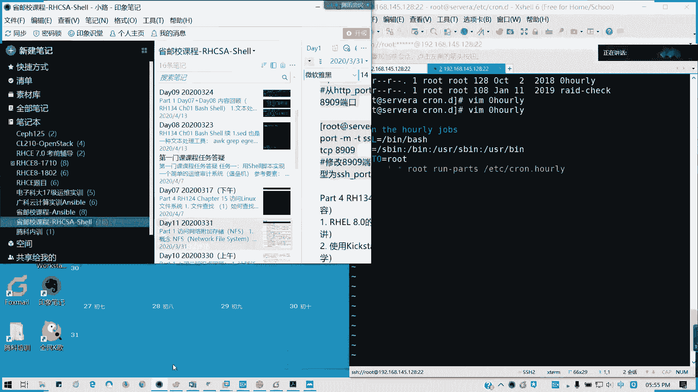
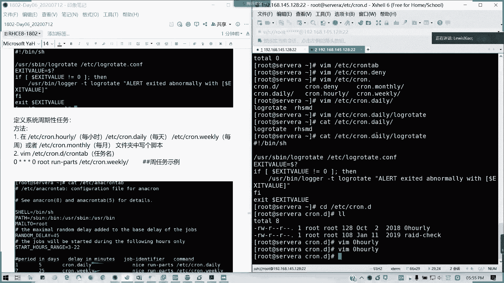
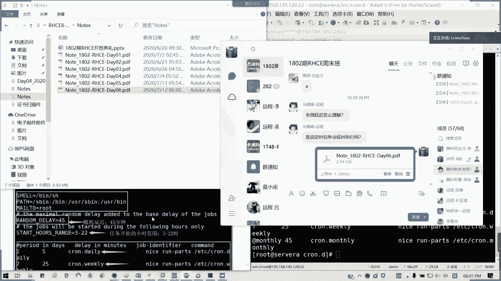

# 2021全新 RHCE8.0 红帽认证入门教程——可零基础入门学习【网络安全／Linux】 - P33：Day06_RH134_Ch02a_计划任务 - IT老表哥 - BV1444y1h7Bx

我们大概讲到5点50分啊，就提前下课啊，提前下课。我们看一下计划任务与临时文件管理。首先看一下什么叫计划任务。这划任务呢就让系统。在某个时间点执行一次。你定义的操作啊。对吧执行是你所定义的操作啊。

所以这个计划入的定义都知道吧。然后呢，我们接着来看第一个点，一次性计划任务。一次性计划任务呢。你让你的系统在某一个时间点来执行一次操作。当这次操作完成之后呢，这个计划任务就结束了。只执行一次啊。

然后还有一种是叫做周期性的计划任务，对吧？我们分类有周期性计划任务。周期期计划任务呢就是定义的时间条件，然后让系统循环的执行这持任务，能理解吧？比如说像我们1到5是吧，我们9点到下午6点多在上班。

对不对？像6到7，我们9点半到到像我们的那个到我们下午的5。6点你要上课，对不对？这是不是我们都这一段时间内周期性的任务啊？那我们接下来我们看一次性计划任务的实现。

一次期计划任务的实间，它是通过一个叫ATD的一个后台首护进程啊。🎼来控制的。

它通过AD啊ADD来实现的啊。

那我们接下来看一次性计换任务，我们怎么定义啊，怎么定义。怎么定义？我们来看一看。用A at。然后后面有第一个时间，我现在先看一下我们现在时间点。这17点21，对不对？艾特。2020。07今天是12号。

我就给你17点23分呃，24分吧，我们99一点25分好了，2025分好了啊，不行啊，我们这个时间不对啊，我们是时间写在前。日期写账后。

然后他说warning command will be execute using beingSH就是我们要执行的是我们的SH命令，然后就艾的提示符，那我们就可以输入。

啊。我们可以输入我们的命令，比如说有绝对路径的user bin，我们踏出一个文件，好不好？TMP。太不太不了。他是特殊的这个提示符。有 user user bin。touch我们的TMP。

test at file这个文件。那我们输入EOT。啊。不对啊。

看啥。按ctrorl加D结束。按ctrl加D结束，然后他这个文它这个任务呢。就会生就会生成，然后是job3啊，它默认一开始是jo一，然后它是按这个序号来排下来的。然后定义之后呢。

它这个VR spell at就会有一创建个文件，等它艾进行啊。我们看一下。我们是有一个A什么什么是吧？这个文这个文件夹。这个文件它里面存储了我们的那个任务。可能加低。

他这里就会指明我们的那个把任务的详情写在这里啊。就25分了。然我执行完之后，我再看看有没有这个文件没了，对不对？他执行一次性都完了之后，我这个文件执行完就被删除了。这是执行前。执行后我们看一看啊。

我在另外一个窗口看。是不是这个文件已经被创建了，17点25分，然后呢，我再看这个。我在看这文件是不是已经。哦，不不不。🎼我在看这个文件是不是已经不见了。

他执行完一次任务之后，他就会在列表里面把这个文件给删除了。

那我们的另外一种格式，比如说我再加7天后是吧，我加7天后来执行命令啊。这我们艾特的其他用法。艾特的其他时间定义，比如说我要加7天后，我加一天后或者加几分钟，对吧？艾特。就ow加，比如说我加一天。然后呢。

UF。touch我们的TMP。艾特 fire2。感受就低。

这里输入完了，这我只加一个，因为刚才你不知道怎么退出。

输入完按。Control。就啲。结束。

对吧我这里就是定义到一天后的。对不对？

那我也可以定义几分钟。

刚才是具体的时间点，现在我是定义几分钟。

我也可以定义几小时。我这个复制下来。

对吧3分钟后。那我可以定义几小时。

懂吧？明白不？就艾特时间我推定义以时间不是具体时间，就是往后推，不可能往前啊，往前的话你都已经。没没机会执行了，而且不符合常理，对不对？然后呢，我们可以。哎，有个图是不是不见了？即系我哦。

三分钟后嘛。然后我可以用艾加I，我们看一下我们任务杠list是吧？我们代于执行的任务。他是以照底艾的编号啊。然后我也可以帮将这个任务删除。啊。啊，不对不对。不是这样子。杠R，比如说我要删除。第4个。

对吧。

删除的任务他不会再被执行。

然后我也可以看他到底任务执行的啥，就at。这C。这我已经应该执行完了啊，我就按6啊。就其实就刚刚才看我们的这个对吧？我们刚才看我们的这这堆文件一样。像我们这里艾特C6。

那6的话是对应我们的jo IDD啊。这里是job IDD就前面的这位，然后他会查看。查看计算任务所对应的一个文件。就刚才我们。cat v spoil路呃艾里面。跟我们的那个情况是相同的。

那艾特这一块如果没明没问题的话，请打个。A哈角A。录屏在进行中放心。然后接下来我们讲的周期性计划任务，周期性任务任务。这这个的话我们考试会考一道题的，无论七或八都会考啊。

周期性计划任务就是我们可以循环往复的啊来执行计划任务。我们来看一看怎么弄啊，它是采用CmeD。

长con低啊这个服务。空低这个服务来来监管我们的周期信息化任务。那我们现在。来看看我们怎么写哈。这空地啊，我们的命令呢，它会调我们VM编辑器啊。Come。tab杠L是列出我们的计划任务啊。

列出我们当前的计划任务。这里又是变成10号字了啊。用法。Cown tape。我们用cont命令啊，但L是。列出。当前用户的。二。中心性的啊。这第一个。第二个是编辑cont杠1。编辑。当前用户的计划任务。

如果使用杠U。可以。编辑。一个指定用户。计划任务对吧？可以编辑一个指定计划任务。然后呢。仅限于。录ot用户。可使用该参数。只有骆驼用户才能用这个参数哦，其他的不行，其他只能编辑自己的。

那现在编辑啊来编辑我这里有一个格式啊，conemp。杠一，比如说杠我家的杠杠杠U。我编辑t一这个用户的计划任务，然后他会调用1个VM编辑器。然后他的用他的那个写法。第二动种写法，这个这个很容易啊来。

计划任务格式。普通用户的启蒙听换这种格式是什么？分。10。日。月。租。命令。

不好意思吧。分时日月周命令。

比如说我是。每天晚上的。一点钟。我们空格隔开就可以了啊。那星是代表任意，对吧？分值这业中呢命令，比如说我要执行一个。重启1个HDPHDTPD服务可以吧？这就是一个任务的完整写法，后面是一个命令啊。

就比如说假如说这样，然后当然我们还有一几种，比如说。我每一小我每一小时我重启这个服务。每2小时吧。斜杠2啊每2小时。的零分。懂吧。哦，这个是长我我写啊。每2小时。他的中。啊。杠2嘛，杠2不是每2小时吗？

我这写个注释吧。每两小时对不对？然后呢，我还还有。如果你要精确的话，比如说我就定义那几个时间，0。2。4。6点。我就分十质啊，我就很简单。我想想啊，比如说每个。我每我隔个10天。

我抬一个抬一个信息可以吗？那我就这样吧。8点。日啊。用逗号隔开。懂吧。每个月的我就收一个信息，好吧。10号、10号30号嘛。对吧这也是可以的。那后星期呢星期的话就是。0到6啊。

星期就是0到60到67等于0哈。我们这有几种写法，这个就话就已经。

已经涵盖了所有了。

我们这里的话，心代表任意。对吧。斜杠。N代表。美隔。N各单位。我只能算一个单位，因为我们有小时2分钟啊这些。然后比如说我这里都是。ABC是吧。在具体的单位时间点。也是可以的。然后至于。

0到6啊00或者是写7。到6的话主要是。星期的范围就是0到6，然后但七是等于零的哈。

星期天到星期六吧。

然后编辑完的话，保存退出。我看一下这个用户的是吧。引写好在这里它会执行的，但信号它会注释掉。这是周期性的用户计划任务啊。周期性的用户计划任务。理解吗？然还有一个叫周期性的系统切换任务。

系统执行的同样也是CmeD啊。我看一下。这个是不太对的啊。这个截图会对的啊。中间系统交换任务不在这里啊，这个是cme tap的一个。哦，这里这里不是啊，这里的话我要那个贴一下这个这里啊。

这个不是我们的那个截截图啊，这个截图好像放错了位置，没事。那我们定完计划任务之后呢，我们会这里我先删掉啊，因为当这个重复了啊，我们。中心计划中系统计划，我们我们通常呢我们会在那个弄完之后呢。

我们会在BAR spoil core目录。然后具体的用户里面。

他会写明这个东西。

好吗？🤧。

那我写这个东西啊。

嗯做完了就我们呃编辑完的这划任务。实际存放在。Where us boil。Hong。里面的。用户名里面。懂我意思吧？

这给以删掉了。

那我们讲一下系统计划任务，我们就结束啊。然后接下来一个管理临时文件夹，我们下周六下周六再讲了。系统计划任务呢，我们是这样子，系统计划任务我们是有那个。诶。插还断了，是不是？插头断了，我看这这里的那个。

等一下。好像没有亮灯，是不是我刚才脚拉了一下？好了，我们看一下系统的计划周期性计化任务在哪呢？周期性计划任务在ETC里面。

Cron点。

这些啊比如说我们每周每小时每天是吧？每个月。

没有吗？有啊。

对吧。他有分的是，比如说我们控制配置文件，然后还有就是我们的daily是吧？

每一天。每小时每个月每周是吧，还有他一些零散的一些已经定义好的系统计划就在Cron点D里面。然后孔顶贷是拒绝的列表啊。拒绝列表框迭代是拒绝列表。然后我们其实就编辑那个contact这文件啊。

我这里先贴在这里，然后我这里补充一下，这是我们的cont啊。

comt的话，这也是它的一个总体配置文件，也可以写在这没有问题。但是通常我们一不一般一般是不会直接编辑这文件的。

然后还有一个就是那con点dy。

这个文件呢。

框点地带呢，它是就是拒拒绝啊拒绝列表。

在ETC框点滴那里面。

那我们刚才讲的那个系统级计划任务，我们就在这里就在这里面哈。

我们通常说我们就在系统任务里面走个脚本啊，走个脚本就可以了。走个脚本来，我们看一下啊。

C。点。🎼我看一下袋里它有一些脚本啊。在我们的。之前轮转是不是写在这了？对吧这系统的。我看一下啊。🎼系统的。🎼我们每天的任务是吧，这是系统的一个脚本，就写到这里了。

像例如我们的知识轮转，它就写在这里就是每天执行任务。然后具己配置文件待会我会讲啊。

例如。日志。系统日志。轮转。任务log rotate。为每天的系统执行任务系统周周期性啊周期性系统任务。

对吧。

但我这个分时作业周呢，我之前呢分时作业周，我这里我还可以。

加个用户啊加个用户，就具体哪个用户执行命令。也是可以的啊。用户我自己。并不是可选项啊。补充一下。

然后呢。我们通常我们就写就在里面写个脚本，对不对？如果是需要。如果需要定义的话，就直接在里面写。定义系统周期系统周期性政务啊。第一种方法。在一些框。wely或者是叫空 daily是吧？

还有ETC crown hour hour旅有了，然后还有一个daily每天。每天还有 weekly克力。未租。以及或者。ETC的。C。得忙死了。每月。文件夹中写个脚本啊，这是第一这是一个。

然后第二第二种方法。这方法一。方法2。我们直接。在EDC。框点D里面。

它其实定义在coown点D里面啊，就我们的那个。框点D里面写脚本对吧？它这里会会有个run pass，对不对？方法啊我们在在这里叫定义啊，方法这是一个方法，不是方法，一跟方法二的问题啊。这是第一步。

在这里写脚板。第二步，我们在VM。co里面我们可以写。比如说我们这个cont我叫名字啊。任名，然后。加上去对不对？🎼几点执行？我们这里比如说我每一周的那个。这是ourly啊 hourly就是所所有的。

就是其实只要后面叫run pass，对不对？高明它为一个系统型的一个经营任务，然后他这里有个用系统型用户。对吧用root身份去执行命令。比如说每一周的话，我每周比如说周天。去执行我们的任务啊。

这个是周任务事例啊。在我们这里小时啊。在我们这里的话，它这个0。ourour里。

哎，这笔记不见了。

完了，按按着SC啊。

在这里啊周用的视例，我们再看一看。

这是阿里 job，我们这哎我又变成中文了来。

那这里我们可以直接写吗？

对啊，扩容点低嘛。

然后呢，具体的执行时间。具体的执行时间会在。具体执行机制啊。

具体的执行机制，它会在EDC and contact里面定义。

会在ETC的an chromown tap里面定义。

我们看一下ca下的ETC Anna contact。

像我们这里啊，我们看这一个范围，它这里有定义我们每日是吧？

他的那个。就是我的那个。随机的是吧，随机的一个延迟是45秒。

对吧我们的str，我们的pass，我们mail two都有在这里有定义。

它这里45是base delay，它是那个随机的，应该5是分钟啊。

应该是我想想应该是秒，我想想是不是是秒来的。

这哦分钟分钟dlay是分钟啊。

这是45分钟啊。

随机延迟。45分钟。然后这里的就是那个任务开始的范围。

的时间。每天的就就是我们3到22其他时间段他不会执行系有任务。

能理解啊，然后下面的话就定义它每种系统任务的一个。参数是吧，我们da里。Da里的话，它是那个一天内。最多最多延迟5分钟执行，对不对？然后他的那个。comman的是run pass daily，对不对？

这小时他就直接写在里面了，然后它延迟15分钟，像这个每7天，我们 weeklyekly它是延迟25分钟，每个月它延迟45分钟，然后包含的我们文件就是那个。后面的run pass，对不对？

他在这里默认的定义，我们可以修改它的值，但是通常不需要啊。所以呢我们今天呢我看一下至于清理文件呢，跟我们后面的内容刚好5点59分。然后第四章我们是讲过了，第四张关于权限我们是讲过了啊。

就是fi这个讲过了，我这个全部留在。我先看一个笔记，我留在下一天讲，在第七天讲。第一天的话，这个都会在上午的两个小时内完成啊。

然后对于今天我们是讲到了。第二章的第一部分啊第一部分也就是我们的那个计划任务啊，计划任务第一部分。今天讲到这儿，然后呢，笔记待会包括视频，待会会发练习题，你们自己回去做哈。我先建笔记先把它贴过来。

今天我们就先讲到这里，现在刚好6点钟啊，就大家估计也有点受不了。我先把那个笔记先贴一下。行，今天内容够多了吧。就是我命令讲了一大截。

没有，我怕你们胃酸胃胀啊，是吧？脑脑酸脑胀，那就不太好了。我现在发出来，然后下一节课到下周六啊，我看下这个笔记好像没导出来。诶。

宝贝，我搞错目录了。

今天我们大概内容就到这里啊，延迟对，所以随机延迟执行，就延迟45分钟。最多啊原就是说我们的那个延迟这里的话，它是会在比如说我每天的任会延迟5分钟执行。因为他会错开给用户的计算任务优先嘛。

延时哎呀。这个我先撤撤掉啊先撤掉，然后我这里改一下字啊，延格执行。的意义在于。他是随机。对，随机最多45分钟啊。好，就是说。

你随便一个时间，他就开始。对，就是说他说一天天开开始就延迟45分钟嘛，45分钟就一开始做的它里面定义里面的你的时间定义里面延最多延迟45分钟，这是一个系统任务啊。用户的周期性任务。这个我重新导一下笔记。

然后我给大家。哎，还没更新。今天的进度是到了。第二张134啊。CH02，我们的一个计划任务讲完。下周我们就从下周下周六啊。明天周一了啊，从管理临时文件夹开始。估计到第六章。接下可能会连续讲到此盘了啊。

然后视频我们。

待会传啊待会儿传。然后我们今天先到这里，辛苦大家啊，练习记得做我们的shall这些练习记得做。那我们今天啊这周的课到这里，现在是第六天结束。我还有一半的时间。刚好过了一半，因为虽然总共13天。

但是我们有一天是被抽离掉，所以的话就每天会交7小时，好不？那我么今天到这里啊，辛苦大家下课。