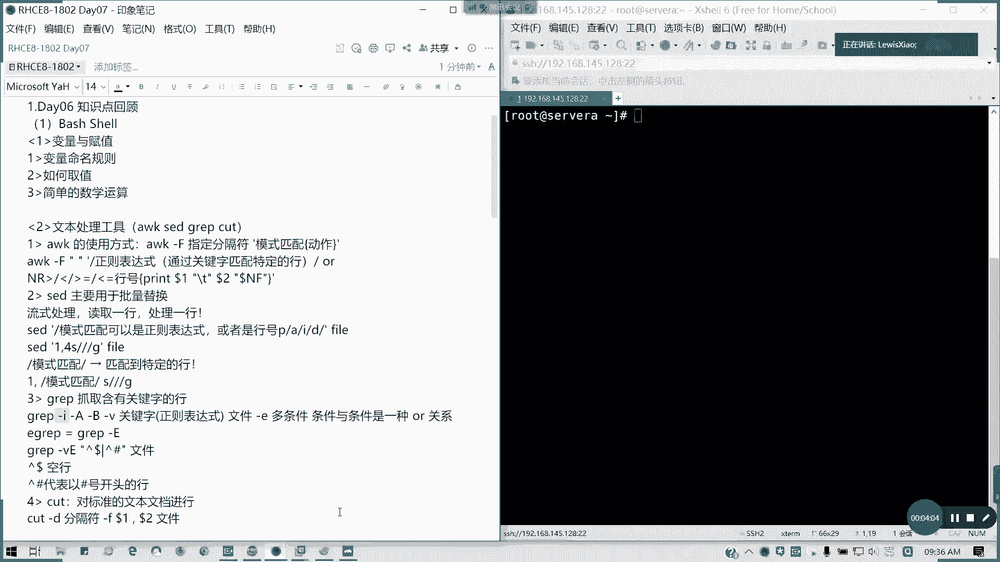
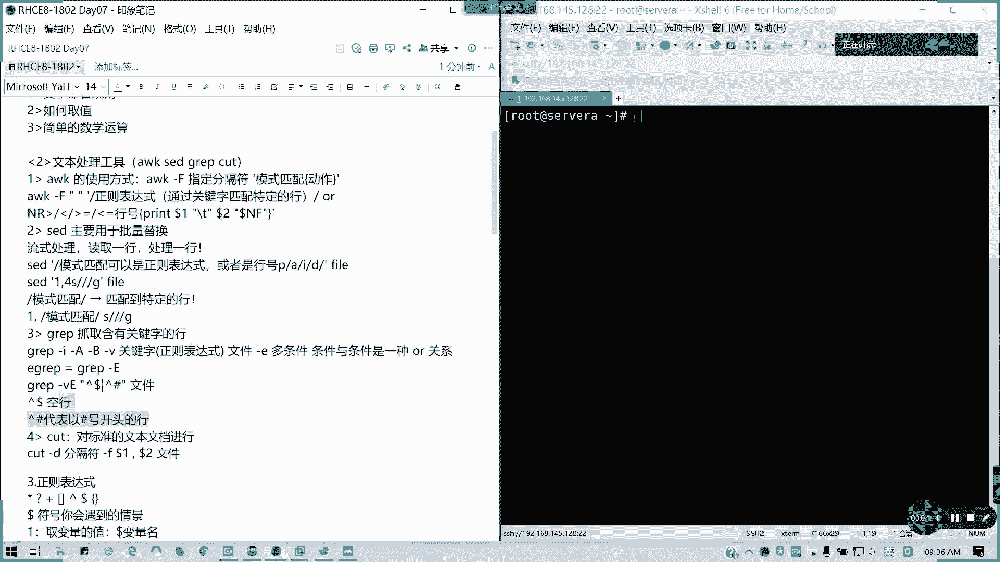
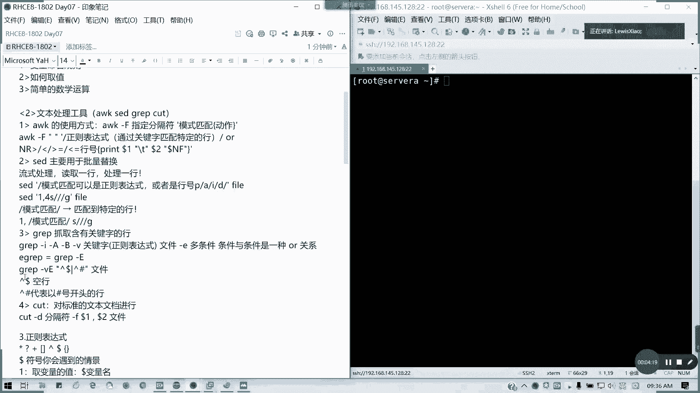

# 2021全新 RHCE8.0 红帽认证入门教程——可零基础入门学习【网络安全／Linux】 - P34：Day07_Day06课程回顾 - IT老表哥 - BV1444y1h7Bx

好。我先切换过我的那个设位A箱啊。

好，在我们今天上第七天的课程之前呢，我们先回顾一下我们上面前两天我们讲的内容啊，第一本书我就不再回顾了啊，因为已经讲完了。那第二本书一开始虽要我们讲了一天多的时间，一天多呢。

best shell啊b shell这一块，第一个变量与负值，对吧？你变量怎么命名，变量变量命名规则还记得吧？不能与数字开头，可以下划线开头是吧？只这字母开头和下划线是没问题的啊。变量命名规则。

这个应该是要懂的。然后呢，怎么取值？对吧然后还有简单的一些。数学运算。对吧数以运算这个我们讲过的，我就不再重复。第二个，我们的文本处理工具。文本处理工具呢。呃，编号改一下啊，文本注意工具我们。

g saidoc跟cutt都讲了，对不对？像O的话，oc杠F指定分隔符，然后后面是模式匹配啊，模式匹配，也就是比如说我的关键字对不对？我关键字，然后呢。可以呢看一下啊。可以加我们的那个。动作对不对？

模式匹配的话，主要是找关键字啊。

早起牙什么都没刷，然后在那里回啊，反正我就已经开了，基本上也你大家应该都能看到我的状，看到我的屏幕的状态了啊。我这个因为这屏。

还是开一开那个看看到底那个老师生时是怎么样的哈。那师兄是怎么样的哈。好，我们那个是吧，我们的正表达是通过关键词匹配特定的行，或者是我们的行号，我们的那个字符，我们的行号等等，是不是？

这是一个我们的例子格式啊。然后第三个我们的set批量替换，它是采用我们的流式处理流式处理啊。发我们按行来按行以行为流失处理啊，读取行处理一行。然后呢，它匹配呢可以是正的表达式，也可以是。行号。

然后后面的动作像P是输出打印是吧？A是增加I是直接改文件，D是删除，除了I之外呢，其他的都是模拟输出，对不对？不会实实际改文件。所以大家如果用sad的话，请注意。不要有真的没有确定性，不要乱加I。

如果加I的话，麻烦你做好备份啊。然后呢。像这些的话，我们批量替换都知道吧，跟VIM我们的那个木航模式命令很相像，对不对？这是第二个。第三个呢，我们的gra grape抓取含有特定关键字函，我们用的很多。

像我们后面的后面的一个。选项杠I什么意思？杠A。忽略大小写。杠A。显示当前行以及。后面的内容对吧？后面特定几行内容，杠B是显示当前行以及前面的几行内容。后面你跟数字杠B呢反着来。

对吧反着来。杠一呢用等一桂多条件。对不对？多条件这个用的很多哈，多条件和条件之间是一个货的关系。

只要满足一个，他都输出，他都把把截取出来。

然后像我们的多了多了井号是空行，多了井多了多不是间多了是空行。

是吧肩括号我们往上的间括号代表的是我们的。

行首对吧？以什么开头的行。

然后cart呢，它主要是对标准文档进行分，就是那个分割并输出。

分割并输出。然后呢，它主要是那个有一个分隔符，但这分隔符呢它只能识别一个。所以的话你如果对于非标准文档，你会看起来就是它后面把它当成它元素了，就不像O一样，对不对？O可以把同类型的全部当成一个。

所以的话。

它可以对那些非标准文档的切割会更加的。精准更符合我们的一个阅读的一个习惯。

然后正则表达式呢，像我们这里的话是吧，星号问号加括号，还有这边在这边在这边。

因为今天人少啊，所以在这边。找找位置啊，然后然后用那个腾讯会议登录。好，这边有这边也可以。好，先倒在这里啊，然后呢，我们的那个。这个表达式啊。还有我们的那个多的符号会遇到情景。比如说我们的取变量名。

可以用多的后面的变量名是吧？变量名。然后如果要消除歧义的话，请用多的大花括号，我们就我们大括号。

来进行。然后呢，正则表达式是吧？行伟啊行伟这里我没没讲，这里表示多就best dollar的话是表示行行伟是b啊，然后像那个。我们的一个。多了问号多了问号啊，多个问号就我们可以判断我们到底那个。

上一条命令是否执行成功啊？上一条命令是否执行成功？如果是的话，多了问的话，我们的状态返回码是等于0包可以。如果这每位置放可以放后面啊，放一排位置。不等于零代表执行超失败。

在我们下有脚本里面可以用作我们判断的一个条件。其实刚才变量我们后面都有讲了，所以这里我把它那个重新编一下号，这个号是没问题的啊。第一个文本处理工具。然后第二个的话我们看一下。第二个是这里表达式。

没有问题。这网线是可以接的，如果这网线都可以接的啊，没有问题。然后呢。第三个我们的变量是吧，我们变量等于负值刚才讲了，然后呢，变量也可以引用一条命令，对吧？命令的话可以最好是用括号，为什么你可以迭代？

懂我意思吗？迭代取值没有问题。那我们的双引号。打引号。斜杠跟反斜杠的行业。明白吗？然后还有变量的类型。数一般来说是整形跟字符串型啊，通常是两种，整形用于数数字运算。然后呢数学运算，然后字符串型呢。

你可以你可以拿来比较都可以，哪条网线都行啊，这里哪条哪条都可以。然后还要看水晶头的对吧？啊，对，这这里的话有点松的，所以的话你要看看。如果不行的欢，用无线也可以。这无线的话应该信号也OK。然后呢。

就就用通讯哦，可以了，我看到亮灯了，哎，右面啊亮的亮咦。看一下啊，这水晶头可能可可能那个看一看啊。然后呢，我们的数值运算我们也讲了是吧，这了已经啊数值运算deccaare或let或者是直接是吧？三种。

还有两个括号，三种方式。然后从键盘输入变量变量值read是吧？杠P呢就是代表我可以在前面加入一段提示符。要在提示服。然后全局我们还讲到了一个局部变量跟全局变量。局部变量呢。就是我们只在特定范围内生效。

全局变量就可以在当前的。环境变量也没有生效啊，然后还有多了一多了2，多了0是吧？012。这代表什么意思？还有多了心多了 at，多了景。做我印象吧。上上节课讲的多印象吧。然后还有。加number的话。

这一课我没讲，但是也不做重点，我就把它删了啊。所因为这这个的话不是重点。我们看之前看过，其实用处并不大啊，然后呢。判断语句，我们讲判断语句。对条对文件我们是不是有说过，我们次我们的对于。

数值的比较以及对字符串的比较。字符串还分我们纯字符串以及文件目录两种，对不对？啊，如果看不到的话，腾讯会议啊，腾讯会议的话可以看到。然后呢，那个对于条件目录是不是杠一代表文件存在啊？

杠F呢它后面还加了一个条件，就是它是一个常规文件。杠D呢是代表它是一个目录。然后字符串的判断呢，杠N代表它里面是不飞空的。杠Z。代表我这字符串是空值。对吧两个等于代表两个字符字符串恒等，对吧？

数值的判断，杠1Q等于杠L一小于等于杠G一大于等于杠LT小于杠GT大于，还有非是吧？

不等于啊非。然后还有恒等大就是相当于不等于了，对吧？一个非啊叹号。

包括我们文件不存在的话，也是叹号，对不对？

判断工具的话，通常是在shall脚本中我们。加一个方括号，记得你的表达是前后你这方括号中间也是有留空格的。而且你在数值跟你的运算符中间也是留空格的，不然的话它会识别成一条命令，懂我意思吗？控制语句。

if then是吧。比如说我们比较三个数字大小，是不是可以用if data来做。然后还有一种就多重。多重那个多重判断有Lif，对不对？简写成ELIF。然后记得我们的判断。

我们判断语句段后面是反写结尾的FI不要漏了啊，对吧？不要漏了。if后面你比记你的表达式之后是有个分号的，也不要漏了。而且他的判断标准呢是以你这个命令。你的执行结果。的多的问号为准，而不是说你的这个事实。

懂吗？它都是以语句的一个执行结果。你多的问号等于它为真多的问号等于0。如果是假多了问号等于分0。以这个为基准，懂我意思吧？Case。分支啊多重我有多个选一个命令，我我一个命令里面有多个选项情况下。

总有一个是与我们指定的选项不符的，对不对？所以的话选项一执行命令集一，选项2，执行命令集2，其他。你一一定要有出口，对不对？不可能绕不在里面出不来，懂我意思吗？然后记得它的命令，它的选项是有括号结尾的。

对吧我这里漏了这里漏了一个括号啊，然后命令集后面呢它是结束是两个分号。然后新啊就是其他的条件，也就是我总有一个出口，其他呢就是一个命令集合。然后呢。ESAC反写结束，对不对？case。还有循环语句。

我们讲了三个，一个for，对吧？for are in。ABCD是吧，然后。度我们的程序体，然后出来。啊，数值运算数值运算对吧？这样写是可以的，或者是那个我们直接对不对？然后呢。

镀程序体只能在数数字运算使用啊，然后Y尔跟TO是两个相反的。Y尔呢是你的多的问号。你。等你的多了问号等于0，就是说你的条件为真的时候。对一下命令，然后。如果是非0跳出until相反。这块没有问题的。

请在群里面扣A啊，小写A。每节课我都会把这些我们的知识点啊回顾一遍。有问题可以在群里问。关于炫这块呢，练习我会看看有没有时间。有时间，我下午5点钟之后，我跟大家剖析一下练习。

因为因为之前有学有大家有人提到啊，提提到说练习要。给大家或者是讲解一下的那可以，我下午5点之后，我抽时间给大家。因为这些对韵为里面还是有用的。但是我们前面我们在5点之前呢，我们先把新课讲完啊。

把我们既定的流程讲完。接下来我们看一下我们上周我们还讲的计划任务。计划任务呢我们讲了两个部分，一个是一次性的对吧？一次性的计划任务，还有周期性的一个计划任务。一次性任务呢我们。艾对不对？艾。

然后你后面加一个时间。比如说具体的时间点或者是。33分钟后1小时后或是隔两天都可以。这住是往前走的，不是往后倒的啊。因为他是一个将来要执行任务啊。往前走的往不是往后倒。然后呢。

croown type是周期性任务。通常来说我们杠一是编辑啊，杠一是编辑，这用的很多，考试也必有一题的。查看。然后对于杠U的选项只有root用户才能用，因为他才有权利查看别人的。

其他人除非你把SUID赋予内，就就除非你用速度或者是SUID等等这些，否则你都是只能查看自己的计划任务啊，然后呢，一般任务是吧？分时日月周命令，还记得吧。还记得吗？格式啊，分时日月中。

如果说每我们说特定的，比如说每隔几小时。是吧每隔几小时，那就在十那里，我用星号斜杠，然后后面你是隔多少时间？对吧如果是特定的时间点，比如说我2。6点10点是吧，就2逗号6逗号1，它就在这三个时间执行。

懂我意思吧？分时日月周命令，这样记绝对不会错。然后中间用我们用制表符用tap分开就可以了。不要说很多人像之前考试一样，很多人连命都连这种计划中都不会写的。系统任务就这里加个用户。

就你到底是哪一个用户运行哪个系统任务命令，然后它是分别。存在我们的。ETC里面crown hourly是吧，conown dailycom weekly跟Cme monthly它有4个预定义的文件。

就分别你你把文你把计划入务放里面呢就是。他每小时。每天每周跟每月会执行的任务，但是他有延迟，延迟的话，他是先借用户先优先啊，用用户优先执行它，然后他又会延迟像。每每每小时好像延迟5分钟，对不对？

每天的延长延长2延长25分钟呃，就最多在25分钟内，然后每每周的45分钟，对不对？然后他是在那个an tap里面去指定的。这个配置文件我们上次上周有看过啊。这块如果OK的话，请回个B。然后呢。

给大家10分钟之后消话啊，我们10点钟开始讲管理临时文件夹。我们复习先到这里啊，每反正每节课呢。上课之前。大概我讲20分钟上节课的内容，然后给十0分钟大家消化一下，我们待会10点钟讲新课啊。

管理临时文件夹，还有就是我们的一个系统调优。

我们下一节下一小节的内容。