# RHCE8.0 红帽认证入门教程：Day07：管理临时文件 📂

在本节课中，我们将学习如何管理Linux系统中的临时文件。虽然这部分内容在考试中不常见，但了解其管理机制对于系统维护和自定义应用部署非常有帮助。我们将介绍两种管理临时文件的方法，并学习如何自定义清理规则。

---

## 概述 📋

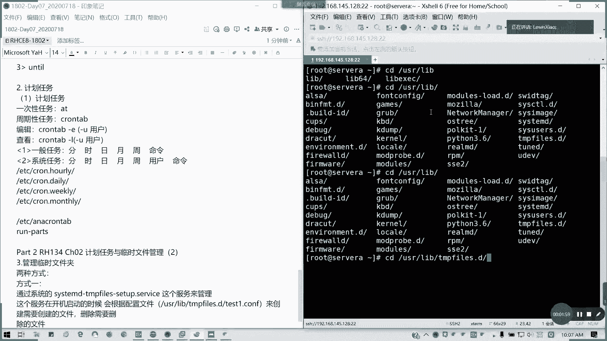

临时文件是系统或应用程序在运行时产生的文件，通常不需要长期保存。如果管理不当，它们可能会占用大量磁盘空间。Linux系统提供了 `systemd-tmpfiles` 服务来帮助我们自动创建、清理和管理这些临时文件和目录。

上一节我们介绍了系统服务管理，本节中我们来看看如何利用 `systemd-tmpfiles` 服务来管理临时文件。

---

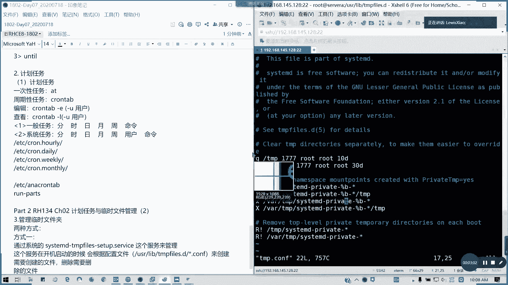

## 管理方式一：使用 systemd-tmpfiles 服务 ⚙️

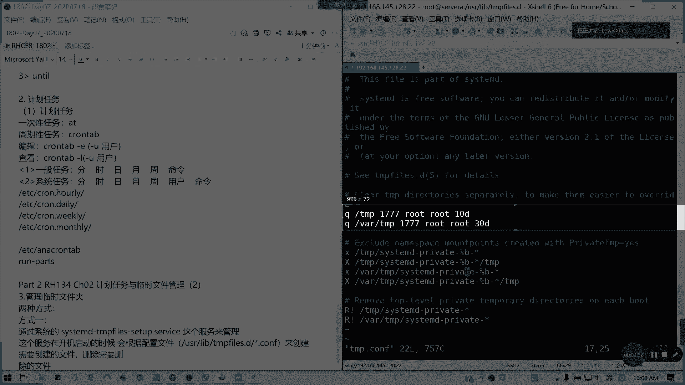

第一种管理方式是通过 `systemd-tmpfiles` 服务。该服务在系统启动时，会根据 `/usr/lib/tmpfiles.d/` 和 `/etc/tmpfiles.d/` 目录下的配置文件（通常以 `.conf` 结尾）来创建或清理指定的临时文件和目录。

### 配置文件解析

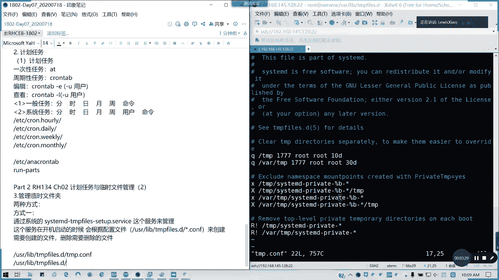

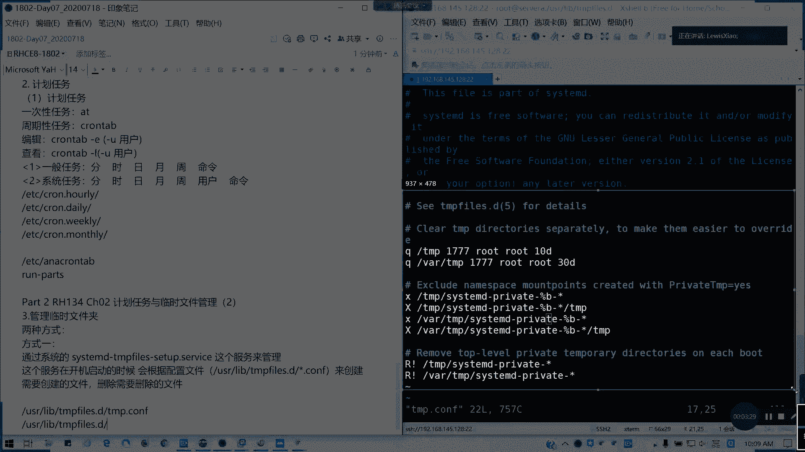

以下是配置文件中一行的基本结构：

```
类型    路径                权限    所有者    所属组    选项
```

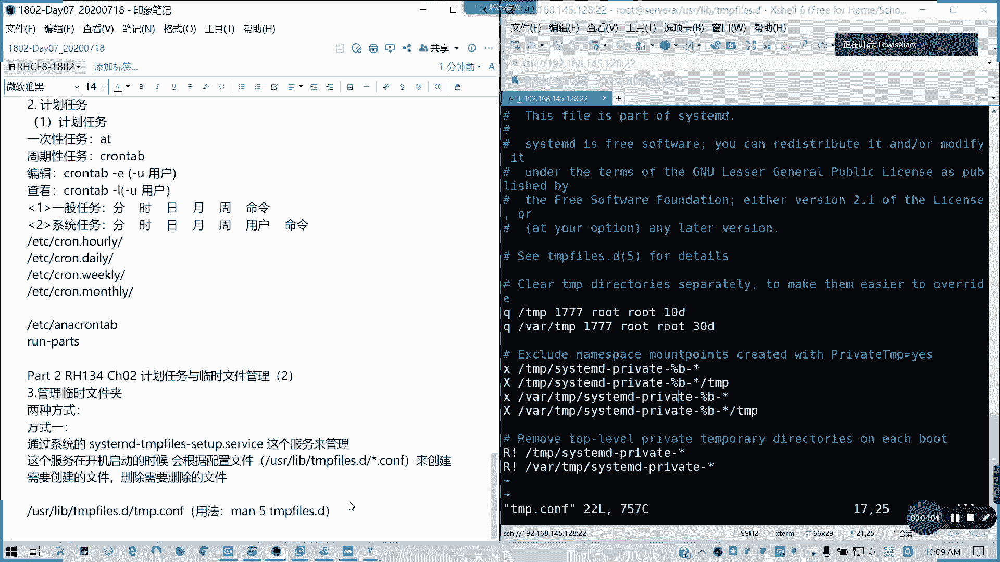

例如，在 `/usr/lib/tmpfiles.d/tmp.conf` 文件中，你可能会看到类似下面的行：

```
d /tmp 1777 root root -
```

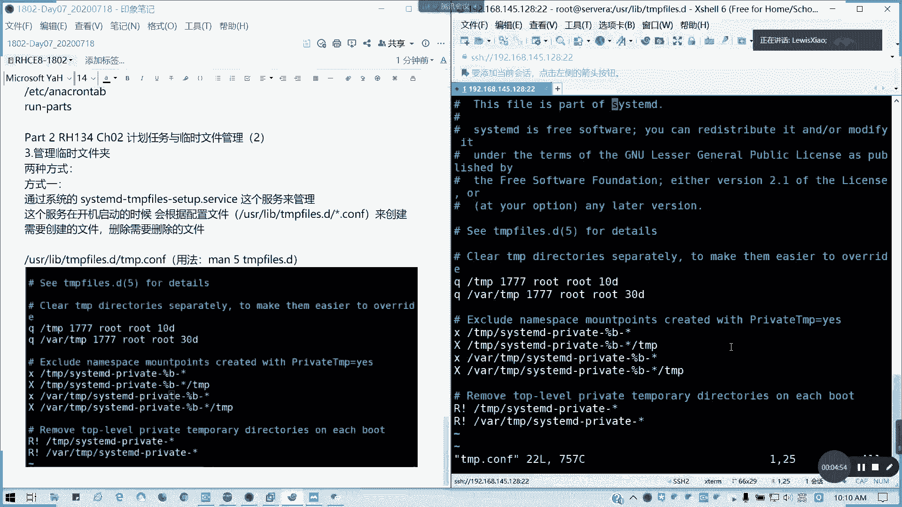

**公式/代码解释：**
*   **`d`**：表示类型为目录。
*   **`/tmp`**：是目录的路径。
*   **`1777`**：是目录的权限（这里的 `1` 表示粘滞位）。
*   **`root root`**：分别是所有者和所属组。
*   **`-`**：表示没有额外的年龄或清理选项。

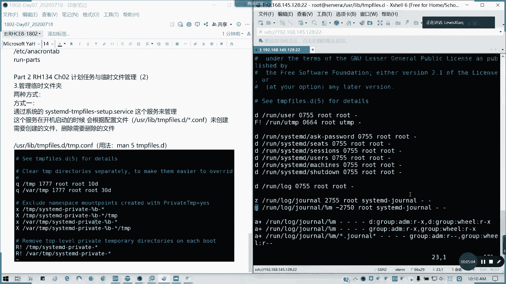

常见的类型标识符包括：
*   **`d`**：创建目录。
*   **`f`**：创建文件。
*   **`r`**：移除文件或目录（如果存在）。
*   **`R`**：递归地移除目录及其内容。
*   **`x`**：排除路径，不进行任何操作。

### 自定义临时文件管理

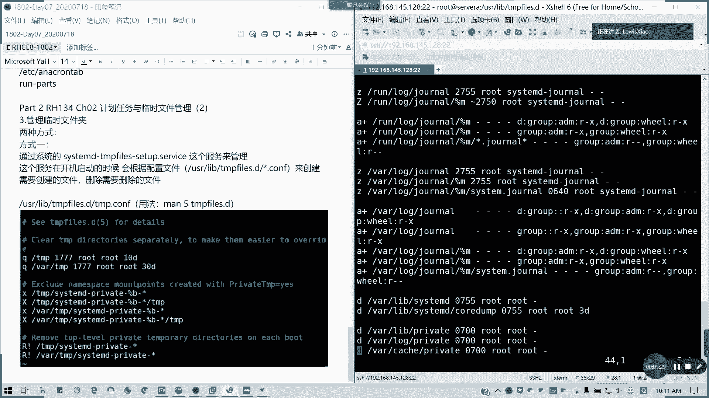

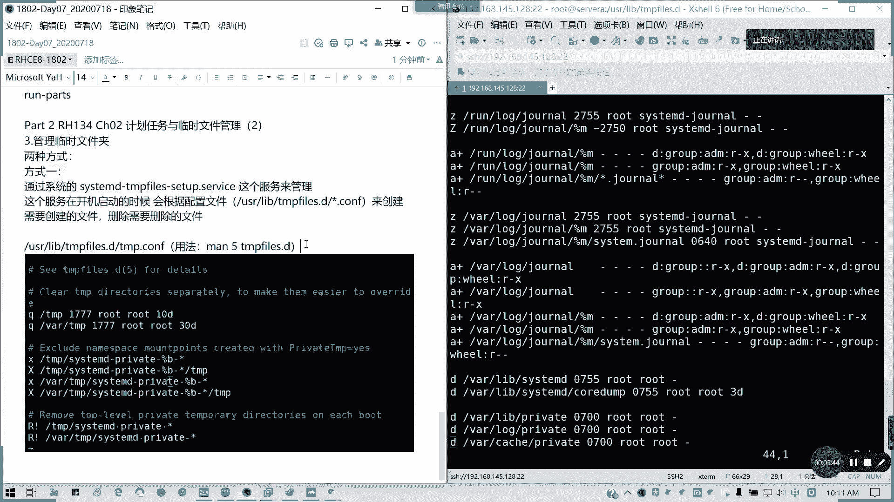

我们可以创建自己的配置文件来管理自定义的临时目录或文件。

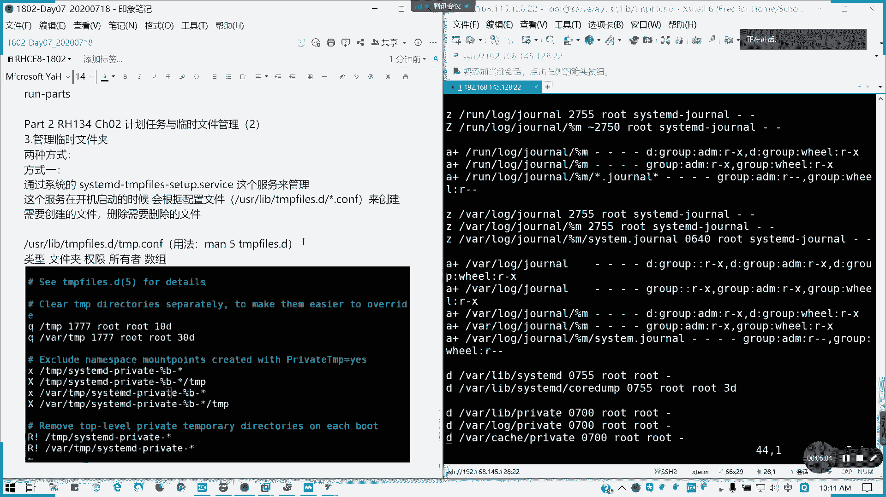

以下是创建自定义临时目录和文件的步骤：

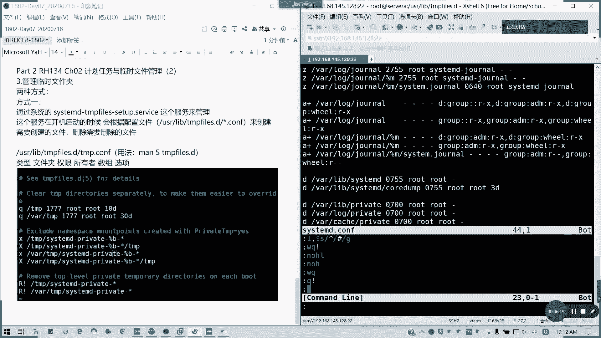

1.  **创建配置文件**：在 `/etc/tmpfiles.d/` 目录下创建 `.conf` 文件。系统会优先读取此目录下的配置。
2.  **编写配置规则**：在配置文件中定义需要管理的内容。
3.  **应用配置**：使用 `systemd-tmpfiles` 命令手动创建或清理。

**操作示例：**

首先，我们创建一个配置文件 `/etc/tmpfiles.d/myapp.conf`，内容如下：

```bash
# 创建一个临时目录 /var/myapp-tmp，权限为 700，所有者为 root
d /var/myapp-tmp 0700 root root -
# 创建一个临时空文件 /var/myapp-tmp/lockfile，权限为 600
f /var/myapp-tmp/lockfile 0600 root root -
```

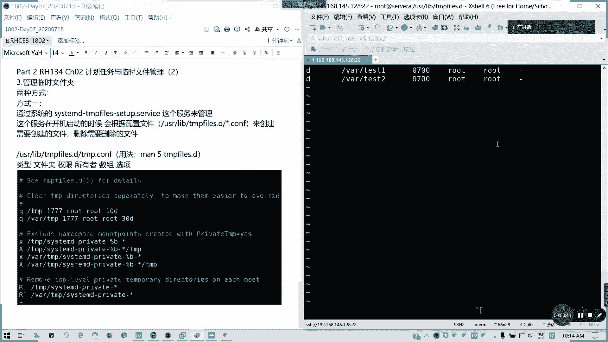

然后，执行以下命令让配置立即生效：

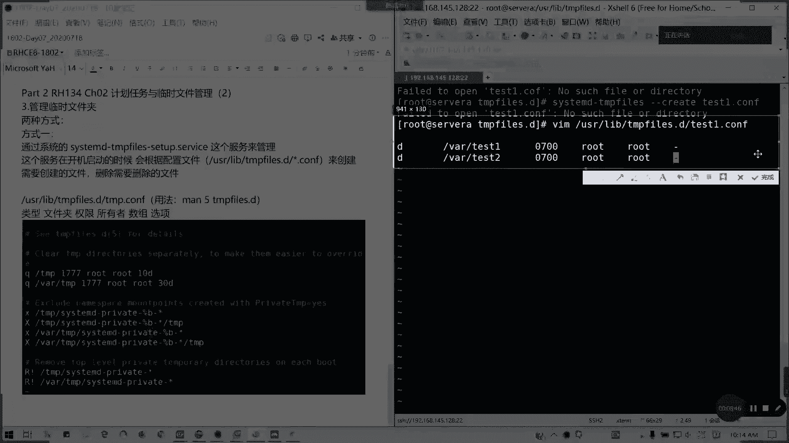

```bash
sudo systemd-tmpfiles --create /etc/tmpfiles.d/myapp.conf
```

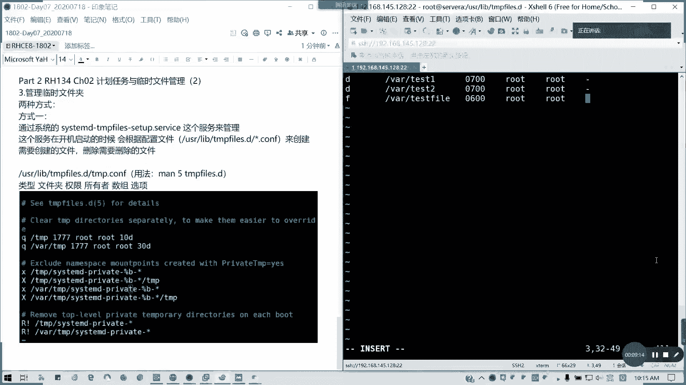

执行后，系统会自动创建 `/var/myapp-tmp` 目录和其中的 `lockfile` 文件。

---

## 管理方式二：定义启动时清理规则 🧹

除了创建，我们更常用的是定义在系统启动时自动清理的规则。例如，我们希望每次启动时清空某个缓存目录。

以下是定义启动清理规则的步骤：

1.  **创建清理配置文件**：同样在 `/etc/tmpfiles.d/` 目录下创建文件。
2.  **使用 `r` 或 `R` 类型**：`r` 用于移除文件或空目录，`R` 用于递归移除目录及其所有内容。

**操作示例：**

创建配置文件 `/etc/tmpfiles.d/cleanup.conf`，内容如下：

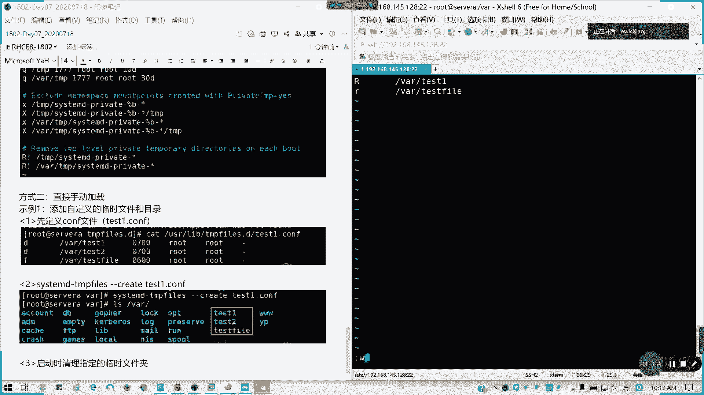

```bash
# 每次启动时，递归清空 /var/cache/myapp/ 目录下的所有内容
R /var/cache/myapp/
```

要使此规则在下次启动时生效，无需手动运行命令，`systemd-tmpfiles` 服务会在启动过程中自动处理。

如果你想立即测试清理效果，可以手动执行：

```bash
sudo systemd-tmpfiles --clean /etc/tmpfiles.d/cleanup.conf
```

---

## 查看与验证 🔍

为了验证配置是否正确以及服务管理的文件列表，你可以使用以下命令：

*   查看所有由 `tmpfiles.d` 管理的配置：
    ```bash
    ls /usr/lib/tmpfiles.d/*.conf /etc/tmpfiles.d/*.conf
    ```
*   查看某个具体配置文件的详细信息，可以使用 `man` 命令：
    ```bash
    man 5 tmpfiles.d
    ```

许多系统自带的应用（如 `httpd`、`mysql`）已经在 `/usr/lib/tmpfiles.d/` 目录下提供了它们自己的临时文件管理配置，我们可以参考这些文件的写法。

---

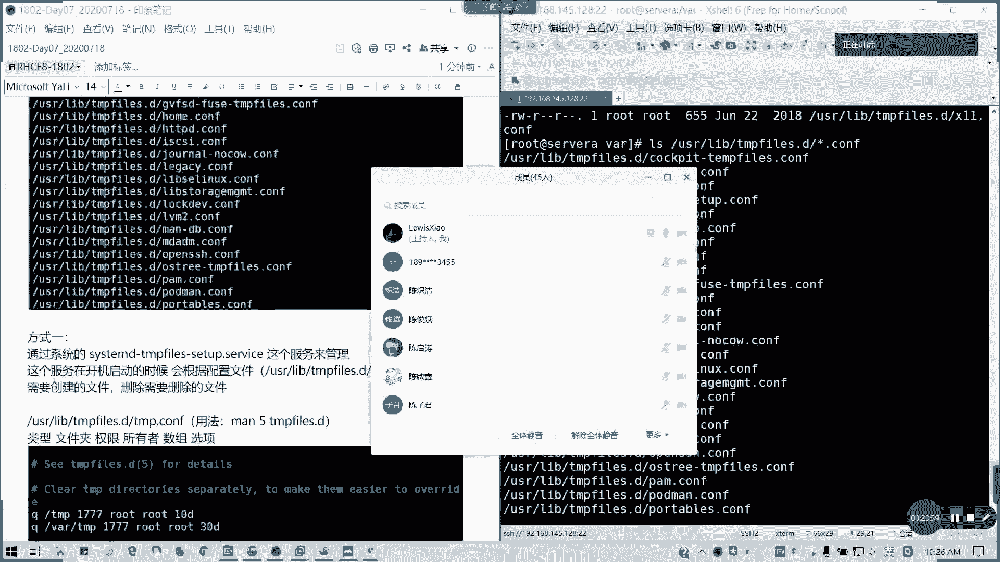

## 使用场景与总结 🎯

**使用场景**：当你安装自定义的软件或服务时，该软件可能会产生大量的临时文件或缓存。你可以通过编写 `tmpfiles.d` 配置文件，让系统自动帮你管理（创建或定期清理）这些目录和文件，避免磁盘空间被无意义地占用。

**本节课中我们一起学习了：**
1.  Linux 系统通过 `systemd-tmpfiles` 服务管理临时文件。
2.  管理方式主要分为两种：**创建文件/目录** 和 **定义清理规则**。
3.  自定义配置需要放在 `/etc/tmpfiles.d/` 目录下，并遵循 `类型 路径 权限 所有者 所属组 选项` 的格式。
4.  可以使用 `systemd-tmpfiles --create` 或 `systemd-tmpfiles --clean` 命令手动立即应用配置。

虽然 RHCE 考试可能不直接考查此知识点，但理解其原理对于成为一名合格的 Linux 系统管理员至关重要。