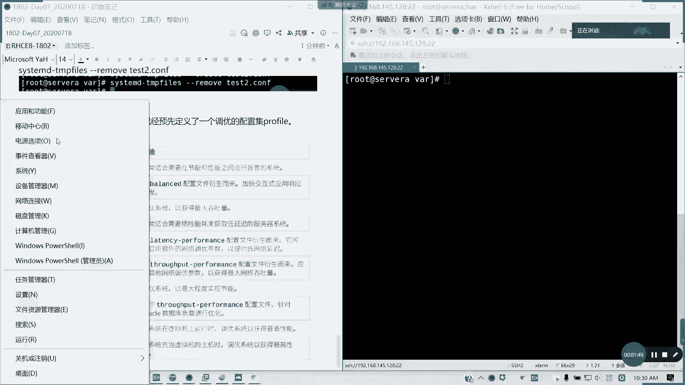
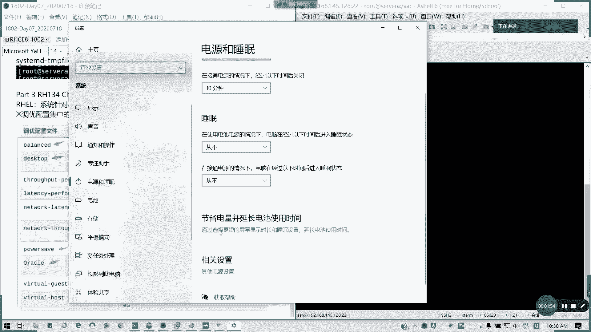
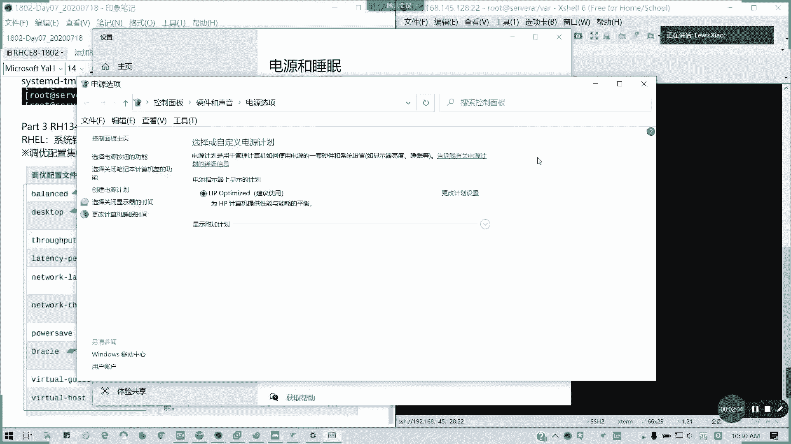
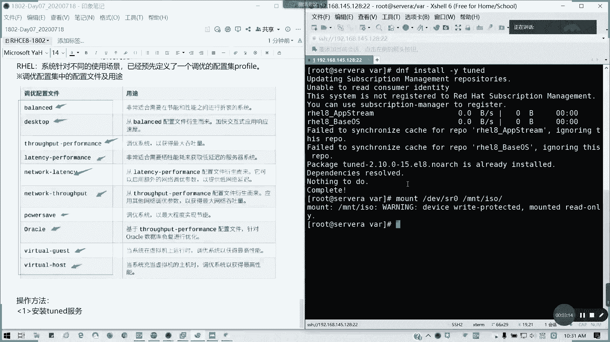

# RHCE8.0 红帽认证入门教程：03：系统调优与文件访问控制列表

在本节课中，我们将要学习RHCE考试中涉及的两个重要主题：系统调优配置集（Tuned）和文件访问控制列表（FACL）。系统调优是RHCE 8.0新增的内容，用于根据不同场景优化系统性能；而FACL则是对标准Linux文件权限的扩展，提供了更精细的访问控制。我们将分别介绍它们的基本概念和使用方法。

## 系统调优（Tuned）

上一节我们介绍了课程的整体安排，本节中我们来看看系统调优。在RHEL 8.0及之后的版本中，红帽引入了Tuned服务，它针对不同的使用场景，预先定义了一系列调优配置集（profile）。这些配置集类似于Windows系统中的电源管理选项，可以一键应用，以优化系统在不同负载下的性能。





### 核心概念：调优配置集（Profile）



调优配置集是预先定义好的一组内核参数设置。系统会根据你选择的配置集，自动调整相关参数以达到最佳性能。例如：
*   **balanced**：适用于大多数场景的平衡模式。
*   **desktop**：源自`balanced`，优化了桌面环境的响应速度。
*   **throughput-performance**：优化系统吞吐量。
*   **latency-performance**：优化低延迟场景。
*   **network-latency**：针对网络延迟进行优化。
*   **virtual-guest**：适用于虚拟机客户机，以获得最高性能。
*   **virtual-host**：适用于运行虚拟机的宿主机。

### 安装与使用Tuned服务



要使用Tuned，首先需要确保服务已安装并运行。以下是使用Tuned服务的主要步骤：

1.  **安装Tuned服务**
    使用以下命令安装`tuned`软件包：
    ```bash
    dnf install -y tuned
    ```
    安装后，`tuned`服务通常会默认启动并启用开机自启。

2.  **列出可用和活动的配置集**
    使用`tuned-adm list`命令可以查看所有可用的配置集以及当前正在使用的活动配置集。
    ```bash
    tuned-adm list
    ```
    输出结果会明确标识出当前活动的配置集（`Current active profile`）。

3.  **查看当前活动的配置集**
    专门查看当前活动的配置集，可以使用：
    ```bash
    tuned-adm active
    ```

4.  **查看系统建议的配置集**
    系统会根据当前的硬件和运行环境（如是否为虚拟机）给出一个建议的配置集。
    ```bash
    tuned-adm recommend
    ```

5.  **应用新的调优配置集**
    要将系统切换到另一个配置集（例如切换到`virtual-host`），使用`profile`子命令：
    ```bash
    tuned-adm profile virtual-host
    ```
    应用后，相关的内核参数会立即生效。此更改在系统重启后依然有效，因为`tuned`服务会管理这些设置。

对于RHCE考试的要求，你只需要掌握如何查看当前配置、查看建议配置以及切换到指定配置集即可。这通常是一道送分题。

---

## 文件访问控制列表（FACL）

在学习了系统性能调优后，我们转向另一个核心主题：文件权限管理。标准的Linux文件权限（属主、属组、其他人）有时不够灵活。例如，一个属主为`root`、权限为`700`的目录，如何让`user1`用户只有读权限，而让`student`用户有读写权限，且不改变目录的属主？这时就需要使用文件访问控制列表（FACL）。

FACL是对标准权限的扩展，允许你为任意用户或用户组设置独立的访问权限。

### 核心命令与用法

以下是管理FACL的核心命令：

1.  **查看FACL**
    使用`getfacl`命令查看文件或目录的访问控制列表。
    ```bash
    getfacl /mnt/test
    ```

2.  **设置FACL**
    使用`setfacl`命令设置权限。
    *   为用户`user1`添加对目录`/mnt/test`的读(`r`)和执行(`x`)权限：
        ```bash
        setfacl -m u:user1:rx /mnt/test
        ```
    *   为用户组`student`添加读写(`rw`)权限：
        ```bash
        setfacl -m g:student:rw /mnt/test
        ```
    *   `-R`选项可以递归地设置目录及其下所有内容的ACL。

3.  **删除FACL条目**
    *   删除特定用户（如`user1`）的ACL条目：
        ```bash
        setfacl -x u:user1 /mnt/test
        ```
    *   删除所有ACL条目（恢复为标准权限）：
        ```bash
        setfacl -b /mnt/test
        ```

4.  **设置默认ACL**
    默认ACL只对目录有效，它决定了在该目录下**新建**的文件或子目录会继承哪些ACL权限。使用`-d`选项设置。
    ```bash
    setfacl -m d:u:user1:rx /mnt/test
    ```
    设置后，在`/mnt/test`下创建的新文件将自动赋予`user1`读和执行权限。

**关于有效权限（effective permission）**：当为用户设置的ACL权限超出了其所属用户组的最大权限范围时，`getfacl`命令的输出中会显示一个`# effective:`注释，标明该用户实际的有效权限。

---

本节课中我们一起学习了RHCE 8.0中的两个实用工具。首先，我们了解了**Tuned服务**，它通过预定义的配置集简化了系统性能调优，你学会了如何查看、建议和应用这些配置集。接着，我们回顾了**文件访问控制列表（FACL）**，它提供了比传统Linux权限更精细的访问控制手段，你掌握了使用`getfacl`和`setfacl`命令进行查看、设置和删除ACL条目的方法。这两项技能在RHCE考试和实际系统管理中都非常有用。