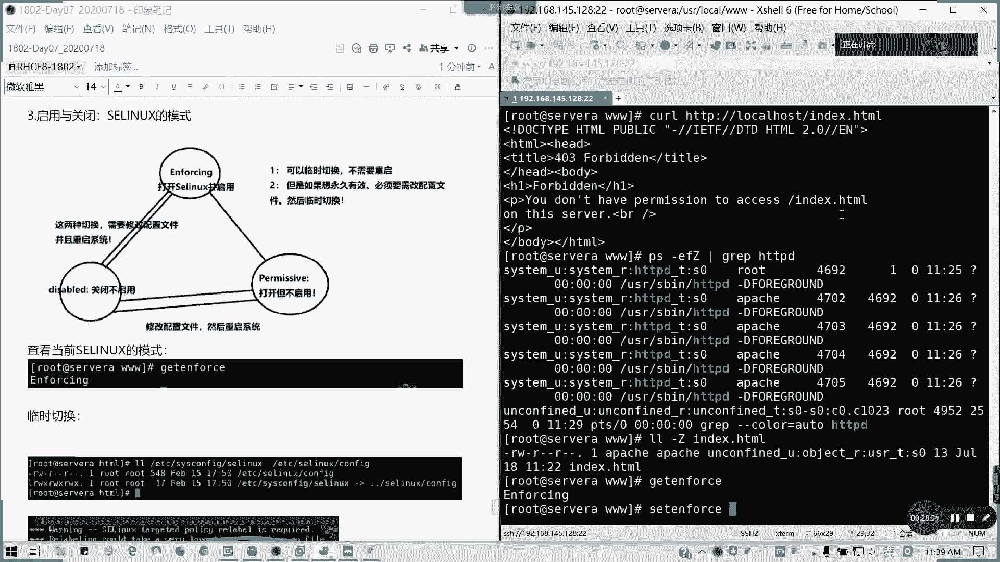
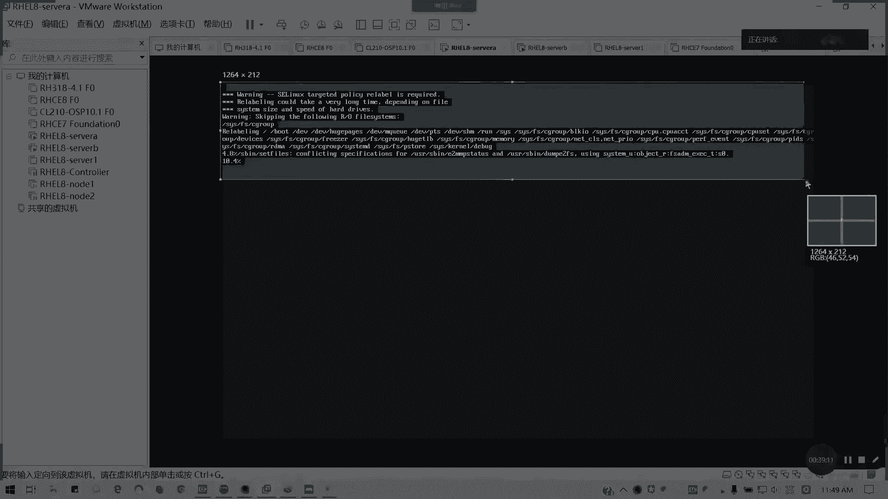
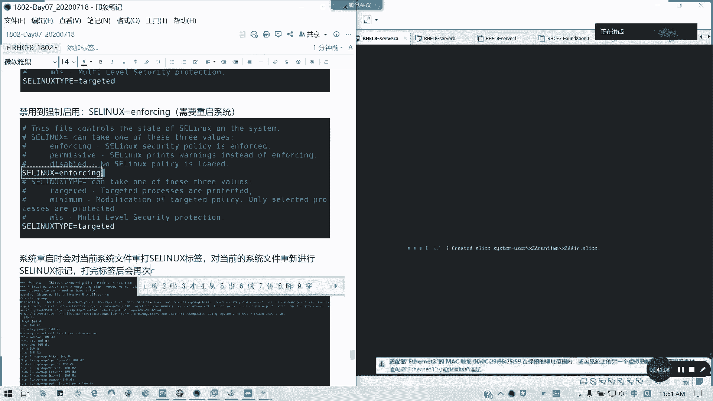
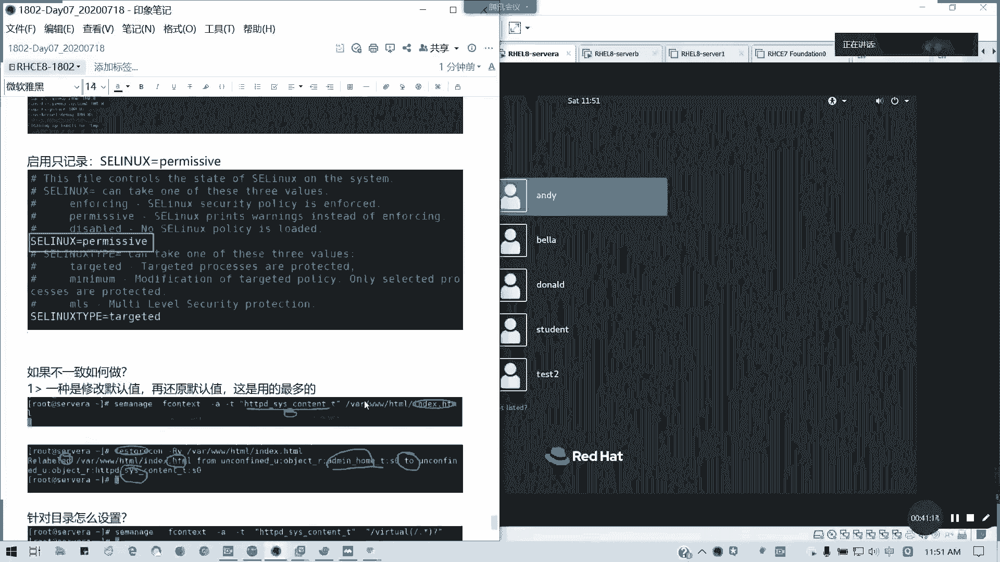

# 2021全新 RHCE8.0 红帽认证入门教程——可零基础入门学习【网络安全／Linux】 - P37：Day07_RH134_Ch05_SELINUX - IT老表哥 - BV1444y1h7Bx

好的，各位我们讲第五章SAlinux。我们通常呢。

我们这里的话我们配合一下我们的HDDPD服务啊。这里的话我一个前提准备。

通常我们要确认我们的HTPD的这个服务有没有安装？我这里是说一个例子啊。

如果没装呃，我们这里是用它的做例子啊，请准备。然后呢，我们。那我们要把它的服务启动是吧？🎼我们局在8的话是可以用enableable，然后刚刚闹的。那7的话就拆成star给你内部两个命令，对吧？等同。

我前面有个图，我先截一下。

那后此时呢我们去测试访问啊。我此次测试访问的话，是不是否定的呢？当时我们再来看二参数，就是我们只接访问里面文件夹的一个首页内容。但是没有，对不对？到时怎么办？我们看一下我们的进程啊。

我们的现在首页什么都没有。

我们看一下我们进程。我们发现我们的那个。我们的HDDPHDDPD幅是不是阿帕奇的？对不对？然后哈奇用户，那我们接下来我们创建的用户呢创建的一个主页文件呢，我们现在是假设我们现在没有主页文件的。

我们现在所有的他的他的那个HDP，它的那个用户是阿帕奇啊。那我们现在创建一个首页文件，我们直接。切在我们的document root，对不对？他默认装完HTPDHTDPD服务就出产VR3WHTML。

会去建立这样一个目录，对不对？我们的网页的一个默认的document root。那我们要创建一个文件，就是里面直接用VIM。然后呢，我这里啊。比如说我就写这个。helello，lin。

然后此时我去访问的话。就它是返加加杠I是反回一个状态码，懂我意思吧？反回一个状态码。然后如果不加杠I的话，是会返回一个文件内容。然后当前因为我们root的话也是可以的。当前我们的属主是root，对不对？

因为他为什么可以呢？因为他对那个其他的一个用户他是有独权限。像我们阿帕奇是不是属于其他组的用户，对不对？有读权限，他就自然能够访问了。但是我们这里又扯到一个。

安全性的一个东西啊。

我们接下来要讲到加强安全性的访问啊，这是我们测试的一个前提。加强安全性访问呢主要是讲的是SC news啊。我们对于普通的权限呢。那对于普通的权限，哎，怎么变鞋底了？

我们对于普通的权限。主体是用户，对吧？客体呢这对于我们这个文件啊，比如说我们呃我们看下的tUE还在不在？没有这用户啊。我看t user在不在也没有。pa一有啊。比如说我们的t一。这用户我们对这个课题啊。

普普通权限的话，通常它有读权限就可以了，对不对？

像我们这里的话，阿帕奇也是一样的。阿帕奇他对那个。对我们的那个inestHD是不是可以读啊？它因为它不属于它的所组组跟那个所有者跟组嘛，那他是不是对其属于其他人呢？它你本身具备R全线就已经可读了。

对IC6的时呢，比如说。对SA6是说我们如何去增强权限呢？我们来来弄一个这样一个场景。我们主体变成了一个进程。对吧。所你变成进程啊，而不是具体的用户了。

那后客体呢。便你还是。文件对不对？还是文件，对不对？那如果SA news呢只一个安全性上调，什么意思呢？安全向征什么意思呢？只有客体。的安全性向上符合主体。的安全向下文的设定的时候。

这个主体才被能够允许访问这个课题文件，明白我意思吗？就你要满足进程的一个安全性要求，而不是文文献用户的一个安全性要求了。所以有时候呢我们如果我们现在的这个安全这个文件夹安全性下限我们是符合的。

比如说我要。我是指我看一下啊。很简单，比如说我的那个HTTPD。我这我这我这网页服务我放到另外我指定另外一个文文件夹，一个普通文件夹对吧？然后我的那个安全下限如果不符合条件的话，它也是不行的。

我可以试一下啊。我们 document门录是吧？🎼那么最稳定的不存在啊。我来我我要尝试这样一个场景，就我改文件夹，我用从普通全普用普通的范围创建文件夹事后，看看我们这个网页还能不能被访问。

最稍等一段时间，它这里我这台机器这虚拟机，我启动这个HTDPD服务非常的长啊，大概大概几十秒钟，要等一等。好了。因为刚才我是文件夹不存在，所以他才报错的啊。我在在这这里再建一个，应该是点HDMI文件。

同样写的同样那容。哪看我见的那么反外。他现在显示是默认主页。这不是我们写写的内容了。他显显示403嘛，对吧？3，然后它显示是一个默认的首页了。那那访问的不是我们的内容啊，对不对？

对不对？我没没权限，懂我意思吗？为什么没权限？安全上下文的原因。我这里啊假定。有所以把改一下啊。我首先请你模拟。第一个我将。

等一下，我把那个配送调出来。

我就改这一项。

这里的话是catet break出来那种，而不是我原本是用就我原本是用VIP机器的，应该懂吧？把它不出来，我修改了哪个部分。懂了吧？可以明白吗？我这样归不出来之后，我重启我的HDDPHTDPD服务。

我再再接一遍吧。一脸懵逼是吧？为什么我移到别的文件下不行啊，我我我的意思是要这么。我要这么给大家讲。为什么我一移到别的文件夹都不行呢？我在VR3W就可以呢。

我这实验场久我要说明啊。我明明我写的这个。文件我们为什么移了文件夹，我就不能我就我就不能访问了，对不对？大家想想什么原因？其实就是我们的上下文没有对应。

对吧我上下我们没有没有没有跟跟我们的晋升是不一致的啊。我们我们的用户的话。路ot我哪怕我把它改成阿帕奇。因为他我们知道他进神是阿帕奇嘛，对不对？阿帕奇用户跟我们组，对不对？我再次访问也是一样。

为什么我改目录？我把那个document录改了都不行。同样是403，对不对？郑傲佳是不是还在一脸懵逼中？那其实呢我们就要关注到一个安全上下问题了。我们刚才是不是讲了一个概念。

你要它的现在它的一个主体是进程的，懂吗？它的那一个安全性的主体是进程的那我们来看一下进程的我们的。HTPD我们的安全，我们的上下文。加了一个大Z就查看S6安全上下文啊。

它的安全上下文是HTTPD下线T它的类型啊，我们注意到它的类型。前面是用户角色以及类型啊。它类型是HTTPD。那我们的。对吧然后我我们来看一下我们的本地文件的。本地的文件安安全上的微信或是我们查查那个。

目录的也可以。所以它的类型是不对应的呀。这类型是USR，我们的软件资源杠T，对不对？我们的HTTP，我们进程要求它的安全上升文类型是HTTPD杠T，但这也是USR杠T。

像我们例我们原本课件是admin home，它因为它建这个跟目录啊。它的一个安全上下文类型。USRRT。这我写打太多字了啊。结果这次再不下了。看能不能把它拉大一点。能知道原因了吗？

它的类型它进程所要求的一个上下文类型，安全上下文类型跟它不一致。对吧所以就会产生它产生报错。比如你这个文件不是我不是就我是进程不能访问在SAlin开启的情况下。懂我意思吧？如果解决我们看我们后面再看啊。

这个就是实验一个模拟啊。我们这里的加强安全产问，我再看一看啊，看一看我们的这一块的内容。这块内容的话。这已经是一个前前沿啊。这是第二个。那我们来讲一个S6一个模式。我们在讲这个如何去解决之前呢？

我们先来看一下SC6什模式。SC6只是系相当于系统里面的一个增强型。

啊，SC news叫做我们前面啊叫做。增强系系统啊。叫做安全增强的一个配置啊安全增强的一个配置。S你怎么简单这么理解？懂我意思吗？就相当于它里面在做一个安全设试。然后呢，我们SA6的启动已关闭啊。

我们来看一下S6ux的几个模式。几个模式呢？通常我们在系统默认安装的时候，如果安装的时候呢，我们系统安安装的时候呢，我们可以看一下。系统默认安装设进行forcing。但是我们在企业里面啊。

在很多企业运营里面，为了避免什么冲突啊，或者是因为SN news造成一个不良影响，通常都是把通通把它关闭。对不对？你们是不是你们是不是如果在企业里面是不是这样子？很多都是在特别在6跟7里面。

为了避免它带来一个负面影响。统统把它关闭，但是考试不是哦，考试是要求把它启用的状态哦。inforcing的是强制的。所以其实你们如果学了SC news之后呢，你们也可以知道为什么刚才会出现这种情况。

对不对？就算因为它类型不类型不符，或是其他的一些原因，导致你这原本如果你在正常我们都关闭的时候，是我们能访问这个网页文件。但是实际上不行。对不对？所以的话我们要了解一下SCD在解决这问题之前。

我们先了解一下SD是是干嘛用的，就这个安全增强一个配置。然后它是有三种模式，一种是打开SC6并启用，就是我们的inforcing的模式，对吧？

还有就是一种permissive就打开，但是它只记录不启用，叫做permissive允许的模式。然后还有一个就是关闭不使用我们的diable，对不对？通常呢我们临时切换是吧？临时切换我们这种呢。

只要正和的一种。只要任何一种模式切换到diable呢，就diable跟任何一种模式切换呢，你都需要修改配置文件，并且重启才生效。就对吧要把它禁用，对不对？禁用或启从禁用启用或是从启用里面。

我们禁用S news是不是要重启啊，修改配置文件，然后重启系统哦，当前是不生效的。然后如果从我们的。inforcing我们的强制启用到我们的子记录，或者是两者之间切换呢，我可以不需要重启。

我可以临时切换。然后修永久有效的话，我就修修改做临时切换就可以了。这是S use三种模式的一个机制，懂我意思吗？所以通常你们在企业里面是不是在企业环生产环境里面，是不是金用的话，是不是要重写啊？

包括任何一个版本都一样。所以这里呢我们要教大家如何去看查看它模式。像我们通常我告诉大家，考试里面，他的一开始的设定的一个SC news模式绝对不是inforcing。绝对不是啊。

他要求他的一个要求就是说请确保你当前的主机。我需要你控制主机。是inforcing模式。懂吗？考试大概的一个要求是这样子。那我们现在是in风险啊。查看。当前S0linux。的模式。

用get enforce啊。然后呢。我们一个临时切换。教大家啊。原本课件没没写那么详细的，临时切换。set enforce对不对？

set force一是inforcing。那set enforce0呢？是permissive，懂吧？我们发现是不是没有一个disable选项啊？对吧。

然后如果要修改配置文件啊。

需要修改配置文件。ETC。S。好fi个。为什么这里我要列出来一个。两个文件的对比，因为它是一个软链接，所实我们修改两个位置都可以。但我们习惯了啊就修改它的最终文件。

有没有发现它是一个软链接啊？

修改EDC。ss config Slin也可。因为。他是。这个配置文件的。软链接。对吧那软链接我修买两个哪个都生效，对不对？懂我意思吧？我修改软件接，然后怎么修改呢？

左看到啊。修改的话，我们只需要修改这一行，就是我们的S links这等于这一行。这行呢它上面已经有有我们的注释啊说明。它的值的用途，像in风cing呢就是我们的S in安全策略是强制启用的，对不对？

我们这这一块。这一块已经是这一块啊，我用别的方方框的颜色扩起来。这块他已经说明了SC news它的它的那个。用途对不对？然后下面这个是它的类型。就是它的保护类型。

那下面它是一个目标啊或者怎么样，我们就不用管它的，我们只需要管上面。下面的话它是就是说它的S类型，它是一个就是。

目标进程会被保护或者是最小化，对不对？选定最最小化，然后还有一个多级别的。但是我们这里我们先不涉及这个这个东西。我们这边设及的话就是一个开关。如果。

我们这里的话是inforcing对，如果我们要改的话，就改这一行。

我这在这里截图啊，禁用SAlinux。え？修改为。S一6。等于disable。保存退出后。重启系统。这次我调大调为14号吧。如果要禁用的话，记记得是要重启的。如果是调其他就不用啊。

permissive这就不用啊。如果是diable的话，我们来试一下。

然后当前我们吕布刀吕吕布他，我们看一下我们的是我们的那个切回来，看下我们的思维。

如果这里的话，我们做这里的话，他可能会要求重打标签。就从从那个从信用关闭是不用的啊。

然后如果把它再次启用。从禁用到启用啊。到强制启用。forcing。然后呢，另外的话就是。允许启用只记录。等于permissive。那我现在我重新连过。这然我是进入状态，我把它启重新启用啊。不稳定吗？

他应该不会啊，这就不会了。因为早上他也是这样。再改一下，我们就改成enforcing。

学S可以帮到我们很多东西的。只不过我们是那个企业里面是嫌烦啊，嫌烦，然后把它禁了。

然后如果是那个刚才说的，如果是那个只记录的话，就permissive。

好，我现在改成inforcing啊，就是现现在的话我是从diableable改过来的。🎼改成inforcing。

记得这种状态一定要重启。看一下。

看到没有？他偶尔我们从。我们从禁用到从到启用的时候，它会帮我们重打整个SA令子标签。

对吧。包括以后我们改密码的时候也是需要的，就改密码到那个重打标签，我们可以让系统帮我们自动重打标签。就为了避免SA news出现的一些问题。可所所以的话会出现这个选项是正常的。

他会对这个文件重新进行SA标记。

对这个过程还是有点久的啊，大概。然后他如果有冲突的话，他会用系统推荐的一个类型啊，一标签类型。这是为了这是因为安全的设置起见啊。然后如果这里只读的话，read only的话，它是不会它是不会跳过的。

然后导印标签它会再重启一遍。

懂我意思吧？这一步啊。就如何修改SC6状态，这个是考试会有要求的。这个这个如果知道的话，请打个一。

如何修改，然后它的一个整个过程。

如果从diable到inforcing的话，是要这样子的。

然后呢，接下来我们看一下。如果。

问题就是我们回到刚才的，我们刚才这是不是标签不一致啊，呃类型不一致，对不对？那我们要怎么做，我们来看一看我们的做法。在IAD启动的情况下。

我们用的最多的一个方法呢，是按如果不一致的话，怎么处理呢？我们可以把这一个。安全上下文类型，我们把。

文件安全项限为类型，修改它的默认值，修改默认值怎么修改呢？我们重新登录啊。我刚才是是发现那个userUSRlo里面的那个W3W indexHTML。我们加杠Z是吧？就是我们的安全上升维类型不一致。

我们前面那个用户决策跟那个优先级，我们不管，我们就讲那个安全上升维类型，它现在是不一致，对不对？怎么修改呢？SD manager。F contest修改安全项类型，默认的安全上这种类型。杠A。

添加添加我们的一种类型啊。这类型。HTDBD。我们要。让我们的那个网页可访问它的安全项目类，安全上下目类型叫做。我还是放在这里吧，HTTPs content杠T。然后后面跟文件。可以看得清楚了吧。

C NT E NT啊。我来修改它的安全上下文，默认安全上下文类型。这里的S contest呢是修改它的默认安全上下文。然后杠T呢。杠A是添加。杠T呢是类型。然后像后面的HGPDs content。

这是web，我们的HTDPD可访，就是说HTDPD系的内容啊。然后面跟文件。然后我们再还原它的默认上下分类型，也就是意思是说我以后的设置这类文件的话，它会。跟随着他懂吗？跟跟随他我们设定的默认上下。

我们来应用restorecon。杠RV。然后后面。那以后我们创建文件的时候，都是用它用这个安全上线化类型了。那我们可以可以看一下LL杠Z。事情。哎，我看一下啊。不と呀。我这图我先保存一下啊。

先保存一下这位置。杠RV的话，我们是要加一个路径的啊。我刚才没有设定一个，我我没有指定具体路，就路径的话我们没写好啊。这样要我们要带带路径的，带路径才是最对的啊。这是HTDPD的安全上线文型啊。

然后这里呢restore空杠RV是还原啊，递归还原默认设置，然后只把它显示出来。所以的话它会有下面一个结果。就从USR杠T。他重打标签了，对不对？那我修我修改成这个。就刚才我们设定了。

就当前的那个设定的这文件安全上线的类型时后呢，我们可以把它还原，对不对？还原成一个默默认设置。刚才设置默认我们并实际上并没有改，懂我意思吗？然后针对目录怎么设置呢？针对目录呢。这个目录我们有一个通配符。

比如说我要针对整个目录来设，那就是这样子啊。同样两个方，两两条命令SC manager。同样是F contest杠A杠T。然后呢。类型后面跟我们类型。然后跟对目录呢，比如说我当前。US3。

local 三 w。对吧3W，然后后面我加通配符，就是对它目录下面的任意子文件跟子目录生效。我看有有点有困的啊。就这个指纹键跟子目跟子目录，那就杠点心。是吧。问号。杠点性问号的意思呢。

就是对于它的那个属下的啊，这目录属下的子文件跟子目录都都设定安全上线类型。为这个。对啊，我这里是设定一个目录的杠点新闻号，然后我再再次啊RV。到这个目录就可以了，他会把整个目录进行修改。

这里我们知如果这对目录的话，我们通配服啊。通配服要知道它是什么什么意思啊，杠点新闻号它是固定搭配。也就是。此文件。此文件夹子目录及其。哎，怎么这个音量好像不太对啊，我把它提高一下。大的听得很小率。

和下面的子文件及。目录。杠点新问号啊，这是通配符啊。然后我们再次对它进行还原，对不对？还原设默认设置。那这样的话就相相当于全部。全部应用了啊。要全部应用了，看到没有？那这样的话。

我们如果设定完啊设定完的话，我们的效果。我们的一个访问效果是这样子，我们刚才是不是出现问题，我们回到刚才的一个问题啊。回答刚才问题，是不是我们刚才。这个问题啊。就安全上和问题不符的问题，对不对？

我现在试试能不能解决。我们回到实验清理模拟的情况。我们来试一下啊。我看一下，现在我们改了啊改了这个。我们看一下那个LL。🎼杠DZ。这是HTDPC考电梯了。那我们看一下这文件。也是一样。

那为什么不能访问呢？我们看一下是不是要加权限的问题。HTPDC杠口电梯啊。团403，为什么呢？我看一下是不是权限问题。嗯。还是403。

其实这问题弄完的话，应该就可以解决了。但这里403的话，我们再看一看啊。我我看一下我 document门录设置。

我估计我这里是多了个横杠。

多一个斜杠。重启一下服务线。

我们在编辑这个文件的时候，我估计是多了个斜杠。887。

然后我们重启一下服务看一下啊。我们看看现在的情况。嗯，还是我看一下。带主页还是不行，为何403？那权限我们要想一想啊，就通常说我们是可以解决这个问题。但是这里403的话。

我们要看一下HTTPD的配置文件。这个问题我们先解决这个设置方法，先教给大家。那后至于这个问题我们。中我们中午的时候再看看啊，那们说要看看怎么怎么回事啊。这个我先留空，我中午的话，我再想想怎么问题。

然后呢，如果我们要临时修改，临时修改的话就用那个。Ch your card。嗯。tra call是吧，杠THTTPD如果说临时修改的话。特别是我们这种情况呢，是如果放到其他目录啊。

像我们为什么刚才是没有问题的呢？我们看一下我们的。这种情况啊，我先给大家验证一下他刚才为什么没有问题啊。就刚才我在没改多屏纹录的时候，为什么没问题？VR3WHTML。刚才的类型就是这样这个了。

刚才我们的类型它我们要装完我们的HTTP的时候，HTPD的时候，我们已经有。对吧。刚才已经是没有问没有问题了。刚才的为什么我们一开始没有问题，它的默认上下文型已经改过了，懂我意思吗？

所以这个我们待会再研究我待会儿再研究一下。然后呢，如何修改当前只修改啊不修改默认值，我们用圈水扣。修改它类型。我们修改一个UURloc是吧，3W然后index点HTML。就可以了。就如果是临时修改。

然后我们也可以就是说我们按照目录啊，就参照目录来修改，就是用reference。杠杠reference就参照指定的目录。我我们先验证一下吧。我修改过了啊修改过了。刚才然后呢我自己截个图。这是临时修改的。

就不改变它默认类型。但是他以后创建的还是这样。然后如果我可以参照就参照我们的那个修改的一个。文件夹就用圈去call，然后杠杠reference。

比如说我要看到TMP它的这个目录去修改我们的这个文件上下文也是可以的。大看一下。对吧参参考的它是一个参照当前文件的类型值来进行定义的。他参考这个TMP来修改。明白我意思吧？

如果杠用杠杠reference参数的话是。参考们。第第一个文件夹的安全上下文类型来修改我们目标文件夹的一个类型，懂我意思吗？然后至于刚才问题的话，我们待会儿课间我们会我会看一看到底是怎么回事啊。使用。

参考文件夹的安全上下文。类型。应用到目标文件或文件夹中。好，这一块的话如果明白的话，请请扣5哈。我们第五章已经讲完。然后呢，至于刚才的那个问题，我会去中午会去做一下实验啊。方法2。中午我就去做一下时间。

把这个问题解决了。其实这个这个呢我们在特别是在我们我们如果web的话，我们特别是一些新的文件夹的话，我们是要先把它的安全上升文类型搞定，还可以啊。才不才导致不会出错啊。所以这个是第五章讲内容。

然后至于我们。刚才的这个。实验模拟情况为什么会出现一个否定等呢？我中午会去进行一个调试，然后下午我会告诉大家，可以吧？上午我们就不再讲线的内容了，大家可以先我可以先把这个笔记，上午的笔记发发出来。

然后下午的话我们解决完这个问题，我们讲磁盘。

等一下还没生成呢。导出这需要一定时间。有了，我先把笔记发出来给大家，就是到目前为止我们。包括上午的复习1到5章的所有内容。然后至于遗个问题，我们中午。在初中午的时候，我会看一看。

然后大大家剩下时间给大家做一个去梳理及复习。因为现在要求说我们那个现在要求我们开始要那个远程露脸啊，远程露脸。所以刚才开了一下。剩下的我们下午把这问题我会出弄出来，弄出来，解决完之后。

我们会开始讲第六到第八章。磁盘很关键哈，磁盘的操作很有些人下面说在呃我上次有问过我的，就是连磁盘都不会搞的。所以的话下午这是重点内容。考试的话也涉及好几道题的。在七里面，在八里面应该也是至少一两道题。

剩下时间10分钟给大家做。梳理啊。