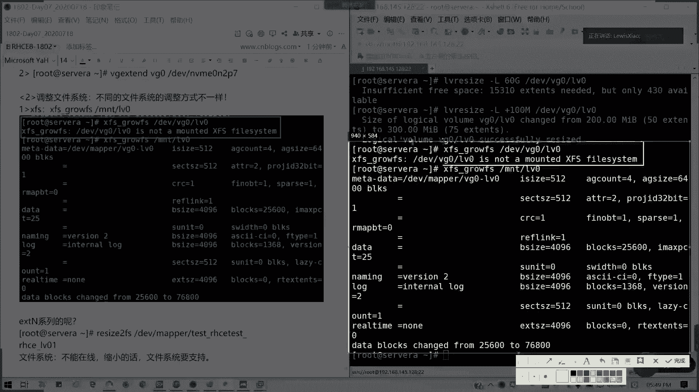
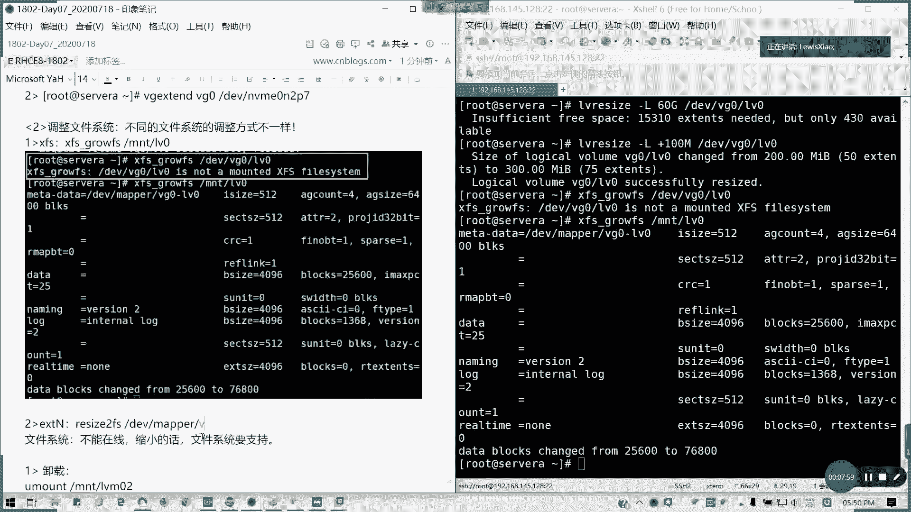

# 2021全新 RHCE8.0 红帽认证入门教程——可零基础入门学习【网络安全／Linux】 - P41：Day07_RH134_Ch07b_LVM调整 - IT老表哥 - BV1444y1h7Bx

好，在线扩容的话，我们来讲讲一下在线扩容的话其实就是在线啊。调整我们楼梯间的大小，对不对？调整大小的话，其实呢我们可以用一条命令叫LVreide啊LV。resize或是LV都可以。

exend是相当我们是通过是LV stand来做。LBresize也有这个命令啊。然后扩resize的话也可以，或是LV stand扩容的话，我们都可以。比如说我这里的话，我现在我这个B区是有空间的啊。

当是错之前。请先确认。所在。的微机。空间足够。对吧。所以我们。我们可以有两条命令啊，这个LVresize是一个命令。然后这里我们就那个BG。0LV0，假如说我要扩到200，我们上次创建100兆之后。

我会各换200，对不对？我用LVresize。杠L200MDVVG0LV0或是mpper也可以，对不对？这扩容我们还要去扩文件系统的啊。我们这里扩容的话还扩容就器LBresize，我们可以用LV。

Instead。也是一样的道理。增加嘛。或者是我可以用加。L对不对？加L100兆，就是说增加多少，对不对？增加多少，我们也可以同样用这条命令。我们可以用mle，对不对？Wejuing。L v0。懂吗？

两条命令我随便用一条都行。我们以前是习惯用LBin。如我们的VG的剩余空间。我的BG剩余空间不足以满足空满不足以满足需扩大需求的时候，不足以满足不满足扩容需求时候。那我们首先是要增加VG的大小，也就是。

创建新的PV，把PV加到VG里面，再去扩充我们的逻辑券大小，这个能理解吗？比如这里的话，我直接我扩到。六0G是吧，我明显不够的，对不对？那是不是我们要先去扩BG啊，在这里的话。

就相当于我们要VG stand，对不对？这里的话我们可以创建1个MVM10。比如说像。And那。P7啊，我这命令打上去，我这五步演示了啊，大家可以去自己去试验一下。然后VGexend。

我这里的是扩展为1个VG0。大致步骤啊。这是第一步而已啊。第一步。这仅仅是第一步，我们还要调整文件系统。由你扩大之后，你这块地你还没有审批，不能用，对不对？懂吗？这不能用。

那我们要还要扩大文件系统才可以啊。这扩大文件系统调整的话，这个第一个是调整LV大小。加100兆。我记得是杠。得吧。我试一下啊。也可以啊，是加100兆。没错啊。加100兆也是可以的啊。呃，断了吗？

网络断了啊，稍稍稍等一下。OK应该连连回来了，对吧？好。安娜P7。就假如我去算一个算1个NLRP7，对吧？我要创建，然后把它扩容起来，这个懂了吧？然后第二步我们要调整文件系统。

不同文件方式调整方式是不一样的啊。像比如我们的叉FS。type飞的话。我们用我们叉FS是不是用叉FSg FS就可以了。那我们记住这里是写挂载点，不是写我们的设备了。

比如说我直接写DVBG0LV0会出现怎么样？对吧它不是一个挂载的一个叉FS system。懂我意思吗？那好，我们把它我们改一下，它是要挂载的1个MNTVG0。那我们叫LV0，对不对？懂吗？懂了吧？

所以我们g叉FSg FS我们就写这个。

能们截个图啊？对ESE叉T系列的话，我们是要resize to FS啊。对于我们一E叉T我们linux扩展文件系统的话，就用resize to FS。然后DEVm或者是我用DEVB70LV0都可以啊。

比如说我这里的话，我我这里不是有1个E叉T的吗？对吧？LVin我同样用这我另外的命令杠L，我扩大200兆。DVVG0LVE。对吧。然后呢我这你size to FS。第一位。Maper。VG0LV1。

对吧这是对于E叉T的。那我们看一下我们的刚才的这个节一波操作的骚操作之后的结果，对不对？林波稍稍做这个结果，看一下是不是已经达到我们目的了。验证啊。懂了吧。扩容，那是人家有问啊。缩容可不可以啊？松容。

你要看一看你的文件系统是否支持。苏人为什么不能在线？我们系统送人不能在线的。为什么？那松隆的话，你砍掉一块，你知道万一再用怎么办，是吧？不能在线进行。且。文件系统要支持。还可以。比如说我们的。

注意叉FS就不支持缩容。叉FS不支持啊。E叉T4是可以。我们现现在讲一下E叉T4的一个。送文步骤。我现在要把它设为200兆啊缩为200兆。我第一步。我要先。卸载啊。我先卸载挂载点。

看我右边啊youmount，我要先卸载MNTLVE我要先卸载它，对吧？需要确保它的安全。UmountMNT的LVE。然后第二步我们要进行一个文件系统的检查。

E two FSCK啊E two FSCK这步一定要做，先做文件系统检查，看有没有问题，没有。那我们才可以缩小。对吧。检查有没有问题，我们才可以进行缩小。然后resize。先把文件系统先缩小，再把。

的逻辑就能缩小，因为你要把使用范围先缩小了嘛，但你要确定你的空间你是够你是没这一块，你缩用的空间你是没有使用的，懂我意思吗？先把文件系统先缩小了。我们是我们扩容是先扩逻辑，卷在扩文件就画蛋糕是吧？

再切多一块。然后你你把那个缩容，你要先把它缩掉DV。mpper我们的VG0。LV1。我现在是三3，我是200，我收一到100兆可不可以？作100兆。我还要说我还要说一下LV，我才挂载。我这也不做。

我为了保险了，我把LV也说了先。我的逻辑卷也把它缩掉。所以这里有叫离线收容啊，缩索LVLV。resize这也就不能用extend啦。resize。杠L我们只接说缩到100兆是吧？肯定要比它大于等于啊。

懂我意思吗？大于等于它容量不能比它小。1杯。VG0LV，然后他会提出一个警告是吧？北极可能会把你的文件系统破坏啊，但Y。对吧。这样就缩容就成功。然后我们再把我们再把它挂上去。重新挂载。但考试不会考缩容。

只会考扩容啊，因为太危险了。对不对？重新挂载我们帽子杠A到帽上去。我们看一下结果。是吧回到了93兆，对吗？这个能明白吗？都懂吧？苏荣谦。先把它弄掉。对吧。然后接然后接然后我们还要讲。

最后一个就是我们的这个是我们的离线收容。然后缩容的话，我们还有就是我们的那个如何去减少我们的PV跟VG啊。然后我们来讲一个第这是第四，这是那个在线扩容离线扩容啊。我们的文件系统调整。呃。

在线扩容离线收容。然后还有一个就是。接下第3个。第三个是我们的一个。可能稍微超一点点时间啊，缩小我们的。卷组。对吧比如说出短线阻，通常我们减少PV的数量。那怎么操作呢？比如说我现在两个批两个卷组是吧？

我要把那个。我先要把我的数据。先把已分配的PE我要移动到其他PP上去啊。先要首先我们要把要移动，对吧？我们要做一个完完善，是不是要把它移动，然后把它留空，我们才能删，我们才能。缩小。

我们这样才能把它移出去，对不对？首先要把我们的。已经分配的P1。的一个物理单元移到其余的P其余的PP上去。怎么移呢？比如说我这里我现在。VGS我是要把那个。我我要现在把呃我要把那个P5我我不要了，对吧？

我我就留个P6，那我们用PEVremove。KV move发移动DVMVME。0N2P5，然后移到P6上面，对不对？DVMVME0NRP5。移到屏B上去，然后MVM10N2P6。对吧。我要进行移动。

移动适配在线的。这要等一等啊。我是讲如何去那个缩缩小我们其他的啊，说讲完我们就下课了。必须要让他整个空间里面啊，就是说他我们移除里面没有内容，我们才能把它移除。稍微拖大家10分钟啊，最多十0分钟啊。好。

是吧我们移过去之后呢，我们就可以删除了。🎼叫VG reduceduce啊。第二个。做完就可以做第二步。8。PV E V MVM，E R。MVMVN2P5从。微距0。中移除。

对吧接下来做这一步叫做VGreuce。然后我要移错卷组是操作卷组是VG0，然后呢，移错卷组DVMVM10N2P5哎，打错了啊。就可以了。

然后我们在VGS看一看PBS看一看是不是只有MMVMV5是不是释放了。只有一个6了。他这里已经释放了，没有卷阻了。能明白。然后我们可以删除啊，就删除这删除的话。然后接下只要我们把PV删掉，释放空间。

删除啊释放。DVMVME0。2，P5。其实是删除我物理卷啊。删删除物理卷标记PV标记，其实删除标记而已，它不会删独分区啊，知道吧？PV remove。DVMVME0NP5。对吧。就可以了。

如果你后面加上for施强制执行。它只是去除了一个labels而已，它并不会删除分区啊。注意。并不会删除分区。好，接下来我们还有一种方法就直接。减少V，我看一下，直接减少那个容量。这里的话我看一下。

这是方法一啊。这方法一，然后如果方法。其实我看一下。其实一种的话，其实也如果还有一种的话，就是方法二的话，就直接减少VG的容量。直接减少VG容量呢，我们就直接用VG，然后。看一下V学哪个命令。

也是同样用reduce啊reduce，然后减少容量。然后再移除就可以了，是吧？原理啊。减少微椎容量。不缩小文件系统啊，减少微容量。然后呢。如果需要。将多余的PV进行移除。

这个留给大家最后做自己做一下课后的实验。然后呢。我看看要不要给几道题目给大家。我想想啊。只要题目是有的，今天还是得给一下题目。因为这个题目的话确实我们做的会比较多。来，我给给这一些练习题吧。

我在设位A上做啊，有1个AVME，然后大小为200。然后叉FS的格式化。然后还有我看一下还有题目。在C维上创建一个。512兆的外分区。好。还有。为您的系统啊，选择证券to配置级，并设置默认设置就可以了。

我们课后三道练习题，今晚留给大家。好，没有问题的，请扣歪。然后我们做一下练习。我们今晚做一下练习，明天我们稍微讲一讲可以吗？现在北京时间6点8分，那我们今天的啊今天的是今天的东西啊。

今天我们讲的东西全部到这里。然后呢，明天我们讲strs videoauto f我们的网络文件系统以及。就请明天相当于把我们所有的134的那本书讲完。明天照样还是7个小时，所以辛苦大家啊。

我们今天的我笔记现在我发发出来。视频的话，我可能明天一起发啊，我们今天先到这里，辛苦大家，各位啊，下课明天见。

