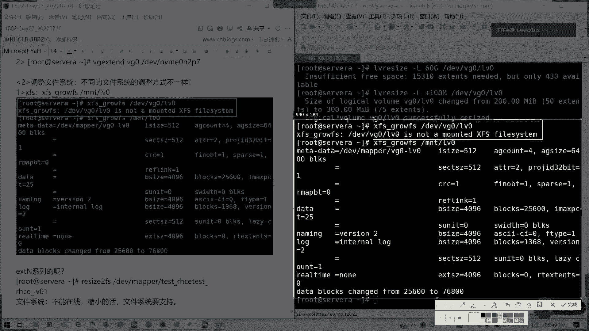
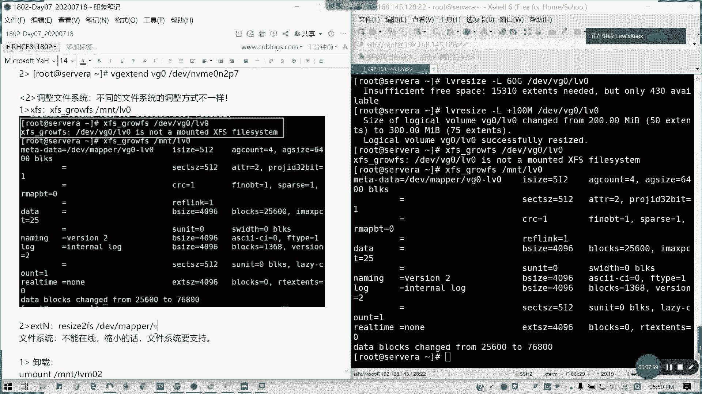

# LVM管理：07b：LVM在线扩容与离线缩容

在本节课中，我们将学习LVM（逻辑卷管理）的两个核心操作：在线扩容与离线缩容。你将了解如何安全地扩大或缩小逻辑卷及其文件系统，并掌握调整卷组大小的方法。

## 概述：在线扩容

上一节我们介绍了LVM的基本概念与创建。本节中我们来看看如何在线调整逻辑卷的大小，即“在线扩容”。在线扩容允许我们在不卸载文件系统的情况下，增加逻辑卷的容量。

### 扩容逻辑卷

在线扩容的核心是调整逻辑卷的大小。这可以通过 `lvextend` 或 `lvresize` 命令实现。以下是操作步骤：

1.  **确认卷组有足够空间**：在执行扩容前，必须确保所在的卷组（VG）拥有足够的剩余空间。
2.  **扩展逻辑卷**：使用命令增加逻辑卷的容量。

以下是具体命令示例。假设我们要将逻辑卷 `/dev/vg0/lv0` 从100M扩展到200M。

**方法一：使用 `lvresize` 指定目标大小**
```bash
lvresize -L 200M /dev/vg0/lv0
```

**方法二：使用 `lvextend` 指定增加量**
```bash
lvextend -L +100M /dev/vg0/lv0
```

### 扩展文件系统

仅扩展逻辑卷后，新增的空间还不能被操作系统使用，必须同步扩展其上的文件系统。不同文件系统的扩展命令不同。



**对于 XFS 文件系统**：使用 `xfs_growfs` 命令，参数是挂载点，而非设备路径。
```bash
xfs_growfs /mnt/vg0_lv0
```

**对于 EXT4 文件系统**：使用 `resize2fs` 命令，参数是设备路径。
```bash
resize2fs /dev/vg0/lv1
```



### 当卷组空间不足时

如果卷组（VG）的剩余空间不足以满足扩容需求，则需要先扩展卷组。这通常涉及创建新的物理卷（PV）并将其加入卷组。

以下是扩展卷组的大致步骤：
1.  创建新的分区并格式化为物理卷：`pvcreate /dev/nvme0n2p7`
2.  将新物理卷扩展到卷组：`vgextend vg0 /dev/nvme0n2p7`
3.  随后，再按上述步骤扩展逻辑卷和文件系统。

---

## 过渡到离线缩容

学会了在线扩容后，我们自然会想到能否缩小逻辑卷。与扩容不同，缩容操作通常**不能在线进行**，且必须确保文件系统本身支持缩容。

## 离线缩容步骤

缩容存在风险，因为需要“砍掉”已分配空间的一部分。操作前必须确保目标缩容后的空间大于已使用的数据量。请注意，**XFS文件系统不支持缩容**，而**EXT4文件系统支持**。

以下以EXT4文件系统为例，演示将逻辑卷从200M缩容至100M的步骤：

1.  **卸载文件系统**：首先卸载挂载点，确保数据安全。
    ```bash
    umount /mnt/lv1
    ```
2.  **检查文件系统**：对文件系统进行检查，确保没有错误。
    ```bash
    e2fsck -f /dev/vg0/lv1
    ```
3.  **缩小文件系统**：先缩小文件系统本身的使用范围。
    ```bash
    resize2fs /dev/vg0/lv1 100M
    ```
4.  **缩小逻辑卷**：最后缩小底层逻辑卷的容量。
    ```bash
    lvresize -L 100M /dev/vg0/lv1
    ```
5.  **重新挂载**：操作完成后，重新挂载文件系统。
    ```bash
    mount -a
    ```

> **注意**：缩容操作风险较高，实际生产环境中需谨慎操作，RHCE考试通常只考核扩容。

---

## 调整卷组大小

上一部分我们调整了逻辑卷，本节中我们来看看如何调整卷组的大小，通常指减少卷组中的物理卷（PV）。

### 从卷组中移除物理卷

若要从卷组中移除一个物理卷（例如 `/dev/nvme0n2p5`），必须确保该物理卷上没有任何已分配的数据（PE）。如果存有数据，需要先将其迁移到卷组内其他物理卷上。

以下是操作步骤：

1.  **迁移数据**：使用 `pvmove` 命令将数据从待移除的PV迁移到其他PV（例如 `/dev/nvme0n2p6`）。
    ```bash
    pvmove /dev/nvme0n2p5 /dev/nvme0n2p6
    ```
2.  **从卷组中移除PV**：数据迁移完毕后，使用 `vgreduce` 命令将该PV从卷组中移除。
    ```bash
    vgreduce vg0 /dev/nvme0n2p5
    ```
3.  **删除物理卷标记**：使用 `pvremove` 命令删除该设备的物理卷标签。此操作**不会删除分区本身**，仅移除LVM标记。
    ```bash
    pvremove /dev/nvme0n2p5
    ```

另一种方法是直接减少卷组的容量，这同样需要先确保目标PV上没有数据，原理与上述步骤类似。

---

## 课后练习

为了巩固本节课的知识，请完成以下三道练习题：

1.  在服务器A上，创建一个大小为200M的XFS格式逻辑卷并挂载使用。
2.  在服务器C上，创建一个大小为512M的交换分区。
3.  为您的系统配置一个合适的默认运行级别（target）。

---

## 总结

本节课中我们一起学习了LVM管理中的高级操作。我们掌握了如何对逻辑卷进行**在线扩容**，包括扩展逻辑卷本身和对应的XFS或EXT4文件系统。我们也了解了风险更高的**离线缩容**操作，明确了其步骤与前提条件。最后，我们学习了如何通过迁移数据来安全地**从卷组中移除物理卷**。这些技能对于灵活管理Linux服务器存储空间至关重要。