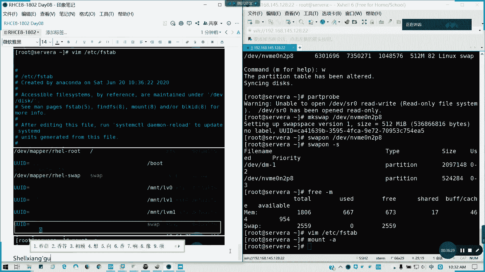

# 2021全新 RHCE8.0 红帽认证入门教程——可零基础入门学习【网络安全／Linux】 - P42：Day08_Day07课程回顾_练习讲解 - IT老表哥 - BV1444y1h7Bx

好的，我们开始啊。今天好像我先看一下那个。

39个人我先为了啊我们还是还是。什么叫做法外狂徒战伤是什么鬼啊？

我先记我们按照啊。正常的流程，我们先留个档先。反正没有改证明的，我一律就算没来哈。一日多上为他一日多上没来。

我说道那个张三张三是谁啊？这个人。我不清楚我就我就直接把它移出会议了啊。那好，我们张三是你手机。你改一下嘛，亲。都不改名的。我们看一下昨天的内容，昨天我们讲的什么？第一个我们的管理临时文件。

管理师文件夹，我这里的话只是讲了怎么自定义啊，自定义。其实就是靠的是TMP fast点D，对不对？TMP fast点D，然后我只要在里面有新建框文件，然后直接creA就可以了，懂我意思吗？

这个考试我们没太做太大的一个要求，我看了一下试题里面基本上没有啊，基本没有，就是我们的那个考，我我看的那个题库啊，基本上没有。然后呢，第三个我们讲的条约。第二个讲的条优。调优的话。to低对吧？

toD我们主要是将我们的列出的配置文件，然后呢命令呢。命令是to的ADM对不对？然后后面active profile对不对？我们结合这道题来讲。为您选择为你系统选择您的t配置啊，t配置。

然后呢并调设置默认。那我们可以吞一下t的ADM。Ative。当前是叫vitual gas对吧？然后我现在我看一下它的推荐设置，re commanded对吧？如果他有指定说改到哪里，那我们就改到哪里。

那如果就比如说当前不是vitual guest，然后我就那个profi，对吧？vitual guest。

就行了。这个就是我们完整的一个步骤啊。昨天其实我们演示也是过了，考试的话就差不多做这么多就够了。但你要确定一下你的那个 twin twin的那个服务有没有安装。

第3个。完件的ACL对吧？文件ACL这个我们已经讲过啊，讲过主要是如何。获取对吧？还有如何设置？对于它是主要是针对于特定用户特定组的一个控制权限，而不是针对于大类，懂我意思吗？不是对大类。

它是针对特定用户的，所以说考试必有必有这些题目的，我们上次已经有讲过啊，上次在第一本书已经有讲过，现在应该第八天了。如果。我们在第二版应该是我觉得我记得啊应该是在第二天的时候。

第二天第三天的时候我们讲的这个内容。所以的话如果不清楚不明白，麻烦大家回去看一下。这块内容这是。文件的ACL。讲了接下来讲了一个。SElinux对不对？那C那有什么？有一块端口上下，我们今天会讲啊。

另在讲我们现在主主第一个。S1064。三种模式。及切换方法。我们有个配置文件，对不对？如果你要直接改配，直接那个我们有临时切换。只限于inforcing。和。permissive之间。是吧。临时切换。

临时切换的话，两条命令。对吧seing force，然后再跟看一下。get in force看一下就知道了，然后永久切换。永久千万我们是不是改一个文件啦？改这行。对吧这一行的值。记住啊。从其他状态切。

切换到diable。明白我意思吧。从其他的两个状态切换到diable或者是diable切换到其他两个状态，必须要重启。对吧因为标因为主要是SE6ux标签的一个问题。但是你要生产环境的话。

很多人就直接把把S直接的diable掉，什么时候没有。对不对？这是我们讲的啊。第第一个。然后第二个我们讲安全性上安安全性上下文。安全性上下文。更改默认上下文的方法。SE manager。

S contest默认上下文，对不对？杠A添加杠T类型。然后这里的话。我这里我可以引号扩起啊，就是type。它的类型以杠T，以斜杠梯结尾下划线梯结尾。上面跟文件或目录。目录是带通费服的。对吧。

知道通病不什么意思吧？文件署文就这当前目录以下的所有文子文件和子目录全部生效。然后最后记得。还就是说还原它的默认上下文限制restore。com杠RV。两千换目录。然后呢，这个是零，这是这是我们的呃。

就是说我刚才问上家文，还有一个是那个。临时修改上下文。穿水抗。对吧太多度，然后或者是。或者是杠杠reference。参考文献或目录。目标文件。ほ络。那前面2345章就这样，如果明白的，请打个一啊。

前面三前面的4张2到5，然后接下来我们要讲第六章会会会那个我们回顾第六章。我们讲第第五个回顾点就是我们第六章。值班管理。首先我们的。分居工具有几个？我们讲了af disk。居于di。party对不对？

这party是比较比较难用的，要注意它的是那个起始跟结束区间，其他的还好。怎么方便怎么来啊。然后接下来我们的一个。基本分区的操作步骤。分区是吧。第一步分区。第二步。格式化是吧，也就是我们创建文件系统。

也就是我们在这里的。第二步。我俗称叫MKFS，对不对？这样清新吗？可以吧。可以吧？没没问题。这是基本分区的一个操作的一个步骤。从分区到格式化到临时挂载，到原久挂载。然后还有一个s。我们从。同样分区。

对吧。到MK我们先从4杠M开始。到分区。到MK42。The sweatball。对吧所分区。所谓分区就这么写。然后还有我们讲了1个LCM。我写一个类型上去啊，类型上去它是默认的。

LVM操作步骤首先还是分区。但是我们类型是叫8一的，昨天我们没讲啊，其实我们用默认的话也没问题。然后呢，分区后面。不是格式化，是PV。然后多个PB。我创建V区。对吧这个过程应该都知道啊。

这个过程中非常清楚。对吧。这样清楚吧。好，接下来我们讲。可能有1个LVM的。动态调整。扩容。在线扩容。首先暂线扩走。首先你要那个。确保建阻空间满足客客户要求之后呢，我们就LV。

ext或者叫做LVresize。对吧在线扩楼。知道吧？这个步骤先确认够不够空间对吧？先确认够不够空间，然后呢，我们再进行扩展逻辑线，然后最后记得扩展文件系统。然后缩溶成离线。首先。有帽。然后呢。

要进检查。我。LV reduce forLV resize。先缩小文件系统啊。这是离线缩容一个做法啊，先卸载，然后进行文件系统检查。当然你这前提的话，你的文件系统要支持像叉SS，就只能阔不能缩啊。

然后考试的话必有一题的啊必有一题的。所以这个所以的话有些人分的过大或怎么样，对吧？通常说你要扩容的话，你的卷组，你通常你要考试通常考扩容。然后扩容的话，你只要卷组，比如说一开始他要你看题目要求。

比如说500兆的话，我们卷组就做到600，他然后扩扩容700的话，我们卷子就做到800，做多一点。没事的啊，空间如果足够的话，做大一丢丢都没事，但是不要把全部都做了，然后一扩啊死了是吧？过头了。

那怎么说，要说要说坏操作错误的话，你把整个整个都影响掉了，所以的话这个太得不偿失，对吧？所以的话这种扩容的话。建议啊。略待于目标大小，这个是我刚才说的。好吧，我们VGS如果的就分预分配的时候。

我们要建议，比如说我的考试里面是不用你分配的，考试它他他已经有个卷土在里面了。对吧比如说他扩容，他比如说一个空间分区从500到扩到700，到，他卷子其实有预区的空间给你了。其实够的，如果不够的话。

我们再加加分区就行了。加那个加物理券就可以了。然后还有一个就是那个。微机收拢我们讲了一下是吧？移动整合PV。然后呢。移除空闲的PV就可以了。对吧。懂吗？这个是V区的收容，我们就讲的这三个。

那接下我们看一下两道题目，讲完我们休息啊。相信做文的话，你们都基本上都OK了。这实题目的话，我们昨天步骤就演示过了。然后呢，只不过今天我弄一下。咩时。扩容逻题券。在设5A上。

我们建本地的LVM一属属于逻逻辑组200兆是吧？长插XS然后挂载，然后它扩展500，对不对？那我们现在要先分区。

别看下当前是有56了，那我就创一个7吧。在这里要求500兆，那我就创建一个一G六够了。然后我们这里的话。它的那个文件类型我们可以改一下，叫8一。直接出发案一就行了。就直接转换成。直接转换成我们的LVR。

昨天好像我没步骤，但是没这个步骤，其实也可以，没有这太大问题。然后我们P完啊P完，我们再批一下。就是现在我们创建一个linMBM是吧？那我们到底有写助磁盘。然后呢，让那个读取part problem。

然后呢。LOK看一下有了。啊，这个就是物理卷。你自只需要这一个物理卷就行了。🎼对吧然后逻辑券创建。看到PBS就知道了。然后呢。位距一。哪个物理券创建的？卷组。对吧。

LV creator他要求是圈千穿的200兆。对吧。那我们直接ETCSSt。LBLKID。先看一下。考试的话，他一般会给直接给你一个分区了啊。FSt我们直接复制这串。然后接着我们创建一个挂载目录。

待会儿再创建。现在挂载之前我们说没关系啊。当后是叉FS。Default。那我们记得创建一个叫做MNTLME的目录。他呃应该是MKDR。帽子杠A。🎼为了截图啊，我先删掉。我们第一步已经先完成了。

然后这再扣着。这是步骤一啊步骤一步骤2扩容。先看一下VGS客物空间，剩800剩820兆。我的VG1。先扩先扩容逻辑券，再扩文件系统。错到500兆。然后再插FS。

因为它是叉FS文件系统的叉F grow FS。记得这里是写挂的点。然后呢，咱再验证一下。就扩大的这个范围的，495其是允许的。好，这道题如果可以会的话，打个一。昨天那些我先讲了哈。😊。

然后接下来我们讲第二部分啊，第二个题目。第二题目的话，swepe也是其实我做过的，就给大家一个练习啊，再去再做一个分区。我这512我就512就行了。分区类型T。然后呢。第八个分区。82。然后呢。

我们P一下。W保存来。那么接下来我。MK1。🎼对，先怕的 problem。好，MKSY。第V。MVME。🎼0N2P8。他UID也有啦，然后呢，我们s on。对吧我们错到259，原来是2048。然后呢。

写到ETCFSt里面。UID的上面已经有了。类型挂载到4万类型4万。选项默认。你你。好。报杠A就行了。这题明白，请打2。

步骤相当的清晰，相当清楚啊。然后是叔我们还留下几道练习，留下几道那所有的练习，我们讲一讲吧。

虽有相关练习，我顺便也讲一讲啊，这也是不做。因为昨天我时间关系没讲，但今天的话我会讲一讲。这里的话我们讲到第6个。

下谢相关练习。第一个。等差为数的4等差数为四的数列。对吧我们是不是有这道题？

怎么做呢？VIM我这里是。S四三01。并bush的机器。然后这里用forI in。多了，我直接用命令就可以了。用多了，我们命令是SAQ。2、起始位2部径为4，然后他的那个末末位50。ど。A口多了I。

然后大据脚本结束。

这道题第一题的结果。

这道题没有问题，请扣1。

给要把所有练习讲完才下课啊。我们这道题好像貌似讲过，所以我就不贴这里了啊。这道题讲过我们是不是有几个题都没讲，123我都讲了，还来看了一下第六天笔记，那我就写讲那个。4567吧，64567不讲456讲。

然后还有那个第九题我讲了没？我看一下。这道题好像我讲过了，所以我看第四。哦，456456978我不讲行吧，那我就改改成练习四吧。这个我就因为我当时我忘了一个次序啊，我们看下练习四，这个就不讲了。

就不再不再回顾了。我们看一下练习四。

换一个需要脚本实验一下功能，我要自动添加防火墙其规则。可以自己定义啊。添加规规则必须永久生效。来，我们看一看怎么做。我要添加。规则，那我们现在我就写1个SS04。是我们从键盘读取到read杠P。

Please， import the service now。🎼因为我们后面传舱有多了零多多了一多了二多了3，对不对？所以这个就我们就直接定一个变量就好了。它变量里面可以说是多个值的。

对吧然后 for I in。service snap就它是不变里面取值做一个循环度。我们先提示一段字echo。诶定。多了 I。Service。To firework CD。好。

fireworkCMD命令我们后面会再讲啊，fireworkCMD。Permanent。我们在今天就要讲防火墙了，先先讲一下就怎么添加服务AI的。servervice这。我们就不不放不放端口号了啊。

就不查端口号的，我们直直接放服务就可以了。到了。哎对吧。但然后全部做完之后，记得记得写去，发货。CMD。刚刚为肉。对吧。然后呢，我们执行一下，后面我们跟。04啊，这在输入我们几个服务，比如说我的那个。

SSHHTTP。还有coookoppe。有些已经有了，我就假设没有，我就这样添加，对不对？那这样的话，我们的脚本就已经完成了。

这也是我们练习的第四题，如果没有问题，请打4。有问题可以提问。

练习舞练习我们讲一讲练习舞。创建一个shall脚本，然后叫做back at users啊。

然后为系统设为A去创建本地用户啊，它是有一个用户列表的一个文件。然后呢，如果。没输入的话，就会给出提示信息。然后如果那个输入文件不存在，那就给出一个叫in and file并防相应的值。

然后我们sha要都是be forth，然后不需要设置密码。我们的实力在这里。那么现在就。我们说一个实力吧。我们就是啊先定一个名字叫user list。然后我们把用户名导进去。然后写剧写小板。TMP。

Back user。然后呢。我们现在用病拌水。因为他不是他不是后缀SSSH结尾的。等这。好像说他他就好像提示不了，那我们就我们就是那个是这样吧，我们当前录像的root吧。这样会好一点。没事啊。

只是换个名字，其他什么都没变。好，并不要识别机器。然后呢。首先我们要满足第一个要求，没有提供参数就会返回提示信息。那我们的是不是提供参数，后面各我们是不是可以用个数来统计啊？对不对？

个数统计是不是多了紧啊？多了减，如果等于0，那就说明我后面没参数。懂我意思吧？That。这第一个我们第一个条件Ale。luage他反正他什么提的信息，你就照书root。

back add users点SH。然后呢，返回个值，比如说它是那个后面没带参数的，是不是选择那个就是说不正常退出，我们选择一就可以了。对不对？他退出代码是不是有很多个？适当的一个参数啊，不要乱退啊。

FI然后写第二个条线就是文件不存在，文件不存在。我们是不是有一个针对于文件跟目录测试的？对吧稳定步录测试。那如果我们都了一，因为我们只提供一个参数。参数也就是我们的文件列表。我们的那个如果文件不存在。

那就我们文件存在是不是杠F是吧？多了一，但不能在我前面再加个非。感叹号不就可以了吗？对不对？文件我多了一这个文件这这个目标不存在，而且它不是一个就它是个文，它是存在，而且是文件，我们上面打上飞。懂了吧。

打算飞，那就是这个条件已经否定掉了。That。开口。幸铺。Fire， not fire。然后因为文件不存，我也那个命文文件不能在我们退出只是2，对不对？不不存在的命令和文件名嘛，对不对？

我们写的是不是这样？FI对吧？然后接下来我们个我们写主要循环题，就是围绕创建用户的这个循环题了。那否我们定一个变量叫user name。一。这里的话，因为我们的文件名是多了一。

那我们是不是开多了一把它列出来就行了。然后按照每一行每一行里面每一个它每一就把变量重复附于一个UC量里面，然后执行一个循环迭代复制。也在负值度杜什么呢？userad它不需要设置密码。

它只需要一个类型叫befor。对吧。要そね。然后我们这定出ID。就可以了。然后我想如果我想那个再完善一点，那我就直接。Cat EDC pass sub day。Great。对吧我把这一行列出来。

其实我也不用列ID了，我直接就这样就可以了。懂我意思吧？好，我们学完结束。我们看一下user list，看一下我们的脚板。

然后呢，我们开始执行。

所以要理解我们的。

我们到底的那个。我们这个任务断是要干嘛的？我写这些是要干嘛的？然后我现在来做一下测试FH。backus点SH比如说我这里什么都不输入，是吧？🎼然后呢，我输一个不存在文件名。

对吧然后我现在出入一个存在的user list会怎么样呢？好了吧。全都列出来了。

那这道题就讲到这里，明白的请扣5。

我上面好像没漏的截图是吧？

都截出一个脚，一个脚本，我把它截下来。

好，这是练习舞，我看看。有疑问的可以提出来。然后这里我们可以先讲一个练习九。练些酒我们在这里。

分支。练习9678，我不讲66的话，那个是可以，你可以做一个精细大人物，到时期待你们的作业啊。如果这边有的话，可以写一下。678，这几分是那个大作业来的。然后呢。

在45A上执行一个rootlinux点SH的脚本。然后其实很简单啊，我们来写一个case就行了。好，同样。Case。多了一就是我们后面输入的，我们那个本身命令是多了0，对不对？我多了一，我输入什么呢？

case多了一 in来，我们写分之。Rehead。Ele。三alno两个分号对不对？我们第一个分子写完。sentos第二个分第二个选第二个选项E。R hat。然后记得我们还有一个出口，就是其他非任意词。

Decle。Uage。就这样。然后后面。记得结尾ESAC。

678我们不讲哈，刚才说了。

这些暴理我给大家去思考一下，然后呢。好，我们来测试一下。什么都不说是吧？好，测试完毕。明白了，请答九，有疑问题例题。D678留给大家去做一个大思考啊。67我们的题题目678这个很实用。

但是这里因为时间关系我就不再讲了。这是第七个，你的堡垒金那个的话是一个大项目，报第八的一个机会环境部署。第六的话，你其实也可以做一个大项目来的。

这些题目呢留给大家一个思考啊。

这要做的话可以可以做几个小时或做几天的。解包累积是吧？今实上午我这边我可以把那个。把提示告诉大家，然后大家可以自己去想去做。我们涉及的一些参考要素已经列出来了。

那其实我就不应该不用再去做更精细的提示了吧。这一块的话留给大家去思考啊，678我就不再发答案了。那现在10点52分，我们11点10分回来讲那11点15分啊，之前我们回来讲那个我们的。第八章。啊。

我们红帽的一个新特性，strs，还有video考试会考video这道题。

